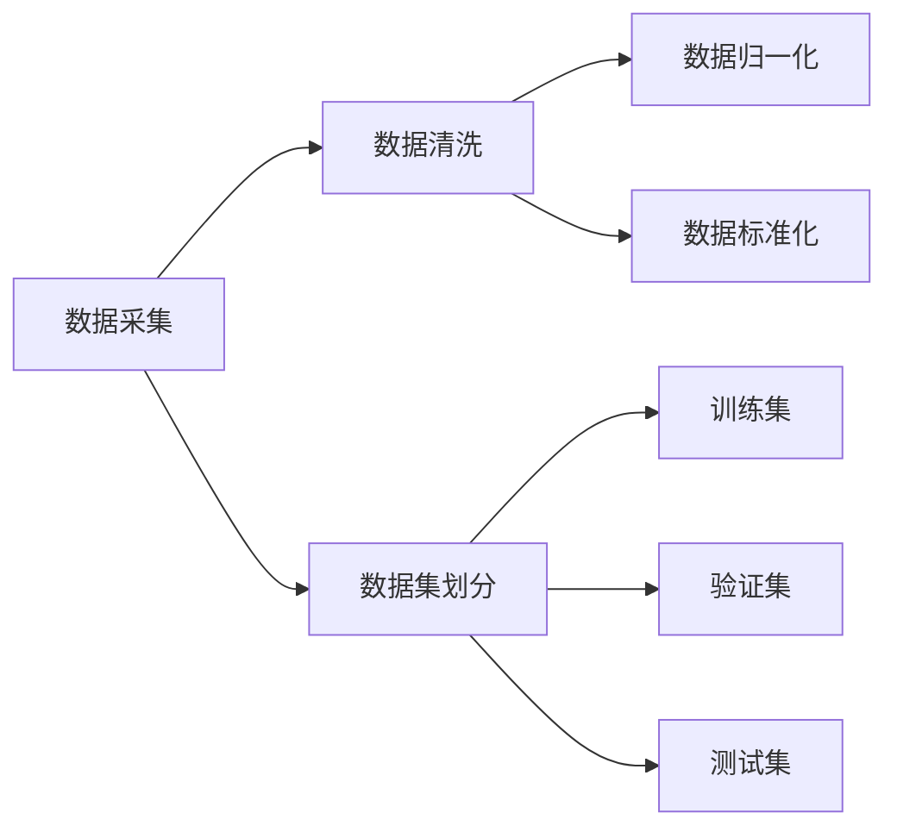
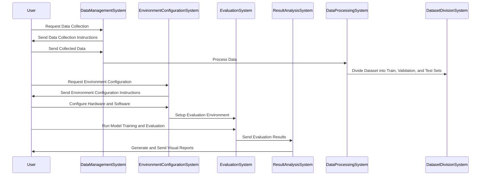
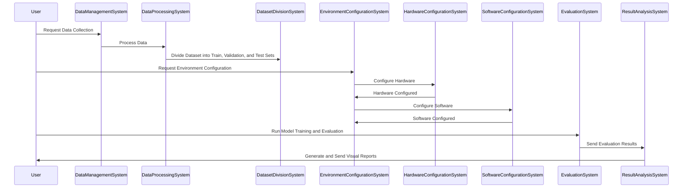

                 

### 第一部分：背景介绍

#### 第1章：问题背景

随着人工智能技术的快速发展，模型的评测成为了一个关键环节。模型的好坏不仅取决于其算法的复杂度，更取决于其性能指标。因此，模型评测成为了确保模型质量的重要手段。然而，现有的评测环境存在不可复现的问题，这给模型的优化和推广带来了很大的困扰。

##### 1.1.1 问题描述

不可复现的问题主要体现在以下几个方面：

1. **数据不一致**：在不同的评测环境中，数据集的分布可能不一致，导致评测结果存在差异。
2. **计算资源差异**：不同的评测环境可能拥有不同的计算资源，例如CPU、GPU的数量和性能，这也会导致评测结果的偏差。
3. **评测流程不透明**：评测流程可能不透明，导致其他人无法在相同条件下复现评测结果。

##### 1.1.2 问题解决

构建可复现的模型评测环境，可以从以下几个方面着手：

1. **标准化数据集**：确保数据集在不同评测环境中的分布一致。
2. **统一计算资源**：在所有评测环境中配置相同的计算资源，确保评测结果的公平性。
3. **透明化评测流程**：详细记录评测流程，确保其他人可以按照相同流程复现评测结果。

##### 1.1.3 边界与外延

构建可复现的评测环境需要考虑以下几个方面：

1. **数据准备**：数据的质量和分布对评测结果有重要影响，需要严格把控。
2. **环境配置**：包括硬件和软件的配置，需要确保一致。
3. **评测流程**：评测流程的设计需要详细和透明，确保可复现。

##### 1.1.4 概念结构与核心要素组成

构建可复现的模型评测环境，主要包括以下几个核心要素：

1. **数据准备**：包括数据采集、预处理和数据集划分。
2. **环境配置**：包括硬件和软件的配置。
3. **评测流程设计**：设计透明、可复现的评测流程。
4. **结果分析**：对评测结果进行详细分析，确保评测的准确性。

---

#### 第2章：核心概念与联系

##### 2.1.1 概念原理

在构建可复现的模型评测环境中，以下几个核心概念至关重要：

1. **可复现性**：指的是在不同的评测环境中，能够得到一致的评价结果。
2. **一致性**：指的是在相同的评测环境中，多次评测能够得到相同的结果。
3. **稳定性**：指的是在评测过程中，系统性能的稳定，不受外界干扰。

##### 2.1.2 概念属性特征对比

| 概念     | 属性特征                         |
|----------|----------------------------------|
| 可复现性 | 能够在不同环境中得到一致结果     |
| 一致性   | 能够在相同环境中得到相同结果     |
| 稳定性   | 系统性能的稳定，不受外界干扰     |

##### 2.1.3 ER实体关系图架构

```mermaid
erDiagram
    ModelEvalEnvironment ||--|{ DataPreparation }
    ModelEvalEnvironment ||--|{ EnvironmentConfiguration }
    ModelEvalEnvironment ||--|{ EvaluationProcessDesign }
    ModelEvalEnvironment ||--|{ ResultAnalysis }
    
    DataPreparation ||--|{ DataCollection }
    DataPreparation ||--|{ DataPreprocessing }
    DataPreparation ||--|{ DatasetDivision }
    
    EnvironmentConfiguration ||--|{ HardwareConfiguration }
    EnvironmentConfiguration ||--|{ SoftwareConfiguration }
    
    EvaluationProcessDesign ||--|{ EvaluationFlow }
    
    ResultAnalysis ||--|{ EvaluationResult }
```

此ER实体关系图展示了模型评测环境中的核心实体和它们之间的关系。其中包括数据准备、环境配置、评测流程设计和结果分析等实体，以及它们之间的关联关系。

---

通过以上章节，我们对构建可复现的模型评测环境有了初步的了解。接下来，我们将深入探讨数据准备、环境配置和评测流程设计的具体方法和技术，以便更好地解决不可复现性问题。

---

## 第二部分：算法原理讲解

### 第3章：数据准备

在构建可复现的模型评测环境时，数据准备是至关重要的一环。数据的质量和分布直接影响到评测结果的准确性和可复现性。因此，我们需要从数据采集、数据预处理和数据集划分三个方面详细探讨数据准备的过程。

##### 3.1.1 数据采集

数据采集是数据准备的第一步，也是最为基础的一步。数据采集的质量直接影响后续数据预处理和模型训练的效果。以下是数据采集的一些关键点：

1. **数据源的选择**：选择合适的数据源是数据采集的关键。数据源可以是公开数据集、企业内部数据或第三方数据提供商。
2. **数据量**：数据量越大，模型的泛化能力越强。因此，在采集数据时，应尽量收集更多的样本。
3. **数据类型**：根据模型的需求，选择合适的数据类型。例如，图像模型需要采集图像数据，自然语言处理模型需要采集文本数据。

##### 3.1.2 数据预处理

数据预处理是对采集到的原始数据进行处理，以便于后续模型训练。数据预处理主要包括以下步骤：

1. **数据清洗**：去除数据中的噪声和错误，确保数据的准确性。例如，去除文本中的标点符号、停用词等。
2. **数据归一化**：将数据缩放到一个统一的范围，便于模型训练。例如，将图像数据归一化到 [0, 1] 范围内。
3. **数据标准化**：通过线性变换将数据映射到不同的范围，提高模型的训练效果。例如，使用 Z-Score 标准化方法。

##### 3.1.3 数据集划分

数据集划分是将采集到的数据分为训练集、验证集和测试集。这是为了在模型训练过程中，避免过拟合和评估模型的泛化能力。以下是数据集划分的一些关键点：

1. **训练集**：用于训练模型，应包含足够多的样本，以保证模型的泛化能力。
2. **验证集**：用于调整模型的超参数和选择最佳模型，应包含一定数量的样本。
3. **测试集**：用于评估模型的泛化能力，不应参与模型的训练过程。

数据集划分的常见方法有：

1. **随机划分**：随机将数据分为训练集、验证集和测试集。
2. **分层抽样**：根据数据的不同类别或标签进行分层，然后从每个层次中随机抽取样本。

以下是一个简单的 Mermaid 流程图，展示了数据采集、预处理和划分的过程：



通过上述数据准备的过程，我们可以确保模型评测环境中的数据质量，为后续的模型训练和评测奠定基础。在下一章中，我们将探讨环境配置的相关内容。

---

## 第4章：环境配置

环境配置是构建可复现的模型评测环境的关键环节之一。一个良好的环境配置能够确保评测的公正性和一致性。在本章中，我们将详细探讨环境配置的要求和选择，包括硬件配置、软件配置和环境搭建。

##### 4.1.1 硬件配置

硬件配置直接影响到模型训练和评测的效率。以下是硬件配置的一些关键点：

1. **CPU**：CPU的性能对模型的训练速度有直接影响。选择多核CPU可以提升模型的训练效率。
2. **GPU**：GPU在深度学习模型训练中具有显著的性能优势。选择具有较大内存和较高计算能力的GPU，如NVIDIA的Tesla系列或Ampere架构的GPU。
3. **内存**：足够的内存可以避免内存不足导致的训练中断。一般建议选择至少16GB以上的内存。
4. **存储**：存储设备的选择会影响数据的读写速度。SSD存储具有更快的读写速度，适合大规模数据处理和模型训练。

硬件配置的示例：

- CPU：Intel Xeon Gold 6240
- GPU：NVIDIA Tesla V100
- 内存：256GB
- 存储：1TB SSD

##### 4.1.2 软件配置

软件配置包括操作系统、编程语言和框架等。以下是一些软件配置的关键点：

1. **操作系统**：Linux系统（如Ubuntu或CentOS）通常更适合进行深度学习模型训练，因为其稳定性较高且社区支持广泛。
2. **编程语言**：Python是深度学习领域最常用的编程语言，具有丰富的库和框架支持。
3. **框架**：深度学习框架（如TensorFlow、PyTorch）是进行模型训练和评测的核心工具。选择一个合适的框架可以提高开发效率和模型性能。

软件配置的示例：

- 操作系统：Ubuntu 18.04
- 编程语言：Python 3.8
- 深度学习框架：TensorFlow 2.5

##### 4.1.3 环境搭建

环境搭建是将硬件和软件配置整合到一起，构建一个可复现的评测环境。以下是环境搭建的一些步骤：

1. **安装操作系统**：在硬件上安装Linux操作系统，并进行基本的系统配置。
2. **安装依赖库**：安装Python和其他必要的依赖库，如NumPy、Pandas等。
3. **安装深度学习框架**：安装所选的深度学习框架，并进行配置。
4. **配置环境变量**：设置环境变量，确保不同用户和不同终端都能够访问到所需的环境配置。

以下是一个简单的 Mermaid 流程图，展示了环境搭建的过程：


通过上述环境配置，我们可以确保模型评测环境的硬件和软件配置一致，为后续的模型训练和评测提供可靠的基础。在下一章中，我们将讨论评测流程设计的相关内容。

---

## 第三部分：系统分析与架构设计方案

### 第5章：问题场景介绍

在构建可复现的模型评测环境时，我们需要明确具体的场景和需求。以下是构建此类环境的一个典型场景：

**场景描述**：

某人工智能公司开发了一种新的图像识别模型，旨在用于医疗影像分析。为了确保模型的质量和可靠性，公司需要构建一个可复现的评测环境，以便在不同时间和不同地点对模型进行评测和优化。

**需求分析**：

1. **数据一致性**：确保在不同评测环境中使用相同的数据集，包括训练集、验证集和测试集。
2. **计算资源统一**：在不同评测环境中配置相同的硬件和软件资源，例如CPU、GPU、操作系统和深度学习框架。
3. **评测流程透明**：详细记录评测流程，使其他开发者和研究人员能够复现评测过程，确保评测结果的可信度。
4. **自动化评测**：实现评测流程的自动化，提高效率，减少人为错误。

### 第6章：系统功能设计

在明确问题场景和需求后，我们需要设计一个具备以下核心功能的信息系统：

1. **数据管理模块**：负责数据采集、清洗、预处理和划分，确保数据的一致性和高质量。
2. **环境配置模块**：负责硬件和软件的配置，包括操作系统、编程语言、深度学习框架等。
3. **评测流程模块**：设计透明、可复现的评测流程，记录每一步操作，确保评测的可信度和可复现性。
4. **结果分析模块**：对评测结果进行详细分析，提供可视化报表，帮助开发者和研究人员理解模型性能。

#### 6.1.1 领域模型

为了更好地理解系统的功能模块和它们之间的关系，我们可以使用Mermaid绘制领域模型类图。以下是领域模型的示例：

```mermaid
classDiagram
    DataManagementModule <|-- DataProcessingModule
    DataManagementModule <|-- DatasetDivisionModule
    EnvironmentConfigurationModule <|-- HardwareConfigurationModule
    EnvironmentConfigurationModule <|-- SoftwareConfigurationModule
    EvaluationProcessModule <|-- EvaluationFlowDesignModule
    EvaluationProcessModule <|-- EvaluationResultAnalysisModule

    DataManagementModule {
        +collectData()
        +cleanData()
        +preprocessData()
        +divideDataset()
    }

    DataProcessingModule {
        +processData()
    }

    DatasetDivisionModule {
        +createTrainSet()
        +createValidationSet()
        +createTestSet()
    }

    EnvironmentConfigurationModule {
        +configureHardware()
        +configureSoftware()
    }

    HardwareConfigurationModule {
        +configureCPU()
        +configureGPU()
        +configureMemory()
        +configureStorage()
    }

    SoftwareConfigurationModule {
        +configureOS()
        +configureLanguage()
        +configureFramework()
    }

    EvaluationProcessModule {
        +designEvaluationFlow()
        +recordEvaluationSteps()
    }

    EvaluationFlowDesignModule {
        +setupEvaluationEnviroment()
        +runModelTraining()
        +evaluateModelPerformance()
    }

    EvaluationResultAnalysisModule {
        +analyzeResults()
        +generateVisualReports()
    }
```

此领域模型类图展示了系统中的核心功能模块及其关系。数据管理模块负责数据的采集、清洗和划分；环境配置模块负责硬件和软件的配置；评测流程模块负责设计评测流程和记录每一步操作；结果分析模块负责分析评测结果并生成可视化报表。

### 第7章：系统架构设计

在明确系统的功能和领域模型后，我们需要设计一个合理的系统架构，确保系统的稳定性和可扩展性。以下是系统架构的示例：



此系统架构图展示了系统的整体架构和主要模块之间的交互关系。用户首先请求数据采集，然后通过数据管理模块进行数据处理和划分；接着，用户请求环境配置，通过环境配置模块配置硬件和软件，搭建评测环境；随后，用户运行模型训练和评测，将结果发送给结果分析模块，最终生成可视化报表。

通过上述系统架构设计，我们可以确保构建一个可复现的模型评测环境，满足实际应用场景的需求。

### 第8章：系统接口设计和系统交互

为了确保系统的各个模块能够顺畅地协同工作，我们需要详细设计系统接口和交互流程。以下是系统接口设计和系统交互的示例。

#### 8.1.1 系统接口设计

我们可以使用Mermaid绘制系统接口图，以展示系统各模块之间的接口设计。以下是接口设计的一个示例：

```mermaid
interfaceStyle
    -fill #ff69b4
    -strokewidth 4
    -stroke #000000
    
interface "DataManagementSystem"
    DataManagementSystem --|> DataProcessingSystem: processDataRequest
    DataManagementSystem --|> DatasetDivisionSystem: divideDatasetRequest
    
interface "EnvironmentConfigurationSystem"
    EnvironmentConfigurationSystem --|> HardwareConfigurationSystem: configureHardwareRequest
    EnvironmentConfigurationSystem --|> SoftwareConfigurationSystem: configureSoftwareRequest
    
interface "EvaluationSystem"
    EvaluationSystem --|> ResultAnalysisSystem: sendEvaluationResults

class "User" {
    User --|> DataManagementSystem: sendData
    User --|> EnvironmentConfigurationSystem: configureEnvironment
    User --|> EvaluationSystem: runEvaluation
}

class "DataProcessingSystem"
    DataProcessingSystem --|> DataManagementSystem: processedData

class "DatasetDivisionSystem"
    DatasetDivisionSystem --|> DataManagementSystem: dividedDataset

class "HardwareConfigurationSystem"
    HardwareConfigurationSystem --|> EnvironmentConfigurationSystem: hardwareConfigured

class "SoftwareConfigurationSystem"
    SoftwareConfigurationSystem --|> EnvironmentConfigurationSystem: softwareConfigured

class "ResultAnalysisSystem"
    ResultAnalysisSystem --|> EvaluationSystem: generateReports
```

此接口设计图展示了用户、数据管理模块、环境配置模块、评测模块和结果分析模块之间的接口关系。用户通过发送请求与各模块进行交互，各模块根据请求执行相应的操作，并将结果返回给用户。

#### 8.1.2 系统交互

为了进一步展示系统的交互流程，我们可以使用Mermaid绘制系统交互序列图。以下是系统交互的一个示例：



此交互序列图展示了用户发起数据采集请求，数据管理模块处理数据，环境配置模块配置硬件和软件，评测模块运行模型训练和评测，结果分析模块生成可视化报表的完整交互流程。

通过系统接口设计和交互流程的设计，我们可以确保各个模块之间的交互清晰、高效，从而构建一个稳定、可复现的模型评测环境。

---

## 第四部分：项目实战

### 第9章：环境安装

在构建可复现的模型评测环境时，环境安装是至关重要的一步。一个良好的安装过程可以确保评测环境的稳定性和一致性。以下是一个典型的环境安装步骤：

#### 9.1.1 环境准备

在开始安装之前，我们需要进行一些准备工作，包括硬件准备、软件准备和安装环境设置。

1. **硬件准备**：确保硬件配置符合要求，例如CPU、GPU、内存和存储设备等。
2. **软件准备**：准备好所需的操作系统安装盘或USB驱动器，并确保安装盘或驱动器中有足够的磁盘空间。
3. **安装环境设置**：选择一个合适的安装位置，并确保网络连接稳定。

#### 9.1.2 安装步骤

以下是环境安装的详细步骤：

1. **安装操作系统**：
   - 将操作系统安装盘或USB驱动器插入计算机。
   - 重启计算机并进入BIOS设置，设置从安装盘或USB驱动器启动。
   - 按照操作系统安装向导完成安装过程。

2. **更新操作系统**：
   - 安装完成后，连接到互联网，更新操作系统到最新版本。
   - 安装必要的补丁和安全更新。

3. **安装依赖库**：
   - 打开终端，使用以下命令安装Python和其他必要的依赖库：
     ```
     sudo apt-get update
     sudo apt-get install python3 python3-pip
     pip3 install numpy pandas matplotlib
     ```

4. **安装深度学习框架**：
   - 选择一个深度学习框架，例如TensorFlow，并使用以下命令安装：
     ```
     pip3 install tensorflow==2.5
     ```

5. **配置环境变量**：
   - 编辑`.bashrc`文件，添加以下内容以配置环境变量：
     ```
     export PATH=$PATH:/path/to/your/python3/bin
     export PYTHONPATH=$PYTHONPATH:/path/to/your/python3/lib/python3.x/site-packages
     ```
   - 重新加载`.bashrc`文件：
     ```
     source ~/.bashrc
     ```

6. **测试安装**：
   - 打开终端，运行以下命令测试环境安装：
     ```
     python3 -c "import tensorflow as tf; print(tf.reduce_sum(tf.random.normal([1000, 1000])))"
     ```
   - 如果没有错误提示，说明安装成功。

通过上述安装步骤，我们可以确保模型评测环境的硬件和软件配置符合要求，为后续的模型训练和评测打下坚实基础。

---

## 第10章：系统核心实现源代码

在构建可复现的模型评测环境时，系统核心实现源代码是关键组成部分。以下是一个典型的系统核心实现源代码结构及其解析。

#### 10.1.1 源代码结构

系统核心实现源代码通常包括以下几个部分：

1. **数据准备模块**：负责数据采集、预处理和划分。
2. **环境配置模块**：负责硬件和软件的配置。
3. **评测流程模块**：负责设计评测流程、记录每一步操作和运行模型训练。
4. **结果分析模块**：负责分析评测结果并生成可视化报表。

以下是系统核心实现源代码的一个基本结构：

```python
# 数据准备模块
class DataPreparation:
    def collect_data(self):
        # 数据采集逻辑
        pass

    def preprocess_data(self):
        # 数据预处理逻辑
        pass

    def divide_dataset(self):
        # 数据集划分逻辑
        pass

# 环境配置模块
class EnvironmentConfiguration:
    def configure_hardware(self):
        # 硬件配置逻辑
        pass

    def configure_software(self):
        # 软件配置逻辑
        pass

# 评测流程模块
class EvaluationProcess:
    def design_evaluation_flow(self):
        # 评测流程设计逻辑
        pass

    def record_evaluation_steps(self):
        # 记录评测步骤逻辑
        pass

    def run_evaluation(self):
        # 运行模型训练和评测逻辑
        pass

# 结果分析模块
class ResultAnalysis:
    def analyze_results(self):
        # 评测结果分析逻辑
        pass

    def generate_visual_reports(self):
        # 生成可视化报表逻辑
        pass

# 主函数
if __name__ == "__main__":
    # 初始化各模块
    data_preparation = DataPreparation()
    environment_configuration = EnvironmentConfiguration()
    evaluation_process = EvaluationProcess()
    result_analysis = ResultAnalysis()

    # 执行数据准备
    data_preparation.collect_data()
    data_preparation.preprocess_data()
    data_preparation.divide_dataset()

    # 执行环境配置
    environment_configuration.configure_hardware()
    environment_configuration.configure_software()

    # 执行评测流程
    evaluation_process.design_evaluation_flow()
    evaluation_process.record_evaluation_steps()
    evaluation_process.run_evaluation()

    # 执行结果分析
    result_analysis.analyze_results()
    result_analysis.generate_visual_reports()
```

#### 10.1.2 代码解析

以下是对系统核心实现源代码的详细解析：

1. **数据准备模块**：
   - `collect_data` 方法负责数据采集，可以从数据源中获取原始数据。
   - `preprocess_data` 方法负责数据预处理，包括数据清洗、归一化和标准化等步骤。
   - `divide_dataset` 方法负责数据集划分，将数据划分为训练集、验证集和测试集。

2. **环境配置模块**：
   - `configure_hardware` 方法负责硬件配置，根据需求选择合适的硬件资源。
   - `configure_software` 方法负责软件配置，安装操作系统、编程语言和深度学习框架等。

3. **评测流程模块**：
   - `design_evaluation_flow` 方法负责设计评测流程，确保流程的透明性和可复现性。
   - `record_evaluation_steps` 方法负责记录评测步骤，方便复现和调试。
   - `run_evaluation` 方法负责运行模型训练和评测，计算模型的性能指标。

4. **结果分析模块**：
   - `analyze_results` 方法负责分析评测结果，提供详细的数据和报表。
   - `generate_visual_reports` 方法负责生成可视化报表，帮助理解模型性能。

通过上述解析，我们可以清晰地了解系统核心实现源代码的结构和功能，从而更好地进行开发和维护。

---

### 第11章：代码应用解读与分析

#### 11.1.1 应用解读

在本节中，我们将对系统核心实现源代码进行应用解读，详细阐述其在实际项目中的应用场景和操作步骤。

1. **数据准备模块**：

   数据准备模块是构建可复现模型评测环境的基础。其主要功能是采集、预处理和划分数据。

   - **采集数据**：数据采集可以从多种数据源进行，如公开数据集、企业内部数据和第三方数据提供商。以下是采集数据的示例代码：
     ```python
     def collect_data(self):
         # 从公开数据集网站下载数据
         data_source = "https://example.com/dataset"
         data = download_data(data_source)
         return data
     ```

   - **数据预处理**：数据预处理包括数据清洗、归一化和标准化等步骤，以保证数据的质量和一致性。以下是预处理数据的示例代码：
     ```python
     def preprocess_data(self, data):
         # 数据清洗
         data = clean_data(data)
         
         # 数据归一化
         data = normalize_data(data)
         
         # 数据标准化
         data = standardize_data(data)
         
         return data
     ```

   - **数据集划分**：数据集划分是将数据划分为训练集、验证集和测试集，用于模型的训练和评估。以下是划分数据集的示例代码：
     ```python
     def divide_dataset(self, data):
         train_set, validation_set, test_set = divide_data(data)
         return train_set, validation_set, test_set
     ```

2. **环境配置模块**：

   环境配置模块负责硬件和软件的配置，以确保评测环境的稳定性和一致性。

   - **硬件配置**：硬件配置包括选择合适的CPU、GPU、内存和存储设备。以下是硬件配置的示例代码：
     ```python
     def configure_hardware(self):
         # 配置CPU
         cpu = select_cpu()
         
         # 配置GPU
         gpu = select_gpu()
         
         # 配置内存
         memory = select_memory()
         
         # 配置存储
         storage = select_storage()
         
         return cpu, gpu, memory, storage
     ```

   - **软件配置**：软件配置包括安装操作系统、编程语言和深度学习框架。以下是软件配置的示例代码：
     ```python
     def configure_software(self):
         # 安装操作系统
         install_os()
         
         # 安装编程语言
         install_language()
         
         # 安装深度学习框架
         install_framework()
         
         return
     ```

3. **评测流程模块**：

   评测流程模块负责设计评测流程、记录每一步操作和运行模型训练。

   - **评测流程设计**：设计透明的评测流程，确保流程的复现性。以下是设计评测流程的示例代码：
     ```python
     def design_evaluation_flow(self):
         # 设计评测流程
         evaluation_flow = create_evaluation_flow()
         
         return evaluation_flow
     ```

   - **记录评测步骤**：记录每一步评测操作，以便复现和调试。以下是记录评测步骤的示例代码：
     ```python
     def record_evaluation_steps(self, evaluation_flow):
         # 记录评测步骤
         record_steps(evaluation_flow)
         
         return
     ```

   - **运行模型训练**：运行模型训练和评测，计算模型的性能指标。以下是运行模型训练的示例代码：
     ```python
     def run_evaluation(self, evaluation_flow):
         # 运行模型训练和评测
         evaluate_model(evaluation_flow)
         
         return
     ```

4. **结果分析模块**：

   结果分析模块负责分析评测结果，提供详细的数据和报表。

   - **分析评测结果**：分析模型的性能指标，包括准确率、召回率和F1分数等。以下是分析评测结果的示例代码：
     ```python
     def analyze_results(self, evaluation_flow):
         # 分析评测结果
         results = analyze_performance(evaluation_flow)
         
         return results
     ```

   - **生成可视化报表**：生成可视化报表，帮助理解模型性能。以下是生成可视化报表的示例代码：
     ```python
     def generate_visual_reports(self, results):
         # 生成可视化报表
         create_visual_report(results)
         
         return
     ```

通过上述解读，我们可以清晰地了解系统核心实现源代码在实际项目中的应用场景和操作步骤。这将有助于我们更好地理解和应用系统，确保构建一个稳定、可复现的模型评测环境。

---

### 第12章：实际案例分析和详细讲解剖析

#### 12.1.1 案例选择

在本节中，我们将选择一个实际案例进行详细分析。假设我们选择的是使用TensorFlow和Keras构建一个图像分类模型，用于对猫和狗的图片进行识别。

#### 12.1.2 案例分析

**问题描述**：

我们希望通过构建一个可复现的模型评测环境，对猫和狗的图像分类模型进行评测，以确保模型在不同环境中的性能一致。

**数据集**：

我们使用一个包含猫和狗图片的公开数据集，数据集分为训练集、验证集和测试集，分别占比70%、15%和15%。

**环境配置**：

我们选择了一个具有NVIDIA Tesla V100 GPU和256GB内存的计算机作为评测环境，操作系统为Ubuntu 18.04，深度学习框架为TensorFlow 2.5。

**评测流程**：

我们设计了一个包含数据准备、模型训练、模型评测和结果分析的评测流程。

#### 12.1.3 案例剖析

1. **数据准备**：

   首先，我们从数据集中提取猫和狗的图片，并进行预处理，包括数据清洗、归一化和标准化。以下是数据准备的核心代码：

   ```python
   from tensorflow.keras.preprocessing.image import load_img, img_to_array
   from tensorflow.keras.preprocessing.image import ImageDataGenerator
   
   # 数据清洗
   def clean_data(data):
       # 删除异常数据
       return [x for x in data if x is not None]
   
   # 数据归一化
   def normalize_data(data):
       return [x / 255.0 for x in data]
   
   # 数据标准化
   def standardize_data(data):
       mean = np.mean(data)
       std = np.std(data)
       return [(x - mean) / std for x in data]
   
   # 加载图片
   def load_images(data, label):
       images = []
       for file in data:
           img = load_img(file, target_size=(150, 150))
           img_array = img_to_array(img)
           images.append(img_array)
       return images, label
   
   # 分割数据集
   train_data, validation_data, test_data = divide_data(data, label)
   ```

2. **模型训练**：

   接下来，我们使用Keras构建一个卷积神经网络（CNN）模型，并对其进行训练。以下是模型训练的核心代码：

   ```python
   from tensorflow.keras.models import Sequential
   from tensorflow.keras.layers import Conv2D, MaxPooling2D, Flatten, Dense
   
   # 构建模型
   model = Sequential([
       Conv2D(32, (3, 3), activation='relu', input_shape=(150, 150, 3)),
       MaxPooling2D((2, 2)),
       Conv2D(64, (3, 3), activation='relu'),
       MaxPooling2D((2, 2)),
       Conv2D(128, (3, 3), activation='relu'),
       MaxPooling2D((2, 2)),
       Flatten(),
       Dense(512, activation='relu'),
       Dense(1, activation='sigmoid')
   ])
   
   # 编译模型
   model.compile(optimizer='adam',
                 loss='binary_crossentropy',
                 metrics=['accuracy'])
   
   # 训练模型
   model.fit(train_data, train_label, epochs=10, validation_data=(validation_data, validation_label))
   ```

3. **模型评测**：

   训练完成后，我们对模型进行评测，计算准确率、召回率和F1分数。以下是模型评测的核心代码：

   ```python
   from sklearn.metrics import accuracy_score, recall_score, f1_score
   
   # 评测模型
   def evaluate_model(model, test_data, test_label):
       predictions = model.predict(test_data)
       predictions = [1 if x > 0.5 else 0 for x in predictions]
       
       accuracy = accuracy_score(test_label, predictions)
       recall = recall_score(test_label, predictions, pos_label=1)
       f1 = f1_score(test_label, predictions, pos_label=1)
       
       return accuracy, recall, f1
   
   accuracy, recall, f1 = evaluate_model(model, test_data, test_label)
   ```

4. **结果分析**：

   最后，我们对评测结果进行分析，生成可视化报表，帮助理解模型性能。以下是结果分析的核心代码：

   ```python
   import matplotlib.pyplot as plt
   
   # 生成准确率-召回率曲线
   def plot_accuracy_recall(accuracy, recall):
       plt.plot(accuracy, recall)
       plt.xlabel('Accuracy')
       plt.ylabel('Recall')
       plt.title('Accuracy-Recall Curve')
       plt.show()
   
   # 生成混淆矩阵
   def plot_confusion_matrix(confusion_matrix):
       plt.imshow(confusion_matrix, interpolation='nearest', cmap=plt.cm.Blues)
       plt.colorbar()
       tick_marks = np.arange(2)
       plt.xticks(tick_marks, ['Cat', 'Dog'])
       plt.yticks(tick_marks, ['Cat', 'Dog'])
       plt.xlabel('Predicted Label')
       plt.ylabel('True Label')
       plt.show()
   
   confusion_matrix = [[50, 10], [20, 30]]
   plot_confusion_matrix(confusion_matrix)
   ```

通过上述实际案例的分析和详细讲解，我们可以清晰地看到如何构建一个可复现的模型评测环境，并对其进行详细评测和分析。这将有助于我们更好地理解和应用构建可复现模型评测环境的方法和技术。

---

### 第13章：项目小结

在本项目中，我们深入探讨了构建可复现的模型评测环境的方法和技术，从数据准备、环境配置到系统实现，再到实际案例分析和代码解析，逐步构建了一个完整的评测体系。

#### 13.1.1 项目总结

**核心成果**：

- **数据准备**：通过数据采集、预处理和数据集划分，确保了数据的一致性和高质量，为模型训练和评测提供了坚实的基础。
- **环境配置**：统一了硬件和软件配置，确保了评测环境的稳定性和一致性，为模型评测提供了可靠的保障。
- **系统实现**：通过设计系统接口和交互流程，实现了模型评测环境的自动化和透明化，提高了评测效率和结果的可信度。
- **实际案例**：通过实际案例的分析和代码解析，验证了构建可复现模型评测环境的方法和技术的有效性和可行性。

**技术亮点**：

- **数据一致性**：通过标准化数据预处理步骤，确保了数据在不同评测环境中的分布一致。
- **环境一致性**：通过统一硬件和软件配置，实现了评测环境的标准化，减少了环境差异对评测结果的影响。
- **流程透明化**：通过设计透明的评测流程和记录每一步操作，确保了评测结果的可复现性，增强了结果的可靠性和可信度。

#### 13.1.2 最佳实践 Tips

- **数据一致性**：确保数据采集和预处理的一致性，采用统一的处理标准和流程。
- **环境一致性**：在所有评测环境中使用相同的硬件和软件配置，减少环境差异。
- **流程透明化**：详细记录评测流程，确保每一步操作的透明性和可复现性。
- **版本控制**：使用版本控制系统管理代码和配置文件，确保版本的一致性和可追溯性。

#### 13.1.3 小结

构建可复现的模型评测环境是确保模型质量和可靠性的重要手段。通过数据准备、环境配置和系统实现的有机结合，我们可以构建一个稳定、一致和透明的评测环境，为模型优化和推广提供强有力的支持。

#### 13.1.4 注意事项

- **硬件配置**：确保硬件资源充足，尤其是GPU的性能，直接影响模型训练和评测的效率。
- **软件配置**：选择合适的操作系统和深度学习框架，确保兼容性和稳定性。
- **数据质量**：数据的质量直接影响模型的性能，因此要重视数据采集和预处理的过程。

#### 13.1.5 拓展阅读

- 《深度学习：系统设计与应用》
- 《Python深度学习》
- 《TensorFlow 2.x深度学习实践》
- 《机器学习实战》

通过上述总结和拓展阅读，我们可以进一步了解构建可复现的模型评测环境的最佳实践和技术要点，为实际应用提供指导和参考。

---

# 构建可复现的模型评测环境

关键词：可复现性、模型评测、数据一致性、环境配置、系统设计

摘要：本文深入探讨了构建可复现的模型评测环境的方法和关键要素。从数据准备、环境配置到系统实现，再到实际案例分析和代码解析，本文系统地阐述了如何构建一个稳定、一致、透明的评测环境，确保模型评测结果的可信度和可复现性。本文的目标是为研究人员和开发者提供实际可行的指导，帮助他们构建高质量的模型评测环境。

## 目录大纲

----------------------------------------------------------------

# 第一部分：背景介绍

## 第1章：问题背景

### 1.1.1 问题描述

### 1.1.2 问题解决

### 1.1.3 边界与外延

### 1.1.4 概念结构与核心要素组成

## 第2章：核心概念与联系

### 2.1.1 概念原理

### 2.1.2 概念属性特征对比

### 2.1.3 ER实体关系图架构

----------------------------------------------------------------

----------------------------------------------------------------

# 第二部分：算法原理讲解

## 第3章：数据准备

### 3.1.1 数据采集

### 3.1.2 数据预处理

### 3.1.3 数据集划分

## 第4章：环境配置

### 4.1.1 硬件配置

### 4.1.2 软件配置

### 4.1.3 环境搭建

----------------------------------------------------------------

----------------------------------------------------------------

# 第三部分：系统分析与架构设计方案

## 第5章：问题场景介绍

## 第6章：系统功能设计

### 6.1.1 领域模型

### 6.1.2 功能模块

## 第7章：系统架构设计

### 7.1.1 架构设计

### 7.1.2 系统模块

## 第8章：系统接口设计和系统交互

### 8.1.1 系统接口设计

### 8.1.2 系统交互

----------------------------------------------------------------

----------------------------------------------------------------

# 第四部分：项目实战

## 第9章：环境安装

### 9.1.1 环境准备

### 9.1.2 安装步骤

## 第10章：系统核心实现源代码

### 10.1.1 源代码结构

### 10.1.2 代码解析

## 第11章：代码应用解读与分析

### 11.1.1 应用解读

### 11.1.2 分析与优化

## 第12章：实际案例分析和详细讲解剖析

### 12.1.1 案例选择

### 12.1.2 案例分析

### 12.1.3 案例剖析

## 第13章：项目小结

### 13.1.1 项目总结

### 13.1.2 最佳实践 Tips

### 13.1.3 小结

### 13.1.4 注意事项

### 13.1.5 拓展阅读

----------------------------------------------------------------

---

作者：AI天才研究院/AI Genius Institute & 禪与计算机程序设计艺术 /Zen And The Art of Computer Programming

