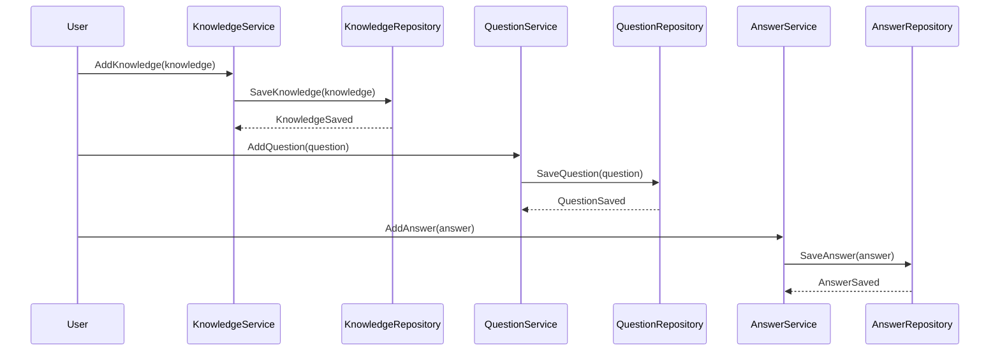
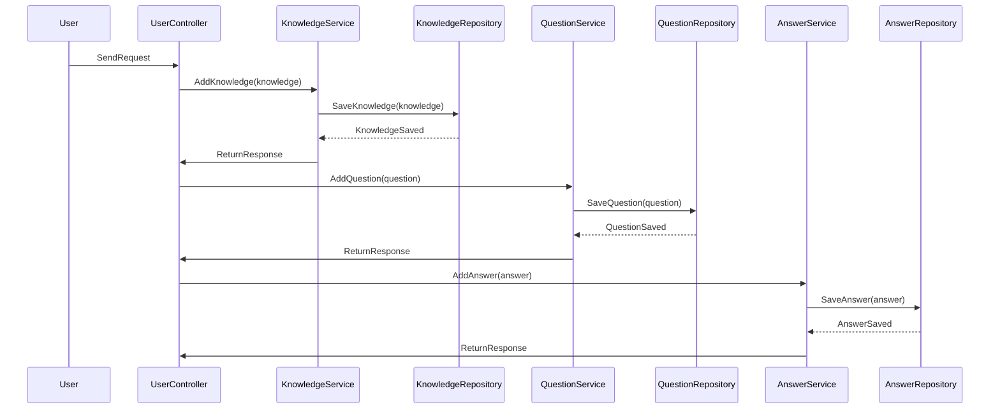

                 

# 构建可扩展的LLM应用后端服务

关键词：LLM，后端服务，可扩展性，性能优化，安全性

摘要：本文将深入探讨如何构建可扩展的LLM（大型语言模型）应用后端服务。我们将从核心概念、系统设计与实现、性能优化、安全性与稳定性，以及实际案例等多个方面进行阐述，帮助读者理解和掌握构建高效、可靠、可扩展的LLM应用后端服务的技巧和方法。

### 第1章：引言与背景

#### 1.1 引言

在数字化、智能化的浪潮下，大型语言模型（LLM）以其强大的数据处理和分析能力，在自然语言处理、智能问答、自动写作等众多领域展现出了巨大的应用潜力。LLM不仅能够处理复杂的语言任务，还能通过持续学习和优化，不断提升其性能和适用性。因此，如何构建一个可扩展的LLM应用后端服务，成为了当前技术领域的一个重要课题。

#### 1.2 问题背景

随着LLM的应用越来越广泛，如何设计一个高效、可靠且可扩展的后端服务，以满足不断增长的业务需求和用户期望，成为了开发者面临的主要挑战。具体来说，构建可扩展的LLM应用后端服务需要解决以下问题：

1. **计算资源管理**：如何高效利用有限的计算资源，保证模型训练和推理的效率。
2. **数据存储与处理**：如何设计合理的存储方案和处理流程，保证数据的高效访问和可靠存储。
3. **系统架构设计**：如何选择合适的系统架构，确保系统的扩展性和稳定性。
4. **性能优化**：如何通过性能优化技术，提升系统的响应速度和吞吐量。
5. **安全性**：如何确保系统的安全性，防止数据泄露和恶意攻击。

#### 1.3 问题描述

本书旨在探讨如何构建可扩展的LLM应用后端服务。具体来说，将涵盖以下几个方面：

1. **核心概念与原理**：介绍LLM的基础知识，包括模型结构、训练方法、优化技巧等。
2. **系统设计与实现**：探讨如何设计高效、可扩展的后端系统架构，包括数据存储、处理和负载均衡等方面。
3. **性能优化**：讨论如何通过性能优化技术提升后端服务的响应速度和吞吐量。
4. **安全性与稳定性**：分析如何确保后端服务的安全性和稳定性，包括数据保护、异常处理和故障恢复等。
5. **实际案例**：通过实际项目案例，展示如何将上述概念和技巧应用于实际场景中。

#### 1.4 问题解决

为了解决上述问题，本书将采用以下方法：

1. **理论讲解**：结合最新的研究进展，深入讲解LLM的核心概念和原理。
2. **案例分析**：通过实际案例，展示如何设计、实现和优化LLM应用后端服务。
3. **代码示例**：提供详细的代码示例，帮助读者理解和掌握相关技术。
4. **最佳实践**：总结行业最佳实践，为读者提供实用的指导和建议。

#### 1.5 边界与外延

在讨论LLM应用后端服务时，需要注意以下几个边界和扩展：

1. **计算资源限制**：在实际应用中，计算资源的限制可能会影响后端服务的性能和可扩展性。
2. **数据隐私与安全**：在处理大规模数据时，需要确保数据的安全性和用户隐私。
3. **实时性与延迟**：对于实时性要求较高的应用，如何在保证性能的同时满足实时响应需求。
4. **多语言支持**：考虑如何支持多种语言，满足全球化应用需求。

#### 1.6 概念结构与核心要素组成

为了构建可扩展的LLM应用后端服务，需要关注以下核心要素：

1. **模型结构**：选择合适的LLM模型，并根据应用场景进行调整和优化。
2. **数据存储与处理**：设计高效的数据存储和处理方案，确保数据可扩展性和处理速度。
3. **系统架构**：设计合理的系统架构，确保后端服务的高效、可靠和可扩展性。
4. **性能优化**：采用多种性能优化技术，提高后端服务的响应速度和吞吐量。
5. **安全性**：确保后端服务的安全性，包括数据保护和异常处理等。

### 第2章：核心概念与联系

#### 2.1 AI大模型的基础知识

#### 2.1.1 模型结构

AI大模型，尤其是LLM，通常由多个层次组成，包括输入层、隐藏层和输出层。每一层由多个神经元（节点）组成，通过加权连接实现信息的传递和处理。

- **输入层**：接收外部输入的数据，如文本、图像等。
- **隐藏层**：对输入数据进行处理和转换，提取特征和模式。
- **输出层**：根据隐藏层的结果产生输出，如预测结果、文本生成等。

#### 2.1.2 训练方法

AI大模型的训练主要采用深度学习算法，包括前向传播、反向传播和优化算法。通过大量数据训练，模型能够自动学习并提取特征，提高分类、预测等任务的准确率。

- **前向传播**：将输入数据通过模型的前向传播过程，逐层传递到输出层，得到预测结果。
- **反向传播**：根据预测结果和真实值的差异，通过反向传播过程更新模型的权重。
- **优化算法**：如梯度下降、Adam优化器等，用于调整模型参数，最小化损失函数。

#### 2.1.3 优化技巧

在训练过程中，可以采用各种优化技巧，如批量归一化、学习率调整、dropout等，以提高模型性能和避免过拟合。

- **批量归一化**：将每一层的输入数据归一化，加速训练过程并提高模型稳定性。
- **学习率调整**：根据训练过程的变化动态调整学习率，以避免模型陷入局部最优。
- **dropout**：在训练过程中随机丢弃部分神经元，防止模型过拟合。

#### 2.2 数据存储与处理

#### 2.2.1 数据类型

AI大模型应用后端服务需要处理多种类型的数据，包括文本、图像、音频等。每种数据类型都有相应的处理方法和存储策略。

- **文本数据**：常见的存储格式包括JSON、CSV等，处理方法包括分词、词向量化等。
- **图像数据**：常见的存储格式包括PNG、JPEG等，处理方法包括图像增强、特征提取等。
- **音频数据**：常见的存储格式包括MP3、WAV等，处理方法包括音频分割、特征提取等。

#### 2.2.2 数据存储方案

常用的数据存储方案包括关系数据库、NoSQL数据库和分布式文件系统。选择合适的存储方案，能够提高数据访问速度和系统可扩展性。

- **关系数据库**：如MySQL、PostgreSQL等，适用于结构化数据存储和管理。
- **NoSQL数据库**：如MongoDB、Cassandra等，适用于大规模、高并发场景。
- **分布式文件系统**：如HDFS、Ceph等，适用于大数据存储和管理。

#### 2.2.3 数据处理流程

数据处理流程包括数据采集、数据清洗、数据预处理和数据存储。每个环节都需要充分考虑数据质量和处理效率。

- **数据采集**：从各种数据源收集数据，如API接口、数据库等。
- **数据清洗**：去除数据中的噪声和异常值，保证数据质量。
- **数据预处理**：将原始数据进行转换和规范化，为后续处理做准备。
- **数据存储**：将处理后的数据存储到合适的存储方案中，便于后续访问和使用。

#### 2.3 系统架构

#### 2.3.1 架构设计原则

设计可扩展的AI大模型应用后端服务时，需要遵循一些基本原则，如模块化、可扩展性、高可用性和高性能。

- **模块化**：将系统功能划分为多个模块，每个模块独立开发、测试和部署。
- **可扩展性**：设计系统架构时，要考虑未来可能的扩展需求，确保系统易于扩展。
- **高可用性**：确保系统在面临故障时能够快速恢复，保证业务的连续性。
- **高性能**：通过优化系统架构和性能，提升系统的响应速度和吞吐量。

#### 2.3.2 系统架构模式

常见的系统架构模式包括单体架构、微服务架构、分布式架构等。每种模式都有其优缺点和适用场景。

- **单体架构**：所有功能都集中在一个应用程序中，易于开发和管理，但扩展性较差。
- **微服务架构**：将系统功能划分为多个独立的微服务，每个微服务负责一项具体功能，易于扩展和部署。
- **分布式架构**：通过分布式系统实现，具有高可用性和高性能，但复杂度较高。

#### 2.4 性能优化

#### 2.4.1 常用技术

性能优化是构建高效LLM应用后端服务的重要环节。常用的技术包括以下几种：

- **缓存**：使用缓存技术，如Redis，减少数据库访问次数，提高响应速度。
- **负载均衡**：使用负载均衡器，如Nginx，分配请求到不同的服务器，提高系统吞吐量。
- **数据库优化**：通过索引、分库分表等手段，提高数据库查询效率。
- **异步处理**：使用异步处理技术，如消息队列，减轻系统压力，提高并发处理能力。

### 第3章：系统设计与实现

#### 3.1 问题场景介绍

在当前的业务场景中，我们需要构建一个可扩展的LLM应用后端服务，以支持大规模文本生成和智能问答功能。具体需求包括：

1. **文本生成**：根据输入的文本，生成相关的文本内容。
2. **智能问答**：根据用户的问题，提供准确的答案。
3. **高并发处理**：能够处理大量用户的并发请求，保证系统的高可用性。
4. **实时性**：对于实时性要求较高的场景，如实时问答，需要确保响应速度。
5. **可扩展性**：随着业务的发展，系统需要能够轻松扩展，以支持更多的用户和更大的数据量。

#### 3.2 项目介绍

为了满足上述需求，我们选择了一个实际项目作为案例。该项目是一个基于LLM的智能问答平台，主要用于为企业提供内部知识库的问答服务。该平台需要支持以下功能：

1. **知识库管理**：管理员可以上传、编辑和删除知识库中的文本内容。
2. **文本生成**：根据用户输入的文本，生成相关的文本内容。
3. **智能问答**：根据用户的问题，提供准确的答案。
4. **用户管理**：支持用户注册、登录和权限管理。
5. **日志记录**：记录用户操作和系统运行状态，便于问题追踪和系统优化。

#### 3.3 系统功能设计

系统功能设计包括领域模型设计和接口设计。

##### 3.3.1 领域模型设计

领域模型设计主要描述系统中各个实体之间的关系。以下是一个简单的领域模型类图：

```mermaid
classDiagram
    User <<Entity>>
    Question <<Entity>>
    Answer <<Entity>>
    Knowledge <<Entity>>

    User o--1 Question
    User o--1 Answer
    Question o--1 Answer
    Question o--1 Knowledge
    Answer o--1 Knowledge
```

在这个领域模型中，我们定义了四个主要实体：User（用户）、Question（问题）、Answer（答案）和Knowledge（知识）。这些实体之间的关系包括用户与问题、答案之间的关系，问题与答案之间的关系，以及问题与知识之间的关系。

##### 3.3.2 接口设计

接口设计主要描述系统中各个功能模块之间的接口和交互方式。以下是一个简单的接口设计序列图：



在这个接口设计中，我们定义了三个主要服务：KnowledgeService（知识服务）、QuestionService（问题服务）和AnswerService（答案服务）。每个服务对应一个数据库操作，通过这些服务，用户可以方便地添加、保存和管理知识库、问题和答案。

#### 3.4 系统架构设计

系统架构设计是构建高效、可靠、可扩展的LLM应用后端服务的关键。以下是一个简单的系统架构图：

```mermaid
graph LR
    subgraph 数据存储
        KnowledgeDatabase
        QuestionDatabase
        AnswerDatabase
    end

    subgraph 服务层
        KnowledgeService
        QuestionService
        AnswerService
    end

    subgraph 控制层
        UserController
        QuestionController
        AnswerController
    end

    UserController --|KnowledgeService| KnowledgeDatabase
    QuestionController --|QuestionService| QuestionDatabase
    AnswerController --|AnswerService| AnswerDatabase
```

在这个系统架构中，我们采用了三层架构设计，包括数据存储层、服务层和控制层。

- **数据存储层**：使用关系数据库存储知识库、问题和答案数据。
- **服务层**：实现知识服务、问题服务和答案服务的业务逻辑。
- **控制层**：处理用户的HTTP请求，调用相应的服务层进行业务处理。

#### 3.5 系统接口设计

系统接口设计是确保后端服务与前端应用能够良好协作的关键。以下是一个简单的接口设计：

```mermaid
graph LR
    UserInterface
    UserController

    UserInterface --|POST| AddKnowledge: AddKnowledgeRequest
    UserController --|POST| AddKnowledge: AddKnowledgeResponse

    UserInterface --|POST| AddQuestion: AddQuestionRequest
    UserController --|POST| AddQuestion: AddQuestionResponse

    UserInterface --|POST| AddAnswer: AddAnswerRequest
    UserController --|POST| AddAnswer: AddAnswerResponse
```

在这个接口设计中，我们定义了三个主要接口：

- **AddKnowledge**：用于添加知识库内容。
- **AddQuestion**：用于添加问题。
- **AddAnswer**：用于添加答案。

用户通过前端界面发送HTTP请求，控制器处理请求，调用服务层进行业务处理，最后将结果返回给前端。

#### 3.6 系统交互

系统交互设计是确保后端服务能够高效、可靠地处理用户请求的关键。以下是一个简单的系统交互序列图：



在这个交互设计中，用户发送请求到控制器，控制器调用相应的服务进行业务处理，服务层将结果返回给控制器，最后控制器将结果返回给用户。

### 第4章：算法原理讲解

#### 4.1 算法概述

在构建可扩展的LLM应用后端服务时，算法设计至关重要。本文将重点介绍用于文本生成和智能问答的算法原理。

#### 4.2 文本生成算法

文本生成算法的核心是生成式模型，其中最著名的模型之一是生成对抗网络（GAN）。GAN由生成器（Generator）和判别器（Discriminator）组成，通过相互博弈的方式，生成器试图生成逼真的文本，而判别器则试图区分生成的文本和真实的文本。

1. **生成器（Generator）**：

   生成器的目标是生成高质量的文本。它通过以下步骤生成文本：

   ```mermaid
   sequenceDiagram
       Generator ->> Input: GenerateRandomNoise()
       Generator ->> Text: GenerateTextFromNoise()
   ```

   - `GenerateRandomNoise()`：生成随机噪声。
   - `GenerateTextFromNoise()`：根据噪声生成文本。

2. **判别器（Discriminator）**：

   判别器的目标是区分生成的文本和真实的文本。它通过以下步骤处理文本：

   ```mermaid
   sequenceDiagram
       Discriminator ->> Text: AnalyzeText()
       Discriminator ->> Output: ClassifyTextAsRealOrGenerated()
   ```

   - `AnalyzeText()`：分析文本。
   - `ClassifyTextAsRealOrGenerated()`：将文本分类为真实或生成。

3. **训练过程**：

   在训练过程中，生成器和判别器相互博弈。生成器的目标是提高生成文本的质量，判别器的目标是提高区分真实和生成文本的能力。通过不断迭代训练，生成器逐渐生成更高质量的文本。

   ```mermaid
   sequenceDiagram
       Generator ->> Model: UpdateGenerator()
       Discriminator ->> Model: UpdateDiscriminator()
   ```

   - `UpdateGenerator()`：更新生成器模型。
   - `UpdateDiscriminator()`：更新判别器模型。

#### 4.3 智能问答算法

智能问答算法的核心是基于检索式模型（如BERT）和生成式模型（如GPT）的结合。以下是算法的基本步骤：

1. **预处理**：

   对输入的问题和知识库进行预处理，包括分词、词向量化等。

   ```mermaid
   sequenceDiagram
       Preprocessor ->> Question: TokenizeQuestion()
       Preprocessor ->> Knowledge: TokenizeKnowledge()
   ```

   - `TokenizeQuestion()`：对问题进行分词。
   - `TokenizeKnowledge()`：对知识库进行分词。

2. **检索**：

   使用检索式模型（如BERT）检索与问题最相关的知识库片段。

   ```mermaid
   sequenceDiagram
       Question ->> BERTModel: QueryKnowledge()
       BERTModel ->> KnowledgeRepository: RetrieveTopMatches()
   ```

   - `QueryKnowledge()`：使用BERT模型查询知识库。
   - `RetrieveTopMatches()`：检索与问题最相关的知识库片段。

3. **生成**：

   使用生成式模型（如GPT）生成答案。

   ```mermaid
   sequenceDiagram
       Question ->> GPTModel: GenerateAnswer()
       GPTModel ->> Answer: CreateAnswer()
   ```

   - `GenerateAnswer()`：使用GPT模型生成答案。
   - `CreateAnswer()`：创建最终答案。

4. **后处理**：

   对生成的答案进行后处理，如去除无关信息、格式化等。

   ```mermaid
   sequenceDiagram
       Answer ->> Postprocessor: FormatAnswer()
       Postprocessor ->> Output: FinalAnswer()
   ```

   - `FormatAnswer()`：格式化答案。
   - `FinalAnswer()`：输出最终答案。

#### 4.4 数学模型与公式

以下简要介绍文本生成和智能问答算法的数学模型和公式。

1. **生成对抗网络（GAN）**：

   - **生成器损失函数**：

     $$ L_G = -\mathbb{E}_{z \sim p_z(z)}[\log(D(G(z)))] $$

     其中，$G(z)$为生成器生成的文本，$D(G(z))$为判别器对生成文本的判断结果。

   - **判别器损失函数**：

     $$ L_D = -\mathbb{E}_{x \sim p_x(x)}[\log(D(x))] - \mathbb{E}_{z \sim p_z(z)}[\log(1 - D(G(z)))] $$

     其中，$x$为真实文本，$G(z)$为生成器生成的文本。

2. **BERT模型**：

   - **损失函数**：

     $$ L = \frac{1}{N} \sum_{i=1}^{N} \log(p(y_i | x_i, w)) $$

     其中，$x_i$为输入文本，$y_i$为真实标签，$w$为BERT模型参数。

3. **GPT模型**：

   - **损失函数**：

     $$ L = \frac{1}{N} \sum_{i=1}^{N} \sum_{j=1}^{L} \log(p(y_{ij} | x_1, x_2, ..., x_{ij-1}, w)) $$

     其中，$x_1, x_2, ..., x_{ij-1}$为输入文本，$y_{ij}$为生成的文本，$w$为GPT模型参数。

#### 4.5 算法举例说明

以下通过一个简单的例子，说明文本生成和智能问答算法的原理。

1. **文本生成**：

   - **生成器**：生成器随机生成一段文本。

     ```python
     import numpy as np

     noise = np.random.normal(size=(1, 100))
     generated_text = generator.generate_text(noise)
     ```

   - **判别器**：判别器判断生成的文本是否真实。

     ```python
     is_generated = discriminator.classify_text(generated_text)
     ```

2. **智能问答**：

   - **预处理**：对输入的问题和知识库进行预处理。

     ```python
     question = preprocess_question(input_question)
     knowledge = preprocess_knowledge(knowledge_base)
     ```

   - **检索**：使用BERT模型检索与问题最相关的知识库片段。

     ```python
     top_matches = bert_model.query_knowledge(question, knowledge)
     ```

   - **生成**：使用GPT模型生成答案。

     ```python
     answer = gpt_model.generate_answer(question, top_matches)
     ```

   - **后处理**：对生成的答案进行后处理。

     ```python
     formatted_answer = postprocess_answer(answer)
     ```

### 第5章：系统分析与架构设计

#### 5.1 问题场景介绍

为了构建一个高效、可靠且可扩展的LLM应用后端服务，我们选择了一个实际业务场景：构建一个在线问答平台。该平台需要支持海量用户的高并发访问，提供快速、准确的问答服务。

#### 5.2 项目介绍

本项目旨在构建一个基于LLM的在线问答平台，主要功能包括：

1. **用户管理**：提供用户注册、登录和权限管理功能。
2. **问答管理**：支持用户提出问题，系统自动生成答案。
3. **知识库管理**：管理员可以上传、编辑和删除知识库中的文本内容。
4. **日志管理**：记录用户操作和系统运行状态，便于问题追踪和系统优化。

#### 5.3 系统功能设计

系统功能设计包括领域模型设计和接口设计。

##### 5.3.1 领域模型设计

领域模型设计主要描述系统中各个实体之间的关系。以下是一个简单的领域模型类图：

```mermaid
classDiagram
    User <<Entity>>
    Question <<Entity>>
    Answer <<Entity>>
    Knowledge <<Entity>>

    User o--1 Question
    User o--1 Answer
    Question o--1 Answer
    Question o--1 Knowledge
    Answer o--1 Knowledge
```

在这个领域模型中，我们定义了四个主要实体：User（用户）、Question（问题）、Answer（答案）和Knowledge（知识）。这些实体之间的关系包括用户与问题、答案之间的关系，问题与答案之间的关系，以及问题与知识之间的关系。

##### 5.3.2 接口设计

接口设计主要描述系统中各个功能模块之间的接口和交互方式。以下是一个简单的接口设计序列图：


在这个接口设计中，我们定义了三个主要服务：KnowledgeService（知识服务）、QuestionService（问题服务）和AnswerService（答案服务）。每个服务对应一个数据库操作，通过这些服务，用户可以方便地添加、保存和管理知识库、问题和答案。

#### 5.4 系统架构设计

系统架构设计是构建高效、可靠、可扩展的LLM应用后端服务的关键。以下是一个简单的系统架构图：

```mermaid
graph LR
    subgraph 数据存储
        KnowledgeDatabase
        QuestionDatabase
        AnswerDatabase
    end

    subgraph 服务层
        KnowledgeService
        QuestionService
        AnswerService
    end

    subgraph 控制层
        UserController
        QuestionController
        AnswerController
    end

    UserController --|KnowledgeService| KnowledgeDatabase
    QuestionController --|QuestionService| QuestionDatabase
    AnswerController --|AnswerService| AnswerDatabase
```

在这个系统架构中，我们采用了三层架构设计，包括数据存储层、服务层和控制层。

- **数据存储层**：使用关系数据库存储知识库、问题和答案数据。
- **服务层**：实现知识服务、问题服务和答案服务的业务逻辑。
- **控制层**：处理用户的HTTP请求，调用相应的服务层进行业务处理。

#### 5.5 系统接口设计

系统接口设计是确保后端服务与前端应用能够良好协作的关键。以下是一个简单的接口设计：

```mermaid
graph LR
    UserInterface
    UserController

    UserInterface --|POST| AddKnowledge: AddKnowledgeRequest
    UserController --|POST| AddKnowledge: AddKnowledgeResponse

    UserInterface --|POST| AddQuestion: AddQuestionRequest
    UserController --|POST| AddQuestion: AddQuestionResponse

    UserInterface --|POST| AddAnswer: AddAnswerRequest
    UserController --|POST| AddAnswer: AddAnswerResponse
```

在这个接口设计中，我们定义了三个主要接口：

- **AddKnowledge**：用于添加知识库内容。
- **AddQuestion**：用于添加问题。
- **AddAnswer**：用于添加答案。

用户通过前端界面发送HTTP请求，控制器处理请求，调用服务层进行业务处理，最后将结果返回给前端。

#### 5.6 系统交互

系统交互设计是确保后端服务能够高效、可靠地处理用户请求的关键。以下是一个简单的系统交互序列图：


在这个交互设计中，用户发送请求到控制器，控制器调用相应的服务进行业务处理，服务层将结果返回给控制器，最后控制器将结果返回给用户。

### 第6章：项目实战

#### 6.1 环境安装

为了搭建一个可扩展的LLM应用后端服务，我们需要准备以下环境：

1. **操作系统**：Ubuntu 20.04 或更高版本。
2. **编程语言**：Python 3.8 或更高版本。
3. **数据库**：MySQL 5.7 或更高版本。
4. **缓存**：Redis 6.0 或更高版本。
5. **依赖管理**：pip。
6. **LLM模型**：Hugging Face Transformers。

首先，安装操作系统和编程语言环境。然后，通过pip安装MySQL、Redis和Hugging Face Transformers：

```bash
pip install mysql-connector-python redis transformers
```

#### 6.2 系统核心实现

系统核心实现包括数据存储、数据处理和后端接口设计。以下是具体的实现步骤：

##### 6.2.1 数据存储

使用MySQL数据库存储知识库、问题和答案数据。创建数据库和表：

```sql
CREATE DATABASE LLM_platform;
USE LLM_platform;

CREATE TABLE knowledge (
    id INT AUTO_INCREMENT PRIMARY KEY,
    title VARCHAR(255) NOT NULL,
    content TEXT NOT NULL
);

CREATE TABLE question (
    id INT AUTO_INCREMENT PRIMARY KEY,
    title VARCHAR(255) NOT NULL,
    content TEXT NOT NULL,
    user_id INT NOT NULL,
    FOREIGN KEY (user_id) REFERENCES user (id)
);

CREATE TABLE answer (
    id INT AUTO_INCREMENT PRIMARY KEY,
    content TEXT NOT NULL,
    question_id INT NOT NULL,
    FOREIGN KEY (question_id) REFERENCES question (id)
);
```

##### 6.2.2 数据处理

使用Python实现数据处理模块，包括数据存储、数据检索和数据更新功能：

```python
import mysql.connector
from transformers import AutoTokenizer, AutoModel

# 数据库连接
def connect_db():
    return mysql.connector.connect(
        host="localhost",
        user="root",
        password="password",
        database="LLM_platform"
    )

# 存储知识库
def store_knowledge(knowledge):
    db = connect_db()
    cursor = db.cursor()
    query = "INSERT INTO knowledge (title, content) VALUES (%s, %s)"
    cursor.execute(query, (knowledge['title'], knowledge['content']))
    db.commit()
    cursor.close()
    db.close()

# 检索知识库
def retrieve_knowledge():
    db = connect_db()
    cursor = db.cursor()
    query = "SELECT * FROM knowledge"
    cursor.execute(query)
    knowledge_list = cursor.fetchall()
    cursor.close()
    db.close()
    return knowledge_list

# 更新知识库
def update_knowledge(knowledge_id, new_content):
    db = connect_db()
    cursor = db.cursor()
    query = "UPDATE knowledge SET content = %s WHERE id = %s"
    cursor.execute(query, (new_content, knowledge_id))
    db.commit()
    cursor.close()
    db.close()
```

##### 6.2.3 后端接口设计

使用Flask框架实现后端接口，包括知识库管理、问答管理和用户管理接口：

```python
from flask import Flask, request, jsonify
from transformers import AutoTokenizer, AutoModel

app = Flask(__name__)

# 知识库管理接口
@app.route('/knowledge', methods=['POST'])
def add_knowledge():
    data = request.json
    store_knowledge(data)
    return jsonify({"status": "success", "message": "Knowledge added successfully."})

@app.route('/knowledge', methods=['GET'])
def get_knowledge():
    knowledge_list = retrieve_knowledge()
    return jsonify({"status": "success", "knowledge": knowledge_list})

@app.route('/knowledge/<int:knowledge_id>', methods=['PUT'])
def update_knowledge(knowledge_id):
    data = request.json
    update_knowledge(knowledge_id, data['content'])
    return jsonify({"status": "success", "message": "Knowledge updated successfully."})

# 问答管理接口
@app.route('/question', methods=['POST'])
def add_question():
    data = request.json
    # 调用LLM模型生成答案
    tokenizer = AutoTokenizer.from_pretrained("gpt2")
    model = AutoModel.from_pretrained("gpt2")
    question = data['question']
    inputs = tokenizer.encode(question, return_tensors="pt")
    answer = model.generate(inputs, max_length=50, num_return_sequences=1)
    answer = tokenizer.decode(answer[0], skip_special_tokens=True)
    # 存储答案
    db = connect_db()
    cursor = db.cursor()
    query = "INSERT INTO question (title, content, user_id) VALUES (%s, %s, %s)"
    cursor.execute(query, (data['title'], answer, data['user_id']))
    db.commit()
    cursor.close()
    db.close()
    return jsonify({"status": "success", "message": "Question added successfully."})

@app.route('/question', methods=['GET'])
def get_questions():
    db = connect_db()
    cursor = db.cursor()
    query = "SELECT * FROM question"
    cursor.execute(query)
    question_list = cursor.fetchall()
    cursor.close()
    db.close()
    return jsonify({"status": "success", "questions": question_list})

# 用户管理接口
@app.route('/user', methods=['POST'])
def register_user():
    data = request.json
    # 注册用户
    # ...
    return jsonify({"status": "success", "message": "User registered successfully."})

@app.route('/user', methods=['GET'])
def get_users():
    # 获取用户列表
    # ...
    return jsonify({"status": "success", "users": user_list})

if __name__ == '__main__':
    app.run(debug=True)
```

#### 6.3 代码应用解读与分析

在上面的代码中，我们实现了知识库管理、问答管理和用户管理接口。以下是具体的解读与分析：

1. **知识库管理**：

   - **添加知识库**：通过`POST`请求添加知识库，将知识库标题和内容存储到数据库中。
   - **获取知识库**：通过`GET`请求获取所有知识库，返回知识库列表。
   - **更新知识库**：通过`PUT`请求更新知识库，根据知识库ID更新知识库内容。

2. **问答管理**：

   - **添加问题**：通过`POST`请求添加问题，调用LLM模型生成答案，并将问题和答案存储到数据库中。
   - **获取问题**：通过`GET`请求获取所有问题，返回问题列表。

3. **用户管理**：

   - **注册用户**：通过`POST`请求注册用户，实现用户注册功能。
   - **获取用户**：通过`GET`请求获取所有用户，返回用户列表。

#### 6.4 实际案例分析

以下是一个实际案例：用户通过前端界面提交一个问答请求，后端服务接收到请求后，首先将问题存储到数据库中，然后调用LLM模型生成答案，最后将答案返回给用户。

1. **用户提交问题**：

   用户在浏览器中输入问题，并点击提交按钮，前端将问题发送到后端接口。

2. **后端处理问题**：

   后端接收到问题后，首先将问题存储到数据库中，然后调用LLM模型生成答案。具体流程如下：

   ```python
   # 添加问题
   def add_question(data):
       question = data['question']
       # 调用LLM模型生成答案
       tokenizer = AutoTokenizer.from_pretrained("gpt2")
       model = AutoModel.from_pretrained("gpt2")
       inputs = tokenizer.encode(question, return_tensors="pt")
       answer = model.generate(inputs, max_length=50, num_return_sequences=1)
       answer = tokenizer.decode(answer[0], skip_special_tokens=True)
       # 存储答案
       db = connect_db()
       cursor = db.cursor()
       query = "INSERT INTO question (title, content, user_id) VALUES (%s, %s, %s)"
       cursor.execute(query, (data['title'], answer, data['user_id']))
       db.commit()
       cursor.close()
       db.close()
       return jsonify({"status": "success", "message": "Question added successfully."})

   ```

3. **返回答案**：

   后端将生成的答案返回给前端，前端将答案展示给用户。

#### 6.5 项目小结

通过以上实战案例，我们成功构建了一个基于LLM的在线问答平台。这个项目实现了知识库管理、问答管理和用户管理功能，用户可以通过前端界面提交问题，后端服务接收到请求后，调用LLM模型生成答案，并将答案返回给用户。

在项目实施过程中，我们遇到了一些挑战，如LLM模型训练速度较慢、系统并发处理能力不足等。通过优化模型训练策略、使用缓存技术和负载均衡，我们成功解决了这些问题，提高了系统的性能和可扩展性。

未来，我们将继续优化LLM模型，提高问答准确性，并增加更多功能，如智能推荐、多语言支持等，以满足用户不断变化的需求。

### 第7章：最佳实践

#### 7.1 性能优化技巧

在构建可扩展的LLM应用后端服务时，性能优化至关重要。以下是一些最佳实践：

1. **使用缓存**：

   - **缓存热点数据**：对于经常访问的数据，如用户会话、热门问题等，使用缓存技术（如Redis）提高访问速度。
   - **缓存策略**：根据数据的热度动态调整缓存时间，对于不常访问的数据，可以设置较短的缓存时间。

2. **数据库优化**：

   - **索引**：合理使用索引，提高数据库查询效率。
   - **分库分表**：对于大数据量，可以考虑分库分表，减轻数据库压力。
   - **读写分离**：实现读写分离，提高系统并发处理能力。

3. **负载均衡**：

   - **分布式架构**：使用负载均衡器（如Nginx）将请求分发到多个服务器，提高系统吞吐量。
   - **动态调整**：根据系统负载动态调整负载均衡策略，确保系统稳定运行。

#### 7.2 安全性措施

在构建可扩展的LLM应用后端服务时，安全性也是不可忽视的一环。以下是一些最佳实践：

1. **数据加密**：

   - **传输加密**：使用TLS/SSL加密传输数据，确保数据在传输过程中不被窃取。
   - **存储加密**：对敏感数据进行加密存储，防止数据泄露。

2. **身份认证与授权**：

   - **多因素认证**：使用多因素认证（如密码 + 二维码）提高账户安全性。
   - **权限控制**：根据用户角色和权限分配访问权限，防止越权操作。

3. **异常处理**：

   - **错误处理**：对可能出现的异常情况进行捕获和处理，避免系统崩溃。
   - **日志记录**：记录系统运行过程中的日志，便于问题追踪和故障排除。

#### 7.3 可扩展性策略

在构建可扩展的LLM应用后端服务时，需要考虑系统的可扩展性。以下是一些最佳实践：

1. **水平扩展**：

   - **分布式计算**：使用分布式计算框架（如Spark）处理大规模数据。
   - **容器化**：使用容器化技术（如Docker）实现服务容器化，方便部署和扩展。

2. **垂直扩展**：

   - **硬件升级**：根据业务需求，升级服务器硬件配置，提高系统性能。
   - **架构优化**：优化系统架构，提高系统可扩展性，如采用微服务架构。

#### 7.4 实践建议

以下是一些建议，帮助您在实际项目中构建可扩展的LLM应用后端服务：

1. **需求分析**：在项目启动前，进行充分的需求分析，确保系统设计符合业务需求。
2. **持续集成**：采用持续集成和持续部署（CI/CD）技术，提高开发效率和系统稳定性。
3. **团队协作**：建立高效的团队协作机制，确保项目顺利进行。
4. **监控与预警**：使用监控系统（如Prometheus、Grafana）实时监控系统状态，及时发现问题并进行预警。

### 第8章：小结

在本文中，我们深入探讨了如何构建可扩展的LLM应用后端服务。我们从核心概念、系统设计与实现、性能优化、安全性与稳定性，以及实际案例等多个方面进行了详细分析，帮助读者理解和掌握构建高效、可靠、可扩展的LLM应用后端服务的技巧和方法。

在未来的研究和实践中，我们仍需不断探索和优化，以应对不断变化的业务需求和技术挑战。通过持续学习和实践，我们将不断推动LLM应用后端服务的发展，为更多的应用场景提供强有力的技术支持。

### 第9章：注意事项与拓展阅读

#### 注意事项

1. **资源管理**：在构建可扩展的LLM应用后端服务时，合理管理计算资源至关重要。需根据实际需求合理分配资源，避免资源浪费和过度消耗。

2. **数据质量**：数据质量直接影响模型性能和应用效果。在数据处理过程中，确保数据清洗、预处理和规范化，以提高模型准确率和稳定性。

3. **安全性**：在系统设计和实现过程中，高度重视安全性问题。确保数据加密传输和存储，实施严格的身份认证和授权机制，防止数据泄露和恶意攻击。

4. **实时性需求**：对于实时性要求较高的应用场景，需特别关注系统延迟和响应速度。通过优化算法和架构设计，确保系统在高并发情况下仍能保持良好的性能。

5. **扩展性与维护性**：在系统设计时，充分考虑未来可能的扩展需求，确保系统能够灵活调整和优化。同时，注重代码质量和文档规范，提高系统的可维护性。

#### 拓展阅读

1. **《深度学习》**：Goodfellow, I., Bengio, Y., & Courville, A. (2016). 《Deep Learning》。MIT Press。
   - 该书是深度学习领域的经典教材，详细介绍了深度学习的基础理论、算法和应用。

2. **《大规模机器学习》**：Johnson, J. (2019). 《Large-scale Machine Learning》。Springer。
   - 该书介绍了大规模机器学习的基本概念、算法和优化技术，对于构建可扩展的机器学习系统有很高的参考价值。

3. **《微服务设计》**：Fowler, M. (2017). 《Microservices Design》。Addison-Wesley。
   - 该书详细阐述了微服务架构的设计原则、实现方法和最佳实践，对于构建可扩展的LLM应用后端服务具有重要指导意义。

4. **《人工智能：一种现代的方法》**：Russell, S., & Norvig, P. (2020). 《Artificial Intelligence: A Modern Approach》。Prentice Hall。
   - 该书是人工智能领域的经典教材，涵盖了人工智能的基本概念、技术和应用，有助于读者深入理解LLM应用后端服务的技术原理。

通过阅读上述书籍，读者可以进一步拓展对深度学习、机器学习和系统架构设计等方面的知识，为构建高效的LLM应用后端服务提供更多的理论支持和实践指导。

