                 

### 文章标题

# 构建可扩展的LLM应用微服务架构

---

> 关键词：**LLM、微服务架构、可扩展性、性能优化、持续集成与部署**

> 摘要：本文将深入探讨构建可扩展的LLM（大型语言模型）应用微服务架构的方法。通过分析LLM和微服务架构的基本概念与核心原理，逐步讲解设计方法论、扩展性策略、实现细节以及优化实践。文章还将结合实际案例，展示如何在实际项目中构建高效、可扩展的LLM微服务架构，为开发者提供实用的指导和建议。

---

### 引言

随着人工智能技术的快速发展，LLM（Large Language Model）在自然语言处理、文本生成、智能问答等应用中表现出色。然而，随着模型规模的不断扩大，如何高效构建和管理LLM应用成为了开发者面临的挑战。微服务架构作为一种灵活、可扩展的系统设计方法，为解决这一难题提供了新的思路。本文将围绕构建可扩展的LLM应用微服务架构展开讨论，旨在为开发者提供一套系统、实用的解决方案。

### 第一部分：理论基础与背景

#### 第1章：LLM与微服务架构概述

**1.1 LLM的概念与作用**

**1.2 微服务架构的核心原理**

**1.3 LLM与微服务架构的结合点**

---

#### 第2章：LLM核心概念与架构设计

**2.1 LLM基础架构**

- **2.1.1 模型架构**
- **2.1.2 数据流设计**

**2.2 LLM的微服务设计原则**

- **2.2.1 微服务粒度划分**
- **2.2.2 服务间通信机制**

---

#### 第3章：微服务架构设计方法论

**3.1 服务拆分策略**

**3.2 微服务间的依赖管理**

**3.3 服务容错与弹性设计**

---

#### 第4章：可扩展性策略与优化

**4.1 扩展性需求分析**

**4.2 性能优化技术**

- **4.2.1 缓存机制**
- **4.2.2 并发处理**

---

#### 第5章：持续集成与部署

**5.1 CI/CD流程设计**

**5.2 持续集成工具选择**

**5.3 自动化部署策略**

---

### 第二部分：应用实践

#### 第6章：LLM微服务架构实现

**6.1 环境搭建**

- **6.1.1 开发环境准备**
- **6.1.2 数据集准备**

**6.2 微服务设计与开发**

- **6.2.1 模型服务实现**
- **6.2.2 API服务实现**
- **6.2.3 数据服务实现**

**6.3 系统集成与测试**

- **6.3.1 服务接口测试**
- **6.3.2 系统性能测试**

---

#### 第7章：案例研究

**7.1 案例背景**

**7.2 架构设计与实现**

- **7.2.1 服务拆分**
- **7.2.2 架构设计**
- **7.2.3 实现细节**

**7.3 问题与解决**

- **7.3.1 性能瓶颈分析**
- **7.3.2 扩展性优化**

**7.4 案例总结**

---

### 第三部分：优化与展望

#### 第8章：最佳实践与性能优化

**8.1 性能优化案例分享**

**8.2 扩展性优化策略**

**8.3 安全性与隐私保护**

---

#### 第9章：未来趋势与挑战

**9.1 LLM技术的发展趋势**

**9.2 微服务架构面临的挑战**

**9.3 未来研究方向**

---

#### 第10章：小结与展望

**10.1 本书主要内容回顾**

**10.2 需要关注的问题**

**10.3 拓展阅读推荐**

---

### 结尾

本文通过系统地分析LLM与微服务架构的结合点，详细讲解了构建可扩展的LLM应用微服务架构的方法与步骤。从理论基础到实际应用，再到优化与展望，旨在为开发者提供全面的指导。希望读者能通过本文的学习，掌握构建高效、可扩展的LLM应用微服务架构的核心技术和方法。

---

**作者：AI天才研究院/AI Genius Institute & 禅与计算机程序设计艺术 /Zen And The Art of Computer Programming**

---

### 第1章: LLM与微服务架构概述

**1.1 LLM的概念与作用**

大型语言模型（LLM，Large Language Model）是一种能够理解和生成人类语言的人工智能模型。与传统的规则基模型不同，LLM通过深度学习技术，可以从大量的文本数据中学习语言模式，并生成流畅、自然的文本输出。LLM在自然语言处理（NLP）领域有着广泛的应用，包括文本分类、情感分析、机器翻译、问答系统等。

LLM的作用主要体现在以下几个方面：

1. **文本生成**：LLM可以生成高质量的自然语言文本，用于自动撰写文章、报告、邮件等。
2. **信息检索**：通过理解用户的查询，LLM能够快速地从大量文本数据中检索出相关信息。
3. **智能问答**：LLM可以模拟人类的对话，为用户提供实时的回答和帮助。
4. **内容审核**：LLM可以用于检测文本中的敏感信息，进行内容过滤和审核。

**1.2 微服务架构的核心原理**

微服务架构（Microservices Architecture）是一种基于组件的分布式系统设计方法，其核心思想是将大型单体应用拆分成一系列小的、独立的、松耦合的服务。每个服务都负责实现特定的功能，并通过API与其他服务进行通信。

微服务架构具有以下核心原理：

1. **服务独立性**：每个服务都是独立的，可以独立开发、测试和部署。
2. **分布式通信**：服务之间通过HTTP/HTTPS协议进行通信，实现服务间的解耦。
3. **自动化部署**：通过持续集成和持续部署（CI/CD）工具，实现服务的自动化部署和升级。
4. **弹性扩展**：可以根据需求独立扩展或缩减每个服务的实例数量，实现系统的弹性扩展。

**1.3 LLM与微服务架构的结合点**

LLM和微服务架构的结合点主要体现在以下几个方面：

1. **可扩展性**：微服务架构提供了一种灵活的扩展方式，可以根据LLM的需求独立扩展模型服务。
2. **模块化**：LLM可以通过微服务架构实现模块化设计，将不同的功能模块拆分成独立的服务。
3. **独立部署**：LLM的不同模块可以独立部署，方便进行测试和上线。
4. **服务化**：将LLM的服务化，可以更方便地与其他系统进行集成，提高系统的灵活性。

总之，LLM与微服务架构的结合，可以为开发者提供一种高效、可扩展的解决方案，满足现代应用的需求。

### 第2章：LLM核心概念与架构设计

#### 2.1 LLM基础架构

**2.1.1 模型架构**

LLM的模型架构通常包括以下几个关键组成部分：

1. **嵌入层（Embedding Layer）**：将输入的文本转换为固定长度的向量表示。常用的嵌入技术包括Word2Vec、GloVe等。
2. **编码器（Encoder）**：负责对输入的文本序列进行编码，生成上下文表示。Transformer架构中的自注意力机制（Self-Attention）是编码器的核心组成部分。
3. **解码器（Decoder）**：负责生成文本输出，解码器通常与编码器共享权重。在生成文本时，解码器会根据编码器生成的上下文表示和已生成的文本，预测下一个词。
4. **注意力机制（Attention Mechanism）**：用于在编码器和解码器之间传递信息，提高模型的上下文理解能力。自注意力（Self-Attention）和多头注意力（Multi-Head Attention）是常见的注意力机制。
5. **全连接层（Fully Connected Layer）**：在解码器的输出阶段，通常通过全连接层将文本向量映射到预定义的输出空间，如词汇表。

以下是一个简单的Transformer架构的Mermaid流程图：

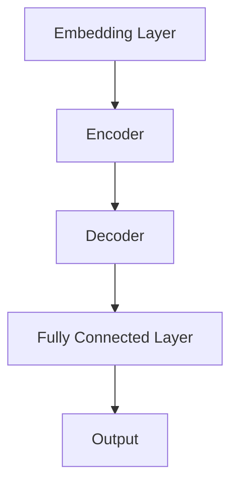

**2.1.2 数据流设计**

LLM的数据流设计通常包括以下几个关键阶段：

1. **数据预处理**：对原始文本数据进行清洗、分词、去停用词等处理，将文本转换为适合模型训练的形式。
2. **序列编码**：将预处理后的文本数据编码为序列，每个词对应一个词嵌入向量。
3. **模型训练**：通过训练过程，模型学习文本之间的内在关系，提高文本生成的准确性和流畅性。
4. **模型推理**：在模型训练完成后，通过模型推理生成文本输出。在生成文本时，模型会根据已生成的文本和编码的上下文信息，逐词预测下一个词。

以下是一个简单的数据流设计的Mermaid流程图：

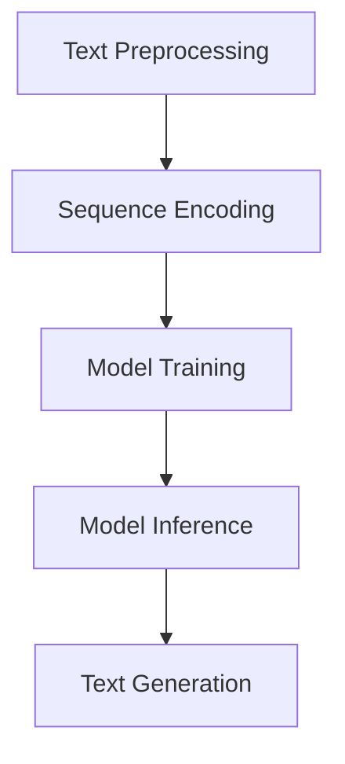

#### 2.2 LLM的微服务设计原则

**2.2.1 微服务粒度划分**

在LLM的微服务设计中，合理的微服务粒度划分是关键。以下是一些常用的划分原则：

1. **功能划分**：根据LLM的不同功能模块，如文本生成、文本分类、情感分析等，将相关功能划分到不同的服务中。
2. **数据依赖**：根据数据依赖关系，将数据处理的各个环节划分到不同的服务中。
3. **资源需求**：根据不同服务的资源需求，如计算资源、存储资源等，进行合理的资源分配。

以下是一个简单的微服务粒度划分的Mermaid ER实体关系图：

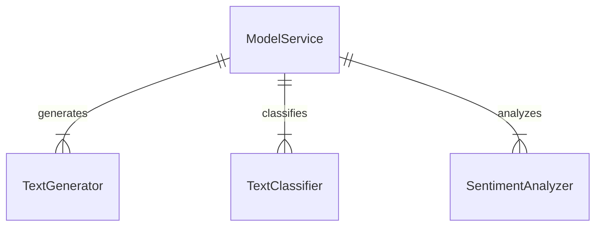

**2.2.2 服务间通信机制**

在LLM的微服务架构中，服务间通信机制至关重要。以下是一些常用的通信机制：

1. **RESTful API**：通过HTTP/HTTPS协议，实现服务之间的数据交换。RESTful API具有简单、易用、可扩展的特点。
2. **消息队列**：通过消息队列（如Kafka、RabbitMQ等），实现异步通信和消息传递。消息队列可以提供高可靠性和高吞吐量的通信能力。
3. **事件驱动架构**：通过事件驱动架构（Event-Driven Architecture），实现实时事件的通知和响应。事件驱动架构可以提高系统的响应速度和灵活性。

以下是一个简单的事件驱动架构的Mermaid流程图：

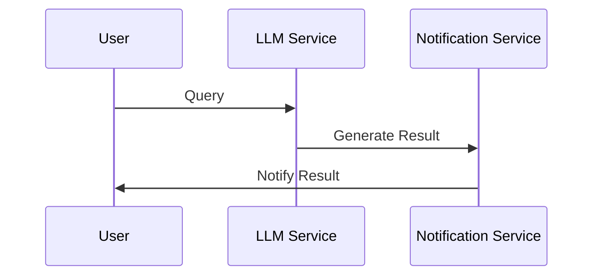

通过以上讨论，我们可以看到LLM的微服务设计原则涵盖了模型架构、数据流设计、服务粒度划分和通信机制等多个方面。合理的微服务设计可以大大提高LLM应用的灵活性和可扩展性，为开发者提供更强大的开发和管理工具。

### 第3章：微服务架构设计方法论

在构建可扩展的LLM应用微服务架构时，设计方法论是关键的一步。以下我们将详细探讨服务拆分策略、微服务间的依赖管理以及服务容错与弹性设计，为开发者提供有效的解决方案。

#### 3.1 服务拆分策略

服务拆分策略是微服务架构设计的基础。合理的拆分可以使每个服务独立运行、独立扩展，从而提高系统的整体可维护性和可扩展性。以下是一些常见的服务拆分策略：

1. **功能划分**：根据LLM的不同功能模块进行拆分，如文本生成、文本分类、情感分析等。这种划分方式可以使各个服务专注于实现特定的功能，降低系统的复杂度。

2. **数据依赖**：根据数据的处理流程进行拆分，将数据的输入、处理、输出等环节分别拆分为不同的服务。这种方式可以确保数据的连续性和一致性。

3. **业务领域**：根据业务领域的不同，将系统的各个功能模块划分为不同的服务。例如，可以将用户管理、订单管理、产品管理等模块分别拆分为独立的服务。

4. **资源需求**：根据不同服务的资源需求进行拆分，将计算密集型、存储密集型等服务分开部署。这样可以确保系统资源的合理利用，提高系统的整体性能。

以下是一个基于业务领域划分的服务拆分示例的Mermaid ER实体关系图：

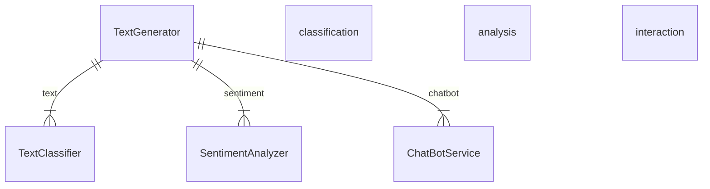

#### 3.2 微服务间的依赖管理

微服务之间的依赖关系是系统设计中的重要一环。有效的依赖管理可以确保服务之间的数据传递和功能协同，提高系统的整体稳定性。以下是一些依赖管理的方法：

1. **服务间接口定义**：通过定义清晰、一致的服务接口，确保服务之间的数据传递和功能调用。接口定义应遵循RESTful API规范，提供标准的HTTP请求和响应格式。

2. **服务版本控制**：在微服务架构中，服务版本控制是管理依赖关系的重要手段。通过为每个服务版本分配唯一的标识符，可以实现服务之间的兼容性和向后兼容性。

3. **服务注册与发现**：通过服务注册与发现机制，实现服务之间的动态连接和负载均衡。常用的服务注册与发现工具包括Consul、Eureka等。

4. **服务间通信协议**：选择合适的服务间通信协议，如HTTP/HTTPS、gRPC、gossip协议等。通信协议应具备高可靠性、低延迟和高吞吐量的特点。

以下是一个简单的服务间通信架构的Mermaid流程图：

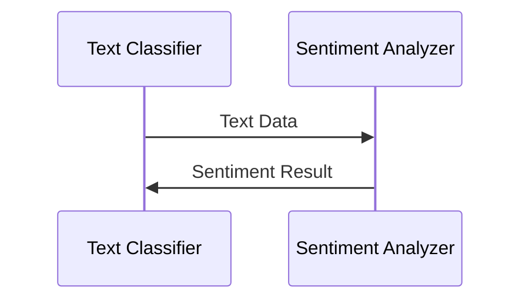

#### 3.3 服务容错与弹性设计

在微服务架构中，服务容错和弹性设计是保障系统稳定性和可用性的关键。以下是一些常见的容错和弹性设计方法：

1. **服务副本与负载均衡**：为每个服务部署多个副本，并通过负载均衡器（如Nginx、HAProxy等）实现流量的动态分配。这种方式可以提高系统的容错能力和负载均衡性能。

2. **故障检测与自动恢复**：通过监控工具（如Prometheus、Grafana等）对服务进行故障检测，并在检测到故障时自动触发恢复机制（如重启服务、重新部署实例等）。

3. **熔断与限流**：通过熔断（Circuit Breaker）和限流（Rate Limiting）机制，防止服务因过载而崩溃。熔断机制可以阻止失败的请求，并允许服务进行自我修复。限流机制可以限制请求的速率，防止服务因过多的请求而瘫痪。

4. **分布式存储与数据一致性**：通过分布式存储系统（如Kafka、Redis等）实现数据的高可用性和强一致性。分布式存储系统可以保证数据在不同节点之间的同步和一致性。

5. **弹性伸缩**：根据系统的实际负载，自动调整服务的实例数量。弹性伸缩可以通过自动化工具（如Kubernetes、Docker Swarm等）实现。

以下是一个简单的服务弹性伸缩的Mermaid流程图：

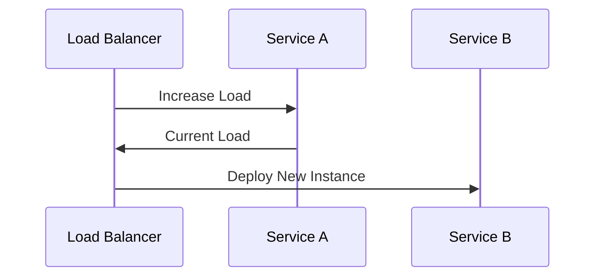

通过以上讨论，我们可以看到微服务架构设计方法论在LLM应用中的重要性。合理的服务拆分、依赖管理和容错与弹性设计，可以确保LLM应用的稳定运行和高可用性。开发者应根据具体的需求和场景，灵活应用这些方法，构建高效、可扩展的微服务架构。

#### 4.1 扩展性需求分析

在构建可扩展的LLM应用微服务架构时，首先需要明确系统的扩展性需求。扩展性需求分析是确保系统设计能够满足未来增长和变化的关键步骤。以下是一些关键因素和步骤：

**1. 负载预估**：对系统的预期负载进行预估，包括数据量、请求量、并发用户数等。通过历史数据分析和市场调研，确定系统在不同负载情况下的性能指标。

**2. 资源需求**：分析系统在不同负载情况下的资源需求，如计算资源、存储资源、网络带宽等。资源需求直接影响系统的性能和可扩展性。

**3. 扩展策略**：根据负载预估和资源需求，制定相应的扩展策略。常见的扩展策略包括水平扩展（Scaling Out）和垂直扩展（Scaling Up）。

**4. 技术选型**：选择适合系统需求的技术栈，如分布式存储、负载均衡、消息队列等。技术选型应考虑其可扩展性、性能和可靠性。

**5. 系统测试**：在扩展策略和技术选型确定后，进行系统测试，验证系统的扩展能力和性能。测试应涵盖不同负载场景和故障情况，确保系统在各种情况下的稳定运行。

**6. 监控与反馈**：通过监控系统（如Prometheus、Grafana等）收集系统运行数据，分析系统的性能瓶颈和扩展性需求。根据监控数据，不断优化系统设计和扩展策略。

通过以上步骤，可以确保LLM应用微服务架构具备良好的扩展性，能够应对未来的增长和变化。

#### 4.2 性能优化技术

在构建可扩展的LLM应用微服务架构时，性能优化是确保系统高效运行的关键环节。以下将详细介绍两种重要的性能优化技术：缓存机制和并发处理。

**4.2.1 缓存机制**

缓存机制是一种常用的性能优化技术，通过将频繁访问的数据存储在内存中，减少对后端存储的访问次数，从而提高系统的响应速度。以下是缓存机制的关键技术点：

1. **缓存策略**：选择合适的缓存策略，如LRU（Least Recently Used）算法、LFU（Least Frequently Used）算法等。LRU算法根据数据的使用频率进行缓存淘汰，适用于频繁访问的数据。LFU算法根据数据的使用频率进行缓存淘汰，适用于访问频率较低但偶尔需要的数据。

2. **缓存层级**：将缓存划分为多个层级，如一级缓存（CPU缓存）、二级缓存（内存缓存）和三级缓存（磁盘缓存）。多级缓存可以提供更高的访问速度和更低的延迟。

3. **缓存一致性**：在分布式系统中，确保缓存的一致性至关重要。可以通过分布式缓存一致性协议（如Gossip协议、Paxos算法等）实现缓存的一致性。

4. **缓存预热**：在系统启动时，预先加载热门数据到缓存中，减少系统启动时的延迟。缓存预热可以通过定时任务或触发事件（如用户访问高峰期）进行。

**4.2.2 并发处理**

并发处理是提高系统性能和响应能力的关键技术。在微服务架构中，并发处理涉及多个方面，包括：

1. **线程池**：使用线程池管理并发任务，避免频繁创建和销毁线程，提高系统的响应速度。线程池可以通过设置线程数量和任务队列长度，实现合理的并发控制。

2. **异步处理**：通过异步处理（Asynchronous Processing），将任务提交到异步队列，由后台线程执行。异步处理可以减少系统的同步等待时间，提高并发能力。

3. **消息队列**：使用消息队列（如Kafka、RabbitMQ等）实现任务调度和负载均衡。消息队列可以确保任务按顺序执行，并提供高吞吐量和可靠性。

4. **并发编程模型**：采用并发编程模型（如Actor模型、反应式编程等），实现高效的并发控制和资源管理。Actor模型通过将任务分配给不同的Actor，实现任务的并行处理和通信。反应式编程通过事件驱动的方式，处理并发事件和状态变化。

5. **资源隔离**：在分布式系统中，通过资源隔离（如容器化、虚拟化等）技术，确保不同服务之间的资源独立性和隔离性。资源隔离可以提高系统的稳定性和可扩展性。

通过以上性能优化技术，可以显著提高LLM应用微服务架构的性能和响应能力，确保系统在高峰期也能保持良好的运行状态。

### 第5章：持续集成与部署

在构建可扩展的LLM应用微服务架构中，持续集成（CI）与持续部署（CD）是确保系统高效运行和快速迭代的重要环节。以下将详细讨论CI/CD流程设计、持续集成工具选择以及自动化部署策略。

#### 5.1 CI/CD流程设计

CI/CD流程设计是构建高效开发、测试和部署管道的关键。以下是一个典型的CI/CD流程设计：

1. **代码提交**：开发者在版本控制系统（如Git）中提交代码，触发CI过程。

2. **代码检查**：CI服务器对提交的代码进行自动化检查，包括代码风格检查、语法错误检测等。

3. **构建**：CI服务器构建代码，生成可执行的二进制文件或容器镜像。

4. **测试**：对构建的代码进行自动化测试，包括单元测试、集成测试和性能测试等。

5. **部署**：通过CI/CD工具将通过测试的代码部署到测试环境或生产环境。

6. **监控与反馈**：监控系统运行状态，收集日志和性能指标，并根据反馈调整CI/CD流程。

以下是一个简单的CI/CD流程设计的Mermaid流程图：

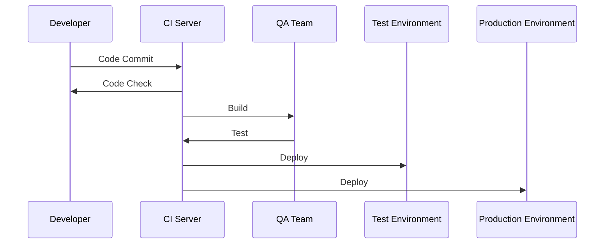

#### 5.2 持续集成工具选择

选择合适的持续集成工具对于确保CI/CD流程的稳定和高效至关重要。以下是一些常用的持续集成工具：

1. **Jenkins**：Jenkins是一个开源的持续集成服务器，支持多种编程语言和工具，具备丰富的插件生态系统，适用于各种规模的项目。

2. **GitLab CI/CD**：GitLab CI/CD是GitLab内置的持续集成与持续部署工具，支持Git版本控制系统，具备高效的构建和部署能力。

3. **Travis CI**：Travis CI是一个云端持续集成服务，支持多种编程语言，提供简单、高效的CI/CD解决方案。

4. **CircleCI**：CircleCI是一个云端的持续集成和持续部署服务，提供快速、可靠的构建和部署流程，适用于大型项目和持续交付。

#### 5.3 自动化部署策略

自动化部署是CI/CD流程的关键组成部分，以下是一些常用的自动化部署策略：

1. **蓝绿部署**：蓝绿部署是一种无服务中断的部署策略，通过同时运行两个相同版本的服务实例（蓝环境和绿环境），将流量逐步切换到新版本。这种方式可以确保部署过程中系统的高可用性。

2. **滚动部署**：滚动部署是一种逐步更新所有实例的部署策略，每次只更新一个实例，确保系统的稳定性和连续性。

3. **金丝雀部署**：金丝雀部署是一种逐步将流量切换到新版本的部署策略，通过在部署前对部分用户流量进行测试，确保新版本的功能和性能。

4. **自动化监控**：在部署后，通过自动化监控系统（如Prometheus、Grafana等）监控系统的运行状态，收集日志和性能指标，及时发现和处理异常。

通过以上CI/CD流程设计、工具选择和自动化部署策略，可以确保LLM应用微服务架构的快速迭代和稳定运行，提高开发效率和系统质量。

### 第6章：LLM微服务架构实现

实现LLM微服务架构是构建高效、可扩展的LLM应用的关键步骤。以下将详细介绍环境搭建、微服务设计与开发以及系统集成与测试的过程。

#### 6.1 环境搭建

**6.1.1 开发环境准备**

在开始搭建LLM微服务架构之前，首先需要准备开发环境。开发环境包括操作系统、编程语言、版本控制系统、数据库等。

1. **操作系统**：推荐使用Linux操作系统，如Ubuntu或CentOS，以方便后续部署和使用容器化技术。
2. **编程语言**：选择适合项目需求的编程语言，如Python、Java或Go等。Python因其丰富的库和社区支持，在LLM项目中较为常用。
3. **版本控制系统**：使用Git作为版本控制系统，便于代码管理和协作开发。
4. **数据库**：根据项目需求选择合适的数据库，如关系型数据库（MySQL、PostgreSQL）或NoSQL数据库（MongoDB、Redis）。

**6.1.2 数据集准备**

数据集是LLM训练和评估的基础。以下步骤用于准备数据集：

1. **数据收集**：从公开数据集或自行采集的数据中获取文本数据。
2. **数据清洗**：对原始文本数据进行清洗，包括去除无效信息、标准化文本格式、去除停用词等。
3. **数据预处理**：将清洗后的文本数据转换为适合模型训练的形式，如分词、词嵌入等。
4. **数据存储**：将预处理后的数据存储在数据库或文件系统中，以便后续训练和测试使用。

以下是一个简单的数据集准备流程的Mermaid流程图：

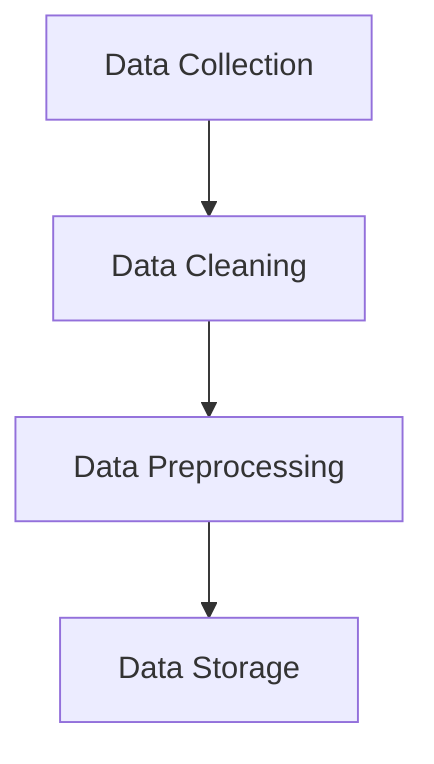

#### 6.2 微服务设计与开发

**6.2.1 模型服务实现**

模型服务负责管理LLM模型，包括模型的训练、加载、预测等。以下步骤用于实现模型服务：

1. **模型训练**：使用训练数据集训练LLM模型，可以采用预训练模型（如GPT-3、BERT等）或自定义模型。
2. **模型加载**：在服务启动时，加载预训练的模型到内存中，以便快速响应预测请求。
3. **模型预测**：接收文本输入，通过模型进行预测，返回预测结果。

以下是一个简单的模型服务实现的Mermaid流程图：

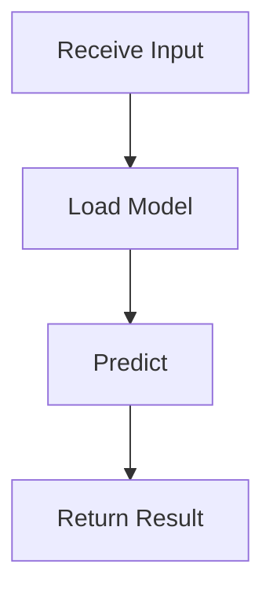

**6.2.2 API服务实现**

API服务负责接收用户请求，并将请求转发给模型服务。以下步骤用于实现API服务：

1. **接口定义**：定义RESTful API接口，如POST /predict，接收文本输入。
2. **请求处理**：处理接收到的请求，将文本输入转发给模型服务。
3. **响应处理**：接收模型服务返回的预测结果，并返回给用户。

以下是一个简单的API服务实现的Mermaid流程图：

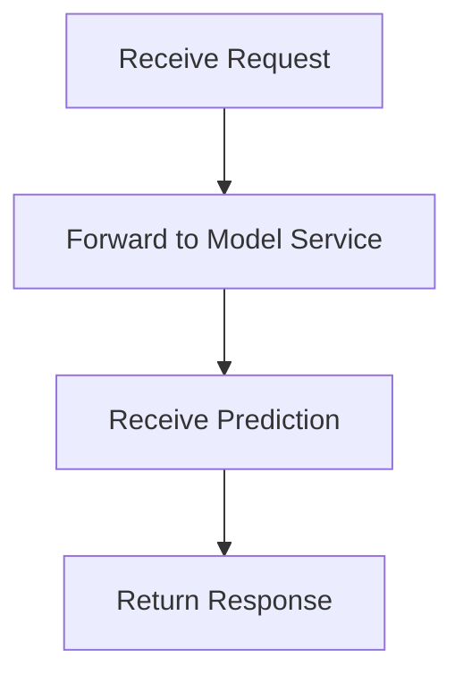

**6.2.3 数据服务实现**

数据服务负责管理数据存储和访问。以下步骤用于实现数据服务：

1. **数据存储**：根据项目需求，使用数据库存储数据，如用户数据、模型参数等。
2. **数据访问**：提供数据访问接口，如查询用户数据、更新模型参数等。
3. **数据同步**：确保数据在不同服务之间的同步和一致性。

以下是一个简单的数据服务实现的Mermaid流程图：

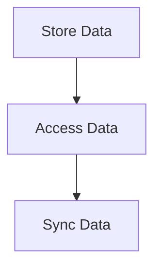

#### 6.3 系统集成与测试

**6.3.1 服务接口测试**

在实现微服务后，进行接口测试是确保服务功能正确的重要步骤。以下步骤用于服务接口测试：

1. **单元测试**：编写单元测试，验证每个服务的功能模块是否正常工作。
2. **集成测试**：将不同服务进行集成，测试服务之间的交互和协作是否正常。
3. **压力测试**：模拟高负载场景，测试系统的性能和稳定性。

以下是一个简单的服务接口测试流程的Mermaid流程图：

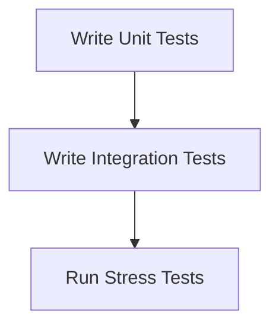

**6.3.2 系统性能测试**

系统性能测试是评估LLM微服务架构在实际运行中的性能表现。以下步骤用于系统性能测试：

1. **基准测试**：使用基准测试工具（如Apache JMeter、Locust等），模拟真实用户行为，评估系统的响应时间、吞吐量和资源利用率。
2. **负载测试**：逐步增加负载，测试系统在不同负载情况下的性能表现，找出系统的瓶颈。
3. **监控与优化**：通过监控系统（如Prometheus、Grafana等），收集系统运行数据，分析性能瓶颈，并优化系统配置和代码。

以下是一个简单的系统性能测试流程的Mermaid流程图：

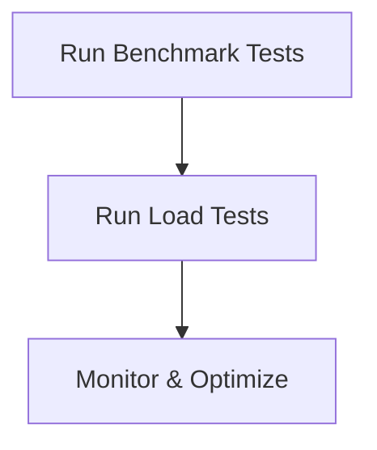

通过以上环境搭建、微服务设计与开发以及系统集成与测试，可以构建一个高效、可扩展的LLM微服务架构，为开发者提供强大的开发和管理工具。开发者应根据项目需求，灵活调整和优化系统设计，确保系统在实际运行中的稳定性和性能。

### 第7章：案例研究

在本章中，我们将通过一个实际案例来展示如何构建可扩展的LLM应用微服务架构。该案例是一个智能问答系统，旨在为用户提供实时、准确的回答。

#### 7.1 案例背景

某知名互联网公司希望开发一款智能问答系统，以提供24/7的客户支持服务。该系统需要具备以下功能：

- **实时问答**：用户可以通过文本输入提出问题，系统实时生成回答。
- **多语言支持**：系统支持多种语言，以满足不同地区用户的需求。
- **个性化推荐**：根据用户历史问题和偏好，提供个性化的回答推荐。
- **高可用性**：系统需具备高可用性，确保在高峰期也能稳定运行。

#### 7.2 架构设计与实现

**7.2.1 服务拆分**

为了实现上述功能，我们将智能问答系统拆分为多个微服务，包括：

- **问答服务（QuestionAnsweringService）**：负责接收用户输入，调用LLM模型进行预测，并返回答案。
- **多语言转换服务（LanguageTranslationService）**：负责将用户问题和答案转换为不同语言。
- **推荐服务（RecommendationService）**：根据用户历史行为和偏好，提供个性化的回答推荐。
- **用户管理服务（UserManagementService）**：负责用户的注册、登录、权限管理等功能。

**7.2.2 架构设计**

智能问答系统的整体架构设计如图所示：

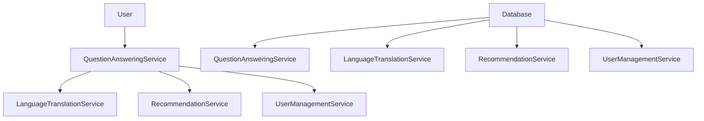

**7.2.3 实现细节**

**问答服务（QuestionAnsweringService）**：

1. **模型加载**：使用预训练的LLM模型，如GPT-3，将其加载到内存中。
2. **文本预处理**：接收用户输入，进行分词、去停用词等预处理操作。
3. **模型预测**：将预处理后的文本输入到LLM模型，生成预测答案。
4. **答案后处理**：对生成的答案进行格式化、语法修正等后处理操作。

**多语言转换服务（LanguageTranslationService）**：

1. **接口定义**：提供RESTful API接口，接收用户请求和目标语言。
2. **翻译模型**：使用预训练的翻译模型（如BERT）进行文本翻译。
3. **结果返回**：将翻译后的文本返回给用户。

**推荐服务（RecommendationService）**：

1. **用户行为分析**：收集用户的历史问题和答案，分析用户的兴趣和偏好。
2. **推荐算法**：使用协同过滤、内容推荐等算法，为用户生成个性化的推荐列表。
3. **结果返回**：将推荐结果返回给用户。

**用户管理服务（UserManagementService）**：

1. **用户注册**：接收用户注册请求，生成用户账户。
2. **用户登录**：验证用户身份，提供登录功能。
3. **权限管理**：根据用户角色和权限，提供不同的访问控制。

#### 7.3 问题与解决

在实现智能问答系统的过程中，可能会遇到以下问题：

1. **性能瓶颈**：随着用户数量的增加，系统的响应时间可能会延长。为了解决这一问题，可以采用以下策略：

   - **缓存机制**：在问答服务中使用缓存，存储用户问题和答案，减少重复计算的次数。
   - **并发处理**：在问答服务和推荐服务中使用多线程或异步处理，提高并发处理能力。
   - **负载均衡**：使用负载均衡器（如Nginx、HAProxy等）分配请求，减少单个服务器的负载。

2. **扩展性问题**：在系统上线后，随着用户数量的增加，需要扩展服务器的硬件资源。为了解决这一问题，可以采用以下策略：

   - **水平扩展**：增加服务器的数量，使用负载均衡器实现流量的动态分配。
   - **容器化**：使用容器化技术（如Docker、Kubernetes等），方便部署和管理服务。
   - **分布式存储**：使用分布式存储系统（如Elasticsearch、MongoDB等），实现数据的横向扩展。

3. **数据一致性**：在分布式系统中，确保数据的一致性是一个挑战。为了解决这一问题，可以采用以下策略：

   - **分布式事务**：使用分布式事务机制（如两阶段提交、最终一致性等），确保数据的一致性。
   - **分布式锁**：使用分布式锁（如Redisson、Zookeeper等），避免并发操作导致的数据不一致。
   - **缓存一致性**：通过缓存一致性协议（如Gossip协议、Paxos算法等），确保缓存与数据库的数据一致性。

#### 7.4 案例总结

通过以上实际案例，我们可以看到如何构建一个高效、可扩展的LLM应用微服务架构。合理的微服务设计、性能优化和扩展性策略，是确保系统稳定运行和快速响应的关键。在未来的发展中，开发者应不断优化系统设计，应对不断变化的需求和挑战。

### 第8章：最佳实践与性能优化

在构建可扩展的LLM应用微服务架构过程中，最佳实践和性能优化策略是确保系统高效、稳定运行的关键。以下将介绍一些常见性能优化案例、扩展性优化策略以及安全性与隐私保护的措施。

#### 8.1 性能优化案例分享

**案例1：缓存机制优化**

一个常见的性能优化案例是使用缓存机制提高系统的响应速度。例如，在问答服务中，对于频繁访问的问题和答案，可以将其缓存到内存中，减少对数据库的访问次数。

**优化步骤**：

1. **缓存策略选择**：根据系统的实际需求，选择合适的缓存策略，如LRU（Least Recently Used）算法或LFU（Least Frequently Used）算法。
2. **缓存分层**：将缓存分为多个层级，如一级缓存（内存缓存）、二级缓存（磁盘缓存）等，以提高缓存命中率。
3. **缓存预热**：在系统启动时，预先加载热门数据到缓存中，减少系统启动时的延迟。

**效果**：通过缓存机制优化，可以显著减少数据库访问次数，提高系统的响应速度。

**案例2：并发处理优化**

在高并发场景下，系统的性能可能会受到影响。以下是一个并发处理优化的案例：

**优化步骤**：

1. **线程池**：使用线程池管理并发任务，避免频繁创建和销毁线程，提高系统的响应速度。
2. **异步处理**：通过异步处理，将任务提交到异步队列，由后台线程执行，减少同步等待时间。
3. **消息队列**：使用消息队列（如Kafka、RabbitMQ等）实现任务调度和负载均衡，提高系统的并发处理能力。

**效果**：通过并发处理优化，可以提高系统的并发能力和吞吐量，确保系统在高峰期也能稳定运行。

#### 8.2 扩展性优化策略

扩展性优化策略是确保系统能够应对未来增长和变化的关键。以下是一些常见的扩展性优化策略：

**1. 水平扩展**：

- **增加服务器数量**：通过增加服务器的数量，实现系统的水平扩展。使用负载均衡器（如Nginx、HAProxy等）分配请求，减少单个服务器的负载。
- **容器化技术**：使用容器化技术（如Docker、Kubernetes等），方便部署和管理服务。容器化技术可以提高系统的可扩展性和灵活性。

**2. 垂直扩展**：

- **增加硬件资源**：通过增加服务器的硬件资源（如CPU、内存等），实现系统的垂直扩展。这种方式适用于处理高负载、高并发的场景。
- **分布式存储**：使用分布式存储系统（如Elasticsearch、MongoDB等），实现数据的横向扩展。分布式存储可以提高系统的数据存储和处理能力。

**3. 弹性伸缩**：

- **自动伸缩**：通过自动化工具（如Kubernetes、AWS Auto Scaling等），实现系统的自动伸缩。自动化工具可以根据系统负载自动调整服务器的数量。
- **监控与反馈**：通过监控系统（如Prometheus、Grafana等），收集系统运行数据，分析系统的性能瓶颈和扩展性需求。根据监控数据，优化系统设计和扩展策略。

#### 8.3 安全性与隐私保护

在构建可扩展的LLM应用微服务架构时，安全性和隐私保护是至关重要的。以下是一些常见的安全性与隐私保护措施：

**1. 访问控制**：

- **用户身份验证**：使用用户身份验证机制（如OAuth2、JWT等），确保只有经过认证的用户才能访问系统。
- **权限管理**：根据用户角色和权限，限制用户对系统资源的访问权限，防止未授权访问。

**2. 数据加密**：

- **传输加密**：使用HTTPS协议，确保数据在传输过程中的安全性。
- **存储加密**：对存储在数据库中的敏感数据进行加密，防止数据泄露。

**3. 安全审计**：

- **日志记录**：记录系统操作日志，包括用户访问、数据修改等操作，便于审计和追踪。
- **异常检测**：通过异常检测工具，监控系统的异常行为和潜在威胁，及时发现和处理安全漏洞。

**4. 隐私保护**：

- **数据匿名化**：对用户数据进行匿名化处理，防止个人隐私泄露。
- **数据脱敏**：对敏感数据进行脱敏处理，确保数据在存储和传输过程中的安全性。

通过以上最佳实践和性能优化策略，可以确保构建的可扩展的LLM应用微服务架构高效、稳定、安全地运行。开发者应根据具体需求和场景，灵活应用这些策略，不断提高系统的性能和安全性。

### 第9章：未来趋势与挑战

随着LLM和微服务架构的不断发展和成熟，它们在AI领域中的应用前景广阔。然而，在这条道路上，开发者也将面临诸多挑战和机遇。

#### 9.1 LLM技术的发展趋势

**1. 模型规模与精度**：未来LLM模型将继续朝着更大规模、更高精度的方向发展。随着计算资源和数据集的不断增加，研究人员和开发者将能够训练更复杂的模型，从而提升模型在各类任务中的性能。

**2. 多模态学习**：LLM将不仅仅局限于处理文本数据，还将扩展到图像、音频等多模态数据。多模态学习的进步将使LLM在现实世界中的应用更加广泛，如智能助手、虚拟现实等。

**3. 自适应与个性化**：LLM将更加注重自适应和个性化能力。通过深度学习技术，LLM可以更好地理解用户的行为和偏好，提供更加精准和个性化的服务。

**4. 强化学习与策略优化**：强化学习（Reinforcement Learning）与LLM的结合，将使LLM在决策和策略优化方面发挥更大作用，如自动化交易、智能推荐等。

#### 9.2 微服务架构面临的挑战

**1. 分布式系统的复杂性**：微服务架构虽然带来了灵活性和可扩展性，但也增加了系统的复杂性。服务拆分、依赖管理、数据一致性等问题需要开发者进行深入研究和解决。

**2. 性能瓶颈**：在高并发场景下，微服务架构可能会出现性能瓶颈。优化服务间的通信、减少延迟、提高缓存命中率等措施是解决这一问题的方向。

**3. 安全性与隐私保护**：分布式系统在安全性方面面临更大的挑战。开发者需要不断改进访问控制、数据加密、安全审计等技术，确保系统的安全性和用户隐私。

**4. 运维与监控**：微服务架构的运维和监控比传统单体应用更为复杂。需要开发自动化运维工具和监控系统，实现服务的自动部署、性能监控、故障恢复等功能。

#### 9.3 未来研究方向

**1. 服务网格（Service Mesh）**：服务网格是一种新型的基础设施，用于简化微服务架构中的服务间通信。未来研究可以探索如何更好地集成服务网格与LLM应用，提高系统的性能和可维护性。

**2. 联邦学习（Federated Learning）**：联邦学习可以解决数据隐私和安全问题，使多个分布式服务共享模型而不需要交换数据。未来研究可以探索如何将联邦学习与LLM应用结合，提高系统的安全性和隐私保护。

**3. 模型压缩与量化**：随着模型规模的增加，模型的存储和计算成本也在增加。未来研究可以探索如何对LLM模型进行压缩和量化，减少模型的大小和计算资源的需求。

**4. 实时交互与响应**：未来研究可以探索如何提高LLM应用的实时交互和响应能力，使其在复杂的实时场景中能够快速、准确地完成任务。

总之，未来LLM和微服务架构的发展将充满机遇与挑战。通过不断创新和优化，开发者可以构建出更加高效、安全、可扩展的AI应用，为各行各业带来革命性的变革。

### 第10章：小结与展望

#### 10.1 本书主要内容回顾

本文从多个角度深入探讨了构建可扩展的LLM应用微服务架构的方法与步骤。主要内容包括：

1. **LLM与微服务架构概述**：介绍了LLM的概念、作用以及微服务架构的核心原理。
2. **LLM核心概念与架构设计**：详细讲解了LLM的基础架构、数据流设计以及微服务设计原则。
3. **微服务架构设计方法论**：探讨了服务拆分策略、依赖管理、容错与弹性设计等关键方法。
4. **可扩展性策略与优化**：介绍了扩展性需求分析、性能优化技术以及持续集成与部署策略。
5. **应用实践**：通过实际案例展示了如何实现LLM微服务架构以及进行系统集成与测试。
6. **优化与展望**：分享了最佳实践、性能优化策略、安全性与隐私保护措施以及未来趋势与挑战。

#### 10.2 需要关注的问题

在构建可扩展的LLM应用微服务架构时，开发者需要关注以下问题：

1. **服务拆分策略**：合理的服务拆分是确保系统模块化、可维护性的关键。
2. **服务间通信机制**：选择合适的通信机制，如RESTful API、消息队列等，确保服务之间的高效通信。
3. **性能优化**：通过缓存机制、并发处理等技术，提高系统的性能和响应能力。
4. **安全性**：确保系统的安全性和用户隐私，采用访问控制、数据加密等技术。
5. **监控与反馈**：通过监控系统收集系统运行数据，及时发现和解决问题。

#### 10.3 拓展阅读推荐

为了进一步深入了解LLM和微服务架构，以下书籍和资源推荐：

1. **《深度学习》（Deep Learning）**：Goodfellow, Bengio, Courville著。系统介绍了深度学习的基础知识和技术，是学习LLM的入门经典。
2. **《微服务设计》（Designing Microservices）**：Chris Richardson著。详细介绍了微服务架构的设计原则和实践，适合初学者和进阶者阅读。
3. **《大规模分布式系统设计与实践》**：王志英著。讲解了分布式系统设计的基本概念和技术，对微服务架构的理解和实施具有指导意义。
4. **《Kubernetes权威指南》**：张陈飞等著。系统介绍了Kubernetes的架构、安装、配置和使用，是容器化和微服务部署的重要参考书。
5. **《GitHub上优秀的LLM开源项目》**：通过GitHub搜索和筛选，可以找到许多优秀的LLM开源项目，如GPT-3、BERT等，这些项目包含了丰富的文档和示例代码。

通过学习和实践以上内容，开发者可以更好地理解和应用LLM与微服务架构，构建高效、可扩展的AI应用。

### 结尾

本文详细探讨了构建可扩展的LLM应用微服务架构的方法与步骤，从理论基础到实际应用，再到优化与展望，为开发者提供了一套完整的解决方案。通过合理的服务拆分、高效的通信机制、性能优化策略以及安全性与隐私保护措施，开发者可以构建出高效、稳定、可扩展的LLM应用微服务架构。

未来，随着LLM和微服务架构的不断发展和成熟，我们将继续面临新的挑战和机遇。开发者应不断学习和实践，紧跟技术前沿，为构建更加智能、高效的AI应用而努力。

最后，感谢读者对本文的关注，希望本文能为您的LLM应用开发提供有价值的参考。祝您在人工智能的道路上不断前行，创造更多奇迹！

---

**作者：AI天才研究院/AI Genius Institute & 禅与计算机程序设计艺术 /Zen And The Art of Computer Programming**

