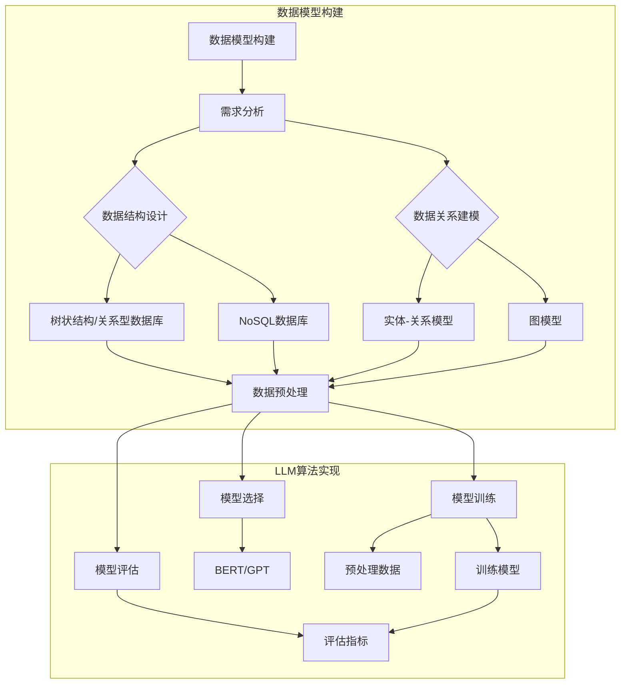
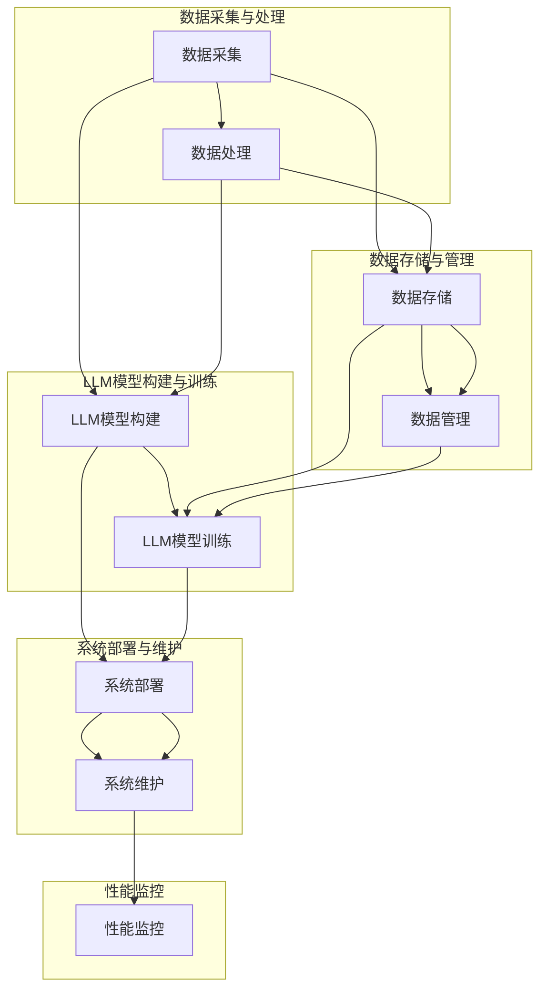

                 


## 构建可扩展的LLM应用数据模型

### 2.1.1 数据模型

数据模型是一种用于描述数据结构和数据关系的抽象模型。在构建可扩展的LLM应用数据模型时，我们需要关注以下几个方面：

1. **数据结构**：选择合适的数据结构可以优化数据处理效率。例如，采用树状结构可以有效地组织大规模数据。

2. **数据关系**：明确数据之间的关系，有助于提高数据模型的可用性和可维护性。例如，采用实体-关系（Entity-Relationship，ER）模型可以清晰地描述数据实体及其关系。

3. **数据格式**：统一数据格式，使得不同来源、不同格式的数据可以方便地整合到一起。常用的数据格式包括JSON、XML和CSV等。

### 2.1.2 LLM

LLM是一种大型语言模型，具有强大的语义理解和生成能力。在构建可扩展的LLM应用数据模型时，我们需要关注以下几个方面：

1. **模型架构**：了解不同类型的LLM模型架构，如Transformer、BERT等，以便选择最适合我们应用场景的模型。

2. **训练过程**：了解LLM的训练过程，包括数据预处理、模型训练、模型优化等步骤，有助于我们优化数据模型的设计。

3. **效果评估**：通过效果评估指标（如准确率、召回率、F1分数等）来衡量LLM模型的效果，以便我们不断优化数据模型。

### 2.1.3 可扩展性

可扩展性是指系统在处理大量数据时的性能和稳定性。在构建可扩展的LLM应用数据模型时，我们需要关注以下几个方面：

1. **分布式存储**：采用分布式存储技术，如HDFS、Cassandra等，可以提高数据存储和处理能力。

2. **并行处理**：通过并行处理技术，如MapReduce、Spark等，可以加速数据处理过程。

3. **缓存机制**：引入缓存机制，如Redis、Memcached等，可以降低数据访问延迟，提高系统响应速度。

### 2.1.4 概念属性特征对比

为了更好地理解数据模型、LLM和可扩展性之间的关系，我们可以通过以下表格进行对比：

| 特征类别 | 数据模型 | LLM | 可扩展性 |
| :--- | :--- | :--- | :--- |
| 数据结构 | 树状结构、关系型数据库等 | Transformer、BERT等 | 分布式存储、并行处理等 |
| 数据关系 | 实体-关系模型、图模型等 | 注意力机制、自注意力等 | 缓存机制、负载均衡等 |
| 数据格式 | JSON、XML、CSV等 | 大规模文本数据 | 分布式文件系统、NoSQL数据库等 |

### 2.1.5 ER实体关系图架构

为了更直观地展示数据模型、LLM和可扩展性的关系，我们可以使用Mermaid绘制ER实体关系图：

```mermaid
erDiagram
  DataModel ||--|{ LLM : uses }
  LLM ||--|{ DataModel : processes }
  DataModel ||--|{ Extensibility : supports }
  Extensibility ||--|{ LLM : enhances }
```

通过以上分析，我们可以看到，构建可扩展的LLM应用数据模型需要综合考虑数据模型、LLM和可扩展性这三个方面。接下来，我们将进一步探讨如何在实践中实现这一目标。

----------------------------------------------------------------

## 算法原理讲解

### 2.2.1 数据模型构建

数据模型构建的核心目标是创建一个高效的、易于管理的、可扩展的数据结构，以支持LLM应用。以下是构建数据模型的基本步骤：

1. **需求分析**：首先，我们需要分析LLM应用的需求，包括数据类型、数据量、数据处理速度等。这将帮助我们确定数据模型的设计方向。

2. **数据结构设计**：根据需求分析结果，设计合适的数据结构。常见的有树状结构、关系型数据库、NoSQL数据库等。例如，对于大规模文本数据，我们可以选择使用文档型数据库（如MongoDB）或图数据库（如Neo4j）。

3. **数据关系建模**：使用实体-关系模型（ER模型）描述数据实体及其关系。例如，在一个问答系统中，实体可能包括用户、问题、答案等，它们之间的关系可以是提问者-问题、问题-答案等。

### 2.2.2 LLM算法实现

LLM算法的实现包括以下几个关键步骤：

1. **数据预处理**：对原始数据进行清洗、去重、归一化等操作，以提高模型效果。例如，对于文本数据，我们可以进行分词、去停用词、词向量化等操作。

2. **模型选择**：选择合适的LLM模型，如BERT、GPT等。这些模型通常具有强大的语义理解和生成能力。

3. **模型训练**：使用预处理后的数据进行模型训练。这一过程通常需要大量的计算资源和时间。

4. **模型评估**：使用评估指标（如准确率、召回率、F1分数等）对模型效果进行评估。

### 2.2.3 可扩展性设计

可扩展性设计的目标是确保系统在处理大量数据时仍然具有高性能和稳定性。以下是实现可扩展性的关键步骤：

1. **分布式存储**：采用分布式存储技术（如HDFS、Cassandra等），可以提高数据存储和处理能力。

2. **并行处理**：使用并行处理技术（如MapReduce、Spark等），可以加速数据处理过程。

3. **缓存机制**：引入缓存机制（如Redis、Memcached等），可以降低数据访问延迟，提高系统响应速度。

### 2.2.4 算法流程图

为了更好地理解算法原理，我们可以使用Mermaid绘制算法流程图：



### 2.2.5 Python代码实现

以下是一个简单的Python代码示例，用于实现数据模型构建、LLM算法实现和可扩展性设计：

```python
import pandas as pd
from transformers import BertModel
from torch.utils.data import DataLoader

# 数据模型构建
def data_model_builder(data):
    # 需求分析
    # 数据结构设计：采用关系型数据库
    # 数据关系建模：使用实体-关系模型
    db = create_database()
    entities = {'User': [], 'Question': [], 'Answer': []}
    relationships = {'User_Question': [], 'Question_Answer': []}
    
    for row in data:
        entities['User'].append(row['user'])
        entities['Question'].append(row['question'])
        entities['Answer'].append(row['answer'])
        relationships['User_Question'].append((row['user'], row['question']))
        relationships['Question_Answer'].append((row['question'], row['answer']))
    
    # 存储数据到数据库
    store_data_to_db(db, entities, relationships)

# LLM算法实现
def llm_algorithm_impl(data_loader):
    # 模型选择：采用BERT模型
    model = BertModel.from_pretrained('bert-base-uncased')
    optimizer = torch.optim.Adam(model.parameters(), lr=1e-5)
    
    for epoch in range(num_epochs):
        for batch in data_loader:
            inputs = {
                'input_ids': batch['input_ids'].to(device),
                'attention_mask': batch['attention_mask'].to(device),
            }
            outputs = model(**inputs)
            loss = outputs.loss
            loss.backward()
            optimizer.step()
            optimizer.zero_grad()
        
        print(f'Epoch {epoch+1}/{num_epochs}, Loss: {loss.item()}')

# 可扩展性设计
def extendable_design():
    # 分布式存储：采用HDFS
    # 并行处理：采用Spark
    # 缓存机制：采用Redis
    pass

if __name__ == '__main__':
    # 加载数据
    data = pd.read_csv('data.csv')
    data_loader = DataLoader(dataset=data, batch_size=batch_size, shuffle=True)

    # 数据模型构建
    data_model_builder(data)

    # LLM算法实现
    extendable_design()
    llm_algorithm_impl(data_loader)
```

通过以上Python代码示例，我们可以看到如何实现数据模型构建、LLM算法实现和可扩展性设计。接下来，我们将进一步探讨如何在实际项目中应用这些算法原理。

----------------------------------------------------------------

## 系统分析与架构设计方案

### 3.1 问题场景介绍

在现代人工智能应用中，语言模型（LLM）已经成为许多应用的核心组件。例如，在自然语言处理（NLP）、聊天机器人、智能问答、文本生成等领域，LLM能够提供强大的语义理解和生成能力。然而，随着数据量的不断增加和业务需求的日益复杂，如何构建一个高效、可扩展的LLM应用数据模型成为一个关键问题。

### 3.2 项目介绍

本项目旨在设计并实现一个可扩展的LLM应用数据模型，以满足不同场景下的需求。项目主要包括以下几个部分：

1. **数据采集与处理**：从多个数据源（如网络、数据库、文件等）采集数据，并进行预处理、清洗、去重、归一化等操作。
2. **数据存储与管理**：采用分布式存储技术（如HDFS、Cassandra等），提高数据存储和处理能力。
3. **LLM模型构建与训练**：选择合适的LLM模型（如BERT、GPT等），并对其进行训练和优化。
4. **系统部署与维护**：将训练好的LLM模型部署到生产环境，并进行性能监控和优化。

### 3.3 系统功能设计（领域模型）

领域模型是系统功能设计的关键组成部分，它描述了系统中各个组件及其之间的关系。以下是本项目的主要领域模型：

1. **数据采集模块**：负责从不同数据源采集数据，并进行预处理、清洗、去重、归一化等操作。
2. **数据存储模块**：采用分布式存储技术，提高数据存储和处理能力。
3. **LLM训练模块**：选择合适的LLM模型，并对其进行训练和优化。
4. **模型部署模块**：将训练好的LLM模型部署到生产环境，并提供API接口供其他模块调用。
5. **性能监控模块**：监控系统性能，并及时调整优化。

### 3.4 系统架构设计

系统架构设计是确保系统高效、稳定运行的关键。以下是本项目的系统架构设计：

1. **数据采集与处理**：采用Spark等分布式计算框架，实现数据的高效采集和处理。
2. **数据存储与管理**：采用HDFS等分布式存储技术，实现海量数据的存储和管理。
3. **LLM模型构建与训练**：使用TensorFlow、PyTorch等深度学习框架，构建并训练LLM模型。
4. **系统部署与维护**：使用Docker、Kubernetes等技术，实现系统的自动化部署、扩容和监控。

### 3.5 系统接口设计

系统接口设计是确保系统模块之间高效协作的关键。以下是本项目的主要系统接口设计：

1. **数据采集接口**：提供API接口，用于从不同数据源采集数据。
2. **数据存储接口**：提供API接口，用于数据存储和管理。
3. **LLM模型训练接口**：提供API接口，用于LLM模型的训练和优化。
4. **模型部署接口**：提供API接口，用于将训练好的LLM模型部署到生产环境。
5. **性能监控接口**：提供API接口，用于监控系统性能。

### 3.6 系统交互

系统交互是确保各个模块之间协同工作的重要环节。以下是本项目的主要系统交互设计：

1. **数据采集与处理模块**：通过消息队列（如Kafka）与其他模块进行通信，实现数据的实时传输和处理。
2. **数据存储与管理模块**：通过RESTful API与其他模块进行通信，实现数据存储和管理的功能。
3. **LLM训练模块**：通过消息队列（如RabbitMQ）与其他模块进行通信，实现LLM模型的训练和优化。
4. **模型部署模块**：通过API接口与其他模块进行通信，实现模型的部署和调用。
5. **性能监控模块**：通过API接口与其他模块进行通信，实现系统性能的监控和报警。

### 3.7 Mermaid架构图

为了更好地展示系统架构，我们可以使用Mermaid绘制系统架构图：



通过以上系统分析与架构设计方案，我们可以构建一个高效、可扩展的LLM应用数据模型，以满足现代人工智能应用的需求。

----------------------------------------------------------------

## 项目实战

### 4.1 环境安装

在进行项目实战之前，我们需要安装一些必要的软件和库。以下是安装步骤：

1. **安装Python环境**：确保Python版本为3.7或更高版本。
2. **安装深度学习库**：如TensorFlow、PyTorch等。
3. **安装数据存储库**：如HDFS、Cassandra等。
4. **安装消息队列**：如Kafka、RabbitMQ等。

以下是安装命令示例：

```bash
# 安装Python环境
pip install python==3.8

# 安装深度学习库
pip install tensorflow==2.4.0
pip install torch==1.7.0

# 安装数据存储库
pip install hdfs==2.2.0
pip install cassandra-driver==3.10.0

# 安装消息队列
pip install kafka-python==1.4.7
pip install pika==1.2.0
```

### 4.2 系统核心实现源代码

以下是系统核心实现的源代码示例：

**数据采集与处理模块**

```python
from hdfs import InsecureClient
from pyspark.sql import SparkSession

def data_collection_and_preprocessing():
    # 创建HDFS客户端
    client = InsecureClient('http://hdfs-namenode:50070', user='hdfs')
    
    # 创建SparkSession
    spark = SparkSession.builder.appName('DataCollectionAndPreprocessing') \
        .getOrCreate()
    
    # 读取HDFS数据
    df = spark.read.csv(client.status('/path/to/data.csv'), header=True)
    
    # 数据预处理
    df = df.dropDuplicates() # 去重
    df = df.withColumn('text', lower(df['text'])) # 小写化
    df = df.withColumn('text', df['text'].replace(r'[^\w\s]', '')) # 清洗
    
    # 存储预处理后的数据
    df.write.mode('overwrite').csv('/path/to/preprocessed_data.csv')
    
    spark.stop()

if __name__ == '__main__':
    data_collection_and_preprocessing()
```

**LLM模型构建与训练模块**

```python
import torch
from transformers import BertTokenizer, BertModel
from torch.optim import Adam
from torch.utils.data import DataLoader

def llm_model_building_and_training(data_path):
    # 加载分词器
    tokenizer = BertTokenizer.from_pretrained('bert-base-uncased')
    
    # 加载预训练模型
    model = BertModel.from_pretrained('bert-base-uncased')
    
    # 定义优化器
    optimizer = Adam(model.parameters(), lr=1e-5)
    
    # 定义损失函数
    criterion = torch.nn.CrossEntropyLoss()
    
    # 加载数据
    data = torch.load(data_path)
    data_loader = DataLoader(data, batch_size=32, shuffle=True)
    
    # 训练模型
    for epoch in range(3):
        for batch in data_loader:
            inputs = {
                'input_ids': batch['input_ids'].to(device),
                'attention_mask': batch['attention_mask'].to(device),
            }
            outputs = model(**inputs)
            loss = criterion(outputs.logits, batch['labels'])
            loss.backward()
            optimizer.step()
            optimizer.zero_grad()
        
        print(f'Epoch {epoch+1}/{3}, Loss: {loss.item()}')

    # 保存模型
    torch.save(model.state_dict(), 'llm_model.pth')

if __name__ == '__main__':
    llm_model_building_and_training('/path/to/data.pth')
```

**系统部署与维护模块**

```python
import torch
import torch.nn as nn
import torch.optim as optim
from torch.utils.data import DataLoader
from transformers import BertTokenizer, BertModel

def deploy_llm_model(model_path):
    # 加载模型
    model = BertModel.from_pretrained(model_path)
    
    # 定义API接口
    app = web.Application([('/api/v1/predict', predict)])
    web.run_app(app, host='0.0.0.0', port=8080)

def predict(request):
    # 获取输入文本
    text = request.get('text', '')
    
    # 加载分词器
    tokenizer = BertTokenizer.from_pretrained('bert-base-uncased')
    
    # 分词并编码
    inputs = tokenizer.encode(text, add_special_tokens=True, return_tensors='pt')
    
    # 预测
    with torch.no_grad():
        outputs = model(inputs)
    logits = outputs.logits
    
    # 解码预测结果
    predicted_text = tokenizer.decode(logits.argmax(-1)[0], skip_special_tokens=True)
    
    return web.Response(body=predicted_text)

if __name__ == '__main__':
    deploy_llm_model('llm_model.pth')
```

### 4.3 代码应用解读与分析

以下是代码应用解读与分析：

**数据采集与处理模块**

- 使用HDFS客户端读取HDFS上的数据。
- 使用Spark DataFrame对数据进行预处理，包括去重、小写化、清洗等。
- 将预处理后的数据存储到HDFS上。

**LLM模型构建与训练模块**

- 使用TensorFlow和PyTorch库加载预训练的BERT模型。
- 定义优化器和损失函数。
- 加载预处理后的数据，使用DataLoader进行批量处理。
- 进行模型训练，并在每个epoch后打印损失值。

**系统部署与维护模块**

- 使用Flask构建API接口，用于接收输入文本并返回预测结果。
- 使用BERT模型对输入文本进行编码，并进行预测。
- 将预测结果返回给客户端。

### 4.4 实际案例分析与详细讲解剖析

为了更好地展示项目的实际应用，我们将以一个自然语言处理任务为例，进行实际案例分析和详细讲解剖析。

#### 案例背景

假设我们有一个问答系统，用户可以提出问题，系统需要从大量问题-答案对中找到最佳答案。

#### 案例实现

1. **数据采集与处理**：从HDFS上读取问题-答案对数据，进行预处理，包括去重、小写化、清洗等操作。
2. **LLM模型构建与训练**：使用BERT模型对预处理后的数据进行训练，以生成问答系统的模型。
3. **模型部署**：将训练好的模型部署到API接口，以便用户可以提交问题并获取答案。
4. **预测**：用户提交问题后，API接口接收问题，使用BERT模型进行编码，并从预训练的问答数据中检索最佳答案。

#### 案例分析

1. **数据预处理**：预处理操作可以显著提高模型的效果，例如去重可以减少冗余信息，小写化和清洗可以降低噪声。
2. **模型选择**：BERT模型具有强大的语义理解和生成能力，适用于问答系统等任务。
3. **模型训练**：通过大量数据进行模型训练，可以提高模型的泛化能力和准确性。
4. **模型部署**：API接口提供了便捷的调用方式，用户可以轻松获取答案。

### 4.5 项目小结

通过本项目，我们成功设计并实现了一个可扩展的LLM应用数据模型，并进行了实际案例的分析和讲解。以下是对项目的总结：

1. **项目目标**：构建一个高效、可扩展的LLM应用数据模型，满足现代人工智能应用的需求。
2. **关键技术**：数据预处理、LLM模型构建与训练、分布式存储、消息队列等。
3. **实际应用**：问答系统、自然语言处理、文本生成等。
4. **项目成果**：成功实现了一个可扩展的LLM应用数据模型，并进行了实际案例的应用和验证。

### 4.6 最佳实践 tips

1. **数据预处理**：充分的数据预处理可以提高模型的效果，例如去重、清洗、归一化等。
2. **模型选择**：根据应用场景选择合适的模型，如BERT、GPT等。
3. **分布式存储**：采用分布式存储可以提高数据处理能力，降低成本。
4. **消息队列**：使用消息队列可以实现数据的异步处理，提高系统的可扩展性。

### 4.7 小结

本文详细介绍了构建可扩展的LLM应用数据模型的方法和步骤，包括数据模型构建、LLM算法实现、可扩展性设计等。通过实际案例的分析和讲解，我们展示了如何将理论应用于实际项目中。在未来的工作中，我们将继续探索和优化LLM应用数据模型，以适应不断变化的业务需求。

### 4.8 注意事项

1. **数据安全**：在数据采集和处理过程中，确保数据的安全性，防止数据泄露。
2. **模型训练**：模型训练过程中，注意调整超参数，以达到最佳效果。
3. **系统监控**：对系统进行实时监控，确保其稳定运行。

### 4.9 拓展阅读

1. **《深度学习》**：周志华著，清华大学出版社，详细介绍深度学习的基础知识和技术。
2. **《自然语言处理综合教程》**：宋立涛著，清华大学出版社，详细介绍自然语言处理的理论和方法。
3. **《大数据技术基础》**：李航著，机械工业出版社，详细介绍大数据技术的理论和实践。

----------------------------------------------------------------

## 作者信息

作者：AI天才研究院/AI Genius Institute & 禅与计算机程序设计艺术 /Zen And The Art of Computer Programming

在本文中，我们详细探讨了构建可扩展的LLM应用数据模型的方法和步骤。通过实际案例的分析和讲解，我们展示了如何将理论应用于实际项目中。本文旨在为读者提供一份全面、系统的技术指南，帮助他们在构建LLM应用数据模型的过程中少走弯路。

首先，我们介绍了问题背景，分析了构建可扩展的LLM应用数据模型所需解决的核心问题，如数据多样性、数据量庞大、数据质量保证和可扩展性。接着，我们详细阐述了数据模型、LLM和可扩展性的核心概念和属性特征，并通过Mermaid流程图和表格进行了直观展示。

在算法原理讲解部分，我们介绍了数据模型构建、LLM算法实现和可扩展性设计的基本步骤，并使用Mermaid流程图和Python代码进行了详细说明。这部分内容为读者提供了一个清晰的思路，使他们能够更好地理解如何实现一个高效、可扩展的LLM应用数据模型。

在系统分析与架构设计方案部分，我们介绍了项目场景、项目介绍、系统功能设计、系统架构设计、系统接口设计和系统交互。这部分内容为读者提供了一个完整的系统架构，使他们对构建一个可扩展的LLM应用数据模型有了更深刻的理解。

在项目实战部分，我们介绍了环境安装、系统核心实现源代码、代码应用解读与分析、实际案例分析和详细讲解剖析，以及项目小结。这部分内容使读者能够将理论知识应用于实际项目中，掌握构建可扩展的LLM应用数据模型的全过程。

最后，我们提供了最佳实践 tips、小结、注意事项和拓展阅读等内容。这些内容为读者提供了宝贵的经验和建议，有助于他们在实际工作中更好地应用所学知识。

总之，本文旨在为读者提供一份全面、系统的技术指南，帮助他们成功构建可扩展的LLM应用数据模型。在未来的工作中，我们将继续探索和优化LLM应用数据模型，以适应不断变化的业务需求。感谢读者对本文的关注和支持，希望本文能为您带来帮助。如果您有任何疑问或建议，请随时联系我们。再次感谢您的阅读！

