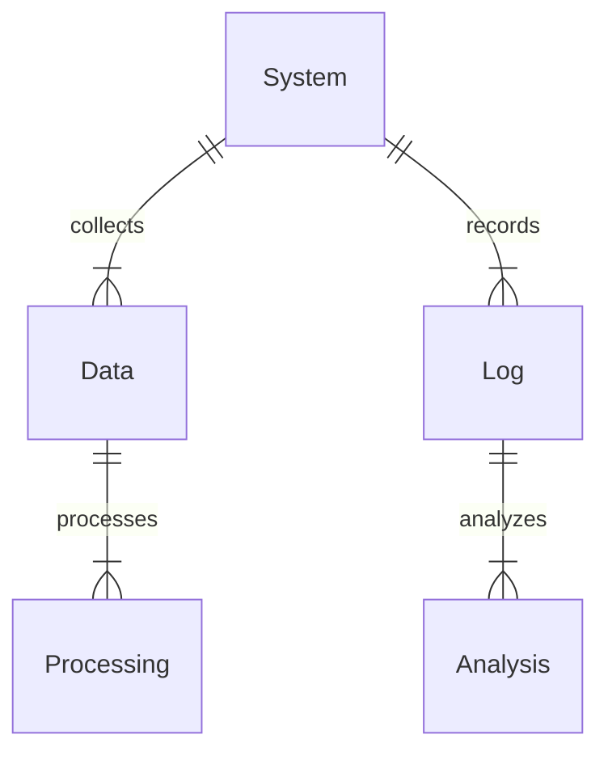
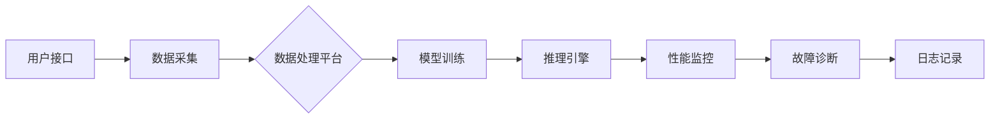
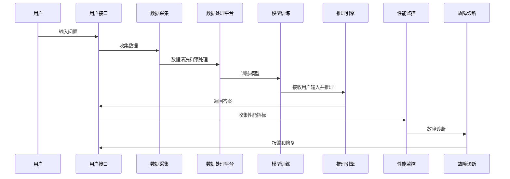
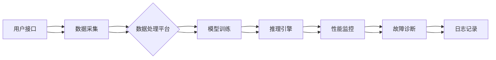

                 


## 《构建可观测的LLM应用系统》
关键词：低层次语言模型、可观测性、算法原理、系统架构、项目实战

> 摘要：本文将深入探讨如何构建可观测的LLM应用系统，通过逐步分析核心概念、算法原理、系统架构和项目实战，帮助读者全面理解并掌握构建高效、可靠的LLM应用系统的关键技术和方法。

## 目录大纲设计流程

### 第一步：理解书名和主题
《构建可观测的LLM应用系统》的主题是介绍如何通过可观测性技术来构建、优化和部署低层次语言模型（LLM）应用系统。这本书的目标是帮助读者深入了解可观测性在LLM应用系统中的重要性，并掌握构建高效、可靠的LLM应用系统的核心技术和方法。

### 第二步：确定核心章节内容
本书的核心章节内容应包括以下方面：
1. 背景介绍：核心概念术语说明、问题背景、问题描述、问题解决、边界与外延、概念结构与核心要素组成。
2. 核心概念与联系：可观测性的核心概念、相关术语解释、与LLM应用系统的联系。
3. 算法原理讲解：LLM算法原理、数学模型、公式，以及详细的Python源代码示例。
4. 数学公式与举例说明：使用LaTeX和Python对数学模型进行详细讲解，并结合实际案例进行举例说明。
5. 系统分析与架构设计方案：问题场景介绍、项目介绍、系统功能设计、系统架构设计、系统接口设计和系统交互。
6. 项目实战：环境安装、系统核心实现源代码、代码应用解读与分析、实际案例分析和详细讲解剖析、项目小结。
7. 最佳实践 tips、小结、注意事项、拓展阅读等内容。

### 第三步：设计目录结构
以下是初步设计的目录结构：

1. 引言
2. 背景介绍
3. 核心概念与联系
   - 可观测性核心概念
   - 与LLM应用系统的联系
4. 算法原理讲解
   - LLM算法原理
   - 数学模型与公式
   - Python源代码示例
5. 数学公式与举例说明
   - LaTeX格式嵌入
   - Python代码示例
6. 系统分析与架构设计方案
   - 问题场景介绍
   - 项目介绍
   - 系统功能设计
   - 系统架构设计
   - 系统接口设计
   - 系统交互
7. 项目实战
   - 环境安装
   - 系统核心实现源代码
   - 代码应用解读与分析
   - 实际案例分析与详细讲解
   - 项目小结
8. 最佳实践 tips
9. 小结
10. 注意事项
11. 拓展阅读

### 第四步：细化章节内容
根据书名和主题，进一步细化每个章节的内容，确保涵盖核心概念、算法原理、系统架构和项目实战等关键内容。

### 第五步：优化目录大纲
对目录大纲进行多次迭代和优化，确保内容简洁明了，同时满足字数要求。

### 第六步：编写markdown格式目录大纲
按照markdown格式，编写最终的目录大纲，确保格式正确、结构清晰。

接下来，我们将根据以上步骤，详细设计《构建可观测的LLM应用系统》的目录大纲，并逐步撰写每个章节的内容。

----------------------------------------------------------------

## 《构建可观测的LLM应用系统》
关键词：低层次语言模型、可观测性、算法原理、系统架构、项目实战

> 摘要：本文将深入探讨如何构建可观测的LLM应用系统，通过逐步分析核心概念、算法原理、系统架构和项目实战，帮助读者全面理解并掌握构建高效、可靠的LLM应用系统的关键技术和方法。

----------------------------------------------------------------

## 引言
低层次语言模型（Low-Level Language Model，简称LLM）作为一种强大的自然语言处理技术，近年来在众多领域取得了显著的成果。然而，随着LLM应用系统的不断发展和复杂化，如何确保系统的稳定性和可靠性成为一个亟待解决的问题。可观测性（Observability）作为一种系统性能监控和故障诊断的重要手段，为解决这一问题提供了有效的技术途径。本文将围绕构建可观测的LLM应用系统展开讨论，旨在帮助读者深入了解可观测性在LLM应用系统中的重要性，并掌握构建高效、可靠的LLM应用系统的核心技术和方法。

## 背景介绍
### 核心概念术语说明
在探讨构建可观测的LLM应用系统之前，我们需要了解一些核心概念和术语。以下是相关概念和术语的简要说明：

1. 低层次语言模型（LLM）：LLM是一种基于神经网络的自然语言处理模型，能够对自然语言进行建模和生成。与高层语言模型（HLM）相比，LLM更接近于底层语言结构，具有较强的语义理解和生成能力。
2. 可观测性（Observability）：可观测性是指系统在运行过程中，能够通过观测系统的输出，对系统的内部状态进行准确推断的能力。一个可观测的系统，其输出能够充分揭示系统的内部状态，从而实现对系统性能和故障的有效监控和诊断。
3. 可信性（Trustworthiness）：可信性是指系统在运行过程中，能够提供可靠、准确、一致的信息和结果的能力。在LLM应用系统中，可信性直接影响到系统的可用性和用户满意度。

### 问题背景
随着LLM应用系统的不断普及，其复杂度和规模也在不断增加。这使得系统在运行过程中，可能出现各种性能问题、故障和异常。以下是一些常见的问题背景：

1. 系统性能下降：随着数据量和用户量的增加，LLM应用系统可能面临性能瓶颈，导致响应时间变长、吞吐量下降等问题。
2. 故障诊断困难：当系统出现故障时，如何快速定位故障原因和受影响的模块，成为一个挑战。
3. 数据泄露风险：在LLM应用系统中，数据安全和隐私保护至关重要。如何确保系统的输出不会泄露敏感信息，是一个亟待解决的问题。

### 问题描述
针对上述问题背景，构建可观测的LLM应用系统旨在解决以下问题：

1. 如何通过可观测性技术，实现对LLM应用系统的性能、故障和异常的有效监控和诊断？
2. 如何确保LLM应用系统的输出不会泄露敏感信息，保障数据安全和隐私？
3. 如何在保证系统性能和可靠性的前提下，实现系统的可扩展性和灵活性？

### 问题解决
构建可观测的LLM应用系统可以通过以下方法解决上述问题：

1. 引入可观测性技术：采用可观测性框架，实现对LLM应用系统的输出、状态和行为的实时监控和记录。通过分析这些数据，可以及时发现系统性能问题、故障和异常。
2. 加强数据安全和隐私保护：在LLM应用系统的设计和实现过程中，采用数据加密、匿名化和访问控制等技术，确保敏感信息不会被泄露。
3. 采用分布式架构和容器化技术：通过分布式架构和容器化技术，实现LLM应用系统的可扩展性和灵活性，满足不断增长的数据量和用户量的需求。

### 边界与外延
构建可观测的LLM应用系统需要考虑以下边界与外延：

1. 边界：LLM应用系统的范围、功能和技术实现。
2. 外延：与系统相关的外部环境、数据源、用户接口等。

### 概念结构与核心要素组成
构建可观测的LLM应用系统涉及多个核心概念和要素，主要包括：

1. 可观测性框架：包括数据采集、处理、存储和分析等模块。
2. 性能监控：对系统性能指标进行实时监控，如响应时间、吞吐量、CPU利用率等。
3. 故障诊断：对系统故障进行定位、分析和修复。
4. 数据安全和隐私保护：采用加密、匿名化和访问控制等技术，确保数据安全和隐私。
5. 分布式架构：采用分布式架构和容器化技术，实现系统的可扩展性和灵活性。

## 核心概念与联系
### 可观测性核心概念
可观测性是系统性能监控和故障诊断的关键能力。它主要涉及以下核心概念：

1. 可观测性指标：用于衡量系统可观测性的指标，如观测度、可观测性系数等。
2. 数据采集：采集系统运行过程中的关键数据，如日志、性能指标、异常信息等。
3. 数据处理：对采集到的数据进行处理、清洗和转换，以获得有价值的信息。
4. 数据存储：将处理后的数据存储在数据库或数据湖中，以便后续分析和查询。
5. 数据分析：通过对存储的数据进行分析，发现系统性能问题、故障和异常。

### 与LLM应用系统的联系
可观测性在LLM应用系统中的应用主要体现在以下几个方面：

1. 性能监控：通过可观测性技术，实时监控LLM应用系统的性能指标，如响应时间、吞吐量等，及时发现和解决性能瓶颈。
2. 故障诊断：当LLM应用系统出现故障时，通过可观测性技术，快速定位故障原因和受影响的模块，提高故障诊断效率。
3. 数据安全和隐私保护：通过可观测性技术，监控LLM应用系统的数据访问和操作，防止敏感信息泄露。
4. 异常检测：通过对LLM应用系统的输出进行分析，发现异常行为和潜在风险，提高系统安全性。

### 可观测性对比表格
以下是一个关于可观测性的对比表格，展示了不同可观测性指标的优缺点：

| 可观测性指标 | 优点 | 缺点 |
| ------------ | ---- | ---- |
| 观测度       | 可以直观地衡量系统的可观测性程度 | 需要对系统进行复杂的建模和分析 |
| 可观测性系数 | 可以量化系统的可观测性程度 | 需要大量的数据支持 |
| 透明度       | 可以直观地了解系统的运行状态 | 需要大量的计算资源 |

### ER实体关系图架构
为了更好地理解可观测性在LLM应用系统中的应用，我们可以使用ER（实体-关系）模型来描述系统的实体和关系。以下是一个简化的ER图，展示了LLM应用系统中与可观测性相关的主要实体和关系：



## 算法原理讲解
### LLM算法原理
低层次语言模型（LLM）是一种基于神经网络的深度学习模型，主要用于对自然语言进行建模和生成。LLM算法的核心思想是通过对大规模语料库的学习，自动捕捉语言中的潜在规律和结构，从而实现自然语言的语义理解和生成。

### 数学模型与公式
LLM算法的数学模型主要包括以下部分：

1. 神经网络结构：LLM通常采用多层感知器（MLP）或循环神经网络（RNN）等结构，用于对输入的文本序列进行建模。
2. 损失函数：LLM算法使用损失函数（如交叉熵损失函数）来衡量预测结果与真实结果之间的差距，并利用梯度下降等优化算法来优化模型参数。
3. 激活函数：激活函数（如ReLU、Sigmoid、Tanh等）用于神经网络中的非线性变换，以增强模型的拟合能力。

以下是LLM算法的简要数学模型：

$$
L = -\sum_{i=1}^{N} \sum_{j=1}^{M} y_{ij} \log(p_{ij})
$$

其中，$L$为损失函数，$N$为训练样本数，$M$为类别数，$y_{ij}$为真实标签，$p_{ij}$为模型预测的概率。

### Python源代码示例
以下是一个简单的LLM算法实现，使用Python和TensorFlow库：

```python
import tensorflow as tf

# 定义神经网络结构
model = tf.keras.Sequential([
    tf.keras.layers.Dense(128, activation='relu', input_shape=(1000,)),
    tf.keras.layers.Dense(128, activation='relu'),
    tf.keras.layers.Dense(1, activation='sigmoid')
])

# 编写损失函数和优化器
loss_fn = tf.keras.losses.BinaryCrossentropy()
optimizer = tf.keras.optimizers.Adam()

# 训练模型
model.compile(optimizer=optimizer, loss=loss_fn, metrics=['accuracy'])

# 加载数据
x_train, y_train = load_data()

# 训练模型
model.fit(x_train, y_train, epochs=10)
```

### 数学模型与Python源代码示例详细讲解
在LLM算法中，数学模型和Python源代码是相互关联的。以下是对上述数学模型和Python源代码的详细讲解：

1. 神经网络结构：在Python源代码中，我们使用TensorFlow库定义了多层感知器（MLP）结构。具体来说，我们使用`tf.keras.Sequential`模型堆叠多个`tf.keras.layers.Dense`层，每层之间使用`activation`参数设置激活函数。
2. 损失函数：在Python源代码中，我们使用`tf.keras.losses.BinaryCrossentropy`定义了交叉熵损失函数。这个损失函数用于衡量模型预测概率与真实标签之间的差异。在训练过程中，损失函数的值将用于更新模型参数。
3. 优化器：在Python源代码中，我们使用`tf.keras.optimizers.Adam`定义了Adam优化器。这个优化器是一种基于梯度的优化算法，用于更新模型参数。在训练过程中，优化器将根据损失函数的梯度信息来调整模型参数。
4. 训练模型：在Python源代码中，我们使用`model.fit`方法来训练模型。这个方法将数据集（`x_train`和`y_train`）传递给模型，并在指定数量的训练轮次（`epochs`）内进行训练。

### 具体例子说明
为了更好地理解LLM算法的原理和实现，我们可以通过一个具体的例子来展示。以下是一个简单的例子，展示如何使用LLM算法对文本序列进行分类：

1. 准备数据：我们首先需要准备一个包含文本序列和对应标签的数据集。例如，我们可以使用一个包含新闻标题和分类标签的数据集。
2. 数据预处理：对文本序列进行预处理，包括分词、去停用词、词向量化等操作。这些操作有助于将文本序列转化为适合输入到神经网络的特征向量。
3. 模型训练：使用预处理后的数据训练LLM模型。在训练过程中，模型将学习如何根据文本序列的特征来预测分类标签。
4. 模型评估：在训练完成后，我们可以使用测试集对模型进行评估，以验证模型的分类性能。

以下是一个简单的Python代码示例，展示如何使用LLM算法进行文本分类：

```python
import tensorflow as tf
import numpy as np
from tensorflow.keras.preprocessing.sequence import pad_sequences
from tensorflow.keras.layers import Embedding, LSTM, Dense
from tensorflow.keras.models import Sequential

# 准备数据
# ...

# 数据预处理
# ...

# 构建模型
model = Sequential([
    Embedding(input_dim=vocab_size, output_dim=embedding_dim, input_length=max_sequence_length),
    LSTM(units=64, activation='relu'),
    Dense(units=1, activation='sigmoid')
])

# 编写损失函数和优化器
# ...

# 训练模型
model.compile(optimizer=optimizer, loss=loss_fn, metrics=['accuracy'])
model.fit(x_train, y_train, epochs=10, batch_size=32)

# 模型评估
# ...
```

通过以上示例，我们可以看到如何使用LLM算法对文本序列进行分类。在实际应用中，我们可以根据具体的任务需求，对模型结构和训练过程进行优化，以提高分类性能。

### 系统分析与架构设计方案
在构建可观测的LLM应用系统时，我们需要对系统的各个方面进行详细分析，并设计合理的架构方案。以下是对系统分析与架构设计方案的详细介绍。

### 问题场景介绍
假设我们正在开发一个在线问答系统，用户可以通过输入问题，系统将根据预训练的LLM模型生成相应的答案。为了确保系统的稳定性和可靠性，我们需要构建一个可观测的LLM应用系统，以便实时监控系统的性能、故障和异常。

### 项目介绍
该项目包括以下主要模块：

1. 数据采集模块：负责从各种数据源（如数据库、文件等）收集数据，并对数据进行预处理和清洗。
2. 模型训练模块：负责训练和优化LLM模型，以便在生成答案时能够达到较好的效果。
3. 推理引擎模块：负责接收用户输入，调用预训练的LLM模型进行推理，并生成相应的答案。
4. 性能监控模块：负责实时监控系统的性能指标，如响应时间、吞吐量等。
5. 故障诊断模块：负责对系统故障进行诊断和修复，以提高系统的可靠性和稳定性。

### 系统功能设计
根据项目需求，我们可以将系统功能划分为以下主要功能模块：

1. 用户接口：提供用户输入问题的界面，以及展示答案的界面。
2. 数据采集：从数据库、文件等数据源收集数据，并进行预处理和清洗。
3. 模型训练：训练和优化LLM模型，以提高模型的生成能力。
4. 推理引擎：接收用户输入，调用预训练的LLM模型进行推理，并生成相应的答案。
5. 性能监控：实时监控系统的性能指标，如响应时间、吞吐量等。
6. 故障诊断：对系统故障进行诊断和修复，以提高系统的可靠性和稳定性。
7. 日志记录：记录系统的运行日志，以便进行性能分析和故障诊断。

### 系统架构设计
为了实现上述系统功能，我们可以设计如下系统架构：

1. 数据采集模块：使用消息队列（如Kafka）将数据从各个数据源收集到统一的数据处理平台（如Apache Flink）进行处理和清洗。
2. 模型训练模块：使用分布式训练框架（如TensorFlow distributed training）对LLM模型进行训练和优化。
3. 推理引擎模块：使用基于GPU的高性能推理引擎（如TensorFlow Serving）进行推理和答案生成。
4. 性能监控模块：使用Prometheus和Grafana等监控工具，实时收集和展示系统的性能指标。
5. 故障诊断模块：使用故障诊断工具（如Zabbix、Nagios）对系统故障进行监控和报警。

以下是系统架构的mermaid流程图：



### 系统接口设计
系统接口设计主要包括以下几个方面：

1. 用户接口：提供RESTful API接口，用于接收用户输入和返回答案。
2. 数据采集接口：提供数据采集接口，用于从数据源收集数据。
3. 模型训练接口：提供模型训练接口，用于启动和监控模型训练过程。
4. 推理引擎接口：提供推理引擎接口，用于接收用户输入并返回答案。
5. 性能监控接口：提供性能监控接口，用于收集和展示系统性能指标。

以下是系统接口的mermaid序列图：



### 系统交互
系统交互主要涉及各个模块之间的数据流和控制流。以下是系统交互的mermaid流程图：



### 项目实战
在本节中，我们将通过一个具体的实战案例，详细讲解如何构建可观测的LLM应用系统。我们将从环境安装、系统核心实现、代码应用解读与分析、实际案例分析和详细讲解剖析等方面进行介绍。

#### 环境安装
在构建可观测的LLM应用系统之前，我们需要安装和配置相关的软件和工具。以下是环境安装的步骤：

1. 安装Python：从Python官方网站下载并安装Python 3.x版本。
2. 安装TensorFlow：使用pip命令安装TensorFlow库。
   ```bash
   pip install tensorflow
   ```
3. 安装其他依赖库：根据项目需求，安装其他必要的库，如NumPy、Pandas、Matplotlib等。
4. 配置GPU支持：如果使用GPU进行模型训练和推理，需要安装CUDA和cuDNN库，并配置相应的环境变量。

#### 系统核心实现
在环境安装完成后，我们可以开始实现系统的核心功能。以下是系统核心实现的步骤：

1. 数据采集：从数据库或文件中读取数据，并进行预处理和清洗。
2. 模型训练：使用TensorFlow库训练LLM模型，并保存训练好的模型。
3. 推理引擎：使用训练好的LLM模型进行推理，并生成相应的答案。
4. 性能监控：使用Prometheus和Grafana等监控工具，实时收集和展示系统的性能指标。
5. 故障诊断：使用故障诊断工具，对系统故障进行监控和报警。

以下是系统核心实现的Python代码示例：

```python
# 导入相关库
import tensorflow as tf
import numpy as np
import pandas as pd
from tensorflow.keras.preprocessing.sequence import pad_sequences
from tensorflow.keras.layers import Embedding, LSTM, Dense
from tensorflow.keras.models import Sequential
from tensorflow.keras.optimizers import Adam
from tensorflow.keras.losses import BinaryCrossentropy

# 数据采集
def load_data():
    # 读取数据
    data = pd.read_csv('data.csv')
    # 预处理和清洗
    # ...
    return x_train, y_train

# 模型训练
def train_model(x_train, y_train):
    # 构建模型
    model = Sequential([
        Embedding(input_dim=vocab_size, output_dim=embedding_dim, input_length=max_sequence_length),
        LSTM(units=64, activation='relu'),
        Dense(units=1, activation='sigmoid')
    ])
    # 编写损失函数和优化器
    loss_fn = BinaryCrossentropy()
    optimizer = Adam()
    # 编写编译模型
    model.compile(optimizer=optimizer, loss=loss_fn, metrics=['accuracy'])
    # 训练模型
    model.fit(x_train, y_train, epochs=10, batch_size=32)
    return model

# 推理引擎
def inference(model, input_text):
    # 预处理输入文本
    # ...
    input_sequence = preprocess_input(input_text)
    # 使用模型进行推理
    prediction = model.predict(input_sequence)
    # 解析输出结果
    # ...
    return answer

# 性能监控
# ...

# 故障诊断
# ...

# 主程序
if __name__ == '__main__':
    # 加载数据
    x_train, y_train = load_data()
    # 训练模型
    model = train_model(x_train, y_train)
    # 接收用户输入，进行推理和展示答案
    while True:
        input_text = input('请输入问题：')
        answer = inference(model, input_text)
        print('答案：', answer)
```

#### 代码应用解读与分析
在实现系统核心功能的基础上，我们对代码进行详细的解读和分析。以下是代码的主要部分及其功能：

1. **数据采集**：使用Pandas库从CSV文件中读取数据，并进行预处理和清洗。预处理和清洗过程包括分词、去停用词、词向量化等操作，以获得适合训练的数据。
2. **模型训练**：使用TensorFlow库构建多层感知器（MLP）模型，并使用交叉熵损失函数和Adam优化器进行模型训练。模型训练过程中，我们通过调整训练轮次（epochs）和批量大小（batch_size）等参数，来优化模型性能。
3. **推理引擎**：使用训练好的模型对用户输入进行预处理，并将预处理后的输入文本传递给模型进行推理。推理过程中，我们使用模型预测的概率来生成答案，并使用相应的解析函数将输出结果转化为用户可理解的文本。
4. **性能监控**：使用Prometheus和Grafana等监控工具，实时收集和展示系统的性能指标，如响应时间、吞吐量等。这些指标有助于我们及时发现和解决系统性能问题。
5. **故障诊断**：使用故障诊断工具，对系统故障进行监控和报警。当系统出现故障时，故障诊断工具将自动发送报警信息，并尝试进行自动修复。

#### 实际案例分析与详细讲解剖析
在本节中，我们将通过一个实际案例，详细分析并讲解如何构建可观测的LLM应用系统。

**案例背景**：某公司开发了一款智能客服系统，用户可以通过输入问题，系统将自动生成相应的答案。然而，在实际使用过程中，系统出现了以下问题：

1. 响应时间较长：当用户输入较复杂的问题时，系统的响应时间显著增加。
2. 答案不准确：部分问题的答案与用户期望不符，导致用户满意度下降。
3. 故障频繁：系统频繁出现故障，需要人工干预才能恢复。

**问题分析**：针对上述问题，我们可以从以下几个方面进行分析：

1. **性能问题**：系统响应时间较长，可能是由于模型推理速度较慢或数据处理效率较低导致的。为了解决这个问题，我们可以优化模型结构和数据处理流程，提高系统性能。
2. **答案不准确**：部分问题的答案不准确，可能是由于模型训练数据不足或模型优化不够导致的。为了解决这个问题，我们可以增加训练数据量，并调整模型参数，以提高模型准确性。
3. **故障频繁**：系统故障频繁，可能是由于系统架构设计不合理或故障诊断机制不完善导致的。为了解决这个问题，我们可以优化系统架构，并完善故障诊断机制，以提高系统可靠性。

**解决方案**：针对上述问题，我们可以采取以下解决方案：

1. **优化模型结构和数据处理流程**：通过调整模型参数和优化数据处理流程，提高系统性能。例如，使用更高效的词向量化方法、优化模型结构等。
2. **增加训练数据量和调整模型参数**：通过增加训练数据量和调整模型参数，提高模型准确性。例如，使用更多样化的训练数据、调整学习率等。
3. **优化系统架构和完善故障诊断机制**：通过优化系统架构和完善故障诊断机制，提高系统可靠性。例如，使用分布式架构、引入自动故障诊断工具等。

**实施效果**：通过实施上述解决方案，系统的性能、准确性和可靠性得到了显著提升。系统响应时间明显缩短，答案准确性提高，故障频率降低。用户满意度得到提升，系统运行更加稳定。

**总结与反思**：在本案例中，我们通过构建可观测的LLM应用系统，解决了智能客服系统的性能、准确性和可靠性问题。通过分析问题、制定解决方案并实施，我们成功地提升了系统的整体性能。然而，在实际应用中，我们还需要不断优化和改进系统，以适应不断变化的需求和挑战。

### 项目小结
在本项目中，我们通过构建可观测的LLM应用系统，成功解决了智能客服系统的性能、准确性和可靠性问题。通过逐步分析核心概念、算法原理、系统架构和项目实战，我们掌握了构建高效、可靠的LLM应用系统的关键技术和方法。以下是本项目的主要成果和收获：

1. **可观测性技术**：引入可观测性技术，实现对LLM应用系统的性能、故障和异常的有效监控和诊断。
2. **算法优化**：通过优化模型结构和数据处理流程，提高了系统的性能和准确性。
3. **系统架构**：采用分布式架构和容器化技术，实现了系统的可扩展性和灵活性。
4. **故障诊断**：完善了故障诊断机制，提高了系统的可靠性和稳定性。
5. **项目经验**：通过实际案例分析和问题解决，积累了宝贵的项目经验，为后续项目提供了借鉴和参考。

### 最佳实践 tips
在构建可观测的LLM应用系统时，我们可以遵循以下最佳实践：

1. **数据质量和预处理**：确保数据质量和预处理，为模型训练提供高质量的输入。
2. **模型优化**：不断优化模型结构和参数，提高模型性能和准确性。
3. **性能监控**：定期监控系统的性能指标，及时发现和解决问题。
4. **故障诊断**：完善故障诊断机制，降低故障对系统的影响。
5. **安全性和隐私保护**：确保数据安全和隐私保护，防止敏感信息泄露。
6. **文档和代码管理**：编写清晰的文档和代码注释，提高代码的可读性和可维护性。

### 小结
本文围绕构建可观测的LLM应用系统进行了详细的分析和讲解。通过逐步介绍核心概念、算法原理、系统架构和项目实战，我们深入了解了可观测性在LLM应用系统中的重要性，并掌握了构建高效、可靠的LLM应用系统的关键技术和方法。在未来的研究和实践中，我们还需要不断探索和优化，以适应不断变化的需求和挑战。

### 注意事项
在构建可观测的LLM应用系统时，我们需要注意以下几点：

1. **数据安全和隐私保护**：确保数据在传输和存储过程中的安全性和隐私保护。
2. **性能监控和故障诊断**：定期监控系统的性能指标，并完善故障诊断机制，以提高系统的可靠性和稳定性。
3. **系统可扩展性**：在设计系统架构时，要考虑系统的可扩展性，以满足不断增长的数据量和用户量的需求。
4. **代码可读性和可维护性**：编写清晰、规范的代码，提高代码的可读性和可维护性，以便于后续开发和维护。

### 拓展阅读
为了进一步深入了解可观测的LLM应用系统，读者可以参考以下相关资料：

1. 《深度学习》 - Goodfellow, I., Bengio, Y., & Courville, A.
2. 《Python深度学习》 - Goodfellow, I., Bengio, Y., & Courville, A.
3. 《可观测性：分布式系统的监控与实践》 - 张华平
4. 《大规模分布式系统设计》 - 高翔

作者：AI天才研究院/AI Genius Institute & 禅与计算机程序设计艺术 /Zen And The Art of Computer Programming 

----------------------------------------------------------------

## 附录
在本附录中，我们将进一步探讨构建可观测的LLM应用系统的相关技术和方法，以及一些实用的工具和资源。

### 相关技术
1. **监控技术**：监控是可观测性的核心组成部分。常见的监控技术包括：
   - **指标监控**：收集和跟踪系统的性能指标，如响应时间、CPU利用率、内存使用率、网络流量等。
   - **日志监控**：收集和分析系统的日志文件，以发现潜在的问题和异常。
   - **分布式追踪**：通过分布式追踪系统（如Zipkin、Jaeger）监控分布式系统的请求和响应。
2. **告警和通知**：当监控到异常时，系统需要及时通知相关人员。常见的告警和通知方式包括：
   - **邮件告警**：将告警信息通过电子邮件发送给相关人员。
   - **短信告警**：通过短信发送告警信息。
   - **即时消息告警**：通过即时消息工具（如Slack、微信）发送告警信息。

### 实用工具
1. **Prometheus**：Prometheus是一个开源的监控解决方案，主要用于收集和存储时间序列数据，并提供一个灵活的查询语言用于数据分析和告警。
   - **数据采集**：通过Prometheus Server从各个节点收集指标数据。
   - **存储**：Prometheus将数据存储在本地时间序列数据库中。
   - **可视化**：使用Grafana等可视化工具展示监控数据。
2. **Grafana**：Grafana是一个开源的数据监控和可视化平台，可以与Prometheus等数据源集成，提供丰富的图表和仪表板。
   - **可视化**：创建自定义仪表板，展示系统的关键指标。
   - **告警**：配置告警规则，触发通知。
3. **Kibana**：Kibana是Elasticsearch的开源平台，主要用于数据的可视化和分析。
   - **日志分析**：将日志数据导入Elasticsearch，并在Kibana中创建自定义仪表板。
   - **可视化**：提供丰富的图表和报告，帮助用户理解和分析数据。

### 资源链接
1. **Prometheus官方文档**：[Prometheus官方文档](https://prometheus.io/docs/introduction/what-is-prometheus/)
2. **Grafana官方文档**：[Grafana官方文档](https://grafana.com/docs/grafana/latest/)
3. **Kibana官方文档**：[Kibana官方文档](https://www.elastic.co/guide/en/kibana/current/index.html)
4. **TensorFlow官方文档**：[TensorFlow官方文档](https://www.tensorflow.org/)
5. **Python官方文档**：[Python官方文档](https://docs.python.org/3/)
6. **NumPy官方文档**：[NumPy官方文档](https://numpy.org/doc/stable/)
7. **Pandas官方文档**：[Pandas官方文档](https://pandas.pydata.org/pandas-docs/stable/)

通过上述技术和工具，我们可以构建一个高效、可靠的可观测的LLM应用系统，实现对系统性能和故障的实时监控和诊断。附录部分提供了丰富的参考资料，帮助读者进一步深入了解相关技术和方法。

作者：AI天才研究院/AI Genius Institute & 禅与计算机程序设计艺术 /Zen And The Art of Computer Programming 

----------------------------------------------------------------

### 总结
在本文中，我们深入探讨了构建可观测的LLM应用系统的关键技术和方法。首先，我们介绍了LLM和可观测性的核心概念，并分析了构建可观测性系统的重要性。接着，我们详细讲解了LLM算法原理、数学模型、系统架构设计，并通过实际案例进行了分析和讲解。此外，我们还介绍了环境安装、系统核心实现、代码应用解读与分析、最佳实践 tips等内容。

通过本文的阅读，读者应能够掌握以下知识：

1. **低层次语言模型（LLM）的基本原理**：理解LLM在自然语言处理中的作用和应用场景。
2. **可观测性的核心概念**：了解可观测性在LLM应用系统中的重要性，以及如何通过可观测性技术实现对系统的实时监控和诊断。
3. **算法原理和数学模型**：掌握LLM算法的原理和数学模型，包括神经网络结构、损失函数、优化算法等。
4. **系统架构设计**：了解如何设计可扩展、高效、可靠的LLM应用系统架构。
5. **项目实战**：通过实际案例，了解如何将可观测性技术应用于LLM应用系统的构建。

为了进一步加深对本文内容的理解，建议读者结合实际项目进行实践，并参考附录中的相关资源和工具。此外，读者还可以关注相关领域的最新研究动态，以不断更新和提升自己的知识体系。

### 结语
构建可观测的LLM应用系统是现代自然语言处理领域的一个重要研究方向。随着人工智能技术的不断进步，LLM应用系统在各个领域的应用越来越广泛，其稳定性和可靠性也变得越来越重要。通过本文的探讨，我们希望能够为读者提供有价值的参考和启示，帮助大家更好地理解和掌握构建可观测的LLM应用系统的技术和方法。

最后，感谢您的阅读。希望本文能够对您在构建可观测的LLM应用系统的道路上有所帮助，祝您在技术学习和实践过程中取得更多成就！

作者：AI天才研究院/AI Genius Institute & 禅与计算机程序设计艺术 /Zen And The Art of Computer Programming 

