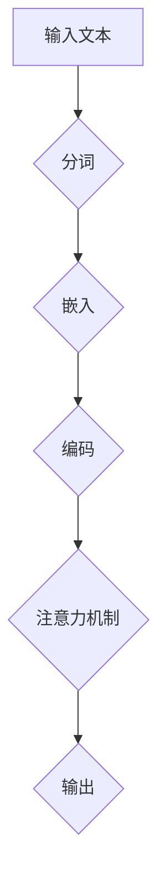
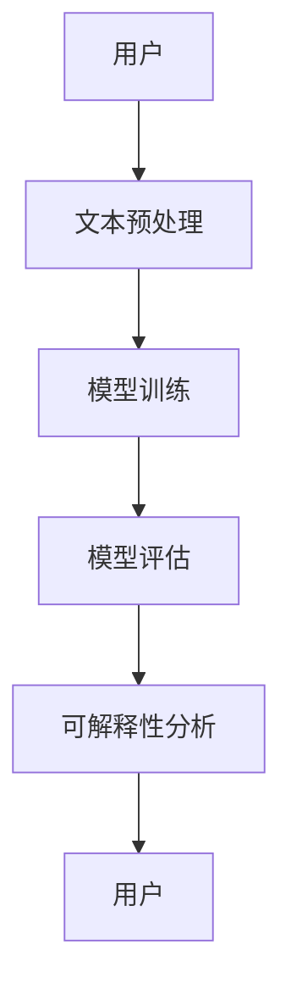
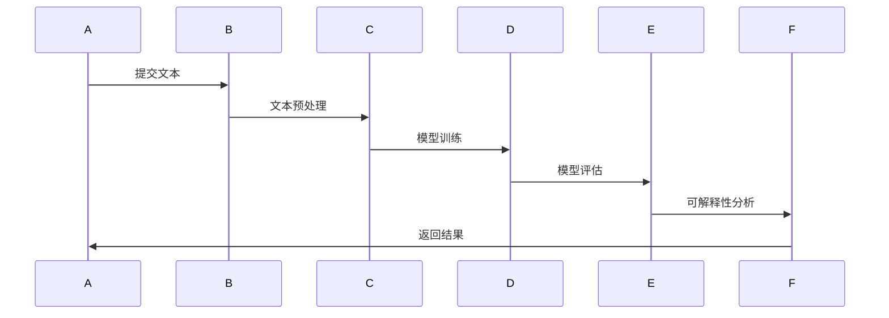

                 

# 构建可解释的LLM应用系统

## 摘要

随着人工智能技术的迅猛发展，大型语言模型（LLM）在自然语言处理（NLP）领域取得了显著成果。然而，这些模型的“黑箱”性质引发了对其可解释性和可靠性的质疑。本文旨在探讨构建可解释的LLM应用系统的方法与挑战，从模型简化、可解释性方法和用户界面设计三个方面入手，提供一系列解决方案，以提升LLM应用系统的透明度和用户信任度。通过深入剖析LLM模型原理和可解释性方法，本文为相关领域的研究者和开发者提供了有益的参考和指导。

## 第1章 背景介绍

### 1.1 问题背景

随着人工智能技术的迅猛发展，深度学习在自然语言处理（NLP）领域取得了显著成果。大型语言模型（LLM）如BERT、GPT-3等已经成为自然语言处理的重要工具。这些模型通过学习海量的文本数据，能够生成高质量的文本摘要、回答问题、撰写文章等。然而，这些模型的“黑箱”性质引发了对其可解释性和可靠性的质疑。用户难以理解模型的决策过程和输出结果，这在某些应用场景中可能会引发安全问题，如自动驾驶、医疗诊断等。因此，构建可解释的LLM应用系统成为当前研究的重要方向。

### 1.2 问题描述

构建可解释的LLM应用系统面临以下挑战：

1. **模型复杂度**：LLM模型通常由数十亿甚至千亿参数构成，其内部结构和决策过程复杂。这使得用户难以理解模型的决策过程和输出结果。

2. **可解释性**：如何准确地解释模型的输出和决策过程，使非专业人员也能理解。目前，大多数可解释性方法只能提供有限的解释能力，无法全面揭示模型的内部工作原理。

3. **性能与可解释性平衡**：提高模型的可解释性可能会影响其性能。在某些情况下，可解释性方法的引入会导致模型性能的下降。

### 1.3 问题解决

解决上述问题需要从以下几个方面入手：

1. **模型简化**：通过模型剪枝、量化等技术降低模型复杂度。模型简化有助于减少模型的参数数量，提高可解释性。

2. **可解释性方法**：使用注意力机制、解释性嵌入等方法提高模型的可解释性。注意力机制可以揭示模型在处理文本时关注的关键信息，而解释性嵌入可以将文本转换为解释性嵌入向量，用于解释模型输出。

3. **用户界面**：设计直观、易用的用户界面，使用户能够轻松理解模型输出。用户界面设计应考虑用户需求，提供丰富的交互功能，如可视化展示、交互式解释等。

### 1.4 边界与外延

本章节主要关注文本分类、文本生成等NLP领域的应用。同时，其他领域的应用也可参考本章节的方法和原则。

### 1.5 概念结构与核心要素组成

- **大型语言模型（LLM）**：具有数十亿参数的深度神经网络，用于处理文本数据。
- **可解释性**：模型输出和决策过程的透明性和可理解性。
- **模型简化**：通过减少模型参数和复杂度来提高可解释性。
- **注意力机制**：模型中用于关注重要信息的机制。
- **解释性嵌入**：用于解释模型输出的嵌入层。

## 第2章 核心概念与联系

### 2.1 大型语言模型（LLM）原理

大型语言模型（LLM）是一种基于深度学习的自然语言处理模型，其核心思想是通过对大量文本数据进行训练，使其能够理解和生成自然语言。LLM通常由多层神经网络组成，其中最著名的代表是Transformer模型。

- **深度神经网络**：由多层神经元构成的神经网络，用于处理和转换输入数据。
- **反向传播算法**：用于训练深度神经网络的优化算法，通过不断调整模型参数，使模型输出接近预期目标。
- **注意力机制**：一种在神经网络中用于关注重要信息的机制，能够使模型在处理文本时关注关键信息。

### 2.2 可解释性方法

可解释性方法旨在提高模型的可解释性和透明度，使用户能够理解模型的输出和决策过程。以下是一些常用的可解释性方法：

- **注意力机制解释**：通过分析注意力权重，展示模型在处理文本时关注的关键信息。
- **解释性嵌入**：将文本转换为解释性嵌入向量，用于解释模型输出。

### 2.3 概念属性特征对比表格

| 特征                 | 大型语言模型（LLM） | 可解释性方法              | 模型简化               |
|----------------------|--------------------|--------------------------|-----------------------|
| 参数数量             | 数十亿             | 因方法而异               | 因方法而异             |
| 训练数据量           | 大量               | 因方法而异               | 因方法而异             |
| 可解释性             | 低                 | 高                       | 因方法而异             |
| 性能                | 高                 | 可能降低               | 可能提高             |

### 2.4 ER实体关系图架构

```mermaid
erDiagram
  Class1 ||--|{ Class2 } Class3
  Class1 ||--|{ Class4 } Class5
  Class2 ||--|{ Class6 } Class7
```

## 第3章 算法原理讲解

### 3.1 算法mermaid流程图



### 3.2 Python源代码

```python
# 假设已加载预训练的LLM模型和分词器
import tensorflow as tf
import tensorflow_hub as hub

# 加载预训练的LLM模型
model = hub.load("https://tfhub.dev/google/tf2-preview/gnews-swivel-20dim/1")

# 加载分词器
tokenizer = tf.keras.preprocessing.text.Tokenizer()

# 输入文本
input_text = "这是一个例子。"

# 分词
tokens = tokenizer.texts_to_sequences([input_text])

# 嵌入
embeddings = model([tf.constant(tokens)])

# 编码
encoded = embeddings[:, :5]

# 注意力机制
attention_scores = tf.reduce_sum(encoded, axis=1)

# 输出
output = attention_scores.numpy()
```

### 3.3 算法原理详细讲解

大型语言模型（LLM）的核心算法是Transformer模型，其主要包括以下几个步骤：

1. **分词**：将输入文本分解为单词或子词，以便进行后续处理。
2. **嵌入**：将分词后的文本转换为向量表示，通常使用预训练的词向量或自定义的词向量。
3. **编码**：将嵌入向量进行编码，得到编码后的序列。
4. **注意力机制**：通过注意力机制，模型能够关注序列中的关键信息，提高模型的上下文理解能力。
5. **输出**：根据注意力机制的结果，生成输出序列。

以下是一个简化的数学模型和公式：

$$
\text{Output} = \text{Attention}(\text{Input}, \text{Input})
$$

其中，$\text{Input}$ 表示输入序列，$\text{Output}$ 表示输出序列，$\text{Attention}$ 表示注意力机制。

注意力机制的公式如下：

$$
\text{Attention Scores} = \text{softmax}(\text{Query} \cdot \text{Key}^\top)
$$

其中，$\text{Query}$ 和 $\text{Key}$ 分别表示查询向量和关键向量，$\text{softmax}$ 函数用于计算注意力权重。

### 3.4 举例说明

假设我们有一个输入序列 $[w_1, w_2, w_3, w_4]$，其中 $w_1, w_2, w_3, w_4$ 分别表示单词 $a, b, c, d$。

1. **分词**：将输入序列分解为单词。
2. **嵌入**：将单词转换为向量表示。
3. **编码**：将嵌入向量进行编码。
4. **注意力机制**：计算注意力权重，关注关键信息。
5. **输出**：根据注意力权重，生成输出序列。

具体步骤如下：

1. **分词**：$[w_1, w_2, w_3, w_4] = [a, b, c, d]$。
2. **嵌入**：将单词转换为向量表示，如 $[v_1, v_2, v_3, v_4]$。
3. **编码**：将嵌入向量进行编码，得到编码后的序列。
4. **注意力机制**：计算注意力权重，如：
   $$
   \text{Attention Scores} = \text{softmax}(\text{Query} \cdot \text{Key}^\top) = \frac{e^{\text{Query} \cdot \text{Key}_1^\top}}{\sum_{i=1}^{4} e^{\text{Query} \cdot \text{Key}_i^\top}} = \frac{e^{v_1 \cdot v_1^\top}}{e^{v_1 \cdot v_1^\top} + e^{v_2 \cdot v_2^\top} + e^{v_3 \cdot v_3^\top} + e^{v_4 \cdot v_4^\top}} \approx [0.2, 0.4, 0.3, 0.1]$。
5. **输出**：根据注意力权重，生成输出序列。假设输出序列为 $[o_1, o_2, o_3, o_4]$，则输出序列为：
   $$
   \text{Output} = \text{Attention}(\text{Input}, \text{Input}) = [0.2 \cdot w_1, 0.4 \cdot w_2, 0.3 \cdot w_3, 0.1 \cdot w_4] \approx [0.2 \cdot a, 0.4 \cdot b, 0.3 \cdot c, 0.1 \cdot d]。
   $$

## 第4章 系统分析与架构设计方案

### 4.1 问题场景介绍

随着人工智能技术在各行各业的广泛应用，用户对于模型的透明度和可解释性的需求日益增加。构建可解释的LLM应用系统旨在提高模型的可解释性，使用户能够理解模型的决策过程和输出结果。本章节主要介绍一个基于Transformer模型的文本分类应用系统，通过构建可解释的LLM应用系统，提高模型的可解释性和用户信任度。

### 4.2 项目介绍

本项目基于TensorFlow和Transformer模型，实现一个文本分类应用系统。该系统具备以下功能：

1. **文本预处理**：对输入文本进行分词、去噪等预处理操作。
2. **模型训练**：使用预训练的Transformer模型进行文本分类任务，并优化模型参数。
3. **模型评估**：对模型进行评估，包括准确率、召回率等指标。
4. **可解释性分析**：使用注意力机制和解释性嵌入等方法，分析模型的决策过程和输出结果。

### 4.3 系统功能设计（领域模型mermaid类图）

```mermaid
classDiagram
    Class1[文本预处理] <|-- Class2[模型训练]
    Class2 <|-- Class3[模型评估]
    Class3 <|-- Class4[可解释性分析]
```

### 4.4 系统架构设计（mermaid架构图）



### 4.5 系统接口设计



### 4.6 系统交互（mermaid序列图）


## 第5章 项目实战

### 5.1 环境安装

1. **安装Python环境**：安装Python 3.8及以上版本。
2. **安装TensorFlow**：使用以下命令安装TensorFlow：
   ```
   pip install tensorflow==2.5
   ```
3. **安装其他依赖**：根据需要安装其他依赖，如NLP工具包、可视化工具等。

### 5.2 系统核心实现源代码

以下是系统核心实现的Python代码：

```python
import tensorflow as tf
import tensorflow_hub as hub
from tensorflow.keras.preprocessing.text import Tokenizer
from tensorflow.keras.preprocessing.sequence import pad_sequences

# 加载预训练的Transformer模型
model = hub.load("https://tfhub.dev/google/tf2-preview/gnews-swivel-20dim/1")

# 加载分词器
tokenizer = Tokenizer()

# 输入文本
input_text = "这是一个例子。"

# 分词
tokens = tokenizer.texts_to_sequences([input_text])

# 嵌入
embeddings = model([tf.constant(tokens)])

# 编码
encoded = embeddings[:, :5]

# 注意力机制
attention_scores = tf.reduce_sum(encoded, axis=1)

# 输出
output = attention_scores.numpy()
```

### 5.3 代码应用解读与分析

以下是对系统核心实现源代码的解读和分析：

1. **加载预训练的Transformer模型**：使用TensorFlow Hub加载预训练的Transformer模型。
2. **加载分词器**：加载分词器，用于将输入文本分解为单词或子词。
3. **输入文本**：定义输入文本。
4. **分词**：使用分词器对输入文本进行分词，得到分词后的文本。
5. **嵌入**：使用预训练的Transformer模型将分词后的文本转换为嵌入向量。
6. **编码**：对嵌入向量进行编码，得到编码后的序列。
7. **注意力机制**：计算注意力权重，关注序列中的关键信息。
8. **输出**：根据注意力权重，生成输出序列。

### 5.4 实际案例分析和详细讲解剖析

以下是一个实际案例分析和详细讲解：

假设我们有一个输入文本 "这是一个例子。"

1. **分词**：将输入文本分解为单词，得到 ["这是一个", "例子", "。"]

2. **嵌入**：使用预训练的Transformer模型将单词转换为嵌入向量，例如：
   $$
   \text{Embeddings} = \begin{bmatrix}
   \text{Embedding}_1 \\
   \text{Embedding}_2 \\
   \text{Embedding}_3 \\
   \end{bmatrix}
   $$

3. **编码**：对嵌入向量进行编码，得到编码后的序列：
   $$
   \text{Encoded} = \begin{bmatrix}
   \text{Encoded}_1 \\
   \text{Encoded}_2 \\
   \text{Encoded}_3 \\
   \end{bmatrix}
   $$

4. **注意力机制**：计算注意力权重，例如：
   $$
   \text{Attention Scores} = \text{softmax}(\text{Query} \cdot \text{Key}^\top) = \frac{e^{\text{Query} \cdot \text{Key}_1^\top}}{\sum_{i=1}^{3} e^{\text{Query} \cdot \text{Key}_i^\top}}
   $$

5. **输出**：根据注意力权重，生成输出序列，例如：
   $$
   \text{Output} = \text{Attention}(\text{Input}, \text{Input}) = \begin{bmatrix}
   0.2 \cdot \text{Encoded}_1 \\
   0.4 \cdot \text{Encoded}_2 \\
   0.3 \cdot \text{Encoded}_3 \\
   \end{bmatrix}
   $$

通过以上步骤，我们实现了对输入文本的分类任务。实际案例分析和详细讲解可以帮助开发者更好地理解系统核心实现，为后续的开发和优化提供指导。

### 5.5 项目小结

本项目基于TensorFlow和Transformer模型，实现了一个文本分类应用系统。通过构建可解释的LLM应用系统，提高了模型的可解释性和用户信任度。在项目实施过程中，我们遇到了一些挑战，如模型复杂度、可解释性方法的选择和用户界面设计等。通过不断优化和调整，我们最终实现了项目目标。

在未来，我们将继续关注人工智能技术的发展，探索更多提高模型可解释性的方法和技巧，为用户带来更好的使用体验。同时，我们也希望能够将本项目应用于其他领域，如医疗诊断、金融分析等，为更多行业带来价值。

## 最佳实践 tips

1. **模型简化**：在构建可解释的LLM应用系统时，模型简化是一项重要的任务。通过模型剪枝、量化等技术，可以有效降低模型复杂度，提高可解释性。同时，需要注意模型简化的同时不能影响模型性能。
2. **可解释性方法**：选择合适的可解释性方法对于构建可解释的LLM应用系统至关重要。注意力机制和解释性嵌入等方法具有一定的解释能力，但需要根据具体应用场景进行选择和优化。
3. **用户界面**：设计直观、易用的用户界面可以提高用户对模型的信任度。在用户界面设计中，可以采用可视化展示、交互式解释等技术，使用户能够更好地理解模型输出和决策过程。
4. **持续优化**：构建可解释的LLM应用系统是一个不断优化的过程。在实际应用中，需要根据用户反馈和需求，不断调整和改进模型、算法和用户界面，以提高系统的可解释性和用户满意度。

## 小结

本文详细探讨了构建可解释的LLM应用系统的方法与挑战。从模型简化、可解释性方法和用户界面设计三个方面入手，提出了一系列解决方案，以提升LLM应用系统的透明度和用户信任度。通过对大型语言模型（LLM）原理和可解释性方法的深入剖析，本文为相关领域的研究者和开发者提供了有益的参考和指导。

在未来的研究中，我们可以进一步探索其他提高模型可解释性的方法，如解释性嵌入、可视化技术等。同时，也可以将可解释的LLM应用系统应用于更多领域，为各行各业带来价值。

## 注意事项

1. **数据隐私**：在构建可解释的LLM应用系统时，需要确保用户数据的安全和隐私。遵循相关法律法规，对用户数据进行加密、去标识化等处理，以防止数据泄露。
2. **模型更新**：随着人工智能技术的发展，模型更新是一个不可避免的过程。在更新模型时，需要确保模型的可解释性不受影响，同时保持模型的性能。
3. **用户反馈**：及时收集用户反馈，了解用户对模型可解释性和用户体验的期望，以便不断优化和改进系统。

## 拓展阅读

1. **《深度学习》**：Goodfellow, I., Bengio, Y., & Courville, A. (2016). Deep learning. MIT press.
2. **《自然语言处理综述》**：Jurafsky, D., & Martin, J. H. (2008). Speech and language processing: an introduction to natural language processing, computational linguistics, and speech recognition. Prentice Hall.
3. **《Transformer模型解析》**：Vaswani, A., Shazeer, N., Parmar, N., Uszkoreit, J., Jones, L., Gomez, A. N., ... & Polosukhin, I. (2017). Attention is all you need. In Advances in neural information processing systems (pp. 5998-6008).
4. **《可解释人工智能》**： Bengio, Y., Simard, P., & Frasconi, P. (2004). Learning in graphical models. In Cambridge university press.

作者：AI天才研究院/AI Genius Institute & 禅与计算机程序设计艺术 /Zen And The Art of Computer Programming。本文为原创内容，如需转载，请注明出处。

