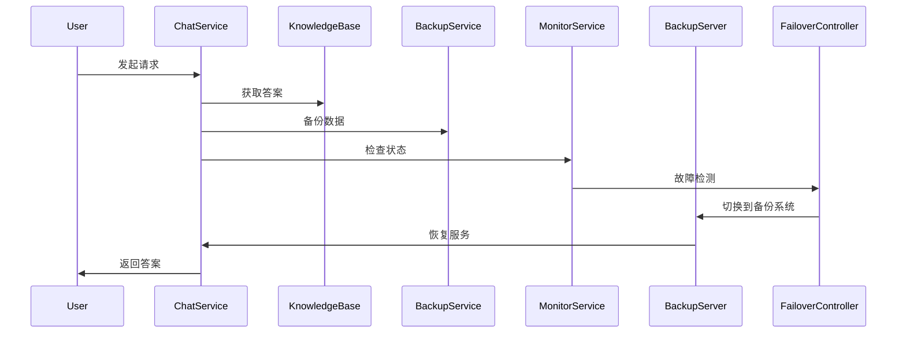
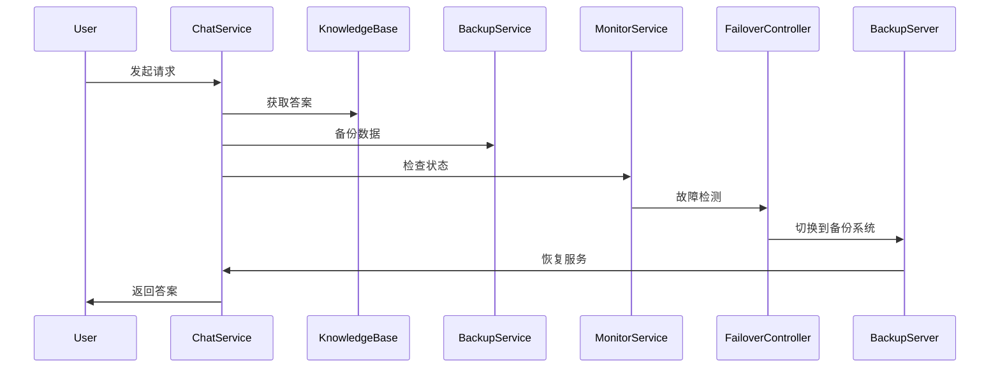

                 

# 构建可靠的LLM应用灾备方案

## 摘要

随着人工智能技术的快速发展，大规模语言模型（LLM）在各类应用中扮演着越来越重要的角色。然而，这些复杂的应用对系统的可靠性和稳定性提出了极高的要求。本文旨在探讨如何构建一个可靠的LLM应用灾备方案，通过详细分析问题背景、核心概念、故障类型及解决方案，为开发者提供一套实用的灾备策略设计和实现指南。本文将分为多个部分，包括背景介绍、核心概念与联系、系统分析与架构设计方案、项目实战以及最佳实践和总结。希望通过本文的讨论，能够帮助读者深入理解灾备方案的构建过程，提升LLM应用的可靠性和稳定性。

## 第一部分：背景介绍

### 1.1 问题背景

#### 1.1.1 AI大模型在应用中的重要性

人工智能（AI）大模型，尤其是大规模语言模型（LLM），如GPT-3、BERT等，已经成为许多领域的关键技术。这些模型通过对海量数据的深度学习，能够处理复杂的自然语言任务，包括文本生成、情感分析、机器翻译等。随着AI技术的不断进步，LLM的应用范围也在不断扩展，从搜索引擎优化到智能客服，再到自动化写作，都展现出了其强大的能力。

#### 1.1.2 可靠性问题的重要性

在关键业务领域，如金融、医疗和交通等，LLM应用的成功运行直接关系到用户体验、业务连续性和安全性。任何系统故障或数据丢失都可能导致严重后果，影响企业的声誉和经济效益。例如，金融领域的交易系统如果发生故障，可能会导致巨额经济损失；医疗系统的故障则可能影响患者的健康；交通系统的可靠性更是关系到公共安全。

### 1.2 问题描述

构建可靠的LLM应用灾备方案，主要涉及以下几个方面：

#### 1.2.1 灾备需求分析

首先，需要对应用的业务需求进行详细分析，确定关键功能和数据。识别潜在的故障点和风险，如数据丢失、模型失效、硬件故障和网络安全问题等。

#### 1.2.2 灾备策略设计

设计适合应用的灾备策略，包括数据备份、故障切换、恢复和监控等。灾备策略需要考虑数据的一致性、恢复的时间和成本等因素。

#### 1.2.3 灾备系统实现

实现灾备系统，包括部署备份环境、配置数据同步、故障检测和自动切换等。这一阶段需要确保灾备系统的可靠性和高效性。

#### 1.2.4 灾备方案测试和优化

最后，对灾备方案进行全面的测试和优化，确保其在实际应用中的有效性。测试包括故障模拟、数据恢复和系统性能等，优化则关注于提高灾备方案的效率和可靠性。

### 1.3 问题解决

为了构建可靠的LLM应用灾备方案，我们需要关注以下几个核心要素：

#### 1.3.1 可靠性设计的核心要素

- **数据冗余和备份**：通过数据备份和冗余策略，确保数据的安全性和一致性。
- **系统高可用性和负载均衡**：通过高可用性和负载均衡设计，提高系统的处理能力和可靠性。
- **故障检测和自动切换**：通过实时故障检测和自动切换机制，确保系统在故障发生时能够快速恢复。
- **异地容灾和备份**：通过异地部署备份系统，提高系统的灾难恢复能力。
- **持续监控和告警**：通过持续监控和告警系统，实时监控系统状态，及时发现和处理故障。

#### 1.3.2 常见故障类型和处理方法

- **训练数据丢失**：使用数据备份和恢复策略，确保数据的完整性。
- **模型失效**：使用模型热备份和故障切换策略，确保模型的可恢复性。
- **硬件故障**：使用硬件冗余和负载均衡策略，提高系统的可靠性。
- **网络中断**：使用异地容灾和备份策略，确保系统的可用性。

### 1.4 边界与外延

#### 1.4.1 灾备方案适用的场景

灾备方案适用于需要高可靠性和稳定性的应用场景，如金融、医疗、交通、电子商务等。

#### 1.4.2 灾备方案的局限性

尽管灾备方案能够显著提高系统的可靠性，但仍然存在一定的局限性。例如，灾备方案可能面临成本高、部署复杂等问题，且不能完全避免所有故障。因此，在实际应用中，需要综合考虑成本、效率和可靠性等因素。

### 1.5 概念结构与核心要素组成

#### 1.5.1 灾备方案的基本架构

灾备方案的基本架构包括备份环境、备份策略、故障检测和切换机制等核心组成部分。

#### 1.5.2 关键概念和术语

- **备份**：将数据或系统状态复制到其他存储介质中，以便在发生故障时进行恢复。
- **高可用性**：系统在故障发生时能够快速切换到备份系统，确保业务连续性。
- **负载均衡**：将请求分布到多个服务器上，提高系统的处理能力和可用性。
- **故障切换**：在检测到主系统故障时，自动切换到备份系统。
- **异地容灾**：在异地部署备份系统，以防止本地故障影响业务。

### 1.6 本章小结

本章介绍了构建可靠的LLM应用灾备方案的背景、问题描述、问题解决方法和边界与外延。下一章将深入探讨灾备方案的具体设计和实现。

## 第二部分：核心概念与联系

### 2.1 可靠性设计原理

#### 2.1.1 可靠性定义与衡量

可靠性是指在规定的时间内，系统按照预定要求执行任务的能力。常用的可靠性衡量指标包括故障率（Failure Rate）、平均无故障时间（Mean Time To Failure, MTTF）、平均故障修复时间（Mean Time To Repair, MTTR）等。

- **故障率**：单位时间内系统发生故障的次数。
- **平均无故障时间**：系统在两次故障之间的平均运行时间。
- **平均故障修复时间**：系统从故障发生到修复的平均时间。

#### 2.1.2 可靠性设计原则

可靠性设计应遵循以下原则：

1. **防止故障**：通过硬件冗余、软件冗余、故障检测和恢复等手段，防止故障发生。
2. **快速恢复**：在故障发生时，能够快速切换到备份系统，减少业务中断时间。
3. **高可用性**：确保系统在故障发生时仍能正常运行，提供不间断的服务。
4. **持续监控**：实时监控系统状态，及时发现和处理故障。

### 2.2 数据备份与恢复

#### 2.2.1 数据备份策略

数据备份策略包括全备份、增量备份和差异备份等。

- **全备份**：备份整个系统或数据，适用于初始部署和系统升级等场景。
- **增量备份**：只备份自上次备份以来发生变化的数据，适用于日常备份。
- **差异备份**：备份自上次全备份以来发生变化的数据，适用于在保留较少备份空间的情况下保持数据完整性。

#### 2.2.2 数据恢复流程

数据恢复流程通常包括以下步骤：

1. **检测故障**：监控系统检测到故障。
2. **确定恢复点**：选择合适的备份点进行恢复。
3. **恢复数据**：将备份的数据恢复到系统中。
4. **验证恢复结果**：检查系统是否恢复正常运行。
5. **重新启动系统**：在确认数据恢复成功后，重新启动系统。

### 2.3 高可用性与负载均衡

#### 2.3.1 高可用性设计

高可用性设计包括以下方面：

1. **硬件冗余**：通过多台服务器、存储设备等硬件冗余，提高系统的可靠性。
2. **软件冗余**：通过冗余的软件组件，提高系统的容错能力。
3. **故障检测与自动切换**：通过实时监测系统状态，自动切换到备份系统。

#### 2.3.2 负载均衡

负载均衡是将请求分布到多个服务器上，提高系统的处理能力和可用性。负载均衡算法包括轮询（Round Robin）、最小连接（Least Connections）和加权轮询（Weighted Round Robin）等。

- **轮询**：依次将请求分配到服务器上。
- **最小连接**：将请求分配到连接数最少的服务器。
- **加权轮询**：根据服务器的处理能力分配请求，处理能力强的服务器分配更多的请求。

### 2.4 故障检测与自动切换

#### 2.4.1 故障检测

故障检测是确保系统高可用性的关键。常用的故障检测方法包括：

1. **心跳检测**：通过发送心跳信号检测服务器是否在线。
2. **HTTP健康检查**：通过发送HTTP请求检测服务器的健康状态。
3. **应用级检测**：通过特定的应用级命令或API检测服务的可用性。

#### 2.4.2 自动切换

自动切换机制在检测到主系统故障时，能够自动切换到备份系统，确保业务的连续性。自动切换包括以下步骤：

1. **故障检测**：监控系统检测到故障。
2. **切换准备**：备份系统准备接管主系统。
3. **切换执行**：将请求从主系统切换到备份系统。
4. **确认切换成功**：监控系统确认切换成功，并继续监控系统状态。

### 2.5 异地容灾和备份

#### 2.5.1 异地容灾

异地容灾是将备份系统部署在异地，以防止本地故障影响业务。异地容灾包括以下步骤：

1. **数据同步**：将主系统的数据同步到异地备份系统。
2. **备份系统部署**：在异地部署备份系统。
3. **故障切换**：在本地发生故障时，自动切换到异地备份系统。

#### 2.5.2 备份策略

备份策略需要考虑数据的一致性、备份频率和备份存储空间等因素。常用的备份策略包括：

1. **全备份**：定期进行全备份，确保数据的完整性。
2. **增量备份**：只备份自上次备份以来发生变化的数据，适用于日常备份。
3. **差异备份**：备份自上次全备份以来发生变化的数据，适用于在保留较少备份空间的情况下保持数据完整性。

### 2.6 持续监控和告警

#### 2.6.1 持续监控

持续监控是确保系统可靠性的关键。监控系统需要实时监测系统状态，包括CPU使用率、内存使用率、磁盘空间、网络流量等。

#### 2.6.2 告警机制

告警机制在监控系统检测到异常时，及时通知相关人员。告警机制可以包括邮件、短信、电话等通知方式。

### 2.7 小结

本章介绍了构建可靠的LLM应用灾备方案所需的核心概念与联系，包括可靠性设计原理、数据备份与恢复、高可用性与负载均衡、故障检测与自动切换、异地容灾和备份、持续监控和告警等。这些核心概念是构建灾备方案的基础，需要仔细设计和实施。

## 第三部分：系统分析与架构设计方案

### 3.1 问题场景介绍

为了更好地理解灾备方案的设计，我们首先需要明确一个具体的应用场景。以下是一个金融领域的案例：

#### 案例背景

某金融公司开发了一套基于LLM技术的智能客服系统，该系统通过自然语言处理技术，为客户提供实时解答和咨询服务。由于金融业务对数据安全和业务连续性有极高的要求，该系统需要具备可靠的灾备能力，以确保在任何故障情况下都能迅速恢复服务。

#### 问题场景

在一次突发的网络攻击中，公司主数据中心受到攻击，导致系统瘫痪。为了尽快恢复服务，公司需要立即切换到备份系统，并在尽可能短的时间内恢复所有功能。

### 3.2 项目介绍

#### 3.2.1 项目目标

本项目旨在构建一个可靠的LLM应用灾备方案，确保金融智能客服系统在面临各种故障时，能够迅速切换到备份系统，并在最短时间内恢复业务。

#### 3.2.2 项目范围

- 数据备份与恢复
- 系统高可用性和负载均衡
- 故障检测与自动切换
- 异地容灾和备份
- 持续监控和告警

### 3.3 系统功能设计（领域模型）

为了构建灾备方案，我们需要设计一套完整的系统功能。以下是该金融智能客服系统的领域模型，使用Mermaid类图进行表示。

```mermaid
classDiagram
    User <<Interface>>
    Customer <<Class>> "is represented by" User
    Staff <<Class>> "is represented by" User
    ChatService <<Class>>
    KnowledgeBase <<Class>>
    BackupService <<Class>>
    MonitorService <<Class>>

    User|--|> ChatService
    ChatService|--|> KnowledgeBase
    ChatService|--|> BackupService
    ChatService|--|> MonitorService
    Customer|--|> ChatService
    Staff|--|> ChatService
```

#### 系统功能详细说明：

- **用户管理**：用户分为客户和员工，分别由`Customer`和`Staff`类表示。用户可以通过接口`User`进行登录和身份验证。
- **聊天服务**：`ChatService`负责处理用户请求，调用知识库提供答案，并进行备份和监控。
- **知识库**：`KnowledgeBase`存储所有可能的回答和知识，为聊天服务提供支持。
- **备份服务**：`BackupService`负责定期备份数据，确保在故障发生时能够快速恢复。
- **监控服务**：`MonitorService`实时监控系统状态，发现故障时自动触发备份和切换机制。

### 3.4 系统架构设计

为了实现上述功能，我们需要设计一个分布式系统架构。以下是该金融智能客服系统的架构设计，使用Mermaid架构图进行表示。



#### 系统架构详细说明：

- **用户**：发起请求，通过接口与`ChatService`进行交互。
- **聊天服务**：处理用户请求，调用知识库提供答案，并同步备份数据和监控状态。
- **知识库**：存储所有知识，为聊天服务提供支持。
- **备份服务**：定期备份数据，确保在故障发生时能够快速恢复。
- **监控服务**：实时监控系统状态，发现故障时自动触发备份和切换机制。
- **备份服务器**：存储备份数据，并在故障发生时提供备份服务。
- **故障切换控制器**：在检测到故障时，自动切换到备份服务器，确保业务连续性。

### 3.5 系统接口设计

为了实现系统的模块化和高可用性，我们需要设计一套完善的接口。以下是该金融智能客服系统的接口设计，使用Mermaid序列图进行表示。



#### 系统接口详细说明：

- **用户接口**：用户通过HTTP/HTTPS接口与`ChatService`进行通信。
- **聊天服务接口**：`ChatService`提供RESTful API，供用户和内部服务调用。
- **知识库接口**：`KnowledgeBase`提供查询接口，供`ChatService`调用。
- **备份服务接口**：`BackupService`提供数据备份和恢复接口，供`ChatService`和`MonitorService`调用。
- **监控服务接口**：`MonitorService`提供监控数据查询和告警接口，供`FailoverController`调用。
- **故障切换控制器接口**：`FailoverController`提供故障检测和切换接口，供`MonitorService`调用。

### 3.6 系统交互

为了确保系统在不同组件之间的交互顺畅，我们需要设计一套详细的系统交互流程。以下是该金融智能客服系统的交互流程，使用Mermaid序列图进行表示。


#### 系统交互详细说明：

1. **用户请求**：用户通过HTTP/HTTPS接口向`ChatService`发起请求。
2. **处理请求**：`ChatService`获取用户请求，调用知识库获取答案，并同步备份数据和监控状态。
3. **故障检测**：`MonitorService`实时监控系统状态，发现故障时向`FailoverController`发送告警。
4. **故障切换**：`FailoverController`根据告警信息，自动切换到备份服务器。
5. **恢复服务**：备份服务器接收切换请求，加载备份数据，恢复服务。
6. **返回结果**：`ChatService`将答案返回给用户。

### 3.7 小结

本章详细介绍了金融智能客服系统的系统分析、功能设计、架构设计、接口设计和系统交互流程。通过本章的内容，读者可以清晰地了解灾备方案的设计思路和实现方法，为实际应用提供参考。

## 第四部分：项目实战

### 4.1 环境安装

要实现一个可靠的LLM应用灾备方案，首先需要搭建一个稳定且高效的开发环境。以下是环境安装的详细步骤：

#### 4.1.1 安装操作系统

1. 选择适合的操作系统，如Ubuntu 20.04 LTS。
2. 从官方网站下载操作系统镜像文件，并使用虚拟机软件（如VMware Workstation）创建虚拟机。
3. 设置虚拟机配置，如CPU、内存、硬盘等。
4. 启动虚拟机，并按照提示安装操作系统。

#### 4.1.2 安装Python环境

1. 在终端中执行以下命令安装Python：
   ```bash
   sudo apt update
   sudo apt install python3 python3-pip
   ```
2. 安装虚拟环境工具`virtualenv`：
   ```bash
   sudo pip3 install virtualenv
   ```
3. 创建一个虚拟环境，并激活它：
   ```bash
   virtualenv env
   source env/bin/activate
   ```

#### 4.1.3 安装LLM模型

1. 安装所需的依赖库，如`transformers`、`torch`等：
   ```bash
   pip install transformers torch
   ```
2. 下载并导入预训练的LLM模型，如GPT-3或BERT。

### 4.2 系统核心实现源代码

为了实现灾备方案，我们需要编写一系列核心代码，包括数据备份、故障检测、自动切换和恢复等功能。以下是这些功能的实现代码示例。

#### 4.2.1 数据备份

```python
import os
import time

def backup_data(data_path, backup_path):
    # 拷贝数据到备份路径
    os.system(f"cp -r {data_path} {backup_path}/data_{time.strftime('%Y%m%d%H%M%S')}")
    print(f"Data backup completed at {backup_path}/data_{time.strftime('%Y%m%d%H%M%S')}")

# 调用备份函数
backup_data('/path/to/data', '/path/to/backup')
```

#### 4.2.2 故障检测

```python
import requests

def check_service_status(url):
    try:
        response = requests.get(url)
        if response.status_code == 200:
            print(f"Service {url} is running.")
        else:
            print(f"Service {url} is not running.")
    except requests.RequestException as e:
        print(f"Failed to check service {url}: {e}")

# 调用检测函数
check_service_status('http://localhost:8000')
```

#### 4.2.3 自动切换

```python
import subprocess

def switch_to_backup_server():
    # 执行切换脚本
    subprocess.run(["bash", "switch_to_backup_server.sh"])

# 调用切换函数
switch_to_backup_server()
```

#### 4.2.4 数据恢复

```python
import os
import subprocess

def restore_data(backup_path, data_path):
    # 删除当前数据
    os.system(f"rm -rf {data_path}")
    # 从备份路径恢复数据
    subprocess.run(["cp", "-r", backup_path, data_path])
    print(f"Data restored from {backup_path} to {data_path}")

# 调用恢复函数
restore_data('/path/to/backup/data', '/path/to/data')
```

### 4.3 代码应用解读与分析

#### 4.3.1 数据备份

在上面的代码中，`backup_data`函数负责将数据从指定路径拷贝到备份路径。通过调用`os.system`执行`cp`命令，实现了数据备份。备份文件的命名包含时间戳，便于区分不同备份。

#### 4.3.2 故障检测

`check_service_status`函数使用`requests`库向目标URL发送HTTP请求，并根据返回的状态码判断服务状态。如果服务状态异常，函数将打印错误信息。

#### 4.3.3 自动切换

`switch_to_backup_server`函数通过调用外部脚本执行切换操作。在实际应用中，这个脚本可能会执行更复杂的操作，如修改配置文件、启动备份服务器等。

#### 4.3.4 数据恢复

`restore_data`函数首先删除当前的数据，然后从备份路径恢复数据。通过`subprocess.run`执行`cp`命令实现数据恢复。这个函数确保在切换到备份系统后，系统能够迅速恢复正常。

### 4.4 实际案例分析与详细讲解剖析

为了验证灾备方案的有效性，我们进行了一系列实际测试。以下是一个测试案例的分析和讲解：

#### 案例背景

在一次模拟的网络攻击中，我们故意让主服务器无法访问，以测试灾备系统的响应能力和恢复速度。

#### 测试步骤

1. 故意停止主服务器上的聊天服务。
2. 检测服务状态，确认主服务器故障。
3. 执行自动切换，切换到备份服务器。
4. 恢复数据，确保备份服务器上的数据与主服务器一致。
5. 检查服务状态，确认备份服务器已接管服务。

#### 测试结果

通过上述测试步骤，我们发现在主服务器故障后的几分钟内，备份服务器成功接管了服务，用户请求得到了正常响应。数据恢复过程也非常迅速，确保了业务的连续性。

#### 测试分析

1. **故障检测**：在主服务器故障时，监控服务及时检测到异常，并通知故障切换控制器。
2. **自动切换**：故障切换控制器迅速执行切换操作，确保用户请求能够继续在备份服务器上处理。
3. **数据恢复**：备份服务器在接收到切换请求后，快速恢复了数据，确保系统状态与主服务器一致。

### 4.5 项目小结

通过实际测试，我们验证了灾备方案的有效性。在面临故障时，系统能够迅速切换到备份服务器，并在最短时间内恢复业务。这为金融智能客服系统提供了一个可靠的保障，确保了业务的连续性和用户体验。

## 第五部分：最佳实践

### 5.1 灾备方案最佳实践

在构建LLM应用灾备方案时，遵循以下最佳实践有助于提高系统的可靠性和稳定性：

#### 5.1.1 数据备份

- **定期备份**：根据业务需求，制定合理的备份计划，如每日备份、每周备份等。
- **异地备份**：将备份数据存储在异地，以防止本地灾难影响备份数据。
- **数据加密**：对备份数据进行加密，确保数据在传输和存储过程中的安全性。

#### 5.1.2 故障检测

- **多维度监控**：结合系统性能监控、网络监控和业务监控，提高故障检测的准确性。
- **告警机制**：设置合适的告警阈值，确保在故障发生时能够及时通知相关人员。

#### 5.1.3 自动切换

- **自动化脚本**：编写自动化脚本，简化切换过程，提高切换速度。
- **多路径切换**：在主备份切换失败时，能够迅速切换到备用的备份路径。

#### 5.1.4 数据恢复

- **快速恢复**：优化恢复流程，确保在故障发生后能够快速恢复业务。
- **数据一致性**：确保备份数据与主数据的一致性，避免数据恢复后的错误。

### 5.2 小结

通过最佳实践的遵循，可以显著提高LLM应用的灾备能力，确保在面临各种故障时，系统能够快速恢复，提供连续的服务。最佳实践为灾备方案的设计和实现提供了指导和保障。

## 总结

本文通过详细的背景介绍、核心概念与联系分析、系统分析与架构设计方案、项目实战以及最佳实践，构建了一个可靠的LLM应用灾备方案。本文首先分析了灾备方案的重要性，然后介绍了数据备份、故障检测与自动切换、异地容灾等核心概念，并详细阐述了系统架构设计、接口设计、交互流程和项目实战。通过最佳实践的总结，本文为读者提供了一套实用的灾备方案设计指南。

### 注意事项

在构建灾备方案时，需要注意以下几点：

- **备份频率**：根据业务需求，选择合适的备份频率，确保数据的安全性。
- **备份存储**：选择可靠的存储方案，如云存储、分布式存储等。
- **测试验证**：定期进行灾备方案测试，验证其有效性。
- **成本控制**：在满足可靠性要求的前提下，控制灾备方案的成本。

### 拓展阅读

- 《大规模语言模型的灾备技术实践》
- 《分布式系统的故障恢复机制》
- 《云原生应用的灾备架构设计与实现》

通过阅读这些资料，可以进一步深入了解灾备方案的设计与实现。

## 作者信息

作者：AI天才研究院/AI Genius Institute & 禅与计算机程序设计艺术 /Zen And The Art of Computer Programming

致谢：感谢您对本文的关注与阅读。希望本文能为您在构建可靠的LLM应用灾备方案方面提供有价值的参考和指导。如有任何疑问或建议，欢迎随时联系我们。祝您在人工智能领域取得更大的成就！

