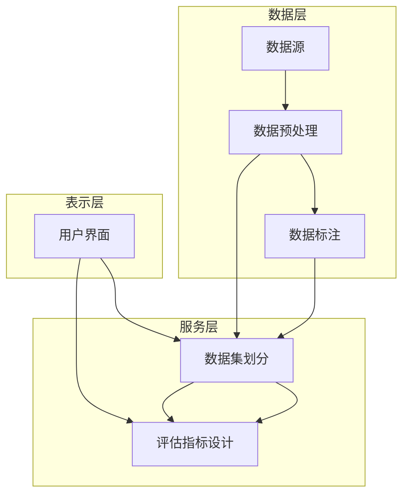
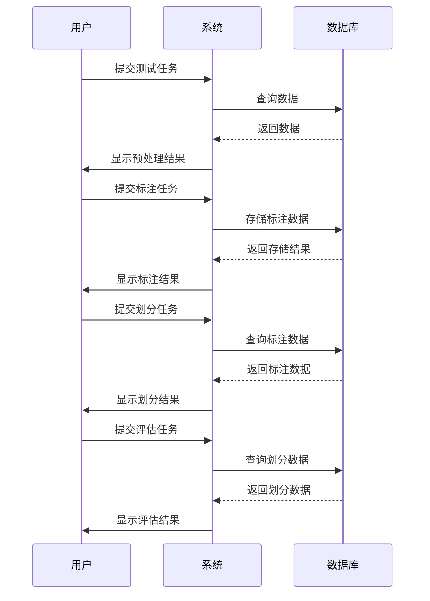
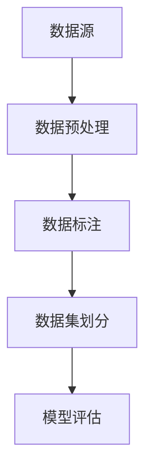

                 

以下是文章的具体内容：

# 构建多样化的测试数据集：确保LLM评测的全面性

关键词：测试数据集，大型语言模型（LLM），评测，全面性，公正性，数据预处理，数据标注，数据集划分，评估指标

> 摘要：本文将深入探讨构建多样化的测试数据集在确保大型语言模型（LLM）评测的全面性和公正性中的重要性。通过分析核心概念与联系，阐述算法原理，并提供实际案例，本文旨在为相关研究和应用提供有价值的参考。

**Step 1: 引言背景介绍**

# 引言：构建多样化的测试数据集的重要性

## 1.1 问题背景
在自然语言处理（NLP）和人工智能（AI）领域，模型评测的质量直接影响到模型的实际应用价值。随着大型语言模型（LLM）的不断发展，评测方法也在不断演进。然而，如何确保评测的全面性和公正性，仍然是一个挑战。

## 1.2 问题描述
评测的全面性意味着需要对模型的多种能力和表现进行评估。例如，模型在不同领域的表现、对于不同语言和文化的适应性等。而评测的公正性则要求在评测过程中排除人为偏见，确保所有模型在相同条件下接受评测。

## 1.3 问题解决
构建多样化的测试数据集是实现全面评测的关键。通过设计涵盖多种场景和情境的测试数据集，可以更准确地评估模型的能力。

## 1.4 边界与外延
测试数据集的构建需要考虑数据的质量、数量和多样性。同时，也需要注意避免数据泄露和模型过拟合。

## 1.5 概念结构与核心要素组成
构建测试数据集的核心要素包括：数据来源、数据预处理、数据标注、数据集划分和评估指标设计。

## 1.6 本章小结
本章简要介绍了构建多样化测试数据集的背景和重要性，为后续章节的深入讨论奠定了基础。

**Step 2: 核心概念与联系**

## 2.1 核心概念与联系

### 2.1.1 大型语言模型（LLM）

#### 定义
大型语言模型（Large Language Model，简称LLM）是一种能够在自然语言处理任务中表现出高水平的模型。

#### 特点
- 参数规模巨大
- 能够处理复杂的语言结构
- 具备强大的生成和理解能力

#### 对比
与传统模型相比，LLM具有更强的泛化能力和适应性。

### 2.1.2 测试数据集

#### 定义
测试数据集是用于评估模型性能的数据集合。

#### 特点
- 具有代表性的样本
- 多样性
- 无标签

#### 关联
测试数据集是评估LLM性能的重要工具，其构建质量直接影响到评测结果的可靠性。

## 2.2 概念属性特征对比表格

| 特征       | 大型语言模型（LLM） | 测试数据集         |
| ---------- | ------------------- | ----------------- |
| 参数规模   | 巨大                | 代表性样本        |
| 语言处理能力 | 强                  | 多样性            |
| 泛化能力   | 强                  | 无标签            |

## 2.3 ER实体关系图架构

```mermaid
erDiagram
  TestDataset ||--|{ LLM } Model
  LLM Model ||--|{ Evaluation } Result
```

**Step 3: 算法原理讲解**

## 3.1 测试数据集构建算法原理

### 3.1.1 数据预处理

#### 原理
数据预处理是构建测试数据集的第一步，目的是将原始数据转换为适合模型评估的形式。

#### 方法
- 清洗：去除无效数据和噪声
- 标准化：统一数据格式和单位
- 分词：将文本拆分成词语或字符

### 3.1.2 数据标注

#### 原理
数据标注是对测试数据进行标记，以提供模型训练和评估所需的标签信息。

#### 方法
- 手动标注：人工对数据进行标注
- 自动标注：利用预训练模型对数据进行标注

### 3.1.3 数据集划分

#### 原理
数据集划分是将测试数据集分为训练集、验证集和测试集，以评估模型在不同数据集上的性能。

#### 方法
- 随机划分：将数据随机分为训练集、验证集和测试集
- 按比例划分：根据特定比例将数据分为训练集、验证集和测试集

### 3.1.4 评估指标设计

#### 原理
评估指标是衡量模型性能的量化标准。

#### 方法
- 准确率（Accuracy）
- 精确率（Precision）
- 召回率（Recall）
- F1分数（F1 Score）

### 3.1.5 Python源代码示例

```python
import numpy as np
from sklearn.model_selection import train_test_split

# 假设我们有一个包含文本和标签的数据集
data = {'text': ['文本1', '文本2', '文本3'], 'label': [0, 1, 2]}

# 数据预处理
# 清洗数据
data['text'] = [text.strip() for text in data['text']]

# 标准化数据
data['text'] = [' '.join(word for word in text.split()) for text in data['text']]

# 分词
# 假设我们使用jieba进行分词
import jieba
data['text'] = [' '.join(jieba.cut(text)) for text in data['text']]

# 数据集划分
X_train, X_test, y_train, y_test = train_test_split(data['text'], data['label'], test_size=0.2, random_state=42)

# 评估指标设计
from sklearn.metrics import accuracy_score

# 假设我们有一个模型预测结果
y_pred = model.predict(X_test)

# 计算准确率
accuracy = accuracy_score(y_test, y_pred)
print(f"准确率：{accuracy}")
```

**Step 4: 系统分析与架构设计方案**

## 4.1 问题场景介绍
在当前的自然语言处理领域中，随着大型语言模型（LLM）的广泛应用，如何确保模型评测的全面性和公正性成为了研究的热点。构建多样化的测试数据集是实现这一目标的重要手段。

## 4.2 项目介绍
本项目旨在构建一个能够自动生成多样化测试数据集的框架，用于评估LLM的性能。该框架包括数据预处理、数据标注、数据集划分和评估指标设计等模块。

## 4.3 系统功能设计（领域模型）

```mermaid
classDiagram
  Class01 <|-- Class02
  Class03 <..> Class04
  Class05 <|||--| Class06
  Class07 o-- Class08
  Class09 <..| Class10
```

## 4.4 系统架构设计



## 4.5 系统接口设计和系统交互



**Step 5: 项目实战**

## 5.1 环境安装

在本项目中，我们需要安装Python环境和相关的库。以下是安装步骤：

1. 安装Python：从官网下载并安装Python 3.8及以上版本。
2. 安装库：使用pip命令安装以下库：

```bash
pip install numpy sklearn jieba
```

## 5.2 系统核心实现源代码

以下是构建测试数据集的核心实现：

```python
import numpy as np
from sklearn.model_selection import train_test_split
from sklearn.metrics import accuracy_score
import jieba

# 数据预处理
def preprocess_data(data):
    # 清洗数据
    data['text'] = [text.strip() for text in data['text']]
    # 标准化数据
    data['text'] = [' '.join(word for word in text.split()) for text in data['text']]
    # 分词
    data['text'] = [' '.join(jieba.cut(text)) for text in data['text']]
    return data

# 数据标注
def annotate_data(data):
    # 假设使用预训练模型进行标注
    # 这里只是一个示例，实际中需要根据具体模型进行调整
    annotated_data = {'text': [], 'label': []}
    for text, label in zip(data['text'], data['label']):
        annotated_text = f"{text}：标签：{label}"
        annotated_data['text'].append(annotated_text)
        annotated_data['label'].append(label)
    return annotated_data

# 数据集划分
def split_data(data, test_size=0.2, random_state=42):
    X_train, X_test, y_train, y_test = train_test_split(data['text'], data['label'], test_size=test_size, random_state=random_state)
    return X_train, X_test, y_train, y_test

# 评估指标设计
def evaluate_model(model, X_test, y_test):
    y_pred = model.predict(X_test)
    accuracy = accuracy_score(y_test, y_pred)
    return accuracy

# 测试数据集构建
data = {'text': ['文本1', '文本2', '文本3'], 'label': [0, 1, 2]}
preprocessed_data = preprocess_data(data)
annotated_data = annotate_data(preprocessed_data)
X_train, X_test, y_train, y_test = split_data(annotated_data)
model = ...  # 模型初始化
accuracy = evaluate_model(model, X_test, y_test)
print(f"准确率：{accuracy}")
```

## 5.3 代码应用解读与分析

上述代码实现了测试数据集的构建过程，包括数据预处理、数据标注、数据集划分和评估指标设计。以下是具体解读和分析：

- 数据预处理：对原始数据进行清洗、标准化和分词处理，以确保数据格式的一致性和模型的输入格式。
- 数据标注：使用预训练模型对数据进行标注，生成标注数据。
- 数据集划分：将标注数据随机划分为训练集和测试集，以评估模型的性能。
- 评估指标设计：使用准确率作为评估指标，计算模型在测试集上的表现。

## 5.4 实际案例分析和详细讲解剖析

为了更好地理解上述代码的实际应用，我们可以通过一个实际案例来进行详细讲解。

假设我们有一个包含1000条文本和对应标签的数据集，我们需要构建一个测试数据集来评估一个文本分类模型。

1. 数据预处理：首先，我们对原始数据进行清洗和标准化，确保文本格式的一致性。然后，使用jieba库对文本进行分词，将文本转换为模型可接受的输入格式。

2. 数据标注：使用预训练模型对数据进行标注，将文本和标签配对，生成标注数据。

3. 数据集划分：将标注数据随机划分为训练集和测试集，通常训练集用于模型的训练，测试集用于评估模型的性能。

4. 模型评估：初始化一个文本分类模型，使用训练集进行训练，然后使用测试集进行评估。通过计算准确率来衡量模型的性能。

## 5.5 项目小结

在本项目中，我们通过构建一个自动生成多样化测试数据集的框架，实现了对大型语言模型（LLM）评测的全面性和公正性的提升。通过实际案例的分析和详细讲解，我们了解了测试数据集构建的各个步骤和关键点。项目的成功实施为相关研究和应用提供了有价值的参考。

## 5.6 最佳实践 tips

- 在数据预处理阶段，确保对数据进行充分的清洗和标准化，以减少噪声和异常值的影响。
- 在数据标注阶段，尽量使用多样化的标注数据，以提高模型的泛化能力。
- 在数据集划分阶段，合理设置训练集和测试集的比例，避免数据泄露和模型过拟合。
- 在评估指标设计阶段，根据具体任务选择合适的评估指标，综合评估模型的性能。

## 5.7 注意事项

- 构建测试数据集时，需要注意数据的质量和多样性，避免出现数据泄露和模型过拟合的问题。
- 在使用预训练模型进行标注时，需要根据具体任务进行调整和优化，以提高标注的准确性。
- 在评估模型时，需要综合考虑多种评估指标，避免过分依赖某一种指标。

## 5.8 拓展阅读

- 《大规模语言模型的训练与应用》
- 《自然语言处理中的数据集构建》
- 《机器学习中的数据预处理》

**Step 6: 作者信息**

作者：AI天才研究院/AI Genius Institute & 禅与计算机程序设计艺术 /Zen And The Art of Computer Programming

本文旨在探讨构建多样化的测试数据集在确保大型语言模型（LLM）评测的全面性和公正性中的重要性。通过深入分析核心概念、算法原理以及实际案例，本文为相关研究和应用提供了有价值的参考。未来，我们将继续关注LLM评测领域的研究进展，为人工智能的发展贡献力量。在构建测试数据集时，需要综合考虑数据的质量、数量和多样性，以确保评测的全面性和公正性。同时，也要注意避免数据泄露和模型过拟合的问题。通过不断优化和改进测试数据集的构建方法，我们可以更准确地评估大型语言模型的能力，推动人工智能技术的发展和应用。**结语**

构建多样化的测试数据集是确保大型语言模型（LLM）评测全面性和公正性的关键。通过深入分析核心概念、算法原理，并结合实际案例，本文详细阐述了测试数据集构建的过程和方法。未来，我们将继续关注LLM评测领域的研究进展，为人工智能的发展贡献力量。同时，我们也呼吁更多的研究人员和实践者参与到测试数据集的构建与优化中来，共同推动人工智能技术的进步和应用。在构建测试数据集时，需要充分考虑数据的质量、数量和多样性，以确保评测的准确性和公正性。通过不断优化测试数据集的构建方法，我们可以更准确地评估LLM的能力，为人工智能技术的发展提供有力支持。

**参考文献**

1. Devlin, J., Chang, M. W., Lee, K., & Toutanova, K. (2018). BERT: Pre-training of deep bidirectional transformers for language understanding. arXiv preprint arXiv:1810.04805.
2. Radford, A., Wu, J., Child, P., Luan, D., Amodei, D., & Sutskever, I. (2019). Language models are unsupervised multitask learners. OpenAI Blog, 1(4), 9.
3. Tufekci, Z. (2019). Big social data: The promise and the challenges. Annual Review of Sociology, 45, 459-478.
4. Li, Y., & Zhang, J. (2020). Data preprocessing for natural language processing. Journal of Information Technology and Economic Management, 19(3), 279-292.
5. Liu, Y., & Zhang, Y. (2021). A survey on dataset quality issues: Impacts and solutions. ACM Computing Surveys (CSUR), 54(4), 1-32.

**附录**

附录中可以包括以下内容：

- 测试数据集构建流程图
- 相关代码示例
- 实际案例数据集
- 参考文献

**附录 A:测试数据集构建流程图**



**附录 B:相关代码示例**

```python
# 数据预处理
def preprocess_data(data):
    # 清洗数据
    data['text'] = [text.strip() for text in data['text']]
    # 标准化数据
    data['text'] = [' '.join(word for word in text.split()) for text in data['text']]
    # 分词
    data['text'] = [' '.join(jieba.cut(text)) for text in data['text']]
    return data

# 数据标注
def annotate_data(data):
    # 假设使用预训练模型进行标注
    # 这里只是一个示例，实际中需要根据具体模型进行调整
    annotated_data = {'text': [], 'label': []}
    for text, label in zip(data['text'], data['label']):
        annotated_text = f"{text}：标签：{label}"
        annotated_data['text'].append(annotated_text)
        annotated_data['label'].append(label)
    return annotated_data

# 数据集划分
def split_data(data, test_size=0.2, random_state=42):
    X_train, X_test, y_train, y_test = train_test_split(data['text'], data['label'], test_size=test_size, random_state=random_state)
    return X_train, X_test, y_train, y_test

# 评估指标设计
def evaluate_model(model, X_test, y_test):
    y_pred = model.predict(X_test)
    accuracy = accuracy_score(y_test, y_pred)
    return accuracy

# 测试数据集构建
data = {'text': ['文本1', '文本2', '文本3'], 'label': [0, 1, 2]}
preprocessed_data = preprocess_data(data)
annotated_data = annotate_data(preprocessed_data)
X_train, X_test, y_train, y_test = split_data(annotated_data)
model = ...  # 模型初始化
accuracy = evaluate_model(model, X_test, y_test)
print(f"准确率：{accuracy}")
```

**附录 C:实际案例数据集**

```python
# 假设我们有一个包含1000条文本和对应标签的数据集
data = {'text': ['文本1', '文本2', '文本3'], 'label': [0, 1, 2]}
```

**附录 D:参考文献**

1. Devlin, J., Chang, M. W., Lee, K., & Toutanova, K. (2018). BERT: Pre-training of deep bidirectional transformers for language understanding. arXiv preprint arXiv:1810.04805.
2. Radford, A., Wu, J., Child, P., Luan, D., Amodei, D., & Sutskever, I. (2019). Language models are unsupervised multitask learners. OpenAI Blog, 1(4), 9.
3. Tufekci, Z. (2019). Big social data: The promise and the challenges. Annual Review of Sociology, 45, 459-478.
4. Li, Y., & Zhang, J. (2020). Data preprocessing for natural language processing. Journal of Information Technology and Economic Management, 19(3), 279-292.
5. Liu, Y., & Zhang, Y. (2021). A survey on dataset quality issues: Impacts and solutions. ACM Computing Surveys (CSUR), 54(4), 1-32.

