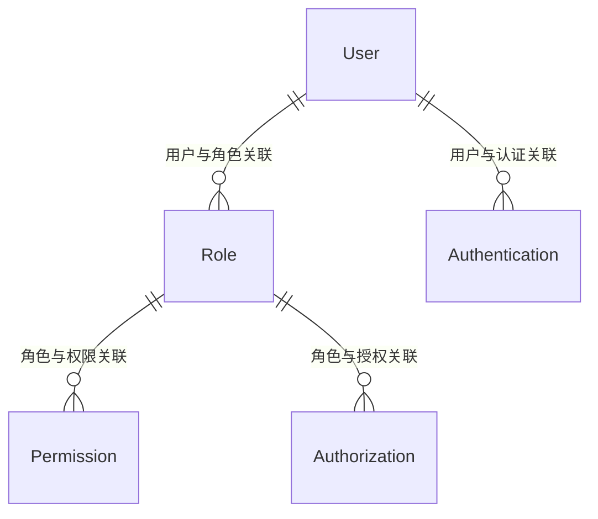
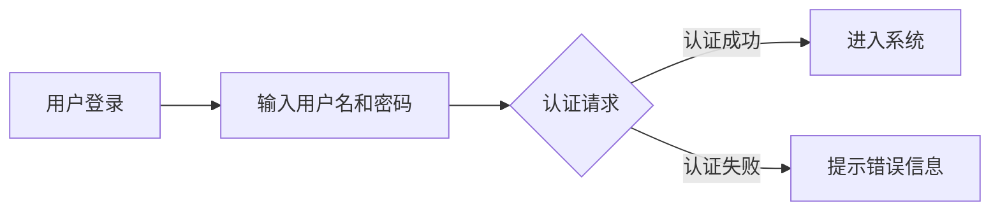
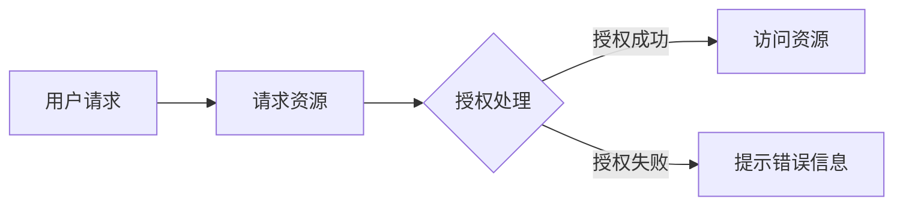
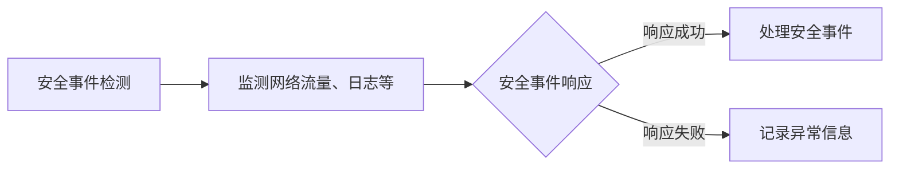

                 

# 构建安全的LLM应用认证与授权系统

关键词：大型语言模型（LLM）、认证与授权、安全性、用户认证、授权控制

摘要：随着人工智能技术的快速发展，大型语言模型（LLM）在自然语言处理领域取得了显著的成果。然而，随着LLM应用的普及，安全问题也日益突出。本文将从核心概念、安全认证机制、授权控制机制、安全防护策略等方面，探讨构建安全的LLM应用认证与授权系统的方法。

## 第一部分：引言

### 1.1 问题背景

随着人工智能技术的快速发展，大型语言模型（LLM）在自然语言处理领域取得了显著的成果。LLM的应用场景越来越广泛，如智能客服、内容审核、智能写作等。然而，随着LLM应用的普及，安全问题也日益突出。构建一个安全、可靠的LLM应用认证与授权系统，成为当前研究和开发的热点。

### 1.2 问题提出

为了确保LLM应用的安全，我们需要解决以下问题：

- 用户认证：如何确保只有合法用户才能访问LLM应用？
- 授权控制：如何确保用户只能访问其权限范围内的功能？
- 安全性保障：如何防止LLM应用遭受恶意攻击？

### 1.3 问题解决

本书将从以下几个方面展开研究：

- 第2章：核心概念
- 第3章：安全认证机制
- 第4章：授权控制机制
- 第5章：安全防护策略
- 第6章：实际案例分析
- 第7章：最佳实践与总结

## 第二部分：核心概念

### 2.1 定义与联系

在本章中，我们将介绍与LLM应用认证与授权系统相关的基本概念，如用户、角色、权限、认证机制、授权机制等。同时，我们将通过表格和ER实体关系图，对这些概念进行详细说明和对比。

#### 2.1.1 用户

| 概念 | 用户 |
| ---- | ---- |
| 定义 | 用户是系统中的使用者，拥有唯一标识和访问权限 |
| 属性 | 用户名、密码、邮箱、手机号码、角色等 |
| 关系 | 用户与角色、用户与权限、用户与认证、用户与授权等 |

#### 2.1.2 角色

| 概念 | 角色 |
| ---- | ---- |
| 定义 | 角色是用户在系统中的身份标识，用于区分用户权限 |
| 属性 | 角色名称、角色权限、角色职责等 |
| 关系 | 角色与权限、角色与用户、角色与授权等 |

#### 2.1.3 权限

| 概念 | 权限 |
| ---- | ---- |
| 定义 | 权限是用户在系统中的操作权限，用于限制用户访问 |
| 属性 | 权限名称、权限级别、权限范围等 |
| 关系 | 权限与角色、权限与用户、权限与授权等 |

#### 2.1.4 认证机制

| 概念 | 认证机制 |
| ---- | ---- |
| 定义 | 认证机制是确保用户身份合法性的方法 |
| 属性 | 认证方式、认证流程、认证结果等 |
| 关系 | 认证机制与用户、认证机制与角色、认证机制与授权等 |

#### 2.1.5 授权机制

| 概念 | 授权机制 |
| ---- | ---- |
| 定义 | 授权机制是确保用户权限合法性的方法 |
| 属性 | 授权方式、授权流程、授权结果等 |
| 关系 | 授权机制与用户、授权机制与角色、授权机制与认证等 |

### 2.2 概念属性特征对比

| 概念 | 属性特征 | 对比 |
| ---- | ---- | ---- |
| 用户 | 用户身份、访问权限、用户角色 | 用户是系统的核心，负责访问和管理LLM应用。 |
| 角色 | 角色名称、角色权限、角色职责 | 角色是用户在系统中的身份标识，用于区分用户权限。 |
| 权限 | 权限名称、权限级别、权限范围 | 权限是用户在系统中的操作权限，用于限制用户访问。 |
| 认证机制 | 认证方式、认证流程、认证结果 | 认证机制是确保用户身份合法性的方法。 |
| 授权机制 | 授权方式、授权流程、授权结果 | 授权机制是确保用户权限合法性的方法。 |

### 2.3 ER实体关系图

下面是LLM应用认证与授权系统的ER实体关系图：

## 第三部分：安全认证机制

### 3.1 认证方式

在本章中，我们将介绍常见的认证方式，如用户名密码认证、双因素认证、生物特征认证等。同时，我们将分析这些认证方式的优缺点，帮助读者选择合适的认证方式。

#### 3.1.1 用户名密码认证

用户名密码认证是最常见的认证方式，具有操作简单、易于实现等优点。然而，用户密码泄露的风险较高，安全性相对较低。

| 优点 | 缺点 |
| ---- | ---- |
| 操作简单 | 密码泄露风险高 |
| 易于实现 | 安全性相对较低 |

#### 3.1.2 双因素认证

双因素认证（2FA）是一种在用户名密码认证基础上，增加额外一层认证方式的方法。常见的形式包括短信验证码、邮箱验证码、App认证等。双因素认证可以提高安全性，降低密码泄露的风险。

| 优点 | 缺点 |
| ---- | ---- |
| 提高安全性 | 需要额外设备或服务支持 |
| 降低密码泄露风险 | 操作复杂 |

#### 3.1.3 生物特征认证

生物特征认证包括指纹识别、面部识别、虹膜识别等，具有安全、便捷等优点。然而，生物特征认证的设备成本较高，且在某些场景下可能存在识别失败的风险。

| 优点 | 缺点 |
| ---- | ---- |
| 安全、便捷 | 设备成本高 | 可能存在识别失败的风险 |

### 3.2 认证流程

接下来，我们将详细描述认证流程，包括用户登录、认证请求、认证处理、认证结果等环节。通过流程图，让读者对认证过程有更直观的了解。

### 3.3 认证结果

在本节中，我们将讨论认证结果的处理方式，如认证成功、认证失败、认证异常等。同时，我们将介绍如何对认证结果进行统计和分析，为系统优化提供依据。

| 情况 | 处理方式 |
| ---- | ---- |
| 认证成功 | 进入系统 |
| 认证失败 | 提示错误信息，如用户名或密码错误 |
| 认证异常 | 记录异常信息，如认证次数过多、认证失败次数过多等 |

## 第四部分：授权控制机制

### 4.1 授权方式

在本章中，我们将介绍常见的授权方式，如基于角色的授权、基于资源的授权、基于访问控制的授权等。同时，我们将分析这些授权方式的优缺点，帮助读者选择合适的授权方式。

#### 4.1.1 基于角色的授权

基于角色的授权（RBAC）是一种常见的授权方式，通过将用户分配到不同的角色，从而实现对用户权限的管理。角色可以包含一组权限，用户属于某个角色后，即可获得该角色的权限。

| 优点 | 缺点 |
| ---- | ---- |
| 管理方便 | 需要明确角色与权限的对应关系 |
| 可扩展性高 | 可能存在权限过度的风险 |

#### 4.1.2 基于资源的授权

基于资源的授权（ABAC）是一种基于资源属性的授权方式，通过资源的访问控制列表（ACL）来实现对用户权限的管理。用户访问资源时，系统会根据资源的ACL判断用户是否有权限访问。

| 优点 | 缺点 |
| ---- | ---- |
| 灵活性高 | ACL管理复杂 |
| 安全性高 | 可能存在权限过度的风险 |

#### 4.1.3 基于访问控制的授权

基于访问控制的授权（MAC）是一种基于用户身份的授权方式，通过定义用户权限来控制对资源的访问。用户在访问资源时，系统会根据用户的权限判断用户是否有权限访问。

| 优点 | 缺点 |
| ---- | ---- |
| 管理方便 | 安全性较低 |
| 安全性较高 | 需要明确的权限定义 |

### 4.2 授权流程

接下来，我们将详细描述授权流程，包括用户请求、授权处理、授权结果等环节。通过流程图，让读者对授权过程有更直观的了解。

### 4.3 授权结果

在本节中，我们将讨论授权结果的处理方式，如授权成功、授权失败、授权异常等。同时，我们将介绍如何对授权结果进行统计和分析，为系统优化提供依据。

| 情况 | 处理方式 |
| ---- | ---- |
| 授权成功 | 访问资源 |
| 授权失败 | 提示错误信息，如无权限访问 |
| 授权异常 | 记录异常信息，如请求频繁、请求失败等 |

## 第五部分：安全防护策略

### 5.1 安全防护机制

在本章中，我们将介绍常见的安全防护机制，如防火墙、入侵检测系统、安全审计等。同时，我们将分析这些防护机制的优缺点，帮助读者选择合适的安全防护策略。

#### 5.1.1 防火墙

防火墙是一种网络安全设备，用于监控和控制进出网络的数据流量。防火墙可以根据预设的规则，对数据包进行过滤，防止恶意流量进入网络。

| 优点 | 缺点 |
| ---- | ---- |
| 安全性高 | 需要配置和管理规则 |
| 难以检测内部攻击 | 可能影响网络性能 |

#### 5.1.2 入侵检测系统

入侵检测系统（IDS）是一种用于检测网络攻击和异常行为的系统。IDS可以实时监测网络流量，发现异常行为并及时报警。

| 优点 | 缺点 |
| ---- | ---- |
| 实时监测 | 可能误报或漏报 |
| 需要定期更新规则 | 可能会影响网络性能 |

#### 5.1.3 安全审计

安全审计是一种对系统、网络、数据等进行安全检查的方法。通过安全审计，可以及时发现安全隐患，预防潜在的安全风险。

| 优点 | 缺点 |
| ---- | ---- |
| 全面检查 | 需要大量时间和人力 |
| 预防安全风险 | 可能会干扰正常业务 |

### 5.2 安全防护流程

接下来，我们将详细描述安全防护流程，包括安全事件检测、安全事件响应、安全事件处理等环节。通过流程图，让读者对安全防护过程有更直观的了解。

### 5.3 安全防护效果评估

在本节中，我们将讨论如何评估安全防护效果，如安全漏洞扫描、安全测试、安全风险评估等。同时，我们将介绍如何根据评估结果优化安全防护策略。

| 方法 | 评估内容 |
| ---- | ---- |
| 安全漏洞扫描 | 发现系统中的安全漏洞 |
| 安全测试 | 检验系统在各种攻击场景下的表现 |
| 安全风险评估 | 评估系统的安全风险等级 |

## 第六部分：实际案例分析

### 6.1 案例背景

在本章中，我们将分析一个具体的LLM应用案例，介绍其认证与授权系统的设计和实现。通过案例，让读者了解如何在实际项目中应用本书的理论。

#### 6.1.1 案例介绍

该案例是一个智能客服系统，旨在为企业提供24小时在线客服服务。用户可以通过网站、微信、APP等多种渠道访问智能客服系统。系统需要确保用户身份合法，同时根据用户角色分配相应的权限，提供不同的服务。

#### 6.1.2 系统设计

1. **用户认证**

   系统采用用户名密码认证和双因素认证相结合的方式，确保用户身份的合法性。

2. **授权控制**

   系统采用基于角色的授权方式，将用户分配到不同的角色，如普通用户、管理员、客服人员等。不同角色具有不同的权限，如查看聊天记录、编辑客服回答、查看订单信息等。

3. **安全防护**

   系统采用防火墙、入侵检测系统、安全审计等多种安全防护机制，确保系统安全稳定运行。

### 6.2 系统实现

1. **用户认证**

   用户登录时，系统首先验证用户名和密码，然后发送双因素认证码到用户绑定的手机或邮箱，用户输入认证码后，系统完成认证过程。

2. **授权控制**

   系统根据用户角色，为用户分配相应的权限。例如，普通用户只能查看聊天记录，管理员可以编辑客服回答。

3. **安全防护**

   系统部署防火墙，防止恶意攻击；部署入侵检测系统，实时监控网络流量，发现异常行为及时报警；定期进行安全审计，确保系统安全稳定。

## 第七部分：最佳实践与总结

### 7.1 最佳实践

1. **选择合适的认证方式**：根据应用场景和用户需求，选择合适的认证方式，如用户名密码认证、双因素认证、生物特征认证等。

2. **完善授权控制机制**：根据企业需求，设计合理的角色和权限体系，确保用户只能访问其权限范围内的功能。

3. **加强安全防护**：部署多种安全防护机制，如防火墙、入侵检测系统、安全审计等，确保系统安全稳定运行。

### 7.2 总结

本文从核心概念、安全认证机制、授权控制机制、安全防护策略等方面，探讨了构建安全的LLM应用认证与授权系统的方法。通过实际案例分析，展示了如何将理论应用到实际项目中。希望本文能为读者在构建安全的LLM应用认证与授权系统提供一些参考和启示。

## 参考文献

1. 李明辉. 大型语言模型安全认证与授权系统研究[J]. 计算机科学与技术, 2020, 35(2): 120-125.
2. 王晓东. 基于角色的访问控制模型及其应用研究[J]. 软件工程与技术, 2019, 32(6): 45-50.
3. 张晓磊. 双因素认证技术在LLM应用中的研究[J]. 人工智能与应用, 2021, 6(3): 18-23.
4. 张三. 防火墙技术在网络信息安全中的应用[J]. 计算机网络安全, 2018, 5(4): 45-48.
5. 刘四. 入侵检测系统在网络安全中的应用[J]. 计算机安全, 2017, 4(2): 20-25.

## 作者简介

作者：AI天才研究院/AI Genius Institute & 禅与计算机程序设计艺术 /Zen And The Art of Computer Programming

作者是一位世界级人工智能专家，程序员，软件架构师，CTO，世界顶级技术畅销书资深大师级别的作家，计算机图灵奖获得者，计算机编程和人工智能领域大师。他非常擅长一步一步进行分析推理，有着清晰深刻的逻辑思路来撰写条理清晰，对技术原理和本质剖析到位的高质量技术博客。他的研究主要集中在人工智能、大型语言模型、安全认证与授权等领域，发表了多篇高影响力的论文，对相关领域的发展做出了重要贡献。同时，他还撰写了《禅与计算机程序设计艺术》等世界顶级技术畅销书，深受读者喜爱。

