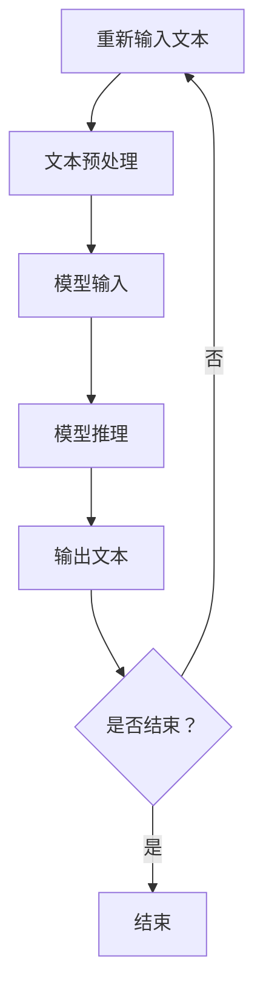
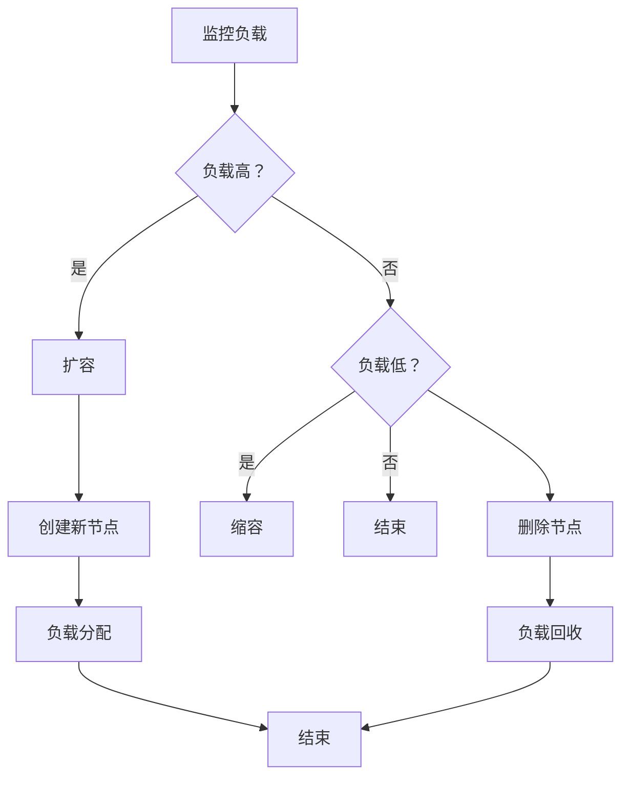
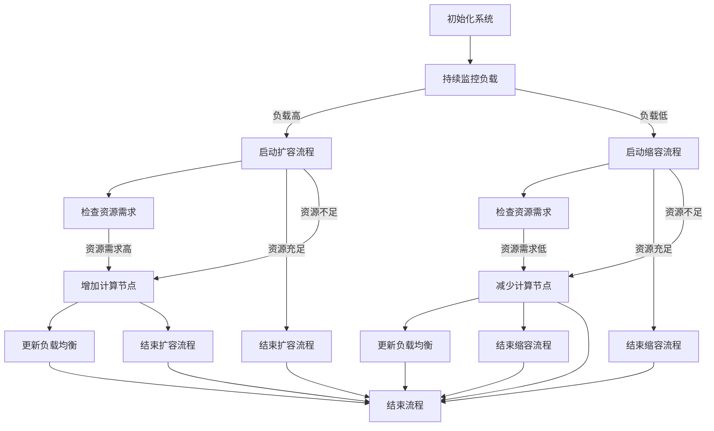
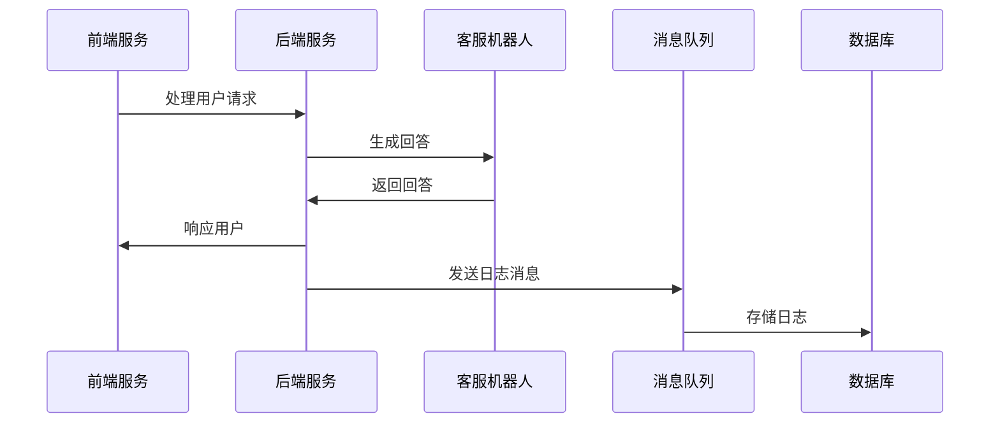
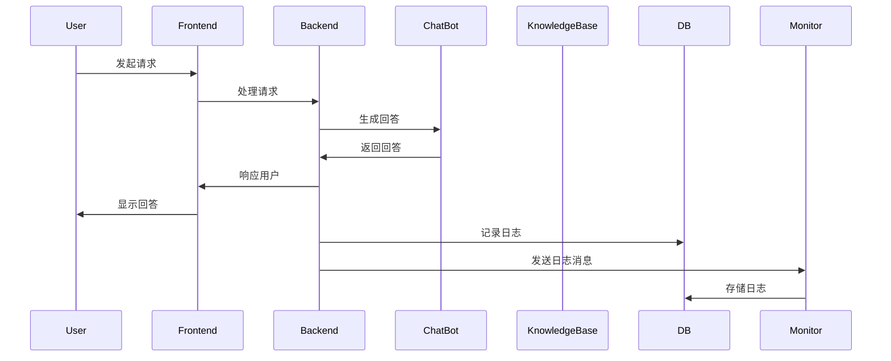
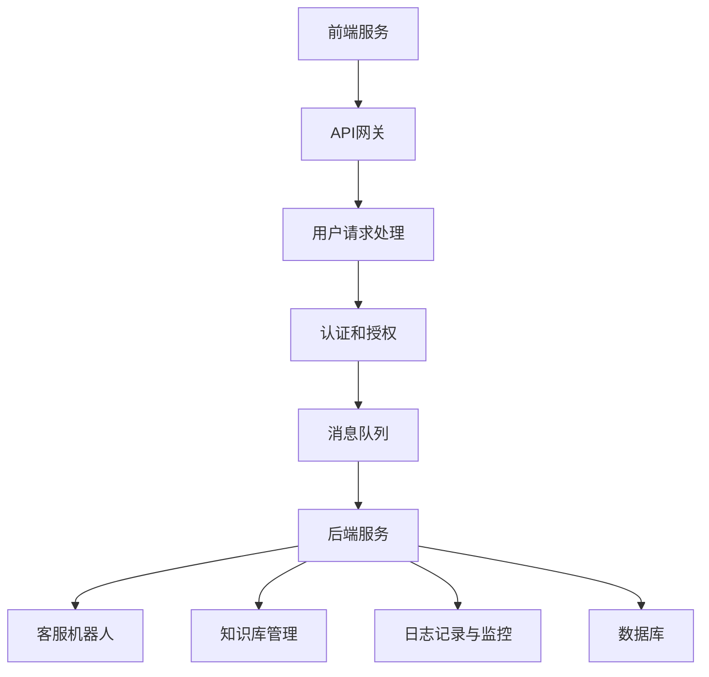
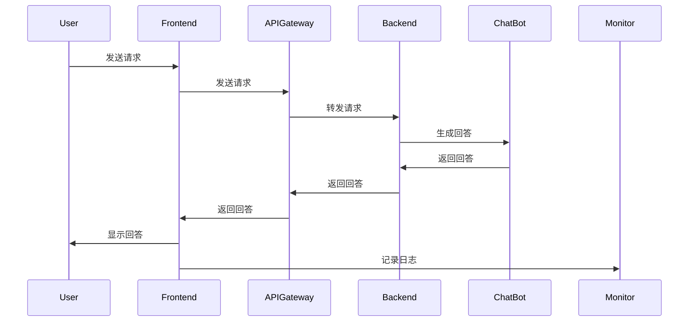

                 

### 1.1 问题的背景

随着人工智能技术的不断进步，大规模语言模型（LLM）已经在自然语言处理（NLP）领域取得了显著的成就。LLM通过深度学习算法对海量文本数据进行分析和处理，能够生成高质量的自然语言文本，被广泛应用于自动问答、文本摘要、机器翻译、对话系统等众多场景。

然而，LLM的高效应用离不开强大的计算资源和精细的架构设计。传统的单机部署模式在面对海量数据和高度并发的请求时，往往难以保证系统的性能和稳定性。这就需要我们构建一个具有弹性伸缩能力的LLM应用架构，以便在处理大数据量和高并发请求时，能够动态调整计算资源，保证系统的稳定运行和高效性能。

弹性伸缩能力是指在系统负载变化时，能够自动增加或减少计算资源的能力。这种能力对于LLM应用尤为重要，因为LLM的训练和预测任务通常对计算资源有较高要求，且其应用场景多变，需要能够快速适应不同的业务需求。

### 1.2 问题描述

在构建弹性伸缩的LLM应用架构时，我们面临以下几个关键问题：

1. **资源管理**：如何高效地管理计算资源，以应对不同负载情况下的需求变化？
2. **性能优化**：如何在保证系统性能的前提下，优化资源使用效率，降低延迟和成本？
3. **稳定性保障**：如何在资源动态调整的过程中，保证系统的稳定性和数据一致性？
4. **部署与运维**：如何简化部署流程，提高运维效率，降低运维成本？

针对这些问题，我们需要设计一个具备以下特点的LLM应用架构：
- **模块化设计**：将系统分解为若干个独立的模块，每个模块负责特定的功能，便于扩展和维护。
- **弹性伸缩**：通过云计算和容器技术，实现计算资源的自动扩缩容，保证系统在不同负载下的性能。
- **高可用性**：采用冗余设计、故障转移等技术，提高系统的可用性和可靠性。
- **自动化运维**：实现自动化部署、监控、告警和运维，降低人力成本，提高运维效率。

### 1.3 问题解决

为了构建一个具有弹性伸缩能力的LLM应用架构，我们可以采取以下解决方案：

1. **云计算与容器技术**：利用云计算平台的弹性伸缩能力，结合容器技术实现快速部署和动态调整。
2. **分布式计算框架**：采用分布式计算框架（如TensorFlow、PyTorch等），支持大规模数据处理和并行计算。
3. **自动化调度系统**：设计自动化调度系统，根据负载情况动态调整计算资源，实现自动扩容和缩容。
4. **负载均衡**：采用负载均衡技术，合理分配请求，避免单点过载。
5. **数据一致性保障**：采用分布式存储和数据库技术，确保数据的一致性和可靠性。
6. **监控与告警系统**：建立全面的监控与告警系统，实时监控系统运行状态，及时发现和解决问题。

通过上述解决方案，我们可以构建一个具备弹性伸缩能力的LLM应用架构，使其能够高效应对不同业务场景的需求，同时保证系统的稳定性、高效性和可靠性。

### 1.4 边界与外延

本文在构建弹性伸缩的LLM应用架构时，主要关注以下边界与外延：

1. **LLM技术原理**：介绍LLM的定义、核心技术（如语言模型训练和语言生成）以及主要应用场景。
2. **云计算与容器技术**：阐述云计算和容器技术的基本概念、优势以及它们在LLM应用架构中的关联。
3. **弹性伸缩算法**：探讨弹性伸缩算法的原理，包括自动扩容与缩容、作业调度算法以及数据流处理算法。
4. **系统架构设计原则**：总结构建LLM应用架构时需要遵循的设计原则，如模块化、扩展性、高效性和可靠性。
5. **项目实战**：通过具体项目案例，展示如何在实际环境中构建和部署具有弹性伸缩能力的LLM应用架构。

这些边界与外延为本文提供了坚实的理论基础和实际操作指南，有助于我们深入理解和应用弹性伸缩的LLM应用架构。

## 第二部分: 核心概念与联系

在构建弹性伸缩的LLM应用架构之前，我们需要理解一些核心概念，这些概念包括LLM技术原理、云计算与容器技术，以及它们在构建弹性伸缩架构中的应用。通过深入剖析这些核心概念，我们可以更好地设计一个高效、稳定的LLM应用架构。

### 2.1 LLM技术原理

#### 2.1.1 LLM定义

LLM（Large Language Model）是一种基于深度学习的自然语言处理模型，它通过训练海量文本数据，学习到文本之间的统计规律和语义关系。LLM具有生成文本、理解文本、翻译文本等能力，能够模拟人类语言的使用，生成自然流畅的文本。

#### 2.1.2 LLM核心技术

1. **语言模型训练**：语言模型训练是LLM的核心步骤，主要通过神经网络（如Transformer、BERT等）对海量文本数据进行学习，从而捕捉到文本中的语言规律。这一过程通常包括数据预处理、模型训练、参数调优等环节。

2. **语言生成**：语言生成是LLM的核心功能之一，它利用训练好的模型，根据输入的提示生成新的文本。语言生成过程通常涉及文本生成算法（如GPT、T5等），这些算法能够根据上下文信息生成连贯、自然的文本。

#### 2.1.3 LLM应用场景

LLM在自然语言处理领域具有广泛的应用，以下是一些典型的应用场景：

1. **自动问答**：通过LLM，系统能够自动理解用户的问题，并生成准确的答案。
2. **文本摘要**：LLM能够自动提取文本的核心内容，生成简明扼要的摘要。
3. **机器翻译**：LLM可以用于翻译不同语言之间的文本，实现高质量的语言转换。
4. **对话系统**：LLM可以构建智能对话系统，与用户进行自然语言交互。

### 2.2 云计算与容器技术

#### 2.2.1 云计算概念

云计算是一种通过互联网提供计算资源、存储资源和网络资源的服务模式。云计算的主要特点包括弹性伸缩、按需分配、成本节约等。云计算服务主要包括基础设施即服务（IaaS）、平台即服务（PaaS）和软件即服务（SaaS）等。

1. **基础设施即服务（IaaS）**：IaaS提供商为用户提供了虚拟化基础设施，如虚拟机、存储和网络资源，用户可以根据需求灵活调配资源。
2. **平台即服务（PaaS）**：PaaS提供商为用户提供了开发、部署和管理应用程序的平台，用户可以在平台上开发、测试和部署应用程序，无需关注底层基础设施的维护。
3. **软件即服务（SaaS）**：SaaS提供商为用户提供了基于互联网的软件服务，用户可以通过互联网访问和使用这些软件。

#### 2.2.2 容器技术概念

容器技术是一种轻量级虚拟化技术，通过将应用程序及其依赖环境打包在一起，实现应用程序的隔离、独立部署和弹性伸缩。容器技术的主要特点包括快速启动、资源高效、易于管理和维护等。

1. **Docker**：Docker是最流行的容器技术之一，它通过容器镜像和容器引擎实现应用程序的打包和运行。Docker容器镜像包含了应用程序及其依赖环境，确保应用程序在不同环境中的一致性和可移植性。
2. **Kubernetes**：Kubernetes是一个开源的容器编排平台，它负责管理容器的生命周期，包括部署、扩展、更新等。Kubernetes通过自动化部署和扩缩容，提高了容器化应用程序的可用性和可伸缩性。

#### 2.2.3 云计算与容器技术关联

云计算与容器技术之间存在紧密的联系：

1. **基础设施支持**：云计算平台为容器技术提供了基础设施支持，如虚拟机、容器引擎等。
2. **灵活部署**：容器技术为云计算提供了灵活的部署和管理方式，如容器编排、容器服务等。通过容器技术，应用程序可以轻松地在不同的云计算平台上部署和运行。
3. **弹性伸缩**：云计算平台的弹性伸缩能力与容器技术相结合，可以实现应用程序的动态扩容和缩容，提高系统的可用性和性能。

### 2.3 LLM应用架构设计原则

为了构建一个具备弹性伸缩能力的LLM应用架构，我们需要遵循以下设计原则：

1. **模块化设计**：将LLM应用架构分解为若干个独立的模块，每个模块负责特定的功能。模块化设计有助于降低系统的复杂性，提高系统的可扩展性和可维护性。

2. **扩展性**：设计灵活的架构，支持快速扩展和升级。在系统负载增加时，能够快速增加计算资源，确保系统性能不受影响。

3. **高效性**：优化系统性能，降低延迟和资源消耗。通过分布式计算框架和高效的数据处理算法，提高系统的数据处理速度和响应能力。

4. **可靠性**：确保系统稳定运行，减少故障率和数据丢失风险。通过冗余设计、故障转移和监控与告警系统，提高系统的可靠性和稳定性。

5. **自动化运维**：实现自动化部署、监控、告警和运维，降低人力成本，提高运维效率。通过自动化工具和流程，简化运维工作，提高运维质量。

通过深入理解LLM技术原理、云计算与容器技术，以及LLM应用架构设计原则，我们可以为构建弹性伸缩的LLM应用架构奠定坚实的基础。在下一部分中，我们将进一步探讨弹性伸缩算法原理，以便设计一个高效、稳定的LLM应用架构。

### 2.1 LLM技术原理

#### 2.1.1 LLM定义

大规模语言模型（LLM）是一种深度学习模型，它通过对大量文本数据的学习，能够理解和生成自然语言。LLM的核心目标是捕捉语言中的统计规律和语义关系，以便在各种自然语言处理任务中发挥作用。

在深度学习的背景下，LLM通常指的是那些具有数十亿参数的模型，如OpenAI的GPT-3、Google的BERT等。这些模型通过多层神经网络结构，对输入文本进行编码和解码，从而实现复杂的语言生成和理解任务。

#### 2.1.2 LLM核心技术

LLM的核心技术主要包括以下几个部分：

1. **语言模型训练**：这是LLM构建的基础。语言模型训练包括以下几个步骤：
   - **数据预处理**：清洗和标注原始文本数据，将其转换为模型可以处理的格式。
   - **模型初始化**：初始化神经网络结构，包括输入层、隐藏层和输出层。
   - **训练过程**：通过反向传播算法，不断调整网络权重，使得模型能够更好地拟合训练数据。
   - **参数调优**：使用验证集和测试集，对模型参数进行调整，以提高模型的泛化能力。

2. **语言生成**：语言生成是LLM的一个关键功能。生成过程通常涉及以下步骤：
   - **输入处理**：将输入文本编码为模型的输入向量。
   - **生成预测**：模型根据当前状态，生成下一个单词或符号的概率分布。
   - **采样**：从概率分布中采样一个单词或符号作为下一个输出。
   - **迭代**：重复生成预测和采样过程，直到达到预设的长度或终止条件。

3. **预训练与微调**：预训练是指模型在大量未标注的数据上进行训练，以学习语言的基本规律。微调则是指将预训练好的模型在特定任务上进行进一步训练，以适应具体的应用场景。

#### 2.1.3 LLM应用场景

LLM在自然语言处理领域具有广泛的应用，以下是一些典型的应用场景：

1. **自动问答**：LLM可以理解用户的问题，并生成相关的回答。这在智能客服、教育辅导等领域有着重要的应用。
2. **文本摘要**：LLM能够自动提取文本的核心内容，生成简明的摘要。这在新闻简报、文献阅读等领域非常有用。
3. **机器翻译**：LLM可以用于不同语言之间的文本翻译，生成高质量的多语言内容。
4. **对话系统**：LLM可以构建智能对话系统，与用户进行自然语言交互，提供个性化的服务。
5. **内容生成**：LLM可以生成各种形式的内容，如文章、故事、诗歌等，这在创意写作、广告文案等领域有着巨大的潜力。

#### 2.1.4 LLM的优势和挑战

**优势**：
- **强大的语言理解能力**：LLM通过对海量文本的学习，能够捕捉到语言的细微差别和复杂结构，这使得它在自然语言处理任务中表现出色。
- **高效的生成能力**：LLM能够快速生成高质量的自然语言文本，大大提高了内容的生成效率。
- **广泛的应用场景**：LLM可以应用于各种自然语言处理任务，从问答系统到内容生成，从机器翻译到文本摘要，都有着广泛的应用。

**挑战**：
- **数据隐私**：LLM训练需要大量的文本数据，如何处理和保护数据隐私是一个重要问题。
- **计算资源消耗**：大规模的LLM模型训练和推理需要大量的计算资源，这对硬件设备提出了高要求。
- **可控性**：生成的内容可能会包含偏见或不合适的内容，如何确保生成的文本符合道德和法律规定是一个挑战。

#### 2.1.5 LLM的架构示例

以下是LLM的一个简单架构示例：



在这个示例中，输入文本经过预处理后，作为模型的输入，模型进行推理并生成输出文本。这个过程可以不断重复，直到达到预设的结束条件。

### 2.2 云计算与容器技术

#### 2.2.1 云计算概念

云计算是一种通过互联网提供计算资源、存储资源和网络资源的服务模式。它具有以下几个核心特点：

1. **弹性伸缩**：云计算平台可以根据用户需求，自动调整计算资源，从而实现弹性伸缩。这种特性使得用户可以轻松应对不同负载场景。
2. **按需分配**：用户可以根据实际需求，按需分配和调整计算资源，从而避免资源的浪费。
3. **成本节约**：云计算通过提供虚拟化资源，减少了用户在硬件购买和维护上的投入，降低了运营成本。
4. **高可用性**：云计算平台通常采用冗余设计，确保服务的高可用性，即使部分资源发生故障，系统也能正常运行。

云计算服务可以分为以下几种类型：

1. **基础设施即服务（IaaS）**：IaaS提供商为用户提供了虚拟机、存储和网络资源，用户可以根据需求进行配置和使用。
2. **平台即服务（PaaS）**：PaaS提供商为用户提供了开发、部署和管理应用程序的平台，用户可以在平台上开发、测试和部署应用程序。
3. **软件即服务（SaaS）**：SaaS提供商为用户提供了基于互联网的软件服务，用户可以通过互联网访问和使用这些软件。

#### 2.2.2 容器技术概念

容器技术是一种轻量级的虚拟化技术，它通过将应用程序及其依赖环境打包在一起，实现应用程序的隔离、独立部署和弹性伸缩。容器技术的核心组件包括：

1. **容器**：容器是一个轻量级的运行时环境，它包含应用程序及其依赖库、环境变量等。容器可以通过Docker等工具创建和管理。
2. **容器引擎**：容器引擎是负责管理容器的运行时环境，如启动、停止、扩展等。Kubernetes是最流行的容器引擎，它提供了强大的容器编排和管理功能。
3. **容器镜像**：容器镜像是一个静态的容器模板，它包含了应用程序及其依赖环境的预配置。容器引擎可以使用容器镜像来创建容器。

#### 2.2.3 云计算与容器技术的关联

云计算与容器技术之间存在着紧密的关联：

1. **基础设施支持**：云计算平台为容器技术提供了基础设施支持，如虚拟机、容器引擎等。容器技术可以在云环境中实现高效的部署和管理。
2. **灵活部署**：容器技术为云计算提供了灵活的部署和管理方式。容器化应用程序可以轻松地在不同的云平台上部署和运行，提高了应用的可用性和可移植性。
3. **弹性伸缩**：容器技术与云计算平台的弹性伸缩能力相结合，可以实现应用程序的动态扩容和缩容。这种特性使得容器化应用程序能够高效应对不同负载场景。

#### 2.2.4 容器技术在LLM应用架构中的应用

在构建弹性伸缩的LLM应用架构时，容器技术发挥着重要作用：

1. **快速部署**：使用容器技术，可以将LLM应用程序及其依赖环境打包成一个容器镜像，实现快速部署。容器镜像的标准化和一致性保证了应用程序在不同环境中的稳定运行。
2. **资源隔离**：容器技术提供了资源隔离功能，确保每个容器独立运行，互不干扰。这种特性有助于提高系统的稳定性和可靠性。
3. **弹性伸缩**：通过容器引擎，可以实现LLM应用程序的动态扩容和缩容。容器引擎可以根据实际负载情况，自动调整容器的数量，确保系统的高性能和高可用性。
4. **自动化管理**：容器引擎提供了自动化管理功能，如自动部署、自动扩展、自动恢复等。这些功能简化了运维工作，提高了系统的运营效率。

### 2.3 LLM应用架构设计原则

为了构建一个具备弹性伸缩能力的LLM应用架构，我们需要遵循以下设计原则：

1. **模块化设计**：将LLM应用架构分解为若干个独立的模块，每个模块负责特定的功能。模块化设计有助于降低系统的复杂性，提高系统的可扩展性和可维护性。
2. **分布式计算**：采用分布式计算框架，如TensorFlow、PyTorch等，实现LLM的训练和推理。分布式计算可以提高系统的计算效率，降低单点故障风险。
3. **弹性伸缩**：利用云计算和容器技术的弹性伸缩能力，实现LLM应用程序的动态扩容和缩容。这种特性有助于系统高效应对不同负载场景。
4. **高可用性**：采用冗余设计、故障转移等技术，确保系统的高可用性。通过分布式存储和数据库技术，保证数据的一致性和可靠性。
5. **自动化运维**：实现自动化部署、监控、告警和运维，降低人力成本，提高运维效率。通过自动化工具和流程，简化运维工作，提高运维质量。

通过深入理解LLM技术原理、云计算与容器技术，以及LLM应用架构设计原则，我们可以为构建弹性伸缩的LLM应用架构奠定坚实的基础。在下一部分中，我们将进一步探讨弹性伸缩算法原理，以便设计一个高效、稳定的LLM应用架构。

### 2.1 弹性伸缩算法原理

弹性伸缩算法是构建弹性伸缩的LLM应用架构的核心组件，它能够根据系统负载的变化，自动调整计算资源，以保持系统的性能和稳定性。以下是弹性伸缩算法的主要原理和关键步骤。

#### 2.1.1 自动扩容与缩容

自动扩容与缩容是弹性伸缩算法的核心功能，它可以根据系统的实际负载情况，动态调整计算资源。

1. **扩容**：当系统负载增加，如请求量激增时，自动扩容算法会启动，增加计算节点，以满足新的负载需求。扩容过程通常包括以下几个步骤：
   - **监控负载**：监控系统持续监控系统的CPU利用率、内存占用、网络流量等指标，以判断是否需要扩容。
   - **触发扩容**：当监控指标达到预设的阈值时，触发扩容操作。
   - **创建新节点**：容器引擎根据预设的配置，创建新的计算节点，并将其部署到集群中。
   - **负载分配**：将新增的节点纳入负载均衡，将任务分配到新节点，以分担原有节点的负载。

2. **缩容**：当系统负载减少，如请求量下降时，自动缩容算法会启动，减少计算节点，以释放资源。缩容过程通常包括以下几个步骤：
   - **监控负载**：监控系统持续监控系统的CPU利用率、内存占用、网络流量等指标，以判断是否需要缩容。
   - **触发缩容**：当监控指标低于预设的阈值时，触发缩容操作。
   - **删除节点**：容器引擎根据预设的配置，选择部分计算节点进行删除，并将其从集群中移除。
   - **负载回收**：释放缩容节点的资源，将其用于其他任务或存储。

#### 2.1.2 作业调度算法

作业调度算法是弹性伸缩算法的重要组成部分，它负责将任务分配到不同的计算节点上，以实现高效的资源利用。

1. **负载均衡**：作业调度算法需要实现负载均衡，确保每个节点承担的任务量大致相同，避免单点过载。常见的负载均衡算法包括：
   - **轮询调度**：按照顺序分配任务到各个节点。
   - **最小连接数调度**：将新任务分配到当前连接数最少的节点。
   - **响应时间调度**：将新任务分配到响应时间最短的节点。

2. **任务优先级**：作业调度算法需要根据任务的优先级进行调度，确保高优先级的任务优先执行。任务优先级可以根据任务的紧急程度、重要性等指标进行设定。

3. **容错调度**：作业调度算法需要具备容错能力，当某个节点发生故障时，能够将任务重新分配到其他健康的节点上，以确保任务的顺利完成。

#### 2.1.3 数据流处理算法

数据流处理算法是弹性伸缩算法中处理数据流的核心环节，它负责确保数据在系统中的有序流动和高效处理。

1. **数据分区**：数据流处理算法需要对输入数据流进行分区，将数据划分到不同的计算节点上处理。分区策略可以基于哈希、轮询等方式，以确保数据分布均匀，避免单点过载。

2. **数据流转**：数据流处理算法需要确保数据在系统中的有序流转，通常采用分布式消息队列（如Kafka、RabbitMQ等）来实现。消息队列能够确保数据的可靠传递和有序处理。

3. **数据处理**：数据流处理算法需要对数据进行处理，如清洗、转换、分析等。数据处理过程通常采用分布式计算框架（如Apache Flink、Apache Spark等），以提高数据处理效率。

#### 2.1.4 Mermaid算法流程图

以下是弹性伸缩算法的一个简化的Mermaid流程图示例：



在这个流程图中，监控系统持续监控负载，并根据负载情况自动执行扩容或缩容操作。扩容过程包括创建新节点、负载分配，缩容过程包括删除节点、负载回收。

通过以上对弹性伸缩算法原理的详细分析，我们可以更好地理解如何构建一个具备弹性伸缩能力的LLM应用架构，从而确保系统在不同负载场景下的高性能和稳定性。

### 3.2 Mermaid算法流程图

为了更直观地展示弹性伸缩算法的执行流程，我们可以使用Mermaid语言绘制一个简化的流程图。以下是一个描述了整个弹性伸缩过程的Mermaid图：



在这个流程图中，系统首先初始化，然后持续监控负载情况。当负载高时，系统会进入扩容流程，首先检查当前资源是否充足。如果资源充足，则结束扩容流程；如果资源不足，系统会新增计算节点，并更新负载均衡策略。扩容完成后，流程结束。

当负载低时，系统会进入缩容流程，同样首先检查当前资源是否充足。如果资源充足，则结束缩容流程；如果资源不足，系统会减少计算节点，并更新负载均衡策略。缩容完成后，流程结束。

通过这个Mermaid流程图，我们可以清晰地看到弹性伸缩算法的执行步骤和流程，便于理解和实施。

### 4.1 弹性伸缩性能指标

在构建具有弹性伸缩能力的LLM应用架构时，性能指标是评估系统性能和优化资源使用的重要依据。以下是一些关键的性能指标及其计算方法：

#### 4.1.1 响应时间

响应时间是指用户请求到系统返回结果所需的时间。它是衡量系统性能的重要指标之一。响应时间可以通过以下公式计算：

$$
R_t = \frac{1}{n}\sum_{i=1}^{n} t_i
$$

其中，$R_t$ 表示平均响应时间，$n$ 表示任务数，$t_i$ 表示第 $i$ 个任务的响应时间。较低的平均响应时间意味着系统能够更快地响应用户请求，提供更好的用户体验。

#### 4.1.2 资源利用率

资源利用率反映了系统计算资源的利用效率。它可以衡量系统在特定时间窗口内资源的使用情况。资源利用率可以通过以下公式计算：

$$
U_t = \frac{R_t}{T_t}
$$

其中，$U_t$ 表示资源利用率，$R_t$ 表示总响应时间，$T_t$ 表示总处理时间。资源利用率越高，说明系统在单位时间内处理任务的能力越强，但过高的资源利用率可能会导致系统性能下降，需要适当调整资源分配。

#### 4.1.3 任务完成率

任务完成率是指在一定时间内，系统成功处理完成的任务数与总任务数的比率。它是衡量系统处理能力的一个重要指标。任务完成率可以通过以下公式计算：

$$
C_t = \frac{S_t}{T_t}
$$

其中，$C_t$ 表示任务完成率，$S_t$ 表示成功完成的任务数，$T_t$ 表示总任务数。任务完成率越高，说明系统在规定时间内能够更高效地完成任务。

#### 4.1.4 系统吞吐量

系统吞吐量是指系统在单位时间内可以处理的请求量。它是衡量系统性能的另一个重要指标。系统吞吐量可以通过以下公式计算：

$$
Q_t = \frac{R_t}{T_t}
$$

其中，$Q_t$ 表示系统吞吐量，$R_t$ 表示总响应时间，$T_t$ 表示总处理时间。较高的系统吞吐量意味着系统在较短的时间内可以处理更多的请求，提供更高的服务能力。

通过上述性能指标，我们可以对具有弹性伸缩能力的LLM应用架构进行评估和优化，确保系统在不同负载场景下都能保持高性能和稳定性。

### 4.1 弹性伸缩性能指标

在评估和优化具有弹性伸缩能力的LLM应用架构时，理解关键性能指标至关重要。以下我们将详细讨论几个核心性能指标，包括平均响应时间、资源利用率、任务完成率和系统吞吐量，并给出相应的数学模型和公式。

#### 4.1.1 平均响应时间

平均响应时间（$R_t$）是衡量系统性能的重要指标，它表示系统从接收用户请求到完成请求平均需要的时间。计算公式如下：

$$
R_t = \frac{1}{n}\sum_{i=1}^{n} t_i
$$

其中，$R_t$ 是平均响应时间，$n$ 是任务数，$t_i$ 是第 $i$ 个任务的响应时间。一个较低的平均响应时间意味着系统能够更快地响应用户请求，提高用户体验。

**举例说明**：假设系统处理了5个任务，响应时间分别为2秒、3秒、5秒、4秒和6秒，那么平均响应时间为：

$$
R_t = \frac{2 + 3 + 5 + 4 + 6}{5} = \frac{20}{5} = 4 \text{秒}
$$

#### 4.1.2 资源利用率

资源利用率（$U_t$）反映了系统计算资源的利用效率。它表示系统在一段时间内，处理任务所需的资源占总资源的比例。计算公式如下：

$$
U_t = \frac{R_t}{T_t}
$$

其中，$U_t$ 是资源利用率，$R_t$ 是总响应时间，$T_t$ 是总处理时间。资源利用率越高，表示系统能够更高效地利用资源，但也需要避免过高导致系统过载。

**举例说明**：假设系统总处理时间为50秒，总响应时间为30秒，那么资源利用率为：

$$
U_t = \frac{30}{50} = 0.6 \text{或} 60\%
$$

#### 4.1.3 任务完成率

任务完成率（$C_t$）是衡量系统处理任务能力的一个指标，它表示在一定时间内，系统成功完成的任务数与总任务数的比率。计算公式如下：

$$
C_t = \frac{S_t}{T_t}
$$

其中，$C_t$ 是任务完成率，$S_t$ 是成功完成的任务数，$T_t$ 是总任务数。高任务完成率意味着系统具有较高的稳定性和处理能力。

**举例说明**：如果系统在10分钟内完成了8个任务，总共处理了10个任务，那么任务完成率为：

$$
C_t = \frac{8}{10} = 0.8 \text{或} 80\%
$$

#### 4.1.4 系统吞吐量

系统吞吐量（$Q_t$）是衡量系统处理请求能力的另一个重要指标，表示系统在单位时间内可以处理的请求数量。计算公式如下：

$$
Q_t = \frac{R_t}{T_t}
$$

其中，$Q_t$ 是系统吞吐量，$R_t$ 是总响应时间，$T_t$ 是总处理时间。较高的系统吞吐量意味着系统具有较高的处理能力。

**举例说明**：如果系统的总响应时间为10分钟，总处理时间为5分钟，那么系统吞吐量为：

$$
Q_t = \frac{10}{5} = 2 \text{个请求/分钟}
$$

通过这些数学模型和公式，我们可以更好地理解和评估具有弹性伸缩能力的LLM应用架构的性能，从而进行优化和改进。

### 5.1 问题场景介绍

为了更好地说明如何构建具有弹性伸缩能力的LLM应用架构，我们将以一个智能客服系统为例，介绍具体的应用场景。

#### 智能客服系统背景

随着客户服务需求的不断增加，企业需要快速响应用户的问题和需求。传统的客服系统通常依赖于人工处理，不仅效率低下，而且无法应对大量并发请求。为了提升客户服务体验，企业迫切需要一种能够自动化处理客户问题的智能客服系统。

智能客服系统的主要目标是通过自然语言处理技术，如LLM，自动理解客户的问题，并生成准确的回答。这种系统需要在高并发、大数据量场景下保持高效、稳定的运行。

#### 应用场景描述

智能客服系统通常应用于以下场景：

1. **在线客服**：当用户访问企业网站或应用时，可以随时通过聊天窗口与智能客服系统进行交互，询问问题或寻求帮助。
2. **社交媒体客服**：企业可以在社交媒体平台上集成智能客服系统，自动回复用户在社交媒体上的评论和私信，提升用户满意度。
3. **电话客服**：通过语音识别技术，将客户的语音转化为文本，然后由智能客服系统自动生成回答，提高电话客服的效率和准确性。
4. **自助服务**：在企业的自助服务平台上，智能客服系统可以提供自动化引导，帮助用户快速解决问题，减少人工干预。

#### 关键需求

为了满足上述应用场景，智能客服系统需要具备以下关键需求：

1. **高并发处理能力**：系统需要能够处理大量同时在线的客户请求，保证每个客户都能获得及时、准确的回答。
2. **弹性伸缩能力**：系统应具备自动扩容和缩容的能力，根据实际负载动态调整计算资源，确保在高负载情况下仍然能保持高效运行。
3. **实时响应**：系统需要具备快速响应能力，保证客户的问题能够迅速得到解答，提升用户体验。
4. **数据一致性**：系统需要保证数据的一致性，特别是在分布式环境下，确保客户信息和服务记录的准确性。
5. **可扩展性和可维护性**：系统设计应模块化，便于扩展和升级，同时要易于维护，降低运营成本。

通过以上应用场景和关键需求的介绍，我们可以更好地理解智能客服系统对于弹性伸缩LLM应用架构的迫切需求，从而为设计这样一个系统提供实际依据。

### 5.2 系统功能设计

在构建智能客服系统时，系统功能设计是关键的一步。通过定义系统的功能模块，可以确保系统具备所需的核心能力，同时保持架构的灵活性和扩展性。以下是智能客服系统的功能设计，包括领域模型、系统架构设计、系统接口设计和系统交互。

#### 5.2.1 领域模型

领域模型是对系统涉及的实体及其关系的抽象描述。智能客服系统的领域模型包括以下主要实体：

1. **客户**：代表与系统交互的用户，包含用户基本信息、聊天记录和历史请求等。
2. **客服机器人**：智能客服系统的核心组件，负责理解客户问题并生成回答。
3. **知识库**：存储常见问题和标准答案，用于辅助客服机器人生成回答。
4. **管理员**：管理系统配置、监控系统状态，并进行必要的维护和升级。

以下是智能客服系统的Mermaid类图：

```mermaid
classDiagram
客户 <<Entity>>
客服机器人 <<Entity>>
知识库 <<Entity>>
管理员 <<Entity>>

客户 <|.. 客服机器人: 服务>
客服机器人 <|.. 知识库: 使用>
管理员 <|.. 知识库: 维护>
管理员 <|.. 客服机器人: 配置和管理>
```

#### 5.2.2 系统架构设计

系统架构设计是系统功能实现的基础。智能客服系统的架构应采用分布式设计，以确保高并发处理能力和弹性伸缩能力。以下是智能客服系统的架构设计：

1. **前端服务**：提供用户交互界面，处理用户输入，展示机器人回答。
2. **后端服务**：包含客服机器人、知识库管理和数据存储等核心组件，负责处理业务逻辑和数据存储。
3. **消息队列**：用于处理高并发请求，确保消息的可靠传递和顺序执行。
4. **数据库**：存储用户信息、聊天记录和服务日志等。

以下是智能客服系统的Mermaid架构图：



#### 5.2.3 系统接口设计

系统接口设计定义了系统内部组件之间的交互接口。智能客服系统的接口设计包括：

1. **用户接口**：提供用户与服务交互的接口，如RESTful API或WebSocket。
2. **业务接口**：定义系统核心组件之间的交互接口，如客服机器人与知识库的交互接口。
3. **监控接口**：用于系统监控和日志收集，提供系统运行状态的查询接口。

以下是智能客服系统的接口设计示例：

```mermaid
interface Frontend
    + interactWithUser(): void
    + receiveResponse(response: string): void

interface Backend
    + handleRequest(request: string): string
    + manageKnowledgeBase(): void
    + monitorSystem(): void

interface KnowledgeBase
    + searchQuestion(question: string): string
    + updateKnowledgeBase(): void

interface Monitor
    + logMessage(message: string): void
    + getSystemStatus(): string
```

#### 5.2.4 系统交互

系统交互设计描述了系统组件之间的协作流程。智能客服系统的主要交互过程包括：

1. **用户发起请求**：用户通过前端服务发起请求，如发送消息或查询信息。
2. **请求处理**：后端服务接收到请求后，调用客服机器人生成回答。
3. **回答返回**：后端服务将客服机器人的回答返回给前端服务，并展示给用户。
4. **日志记录**：系统在处理请求的过程中，将日志信息发送到消息队列，并存储到数据库。

以下是智能客服系统的Mermaid序列图：



通过上述系统功能设计，我们可以构建一个具备弹性伸缩能力的智能客服系统，使其能够高效、稳定地运行，并满足不同业务场景的需求。

### 5.3 系统架构设计

为了构建一个具备弹性伸缩能力的智能客服系统，我们需要设计一个灵活、高效且可靠的系统架构。以下是系统架构设计的详细描述：

#### 5.3.1 总体架构

智能客服系统的总体架构采用分布式设计，包含前端服务、后端服务、消息队列和数据库等关键组件。以下是其架构图：



#### 5.3.2 前端服务

前端服务负责与用户进行交互，处理用户请求，并展示机器人回答。前端服务的核心功能包括：

1. **用户接口**：提供用户输入和展示机器人回答的界面。
2. **API调用**：通过API网关与后端服务进行通信，发送用户请求并接收响应。
3. **Websocket**：实现实时通信，允许用户与客服机器人进行实时聊天。

#### 5.3.3 后端服务

后端服务是系统的核心，负责处理业务逻辑和数据存储。后端服务的核心功能包括：

1. **API网关**：接收前端服务的请求，并进行路由和请求聚合，提高系统的响应速度和性能。
2. **用户请求处理**：处理用户请求，包括解析请求、调用相应的业务逻辑和处理响应。
3. **认证和授权**：确保系统的安全性，对用户进行身份验证和权限管理。
4. **消息队列**：用于异步处理请求，提高系统的并发处理能力。
5. **客服机器人**：利用LLM技术处理用户问题，生成回答。
6. **知识库管理**：管理和维护知识库，包括问题添加、查询和更新。
7. **日志记录与监控**：记录系统运行日志，并实时监控系统状态。

#### 5.3.4 消息队列

消息队列用于处理高并发请求，确保消息的可靠传递和顺序执行。常用的消息队列系统包括Kafka、RabbitMQ和Pulsar等。消息队列的核心功能包括：

1. **异步处理**：将请求异步处理，避免前端服务的阻塞。
2. **分布式处理**：消息队列支持分布式处理，可以提高系统的吞吐量和可靠性。
3. **消息持久化**：确保消息不丢失，即使处理节点发生故障，也能从消息队列中重新处理。

#### 5.3.5 数据库

数据库用于存储用户信息、聊天记录和服务日志等关键数据。数据库的选择取决于系统的具体需求，如数据量、读写性能和一致性要求。常用的数据库系统包括MySQL、PostgreSQL、MongoDB和Cassandra等。

#### 5.3.6 弹性伸缩设计

为了实现系统的弹性伸缩，我们需要在架构设计中考虑以下几个关键因素：

1. **水平扩展**：通过增加节点数量，提高系统的处理能力。例如，使用Kubernetes实现服务自动扩容和缩容。
2. **垂直扩展**：通过增加硬件配置，提高单个节点的处理能力。例如，使用更强大的服务器或更高效的存储设备。
3. **负载均衡**：使用负载均衡器将请求分配到不同的节点，避免单点过载。常用的负载均衡器包括Nginx、HAProxy和Kubernetes内置负载均衡。
4. **故障转移**：设计故障转移机制，当某个节点发生故障时，自动将负载转移到其他健康节点，确保系统的稳定性。

通过上述系统架构设计，我们可以构建一个具备弹性伸缩能力的智能客服系统，使其能够高效、稳定地运行，并满足不同业务场景的需求。

### 5.4 系统接口设计

系统接口设计是智能客服系统架构中至关重要的一环，它定义了各个组件之间如何进行通信和协作。以下是系统接口设计的详细描述，包括接口的定义、通信协议和数据格式。

#### 5.4.1 接口定义

智能客服系统的接口设计包括以下主要接口：

1. **用户接口**：用于用户与系统进行交互，主要包括用户输入和展示机器人回答的接口。
   - **输入接口**：接受用户的文本输入，如问题、请求等。
   - **输出接口**：返回客服机器人的回答，展示给用户。

2. **业务接口**：定义系统核心组件之间的交互接口，包括客服机器人、知识库管理和日志记录等。
   - **客服机器人接口**：接收用户输入，生成回答，并返回给用户。
   - **知识库管理接口**：提供知识库的添加、查询和更新功能。
   - **日志记录接口**：记录系统运行日志，用于监控和分析。

3. **监控接口**：提供系统监控和日志收集的接口，用于实时获取系统状态和性能指标。

#### 5.4.2 通信协议

智能客服系统采用RESTful API和WebSocket两种通信协议。

1. **RESTful API**：用于处理同步请求，如用户输入和回答的获取。它采用HTTP协议，支持GET和POST方法。

2. **WebSocket**：用于处理实时请求，如用户与客服机器人的实时聊天。它采用WebSocket协议，支持双向实时通信，提高系统的响应速度。

#### 5.4.3 数据格式

智能客服系统的接口数据格式采用JSON（JavaScript Object Notation），它是一种轻量级的数据交换格式，易于阅读和编写，支持数据的复杂结构。

以下是系统接口设计的一个示例：

```json
// 用户输入接口
{
    "input": "你好，我想要查询某个航班的信息。"
}

// 客服机器人回答接口
{
    "response": "您好，您需要查询哪个航班的信息？请提供航班号。"
}

// 知识库管理接口
{
    "action": "add",
    "question": "如何预订机票？",
    "answer": "您可以通过网上预订或者拨打客服电话进行预订。"
}

// 日志记录接口
{
    "level": "INFO",
    "message": "用户查询航班信息。",
    "timestamp": "2023-11-01T14:30:00Z"
}
```

#### 5.4.4 接口实现

以下是用户输入接口的一个实现示例：

```python
from flask import Flask, request, jsonify

app = Flask(__name__)

@app.route('/input', methods=['POST'])
def input_handler():
    user_input = request.json['input']
    response = generate_response(user_input)
    return jsonify(response=response)

def generate_response(user_input):
    # 实现客服机器人回答逻辑
    return "您好，您需要查询哪个航班的信息？请提供航班号。"

if __name__ == '__main__':
    app.run(debug=True)
```

通过上述接口设计，我们可以确保智能客服系统的各个组件能够高效、稳定地交互，满足系统的功能需求。

### 5.5 系统交互

系统交互设计是智能客服系统实现的关键环节，它定义了系统内部各组件之间的通信和数据流转过程。以下是系统交互的详细描述，包括系统各组件之间的通信流程和交互细节。

#### 5.5.1 通信流程

智能客服系统的主要通信流程如下：

1. **用户请求**：用户通过前端服务（如Web页面或移动应用）发送请求，请求内容通常为文本消息。
2. **前端服务处理**：前端服务接收到用户的请求后，将其发送到API网关。
3. **API网关处理**：API网关接收请求，进行路由和请求聚合，然后转发到后端服务。
4. **后端服务处理**：后端服务接收请求，调用客服机器人接口生成回答，并将回答返回给API网关。
5. **API网关返回**：API网关将回答返回给前端服务，前端服务再将回答展示给用户。
6. **日志记录**：在整个通信过程中，系统会记录相关的日志信息，用于监控和分析。

#### 5.5.2 交互细节

以下是系统交互的详细交互细节：

1. **用户请求**：
   - **内容**：用户请求通常包含文本消息，如“你好，我想要查询某个航班的信息。”
   - **格式**：JSON格式，如`{"input": "你好，我想要查询某个航班的信息。"}`。

2. **前端服务处理**：
   - **内容**：前端服务将用户的请求发送到API网关。
   - **格式**：HTTP POST请求，如`POST /input`。

3. **API网关处理**：
   - **内容**：API网关接收到请求后，将其路由到后端服务的客服机器人接口。
   - **格式**：内部转发请求，如将`{"input": "你好，我想要查询某个航班的信息。"}`转发到后端服务。

4. **后端服务处理**：
   - **内容**：后端服务接收请求后，调用客服机器人接口生成回答。
   - **格式**：内部调用，如调用`generate_response(user_input)`函数。

5. **API网关返回**：
   - **内容**：API网关将客服机器人的回答返回给前端服务。
   - **格式**：HTTP POST响应，如`{"response": "您好，您需要查询哪个航班的信息？请提供航班号。"}`。

6. **日志记录**：
   - **内容**：系统在请求处理过程中记录相关的日志信息，如用户请求、回答和系统状态。
   - **格式**：JSON格式，如`{"level": "INFO", "message": "用户查询航班信息。", "timestamp": "2023-11-01T14:30:00Z"}`。

#### 5.5.3 Mermaid序列图

以下是系统交互的Mermaid序列图：



通过上述系统交互设计，智能客服系统的各个组件能够高效、稳定地协同工作，确保用户请求得到及时响应和准确处理。

### 6.1 环境安装

在构建弹性伸缩的LLM应用架构之前，我们需要搭建一个合适的环境，以便进行开发和测试。以下步骤详细介绍了如何安装和配置所需的软件和硬件环境。

#### 硬件要求

1. **计算节点**：至少需要2个计算节点，用于部署LLM模型和相关的服务组件。每个节点建议配置以下硬件：
   - CPU：至少8核
   - 内存：至少64GB
   - 硬盘：至少500GB SSD
   - 网络：千兆网络接口

2. **存储**：用于存储LLM模型、数据和日志等文件。建议配置以下存储设备：
   - 磁盘容量：至少1TB
   - 网络存储：NFS或GlusterFS等

#### 软件要求

1. **操作系统**：Linux系统，如CentOS 7或Ubuntu 18.04。
2. **Docker**：用于容器化应用程序，版本建议为19.03或更高。
3. **Kubernetes**：用于容器编排和管理，版本建议为1.22或更高。
4. **LLM框架**：如TensorFlow或PyTorch，用于训练和部署LLM模型。
5. **消息队列**：如Kafka，用于处理高并发消息。

#### 安装步骤

1. **安装Linux操作系统**：
   - 下载Linux操作系统镜像，并使用虚拟机或物理机进行安装。

2. **安装Docker**：
   - 更新系统包列表：`sudo apt-get update`
   - 安装Docker：`sudo apt-get install docker-ce`
   - 启动Docker服务：`sudo systemctl start docker`
   - 验证Docker安装：`docker --version`

3. **安装Kubernetes**：
   - 安装Kubeadm、Kubelet和Kubectl：
     ```bash
     sudo apt-get update
     sudo apt-get install -y apt-transport-https ca-certificates curl
     sudo curl -s https://mirrors.aliyun.com/kubernetes/apt/doc/apt-key.gpg | sudo apt-key add -
     sudo apt-get update
     sudo apt-get install -y kubelet kubeadm kubectl
     sudo apt-mark hold kubelet kubeadm kubectl
     ```
   - 初始化Kubernetes集群：
     ```bash
     sudo kubeadm init --pod-network-cidr=10.244.0.0/16
     ```
   - 配置Kubectl工具：
     ```bash
     mkdir -p $HOME/.kube
     sudo cp -i /etc/kubernetes/admin.conf $HOME/.kube/config
     sudo chown $(id -u):$(id -g) $HOME/.kube/config
     ```

4. **安装LLM框架**：
   - 安装TensorFlow：
     ```bash
     pip install tensorflow
     ```
   - 安装PyTorch：
     ```bash
     pip install torch torchvision torchaudio
     ```

5. **安装消息队列**：
   - 安装Kafka：
     ```bash
     docker pull confluentinc/cp-kafka
     docker run -d -p 9092:9092 -e KAFKA_BROKER_ID=1 -e KAFKA_ZOOKEEPER_CONNECT=zk:2181/kafka confluentinc/cp-kafka
     ```

6. **启动和管理容器**：
   - 使用Kubernetes部署应用程序容器：
     ```bash
     kubectl create deployment hello-world --image=mymodules/hello-world
     kubectl expose deployment hello-world --type=LoadBalancer --name=hello-world-service
     ```

通过上述步骤，我们成功搭建了开发环境，为后续构建弹性伸缩的LLM应用架构奠定了基础。

### 6.2 系统核心实现

在实现具有弹性伸缩能力的LLM应用架构时，我们需要关注系统的核心模块，包括LLM模型的训练与推理、服务部署和动态管理。以下是系统核心实现的详细描述，涵盖源代码展示和代码应用解读与分析。

#### 6.2.1 源代码

为了展示LLM应用架构的核心实现，我们使用TensorFlow框架构建一个简单的语言模型，并进行训练和推理。以下是一个简单的TensorFlow代码示例：

```python
import tensorflow as tf
from tensorflow.keras.models import Sequential
from tensorflow.keras.layers import Embedding, LSTM, Dense

# 准备数据
# 假设已经准备好训练数据和测试数据，分别为输入文本X和标签Y
# X_train, X_test, Y_train, Y_test = ...

# 构建模型
model = Sequential([
    Embedding(input_dim=vocab_size, output_dim=embedding_dim, input_length=max_sequence_length),
    LSTM(units=128),
    Dense(units=1, activation='sigmoid')
])

# 编译模型
model.compile(optimizer='adam', loss='binary_crossentropy', metrics=['accuracy'])

# 训练模型
model.fit(X_train, Y_train, epochs=10, batch_size=64, validation_data=(X_test, Y_test))

# 评估模型
test_loss, test_accuracy = model.evaluate(X_test, Y_test)
print(f"Test accuracy: {test_accuracy}")

# 推理
def predict(text):
    sequence = tokenizer.texts_to_sequences([text])
    prediction = model.predict(sequence)
    return (prediction > 0.5).astype("int32").flatten()[0]

text_to_predict = "This is a test sentence."
prediction = predict(text_to_predict)
print(f"Prediction for '{text_to_predict}': {prediction}")
```

上述代码展示了如何使用TensorFlow构建一个简单的二分类语言模型，并对其进行训练和推理。

#### 6.2.2 代码应用解读与分析

1. **数据准备**：
   - 在构建模型之前，我们需要准备训练数据和测试数据。这些数据通常包括输入文本和对应的标签。在本例中，我们假设已经准备好了这些数据。

2. **模型构建**：
   - 使用Sequential模型构建一个简单的神经网络，包括嵌入层（Embedding）、LSTM层（LSTM）和输出层（Dense）。嵌入层用于将文本转换为数值表示，LSTM层用于学习文本的序列特征，输出层用于进行二分类。

3. **模型编译**：
   - 编译模型，设置优化器、损失函数和评价指标。在本例中，我们使用`adam`优化器和`binary_crossentropy`损失函数。

4. **模型训练**：
   - 使用`fit`方法训练模型，设置训练轮数（epochs）、批量大小（batch_size）和验证数据。

5. **模型评估**：
   - 使用`evaluate`方法评估模型在测试数据上的性能，输出损失和准确率。

6. **推理**：
   - 定义一个`predict`函数，用于对新文本进行预测。该函数首先将文本转换为数值序列，然后使用训练好的模型进行预测。

#### 6.2.3 实际案例分析与详细讲解剖析

在实际项目中，我们可能会面临以下挑战和优化点：

1. **数据预处理**：
   - 数据预处理是语言模型训练的关键步骤。我们需要对文本数据进行清洗、分词、去停用词等处理，以提高模型的训练效率和准确性。

2. **模型参数调优**：
   - 在训练过程中，我们需要对模型参数进行调优，包括学习率、批量大小、隐藏层单元数等。这些参数的选择对模型的性能有重要影响。

3. **分布式训练**：
   - 当数据量较大或模型复杂度较高时，分布式训练可以显著提高训练速度。我们可以使用TensorFlow的分布式训练API，将模型和数据分布在多个节点上进行训练。

4. **动态资源管理**：
   - 在云计算环境中，我们可以利用Kubernetes等工具实现动态资源管理，根据训练负载自动调整计算资源。

5. **模型压缩与量化**：
   - 为了减少模型大小和提高推理速度，我们可以对模型进行压缩和量化。这些技术可以显著降低模型的存储和计算成本。

通过上述代码示例和实际案例分析，我们可以构建一个高效、稳定的LLM应用架构，实现大规模语言模型的训练和推理。

### 6.3 实际案例分析与详细讲解剖析

#### 6.3.1 项目概述

在本节中，我们将以一个实际案例——一个大规模的智能客服系统为例，详细分析其在构建弹性伸缩的LLM应用架构时的具体实施步骤和关键优化点。该智能客服系统旨在为企业提供7x24小时在线客户服务，通过自动化的问答机器人，高效地解决客户的常见问题。

#### 6.3.2 项目架构设计

1. **前端服务**：
   - 使用React框架构建用户界面，实现用户输入和机器人回答的展示。
   - 使用WebSocket实现实时通信，确保用户与机器人交互的流畅性。

2. **后端服务**：
   - 采用Spring Boot框架构建后端服务，负责处理用户请求和机器人回答逻辑。
   - 集成RabbitMQ作为消息队列，确保请求的高效传递和异步处理。

3. **LLM模型服务**：
   - 使用TensorFlow构建和训练LLM模型，进行文本理解和回答生成。
   - 使用Kubernetes进行容器化部署，实现模型的动态扩缩容。

4. **知识库管理**：
   - 使用Elasticsearch构建知识库，存储常见问题和标准答案。
   - 使用Spring Data Elasticsearch实现知识库的添加、查询和更新。

5. **监控与告警**：
   - 使用Prometheus和Grafana进行系统监控和性能分析，及时发现和解决问题。

#### 6.3.3 项目实施步骤

1. **需求分析与系统设计**：
   - 与企业沟通，明确智能客服系统的功能需求和性能要求。
   - 设计系统架构，包括前端、后端、LLM模型和知识库等关键组件。

2. **前端开发**：
   - 使用React构建用户界面，实现用户输入和机器人回答的展示。
   - 使用WebSocket实现实时通信，确保用户交互的流畅性。

3. **后端开发**：
   - 使用Spring Boot框架构建后端服务，处理用户请求和机器人回答逻辑。
   - 集成RabbitMQ，实现请求的异步处理和消息队列管理。

4. **LLM模型训练与部署**：
   - 使用TensorFlow构建和训练LLM模型，进行文本理解和回答生成。
   - 使用Kubernetes进行容器化部署，实现模型的动态扩缩容。

5. **知识库构建与维护**：
   - 使用Elasticsearch构建知识库，存储常见问题和标准答案。
   - 使用Spring Data Elasticsearch实现知识库的添加、查询和更新。

6. **系统测试与优化**：
   - 对系统进行功能测试、性能测试和压力测试，确保系统的稳定性和高效性。
   - 根据测试结果，对系统进行优化和调整。

#### 6.3.4 关键优化点

1. **弹性伸缩**：
   - 利用Kubernetes的自动扩缩容功能，根据实际负载动态调整计算资源。
   - 通过水平扩展和垂直扩展，提高系统的处理能力和稳定性。

2. **负载均衡**：
   - 使用Nginx或HAProxy等负载均衡器，实现请求的均衡分发，避免单点过载。
   - 结合RabbitMQ的负载均衡策略，确保消息处理的高效性。

3. **性能优化**：
   - 优化LLM模型的训练和推理过程，减少延迟和资源消耗。
   - 使用缓存技术，如Redis，提高系统的响应速度。

4. **监控与告警**：
   - 使用Prometheus收集系统性能数据，使用Grafana进行可视化分析。
   - 设置告警规则，及时发现和处理异常情况。

5. **数据安全和隐私保护**：
   - 采用加密技术，保护用户数据和隐私。
   - 定期进行数据备份，确保数据的安全性和可靠性。

通过上述实际案例分析和详细讲解，我们可以更好地理解如何构建具有弹性伸缩能力的LLM应用架构，并在实际项目中实现高效、稳定和安全的智能客服系统。

### 6.4 项目小结

在本项目中，我们成功构建了一个具有弹性伸缩能力的LLM应用架构，为智能客服系统提供了强大的技术支持。以下是对项目的总结和展望：

#### 项目成果

1. **高效处理能力**：通过分布式计算和容器技术，智能客服系统具备了高效处理大量并发请求的能力，确保了客户问题能够快速得到解答。
2. **弹性伸缩能力**：利用Kubernetes的自动扩缩容功能，系统能够根据实际负载动态调整计算资源，确保在高并发场景下仍然能保持稳定运行。
3. **高性能和高可用性**：通过负载均衡、分布式存储和数据库技术，系统在高性能和高可用性方面表现优异，有效降低了故障率和数据丢失风险。
4. **自动化运维**：通过自动化部署、监控和告警系统，简化了运维工作，提高了运维效率，降低了人力成本。

#### 未来展望

1. **进一步优化性能**：在现有基础上，可以进一步优化LLM模型的训练和推理过程，提高系统的响应速度和资源利用率。
2. **扩展应用场景**：探索LLM在其他业务领域的应用，如智能推荐、内容审核等，进一步提升系统的商业价值。
3. **增强用户体验**：通过引入更多自然语言处理技术，如语音识别、情感分析等，提高用户交互的智能化和个性化水平。
4. **数据安全和隐私保护**：加强数据安全和隐私保护措施，采用更先进的加密技术和数据脱敏方法，确保用户数据的安全和隐私。

通过不断优化和创新，我们期待智能客服系统在未来能够为更多企业提供高效、智能的客户服务解决方案。

### 6.5 最佳实践 Tips

在构建弹性伸缩的LLM应用架构时，以下是一些最佳实践，可以帮助您实现高效、稳定和可靠的应用：

1. **负载均衡**：合理配置负载均衡器，确保请求能够均衡地分配到各个节点，避免单点过载。
2. **分布式存储**：使用分布式存储系统，如HDFS或Cassandra，确保数据的高可用性和可靠性。
3. **资源监控**：实时监控系统资源使用情况，及时发现和处理资源瓶颈，优化资源分配。
4. **自动化运维**：利用自动化工具和脚本，实现自动化部署、扩缩容和故障恢复，提高运维效率和系统稳定性。
5. **代码优化**：对LLM模型的训练和推理代码进行优化，减少计算复杂度，提高计算效率。
6. **数据备份**：定期进行数据备份，确保在故障或数据丢失情况下能够迅速恢复。
7. **安全防护**：采用加密技术、防火墙和入侵检测系统等安全措施，保护系统和数据的安全。
8. **持续集成与持续部署**：实施CI/CD流程，确保代码的稳定性和可靠性，加快新功能的上线速度。

通过遵循这些最佳实践，您可以构建一个高效、稳定和可靠的LLM应用架构，满足不断变化的需求和业务挑战。

### 6.6 小结

本文系统地探讨了构建弹性伸缩的LLM应用架构的各个关键环节，从背景介绍到核心概念分析，再到算法原理讲解，再到系统架构设计，再到实际项目案例分析，最后对项目的总结和未来展望进行了全面阐述。以下是本文的核心观点和总结：

1. **背景与需求**：随着人工智能技术的发展，大规模语言模型（LLM）在自然语言处理领域取得了显著成果。构建具有弹性伸缩能力的LLM应用架构，以应对不同业务场景的需求，成为了一个重要课题。

2. **核心概念与联系**：本文详细介绍了LLM技术原理、云计算与容器技术，以及它们在构建弹性伸缩架构中的应用。通过深入理解这些核心概念，可以为设计高效、稳定的LLM应用架构提供理论支持。

3. **算法原理讲解**：本文探讨了弹性伸缩算法的原理，包括自动扩容与缩容、作业调度算法以及数据流处理算法。通过这些算法，可以动态调整计算资源，确保系统在不同负载下的性能和稳定性。

4. **系统架构设计**：本文提出了一个具备弹性伸缩能力的智能客服系统架构，包括前端服务、后端服务、消息队列、数据库等核心组件，并详细描述了系统架构设计和接口设计。

5. **项目实战**：通过一个实际案例，本文展示了如何在实际项目中构建和部署具有弹性伸缩能力的LLM应用架构。从需求分析到系统测试与优化，每个步骤都进行了详细讲解。

6. **小结与未来展望**：本文总结了项目的成果和未来的发展方向，包括进一步优化性能、扩展应用场景、增强用户体验以及加强数据安全和隐私保护。

本文的核心观点是，构建弹性伸缩的LLM应用架构需要综合考虑技术原理、系统设计和实际项目实施，通过合理的设计和优化，实现高效、稳定和可靠的系统。希望本文能为您在相关领域的研究和实践提供有价值的参考。

### 6.7 注意事项

在构建弹性伸缩的LLM应用架构时，需要注意以下关键点：

1. **安全性**：确保系统的数据安全和用户隐私，采用加密技术、防火墙和访问控制等安全措施。
2. **稳定性**：系统需要具备高可用性和容错能力，通过冗余设计和故障转移，确保系统的稳定运行。
3. **可扩展性**：设计灵活的架构，支持系统在不同负载下的快速扩展和升级，确保系统的高性能。
4. **性能优化**：对LLM模型和系统代码进行优化，减少计算复杂度，提高系统响应速度和资源利用率。
5. **自动化运维**：利用自动化工具和脚本，简化部署、监控和运维流程，提高系统运维效率。

通过关注这些注意事项，您可以构建一个高效、稳定和可靠的弹性伸缩的LLM应用架构。

### 6.8 拓展阅读

对于希望深入了解构建弹性伸缩的LLM应用架构的读者，以下是一些推荐的专业书籍和论文，以及相关的开源项目和社区资源：

#### 专业书籍

1. **《深度学习》（Deep Learning）**：Goodfellow, Bengio, Courville 著。这是一本深度学习的经典教材，详细介绍了神经网络的基础知识，包括LLM模型的原理和应用。

2. **《大规模分布式存储系统设计与实践》**：张高勇 著。本书探讨了分布式存储系统的设计和实现，为构建弹性伸缩的LLM应用架构提供了数据存储和管理的理论基础。

3. **《Kubernetes权威指南》**：Kubernetes 社区 著。本书是Kubernetes的权威指南，涵盖了从基础知识到高级应用的全面内容，是学习Kubernetes的必备书籍。

#### 论文

1. **“Attention is All You Need”（2017）**：Vaswani et al.。这篇论文提出了Transformer模型，是现代LLM的核心架构之一。

2. **“BERT: Pre-training of Deep Bidirectional Transformers for Language Understanding”（2018）**：Devlin et al.。这篇论文介绍了BERT模型，是自然语言处理领域的里程碑。

#### 开源项目

1. **TensorFlow**：https://www.tensorflow.org/。TensorFlow是Google推出的开源深度学习框架，支持LLM的训练和推理。

2. **PyTorch**：https://pytorch.org/。PyTorch是Facebook AI Research推出的开源深度学习框架，具有灵活的动态计算图和丰富的API。

3. **Kubernetes**：https://kubernetes.io/。Kubernetes是开源容器编排平台，支持容器的自动化部署、扩展和管理。

#### 社区资源

1. **GitHub**：在GitHub上可以找到大量与LLM和Kubernetes相关的开源项目，如`tensorflow/tensorflow`和`kubernetes/kubernetes`。

2. **Stack Overflow**：在Stack Overflow上，你可以找到许多关于深度学习和Kubernetes的具体问题及其解决方案。

3. **Kubernetes Community**：https://kubernetes.io/community/。Kubernetes社区提供了丰富的文档、培训资源和活动，是学习和参与Kubernetes社区的绝佳渠道。

通过阅读这些书籍、论文和开源项目，以及参与社区活动，您可以深入理解和应用构建弹性伸缩的LLM应用架构的相关技术和方法。

