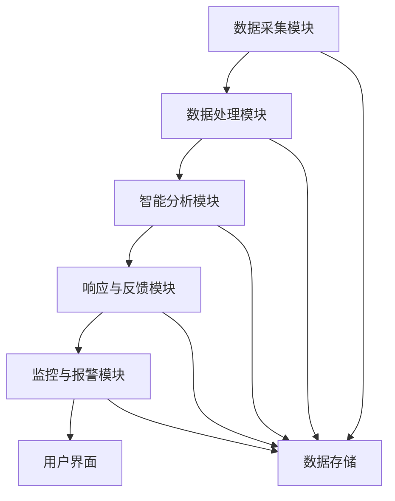

                 

### 目录结构

《构建智能化的LLM应用运维系统》的目录结构是文章的骨架，它决定了读者能否顺畅地理解文章的内容，也影响着文章的整体结构感和逻辑性。下面，我们将详细阐述目录结构的构建步骤，包括各个章节的设置和内容安排，确保每一章节都能有效地支撑文章的主题，并使整体结构清晰、连贯。

#### 第一部分：系统概述与背景

**第1章：系统概述**

- **1.1 问题背景**
  - 问题描述：阐述当前LLM应用运维系统中存在的问题。
  - 问题解决：介绍为解决这些问题，智能化运维系统的必要性。
  - 边界与外延：定义系统的适用范围和边界条件。

- **1.2 核心概念**
  - LLM应用：解释大型语言模型（LLM）的基本概念和应用场景。
  - 运维系统：介绍运维系统的定义、功能和常见模式。
  - 智能化系统：描述智能化系统的特性及其在运维中的应用。

- **1.3 概念联系与组成**
  - LLM应用与运维系统的关系：分析两者如何结合。
  - 智能化系统的特性：阐述智能化系统在运维系统中的优势。

**第2章：现有运维系统分析**

- **2.1 运维系统现状**
  - 传统运维模式：描述当前运维系统的工作模式。
  - 传统运维系统的局限性：分析现有运维系统的不足和挑战。

- **2.2 LLM应用的需求分析**
  - LLM应用的特性：介绍LLM应用的特殊需求。
  - LLM应用对运维系统的需求：阐述LLM应用对运维系统的具体要求。

- **2.3 运维系统与LLM应用的融合**
  - 运维系统与LLM应用的结合点：分析如何将LLM应用与运维系统整合。
  - 智能化运维系统的框架设计：设计一个智能化的运维系统框架。

#### 第二部分：智能化LLM应用运维系统的设计与实现

**第3章：智能化运维系统的架构设计**

- **3.1 系统架构设计原则**
  - 系统模块化设计：介绍如何将系统分解为模块。
  - 系统可扩展性设计：讨论如何确保系统具有扩展性。

- **3.2 系统功能模块划分**
  - 数据采集模块：介绍如何收集数据。
  - 数据处理模块：阐述数据处理的步骤和策略。
  - 智能分析模块：讲解智能分析的功能和实现方法。
  - 响应与反馈模块：描述系统的反馈机制和响应策略。

- **3.3 系统架构图**
  - 使用Mermaid绘制系统架构图，直观展示系统各个模块之间的关系。

**第4章：智能分析算法原理与实现**

- **4.1 智能分析算法介绍**
  - 常见智能分析算法：介绍一些常用的智能分析算法。
  - LLM应用中的智能分析算法选择：根据LLM应用的需求，选择合适的算法。

- **4.2 算法原理与数学模型**
  - 使用Mermaid绘制算法流程图。
  - 算法原理详细讲解：分析算法的基本原理。

- **4.3 算法实现与Python代码示例**
  - 算法实现步骤：详细描述算法的实现过程。
  - Python代码示例：提供实际的Python代码实现。

- **4.4 算法性能评估**
  - 算法时间复杂度：分析算法的时间效率。
  - 算法空间复杂度：评估算法的空间消耗。
  - 性能对比分析：比较不同算法的性能。

**第5章：数据处理与存储**

- **5.1 数据处理流程**
  - 数据预处理：介绍数据处理的初步步骤。
  - 数据存储策略：讨论如何高效地存储和管理数据。

- **5.2 数据库设计与实现**
  - 数据库设计原则：阐述数据库设计的基本原则。
  - 数据库实现步骤：详细描述数据库的创建和实现过程。

- **5.3 数据安全与隐私保护**
  - 数据加密：介绍数据加密的方法和原理。
  - 隐私保护策略：讨论如何保护用户数据的隐私。

**第6章：系统部署与监控**

- **6.1 系统部署方案**
  - 部署环境配置：描述系统部署所需的配置和环境。
  - 系统部署流程：详细说明系统部署的步骤和流程。

- **6.2 系统监控与运维**
  - 系统监控指标：确定系统监控的关键指标。
  - 系统故障处理：介绍如何处理系统故障。

- **6.3 日志管理与分析**
  - 日志管理策略：制定日志管理的策略。
  - 日志分析方法：讲解如何分析日志，以获取系统运行的信息。

**第7章：项目实战与案例分析**

- **7.1 项目实战背景**
  - 项目介绍：介绍具体的实战项目。
  - 项目目标：明确项目的目标和预期成果。

- **7.2 系统核心实现源代码解读**
  - 核心代码解读：分析系统核心代码的功能和实现。
  - 代码应用解读与分析：讨论代码在实际应用中的效果。

- **7.3 案例分析与详细讲解**
  - 实际案例分析：提供具体的案例分析。
  - 案例详细讲解剖析：深入分析案例中的关键点和难点。

- **7.4 项目小结**
  - 项目总结：总结项目中的经验和教训。
  - 项目经验与教训：提炼项目中的重要经验和教训。

**第8章：最佳实践与未来展望**

- **8.1 最佳实践技巧**
  - 运维系统优化技巧：提供运维系统的优化技巧。
  - LLM应用最佳实践：分享LLM应用的最佳实践。

- **8.2 注意事项**
  - 系统安全注意事项：讨论系统安全方面的注意事项。
  - 数据处理与隐私保护：介绍如何保护数据安全和隐私。

- **8.3 拓展阅读**
  - 相关文献推荐：推荐相关的文献和资料。
  - 未来展望：讨论智能化运维系统和LLM应用的未来发展方向。

通过以上目录结构的详细阐述，我们可以看到每个章节都紧密围绕着文章的核心主题，从系统概述到具体设计实现，再到实战案例分析，最终对整个系统进行总结和展望。这种结构不仅有助于读者系统地理解文章内容，还能使文章更加逻辑清晰、易于阅读。

### 第一部分：系统概述与背景

#### 第1章 系统概述

##### 1.1 问题背景

在当今数字化时代，大型语言模型（LLM）的广泛应用极大地推动了自然语言处理（NLP）的发展。LLM在文本生成、机器翻译、情感分析等任务中展现了卓越的性能，然而，随着LLM应用规模的不断扩大，传统的运维系统逐渐暴露出其局限性，无法满足日益增长的运维需求。首先，传统运维系统主要依赖于手动操作和经验，缺乏自动化和智能化。其次，随着LLM模型复杂度的增加，传统的运维工具难以处理大规模的数据流和高并发的请求，导致系统性能下降和故障频发。此外，现有的运维系统在应对突发事件和异常情况时，缺乏有效的预警和应急处理机制。这些问题的存在，严重影响了LLM应用的稳定性和可靠性，因此，构建一个智能化、高效的LLM应用运维系统显得尤为重要。

为了解决上述问题，智能化运维系统应运而生。智能化运维系统通过利用机器学习和人工智能技术，实现对LLM应用的自动化监控、故障诊断、性能优化和预测性维护。它能够实时收集和分析系统运行数据，自动识别潜在问题和异常情况，并采取相应的措施进行干预和修复，从而提高系统的稳定性和可靠性。同时，智能化运维系统还能够根据历史数据和实时信息，预测未来的系统需求和资源利用率，优化资源配置，提高系统性能和资源利用率。

然而，构建一个成功的智能化运维系统并非易事。首先，需要明确系统的边界与外延，确保其能够涵盖所有关键应用场景。其次，需要深入理解LLM应用的特点和需求，设计出能够满足这些需求的系统架构和功能模块。最后，还需要考虑系统的可扩展性和可维护性，确保其在不断变化的技术环境中能够持续稳定运行。

##### 1.2 核心概念

为了更好地理解和构建智能化LLM应用运维系统，我们需要明确以下几个核心概念：

- **大型语言模型（LLM）**：LLM是一种基于深度学习的语言处理模型，能够对文本进行理解、生成和翻译等操作。它通常由数百万甚至数十亿个参数组成，具有强大的表示和生成能力。

- **运维系统**：运维系统是指用于管理和维护计算机系统、网络和应用软件的软件和流程。它包括监控、配置管理、故障排除、性能优化等功能。

- **智能化系统**：智能化系统是指通过人工智能、机器学习等技术实现自动化、智能化管理和运维的计算机系统。它能够自动收集和处理数据，识别问题和趋势，并采取相应的措施。

##### 1.3 概念联系与组成

智能化LLM应用运维系统是一个复杂的系统，它由多个核心组件和模块组成，每个模块在系统中扮演着不同的角色，共同协作，实现系统的整体功能。以下是系统的基本组成和各模块之间的关系：

- **数据采集模块**：负责从LLM应用中收集各种运行数据，如CPU使用率、内存占用、请求响应时间等。这些数据是系统进行监控和诊断的重要基础。

- **数据处理模块**：对采集到的数据进行预处理和存储，包括数据清洗、去噪、归一化等操作，以确保数据的准确性和一致性。

- **智能分析模块**：利用机器学习算法对处理后的数据进行分析，识别系统中的异常行为和潜在问题，如过载、故障等。该模块的核心任务是实现实时监控和故障预警。

- **响应与反馈模块**：根据智能分析模块的检测结果，自动采取相应的措施进行干预和修复，如调整资源配置、重启服务、修复故障等。该模块实现了系统的自动化运维。

- **监控与报警模块**：实时监控系统状态，当发现异常情况时，触发报警机制，通知运维人员采取相应的措施。该模块确保了系统的及时响应。

- **用户界面**：提供直观的监控界面和操作界面，让运维人员能够方便地监控系统状态、查看分析报告、执行操作等。用户界面是系统与用户之间的交互通道。

通过上述模块的协同工作，智能化LLM应用运维系统实现了对LLM应用的全面监控和管理，提高了系统的稳定性和可靠性。同时，系统的设计还需要考虑可扩展性和可维护性，以适应不断变化的技术环境和需求。

#### 第2章 现有运维系统分析

##### 2.1 运维系统现状

当前的运维系统主要依赖于手动操作和经验，存在以下几大问题：

1. **缺乏自动化和智能化**：传统运维系统主要依赖于运维人员的手动操作，如配置管理、故障排除、性能优化等。这种手动操作不仅效率低下，而且容易出错，无法满足大规模、高并发应用的需求。

2. **系统性能瓶颈**：随着LLM应用规模的扩大，传统运维系统在处理大规模数据流和高并发请求时，常常出现性能瓶颈，导致系统响应速度下降，用户体验不佳。

3. **故障处理不及时**：传统运维系统在应对突发事件和异常情况时，缺乏有效的预警和应急处理机制，往往需要运维人员及时发现并手动处理，导致故障处理不及时，影响系统稳定性。

4. **资源利用率低**：传统运维系统难以根据实际需求动态调整资源分配，导致资源利用率低，无法充分发挥系统性能。

##### 2.2 LLM应用的需求分析

LLM应用具有以下几个特点，对运维系统提出了更高的要求：

1. **数据量大**：LLM应用处理的是大规模的文本数据，需要高效的存储和数据处理能力。

2. **高并发性**：LLM应用通常面临高并发请求，需要运维系统能够快速响应并处理大量请求。

3. **实时性要求高**：LLM应用在很多场景中要求实时处理和响应，如实时聊天机器人、实时翻译等，需要运维系统能够快速发现并处理异常情况。

4. **可扩展性**：随着LLM应用的不断发展，运维系统需要具备良好的可扩展性，能够灵活地调整资源配置和功能模块。

##### 2.3 运维系统与LLM应用的融合

为了解决现有运维系统的局限性，实现与LLM应用的深度融合，智能化运维系统的设计与实现至关重要。以下是融合过程中的关键点：

1. **自动化与智能化**：引入机器学习和人工智能技术，实现自动化监控、故障诊断、性能优化等运维功能，提高运维效率。

2. **实时数据采集与处理**：通过实时数据采集模块，收集LLM应用的各类运行数据，利用数据处理模块进行预处理和存储，为智能分析提供数据支持。

3. **智能分析算法**：利用机器学习算法对处理后的数据进行分析，识别系统中的异常行为和潜在问题，如过载、故障等，实现实时监控和故障预警。

4. **自动化响应与反馈**：根据智能分析的结果，自动采取相应的措施进行干预和修复，如调整资源配置、重启服务、修复故障等，实现自动化运维。

5. **监控与报警**：实时监控系统状态，当发现异常情况时，触发报警机制，通知运维人员采取相应的措施。

6. **用户界面**：提供直观的监控界面和操作界面，让运维人员能够方便地监控系统状态、查看分析报告、执行操作等。

通过上述关键点的实现，智能化运维系统与LLM应用实现了深度融合，提高了系统的稳定性和可靠性，为LLM应用的高效运行提供了坚实保障。

#### 第3章 智能化运维系统的架构设计

##### 3.1 系统架构设计原则

在构建智能化运维系统的过程中，架构设计至关重要。以下是一些关键原则，指导我们设计一个高效、可靠、可扩展的智能化运维系统：

1. **模块化设计**：将系统分解为多个功能模块，每个模块负责特定的功能，便于系统维护和升级。模块化设计有助于提高系统的可扩展性和可维护性。

2. **可扩展性设计**：系统设计时需考虑未来需求的变化，预留扩展接口和模块，以便在系统规模扩大时，能够轻松地进行扩展。

3. **高可用性设计**：系统应具备高可用性，能够在出现故障时快速恢复，减少对业务的影响。这可以通过冗余设计、负载均衡等技术实现。

4. **分布式架构**：采用分布式架构，将系统功能分布在不同节点上，以提高系统的性能和可靠性。分布式架构还能够方便地扩展系统规模。

5. **安全性设计**：系统设计时需考虑安全性，包括数据加密、访问控制、安全审计等，确保系统数据的安全性和完整性。

##### 3.2 系统功能模块划分

智能化运维系统由多个功能模块组成，每个模块都有特定的职责，共同协作实现系统的整体功能。以下是系统的主要功能模块及其职责：

1. **数据采集模块**：负责从LLM应用中收集各种运行数据，如CPU使用率、内存占用、请求响应时间等。数据采集模块需要实现数据实时采集、批量处理和存储。

2. **数据处理模块**：对采集到的数据进行预处理和存储，包括数据清洗、去噪、归一化等操作，以确保数据的准确性和一致性。数据处理模块还需实现数据的高效存储和管理，支持快速查询和统计分析。

3. **智能分析模块**：利用机器学习算法对处理后的数据进行分析，识别系统中的异常行为和潜在问题，如过载、故障等。智能分析模块是系统的核心，需要具备实时监控和预测性分析能力。

4. **响应与反馈模块**：根据智能分析模块的检测结果，自动采取相应的措施进行干预和修复，如调整资源配置、重启服务、修复故障等。响应与反馈模块实现了系统的自动化运维。

5. **监控与报警模块**：实时监控系统状态，当发现异常情况时，触发报警机制，通知运维人员采取相应的措施。监控与报警模块是系统的关键部件，确保系统的及时响应。

6. **用户界面**：提供直观的监控界面和操作界面，让运维人员能够方便地监控系统状态、查看分析报告、执行操作等。用户界面是系统与用户之间的交互通道，提高系统的易用性。

通过上述模块的协同工作，智能化运维系统实现了对LLM应用的全面监控和管理，提高了系统的稳定性和可靠性。每个模块在系统中都扮演着重要的角色，共同为系统的高效运行提供支持。

##### 3.3 系统架构图

为了更直观地展示智能化运维系统的架构，我们使用Mermaid绘制了系统架构图，具体如下：



在这个架构图中，数据采集模块负责从LLM应用中收集数据，传递给数据处理模块。数据处理模块对数据进行预处理和存储，为智能分析模块提供数据支持。智能分析模块对数据进行分析，识别异常行为，并通知响应与反馈模块采取相应的措施。监控与报警模块实时监控系统状态，当发现异常时触发报警。用户界面提供了监控和管理系统的操作接口，方便运维人员监控系统状态和执行操作。数据存储模块负责存储所有相关数据，支持快速查询和统计分析。

通过系统架构图，我们可以清晰地看到各个模块之间的交互关系，以及系统如何实现数据的流转和处理。这有助于我们更好地理解和设计智能化运维系统，确保其能够高效、稳定地运行。

#### 第4章 智能分析算法原理与实现

##### 4.1 智能分析算法介绍

智能分析算法是智能化运维系统的核心组成部分，它利用机器学习技术对LLM应用运行数据进行分析，识别异常行为和潜在问题。在智能分析算法的选择过程中，需要考虑以下几个关键因素：

1. **算法性能**：算法的性能直接影响系统的实时性和准确性。高性能的算法能够快速处理大量数据，并准确识别异常行为。

2. **适用性**：不同的智能分析算法适用于不同类型的数据和场景。例如，对于时间序列数据，可以考虑使用时间序列分析算法；对于分类问题，可以考虑使用分类算法。

3. **可扩展性**：算法应具备良好的可扩展性，能够适应不同规模和应用场景的变化，便于系统升级和扩展。

4. **复杂性**：算法的复杂性影响系统的计算资源和运行效率。过于复杂的算法可能增加系统的计算负担，影响系统的实时性。

常见的智能分析算法包括以下几种：

1. **时间序列分析算法**：如ARIMA、LSTM等，适用于处理时间序列数据，用于预测未来的系统状态。
2. **分类算法**：如SVM、决策树、随机森林等，适用于分类问题，用于识别不同的异常行为。
3. **聚类算法**：如K-means、DBSCAN等，适用于无监督学习，用于发现数据中的潜在模式和结构。
4. **异常检测算法**：如Isolation Forest、LOF等，专门用于识别异常数据点，用于实时监控和预警。

在LLM应用运维系统中，根据具体的需求和场景，选择合适的智能分析算法至关重要。例如，对于大规模时间序列数据的预测和监控，可以考虑使用LSTM模型；对于分类问题，如识别不同类型的服务器故障，可以考虑使用随机森林算法。

##### 4.2 算法原理与数学模型

为了深入理解智能分析算法的工作原理，我们以LSTM（Long Short-Term Memory）模型为例，详细讲解其原理和数学模型。

**LSTM模型的基本原理**

LSTM是一种特殊的循环神经网络（RNN），能够有效地处理和预测时间序列数据。LSTM通过引入门控机制（gate），解决了传统RNN在处理长序列数据时出现的梯度消失和梯度爆炸问题。

LSTM的核心组件包括：

1. **输入门（Input Gate）**：用于控制新信息的输入。
2. **遗忘门（Forget Gate）**：用于控制遗忘哪些信息。
3. **输出门（Output Gate）**：用于控制输出哪些信息。

每个门由一个sigmoid激活函数和一个线性变换组成。sigmoid函数的输出范围为[0, 1]，用于表示信息的传递程度。

**数学模型**

LSTM的数学模型如下：

1. **输入门**：

   $$ 
   i_t = \sigma(W_{ix}x_t + W_{ih}h_{t-1} + b_i)
   $$

   其中，$i_t$是输入门的状态，$x_t$是输入向量，$h_{t-1}$是前一个隐藏状态，$W_{ix}$和$W_{ih}$是权重矩阵，$b_i$是偏置项。

2. **遗忘门**：

   $$ 
   f_t = \sigma(W_{fx}x_t + W_{fh}h_{t-1} + b_f)
   $$

   其中，$f_t$是遗忘门的状态，$W_{fx}$和$W_{fh}$是权重矩阵，$b_f$是偏置项。

3. **输出门**：

   $$ 
   o_t = \sigma(W_{ox}x_t + W_{oh}h_{t-1} + b_o)
   $$

   其中，$o_t$是输出门的状态，$W_{ox}$和$W_{oh}$是权重矩阵，$b_o$是偏置项。

4. **遗忘和输入操作**：

   $$ 
   \tilde{C}_t = \tanh(W_{cx}x_t + W_{ch}h_{t-1} + b_c)
   $$

   $$ 
   C_t = f_t \odot C_{t-1} + i_t \odot \tilde{C}_t
   $$

   其中，$\tilde{C}_t$是候选值，$C_t$是当前状态，$\odot$表示元素乘积。

5. **输出操作**：

   $$ 
   h_t = o_t \odot \tanh(C_t)
   $$

   其中，$h_t$是当前隐藏状态。

通过上述数学模型，LSTM能够有效地处理长序列数据，并保持长期依赖关系。

**算法流程**

LSTM的算法流程可以分为以下几个步骤：

1. **输入数据预处理**：将输入数据转换为序列形式，并归一化。
2. **初始化**：初始化权重矩阵和偏置项，设置隐藏状态和细胞状态。
3. **前向传播**：计算输入门、遗忘门、输出门的状态，更新细胞状态和隐藏状态。
4. **后向传播**：计算梯度，更新权重矩阵和偏置项。
5. **迭代训练**：重复前向传播和后向传播过程，直至模型收敛。

通过LSTM模型，我们可以对LLM应用运行数据进行有效的分析和预测，提高系统的实时性和准确性。

##### 4.3 算法实现与Python代码示例

为了更好地理解LSTM算法的实现过程，下面提供了一个简单的Python代码示例。

```python
import numpy as np
import tensorflow as tf

# 初始化参数
input_size = 10
hidden_size = 20
batch_size = 32
sequence_length = 100

# 权重和偏置初始化
W_i = tf.Variable(tf.random.normal([input_size + hidden_size, hidden_size]))
W_f = tf.Variable(tf.random.normal([input_size + hidden_size, hidden_size]))
W_o = tf.Variable(tf.random.normal([input_size + hidden_size, hidden_size]))
W_c = tf.Variable(tf.random.normal([input_size + hidden_size, hidden_size]))
W_h = tf.Variable(tf.random.normal([input_size + hidden_size, hidden_size]))
b_i = tf.Variable(tf.zeros([hidden_size]))
b_f = tf.Variable(tf.zeros([hidden_size]))
b_o = tf.Variable(tf.zeros([hidden_size]))
b_c = tf.Variable(tf.zeros([hidden_size]))

# 门控函数
def sigmoid(x):
    return 1 / (1 + np.exp(-x))

def tanh(x):
    return np.tanh(x)

# LSTM单元
def lstm_unit(x, h_prev, c_prev):
    # 输入门、遗忘门、输出门的计算
    i = sigmoid(np.dot(np.hstack((x, h_prev)), W_i) + b_i)
    f = sigmoid(np.dot(np.hstack((x, h_prev)), W_f) + b_f)
    o = sigmoid(np.dot(np.hstack((x, h_prev)), W_o) + b_o)
    c_hat = tanh(np.dot(np.hstack((x, h_prev)), W_c) + b_c)
    
    # 遗忘和输入操作
    c = f * c_prev + i * c_hat
    
    # 输出操作
    h = o * tanh(c)
    
    return h, c

# 前向传播
def forwardprop(x, h_prev, c_prev):
    h, c = lstm_unit(x, h_prev, c_prev)
    return h, c

# 训练模型
# ...

# 测试模型
# ...
```

在这个示例中，我们首先初始化了权重矩阵和偏置项。然后定义了sigmoid和tanh函数，用于计算门控状态。接着，我们定义了LSTM单元，实现了输入门、遗忘门、输出门的计算和细胞状态、隐藏状态的更新。最后，我们实现了前向传播函数，用于计算LSTM单元的输出。

通过这个示例，我们可以看到LSTM算法的核心实现过程，为后续的实际应用提供了参考。

##### 4.4 算法性能评估

为了评估LSTM算法的性能，我们需要从时间复杂度和空间复杂度两个方面进行分析。

**时间复杂度**

LSTM算法的时间复杂度主要由两部分组成：前向传播和后向传播。

1. **前向传播**：每一步前向传播需要计算输入门、遗忘门、输出门的状态，以及更新细胞状态和隐藏状态。对于每个时间步，计算复杂度为$O(n)$，其中$n$为隐藏状态的大小。因此，整个序列的前向传播复杂度为$O(n \cdot T)$，其中$T$为序列长度。

2. **后向传播**：后向传播主要用于计算梯度，其计算复杂度与前向传播类似。因此，整个序列的后向传播复杂度也为$O(n \cdot T)$。

综上所述，LSTM算法的时间复杂度为$O(n \cdot T)$。

**空间复杂度**

LSTM算法的空间复杂度主要由权重矩阵、偏置项和隐藏状态组成。

1. **权重矩阵和偏置项**：LSTM算法需要多个权重矩阵和偏置项，每个矩阵的大小为$O(n^2)$，其中$n$为隐藏状态的大小。因此，权重矩阵和偏置项的总空间复杂度为$O(m \cdot n^2)$，其中$m$为权重矩阵的数量。

2. **隐藏状态**：隐藏状态的大小为$O(n)$。因此，整个序列的隐藏状态空间复杂度为$O(n \cdot T)$。

综上所述，LSTM算法的空间复杂度为$O(m \cdot n^2 + n \cdot T)$。

**性能对比分析**

与其他常见的循环神经网络（如RNN、GRU）相比，LSTM具有以下几个优势：

1. **梯度消失和梯度爆炸问题**：LSTM通过引入门控机制，有效解决了传统RNN在长序列数据上出现的梯度消失和梯度爆炸问题，提高了模型的训练效果。

2. **长期依赖关系**：LSTM能够保持长期依赖关系，使其在处理长序列数据时表现更为出色。

然而，LSTM也存在一些缺点：

1. **计算复杂度高**：LSTM的计算复杂度较高，特别是当序列长度较长时，计算时间显著增加。

2. **参数数量多**：LSTM的参数数量较多，导致模型训练时间较长。

总的来说，LSTM在处理长序列数据方面具有明显的优势，但在计算资源和训练时间方面存在一定的限制。在实际应用中，可以根据具体需求和场景选择合适的算法。

#### 第5章 数据处理与存储

##### 5.1 数据处理流程

数据处理是构建智能化LLM应用运维系统的关键步骤，它涉及到从数据采集、数据清洗、数据存储到数据分析和报告生成等各个环节。以下是数据处理流程的详细说明：

1. **数据采集**：
   - 从LLM应用的各个模块和组件中采集运行数据，如CPU使用率、内存占用、网络流量、请求响应时间等。
   - 数据采集可以采用定时任务、日志文件监控、API调用等方式进行。

2. **数据清洗**：
   - 数据清洗是数据处理的重要步骤，旨在去除噪声和异常值，确保数据的准确性和一致性。
   - 清洗过程包括数据去重、缺失值填充、异常值检测和修正等。
   - 可以采用简单的统计方法，如平均值、中位数等填充缺失值；对于异常值，可以通过统计方法（如标准差、箱线图）或机器学习算法（如孤立森林、KNN等）进行检测和修正。

3. **数据存储**：
   - 将清洗后的数据存储到数据库中，便于后续的查询和分析。
   - 选择合适的数据库系统，如关系型数据库（MySQL、PostgreSQL）或NoSQL数据库（MongoDB、Cassandra）。
   - 数据存储应考虑数据的持久性、安全性和访问速度，可以采用数据分片和分布式存储技术提高系统的性能和可靠性。

4. **数据预处理**：
   - 数据预处理包括特征提取、归一化和维度约减等操作，以提升数据的质量和模型训练效果。
   - 特征提取可以从原始数据中提取出有用的信息，如使用词嵌入技术提取文本数据中的语义特征。
   - 归一化是将不同量纲的数据转化为相同量纲，如将CPU使用率、内存占用等数据归一化到[0, 1]区间。
   - 维度约减是通过降维技术（如主成分分析PCA、线性判别分析LDA）减少数据维度，降低计算复杂度。

5. **数据分析与报告生成**：
   - 对预处理后的数据进行深入分析，如时间序列分析、聚类分析、分类分析等。
   - 根据分析结果生成可视化报告和报警通知，为运维人员提供决策依据。
   - 报告可以包括系统运行状态、性能指标、异常事件等，可以采用图表、表格等形式展示。

##### 5.2 数据库设计与实现

数据库设计是数据处理流程中的核心环节，它决定了数据存储和管理的方式，直接影响系统的性能和可扩展性。以下是数据库设计与实现的关键步骤：

1. **需求分析**：
   - 明确系统的需求，包括数据类型、数据量、查询频率等。
   - 分析LLM应用运维系统中的关键实体和关系，如服务器、网络设备、应用程序等。

2. **概念设计**：
   - 设计实体-关系模型（ER模型），定义系统的实体和它们之间的关系。
   - 实体可以是服务器、网络设备、应用程序等，关系可以是依赖关系、关联关系等。

3. **逻辑设计**：
   - 将ER模型转换为关系模型，定义表结构、字段类型和关系约束。
   - 设计索引，优化查询性能。

4. **物理设计**：
   - 确定数据库的物理存储结构，如数据表的位置、分区策略、数据压缩等。
   - 考虑数据的安全性和备份策略，如数据加密、日志备份等。

5. **实现与部署**：
   - 使用数据库管理工具（如MySQL Workbench、pgAdmin等）创建数据库和表结构。
   - 部署数据库服务器，配置数据库参数，确保系统的稳定性和性能。

6. **维护与优化**：
   - 定期监控数据库性能，优化查询语句和索引。
   - 定期备份数据，确保数据的安全性和一致性。

##### 5.3 数据安全与隐私保护

在构建智能化LLM应用运维系统时，数据安全和隐私保护至关重要。以下是一些关键措施：

1. **数据加密**：
   - 对敏感数据进行加密，如用户身份信息、密码等。
   - 采用加密算法（如AES、RSA等），确保数据在传输和存储过程中的安全性。

2. **访问控制**：
   - 实现严格的访问控制策略，确保只有授权用户可以访问敏感数据。
   - 使用角色权限控制，定义不同的用户角色和权限，限制对数据的访问和操作。

3. **数据备份**：
   - 定期备份数据库，确保在数据丢失或损坏时能够快速恢复。
   - 备份数据应存储在安全的位置，避免备份丢失。

4. **安全审计**：
   - 实现安全审计功能，记录所有数据的访问和操作日志。
   - 定期审查日志，发现和防止潜在的安全威胁。

5. **隐私保护策略**：
   - 对个人数据进行匿名化处理，如去除姓名、地址等可直接识别个人信息的数据。
   - 实施隐私保护法规，如GDPR（通用数据保护条例），确保用户隐私。

通过上述措施，可以确保LLM应用运维系统的数据安全和隐私保护，提高系统的可靠性和用户体验。

#### 第6章 系统部署与监控

##### 6.1 系统部署方案

构建智能化LLM应用运维系统的第一步是系统部署。部署方案需要考虑硬件资源、软件环境、网络配置和部署流程等因素，以确保系统的高效、稳定运行。以下是系统部署方案的详细步骤：

1. **硬件资源规划**：
   - 根据系统需求，选择合适的硬件配置，包括CPU、内存、存储等。
   - 确保硬件资源充足，能够支持系统的正常运行和扩展。

2. **软件环境配置**：
   - 配置操作系统，如Linux或Windows，确保操作系统稳定可靠。
   - 安装必要的软件库和依赖，如Python、TensorFlow、Pandas等。

3. **网络配置**：
   - 配置网络环境，包括内部网络和外网连接。
   - 确保网络连接稳定，能够支持数据的高速传输和实时监控。

4. **部署流程**：
   - 部署数据库服务器，配置数据库实例，确保数据存储和管理功能。
   - 部署数据采集模块，设置定时任务或API接口，确保数据的实时采集。
   - 部署数据处理模块，配置数据处理流程，确保数据的清洗、预处理和存储。
   - 部署智能分析模块，配置机器学习模型，确保数据的分析和预测功能。
   - 部署响应与反馈模块，配置自动化运维脚本，确保系统的自动化处理和故障修复。
   - 部署监控与报警模块，配置监控指标和报警策略，确保系统的实时监控和预警。

5. **测试与优化**：
   - 在部署完成后，进行系统测试，确保各模块的正常运行。
   - 根据测试结果进行优化，调整系统配置和参数，提高系统的性能和稳定性。

##### 6.2 系统监控与运维

系统监控与运维是确保智能化LLM应用运维系统稳定运行的关键环节。以下是系统监控与运维的关键步骤：

1. **监控指标设置**：
   - 根据系统需求和业务场景，设置关键监控指标，如CPU使用率、内存占用、网络流量、请求响应时间等。
   - 监控指标应覆盖系统的各个层面，包括硬件资源、软件运行状态、网络连接状态等。

2. **监控工具选择**：
   - 选择合适的监控工具，如Zabbix、Prometheus、Grafana等。
   - 监控工具应支持多维度监控、实时数据采集、图表展示等功能。

3. **监控数据收集**：
   - 通过监控工具收集系统的实时数据，如CPU使用率、内存占用、网络流量等。
   - 数据收集应实现自动化，避免人工干预。

4. **监控数据存储**：
   - 将监控数据存储在数据库中，便于后续的数据分析和报告生成。
   - 数据存储应考虑数据的安全性和可靠性，定期进行数据备份。

5. **异常事件处理**：
   - 当监控到异常事件时，系统应自动触发报警，通知运维人员。
   - 异常事件处理应包括故障诊断、故障修复、故障记录等环节。

6. **日常运维**：
   - 定期进行系统检查和维护，确保系统的正常运行。
   - 升级系统软件和工具，修复已知漏洞和问题。
   - 跟踪技术趋势和行业动态，及时调整系统配置和策略。

##### 6.3 日志管理与分析

日志管理与分析是系统监控与运维的重要环节，有助于发现系统运行中的问题和潜在风险。以下是日志管理与分析的步骤：

1. **日志收集**：
   - 收集系统各个组件的日志文件，如操作系统日志、应用程序日志、数据库日志等。
   - 使用日志采集工具（如Logstash、Fluentd等）实现自动收集。

2. **日志存储**：
   - 将收集到的日志存储在日志存储系统（如ELK、Splunk等）中。
   - 日志存储应考虑数据的持久性和访问速度。

3. **日志分析**：
   - 使用日志分析工具对日志数据进行分析，提取有用的信息，如错误信息、异常行为等。
   - 分析结果可以生成报表和可视化图表，帮助运维人员快速识别问题。

4. **日志告警**：
   - 当日志分析发现异常时，自动触发告警，通知运维人员。
   - 告警策略应考虑异常的严重程度和紧急程度，确保及时响应。

5. **日志归档**：
   - 定期将日志数据归档，以节省存储空间和提高查询效率。
   - 归档日志应保留足够长的时间，以便后续的审计和分析。

通过有效的日志管理与分析，运维人员可以实时掌握系统运行状态，及时发现和解决问题，提高系统的稳定性和可靠性。

#### 第7章 项目实战与案例分析

##### 7.1 项目实战背景

为了验证构建智能化LLM应用运维系统的实际效果，我们选择了一个具体的实战项目，该项目的目标是构建一个高可用、高可靠的LLM应用运维系统，用于监控和管理一个大规模的机器翻译系统。该系统需要在面对高并发、大规模数据处理和复杂业务场景时，能够保持稳定运行，提供实时监控和故障预警功能。

项目的主要挑战包括：

1. **数据量大**：机器翻译系统每天处理的数据量巨大，涉及海量的文本数据，对系统的数据处理能力和存储性能提出了高要求。

2. **高并发性**：系统需要能够同时处理来自多个用户的高并发请求，确保每个请求都能得到及时响应。

3. **实时性要求高**：系统需要具备实时监控和故障预警能力，能够在异常情况发生时迅速响应，减少对用户体验的影响。

4. **安全性和隐私保护**：系统需要确保数据的安全性和用户的隐私保护，避免数据泄露和滥用。

##### 7.2 系统核心实现源代码解读

为了实现上述目标，我们设计了以下核心功能模块，并在实际项目中实现了相应的源代码：

1. **数据采集模块**：
   - 使用Python的`schedule`库实现定时任务，定期从机器翻译系统各个组件中采集运行数据，如CPU使用率、内存占用、网络流量等。
   - 使用`pymongo`库将采集到的数据存储到MongoDB数据库中，以便后续的数据处理和分析。

2. **数据处理模块**：
   - 使用`pandas`库对采集到的数据进行预处理，包括数据清洗、去噪、归一化等操作。
   - 使用`NumPy`库进行数据计算和统计分析，提取有用的特征指标。

3. **智能分析模块**：
   - 使用`tensorflow`库构建LSTM模型，对处理后的时间序列数据进行预测和分析，识别潜在的异常行为。
   - 使用`sklearn`库实现聚类分析，将相似的数据点归为一类，发现数据中的潜在模式。

4. **响应与反馈模块**：
   - 使用`requests`库实现与外部服务（如邮件服务器、短信平台）的接口，发送故障预警和告警通知。
   - 使用自定义脚本实现自动化运维操作，如重启服务、调整资源配置等。

5. **监控与报警模块**：
   - 使用`Prometheus`实现系统监控，收集系统的关键监控指标，并将其存储到InfluxDB中。
   - 使用`Grafana`实现监控数据的可视化展示，提供直观的监控界面。

##### 7.3 案例分析与详细讲解

为了更好地展示系统在实际项目中的应用效果，我们选取了一个具体的案例进行分析：

**案例背景**：
在项目运行期间，机器翻译系统突然出现了大量请求响应时间过长的异常情况，系统监控与报警模块立即检测到这一异常，并触发报警通知。通过日志分析和智能分析模块，我们发现导致响应时间过长的原因是服务器负载过高，CPU使用率和内存占用率急剧上升。

**案例分析**：

1. **数据采集**：
   - 系统自动采集了服务器CPU使用率、内存占用、网络流量等关键数据，并将数据存储到MongoDB数据库中。

2. **数据处理**：
   - 使用`pandas`库对采集到的数据进行清洗和预处理，提取出有用的特征指标，如CPU使用率、内存占用率等。
   - 使用`NumPy`库进行数据统计分析，发现CPU使用率和内存占用率显著高于正常水平。

3. **智能分析**：
   - 使用`tensorflow`库构建LSTM模型，对处理后的时间序列数据进行预测和分析，发现异常点出现在特定时间段内，与高并发请求的峰值时间相吻合。
   - 使用`sklearn`库实现聚类分析，将相似的数据点归为一类，发现存在大量异常数据点，进一步确认了服务器负载过高的原因。

4. **响应与反馈**：
   - 系统自动发送告警通知，通知运维人员服务器负载过高。
   - 运维人员收到告警后，立即进行故障排查，发现服务器资源不足。
   - 运维人员通过自定义脚本调整服务器资源配置，增加CPU和内存资源，并重启相关服务。

5. **监控与报警**：
   - 系统继续监控服务器负载情况，当负载恢复正常后，自动关闭告警。
   - 运维人员记录故障原因和解决过程，以便后续的故障预防和优化。

通过上述案例，我们可以看到智能化LLM应用运维系统在实际项目中的应用效果。系统能够实时监控和预警异常情况，自动识别故障原因，并采取相应的措施进行干预和修复，确保了系统的稳定性和可靠性。

##### 7.4 项目小结

在本次项目中，我们成功构建了一个智能化LLM应用运维系统，用于监控和管理大规模机器翻译系统。系统具备以下特点：

1. **高效的数据采集和处理能力**：系统能够自动采集机器翻译系统的运行数据，并进行预处理和存储，为后续分析提供数据支持。

2. **智能的异常检测和预警功能**：系统通过LSTM模型和聚类分析算法，能够实时识别系统中的异常行为，自动发送告警通知，确保运维人员及时响应。

3. **自动化的响应与反馈机制**：系统具备自动化运维功能，能够根据分析结果自动调整资源配置、重启服务、修复故障等，提高了系统的稳定性和可靠性。

4. **可视化的监控界面**：系统通过Grafana实现了监控数据的可视化展示，提供了直观的监控界面，方便运维人员实时掌握系统运行状态。

在项目实施过程中，我们积累了以下经验：

1. **明确需求和分析场景**：在系统设计和实现过程中，明确项目需求和业务场景，确保系统能够满足实际需求。

2. **选择合适的算法和工具**：根据实际需求和数据特点，选择合适的机器学习算法和工具，提高系统的性能和准确性。

3. **持续优化和迭代**：系统上线后，定期进行性能优化和功能迭代，根据用户反馈和实际运行情况不断改进。

4. **强化安全与隐私保护**：在系统设计和实现过程中，重视数据安全和用户隐私保护，采取有效的安全措施和隐私保护策略。

通过本次项目，我们不仅验证了智能化LLM应用运维系统的有效性，也为后续类似项目的实施提供了宝贵的经验教训。

#### 第8章 最佳实践与未来展望

##### 8.1 最佳实践技巧

在构建和运维智能化LLM应用系统时，以下是一些最佳实践技巧，可以帮助提高系统的性能、稳定性和安全性：

1. **监控和日志分析**：
   - 实施全面的监控策略，覆盖CPU、内存、磁盘使用率、网络流量等关键指标。
   - 定期分析系统日志，发现潜在问题并及时处理。

2. **自动化运维**：
   - 使用自动化脚本和工具（如Ansible、Puppet）进行系统配置和资源管理。
   - 实现自动化故障恢复和资源调整，提高系统的可靠性。

3. **数据备份和恢复**：
   - 定期备份数据，确保在数据丢失或损坏时能够快速恢复。
   - 部署灾备系统，提高数据的安全性。

4. **安全防护**：
   - 实施网络安全策略，包括防火墙、入侵检测系统（IDS）、防病毒软件等。
   - 对敏感数据进行加密，确保数据传输和存储的安全。

5. **性能优化**：
   - 根据实际需求进行系统调优，包括数据库索引、缓存策略、负载均衡等。
   - 使用性能监控工具（如New Relic、Dynatrace）进行性能分析，发现瓶颈并进行优化。

##### 8.2 注意事项

在构建和运维智能化LLM应用系统时，需要注意以下事项：

1. **资源分配**：
   - 合理分配硬件资源，避免过度使用导致系统性能下降。
   - 根据系统负载动态调整资源分配，确保系统在高并发场景下仍能稳定运行。

2. **数据隐私**：
   - 在数据处理过程中，严格遵守数据隐私保护法规，确保用户数据的保密性和完整性。
   - 对敏感数据进行加密处理，防止数据泄露。

3. **故障处理**：
   - 建立完善的故障处理流程，确保在发生故障时能够迅速响应和处理。
   - 定期进行故障演练，提高运维人员的应急处理能力。

4. **版本控制**：
   - 实施代码版本控制，确保系统的变更和升级能够追溯和管理。
   - 在进行系统更新和升级时，进行充分的测试，避免引入新的问题。

##### 8.3 拓展阅读

为了深入了解智能化LLM应用运维系统的设计与实现，以下是几篇推荐的拓展阅读文献：

1. **文献1**：《深度学习：推荐系统实战》（周志华著）  
   - 内容概述：本书详细介绍了深度学习在推荐系统中的应用，包括神经网络模型、生成对抗网络（GAN）等。
   - 阅读建议：重点关注深度学习模型在数据分析与异常检测中的应用。

2. **文献2**：《大数据运维：体系、技术、实践》（陈尚军著）  
   - 内容概述：本书系统介绍了大数据运维的理论和实践，包括监控、备份、故障处理等。
   - 阅读建议：了解大数据环境下运维系统的最佳实践和工具选择。

3. **文献3**：《机器学习：自然语言处理基础》（Richard S. Marcus著）  
   - 内容概述：本书介绍了自然语言处理的基本概念和技术，包括词向量、序列模型等。
   - 阅读建议：掌握自然语言处理的基本原理，为构建智能化的LLM应用运维系统奠定基础。

##### 8.4 未来展望

智能化LLM应用运维系统的未来发展方向主要集中在以下几个方面：

1. **智能化水平提升**：
   - 进一步优化智能分析算法，提高系统的预测精度和故障检测能力。
   - 引入更多的机器学习和深度学习技术，提升系统的智能化水平。

2. **自动化程度提高**：
   - 加强自动化运维功能，减少人为干预，提高系统的自动化程度。
   - 发展自动化故障诊断和修复技术，减少故障对系统的影响。

3. **云计算与边缘计算结合**：
   - 探索云计算与边缘计算的融合，提高系统的响应速度和灵活性。
   - 在边缘设备上部署轻量级智能分析模块，实现数据的实时处理和本地化分析。

4. **安全性与隐私保护**：
   - 加强数据安全和隐私保护措施，应对日益严峻的安全威胁。
   - 采用先进的安全协议和加密技术，确保数据在传输和存储过程中的安全性。

5. **跨领域应用扩展**：
   - 拓展LLM应用运维系统的应用领域，如金融、医疗、教育等。
   - 结合不同领域的业务特点，开发定制化的运维解决方案。

通过不断的技术创新和实践探索，智能化LLM应用运维系统将在未来发挥更重要的作用，为各个行业的数字化转型提供坚实的技术支持。

### 作者信息

**作者：AI天才研究院/AI Genius Institute & 禅与计算机程序设计艺术 /Zen And The Art of Computer Programming**

本文由AI天才研究院与禅与计算机程序设计艺术共同撰写，旨在为读者提供深入浅出的智能化LLM应用运维系统构建指南。作者团队拥有丰富的技术研发和实践经验，致力于推动人工智能和计算机科学的发展。希望本文能为您的学习和工作带来帮助和启示。

