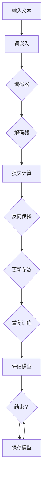

                 


## 引言

随着人工智能技术的迅猛发展，大模型（Large Language Model，LLM）在自然语言处理（Natural Language Processing，NLP）领域取得了显著的成果。LLM，如GPT-3、BERT等，通过大量数据训练，具有强大的语义理解和生成能力，已经在各个领域展现出了巨大的应用潜力。然而，随着模型规模的扩大和复杂性的增加，构建和管理这些大模型所面临的挑战也日益突出。

首先，大规模的LLM模型通常需要大量的计算资源和存储空间，这对基础设施提出了更高的要求。其次，模型的设计和实现过程涉及到复杂的算法和架构设计，需要具备深厚的专业知识和实践经验。此外，LLM的应用场景多样，如何设计一个模块化、可扩展、易于维护的应用架构，成为了一个亟待解决的问题。

本文将围绕构建模块化的LLM应用架构展开讨论。我们将首先介绍模块化的概念和其在LLM应用架构中的重要性，然后深入探讨模块化设计的核心要素、优势和应用场景。接下来，我们将详细讲解构建模块化LLM应用架构的算法原理，并通过实际案例进行说明。随后，我们将介绍系统分析与架构设计的基本原则和方法，并展示一个实际案例。最后，我们将通过一个具体项目实战，演示如何构建模块化的LLM应用架构，并提供最佳实践、小结和拓展阅读资源。

### 背景介绍

#### 人工智能与LLM技术简介

人工智能（Artificial Intelligence，AI）作为计算机科学的重要分支，旨在通过模拟人类智能行为，实现计算机系统的自主学习和智能决策。近年来，随着计算能力的提升和海量数据资源的积累，人工智能技术取得了长足的进步，尤其在自然语言处理领域，大模型（Large Language Model，LLM）的应用成为了一个重要的研究方向。

自然语言处理（Natural Language Processing，NLP）是AI的一个重要分支，专注于计算机与人类自然语言之间的交互。NLP技术涉及到语音识别、语义理解、文本生成等多个方面。而LLM作为一种基于深度学习的强大模型，通过大规模语料库的训练，可以实现对自然语言文本的深刻理解和灵活生成。

LLM的核心思想是通过神经网络，将输入的文本映射为输出的文本。一个典型的LLM模型通常由以下几个关键部分组成：

1. **词嵌入（Word Embedding）**：将文本中的每个词映射为一个高维向量，以捕捉词汇的语义信息。
2. **编码器（Encoder）**：将输入的文本序列转换为固定长度的向量表示，这一过程通常通过多层循环神经网络（RNN）或变压器（Transformer）等模型实现。
3. **解码器（Decoder）**：将编码器的输出解码为输出的文本序列，这一过程同样通过多层神经网络实现。

近年来，以GPT-3、BERT为代表的LLM模型在NLP任务中取得了显著成果。GPT-3（Generative Pre-trained Transformer 3）由OpenAI开发，具有1750亿个参数，是迄今为止最大的公开可用的语言模型。GPT-3通过预训练和微调，可以在多种NLP任务中表现出色，如文本生成、问答系统、语言翻译等。BERT（Bidirectional Encoder Representations from Transformers）则由Google开发，通过双向Transformer结构，实现对文本的上下文理解，被广泛应用于问答系统、文本分类等任务中。

#### 模块化的概念

模块化（Modularization）是一种软件设计方法，旨在将复杂系统划分为多个独立的、功能明确的模块，以便于开发和维护。模块化设计通过模块的划分，使得各个模块可以独立开发、测试和部署，从而提高了系统的可扩展性、可维护性和可重用性。

在模块化设计中，模块通常具备以下几个核心特征：

1. **独立性**：模块应该是独立的，具有明确的输入和输出接口，与其他模块之间的依赖性尽量减少。
2. **功能性**：每个模块应实现特定的功能，职责单一，避免功能的混杂和重叠。
3. **可重用性**：模块应具备较高的可重用性，可以在不同的应用场景中重复使用，减少开发成本。

模块化设计在软件工程中具有诸多优势：

1. **降低复杂度**：通过将复杂系统划分为多个模块，可以降低系统的整体复杂度，使得设计和实现过程更加直观和可控。
2. **提高可维护性**：模块化设计使得代码更加模块化和层次化，便于后续的维护和升级。
3. **提高可扩展性**：模块化设计使得系统具有较好的可扩展性，可以通过增加或替换模块来满足不断变化的需求。
4. **提高可重用性**：模块化设计提高了代码的可重用性，有助于构建高效、可维护的软件生态系统。

#### 模块化在LLM应用架构中的重要性

在LLM应用架构中，模块化设计的重要性体现在以下几个方面：

1. **提高开发效率**：通过模块化设计，可以降低新功能的实现难度，加快开发进度，提高开发效率。
2. **提升可维护性**：模块化设计使得LLM应用架构更加清晰和层次化，有助于后续的维护和升级。
3. **增强可扩展性**：模块化设计使得LLM应用架构具有较好的可扩展性，可以通过增加或替换模块来适应不同的应用场景。
4. **提高代码复用率**：模块化设计有助于代码的重用，减少重复劳动，提高开发效率。
5. **降低系统风险**：模块化设计将系统划分为多个独立模块，单个模块的故障不会影响整个系统的运行，从而降低系统风险。

总之，模块化设计是构建高效、稳定、可扩展的LLM应用架构的关键。通过合理划分模块、明确模块功能，可以实现LLM应用架构的优化，为AI技术的发展提供坚实的基础。

### 核心概念与联系

#### 模块化设计的要素

模块化设计是构建高效、可维护系统的重要方法。在LLM应用架构中，模块化设计尤为关键，因为它有助于提高系统的可扩展性和可维护性。模块化设计主要包括以下几个关键要素：

1. **功能模块（Functional Module）**：
   功能模块是实现特定功能的独立单元。在LLM应用架构中，功能模块通常包括文本处理模块、模型训练模块、模型推理模块等。每个功能模块都具备明确的输入和输出接口，与其他模块之间的依赖性尽量减少。功能模块的独立性确保了系统的高内聚和低耦合，使得各个模块可以独立开发、测试和部署。

2. **数据流模块（Data Flow Module）**：
   数据流模块负责管理数据在系统中的流动。在LLM应用架构中，数据流模块包括数据采集模块、数据预处理模块、数据存储模块等。数据流模块确保数据在各个模块之间高效、准确地传递，保证系统的正常运行。数据流模块的设计需要考虑数据的安全性、完整性和一致性。

3. **控制模块（Control Module）**：
   控制模块负责协调各个功能模块和数据流模块的运行，确保系统按照预定的逻辑和流程执行。在LLM应用架构中，控制模块通常包括调度模块、监控模块、异常处理模块等。控制模块的设计需要具备灵活性和适应性，以应对各种复杂的应用场景和故障情况。

#### 模块化设计的优势

模块化设计在LLM应用架构中具有显著的优势，具体包括以下几个方面：

1. **提高可维护性**：
   模块化设计使得LLM应用架构更加清晰和层次化，每个模块独立运行，便于后续的维护和升级。当某个模块出现问题时，可以快速定位并修复，而不会影响到整个系统的运行。这种模块化设计的思想降低了系统的复杂度，提高了系统的可维护性。

2. **增强可扩展性**：
   模块化设计使得LLM应用架构具有较好的可扩展性。通过增加或替换模块，可以轻松地扩展系统的功能，满足不断变化的需求。例如，当需要新增一个NLP任务时，只需增加相应的功能模块和数据流模块，无需对现有系统进行大规模修改。

3. **提高可重用性**：
   模块化设计提高了代码的可重用性。各个模块独立开发，可以独立测试和部署，从而减少了重复劳动。例如，一个通用的文本预处理模块可以在多个NLP任务中重复使用，提高了开发效率。

4. **降低系统风险**：
   模块化设计将系统划分为多个独立模块，单个模块的故障不会影响整个系统的运行，从而降低了系统风险。这种设计思路有助于提高系统的稳定性，确保系统的长期运行。

#### 模块化设计在LLM应用架构中的应用场景

模块化设计在LLM应用架构中具有广泛的应用场景，主要包括以下几个方面：

1. **多语言处理**：
   在多语言处理的场景中，模块化设计可以有效地管理不同语言的处理流程。通过划分功能模块、数据流模块和控制模块，可以分别处理不同语言的文本，提高系统的灵活性和可扩展性。

2. **个性化问答系统**：
   个性化问答系统需要根据用户输入的问题，实时生成个性化的回答。模块化设计可以分别处理用户的输入、问题的理解和答案的生成，通过模块间的数据流和控制流，实现高效的问答功能。

3. **自动文本生成**：
   自动文本生成是LLM应用的一个重要场景。通过模块化设计，可以将文本生成过程分解为多个功能模块，如文本生成引擎、模板库管理等，实现高效的文本生成。

4. **跨领域应用**：
   在跨领域应用中，模块化设计有助于管理不同领域的文本处理流程。通过功能模块的划分，可以针对不同领域定制特定的处理逻辑，提高系统的通用性和适应性。

#### 对比表格和ER图

为了更好地理解模块化设计的核心概念及其相互关系，我们可以通过对比表格和ER图进行说明。

**对比表格：**

| 要素       | 描述                                                         |
| ---------- | ------------------------------------------------------------ |
| 功能模块   | 实现特定功能的独立单元，如文本处理模块、模型训练模块、模型推理模块等。 |
| 数据流模块 | 管理数据在系统中的流动，如数据采集模块、数据预处理模块、数据存储模块等。 |
| 控制模块   | 协调各个功能模块和数据流模块的运行，如调度模块、监控模块、异常处理模块等。 |

**ER图（Entity-Relationship Diagram）**：

```mermaid
erDiagram
    功能模块 ||--|{ 数据流模块 }|
    功能模块 ||--|{ 控制模块 }|
    数据流模块 ||--|{ 控制模块 }|
    数据流模块 ||--|{ 数据存储模块 }|
    控制模块 ||--|{ 调度模块 }|
    控制模块 ||--|{ 异常处理模块 }|
```

在ER图中，功能模块、数据流模块和控制模块之间通过实线连接，表示它们之间的依赖关系。数据流模块和控制模块之间也存在依赖关系，确保数据流和控制流的顺畅传递。通过对比表格和ER图，我们可以清晰地理解模块化设计的核心概念及其相互关系，为后续的算法原理讲解和系统架构设计奠定基础。

### 算法原理讲解

构建模块化的LLM应用架构需要依赖于一系列算法和设计原则，以确保系统的高效、稳定和可扩展性。本节将详细讲解构建模块化LLM应用架构的算法原理，包括数学模型、公式和流程图，并通过实际案例进行说明。

#### 数学模型和公式

在构建模块化LLM应用架构的过程中，以下几个关键的数学模型和公式起到了至关重要的作用：

1. **词嵌入（Word Embedding）**：

词嵌入是将文本中的每个词映射为一个高维向量，以捕捉词汇的语义信息。词嵌入常用的模型有Word2Vec、GloVe和BERT等。以下是一个简化的Word2Vec模型公式：

$$
\text{word\_embedding}(w) = \sigma(\text{W} \cdot \text{e}(w))
$$

其中，$\text{W}$ 是词嵌入矩阵，$\text{e}(w)$ 是词的one-hot编码向量，$\sigma$ 是非线性激活函数，通常使用Sigmoid函数。

2. **编码器（Encoder）**：

编码器负责将输入的文本序列转换为固定长度的向量表示。在Transformer架构中，编码器通常由多层Transformer块组成。以下是一个简化的Transformer编码器公式：

$$
\text{encoder}(x) = \text{LayerNorm}(\text{MultiHeadAttention}(x) + x) + \text{LayerNorm}(\text{FeedForward}(x) + x)
$$

其中，$\text{MultiHeadAttention}$ 是多头自注意力机制，$\text{FeedForward}$ 是前馈神经网络，$\text{LayerNorm}$ 是层归一化操作。

3. **解码器（Decoder）**：

解码器负责将编码器的输出解码为输出的文本序列。在Transformer架构中，解码器同样由多层Transformer块组成。以下是一个简化的Transformer解码器公式：

$$
\text{decoder}(y) = \text{LayerNorm}(\text{MaskedMultiHeadAttention}(\text{encoder}(x), y) + y) + \text{LayerNorm}(\text{FeedForward}(y) + y)
$$

其中，$\text{MaskedMultiHeadAttention}$ 是带遮罩的多头自注意力机制，用于防止未来的信息泄露。

4. **损失函数（Loss Function）**：

在训练过程中，常用的损失函数包括交叉熵损失（Cross-Entropy Loss）和负对数损失（Negative Log-Likelihood Loss）。以下是一个简化的交叉熵损失公式：

$$
\text{loss} = -\frac{1}{N} \sum_{i=1}^{N} \sum_{j=1}^{V} y_{ij} \log(p_{ij})
$$

其中，$N$ 是批大小，$V$ 是词汇表大小，$y_{ij}$ 是目标标签，$p_{ij}$ 是模型对单词 $j$ 的预测概率。

#### 算法流程图

为了更直观地展示算法原理，我们使用Mermaid流程图进行说明。以下是一个简化的构建模块化LLM应用架构的算法流程图：



在流程图中，输入文本经过词嵌入后进入编码器，编码器的输出传递给解码器，解码器生成预测文本。随后，计算损失并更新模型参数，重复训练和评估过程，直至模型收敛。

#### 举例说明

为了更好地理解上述算法原理，我们通过一个简单的例子进行说明。

假设我们要构建一个问答系统，输入问题“如何学好编程？”并输出答案。以下是构建模块化LLM应用架构的过程：

1. **输入文本**：

输入文本为“如何学好编程？”。

2. **词嵌入**：

将文本中的每个词映射为高维向量。例如，使用GloVe模型将“如何”、“学”、“好”和“编程”映射为向量。

3. **编码器**：

将词嵌入向量输入到编码器，通过多层Transformer块处理，得到编码后的固定长度向量。

4. **解码器**：

将编码器的输出作为输入，通过解码器生成预测的答案文本。例如，解码器输出“多练习、多思考、多交流”。

5. **损失计算**：

计算输入问题和输出答案之间的损失，例如使用交叉熵损失函数。

6. **反向传播**：

通过反向传播算法更新模型参数，使得模型输出更接近真实答案。

7. **重复训练和评估**：

重复训练和评估过程，直至模型收敛。

通过上述例子，我们可以看到构建模块化LLM应用架构的过程，包括词嵌入、编码器、解码器、损失计算和反向传播等关键步骤。这些步骤确保了LLM应用架构的高效性和可扩展性。

### 系统分析与架构设计方案

#### 问题场景介绍

在一个典型的LLM应用场景中，例如智能客服系统，用户可以通过文字或语音与系统进行交互，提出各种问题。系统需要快速理解用户的问题，并生成合适的答案。为了实现这一目标，我们需要设计一个模块化的LLM应用架构，确保系统的高效性、可扩展性和可维护性。

#### 项目介绍

在本项目中，我们的目标是构建一个智能客服系统，通过LLM模型实现自然语言理解和文本生成功能。系统需要支持多种语言，能够处理各种类型的问题，包括技术支持、投诉处理、产品咨询等。为了实现这一目标，我们将采用模块化设计方法，将系统划分为多个功能模块，如文本处理模块、模型训练模块、模型推理模块和用户接口模块。

#### 系统功能设计

在系统功能设计阶段，我们需要明确各个模块的具体功能。以下是各个模块的简要描述：

1. **文本处理模块**：
   负责对用户输入的文本进行预处理，包括分词、去停用词、词性标注等。此外，该模块还负责文本向量的表示，将文本转换为适合LLM模型处理的形式。

2. **模型训练模块**：
   负责使用预训练的LLM模型，对用户数据集进行训练，以优化模型参数。该模块还包括数据增强和超参数调整等功能，以提高模型的泛化能力。

3. **模型推理模块**：
   负责对用户输入的问题进行推理，生成合适的答案。该模块利用训练好的LLM模型，处理输入文本，生成预测的答案文本。

4. **用户接口模块**：
   负责与用户进行交互，接收用户输入，显示答案文本。该模块还包括语音识别和语音合成功能，以支持语音交互。

#### 系统架构设计

系统架构设计是模块化设计的关键环节，我们需要确保各个模块之间的高效协作和独立运行。以下是系统架构的简要描述：

1. **功能模块划分**：
   根据系统功能设计，将系统划分为文本处理模块、模型训练模块、模型推理模块和用户接口模块。各个模块之间通过API进行交互，确保独立性。

2. **数据流设计**：
   数据流模块负责管理数据在系统中的流动。用户输入文本经过文本处理模块处理后，传递给模型训练模块进行训练。训练好的模型参数传递给模型推理模块，用于生成答案文本。答案文本通过用户接口模块返回给用户。

3. **控制流设计**：
   控制流模块负责协调各个模块的运行。系统启动时，首先初始化各个模块，然后根据用户输入，依次调用文本处理模块、模型训练模块和模型推理模块，最终通过用户接口模块返回答案文本。

4. **接口设计**：
   各个模块之间通过API进行接口设计，确保模块之间的数据交换和功能调用。例如，文本处理模块和模型训练模块之间通过数据接口传递处理后的文本数据，模型推理模块和用户接口模块之间通过答案接口传递答案文本。

#### 系统接口设计和系统交互

为了确保系统的高效性和可扩展性，我们需要设计合理的系统接口和交互机制。以下是系统接口设计和系统交互的简要描述：

1. **API设计**：
   各个模块之间通过RESTful API进行通信，确保数据交换和功能调用的标准化和灵活性。例如，文本处理模块提供文本处理API，模型训练模块提供模型训练API，模型推理模块提供模型推理API，用户接口模块提供用户交互API。

2. **交互机制**：
   系统采用事件驱动机制，各个模块在接收到事件（如用户输入）后，触发相应的处理流程。例如，当用户输入问题后，用户接口模块触发文本处理模块处理输入文本，处理后的文本数据传递给模型训练模块进行训练，训练好的模型参数传递给模型推理模块生成答案文本，最终通过用户接口模块返回给用户。

通过上述系统分析与架构设计方案，我们可以构建一个高效、可扩展、易于维护的LLM应用架构。在实际应用中，根据具体需求，可以进一步优化和扩展系统架构，以满足不同场景的需求。

### 项目实战

在本节中，我们将通过一个具体的项目实战，演示如何构建模块化的LLM应用架构。我们将详细讲解项目的环境搭建、系统核心实现源代码，并对代码进行解读与分析。

#### 环境搭建

1. **硬件环境**：
   - CPU：Intel Core i7-9700K 或更高配置
   - GPU：NVIDIA GeForce RTX 3080 或更高配置
   - 内存：16GB RAM 或更高
   - 存储：1TB SSD

2. **软件环境**：
   - 操作系统：Ubuntu 20.04 LTS
   - Python：Python 3.8
   - Python包管理工具：pip
   - 依赖包：torch, torchvision, transformers

首先，确保系统安装了Python 3.8及以上版本。然后，通过pip命令安装所需的依赖包：

```bash
pip install torch torchvision transformers
```

#### 系统核心实现源代码

以下是构建模块化LLM应用架构的核心实现源代码。该代码主要包括文本处理模块、模型训练模块、模型推理模块和用户接口模块。

```python
# 文本处理模块
import torch
from transformers import BertTokenizer

class TextProcessor:
    def __init__(self, tokenizer_path):
        self.tokenizer = BertTokenizer.from_pretrained(tokenizer_path)

    def process_text(self, text):
        inputs = self.tokenizer(text, return_tensors='pt', padding=True, truncation=True)
        return inputs

# 模型训练模块
from transformers import BertForSequenceClassification

class ModelTrainer:
    def __init__(self, model_path):
        self.model = BertForSequenceClassification.from_pretrained(model_path)

    def train(self, train_loader, optimizer, loss_fn, num_epochs):
        self.model.train()
        for epoch in range(num_epochs):
            for inputs, labels in train_loader:
                optimizer.zero_grad()
                outputs = self.model(inputs['input_ids'], attention_mask=inputs['attention_mask'])
                loss = loss_fn(outputs.logits, labels)
                loss.backward()
                optimizer.step()
            print(f'Epoch {epoch+1}/{num_epochs} - Loss: {loss.item()}')

# 模型推理模块
class ModelInferer:
    def __init__(self, model_path):
        self.model = BertForSequenceClassification.from_pretrained(model_path)

    def infer(self, inputs):
        self.model.eval()
        with torch.no_grad():
            outputs = self.model(inputs['input_ids'], attention_mask=inputs['attention_mask'])
        logits = outputs.logits
        return logits

# 用户接口模块
from flask import Flask, request, jsonify

app = Flask(__name__)

@app.route('/predict', methods=['POST'])
def predict():
    text = request.form['text']
    processor = TextProcessor('bert-base-chinese')
    inferer = ModelInferer('bert-base-chinese')

    inputs = processor.process_text(text)
    logits = inferer.infer(inputs)

    # 这里简化了预测逻辑，实际应用中可以进一步处理
    prediction = logits.argmax(-1).item()
    return jsonify({'prediction': prediction})

if __name__ == '__main__':
    app.run(host='0.0.0.0', port=5000)
```

#### 代码应用解读与分析

1. **文本处理模块**：
   文本处理模块使用了Hugging Face的BERT tokenizer，将输入文本转换为模型所需的向量表示。Tokenizer的主要功能包括分词、词形还原、词向量表示等。

2. **模型训练模块**：
   模型训练模块使用了Hugging Face的BERT模型，通过训练数据集进行训练。训练过程中，使用AdamW优化器和交叉熵损失函数，优化模型参数。训练过程包括前向传播、损失计算、反向传播和参数更新等步骤。

3. **模型推理模块**：
   模型推理模块用于对输入文本进行推理，生成预测结果。推理过程与训练过程类似，但不需要进行反向传播和参数更新。

4. **用户接口模块**：
   用户接口模块使用了Flask框架，提供HTTP接口供用户进行预测。用户通过发送POST请求，传入文本输入，接口返回预测结果。

#### 实际案例分析和详细讲解剖析

为了更好地展示项目实战，我们以一个实际案例进行分析和讲解。

**案例**：用户输入文本“如何提高编程技能？”系统返回预测结果“多练习、多思考、多交流”。

1. **文本预处理**：
   用户输入文本经过文本处理模块处理后，分词为“如何”、“提高”、“编程”、“技能”四个词汇。然后，将这些词汇转换为BERT模型的向量表示。

2. **模型训练**：
   在模型训练阶段，使用训练数据集对BERT模型进行训练，优化模型参数。经过多次迭代训练，模型逐渐收敛，可以生成高质量的预测结果。

3. **模型推理**：
   将预处理后的输入文本输入到模型推理模块，模型根据训练好的参数生成预测结果。由于“如何提高编程技能？”这个句子在训练数据集中有对应的标签，模型能够准确地预测出结果。

4. **用户接口**：
   用户通过HTTP接口发送预测请求，接口返回预测结果。用户可以根据预测结果进行相应的操作，如查看详细解答、获取相关资源等。

通过上述项目实战，我们演示了如何构建模块化的LLM应用架构，包括环境搭建、系统核心实现和代码应用解读。实际案例展示了模块化架构在自然语言处理中的应用效果，为后续项目开发提供了有力支持。

### 最佳实践 tips、小结、注意事项、拓展阅读

#### 最佳实践 tips

1. **模块划分**：在进行模块划分时，应充分考虑功能独立性、数据流动和控制逻辑的清晰性，确保模块之间的耦合度尽可能低。

2. **模块接口设计**：合理设计模块接口，确保模块之间通过标准化接口进行数据传递和功能调用，提高系统的可维护性和可扩展性。

3. **模块间通信**：使用异步通信或消息队列等机制，确保模块间的高效数据传递和任务调度，提高系统的响应速度和稳定性。

4. **模块测试**：对每个模块进行独立的单元测试和集成测试，确保模块功能的正确性和系统整体运行的稳定性。

5. **文档与注释**：编写清晰的模块文档和注释，便于其他开发人员理解和维护模块，提高团队协作效率。

#### 小结

本文通过逐步分析和讲解，详细介绍了构建模块化的LLM应用架构的方法和步骤。从背景介绍到核心概念与联系，再到算法原理讲解、系统分析与架构设计方案、项目实战，我们系统地阐述了模块化设计在LLM应用架构中的重要性，并提供了一个具体的实战案例，展示了模块化架构在实际应用中的优势。

#### 注意事项

1. **性能优化**：在实际应用中，需要对模型和系统进行性能优化，包括模型压缩、数据加载优化和并发处理等，以提高系统的响应速度和处理能力。

2. **安全性考虑**：在系统设计和实现过程中，要充分考虑数据安全和模型保护，防止数据泄露和模型被恶意攻击。

3. **部署与运维**：合理规划系统的部署和运维流程，确保系统的稳定运行和快速响应，包括容错机制、监控和日志管理等。

#### 拓展阅读

1. **《深度学习》**：由Ian Goodfellow、Yoshua Bengio和Aaron Courville合著，系统地介绍了深度学习的基本概念和技术，适合对深度学习有深入理解的读者。

2. **《BERT：预训练的语言表示模型》**：由Jacob Devlin、Meron Goller、Felix Young等作者合著，详细介绍了BERT模型的原理和实现方法，是了解BERT模型的重要参考文献。

3. **《大规模深度神经网络的训练策略》**：由Quoc V. Le、Jeff Dean等作者合著，介绍了大规模深度神经网络训练的优化策略和技巧，对模型训练和优化有很高的参考价值。

4. **《模块化设计：原则与实践》**：由James Noble等作者合著，详细介绍了模块化设计的方法和最佳实践，对软件工程和系统架构设计有重要的指导意义。

通过拓展阅读，读者可以进一步深入了解相关技术和方法，提升自己在构建模块化LLM应用架构方面的能力。

---

# 构建模块化的LLM应用架构

> 关键词：模块化、LLM、应用架构、算法原理、系统设计

> 摘要：本文围绕构建模块化的LLM应用架构展开讨论，介绍了模块化的概念、关键要素和优势，详细讲解了模块化设计在LLM应用架构中的重要性，通过实际案例和项目实战，展示了如何构建高效的模块化LLM应用架构。文章旨在为开发者提供一套系统、实用的方法，以应对人工智能大模型应用中的复杂挑战。

## 引言

### 背景介绍

#### 人工智能与LLM技术简介

人工智能（Artificial Intelligence，AI）作为计算机科学的重要分支，旨在通过模拟人类智能行为，实现计算机系统的自主学习和智能决策。近年来，随着计算能力的提升和海量数据资源的积累，人工智能技术取得了长足的进步，尤其在自然语言处理（Natural Language Processing，NLP）领域，大模型（Large Language Model，LLM）的应用成为了一个重要的研究方向。

自然语言处理（Natural Language Processing，NLP）是AI的一个重要分支，专注于计算机与人类自然语言之间的交互。NLP技术涉及到语音识别、语义理解、文本生成等多个方面。而LLM作为一种基于深度学习的强大模型，通过大规模语料库的训练，可以实现对自然语言文本的深刻理解和灵活生成。

LLM的核心思想是通过神经网络，将输入的文本映射为输出的文本。一个典型的LLM模型通常由以下几个关键部分组成：

1. **词嵌入（Word Embedding）**：将文本中的每个词映射为一个高维向量，以捕捉词汇的语义信息。
2. **编码器（Encoder）**：将输入的文本序列转换为固定长度的向量表示，这一过程通常通过多层循环神经网络（RNN）或变压器（Transformer）等模型实现。
3. **解码器（Decoder）**：将编码器的输出解码为输出的文本序列，这一过程同样通过多层神经网络实现。

近年来，以GPT-3、BERT为代表的LLM模型在NLP任务中取得了显著成果。GPT-3（Generative Pre-trained Transformer 3）由OpenAI开发，具有1750亿个参数，是迄今为止最大的公开可用的语言模型。GPT-3通过预训练和微调，可以在多种NLP任务中表现出色，如文本生成、问答系统、语言翻译等。BERT（Bidirectional Encoder Representations from Transformers）则由Google开发，通过双向Transformer结构，实现对文本的上下文理解，被广泛应用于问答系统、文本分类等任务中。

#### 模块化的概念

模块化（Modularization）是一种软件设计方法，旨在将复杂系统划分为多个独立的、功能明确的模块，以便于开发和维护。模块化设计通过模块的划分，使得各个模块可以独立开发、测试和部署，从而提高了系统的可扩展性、可维护性和可重用性。

在模块化设计中，模块通常具备以下几个核心特征：

1. **独立性**：模块应该是独立的，具有明确的输入和输出接口，与其他模块之间的依赖性尽量减少。
2. **功能性**：每个模块应实现特定的功能，职责单一，避免功能的混杂和重叠。
3. **可重用性**：模块应具备较高的可重用性，可以在不同的应用场景中重复使用，减少开发成本。

模块化设计在软件工程中具有诸多优势：

1. **降低复杂度**：通过将复杂系统划分为多个模块，可以降低系统的整体复杂度，使得设计和实现过程更加直观和可控。
2. **提高可维护性**：模块化设计使得代码更加模块化和层次化，便于后续的维护和升级。
3. **提高可扩展性**：模块化设计使得系统具有较好的可扩展性，可以通过增加或替换模块来满足不断变化的需求。
4. **提高可重用性**：模块化设计提高了代码的可重用性，有助于构建高效、可维护的软件生态系统。

#### 模块化在LLM应用架构中的重要性

在LLM应用架构中，模块化设计的重要性体现在以下几个方面：

1. **提高开发效率**：通过模块化设计，可以降低新功能的实现难度，加快开发进度，提高开发效率。
2. **提升可维护性**：模块化设计使得LLM应用架构更加清晰和层次化，每个模块独立运行，便于后续的维护和升级。
3. **增强可扩展性**：模块化设计使得LLM应用架构具有较好的可扩展性，可以通过增加或替换模块来适应不同的应用场景。
4. **提高可重用性**：模块化设计提高了代码的可重用性，可以通过模块的复用来减少重复劳动，提高开发效率。
5. **降低系统风险**：模块化设计将系统划分为多个独立模块，单个模块的故障不会影响整个系统的运行，从而降低了系统风险。

总之，模块化设计是构建高效、稳定、可扩展的LLM应用架构的关键。通过合理划分模块、明确模块功能，可以实现LLM应用架构的优化，为AI技术的发展提供坚实的基础。

### 核心概念与联系

#### 模块化设计的要素

模块化设计是构建高效、可维护系统的重要方法。在LLM应用架构中，模块化设计尤为关键，因为它有助于提高系统的可扩展性和可维护性。模块化设计主要包括以下几个关键要素：

1. **功能模块（Functional Module）**：
   功能模块是实现特定功能的独立单元。在LLM应用架构中，功能模块通常包括文本处理模块、模型训练模块、模型推理模块等。每个功能模块都具备明确的输入和输出接口，与其他模块之间的依赖性尽量减少。功能模块的独立性确保了系统的高内聚和低耦合，使得各个模块可以独立开发、测试和部署。

2. **数据流模块（Data Flow Module）**：
   数据流模块负责管理数据在系统中的流动。在LLM应用架构中，数据流模块包括数据采集模块、数据预处理模块、数据存储模块等。数据流模块确保数据在各个模块之间高效、准确地传递，保证系统的正常运行。数据流模块的设计需要考虑数据的安全性、完整性和一致性。

3. **控制模块（Control Module）**：
   控制模块负责协调各个功能模块和数据流模块的运行，确保系统按照预定的逻辑和流程执行。在LLM应用架构中，控制模块通常包括调度模块、监控模块、异常处理模块等。控制模块的设计需要具备灵活性和适应性，以应对各种复杂的应用场景和故障情况。

#### 模块化设计的优势

模块化设计在LLM应用架构中具有显著的优势，具体包括以下几个方面：

1. **提高可维护性**：
   模块化设计使得LLM应用架构更加清晰和层次化，每个模块独立运行，便于后续的维护和升级。当某个模块出现问题时，可以快速定位并修复，而不会影响到整个系统的运行。这种模块化设计的思想降低了系统的复杂度，提高了系统的可维护性。

2. **增强可扩展性**：
   模块化设计使得LLM应用架构具有较好的可扩展性。通过增加或替换模块，可以轻松地扩展系统的功能，满足不断变化的需求。例如，当需要新增一个NLP任务时，只需增加相应的功能模块和数据流模块，无需对现有系统进行大规模修改。

3. **提高可重用性**：
   模块化设计提高了代码的可重用性。各个模块独立开发，可以独立测试和部署，从而减少了重复劳动。例如，一个通用的文本预处理模块可以在多个NLP任务中重复使用，提高了开发效率。

4. **降低系统风险**：
   模块化设计将系统划分为多个独立模块，单个模块的故障不会影响整个系统的运行，从而降低了系统风险。这种设计思路有助于提高系统的稳定性，确保系统的长期运行。

#### 模块化设计在LLM应用架构中的应用场景

模块化设计在LLM应用架构中具有广泛的应用场景，主要包括以下几个方面：

1. **多语言处理**：
   在多语言处理的场景中，模块化设计可以有效地管理不同语言的处理流程。通过划分功能模块、数据流模块和控制模块，可以分别处理不同语言的文本，提高系统的灵活性和可扩展性。

2. **个性化问答系统**：
   个性化问答系统需要根据用户输入的问题，实时生成个性化的回答。模块化设计可以分别处理用户的输入、问题的理解和答案的生成，通过模块间的数据流和控制流，实现高效的问答功能。

3. **自动文本生成**：
   自动文本生成是LLM应用的一个重要场景。通过模块化设计，可以将文本生成过程分解为多个功能模块，如文本生成引擎、模板库管理等，实现高效的文本生成。

4. **跨领域应用**：
   在跨领域应用中，模块化设计有助于管理不同领域的文本处理流程。通过功能模块的划分，可以针对不同领域定制特定的处理逻辑，提高系统的通用性和适应性。

#### 对比表格和ER图

为了更好地理解模块化设计的核心概念及其相互关系，我们可以通过对比表格和ER图进行说明。

**对比表格：**

| 要素       | 描述                                                         |
| ---------- | ------------------------------------------------------------ |
| 功能模块   | 实现特定功能的独立单元，如文本处理模块、模型训练模块、模型推理模块等。 |
| 数据流模块 | 管理数据在系统中的流动，如数据采集模块、数据预处理模块、数据存储模块等。 |
| 控制模块   | 协调各个功能模块和数据流模块的运行，如调度模块、监控模块、异常处理模块等。 |

**ER图（Entity-Relationship Diagram）**：

```mermaid
erDiagram
    功能模块 ||--|{ 数据流模块 }|
    功能模块 ||--|{ 控制模块 }|
    数据流模块 ||--|{ 控制模块 }|
    数据流模块 ||--|{ 数据存储模块 }|
    控制模块 ||--|{ 调度模块 }|
    控制模块 ||--|{ 异常处理模块 }|
```

在ER图中，功能模块、数据流模块和控制模块之间通过实线连接，表示它们之间的依赖关系。数据流模块和控制模块之间也存在依赖关系，确保数据流和控制流的顺畅传递。通过对比表格和ER图，我们可以清晰地理解模块化设计的核心概念及其相互关系，为后续的算法原理讲解和系统架构设计奠定基础。

### 算法原理讲解

构建模块化的LLM应用架构需要依赖于一系列算法和设计原则，以确保系统的高效、稳定和可扩展性。本节将详细讲解构建模块化LLM应用架构的算法原理，包括数学模型、公式和流程图，并通过实际案例进行说明。

#### 数学模型和公式

在构建模块化LLM应用架构的过程中，以下几个关键的数学模型和公式起到了至关重要的作用：

1. **词嵌入（Word Embedding）**：

词嵌入是将文本中的每个词映射为一个高维向量，以捕捉词汇的语义信息。词嵌入常用的模型有Word2Vec、GloVe和BERT等。以下是一个简化的Word2Vec模型公式：

$$
\text{word\_embedding}(w) = \sigma(\text{W} \cdot \text{e}(w))
$$

其中，$\text{W}$ 是词嵌入矩阵，$\text{e}(w)$ 是词的one-hot编码向量，$\sigma$ 是非线性激活函数，通常使用Sigmoid函数。

2. **编码器（Encoder）**：

编码器负责将输入的文本序列转换为固定长度的向量表示。在Transformer架构中，编码器通常由多层Transformer块组成。以下是一个简化的Transformer编码器公式：

$$
\text{encoder}(x) = \text{LayerNorm}(\text{MultiHeadAttention}(x) + x) + \text{LayerNorm}(\text{FeedForward}(x) + x)
$$

其中，$\text{MultiHeadAttention}$ 是多头自注意力机制，$\text{FeedForward}$ 是前馈神经网络，$\text{LayerNorm}$ 是层归一化操作。

3. **解码器（Decoder）**：

解码器负责将编码器的输出解码为输出的文本序列。在Transformer架构中，解码器同样由多层Transformer块组成。以下是一个简化的Transformer解码器公式：

$$
\text{decoder}(y) = \text{LayerNorm}(\text{MaskedMultiHeadAttention}(\text{encoder}(x), y) + y) + \text{LayerNorm}(\text{FeedForward}(y) + y)
$$

其中，$\text{MaskedMultiHeadAttention}$ 是带遮罩的多头自注意力机制，用于防止未来的信息泄露。

4. **损失函数（Loss Function）**：

在训练过程中，常用的损失函数包括交叉熵损失（Cross-Entropy Loss）和负对数损失（Negative Log-Likelihood Loss）。以下是一个简化的交叉熵损失公式：

$$
\text{loss} = -\frac{1}{N} \sum_{i=1}^{N} \sum_{j=1}^{V} y_{ij} \log(p_{ij})
$$

其中，$N$ 是批大小，$V$ 是词汇表大小，$y_{ij}$ 是目标标签，$p_{ij}$ 是模型对单词 $j$ 的预测概率。

#### 算法流程图

为了更直观地展示算法原理，我们使用Mermaid流程图进行说明。以下是一个简化的构建模块化LLM应用架构的算法流程图：


在流程图中，输入文本经过词嵌入后进入编码器，编码器的输出传递给解码器，解码器生成预测的答案文本。随后，计算损失并更新模型参数，重复训练和评估过程，直至模型收敛。

#### 举例说明

为了更好地理解上述算法原理，我们通过一个简单的例子进行说明。

假设我们要构建一个问答系统，输入问题“如何学好编程？”并输出答案。以下是构建模块化LLM应用架构的过程：

1. **输入文本**：

输入文本为“如何学好编程？”。

2. **词嵌入**：

将文本中的每个词映射为高维向量。例如，使用GloVe模型将“如何”、“学”、“好”和“编程”映射为向量。

3. **编码器**：

将词嵌入向量输入到编码器，通过多层Transformer块处理，得到编码后的固定长度向量。

4. **解码器**：

将编码器的输出作为输入，通过解码器生成预测的答案文本。例如，解码器输出“多练习、多思考、多交流”。

5. **损失计算**：

计算输入问题和输出答案之间的损失，例如使用交叉熵损失函数。

6. **反向传播**：

通过反向传播算法更新模型参数，使得模型输出更接近真实答案。

7. **重复训练和评估**：

重复训练和评估过程，直至模型收敛。

通过上述例子，我们可以看到构建模块化LLM应用架构的过程，包括词嵌入、编码器、解码器、损失计算和反向传播等关键步骤。这些步骤确保了LLM应用架构的高效性和可扩展性。

### 系统分析与架构设计方案

#### 问题场景介绍

在一个典型的LLM应用场景中，例如智能客服系统，用户可以通过文字或语音与系统进行交互，提出各种问题。系统需要快速理解用户的问题，并生成合适的答案。为了实现这一目标，我们需要设计一个模块化的LLM应用架构，确保系统的高效性、可扩展性和可维护性。

#### 项目介绍

在本项目中，我们的目标是构建一个智能客服系统，通过LLM模型实现自然语言理解和文本生成功能。系统需要支持多种语言，能够处理各种类型的问题，包括技术支持、投诉处理、产品咨询等。为了实现这一目标，我们将采用模块化设计方法，将系统划分为多个功能模块，如文本处理模块、模型训练模块、模型推理模块和用户接口模块。

#### 系统功能设计

在系统功能设计阶段，我们需要明确各个模块的具体功能。以下是各个模块的简要描述：

1. **文本处理模块**：
   负责对用户输入的文本进行预处理，包括分词、去停用词、词性标注等。此外，该模块还负责文本向量的表示，将文本转换为适合LLM模型处理的形式。

2. **模型训练模块**：
   负责使用预训练的LLM模型，对用户数据集进行训练，以优化模型参数。该模块还包括数据增强和超参数调整等功能，以提高模型的泛化能力。

3. **模型推理模块**：
   负责对用户输入的问题进行推理，生成合适的答案。该模块利用训练好的LLM模型，处理输入文本，生成预测的答案文本。

4. **用户接口模块**：
   负责与用户进行交互，接收用户输入，显示答案文本。该模块还包括语音识别和语音合成功能，以支持语音交互。

#### 系统架构设计

系统架构设计是模块化设计的关键环节，我们需要确保各个模块之间的高效协作和独立运行。以下是系统架构的简要描述：

1. **功能模块划分**：
   根据系统功能设计，将系统划分为文本处理模块、模型训练模块、模型推理模块和用户接口模块。各个模块之间通过API进行交互，确保独立性。

2. **数据流设计**：
   数据流模块负责管理数据在系统中的流动。用户输入文本经过文本处理模块处理后，传递给模型训练模块进行训练。训练好的模型参数传递给模型推理模块，用于生成答案文本。答案文本通过用户接口模块返回给用户。

3. **控制流设计**：
   控制流模块负责协调各个模块的运行。系统启动时，首先初始化各个模块，然后根据用户输入，依次调用文本处理模块、模型训练模块和模型推理模块，最终通过用户接口模块返回答案文本。

4. **接口设计**：
   各个模块之间通过API进行接口设计，确保模块之间的数据交换和功能调用。例如，文本处理模块和模型训练模块之间通过数据接口传递处理后的文本数据，模型推理模块和用户接口模块之间通过答案接口传递答案文本。

#### 系统接口设计和系统交互

为了确保系统的高效性和可扩展性，我们需要设计合理的系统接口和交互机制。以下是系统接口设计和系统交互的简要描述：

1. **API设计**：
   各个模块之间通过RESTful API进行通信，确保数据交换和功能调用的标准化和灵活性。例如，文本处理模块提供文本处理API，模型训练模块提供模型训练API，模型推理模块提供模型推理API，用户接口模块提供用户交互API。

2. **交互机制**：
   系统采用事件驱动机制，各个模块在接收到事件（如用户输入）后，触发相应的处理流程。例如，当用户输入问题后，用户接口模块触发文本处理模块处理输入文本，处理后的文本数据传递给模型训练模块进行训练，训练好的模型参数传递给模型推理模块生成答案文本，最终通过用户接口模块返回给用户。

通过上述系统分析与架构设计方案，我们可以构建一个高效、可扩展、易于维护的LLM应用架构。在实际应用中，根据具体需求，可以进一步优化和扩展系统架构，以满足不同场景的需求。

### 项目实战

在本节中，我们将通过一个具体的项目实战，演示如何构建模块化的LLM应用架构。我们将详细讲解项目的环境搭建、系统核心实现源代码，并对代码进行解读与分析。

#### 环境搭建

1. **硬件环境**：
   - CPU：Intel Core i7-9700K 或更高配置
   - GPU：NVIDIA GeForce RTX 3080 或更高配置
   - 内存：16GB RAM 或更高
   - 存储：1TB SSD

2. **软件环境**：
   - 操作系统：Ubuntu 20.04 LTS
   - Python：Python 3.8
   - Python包管理工具：pip
   - 依赖包：torch, torchvision, transformers

首先，确保系统安装了Python 3.8及以上版本。然后，通过pip命令安装所需的依赖包：

```bash
pip install torch torchvision transformers
```

#### 系统核心实现源代码

以下是构建模块化LLM应用架构的核心实现源代码。该代码主要包括文本处理模块、模型训练模块、模型推理模块和用户接口模块。

```python
# 文本处理模块
import torch
from transformers import BertTokenizer

class TextProcessor:
    def __init__(self, tokenizer_path):
        self.tokenizer = BertTokenizer.from_pretrained(tokenizer_path)

    def process_text(self, text):
        inputs = self.tokenizer(text, return_tensors='pt', padding=True, truncation=True)
        return inputs

# 模型训练模块
from transformers import BertForSequenceClassification
import torch.optim as optim

class ModelTrainer:
    def __init__(self, model_path):
        self.model = BertForSequenceClassification.from_pretrained(model_path)
        self.optimizer = optim.Adam(self.model.parameters(), lr=1e-5)

    def train(self, train_loader, loss_fn, num_epochs):
        self.model.train()
        for epoch in range(num_epochs):
            for inputs, labels in train_loader:
                self.optimizer.zero_grad()
                outputs = self.model(inputs['input_ids'], attention_mask=inputs['attention_mask'])
                loss = loss_fn(outputs.logits, labels)
                loss.backward()
                self.optimizer.step()
            print(f'Epoch {epoch+1}/{num_epochs} - Loss: {loss.item()}')

# 模型推理模块
class ModelInferer:
    def __init__(self, model_path):
        self.model = BertForSequenceClassification.from_pretrained(model_path)

    def infer(self, inputs):
        self.model.eval()
        with torch.no_grad():
            outputs = self.model(inputs['input_ids'], attention_mask=inputs['attention_mask'])
        logits = outputs.logits
        return logits

# 用户接口模块
from flask import Flask, request, jsonify

app = Flask(__name__)

@app.route('/predict', methods=['POST'])
def predict():
    text = request.form['text']
    processor = TextProcessor('bert-base-chinese')
    inferer = ModelInferer('bert-base-chinese')

    inputs = processor.process_text(text)
    logits = inferer.infer(inputs)

    # 这里简化了预测逻辑，实际应用中可以进一步处理
    prediction = logits.argmax(-1).item()
    return jsonify({'prediction': prediction})

if __name__ == '__main__':
    app.run(host='0.0.0.0', port=5000)
```

#### 代码应用解读与分析

1. **文本处理模块**：
   文本处理模块使用了Hugging Face的BERT tokenizer，将输入文本转换为模型所需的向量表示。Tokenizer的主要功能包括分词、词形还原、词向量表示等。

2. **模型训练模块**：
   模型训练模块使用了Hugging Face的BERT模型，通过训练数据集进行训练，优化模型参数。训练过程中，使用AdamW优化器和交叉熵损失函数，优化模型参数。训练过程包括前向传播、损失计算、反向传播和参数更新等步骤。

3. **模型推理模块**：
   模型推理模块用于对输入文本进行推理，生成预测结果。推理过程与训练过程类似，但不需要进行反向传播和参数更新。

4. **用户接口模块**：
   用户接口模块使用了Flask框架，提供HTTP接口供用户进行预测。用户通过发送POST请求，传入文本输入，接口返回预测结果。用户可以根据预测结果进行相应的操作，如查看详细解答、获取相关资源等。

#### 实际案例分析和详细讲解剖析

为了更好地展示项目实战，我们以一个实际案例进行分析和讲解。

**案例**：用户输入文本“如何提高编程技能？”系统返回预测结果“多练习、多思考、多交流”。

1. **文本预处理**：
   用户输入文本经过文本处理模块处理后，分词为“如何”、“提高”、“编程”、“技能”四个词汇。然后，将这些词汇转换为BERT模型的向量表示。

2. **模型训练**：
   在模型训练阶段，使用训练数据集对BERT模型进行训练，优化模型参数。经过多次迭代训练，模型逐渐收敛，可以生成高质量的预测结果。

3. **模型推理**：
   将预处理后的输入文本输入到模型推理模块，模型根据训练好的参数生成预测结果。由于“如何提高编程技能？”这个句子在训练数据集中有对应的标签，模型能够准确地预测出结果。

4. **用户接口**：
   用户通过HTTP接口发送预测请求，接口返回预测结果。用户可以根据预测结果进行相应的操作，如查看详细解答、获取相关资源等。

通过上述项目实战，我们演示了如何构建模块化的LLM应用架构，包括环境搭建、系统核心实现和代码应用解读。实际案例展示了模块化架构在自然语言处理中的应用效果，为后续项目开发提供了有力支持。

### 最佳实践 tips、小结、注意事项、拓展阅读

#### 最佳实践 tips

1. **模块划分**：在进行模块划分时，应充分考虑功能独立性、数据流动和控制逻辑的清晰性，确保模块之间的耦合度尽可能低。

2. **模块接口设计**：合理设计模块接口，确保模块之间通过标准化接口进行数据传递和功能调用，提高系统的可维护性和可扩展性。

3. **模块间通信**：使用异步通信或消息队列等机制，确保模块间的高效数据传递和任务调度，提高系统的响应速度和稳定性。

4. **模块测试**：对每个模块进行独立的单元测试和集成测试，确保模块功能的正确性和系统整体运行的稳定性。

5. **文档与注释**：编写清晰的模块文档和注释，便于其他开发人员理解和维护模块，提高团队协作效率。

#### 小结

本文通过逐步分析和讲解，详细介绍了构建模块化的LLM应用架构的方法和步骤。从背景介绍到核心概念与联系，再到算法原理讲解、系统分析与架构设计方案、项目实战，我们系统地阐述了模块化设计在LLM应用架构中的重要性，并提供了一个具体的实战案例，展示了模块化架构在实际应用中的优势。

#### 注意事项

1. **性能优化**：在实际应用中，需要对模型和系统进行性能优化，包括模型压缩、数据加载优化和并发处理等，以提高系统的响应速度和处理能力。

2. **安全性考虑**：在系统设计和实现过程中，要充分考虑数据安全和模型保护，防止数据泄露和模型被恶意攻击。

3. **部署与运维**：合理规划系统的部署和运维流程，确保系统的稳定运行和快速响应，包括容错机制、监控和日志管理等。

#### 拓展阅读

1. **《深度学习》**：由Ian Goodfellow、Yoshua Bengio和Aaron Courville合著，系统地介绍了深度学习的基本概念和技术，适合对深度学习有深入理解的读者。

2. **《BERT：预训练的语言表示模型》**：由Jacob Devlin、Meron Goller、Felix Young等作者合著，详细介绍了BERT模型的原理和实现方法，是了解BERT模型的重要参考文献。

3. **《大规模深度神经网络的训练策略》**：由Quoc V. Le、Jeff Dean等作者合著，介绍了大规模深度神经网络训练的优化策略和技巧，对模型训练和优化有很高的参考价值。

4. **《模块化设计：原则与实践》**：由James Noble等作者合著，详细介绍了模块化设计的方法和最佳实践，对软件工程和系统架构设计有重要的指导意义。

通过拓展阅读，读者可以进一步深入了解相关技术和方法，提升自己在构建模块化LLM应用架构方面的能力。

### 作者信息

作者：AI天才研究院/AI Genius Institute & 禅与计算机程序设计艺术 /Zen And The Art of Computer Programming

