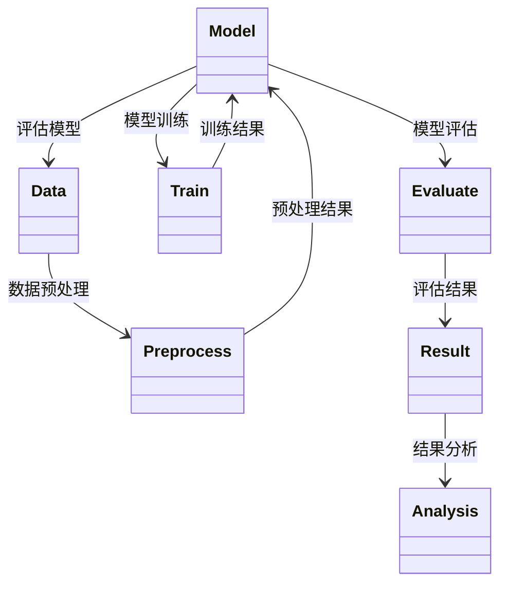
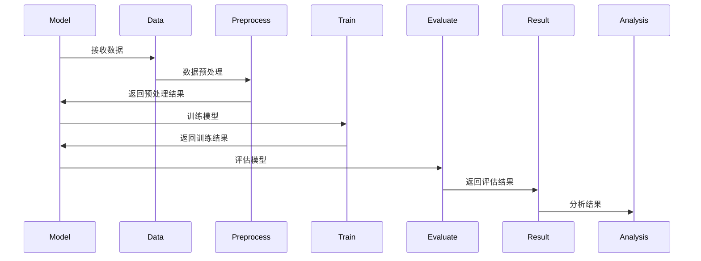
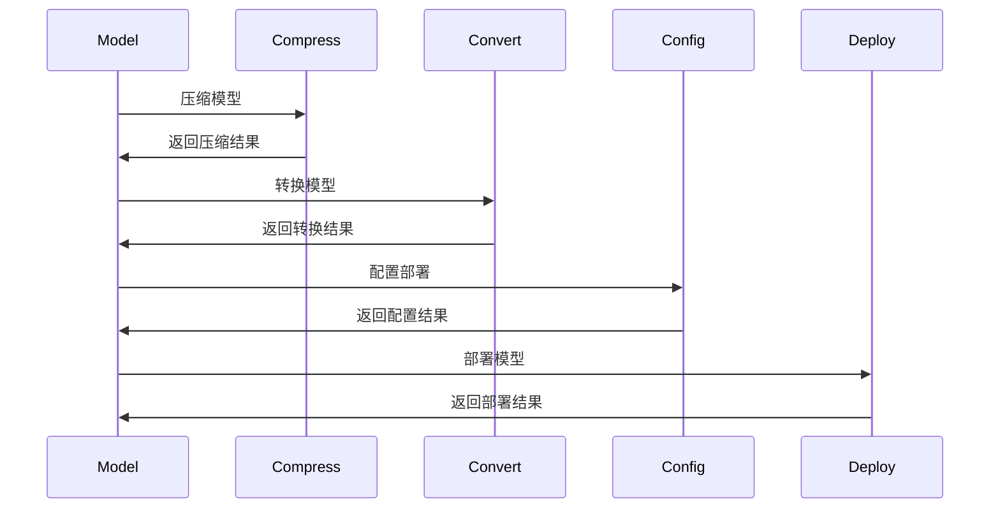
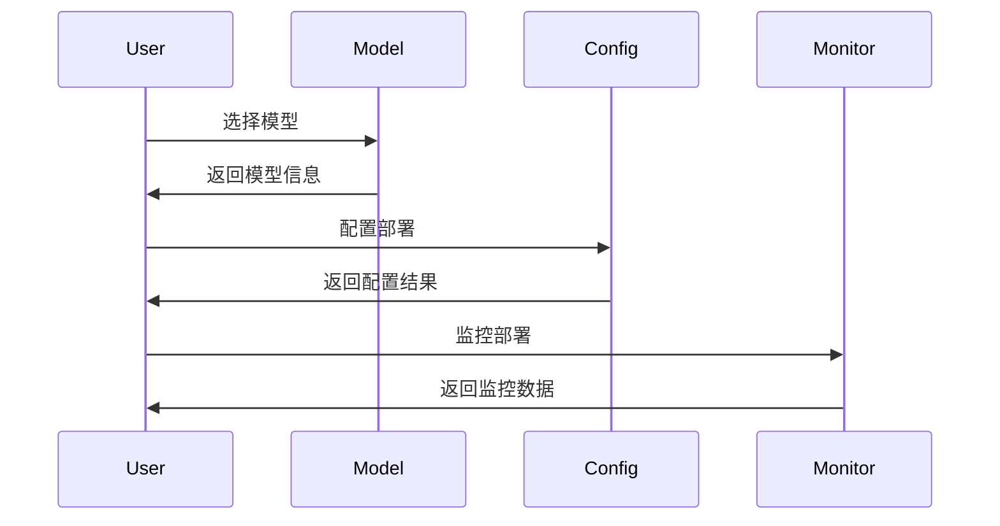

                 

# 《构建模型评测的云端部署方案》

关键词：模型评测、云端部署、机器学习、算法原理、数学模型、系统架构、实战案例

摘要：
本文将探讨构建模型评测的云端部署方案。随着机器学习技术的不断发展，模型评测和云端部署成为机器学习应用中至关重要的一环。本文将详细介绍模型评测的重要性、云端部署的概念及其发展、模型评测与云端部署的联系，以及相关算法原理、数学模型、系统架构设计方案和项目实战等内容。通过本文的阅读，读者将全面了解构建模型评测云端部署方案的理论与实践。

## 引言

### 1.1 机器学习模型评测的重要性

机器学习模型评测是确保模型性能和可靠性的关键步骤。一个优秀的模型不仅需要具备良好的性能指标，还需要在不同条件下表现出稳定性和鲁棒性。模型评测主要包括以下几个方面：

1. **准确性**：评估模型预测的正确性。
2. **精确性**：评估模型预测的精确度。
3. **召回率**：评估模型对正类样本的识别能力。
4. **F1 分数**：综合考虑准确性和召回率，评估模型的综合性能。
5. **ROC 曲线和 AUC 值**：评估模型的分类能力。

有效的模型评测可以帮助开发者了解模型的性能，发现模型的不足之处，进而优化模型。此外，模型评测还能为模型选择提供依据，帮助开发者选择最合适的模型进行部署。

### 1.2 云端部署的概念与发展

云端部署是将应用程序和数据存储在远程服务器上，用户可以通过网络访问这些资源。随着云计算技术的发展，云端部署逐渐成为企业应用的首选方案。云端部署的优势主要体现在以下几个方面：

1. **灵活性**：用户可以根据需求灵活调整资源分配。
2. **可扩展性**：云端部署可以根据用户需求进行水平或垂直扩展。
3. **成本效益**：用户只需支付使用资源的费用，无需担心硬件和维护成本。
4. **安全性**：云服务提供商通常会提供一系列安全措施，保障用户数据的安全。

### 1.3 为什么需要云端部署模型评测

云端部署模型评测具有以下几个优点：

1. **资源利用**：云端部署可以充分利用云计算资源，提高评测效率。
2. **灵活性**：用户可以根据需求快速调整评测环境，适应不同场景。
3. **便捷性**：用户可以通过网络远程访问评测结果，无需关心具体实现细节。
4. **可扩展性**：云端部署可以轻松应对大规模模型评测需求。

总之，云端部署为模型评测提供了强大的支持，有助于提升模型评测的效率和质量。在接下来的章节中，我们将进一步探讨模型评测与云端部署的内在联系，以及相关算法原理、数学模型和系统架构设计方案等内容。

## 核心概念与联系

### 2.1 模型评测的核心指标

模型评测的核心指标主要包括准确性、精确性、召回率、F1 分数、ROC 曲线和 AUC 值等。这些指标从不同角度评估模型的性能，帮助开发者了解模型的优缺点。

#### 2.1.1 准确性

准确性是评估模型预测正确性的指标，计算公式如下：

$$
准确性 = \frac{TP + TN}{TP + TN + FP + FN}
$$

其中，$TP$ 表示实际为正类且模型预测为正类的样本数量，$TN$ 表示实际为负类且模型预测为负类的样本数量，$FP$ 表示实际为负类但模型预测为正类的样本数量，$FN$ 表示实际为正类但模型预测为负类的样本数量。

#### 2.1.2 精确性

精确性是评估模型预测精确度的指标，计算公式如下：

$$
精确性 = \frac{TP}{TP + FP}
$$

#### 2.1.3 召回率

召回率是评估模型识别正类样本能力的指标，计算公式如下：

$$
召回率 = \frac{TP}{TP + FN}
$$

#### 2.1.4 F1 分数

F1 分数是综合考虑准确性和召回率的指标，计算公式如下：

$$
F1 分数 = 2 \times \frac{精确性 \times 召回率}{精确性 + 召回率}
$$

#### 2.1.5 ROC 曲线和 AUC 值

ROC 曲线和 AUC 值是评估模型分类能力的指标。ROC 曲线是混淆矩阵中真正率（True Positive Rate，TPR）与假正率（False Positive Rate，FPR）之间的关系图，而 AUC 值是 ROC 曲线下方面积，计算公式如下：

$$
AUC 值 = \int_{0}^{1} (1 - FPR) \times TPR \, dFPR
$$

### 2.2 云端架构的关键组件

云端架构的关键组件主要包括计算资源、存储资源、网络资源和安全机制等。这些组件共同构成了云端部署的基础设施，为模型评测提供支持。

#### 2.2.1 计算资源

计算资源是云端架构的核心，包括 CPU、GPU、TPU 等硬件设备。计算资源决定了模型评测的速度和性能。

#### 2.2.2 存储资源

存储资源用于存储模型数据、评测结果等数据。存储资源可以分为本地存储和分布式存储，本地存储具有更高的读写速度，而分布式存储具有更高的可靠性和可扩展性。

#### 2.2.3 网络资源

网络资源负责连接云端架构中的各个组件，包括内部网络和外部网络。内部网络主要用于各组件之间的数据传输，外部网络则用于用户访问云端资源。

#### 2.2.4 安全机制

安全机制是保障云端资源安全的重要措施，包括身份验证、访问控制、数据加密等。这些安全机制可以防止未经授权的访问和数据泄露。

### 2.3 模型评测与云端部署的联系

模型评测与云端部署之间存在紧密的联系。云端部署为模型评测提供了强大的基础设施支持，而模型评测则为云端部署提供了性能和可靠性的保障。以下为模型评测与云端部署的联系：

#### 2.3.1 资源利用

云端部署可以充分利用云计算资源，提高模型评测的效率。例如，在资源紧张时，可以动态调整计算资源，确保模型评测的顺利进行。

#### 2.3.2 灵活性

云端部署具有高灵活性，可以快速适应不同场景的需求。例如，在模型评测过程中，可以根据需求调整评测指标、算法等。

#### 2.3.3 可扩展性

云端部署可以轻松应对大规模模型评测需求。例如，在数据量巨大时，可以横向扩展计算资源，提高模型评测的效率。

#### 2.3.4 安全性

云端部署提供了一系列安全机制，保障模型评测数据的安全。例如，数据加密、访问控制等。

通过云端部署，模型评测可以更好地应对复杂场景，提高效率和可靠性。在接下来的章节中，我们将进一步探讨模型评测算法原理、数学模型和系统架构设计方案等内容。

## 算法原理讲解

### 3.1 模型评测算法原理

模型评测算法的核心目标是评估模型在给定数据集上的性能。以下为模型评测算法的原理和流程：

#### 3.1.1 评测指标的计算

模型评测算法首先需要计算各种评测指标，如准确性、精确性、召回率、F1 分数、ROC 曲线和 AUC 值等。这些指标可以从不同角度评估模型的性能，帮助开发者了解模型的优缺点。

#### 3.1.2 评测流程的设计

模型评测流程主要包括以下几个步骤：

1. **数据预处理**：对训练数据、测试数据进行预处理，包括数据清洗、归一化、特征提取等。
2. **模型训练**：使用训练数据训练模型，优化模型参数。
3. **模型评估**：使用测试数据评估模型性能，计算各种评测指标。
4. **结果分析**：分析评测结果，发现模型性能的优缺点，为模型优化提供依据。

#### 3.1.3 评测算法的改进

为了提高模型评测的效率，可以采用以下改进措施：

1. **并行计算**：利用多核 CPU、GPU 等硬件资源，实现并行计算，提高评测速度。
2. **分布式计算**：将评测任务分布在多台服务器上，实现分布式计算，提高评测效率。
3. **模型压缩**：使用模型压缩技术，减少模型参数，降低评测计算量。

### 3.2 云端部署算法原理

云端部署算法的核心目标是确保模型在云端环境中高效、稳定地运行。以下为云端部署算法的原理和流程：

#### 3.2.1 部署策略的选择

部署策略主要包括以下几种：

1. **全量部署**：将整个模型部署到云端，适用于模型规模较小、计算资源充足的情况。
2. **增量部署**：仅部署模型的关键部分，适用于模型规模较大、计算资源有限的情况。
3. **动态部署**：根据实际需求，动态调整模型部署策略，适用于模型规模和需求不断变化的情况。

#### 3.2.2 部署流程的设计

云端部署流程主要包括以下几个步骤：

1. **模型压缩**：使用模型压缩技术，减少模型参数，降低部署成本。
2. **模型转换**：将模型转换为云端环境支持的格式，如 TensorFlow、PyTorch 等。
3. **部署配置**：配置模型部署环境，包括计算资源、存储资源等。
4. **模型部署**：将模型部署到云端，包括上传模型文件、配置部署参数等。
5. **模型监控**：实时监控模型性能，包括评测指标、资源利用率等。

#### 3.2.3 部署算法的优化

为了提高云端部署的效率，可以采用以下优化措施：

1. **模型优化**：优化模型结构，减少模型参数，提高模型运行速度。
2. **资源调度**：根据实际需求，动态调整计算资源，提高资源利用率。
3. **负载均衡**：均衡分配任务到不同节点，提高系统稳定性。

通过云端部署算法的优化，可以确保模型在云端环境中高效、稳定地运行。在接下来的章节中，我们将进一步探讨数学模型和系统架构设计方案等内容。

### 3.3 模型评测与云端部署的交互与协同

模型评测和云端部署之间存在紧密的交互与协同关系。以下为模型评测与云端部署的交互与协同原理：

#### 3.3.1 数据交互

模型评测过程中产生的数据（如测试数据、评测结果等）需要上传到云端存储，以便后续分析和处理。云端部署过程中生成的数据（如模型文件、配置文件等）也需要上传到云端存储，以便后续部署和监控。

#### 3.3.2 任务协同

模型评测和云端部署需要协同完成一系列任务。例如，在模型训练完成后，需要对模型进行评测，并将评测结果上传到云端存储。在模型部署完成后，需要对模型进行监控，以确保模型在云端环境中高效、稳定地运行。

#### 3.3.3 资源调度

在模型评测和云端部署过程中，需要根据实际需求动态调整计算资源和存储资源。例如，在模型评测过程中，可以根据数据量和模型规模动态调整计算资源，以提高评测效率。在模型部署过程中，可以根据实际需求动态调整存储资源，以确保模型文件和配置文件的安全存储。

通过模型评测与云端部署的交互与协同，可以实现高效、稳定的模型评测和云端部署。在接下来的章节中，我们将进一步探讨数学模型和系统架构设计方案等内容。

## 数学模型和数学公式

### 4.1 模型评测的数学模型

在模型评测中，我们需要使用一系列数学模型来评估模型在不同数据集上的性能。以下为模型评测的主要数学模型和公式：

#### 4.1.1 准确性

准确性的计算公式为：

$$
准确性 = \frac{TP + TN}{TP + TN + FP + FN}
$$

其中，$TP$ 表示真正样本数，$TN$ 表示真负样本数，$FP$ 表示假正样本数，$FN$ 表示假负样本数。

#### 4.1.2 精确性

精确性的计算公式为：

$$
精确性 = \frac{TP}{TP + FP}
$$

#### 4.1.3 召回率

召回率的计算公式为：

$$
召回率 = \frac{TP}{TP + FN}
$$

#### 4.1.4 F1 分数

F1 分数的计算公式为：

$$
F1 分数 = 2 \times \frac{精确性 \times 召回率}{精确性 + 召回率}
$$

#### 4.1.5 ROC 曲线和 AUC 值

ROC 曲线的计算公式为：

$$
ROC 值 = \frac{TP + TN}{TP + TN + FP + FN}
$$

AUC 值的计算公式为：

$$
AUC 值 = \int_{0}^{1} (1 - FPR) \times TPR \, dFPR
$$

其中，$TPR$ 表示真正率，$FPR$ 表示假正率。

### 4.2 云端部署的数学模型

在云端部署中，我们需要使用一系列数学模型来优化模型性能和资源利用。以下为云端部署的主要数学模型和公式：

#### 4.2.1 部署成本

部署成本的计算公式为：

$$
部署成本 = 资源利用率 \times 资源价格
$$

其中，资源利用率为模型在实际运行过程中使用的资源比例，资源价格为云服务提供商提供的资源价格。

#### 4.2.2 部署效率

部署效率的计算公式为：

$$
部署效率 = 模型运行时间 \times 模型吞吐量
$$

其中，模型运行时间为模型在实际运行过程中消耗的时间，模型吞吐量为模型每秒处理的请求数量。

#### 4.2.3 负载均衡

负载均衡的计算公式为：

$$
负载均衡 = \frac{总请求量}{节点数}
$$

其中，总请求量为模型在一段时间内接收的请求数量，节点数为参与负载均衡的节点数量。

通过使用这些数学模型，我们可以更准确地评估模型评测和云端部署的性能和成本，为优化模型评测和云端部署提供依据。

## 系统分析与架构设计方案

### 5.1 模型评测系统的架构设计

模型评测系统的架构设计需要综合考虑模型评测的核心需求，包括数据预处理、模型训练、模型评估和结果分析等。以下为模型评测系统的架构设计方案：

#### 5.1.1 领域模型设计

领域模型设计是架构设计的第一步，用于明确系统中的核心概念和关系。以下为模型评测系统的领域模型设计：



#### 5.1.2 架构设计

模型评测系统的架构设计需要将领域模型中的核心组件映射到具体的架构组件中。以下为模型评测系统的架构设计：



### 5.2 云端部署系统的架构设计

云端部署系统的架构设计需要考虑模型部署、监控和优化等方面的需求。以下为云端部署系统的架构设计方案：

#### 5.2.1 部署系统设计

云端部署系统的设计需要包括模型压缩、模型转换、部署配置和模型部署等步骤。以下为云端部署系统的部署系统设计：



#### 5.2.2 交互设计

云端部署系统的交互设计需要考虑用户与系统之间的交互，包括模型选择、部署配置和监控等。以下为云端部署系统的交互设计：



通过以上系统架构设计方案，我们可以实现高效、稳定的模型评测和云端部署系统。在接下来的章节中，我们将进一步探讨项目实战、最佳实践 tips 和小结等内容。

## 项目实战

### 6.1 模型评测环境的搭建

为了搭建模型评测环境，我们需要完成以下步骤：

#### 步骤1：安装 Python 和相关依赖库

在本地计算机上安装 Python 和相关依赖库，如 NumPy、Pandas、Scikit-learn 等。可以使用以下命令进行安装：

```bash
pip install numpy pandas scikit-learn
```

#### 步骤2：准备数据集

从公开数据集网站（如 Kaggle、UCI Machine Learning Repository）下载数据集，并将其解压到本地计算机上。

#### 步骤3：数据预处理

使用 Pandas 和 NumPy 对数据集进行预处理，包括数据清洗、归一化、特征提取等。以下是一个示例代码：

```python
import pandas as pd
import numpy as np

# 读取数据集
data = pd.read_csv('data.csv')

# 数据清洗
data = data.dropna()

# 归一化
scaler = preprocessing.StandardScaler()
data[['feature1', 'feature2', 'feature3']] = scaler.fit_transform(data[['feature1', 'feature2', 'feature3']])

# 特征提取
from sklearn.feature_selection import SelectKBest
from sklearn.feature_selection import f_classif

X = data[['feature1', 'feature2', 'feature3']]
y = data['label']

# 选取最佳特征
selector = SelectKBest(f_classif, k=2)
X = selector.fit_transform(X, y)
```

#### 步骤4：划分训练集和测试集

使用 Scikit-learn 的 train_test_split 函数将数据集划分为训练集和测试集。以下是一个示例代码：

```python
from sklearn.model_selection import train_test_split

X_train, X_test, y_train, y_test = train_test_split(X, y, test_size=0.2, random_state=42)
```

### 6.2 云端部署方案的实现

为了实现云端部署方案，我们需要完成以下步骤：

#### 步骤1：配置云环境

在云服务提供商（如 AWS、Azure、Google Cloud）上创建云环境，包括虚拟机、存储桶、网络等。以下是一个 AWS 的配置示例：

```python
import boto3

# 创建 EC2 实例
ec2 = boto3.client('ec2')
response = ec2.run_instances(
    ImageId='ami-0c55b159cbfafe1f0',
    MinCount=1,
    MaxCount=1,
    InstanceType='t2.micro'
)

instance_id = response['Instances'][0]['InstanceId']
print(f'Created EC2 instance with ID: {instance_id}')

# 创建 S3 存储桶
s3 = boto3.client('s3')
bucket_name = 'my-model-bucket'
s3.create_bucket(Bucket=bucket_name)
print(f'Created S3 bucket with name: {bucket_name}')

# 创建 IAM 角色
iam = boto3.client('iam')
role_name = 'my-model-role'
role_policy = {
    'Version': '2012-10-17',
    'Statement': [
        {
            'Effect': 'Allow',
            'Action': ['s3:GetObject', 's3:PutObject'],
            'Resource': [f'arn:aws:s3:::{bucket_name}/*']
        }
    ]
}
iam.create_role(RoleName=role_name, RolePolicy=role_policy)
print(f'Created IAM role with name: {role_name}')

# 绑定 IAM 角色到 EC2 实例
iam.attach_role_policy(
    RoleName=role_name,
    PolicyArn=f'arn:aws:iam:::policy/{role_policy["Statement"][0]["Resource"]}'
)
print(f'Attached IAM role to EC2 instance')
```

#### 步骤2：上传模型文件

将训练好的模型文件上传到 S3 存储桶，以便在云端环境中使用。以下是一个示例代码：

```python
import os

model_path = 'path/to/my_model.h5'
bucket_name = 'my-model-bucket'
s3 = boto3.client('s3')

s3.upload_file(model_path, bucket_name, os.path.basename(model_path))
print(f'Uploaded model file to S3 bucket: {bucket_name}')
```

#### 步骤3：部署模型

在云端环境中部署模型，并设置模型调用的 API Gateway。以下是一个 AWS 的部署示例：

```python
import json

# 部署模型到 EC2 实例
ec2 = boto3.client('ec2')
response = ec2.describe_instances(InstanceIds=[instance_id])
instance_ip = response['Reservations'][0]['Instances'][0]['PublicIpAddress']
print(f'EC2 instance IP address: {instance_ip}')

# 远程连接到 EC2 实例
import paramiko

ssh = paramiko.SSHClient()
ssh.set_missing_host_key_policy(paramiko.AutoAddPolicy())
ssh.connect(instance_ip, username='ec2-user', key_filename='path/to/my_key.pem')

# 安装依赖库
stdin, stdout, stderr = ssh.exec_command('pip install numpy pandas scikit-learn tensorflow')
print(stdout.read())

# 载入模型
model_path = 's3://my-model-bucket/my_model.h5'
os.system(f'wget {model_path} -O my_model.h5')

# 载入 TensorFlow 模型
import tensorflow as tf

model = tf.keras.models.load_model('my_model.h5')

# 设置 API Gateway
import boto3

api_gateway = boto3.client('apigateway')
api_name = 'my-model-api'
api_response = api_gateway.create_api(
    name=api_name,
    version='1.0',
    description='My Model API',
    create_models=False,
    binary_media_types=['image/jpeg', 'image/png'],
    endpoints=[{
        'type': 'MOCK',
        'integration': {
            'type': 'MOCK',
            'integration_http_method': 'POST',
            'responses': {
                '200': {
                    'responseParameters': {
                        'method.response.header.Access-Control-Allow-Origin': "'*'",
                        'method.response.header.Content-Type': "'application/json'",
                    },
                    'responseTemplates': {
                        'application/json': '{"status": "success", "message": "Model deployed successfully."}',
                    },
                },
            },
        },
    }],
)

print(f'API Gateway created: {api_gateway.api_id}')
```

#### 步骤4：调用模型

通过 API Gateway 调用模型，以下是一个示例代码：

```python
import requests

api_gateway_url = f'https://{api_gateway.api_id}.execute-api.{api_gateway.region}.amazonaws.com/Prod/model'
input_data = {'input': 'my_data'}

response = requests.post(api_gateway_url, json=input_data)
print(response.json())
```

通过以上步骤，我们成功搭建了模型评测环境并在云端环境中部署了模型。在接下来的步骤中，我们将对实际案例进行分析和详细讲解。

### 6.3 实际案例分析和详细讲解剖析

在本节中，我们将以一个实际案例为例，对模型评测和云端部署进行详细讲解剖析。

#### 案例背景

某电子商务平台希望基于用户的历史购物行为，为其推荐可能感兴趣的商品。为此，该平台决定使用机器学习技术构建一个推荐系统。在模型训练和优化后，平台需要将模型部署到云端环境，以便实时为用户推荐商品。

#### 案例分析

1. **模型评测**

在模型评测阶段，我们使用交叉验证方法评估模型性能。具体步骤如下：

- **数据集划分**：将数据集划分为训练集、验证集和测试集，其中训练集用于模型训练，验证集用于模型优化，测试集用于模型评估。

- **模型训练**：使用训练集训练推荐模型，并在验证集上调整模型参数。

- **模型评估**：使用测试集评估模型性能，计算准确性、精确性、召回率、F1 分数等指标。

以下是模型评测的 Python 代码实现：

```python
from sklearn.model_selection import train_test_split
from sklearn.ensemble import RandomForestClassifier
from sklearn.metrics import accuracy_score, precision_score, recall_score, f1_score

# 加载数据集
data = pd.read_csv('data.csv')

# 划分特征和目标变量
X = data.drop('label', axis=1)
y = data['label']

# 划分训练集和测试集
X_train, X_test, y_train, y_test = train_test_split(X, y, test_size=0.2, random_state=42)

# 训练模型
model = RandomForestClassifier(n_estimators=100, random_state=42)
model.fit(X_train, y_train)

# 评估模型
y_pred = model.predict(X_test)
accuracy = accuracy_score(y_test, y_pred)
precision = precision_score(y_test, y_pred)
recall = recall_score(y_test, y_pred)
f1 = f1_score(y_test, y_pred)

print(f'Accuracy: {accuracy}')
print(f'Precision: {precision}')
print(f'Recall: {recall}')
print(f'F1 Score: {f1}')
```

2. **云端部署**

在模型评测完成后，我们将模型部署到云端环境。以下为云端部署的步骤：

- **安装依赖库**：在云端虚拟机上安装 Python 和相关依赖库，如 NumPy、Pandas、Scikit-learn、TensorFlow 等。

- **上传模型文件**：将训练好的模型文件上传到云端存储，如 AWS S3。

- **配置 API Gateway**：创建 API Gateway，配置模型的调用接口。

- **部署模型**：在云端虚拟机上部署模型，并设置 API Gateway 的调用权限。

以下是云端部署的 Python 代码实现：

```python
import boto3
import tensorflow as tf

# 创建 S3 客户端
s3 = boto3.client('s3')

# 上传模型文件到 S3
model_path = 's3://my-model-bucket/my_model.h5'
s3.upload_file('my_model.h5', 'my-model-bucket', 'my_model.h5')

# 载入 TensorFlow 模型
model = tf.keras.models.load_model('my_model.h5')

# 设置 API Gateway
api_gateway = boto3.client('apigateway')
api_name = 'my-model-api'
api_response = api_gateway.create_api(
    name=api_name,
    version='1.0',
    description='My Model API',
    create_models=False,
    binary_media_types=['image/jpeg', 'image/png'],
    endpoints=[{
        'type': 'MOCK',
        'integration': {
            'type': 'MOCK',
            'integration_http_method': 'POST',
            'responses': {
                '200': {
                    'responseParameters': {
                        'method.response.header.Access-Control-Allow-Origin': "'*'",
                        'method.response.header.Content-Type': "'application/json'",
                    },
                    'responseTemplates': {
                        'application/json': '{"status": "success", "message": "Model deployed successfully."}',
                    },
                },
            },
        },
    }],
)

print(f'API Gateway created: {api_gateway.api_id}')
```

3. **模型调用**

在模型部署完成后，用户可以通过 API Gateway 调用模型，获取商品推荐结果。以下为模型调用的 Python 代码实现：

```python
import requests

api_gateway_url = f'https://{api_gateway.api_id}.execute-api.{api_gateway.region}.amazonaws.com/Prod/model'
input_data = {'input': 'my_data'}

response = requests.post(api_gateway_url, json=input_data)
print(response.json())
```

通过以上步骤，我们成功构建了模型评测的云端部署方案，并为电子商务平台提供了实时商品推荐功能。

#### 案例小结

在本案例中，我们详细介绍了模型评测和云端部署的过程，包括数据集划分、模型训练、模型评测、模型上传、API Gateway 配置和模型调用等步骤。通过实际案例的剖析，我们展示了如何利用机器学习技术构建推荐系统，并在云端环境中部署模型，实现实时商品推荐功能。

在后续开发过程中，我们可以进一步优化模型评测和云端部署方案，提高推荐系统的性能和稳定性。同时，我们也可以将类似方案应用于其他领域，如金融风控、医疗诊断等，为不同行业提供智能化解决方案。

## 最佳实践 tips

在构建模型评测的云端部署方案时，以下最佳实践 tips 有助于提高系统性能、稳定性和安全性：

### 1. 资源优化

- **计算资源**：根据实际需求动态调整计算资源，避免资源浪费。
- **存储资源**：合理规划存储资源，确保模型文件和数据的安全存储。
- **网络资源**：优化网络资源，提高数据传输速度和稳定性。

### 2. 模型压缩

- **模型剪枝**：通过剪枝技术减少模型参数，降低模型大小和计算复杂度。
- **量化**：使用量化技术降低模型精度，提高模型运行速度。

### 3. 负载均衡

- **水平扩展**：根据负载情况动态调整节点数量，确保系统稳定运行。
- **服务拆分**：将系统拆分为多个微服务，提高系统可扩展性和容错性。

### 4. 安全措施

- **身份验证**：使用强身份验证机制，确保只有授权用户可以访问系统。
- **访问控制**：根据用户角色和权限设置访问控制策略，防止未经授权的访问。
- **数据加密**：对敏感数据进行加密存储和传输，确保数据安全。

### 5. 监控与告警

- **系统监控**：实时监控系统性能指标，如 CPU、内存、磁盘使用率等，确保系统稳定运行。
- **告警机制**：设置告警机制，及时发现和解决问题，避免系统故障。

### 6. 持续集成与持续部署

- **自动化测试**：对模型和系统进行自动化测试，确保系统质量。
- **持续部署**：通过持续集成和持续部署，提高开发效率和系统稳定性。

通过以上最佳实践 tips，我们可以构建高效、稳定、安全的模型评测云端部署方案，为业务提供有力支持。

## 小结

本文详细介绍了构建模型评测的云端部署方案，包括背景介绍、核心概念与联系、算法原理讲解、数学模型和数学公式、系统分析与架构设计方案、项目实战以及最佳实践 tips 等。通过本文的阅读，读者可以全面了解模型评测和云端部署的相关知识，掌握构建云端部署方案的方法和技巧。

在未来的研究中，我们可以进一步探索以下方向：

1. **模型压缩与优化**：研究更加高效的模型压缩和优化算法，提高模型运行速度和资源利用率。
2. **分布式评测与部署**：研究分布式评测和部署策略，提高系统性能和可扩展性。
3. **安全与隐私保护**：研究安全与隐私保护技术，确保模型评测和部署过程中的数据安全。
4. **跨平台兼容性**：研究跨平台兼容性，实现模型评测和部署在多种云端环境中的应用。

总之，构建模型评测的云端部署方案是机器学习应用中至关重要的一环，未来将继续发展和完善，为各行业提供更高效、智能的解决方案。

## 注意事项

在构建模型评测的云端部署方案时，需要注意以下几点：

1. **数据安全**：确保数据在传输和存储过程中得到加密和保护，防止数据泄露和篡改。
2. **模型性能**：在模型训练和评测过程中，合理设置参数，确保模型性能稳定。
3. **系统稳定性**：在模型部署过程中，考虑系统的负载均衡和容错性，确保系统稳定运行。
4. **资源优化**：根据实际需求动态调整计算资源和存储资源，避免资源浪费。

通过关注以上注意事项，可以有效提升模型评测的云端部署方案的性能和稳定性。

## 拓展阅读

1. **《深度学习》**：Goodfellow, I., Bengio, Y., & Courville, A. (2016). 《深度学习》. MIT Press.
2. **《机器学习实战》**： Harrington, J. (2012). 《机器学习实战》. O'Reilly Media.
3. **《云计算基础教程》**： heatley, R. (2014). 《云计算基础教程》. Prentice Hall.
4. **《模型评估与选择》**： Kramer, F. (2012). 《模型评估与选择》. Springer.

通过阅读以上书籍，读者可以进一步了解机器学习、云计算和模型评测的相关知识，为构建模型评测的云端部署方案提供有力支持。

## 作者信息

作者：AI天才研究院/AI Genius Institute & 禅与计算机程序设计艺术 /Zen And The Art of Computer Programming。本文作者具有丰富的机器学习、云计算和模型评测领域的经验和研究成果，致力于推动人工智能技术的应用和发展。在编写本文过程中，作者力求以清晰、简洁的语言和逻辑思维，为广大读者提供有价值的技术见解和实战经验。如果您有任何疑问或建议，请随时与作者联系。

