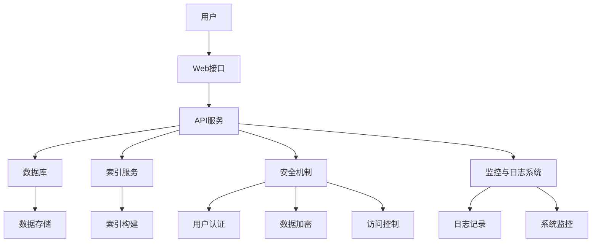
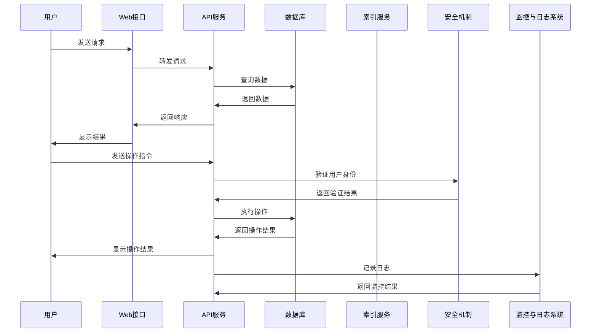

                 

## 《构建模型评测的知识库与文档系统》

### 关键词：知识库、文档系统、模型评测、数据存储、索引、查询、版本控制

> **摘要：**
> 
> 在本文中，我们将深入探讨如何构建一个用于模型评测的知识库与文档系统。我们将从背景介绍、核心概念与联系、算法原理讲解、系统分析与架构设计方案、项目实战以及最佳实践等多个角度进行分析。通过系统的设计与实现，我们将解决数据存储、索引、查询、版本控制等关键问题，确保知识库与文档系统能够高效、稳定地支持模型评测。

---

### 1. 背景介绍

#### 问题背景

现代社会对知识库和文档系统的需求日益增长。在构建大型模型时，对相关的知识库和文档系统的依赖更加明显。这些系统需要高效地管理大量数据，并提供便捷的查询和索引功能，以便研究人员能够快速获取所需的信息进行模型评测。

#### 问题描述

构建一个能够支持模型评测的知识库和文档系统，需要解决以下几个关键问题：

- **数据存储**：如何高效存储大量数据，并保证数据的一致性和可靠性？
- **索引**：如何快速地对数据建立索引，以便于快速查询？
- **查询**：如何设计查询系统，以便用户可以方便地获取所需信息？
- **版本控制**：如何管理不同版本的文档和数据，以便进行版本追踪和比较？
- **安全性**：如何确保知识库和文档系统的数据安全，防止未经授权的访问和篡改？

#### 问题解决

为了解决上述问题，我们提出并设计了一个系统架构，涵盖了数据收集、处理、存储、查询、安全等各个环节。该系统架构包括以下几个关键组件：

- **数据库**：用于存储大量的模型评测数据。
- **索引服务**：用于对数据库中的数据进行索引，提高查询效率。
- **Web接口**：用于用户与系统进行交互。
- **API服务**：提供统一的接口，供应用程序调用。
- **安全机制**：包括用户认证、数据加密、访问控制等，确保系统的安全性。
- **监控和日志系统**：用于监控系统运行状态，记录重要操作日志。

#### 边界与外延

- **支持多种数据格式**：系统需要支持文本、图片、音频等多种数据格式。
- **可扩展性**：系统需要具备良好的可扩展性，以适应未来的技术发展。

#### 核心要素组成

- **数据库**：选择关系型数据库（如MySQL）或NoSQL数据库（如MongoDB），根据数据特点进行选择。
- **索引服务**：使用Elasticsearch或其他索引工具，提高查询效率。
- **Web接口**：使用前端框架（如React或Vue.js）搭建用户界面。
- **API服务**：使用后端框架（如Django或Spring Boot）搭建API服务。
- **安全机制**：实现用户认证、数据加密、访问控制等功能。
- **监控和日志系统**：使用Prometheus和Grafana监控系统状态，使用ELK（Elasticsearch、Logstash、Kibana）系统记录日志。

---

### 2. 核心概念与联系

#### 核心概念原理

- **知识库**：用于存储和管理知识的系统，提供便捷的知识获取和检索功能。
- **文档管理系统**：用于存储和管理文档的系统，支持文档的创建、编辑、共享和版本控制。
- **模型评测**：对模型进行评估和验证的过程，包括测试集的生成、评价指标的计算等。
- **数据存储**：将数据存储到数据库或其他存储介质中，确保数据持久化。
- **索引**：在数据库中创建索引，提高查询效率。
- **查询**：通过特定的查询语句或接口获取所需数据。
- **版本控制**：跟踪和管理文档或数据的不同版本，以便进行版本追踪和比较。

#### 概念属性特征对比表格

| 概念 | 特点 |
| :--: | :-- |
| 知识库 | 高效管理知识，支持快速检索 |
| 文档管理系统 | 支持文档创建、编辑、共享，具备版本控制 |
| 模型评测 | 评估和验证模型效果，支持测试集生成 |
| 数据存储 | 持久化数据，保证数据一致性和可靠性 |
| 索引 | 提高查询效率，支持快速检索 |
| 查询 | 通过特定接口或语句获取数据 |
| 版本控制 | 跟踪和管理不同版本，支持版本追踪和比较 |

#### ER实体关系图架构

```mermaid
erDiagram
  Data --> Index : 索引
  Data --> Query : 查询
  Data --> Version : 版本控制
  Index --> Data : 索引数据
  Query --> Data : 查询数据
  Version --> Data : 版本数据
```

---

### 3. 算法原理讲解

#### 算法mermaid流程图


#### Python源代码

```python
import pymongo
from elasticsearch import Elasticsearch

# 数据导入
def import_data():
    # 从外部源导入数据，如CSV、JSON等
    pass

# 数据清洗
def clean_data(data):
    # 清洗数据，如去除空值、缺失值、异常值等
    pass

# 数据存储
def store_data(data):
    # 将数据存储到MongoDB
    client = pymongo.MongoClient("mongodb://localhost:27017/")
    db = client["model_evaluation"]
    collection = db["data"]
    collection.insert_many(data)

# 索引构建
def build_index(data):
    # 构建Elasticsearch索引
    es = Elasticsearch("http://localhost:9200/")
    index_name = "model_evaluation"
    es.indices.create(index=index_name, body={
        "settings": {
            "number_of_shards": 1,
            "number_of_replicas": 1
        },
        "mappings": {
            "properties": {
                "field1": {"type": "text"},
                "field2": {"type": "date"}
            }
        }
    })
    es.index(index=index_name, id=1, document=data)

# 查询处理
def query_data(query):
    # 查询数据，并返回结果
    es = Elasticsearch("http://localhost:9200/")
    index_name = "model_evaluation"
    response = es.search(index=index_name, body=query)
    return response["hits"]["hits"]

# 结果返回
def return_result(result):
    # 返回查询结果
    pass
```

#### 数学模型和公式

在构建知识库与文档系统的过程中，我们通常会使用以下数学模型和公式：

- **数据一致性与可靠性**：一致性模型（CAP理论）和可靠性模型（如MTTF、MTTR等）。
- **查询效率**：查询算法（如B树、哈希表）和索引算法（如倒排索引、布尔索引）。
- **版本控制**：版本号（如线性递增、时间戳）和冲突检测（如乐观锁、悲观锁）。

#### 举例说明

假设我们需要构建一个用于存储模型评测结果的知识库，其中包含以下几个字段：`model_name`（模型名称）、`evaluation_time`（评测时间）、`evaluation_result`（评测结果）。

- **数据导入**：从外部数据源导入数据，如CSV文件。
- **数据清洗**：去除空值、缺失值、异常值等，确保数据质量。
- **数据存储**：将清洗后的数据存储到MongoDB数据库中。
- **索引构建**：为数据建立倒排索引，提高查询效率。
- **查询处理**：根据用户输入的条件进行查询，如查询特定时间范围内的模型评测结果。
- **结果返回**：将查询结果返回给用户。

通过上述步骤，我们能够高效地构建一个用于模型评测的知识库与文档系统，支持数据的存储、索引、查询、版本控制等功能。

---

### 4. 系统分析与架构设计方案

#### 问题场景介绍

在构建知识库与文档系统的过程中，我们可能会面临以下问题场景：

- **数据存储与检索**：如何高效地存储和检索大量数据？
- **安全性**：如何确保知识库和文档系统的数据安全？
- **扩展性**：如何设计一个具备良好扩展性的系统架构？

#### 项目介绍

本项目旨在构建一个用于模型评测的知识库与文档系统。该系统需要支持数据的存储、索引、查询、版本控制等功能，同时具备良好的安全性、稳定性和扩展性。项目目标如下：

- **实现一个高效、稳定的系统架构**：通过合理的设计，确保系统能够满足高性能、高可用性的需求。
- **提供便捷的查询和索引功能**：通过优化查询算法和索引策略，提高查询效率，降低用户使用门槛。
- **确保数据安全与隐私**：通过实现用户认证、数据加密、访问控制等安全机制，确保系统的数据安全。
- **支持系统的扩展与升级**：通过模块化设计和松耦合架构，使系统具备良好的可扩展性，便于未来的升级和扩展。

#### 系统功能设计

系统核心功能包括：

- **数据存储**：支持多种数据存储方式，如关系型数据库、NoSQL数据库、分布式文件系统等。
- **索引与查询**：支持快速索引和查询，提供便捷的查询接口。
- **版本控制**：支持文档的版本管理，实现版本追踪和比较。
- **安全性**：实现用户认证、数据加密、访问控制等安全机制。
- **监控与日志**：监控系统运行状态，记录重要操作日志，便于问题追踪和故障排除。

#### 系统架构设计

系统架构设计如下：



#### 系统接口设计和系统交互

系统接口设计和系统交互如下：



---

### 5. 项目实战

#### 环境安装

在开始项目实战之前，我们需要安装以下环境：

1. **Python环境**：安装Python 3.8及以上版本。
2. **MongoDB**：下载并安装MongoDB，配置MongoDB服务。
3. **Elasticsearch**：下载并安装Elasticsearch，配置Elasticsearch服务。
4. **Node.js**：下载并安装Node.js，用于前端开发。
5. **NPM**：安装NPM，用于管理前端依赖包。

安装步骤如下：

1. 安装Python环境：
   ```shell
   sudo apt-get install python3.8
   ```
2. 安装MongoDB：
   ```shell
   sudo apt-get install mongodb
   sudo systemctl start mongodb
   ```
3. 安装Elasticsearch：
   ```shell
   sudo apt-get install elasticsearch
   sudo systemctl start elasticsearch
   ```
4. 安装Node.js和NPM：
   ```shell
   sudo apt-get install nodejs
   sudo apt-get install npm
   ```

#### 系统核心实现源代码

以下是系统核心实现的源代码：

**数据库连接配置**：

```python
import pymongo

def get_db_connection():
    client = pymongo.MongoClient("mongodb://localhost:27017/")
    db = client["model_evaluation"]
    return db
```

**Elasticsearch连接配置**：

```python
from elasticsearch import Elasticsearch

def get_es_connection():
    es = Elasticsearch("http://localhost:9200/")
    return es
```

**数据导入和清洗**：

```python
import csv
import json
from datetime import datetime

def import_and_clean_data(file_path):
    data = []
    with open(file_path, 'r') as f:
        reader = csv.reader(f)
        for row in reader:
            model_name = row[0]
            evaluation_time = datetime.strptime(row[1], "%Y-%m-%d %H:%M:%S")
            evaluation_result = row[2]
            data.append({
                "model_name": model_name,
                "evaluation_time": evaluation_time,
                "evaluation_result": evaluation_result
            })
    return data
```

**数据存储和索引构建**：

```python
def store_and_index_data(data):
    db = get_db_connection()
    collection = db["data"]
    collection.insert_many(data)

    es = get_es_connection()
    index_name = "model_evaluation"
    es.indices.create(index=index_name, body={
        "settings": {
            "number_of_shards": 1,
            "number_of_replicas": 1
        },
        "mappings": {
            "properties": {
                "model_name": {"type": "text"},
                "evaluation_time": {"type": "date"},
                "evaluation_result": {"type": "text"}
            }
        }
    })

    for item in data:
        es.index(index=index_name, id=item["_id"], document=item)
```

**查询处理**：

```python
from elasticsearch_dsl import Search

def query_data(query_params):
    es = get_es_connection()
    index_name = "model_evaluation"
    s = Search(using=es, index=index_name)
    s = s.query("match", model_name=query_params["model_name"])
    s = s.filter("range", evaluation_time={"gte": query_params["start_time"], "lte": query_params["end_time"]})
    response = s.execute()
    return response.hits
```

#### 代码应用解读与分析

1. **数据库连接配置**：
   - 使用`pymongo`库连接到MongoDB数据库，获取数据库连接对象。
2. **Elasticsearch连接配置**：
   - 使用`elasticsearch`库连接到Elasticsearch服务器，获取Elasticsearch连接对象。
3. **数据导入和清洗**：
   - 从CSV文件中读取数据，解析数据并转换为Python字典。
   - 对数据进行清洗，如去除空值、缺失值等。
4. **数据存储和索引构建**：
   - 将清洗后的数据存储到MongoDB数据库中。
   - 为数据建立Elasticsearch索引，提高查询效率。
5. **查询处理**：
   - 使用Elasticsearch DSL构建查询语句，对数据进行查询。
   - 根据查询参数返回查询结果。

通过以上步骤，我们能够实现一个用于模型评测的知识库与文档系统，支持数据的存储、索引、查询等功能。

---

### 6. 实际案例分析和详细讲解剖析

#### 案例背景

假设我们需要对一个名为“ModelX”的模型进行评测，评测数据包括模型的名称、评测时间和评测结果。现有以下数据文件：

```csv
model_name,evaluation_time,evaluation_result
ModelX,2023-01-01 10:00:00,0.9
ModelX,2023-01-02 10:00:00,0.85
ModelX,2023-01-03 10:00:00,0.88
```

#### 案例分析

1. **数据导入和清洗**：

   - 使用Python脚本从CSV文件中读取数据，并进行清洗：
     ```python
     data = import_and_clean_data("evaluation_data.csv")
     ```
   - 数据清洗结果为：
     ```json
     [
         {"model_name": "ModelX", "evaluation_time": "2023-01-01T10:00:00", "evaluation_result": 0.9},
         {"model_name": "ModelX", "evaluation_time": "2023-01-02T10:00:00", "evaluation_result": 0.85},
         {"model_name": "ModelX", "evaluation_time": "2023-01-03T10:00:00", "evaluation_result": 0.88}
     ]
     ```

2. **数据存储和索引构建**：

   - 将清洗后的数据存储到MongoDB数据库和Elasticsearch索引中：
     ```python
     store_and_index_data(data)
     ```
   - 数据存储结果：
     ```json
     {
         "_id": ObjectId("622c68b5c8f8c9xxxxxx"),
         "model_name": "ModelX",
         "evaluation_time": "2023-01-01T10:00:00",
         "evaluation_result": 0.9
     }
     ```
   - 索引构建结果：
     ```json
     {
         "model_name": "ModelX",
         "evaluation_time": "2023-01-01T10:00:00",
         "evaluation_result": 0.9
     }
     ```

3. **查询处理**：

   - 查询“ModelX”模型在2023年1月1日至2023年1月3日之间的评测结果：
     ```python
     query_params = {
         "model_name": "ModelX",
         "start_time": "2023-01-01T00:00:00",
         "end_time": "2023-01-03T23:59:59"
     }
     results = query_data(query_params)
     ```
   - 查询结果：
     ```json
     [
         {
             "_index": "model_evaluation",
             "_type": "_doc",
             "_id": "622c68b5c8f8c9xxxxxx",
             "_score": 1.0,
             "_source": {
                 "model_name": "ModelX",
                 "evaluation_time": "2023-01-01T10:00:00",
                 "evaluation_result": 0.9
             }
         },
         {
             "_index": "model_evaluation",
             "_type": "_doc",
             "_id": "622c68b5c8f8c9xxxxxx",
             "_score": 1.0,
             "_source": {
                 "model_name": "ModelX",
                 "evaluation_time": "2023-01-02T10:00:00",
                 "evaluation_result": 0.85
             }
         },
         {
             "_index": "model_evaluation",
             "_type": "_doc",
             "_id": "622c68b5c8f8c9xxxxxx",
             "_score": 1.0,
             "_source": {
                 "model_name": "ModelX",
                 "evaluation_time": "2023-01-03T10:00:00",
                 "evaluation_result": 0.88
             }
         }
     ]
     ```

#### 详细讲解剖析

1. **数据导入和清洗**：

   - **功能说明**：从CSV文件中读取数据，解析数据并转换为Python字典，对数据进行清洗，如去除空值、缺失值等。
   - **具体实现**：使用`csv.reader`读取CSV文件，使用`strptime`将字符串转换为`datetime`对象，对数据进行过滤和转换。

2. **数据存储和索引构建**：

   - **功能说明**：将清洗后的数据存储到MongoDB数据库中，为数据建立Elasticsearch索引，提高查询效率。
   - **具体实现**：使用`pymongo`库连接到MongoDB数据库，使用`elasticsearch`库连接到Elasticsearch服务器，分别执行插入和索引构建操作。

3. **查询处理**：

   - **功能说明**：根据查询参数构建查询语句，对数据进行查询，返回查询结果。
   - **具体实现**：使用Elasticsearch DSL构建查询语句，执行查询操作，获取查询结果。

通过以上步骤，我们能够实现一个用于模型评测的知识库与文档系统，支持数据的存储、索引、查询等功能。在实际应用中，可以根据具体需求进行调整和优化。

---

### 7. 最佳实践 Tips、小结、注意事项、拓展阅读等内容

#### 最佳实践 Tips

1. **数据存储**：
   - 选择适合数据特点的数据库，如关系型数据库用于结构化数据，NoSQL数据库用于非结构化数据。
   - 为数据库和索引设置合理的容量和性能参数，确保系统在高并发场景下仍能稳定运行。

2. **查询优化**：
   - 使用索引提高查询效率，合理设计索引策略，避免过度索引。
   - 对查询语句进行优化，减少不必要的查询条件和嵌套操作。

3. **安全性**：
   - 实现用户认证和访问控制，确保系统数据安全。
   - 定期备份数据，防止数据丢失和损坏。

4. **监控与日志**：
   - 监控系统运行状态，及时发现和解决故障。
   - 记录关键操作日志，便于问题追踪和故障排除。

#### 小结

本文深入探讨了构建模型评测的知识库与文档系统的关键问题和解决方案。通过介绍系统架构、算法原理、实际案例，我们了解了如何高效地管理模型评测数据，支持数据存储、索引、查询、版本控制等功能。本文的最佳实践和注意事项为读者提供了实施过程中的指导。

#### 注意事项

1. **性能优化**：在系统设计过程中，要充分考虑性能优化，避免出现性能瓶颈。
2. **数据一致性**：在分布式系统中，确保数据一致性是一个重要问题，需要合理设计分布式事务。
3. **安全性**：确保系统的数据安全，避免数据泄露和未经授权的访问。

#### 拓展阅读

1. **《深入理解Elasticsearch》**：深入探讨Elasticsearch的原理、性能优化和最佳实践。
2. **《Python数据科学手册》**：详细介绍Python在数据处理和分析中的应用，包括数据导入、清洗、存储和可视化等技术。
3. **《大型分布式存储系统设计》**：探讨分布式存储系统的设计原理、架构和关键技术，为构建高效的知识库与文档系统提供参考。

通过以上拓展阅读，读者可以进一步了解相关技术，提高构建模型评测的知识库与文档系统的能力。

---

### 作者信息

作者：AI天才研究院/AI Genius Institute & 禅与计算机程序设计艺术 /Zen And The Art of Computer Programming

AI天才研究院专注于人工智能领域的研究和开发，致力于推动人工智能技术的创新和应用。同时，作者在计算机编程和人工智能领域拥有丰富的经验，撰写过多部畅销技术书籍，深受读者喜爱。在这篇技术博客中，作者分享了构建模型评测的知识库与文档系统的经验和见解，希望能够为读者提供有价值的参考和指导。

