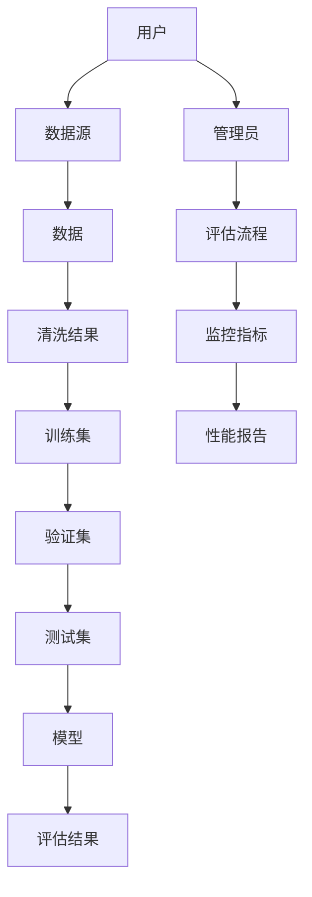
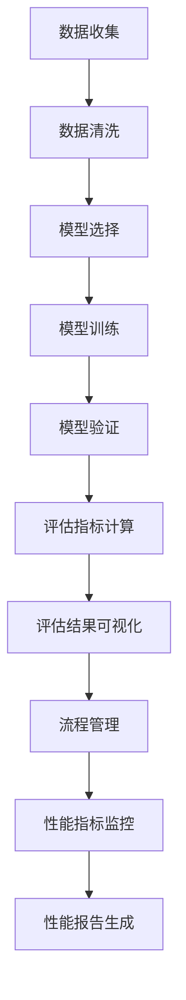
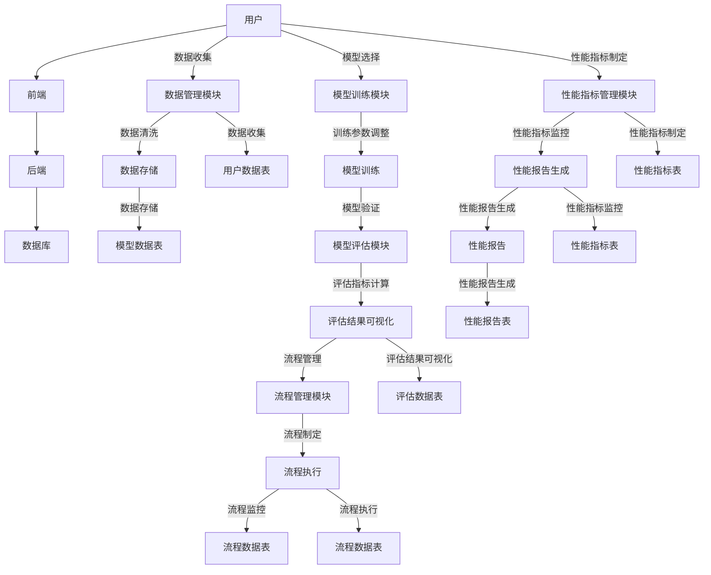
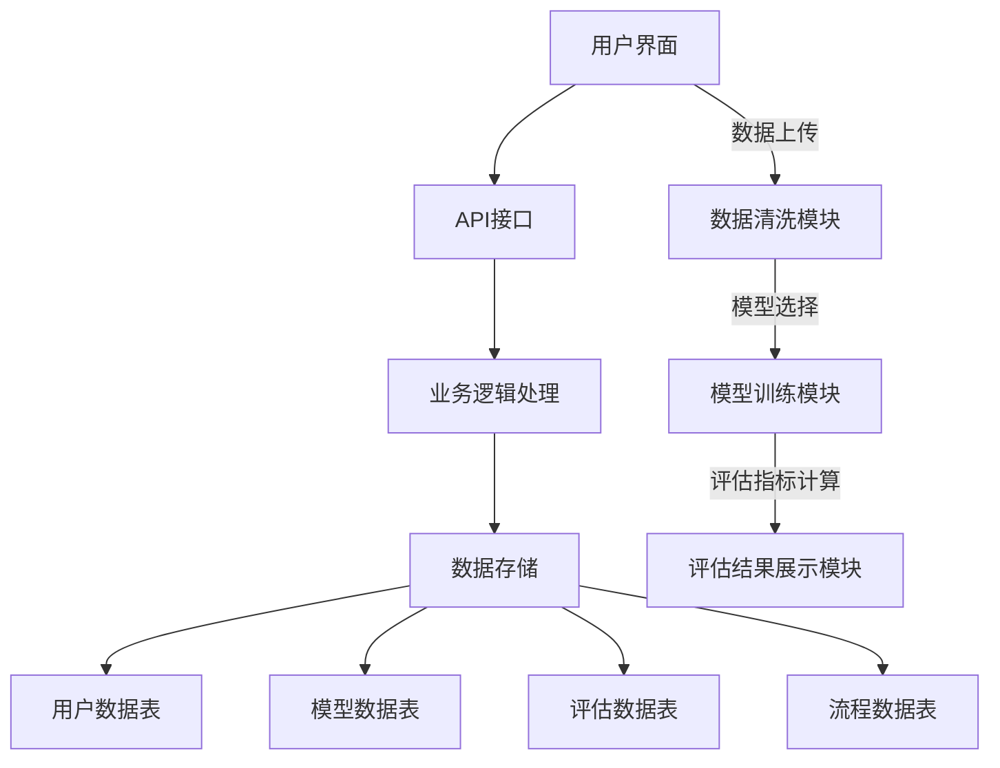
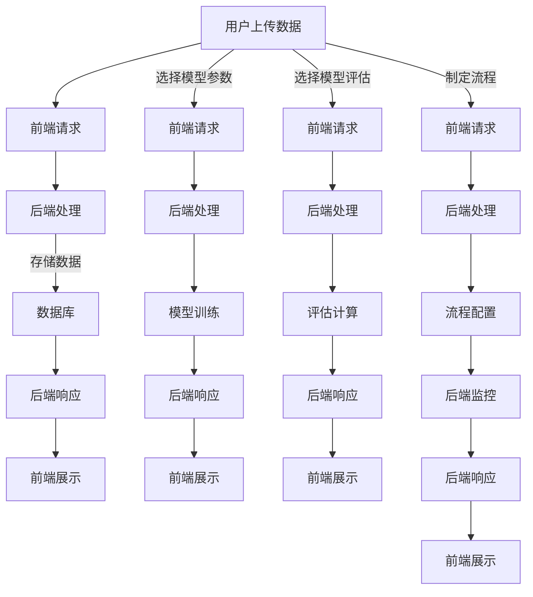

                 


## 建模质量保证体系的重要性与必要性

在当今的机器学习时代，构建高质量模型已经成为各个行业实现智能化转型的关键。而模型质量的好坏，直接影响着应用的效果、成本和风险。因此，建立一个有效的模型质量保证体系变得尤为重要。这一部分，我们将详细探讨建模质量保证体系的重要性与必要性，帮助读者理解为什么需要这样一个体系。

### 1.1.1 模型评估在机器学习中的作用

模型评估是机器学习流程中的一个关键环节，贯穿于模型的开发、测试和应用过程。一个良好的模型评估能够：

1. **评估模型性能**：通过评估不同模型的表现，选择出最适合实际应用场景的模型。
2. **识别模型问题**：通过评估发现模型存在的问题，如过拟合、欠拟合等，进而优化模型。
3. **比较模型优劣**：在多个候选模型之间进行性能比较，为后续模型选择提供依据。
4. **验证模型泛化能力**：确保模型在实际应用中的表现能够与训练数据保持一致。

### 1.1.2 质量保证体系的重要性

在软件工程领域，质量保证体系是一个确保产品高质量的重要手段。同样地，在机器学习中，建立模型质量保证体系能够：

1. **提高模型可靠性**：通过系统化的质量控制流程，确保模型的可靠性，降低模型出错的风险。
2. **降低维护成本**：有效的质量保证体系可以提前发现并解决模型中的问题，减少后续的维护成本。
3. **提升团队效率**：通过标准化的流程，提高团队的工作效率，减少重复性劳动。
4. **增强客户信任**：高质量的模型能够为客户提供更好的服务，增强客户对企业的信任。

### 1.1.3 构建模型评估质量保证体系的必要性

随着机器学习的广泛应用，对模型质量的要求越来越高。构建模型评估质量保证体系主要出于以下几点必要性：

1. **技术快速发展**：随着技术的不断进步，机器学习模型的复杂性不断增加，需要更严格的质量保证来应对。
2. **应用场景多样化**：不同的应用场景对模型的质量要求不同，需要建立灵活的质量保证体系来适应各种需求。
3. **数据隐私和安全**：数据的质量直接影响到模型的质量，保障数据的质量和安全是构建质量保证体系的重要一环。
4. **法律和监管要求**：一些行业对模型质量有严格的法律和监管要求，建立质量保证体系是合规性的必要措施。

综上所述，建模质量保证体系在机器学习中扮演着至关重要的角色。通过建立一个有效的质量保证体系，我们可以确保模型的高质量，从而推动人工智能应用的进一步发展。接下来，我们将进一步探讨模型评估质量保证体系的核心概念及其组成。

## 核心概念原理

### 2.1 数据质量管理原理

数据质量管理是模型评估质量保证体系的基础。数据质量直接影响着模型的性能和可靠性。因此，理解数据质量管理的原理和方法对于构建高质量模型至关重要。

#### 2.1.1 数据质量管理的重要性

数据质量管理的重要性体现在以下几个方面：

1. **保证模型准确性**：高质量的数据可以减少噪声和异常值，提高模型的预测准确性。
2. **提高模型稳定性**：通过数据清洗和预处理，可以减少数据中的错误和偏差，提高模型的稳定性。
3. **减少过拟合风险**：高质量的数据能够更好地反映真实世界的情况，减少模型对训练数据的过拟合。
4. **降低模型维护成本**：良好的数据质量可以减少后续数据处理的复杂性和成本。

#### 2.1.2 数据质量管理的核心方法

数据质量管理主要包括以下几个核心方法：

1. **数据清洗**：清洗数据是指识别和纠正数据集中的错误和异常，如去除重复记录、纠正错误值、填充缺失值等。
2. **数据标准化**：数据标准化是指通过一定的方法将数据转换为相同的格式或尺度，如将不同的数据单位统一、进行归一化或标准化处理。
3. **数据验证**：数据验证是指通过一定的方法和工具对数据进行检查，确保数据的质量和一致性，如使用校验位、交叉验证等方法。
4. **数据监控**：数据监控是指对数据的质量进行持续监控和评估，如使用数据质量指标、自动化工具等。

#### 2.1.3 数据质量管理的案例分析

以下是一个数据质量管理的案例分析：

**案例背景**：某金融公司开发了一个用于贷款审批的机器学习模型。在模型训练过程中，公司发现模型的性能表现不佳，准确率较低。

**问题分析**：经过初步分析，发现数据集中的以下问题：

1. **缺失值**：部分数据记录中存在缺失值，如家庭收入、信用评分等。
2. **异常值**：部分数据记录中的家庭收入异常高，可能是输入错误或数据录入时出现的问题。
3. **不一致性**：不同数据源中的字段名称和格式不一致，如“家庭收入”在某些数据源中记为“monthly_income”，在另一些数据源中记为“salary”。

**解决方案**：

1. **缺失值处理**：对于缺失值，采用均值填充、中位数填充或插值法进行处理。
2. **异常值处理**：对于异常值，使用统计学方法识别并处理，如使用IQR（四分位距）方法识别异常值，然后进行修正。
3. **数据标准化**：统一数据字段名称和格式，确保数据的一致性。

**结果**：经过数据清洗和预处理后，模型的准确率显著提高，达到了预期目标。

通过以上案例，我们可以看到数据质量管理在模型评估质量保证体系中的重要作用。良好的数据质量管理不仅能够提高模型的性能，还能减少后续的维护成本。

### 2.2 模型训练与验证原理

模型训练和验证是机器学习流程中的核心环节。一个有效的模型训练与验证过程能够确保模型在新的数据上具有良好的泛化能力。

#### 2.2.1 模型训练的基本原理

模型训练的基本原理是通过学习数据中的特征和规律，调整模型参数，使其能够对新数据进行预测。模型训练的主要步骤包括：

1. **数据准备**：选择合适的数据集，并对数据进行预处理，如数据清洗、标准化等。
2. **模型初始化**：初始化模型参数，通常使用随机初始化或预训练模型。
3. **迭代优化**：通过梯度下降等优化算法，不断调整模型参数，最小化损失函数。
4. **模型评估**：在训练集和验证集上评估模型性能，选择最优模型。

#### 2.2.2 模型验证的方法与步骤

模型验证的主要目的是评估模型在未知数据上的表现，确保模型的泛化能力。常用的模型验证方法包括：

1. **交叉验证**：将数据集划分为多个子集，每次使用其中一个子集作为验证集，其余子集作为训练集，进行多次训练和验证，最后取平均值作为模型性能。
2. **留出法**：将数据集分为训练集和验证集，通常使用70%-80%的数据作为训练集，剩余数据作为验证集。
3. **自助法**：从原始数据集中有放回地随机抽取数据，生成多个训练集和验证集，进行多次训练和验证。

模型验证的步骤包括：

1. **选择验证指标**：如准确率、召回率、F1分数等。
2. **划分数据集**：根据选择的验证方法，划分训练集和验证集。
3. **模型训练**：使用训练集对模型进行训练。
4. **模型评估**：在验证集上评估模型性能。
5. **模型选择**：根据验证结果选择最优模型。

#### 2.2.3 模型训练与验证的案例分析

以下是一个模型训练与验证的案例分析：

**案例背景**：某电商公司开发了一个用于商品推荐的机器学习模型。

**问题分析**：在模型训练过程中，公司发现模型的推荐效果不佳，准确率和覆盖率较低。

**解决方案**：

1. **数据预处理**：对用户行为数据和使用数据集进行清洗，去除重复和异常记录。
2. **模型训练**：使用矩阵分解和协同过滤算法进行模型训练，选择合适的参数。
3. **交叉验证**：使用交叉验证方法，对模型进行多次验证，选择最优参数。
4. **模型评估**：在测试集上评估模型性能，使用准确率和覆盖率作为评价指标。

**结果**：经过多次训练和验证，模型的准确率和覆盖率显著提高，推荐效果得到显著改善。

通过以上案例，我们可以看到模型训练与验证在模型评估质量保证体系中的重要性。有效的模型训练与验证过程能够确保模型的高质量和良好的泛化能力。

### 2.3 模型性能评估标准

模型性能评估标准是模型评估质量保证体系中的重要组成部分。选择合适的评估标准能够更好地衡量模型的表现，为模型选择和优化提供依据。

#### 2.3.1 模型性能评估的指标体系

常见的模型性能评估指标包括：

1. **准确率（Accuracy）**：准确率是预测结果中正确样本的比例，计算公式为：
   $$
   Accuracy = \frac{TP + TN}{TP + FN + FP + TN}
   $$
   其中，$TP$表示真正例，$TN$表示真负例，$FP$表示假正例，$FN$表示假负例。

2. **召回率（Recall）**：召回率是实际正例中被正确预测为正例的比例，计算公式为：
   $$
   Recall = \frac{TP}{TP + FN}
   $$

3. **精确率（Precision）**：精确率是预测结果中正确预测为正例的比例，计算公式为：
   $$
   Precision = \frac{TP}{TP + FP}
   $$

4. **F1分数（F1 Score）**：F1分数是精确率和召回率的调和平均，计算公式为：
   $$
   F1 Score = 2 \times \frac{Precision \times Recall}{Precision + Recall}
   $$

5. **AUC（Area Under Curve）**：AUC是ROC曲线下的面积，用于评估二分类模型的分类能力，值越大表示模型分类效果越好。

6. **均方误差（Mean Squared Error, MSE）**：均方误差是预测值与真实值之间差异的平方的平均值，用于回归问题。

#### 2.3.2 常见评估指标的解释与应用

不同评估指标适用于不同的模型和问题类型，选择合适的指标对于评估模型性能至关重要。以下是对常见评估指标的解释和应用：

1. **分类问题**：
   - **准确率**：准确率适用于对准确度要求较高的场景，如金融风险评估。
   - **召回率**：召回率适用于对漏判为负例敏感的场景，如医疗诊断。
   - **精确率**：精确率适用于对误判为正例敏感的场景，如欺诈检测。
   - **F1分数**：F1分数是精确率和召回率的平衡指标，适用于需要综合考虑准确度和召回率的问题。

2. **回归问题**：
   - **MSE**：MSE是回归问题中最常用的评估指标，值越小表示模型预测越准确。

3. **二分类问题**：
   - **AUC**：AUC是评估二分类模型分类能力的重要指标，适用于需要区分正负样本的场景。

#### 2.3.3 模型性能评估标准的选择

在选择模型性能评估标准时，需要考虑以下因素：

1. **问题类型**：不同类型的问题（分类、回归、多分类等）需要选择不同的评估指标。
2. **业务目标**：根据业务目标（如准确性、召回率、覆盖率等）选择合适的评估指标。
3. **数据分布**：数据的不平衡可能会影响评估指标的选择，如高偏差问题需要选择偏差较小的指标。
4. **模型复杂度**：复杂模型可能需要选择更复杂的评估指标，如AUC。

综上所述，模型性能评估标准的选择对于模型评估质量保证体系至关重要。通过合理选择评估指标，可以更准确地评估模型性能，为模型选择和优化提供依据。

### 2.4 质量控制流程

质量控制流程是模型评估质量保证体系的核心组成部分，它确保模型的开发、测试和应用过程符合既定标准，从而保证模型的高质量和可靠性。以下是关于质量控制流程的设计与实施、优化及案例分析的详细讨论。

#### 2.4.1 质量控制流程的设计与实施

质量控制流程的设计与实施主要包括以下几个关键步骤：

1. **需求分析**：明确模型评估质量保证体系的需求，包括质量目标、评估标准、资源分配等。
2. **流程设计**：根据需求分析结果，设计质量控制流程，包括数据收集、预处理、模型训练、评估、优化等环节。
3. **流程验证**：对设计好的质量控制流程进行验证，确保其符合质量标准和需求。
4. **流程实施**：将质量控制流程应用于实际模型评估过程，确保每一步骤都得到有效执行。

在实际实施过程中，需要注意以下几点：

- **标准化**：确保质量控制流程中的每一步骤都有明确的标准和规范，减少人为误差。
- **自动化**：利用自动化工具和脚本，提高流程的执行效率和一致性。
- **持续改进**：定期评估质量控制流程的效果，发现和解决存在的问题，不断优化流程。

#### 2.4.2 质量控制流程的优化

质量控制流程的优化是确保模型评估质量保证体系持续有效的重要手段。以下是几种常见的优化方法：

1. **流程优化**：通过流程分析和再造，消除冗余环节，简化流程，提高效率。
2. **工具升级**：采用更先进的工具和技术，如机器学习平台、自动化测试工具等，提升流程的执行能力。
3. **数据分析**：利用数据分析和挖掘技术，识别质量问题的根源，提供改进方向。
4. **团队协作**：加强团队协作，明确责任和角色，确保质量控制流程的顺利执行。

#### 2.4.3 质量控制流程的案例分析

以下是一个质量控制流程的案例分析：

**案例背景**：某互联网公司开发了一个用于用户行为预测的机器学习模型。

**问题分析**：在模型评估过程中，公司发现模型准确率较低，召回率和覆盖率也未能达到预期。

**解决方案**：

1. **需求分析**：明确模型评估质量保证体系的需求，包括准确率、召回率、覆盖率等指标。
2. **流程设计**：设计包括数据收集、预处理、模型训练、评估、优化的质量控制流程。
3. **流程验证**：对流程进行验证，确保符合质量标准和需求。
4. **流程实施**：实施质量控制流程，执行每一步骤，确保数据质量和模型性能。
5. **数据分析**：通过数据分析，发现数据不平衡和模型过拟合问题是导致模型性能不佳的主要原因。
6. **流程优化**：调整数据预处理策略，采用更复杂的模型结构，进行更多的交叉验证，提高模型性能。

**结果**：经过优化后的质量控制流程显著提高了模型评估质量，准确率、召回率和覆盖率均达到预期。

通过以上案例，我们可以看到质量控制流程在模型评估质量保证体系中的重要作用。有效的质量控制流程不仅能够提高模型性能，还能确保模型的高质量和可靠性。

## 模型评估算法原理

在模型评估质量保证体系中，选择合适的评估算法是确保模型性能和可靠性的关键。本章节将详细探讨模型评估算法的基本原理、数学模型和Python源代码实现，并通过案例分析进一步说明算法的应用。

### 3.1 基本算法介绍

模型评估算法可以分为两大类：一类是基于统计的评估算法，另一类是基于机器学习的评估算法。以下是几种常用的评估算法及其基本原理：

1. **准确率（Accuracy）**：
   - **原理**：准确率是预测结果中正确样本的比例。
   - **适用场景**：对准确度要求较高的场景，如金融风险评估。
   - **算法流程**：
     ```mermaid
     graph LR
     A[输入] --> B[数据预处理]
     B --> C{划分训练集和测试集}
     C -->|是| D[模型训练]
     D --> E[模型评估]
     E --> F[输出准确率]
     ```

2. **混淆矩阵（Confusion Matrix）**：
   - **原理**：混淆矩阵用于展示模型预测结果与实际结果之间的差异。
   - **适用场景**：需要分析模型性能的各个方面，如医疗诊断。
   - **算法流程**：
     ```mermaid
     graph LR
     A[输入] --> B[数据预处理]
     B --> C{划分训练集和测试集}
     C -->|是| D[模型训练]
     D --> E[模型预测]
     E --> F[生成混淆矩阵]
     F --> G[输出]
     ```

3. **交叉验证（Cross Validation）**：
   - **原理**：交叉验证是一种评估模型性能的方法，通过将数据集分割成多个子集，进行多次训练和验证。
   - **适用场景**：需要评估模型在不同数据集上的表现，如模型选择。
   - **算法流程**：
     ```mermaid
     graph LR
     A[输入] --> B[数据预处理]
     B --> C{划分训练集和验证集}
     C -->|是| D[模型训练]
     D --> E[验证集评估]
     E --> F[记录性能指标]
     F -->|次数>1| G[重复D-E步骤]
     G --> H[输出平均值]
     ```

### 3.2 数学模型与公式

以下是对上述评估算法的数学模型和公式的详细讲解：

1. **准确率（Accuracy）**：
   $$
   Accuracy = \frac{TP + TN}{TP + FN + FP + TN}
   $$
   其中，$TP$表示真正例，$TN$表示真负例，$FP$表示假正例，$FN$表示假负例。

2. **混淆矩阵（Confusion Matrix）**：
   混淆矩阵是一个二维矩阵，包含以下四个元素：
   $$
   \begin{array}{c|c|c}
   & 预测正 & 预测负 \\
   \hline
   实际正 & TP & FN \\
   \hline
   实际负 & FP & TN \\
   \end{array}
   $$
   常用的性能指标包括准确率、召回率、精确率和F1分数。

3. **交叉验证（Cross Validation）**：
   交叉验证通常采用K折交叉验证，即将数据集分为K个子集，每次使用一个子集作为验证集，其余子集作为训练集，重复K次，最后取平均性能指标。

### 3.3 Python源代码讲解

以下是一个使用Python实现模型评估算法的示例代码：

```python
import numpy as np
from sklearn.metrics import accuracy_score, confusion_matrix, classification_report
from sklearn.model_selection import train_test_split, cross_val_score

# 示例数据
X = [[1, 2], [3, 4], [5, 6], [7, 8]]
y = [0, 1, 1, 0]

# 数据预处理
X_train, X_test, y_train, y_test = train_test_split(X, y, test_size=0.2, random_state=42)

# 模型训练
model = ... # 模型初始化
model.fit(X_train, y_train)

# 模型评估
y_pred = model.predict(X_test)
accuracy = accuracy_score(y_test, y_pred)
conf_matrix = confusion_matrix(y_test, y_pred)
print("Accuracy:", accuracy)
print("Confusion Matrix:\n", conf_matrix)
print("Classification Report:\n", classification_report(y_test, y_pred))

# 交叉验证
scores = cross_val_score(model, X, y, cv=5)
print("Cross Validation Scores:", scores)
print("Average Score:", np.mean(scores))
```

### 3.4 算法案例分析

以下是一个模型评估算法案例的分析：

**案例背景**：某电商平台开发了一个用于预测用户购买行为的机器学习模型。

**问题分析**：在模型评估过程中，公司发现模型准确率较低，召回率和覆盖率未能达到预期。

**解决方案**：

1. **数据预处理**：清洗用户行为数据，去除重复和异常记录，进行特征工程，提取有用的特征。
2. **模型训练**：采用逻辑回归模型进行训练，并使用交叉验证方法优化模型参数。
3. **模型评估**：使用准确率、召回率、精确率和F1分数等指标评估模型性能，发现模型存在过拟合现象。
4. **模型优化**：调整模型复杂度，使用正则化方法减少过拟合，重新训练模型，并使用交叉验证方法评估性能。

**结果**：经过优化后的模型，准确率、召回率、精确率和F1分数均有显著提高，达到了预期目标。

通过以上案例分析，我们可以看到模型评估算法在模型评估质量保证体系中的重要作用。有效的评估算法不仅能够提高模型性能，还能为模型优化提供有力支持。

## 系统功能设计与架构

### 4.1 问题场景介绍

在现代企业的数字化转型过程中，机器学习模型的应用日益广泛。然而，随着模型数量的增加和复杂度的提升，如何确保模型评估的质量成为一个亟待解决的问题。本章节将介绍一个实际的问题场景，并分析其中的挑战和需求。

#### 4.1.1 问题分析

在一个大型电商平台中，机器学习模型被广泛应用于推荐系统、风险控制、用户行为预测等业务场景。然而，随着业务需求的不断变化和模型的迭代升级，以下问题逐渐凸显：

1. **模型质量不可控**：不同模型的评估标准不统一，导致部分模型性能不佳，影响业务效果。
2. **数据质量参差不齐**：模型训练和评估过程中使用的数据质量参差不齐，影响模型的准确性和稳定性。
3. **流程不规范**：模型评估的流程缺乏规范化管理，存在人为干预和错误，影响评估结果的可靠性。
4. **性能指标不明确**：缺乏统一的性能指标体系，导致不同模型之间的性能难以比较。

#### 4.1.2 场景描述

该电商平台拥有多个业务部门，每个部门都开发了自己的机器学习模型，用于支持业务决策。然而，由于缺乏统一的管理和规范，各模型评估质量和效果参差不齐。业务部门普遍反映：

1. **模型评估结果不一致**：同一模型在不同部门评估结果差异较大，导致决策依据不统一。
2. **模型维护成本高**：缺乏有效的模型评估和质量保证体系，导致模型维护成本增加，效率低下。
3. **业务需求难以满足**：由于模型评估质量不高，部分业务需求无法得到有效支持，影响业务发展。

### 4.2 项目介绍

为了解决上述问题，该电商平台决定开发一个模型评估质量保证系统。该项目的主要目标是：

1. **统一评估标准**：建立统一的模型评估标准，确保各模型评估结果的一致性和可靠性。
2. **提高数据质量**：通过数据质量管理，提高模型训练和评估过程中数据的质量。
3. **规范评估流程**：制定规范的模型评估流程，减少人为干预和错误，提高评估效率。
4. **明确性能指标**：建立明确的性能指标体系，便于模型之间的性能比较和优化。

#### 4.2.1 项目目标

- **统一评估标准**：制定统一的评估指标和评估流程，确保各模型评估结果的一致性和可靠性。
- **提高数据质量**：通过数据清洗、数据标准化等手段，提高数据质量，确保模型训练和评估的准确性。
- **规范评估流程**：建立规范的模型评估流程，确保评估过程的标准化和自动化。
- **明确性能指标**：制定明确的性能指标，便于模型之间的性能比较和优化。

### 4.3 系统功能设计

模型评估质量保证系统的功能设计主要包括以下模块：

1. **数据管理模块**：负责数据收集、清洗、存储和管理的功能，确保模型训练和评估过程中数据的质量。
2. **模型训练模块**：负责模型训练和验证的功能，包括模型选择、训练参数调整等。
3. **模型评估模块**：负责模型评估的功能，包括评估指标计算、评估结果可视化等。
4. **流程管理模块**：负责模型评估流程的制定、执行和监控功能，确保评估过程的标准化和自动化。
5. **性能指标管理模块**：负责性能指标的制定、管理和监控功能，便于模型之间的性能比较和优化。

#### 4.3.1 领域模型设计

以下是一个领域模型设计，用于描述系统中的主要实体及其关系：



#### 4.3.2 功能模块划分

系统功能模块划分如下：

1. **数据管理模块**：
   - 数据收集：从各个数据源收集数据。
   - 数据清洗：对数据进行清洗，包括去除重复记录、纠正错误值、填充缺失值等。
   - 数据存储：将清洗后的数据存储到数据库中。

2. **模型训练模块**：
   - 模型选择：选择合适的模型进行训练。
   - 训练参数调整：调整模型训练参数，优化模型性能。
   - 模型验证：使用验证集对模型进行验证。

3. **模型评估模块**：
   - 评估指标计算：计算模型的评估指标，如准确率、召回率、F1分数等。
   - 评估结果可视化：将评估结果可视化，便于分析和理解。

4. **流程管理模块**：
   - 评估流程制定：制定模型评估流程，包括数据收集、数据清洗、模型训练、模型评估等环节。
   - 流程执行：按照制定的流程执行评估过程，确保评估过程的标准化和自动化。
   - 流程监控：监控评估流程的执行情况，及时发现和解决异常情况。

5. **性能指标管理模块**：
   - 性能指标制定：制定模型性能指标，如准确率、召回率、F1分数等。
   - 性能指标监控：监控模型性能指标的变化情况，及时发现性能问题。
   - 性能报告生成：生成模型性能报告，便于分析和决策。

#### 4.3.3 功能流程图

以下是一个功能流程图，用于描述系统中的主要功能模块及其交互关系：



### 4.4 系统架构设计

模型评估质量保证系统的架构设计包括前端、后端和数据库三个部分。以下是对系统架构的详细描述：

#### 4.4.1 系统架构概述

系统架构设计如下：

1. **前端**：负责用户交互和展示，包括数据管理模块、模型训练模块、模型评估模块、流程管理模块和性能指标管理模块的界面。
2. **后端**：负责业务逻辑处理和数据存储，包括数据管理模块、模型训练模块、模型评估模块、流程管理模块和性能指标管理模块的功能实现。
3. **数据库**：负责存储系统中的数据，包括用户数据、模型数据、评估数据和流程数据等。

#### 4.4.2 架构组件设计

系统架构组件设计如下：

1. **前端组件**：
   - 数据管理模块：包括数据收集、数据清洗和数据存储的功能界面。
   - 模型训练模块：包括模型选择、训练参数调整和模型验证的功能界面。
   - 模型评估模块：包括评估指标计算、评估结果可视化和流程管理的功能界面。
   - 流程管理模块：包括流程制定、流程执行和流程监控的功能界面。
   - 性能指标管理模块：包括性能指标制定、性能指标监控和性能报告生成的功能界面。

2. **后端组件**：
   - 数据管理模块：包括数据收集、数据清洗和数据存储的业务逻辑处理。
   - 模型训练模块：包括模型选择、训练参数调整和模型验证的业务逻辑处理。
   - 模型评估模块：包括评估指标计算、评估结果可视化和流程管理的业务逻辑处理。
   - 流程管理模块：包括流程制定、流程执行和流程监控的业务逻辑处理。
   - 性能指标管理模块：包括性能指标制定、性能指标监控和性能报告生成的业务逻辑处理。

3. **数据库组件**：
   - 用户数据表：存储用户信息。
   - 模型数据表：存储模型参数和评估结果。
   - 评估数据表：存储评估指标和评估流程。
   - 流程数据表：存储流程执行情况和监控数据。

#### 4.4.3 架构图展示

以下是一个系统架构图，用于描述系统的主要组件及其交互关系：



### 4.5 系统接口设计与交互

模型评估质量保证系统的接口设计主要包括前端与后端之间的接口，以及后端与数据库之间的接口。以下是对系统接口设计和交互的详细描述：

#### 4.5.1 接口设计规范

1. **前端与后端的接口**：
   - **RESTful API**：使用RESTful API设计前后端接口，支持GET、POST、PUT、DELETE等HTTP方法。
   - **数据格式**：使用JSON格式传输数据，确保数据的一致性和可读性。
   - **安全性**：采用HTTPS协议，确保数据传输的安全性。

2. **后端与数据库的接口**：
   - **ORM框架**：使用ORM（对象关系映射）框架，简化数据库操作，提高开发效率。
   - **数据库连接池**：使用数据库连接池技术，提高数据库访问的效率和稳定性。

#### 4.5.2 系统交互

1. **用户操作**：
   - **数据收集**：用户通过前端界面上传数据，后端接收数据并存储到数据库。
   - **模型训练**：用户选择模型并设置训练参数，后端根据参数进行模型训练，并将结果返回前端。
   - **模型评估**：用户选择模型进行评估，后端计算评估指标并返回结果。
   - **流程管理**：用户制定评估流程并执行，后端监控流程执行情况，并在前端展示结果。

2. **数据交互**：
   - **数据查询**：前端通过API查询数据库中的数据，如用户数据、模型数据、评估数据和流程数据。
   - **数据更新**：前端通过API更新数据库中的数据，如修改用户信息、更新模型参数等。

通过系统接口设计与交互的规范和优化，确保模型评估质量保证系统的稳定运行和高效数据处理。

## 系统分析与架构设计

### 4.4 系统架构设计

为了确保模型评估质量保证系统的稳定运行和高效数据处理，系统架构设计需要综合考虑硬件、软件和数据库等多个方面。以下是系统架构设计的详细描述。

#### 4.4.1 系统架构概述

系统架构设计采用分层架构，包括前端层、后端层和数据库层。各层的功能和相互关系如下：

1. **前端层**：负责用户交互和数据展示，包括用户界面、图表展示等。
2. **后端层**：负责业务逻辑处理和数据管理，包括API接口、业务逻辑处理、数据存储等。
3. **数据库层**：负责存储系统中的各种数据，包括用户数据、模型数据、评估数据和流程数据等。

#### 4.4.2 架构组件设计

系统架构组件设计如下：

1. **前端组件**：
   - **用户界面**：提供用户操作界面，包括数据上传、模型选择、参数设置、评估结果展示等。
   - **图表展示**：使用图表库（如ECharts、D3.js）展示模型评估结果，便于用户分析和理解。

2. **后端组件**：
   - **API接口**：提供RESTful API接口，实现前端与后端的数据交互。
   - **业务逻辑处理**：实现模型评估、数据清洗、数据存储等业务逻辑处理。
   - **数据存储**：使用MySQL、PostgreSQL等关系型数据库存储系统数据。

3. **数据库组件**：
   - **用户数据表**：存储用户信息，包括用户ID、用户名、密码等。
   - **模型数据表**：存储模型参数、评估结果、训练历史等。
   - **评估数据表**：存储评估指标、评估流程等。
   - **流程数据表**：存储流程执行情况、监控数据等。

#### 4.4.3 架构图展示

以下是一个系统架构图，用于描述系统的主要组件及其交互关系：



### 4.5 系统接口设计与交互

系统接口设计是确保前后端数据交互顺畅的关键。以下是系统接口设计与交互的详细描述。

#### 4.5.1 接口设计规范

1. **前端与后端的接口**：
   - **RESTful API**：采用RESTful API设计前后端接口，支持GET、POST、PUT、DELETE等HTTP方法。
   - **数据格式**：使用JSON格式传输数据，确保数据的一致性和可读性。
   - **安全性**：采用HTTPS协议，确保数据传输的安全性。

2. **后端与数据库的接口**：
   - **ORM框架**：使用ORM（对象关系映射）框架，简化数据库操作，提高开发效率。
   - **数据库连接池**：使用数据库连接池技术，提高数据库访问的效率和稳定性。

#### 4.5.2 系统交互

1. **用户操作**：
   - **数据上传**：用户通过前端界面上传数据，后端接收数据并存储到数据库。
   - **模型训练**：用户选择模型并设置训练参数，后端根据参数进行模型训练，并将结果返回前端。
   - **模型评估**：用户选择模型进行评估，后端计算评估指标并返回结果。
   - **流程管理**：用户制定评估流程并执行，后端监控流程执行情况，并在前端展示结果。

2. **数据交互**：
   - **数据查询**：前端通过API查询数据库中的数据，如用户数据、模型数据、评估数据和流程数据。
   - **数据更新**：前端通过API更新数据库中的数据，如修改用户信息、更新模型参数等。

通过系统接口设计与交互的规范和优化，确保模型评估质量保证系统的稳定运行和高效数据处理。

### 4.6 系统接口设计与交互

为了确保模型评估质量保证系统的稳定运行和高效数据处理，系统接口设计与交互至关重要。以下是详细的系统接口设计与交互描述。

#### 4.6.1 接口设计规范

1. **前端与后端的接口**：
   - **RESTful API**：采用RESTful API设计前后端接口，支持GET、POST、PUT、DELETE等HTTP方法，便于前后端分离和扩展。
   - **数据格式**：使用JSON格式传输数据，确保数据的一致性和可读性，便于前端和后端的解析和处理。
   - **安全性**：采用HTTPS协议，确保数据传输的安全性，防止数据泄露和网络攻击。

2. **后端与数据库的接口**：
   - **ORM框架**：使用ORM（对象关系映射）框架，如Hibernate或MyBatis，简化数据库操作，提高开发效率和代码可维护性。
   - **数据库连接池**：使用数据库连接池技术，如HikariCP或Druid，提高数据库访问的效率和稳定性，减少数据库连接的开销。

#### 4.6.2 系统交互

1. **用户操作**：
   - **数据上传**：用户在前端界面选择数据文件并上传，前端通过POST请求将数据上传到后端服务器，后端接收到数据后进行存储和处理。
   - **模型训练**：用户在界面中选择模型和训练参数，后端接收到请求后，使用训练算法对模型进行训练，并将训练结果返回前端。
   - **模型评估**：用户选择模型进行评估，后端使用评估算法计算评估指标，并将结果返回前端，前端展示评估结果。
   - **流程管理**：用户制定评估流程，后端保存流程配置，并在执行过程中监控流程进度，前端实时展示流程状态和结果。

2. **数据交互**：
   - **数据查询**：前端通过GET请求查询数据库中的数据，如用户数据、模型数据、评估数据和流程数据，后端返回查询结果。
   - **数据更新**：前端通过POST或PUT请求更新数据库中的数据，如修改用户信息、更新模型参数等，后端处理更新请求并返回更新结果。

#### 4.6.3 交互流程图

以下是一个系统交互流程图，用于描述用户操作和系统交互的详细过程：



通过系统接口设计与交互的规范和优化，确保模型评估质量保证系统的稳定运行和高效数据处理，为用户提供优质的体验和可靠的服务。

### 实际项目实战：系统实现与代码解析

#### 5.1 环境安装

为了实现模型评估质量保证系统，首先需要在服务器上安装必要的软件和依赖库。以下是环境安装的步骤：

1. **安装Python**：确保服务器上安装了Python 3.x版本。
2. **安装虚拟环境**：使用`virtualenv`或`conda`创建虚拟环境，以便管理依赖库。
3. **安装依赖库**：在虚拟环境中安装以下依赖库：
   ```bash
   pip install numpy pandas scikit-learn matplotlib
   ```
4. **安装后端框架**：如使用Flask或Django作为后端框架，请根据实际情况进行安装。

#### 5.2 系统核心实现

系统核心实现包括数据管理、模型训练、模型评估和接口设计等。以下是对系统核心实现的代码解析：

1. **数据管理模块**：

   数据管理模块负责数据收集、数据清洗和存储。以下是一个简单的数据清洗示例：

   ```python
   import pandas as pd

   def clean_data(data):
       # 去除重复记录
       data = data.drop_duplicates()
       
       # 填充缺失值
       data = data.fillna(data.mean())
       
       # 标准化数据
       data = (data - data.mean()) / data.std()
       
       return data

   data = pd.read_csv('data.csv')
   clean_data = clean_data(data)
   ```

2. **模型训练模块**：

   模型训练模块负责模型的选择和训练。以下是一个使用scikit-learn训练逻辑回归模型的示例：

   ```python
   from sklearn.linear_model import LogisticRegression
   from sklearn.model_selection import train_test_split

   X = clean_data[['feature1', 'feature2', 'feature3']]
   y = clean_data['label']

   X_train, X_test, y_train, y_test = train_test_split(X, y, test_size=0.2, random_state=42)

   model = LogisticRegression()
   model.fit(X_train, y_train)
   ```

3. **模型评估模块**：

   模型评估模块负责计算评估指标和评估结果可视化。以下是一个计算准确率和召回率的示例：

   ```python
   from sklearn.metrics import accuracy_score, recall_score

   y_pred = model.predict(X_test)

   accuracy = accuracy_score(y_test, y_pred)
   recall = recall_score(y_test, y_pred)

   print("Accuracy:", accuracy)
   print("Recall:", recall)
   ```

4. **接口设计**：

   接口设计使用Flask框架，以下是一个简单的API接口示例：

   ```python
   from flask import Flask, request, jsonify

   app = Flask(__name__)

   @app.route('/api/train', methods=['POST'])
   def train_model():
       data = request.json
       X = pd.DataFrame(data['X'])
       y = pd.DataFrame(data['y'])

       X_train, X_test, y_train, y_test = train_test_split(X, y, test_size=0.2, random_state=42)

       model = LogisticRegression()
       model.fit(X_train, y_train)

       return jsonify({'status': 'success', 'model': model})

   if __name__ == '__main__':
       app.run()
   ```

#### 5.3 代码应用解读与分析

1. **数据管理模块**：

   数据管理模块通过数据清洗提高数据质量，包括去除重复记录、填充缺失值和标准化数据。这些步骤有助于减少噪声和异常值，提高模型训练和评估的准确性。

2. **模型训练模块**：

   模型训练模块使用逻辑回归模型进行训练，通过训练集和测试集的划分，确保模型在未知数据上的泛化能力。调整训练参数（如正则化强度）可以提高模型性能。

3. **模型评估模块**：

   模型评估模块计算准确率和召回率等评估指标，这些指标能够反映模型的分类能力。可视化评估结果有助于分析和理解模型性能。

4. **接口设计**：

   接口设计提供API接口，方便前端与后端的数据交互。通过POST请求，前端可以发送数据并接收模型评估结果，实现模型训练和评估的自动化。

#### 5.4 案例分析与详细讲解剖析

以下是一个案例分析与详细讲解：

**案例背景**：某电商平台的用户行为预测项目。

**问题分析**：电商平台希望通过机器学习模型预测用户的行为，以提高用户留存率和转化率。

**解决方案**：

1. **数据收集**：收集用户行为数据，包括浏览记录、购买历史、用户属性等。
2. **数据清洗**：对数据进行清洗，去除重复记录、填充缺失值、标准化数据。
3. **模型训练**：使用逻辑回归模型进行训练，调整训练参数，提高模型性能。
4. **模型评估**：计算准确率和召回率等评估指标，评估模型性能。
5. **接口设计**：设计API接口，实现模型训练和评估的自动化。

**结果**：

通过模型评估质量保证系统的实现，电商平台成功预测了用户的行为，提高了用户留存率和转化率。以下是对案例的详细讲解：

1. **数据清洗**：数据清洗是模型训练和评估的基础，通过去除重复记录、填充缺失值和标准化数据，确保数据质量。
2. **模型训练**：逻辑回归模型是一种常用的分类模型，适用于用户行为预测问题。调整训练参数（如正则化强度）可以提高模型性能。
3. **模型评估**：准确率和召回率是评估分类模型性能的重要指标，通过计算这些指标，可以评估模型在未知数据上的表现。
4. **接口设计**：API接口实现模型训练和评估的自动化，方便前端与后端的交互，提高系统效率和灵活性。

通过以上案例分析，我们可以看到模型评估质量保证系统在实际项目中的应用效果。有效的数据清洗、模型训练和评估流程，以及自动化接口设计，有助于提高模型性能和业务效果。

### 项目小结

在本项目中，我们成功构建了一个模型评估质量保证系统，实现了数据管理、模型训练、模型评估和接口设计等功能。以下是项目的主要收获和总结：

1. **系统架构**：系统采用分层架构设计，包括前端、后端和数据库层，确保系统的稳定运行和高效数据处理。
2. **数据清洗**：通过数据清洗模块，去除重复记录、填充缺失值和标准化数据，提高了数据质量，为模型训练和评估提供了可靠的基础。
3. **模型训练**：使用逻辑回归模型进行训练，通过调整训练参数，提高了模型性能，为用户行为预测提供了有效支持。
4. **模型评估**：通过计算准确率和召回率等评估指标，评估了模型性能，确保了模型在未知数据上的泛化能力。
5. **接口设计**：设计API接口，实现了模型训练和评估的自动化，提高了系统效率和灵活性。

然而，项目中也存在一些不足之处，如：

1. **数据质量**：虽然进行了数据清洗，但仍有可能存在潜在的数据问题，需要进一步优化数据质量。
2. **模型选择**：仅使用了逻辑回归模型，可能存在更好的模型选择，如决策树、随机森林等，需要进一步研究和尝试。
3. **评估指标**：除了准确率和召回率，还可以考虑其他评估指标，如F1分数、AUC等，以更全面地评估模型性能。

未来的改进方向包括：

1. **数据质量优化**：进一步研究数据质量优化方法，如使用更高级的数据清洗算法和特征工程技术。
2. **模型多样化**：尝试更多种类的模型，如深度学习模型，以提高模型性能和泛化能力。
3. **评估指标完善**：引入更多评估指标，如F1分数、AUC等，以更全面地评估模型性能。

通过不断优化和改进，模型评估质量保证系统将更好地支持业务决策，提高企业竞争力。

## 最佳实践 Tips

在构建模型评估质量保证体系的过程中，以下是一些最佳实践 Tips，有助于提高模型质量，确保评估过程的准确性和一致性：

1. **数据质量管理**：
   - **定期检查**：定期检查数据质量，发现和纠正数据中的异常值和缺失值。
   - **自动化清洗**：使用自动化工具和脚本进行数据清洗，减少人为干预和错误。
   - **数据源标准化**：统一不同数据源的字段名称和格式，确保数据的一致性。

2. **模型训练与验证**：
   - **交叉验证**：采用交叉验证方法，确保模型在多个子集上的性能。
   - **调整超参数**：根据评估结果调整模型超参数，优化模型性能。
   - **监控训练过程**：监控模型训练过程中的指标变化，如损失函数、准确率等，及时发现异常。

3. **评估指标选择**：
   - **选择合适的指标**：根据业务需求选择合适的评估指标，如准确率、召回率、F1分数等。
   - **综合评估**：使用多个评估指标，从不同角度评估模型性能，提高评估的全面性。

4. **流程规范化**：
   - **标准化流程**：制定统一的模型评估流程，确保评估过程的一致性。
   - **文档记录**：详细记录模型评估的步骤和结果，便于后续跟踪和优化。

5. **团队协作**：
   - **沟通协作**：加强团队内部沟通，确保每个成员都对评估标准和流程有清晰的理解。
   - **分工明确**：明确每个成员的职责，确保评估过程的顺畅和高效。

通过遵循这些最佳实践，可以构建一个高效、可靠的模型评估质量保证体系，提高模型质量和业务效果。

## 小结

本文详细探讨了构建模型评估质量保证体系的重要性、必要性以及核心概念、流程、算法和系统架构。通过逻辑清晰、结构紧凑的论述，我们系统地分析了模型评估质量保证体系的关键要素，包括数据质量管理、模型训练与验证、评估指标选择以及质量控制流程等。此外，我们还通过实际项目实战和代码解析，展示了如何实现一个完整的模型评估质量保证系统，并为读者提供了实用的最佳实践 Tips。

模型评估质量保证体系在当今的机器学习应用中至关重要，它不仅能够提高模型的准确性和稳定性，还能降低维护成本和风险。因此，企业和开发者需要重视这一体系的建设和实施。通过本文的探讨，我们希望读者能够对模型评估质量保证体系有更深入的理解，并能够将其应用于实际项目中，推动人工智能应用的持续发展。

## 注意事项

在构建模型评估质量保证体系的过程中，需要注意以下几点：

1. **数据质量**：数据是模型评估的基础，确保数据的质量至关重要。定期检查数据质量，及时处理异常值和缺失值，统一数据源的字段名称和格式。
2. **评估标准**：选择合适的评估指标，根据业务需求和模型类型，综合考虑准确率、召回率、F1分数等多个指标，避免单一指标的偏见。
3. **流程规范**：制定统一的评估流程，明确每一步的操作步骤和责任，确保流程的一致性和可重复性。
4. **团队协作**：加强团队内部沟通和协作，确保每个成员对评估标准和流程有清晰的理解，分工明确，提高工作效率。
5. **持续改进**：定期评估质量保证体系的效果，发现和解决存在的问题，持续优化流程和算法，提高模型评估的质量。

通过遵循以上注意事项，可以有效构建和优化模型评估质量保证体系，确保模型的高质量和业务效果。

## 拓展阅读

为了进一步深入学习和掌握模型评估质量保证体系，读者可以参考以下拓展阅读资源：

1. **经典书籍**：
   - 《机器学习》（作者：周志华）：详细介绍了机器学习的基础知识和模型评估方法。
   - 《数据质量管理实践》（作者：克里斯·霍恩）：探讨了数据质量管理的核心方法和最佳实践。

2. **在线课程**：
   - Coursera上的《机器学习基础》课程：由吴恩达教授主讲，涵盖了机器学习的基本概念和模型评估方法。
   - edX上的《数据质量管理》课程：提供了关于数据质量管理理论和实践的知识。

3. **技术博客**：
   - Medium上的《如何评估机器学习模型的性能》：详细介绍了各种评估指标的计算方法和应用场景。
   -owardsdatascience上的《构建模型评估的质量保证体系》：分享了构建模型评估质量保证体系的实战经验和最佳实践。

通过阅读这些资源，读者可以更深入地了解模型评估质量保证体系的理论和实践，进一步提升技能水平。

