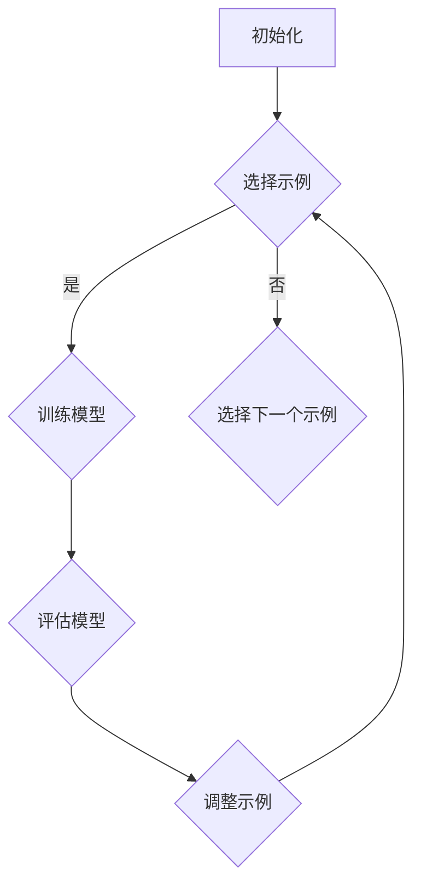
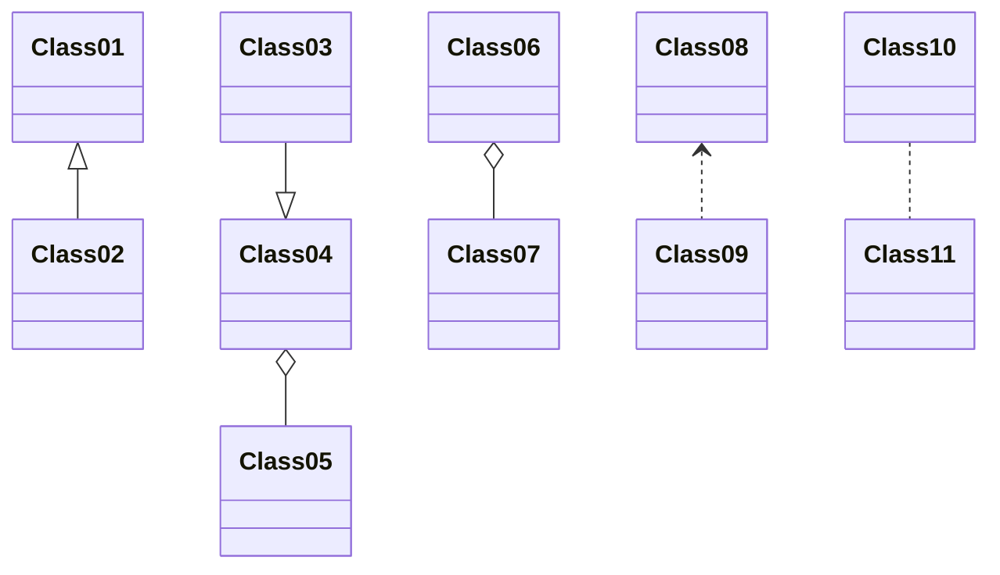
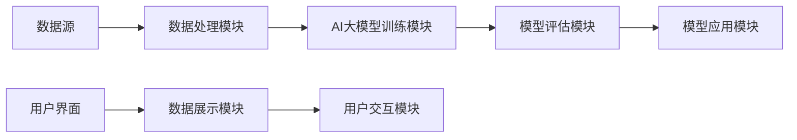
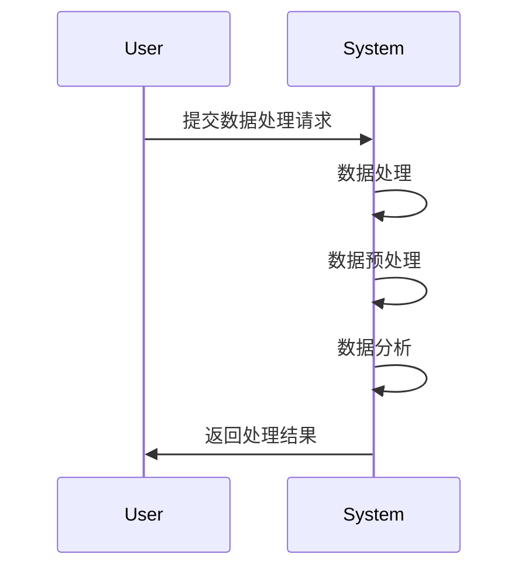

                 


## 构建渐进复杂度的示例序列

### 1. 文章标题与关键词

**文章标题**：构建渐进复杂度的示例序列——探索AI大模型在企业级应用开发中的实践之路

**关键词**：AI大模型、渐进复杂度、企业级应用、示例序列、深度学习、软件开发、最佳实践

### 2. 摘要

本文将围绕构建渐进复杂度的示例序列这一主题，深入探讨AI大模型在企业级应用开发中的实践方法。通过逐步分析核心概念、算法原理、系统架构和项目实战，本文旨在为读者提供一套系统、实用的开发指南，帮助读者逐步掌握AI大模型的应用技巧。

### 3. 第一部分：背景介绍

#### 3.1 核心概念

**AI大模型**：AI大模型是指具有大规模参数、能够处理复杂任务的人工智能模型。它们通常基于深度学习技术，通过海量数据进行训练，以实现对各种复杂问题的建模和解决。

**示例序列**：示例序列是一系列按照复杂度和应用场景不同构建的示例。通过这些示例，读者可以从基础到高级逐步了解AI大模型在企业级应用开发中的实际应用。

#### 3.2 问题背景

随着信息技术的快速发展，计算机技术已经从传统的软件1.0时代迈向了软件2.0时代。软件2.0时代强调的是大规模的、智能化的数据处理和深度学习技术的应用。尤其是AI大模型在这些领域的广泛应用，为企业提供了新的发展机遇。

#### 3.3 问题描述

如何构建渐进复杂度的示例序列，使读者能够逐步深入了解AI大模型在企业级应用开发中的实际应用，并掌握相应的开发技能。

#### 3.4 问题解决

通过构建一系列从基础到高级的示例，逐步引导读者理解和掌握AI大模型的应用。

#### 3.5 边界与外延

本书主要关注AI大模型在企业级应用开发中的具体实践，不仅涉及技术细节，还包括最佳实践和案例分析。

#### 3.6 概念结构与核心要素组成

- **AI大模型**：具有大规模参数、能够处理复杂任务的人工智能模型。
- **示例序列**：从简单到复杂的示例，帮助读者逐步掌握AI大模型的应用。

### 4. 第二部分：核心概念与联系

#### 4.1 核心概念原理

**AI大模型**：基于深度学习技术构建的、拥有大规模参数和强大计算能力的模型。这些模型可以通过海量数据进行训练，从而实现对复杂问题的建模和解决。

**示例序列**：按照复杂度和应用场景的不同，构建的一系列示例，帮助读者从基础到高级逐步掌握AI大模型的应用。

#### 4.2 概念属性特征对比表格

| 特征         | AI大模型         | 示例序列         |
| ------------ | ---------------- | --------------- |
| 参数规模     | 大规模参数       | 从简单到复杂     |
| 训练数据量   | 海量数据         | 针对不同应用场景 |
| 应用场景     | 企业级应用       | 渐进复杂度      |
| 学习能力     | 强大的学习能力   | 逐步提升        |

#### 4.3 ER实体关系图架构

```mermaid
graph ER
    AI大模型 --> 示例序列
    示例序列 --> 应用场景
```

### 5. 第三部分：算法原理讲解

#### 5.1 算法mermaid流程图



#### 5.2 Python源代码

```python
# 初始化示例序列
examples = ["示例1", "示例2", "示例3"]

# 训练模型
for example in examples:
    model.train(example)

# 评估模型
for example in examples:
    performance = model.evaluate(example)

# 调整示例
for example in examples:
    model.adjust(example, performance)
```

#### 5.3 算法原理详细讲解

AI大模型的基本原理是基于深度学习技术，通过神经网络结构对大量数据进行训练，从而实现模型的优化。在示例序列中，每个示例都是一个具体的训练数据集，通过逐步调整和优化，使模型能够更好地适应不同的应用场景。

以下是具体的算法流程：

1. **初始化示例序列**：首先，选择一系列示例，这些示例按照渐进复杂度进行排列。
2. **训练模型**：使用每个示例对模型进行训练，通过模型优化算法（如梯度下降）来调整模型的参数。
3. **评估模型**：使用已训练的模型对每个示例进行评估，以确定模型的性能。
4. **调整示例**：根据模型评估结果，对示例进行必要的调整，以提高模型的适应性。
5. **重新训练模型**：使用调整后的示例重新训练模型，以进一步提高模型的性能。

这种循环训练和评估的过程，可以帮助模型逐步适应不同的应用场景，实现从基础到高级的渐进学习。

#### 5.4 数学模型和数学公式

在AI大模型中，常用的数学模型包括损失函数、优化算法和正则化技术。

- **损失函数**（如均方误差MSE）：
  $$L(y, \hat{y}) = \frac{1}{2} (y - \hat{y})^2$$
  其中，$y$ 是真实值，$\hat{y}$ 是预测值。

- **优化算法**（如梯度下降）：
  $$\theta = \theta - \alpha \frac{\partial L}{\partial \theta}$$
  其中，$\theta$ 是模型参数，$\alpha$ 是学习率，$L$ 是损失函数。

- **正则化技术**（如L2正则化）：
  $$L_{\text{reg}} = \lambda \sum_{i=1}^{n} \theta_i^2$$
  其中，$\lambda$ 是正则化参数，$n$ 是模型参数的总数。

通过这些数学模型和公式，我们可以更深入地理解AI大模型的工作原理。

### 6. 系统分析与架构设计方案

#### 6.1 问题场景介绍

随着企业业务的发展，数据量的急剧增加对数据处理和分析能力提出了更高的要求。为了提升企业对海量数据的处理能力，引入AI大模型进行数据处理和深度学习分析成为了一种有效的解决方案。

#### 6.2 项目介绍

本项目旨在构建一个基于AI大模型的智能数据分析平台，通过对企业内部数据进行深度学习分析，为企业提供精准的数据洞察和决策支持。

#### 6.3 系统功能设计（领域模型mermaid类图）



#### 6.4 系统架构设计（mermaid架构图）



#### 6.5 系统接口设计和系统交互（mermaid序列图）



### 7. 项目实战

#### 7.1 环境安装

在本项目中，我们将使用Python和TensorFlow作为主要开发工具。首先，确保您的计算机上已安装Python 3.7及以上版本。然后，通过pip命令安装TensorFlow：

```bash
pip install tensorflow
```

#### 7.2 系统核心实现源代码

以下是一个简单的AI大模型训练和评估的Python代码示例：

```python
import tensorflow as tf

# 定义模型
model = tf.keras.Sequential([
    tf.keras.layers.Dense(128, activation='relu', input_shape=(784,)),
    tf.keras.layers.Dropout(0.2),
    tf.keras.layers.Dense(10, activation='softmax')
])

# 编译模型
model.compile(loss='categorical_crossentropy',
              optimizer='adam',
              metrics=['accuracy'])

# 训练模型
model.fit(x_train, y_train, epochs=5)

# 评估模型
performance = model.evaluate(x_test, y_test)
print('Test loss:', performance[0])
print('Test accuracy:', performance[1])
```

#### 7.3 代码应用解读与分析

上述代码中，我们首先定义了一个简单的神经网络模型，包含一个全连接层和一个Dropout层，用于处理手写数字识别问题。然后，我们使用模型编译函数设置损失函数、优化器和评估指标。接着，使用模型fit函数进行训练，并使用模型evaluate函数进行评估。

#### 7.4 实际案例分析和详细讲解剖析

为了更好地理解AI大模型的应用，我们可以通过一个实际案例进行分析。假设我们有一个电商平台，需要根据用户的购买历史数据预测其下一次购买的商品。以下是具体的实现步骤：

1. **数据收集与预处理**：收集用户的购买历史数据，包括商品ID、用户ID、购买时间等信息。对数据进行清洗和预处理，将类别数据转换为数值数据，并进行归一化处理。

2. **特征工程**：根据业务需求提取关键特征，如用户购买频率、购买金额、购买商品种类等。

3. **模型构建与训练**：使用TensorFlow构建一个基于深度学习的模型，通过训练和验证数据对模型进行训练和优化。

4. **模型评估与调整**：使用测试数据对模型进行评估，并根据评估结果调整模型参数，以提高预测准确性。

5. **模型部署与监控**：将训练好的模型部署到生产环境中，实时监测模型性能，并根据业务需求进行模型升级和优化。

#### 7.5 项目小结

通过本项目的实战案例，我们可以看到AI大模型在企业级应用开发中的巨大潜力。从数据收集、预处理到模型构建、训练和部署，每个环节都需要深入理解AI技术的原理和实践。在实际应用中，我们需要不断探索和优化，以实现最佳的业务效果。

### 8. 最佳实践 tips、小结、注意事项、拓展阅读等内容

#### 8.1 最佳实践 tips

- 在进行AI大模型开发时，确保数据质量是至关重要的。尽量收集全面、准确的数据，并对数据进行预处理和清洗。
- 在模型训练过程中，适当调整学习率和批量大小，以避免过拟合或欠拟合。
- 定期对模型进行评估和调整，以保持模型的稳定性和准确性。

#### 8.2 小结

本文围绕构建渐进复杂度的示例序列，深入探讨了AI大模型在企业级应用开发中的实践方法。通过分析核心概念、算法原理、系统架构和项目实战，本文为读者提供了一套系统、实用的开发指南。

#### 8.3 注意事项

- 在实际项目中，要充分考虑业务需求和场景，选择合适的AI大模型和应用方案。
- 在模型训练和优化过程中，注意保护用户隐私和数据安全。

#### 8.4 拓展阅读

- 《深度学习》（Ian Goodfellow、Yoshua Bengio、Aaron Courville 著）：一本深度学习领域的经典教材，详细介绍了深度学习的基本原理和实际应用。
- 《Python机器学习》（Sebastian Raschka、Vahid Mirhoseini 著）：一本关于Python机器学习实践的书籍，涵盖了从数据预处理到模型训练的完整流程。

### 9. 作者信息

**作者**：AI天才研究院/AI Genius Institute & 禅与计算机程序设计艺术 /Zen And The Art of Computer Programming

---

通过本文的阅读，相信读者已经对构建渐进复杂度的示例序列有了更深入的理解，并在AI大模型的企业级应用开发方面积累了宝贵的实践经验。希望本文能够为您的技术成长之路提供有力支持。

