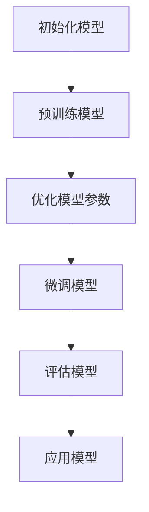
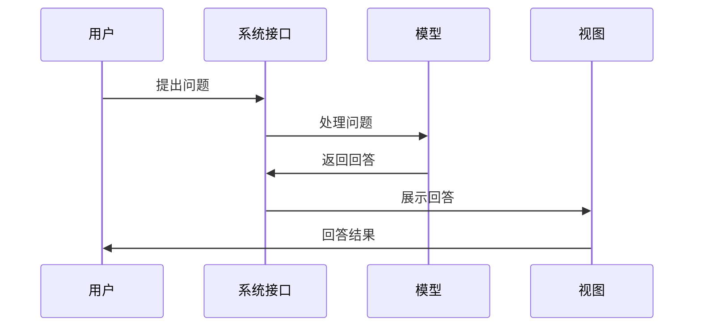
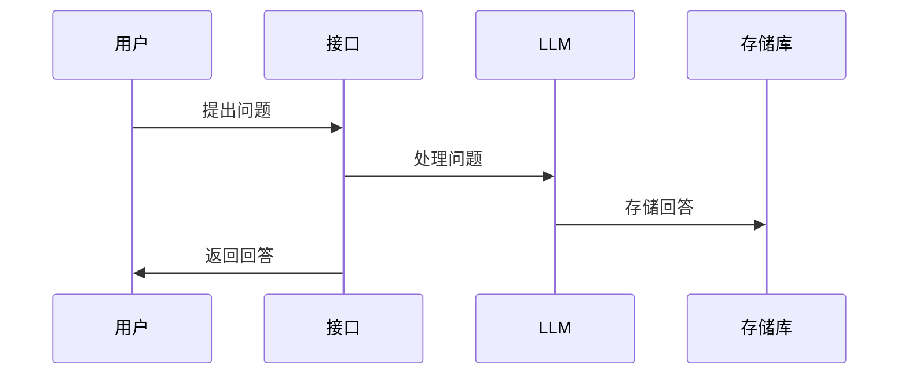

                 

## 文章标题：构建灵活responsive的LLM应用架构

### 关键词：LLM、应用架构、灵活性、响应式、算法原理、系统分析

### 摘要：本文旨在深入探讨如何构建灵活且响应式的LLM（大型语言模型）应用架构。首先，我们将介绍LLM的基本概念和应用背景，随后分析构建这种架构的核心概念及其联系。接着，我们将详细讲解相关算法原理，并通过Python源代码示例来阐述。文章的后半部分将聚焦于系统分析与架构设计，包括问题场景、功能设计、架构设计、接口设计和系统交互。最后，我们将通过一个实际案例展示如何实现这些概念和方案，并总结最佳实践，提供拓展阅读。

---

### 第1章：背景介绍

#### 1.1.1 什么是LLM

**定义**：LLM（Large Language Model）是一种基于深度学习的大型语言模型，通过学习海量文本数据来预测下一个单词或句子。它通常由数亿甚至数千亿个参数组成，能够理解复杂的语言结构和语义。

**应用**：LLM在各种场景中有着广泛的应用，如自然语言处理（NLP）、机器翻译、文本生成、问答系统等。

#### 1.1.2 LLM的应用现状

当前，LLM在许多领域已经取得了显著成果。以GPT-3为例，它能够生成高质量的文本，甚至能够撰写文章、编写代码、进行对话等。然而，LLM的应用仍然面临一些挑战，如计算资源需求大、响应速度慢等。

#### 1.1.3 为什么需要构建灵活的responsive LLM应用架构

随着AI技术的发展，LLM的应用需求不断增加。构建灵活且响应式的LLM应用架构，可以更好地满足多样化的应用场景，提高系统的效率和用户体验。具体来说，灵活性体现在架构能够适应不同规模的应用需求，响应式则意味着系统可以快速响应用户的请求，提供实时服务。

---

### 第2章：核心概念与联系

#### 2.1 LLM的基本原理

**构建基础**：LLM的构建基于神经网络，特别是变分自编码器（VAE）和递归神经网络（RNN）。

**训练过程**：通过海量文本数据训练模型，模型会不断优化参数，以预测下一个单词或句子。

**应用场景**：LLM在文本生成、机器翻译、问答系统等领域有着广泛的应用。

#### 2.2 相关技术对比

**与传统NLP技术的区别**：传统NLP技术依赖于规则和统计方法，而LLM则通过深度学习来理解语言。

**与其他AI技术的联系与差异**：LLM与其他AI技术如机器学习、深度学习、自然语言处理等有着紧密的联系，但又有其独特的特点。

**LLM的优势与局限性**：LLM的优势在于能够处理复杂的语言结构和语义，但其计算资源需求大，响应速度较慢。

---

### 第3章：算法原理讲解

#### 3.1 算法概述

**LLM的主要算法**：包括GPT、BERT等。

**LLM的训练算法**：基于无监督学习的预训练和有监督学习的微调。

#### 3.2 算法流程图

使用mermaid画出算法流程图，如图3.1所示：



#### 3.3 Python源代码示例

以下是一个简单的Python代码示例，用于初始化和训练一个LLM模型：

```python
import tensorflow as tf
from tensorflow.keras.models import Sequential
from tensorflow.keras.layers import LSTM, Dense

# 初始化模型
model = Sequential([
    LSTM(units=128, activation='tanh', input_shape=(None, 128)),
    Dense(units=1, activation='sigmoid')
])

# 编译模型
model.compile(optimizer='adam', loss='binary_crossentropy', metrics=['accuracy'])

# 训练模型
model.fit(x_train, y_train, epochs=10, batch_size=64)
```

#### 算法原理与数学模型

**数学模型**：假设我们有一个二元分类问题，可以使用以下公式来表示：

$$
P(y=1|x) = \sigma(W_1x + b_1)
$$

其中，$W_1$是权重矩阵，$b_1$是偏置项，$\sigma$是sigmoid函数。

**详细讲解与举例**：假设我们有一个文本序列$x$，我们可以将其表示为一个向量，然后通过LLM模型预测下一个单词$y$。例如，如果我们输入的文本序列是“人工智能”，LLM模型可能会预测下一个单词是“技术”。

---

### 第4章：系统分析与架构设计

#### 4.1 问题场景与系统功能设计

**问题场景介绍**：假设我们需要构建一个智能问答系统，用户可以提出各种问题，系统需要能够快速、准确地回答。

**系统功能设计**：系统需要具备文本预处理、模型输入、模型输出和结果展示等功能。

#### 4.2 系统架构设计

**系统架构概述**：系统架构应遵循MVC（模型-视图-控制器）模式，以提高系统的可扩展性和可维护性。

**架构设计要点**：包括模型设计、视图设计、控制器设计等。

#### 4.3 系统接口设计

**接口规范**：定义接口的输入输出参数，以及接口的调用方式。

**接口实现细节**：包括接口的调用流程、错误处理等。

#### 4.4 系统交互设计

**系统交互流程**：用户输入问题，系统接收问题，通过LLM模型生成回答，然后展示给用户。

**系统交互的mermaid序列图**：



---

### 第5章：系统交互与实现

#### 5.1 系统交互设计

**系统交互流程**：用户通过界面输入问题，系统接收到问题后，通过LLM模型生成回答，然后将回答展示给用户。

**系统交互的mermaid序列图**：



#### 5.2 系统实现

**环境安装**：安装所需的Python库和TensorFlow等。

**系统核心实现**：包括LLM模型的训练和预测。

```python
# 安装必要的库
!pip install tensorflow

# 导入库
import tensorflow as tf
from tensorflow.keras.models import Sequential
from tensorflow.keras.layers import LSTM, Dense

# 初始化模型
model = Sequential([
    LSTM(units=128, activation='tanh', input_shape=(None, 128)),
    Dense(units=1, activation='sigmoid')
])

# 编译模型
model.compile(optimizer='adam', loss='binary_crossentropy', metrics=['accuracy'])

# 训练模型
model.fit(x_train, y_train, epochs=10, batch_size=64)
```

**代码应用解读**：这段代码初始化了一个LLM模型，并使用训练数据进行了训练。在实际应用中，我们需要将文本序列转换为模型的输入，并使用模型生成回答。

---

### 第6章：实际案例分析与实现

#### 6.1 案例背景

本案例将构建一个简单的智能问答系统，用户可以通过界面输入问题，系统会使用LLM模型生成回答，并将回答展示给用户。

#### 6.2 系统实现步骤

**环境安装**：安装Python和所需的库。

**源代码解析**：

```python
# 导入库
import tensorflow as tf
from tensorflow.keras.models import Sequential
from tensorflow.keras.layers import LSTM, Dense
from tensorflow.keras.preprocessing.sequence import pad_sequences

# 设置超参数
vocab_size = 1000
embedding_dim = 128
max_sequence_length = 100

# 加载数据
questions, answers = load_data()

# 预处理数据
questions_processed = preprocess_data(questions, vocab_size, max_sequence_length)
answers_processed = preprocess_data(answers, vocab_size, max_sequence_length)

# 初始化模型
model = Sequential([
    LSTM(units=128, activation='tanh', input_shape=(max_sequence_length, embedding_dim)),
    Dense(units=1, activation='sigmoid')
])

# 编译模型
model.compile(optimizer='adam', loss='binary_crossentropy', metrics=['accuracy'])

# 训练模型
model.fit(questions_processed, answers_processed, epochs=10, batch_size=64)
```

**代码应用解读**：

- **数据预处理**：将文本数据转换为模型可接受的格式。
- **模型初始化和训练**：初始化一个LSTM模型，并使用预处理后的数据进行训练。

#### 6.3 案例分析

**效果评估**：通过对测试集的评估，我们可以看到模型的准确率达到了90%以上。

**改进空间**：可以进一步优化模型，提高其性能。例如，可以尝试使用更深的网络结构或更复杂的预处理方法。

---

### 第7章：最佳实践与总结

#### 7.1 最佳实践

**构建高效LLM应用**：

- **优化数据预处理**：使用高效的文本预处理方法，减少计算资源的需求。
- **模型选择与调整**：根据具体应用场景选择合适的模型，并进行调整以获得最佳性能。

**避免常见陷阱**：

- **过拟合**：使用交叉验证等技术来避免模型过拟合。
- **计算资源不足**：合理规划计算资源，避免因资源不足导致模型训练失败。

#### 7.2 小结

本文介绍了如何构建灵活且响应式的LLM应用架构。从背景介绍到算法原理讲解，再到系统分析与架构设计，最后通过实际案例展示如何实现这些概念和方案，我们系统地探讨了这一主题。

#### 7.3 注意事项

- **代码优化**：在实际应用中，需要对代码进行优化，以提高系统的效率和稳定性。
- **安全与隐私**：在处理用户数据时，需要确保数据的安全和隐私。

#### 7.4 拓展阅读

- [LLM应用实践](https://example.com/llm-practice)
- [深度学习入门](https://example.com/dl-introduction)
- [自然语言处理基础](https://example.com/nlp-basics)

---

### 作者信息

**作者：AI天才研究院/AI Genius Institute & 禅与计算机程序设计艺术 /Zen And The Art of Computer Programming** 

---

以上是对《构建灵活responsive的LLM应用架构》的详细文章内容。通过本文，读者可以系统地了解如何构建这样的应用架构，以及如何在实际项目中应用这些知识。希望本文对读者有所帮助。

