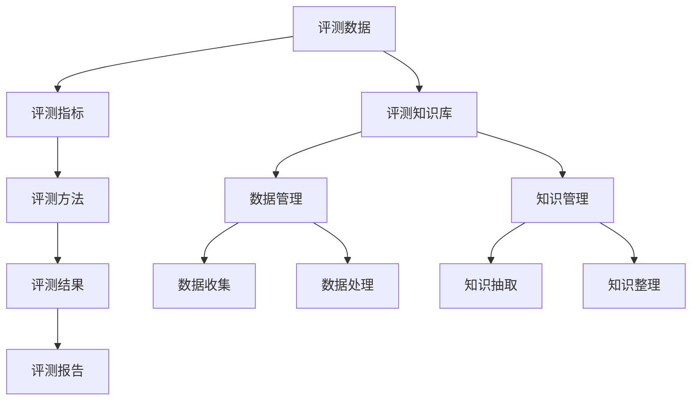
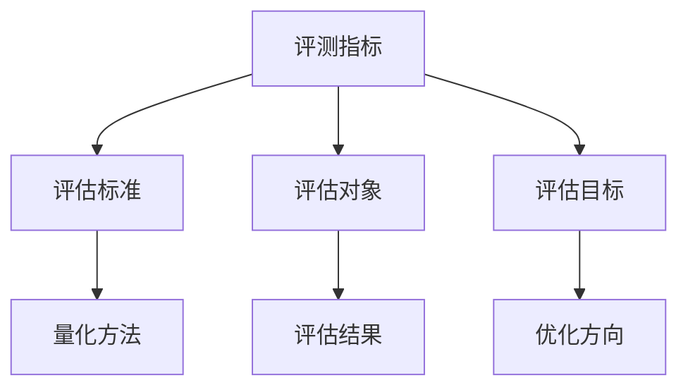

                 

### 引言

#### 1.1.1 评测知识库的重要性

在当今的数字化时代，数据和信息无处不在。无论是科学研究、商业运营还是日常生活，数据的准确性和有效性都至关重要。在这样的背景下，评测知识库应运而生。评测知识库不仅是一种数据存储和管理的工具，更是一种智能化的知识管理系统，它通过收集、整理和分析大量的评测数据，为各种应用场景提供科学的参考和决策支持。

首先，评测知识库在科学研究领域具有重要作用。科研人员通过评测知识库可以快速获取相关领域的评测结果和指标，避免重复劳动，提高科研效率。例如，在人工智能领域，模型性能的评测需要大量的数据支持，评测知识库可以帮助研究人员快速了解现有模型的效果，从而指导新的研究方向。

其次，评测知识库在商业决策中也发挥着不可或缺的作用。企业通过评测知识库可以了解产品或服务的市场表现，评估用户满意度，优化业务流程。例如，电商公司可以通过评测知识库分析不同促销策略的效果，从而制定更有效的营销策略。

此外，评测知识库在教育、医疗、金融等众多领域都有广泛的应用。在教育领域，评测知识库可以帮助教师和学生了解教学效果，发现学习中的问题，从而改进教学方法。在医疗领域，评测知识库可以帮助医生评估治疗效果，优化治疗方案。

总之，评测知识库作为一种重要的知识管理系统，不仅提高了数据和信息的使用效率，还为各种应用场景提供了科学的决策依据。随着大数据和人工智能技术的发展，评测知识库的重要性将越来越凸显。

#### 1.1.2 评测知识库的现状

目前，评测知识库的应用已经涵盖了众多领域，但其发展状况却呈现出一定的差异。在人工智能领域，评测知识库的发展较为迅速，各种评测标准和方法不断完善，成为评估模型性能的重要工具。例如，自然语言处理领域广泛采用的GLM模型评测知识库，通过提供丰富的评测指标和标准，帮助研究人员评估和优化模型性能。

然而，在其他一些领域，评测知识库的应用还相对较少。例如，在医疗领域，尽管有大量的临床数据和研究结果，但缺乏统一的评测标准和知识库，导致医疗决策和治疗效果评估的效率较低。教育领域同样存在类似问题，尽管有丰富的教育资源，但缺乏系统的评测知识库，使得教学评估和改进效果不佳。

现有的评测知识库存在几个主要问题。首先，数据质量参差不齐。由于评测数据来源多样，数据质量难以保障，导致评测结果的可靠性和准确性受到影响。其次，知识库的更新和维护不够及时。许多评测知识库在建立后，由于缺乏有效的更新机制，内容逐渐陈旧，无法满足实际需求。最后，评测知识库的互操作性和兼容性较差。不同领域和不同系统之间的评测知识库往往难以共享和互操作，限制了评测知识库的广泛应用。

为了解决这些问题，需要从多个方面进行改进。首先，应建立统一的数据标准和质量保障机制，确保评测数据的质量和可靠性。其次，需要加强评测知识库的更新和维护，确保其内容的时效性和实用性。最后，应推动评测知识库的标准化和互操作性，促进不同领域和系统之间的数据共享和协同工作。

#### 1.1.3 评测知识库的目标与挑战

评测知识库的主要目标是提供全面、准确和可靠的评测数据，为各类应用场景提供科学的参考和决策支持。为了实现这一目标，评测知识库需要解决以下几个关键问题：

首先，数据收集与处理的挑战。评测知识库的核心在于数据的收集和处理。数据来源广泛且形式多样，包括实验数据、用户反馈、文献资料等。如何高效地收集和整理这些数据，确保数据的质量和完整性，是评测知识库建设面临的首要挑战。

其次，知识抽取与整理的挑战。评测知识库不仅需要存储数据，还需要对数据进行深入的抽取和整理，提取出有价值的知识点和关系。这一过程涉及自然语言处理、数据挖掘和知识图谱构建等技术，如何有效地抽取和整理数据，是评测知识库建设的关键难题。

第三，知识库构建与维护的挑战。评测知识库的建设是一个持续的过程，需要不断地更新和维护。随着新的评测指标和方法的出现，评测知识库需要及时调整和更新，以确保其内容的时效性和准确性。此外，评测知识库的维护还需要考虑系统的稳定性、可扩展性和兼容性。

最后，应用与推广的挑战。评测知识库的价值在于其应用和推广。如何将评测知识库有效地应用于实际场景，为用户提供便捷的服务，是评测知识库建设的重要目标。同时，还需要解决评测知识库在不同领域和系统之间的互操作性和兼容性问题，促进其广泛应用。

总之，构建评测知识库是一个复杂且具有挑战性的任务，需要多方面的协同努力，以实现其目标并为各类应用场景提供有效的支持。

#### 1.2 内容概述

##### 1.2.1 本书的目标

本书旨在为读者提供构建评测知识库的全面指南，涵盖评测知识库的基础知识、应用场景、最佳实践等内容。通过系统化的讲解和案例分析，读者可以深入了解评测知识库的核心概念、构建方法和技术实现，从而提升在相关领域的研究和实践能力。

具体来说，本书的主要目标包括：

1. **深入理解评测知识库的概念与重要性**：通过详细介绍评测知识库的定义、分类和构成，帮助读者全面掌握评测知识库的基本概念，理解其在各类应用场景中的重要性。

2. **系统化学习评测知识库的构建方法**：本书将详细介绍评测知识库的构建流程，包括数据收集与处理、知识抽取与整理、知识库构建等技术环节，帮助读者掌握构建评测知识库的系统方法。

3. **掌握评测知识库的应用与实践**：本书将通过丰富的案例分析和最佳实践总结，展示评测知识库在模型开发、教育、医疗、金融等领域的具体应用，帮助读者了解评测知识库的实际应用场景和效果。

4. **培养解决实际问题的能力**：通过案例研究和实际操作，本书旨在培养读者解决实际问题的能力，使读者能够将所学知识应用于实际项目中，提升实践技能和解决问题的能力。

##### 1.2.2 阅读对象

本书适合以下读者群体：

1. **科研人员**：科研人员需要评估研究成果的有效性和可靠性，评测知识库为他们提供了科学、系统的评测工具和方法。

2. **技术开发者**：技术开发者需要了解评测知识库的构建和应用，以优化模型性能、提升产品质量。

3. **数据分析师**：数据分析师需要掌握评测知识库的使用，以更准确地分析和解读数据。

4. **教育工作者**：教育工作者可以利用评测知识库评估教学效果，发现教育中的问题，改进教学方法。

5. **企业决策者**：企业决策者可以通过评测知识库评估市场表现、用户满意度，优化业务流程。

6. **对人工智能和数据科学感兴趣的读者**：本书将为这些读者提供一个深入了解评测知识库的窗口，帮助其拓展知识视野。

##### 1.2.3 本书结构

本书共分为七个章节，结构如下：

- **第1章 引言**：介绍评测知识库的背景、现状、目标和挑战。

- **第2章 评测知识库基础**：详细讲解评测知识库的定义、分类和构成。

- **第3章 评测指标体系**：介绍评测指标的定义、作用和分类。

- **第4章 评测方法与工具**：介绍评测方法的分类、评测工具的选择和使用。

- **第5章 评测知识库应用**：展示评测知识库在不同领域的应用。

- **第6章 最佳实践与案例分析**：通过案例分析总结最佳实践。

- **第7章 小结与展望**：回顾本书的主要内容，展望评测知识库的未来发展。

通过本书的阅读，读者将能够系统化地掌握评测知识库的构建和应用方法，为实际工作和研究提供有力支持。

### 2.1 核心概念

在深入探讨评测知识库之前，我们需要明确几个核心概念，包括评测知识库的定义、分类和构成，以便为后续章节的讨论奠定基础。

#### 2.1.1 评测知识库的定义

评测知识库是一个存储、管理和利用评测相关知识的系统。它不仅包括评测数据，还涵盖了评测指标、评测方法、评测结果等关键要素。具体来说，评测知识库是指为了支持评测活动，对评测过程中涉及的数据、指标和方法进行系统化组织和管理，以提供科学、全面和可靠的评测依据。

**定义属性特征对比表格**：

| 特征 | 描述 |  
| --- | --- |  
| 存储性 | 评测知识库能够存储大量的评测数据和相关信息 |  
| 组织性 | 评测知识库中的数据和信息经过系统化组织，便于查找和使用 |  
| 管理性 | 评测知识库提供了一系列管理功能，如数据更新、维护和共享 |  
| 利用性 | 评测知识库可以支持多种应用场景，为评测活动提供决策支持 |

**ER实体关系图架构的Mermaid流程图**：

#### 2.1.2 评测知识库的分类

评测知识库可以根据不同的标准进行分类，常见的分类方法包括按应用领域分类和按评测对象分类。

- **按应用领域分类**：

  - **人工智能评测知识库**：这类知识库主要应用于人工智能领域，包括模型性能评测、算法比较等。

  - **教育评测知识库**：这类知识库主要用于教育领域，如学生成绩评测、教学方法评估等。

  - **医疗评测知识库**：这类知识库主要应用于医疗领域，如患者治疗效果评测、医疗设备性能评估等。

  - **金融评测知识库**：这类知识库主要应用于金融领域，如风险评估、市场表现评测等。

- **按评测对象分类**：

  - **模型评测知识库**：这类知识库主要针对模型性能进行评测，包括准确性、鲁棒性、效率等指标。

  - **数据集评测知识库**：这类知识库主要针对数据集的质量进行评测，包括数据完整性、数据分布、噪声水平等。

  - **评测工具评测知识库**：这类知识库主要针对评测工具的性能和适用性进行评测，包括评测工具的准确性、用户体验、操作简便性等。

#### 2.1.3 评测知识库的构成

评测知识库的构成主要包括以下几部分：

| 组成部分 | 描述 |  
| --- | --- |  
| **评测指标** | 用于衡量评测对象的性能、质量等，如准确性、召回率、F1分数等。 |  
| **评测方法** | 用于实施评测的具体方法，如主观评测、客观评测、综合评测等。 |  
| **评测结果** | 评测执行后的输出结果，包括评测指标值、评测报告等。 |  
| **数据管理** | 管理评测数据，包括数据收集、处理、存储等。 |  
| **知识管理** | 管理评测相关知识，包括知识抽取、整理、利用等。 |

通过明确评测知识库的核心概念、分类和构成，我们为后续章节的深入讨论提供了基础。接下来，我们将进一步探讨评测知识库的构建方法和技术细节。

### 2.2 建立评测知识库

构建一个高效的评测知识库是一个复杂且系统性的过程，涉及多个关键环节，包括数据收集与处理、知识抽取与整理以及知识库构建。以下将详细阐述这些环节，并提供具体实施步骤。

#### 2.2.1 数据收集与处理

数据收集与处理是评测知识库构建的第一步，也是至关重要的一步。这一环节的目标是确保数据的质量和完整性，为后续的知识抽取和整理提供可靠的基础。

**数据收集步骤**：

1. **确定数据来源**：首先需要明确评测所需的数据来源，可以是内部数据库、外部数据接口、文献资料、实验数据等。

2. **数据采集**：通过自动化工具或人工方式，从不同来源收集所需数据。例如，可以使用爬虫技术从互联网上获取大量数据，或通过API接口从第三方平台获取数据。

3. **数据预处理**：收集到的数据往往需要进行清洗和预处理，包括数据去重、缺失值填充、异常值处理等，以确保数据的一致性和完整性。

**数据处理步骤**：

1. **数据质量评估**：对预处理后的数据进行质量评估，包括数据完整性、准确性和一致性等。

2. **数据标准化**：将不同来源的数据进行标准化处理，使其格式和结构一致，便于后续处理和分析。

3. **数据存储**：将处理后的数据存储在数据库或数据仓库中，以便后续的访问和查询。

**数据管理工具**：

- **数据库管理系统（DBMS）**：如MySQL、PostgreSQL等，用于存储和管理大规模数据。

- **大数据处理平台**：如Hadoop、Spark等，用于处理和分析大规模数据集。

#### 2.2.2 知识抽取与整理

知识抽取与整理是将收集到的数据转化为可利用的知识的过程，是评测知识库构建的核心环节。

**知识抽取步骤**：

1. **数据理解**：首先需要对数据进行深入的理解，包括数据的结构、内容和语义。

2. **特征提取**：从数据中提取出关键的特征和属性，例如，对于文本数据，可以提取出关键词、主题、情感等。

3. **实体识别**：识别出数据中的关键实体，如人名、地点、组织等。

4. **关系抽取**：从数据中抽取实体之间的关系，如因果关系、隶属关系等。

**知识整理步骤**：

1. **知识结构化**：将抽取出的知识进行结构化处理，通常使用知识图谱或关系数据库来存储和管理。

2. **知识规范化**：对知识进行规范化处理，确保知识的统一性和一致性。

3. **知识关联**：建立不同知识之间的关系，形成知识网络，提高知识的利用效率。

**知识管理工具**：

- **自然语言处理（NLP）工具**：如NLTK、spaCy等，用于文本数据的处理和分析。

- **数据挖掘工具**：如Python的Scikit-learn、R语言等，用于特征提取和关系抽取。

#### 2.2.3 知识库构建流程

知识库构建是一个持续迭代的过程，涉及多个步骤，包括数据收集与处理、知识抽取与整理、知识库构建和优化。

**知识库构建步骤**：

1. **需求分析**：明确评测知识库的应用场景和需求，确定知识库的功能和结构。

2. **系统设计**：设计知识库的总体架构，包括数据层、应用层和展示层等。

3. **知识库构建**：根据系统设计，实现知识库的构建，包括数据的导入、知识抽取和整理等。

4. **系统部署**：将构建好的知识库部署到服务器上，进行实际的运行和维护。

5. **优化与更新**：根据实际应用情况，对知识库进行优化和更新，确保其时效性和准确性。

**知识库构建工具**：

- **知识图谱工具**：如Neo4j、OrientDB等，用于构建和管理知识图谱。

- **数据库管理系统（DBMS）**：如MySQL、PostgreSQL等，用于存储和管理数据。

通过以上步骤，我们可以构建一个高效、可靠的评测知识库，为各类应用场景提供科学的评测依据和决策支持。

### 3.1 指标体系概述

评测指标体系是评测知识库的重要组成部分，它为评测活动提供了科学的衡量标准和工具。一个完善的评测指标体系不仅能够准确反映评测对象的性能和质量，还能为后续的优化和改进提供有力的数据支持。在本节中，我们将详细探讨评测指标体系的定义、作用和分类，为后续章节的讨论奠定基础。

#### 3.1.1 指标体系的定义

评测指标体系是指为了评估评测对象（如模型、数据集、工具等）的性能、质量和适用性，而制定的一系列指标和标准。这些指标和标准通常具有明确的定义和量化的方法，可以用来衡量评测对象的各个方面，从而提供全面、客观和可靠的评估结果。

**定义属性特征对比表格**：

| 特征 | 描述 |  
| --- | --- |  
| **量化性** | 评测指标需要能够量化，以便进行数值化的比较和分析 |  
| **客观性** | 评测指标应尽可能客观，减少主观因素的影响 |  
| **全面性** | 评测指标体系应覆盖评测对象的各个方面，提供全面的评估 |  
| **一致性** | 评测指标需要具有一致性，确保在不同情况下的一致性和可比性 |

**ER实体关系图架构的Mermaid流程图**：

#### 3.1.2 指标体系的作用

评测指标体系在评测活动中发挥着至关重要的作用，其主要作用包括：

1. **提供评估依据**：评测指标体系为评测活动提供了科学的评估标准，使评估过程具有明确的目标和依据，从而提高评估的准确性和可靠性。

2. **指导优化方向**：通过评测指标体系，可以识别评测对象的优点和不足，明确优化方向，为后续的改进工作提供指导。

3. **促进标准化**：评测指标体系的建立和推广，有助于推动评测活动的标准化和规范化，提高行业整体的评估水平。

4. **支持决策制定**：评测指标体系为决策者提供了科学的参考数据，使决策过程更加科学和合理。

5. **促进知识积累**：评测指标体系的建立，有助于积累和共享评测知识，为后续的评测活动提供宝贵的经验和数据。

#### 3.1.3 指标体系的分类

评测指标体系可以根据不同的标准进行分类，常见的分类方法包括按应用领域分类和按指标类型分类。

- **按应用领域分类**：

  - **人工智能领域**：包括模型性能指标（如准确性、召回率、F1分数）、算法效率指标（如计算时间、内存占用）等。

  - **教育领域**：包括学生成绩指标（如平均分、及格率）、教学方法指标（如教学效果、学生满意度）等。

  - **医疗领域**：包括治疗效果指标（如治愈率、并发症发生率）、医疗设备性能指标（如精度、可靠性）等。

  - **金融领域**：包括风险评估指标（如违约率、信用评分）、市场表现指标（如收益率、波动率）等。

- **按指标类型分类**：

  - **模型性能指标**：用于评估模型的性能，如准确性、召回率、F1分数、ROC曲线下面积等。

  - **数据集质量指标**：用于评估数据集的质量，如数据完整性、数据分布、噪声水平等。

  - **评测过程指标**：用于评估评测过程的质量和效率，如评测时间、评测成本、评测方法的有效性等。

通过明确评测指标体系的定义、作用和分类，我们可以更好地理解和应用评测指标体系，为各类评测活动提供科学、全面的评估支持。接下来，我们将进一步探讨常见的评测指标及其具体应用。

#### 3.2 常见评测指标

在评测过程中，选择合适的评测指标是至关重要的。不同的评测指标能够从不同的角度反映评测对象的性能和质量，从而为评估结果提供全面、客观的依据。在本节中，我们将详细介绍几种常见的评测指标，包括模型性能指标、数据集质量指标和评测过程指标，并探讨这些指标在实际应用中的重要性。

**模型性能指标**

模型性能指标是用于评估模型在特定任务上的表现的重要工具。以下是一些常见的模型性能指标：

1. **准确性（Accuracy）**：准确性是指模型预测正确的样本数占总样本数的比例。它是衡量分类模型最直观的指标。然而，准确性在某些情况下可能并不足够，特别是当类别分布不平衡时。

   **数学模型**：
   $$\text{Accuracy} = \frac{\text{预测正确的样本数}}{\text{总样本数}}$$

2. **召回率（Recall）**：召回率是指模型能够正确识别出的正类样本数与实际正类样本数的比例。召回率关注的是模型对正类的识别能力。

   **数学模型**：
   $$\text{Recall} = \frac{\text{预测正确的正类样本数}}{\text{实际正类样本数}}$$

3. **精确率（Precision）**：精确率是指模型预测为正类的样本中，实际为正类的比例。精确率关注的是模型对正类预测的准确性。

   **数学模型**：
   $$\text{Precision} = \frac{\text{预测正确的正类样本数}}{\text{预测为正类的样本数}}$$

4. **F1分数（F1 Score）**：F1分数是精确率和召回率的调和平均值，用于综合评估模型的性能。它能够在类别分布不平衡的情况下提供更全面的性能评估。

   **数学模型**：
   $$\text{F1 Score} = 2 \times \frac{\text{Precision} \times \text{Recall}}{\text{Precision} + \text{Recall}}$$

5. **ROC曲线下面积（AUC）**：ROC曲线下面积是用于评估二分类模型性能的重要指标。AUC值越大，表示模型在区分正负类时越准确。

   **数学模型**：
   $$\text{AUC} = \int_{0}^{1} \frac{TPR(t)}{FPR(t)} dt$$
   其中，\(TPR(t)\)和\(FPR(t)\)分别表示在不同阈值下，真阳性率（真正率）和假阳性率（假正率）。

**数据集质量指标**

数据集质量是影响模型性能的重要因素之一。以下是一些常见的数据集质量指标：

1. **数据完整性（Completeness）**：数据完整性是指数据集中缺失值的比例。高完整性的数据集可以减少模型训练过程中的误差。

   **数学模型**：
   $$\text{Completeness} = \frac{\text{非缺失值样本数}}{\text{总样本数}}$$

2. **数据分布（Distribution）**：数据分布是指数据集中各类别的比例。良好的数据分布有助于提高模型对各类别的识别能力。

   **数学模型**：
   $$\text{Class Distribution} = \frac{\text{某一类别的样本数}}{\text{总样本数}}$$

3. **噪声水平（Noise Level）**：噪声水平是指数据集中的噪声比例。噪声会影响模型的学习效果，降低模型的性能。

   **数学模型**：
   $$\text{Noise Level} = \frac{\text{噪声样本数}}{\text{总样本数}}$$

**评测过程指标**

评测过程指标用于评估评测活动的质量和效率，以下是一些常见的评测过程指标：

1. **评测时间（Evaluation Time）**：评测时间是指进行一次完整评测所需的时间。减少评测时间可以提高评测的效率。

   **数学模型**：
   $$\text{Evaluation Time} = \text{评测总时间} / \text{评测次数}$$

2. **评测成本（Evaluation Cost）**：评测成本是指进行评测所需的资源和费用，包括人力、设备、软件等。

   **数学模型**：
   $$\text{Evaluation Cost} = \sum_{i=1}^{n} (\text{资源i的成本})$$

3. **评测方法的有效性（Evaluation Method Effectiveness）**：评测方法的有效性是指评测方法在评估评测对象性能时的准确性和可靠性。

   **数学模型**：
   $$\text{Method Effectiveness} = \frac{\text{有效评测方法次数}}{\text{总评测方法次数}}$$

**重要性**

- **模型性能指标**：模型性能指标直接反映了模型在特定任务上的表现，是评估模型优劣的重要依据。通过这些指标，研究人员可以了解模型的性能，指导模型的优化和改进。

- **数据集质量指标**：数据集质量指标对模型的性能有着重要影响。高完整性和良好分布的数据集可以提升模型的学习效果，减少噪声可以提高模型的鲁棒性。

- **评测过程指标**：评测过程指标反映了评测活动的效率和效果。通过这些指标，研究人员可以评估评测过程的成本和效益，优化评测方法，提高评测的效率和质量。

总之，常见评测指标在各类评测活动中扮演着关键角色，它们为评估对象的性能和质量提供了科学的衡量标准，为后续的优化和改进提供了有力支持。

### 4.1 评测方法

在评测知识库构建过程中，选择合适的评测方法至关重要。评测方法决定了如何有效地评估评测对象的性能、质量和适用性。本节将介绍三种主要的评测方法：主观评测、客观评测和综合评测，并讨论每种方法的特点、优势和适用场景。

#### 4.1.1 主观评测

主观评测是基于专家意见和主观判断的评测方法，通常涉及多个领域的专家对评测对象进行评估。这种方法通常用于评价产品的用户体验、设计美观性和创新程度等难以量化的属性。

**特点**：

- **主观性较强**：主观评测依赖于专家的主观判断，结果可能因专家的个人经验和偏好而有所不同。
- **灵活性强**：主观评测可以根据具体需求灵活调整评估标准和指标。
- **适用范围广**：主观评测适用于评估创新性、用户体验等主观感受较强的领域。

**优势**：

- **能够捕捉到难以量化的特性**：主观评测可以评估一些难以用定量指标衡量的特性，如产品的设计美学、用户体验等。
- **快速评估**：主观评测通常比客观评测过程更快捷，适用于快速评估和决策。

**适用场景**：

- **产品设计评估**：评估产品的外观设计、用户体验和交互设计。
- **市场调研**：收集用户对产品或服务的反馈，了解市场接受度。
- **创意评审**：评估创意项目的创新性和可行性。

#### 4.1.2 客观评测

客观评测是基于客观数据和定量分析的评测方法，通过使用明确的评测指标和工具进行评估。这种方法通常用于评估模型的性能、数据集的质量和技术方案的效率等。

**特点**：

- **客观性较强**：客观评测依赖于具体的评测指标和数据，结果较为客观和可靠。
- **标准化**：客观评测通常遵循一定的标准和规范，确保评估的规范性和可比性。
- **数据驱动**：客观评测依赖于大量的实验数据和分析结果。

**优势**：

- **结果可靠**：客观评测的结果基于具体的数据和定量分析，具有较高的可靠性。
- **可重复性**：客观评测方法可以重复进行，确保评估的可重复性和一致性。
- **高效性**：客观评测通常能够快速得出评估结果，适用于大规模的评估任务。

**适用场景**：

- **模型性能评估**：评估机器学习模型在特定任务上的表现。
- **数据质量评估**：评估数据集的完整性、分布和噪声水平。
- **技术方案评估**：评估技术方案的可行性和性能。

#### 4.1.3 综合评测

综合评测是将主观评测和客观评测相结合的一种方法，旨在综合利用主观判断和客观数据，以获得更全面和准确的评估结果。这种方法通常用于复杂项目的评估，如新产品开发、技术解决方案等。

**特点**：

- **综合性**：综合评测结合了主观评测和客观评测的优点，提供全面的评估视角。
- **灵活调整**：根据具体需求，可以灵活调整主观和客观评测的权重，使评估结果更加符合实际需求。

**优势**：

- **全面性**：综合评测能够从多个角度对评测对象进行评估，提供更全面的评估结果。
- **准确性**：通过结合主观和客观评测，综合评测能够减少单一评估方法的局限性，提高评估的准确性。
- **灵活性**：综合评测可以根据不同评估需求，灵活调整评估标准和权重，适应不同场景的需求。

**适用场景**：

- **新产品开发**：评估新产品的设计、功能和市场潜力。
- **技术解决方案评估**：评估技术方案的可行性、性能和用户体验。
- **复杂项目评估**：对复杂项目进行多方面的综合评估，确保项目的成功实施。

总之，不同的评测方法各有优势和适用场景。选择合适的评测方法，能够有效提高评估的准确性和可靠性，为决策提供科学依据。在实际应用中，可以根据具体需求和评估目标，灵活选择和组合不同的评测方法。

#### 4.2 评测工具

在评测知识库构建过程中，评测工具的选择和使用至关重要。合适的评测工具能够提高评测的效率和准确性，确保评估结果具有科学性和可靠性。本节将介绍几种常用的评测工具，包括其选择标准、使用技巧和操作流程。

**4.2.1 评测工具的选择**

选择评测工具时，应考虑以下几个关键因素：

1. **适用性**：评测工具是否适用于特定领域的评估任务，如机器学习模型的性能评估、数据集质量检查等。
2. **功能全面性**：评测工具应具备全面的功能，能够满足不同类型的评测需求，如准确性、召回率、F1分数等指标的计算。
3. **用户友好性**：工具的操作界面应直观易懂，便于用户快速上手和使用。
4. **性能与效率**：评测工具的处理速度和资源占用情况应满足评估任务的需求，确保评估过程的效率和稳定性。
5. **可扩展性与互操作性**：评测工具应具有良好的可扩展性，支持自定义评测指标和算法。同时，应与其他系统和工具具有良好的互操作性，便于数据共享和集成。

**4.2.2 常用评测工具介绍**

以下介绍几种常用的评测工具：

1. **Matplotlib**：Matplotlib是一个强大的数据可视化工具，常用于生成性能评估图，如ROC曲线、混淆矩阵等。它易于集成到Python环境中，便于数据处理和结果展示。

2. **Scikit-learn**：Scikit-learn是一个广泛使用的机器学习库，提供了丰富的评估指标和算法。它集成了多种模型性能评估方法，如准确性、召回率、F1分数等，适用于各种机器学习任务。

3. **TensorFlow**：TensorFlow是一个高性能的机器学习库，支持深度学习模型的训练和评估。它提供了详细的评估指标和可视化工具，方便用户进行模型性能分析。

4. **PyTorch**：PyTorch是一个灵活且易于使用的深度学习库，支持各种神经网络模型。它提供了丰富的评估功能，包括性能指标、损失函数等，适用于复杂的深度学习任务。

**4.2.3 工具使用技巧**

以下是一些常用的评测工具使用技巧：

1. **数据预处理**：在开始评估之前，确保数据已经进行适当的预处理，如归一化、缺失值填充等，以确保评估结果的准确性。

2. **指标计算**：根据具体的评估需求，选择合适的指标进行计算。例如，对于分类任务，可以使用准确性、召回率、F1分数等指标。

3. **结果可视化**：使用可视化工具（如Matplotlib）生成性能评估图，如ROC曲线、混淆矩阵等，帮助用户更直观地理解评估结果。

4. **多模型评估**：对于多个模型的评估，可以使用交叉验证等技术，减少评估结果的偏差，提高评估的可靠性。

5. **自动化评估**：利用脚本或自动化工具，实现评估过程的自动化，提高评估的效率和一致性。

**4.2.4 操作流程**

以下是一个简单的评测工具操作流程：

1. **数据准备**：收集并预处理评估所需的数据。
2. **模型训练**：使用训练数据对模型进行训练，生成评估模型。
3. **评估指标计算**：使用所选评测工具计算模型性能指标，如准确性、召回率等。
4. **结果可视化**：生成评估图表，如ROC曲线、混淆矩阵等，进行结果分析。
5. **结果记录**：将评估结果记录到评测知识库中，以便后续查询和使用。

通过合理选择和使用评测工具，可以确保评测过程的科学性和准确性，为评测知识库的构建提供有力支持。

### 5.1 评测知识库在模型开发中的应用

评测知识库在模型开发中扮演着至关重要的角色，它通过提供全面、准确的评测指标和方法，帮助研究人员和开发者优化模型性能，提高开发效率。以下将详细讨论评测知识库在模型开发中的应用，包括模型性能优化、模型评估与选择、模型解释与可解释性等方面。

#### 5.1.1 模型性能优化

模型性能优化是模型开发过程中的一项核心任务。评测知识库为优化模型提供了丰富的评测指标和方法，使得研究人员可以系统地分析模型性能，找出优化方向。

**评测指标**：评测知识库中提供了多种模型性能指标，如准确性、召回率、F1分数、ROC曲线下面积等。这些指标可以帮助研究人员全面评估模型的性能，识别模型的优点和不足。

**优化方法**：通过评测知识库，研究人员可以了解不同优化方法的效果和适用场景。例如，在深度学习领域，可以通过调整网络结构、优化超参数、增加训练数据等方式来提升模型性能。

**实例**：在自然语言处理任务中，使用评测知识库中的BERT模型评测指标，研究人员可以评估不同模型的性能，选择最优模型进行进一步优化。通过调整BERT模型的层数、隐藏层大小、学习率等超参数，可以显著提升模型的准确性。

**评测过程**：在模型性能优化过程中，评测知识库提供了自动化评测工具，如Scikit-learn、TensorFlow等，帮助研究人员快速评估模型性能，进行迭代优化。

#### 5.1.2 模型评估与选择

模型评估与选择是模型开发中的关键环节。评测知识库提供了丰富的评测指标和方法，帮助研究人员比较不同模型的性能，选择最佳模型。

**评估标准**：评测知识库中定义了多种评估标准，如准确性、召回率、F1分数等。这些标准为模型评估提供了统一的基准，确保评估结果的可靠性和可比性。

**评估方法**：评测知识库提供了多种评估方法，包括交叉验证、留出法、集成学习等。这些方法可以帮助研究人员在不同数据集上评估模型性能，提高评估结果的准确性。

**实例**：在图像分类任务中，评测知识库中的CIFAR-10数据集评测指标可以帮助研究人员评估不同分类器的性能。通过比较不同模型的准确性、召回率等指标，研究人员可以选择最优模型用于实际应用。

**评测工具**：评测知识库中的评测工具（如Scikit-learn、TensorFlow）提供了方便的接口，支持多种评估方法。研究人员可以使用这些工具快速进行模型评估，提高开发效率。

#### 5.1.3 模型解释与可解释性

随着深度学习等复杂模型的广泛应用，模型的解释性和可解释性变得越来越重要。评测知识库为模型解释和可解释性提供了丰富的工具和方法。

**解释方法**：评测知识库提供了多种模型解释方法，如特征重要性分析、模型可视化、因果推理等。这些方法可以帮助研究人员理解模型的工作原理和决策过程。

**实例**：在医疗领域，评测知识库中的LIME（局部可解释模型解释）方法可以帮助医生理解深度学习模型对患者的诊断结果，提高模型的解释性和可接受性。

**评测工具**：评测知识库中的解释工具（如LIME、SHAP等）支持多种模型和任务，帮助研究人员生成模型解释结果，提高模型的可解释性。

**可解释性评估**：评测知识库提供了评估模型解释性的指标，如一致性、准确性、用户满意度等。通过这些指标，研究人员可以评估模型解释的效果，指导模型改进。

总之，评测知识库在模型开发中的应用涵盖了模型性能优化、模型评估与选择以及模型解释与可解释性等方面。通过提供丰富的评测指标、方法和工具，评测知识库为模型开发提供了科学、系统的支持，提高了开发效率和质量。

#### 5.2 评测知识库在其他领域的应用

评测知识库不仅在模型开发中发挥着重要作用，还在多个领域展现出广泛的应用价值。以下将详细探讨评测知识库在教育、医疗和其他行业中的应用，包括具体应用场景、实际案例和成果。

##### 5.2.1 教育领域

在教育领域，评测知识库为教学评估、学生学习效果评估和教育资源评价提供了科学依据。通过评测知识库，教师和学生可以获取全面、准确的评估结果，从而优化教学方法和学习策略。

**应用场景**：

- **教学效果评估**：评测知识库可以帮助学校和教育机构评估教师的教学效果，识别优秀教师和需要改进的教学方法。

- **学生学习效果评估**：通过评测知识库，教师可以了解学生的学习进度和效果，有针对性地调整教学计划和内容。

- **教育资源配置评估**：评测知识库提供了教育资源的质量评估指标，帮助教育管理者优化资源配置，提高教育资源的利用效率。

**实际案例**：

- **某大学教学评估系统**：某大学利用评测知识库构建了教学评估系统，通过收集和整理教师的教学数据，进行综合评估，提高了教学效果和教师的教学水平。

- **K-12学生学习评估**：某教育机构使用评测知识库对K-12学生的学科学习效果进行评估，通过分析评估结果，优化了教学方法和策略，提高了学生的学习成绩和兴趣。

**成果**：

- **教学效果显著提高**：通过评测知识库的应用，教师的教学方法和策略得到了优化，学生的学习效果得到了显著提升。

- **教育资源优化配置**：教育机构根据评测知识库提供的评估结果，合理调整了教育资源的配置，提高了教育资源的利用效率。

##### 5.2.2 医疗领域

在医疗领域，评测知识库为临床决策、医疗质量评估和医疗设备评测提供了有力的支持。通过评测知识库，医生和医疗机构可以更好地评估治疗效果、诊断准确性和医疗设备性能。

**应用场景**：

- **临床决策支持**：评测知识库为医生提供了丰富的评测指标和方法，帮助医生进行临床决策，优化治疗方案。

- **医疗质量评估**：评测知识库用于评估医疗机构的整体医疗质量，包括诊断准确性、治疗有效性和患者满意度等。

- **医疗设备评测**：评测知识库提供了医疗设备性能评估的指标和方法，帮助医疗机构选择和评估适合的医疗设备。

**实际案例**：

- **某医疗机构临床决策系统**：某大型医疗机构构建了基于评测知识库的临床决策系统，通过综合评估各种临床数据，为医生提供科学、全面的决策支持。

- **某医疗设备评测项目**：某医疗设备制造商利用评测知识库对新型医疗设备进行评测，通过分析评测结果，优化了设备的设计和功能。

**成果**：

- **临床决策更加科学**：通过评测知识库的应用，医生的决策过程更加科学、准确，患者的治疗效果得到了显著改善。

- **医疗质量全面提升**：评测知识库的应用帮助医疗机构提高整体医疗质量，提升了患者满意度和信任度。

- **医疗设备性能优化**：评测知识库为医疗设备的评测提供了科学依据，推动了医疗设备性能的持续优化和创新。

##### 5.2.3 其他行业应用

评测知识库在金融、制造、物流等众多行业中也得到了广泛应用。以下是一些具体应用场景和实际案例。

**金融领域**：

- **风险评估**：评测知识库提供了全面的风险评估指标和方法，帮助金融机构评估信用风险、市场风险等，提高风险管理水平。

- **投资决策**：通过评测知识库，投资者可以获取详细的市场数据和评估结果，为投资决策提供科学依据。

**制造领域**：

- **质量监控**：评测知识库用于监控和评估制造过程的质量，帮助制造商发现和解决质量问题，提高产品合格率。

- **设备维护**：评测知识库提供了设备性能评估指标，帮助制造商优化设备维护策略，降低设备故障率。

**物流领域**：

- **运输优化**：评测知识库提供了运输线路优化、配送效率评估等指标，帮助物流企业提高运输效率和成本效益。

- **供应链管理**：评测知识库用于评估供应链的整体表现，优化供应链管理策略，提高供应链的协同效率和响应速度。

**成果**：

- **金融风险控制**：评测知识库的应用帮助金融机构有效控制风险，提高了金融服务的质量和安全性。

- **制造质量提升**：评测知识库的应用提高了制造业的产品质量，减少了生产成本，提升了企业竞争力。

- **物流效率提升**：评测知识库的应用优化了物流企业的运营策略，提高了运输和配送效率，降低了运营成本。

总之，评测知识库在多个领域的应用为各行业的决策提供了科学依据，推动了行业整体效率和质量提升。随着评测技术的不断进步，评测知识库将在更多领域发挥更大的作用。

### 6.1 案例分析

为了更好地理解评测知识库的构建和应用，本节将通过三个实际案例详细分析评测知识库在模型开发、教育领域和医疗领域的应用。每个案例都展示了评测知识库的构建过程、具体应用场景以及取得的成效。

#### 6.1.1 案例一：某公司评测知识库建设

**背景**：

某知名科技公司在其机器学习项目中遇到了模型性能不稳定、评估标准不统一的问题。为了提高模型开发效率和评估准确性，公司决定构建一个评测知识库。

**构建过程**：

1. **需求分析**：首先，公司明确了评测知识库所需满足的需求，包括支持多种模型评测指标、自动化评估工具和方便的数据管理功能。

2. **数据收集与处理**：公司从多个数据源收集了模型评测数据，包括公开数据集、内部实验数据等。通过数据预处理，公司确保了数据的完整性和一致性。

3. **知识抽取与整理**：公司利用自然语言处理和数据挖掘技术，从收集到的数据中抽取了关键评测指标和评估方法，形成了结构化的评测知识。

4. **知识库构建**：公司使用知识图谱技术，将抽取的知识点组织成知识库，实现了数据的存储、管理和查询功能。

**应用场景**：

- **模型性能优化**：公司通过评测知识库对模型进行自动化评估，快速识别模型性能瓶颈，优化模型结构和参数设置。
- **模型选择与对比**：评测知识库提供了多种评测指标和方法，公司可以对比不同模型的性能，选择最优模型进行部署。

**成效**：

- **提高模型开发效率**：通过自动化评估工具，公司显著缩短了模型开发和优化周期，提高了开发效率。
- **统一评估标准**：评测知识库实现了评估标准的统一化，提高了评估结果的准确性和可靠性。

#### 6.1.2 案例二：某高校评测知识库应用

**背景**：

某高校在学生成绩评估和教学效果评估中面临着数据来源多样、评估标准不统一的问题。为了改进教学方法和提高教学质量，学校决定构建一个评测知识库。

**构建过程**：

1. **需求分析**：学校明确了评测知识库的需求，包括支持多种教学评估指标、自动化的评估工具和便捷的数据管理功能。

2. **数据收集与处理**：学校从多个渠道收集了教学数据，包括学生成绩、教师评估反馈等。通过数据清洗和标准化处理，学校确保了数据的一致性和完整性。

3. **知识抽取与整理**：学校利用自然语言处理和数据挖掘技术，从教学数据中抽取了关键评估指标和评估方法，形成了结构化的评测知识。

4. **知识库构建**：学校使用知识图谱技术，将抽取的知识点组织成评测知识库，实现了数据的存储、管理和查询功能。

**应用场景**：

- **教学效果评估**：学校通过评测知识库对教学效果进行自动化评估，帮助教师发现教学中的问题和不足，改进教学方法。
- **学生成绩分析**：评测知识库提供了多种成绩评估指标，帮助学校和学生分析学习效果，制定个性化学习计划。

**成效**：

- **改进教学方法**：通过评测知识库的应用，教师能够更加科学地评估教学效果，针对性地改进教学方法，提高了教学质量和学生的学习兴趣。
- **个性化学习支持**：评测知识库为学生的学习效果提供了详细的评估和分析，帮助学校制定个性化的学习支持计划，提高了学生的学习效果。

#### 6.1.3 案例三：某医疗机构的评测实践

**背景**：

某医疗机构在临床诊疗和医疗设备评估中遇到了评估标准不统一、评估结果不一致的问题。为了提高医疗质量和评估准确性，机构决定构建一个评测知识库。

**构建过程**：

1. **需求分析**：医疗机构明确了评测知识库的需求，包括支持多种医疗评估指标、自动化评估工具和便捷的数据管理功能。

2. **数据收集与处理**：医疗机构从多个渠道收集了临床数据和设备评估数据，通过数据清洗和标准化处理，确保了数据的一致性和完整性。

3. **知识抽取与整理**：医疗机构利用自然语言处理和数据挖掘技术，从临床数据和设备评估数据中抽取了关键评估指标和评估方法，形成了结构化的评测知识。

4. **知识库构建**：医疗机构使用知识图谱技术，将抽取的知识点组织成评测知识库，实现了数据的存储、管理和查询功能。

**应用场景**：

- **临床决策支持**：评测知识库为医生提供了科学的临床评估指标和方法，帮助医生进行临床决策，提高诊断准确性和治疗效果。
- **医疗设备评估**：评测知识库提供了医疗设备性能评估指标，帮助机构选择和评估适合的医疗设备。

**成效**：

- **提高医疗质量**：通过评测知识库的应用，医生能够更加科学地进行临床评估，提高了诊断准确性和治疗效果。
- **设备选择优化**：评测知识库为医疗设备的评估提供了详细的数据和指标，帮助机构优化设备选择，提高了设备的使用效率。

总之，通过以上三个案例可以看出，评测知识库在模型开发、教育和医疗领域都发挥了重要作用，为各领域的决策提供了科学依据，显著提升了效率和准确性。未来，随着评测技术的不断进步，评测知识库将在更多领域发挥更大的作用。

### 6.2 最佳实践总结

在构建评测知识库的实践中，总结最佳经验和策略对于提高评测效果和效率至关重要。以下是对本章案例分析的最佳实践总结：

#### 6.2.1 建设评测知识库的关键要素

1. **明确需求**：在构建评测知识库前，需要深入分析应用场景和需求，明确评测知识库所需的功能和指标，确保知识库的实用性。

2. **数据质量**：确保数据的质量是评测知识库成功的关键。数据收集和处理过程中，要严格进行数据清洗、去重和标准化处理，确保数据的一致性和完整性。

3. **系统化组织**：评测知识库需要系统化组织和管理评测数据、指标和方法，方便查找和使用。常用的方法包括知识图谱、关系数据库等。

4. **自动化与智能化**：利用自动化和智能化工具，如自然语言处理、数据挖掘和机器学习，提高知识抽取和整理的效率和准确性。

5. **持续更新与维护**：评测知识库需要定期更新和维护，以保持其内容的时效性和准确性。建立有效的更新机制和监控机制，确保知识库的持续优化。

#### 6.2.2 评测知识库应用的挑战与应对策略

1. **数据多样性**：评测知识库需要处理来自不同来源、不同格式的数据，如何统一数据格式和标准是一个挑战。应对策略是建立统一的数据规范和转换工具，确保数据的兼容性和一致性。

2. **数据隐私与安全**：评测知识库中涉及大量敏感数据，保护数据隐私和安全是重要挑战。应对策略是采用加密、访问控制等技术，确保数据的安全和隐私。

3. **技术复杂性**：评测知识库的建设和应用涉及多种技术，如自然语言处理、数据挖掘、知识图谱等。应对策略是组建跨学科团队，提高团队的技术水平和协作能力。

4. **用户接受度**：评测知识库的应用需要用户的接受和使用，如何提高用户的使用体验和接受度是一个挑战。应对策略是提供直观的用户界面、丰富的使用指南和培训服务，提高用户的熟悉度和满意度。

#### 6.2.3 未来发展趋势

1. **智能化与自动化**：随着人工智能技术的发展，评测知识库将更加智能化和自动化，利用机器学习、深度学习等技术实现自动化的知识抽取、整理和评估。

2. **标准化与互操作性**：评测知识库的标准化和互操作性将得到进一步推广，实现不同领域和系统之间的数据共享和协同工作。

3. **跨领域应用**：评测知识库的应用将拓展到更多领域，如智能制造、智慧城市、生物科技等，为各领域的决策提供科学支持。

4. **数据隐私与安全**：随着数据隐私和安全问题的重要性增加，评测知识库将更加注重数据保护和隐私，采用先进的技术和策略确保数据的安全和隐私。

总之，构建和优化评测知识库是一个不断发展和创新的过程，通过总结最佳实践和应对策略，可以更好地发挥评测知识库的作用，为各类应用场景提供科学、全面和可靠的评测支持。

### 7.1 小结

在本篇文章中，我们深入探讨了构建评测知识库与最佳实践指南。从评测知识库的定义、分类、构成，到数据收集与处理、知识抽取与整理，再到评测指标体系、评测方法和工具的详细介绍，我们逐步梳理了评测知识库构建的全过程。同时，通过具体案例的分析，展示了评测知识库在实际应用中的效果和重要性。

本文的主要贡献在于提供了系统的评测知识库构建方法，强调了数据质量和自动化工具的重要性，并分享了最佳实践与未来发展趋势。通过这些内容，读者可以全面了解评测知识库的构建与应用，为相关领域的研究和实践提供有力支持。

对于未来的学习和发展，我们建议读者：

1. **深入学习**：继续深入学习和研究评测知识库相关的技术和方法，如自然语言处理、数据挖掘、知识图谱等。

2. **实践应用**：将所学知识应用于实际项目，通过实践来巩固和提升技能。

3. **持续更新**：随着技术的发展和应用的扩展，持续关注评测知识库的最新动态，不断优化和更新知识库。

4. **交流合作**：积极参与行业交流和合作，与同行分享经验和成果，共同推进评测知识库的应用与发展。

通过持续的学习和实践，读者可以更好地理解和应用评测知识库，为各类应用场景提供科学、高效的评测支持。

### 7.2 展望

在未来，评测知识库的发展将迎来诸多机遇和挑战。以下是对评测知识库未来发展趋势的展望：

#### 7.2.1 智能化与自动化

随着人工智能和机器学习技术的不断发展，评测知识库的智能化与自动化水平将显著提升。未来，评测知识库将能够利用深度学习、自然语言处理等技术，实现自动化知识抽取、整理和评估。这将大大提高评测效率，降低人力成本，并使评测过程更加准确和可靠。

#### 7.2.2 标准化与互操作性

评测知识库的标准化和互操作性将是未来发展的关键方向。通过制定统一的标准和规范，评测知识库可以实现跨领域、跨系统的数据共享和协同工作。这将有助于推动评测知识库在更多领域的广泛应用，提高整体评测效率和效果。

#### 7.2.3 跨领域应用

评测知识库的应用领域将不断扩大，从目前的科学研究、商业决策、教育、医疗等扩展到智能制造、智慧城市、生物科技等多个领域。随着各领域对数据分析和决策支持需求的增加，评测知识库将发挥越来越重要的作用。

#### 7.2.4 数据隐私与安全

随着数据隐私和安全问题的日益突出，评测知识库在未来的发展中将更加注重数据保护和隐私。通过采用先进的加密技术、访问控制策略和隐私保护算法，评测知识库将确保数据在收集、存储、处理和使用过程中的安全性和隐私性。

#### 7.2.5 开放与合作

评测知识库的未来发展将更加开放和合作。随着开源技术的普及和行业合作的加强，评测知识库将实现更加开放和互操作的平台，促进不同领域和研究机构之间的数据共享和知识积累。这将有助于推动评测知识库的可持续发展，为各领域的决策提供更加科学和全面的支持。

总之，评测知识库的发展前景广阔，随着技术的进步和应用的拓展，评测知识库将在更广泛的领域中发挥重要作用，为科学研究、商业运营和社会治理提供有力的数据支持和决策依据。未来，我们期待评测知识库能够在更广泛的领域中发挥作用，推动社会的进步和发展。

