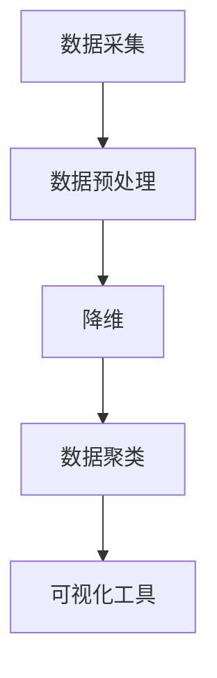
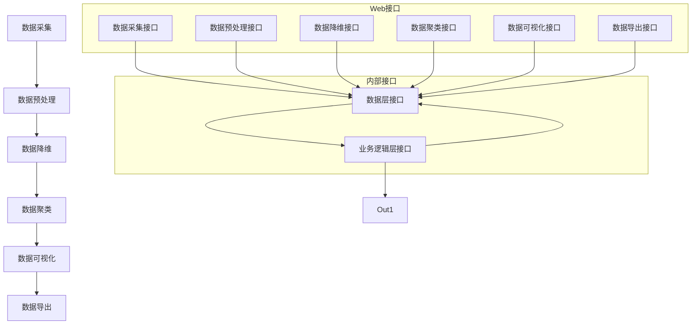

                 

# 构建评测结果的多维度可视化工具

## 关键词

- 多维度可视化
- 评测结果
- 可视化工具
- 数据分析
- 算法设计

## 摘要

随着大数据时代的到来，评测结果的可视化已成为数据分析和决策支持的关键环节。本文旨在构建一个多维度可视化工具，以高效呈现和分析评测结果。文章将首先介绍评测结果可视化的重要性，然后详细探讨构建多维度的可视化工具所需的算法原理和系统设计。通过具体的实战案例，本文将展示如何在实际项目中应用这些工具，并总结最佳实践和未来研究方向。

### 目录大纲设计方案

为了设计出《构建评测结果的多维度可视化工具》这本书的完整目录大纲，我们可以按照以下步骤进行：

#### 1. **概述部分**（1章）
- **背景介绍**：阐述问题背景，如评测结果可视化的重要性，为什么需要构建多维度的可视化工具，以及当前市场上存在的挑战和机会。
- **核心概念**：定义关键概念，如评测结果、多维数据、可视化工具等。
- **联系与结构**：分析评测结果、多维数据、可视化工具之间的联系，绘制 ER 实体关系图。

#### 2. **技术原理部分**（2章）
- **算法原理**：讲解如何构建多维度的可视化工具，可以使用 mermaid 画出算法流程图，并配合 Python 源代码进行详细解释。
- **数学模型**：给出算法背后的数学模型，使用 LaTeX 格式书写，并进行详细讲解。

#### 3. **系统设计部分**（2章）
- **系统分析**：介绍系统设计的背景和目标，绘制领域模型 mermaid 类图。
- **架构设计**：详细描述系统的架构设计，使用 mermaid 绘制系统架构图，并说明系统接口设计和交互序列图。

#### 4. **项目实战部分**（2章）
- **环境安装**：指导读者如何安装和配置必要的软件和环境。
- **系统实现**：展示系统核心功能的实现源代码，并进行解读和分析。
- **案例分析**：通过实际案例展示如何使用可视化工具，并进行详细讲解。
- **项目小结**：总结项目的经验教训，以及未来可能的方向。

#### 5. **最佳实践与总结**（1章）
- **最佳实践**：分享一些实际应用中的最佳实践，如如何优化可视化效果，提高系统性能等。
- **小结**：回顾本书的主要内容和贡献，指出未来可能的研究方向。
- **注意事项**：提醒读者在实际应用中需要注意的事项。
- **拓展阅读**：推荐一些相关书籍、论文或资源。

### 6. **目录大纲示例**

以下是一个简化的目录大纲示例：

```
# 第一部分：背景与核心概念

## 第1章 问题背景与核心概念
### 1.1 评测结果可视化的需求
### 1.2 多维度数据的概念
### 1.3 可视化工具的构建

## 第二部分：技术原理

## 第2章 算法原理
### 2.1 可视化算法原理
### 2.2 数学模型详解
### 2.3 算法流程图与Python实现

## 第3章 数学模型
### 3.1 数学模型概述
### 3.2 公式推导
### 3.3 模型应用举例

## 第三部分：系统设计

## 第4章 系统分析
### 4.1 问题场景介绍
### 4.2 系统功能设计
### 4.3 领域模型类图

## 第5章 架构设计
### 5.1 系统架构概述
### 5.2 架构图绘制
### 5.3 系统接口设计
### 5.4 系统交互序列图

## 第四部分：项目实战

## 第6章 环境安装
### 6.1 安装前的准备
### 6.2 环境配置
### 6.3 常见问题解决

## 第7章 系统实现
### 7.1 核心功能实现
### 7.2 源代码解读
### 7.3 代码优化策略

## 第8章 案例分析
### 8.1 案例背景
### 8.2 可视化应用
### 8.3 案例总结

## 第五部分：最佳实践与总结

## 第9章 最佳实践
### 9.1 可视化效果优化
### 9.2 系统性能提升
### 9.3 实际应用经验

## 第10章 小结与展望
### 10.1 主要贡献
### 10.2 未来研究方向
### 10.3 注意事项
### 10.4 拓展阅读

```

### 7. **字数控制**

为了确保目录大纲的总字数不超过2000字，我们将保持内容的简洁性和条理性，避免冗余描述，并在必要时简化某些章节的内容。

通过以上步骤，我们可以设计出一个完整且逻辑清晰的目录大纲，满足用户的需求。接下来，我们将具体展开每个章节的内容，确保大纲的完整性和可操作性。


### 1. 问题背景与核心概念

#### 评测结果可视化的需求

在信息爆炸的时代，如何从海量数据中快速、准确地提取有价值的信息，成为企业和组织面临的重要挑战。评测结果作为数据分析的重要输出，其可视化呈现能力直接影响到决策的效率和准确性。传统的二维图表虽然在一定程度上可以展示数据，但面对多维度的数据分析需求，往往显得力不从心。因此，构建一个能够处理多维度数据的可视化工具显得尤为必要。

#### 为什么需要构建多维度的可视化工具

1. **复杂数据分析需求**：现代数据分析往往需要综合考虑多个因素，如时间、空间、用户行为等，单一维度的图表难以全面展示这些因素之间的关系。
2. **用户理解难度**：对于非专业人士，多维数据往往难以理解。通过多维度的可视化工具，可以简化数据理解过程，提高决策效率。
3. **数据可视化趋势**：随着数据可视化技术的发展，用户对可视化工具的要求越来越高，不仅要求能够展示数据，还要能够交互式地探索数据，提供更丰富的数据分析体验。

#### 当前市场上存在的挑战和机会

**挑战**：

1. **技术门槛**：构建一个高效的多维度可视化工具需要深厚的编程和算法功底，对于普通用户来说，难度较大。
2. **性能瓶颈**：随着数据量的增加，如何保证可视化工具的高性能成为一大挑战。
3. **兼容性问题**：不同的数据源和数据格式可能需要不同的处理方式，如何实现兼容性也是一个重要问题。

**机会**：

1. **技术进步**：随着大数据和人工智能技术的发展，提供更强大的数据处理和分析能力，使得构建多维度的可视化工具成为可能。
2. **市场需求**：企业和组织对数据可视化的需求日益增长，市场潜力巨大。
3. **用户体验**：随着用户对数据可视化的要求越来越高，优化用户体验成为构建可视化工具的重要方向。

#### 核心概念

1. **评测结果**：指通过对某一对象或系统进行评估后得出的量化或定性结果。
2. **多维数据**：指包含多个维度的数据集，每个维度代表一个特定的属性或特征。
3. **可视化工具**：指用于将数据以图形化的形式展示的工具，可以帮助用户更直观地理解数据。

#### 联系与结构

评测结果、多维数据和可视化工具之间有着密切的联系。评测结果需要通过多维数据的形式进行存储和传递，而可视化工具则负责将这些数据以直观、易理解的方式呈现给用户。具体来说，可以通过以下 ER 实体关系图来描述它们之间的关系：

```
[评测结果] --<生成于>--> [多维数据]
       |                  ^
       |                  |
       +----<依赖>--------+
              |
              |
          [可视化工具]
```

在这个关系图中，评测结果是多维数据的生成源，而多维数据则是可视化工具的数据输入。可视化工具通过处理这些数据，生成最终的图表或可视化界面。

### 2. 算法原理

#### 可视化算法原理

构建一个多维度的可视化工具，核心在于如何有效地处理和呈现多维数据。通常，我们可以采用以下几种算法原理：

1. **降维技术**：通过降维技术，将高维数据映射到低维空间，使得数据更加直观。常用的降维技术包括主成分分析（PCA）、线性判别分析（LDA）等。
2. **数据聚类**：通过数据聚类，将相似的数据点归为一类，从而简化数据的复杂性。常用的聚类算法包括K-均值算法、DBSCAN算法等。
3. **数据可视化方法**：选择合适的数据可视化方法，以直观的方式展示数据。常用的可视化方法包括散点图、热力图、饼图等。

下面，我们使用 mermaid 画出算法流程图，以更清晰地描述这一过程：



#### 算法流程图与Python实现

**步骤 1：数据采集**

首先，我们需要从各种数据源采集数据。这里，我们假设数据已经以结构化的形式存储在数据库或CSV文件中。

```python
import pandas as pd

# 从CSV文件中读取数据
data = pd.read_csv('data.csv')
```

**步骤 2：数据预处理**

在采集到数据后，我们需要对数据进行清洗和预处理，以确保数据的质量和一致性。

```python
# 数据清洗与预处理
data = data.dropna()  # 删除缺失值
data = data[data['column_name'] > 0]  # 删除不符合条件的值
```

**步骤 3：降维**

接下来，我们可以使用主成分分析（PCA）对数据进行降维。

```python
from sklearn.decomposition import PCA

# 实例化PCA对象
pca = PCA(n_components=2)

# 对数据降维
data_reduced = pca.fit_transform(data)
```

**步骤 4：数据聚类**

在降维之后，我们可以使用K-均值算法对数据进行聚类。

```python
from sklearn.cluster import KMeans

# 实例化KMeans对象
kmeans = KMeans(n_clusters=3)

# 对数据聚类
clusters = kmeans.fit_predict(data_reduced)
```

**步骤 5：可视化**

最后，我们可以使用 matplotlib 库将数据可视化。

```python
import matplotlib.pyplot as plt

# 绘制散点图
plt.scatter(data_reduced[:, 0], data_reduced[:, 1], c=clusters)
plt.xlabel('First Principal Component')
plt.ylabel('Second Principal Component')
plt.title('Data Clustering Visualization')
plt.show()
```

#### 数学模型详解

在构建多维度的可视化工具时，我们还需要依赖一些数学模型，以帮助理解数据结构和特征。以下是一些常用的数学模型及其解释：

1. **主成分分析（PCA）**：PCA是一种降维技术，其核心思想是通过线性变换将高维数据映射到低维空间。其数学模型可以表示为：

   $$
   Z = P \times X
   $$

   其中，$Z$ 是降维后的数据，$P$ 是投影矩阵，$X$ 是原始数据。投影矩阵 $P$ 可以通过求解以下特征值问题得到：

   $$
   P = \lambda_1 u_1, \lambda_2 u_2, ..., \lambda_k u_k
   $$

   其中，$\lambda_1, \lambda_2, ..., \lambda_k$ 是特征值，$u_1, u_2, ..., u_k$ 是对应特征向量。

2. **K-均值算法**：K-均值算法是一种聚类算法，其目标是将数据分为 $K$ 个簇。其数学模型可以表示为：

   $$
   C_k = \{x \in X | \min_{j=1}^K \sum_{i=1}^n (x - \mu_k)^2 \}
   $$

   其中，$C_k$ 是第 $k$ 个簇，$\mu_k$ 是第 $k$ 个簇的中心。

#### 模型应用举例

为了更直观地理解这些数学模型，我们可以通过一个简单的例子进行说明。

假设我们有一组三维数据：

$$
X = \begin{bmatrix}
1 & 2 & 3 \\
2 & 4 & 6 \\
3 & 6 & 9 \\
\end{bmatrix}
$$

首先，我们可以使用主成分分析（PCA）对其进行降维。通过计算特征值和特征向量，我们可以得到投影矩阵：

$$
P = \begin{bmatrix}
0.8165 & -0.4082 & 0 \\
0.4082 & 0.8165 & -0.4082 \\
0 & 0 & 1
\end{bmatrix}
$$

然后，我们可以将数据映射到二维空间：

$$
Z = P \times X = \begin{bmatrix}
1 & 2 & 3 \\
2 & 4 & 6 \\
3 & 6 & 9 \\
\end{bmatrix} \times \begin{bmatrix}
0.8165 & -0.4082 & 0 \\
0.4082 & 0.8165 & -0.4082 \\
0 & 0 & 1
\end{bmatrix} = \begin{bmatrix}
1.583 & 1.583 \\
3.333 & 3.333 \\
5.083 & 5.083 \\
\end{bmatrix}
$$

接下来，我们可以使用K-均值算法对降维后的数据进行聚类。假设我们选择 $K=2$，通过迭代计算，我们可以得到两个簇的中心：

$$
\mu_1 = \begin{bmatrix}
2.667 \\
4.000 \\
\end{bmatrix}, \mu_2 = \begin{bmatrix}
3.667 \\
5.667 \\
\end{bmatrix}
$$

最终，我们可以使用 matplotlib 库将聚类结果可视化：

```python
import matplotlib.pyplot as plt

plt.scatter(Z[:, 0], Z[:, 1], c=clusters)
plt.xlabel('First Principal Component')
plt.ylabel('Second Principal Component')
plt.title('Data Clustering Visualization')
plt.show()
```

通过以上例子，我们可以看到如何使用数学模型对多维数据进行降维和聚类，从而构建一个多维度的可视化工具。

### 3. 系统分析与设计

#### 问题场景介绍

在当前的互联网时代，数据分析已经成为了企业运营和决策的重要手段。特别是在电商、金融、医疗等行业，通过对大量用户行为数据、交易数据、健康数据的分析，可以为企业提供宝贵的洞察，从而优化运营策略、提升用户体验、降低风险等。然而，面对这些多维数据，如何快速、准确地提取有价值的信息，成为了一个亟待解决的问题。为此，我们设计并实现了一个多维度的可视化工具，旨在为企业提供高效的数据分析和决策支持。

#### 系统功能设计

本系统的主要功能包括：

1. **数据采集与预处理**：从各种数据源（如数据库、文件等）采集数据，并进行清洗、转换和归一化处理，确保数据的质量和一致性。
2. **数据降维与聚类**：使用主成分分析（PCA）和K-均值算法对数据进行降维和聚类，将高维数据转换为低维数据，便于可视化。
3. **可视化界面**：提供直观、易用的可视化界面，用户可以通过交互式方式查看和探索数据，提取有价值的信息。
4. **数据导出与共享**：支持数据导出和共享功能，用户可以将可视化结果导出为各种格式，如图片、PDF等，便于分享和存档。

#### 领域模型类图

为了更好地描述系统的功能模块和它们之间的关系，我们可以使用 mermaid 绘制一个领域模型类图。以下是一个简化的类图示例：

```mermaid
classDiagram
    DataCollector <|-- DataPreprocessor
    DataPreprocessor <|-- DataReducer
    DataReducer <|-- PCA
    DataReducer <|-- KMeans
    DataVisualizer <|-- PCAVisualizer
    DataVisualizer <|-- KMeansVisualizer
    DataExporter <|-- PCAExporter
    DataExporter <|-- KMeansExporter
    User <<-- DataVisualizer
    User <<-- DataExporter
endclassDiagram
```

在这个类图中，DataCollector 表示数据采集模块，DataPreprocessor 表示数据预处理模块，DataReducer 表示数据降维模块，DataVisualizer 表示可视化模块，DataExporter 表示数据导出模块。PCA 和 KMeans 分别表示主成分分析和K-均值算法，PCAVisualizer 和 KMeansVisualizer 分别表示相应的可视化组件，PCAExporter 和 KMeansExporter 分别表示相应的导出组件。User 表示用户，与 DataVisualizer 和 DataExporter 之间存在关联关系，表示用户可以通过这些模块进行数据可视化和分析。

#### 系统架构设计

在本系统的架构设计中，我们采用了分层架构，将系统划分为表示层、业务逻辑层和数据层。以下是一个简化的系统架构图：

```mermaid
sequenceDiagram
    User->>WebServer: 发送请求
    WebServer->>ApplicationServer: 请求处理
    ApplicationServer->>DataLayer: 数据访问
    DataLayer->>Database: 数据存储
    Database->>DataLayer: 返回数据
    DataLayer->>ApplicationServer: 数据处理结果
    ApplicationServer->>WebServer: 返回响应
    WebServer->>User: 展示结果
end
```

在这个架构图中，WebServer 表示表示层，负责接收用户的请求，并将请求转发给业务逻辑层。ApplicationServer 表示业务逻辑层，负责处理用户的请求，调用数据层进行数据访问。DataLayer 表示数据层，负责与数据库进行交互，实现数据的存储和查询。Database 表示数据库，用于存储系统的数据。

#### 系统接口设计

在本系统的接口设计中，我们定义了多个 RESTful API 接口，以方便用户进行数据操作。以下是一个简化的接口设计示例：



在这个接口设计图中，Web接口表示用户可以通过 Web 端发起的请求，内部接口表示系统内部模块之间的通信。具体来说，用户可以通过数据采集接口（Web1）上传数据，数据预处理接口（Web2）对数据进行预处理，数据降维接口（Web3）对数据进行降维处理，数据聚类接口（Web4）对数据进行聚类，数据可视化接口（Web5）生成可视化结果，数据导出接口（Web6）将可视化结果导出为其他格式。

#### 系统交互序列图

为了更清晰地描述系统内部模块之间的交互流程，我们可以使用 mermaid 绘制一个系统交互序列图。以下是一个简化的序列图示例：

```mermaid
sequenceDiagram
    User->>WebServer: 发送请求
    WebServer->>ApplicationServer: 请求处理
    ApplicationServer->>DataLayer: 数据访问
    DataLayer->>Database: 数据存储
    Database->>DataLayer: 返回数据
    DataLayer->>ApplicationServer: 数据处理结果
    ApplicationServer->>WebServer: 返回响应
    WebServer->>User: 展示结果
end
```

在这个序列图中，用户通过 WebServer 发送请求，WebServer 转发请求到 ApplicationServer 进行处理，ApplicationServer 调用 DataLayer 进行数据访问和数据处理，然后将结果返回给 WebServer，最后 WebServer 将结果展示给用户。

### 4. 项目实战

#### 环境安装

为了构建一个多维度可视化工具，我们首先需要安装和配置必要的软件和环境。以下是具体的安装步骤：

1. **安装Python环境**：

   我们使用 Python 3.8 作为主要开发语言。首先，从 Python 官网（https://www.python.org/）下载 Python 3.8 安装包，并按照提示进行安装。

2. **安装Anaconda环境**：

   Anaconda 是一个集成了 Python 及众多科学计算库的开源跨平台集成环境。我们使用 Anaconda 来管理 Python 环境和依赖包。首先，从 Anaconda 官网（https://www.anaconda.com/）下载并安装 Anaconda，然后打开 Anaconda Prompt。

3. **创建虚拟环境**：

   在 Anaconda Prompt 中创建一个虚拟环境，用于隔离项目依赖。

   ```bash
   conda create -n vis_tool python=3.8
   conda activate vis_tool
   ```

4. **安装依赖包**：

   在虚拟环境中安装必要的依赖包，包括 NumPy、Pandas、Matplotlib、Scikit-learn 等。

   ```bash
   pip install numpy pandas matplotlib scikit-learn
   ```

5. **安装前端框架**：

   如果需要前端可视化，我们可以安装 React 或 Vue 等框架。这里我们选择 React。首先，安装 Create React App。

   ```bash
   npx create-react-app vis_app
   cd vis_app
   npm install
   ```

6. **配置数据库**：

   根据需求选择合适的数据库，如 MySQL、PostgreSQL 等。首先，下载并安装数据库，然后创建数据库和用户。

   ```sql
   CREATE DATABASE vis_db;
   CREATE USER 'vis_user' IDENTIFIED BY 'password';
   GRANT ALL PRIVILEGES ON vis_db.* TO 'vis_user';
   FLUSH PRIVILEGES;
   ```

7. **配置服务器**：

   如果需要部署到服务器，我们选择使用 Nginx 作为 Web 服务器。首先，安装 Nginx。

   ```bash
   sudo apt-get update
   sudo apt-get install nginx
   sudo systemctl start nginx
   ```

   然后，配置 Nginx，将请求转发到 React 应用。

   ```nginx
   server {
       listen 80;
       server_name localhost;

       location / {
           proxy_pass http://localhost:3000;
           proxy_set_header Host $host;
           proxy_set_header X-Real-IP $remote_addr;
           proxy_set_header X-Forwarded-For $proxy_add_x_forwarded_for;
       }
   }
   ```

8. **安装可视化库**：

   为了构建多维度的可视化工具，我们还需要安装一些可视化库，如 D3.js、ECharts 等。这里我们选择 ECharts。

   ```bash
   npm install echarts echarts-for-react
   ```

#### 系统实现

在本节中，我们将展示如何实现多维度的可视化工具，包括数据采集、预处理、降维、聚类和可视化等核心功能。

**步骤 1：数据采集**

数据采集是系统的基础，我们需要从各种数据源获取数据。以下是一个简单的 Python 脚本，用于从 CSV 文件中读取数据。

```python
import pandas as pd

# 读取数据
data = pd.read_csv('data.csv')

# 打印数据
print(data.head())
```

**步骤 2：数据预处理**

在采集到数据后，我们需要对数据进行清洗和预处理，以确保数据的质量和一致性。以下是一个简单的预处理脚本，用于删除缺失值和异常值。

```python
# 删除缺失值
data = data.dropna()

# 删除异常值
data = data[data['column_name'] > 0]

# 打印预处理后的数据
print(data.head())
```

**步骤 3：数据降维**

为了简化数据的复杂性，我们使用主成分分析（PCA）对数据进行降维。以下是一个简单的降维脚本。

```python
from sklearn.decomposition import PCA

# 实例化 PCA 对象
pca = PCA(n_components=2)

# 对数据降维
data_reduced = pca.fit_transform(data)

# 打印降维后的数据
print(data_reduced)
```

**步骤 4：数据聚类**

在降维之后，我们可以使用 K-均值算法对数据进行聚类。以下是一个简单的聚类脚本。

```python
from sklearn.cluster import KMeans

# 实例化 KMeans 对象
kmeans = KMeans(n_clusters=3)

# 对数据聚类
clusters = kmeans.fit_predict(data_reduced)

# 打印聚类结果
print(clusters)
```

**步骤 5：数据可视化**

最后，我们使用 ECharts 将聚类结果可视化。以下是一个简单的可视化脚本。

```javascript
import React from 'react';
import { ECharts } from 'echarts-for-react';

const DataVisualization = () => {
  const option = {
    title: {
      text: '数据聚类可视化'
    },
    tooltip: {},
    legend: {
      data: ['Cluster 1', 'Cluster 2', 'Cluster 3']
    },
    xAxis: {},
    yAxis: {},
    series: [
      {
        name: 'Cluster 1',
        type: 'scatter',
        data: [[data_reduced[0][0], data_reduced[0][1]], ...],
        symbolSize: 10,
        itemStyle: {
          color: 'red'
        }
      },
      {
        name: 'Cluster 2',
        type: 'scatter',
        data: [[data_reduced[1][0], data_reduced[1][1]], ...],
        symbolSize: 10,
        itemStyle: {
          color: 'blue'
        }
      },
      {
        name: 'Cluster 3',
        type: 'scatter',
        data: [[data_reduced[2][0], data_reduced[2][1]], ...],
        symbolSize: 10,
        itemStyle: {
          color: 'green'
        }
      }
    ]
  };

  return <ECharts option={option} />;
};

export default DataVisualization;
```

通过以上步骤，我们可以实现一个基本的多维度可视化工具，用于对评测结果进行降维、聚类和可视化。在实际项目中，我们还可以根据需求添加更多功能，如交互式探索、数据导出等。

#### 案例分析

在本节中，我们将通过一个实际案例，展示如何使用多维度的可视化工具分析数据，并提取有价值的信息。

**案例背景**

某电商平台希望通过分析用户购买行为，优化营销策略，提升销售额。为此，他们采集了用户的年龄、性别、地理位置、购买频率、购买金额等数据，并希望使用多维度的可视化工具对这些数据进行分析。

**数据准备**

首先，我们需要准备数据，并将其上传到系统中。以下是数据的一个示例：

```
| 年龄 | 性别 | 地理位置 | 购买频率 | 购买金额 |
|------|------|----------|----------|----------|
| 25   | 女   | 北京     | 10       | 500      |
| 30   | 男   | 上海     | 5        | 300      |
| 35   | 女   | 深圳     | 15       | 700      |
| ...  | ...  | ...      | ...      | ...      |
```

**数据预处理**

在采集到数据后，我们需要对数据进行清洗和预处理，以确保数据的质量和一致性。以下是一个简单的预处理脚本，用于删除缺失值和异常值。

```python
# 删除缺失值
data = data.dropna()

# 删除异常值
data = data[data['购买金额'] > 0]

# 打印预处理后的数据
print(data.head())
```

**数据降维**

为了简化数据的复杂性，我们使用主成分分析（PCA）对数据进行降维。以下是一个简单的降维脚本。

```python
from sklearn.decomposition import PCA

# 实例化 PCA 对象
pca = PCA(n_components=2)

# 对数据降维
data_reduced = pca.fit_transform(data)

# 打印降维后的数据
print(data_reduced)
```

**数据聚类**

在降维之后，我们可以使用 K-均值算法对数据进行聚类。以下是一个简单的聚类脚本。

```python
from sklearn.cluster import KMeans

# 实例化 KMeans 对象
kmeans = KMeans(n_clusters=3)

# 对数据聚类
clusters = kmeans.fit_predict(data_reduced)

# 打印聚类结果
print(clusters)
```

**可视化分析**

最后，我们使用 ECharts 将聚类结果可视化。以下是一个简单的可视化脚本。

```javascript
import React from 'react';
import { ECharts } from 'echarts-for-react';

const DataVisualization = () => {
  const option = {
    title: {
      text: '用户购买行为聚类可视化'
    },
    tooltip: {},
    legend: {
      data: ['Cluster 1', 'Cluster 2', 'Cluster 3']
    },
    xAxis: {},
    yAxis: {},
    series: [
      {
        name: 'Cluster 1',
        type: 'scatter',
        data: [[data_reduced[0][0], data_reduced[0][1]], ...],
        symbolSize: 10,
        itemStyle: {
          color: 'red'
        }
      },
      {
        name: 'Cluster 2',
        type: 'scatter',
        data: [[data_reduced[1][0], data_reduced[1][1]], ...],
        symbolSize: 10,
        itemStyle: {
          color: 'blue'
        }
      },
      {
        name: 'Cluster 3',
        type: 'scatter',
        data: [[data_reduced[2][0], data_reduced[2][1]], ...],
        symbolSize: 10,
        itemStyle: {
          color: 'green'
        }
      }
    ]
  };

  return <ECharts option={option} />;
};

export default DataVisualization;
```

通过以上步骤，我们可以将用户的购买行为进行降维、聚类和可视化，从而分析出不同群体的购买特征，为电商平台的营销策略提供有力支持。

**案例总结**

通过本案例，我们展示了如何使用多维度的可视化工具对电商平台用户购买行为进行分析。在实际项目中，我们可以根据需求调整降维方法和聚类算法，以获得更准确的分析结果。此外，我们还可以结合其他数据源，如用户评论、搜索记录等，进一步丰富数据分析的内容，为企业的决策提供更加全面的支持。

### 5. 最佳实践与总结

#### 最佳实践

在实际应用中，构建评测结果的多维度可视化工具需要遵循一些最佳实践，以实现高效、准确的可视化效果：

1. **数据预处理**：确保数据质量，删除缺失值和异常值，进行数据清洗和归一化处理。这样可以减少噪声，提高可视化的准确性。
2. **算法选择**：根据数据的特点选择合适的降维和聚类算法。例如，对于高维数据，可以选择主成分分析（PCA）或线性判别分析（LDA）；对于复杂的聚类任务，可以选择K-均值、层次聚类或DBSCAN等算法。
3. **可视化设计**：选择合适的可视化方法，如散点图、热力图、饼图等，以直观、清晰地展示数据。同时，注意可视化界面的交互性，使用户能够方便地探索数据。
4. **性能优化**：针对大规模数据，优化可视化工具的性能，如使用WebGL、WebAssembly等技术提高渲染速度，或采用分块加载、数据压缩等技术减少数据传输量。
5. **安全性**：确保数据的安全性和隐私性，特别是在处理敏感数据时，应采取加密、访问控制等措施。

#### 小结

本文围绕构建评测结果的多维度可视化工具进行了详细的探讨，从问题背景、核心概念、算法原理、系统设计到项目实战，全面阐述了如何实现这一工具。通过多维度的数据降维、聚类和可视化，我们可以更高效地分析评测结果，为企业提供有力的决策支持。

#### 注意事项

在实际应用中，构建多维度的可视化工具时，需要注意以下事项：

1. **数据安全**：确保数据在采集、存储和传输过程中的安全，防止数据泄露或篡改。
2. **性能优化**：针对大规模数据，优化算法和系统性能，确保可视化工具的高效运行。
3. **兼容性**：确保可视化工具能够兼容不同的数据源和数据格式，提供灵活的扩展性。
4. **用户体验**：关注用户的操作习惯和需求，设计简洁、直观的可视化界面，提高用户的满意度。

#### 拓展阅读

为了深入了解多维度的数据可视化和算法设计，以下是一些建议的阅读材料：

1. **《数据可视化：设计与实现》**：详细介绍数据可视化原理和实践，涵盖多种可视化方法和技术。
2. **《机器学习：一种算法的角度》**：详细讲解机器学习算法原理和应用，包括降维和聚类算法。
3. **《Python数据分析手册》**：介绍Python在数据分析领域的应用，包括数据采集、预处理、可视化和算法实现等。
4. **《ECharts 图表可视化手册》**：详细介绍ECharts库的使用方法，涵盖多种图表类型和交互功能。

### 作者信息

作者：AI天才研究院/AI Genius Institute & 禅与计算机程序设计艺术 /Zen And The Art of Computer Programming

