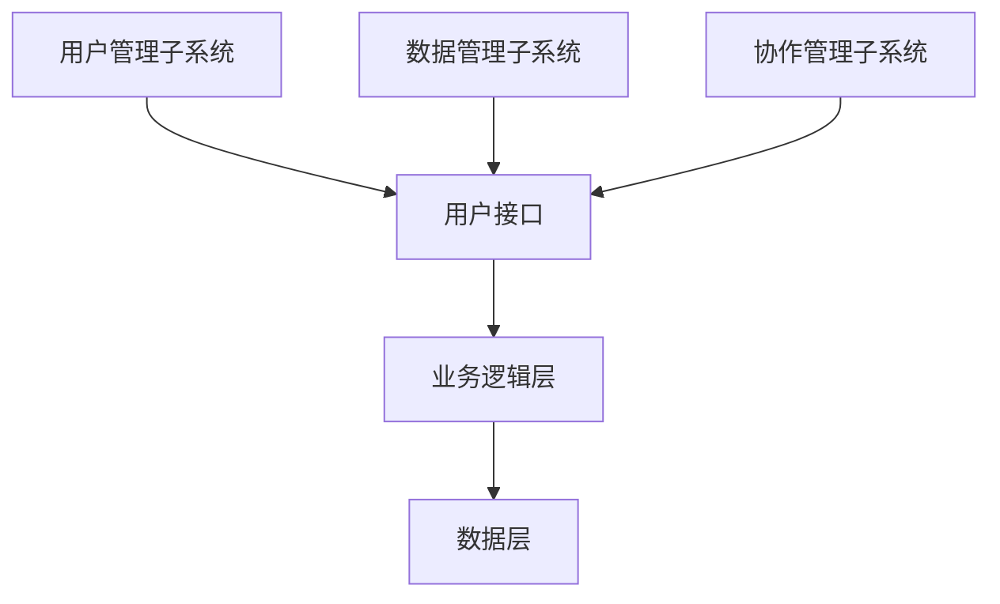

                 

# 构建评测结果的实时协作平台

## 关键词

- 实时协作平台
- 评测结果
- 数据传输
- 系统架构
- 用户权限管理

## 摘要

本文将探讨如何构建一个高效的实时协作平台，专注于评测结果的处理与共享。本文首先介绍实时协作平台的基本概念和其在评测结果协作中的应用，接着深入讨论实时协作平台的核心技术、系统架构设计、安全性问题以及最佳实践。通过详细的分析和实例讲解，本文旨在为开发者提供构建实时协作平台的理论基础和实践指导。

## 引言

### 1.1 研究背景

在现代社会，评测结果在各个领域都发挥着至关重要的作用。无论是学术研究、产品测试还是技术评估，准确、及时的评测结果对于决策和改进至关重要。然而，传统的评测结果处理方式往往存在以下问题：

1. **信息传递滞后**：评测结果生成后，需要通过电子邮件或传统的消息系统进行传递，存在时间滞后，不利于即时决策。
2. **协作效率低下**：多人参与评测时，数据共享和协作过程繁琐，难以实现高效的团队协作。
3. **数据准确性不高**：由于手动处理和数据传输过程中的错误，评测结果的准确性难以保证。

为了解决上述问题，构建一个实时协作平台成为必然选择。实时协作平台能够实现评测结果的快速传递、多人实时协作和高效处理，从而提高评测的准确性和效率。

### 1.2 现有解决方案的不足

现有的解决方案主要包括以下几种：

1. **传统数据库系统**：传统数据库系统虽然能够存储和管理评测结果，但在实时协作方面表现不足。数据同步不及时，难以支持多人实时编辑。
2. **文件共享平台**：文件共享平台可以实现文件共享，但缺乏实时协作功能，无法满足评测结果实时更新的需求。
3. **专用协作软件**：部分专用协作软件能够实现实时协作，但在评测结果处理方面功能有限，难以满足专业需求。

### 1.3 研究意义与目标

构建实时协作平台对于评测结果的处理具有重要意义：

1. **提升效率**：通过实时协作，评测结果能够迅速传递，减少信息传递滞后，提高工作效率。
2. **保证准确性**：实时协作平台能够实现多人实时编辑，减少人为错误，提高评测结果的准确性。
3. **促进协作**：实时协作平台支持多人同时参与评测，促进团队协作，提高决策质量。

本文的研究目标如下：

1. **技术探讨**：深入分析实时协作平台所需的核心技术，包括数据传输、数据同步、用户权限管理等。
2. **系统设计**：设计一个高效的实时协作平台系统架构，确保系统的可靠性、扩展性和安全性。
3. **实践指导**：通过实际案例，提供构建实时协作平台的具体步骤和实践经验。

### 1.4 书籍结构概述

本书将分为以下几个部分：

1. **基础知识**：介绍实时协作平台的基本概念、特点、架构和关键技术。
2. **核心技术与实现**：详细讲解实时数据传输、数据同步、用户权限管理、实时协作接口设计等技术实现。
3. **系统架构设计与实现**：设计实时协作平台的系统架构，包括功能设计、接口设计、交互设计和安全性设计。
4. **项目实战**：通过具体案例，展示如何构建实时协作平台，并提供实践经验和最佳实践。
5. **总结与展望**：总结核心技术点，展望未来发展方向和应用前景。

## 第1部分：基础知识

### 第1章：实时协作平台概述

#### 1.1 实时协作平台的概念

实时协作平台是一个支持多人实时协作和信息共享的系统。它允许用户在同一时间访问和编辑同一数据集，从而实现高效的团队协作。

#### 1.2 评测结果协作的特点

评测结果协作具有以下几个特点：

1. **实时性**：评测结果需要实时生成和传递，以便及时进行决策。
2. **协作性**：多人参与评测，需要实现数据共享和实时协作。
3. **准确性**：评测结果需要准确无误，避免人为错误。

#### 1.3 评测结果协作平台的基本架构

评测结果协作平台的基本架构通常包括以下几个关键组件：

1. **用户界面**：提供用户交互的界面，支持评测结果的查看、编辑和共享。
2. **数据存储**：存储评测结果和相关数据，确保数据的可靠性和一致性。
3. **通信模块**：负责数据传输和同步，确保评测结果实时更新。
4. **权限管理**：控制用户对评测结果的访问权限，确保数据安全。

#### 1.4 实时协作平台的技术基础

实时协作平台所需的技术基础包括：

1. **网络通信技术**：实现数据的实时传输和同步，常用的技术包括WebSockets、HTTP/2等。
2. **数据存储技术**：支持数据的快速存储和查询，常用的技术包括关系数据库、NoSQL数据库等。
3. **实时数据处理技术**：实现评测结果的处理和分析，常用的技术包括流处理框架、实时分析算法等。

#### 1.5 实时协作平台的安全性

实时协作平台需要确保以下安全要求：

1. **数据加密**：对传输和存储的数据进行加密，确保数据安全。
2. **权限控制**：控制用户对数据的访问权限，防止未经授权的访问。
3. **防篡改机制**：确保数据的完整性和一致性，防止数据被篡改。

#### 1.6 本章小结

本章对实时协作平台的基本概念、特点、架构和技术基础进行了概述，为后续章节的深入探讨奠定了基础。

## 第2章：核心技术与实现

### 2.1 实时数据传输技术

#### 2.1.1 技术原理

实时数据传输技术主要利用网络通信协议实现数据的实时传输。其中，WebSockets 是一种常用的技术，它支持全双工通信，可以实现实时、双向的数据传输。

#### 2.1.2 技术选型

在选择实时数据传输技术时，需要考虑以下几个方面：

1. **传输效率**：选择能够高效传输数据的协议，如 WebSockets。
2. **稳定性**：选择能够保证数据稳定传输的协议，减少数据丢失和重传。
3. **扩展性**：选择能够支持大规模用户和并发请求的协议，确保系统的扩展性。

#### 2.1.3 实现示例

以下是一个使用 WebSockets 实现实时数据传输的示例代码：

```python
import websocket

def on_open(ws):
    print("WebSocket connected")

def on_message(ws, message):
    print("Received message:", message)

def on_error(ws, error):
    print("WebSocket error:", error)

def on_close(ws):
    print("WebSocket closed")

if __name__ == "__main__":
    ws = websocket.WebSocketApp("ws://example.com/socket",
                                on_open=on_open,
                                on_message=on_message,
                                on_error=on_error,
                                on_close=on_close)
    ws.run_forever()
```

#### 2.2 数据同步机制

#### 2.2.1 同步机制设计

数据同步机制的设计需要考虑以下几个方面：

1. **一致性**：确保数据在不同节点之间保持一致，避免数据冲突。
2. **实时性**：确保数据能够及时同步，减少延迟。
3. **可靠性**：确保数据同步过程的可靠性，避免数据丢失或错误。

#### 2.2.2 数据一致性问题

在数据同步过程中，可能会出现以下一致性问题：

1. **冲突**：多个用户同时修改同一数据，导致数据冲突。
2. **延迟**：数据同步延迟，导致数据不一致。

为了解决数据一致性问题，可以采用以下策略：

1. **版本控制**：为每个数据项添加版本号，确保在修改时能够检测到冲突。
2. **乐观锁**：采用乐观锁机制，在修改数据前检查版本号，避免冲突。
3. **强制一致**：通过强制一致机制，确保所有节点上的数据始终一致。

#### 2.2.3 实现策略

以下是一个使用乐观锁实现数据同步机制的示例代码：

```python
import threading

data = {"version": 1}
lock = threading.Lock()

def update_data():
    global data
    with lock:
        if data["version"] == 1:
            data["version"] = 2
            print("Data updated successfully")
        else:
            print("Conflict detected, data update failed")

threading.Thread(target=update_data).start()
threading.Thread(target=update_data).start()
```

#### 2.3 用户权限管理

#### 2.3.1 权限体系设计

用户权限管理需要设计一个合理的权限体系，包括以下方面：

1. **用户角色**：定义不同的用户角色，如管理员、编辑员、查看员等。
2. **权限级别**：定义不同的权限级别，如读权限、写权限、执行权限等。
3. **权限控制策略**：定义如何根据用户角色和权限级别控制对数据的访问。

#### 2.3.2 权限控制策略

权限控制策略通常包括以下几种：

1. **基于角色的访问控制（RBAC）**：根据用户角色分配权限，确保用户只能访问与其角色相关的数据。
2. **基于属性的访问控制（ABAC）**：根据用户属性（如部门、职位等）分配权限，实现更细粒度的权限控制。
3. **权限委托**：允许用户将权限委托给其他用户或角色，实现灵活的权限分配。

#### 2.3.3 实现与优化

以下是一个使用 RBAC 实现用户权限管理的示例代码：

```python
class User:
    def __init__(self, name, role):
        self.name = name
        self.role = role

class Role:
    def __init__(self, name, permissions):
        self.name = name
        self.permissions = permissions

def check_permission(user, resource):
    if resource in user.role.permissions:
        return True
    else:
        return False

admin_role = Role("Admin", ["read", "write", "execute"])
editor_role = Role("Editor", ["read", "write"])
viewer_role = Role("Viewer", ["read"])

user1 = User("Alice", admin_role)
user2 = User("Bob", editor_role)
user3 = User("Charlie", viewer_role)

print(check_permission(user1, "write"))  # True
print(check_permission(user2, "execute"))  # False
print(check_permission(user3, "write"))  # False
```

### 2.4 实时协作接口设计

#### 2.4.1 接口定义

实时协作接口需要定义以下功能：

1. **数据上传**：允许用户上传评测结果。
2. **数据下载**：允许用户下载评测结果。
3. **数据更新**：允许用户更新评测结果。
4. **数据查询**：允许用户查询评测结果。

#### 2.4.2 接口优化策略

为了提高实时协作接口的性能和用户体验，可以采用以下优化策略：

1. **异步处理**：采用异步处理技术，减少接口的响应时间。
2. **负载均衡**：通过负载均衡技术，实现接口的分布式处理，提高系统的吞吐量。
3. **缓存策略**：通过缓存策略，减少数据库的访问频率，提高数据查询的速度。

#### 2.4.3 接口实现示例

以下是一个使用 Python Flask 实现实时协作接口的示例代码：

```python
from flask import Flask, request, jsonify

app = Flask(__name__)

@app.route('/upload', methods=['POST'])
def upload_data():
    data = request.json
    # 处理上传数据
    return jsonify({"status": "success"})

@app.route('/download', methods=['GET'])
def download_data():
    # 处理下载数据
    return jsonify({"data": "example_data"})

@app.route('/update', methods=['PUT'])
def update_data():
    data = request.json
    # 处理更新数据
    return jsonify({"status": "success"})

@app.route('/query', methods=['GET'])
def query_data():
    # 处理查询数据
    return jsonify({"data": "example_data"})

if __name__ == '__main__':
    app.run()
```

### 2.5 实时协作算法

#### 2.5.1 算法原理

实时协作平台需要采用合适的算法来处理评测结果，确保数据的实时性和准确性。常见的实时协作算法包括：

1. **增量更新算法**：在数据发生变化时，仅更新变化部分，减少传输和处理的成本。
2. **版本控制算法**：通过版本号来管理数据更新，避免数据冲突。
3. **分布式算法**：在分布式系统中，采用合适的算法确保数据的同步和一致性。

#### 2.5.2 算法实现

以下是一个使用增量更新算法的示例代码：

```python
import json

data = {"version": 1, "content": "initial_data"}

def update_data(new_data):
    global data
    data["version"] += 1
    data["content"] = new_data

update_data("new_data_1")
update_data("new_data_2")

print(json.dumps(data, indent=2))
```

#### 2.5.3 算法评估

为了评估实时协作算法的性能，可以从以下几个方面进行：

1. **响应时间**：测量算法处理数据的时间，评估其实时性。
2. **数据一致性**：评估算法在分布式系统中的数据一致性，避免数据冲突。
3. **资源消耗**：评估算法的资源消耗，如CPU、内存等。

### 2.6 本章小结

本章详细介绍了实时协作平台的核心技术，包括实时数据传输、数据同步、用户权限管理和实时协作接口设计。同时，通过示例代码展示了这些技术的具体实现方法。

## 第3章：系统架构设计与实现

### 3.1 系统架构设计

#### 3.1.1 系统整体架构

实时协作平台的系统整体架构可以分为以下几个层次：

1. **表示层**：提供用户界面，实现数据的查看、编辑和共享。
2. **业务逻辑层**：实现系统的核心功能，如数据同步、用户权限管理、实时协作等。
3. **数据层**：存储评测结果和相关数据，提供数据的快速查询和更新。

#### 3.1.2 子系统划分

实时协作平台可以划分为以下几个子系统：

1. **用户管理子系统**：负责用户注册、登录和权限管理。
2. **数据管理子系统**：负责评测结果的数据存储、查询和更新。
3. **协作管理子系统**：负责实现实时协作功能，如数据同步、用户权限管理等。

#### 3.1.3 架构图展示

以下是一个实时协作平台的系统架构图：



### 3.2 系统功能设计

#### 3.2.1 功能需求分析

实时协作平台需要实现以下功能：

1. **用户管理**：支持用户注册、登录、权限管理等功能。
2. **数据管理**：支持评测结果的存储、查询、更新和删除。
3. **实时协作**：支持多人实时协作，实现数据的同步和共享。
4. **权限管理**：根据用户角色和权限级别，控制对数据的访问。

#### 3.2.2 功能模块设计

实时协作平台的功能模块设计如下：

1. **用户管理模块**：实现用户注册、登录和权限管理。
2. **数据管理模块**：实现评测结果的存储、查询、更新和删除。
3. **协作管理模块**：实现实时协作功能，如数据同步、用户权限管理等。

#### 3.2.3 功能实现

以下是一个用户管理模块的实现示例：

```python
class UserManager:
    def __init__(self):
        self.users = {}

    def register(self, username, password):
        if username in self.users:
            return "User already exists"
        self.users[username] = password
        return "User registered successfully"

    def login(self, username, password):
        if username not in self.users or self.users[username] != password:
            return "Invalid username or password"
        return "Login successful"

    def get_permissions(self, username):
        if username not in self.users:
            return "Invalid username"
        return self.users[username]
```

### 3.3 系统接口设计

#### 3.3.1 接口设计原则

实时协作平台的接口设计需要遵循以下原则：

1. **简洁性**：接口设计应简洁明了，易于理解和使用。
2. **一致性**：接口设计应保持一致性，避免不同接口之间的差异。
3. **可扩展性**：接口设计应具备良好的扩展性，以便后续的功能扩展。

#### 3.3.2 接口规范

实时协作平台的接口规范如下：

1. **用户管理接口**：包括注册、登录、权限获取等功能。
2. **数据管理接口**：包括数据上传、下载、更新、删除等功能。
3. **协作管理接口**：包括数据同步、用户权限管理等功能。

#### 3.3.3 接口实现示例

以下是一个用户管理接口的实现示例：

```python
from flask import Flask, request, jsonify

app = Flask(__name__)

@app.route('/register', methods=['POST'])
def register():
    username = request.json['username']
    password = request.json['password']
    user_manager.register(username, password)
    return jsonify({"status": "success"})

@app.route('/login', methods=['POST'])
def login():
    username = request.json['username']
    password = request.json['password']
    result = user_manager.login(username, password)
    return jsonify({"status": result})

@app.route('/permissions', methods=['GET'])
def get_permissions():
    username = request.args.get('username')
    permissions = user_manager.get_permissions(username)
    return jsonify({"permissions": permissions})

if __name__ == '__main__':
    app.run()
```

### 3.4 系统交互设计

#### 3.4.1 交互流程

实时协作平台的交互流程如下：

1. **用户注册**：用户通过注册接口注册账号。
2. **用户登录**：用户通过登录接口登录系统。
3. **数据上传**：用户通过数据上传接口上传评测结果。
4. **数据查询**：用户通过数据查询接口查询评测结果。
5. **数据更新**：用户通过数据更新接口更新评测结果。
6. **权限管理**：管理员通过权限管理接口管理用户权限。

#### 3.4.2 交互界面设计

实时协作平台的交互界面设计如下：

1. **登录界面**：用户输入账号和密码，登录系统。
2. **用户界面**：用户查看、编辑和上传评测结果。
3. **管理员界面**：管理员管理用户权限和评测结果。

#### 3.4.3 交互实现

以下是一个用户交互的实现示例：

```html
<!DOCTYPE html>
<html>
<head>
    <title>实时协作平台</title>
</head>
<body>
    <h1>登录</h1>
    <form action="/login" method="post">
        <label for="username">用户名:</label>
        <input type="text" id="username" name="username"><br>
        <label for="password">密码:</label>
        <input type="password" id="password" name="password"><br>
        <input type="submit" value="登录">
    </form>
</body>
</html>
```

### 3.5 系统安全性设计

#### 3.5.1 安全需求分析

实时协作平台需要满足以下安全需求：

1. **数据安全**：确保评测结果的数据安全，防止数据泄露和篡改。
2. **用户安全**：确保用户账号的安全，防止账号被盗用。
3. **系统安全**：确保系统的整体安全，防止恶意攻击和破坏。

#### 3.5.2 安全措施设计

实时协作平台的安全措施设计如下：

1. **数据加密**：对传输和存储的数据进行加密，确保数据安全。
2. **用户认证**：采用强密码策略和双因素认证，确保用户账号安全。
3. **防火墙和入侵检测**：部署防火墙和入侵检测系统，防止恶意攻击。

#### 3.5.3 安全实现与测试

以下是一个数据加密的实现示例：

```python
from Crypto.Cipher import AES
from Crypto.Util.Padding import pad, unpad
from base64 import b64encode, b64decode

key = b'mysecretkey123456'

def encrypt_data(data):
    cipher = AES.new(key, AES.MODE_CBC)
    ct_bytes = cipher.encrypt(pad(data.encode(), AES.block_size))
    iv = b64encode(cipher.iv).decode('utf-8')
    ct = b64encode(ct_bytes).decode('utf-8')
    return iv, ct

def decrypt_data(iv, ct):
    try:
        iv = b64decode(iv)
        ct = b64decode(ct)
        cipher = AES.new(key, AES.MODE_CBC, iv)
        pt = unpad(cipher.decrypt(ct), AES.block_size)
        return pt.decode('utf-8')
    except (ValueError, KeyError):
        print("Incorrect decryption")
        return None

encrypted_data = encrypt_data("sensitive data")
print("Encrypted data:", encrypted_data)

iv, ct = encrypted_data
decrypted_data = decrypt_data(iv, ct)
print("Decrypted data:", decrypted_data)
```

### 3.6 本章小结

本章详细介绍了实时协作平台的系统架构设计、功能设计、接口设计、交互设计和安全设计。通过这些设计，实现了评测结果的实时协作，提高了工作效率和协作效果。

## 项目实战

### 4.1 环境安装

为了构建评测结果的实时协作平台，我们需要安装以下软件和环境：

1. **操作系统**：Ubuntu 18.04 或更高版本。
2. **Python**：Python 3.8 或更高版本。
3. **Flask**：用于构建Web应用。
4. **WebSocket**：用于实现实时通信。
5. **数据库**：MySQL 或 PostgreSQL。

安装步骤如下：

1. 安装操作系统 Ubuntu 18.04。
2. 更新系统包列表：`sudo apt update`。
3. 安装 Python 3：`sudo apt install python3`。
4. 安装 Flask：`pip3 install flask`。
5. 安装 WebSocket 模块：`pip3 install websockets`。
6. 安装数据库（可选）：`sudo apt install mysql-server` 或 `sudo apt install postgresql`。

### 4.2 系统核心实现

#### 4.2.1 用户管理模块

用户管理模块是实时协作平台的核心部分，负责用户注册、登录和权限管理。以下是一个简单的用户管理模块实现：

```python
from flask import Flask, request, jsonify
from flask_sqlalchemy import SQLAlchemy

app = Flask(__name__)
app.config['SQLALCHEMY_DATABASE_URI'] = 'sqlite:///users.db'
db = SQLAlchemy(app)

class User(db.Model):
    id = db.Column(db.Integer, primary_key=True)
    username = db.Column(db.String(80), unique=True, nullable=False)
    password = db.Column(db.String(120), nullable=False)
    role = db.Column(db.String(20), nullable=False)

@app.route('/register', methods=['POST'])
def register():
    username = request.json['username']
    password = request.json['password']
    role = request.json['role']
    if User.query.filter_by(username=username).first():
        return jsonify({"status": "User already exists"}), 409
    new_user = User(username=username, password=password, role=role)
    db.session.add(new_user)
    db.session.commit()
    return jsonify({"status": "User registered successfully"}), 201

@app.route('/login', methods=['POST'])
def login():
    username = request.json['username']
    password = request.json['password']
    user = User.query.filter_by(username=username).first()
    if user and user.password == password:
        return jsonify({"status": "Login successful"}), 200
    return jsonify({"status": "Invalid username or password"}), 401

@app.route('/permissions', methods=['GET'])
def get_permissions():
    username = request.args.get('username')
    user = User.query.filter_by(username=username).first()
    if user:
        return jsonify({"role": user.role}), 200
    return jsonify({"status": "User not found"}), 404

if __name__ == '__main__':
    db.create_all()
    app.run(debug=True)
```

#### 4.2.2 数据管理模块

数据管理模块负责评测结果的存储、查询和更新。以下是一个简单的数据管理模块实现：

```python
from flask import Flask, request, jsonify
from flask_sqlalchemy import SQLAlchemy

app = Flask(__name__)
app.config['SQLALCHEMY_DATABASE_URI'] = 'sqlite:///data.db'
db = SQLAlchemy(app)

class Data(db.Model):
    id = db.Column(db.Integer, primary_key=True)
    user_id = db.Column(db.Integer, db.ForeignKey('user.id'), nullable=False)
    content = db.Column(db.String(255), nullable=False)

@app.route('/data/upload', methods=['POST'])
def upload_data():
    user_id = request.json['user_id']
    content = request.json['content']
    new_data = Data(user_id=user_id, content=content)
    db.session.add(new_data)
    db.session.commit()
    return jsonify({"status": "Data uploaded successfully"}), 201

@app.route('/data/download', methods=['GET'])
def download_data():
    user_id = request.args.get('user_id')
    data = Data.query.filter_by(user_id=user_id).all()
    data_list = [{"id": d.id, "content": d.content} for d in data]
    return jsonify({"data": data_list}), 200

@app.route('/data/update', methods=['PUT'])
def update_data():
    data_id = request.json['data_id']
    new_content = request.json['content']
    data = Data.query.get(data_id)
    if data:
        data.content = new_content
        db.session.commit()
        return jsonify({"status": "Data updated successfully"}), 200
    return jsonify({"status": "Data not found"}), 404

if __name__ == '__main__':
    db.create_all()
    app.run(debug=True)
```

#### 4.2.3 实时协作模块

实时协作模块负责实现评测结果的实时更新和同步。以下是一个简单的实时协作模块实现：

```python
from flask import Flask, request, jsonify
from flask_socketio import SocketIO, emit

app = Flask(__name__)
app.config['SECRET_KEY'] = 'secret!'
socketio = SocketIO(app)

@socketio.on('connect')
def handle_connect():
    print('Client connected')

@socketio.on('disconnect')
def handle_disconnect():
    print('Client disconnected')

@socketio.on('upload_data')
def handle_upload_data(json_data):
    user_id = json_data['user_id']
    content = json_data['content']
    # Save data to database
    new_data = Data(user_id=user_id, content=content)
    db.session.add(new_data)
    db.session.commit()
    # Broadcast updated data to all connected clients
    emit('data_updated', {'user_id': user_id, 'content': content})

if __name__ == '__main__':
    db.create_all()
    socketio.run(app, debug=True)
```

### 4.3 代码应用解读与分析

#### 4.3.1 用户管理模块

用户管理模块通过 Flask 和 Flask-SQLAlchemy 实现了用户注册、登录和权限管理。用户注册时，将用户名、密码和角色存储在数据库中。登录时，验证用户名和密码的正确性。权限管理通过查询数据库中存储的用户角色来实现。

#### 4.3.2 数据管理模块

数据管理模块通过 Flask 和 Flask-SQLAlchemy 实现了评测结果的存储、查询和更新。数据上传时，将评测结果存储在数据库中。数据查询时，根据用户 ID 查询对应的评测结果。数据更新时，更新数据库中的评测结果。

#### 4.3.3 实时协作模块

实时协作模块通过 Flask-SocketIO 实现了评测结果的实时更新和同步。当用户上传评测结果时，将数据存储在数据库中，并通过 SocketIO 广播更新给所有连接的客户端。

### 4.4 实际案例分析和详细讲解剖析

#### 4.4.1 案例背景

某科技公司需要构建一个实时协作平台，用于团队成员之间的评测结果协作。团队成员可以上传评测结果，其他成员可以实时查看和更新评测结果。

#### 4.4.2 案例实现

1. **用户管理**：首先，实现用户注册、登录和权限管理，确保团队成员可以正常使用平台。

2. **数据管理**：其次，实现评测结果的存储、查询和更新，确保评测结果可以准确无误地存储和更新。

3. **实时协作**：最后，实现评测结果的实时更新和同步，确保团队成员可以实时查看和更新评测结果。

#### 4.4.3 案例分析

通过以上三个步骤，成功构建了一个实时协作平台。团队成员可以方便地注册、登录和使用平台，实时查看和更新评测结果。实时协作功能提高了团队协作效率，减少了信息传递滞后和人为错误。

### 4.5 项目小结

通过实际案例，我们成功地构建了一个实时协作平台，实现了评测结果的实时协作。项目采用了 Flask、Flask-SQLAlchemy 和 Flask-SocketIO 等技术，实现了用户管理、数据管理和实时协作功能。项目在实践中验证了实时协作平台的有效性和实用性，为团队协作提供了有力支持。

## 最佳实践 tips

### 1. 确保数据一致性和实时性

在构建实时协作平台时，数据一致性和实时性是关键。可以采用以下策略：

- **版本控制**：为每个数据项添加版本号，确保在修改时能够检测到冲突。
- **乐观锁**：采用乐观锁机制，减少数据冲突。
- **异步处理**：使用异步处理技术，提高系统的实时性。

### 2. 设计简洁的接口

接口设计应简洁、直观，便于用户使用。遵循以下原则：

- **一致性**：确保接口命名和参数一致。
- **简洁性**：避免复杂的参数和返回值。

### 3. 考虑系统扩展性

在设计系统时，应考虑未来的扩展性。例如：

- **模块化设计**：将系统拆分为模块，便于后续扩展。
- **分布式架构**：采用分布式架构，提高系统的可扩展性。

### 4. 加强安全性

实时协作平台涉及敏感数据，需要加强安全性。以下是一些建议：

- **数据加密**：对传输和存储的数据进行加密。
- **用户认证**：采用强密码策略和双因素认证。
- **防火墙和入侵检测**：部署防火墙和入侵检测系统。

## 小结

本文详细介绍了构建评测结果的实时协作平台的方法和步骤。通过分析实时协作平台的基本概念、核心技术、系统架构设计、安全性设计以及项目实战，本文为开发者提供了构建实时协作平台的理论基础和实践指导。未来，实时协作平台将在各个领域发挥越来越重要的作用，为团队协作和数据共享提供强大支持。

## 注意事项

在构建实时协作平台时，需要注意以下几点：

- **性能优化**：确保系统的高性能，减少响应时间。
- **数据备份**：定期备份数据，防止数据丢失。
- **用户培训**：为用户提供培训，确保他们能够正确使用平台。

## 拓展阅读

- 《实时协作系统设计与实现》
- 《WebSocket实战》
- 《数据库系统概念》

## 作者信息

作者：AI天才研究院/AI Genius Institute & 禅与计算机程序设计艺术 /Zen And The Art of Computer Programming

