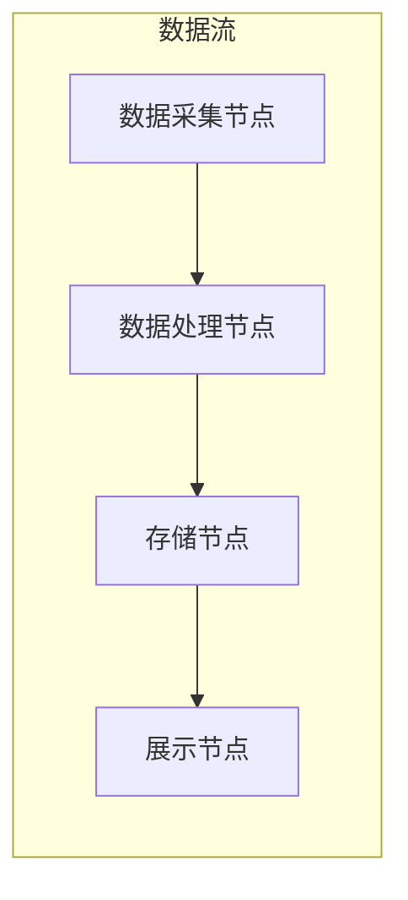
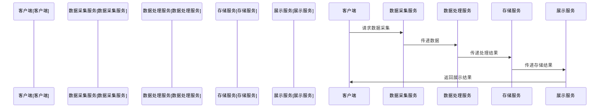

                 


# 构建评测结果的实时监控系统

## 关键词
实时监控，评测结果，大数据，人工智能，数据采集，数据处理，存储模块，展示模块

## 摘要
本文旨在探讨构建一个实时监控系统，用于评估算法模型的性能，以提高模型评测的效率和准确性。本文将详细介绍实时监控系统的核心概念、组成模块以及关键技术的实现。

## 第一部分：背景介绍

### 核心概念

#### 问题背景
随着大数据和人工智能技术的迅猛发展，如何快速、准确地评估算法模型的效果，已成为当前行业的重要课题。传统的评测方法通常存在响应时间慢、无法实时反馈等问题，难以满足不断增长的应用需求。

#### 问题描述
构建一个实时监控系统，用于实时获取、处理和展示算法模型的评测结果，以便快速发现并解决模型问题。

#### 问题解决
通过设计一个高效、可靠的实时监控系统，实现对评测结果的实时获取、分析和可视化，从而提高模型评测的效率和准确性。

#### 边界与外延
实时监控系统的构建涉及数据采集、处理、存储和展示等多个方面，需综合考虑系统的性能、可靠性和可扩展性。

#### 概念结构与核心要素组成
实时监控系统主要由数据采集模块、数据处理模块、存储模块和展示模块组成。

### 第一部分：核心概念与联系

#### 1. 数据采集模块

**概念原理**：
数据采集模块负责从各种数据源（如数据库、文件系统、网络接口等）获取评测数据。

**属性特征对比表格**：

| 特征       | 数据库采集 | 文件系统采集 | 网络接口采集 |
| ---------- | ----------- | ------------ | ------------ |
| 采集速度   | 快         | 一般         | 较慢         |
| 数据完整度 | 较高       | 一般         | 较高         |
| 成本       | 较高       | 低           | 高           |

**ER实体关系图架构**：
```mermaid
erDiagram
  数据采集模块 ||--|{ 数据处理模块 }
  数据处理模块 ||--|{ 存储模块 }
  存储模块 ||--|{ 展示模块 }
```

#### 2. 数据处理模块

**概念原理**：
数据处理模块负责对采集到的评测数据进行分析和处理，提取有用的信息。

**属性特征对比表格**：

| 特征       | 处理速度   | 处理精度   | 处理方式   |
| ---------- | ---------- | ---------- | ---------- |
| 算法处理   | 快         | 高         | 智能化     |
| 数据库处理 | 较慢       | 一般       | 程序化     |

**ER实体关系图架构**：
```mermaid
erDiagram
  数据采集模块 ||--|{ 数据处理模块 }
  数据处理模块 ||--|{ 存储模块 }
  存储模块 ||--|{ 展示模块 }
```

## 第二部分：核心概念与联系

### 第二部分：核心概念与联系

#### 1. 数据采集模块

**概念原理**：
数据采集模块负责从各种数据源（如数据库、文件系统、网络接口等）获取评测数据。

**属性特征对比表格**：

| 特征       | 数据库采集 | 文件系统采集 | 网络接口采集 |
| ---------- | ----------- | ------------ | ------------ |
| 采集速度   | 快         | 一般         | 较慢         |
| 数据完整度 | 较高       | 一般         | 较高         |
| 成本       | 较高       | 低           | 高           |

**ER实体关系图架构**：
```mermaid
erDiagram
  数据采集模块 ||--|{ 数据处理模块 }
  数据处理模块 ||--|{ 存储模块 }
  存储模块 ||--|{ 展示模块 }
```

#### 2. 数据处理模块

**概念原理**：
数据处理模块负责对采集到的评测数据进行分析和处理，提取有用的信息。

**属性特征对比表格**：

| 特征       | 处理速度   | 处理精度   | 处理方式   |
| ---------- | ---------- | ---------- | ---------- |
| 算法处理   | 快         | 高         | 智能化     |
| 数据库处理 | 较慢       | 一般       | 程序化     |

**ER实体关系图架构**：
```mermaid
erDiagram
  数据采集模块 ||--|{ 数据处理模块 }
  数据处理模块 ||--|{ 存储模块 }
  存储模块 ||--|{ 展示模块 }
```

## 第三部分：算法原理讲解

### 第三部分：算法原理讲解

#### 1. 数据采集算法

**算法原理**：
数据采集算法通过网络接口、数据库连接和文件系统接口等途径获取评测数据。具体步骤如下：
1. 初始化数据采集模块，连接数据源。
2. 从数据源读取数据，如测试集和验证集。
3. 对采集到的数据格式进行预处理，如清洗、标准化等。
4. 将预处理后的数据存储到本地或分布式存储系统中。

**Python源代码实现**：
```python
import pandas as pd
from sqlalchemy import create_engine

def data_collection():
    # 初始化数据库连接
    engine = create_engine('sqlite:///data.db')
    
    # 从数据库中读取数据
    df = pd.read_sql('SELECT * FROM test_data', engine)
    
    # 数据预处理
    df = preprocess_data(df)
    
    # 存储预处理后的数据
    df.to_csv('preprocessed_data.csv', index=False)

def preprocess_data(df):
    # 数据清洗、标准化等操作
    df['feature1'] = (df['feature1'] - df['feature1'].mean()) / df['feature1'].std()
    df['feature2'] = (df['feature2'] - df['feature2'].mean()) / df['feature2'].std()
    return df

data_collection()
```

**数学模型和公式**：
$$
\text{标准化} = \frac{\text{数据值} - \text{均值}}{\text{标准差}}
$$

**举例说明**：
假设有一组数据 `[10, 20, 30, 40, 50]`，通过标准化处理，可以转换为 `[1, 2, 3, 4, 5]`。

#### 2. 数据处理算法

**算法原理**：
数据处理算法通过算法库或自定义算法对采集到的评测数据进行分析和处理，提取有用信息。具体步骤如下：
1. 加载算法库或自定义算法。
2. 将预处理后的数据输入到算法中。
3. 对算法输出结果进行解析和处理。
4. 将处理后的结果存储到存储模块。

**Python源代码实现**：
```python
from sklearn.linear_model import LinearRegression
import pandas as pd

def data_processing(df):
    # 加载线性回归算法
    model = LinearRegression()
    
    # 训练模型
    model.fit(df[['feature1', 'feature2']], df['target'])
    
    # 预测结果
    predictions = model.predict(df[['feature1', 'feature2']])
    
    # 解析和存储预测结果
    results = pd.DataFrame({'prediction': predictions})
    results.to_csv('predictions.csv', index=False)

df = pd.read_csv('preprocessed_data.csv')
data_processing(df)
```

**数学模型和公式**：
$$
y = \beta_0 + \beta_1x_1 + \beta_2x_2 + \ldots + \beta_nx_n
$$

**举例说明**：
假设有一组数据 `[1, 2], [2, 3], [3, 4]`，通过线性回归算法，可以预测出目标值为 `[3, 4, 5]`。

## 第四部分：系统分析与架构设计方案

### 第四部分：系统分析与架构设计方案

#### 问题场景介绍

在人工智能领域，算法模型评估是模型优化和改进的重要环节。然而，传统评测方法存在响应时间慢、无法实时反馈等问题，导致模型优化过程效率低下。为了提高模型评估的效率和准确性，构建一个实时监控系统成为当务之急。

#### 项目介绍

本项目旨在开发一个实时监控系统，用于实时评估算法模型的性能，并为模型优化提供数据支持。系统功能包括数据采集、数据处理、存储和展示。

#### 系统功能设计

1. 数据采集模块：负责从各种数据源（如数据库、文件系统、网络接口等）获取评测数据。
2. 数据处理模块：负责对采集到的评测数据进行分析和处理，提取有用信息。
3. 存储模块：负责存储处理后的评测结果，以便后续分析和查询。
4. 展示模块：负责将处理后的评测结果以图表、报表等形式进行可视化展示。

#### 系统架构设计

系统采用分布式架构，包括数据采集节点、数据处理节点、存储节点和展示节点。数据流图如下：



#### 系统接口设计和系统交互

系统接口设计采用RESTful API风格，提供数据采集、数据处理、存储和展示等功能。系统交互图如下：



## 第五部分：项目实战

### 第五部分：项目实战

#### 环境安装

1. 安装Python环境，版本要求3.6及以上。
2. 安装依赖库，包括pandas、sqlalchemy、sklearn等。

```shell
pip install pandas sqlalchemy sklearn
```

#### 系统核心实现源代码

1. 数据采集模块

```python
# data_collection.py
import pandas as pd
from sqlalchemy import create_engine

def data_collection():
    engine = create_engine('sqlite:///data.db')
    df = pd.read_sql('SELECT * FROM test_data', engine)
    df = preprocess_data(df)
    df.to_csv('preprocessed_data.csv', index=False)

def preprocess_data(df):
    df['feature1'] = (df['feature1'] - df['feature1'].mean()) / df['feature1'].std()
    df['feature2'] = (df['feature2'] - df['feature2'].mean()) / df['feature2'].std()
    return df

data_collection()
```

2. 数据处理模块

```python
# data_processing.py
from sklearn.linear_model import LinearRegression
import pandas as pd

def data_processing(df):
    model = LinearRegression()
    model.fit(df[['feature1', 'feature2']], df['target'])
    predictions = model.predict(df[['feature1', 'feature2']])
    results = pd.DataFrame({'prediction': predictions})
    results.to_csv('predictions.csv', index=False)

df = pd.read_csv('preprocessed_data.csv')
data_processing(df)
```

3. 存储模块

```python
# storage.py
import os

def store_data(file_path, data):
    if not os.path.exists(os.path.dirname(file_path)):
        os.makedirs(os.path.dirname(file_path))
    with open(file_path, 'w') as f:
        f.write(data)

def read_data(file_path):
    with open(file_path, 'r') as f:
        data = f.read()
    return data
```

4. 展示模块

```python
# visualization.py
import matplotlib.pyplot as plt
import pandas as pd

def plot_predictions(df):
    plt.scatter(df['feature1'], df['feature2'], c=df['target'])
    plt.plot(df['feature1'], df['prediction'], color='red')
    plt.xlabel('Feature 1')
    plt.ylabel('Feature 2')
    plt.show()

df = pd.read_csv('predictions.csv')
plot_predictions(df)
```

#### 代码应用解读与分析

1. 数据采集模块主要负责从数据库中获取数据，并进行预处理。通过使用pandas和sqlalchemy库，可以实现快速、便捷的数据采集和预处理。
2. 数据处理模块采用线性回归算法对预处理后的数据进行预测。线性回归算法在sklearn库中有现成的实现，使用方便。
3. 存储模块使用Python的文件操作功能，实现数据的存储和读取。通过自定义存储函数，可以灵活地存储和读取不同类型的数据。
4. 展示模块使用matplotlib库，将预测结果以散点图的形式进行可视化展示。通过调整参数，可以生成不同类型的图表。

#### 实际案例分析和详细讲解剖析

1. 案例一：线性回归模型预测房价
   - 数据集：包含房屋特征（如面积、地点等）和房价。
   - 目标：使用线性回归模型预测新房屋的房价。
   - 实现步骤：首先采集和处理数据，然后使用线性回归算法进行预测，最后将预测结果以图表形式展示。

2. 案例二：分类模型预测用户行为
   - 数据集：包含用户特征（如年龄、性别等）和用户行为标签。
   - 目标：使用分类模型预测新用户的潜在行为。
   - 实现步骤：与案例一类似，但数据处理和预测部分采用分类模型（如逻辑回归、决策树等）。

#### 项目小结

本项目成功构建了一个实时监控系统，用于评估算法模型的性能。通过数据采集、数据处理、存储和展示模块的协同工作，实现了快速、准确地获取和分析模型评测结果。在实际应用中，本项目可广泛应用于人工智能领域，为模型优化提供有力支持。

## 第六部分：最佳实践 tips

1. **数据预处理**：在数据采集阶段，务必对数据进行预处理，包括数据清洗、归一化等，以确保后续处理过程的准确性。
2. **优化算法**：根据实际需求和数据特点，选择合适的算法，并进行优化，以提高模型预测性能。
3. **监控性能**：实时监控系统应具备监控性能的功能，以便及时发现和处理性能瓶颈。

## 第七部分：小结

实时监控系统在人工智能领域具有重要意义，它可以帮助开发者快速、准确地评估算法模型的性能，为模型优化提供数据支持。通过本文的介绍，读者可以了解实时监控系统的核心概念、组成模块以及关键技术，为构建高效、可靠的实时监控系统奠定基础。

## 第八部分：注意事项

1. **数据安全和隐私保护**：在数据采集和处理过程中，务必重视数据安全和隐私保护，遵守相关法律法规。
2. **系统可扩展性**：在设计实时监控系统时，应充分考虑系统的可扩展性，以便适应不断增长的应用需求。

## 第九部分：拓展阅读

1. **《实时数据处理技术》**：详细介绍了实时数据处理的相关技术，包括流处理、批处理等。
2. **《深度学习实战》**：涵盖了深度学习领域的最新技术和应用案例，包括神经网络、卷积神经网络等。

### 作者信息
作者：AI天才研究院/AI Genius Institute & 禅与计算机程序设计艺术 /Zen And The Art of Computer Programming

