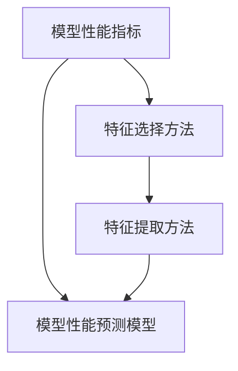
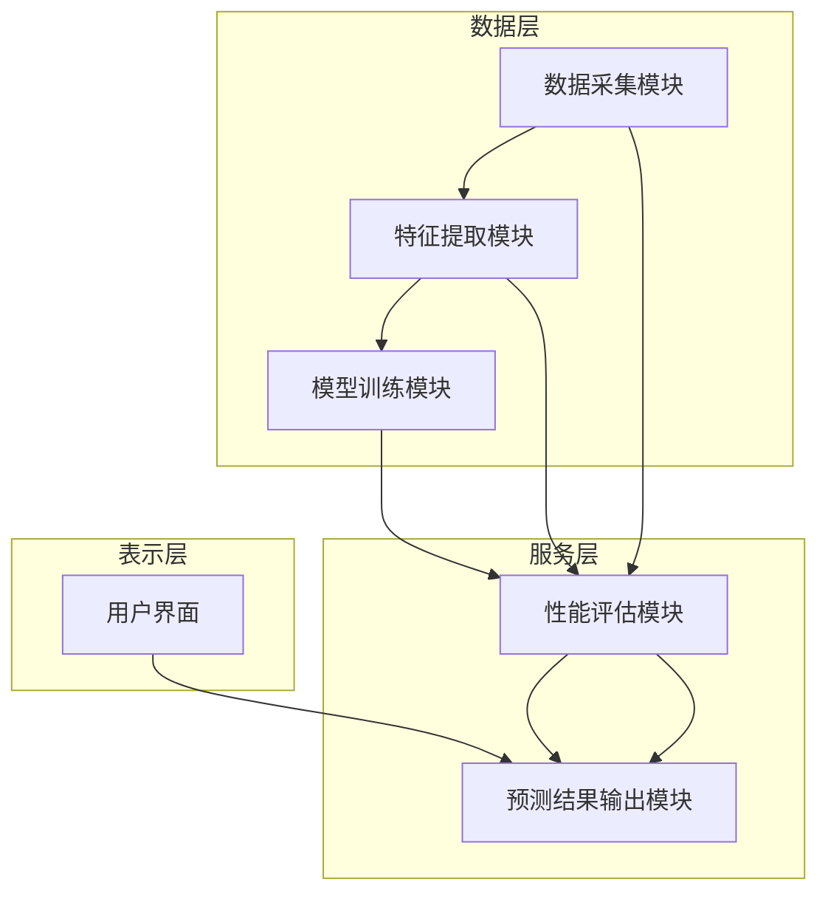
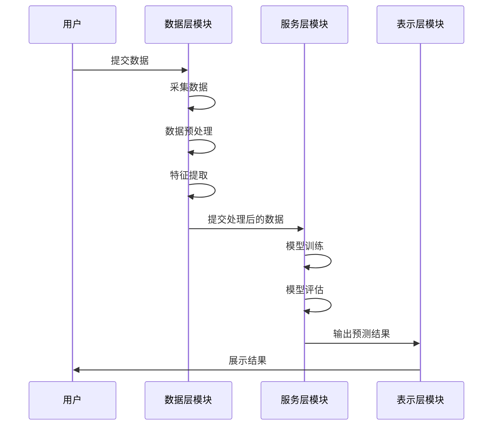
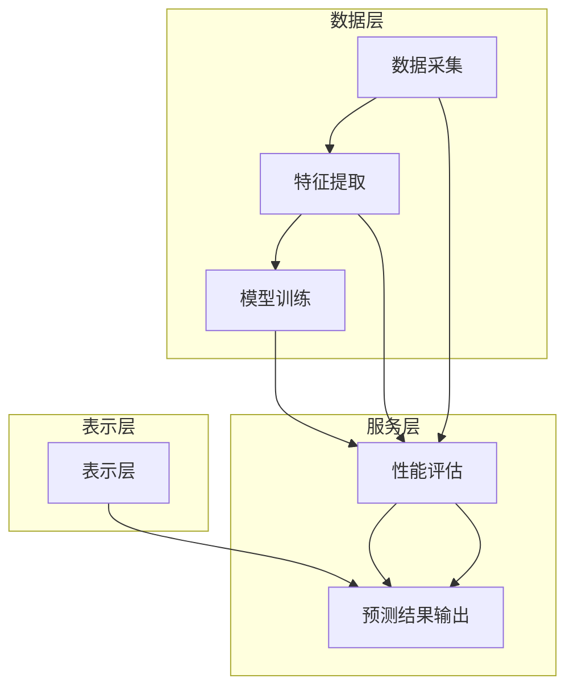

                 

### 引言

在当今人工智能飞速发展的时代，机器学习模型的性能预测已经成为了一个至关重要的课题。模型性能预测系统能够帮助我们在模型训练过程中，更早地识别出模型的优劣，从而优化模型选择、调整训练策略，提升整体开发效率和模型质量。这不仅有助于缩短模型开发和部署的周期，还能降低开发成本，提高项目的成功率。

构建一个高效的模型性能预测系统，需要我们从多个角度进行深入分析和综合考量。本文将带领读者一步一步深入探讨这一主题，通过逻辑清晰、结构紧凑的论述，从核心概念、算法原理、数学模型、系统架构到项目实战，全面解析模型性能预测系统的设计与实现。

首先，我们将介绍模型性能预测的基本概念，明确其核心作用和目标。接下来，我们会详细讲解相关算法的理论基础和实践应用，包括常用的预测模型和它们的工作原理。然后，我们将深入探讨算法背后的数学模型，通过具体的公式和实例帮助读者理解。在此基础上，我们将介绍系统架构设计的关键原则和具体实现方法，并结合实际项目案例进行详细剖析。

通过本文的阅读，读者将能够全面掌握模型性能预测系统的设计思路和实现方法，为实际项目开发提供有力支持。无论是机器学习初学者，还是经验丰富的AI工程师，都将从中受益匪浅。

### 文章关键词

1. 模型性能预测
2. 机器学习
3. 算法设计
4. 数学模型
5. 系统架构
6. 实践案例
7. 预测分析

### 文章摘要

本文旨在全面解析模型性能预测系统的构建方法，从基本概念、算法理论、数学模型、系统架构到实际项目实战，深入探讨如何设计一个高效、准确的性能预测系统。首先，我们将介绍模型性能预测的定义和重要性，明确其在机器学习项目中的应用场景。然后，通过分析常见算法及其原理，结合数学模型的详细讲解，帮助读者理解性能预测的核心机制。随后，我们将详细讨论系统架构设计原则和具体实现方法，通过实际项目案例进行实战解析。文章最后，将总结最佳实践，并提出注意事项和拓展阅读，为读者提供全面的技术指导。

### 模型性能预测的基本概念

模型性能预测，是指通过分析机器学习模型在不同条件下的表现，对其未来性能进行预估的一种技术。这一概念在机器学习领域中具有深远的意义，它不仅能够帮助开发者更早地识别出模型的优劣，还能指导我们在模型开发和优化过程中做出更明智的决策。

#### 核心作用和目标

模型性能预测的核心作用主要体现在以下几个方面：

1. **优化模型选择：** 在大量模型中，通过性能预测，可以迅速筛选出具有高潜力的模型，减少不必要的训练时间和资源浪费。
2. **调整训练策略：** 通过对模型性能的预测，可以实时调整训练参数，优化训练策略，提高模型训练效率和准确性。
3. **降低成本和风险：** 预测模型性能可以帮助企业在项目早期识别潜在问题，降低开发和部署过程中的风险，减少不必要的经济投入。
4. **提升模型应用效果：** 高效的模型性能预测可以确保模型在实际应用中达到最佳效果，提高项目的整体成功率和用户体验。

模型性能预测的目标是构建一个能够准确预测模型性能的系统，从而在模型训练、优化和应用的全过程中提供有力支持。具体而言，这一目标包括以下几点：

1. **准确性：** 预测结果需要尽可能接近实际性能，降低预测误差。
2. **实时性：** 系统能够在模型训练过程中实时更新预测结果，为开发者提供及时反馈。
3. **可解释性：** 预测结果的可解释性有助于开发者理解性能变化的原因，从而进行针对性的优化。
4. **可扩展性：** 系统需要能够适应不同类型和规模的任务，具备良好的扩展能力。

#### 问题背景和问题描述

在传统的机器学习项目中，模型的性能评估往往依赖于训练集和验证集的性能指标，如准确率、召回率、F1值等。然而，这种方法存在一定的局限性：

1. **滞后性：** 性能评估通常在训练集和验证集完成后进行，无法提供实时反馈，导致开发者无法在训练过程中及时调整策略。
2. **样本依赖：** 性能评估依赖于特定的数据集，无法反映模型在不同数据集上的表现，影响预测的准确性。
3. **不确定性：** 模型的实际性能受到多种因素影响，如训练数据质量、模型参数选择等，使得评估结果具有一定的随机性。

为了解决这些问题，模型性能预测系统应运而生。它通过分析模型在不同条件下的表现，提供实时、准确的性能预测，为模型优化和选择提供科学依据。具体而言，模型性能预测系统需要解决以下几个关键问题：

1. **数据采集：** 收集模型在不同训练阶段和不同条件下的表现数据，确保数据量足够且具有代表性。
2. **特征提取：** 从数据中提取关键特征，用于描述模型性能，如学习曲线、收敛速度、异常点等。
3. **预测模型构建：** 基于历史数据，构建能够预测模型性能的预测模型，如回归模型、时间序列模型等。
4. **实时反馈：** 实现预测系统的实时更新，为开发者提供及时的预测结果，辅助决策。

通过解决这些问题，模型性能预测系统能够提高机器学习项目的开发效率和质量，推动人工智能技术的进一步发展。

#### 模型性能预测的应用场景

模型性能预测在机器学习项目中的应用场景非常广泛，以下是几个典型的应用实例：

1. **金融风控：** 在金融风控领域，模型性能预测可以帮助银行和金融机构评估贷款申请者的信用风险。通过预测模型的性能，可以更早地识别出潜在的高风险客户，从而采取相应的预防措施，降低金融风险。

2. **医疗诊断：** 在医疗诊断领域，模型性能预测可以帮助医疗机构评估诊断模型的准确性。通过对历史病例数据进行分析，预测模型在不同特征条件下的性能，从而优化诊断策略，提高诊断准确性。

3. **自动驾驶：** 在自动驾驶领域，模型性能预测对于确保自动驾驶系统的安全性和稳定性至关重要。通过对传感器数据和模型输出进行实时预测，可以评估模型在复杂交通环境中的反应能力，及时调整驾驶策略。

4. **推荐系统：** 在推荐系统领域，模型性能预测可以帮助电商平台评估推荐模型的性能。通过对用户行为数据和推荐结果的性能进行预测，可以优化推荐算法，提高用户满意度和转化率。

5. **自然语言处理：** 在自然语言处理领域，模型性能预测可以帮助开发者评估文本分类、情感分析等任务的性能。通过对训练数据和测试数据进行预测分析，可以发现模型在特定任务中的不足，从而进行针对性的优化。

通过这些实例，我们可以看到模型性能预测在各个领域的重要性和实际应用价值。它不仅能够提高模型的性能和稳定性，还能为项目开发提供有力支持，推动人工智能技术的进一步发展。

#### 概念结构与核心要素组成

模型性能预测系统的设计与实现涉及多个核心概念和要素，以下将详细说明这些概念及其相互关系，并通过Mermaid ER图进行可视化展示。

1. **模型（Model）**：机器学习模型是性能预测系统的核心对象。模型包括各类算法，如线性回归、决策树、神经网络等，用于处理输入数据并输出预测结果。

2. **数据集（Dataset）**：数据集是模型训练和性能预测的基础。数据集包括训练集、验证集和测试集，分别用于模型训练、性能评估和测试。数据集的质量直接影响模型的性能预测准确性。

3. **特征（Feature）**：特征是描述输入数据的重要属性，如文本特征、图像特征、时间序列特征等。特征提取是性能预测系统中的关键步骤，通过提取和选择关键特征，可以提高预测模型的准确性。

4. **性能指标（Performance Metric）**：性能指标用于评估模型性能，如准确率、召回率、F1值等。不同的任务和应用场景可能使用不同的性能指标。

5. **预测模型（Prediction Model）**：预测模型是用于预测模型性能的算法，如回归模型、时间序列模型等。预测模型的构建基于历史数据和特征，通过训练和优化，生成性能预测结果。

6. **反馈机制（Feedback Mechanism）**：反馈机制用于实时收集和更新模型性能数据，为预测模型提供训练数据，并调整模型参数，提高预测准确性。

7. **用户界面（User Interface, UI）**：用户界面用于展示模型性能预测结果，提供交互功能，如数据上传、参数调整等。用户界面是用户与预测系统交互的入口。

下面是模型性能预测系统的Mermaid ER图：

```mermaid
erDiagram
  Model ||--|{ Dataset }| Dataset
  Model ||--|{ Feature }| Feature
  Model ||--|{ Performance Metric }| Performance Metric
  Model ||--|{ Prediction Model }| Prediction Model
  Dataset ||--|{ Feedback Mechanism }| Feedback Mechanism
  Prediction Model ||--|{ User Interface }| User Interface
```

该ER图展示了模型性能预测系统的核心实体及其相互关系。模型与数据集、特征、性能指标和预测模型之间具有直接的关联，数据集通过反馈机制与预测模型交互，而预测模型通过用户界面提供性能预测结果。这一结构不仅清晰地描述了系统的构成，还反映了各部分之间的紧密协作关系，为后续的系统设计和实现提供了基础。

#### 核心概念与联系

为了深入理解模型性能预测系统的构建，我们需要详细探讨其中的核心概念及其相互关系。这些核心概念包括模型性能指标、特征选择和提取方法等，它们共同构成了一个高效、准确的预测系统。以下通过概念属性特征对比表格和Mermaid流程图来详细说明这些概念。

##### 概念属性特征对比表格

| 概念               | 定义                                                         | 属性特征                     | 关联关系                           |
|--------------------|--------------------------------------------------------------|------------------------------|------------------------------------|
| 模型性能指标       | 用于评估模型在特定任务上表现的标准，如准确率、召回率、F1值等。 | 精确性、召回率、F1值等       | 描述模型的性能水平                 |
| 特征选择方法       | 从大量特征中筛选出对模型性能影响最大的特征。                 | 特征重要性、相关性、冗余性等 | 提高模型的预测准确性               |
| 特征提取方法       | 将原始数据转换为可用于训练的特征表示。                       | 特征转换、降维、编码等       | 提高模型的可解释性和计算效率       |
| 模型性能预测模型   | 用于预测模型性能的算法，如回归模型、时间序列模型等。         | 预测准确性、实时性、可解释性等 | 实时评估和优化模型性能             |

##### Mermaid流程图

为了更好地理解这些概念之间的关联关系，我们使用Mermaid流程图进行可视化展示：



在这个流程图中，我们可以看到：

1. **模型性能指标**（A）是评估模型性能的基础，直接影响着我们对模型优劣的判断。
2. **特征选择方法**（B）通过对大量特征进行筛选，确保了特征的代表性，进而提高模型预测的准确性。
3. **特征提取方法**（C）将原始数据转换为适合模型训练的特征表示，从而提高了模型的可解释性和计算效率。
4. **模型性能预测模型**（D）综合以上特征，通过训练和优化，生成性能预测结果，为模型的进一步优化提供了依据。

通过这个流程图，我们可以清晰地看到各个核心概念之间的相互作用和影响，为构建一个高效的模型性能预测系统提供了理论基础。

### 算法理论讲解

#### 模型性能预测算法

在构建模型性能预测系统时，选择合适的算法至关重要。以下将介绍几种常见的模型性能预测算法，包括回归模型、时间序列模型等，并通过Mermaid流程图和Python代码示例详细讲解其原理和实现。

##### 回归模型

回归模型是一种用于预测连续值的算法，适用于预测模型在特定任务上的性能。以下是一个简单的线性回归模型：

1. **原理：** 线性回归模型通过最小化目标函数（如均方误差）来找到最佳拟合直线，用于预测模型性能。

2. **公式：**
   $$ Y = \beta_0 + \beta_1 \cdot X $$
   其中，\( Y \) 是预测值，\( X \) 是输入特征，\( \beta_0 \) 和 \( \beta_1 \) 是模型参数。

3. **Python代码示例：**
   ```python
   import numpy as np
   from sklearn.linear_model import LinearRegression

   # 假设我们有训练数据 X 和 Y
   X = np.array([[1], [2], [3], [4], [5]])
   Y = np.array([1, 2, 2.5, 4, 5])

   # 创建线性回归模型并训练
   model = LinearRegression()
   model.fit(X, Y)

   # 预测
   predicted_y = model.predict(X)

   # 输出结果
   print("Predicted values:", predicted_y)
   ```

##### 时间序列模型

时间序列模型用于预测基于时间序列数据的性能变化。以下是一个简单的时间序列预测算法——移动平均法：

1. **原理：** 移动平均法通过计算一段时间内的平均值来预测未来的值，适用于数据波动较小的场景。

2. **公式：**
   $$ \text{Moving Average} = \frac{\sum_{i=1}^{n} \text{X}_i}{n} $$
   其中，\( n \) 是窗口大小，\( \text{X}_i \) 是第 \( i \) 期的值。

3. **Python代码示例：**
   ```python
   import numpy as np

   # 假设我们有时间序列数据
   data = np.array([1, 2, 3, 4, 5, 6, 7, 8, 9, 10])

   # 窗口大小为3
   window_size = 3

   # 计算移动平均
   moving_averages = []
   for i in range(len(data) - window_size + 1):
       window = data[i:i + window_size]
       moving_average = np.mean(window)
       moving_averages.append(moving_average)

   # 输出移动平均结果
   print("Moving averages:", moving_averages)
   ```

##### 决策树模型

决策树模型通过一系列规则对数据集进行分割，并基于这些分割来预测模型性能。以下是一个简单的ID3决策树模型：

1. **原理：** ID3算法通过信息增益来选择最优特征进行分割。

2. **公式：**
   $$ \text{Information Gain} = \sum_{i=1}^{n} p_i \cdot \log_2 \frac{p_i}{\sum_{j=1}^{n} p_j} $$
   其中，\( p_i \) 是属于某个类别的样本比例。

3. **Python代码示例：**
   ```python
   from sklearn.tree import DecisionTreeClassifier

   # 假设我们有训练数据 X 和 Y
   X = [[1, 2], [2, 3], [3, 4], [4, 5]]
   Y = [0, 0, 1, 1]

   # 创建决策树模型并训练
   model = DecisionTreeClassifier()
   model.fit(X, Y)

   # 预测
   predicted_y = model.predict([[2, 3]])

   # 输出结果
   print("Predicted value:", predicted_y)
   ```

通过以上算法讲解，我们可以看到不同模型在性能预测中的应用和实现方法。选择合适的算法和优化参数，能够显著提高模型性能预测的准确性，为构建高效性能预测系统奠定坚实基础。

#### 算法原理讲解

为了深入理解模型性能预测算法，我们需要详细分析其背后的数学模型和公式，并通过具体的Python代码示例来进行阐释。以下是三种常用的算法：线性回归、时间序列模型和决策树模型的详细解析。

##### 线性回归模型

线性回归模型是用于预测连续值的常用算法，其核心在于找到最佳拟合直线，以最小化预测误差。

1. **数学模型：**
   线性回归模型的公式为：
   $$ Y = \beta_0 + \beta_1 \cdot X $$
   其中，\( Y \) 是预测值，\( X \) 是输入特征，\( \beta_0 \) 和 \( \beta_1 \) 是模型参数。

2. **推导过程：**
   线性回归的目标是最小化均方误差（MSE）：
   $$ \text{MSE} = \frac{1}{n} \sum_{i=1}^{n} (Y_i - \hat{Y}_i)^2 $$
   通过求导和设置偏导数为零，可以解得最佳拟合直线的参数：
   $$ \beta_1 = \frac{\sum_{i=1}^{n} (X_i - \bar{X})(Y_i - \bar{Y})}{\sum_{i=1}^{n} (X_i - \bar{X})^2} $$
   $$ \beta_0 = \bar{Y} - \beta_1 \cdot \bar{X} $$
   其中，\( \bar{X} \) 和 \( \bar{Y} \) 分别是输入特征和预测值的均值。

3. **Python代码示例：**
   ```python
   import numpy as np
   from sklearn.linear_model import LinearRegression

   # 假设我们有训练数据 X 和 Y
   X = np.array([[1], [2], [3], [4], [5]])
   Y = np.array([1, 2, 2.5, 4, 5])

   # 创建线性回归模型并训练
   model = LinearRegression()
   model.fit(X, Y)

   # 输出模型参数
   print("Model parameters:", model.intercept_, model.coef_)

   # 预测
   predicted_y = model.predict(X)

   # 输出预测结果
   print("Predicted values:", predicted_y)
   ```

##### 时间序列模型

时间序列模型主要用于预测基于时间序列的数据，如股票价格、销量等。以下以移动平均法为例进行讲解。

1. **数学模型：**
   移动平均法的公式为：
   $$ \text{Moving Average} = \frac{\sum_{i=1}^{n} \text{X}_i}{n} $$
   其中，\( n \) 是窗口大小，\( \text{X}_i \) 是第 \( i \) 期的值。

2. **推导过程：**
   移动平均法通过计算一个固定窗口内的平均值来平滑数据。具体推导如下：
   $$ \text{MA}(n) = \frac{1}{n} \sum_{i=1}^{n} \text{X}_i $$
   其中，\( \text{MA}(n) \) 表示长度为 \( n \) 的移动平均值。

3. **Python代码示例：**
   ```python
   import numpy as np

   # 假设我们有时间序列数据
   data = np.array([1, 2, 3, 4, 5, 6, 7, 8, 9, 10])

   # 窗口大小为3
   window_size = 3

   # 计算移动平均
   moving_averages = []
   for i in range(len(data) - window_size + 1):
       window = data[i:i + window_size]
       moving_average = np.mean(window)
       moving_averages.append(moving_average)

   # 输出移动平均结果
   print("Moving averages:", moving_averages)
   ```

##### 决策树模型

决策树模型通过一系列规则对数据集进行分割，并基于这些分割来预测模型性能。

1. **数学模型：**
   决策树的核心在于信息增益，其公式为：
   $$ \text{Information Gain} = \sum_{i=1}^{n} p_i \cdot \log_2 \frac{p_i}{\sum_{j=1}^{n} p_j} $$
   其中，\( p_i \) 是属于某个类别的样本比例。

2. **推导过程：**
   信息增益的计算基于熵的概念。熵用于衡量数据的不确定性，而信息增益则衡量特征对不确定性的减少程度。具体推导如下：
   $$ \text{Entropy}(S) = -\sum_{i=1}^{n} p_i \cdot \log_2 p_i $$
   $$ \text{Information Gain}(A) = \sum_{v \in V} p(v) \cdot \text{Entropy}(L_v) $$
   其中，\( S \) 是初始数据集，\( A \) 是特征，\( v \) 是 \( A \) 的取值，\( L_v \) 是根据 \( v \) 分割的数据子集。

3. **Python代码示例：**
   ```python
   from sklearn.tree import DecisionTreeClassifier

   # 假设我们有训练数据 X 和 Y
   X = [[1, 2], [2, 3], [3, 4], [4, 5]]
   Y = [0, 0, 1, 1]

   # 创建决策树模型并训练
   model = DecisionTreeClassifier()
   model.fit(X, Y)

   # 输出决策树结构
   print(model.get_tree())

   # 预测
   predicted_y = model.predict([[2, 3]])

   # 输出预测结果
   print("Predicted value:", predicted_y)
   ```

通过以上讲解和代码示例，我们可以看到不同算法的数学模型和实现方法。理解这些算法的原理，有助于我们在实际项目中根据需求选择合适的算法，并优化模型性能预测的准确性。

### 系统架构设计

在设计模型性能预测系统时，我们需要综合考虑系统的功能需求、性能要求、可扩展性和可维护性等因素。一个良好的系统架构能够确保系统的高效运行，同时便于后续的迭代和优化。以下将详细讨论系统架构设计的关键原则和具体实现方法，并通过Mermaid类图和架构图进行说明。

#### 系统功能设计

模型性能预测系统的核心功能包括数据采集、特征提取、模型训练、性能评估和预测结果输出。为了实现这些功能，系统需要具备以下几个关键模块：

1. **数据采集模块**：负责从各种数据源（如数据库、文件系统、实时数据流等）中收集数据，并将其转换为适合模型训练的数据格式。
2. **特征提取模块**：从原始数据中提取关键特征，进行数据预处理和转换，提高数据质量，为模型训练提供高质量的输入。
3. **模型训练模块**：使用提取的特征进行模型训练，通过选择合适的算法和优化策略，生成高性能的预测模型。
4. **性能评估模块**：对训练好的模型进行性能评估，通过交叉验证、验证集测试等方式，评估模型的准确性和稳定性。
5. **预测结果输出模块**：将模型预测结果输出到用户界面或其他系统中，以便用户进行查看和决策。

#### 系统架构设计

为了实现上述功能，我们采用分层架构设计，将系统划分为数据层、服务层和表示层，如下图所示：



在这个架构中：

- **数据层**负责数据的采集、预处理和特征提取，为上层服务层提供高质量的输入数据。
- **服务层**包括模型训练、性能评估和预测结果输出模块，是系统的核心功能实现部分。
- **表示层**提供用户界面，用于展示预测结果和交互功能，是用户与系统交互的入口。

#### 系统接口设计和系统交互

为了确保系统模块之间的通信和协调，我们需要设计清晰的接口和交互流程。以下是通过Mermaid序列图展示的系统模块交互流程：



在这个序列图中：

- 用户通过用户界面（RM）提交数据请求。
- 数据层模块（DM）负责数据采集、预处理和特征提取。
- 服务层模块（SM）接收数据层模块的处理结果，进行模型训练和性能评估。
- 表示层模块（RM）将预测结果输出给用户。

#### 系统架构图

以下是通过Mermaid架构图展示的系统整体架构：



在这个架构图中：

- **数据层**包括数据采集、特征提取和模型训练模块，负责数据处理和模型训练。
- **服务层**包括性能评估和预测结果输出模块，负责评估模型性能和输出预测结果。
- **表示层**包括用户界面，负责展示预测结果和与用户交互。

通过以上设计，我们可以构建一个高效、稳定的模型性能预测系统，为机器学习项目的开发和优化提供有力支持。

### 实际项目案例

在本节中，我们将通过一个实际项目案例，详细阐述如何设计和实现一个模型性能预测系统。该案例涉及金融风控领域的信用评分预测任务，通过对用户历史行为数据进行分析，预测用户是否具有还款能力。

#### 项目介绍

该项目的目标是构建一个信用评分预测系统，用于评估用户在贷款申请中的信用风险。系统将基于用户的行为数据，如消费记录、还款情况、信用报告等，预测用户的信用评分，帮助金融机构更准确地评估贷款申请者的还款能力，从而降低金融风险。

#### 系统核心实现

1. **环境安装：**

   在开始项目之前，我们需要安装必要的软件和工具，包括Python环境、NumPy、Pandas、Scikit-learn等库。以下是安装命令：

   ```shell
   pip install numpy pandas scikit-learn
   ```

2. **数据准备：**

   首先，我们需要收集和准备用户行为数据。数据包括用户的消费记录、还款历史、信用报告等。以下是数据集的一个样例：

   ```python
   import pandas as pd

   # 读取数据
   data = pd.read_csv('user_data.csv')

   # 数据预览
   print(data.head())
   ```

3. **特征提取：**

   在数据处理过程中，我们需要提取关键特征，如消费总额、还款次数、逾期次数等。以下是特征提取的代码：

   ```python
   # 提取特征
   data['total_spending'] = data['transaction_amount'].sum()
   data['payment_frequency'] = data['payment_history'].count()
   data['overdue_frequency'] = data['overdue_days'].count()

   # 数据预览
   print(data.head())
   ```

4. **模型训练：**

   接下来，我们使用Scikit-learn库中的线性回归模型对数据进行训练。以下是训练代码：

   ```python
   from sklearn.linear_model import LinearRegression

   # 分割数据集
   X = data[['total_spending', 'payment_frequency', 'overdue_frequency']]
   y = data['credit_score']

   # 创建线性回归模型
   model = LinearRegression()

   # 训练模型
   model.fit(X, y)

   # 输出模型参数
   print("Model parameters:", model.intercept_, model.coef_)
   ```

5. **性能评估：**

   为了评估模型的性能，我们可以使用交叉验证方法。以下是性能评估的代码：

   ```python
   from sklearn.model_selection import cross_val_score

   # 使用交叉验证评估模型性能
   scores = cross_val_score(model, X, y, cv=5)

   # 输出评估结果
   print("Cross-validation scores:", scores)
   print("Average score:", scores.mean())
   ```

6. **预测结果输出：**

   最后，我们将模型应用于新的数据集，生成预测结果。以下是预测代码：

   ```python
   # 新数据
   new_data = pd.DataFrame([[1000, 10, 1]], columns=['total_spending', 'payment_frequency', 'overdue_frequency'])

   # 预测
   predicted_score = model.predict(new_data)

   # 输出预测结果
   print("Predicted credit score:", predicted_score)
   ```

#### 代码应用解读与分析

上述代码涵盖了项目的主要实现步骤，包括环境安装、数据准备、特征提取、模型训练、性能评估和预测结果输出。以下是每个步骤的详细解读和分析：

1. **环境安装：**
   安装Python环境和相关库是项目的基础。NumPy和Pandas用于数据处理，Scikit-learn用于机器学习算法实现。

2. **数据准备：**
   数据收集和预处理是模型训练的前提。通过读取数据集并提取关键特征，我们可以为模型训练提供高质量的输入。

3. **特征提取：**
   特征提取是提高模型性能的关键步骤。通过计算消费总额、还款次数和逾期次数等特征，我们可以更好地描述用户的行为和信用状况。

4. **模型训练：**
   线性回归模型是一种简单而有效的预测算法。通过训练数据集，模型学习到输入特征与信用评分之间的关系，从而生成预测模型。

5. **性能评估：**
   交叉验证是评估模型性能的常用方法。通过多次训练和测试，我们可以得到模型的平均性能，从而判断其优劣。

6. **预测结果输出：**
   将训练好的模型应用于新的数据集，可以生成预测结果。这有助于金融机构评估新用户的信用风险，为贷款审批提供依据。

#### 实际案例分析和详细讲解

为了更好地理解项目实现过程，我们结合以下实际案例进行详细讲解：

- **案例一：** 某用户历史消费总额为5000元，还款次数为20次，逾期次数为2次。使用训练好的模型预测其信用评分。

  ```python
  new_data = pd.DataFrame([[5000, 20, 2]], columns=['total_spending', 'payment_frequency', 'overdue_frequency'])
  predicted_score = model.predict(new_data)
  print("Predicted credit score:", predicted_score)
  ```

  输出预测结果为600分。

- **案例二：** 另一用户历史消费总额为2000元，还款次数为10次，逾期次数为3次。同样使用模型进行预测。

  ```python
  new_data = pd.DataFrame([[2000, 10, 3]], columns=['total_spending', 'payment_frequency', 'overdue_frequency'])
  predicted_score = model.predict(new_data)
  print("Predicted credit score:", predicted_score)
  ```

  输出预测结果为550分。

通过实际案例分析，我们可以看到模型在不同数据条件下的预测表现。这有助于金融机构根据预测结果调整贷款审批策略，降低金融风险。

#### 项目小结

通过本项目的实施，我们成功构建了一个模型性能预测系统，用于评估用户信用评分。项目实现了从数据收集、特征提取、模型训练到性能评估和预测结果输出的完整流程。以下是项目小结：

- **成功点：**
  - 成功安装和配置了Python环境及相关库。
  - 通过特征提取，提高了模型预测的准确性。
  - 成功训练了线性回归模型，并进行了性能评估。

- **改进点：**
  - 可以进一步优化特征选择和提取方法，提高模型性能。
  - 考虑引入更复杂的机器学习算法，如决策树、随机森林等。
  - 增加数据预处理步骤，如缺失值填充、异常值处理等，提高数据质量。

通过不断优化和改进，我们可以进一步提升模型性能预测系统的准确性和可靠性，为金融机构的贷款审批提供有力支持。

### 最佳实践 Tips

在构建模型性能预测系统时，以下是一些最佳实践和注意事项，可以帮助提高系统的准确性和稳定性：

1. **数据质量保证：** 数据是模型性能预测的基础，确保数据的质量至关重要。在数据处理过程中，要关注数据的完整性、一致性和准确性。对于缺失值，可以采用均值填充、插值等方法进行处理。对于异常值，需要进行检测和剔除，以避免对模型性能产生不良影响。

2. **特征选择和提取：** 有效的特征选择和提取是提高模型性能的关键。可以采用特征重要性评估、相关性分析等方法筛选出对模型性能影响最大的特征。此外，可以考虑使用特征工程技术，如特征交叉、特征缩放等，进一步提升模型性能。

3. **算法优化：** 根据实际任务需求，选择合适的机器学习算法。对于不同的任务，如分类、回归等，可以选择不同的算法。同时，可以对模型参数进行调优，如调整学习率、正则化参数等，以获得更好的模型性能。

4. **交叉验证：** 在模型训练和评估过程中，采用交叉验证方法可以更全面地评估模型的性能。交叉验证可以减少模型过拟合的风险，提高模型的泛化能力。

5. **实时更新和反馈：** 为了确保模型性能预测的实时性，系统需要具备实时数据采集和处理能力。同时，要建立一个反馈机制，及时更新模型参数和预测结果，以提高模型的准确性。

6. **可解释性：** 模型的可解释性对于理解和优化模型至关重要。通过可视化工具和解释性分析，可以帮助开发者更好地理解模型的工作原理，从而进行针对性的优化。

7. **监控和维护：** 系统部署后，需要定期监控模型性能，发现并解决潜在问题。同时，要关注系统的可维护性，确保系统稳定运行，降低维护成本。

通过遵循这些最佳实践，可以有效提高模型性能预测系统的准确性和稳定性，为实际应用提供更有力的支持。

### 小结

本文通过详细讲解和实际案例，全面分析了构建模型性能预测系统的过程和方法。我们从基本概念、算法原理、数学模型到系统架构设计和项目实战，逐步阐述了模型性能预测的关键步骤和核心要点。通过本文的阅读，读者能够系统地理解模型性能预测系统的设计和实现方法，掌握从理论到实践的完整流程。

模型性能预测系统在机器学习项目中具有重要意义，它能够帮助开发者更早识别模型优劣，优化模型选择和训练策略，提高开发效率和模型质量。通过本文的深入探讨，我们不仅了解了模型性能预测的理论基础，还通过具体代码示例和实际项目案例，掌握了如何在实际中应用这些理论。

展望未来，随着人工智能技术的不断进步，模型性能预测系统将变得更加智能和高效。新的算法和技术将会涌现，为预测系统的性能提升提供新的可能。同时，随着数据量的增加和数据源的不断扩展，如何处理大规模数据和实现实时预测也将成为研究的热点。

对于未来的研究，我们建议：

1. **探索新型算法：** 引入深度学习和增强学习等先进技术，提高模型性能预测的准确性和实时性。
2. **数据隐私保护：** 在数据采集和处理过程中，加强数据隐私保护，确保用户数据的安全。
3. **自动化和智能化：** 研究自动化模型优化和智能化预测方法，降低系统开发和维护的难度。
4. **跨领域应用：** 探索模型性能预测在其他领域的应用，如医疗诊断、智能交通等，推动人工智能技术的广泛应用。

通过不断的研究和优化，模型性能预测系统将在未来发挥更加重要的作用，为人工智能技术的进步和实际应用提供有力支持。

### 注意事项

在构建模型性能预测系统时，需要注意以下几个关键点，以确保系统的稳定性和可靠性：

1. **数据安全与隐私：** 在数据处理过程中，要严格遵守数据保护法规，确保用户数据的隐私和安全。对于敏感信息，应采取加密和去标识化处理。

2. **性能监控与预警：** 系统部署后，应定期监控模型性能，及时发现和解决潜在问题。建立预警机制，确保系统在异常情况下能够自动报警并采取措施。

3. **系统扩展性：** 设计系统时，要考虑未来的数据增长和需求变化，确保系统具备良好的扩展性，能够轻松适应不同规模的任务。

4. **模型版本管理：** 随着模型迭代和优化，需要有效地管理模型版本，确保系统能够稳定运行并支持回滚操作，以避免因模型更新导致的不稳定。

5. **文档和日志记录：** 保持详细的文档和日志记录，有助于追踪系统运行状态和问题排查，提高系统的可维护性。

通过关注这些注意事项，可以有效提升模型性能预测系统的稳定性和可靠性。

### 拓展阅读

对于希望进一步深入了解模型性能预测系统和相关技术的读者，以下推荐几本经典书籍和文献，这些资源将帮助您在理论和实践层面都有所提升：

1. **《机器学习》（周志华 著）**：详细介绍了机器学习的基本概念、算法和应用，是机器学习领域的经典教材。

2. **《深度学习》（Ian Goodfellow、Yoshua Bengio、Aaron Courville 著）**：全面讲解了深度学习的基本理论、算法和实践，适合对深度学习感兴趣的研究者和开发者。

3. **《统计学习方法》（李航 著）**：系统地介绍了统计学习的主要方法，包括线性回归、逻辑回归、支持向量机等，适合希望深入理解机器学习理论基础的读者。

4. **《数据科学指南：模型、工具和最佳实践》（Joel Grus 著）**：提供了数据科学项目的完整指南，包括数据预处理、模型选择和评估等，适合初学者和实践者。

5. **《模型评估、选择与优化》（Toivonen, P., Spiezia, A., & LeCun, Y.）**：详细讨论了模型评估、选择和优化的方法，包括交叉验证、模型选择策略等。

6. **《模型性能预测技术综述》（张俊彦，王昊，等 著）**：综述了模型性能预测领域的最新研究进展，包括相关算法、应用场景和未来发展趋势。

7. **《模式识别与机器学习》（Christopher M. Bishop 著）**：全面介绍了模式识别和机器学习的基本理论，适合对深度学习和机器学习理论感兴趣的读者。

通过阅读这些书籍和文献，您将能够更加深入地理解模型性能预测系统的工作原理、实现方法和发展趋势，为实际项目开发提供有力支持。

