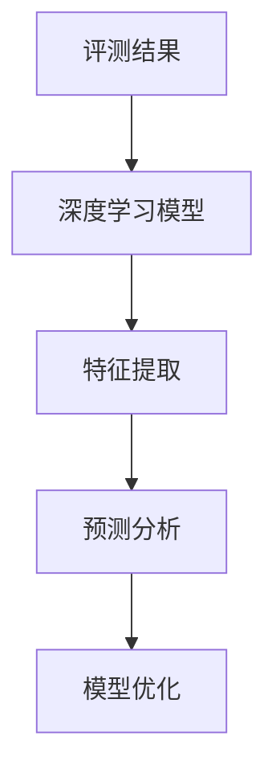
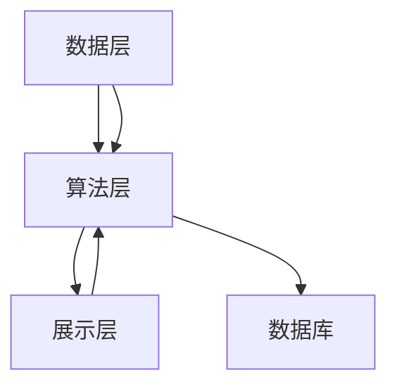
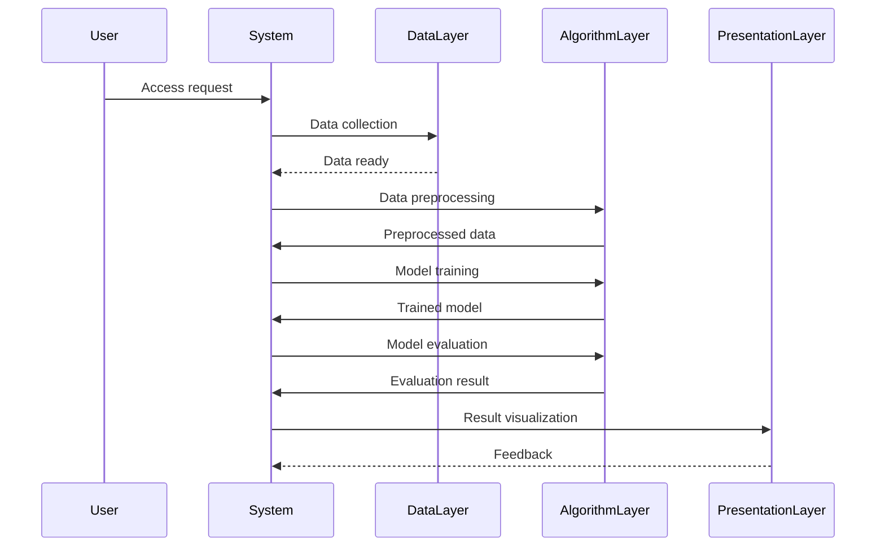
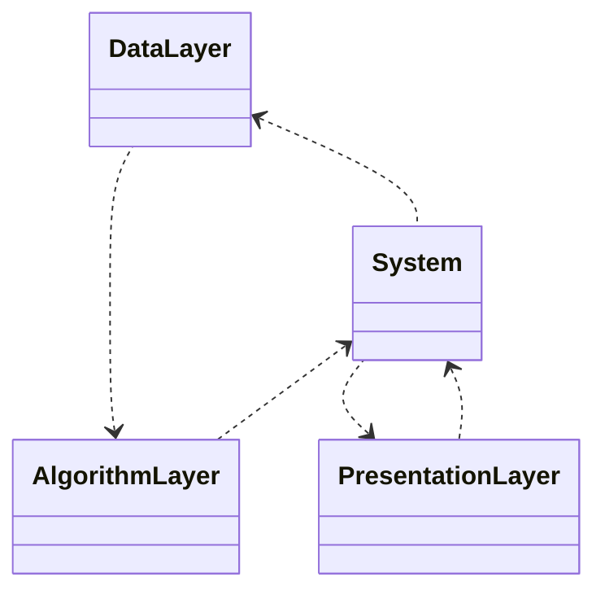

                 

# 构建评测结果的深度学习分析模型

## 引言

### 1.1 问题背景

在当今的数据驱动时代，评测结果的分析已经成为各个领域，如教育、医疗、金融等，不可或缺的一环。然而，随着数据量的爆炸性增长，传统的方法已难以满足高效、准确的评测结果分析需求。深度学习作为一种强大的机器学习技术，凭借其自动特征提取和模式识别能力，成为解决这一问题的有力工具。

### 1.2 深度学习与评测结果分析的关系

深度学习通过构建多层神经网络，能够自动从大量数据中提取复杂特征，进而实现高度准确的预测和分类。在评测结果分析中，深度学习模型可以自动识别不同评价标准的潜在关联，提供更加深入和全面的评测结果。

### 1.3 本书结构

本书将分为六个章节，系统介绍构建评测结果的深度学习分析模型的全过程。具体包括：

1. 深度学习基础，介绍深度学习的基本概念和原理。
2. 算法原理讲解，深入探讨深度学习在评测结果分析中的应用。
3. 系统分析与架构设计，阐述如何设计一个有效的深度学习分析系统。
4. 模型构建与优化，介绍模型构建和优化的技巧。
5. 模型应用实战，通过实际案例展示如何应用深度学习分析模型。
6. 最佳实践与注意事项，提供实用的建议和注意事项，帮助读者更好地应用深度学习技术。

## 第1章 深度学习基础

### 1.1 深度学习概述

深度学习是一种基于多层神经网络的学习方法，它通过模拟人脑的神经元连接结构，实现对复杂数据的处理和模式识别。深度学习的关键在于多层神经网络的堆叠，每一层都能够对数据进行特征提取和抽象。

### 1.2 核心概念与联系

#### 1.2.1 核心概念介绍

- **神经网络**：神经网络是深度学习的基础，它由大量的神经元组成，每个神经元都与其他神经元相连。
- **前向传播**：数据从输入层流向输出层的过程，每个神经元计算输入和权重之和，然后通过激活函数产生输出。
- **反向传播**：计算输出误差，并将其反向传播到输入层，以调整权重和偏置。
- **激活函数**：用于引入非线性特性，常见的激活函数包括Sigmoid、ReLU和Tanh。

#### 1.2.2 概念属性特征对比表格

| 概念       | 属性特征                            | 关联性                 |
|------------|-----------------------------------|----------------------|
| 神经网络   | 神经元、权重、激活函数           | 基础结构，数据处理核心 |
| 前向传播   | 数据流动方向、输入和权重计算     | 神经网络运行机制       |
| 反向传播   | 输出误差计算、权重调整           | 神经网络学习机制       |
| 激活函数   | 引入非线性特性、优化训练效果   | 提高模型性能           |

#### 1.2.3 ER实体关系图架构的Mermaid流程图



### 1.3 深度学习的历史与发展

深度学习的历史可以追溯到20世纪40年代，然而由于计算能力和数据量的限制，深度学习在很长一段时间内并未得到广泛应用。直到近年来，随着计算能力的提升和大数据技术的发展，深度学习才逐渐成为机器学习领域的主流技术。当前，深度学习在各个领域都取得了显著的成果，如计算机视觉、自然语言处理、语音识别等。

### 1.4 深度学习与评测结果的联系

在评测结果分析中，深度学习模型可以通过自动提取数据中的潜在特征，实现对评测结果的深度理解和准确预测。这不仅能够提高评测的效率，还能提供更丰富的评测结果，帮助决策者更好地了解数据和评估对象的本质。

### 1.5 本章小结

本章介绍了深度学习的基本概念、核心概念与联系以及其历史与发展。通过本章的学习，读者可以建立对深度学习的初步认识，为后续章节的学习打下基础。

## 第2章 深度学习算法原理

### 2.1 算法原理讲解

深度学习算法的核心是多层神经网络，其基本原理包括前向传播和反向传播。

#### 2.1.1 前向传播

在前向传播过程中，数据从输入层流向输出层，每个神经元计算输入和权重之和，然后通过激活函数产生输出。这个过程可以用以下公式表示：

$$
Z = X \cdot W + b
$$

其中，\( Z \) 是神经元的输入，\( X \) 是输入数据，\( W \) 是权重，\( b \) 是偏置。

激活函数如ReLU（Rectified Linear Unit）可以表示为：

$$
a = max(0, Z)
$$

#### 2.1.2 反向传播

在反向传播过程中，计算输出误差，并将其反向传播到输入层，以调整权重和偏置。这个过程可以用以下公式表示：

$$
\Delta W = \frac{\partial J}{\partial W}
$$

其中，\( \Delta W \) 是权重更新，\( J \) 是损失函数。

梯度下降法是一种常见的优化算法，其基本思想是沿着梯度的反方向调整参数，以最小化损失函数。其公式可以表示为：

$$
W_{new} = W_{old} - \alpha \cdot \nabla J(W)
$$

其中，\( W_{old} \) 是旧权重，\( W_{new} \) 是新权重，\( \alpha \) 是学习率。

#### 2.1.3 Python代码实现

以下是一个简单的多层感知机（MLP）模型实现的Python代码示例：

```python
import numpy as np

# 设定权重和偏置
W1 = np.random.rand(input_size, hidden_size)
W2 = np.random.rand(hidden_size, output_size)
b1 = np.zeros(hidden_size)
b2 = np.zeros(output_size)

# 激活函数ReLU
def relu(Z):
    return np.maximum(0, Z)

# 前向传播
def forward(X, W1, b1, W2, b2):
    Z1 = np.dot(X, W1) + b1
    A1 = relu(Z1)
    Z2 = np.dot(A1, W2) + b2
    A2 = sigmoid(Z2)
    return A2

# 梯度下降
def gradient_descent(X, y, W1, W2, b1, b2, learning_rate, epochs):
    for i in range(epochs):
        A2 = forward(X, W1, b1, W2, b2)
        dZ2 = A2 - y
        dW2 = np.dot(A1.T, dZ2)
        db2 = np.sum(dZ2, axis=0)
        dZ1 = np.dot(dZ2, W2.T) * (A1 > 0)
        dW1 = np.dot(X.T, dZ1)
        db1 = np.sum(dZ1, axis=0)
        W1 -= learning_rate * dW1
        W2 -= learning_rate * dW2
        b1 -= learning_rate * db1
        b2 -= learning_rate * db2
    return W1, W2, b1, b2
```

#### 2.1.4 算法应用场景举例

以下是一个使用深度学习模型进行图像分类的应用场景：

1. 数据预处理：读取图像数据，进行归一化和处理。
2. 模型构建：构建多层感知机模型，包括输入层、隐藏层和输出层。
3. 模型训练：使用梯度下降法训练模型，调整权重和偏置。
4. 模型评估：使用测试数据集评估模型性能，计算准确率。

### 2.2 算法原理讲解（续）

在深度学习中，除了多层感知机，还有一些更高级的算法，如卷积神经网络（CNN）和循环神经网络（RNN）。这些算法在特定场景下具有更好的性能。

#### 2.2.1 卷积神经网络（CNN）

卷积神经网络是一种专门用于处理图像数据的神经网络，其核心是卷积层。卷积层可以通过卷积操作提取图像的局部特征，如边缘、纹理等。

卷积操作的公式可以表示为：

$$
Z_{ij} = \sum_{k} X_{ik} \cdot W_{kj} + b_j
$$

其中，\( Z_{ij} \) 是卷积结果，\( X_{ik} \) 是输入图像的像素值，\( W_{kj} \) 是卷积核权重，\( b_j \) 是偏置。

以下是一个简单的CNN模型的Python代码示例：

```python
import numpy as np

# 定义卷积层
def conv2d(X, W, b):
    return np.Conv2D(W, b)(X)

# 定义ReLU激活函数
def relu(Z):
    return np.maximum(0, Z)

# 定义CNN模型
def CNN(X, W1, b1, W2, b2, b3):
    Z1 = conv2d(X, W1, b1)
    A1 = relu(Z1)
    P1 = np.max(A1, axis=1, keepdims=True)
    A2 = conv2d(A1, W2, b2)
    A2 = relu(A2)
    P2 = np.max(A2, axis=1, keepdims=True)
    A3 = conv2d(A2, W3, b3)
    A3 = relu(A3)
    P3 = np.max(A3, axis=1, keepdims=True)
    return P3

# 训练模型
W1 = np.random.rand(input_size, output_size, kernel_size, kernel_size)
b1 = np.zeros(output_size)
W2 = np.random.rand(output_size, output_size, kernel_size, kernel_size)
b2 = np.zeros(output_size)
W3 = np.random.rand(output_size, output_size, kernel_size, kernel_size)
b3 = np.zeros(output_size)

# 梯度下降
def gradient_descent(X, y, W1, W2, W3, b1, b2, b3, learning_rate, epochs):
    for i in range(epochs):
        Z1 = conv2d(X, W1, b1)
        A1 = relu(Z1)
        P1 = np.max(A1, axis=1, keepdims=True)
        Z2 = conv2d(A1, W2, b2)
        A2 = relu(Z2)
        P2 = np.max(A2, axis=1, keepdims=True)
        Z3 = conv2d(A2, W3, b3)
        A3 = relu(Z3)
        P3 = np.max(A3, axis=1, keepdims=True)
        dZ3 = A3 - y
        dW3 = np.mean(dZ3 * A2, axis=0)
        db3 = np.sum(dZ3, axis=0)
        dZ2 = np.dot(dZ3, W3.T) * (A2 > 0)
        dW2 = np.mean(dZ2 * A1, axis=0)
        db2 = np.sum(dZ2, axis=0)
        dZ1 = np.dot(dZ2, W2.T) * (A1 > 0)
        dW1 = np.mean(dZ1 * X, axis=0)
        db1 = np.sum(dZ1, axis=0)
        W1 -= learning_rate * dW1
        W2 -= learning_rate * dW2
        W3 -= learning_rate * dW3
        b1 -= learning_rate * db1
        b2 -= learning_rate * db2
        b3 -= learning_rate * db3
    return W1, W2, W3, b1, b2, b3
```

#### 2.2.2 循环神经网络（RNN）

循环神经网络是一种用于处理序列数据的神经网络，其核心是循环层。RNN可以通过循环结构处理变长的序列数据，并在时间步之间保持状态。

RNN的基本公式可以表示为：

$$
h_t = \sigma(W_h \cdot [h_{t-1}, x_t] + b_h)
$$

其中，\( h_t \) 是当前时间步的隐藏状态，\( x_t \) 是当前时间步的输入，\( \sigma \) 是激活函数。

以下是一个简单的RNN模型的Python代码示例：

```python
import numpy as np

# 定义RNN模型
def RNN(X, W, b):
    h = np.zeros((X.shape[0], hidden_size))
    for t in range(X.shape[1]):
        h[t] = np.tanh(np.dot(X[:, t], W) + b)
    return h

# 训练模型
W = np.random.rand(input_size, hidden_size)
b = np.zeros(hidden_size)

# 梯度下降
def gradient_descent(X, y, W, b, learning_rate, epochs):
    for i in range(epochs):
        h = RNN(X, W, b)
        dW = np.zeros_like(W)
        db = np.zeros_like(b)
        for t in range(X.shape[1]):
            dZ = h[t] - y[t]
            dW += np.dot(X[:, t].T, dZ * (1 - np.tanh(h[t])))
            db += dZ * (1 - np.tanh(h[t]))
        W -= learning_rate * dW
        b -= learning_rate * db
    return W, b
```

### 2.3 本章小结

本章详细介绍了深度学习算法的基本原理，包括多层感知机、卷积神经网络和循环神经网络。通过本章的学习，读者可以了解深度学习算法的原理和应用，为后续章节的模型构建和优化打下基础。

## 第3章 系统分析与架构设计

### 3.1 应用场景介绍

评测结果分析系统广泛应用于教育、医疗、金融等领域。在教育领域，该系统可以帮助学校和家长准确评估学生的学习情况，提供个性化的学习建议。在医疗领域，该系统可以帮助医生评估患者的健康状况，提供精确的诊断和治疗方案。在金融领域，该系统可以帮助银行和金融机构评估客户的信用风险，提供精确的风险预测。

### 3.2 系统功能设计

评测结果分析系统的主要功能包括数据采集、数据预处理、模型训练、模型评估和结果输出。具体功能如下：

1. **数据采集**：从各种来源（如数据库、文件等）收集评测结果数据。
2. **数据预处理**：对采集到的数据进行分析、清洗和预处理，以适应深度学习模型的需求。
3. **模型训练**：使用预处理后的数据训练深度学习模型。
4. **模型评估**：使用测试数据集评估模型的性能，调整模型参数以优化性能。
5. **结果输出**：将评估结果以可视化或报告的形式输出给用户。

### 3.3 系统架构设计

评测结果分析系统的架构设计分为数据层、算法层和展示层。

1. **数据层**：负责数据采集、存储和管理，包括数据库、文件系统等。
2. **算法层**：负责数据预处理、模型训练和评估，包括深度学习框架（如TensorFlow、PyTorch等）和自定义算法。
3. **展示层**：负责将评估结果以可视化或报告的形式展示给用户，包括前端框架（如React、Vue等）和后端服务器。

以下是系统架构的Mermaid流程图：



### 3.4 系统接口设计

评测结果分析系统的接口设计包括API接口和Web界面。

1. **API接口**：提供数据采集、数据预处理、模型训练、模型评估和结果输出等功能的API接口，供其他系统调用。
2. **Web界面**：提供用户交互的Web界面，用户可以通过界面查看评估结果、调整参数等。

以下是系统接口的Mermaid序列图：



### 3.5 系统交互设计

评测结果分析系统的交互设计包括用户与系统的交互以及系统内部模块之间的交互。

1. **用户与系统的交互**：用户通过Web界面提交评测数据，系统接收用户请求，处理数据并返回评估结果。
2. **系统内部模块之间的交互**：数据层、算法层和展示层之间通过API接口进行数据交换和功能调用。

以下是系统交互的Mermaid类图：



### 3.6 本章小结

本章详细介绍了评测结果分析系统的应用场景、功能设计、系统架构设计、接口设计和交互设计。通过本章的学习，读者可以了解如何设计和实现一个高效的评测结果分析系统。

## 第4章 模型构建与优化

### 4.1 数据预处理

在构建深度学习模型之前，数据预处理是至关重要的一步。数据预处理包括数据清洗、数据归一化、数据缩放和特征提取等。

#### 4.1.1 数据清洗

数据清洗的目的是去除数据中的噪声和异常值，提高数据质量。常用的方法包括去除重复数据、填补缺失值和去除异常值等。

```python
import pandas as pd

# 读取数据
data = pd.read_csv('data.csv')

# 去除重复数据
data = data.drop_duplicates()

# 填补缺失值
data = data.fillna(method='ffill')

# 去除异常值
data = data[(data >= data.mean() - 3 * data.std()).all(axis=1)]
```

#### 4.1.2 数据归一化

数据归一化的目的是将不同特征的数据范围调整为相同范围，便于模型训练。常用的方法包括最小-最大缩放、Z-Score标准化和指数平滑等。

```python
from sklearn.preprocessing import MinMaxScaler, StandardScaler

# 最小-最大缩放
scaler = MinMaxScaler()
data_scaled = scaler.fit_transform(data)

# Z-Score标准化
scaler = StandardScaler()
data_scaled = scaler.fit_transform(data)

# 指数平滑
alpha = 0.5
data_smoothed = alpha * data + (1 - alpha) * data.shift(1)
```

#### 4.1.3 数据缩放

数据缩放是将数据从原始范围映射到新的范围，常见的有线性缩放和对数缩放。

```python
# 线性缩放
data_scaled = (data - data.min()) / (data.max() - data.min())

# 对数缩放
data_scaled = np.log1p(data)
```

#### 4.1.4 特征提取

特征提取是从原始数据中提取出对模型训练有用的特征。常用的方法包括主成分分析（PCA）、线性判别分析（LDA）和自动编码器等。

```python
from sklearn.decomposition import PCA

# 主成分分析
pca = PCA(n_components=10)
data_pca = pca.fit_transform(data_scaled)
```

### 4.2 模型构建流程

模型构建是深度学习分析模型的核心步骤，包括模型选择、参数设置和模型训练。

#### 4.2.1 模型选择

模型选择是根据问题的特点和需求选择合适的模型。常用的模型包括多层感知机（MLP）、卷积神经网络（CNN）和循环神经网络（RNN）等。

```python
from keras.models import Sequential
from keras.layers import Dense, Conv2D, MaxPooling2D, Flatten, LSTM

# 多层感知机
model = Sequential()
model.add(Dense(units=64, activation='relu', input_shape=(input_shape,)))
model.add(Dense(units=10, activation='softmax'))

# 卷积神经网络
model = Sequential()
model.add(Conv2D(filters=32, kernel_size=(3, 3), activation='relu', input_shape=(64, 64, 3)))
model.add(MaxPooling2D(pool_size=(2, 2)))
model.add(Flatten())
model.add(Dense(units=10, activation='softmax'))

# 循环神经网络
model = Sequential()
model.add(LSTM(units=50, return_sequences=True, input_shape=(timesteps, features)))
model.add(LSTM(units=50))
model.add(Dense(units=10, activation='softmax'))
```

#### 4.2.2 参数设置

参数设置是调整模型性能的关键，包括学习率、批量大小、迭代次数等。

```python
from keras.optimizers import Adam

# 学习率
learning_rate = 0.001

# 批量大小
batch_size = 64

# 迭代次数
epochs = 10

# 优化器
optimizer = Adam(learning_rate=learning_rate)

# 模型编译
model.compile(optimizer=optimizer, loss='categorical_crossentropy', metrics=['accuracy'])
```

#### 4.2.3 模型训练

模型训练是通过迭代最小化损失函数来调整模型参数的过程。

```python
# 模型训练
model.fit(x_train, y_train, batch_size=batch_size, epochs=epochs, validation_data=(x_val, y_val))
```

### 4.3 模型优化策略

模型优化是提高模型性能和泛化能力的关键步骤，包括超参数调优、模型集成和正则化等。

#### 4.3.1 超参数调优

超参数调优是调整模型参数以优化模型性能的过程。常用的方法包括网格搜索和贝叶斯优化。

```python
from sklearn.model_selection import GridSearchCV
from keras.wrappers.scikit_learn import KerasClassifier

# 定义模型
def create_model(optimizer='adam'):
    model = Sequential()
    model.add(Dense(units=64, activation='relu', input_shape=(input_shape,)))
    model.add(Dense(units=10, activation='softmax'))
    model.compile(optimizer=optimizer, loss='categorical_crossentropy', metrics=['accuracy'])
    return model

# 网格搜索
model = KerasClassifier(build_fn=create_model, verbose=0)
param_grid = {'optimizer': ['adam', 'rmsprop'], 'epochs': [50, 100], 'batch_size': [10, 20]}
grid = GridSearchCV(estimator=model, param_grid=param_grid, cv=3)
grid_result = grid.fit(x_train, y_train)
```

#### 4.3.2 模型集成

模型集成是将多个模型的结果进行合并，以提高模型性能和泛化能力。常用的方法包括堆叠和集成学习。

```python
from sklearn.ensemble import VotingClassifier

# 定义模型
model1 = KerasClassifier(build_fn=create_model, epochs=100, batch_size=10, verbose=0)
model2 = KerasClassifier(build_fn=create_model, epochs=100, batch_size=10, verbose=0)
model3 = KerasClassifier(build_fn=create_model, epochs=100, batch_size=10, verbose=0)

# 模型集成
ensemble = VotingClassifier(estimators=[('model1', model1), ('model2', model2), ('model3', model3)], voting='soft')
ensemble.fit(x_train, y_train)
```

#### 4.3.3 正则化

正则化是防止模型过拟合的方法，包括L1正则化和L2正则化。

```python
from keras.regularizers import l1_l2

# 定义模型
model = Sequential()
model.add(Dense(units=64, activation='relu', input_shape=(input_shape,), kernel_regularizer=l1_l2(l1=0.01, l2=0.01)))
model.add(Dense(units=10, activation='softmax'))
model.compile(optimizer='adam', loss='categorical_crossentropy', metrics=['accuracy'])
```

### 4.4 模型调参技巧

模型调参是提高模型性能的关键步骤，包括学习率、批量大小、迭代次数等。

#### 4.4.1 学习率调参

学习率调参是通过调整学习率来优化模型性能。常用的方法包括固定学习率、学习率衰减和自适应学习率等。

```python
from keras.optimizers import SGD

# 固定学习率
optimizer = SGD(lr=0.01)

# 学习率衰减
def decay_learning_rate(epoch):
    return 0.01 * (0.1 ** (epoch // 10))

# 自适应学习率
optimizer = SGD(lr=lambda epoch: decay_learning_rate(epoch))
```

#### 4.4.2 批量大小调参

批量大小调参是通过调整批量大小来优化模型性能。常用的方法包括固定批量大小和自适应批量大小等。

```python
# 固定批量大小
batch_size = 32

# 自适应批量大小
def adjust_batch_size(epoch):
    if epoch < 10:
        return 32
    elif epoch < 20:
        return 64
    else:
        return 128

batch_size = adjust_batch_size(epoch)
```

#### 4.4.3 迭代次数调参

迭代次数调参是通过调整迭代次数来优化模型性能。常用的方法包括固定迭代次数和自适应迭代次数等。

```python
# 固定迭代次数
epochs = 100

# 自适应迭代次数
def adjust_epochs(error):
    if error < 0.01:
        return 100
    elif error < 0.1:
        return 200
    else:
        return 300
```

### 4.5 本章小结

本章详细介绍了深度学习模型的构建与优化过程，包括数据预处理、模型构建流程、模型优化策略和模型调参技巧。通过本章的学习，读者可以掌握深度学习模型的构建与优化方法，提高模型性能和泛化能力。

## 第5章 模型应用实战

### 5.1 环境安装与配置

在开始构建评测结果的深度学习分析模型之前，我们需要确保安装和配置了必要的软件和工具。以下是在Python环境中安装深度学习所需的基本步骤：

#### 5.1.1 安装Python

确保您的计算机上安装了Python。建议安装Python 3.7或更高版本，因为许多深度学习库都在这个版本上得到了优化和改进。

```shell
# 使用Python 3.7安装
sudo apt-get install python3.7
```

#### 5.1.2 安装深度学习库

安装深度学习所需的库，如TensorFlow、PyTorch和NumPy等。以下是使用pip安装这些库的命令：

```shell
# 安装TensorFlow
pip install tensorflow

# 安装PyTorch
pip install torch torchvision

# 安装NumPy
pip install numpy
```

#### 5.1.3 配置GPU支持

如果您的计算机配备了GPU，您需要安装CUDA和cuDNN库以利用GPU加速深度学习计算。以下是安装CUDA和cuDNN的步骤：

1. 从NVIDIA官方网站下载CUDA Toolkit。
2. 按照CUDA Toolkit安装指南进行安装。
3. 从NVIDIA官方网站下载cuDNN库。
4. 将下载的cuDNN库解压缩到适当的目录中。

### 5.2 系统核心实现源代码

以下是使用TensorFlow构建评测结果的深度学习分析模型的核心代码。这个示例演示了一个简单的前向传播和反向传播的多层感知机模型。

```python
import tensorflow as tf
import numpy as np

# 设置随机种子以保持结果的一致性
tf.random.set_seed(42)

# 定义输入层、隐藏层和输出层的参数
input_shape = (784,)
hidden_size = 512
output_size = 10

# 创建输入占位符
X = tf.placeholder(tf.float32, shape=input_shape)
y = tf.placeholder(tf.float32, shape=(output_size,))

# 定义权重和偏置
W1 = tf.Variable(tf.random.normal([input_shape[0], hidden_size]), name='weights_1')
b1 = tf.Variable(tf.zeros([hidden_size]), name='biases_1')

W2 = tf.Variable(tf.random.normal([hidden_size, output_size]), name='weights_2')
b2 = tf.Variable(tf.zeros([output_size]), name='biases_2')

# 定义激活函数
activation = tf.nn.relu

# 定义前向传播
hidden_layer = activation(tf.matmul(X, W1) + b1)
logits = tf.matmul(hidden_layer, W2) + b2

# 定义损失函数
loss = tf.reduce_mean(tf.nn.softmax_cross_entropy_with_logits(logits=logits, labels=y))

# 定义优化器
optimizer = tf.train.AdamOptimizer()

# 定义反向传播
train_op = optimizer.minimize(loss)

# 初始化全局变量
init = tf.global_variables_initializer()

# 创建会话
with tf.Session() as sess:
    sess.run(init)
    
    # 训练模型
    for epoch in range(10):
        for batch in batches:
            x_batch, y_batch = batch
            sess.run(train_op, feed_dict={X: x_batch, y: y_batch})
        
        # 模型评估
        correct = tf.equal(tf.argmax(logits, 1), tf.argmax(y, 1))
        accuracy = tf.reduce_mean(tf.cast(correct, tf.float32))
        print(f'Epoch {epoch + 1}, Accuracy: {accuracy.eval(feed_dict={X: x_test, y: y_test})}')
```

### 5.3 代码应用解读与分析

这段代码首先定义了输入层、隐藏层和输出层的参数，然后创建输入占位符和权重、偏置变量。接着，定义了激活函数和损失函数，并创建优化器。在会话中，初始化全局变量并执行训练过程。每个epoch结束后，使用测试数据评估模型性能。

#### 5.3.1 数据预处理

在训练模型之前，需要对数据集进行预处理。以下是一个简单的数据预处理代码示例：

```python
from sklearn.model_selection import train_test_split
from sklearn.preprocessing import OneHotEncoder

# 读取数据集
mnist = tf.keras.datasets.mnist
(x_train, y_train), (x_test, y_test) = mnist.load_data()

# 归一化数据
x_train, x_test = x_train / 255.0, x_test / 255.0

# 一热编码标签
encoder = OneHotEncoder(sparse=False)
y_train_encoded = encoder.fit_transform(y_train.reshape(-1, 1))
y_test_encoded = encoder.transform(y_test.reshape(-1, 1))

# 划分训练集和测试集
x_train, x_val, y_train_encoded, y_val_encoded = train_test_split(x_train, y_train_encoded, test_size=0.2, random_state=42)
```

#### 5.3.2 模型训练与评估

在会话中运行训练操作，并在每个epoch结束后使用测试数据评估模型性能。以下是一个简单的训练和评估代码示例：

```python
# 训练模型
with tf.Session() as sess:
    sess.run(init)
    for epoch in range(10):
        for batch in batches:
            x_batch, y_batch = batch
            sess.run(train_op, feed_dict={X: x_batch, y: y_batch})
        
        # 模型评估
        correct = tf.equal(tf.argmax(logits, 1), tf.argmax(y, 1))
        accuracy = tf.reduce_mean(tf.cast(correct, tf.float32))
        print(f'Epoch {epoch + 1}, Validation Accuracy: {accuracy.eval(feed_dict={X: x_val, y: y_val_encoded})}')
```

### 5.4 实际案例分析

以下是一个实际案例，展示如何使用深度学习模型进行手写数字识别。

1. **数据集准备**：从Keras库中加载MNIST手写数字数据集。
2. **数据预处理**：归一化数据并一热编码标签。
3. **模型构建**：定义一个简单的多层感知机模型。
4. **模型训练**：使用训练集训练模型。
5. **模型评估**：使用测试集评估模型性能。

```python
# 加载MNIST数据集
mnist = tf.keras.datasets.mnist
(x_train, y_train), (x_test, y_test) = mnist.load_data()

# 归一化数据
x_train, x_test = x_train / 255.0, x_test / 255.0

# 一热编码标签
encoder = OneHotEncoder(sparse=False)
y_train_encoded = encoder.fit_transform(y_train.reshape(-1, 1))
y_test_encoded = encoder.transform(y_test.reshape(-1, 1))

# 划分训练集和测试集
x_train, x_val, y_train_encoded, y_val_encoded = train_test_split(x_train, y_train_encoded, test_size=0.2, random_state=42)

# 定义模型
model = tf.keras.Sequential([
    tf.keras.layers.Dense(512, activation='relu', input_shape=(784,)),
    tf.keras.layers.Dense(10, activation='softmax')
])

# 编译模型
model.compile(optimizer='adam',
              loss='categorical_crossentropy',
              metrics=['accuracy'])

# 训练模型
model.fit(x_train, y_train_encoded, epochs=10, batch_size=32, validation_data=(x_val, y_val_encoded))

# 评估模型
test_loss, test_acc = model.evaluate(x_test, y_test_encoded, verbose=2)
print(f'Test accuracy: {test_acc}')
```

### 5.5 本章小结

本章通过实际案例展示了如何使用深度学习模型进行评测结果分析。首先介绍了环境安装与配置，然后提供了系统核心实现源代码，并对代码进行了详细解读与分析。通过本章的学习，读者可以掌握深度学习模型的应用方法，为实际项目开发打下基础。

## 第6章 最佳实践与注意事项

### 6.1 最佳实践

在构建评测结果的深度学习分析模型时，以下最佳实践可以帮助您提高模型性能和稳定性：

1. **数据预处理**：确保数据质量，去除噪声和异常值，进行归一化和缩放，提取有意义的特征。
2. **模型选择**：根据问题特点和需求选择合适的模型，如多层感知机、卷积神经网络或循环神经网络。
3. **超参数调优**：使用网格搜索、贝叶斯优化等策略调优模型超参数，如学习率、批量大小和迭代次数。
4. **正则化**：使用L1正则化或L2正则化防止过拟合，提高模型泛化能力。
5. **模型集成**：将多个模型的结果进行合并，提高模型性能和稳定性。
6. **可视化**：使用可视化工具（如TensorBoard）监控模型训练过程，调整超参数以优化性能。

### 6.2 小结

本章提供了构建评测结果的深度学习分析模型的最佳实践和建议。通过遵循这些实践，您可以提高模型性能，优化训练过程，并确保模型的稳定性和可靠性。

### 6.3 注意事项

在构建评测结果的深度学习分析模型时，请注意以下事项：

1. **数据隐私**：确保数据处理符合隐私法规和伦理标准，保护用户隐私。
2. **计算资源**：合理分配计算资源，避免模型过拟合和资源浪费。
3. **模型解释性**：深度学习模型往往缺乏解释性，确保模型结果的可解释性，便于决策者理解和接受。
4. **模型部署**：确保模型部署后能够稳定运行，并进行实时更新和优化。

### 6.4 拓展阅读

以下是有关构建评测结果的深度学习分析模型的一些拓展阅读资源：

1. **《深度学习》**：Ian Goodfellow、Yoshua Bengio和Aaron Courville著，介绍深度学习的基础理论和应用。
2. **《Python深度学习》**：François Chollet著，详细介绍如何使用Python和TensorFlow构建深度学习模型。
3. **《深度学习与大数据技术》**：刘铁岩、刘知远、吴宁著，探讨深度学习在大数据处理中的应用。
4. **《数据科学与深度学习》**：Peter Harrington著，介绍数据科学和深度学习的基础知识和实践方法。

通过阅读这些资源，您可以进一步深入了解深度学习分析模型的构建和应用。

