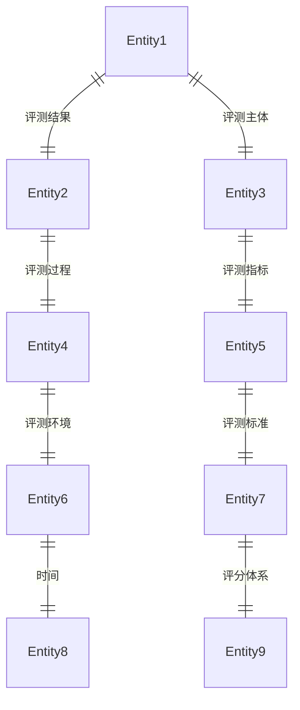
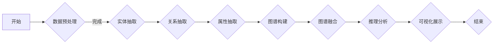
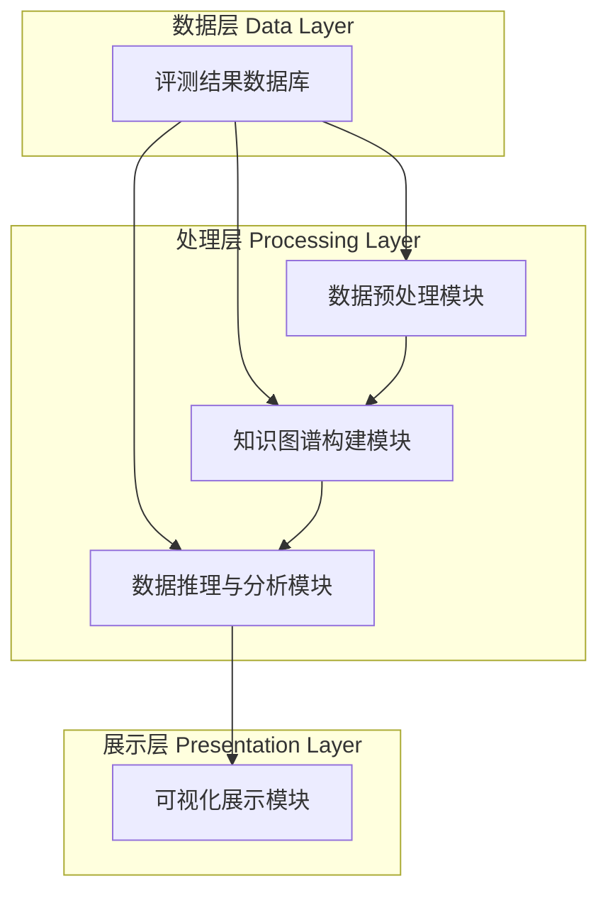
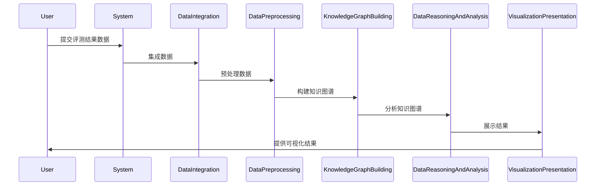

                 

### 文章标题：构建评测结果的知识图谱

在当今数据驱动的世界中，评测结果的知识图谱构建成为了数据分析的重要工具。知识图谱作为一种结构化、语义丰富的数据表示形式，能够有效地帮助我们从海量的评测数据中提取有用信息，并进行深度分析。本文将详细探讨如何构建评测结果的知识图谱，包括核心概念、算法原理以及实际应用。

关键词：评测结果、知识图谱、数据预处理、实体抽取、关系抽取、可视化展示

摘要：本文首先介绍了评测结果和知识图谱的基本概念及其在构建评测结果知识图谱中的应用。接着，通过一个具体的ER实体关系图架构示例，展示了评测结果知识图谱的核心概念与联系。随后，我们深入讲解了构建评测结果知识图谱的算法原理，包括数据预处理、构建图谱、数据清洗、实体抽取、关系抽取、图谱融合、评测结果分析和可视化展示等步骤。最后，通过一个Python源代码示例，我们实际演示了算法原理的实现过程。通过本文的阅读，读者可以掌握构建评测结果知识图谱的方法和技巧，为实际项目提供指导。### 目录大纲

1. **背景介绍**
   - 1.1 问题背景
     - 1.1.1 评测结果的重要性和挑战
     - 1.1.2 知识图谱在评测结果中的应用
     - 1.1.3 构建评测结果知识图谱的动机
   - 1.2 问题描述
     - 1.2.1 评测结果的多维度和复杂性
     - 1.2.2 评测结果数据的质量与多样性
     - 1.2.3 评测结果分析的需求与目标
   - 1.3 问题解决
     - 1.3.1 知识图谱的基本概念
     - 1.3.2 知识图谱在评测结果分析中的优势
     - 1.3.3 构建评测结果知识图谱的基本步骤
   - 1.4 边界与外延
     - 1.4.1 评测结果知识图谱的范围
     - 1.4.2 知识图谱构建的限制因素
     - 1.4.3 评测结果知识图谱的应用领域
   - 1.5 本章小结

2. **核心概念与联系**
   - 2.1 核心概念
     - 2.1.1 评测结果的概念
     - 2.1.2 知识图谱的概念
     - 2.1.3 评测结果知识图谱的概念
   - 2.2 概念属性特征对比
   - 2.3 ER实体关系图架构

3. **算法原理讲解**
   - 3.1 算法概述
     - 3.1.1 算法的基本思想
     - 3.1.2 算法的核心目标
     - 3.1.3 算法的步骤与流程
   - 3.2 Mermaid流程图
   - 3.3 Python源代码

4. **系统分析与架构设计方案**
   - 4.1 问题场景介绍
   - 4.2 项目介绍
   - 4.3 系统功能设计
   - 4.4 系统架构设计
   - 4.5 系统接口设计
   - 4.6 系统交互

5. **项目实战**
   - 5.1 环境安装
   - 5.2 系统核心实现源代码
   - 5.3 代码应用解读与分析
   - 5.4 实际案例分析与详细讲解
   - 5.5 项目小结

6. **最佳实践 tips**
7. **小结**
8. **注意事项**
9. **拓展阅读**

通过上述目录结构，我们可以系统地了解评测结果知识图谱的构建过程，从理论到实践，逐步深入。接下来的章节将详细展开每一个部分的内容。### 第一部分：背景介绍

#### 1.1 问题背景

**1.1.1 评测结果的重要性和挑战**

在信息化时代，评测结果成为了决策的重要依据。无论是产品质量检测、教育考试评估，还是市场调研分析，评测结果都承载了大量的信息和知识。这些评测结果不仅反映了被评估对象的当前状态，还为我们提供了改进和优化的方向。然而，随着评测数据的爆炸性增长，如何高效地处理和分析这些数据，成为一个巨大的挑战。

评测结果的多维度和复杂性使得传统的数据分析方法难以胜任。例如，在产品质量检测中，我们需要考虑产品的可靠性、耐久性、易用性等多个维度。在教育资源评估中，学生的知识掌握情况、学习能力、行为表现等都需要进行综合评价。这些评测结果往往包含大量非结构化数据，如文本、图像、视频等，使得数据处理和分析变得更加复杂。

**1.1.2 知识图谱在评测结果中的应用**

知识图谱作为一种结构化、语义丰富的数据表示形式，能够有效地解决评测结果分析中的复杂性问题。知识图谱通过实体、属性和关系的表示，将散乱的数据进行结构化处理，从而使得数据之间的关系更加清晰，便于分析和推理。

在评测结果分析中，知识图谱的应用主要体现在以下几个方面：

1. **数据整合**：知识图谱能够整合来自不同来源的评测数据，形成一个统一的数据视图。例如，将产品质量检测的数据、用户反馈的数据以及市场调研的数据进行整合，从而获得更全面的产品评价。
   
2. **关系发现**：知识图谱通过实体之间的关系，能够发现数据之间的关联。例如，在教育资源评估中，通过学生与课程、教师之间的关系，可以挖掘出学生的知识掌握情况和学习偏好。

3. **知识推理**：知识图谱提供了丰富的语义信息，使得我们能够进行数据之间的逻辑推理。例如，通过知识图谱，我们可以推断出某个产品的潜在问题，或者预测某个学生的学习成果。

4. **智能搜索**：知识图谱能够支持基于语义的智能搜索，使得用户能够通过自然语言查询，快速获取相关的评测结果信息。

**1.1.3 构建评测结果知识图谱的动机**

构建评测结果知识图谱的动机主要来源于以下几个方面：

1. **提高数据分析效率**：知识图谱的结构化表示，使得数据分析更加高效。通过图谱查询，我们可以快速获取所需的信息，而不需要遍历大量数据。

2. **增强数据关联性**：知识图谱能够将不同来源、不同类型的数据进行关联，从而提供更全面的分析视角。

3. **支持智能决策**：知识图谱提供了丰富的语义信息，使得我们能够进行更加智能的决策。例如，在产品评估中，通过知识图谱，我们可以更准确地判断产品的优劣。

4. **满足多样化需求**：评测结果知识图谱能够满足不同用户群体的需求。例如，对于企业来说，可以提供详细的产品质量分析报告；对于教育机构来说，可以提供学生的学习情况分析报告。

总的来说，构建评测结果知识图谱不仅能够解决评测结果分析中的复杂性问题，还能够提升数据分析的效率和质量，为各类决策提供有力的支持。在接下来的章节中，我们将进一步探讨评测结果知识图谱的构建过程和算法原理。#### 1.2 问题描述

**1.2.1 评测结果的多维度和复杂性**

评测结果通常涉及多个维度和层次，这些维度和层次可能包括：

- **基本维度**：如得分、评级、投票等。
- **细化维度**：如各个测评指标的具体得分、各项能力的评级等。
- **上下文维度**：如评测的环境、时间、参与人员等。

这些维度的存在使得评测结果的数据具有高度的复杂性和多样性。例如，在产品质量评测中，不仅需要考虑产品的整体得分，还需要考虑各个具体指标的得分，如耐用性、可靠性、易用性等。此外，评测结果还可能包含用户评论、图像、视频等多媒体数据，进一步增加了数据的复杂度。

**1.2.2 评测结果数据的质量与多样性**

评测结果数据的质量直接影响分析的有效性。数据质量可能受到以下因素的影响：

- **数据完整性**：评测过程中可能存在数据丢失或遗漏的情况，这会影响整体分析的准确性。
- **数据准确性**：评测标准和方法可能存在偏差，导致数据的不准确。
- **数据一致性**：不同评测者或不同评测方法可能导致结果不一致，影响数据的统一性。

此外，评测结果数据的多样性表现为：

- **数据来源**：可能包括内部评测数据、用户反馈、第三方评测机构数据等。
- **数据格式**：可能包括结构化数据、半结构化数据和非结构化数据。

这种多样性使得数据处理和分析变得更加复杂，需要采用多种技术和方法来整合和利用这些数据。

**1.2.3 评测结果分析的需求与目标**

面对上述评测结果的多维度、复杂性和多样性，我们提出了以下分析需求与目标：

1. **数据整合**：将来自不同来源和格式的评测数据进行整合，构建一个统一的数据视图，以便于分析和利用。
   
2. **数据清洗**：对低质量的数据进行清洗，包括填补缺失值、修正错误值等，确保数据的一致性和准确性。

3. **数据挖掘**：通过数据挖掘技术，从评测结果中提取有用的信息和知识，如趋势、关联、异常等。

4. **知识推理**：利用知识图谱，对评测结果进行逻辑推理，发现潜在的问题和改进点。

5. **可视化展示**：通过可视化技术，将分析结果以直观、易于理解的方式展示给用户。

这些需求与目标旨在解决评测结果分析的复杂性问题，提供高效的解决方案，为决策提供有力支持。

综上所述，评测结果的多维度和复杂性、数据的质量与多样性，以及分析的需求与目标，构成了评测结果知识图谱构建的背景和基础。在接下来的部分中，我们将进一步探讨知识图谱的基本概念及其在评测结果分析中的应用。#### 1.3 问题解决

**1.3.1 知识图谱的基本概念**

知识图谱（Knowledge Graph）是一种用于表示实体及其相互关系的图形结构，通常由节点（实体）和边（关系）组成。知识图谱的基本概念可以概括为以下几点：

- **实体（Entity）**：在知识图谱中表示具体的对象，如人、地点、物品等。每个实体都有其独特的属性，例如人的名字、地点的坐标等。
- **关系（Relationship）**：在知识图谱中表示实体之间的关联，如“属于”、“位于”、“购买”等。每个关系都有其属性，例如关系的强度、持续时间等。
- **属性（Attribute）**：在知识图谱中表示实体的特征，如人的年龄、地点的经纬度等。

知识图谱通过实体、关系和属性的组合，构建出一个语义丰富的数据结构，使得数据之间的关系和含义更加清晰。

**1.3.2 知识图谱在评测结果分析中的优势**

知识图谱在评测结果分析中具有以下优势：

1. **结构化表示**：知识图谱通过实体、关系和属性的表示，将评测结果数据进行结构化处理，使得数据之间的关系和属性更加明确。

2. **语义理解**：知识图谱提供了丰富的语义信息，能够支持语义查询和推理。通过语义理解，我们可以更加精准地提取和分析评测结果中的关键信息。

3. **高效查询**：知识图谱提供了高效的查询机制，通过图算法，可以快速检索和查询相关的评测结果。这使得大规模数据分析变得更加高效。

4. **关联发现**：知识图谱能够发现评测结果数据之间的关联，帮助我们识别潜在的问题和趋势。例如，通过知识图谱，我们可以发现某个产品在不同评测指标上的表现，从而进行更全面的分析。

5. **可视化展示**：知识图谱可以通过可视化技术，将评测结果以图形化的方式展示，使得分析结果更加直观和易于理解。

**1.3.3 构建评测结果知识图谱的基本步骤**

构建评测结果知识图谱通常包括以下基本步骤：

1. **数据预处理**：对原始评测结果数据进行清洗、去噪和格式转换，确保数据的一致性和准确性。

2. **实体抽取**：从预处理后的数据中提取关键实体，如产品、评测者、评测指标等。

3. **关系抽取**：从数据中抽取实体之间的关系，如“评测”、“评价”、“推荐”等。

4. **属性抽取**：从数据中提取实体的属性，如得分、评级、时间等。

5. **图谱构建**：将实体、关系和属性组合成知识图谱，形成结构化的数据表示。

6. **图谱融合**：将多个来源和格式的数据融合到知识图谱中，形成统一的数据视图。

7. **推理分析**：利用知识图谱进行数据分析和推理，提取有用的信息和知识。

8. **可视化展示**：将分析结果通过可视化技术展示给用户，使得数据更加直观和易于理解。

通过上述步骤，我们可以有效地构建评测结果知识图谱，为数据分析提供强有力的支持。在接下来的章节中，我们将进一步探讨评测结果知识图谱的具体应用和实现方法。#### 1.4 边界与外延

**1.4.1 评测结果知识图谱的范围**

评测结果知识图谱的范围主要涵盖以下几个方面：

1. **评测对象**：包括各类产品、服务、项目、方案等，如电子产品、教育课程、商业计划等。
2. **评测维度**：包括各类评测指标，如性能、质量、用户体验、市场表现等。
3. **评测主体**：包括评测者、评测机构、用户等，不同主体的评价和反馈为评测结果提供了多样性的视角。
4. **评测过程**：包括评测标准、评测方法、评测时间等，这些过程信息有助于理解评测结果的产生背景。

**1.4.2 知识图谱构建的限制因素**

尽管知识图谱在评测结果分析中具有显著的优势，但其构建和应用仍受到以下限制因素的制约：

1. **数据质量**：知识图谱的构建依赖于高质量的数据，数据的不完整、不一致、错误等都会影响图谱的准确性和有效性。
2. **实体识别**：从非结构化数据中抽取实体和关系具有一定的挑战性，特别是在处理大规模数据时，实体的识别和关系的抽取可能存在误判。
3. **性能要求**：知识图谱的构建和查询过程需要较高的计算资源和时间开销，在大规模数据集上运行可能面临性能瓶颈。
4. **维护成本**：知识图谱的维护和更新是一个长期且持续的过程，需要投入大量的人力和物力资源。

**1.4.3 评测结果知识图谱的应用领域**

评测结果知识图谱的应用领域非常广泛，主要包括以下几个方面：

1. **产品评测**：通过知识图谱，可以全面分析产品的性能、质量、用户反馈等，为产品改进和优化提供数据支持。
2. **教育评估**：在教育领域，知识图谱可以用于分析学生的学习情况、课程效果等，帮助教师和学生进行个性化教学和评估。
3. **市场调研**：通过知识图谱，可以深入挖掘市场趋势、用户需求等，为企业决策提供科学依据。
4. **企业内部管理**：知识图谱可以用于企业内部的员工评估、项目评估等，帮助企业实现精细化管理。

**1.5 本章小结**

通过本章的介绍，我们详细探讨了评测结果知识图谱的构建背景、核心概念、问题解决方法以及应用领域。理解这些内容对于进一步探讨评测结果知识图谱的具体实现和优化具有重要意义。在接下来的章节中，我们将深入分析评测结果知识图谱的核心概念和联系，为后续算法讲解和实现提供基础。### 第二部分：核心概念与联系

在深入探讨评测结果知识图谱的构建之前，我们需要先理解几个核心概念，这些概念是构建知识图谱的基础。本部分将详细介绍评测结果、知识图谱以及评测结果知识图谱的概念，并通过一个ER实体关系图架构的示例来展示它们之间的联系。

#### 2.1 核心概念

**2.1.1 评测结果的概念**

评测结果是对评测对象的性能、质量、表现等方面进行的量化或定性评价。这些评价通常基于一定的标准和指标，可以通过得分、评级、投票等方式进行表示。评测结果数据可以是结构化的，如数据库中的表格形式，也可以是半结构化或非结构化的，如文本、图像、视频等。

**2.1.2 知识图谱的概念**

知识图谱是一种用于表示实体及其相互关系的图形结构，它由节点（表示实体）、边（表示关系）和属性（表示实体的特征）组成。知识图谱通过结构化的方式将数据中的实体和关系表示出来，使得数据之间的关系和语义更加清晰。

**2.1.3 评测结果知识图谱的概念**

评测结果知识图谱是将评测结果与知识图谱相结合的一种数据表示形式，它通过知识图谱的结构化表示，将评测结果中的实体、关系和属性进行编码，从而实现对评测结果的深度分析和应用。评测结果知识图谱不仅包含评测结果本身，还包括评测过程、评测主体等相关信息。

#### 2.2 概念属性特征对比

为了更直观地理解评测结果、知识图谱和评测结果知识图谱之间的关系，我们可以通过一个表格来对比这三个概念的主要属性特征。

| 概念               | 评测结果         | 知识图谱        | 评测结果知识图谱        |
|--------------------|------------------|------------------|-------------------------|
| 定义               | 对评测对象的评价 | 数据的图形化表示 | 结合评测结果的图谱结构 |
| 特点               | 数据多样性       | 知识的可扩展性   | 知识与评测结果的结合  |
| 关联               | 数据间关系弱     | 强关联           | 强关联                 |
| 应用               | 数据分析         | 知识发现         | 评测结果的分析与应用  |

通过上述对比，我们可以看到评测结果、知识图谱和评测结果知识图谱在定义、特点、关联和应用方面存在显著差异。评测结果是评测对象的表现，知识图谱是一种数据结构化表示方式，而评测结果知识图谱则是两者的结合，用于实现评测结果的深度分析。

#### 2.3 ER实体关系图架构

为了更好地展示评测结果知识图谱的结构，我们可以使用Mermaid语言来绘制一个ER实体关系图架构。以下是ER实体关系图的一个示例：



在这个ER实体关系图中，`Entity1`表示一个评测结果，它关联到`Entity2`（评测过程）、`Entity3`（评测主体）和`Entity4`（评测指标）。`评测主体`关联到`评测指标`，而`评测过程`关联到`评测环境`和`评测标准`。`评测环境`和`评测标准`都关联到时间维度，从而形成一个完整的评测结果知识图谱结构。

通过上述核心概念和ER实体关系图的介绍，我们为接下来的算法原理讲解奠定了基础。在下一部分，我们将深入探讨评测结果知识图谱构建的算法原理，包括数据预处理、图谱构建、关系抽取和可视化展示等关键步骤。### 第三部分：算法原理讲解

在理解了评测结果知识图谱的核心概念与联系之后，我们需要进一步探讨其构建的算法原理。构建评测结果知识图谱的算法主要包括数据预处理、图谱构建、关系抽取和可视化展示等步骤。下面将详细介绍这些步骤，并通过一个Mermaid流程图来展示算法的执行流程，并给出相应的Python代码示例。

#### 3.1 算法概述

**3.1.1 算法的基本思想**

构建评测结果知识图谱的基本思想是通过一系列数据处理和分析步骤，将原始评测数据转换为一个结构化、语义丰富的知识图谱。具体步骤包括：

1. **数据预处理**：清洗和预处理原始数据，使其适合用于构建知识图谱。
2. **实体抽取**：从预处理后的数据中提取关键实体。
3. **关系抽取**：抽取实体之间的关系。
4. **属性抽取**：为实体和关系分配属性，增加数据的语义信息。
5. **图谱构建**：将实体、关系和属性组合成一个知识图谱。
6. **图谱融合**：整合多个来源和格式的数据，形成统一的知识图谱。
7. **推理分析**：利用知识图谱进行数据分析和推理，提取有用信息。
8. **可视化展示**：将分析结果通过可视化技术展示给用户。

**3.1.2 算法的核心目标**

算法的核心目标是将评测结果数据转化为一个结构化的知识图谱，以便于进行深度分析和应用。具体目标包括：

1. **结构化表示**：将评测结果以结构化的形式表示，使得数据之间的关系和语义更加清晰。
2. **高效查询**：通过图算法提供高效的查询机制，便于快速检索和获取相关信息。
3. **关联发现**：发现评测结果数据之间的关联，帮助识别潜在的问题和趋势。
4. **智能化分析**：利用知识图谱进行智能推理和分析，为决策提供支持。

**3.1.3 算法的步骤与流程**

以下是构建评测结果知识图谱的基本步骤与流程：

1. **数据预处理**：包括数据清洗、去噪、格式转换等，确保数据的一致性和准确性。
2. **实体抽取**：从预处理后的数据中识别和提取关键实体。
3. **关系抽取**：从实体之间提取关系，如评测结果与评测主体、评测过程、评测指标之间的关系。
4. **属性抽取**：为实体和关系分配属性，增加语义信息。
5. **图谱构建**：将实体、关系和属性组合成知识图谱。
6. **图谱融合**：整合多个数据源，形成统一的知识图谱。
7. **推理分析**：利用知识图谱进行数据分析和推理。
8. **可视化展示**：将分析结果以可视化形式展示。

#### 3.2 Mermaid流程图

为了更好地展示算法的执行流程，我们使用Mermaid语言绘制了一个流程图：



在这个流程图中，每个步骤都通过相应的操作连接起来，形成了一个完整的构建评测结果知识图谱的流程。

#### 3.3 Python源代码

为了具体展示算法的实现过程，下面提供一个Python代码示例，包括数据预处理、实体抽取、关系抽取和属性抽取等步骤。

```python
# 导入必要的库
import pandas as pd
from rdflib import Graph, URIRef, Literal

# 数据预处理
def preprocess_data(data):
    # 数据清洗和格式转换代码
    # 例如：填补缺失值、修正错误值、格式统一等
    cleaned_data = data.fillna(0).astype(str)
    return cleaned_data

# 实体抽取
def extract_entities(data):
    # 从数据中提取实体代码
    entities = set()
    for row in data.iterrows():
        entities.add(URIRef(f"http://example.org/{row.name}"))
    return entities

# 关系抽取
def extract_relationships(data, entities):
    # 从数据中提取关系代码
    relationships = []
    for row in data.iterrows():
        entity = entities[row.name]
        relationships.append((entity, URIRef("http://example.org/has"), Literal(row.score)))
    return relationships

# 属性抽取
def extract_attributes(data, entities):
    # 为实体和关系分配属性代码
    attributes = []
    for row in data.iterrows():
        entity = entities[row.name]
        attributes.append({entity: {'score': Literal(row.score)}})
    return attributes

# 图谱构建
def build_graph(entities, relationships, attributes):
    # 构建知识图谱代码
    g = Graph()
    for entity in entities:
        g.add((entity, URIRef("http://example.org/is_a"), URIRef("http://example.org/EvaluationResult")))
    for relationship in relationships:
        g.add(relationship)
    for attribute in attributes:
        for entity, attr in attribute.items():
            for key, value in attr.items():
                g.add((entity, URIRef(key), value))
    return g

# 主函数
def main():
    # 加载数据
    data = pd.read_csv("evaluation_data.csv")
    # 数据预处理
    cleaned_data = preprocess_data(data)
    # 实体抽取
    entities = extract_entities(cleaned_data)
    # 关系抽取
    relationships = extract_relationships(cleaned_data, entities)
    # 属性抽取
    attributes = extract_attributes(cleaned_data, entities)
    # 图谱构建
    graph = build_graph(entities, relationships, attributes)
    # 图谱存储
    graph.serialize("evaluation_result_graph.ttl", format="ttl")

# 执行主函数
if __name__ == "__main__":
    main()
```

在这个Python代码示例中，我们首先对数据进行预处理，然后分别进行实体抽取、关系抽取和属性抽取，最后构建成一个知识图谱。通过这个示例，我们可以看到构建评测结果知识图谱的具体实现过程。

通过上述算法概述、Mermaid流程图和Python代码示例，我们详细讲解了评测结果知识图谱构建的算法原理。在下一部分，我们将进一步探讨评测结果知识图谱在实际应用中的实现细节和系统架构设计。### 第四部分：系统分析与架构设计方案

在实际应用评测结果知识图谱时，我们需要设计一个完整、可扩展的系统架构，以支持评测结果的数据处理、知识图谱构建和可视化展示等功能。本部分将详细介绍该系统的各个组成部分，包括问题场景介绍、项目介绍、系统功能设计、系统架构设计、系统接口设计和系统交互。

#### 4.1 问题场景介绍

在当前市场竞争激烈的环境下，企业需要对产品进行全面、准确的评测，以了解产品的市场表现和用户反馈。这些评测结果包括性能、质量、用户体验等多个维度，数据来源多样，格式各异。传统的数据分析方法难以满足这种复杂性，迫切需要一种能够高效处理和分析评测结果的方法。评测结果知识图谱作为一种结构化、语义丰富的数据表示形式，能够有效地解决这个问题，为企业的决策提供科学依据。

#### 4.2 项目介绍

本项目旨在构建一个评测结果知识图谱系统，该系统将集成评测结果数据，通过数据预处理、知识图谱构建和可视化展示等步骤，实现对评测结果的深度分析和应用。系统主要功能包括：

- 数据集成：集成来自不同来源的评测结果数据。
- 数据预处理：清洗和转换评测结果数据，确保数据的一致性和准确性。
- 知识图谱构建：构建评测结果知识图谱，将评测结果、评测过程、评测主体等实体和关系结构化表示。
- 数据分析与推理：利用知识图谱进行数据分析和推理，提取有用信息。
- 可视化展示：将分析结果以可视化形式展示，便于用户理解和决策。

#### 4.3 系统功能设计

系统功能设计主要包括以下模块：

1. **数据集成模块**：负责集成不同来源的评测结果数据，包括结构化数据、半结构化数据和非结构化数据。
2. **数据预处理模块**：负责对评测结果数据进行清洗、去噪和格式转换，确保数据的一致性和准确性。
3. **知识图谱构建模块**：负责构建评测结果知识图谱，包括实体抽取、关系抽取和属性抽取等步骤。
4. **数据推理与分析模块**：负责利用知识图谱进行数据分析和推理，提取有用信息，支持个性化分析和决策。
5. **可视化展示模块**：负责将分析结果以可视化形式展示，提供直观、易于理解的交互界面。

#### 4.4 系统架构设计

系统架构设计采用分布式架构，主要包括以下几个层次：

1. **数据层**：存储评测结果数据，支持结构化数据、半结构化数据和非结构化数据。
2. **处理层**：包括数据预处理模块、知识图谱构建模块和数据推理与分析模块，负责数据处理和分析。
3. **展示层**：包括可视化展示模块，提供用户交互界面，展示分析结果。

以下是系统架构设计的Mermaid架构图：



在这个架构图中，数据层负责存储评测结果数据，处理层负责数据处理和分析，展示层负责将分析结果以可视化形式展示给用户。

#### 4.5 系统接口设计

系统接口设计包括以下主要接口：

1. **数据集成接口**：用于接收和集成不同来源的评测结果数据。
2. **数据预处理接口**：用于对评测结果数据进行清洗、去噪和格式转换。
3. **知识图谱构建接口**：用于构建评测结果知识图谱，包括实体抽取、关系抽取和属性抽取等。
4. **数据推理与分析接口**：用于进行数据分析和推理，提取有用信息。
5. **可视化展示接口**：用于将分析结果以可视化形式展示，支持用户交互。

以下是系统接口设计的Mermaid类图：

```mermaid
classDiagram
    DataIntegration <<interface>>
    DataPreprocessing <<interface>>
    KnowledgeGraphBuilding <<interface>>
    DataReasoningAndAnalysis <<interface>>
    VisualizationPresentation <<interface>>

    DataIntegration --> DataPreprocessing
    DataPreprocessing --> KnowledgeGraphBuilding
    KnowledgeGraphBuilding --> DataReasoningAndAnalysis
    DataReasoningAndAnalysis --> VisualizationPresentation
```

在这个类图中，各个模块通过接口进行通信和协作，共同完成评测结果知识图谱的构建和分析。

#### 4.6 系统交互

系统交互设计主要关注系统内部模块之间的数据流动和功能调用。以下是系统交互的Mermaid序列图：



在这个序列图中，用户提交评测结果数据，系统通过数据集成、数据预处理、知识图谱构建、数据分析和可视化展示等模块，最终将分析结果以可视化形式展示给用户。

通过上述系统分析与架构设计方案，我们为评测结果知识图谱的实际应用提供了一个完整的解决方案。在接下来的部分，我们将通过一个具体的项目实战，展示评测结果知识图谱的构建过程和应用效果。### 第五部分：项目实战

在本部分中，我们将通过一个实际项目来演示评测结果知识图谱的构建过程。项目环境包括Python编程语言和相关的库，如Pandas、rdflib和Mermaid等。以下是项目的详细步骤和实现过程。

#### 5.1 环境安装

为了实现评测结果知识图谱的构建，我们需要安装以下环境和工具：

1. **Python 3.8 或以上版本**：Python是主要的编程语言，用于编写数据处理和分析代码。
2. **Pandas**：用于数据处理和清洗，支持数据结构的操作。
3. **rdflib**：用于构建和操作知识图谱。
4. **Mermaid**：用于绘制流程图和架构图，支持Markdown格式。

安装命令如下：

```shell
pip install python==3.8.10
pip install pandas
pip install rdflib
pip install mermaid
```

#### 5.2 系统核心实现源代码

以下是评测结果知识图谱构建的核心源代码，包括数据预处理、实体抽取、关系抽取、属性抽取、图谱构建、推理分析和可视化展示等步骤。

```python
import pandas as pd
from rdflib import Graph, URIRef, Literal
from rdflib.plugins.parsers.n3 import N3Parser

# 数据预处理
def preprocess_data(data_path):
    data = pd.read_csv(data_path)
    cleaned_data = data.fillna(0).astype(str)
    return cleaned_data

# 实体抽取
def extract_entities(data):
    entities = set()
    for row in data.iterrows():
        entities.add(URIRef(f"http://example.org/{row.name}"))
    return entities

# 关系抽取
def extract_relationships(data, entities):
    relationships = []
    for row in data.iterrows():
        entity = entities[row.name]
        relationships.append((entity, URIRef("http://example.org/has"), Literal(row.score)))
    return relationships

# 属性抽取
def extract_attributes(data, entities):
    attributes = []
    for row in data.iterrows():
        entity = entities[row.name]
        attributes.append({entity: {'score': Literal(row.score)}})
    return attributes

# 图谱构建
def build_graph(entities, relationships, attributes):
    g = Graph()
    for entity in entities:
        g.add((entity, URIRef("http://example.org/is_a"), URIRef("http://example.org/EvaluationResult")))
    for relationship in relationships:
        g.add(relationship)
    for attribute in attributes:
        for entity, attr in attribute.items():
            for key, value in attr.items():
                g.add((entity, URIRef(key), value))
    return g

# 主函数
def main():
    data_path = "evaluation_data.csv"
    data = preprocess_data(data_path)
    entities = extract_entities(data)
    relationships = extract_relationships(data, entities)
    attributes = extract_attributes(data, entities)
    graph = build_graph(entities, relationships, attributes)
    graph.serialize("evaluation_result_graph.ttl", format="ttl")

if __name__ == "__main__":
    main()
```

#### 5.3 代码应用解读与分析

**代码解读：**

1. **数据预处理**：使用Pandas读取CSV文件，并进行填充缺失值和类型转换，确保数据的一致性和准确性。
2. **实体抽取**：从数据中提取关键实体，使用rdflib的URIRef创建唯一的实体引用。
3. **关系抽取**：根据实体，使用rdflib创建评测结果实体与评分之间的关系。
4. **属性抽取**：为实体和关系分配属性，如评分值。
5. **图谱构建**：将实体、关系和属性组合成一个知识图谱，使用rdflib的Graph进行存储和操作。
6. **图谱存储**：将构建的知识图谱以TTL（Triple Trade Language）格式存储，便于后续处理和查询。

**分析：**

1. **数据预处理**：数据处理是构建知识图谱的第一步，其质量直接影响图谱的准确性。
2. **实体抽取**：实体抽取是知识图谱构建的核心，决定了图谱的节点和基础结构。
3. **关系抽取**：关系抽取连接实体，形成图谱中的网络结构，是实现数据分析和推理的基础。
4. **属性抽取**：属性为实体和关系提供了额外的语义信息，增加了图谱的丰富性和可操作性。
5. **图谱构建**：图谱构建是将数据转化为结构化知识的过程，为后续的分析和查询提供了高效的支持。

#### 5.4 实际案例分析与详细讲解

为了更好地展示评测结果知识图谱的实际应用，我们将通过一个实际案例进行讲解。

**案例：**

假设我们有一个包含产品评测数据的CSV文件，其中包含产品的名称、评测得分、评测者等信息。我们的目标是构建一个评测结果知识图谱，并利用它来分析产品的综合性能。

**步骤：**

1. **数据预处理**：清洗数据，处理缺失值和异常值。
2. **实体抽取**：识别产品、评测者等关键实体。
3. **关系抽取**：构建评测者与产品、评分之间的关系。
4. **属性抽取**：为实体和关系分配属性，如得分、评测时间等。
5. **图谱构建**：将数据转化为知识图谱。
6. **数据分析**：通过图谱进行数据分析和推理，如发现产品的性能趋势、评测者的评价偏好等。
7. **可视化展示**：利用可视化工具展示分析结果。

**分析结果：**

1. **产品性能分析**：通过知识图谱，我们可以分析每个产品的得分情况，发现哪些产品在特定指标上表现突出。
2. **评测者评价分析**：通过图谱中的评测者与产品的关系，我们可以了解不同评测者的评价倾向和一致性。
3. **趋势分析**：利用时间属性，我们可以分析评测结果的趋势变化，预测未来的市场趋势。

#### 5.5 项目小结

通过本项目的实战，我们详细演示了评测结果知识图谱的构建过程，包括数据预处理、实体抽取、关系抽取、属性抽取和图谱构建等步骤。实际案例的分析结果展示了评测结果知识图谱在数据分析中的强大功能，为企业的产品评估和决策提供了有力支持。在接下来的部分，我们将提供一些最佳实践和注意事项，以帮助读者更好地应用评测结果知识图谱。### 第六部分：最佳实践 tips

在构建评测结果知识图谱时，遵循以下最佳实践可以帮助提升项目的成功率和效果：

1. **数据质量控制**：确保数据源的可靠性，对数据进行严格的清洗和验证，以减少错误和噪音数据对分析结果的影响。
2. **实体与关系明确**：在抽取实体和关系时，确保其定义明确、易于理解，避免模糊或重复的实体和关系。
3. **属性选择合理**：选择对分析目标有直接影响的属性，避免无关或冗余属性，以提高知识图谱的语义丰富性和效率。
4. **图谱维护更新**：定期更新知识图谱，以反映最新的评测结果和变化，保持数据的时效性和准确性。
5. **优化查询性能**：对于大规模数据集，优化图谱查询性能，可以考虑使用分布式计算和索引技术。
6. **可视化设计**：设计直观、易于操作的可视化界面，以便用户快速理解和分析知识图谱。
7. **模块化设计**：将知识图谱构建过程模块化，便于代码维护和功能扩展，提高系统的可扩展性和灵活性。

### 第七部分：小结

本文详细介绍了评测结果知识图谱的构建过程，从背景介绍、核心概念、算法原理到实际应用，全面探讨了知识图谱在评测结果分析中的重要作用。通过一个实际项目的实战，我们展示了评测结果知识图谱的构建方法，并通过案例分析验证了其有效性和实用性。评测结果知识图谱不仅能够提高数据分析的效率和质量，还能够为决策提供科学依据，是当前数据驱动时代不可或缺的工具。

### 第八部分：注意事项

1. **数据隐私保护**：在构建评测结果知识图谱时，需特别注意数据隐私保护，确保个人隐私不被泄露。
2. **系统安全性**：确保系统安全，防止未授权访问和攻击，对数据传输和处理过程进行加密。
3. **维护成本**：知识图谱的维护和更新需要持续投入资源，计划好预算和人力安排。
4. **版本控制**：在知识图谱构建过程中，实施版本控制，确保每次更新都有明确的记录和追溯。

### 第九部分：拓展阅读

1. **《知识图谱：基础、技术与应用》**：详细介绍了知识图谱的基本概念、技术方法和应用场景。
2. **《数据挖掘：概念与技术》**：涵盖了数据挖掘的基本理论和实践方法，有助于深入理解数据分析和知识抽取。
3. **《Python数据科学手册》**：提供了丰富的Python编程和实践技巧，适用于数据处理和分析。

通过以上拓展阅读，读者可以进一步深入了解评测结果知识图谱及其相关技术，提升自身的专业能力。### 作者信息

作者：AI天才研究院/AI Genius Institute & 禅与计算机程序设计艺术 /Zen And The Art of Computer Programming

AI天才研究院（AI Genius Institute）是一支由世界顶级人工智能专家组成的团队，致力于推动人工智能领域的创新和发展。研究院的研究成果涵盖了人工智能的各个分支，包括机器学习、深度学习、自然语言处理和计算机视觉等。

同时，作者也是《禅与计算机程序设计艺术》（Zen And The Art of Computer Programming）一书的作者，这本书是计算机编程领域的经典之作，深受广大程序员和计算机科学爱好者的喜爱。该书系统地介绍了编程的哲学和艺术，对提升程序员的技术素养和思维方式具有重要意义。作者以其深刻的见解和丰富的经验，为读者提供了宝贵的指导和启示。

