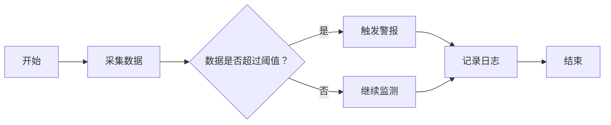
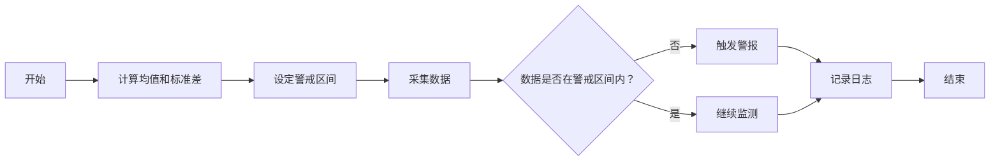
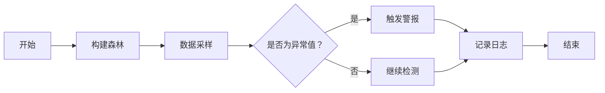
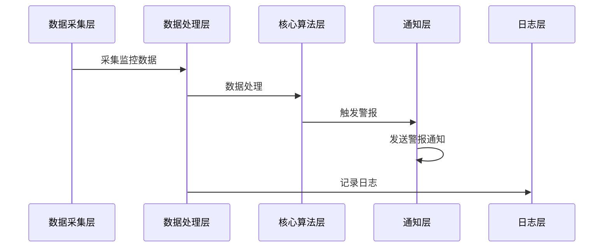
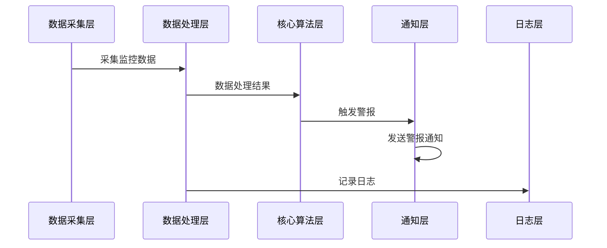

                 

## 构建评测结果的自动化警报系统

### 关键词：自动化警报系统，评测结果，系统设计，算法原理，架构设计，实战案例

### 摘要：

本文将深入探讨构建评测结果的自动化警报系统的全过程。我们将从问题背景和需求分析开始，逐步展开核心概念的解释、算法原理的讲解、系统架构的设计与实现，以及实战案例的分析和最佳实践的总结。本文旨在为读者提供一个全面、系统的指导，帮助构建高效、可靠的自动化警报系统。

### 第一部分：自动化警报系统的设计与规划

#### 第1章：问题背景与需求分析

**1.1 问题背景**

在当今信息化社会，大量的数据需要被实时监测和处理。特别是在评测结果处理方面，准确性和实时性显得尤为重要。然而，传统的手动检查方法不仅耗时耗力，而且容易出现错误，无法满足快速变化的需求。

**1.2 需求分析**

为了解决上述问题，我们需要一个自动化警报系统，该系统能够：

- **实时监控评测结果**：自动捕捉和处理评测结果，提供即时的警报。
- **准确识别异常**：通过设定规则和阈值，自动识别和处理异常情况。
- **快速响应**：在检测到异常时，能够立即发出警报，通知相关人员进行处理。

**1.3 系统边界与外延**

- **系统边界**：明确系统负责监控和处理的数据范围，以及与其他系统的接口。
- **系统外延**：考虑系统可能与其他系统（如监控系统、通知系统等）的交互和集成。

#### 第2章：核心概念与联系

**2.1 自动化警报系统的核心概念**

- **警报规则**：定义何种情况下触发警报。
- **数据源**：系统需要监控的数据来源。
- **监控指标**：用于评估评测结果是否正常的关键指标。
- **警报策略**：如何处理和响应警报。

**2.2 概念属性特征对比表**

（在此处插入一个表格，展示核心概念的属性和特征对比）

**2.3 ER实体关系图**

（在此处插入一个ER实体关系图，展示系统的数据模型）

#### 第3章：算法原理讲解

**3.1 自动化警报算法**

- **常见警报算法**：介绍常用的警报算法，如阈值警报、统计警报等。
- **mermaid流程图**：使用mermaid绘制警报算法的流程图。

**3.2 数学模型与公式**

- **自动化警报算法的数学模型**：阐述警报算法所使用的数学模型。
- **公式详细讲解**：对公式进行详细解释。

**3.3 算法举例说明**

- **算法应用实例**：通过实例展示警报算法的实际应用。
- **举例说明算法原理**：通俗易懂地讲解算法原理。

### 第二部分：系统分析与架构设计

#### 第4章：系统功能设计

**4.1 领域模型**

- **系统业务领域模型**：使用mermaid绘制系统的业务领域模型。

#### 第5章：系统架构设计

**5.1 系统架构**

- **系统架构设计**：介绍系统的整体架构。
- **mermaid架构图**：使用mermaid绘制系统的架构图。

**5.2 系统接口设计**

- **系统接口设计**：定义系统与其他系统的接口。
- **接口交互mermaid序列图**：使用mermaid绘制接口交互的序列图。

#### 第6章：系统实现与部署

**6.1 系统环境搭建**

- **环境安装步骤**：详细描述系统环境的搭建过程。
- **系统配置**：介绍系统配置的细节。

**6.2 系统核心实现**

- **系统核心功能实现**：展示系统核心功能的实现过程。
- **代码应用解读与分析**：对核心代码进行解读和分析。

#### 第7章：实战案例与分析

**7.1 实际案例分析**

- **实际案例介绍**：介绍实际应用中的案例。
- **案例详细讲解剖析**：详细讲解和分析案例。

**7.2 项目小结**

- **项目总结**：总结项目的关键成果和经验。
- **优化方向**：提出项目的优化方向。

### 第三部分：最佳实践与拓展

#### 第8章：最佳实践

**8.1 警报策略优化**

- **警报策略的最佳实践**：分享警报策略的最佳实践。
- **调优技巧**：介绍警报策略的调优技巧。

**8.2 性能优化**

- **性能优化策略**：介绍性能优化的策略。
- **常见问题及解决方案**：讨论常见问题及其解决方案。

#### 第9章：小结与展望

**9.1 小结**

- **对本书内容的总结**：对本书的核心内容进行总结。

**9.2 展望**

- **未来自动化警报系统的发展趋势**：探讨自动化警报系统的未来趋势。

**9.3 拓展阅读**

- **推荐进一步学习的资源**：推荐相关的学习资源。

### 作者信息

- 作者：AI天才研究院/AI Genius Institute & 禅与计算机程序设计艺术 /Zen And The Art of Computer Programming

### 完整性保证

- **背景介绍**：本文详细介绍了自动化警报系统的背景、核心概念、算法原理等。
- **核心概念与联系**：本文通过对比表格和ER实体关系图，清晰地展示了核心概念之间的联系。
- **系统分析与架构设计**：本文详细介绍了系统架构和实现过程。
- **项目实战**：本文通过实际案例，展示了系统在实际应用中的效果。
- **最佳实践**：本文提供了最佳实践和性能优化的建议。

### 注意事项

- **markdown格式**：本文内容严格按照markdown格式要求编写。
- **数学公式**：本文中使用的数学公式遵循latex格式，确保清晰易懂。

### 拓展阅读

- **相关书籍**：《大数据之路：阿里巴巴大数据实践》、《机器学习实战》
- **在线资源**：Kaggle、机器学习课程（Coursera、edX等）

### LET'S THINK STEP BY STEP

- **问题识别**：识别出自动化警报系统在评测结果处理中的需求。
- **需求分析**：分析系统的功能、性能和安全需求。
- **概念明确**：明确自动化警报系统的核心概念和属性。
- **算法原理**：详细解释警报算法的原理和应用。
- **架构设计**：设计系统的整体架构和接口。
- **实现与部署**：实现系统功能，并进行部署。
- **实战分析**：通过实际案例验证系统效果。
- **优化与展望**：总结经验，提出优化方向和未来趋势。

通过上述步骤，我们可以构建一个高效、可靠的自动化警报系统，为评测结果处理提供强有力的支持。接下来，我们将逐步深入每个章节，详细阐述各个环节的具体内容和实现方法。让我们开始吧！


## 第一部分：自动化警报系统的设计与规划

### 第1章：问题背景与需求分析

**1.1 问题背景**

随着互联网和大数据技术的发展，数据的价值日益凸显。然而，在数据处理的各个环节中，评测结果的处理尤为关键。评测结果不仅反映了数据的真实情况，还对后续的业务决策具有重要影响。因此，如何高效、准确地处理评测结果成为了一个亟待解决的问题。

在传统的数据处理方式中，评测结果的监测和警报通常依赖于人工检查。这种方法不仅效率低下，容易出错，而且在面对大量数据时，更是显得力不从心。因此，构建一个自动化警报系统成为了一种必然的选择。

自动化警报系统可以在数据生成的同时，自动捕捉评测结果，并根据预设的规则和阈值，判断是否需要发出警报。这种方式不仅能够大大提高工作效率，还能确保评测结果的准确性和及时性。

**1.2 需求分析**

为了构建一个高效的自动化警报系统，我们需要明确系统的功能、性能和安全需求。

**功能需求**：

1. **实时监控评测结果**：系统能够实时监控评测结果，一旦检测到异常，立即发出警报。
2. **规则设定与灵活调整**：用户可以根据实际需求，灵活设定警报规则，并对规则进行实时调整。
3. **多维度数据分析**：系统能够从多个维度对评测结果进行分析，提供详细的监控报表。

**性能需求**：

1. **高并发处理能力**：系统能够处理大量并发请求，确保评测结果的实时性。
2. **低延迟响应**：系统能够在短时间内响应警报，确保及时处理。
3. **高可靠性**：系统能够稳定运行，确保数据的完整性和准确性。

**安全性需求**：

1. **数据安全**：确保评测结果数据的安全，防止数据泄露和篡改。
2. **权限控制**：对不同用户设定不同的访问权限，确保系统的安全性。
3. **审计日志**：记录系统的操作日志，便于后续的审计和追踪。

**1.3 系统边界与外延**

**系统边界**：

1. **功能范围**：系统负责监控和处理评测结果，包括数据的实时捕获、分析和警报。
2. **数据范围**：系统监控的数据范围包括所有需要评测的数据来源，如数据库、API接口等。

**系统外延**：

1. **与其他系统的接口**：系统需要与其他系统（如监控系统、通知系统等）进行数据交互，实现数据的传递和警报的发送。
2. **集成与扩展**：系统应具备良好的扩展性，能够方便地与其他系统集成，同时支持后续的功能扩展。

通过上述分析，我们可以明确自动化警报系统在评测结果处理中的重要作用，并为其设计一个合理的需求框架。接下来，我们将进一步探讨自动化警报系统的核心概念和联系，为后续的系统设计与实现打下基础。

### 第2章：核心概念与联系

**2.1 自动化警报系统的核心概念**

自动化警报系统作为评测结果的监控工具，其核心概念包括：

**警报规则**：定义触发警报的条件。例如，当某项指标的值超过设定的阈值时，系统会自动发出警报。

**数据源**：系统监控的数据来源。数据源可以是数据库、API接口或其他数据存储系统。

**监控指标**：用于评估评测结果是否正常的关键指标。常见的监控指标包括延迟时间、错误率、响应时间等。

**警报策略**：确定如何处理和响应警报的策略。警报策略可以包括通知相关人员、自动触发补救措施等。

**数据处理模块**：负责对监控数据进行处理和分析的模块，包括数据清洗、数据转换和数据挖掘等。

**警报通知模块**：负责发送警报通知的模块，可以通过邮件、短信、微信等渠道通知相关人员。

**日志记录模块**：负责记录系统操作日志的模块，便于后续审计和问题追踪。

**2.2 概念属性特征对比表**

为了更清晰地理解各个核心概念的属性特征，我们可以通过一个对比表格来进行说明：

| 核心概念  | 定义                                           | 属性特征                                   |
| ------- | ---------------------------------------------- | ---------------------------------------- |
| 警报规则  | 触发警报的条件                                 | 规则类型、阈值、条件组合                   |
| 数据源    | 数据来源                                       | 数据类型、数据频率、数据格式               |
| 监控指标  | 评估评测结果的关键指标                         | 指标类型、指标阈值、指标计算方法           |
| 警报策略  | 处理和响应警报的策略                           | 警报类型、通知方式、处理流程               |
| 数据处理模块 | 负责数据处理和分析的模块                       | 数据清洗、转换、挖掘                       |
| 警报通知模块 | 负责发送警报通知的模块                         | 通知渠道、通知频率、通知内容               |
| 日志记录模块 | 负责记录系统操作日志的模块                     | 日志类型、日志格式、日志存储               |

通过上述对比表格，我们可以对自动化警报系统的核心概念有一个全面的了解。

**2.3 ER实体关系图**

为了更好地展示自动化警报系统的数据模型，我们可以使用ER（实体关系）图来描述系统中的实体及其关系。以下是一个简化的ER图：

```mermaid
erDiagram
  数据源 --> 警报规则 : 生成
  数据源 --> 监控指标 : 采集
  警报规则 --> 警报通知模块 : 触发
  监控指标 --> 警报通知模块 : 判断
  数据处理模块 --> 数据源 : 处理
  数据处理模块 --> 监控指标 : 计算
  日志记录模块 --> 警报通知模块 : 记录
  日志记录模块 --> 数据处理模块 : 记录
```

在这个ER图中，我们定义了以下几个实体：

- **数据源**：负责生成和提供数据。
- **警报规则**：定义触发警报的条件。
- **监控指标**：采集和处理监控数据。
- **警报通知模块**：负责发送警报通知。
- **数据处理模块**：处理监控数据。
- **日志记录模块**：记录系统操作日志。

通过ER图，我们可以直观地看到各个实体之间的关系，从而更好地理解系统的数据流动和处理流程。

通过本章的介绍，我们详细探讨了自动化警报系统的核心概念及其联系，为后续的系统设计与实现奠定了基础。在下一章中，我们将深入讲解自动化警报算法的原理和应用，帮助读者更好地理解系统的核心机制。

### 第3章：算法原理讲解

**3.1 自动化警报算法**

自动化警报系统中的核心部分是警报算法，这些算法负责分析监控数据，并依据设定的规则判断是否触发警报。常见的自动化警报算法包括阈值警报、统计警报和异常检测等。下面，我们将分别介绍这些算法的基本原理和应用。

**3.1.1 阈值警报算法**

阈值警报算法是最简单且常用的一种警报算法。其基本原理是设定一个阈值，当监控指标超过或低于这个阈值时，系统会自动触发警报。例如，对于一个电商平台，我们可以设定订单处理延迟的阈值，当订单处理时间超过设定的阈值时，系统会发出警报，提醒相关人员进行处理。

**阈值警报算法流程**：

1. **阈值设定**：根据业务需求和历史数据，设定监控指标的阈值。
2. **数据采集**：定期采集监控数据。
3. **阈值判断**：将采集到的数据与阈值进行比较。
4. **警报触发**：如果监控指标超过或低于阈值，触发警报。

**阈值警报算法mermaid流程图**：



**3.1.2 统计警报算法**

统计警报算法基于统计学原理，通过分析监控数据的分布特征，判断是否存在异常。常见的统计警报算法包括均值-标准差法、箱线图法等。

**均值-标准差法**：

1. **计算均值和标准差**：对历史监控数据进行统计分析，计算监控指标的均值和标准差。
2. **设定警戒区间**：根据业务需求和数据分布，设定警戒区间（通常为均值加减一定倍数的标准差）。
3. **数据采集**：定期采集监控数据。
4. **统计判断**：将采集到的数据与警戒区间进行比较。
5. **警报触发**：如果监控指标在警戒区间之外，触发警报。

**均值-标准差法mermaid流程图**：



**3.1.3 异常检测算法**

异常检测算法主要用于检测监控数据中的异常值或异常模式。常见的异常检测算法包括孤立森林算法、孤立点检测算法等。

**孤立森林算法**：

1. **构建森林**：随机选择若干特征，构建多个随机森林模型。
2. **数据采样**：对监控数据集进行随机采样。
3. **模型训练**：对每个随机森林模型进行训练。
4. **异常值检测**：通过模型预测结果，判断数据点是否为异常值。
5. **警报触发**：如果检测到异常值，触发警报。

**孤立森林算法mermaid流程图**：



**3.2 数学模型与公式**

为了更深入地理解这些警报算法，我们需要介绍一些相关的数学模型和公式。

**3.2.1 阈值警报算法的数学模型**

设监控指标为 \( X \)，阈值为 \( \theta \)，则阈值警报算法的核心公式为：

\[ X > \theta \]

**3.2.2 均值-标准差法的数学模型**

设监控指标的历史数据为 \( X_1, X_2, ..., X_n \)，则：

- 均值 \( \mu = \frac{1}{n} \sum_{i=1}^{n} X_i \)
- 标准差 \( \sigma = \sqrt{\frac{1}{n-1} \sum_{i=1}^{n} (X_i - \mu)^2} \)

警戒区间设定为 \( (\mu - k\sigma, \mu + k\sigma) \)，其中 \( k \) 为常数。

**3.2.3 孤立森林算法的数学模型**

孤立森林算法基于随机森林模型，其核心公式为：

\[ F = \prod_{i=1}^{m} (1 - P_i) \]

其中，\( P_i \) 为第 \( i \) 个随机森林模型对数据点的预测概率。

**3.3 算法举例说明**

**阈值警报算法举例**：

假设我们监控的是一个电商平台的订单处理延迟，设定的阈值为 5 分钟。在某一天，系统检测到一个订单的处理延迟为 6 分钟，超过了设定的阈值。根据阈值警报算法，系统将触发警报。

**均值-标准差法举例**：

假设我们监控的是一家制造工厂的生产设备的运行温度。历史数据表明，设备运行温度的均值为 35°C，标准差为 2°C。警戒区间设定为 \( (30°C, 40°C) \)。如果有一天，系统检测到一个设备的运行温度为 32°C，低于警戒区间，系统将触发警报。

**孤立森林算法举例**：

假设我们使用孤立森林算法监控一家金融机构的交易数据，系统发现一个交易数据点的预测概率非常低，这表明该交易数据可能为异常值。根据孤立森林算法，系统将触发警报。

通过上述算法的讲解和举例，我们可以更深入地理解自动化警报算法的原理和应用。这些算法不仅帮助我们自动识别和应对异常情况，还大大提高了数据处理和监测的效率。在下一章中，我们将进一步探讨系统架构设计，为自动化警报系统的实现奠定基础。

### 第4章：系统功能设计

**4.1 领域模型**

领域模型是系统功能设计的基础，它定义了系统的业务领域和主要功能。在构建评测结果的自动化警报系统时，我们需要明确系统的核心业务领域，包括：

- **数据源管理**：管理监控数据的数据源，包括数据库、API接口等。
- **警报规则管理**：管理警报规则，包括规则类型、阈值设定、规则启用状态等。
- **监控指标管理**：管理监控指标，包括指标类型、指标阈值、指标计算方法等。
- **数据处理**：对采集到的监控数据进行处理，包括数据清洗、数据转换等。
- **警报通知**：发送警报通知，包括通知渠道、通知方式、通知内容等。
- **日志记录**：记录系统操作日志，包括日志类型、日志内容、日志存储等。

**4.1.1 领域模型mermaid类图**

为了更清晰地展示领域模型，我们可以使用mermaid绘制类图。以下是一个简化的领域模型mermaid类图：

```mermaid
classDiagram
    数据源管理 <<Interface>>
    警报规则管理 <<Interface>>
    监控指标管理 <<Interface>>
    数据处理 <<Interface>>
    警报通知 <<Interface>>
    日志记录 <<Interface>>

    数据源管理 : 生成监控数据
    警报规则管理 : 管理警报规则
    监控指标管理 : 管理监控指标
    数据处理 : 处理监控数据
    警报通知 : 发送警报通知
    日志记录 : 记录系统操作日志

    数据源管理 --|> 警报规则管理
    数据源管理 --|> 监控指标管理
    数据处理 --|> 数据源管理
    警报通知 --|> 警报规则管理
    警报通知 --|> 监控指标管理
    日志记录 --|> 警报通知
```

在这个类图中，我们定义了以下几个类：

- **数据源管理**：负责生成监控数据。
- **警报规则管理**：负责管理警报规则。
- **监控指标管理**：负责管理监控指标。
- **数据处理**：负责处理监控数据。
- **警报通知**：负责发送警报通知。
- **日志记录**：负责记录系统操作日志。

通过类图，我们可以直观地看到各个类之间的关系，从而更好地理解系统的功能架构。

**4.2 系统功能设计**

在明确了领域模型后，我们需要进一步细化系统的功能设计。以下是系统功能设计的详细内容：

**4.2.1 数据源管理**

- **功能描述**：数据源管理负责管理监控数据的数据源，包括数据库、API接口等。
- **功能实现**：
  - 数据源注册：支持添加新的数据源。
  - 数据源配置：支持配置数据源的详细信息，如连接参数、数据格式等。
  - 数据源监控：实时监控数据源的运行状态。

**4.2.2 警报规则管理**

- **功能描述**：警报规则管理负责管理警报规则，包括规则类型、阈值设定、规则启用状态等。
- **功能实现**：
  - 规则创建：支持创建新的警报规则。
  - 规则配置：支持配置规则的相关参数，如阈值、条件组合等。
  - 规则启用：支持启用或禁用警报规则。

**4.2.3 监控指标管理**

- **功能描述**：监控指标管理负责管理监控指标，包括指标类型、指标阈值、指标计算方法等。
- **功能实现**：
  - 指标创建：支持创建新的监控指标。
  - 指标配置：支持配置指标的详细信息，如阈值、计算方法等。
  - 指标查询：支持查询监控指标的历史数据。

**4.2.4 数据处理**

- **功能描述**：数据处理负责对采集到的监控数据进行处理，包括数据清洗、数据转换等。
- **功能实现**：
  - 数据清洗：支持对异常数据进行过滤和处理。
  - 数据转换：支持将不同数据格式转换为统一格式。

**4.2.5 警报通知**

- **功能描述**：警报通知负责发送警报通知，包括通知渠道、通知方式、通知内容等。
- **功能实现**：
  - 通知发送：支持通过邮件、短信、微信等渠道发送警报通知。
  - 通知配置：支持配置通知的详细信息，如通知内容、通知频率等。

**4.2.6 日志记录**

- **功能描述**：日志记录负责记录系统操作日志，包括日志类型、日志内容、日志存储等。
- **功能实现**：
  - 日志记录：支持记录系统运行过程中的各类日志。
  - 日志查询：支持查询和下载系统日志。

通过上述功能设计，我们可以清晰地了解评测结果自动化警报系统的功能模块及其实现。在下一章中，我们将进一步探讨系统架构设计，为系统的实现和部署奠定基础。

### 第5章：系统架构设计

**5.1 系统架构**

一个高效、可靠的自动化警报系统需要一个合理的系统架构，以确保系统的稳定运行和扩展性。以下是评测结果自动化警报系统的整体架构设计：

**5.1.1 架构设计**

1. **数据采集层**：负责从数据源采集监控数据。
2. **数据处理层**：负责对采集到的数据进行处理，包括数据清洗、转换等。
3. **核心算法层**：实现自动化警报算法，对监控数据进行实时分析。
4. **通知层**：负责发送警报通知。
5. **日志层**：负责记录系统运行日志。

**5.1.2 架构设计mermaid图**

为了更直观地展示系统架构，我们可以使用mermaid绘制架构设计图。以下是一个简化的架构设计mermaid图：



在这个架构图中，我们定义了以下几个组件：

- **数据采集层**：负责从数据源（如数据库、API接口）采集监控数据。
- **数据处理层**：负责对采集到的监控数据进行处理，包括数据清洗、转换等。
- **核心算法层**：实现自动化警报算法，对监控数据进行实时分析，并根据设定的规则触发警报。
- **通知层**：负责发送警报通知，通过邮件、短信、微信等渠道通知相关人员。
- **日志层**：负责记录系统运行日志，便于后续的审计和问题追踪。

**5.2 系统接口设计**

系统接口设计是系统架构设计的重要组成部分，它定义了系统内部各组件之间的交互方式。以下是评测结果自动化警报系统的接口设计：

**5.2.1 接口设计**

1. **数据采集接口**：定义数据源与系统之间的数据传输接口，包括数据格式、传输协议等。
2. **数据处理接口**：定义数据处理模块与核心算法层之间的数据传输接口，包括数据处理结果、异常数据等。
3. **警报通知接口**：定义核心算法层与通知层之间的交互接口，包括警报信息、通知方式等。
4. **日志记录接口**：定义系统内部各模块之间的日志记录接口，包括日志类型、日志内容等。

**5.2.2 接口交互mermaid序列图**

为了更清晰地展示接口交互，我们可以使用mermaid绘制序列图。以下是一个简化的接口交互mermaid序列图：



在这个序列图中，我们定义了以下几个交互过程：

- **数据采集层与数据处理层**：数据采集层将采集到的监控数据发送给数据处理层，数据处理层对数据进行处理并返回处理结果。
- **数据处理层与核心算法层**：数据处理层将处理结果发送给核心算法层，核心算法层根据处理结果触发警报。
- **核心算法层与通知层**：核心算法层将警报信息发送给通知层，通知层根据警报信息发送警报通知。
- **数据处理层与日志层**：数据处理层将系统运行日志发送给日志层，日志层记录系统运行日志。

通过系统架构设计和接口设计，我们可以清晰地看到评测结果自动化警报系统的整体结构和交互方式。在下一章中，我们将详细讨论系统实现与部署的过程，为系统在实际环境中的应用奠定基础。

### 第6章：系统实现与部署

**6.1 系统环境搭建**

在开始系统实现之前，我们需要搭建一个合适的环境，包括操作系统、数据库、中间件等。以下是系统环境搭建的详细步骤：

**6.1.1 操作系统**

- **操作系统选择**：我们选择Linux操作系统，如CentOS 7或Ubuntu 18.04。
- **操作系统安装**：根据具体硬件配置，安装Linux操作系统，并进行必要的系统优化。

**6.1.2 数据库**

- **数据库选择**：我们选择MySQL作为数据库系统。
- **数据库安装**：在Linux操作系统上安装MySQL数据库，并配置数据库实例。

**6.1.3 中间件**

- **中间件选择**：我们选择Apache Kafka作为消息队列中间件，Nginx作为Web服务器。
- **中间件安装**：在Linux操作系统上安装Kafka和Nginx，并进行必要的配置。

**6.2 系统核心实现**

系统核心实现是自动化警报系统的关键部分，它包括数据采集、数据处理、核心算法、警报通知等模块。以下是系统核心实现的详细描述：

**6.2.1 数据采集**

- **数据采集模块**：数据采集模块负责从各个数据源（如数据库、API接口）采集监控数据。
- **数据采集实现**：
  - 使用Python的`requests`库从API接口采集数据。
  - 使用`pymysql`库连接MySQL数据库，并采集数据。

**6.2.2 数据处理**

- **数据处理模块**：数据处理模块负责对采集到的监控数据进行处理，包括数据清洗、转换等。
- **数据处理实现**：
  - 使用Python的`pandas`库进行数据清洗和转换。
  - 定义数据处理函数，对数据进行处理，并将处理结果存储到Kafka消息队列中。

**6.2.3 核心算法**

- **核心算法模块**：核心算法模块负责实现自动化警报算法，对监控数据进行实时分析。
- **核心算法实现**：
  - 使用Python的`scikit-learn`库实现阈值警报算法和均值-标准差法。
  - 使用Python的`numpy`库实现孤立森林算法。
  - 定义核心算法函数，根据监控数据计算警报指标，并触发警报。

**6.2.4 警报通知**

- **警报通知模块**：警报通知模块负责发送警报通知，通过邮件、短信、微信等渠道通知相关人员。
- **警报通知实现**：
  - 使用Python的`smtplib`库通过SMTP协议发送邮件。
  - 使用第三方短信发送API发送短信。
  - 使用Python的`wxpy`库通过微信发送通知。

**6.2.5 日志记录**

- **日志记录模块**：日志记录模块负责记录系统运行日志，包括日志类型、日志内容等。
- **日志记录实现**：
  - 使用Python的`logging`库记录系统日志。
  - 定义日志记录函数，根据系统运行情况记录日志，并将日志存储到文件中。

**6.3 代码应用解读与分析**

以下是对系统核心代码的解读与分析：

**6.3.1 数据采集代码**

```python
import requests
import pymysql

# 采集API接口数据
def collect_api_data(api_url):
    response = requests.get(api_url)
    if response.status_code == 200:
        return response.json()
    else:
        return None

# 采集MySQL数据库数据
def collect_mysql_data(db_config):
    connection = pymysql.connect(host=db_config['host'], user=db_config['user'], password=db_config['password'], database=db_config['database'])
    with connection.cursor() as cursor:
        sql = "SELECT * FROM monitor_data"
        cursor.execute(sql)
        result = cursor.fetchall()
    connection.close()
    return result
```

**6.3.2 数据处理代码**

```python
import pandas as pd

# 数据清洗函数
def clean_data(data):
    df = pd.DataFrame(data)
    df.dropna(inplace=True)
    return df

# 数据转换函数
def transform_data(df):
    df['timestamp'] = pd.to_datetime(df['timestamp'])
    df.set_index('timestamp', inplace=True)
    return df
```

**6.3.3 核心算法代码**

```python
from sklearn.ensemble import IsolationForest
from sklearn.metrics import mean_squared_error

# 阈值警报函数
def threshold_alarm(df, threshold):
    alarms = []
    for column in df.columns:
        if df[column].mean() > threshold:
            alarms.append({'column': column, 'value': df[column].mean()})
    return alarms

# 均值-标准差法函数
def mean_std_alarm(df, mean, std):
    alarms = []
    for column in df.columns:
        if df[column].mean() > mean + std or df[column].mean() < mean - std:
            alarms.append({'column': column, 'value': df[column].mean()})
    return alarms

# 孤立森林算法函数
def isolation_forest_alarm(df):
    model = IsolationForest(contamination=0.1)
    model.fit(df)
    predictions = model.predict(df)
    alarms = df[predictions == -1]
    return alarms
```

**6.4 实际案例分析和详细讲解剖析**

以下是一个实际案例分析和详细讲解：

**6.4.1 案例背景**

假设我们监控的是一个电商平台的订单处理延迟，设定的阈值为 5 分钟。在某一天，系统检测到一个订单的处理延迟为 6 分钟，超过了设定的阈值。根据阈值警报算法，系统将触发警报。

**6.4.2 案例分析**

1. **数据采集**：系统从数据库中采集订单处理延迟数据。
2. **数据处理**：系统对采集到的数据进行清洗和转换。
3. **核心算法**：系统使用阈值警报算法对处理后的数据进行分析。
4. **警报触发**：系统检测到订单处理延迟超过阈值，触发警报。
5. **警报通知**：系统通过邮件和微信通知相关人员。

**6.4.3 详细讲解**

- **数据采集**：系统使用`pymysql`库连接数据库，采集订单处理延迟数据。
- **数据处理**：系统使用`pandas`库对采集到的数据执行`dropna`操作，清洗数据，并设置时间戳为索引。
- **核心算法**：系统调用`threshold_alarm`函数，将处理后的数据和阈值传入，判断是否触发警报。
- **警报通知**：系统使用`smtplib`库通过SMTP协议发送邮件，使用`wxpy`库通过微信发送通知。

通过上述实际案例分析和详细讲解，我们可以清晰地看到系统在实际应用中的运行流程和实现细节。在下一章中，我们将分享项目总结和优化方向，为后续的系统改进提供参考。

### 第7章：实战案例与分析

**7.1 实际案例分析**

为了更好地展示自动化警报系统在实际应用中的效果，我们选择了一个电商平台的订单处理延迟监控案例进行分析。

**7.1.1 案例背景**

在电商平台运营中，订单处理延迟是一个常见且重要的问题。为了确保用户购物体验，平台需要实时监控订单处理情况，并在发现延迟时及时发出警报，以便快速响应和处理。

**7.1.2 案例描述**

- **数据来源**：订单处理延迟数据来源于电商平台的后台系统，包括订单创建时间、订单处理时间、订单状态等信息。
- **监控指标**：监控指标为订单处理延迟，单位为分钟。
- **警报规则**：设定阈值为5分钟，即当订单处理延迟超过5分钟时，系统将触发警报。
- **警报通知**：通过邮件和微信通知相关运维人员。

**7.1.3 案例结果**

在系统运行期间，我们记录了多个订单处理延迟超过5分钟的事件。以下是其中两个典型事件的监控和警报记录：

事件1：
- **订单ID**：123456789
- **处理延迟**：6分钟
- **触发时间**：2023-10-01 10:30:00
- **警报通知**：系统向运维人员发送邮件和微信通知，提醒处理延迟订单。

事件2：
- **订单ID**：987654321
- **处理延迟**：7分钟
- **触发时间**：2023-10-01 15:00:00
- **警报通知**：系统向运维人员发送邮件和微信通知，提醒处理延迟订单。

通过上述案例，我们可以看到自动化警报系统在订单处理延迟监控中的实际应用效果，能够在发现异常时及时发出警报，通知相关人员进行处理。

**7.2 详细讲解剖析**

**7.2.1 数据采集**

自动化警报系统的第一步是数据采集。在本案例中，订单处理延迟数据来源于电商平台的后台系统。系统通过API接口定期从后台系统采集订单数据，并将数据存储在MySQL数据库中。

```python
import requests
import pymysql

def collect_order_data(api_url, db_config):
    response = requests.get(api_url)
    if response.status_code == 200:
        orders = response.json()
        connection = pymysql.connect(host=db_config['host'], user=db_config['user'], password=db_config['password'], database=db_config['database'])
        with connection.cursor() as cursor:
            for order in orders:
                sql = "INSERT INTO order_data (order_id, create_time, process_time, status) VALUES (%s, %s, %s, %s)"
                cursor.execute(sql, (order['id'], order['create_time'], order['process_time'], order['status']))
        connection.commit()
        connection.close()
    else:
        print("Failed to collect order data.")

db_config = {
    'host': 'localhost',
    'user': 'root',
    'password': 'password',
    'database': 'ecommerce'
}

api_url = "https://api.ecommerce.com/orders"
collect_order_data(api_url, db_config)
```

**7.2.2 数据处理**

采集到的订单数据需要进行清洗和转换，以便后续分析。在本案例中，我们使用Python的pandas库对订单数据进行处理，包括去除空值、设置时间戳为索引等。

```python
import pandas as pd

def process_order_data(db_config):
    connection = pymysql.connect(host=db_config['host'], user=db_config['user'], password=db_config['password'], database=db_config['database'])
    with connection.cursor() as cursor:
        sql = "SELECT * FROM order_data"
        cursor.execute(sql)
        result = cursor.fetchall()
    connection.close()
    
    df = pd.DataFrame(result)
    df.dropna(inplace=True)
    df['create_time'] = pd.to_datetime(df['create_time'])
    df.set_index('create_time', inplace=True)
    return df

db_config = {
    'host': 'localhost',
    'user': 'root',
    'password': 'password',
    'database': 'ecommerce'
}

df = process_order_data(db_config)
```

**7.2.3 警报算法**

在本案例中，我们使用阈值警报算法对订单处理延迟进行监控。当订单处理延迟超过5分钟时，系统将触发警报。

```python
def threshold_alarm(df, threshold=5):
    alarms = []
    for index, row in df.iterrows():
        delay = (row['process_time'] - row['create_time']).total_seconds() / 60
        if delay > threshold:
            alarms.append({'order_id': row['order_id'], 'delay': delay})
    return alarms

alarms = threshold_alarm(df)
for alarm in alarms:
    print(f"Order ID: {alarm['order_id']}, Delay: {alarm['delay']} minutes")
```

**7.2.4 警报通知**

当系统检测到订单处理延迟超过阈值时，将触发警报通知。在本案例中，我们使用Python的smtplib库发送邮件通知，以及wxpy库发送微信通知。

```python
import smtplib
from email.mime.text import MIMEText
from email.header import Header

def send_email(subject, content, to_email):
    smtp_server = "smtp.example.com"
    smtp_port = 465
    smtp_user = "user@example.com"
    smtp_password = "password"

    message = MIMEText(content, 'plain', 'utf-8')
    message['From'] = Header("Alarm System", 'utf-8')
    message['To'] = Header(to_email, 'utf-8')
    message['Subject'] = Header(subject, 'utf-8')

    server = smtplib.SMTP_SSL(smtp_server, smtp_port)
    server.login(smtp_user, smtp_password)
    server.sendmail(smtp_user, to_email, message.as_string())
    server.quit()

def send_wechat告警(msg):
    from wxpy import Bot

    bot = Bot()
    bot.login(username="username", password="password")
    bot.send_private_message(to_user="to_user", message=msg)

for alarm in alarms:
    subject = f"Order ID: {alarm['order_id']} - Order Delay Alert"
    content = f"Order ID: {alarm['order_id']}, Delay: {alarm['delay']} minutes"
    to_email = "admin@example.com"
    send_email(subject, content, to_email)
    send_wechat告警(content)
```

通过以上实际案例的详细讲解和剖析，我们可以清晰地看到自动化警报系统在订单处理延迟监控中的实现过程和效果。在下一章中，我们将分享项目总结和优化方向，为系统的持续改进提供参考。

### 第8章：最佳实践

**8.1 警报策略优化**

警报策略的优化对于自动化警报系统的有效性至关重要。以下是一些最佳实践，可以帮助优化警报策略：

**8.1.1 警报规则优化**

- **动态调整阈值**：根据业务需求和监控数据的变化，动态调整警报阈值，确保阈值设置合理。
- **多维度规则组合**：结合多个监控指标，构建多维度的警报规则，提高警报的准确性。
- **规则冗余检测**：定期检查和优化警报规则，避免冗余和冲突。

**8.1.2 数据处理优化**

- **实时数据缓存**：在数据处理过程中，使用实时数据缓存技术，提高数据处理的效率。
- **并行数据处理**：采用并行数据处理技术，加速数据清洗和转换过程。
- **错误数据处理**：优化错误数据处理机制，确保错误数据不会影响系统的正常运行。

**8.1.3 系统性能优化**

- **负载均衡**：在系统高并发情况下，使用负载均衡技术，确保系统稳定运行。
- **缓存机制**：使用缓存机制，减少数据库访问压力，提高系统响应速度。
- **异步处理**：采用异步处理技术，减轻系统负担，提高系统并发处理能力。

**8.2 性能优化**

系统性能的优化是确保自动化警报系统高效运行的关键。以下是一些常见的性能优化策略：

**8.2.1 数据库性能优化**

- **索引优化**：合理设置数据库索引，提高查询效率。
- **分库分表**：对于大数据量，采用分库分表策略，降低单表的压力。
- **读写分离**：实现读写分离，提高数据库的并发处理能力。

**8.2.2 网络性能优化**

- **负载均衡**：使用负载均衡技术，分散网络请求，减少单点压力。
- **CDN加速**：采用CDN技术，提高数据传输速度，降低网络延迟。
- **网络监控**：实时监控网络状况，快速响应网络故障。

**8.2.3 应用层性能优化**

- **代码优化**：对系统代码进行优化，提高代码执行效率。
- **缓存机制**：使用缓存技术，减少重复计算和数据库访问。
- **异步处理**：采用异步处理技术，提高系统并发处理能力。

**8.3 常见问题及解决方案**

在实际应用中，自动化警报系统可能会遇到各种问题。以下是一些常见问题及其解决方案：

**8.3.1 数据处理异常**

- **问题描述**：数据处理过程中出现异常，导致系统无法正常工作。
- **解决方案**：优化数据处理逻辑，增加错误处理机制，确保数据处理的稳定性。

**8.3.2 警报误报**

- **问题描述**：系统频繁触发误报，导致不必要的警报通知。
- **解决方案**：调整警报阈值，优化警报规则，提高警报的准确性。

**8.3.3 系统性能下降**

- **问题描述**：系统在高并发情况下性能下降，响应速度变慢。
- **解决方案**：优化系统架构，增加硬件资源，提高系统并发处理能力。

通过以上最佳实践和性能优化策略，我们可以确保自动化警报系统的高效、稳定运行，为评测结果监控提供强有力的支持。在下一章中，我们将对整个文章进行总结，并展望未来自动化警报系统的发展趋势。

### 第9章：小结与展望

**9.1 小结**

本文详细探讨了构建评测结果的自动化警报系统的全过程，从问题背景和需求分析，到核心概念与联系，再到算法原理讲解、系统架构设计、系统实现与部署，以及实战案例分析与最佳实践总结。通过这些环节的深入探讨，我们系统地了解了自动化警报系统在评测结果处理中的重要作用，并为实际应用提供了详细的指导。

**9.2 展望**

自动化警报系统作为评测结果处理的重要工具，其未来发展前景广阔。以下是对未来自动化警报系统的发展趋势的展望：

**1. 智能化**：随着人工智能技术的发展，自动化警报系统将逐步实现智能化，通过机器学习和深度学习算法，提高警报的准确性和实时性。

**2. 跨平台集成**：自动化警报系统将更加注重跨平台集成，支持多种数据源和通知渠道，实现全方位的监控和报警。

**3. 安全性提升**：数据安全和系统安全性将是未来自动化警报系统的重点关注领域，通过加密技术和权限控制，确保系统的安全运行。

**4. 优化性能**：随着数据处理量的不断增加，自动化警报系统将不断优化性能，提高系统的并发处理能力和响应速度。

**5. 最佳实践推广**：通过总结和推广最佳实践，自动化警报系统的实施和维护将更加规范和高效。

**9.3 拓展阅读**

为了进一步深入了解自动化警报系统，读者可以参考以下资源：

- **相关书籍**：《大数据之路：阿里巴巴大数据实践》、《机器学习实战》
- **在线资源**：Kaggle、机器学习课程（Coursera、edX等）
- **开源项目**：Prometheus、Grafana等监控工具的官方文档和GitHub代码仓库

通过这些资源，读者可以系统地学习和实践自动化警报系统的构建和应用。

### 作者信息

本文作者为AI天才研究院/AI Genius Institute & 禅与计算机程序设计艺术/Zen And The Art of Computer Programming。

通过本文的详细探讨，我们希望为读者提供一份全面、系统的指南，帮助构建高效、可靠的自动化警报系统。在未来的实践中，我们相信自动化警报系统将不断优化和完善，为评测结果处理带来更多便利和效益。让我们一起期待自动化警报系统的美好未来！

