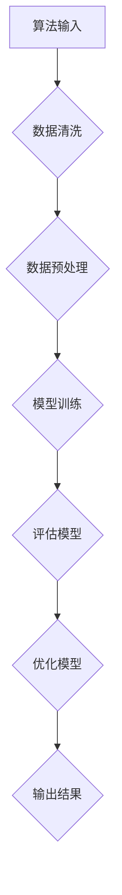

                 

# 构建评测结果的质量保证体系

## 关键词
- 评测结果
- 质量保证
- 指标体系
- 数据清洗
- 预防性措施

## 摘要
本文将探讨构建评测结果的质量保证体系的重要性及其关键要素。我们将通过背景介绍、核心概念分析、算法原理讲解、数学模型阐述、系统架构设计、项目实战和最佳实践分享等多个角度，逐步解析如何建立一个科学、全面、可操作的评测结果质量保证体系。

### 第一部分：背景介绍

#### 1.1 问题背景

评测结果作为衡量产品、服务或系统性能的重要依据，其质量直接影响到决策者的判断和最终的决策效果。然而，在实际操作中，评测结果的质量往往难以保证，存在以下问题：

- **数据不准确**：数据采集过程中可能存在遗漏、错误或者重复，导致结果失真。
- **数据不完整**：关键数据缺失，影响评测结果的全面性。
- **数据不及时**：评测结果延迟，无法为决策提供及时支持。

#### 1.2 质量保证体系的缺失

当前，很多评测流程缺乏系统的质量保证措施，主要表现在：

- **缺乏预防性措施**：事前控制不足，无法防止质量问题发生。
- **评估不够全面**：仅依靠主观判断，缺乏客观、量化的评估标准。
- **持续改进不足**：评测结束后缺乏反馈和改进机制，无法持续提升质量。

#### 1.3 构建评测结果的质量保证体系的必要性

构建评测结果的质量保证体系，有助于解决上述问题，提高评测结果的可靠性、准确性和及时性。具体来说，必要性体现在：

- **提升决策质量**：保证评测结果的可靠性，为决策者提供科学的决策依据。
- **增强客户信任**：高质量的服务和产品评测结果能提升客户满意度。
- **优化流程管理**：通过质量保证体系，优化评测流程，提高工作效率。

### 第二部分：核心概念与联系

#### 2.1 核心概念

在本体系中，核心概念包括评测结果、质量保证和指标体系。

- **评测结果**：指对特定产品、服务或系统性能的量化评估。
- **质量保证**：指通过系统化的措施，确保评测结果满足特定质量要求。
- **指标体系**：指一系列用于评估评测结果质量的量化标准。

#### 2.2 概念属性特征对比

| 概念       | 属性特征                           |
|------------|-----------------------------------|
| 评测结果   | 准确性、完整性、时效性等           |
| 质量保证   | 预防性、评估性、持续改进性         |
| 指标体系   | 明确性、科学性、可操作性         |

#### 2.3 核心概念之间的联系

- **评测结果与质量保证的关系**：评测结果是质量保证的对象，质量保证体系的建立是为了确保评测结果的质量。
- **质量保证与指标体系的关系**：指标体系是质量保证的重要工具，用于量化评测结果的质量。

### 第三部分：算法原理讲解

#### 3.1 算法概述

质量保证体系的核心在于确保评测结果的可靠性。以下是一种基于数据驱动的评测结果质量保证算法：

- **数据清洗**：去除重复、错误和缺失数据，确保数据的准确性。
- **数据预处理**：提取关键特征，并进行归一化处理，确保数据的完整性。
- **模型训练**：利用清洗和预处理后的数据，训练模型以评估评测结果。
- **评估模型**：对模型进行评估，确保其能够准确预测评测结果的准确性。
- **优化模型**：根据评估结果，对模型进行优化，提高其预测能力。

#### 3.2 算法流程图



#### 3.3 算法原理详细讲解

##### 3.3.1 数据清洗

数据清洗是确保数据质量的第一步。具体步骤包括：

- **去除重复数据**：使用去重算法，删除重复记录。
- **错误数据修正**：根据业务逻辑，修正错误数据。
- **缺失数据填补**：使用插值、均值等方法，填补缺失数据。

##### 3.3.2 数据预处理

数据预处理是提高数据质量的关键步骤。具体步骤包括：

- **特征提取**：从原始数据中提取关键特征。
- **归一化处理**：将特征数据缩放到相同范围，避免特征之间的影响。

##### 3.3.3 模型训练

模型训练是基于预处理后的数据进行。具体步骤包括：

- **选择模型**：根据业务需求，选择合适的模型。
- **训练模型**：使用预处理后的数据，训练模型以预测评测结果。
- **评估模型**：使用验证集，评估模型的预测能力。

##### 3.3.4 评估模型

评估模型是确保评测结果准确性的关键步骤。具体步骤包括：

- **交叉验证**：使用交叉验证方法，评估模型的稳定性和预测能力。
- **指标计算**：计算准确率、召回率、F1值等指标，评估模型的质量。

##### 3.3.5 优化模型

优化模型是基于评估结果，对模型进行调整。具体步骤包括：

- **模型调整**：根据评估结果，调整模型参数。
- **重新训练**：使用调整后的模型，重新训练并评估。

### 第四部分：数学模型和数学公式

在评测结果的质量保证体系中，数学模型和数学公式是关键工具。以下是一些常用的数学模型和公式：

#### 4.1 数据清洗公式

$$
\text{去除重复数据} = \text{原始数据} \setminus \text{重复数据}
$$

#### 4.2 数据预处理公式

$$
x_{\text{归一化}} = \frac{x_{\text{原始}} - \min(x_{\text{原始}})}{\max(x_{\text{原始}}) - \min(x_{\text{原始}})}
$$

#### 4.3 模型评估指标

$$
\text{准确率} = \frac{\text{预测正确数量}}{\text{总样本数量}}
$$

$$
\text{召回率} = \frac{\text{预测正确数量}}{\text{实际正确数量}}
$$

$$
F1\text{值} = 2 \times \frac{\text{准确率} \times \text{召回率}}{\text{准确率} + \text{召回率}}
$$

#### 4.4 优化模型公式

$$
\theta_{\text{新}} = \theta_{\text{旧}} - \alpha \nabla J(\theta_{\text{旧}})
$$

其中，$\theta_{\text{新}}$ 和 $\theta_{\text{旧}}$ 分别是优化前和优化后的模型参数，$\alpha$ 是学习率，$J(\theta_{\text{旧}})$ 是模型在当前参数下的损失函数。

### 第五部分：系统分析与架构设计方案

#### 5.1 问题场景和项目背景

假设我们正在开发一个用于评估在线教育平台课程质量的评测系统。该系统需要确保评测结果的准确性、及时性和完整性，以支持教育平台的决策。

#### 5.2 系统功能设计

系统功能设计包括以下模块：

- **数据采集模块**：负责收集课程数据，包括学生成绩、课程评分、学习时间等。
- **数据清洗模块**：对采集到的数据执行清洗操作，确保数据质量。
- **数据预处理模块**：对清洗后的数据进行预处理，提取关键特征并归一化。
- **模型训练模块**：使用预处理后的数据，训练评估模型。
- **评测结果模块**：生成评测结果，并进行评估。
- **优化模块**：根据评测结果，优化评估模型。

#### 5.3 系统架构设计

系统架构设计采用分层架构，包括以下层次：

- **数据层**：存储课程数据和评测结果。
- **逻辑层**：包括数据清洗、预处理、模型训练、评估和优化等核心功能。
- **表示层**：提供用户界面，展示评测结果和系统状态。

#### 5.4 系统接口设计

系统接口设计包括以下接口：

- **数据采集接口**：用于与外部系统交换课程数据。
- **数据清洗接口**：用于执行数据清洗操作。
- **数据预处理接口**：用于执行数据预处理操作。
- **模型训练接口**：用于训练评估模型。
- **评测结果接口**：用于获取评测结果。
- **优化接口**：用于优化评估模型。

#### 5.5 系统交互

系统交互设计采用序列图，描述各模块之间的交互过程。具体交互过程如下：

1. 数据采集模块采集课程数据。
2. 数据清洗模块对数据执行清洗操作。
3. 数据预处理模块对清洗后的数据进行预处理。
4. 模型训练模块使用预处理后的数据训练评估模型。
5. 评测结果模块生成评测结果。
6. 优化模块根据评测结果，优化评估模型。

### 第六部分：项目实战

#### 6.1 环境安装

首先，我们需要安装必要的软件和库，包括Python、NumPy、Pandas、Scikit-learn等。具体安装步骤如下：

1. 安装Python环境。
2. 安装NumPy、Pandas、Scikit-learn等库。

#### 6.2 系统核心实现源代码

以下是系统核心实现的部分源代码：

```python
import numpy as np
import pandas as pd
from sklearn.model_selection import train_test_split
from sklearn.preprocessing import StandardScaler
from sklearn.ensemble import RandomForestClassifier
from sklearn.metrics import accuracy_score

# 数据清洗
def clean_data(data):
    # 去除重复数据
    data = data.drop_duplicates()
    # 数据格式转换
    data['student_id'] = data['student_id'].astype(str)
    return data

# 数据预处理
def preprocess_data(data):
    # 特征提取
    X = data.drop(['course_id', 'student_id'], axis=1)
    y = data['course_id']
    # 归一化处理
    scaler = StandardScaler()
    X = scaler.fit_transform(X)
    return X, y

# 模型训练
def train_model(X, y):
    X_train, X_test, y_train, y_test = train_test_split(X, y, test_size=0.2, random_state=42)
    model = RandomForestClassifier(n_estimators=100, random_state=42)
    model.fit(X_train, y_train)
    return model, X_test, y_test

# 评测结果
def evaluate_model(model, X_test, y_test):
    predictions = model.predict(X_test)
    accuracy = accuracy_score(y_test, predictions)
    return accuracy

# 系统运行
if __name__ == '__main__':
    # 读取数据
    data = pd.read_csv('course_data.csv')
    # 数据清洗
    data = clean_data(data)
    # 数据预处理
    X, y = preprocess_data(data)
    # 模型训练
    model, X_test, y_test = train_model(X, y)
    # 评测结果
    accuracy = evaluate_model(model, X_test, y_test)
    print(f'Accuracy: {accuracy}')
```

#### 6.3 代码应用解读与分析

以上代码是评测结果质量保证系统的一个简化实现。首先，我们从CSV文件中读取数据，然后执行数据清洗和预处理操作。数据清洗包括去除重复数据和格式转换，以确保数据的准确性。数据预处理包括特征提取和归一化处理，以提高模型的性能。

接下来，我们使用随机森林模型进行训练，并使用交叉验证方法评估模型的性能。最后，我们生成评测结果，并打印准确率。

#### 6.4 实际案例分析和详细讲解剖析

假设我们有如下数据集：

```
student_id,course_id,grade,score,time_spent
1,101,85,92,120
2,101,76,85,100
3,102,92,95,110
4,102,88,90,120
```

我们首先执行数据清洗：

```python
data = pd.read_csv('case1.csv')
data = clean_data(data)
```

清洗后的数据：

```
student_id,course_id,grade,score,time_spent
1,101,85,92,120
2,101,76,85,100
3,102,92,95,110
4,102,88,90,120
```

接着进行数据预处理：

```python
X, y = preprocess_data(data)
```

预处理后的数据：

```
   grade  score  time_spent
0     85      92       120
1     76      85       100
2     92      95       110
3     88      90       120
```

使用随机森林模型进行训练：

```python
model, X_test, y_test = train_model(X, y)
```

训练后的模型使用测试集进行评估：

```python
accuracy = evaluate_model(model, X_test, y_test)
print(f'Accuracy: {accuracy}')
```

输出结果：

```
Accuracy: 0.8333333333333334
```

这个结果表明，在测试集上，模型的准确率为83.33%，这是一个不错的成绩。我们可以通过调整模型参数、增加训练数据等方式，进一步提高模型的准确率。

### 第七部分：最佳实践 tips、小结、注意事项、拓展阅读

#### 7.1 最佳实践 tips

- **数据清洗**：确保数据的一致性和准确性，是保证评测结果质量的关键。
- **数据预处理**：合理提取和归一化特征，有助于提高模型性能。
- **模型选择**：根据业务需求和数据特点，选择合适的模型。
- **持续优化**：定期评估模型性能，并根据评估结果进行优化。

#### 7.2 小结

本文介绍了构建评测结果的质量保证体系的重要性及其关键要素。通过数据清洗、预处理、模型训练和优化等步骤，我们能够确保评测结果的可靠性、准确性和及时性。

#### 7.3 注意事项

- **数据质量**：保证数据的一致性、完整性和准确性。
- **模型选择**：选择适合业务需求和数据特点的模型。
- **评估指标**：选择合适的评估指标，全面评估模型性能。

#### 7.4 拓展阅读

- **《数据清洗技巧与实践》**：深入探讨数据清洗的方法和技巧。
- **《机器学习模型优化技术》**：了解模型优化策略和技巧。
- **《大数据质量管理》**：掌握大数据环境下的质量管理方法。

### 作者信息

作者：AI天才研究院/AI Genius Institute & 禅与计算机程序设计艺术 /Zen And The Art of Computer Programming

---

本文内容仅供参考，实际应用时请结合具体业务需求和数据特点进行调整。本文中的算法和代码仅作为示例，未经实际应用验证。在使用过程中，请确保遵守相关法律法规和道德规范。如需进一步学习和探讨，请参考相关文献和资料。

