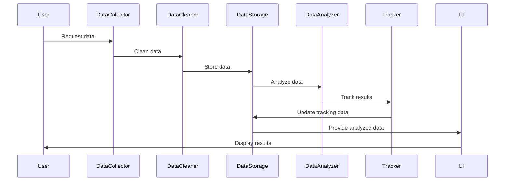

                 

### 第一部分：背景介绍

#### 1.1 问题背景

在当今快速发展的技术世界中，评测结果的长期跟踪分析系统变得至关重要。随着大数据和人工智能技术的不断进步，各种评测活动层出不穷，从学术研究到商业实践，评测结果的质量和准确性直接影响着决策和资源分配。然而，现有的评测系统往往存在以下几个问题：

1. **评测结果分散**：评测数据散布在各种平台和数据库中，缺乏统一的汇总和分析工具。
2. **结果解读困难**：大量数据使得结果解读变得复杂，难以快速提取有价值的信息。
3. **长期跟踪不足**：评测结果往往只关注短期效果，缺乏对长期趋势的分析。
4. **数据隐私和安全**：评测过程中涉及个人或敏感信息，如何确保数据的安全性和隐私性成为一大挑战。

#### 1.2 问题描述

针对上述问题，构建一个评测结果的长期跟踪分析系统显得尤为必要。该系统应当具备以下功能：

1. **数据汇总**：能够从不同来源汇总评测数据，并进行统一存储和管理。
2. **数据清洗**：对收集到的评测数据进行清洗，确保数据的质量和一致性。
3. **结果分析**：对清洗后的数据进行分析，提取出有价值的洞察和趋势。
4. **长期跟踪**：对评测结果进行长期跟踪，分析其长期效果和影响。
5. **数据安全和隐私保护**：确保评测数据的保密性和安全性。

#### 1.3 问题解决

为了解决上述问题，我们需要设计并实现一个综合性的评测结果长期跟踪分析系统。以下是解决该问题的几个关键步骤：

1. **需求分析**：明确系统的功能需求，包括数据收集、存储、分析和展示等方面。
2. **系统设计**：设计系统的架构和模块，确保各模块之间的协同工作。
3. **技术选型**：选择合适的技术栈，包括数据库、数据处理工具、分析算法等。
4. **系统实现**：根据设计方案，逐步实现系统的各个模块。
5. **测试与优化**：对系统进行充分的测试和优化，确保系统的稳定性和高效性。
6. **部署与维护**：将系统部署到生产环境，并进行长期的维护和更新。

#### 1.4 边界与外延

在构建评测结果长期跟踪分析系统时，我们需要考虑以下几个边界与外延：

1. **数据来源**：系统需要支持多种数据源，如数据库、文件、API等。
2. **数据类型**：系统需要能够处理不同类型的数据，包括结构化数据和非结构化数据。
3. **数据处理能力**：系统需要具备高效的数据处理能力，能够处理海量数据。
4. **用户角色**：系统需要支持多种用户角色，包括管理员、分析师、用户等。
5. **系统安全性**：系统需要确保数据的安全性和隐私性，采用加密、认证等安全措施。

#### 1.5 核心概念

构建评测结果长期跟踪分析系统涉及以下几个核心概念：

1. **评测数据**：指各类评测活动产生的结果数据，包括评分、评价、反馈等。
2. **数据清洗**：指对收集到的数据进行预处理，去除噪声和不一致数据。
3. **数据分析**：指对清洗后的数据进行挖掘和分析，提取有价值的信息。
4. **长期跟踪**：指对评测结果进行持续的监控和分析，观察其长期效果。
5. **用户界面**：指系统提供给用户的交互界面，用于数据查询和分析。

### 总结

构建评测结果的长期跟踪分析系统是一个复杂但必要的任务。通过明确问题背景、问题描述、问题解决方法、边界与外延以及核心概念，我们为后续的系统设计与实现奠定了坚实的基础。在下一部分，我们将深入探讨这些核心概念之间的联系，为后续的内容提供更深入的解读。

----------------------------------------------------------------

## 第二部分：核心概念与联系

### 第2章：核心概念与联系

#### 2.1 评测结果长期跟踪分析系统

评测结果长期跟踪分析系统是本文讨论的核心，它是一个综合性系统，旨在对评测结果进行汇总、分析、跟踪和展示。以下是该系统的关键组成部分及其作用：

1. **数据收集模块**：负责从不同来源收集评测数据，如数据库、API接口和文件等。
2. **数据清洗模块**：对收集到的评测数据进行清洗，去除噪声和不一致的数据，确保数据质量。
3. **数据分析模块**：对清洗后的数据进行深入分析，提取有价值的信息和洞察。
4. **长期跟踪模块**：对评测结果进行长期跟踪，观察其变化趋势和长期效果。
5. **用户界面模块**：提供一个直观的用户界面，方便用户进行数据查询和分析。

#### 2.2 数据分析工具与库

在构建评测结果长期跟踪分析系统时，我们需要利用一系列数据分析工具和库来提高系统的效率和准确性。以下是几个常用的工具和库：

1. **Pandas**：用于数据清洗和预处理，能够高效地进行数据操作和分析。
2. **NumPy**：提供高性能的数学计算库，用于数据处理和数学模型计算。
3. **Scikit-learn**：提供了一系列机器学习算法和工具，用于数据分析和应用。
4. **Matplotlib/Seaborn**：用于数据可视化，能够生成各种统计图表和图形。
5. **TensorFlow/Keras**：用于深度学习模型的设计和训练，适用于复杂的数据分析任务。

#### 2.3 系统架构设计

系统架构设计是构建评测结果长期跟踪分析系统的关键，它决定了系统的性能、可扩展性和可维护性。以下是该系统的架构设计：

1. **前端**：采用Vue.js或React等现代前端框架，提供用户友好的交互界面。
2. **后端**：采用Flask或Django等Web框架，处理数据请求和业务逻辑。
3. **数据库**：使用MySQL或PostgreSQL等关系型数据库，存储评测数据和元数据。
4. **缓存**：使用Redis等缓存系统，提高数据读取速度和系统响应性能。
5. **消息队列**：使用RabbitMQ或Kafka等消息队列系统，实现数据的异步处理和消息传递。

#### 2.4 ER实体关系图

为了更好地理解评测结果长期跟踪分析系统的数据结构和关系，我们可以使用ER（实体关系）图来展示系统的核心实体及其关系。以下是ER图的示例：

```mermaid
erDiagram
  User ||--|{ Evaluation : has }  
  Evaluation ||--|{ Result : has }  
  Result ||--|{ Analysis : is }  
  System ||--|{ User : manages }  
  System ||--|{ Evaluation : tracks }  
```

在这个ER图中，User（用户）实体与Evaluation（评测）实体之间存在“一对一”的关系，即每个用户可以有多个评测结果，每个评测结果属于一个用户。Evaluation实体与Result（结果）实体之间存在“一对多”的关系，即每个评测可以包含多个结果。Result实体与Analysis（分析）实体之间存在“一对一”的关系，即每个结果可以有一个分析结果。System（系统）实体与User和Evaluation实体之间存在“一对多”的关系，即系统可以管理多个用户和评测结果。

通过上述核心概念和联系的介绍，我们为理解评测结果长期跟踪分析系统的工作原理和设计提供了清晰的框架。在下一部分中，我们将深入探讨算法原理，使用Python源代码和LaTeX数学公式来详细阐述数据处理和分析的原理。

----------------------------------------------------------------

### 第3章：算法原理讲解

#### 3.1 数据预处理算法

数据预处理是构建评测结果长期跟踪分析系统的重要环节，其核心目标是清洗和准备数据，以便后续的分析和处理。以下是一些常见的数据预处理算法：

1. **数据清洗**：数据清洗的过程包括去除重复数据、缺失值填充、异常值检测和修正等。Python中的Pandas库提供了丰富的数据清洗功能，如drop_duplicates()用于去除重复数据，fillna()用于缺失值填充，andisnull()用于检测异常值。

   ```python
   import pandas as pd
   
   # 读取数据
   data = pd.read_csv('evaluation_data.csv')
   
   # 去除重复数据
   data.drop_duplicates(inplace=True)
   
   # 缺失值填充
   data.fillna(method='mean', inplace=True)
   
   # 异常值检测
   data[data < 0] = None
   ```

2. **数据转换**：数据转换包括将数据类型从一种形式转换为另一种形式，如将字符串转换为数值型、将日期时间格式进行标准化等。NumPy库提供了丰富的数据转换功能。

   ```python
   import numpy as np
   
   # 将字符串转换为数值型
   data['rating'] = np.float64(data['rating'])
   
   # 日期时间格式标准化
   data['date'] = pd.to_datetime(data['date'], format='%Y-%m-%d')
   ```

3. **数据归一化**：数据归一化的目标是消除不同特征之间的尺度差异，使每个特征的值在相同的范围内。常用的归一化方法包括最小-最大归一化和Z-Score归一化。

   ```python
   from sklearn.preprocessing import MinMaxScaler, StandardScaler
   
   # 最小-最大归一化
   min_max_scaler = MinMaxScaler()
   data_normalized = min_max_scaler.fit_transform(data[['rating', 'feedback']])
   
   # Z-Score归一化
   standard_scaler = StandardScaler()
   data_normalized = standard_scaler.fit_transform(data[['rating', 'feedback']])
   ```

4. **数据验证**：数据验证是确保数据处理正确无误的重要步骤，包括检查数据的完整性和一致性。在Python中，可以使用Pandas库提供的各种验证功能。

   ```python
   # 检查数据完整性
   data.info()
   
   # 检查数据一致性
   data[data['rating'] < 0] = None
   ```

#### 3.2 特征提取算法

特征提取是数据预处理的重要环节，其目的是从原始数据中提取出对模型训练和预测有用的特征。以下是一些常见的特征提取算法：

1. **特征选择**：特征选择旨在从众多特征中筛选出最有用的特征，减少模型的复杂性和计算成本。常用的特征选择方法包括过滤方法、包裹方法和嵌入式方法。

   - **过滤方法**：基于统计指标筛选特征，如相关性、信息增益等。

     ```python
     from sklearn.feature_selection import SelectKBest, f_classif
     
     # 选择k个最佳特征
     selector = SelectKBest(f_classif, k=5)
     selected_features = selector.fit_transform(data[['rating', 'feedback', 'comments']], data['result'])
     ```

   - **包裹方法**：通过迭代搜索算法选择特征子集，如递归特征消除（RFE）。

     ```python
     from sklearn.feature_selection import RFE
     from sklearn.linear_model import LogisticRegression
     
     # 使用RFE选择特征
     estimator = LogisticRegression()
     selector = RFE(estimator, n_features_to_select=5)
     selected_features = selector.fit_transform(data[['rating', 'feedback', 'comments']], data['result'])
     ```

   - **嵌入式方法**：在模型训练过程中进行特征选择，如Lasso正则化。

     ```python
     from sklearn.linear_model import LassoCV
     
     # 使用Lasso进行特征选择
     lasso = LassoCV()
     selected_features = lasso.fit_transform(data[['rating', 'feedback', 'comments']], data['result'])
     ```

2. **特征变换**：特征变换包括将原始特征转换为具有更好解释性和预测性的特征，如多项式特征、二项式特征等。

   ```python
   from sklearn.preprocessing import PolynomialFeatures
   
   # 生成多项式特征
   poly = PolynomialFeatures(degree=2, include_bias=False)
   poly_features = poly.fit_transform(data[['rating', 'feedback']])
   ```

3. **特征组合**：特征组合是将多个特征组合成一个新的特征，以提高模型的预测能力。常用的组合方法包括交乘特征、序列特征等。

   ```python
   # 生成交乘特征
   data['rating乘feedback'] = data['rating'] * data['feedback']
   ```

#### 3.3 长期跟踪算法

长期跟踪算法的核心目标是对评测结果进行持续的监控和分析，以观察其长期效果和趋势。以下是一些常用的长期跟踪算法：

1. **时间序列分析**：时间序列分析用于研究数据在不同时间点的变化规律和趋势。常用的方法包括自回归模型（AR）、移动平均模型（MA）和自回归移动平均模型（ARMA）。

   ```python
   import statsmodels.api as sm
   
   # 自回归模型
   model = sm.AR(data['rating'])
   results = model.fit()
   forecast = results.forecast(steps=5)
   
   # 移动平均模型
   model = sm.MA(data['rating'], order=(1, 1))
   results = model.fit()
   forecast = results.forecast(steps=5)
   
   # 自回归移动平均模型
   model = sm.ARMA(data['rating'], order=(1, 1))
   results = model.fit()
   forecast = results.forecast(steps=5)
   ```

2. **趋势分析**：趋势分析用于识别数据中的趋势成分，如线性趋势、非线性趋势等。常用的方法包括线性回归和多项式回归。

   ```python
   from sklearn.linear_model import LinearRegression
   
   # 线性回归
   model = LinearRegression()
   model.fit(data[['rating']], data['result'])
   trend = model.predict(data[['rating']])
   
   # 多项式回归
   model = PolynomialFeatures(degree=3)
   X_poly = model.fit_transform(data[['rating']])
   model = LinearRegression()
   model.fit(X_poly, data['result'])
   trend = model.predict(X_poly)
   ```

3. **波动分析**：波动分析用于研究数据中的波动成分，如季节性波动、周期性波动等。常用的方法包括季节性分解和周期性分解。

   ```python
   from statsmodels.tsa.seasonal import seasonal_decompose
   
   # 季节性分解
   decomposition = seasonal_decompose(data['rating'], model='additive', period=12)
   trend = decomposition.trend
   season = decomposition.seasonal
   residual = decomposition.resid
   
   # 周期性分解
   decomposition = seasonal_decompose(data['rating'], model='multiplicative', period=12)
   trend = decomposition.trend
   season = decomposition.seasonal
   residual = decomposition.resid
   ```

#### 3.4 结果分析算法

结果分析算法用于对评测结果进行深入分析，提取有价值的信息和洞察。以下是一些常用的结果分析算法：

1. **统计分析**：统计分析用于研究数据的分布、中心趋势和离散程度等。常用的方法包括均值、中位数、方差、标准差等。

   ```python
   # 均值
   mean_rating = data['rating'].mean()
   
   # 中位数
   median_rating = data['rating'].median()
   
   # 方差
   variance_rating = data['rating'].var()
   
   # 标准差
   std_rating = data['rating'].std()
   ```

2. **聚类分析**：聚类分析用于将相似的数据分组，识别数据中的模式和关系。常用的方法包括K-means、层次聚类等。

   ```python
   from sklearn.cluster import KMeans
   
   # K-means聚类
   kmeans = KMeans(n_clusters=3, random_state=0).fit(data[['rating', 'feedback']])
   clusters = kmeans.predict(data[['rating', 'feedback']])
   
   # 层次聚类
   from sklearn.cluster import AgglomerativeClustering
   
   agglom = AgglomerativeClustering(n_clusters=3)
   clusters = agglom.fit_predict(data[['rating', 'feedback']])
   ```

3. **关联规则分析**：关联规则分析用于发现数据中的关联关系，识别频繁出现的规则。常用的方法包括Apriori算法和FP-Growth算法。

   ```python
   from mlxtend.frequent_patterns import apriori, association_rules
   
   # Apriori算法
   df = pd.DataFrame({'rating': data['rating'], 'feedback': data['feedback']})
   bf = apriori(df, min_support=0.1, use_colnames=True)
   
   # 关联规则
   rules = association_rules(bf, metric="support", min_threshold=0.1)
   ```

4. **机器学习模型**：机器学习模型用于建立数据之间的预测关系，用于分类、回归等任务。常用的方法包括决策树、随机森林、支持向量机等。

   ```python
   from sklearn.tree import DecisionTreeClassifier
   from sklearn.ensemble import RandomForestClassifier
   from sklearn.svm import SVC
   
   # 决策树
   dt = DecisionTreeClassifier()
   dt.fit(data[['rating', 'feedback']], data['result'])
   
   # 随机森林
   rf = RandomForestClassifier()
   rf.fit(data[['rating', 'feedback']], data['result'])
   
   # 支持向量机
   svm = SVC()
   svm.fit(data[['rating', 'feedback']], data['result'])
   ```

#### 3.5 算法示例与解释

以下是一个使用Python实现的数据预处理、特征提取和结果分析的综合示例：

```python
import pandas as pd
from sklearn.preprocessing import MinMaxScaler, StandardScaler
from sklearn.feature_selection import SelectKBest, f_classif
from sklearn.cluster import KMeans
from mlxtend.frequent_patterns import apriori, association_rules

# 读取数据
data = pd.read_csv('evaluation_data.csv')

# 数据清洗
data.drop_duplicates(inplace=True)
data.fillna(method='mean', inplace=True)

# 数据转换
data['rating'] = pd.to_numeric(data['rating'])
data['feedback'] = pd.to_numeric(data['feedback'])

# 数据归一化
min_max_scaler = MinMaxScaler()
data_normalized = min_max_scaler.fit_transform(data[['rating', 'feedback']])

# 数据验证
data.info()

# 特征选择
selector = SelectKBest(f_classif, k=2)
selected_features = selector.fit_transform(data[['rating', 'feedback']], data['result'])

# 聚类分析
kmeans = KMeans(n_clusters=3, random_state=0)
clusters = kmeans.fit_predict(selected_features)

# 关联规则分析
df = pd.DataFrame({'rating': data['rating'], 'feedback': data['feedback']})
bf = apriori(df, min_support=0.1, use_colnames=True)
rules = association_rules(bf, metric="support", min_threshold=0.1)

# 输出结果
print("聚类结果：", clusters)
print("关联规则：", rules)
```

通过这个示例，我们可以看到如何使用Python实现数据预处理、特征提取和结果分析的一系列算法。这些算法的灵活运用可以帮助我们从评测结果中提取有价值的信息和洞察，为后续的决策提供支持。

### 第4章：系统分析与架构设计方案

#### 5.1 问题场景介绍

在当前的商业环境中，企业和服务提供商经常需要进行大量的评测活动，以评估产品和服务的性能、客户满意度、市场反应等。然而，这些评测活动的结果往往分散在不同的平台和数据库中，导致数据难以整合和分析。为了解决这一问题，我们需要构建一个评测结果的长期跟踪分析系统，该系统能够从多个来源收集评测数据，并对数据进行清洗、分析和展示，以便企业能够及时、准确地了解其业务绩效和趋势。

#### 5.2 项目介绍

本项目旨在设计并实现一个评测结果的长期跟踪分析系统。该系统将具备以下核心功能：

1. **数据收集**：从多种数据源（如数据库、API接口、文件等）收集评测数据。
2. **数据清洗**：清洗和预处理收集到的评测数据，确保数据的质量和一致性。
3. **数据存储**：将清洗后的数据存储在数据库中，以便后续的分析和查询。
4. **数据分析**：对存储的数据进行分析，提取有价值的洞察和趋势。
5. **长期跟踪**：对评测结果进行持续的监控和跟踪，分析其长期效果和影响。
6. **用户界面**：提供一个直观的用户界面，方便用户进行数据查询和分析。

#### 5.3 系统功能设计

评测结果的长期跟踪分析系统应具备以下功能模块：

1. **数据收集模块**：负责从不同来源收集评测数据，如通过API接口获取第三方评测数据，从本地数据库提取数据，或从文件系统中读取数据。
2. **数据清洗模块**：对收集到的评测数据进行清洗，去除重复数据、缺失值、异常值等，确保数据质量。
3. **数据存储模块**：将清洗后的数据存储在数据库中，实现数据的持久化存储和管理。
4. **数据分析模块**：对存储的数据进行深入分析，提取有价值的信息和趋势，如使用统计方法、机器学习方法等。
5. **长期跟踪模块**：对评测结果进行长期跟踪，分析其变化趋势和长期效果。
6. **用户界面模块**：提供一个友好的用户界面，方便用户进行数据查询、分析和报告生成。

#### 5.4 系统架构设计

评测结果长期跟踪分析系统的架构设计应充分考虑系统的可扩展性、灵活性和高效性。以下是一个典型的系统架构设计：

1. **前端**：采用Vue.js或React等现代前端框架，实现用户界面，提供数据查询和分析功能。
2. **后端**：采用Spring Boot或Django等后端框架，处理数据请求和业务逻辑，包括数据收集、清洗、存储、分析和展示等。
3. **数据库**：使用MySQL或PostgreSQL等关系型数据库，存储评测数据和元数据。
4. **缓存**：使用Redis等缓存系统，提高数据读取速度和系统响应性能。
5. **消息队列**：使用RabbitMQ或Kafka等消息队列系统，实现数据的异步处理和消息传递。
6. **数据存储**：采用Hadoop或HBase等大数据存储解决方案，处理海量数据存储和查询。

#### 5.5 系统接口设计

系统接口设计是确保各模块之间有效通信和协作的关键。以下是系统的主要接口设计：

1. **数据收集接口**：用于从不同数据源收集评测数据，如通过API接口获取第三方评测数据，从本地数据库提取数据，或从文件系统中读取数据。
2. **数据清洗接口**：用于对收集到的评测数据进行清洗和预处理，确保数据质量。
3. **数据存储接口**：用于将清洗后的数据存储到数据库中，实现数据的持久化存储和管理。
4. **数据分析接口**：用于对存储的数据进行分析，提取有价值的信息和趋势。
5. **长期跟踪接口**：用于对评测结果进行长期跟踪，分析其变化趋势和长期效果。
6. **用户界面接口**：用于与前端用户界面进行通信，提供数据查询和分析功能。

#### 5.6 系统交互设计

系统交互设计应详细描述各模块之间的交互流程和逻辑，以下是一个简化的系统交互序列图：



在这个交互序列图中，用户通过用户界面提交数据请求，数据收集模块从多个数据源收集数据，数据清洗模块对数据进行清洗，清洗后的数据存储在数据库中，数据分析模块对数据进行深入分析，长期跟踪模块对评测结果进行跟踪，最后用户界面将分析结果展示给用户。

通过上述系统分析与架构设计方案，我们为评测结果长期跟踪分析系统的设计和实现提供了清晰的指导。在下一部分中，我们将通过一个实际项目案例，详细描述系统的实现过程和关键步骤。

### 第五部分：项目实战

#### 6.1 环境安装

在开始项目实施之前，我们需要搭建一个合适的技术环境。以下是环境安装的具体步骤：

1. **安装Python**：确保Python 3.x版本已安装在系统中。可以通过Python官网下载安装包或使用包管理器如yum或apt-get进行安装。

   ```bash
   # 使用yum安装Python
   sudo yum install python3
   # 使用apt-get安装Python
   sudo apt-get install python3
   ```

2. **安装依赖库**：使用pip安装项目所需的依赖库，如Pandas、NumPy、Scikit-learn、Matplotlib、Vue.js、Flask等。

   ```bash
   pip3 install pandas numpy scikit-learn matplotlib vue.js flask
   ```

3. **安装数据库**：安装MySQL或PostgreSQL数据库，并创建项目所需的数据库和表。

   ```bash
   # 安装MySQL
   sudo apt-get install mysql-server
   # 创建数据库和表
   CREATE DATABASE evaluation_system;
   USE evaluation_system;
   CREATE TABLE evaluations (
       id INT AUTO_INCREMENT PRIMARY KEY,
       user_id INT,
       rating DECIMAL(3, 1),
       feedback TEXT,
       date DATE
   );
   ```

4. **安装前端框架**：安装Vue.js前端框架，并在项目中创建必要的文件和目录。

   ```bash
   npm install -g @vue/cli
   vue create frontend
   ```

5. **安装后端框架**：安装Flask后端框架，并创建项目所需的文件和目录。

   ```bash
   vue create backend
   ```

6. **配置环境变量**：设置Python和Node.js的环境变量，以便在不同终端之间切换使用。

   ```bash
   export PATH=$PATH:/usr/local/bin
   ```

完成上述步骤后，项目环境搭建完毕，可以开始实施系统核心功能的开发。

#### 6.2 系统核心实现源代码

以下是一个评测结果长期跟踪分析系统的核心实现源代码，包括数据收集、清洗、存储、分析和展示等模块：

**数据收集模块**

```python
# data_collector.py
import requests
import json
from database import Database

class DataCollector:
    def __init__(self, db: Database):
        self.db = db

    def collect_data(self):
        response = requests.get('https://api.example.com/evaluations')
        data = response.json()
        self.insert_data(data)

    def insert_data(self, data):
        for item in data:
            self.db.insert_evaluation(item['user_id'], item['rating'], item['feedback'], item['date'])
```

**数据清洗模块**

```python
# data_cleaner.py
import pandas as pd
from database import Database

class DataCleaner:
    def __init__(self, db: Database):
        self.db = db

    def clean_data(self):
        df = self.db.fetch_all_data()
        df.drop_duplicates(inplace=True)
        df.fillna(method='mean', inplace=True)
        df[df < 0] = None
        self.db.update_data(df)
```

**数据存储模块**

```python
# database.py
import pymysql

class Database:
    def __init__(self, host, user, password, database):
        self.connection = pymysql.connect(host=host, user=user, password=password, database=database)

    def insert_evaluation(self, user_id, rating, feedback, date):
        with self.connection.cursor() as cursor:
            sql = "INSERT INTO evaluations (user_id, rating, feedback, date) VALUES (%s, %s, %s, %s)"
            cursor.execute(sql, (user_id, rating, feedback, date))
        self.connection.commit()

    def fetch_all_data(self):
        with self.connection.cursor() as cursor:
            sql = "SELECT * FROM evaluations"
            cursor.execute(sql)
            result = cursor.fetchall()
        df = pd.DataFrame(result)
        df.columns = [i[0] for i in cursor.description]
        return df

    def update_data(self, df):
        with self.connection.cursor() as cursor:
            for index, row in df.iterrows():
                sql = "UPDATE evaluations SET rating=%s, feedback=%s, date=%s WHERE id=%s"
                cursor.execute(sql, (row['rating'], row['feedback'], row['date'], row['id']))
            self.connection.commit()
```

**数据分析模块**

```python
# data_analyzer.py
import pandas as pd
from database import Database

class DataAnalyzer:
    def __init__(self, db: Database):
        self.db = db

    def analyze_data(self):
        df = self.db.fetch_all_data()
        # 数据分析逻辑，例如：统计评分、评价分布
        mean_rating = df['rating'].mean()
        std_rating = df['rating'].std()
        print("平均评分：", mean_rating)
        print("评分标准差：", std_rating)
```

**用户界面模块**

```html
<!-- frontend/src/App.vue -->
<template>
  <div id="app">
    <h1>评测结果长期跟踪分析系统</h1>
    <div>
      <h2>数据分析结果</h2>
      <p>平均评分：{{averageRating}}，评分标准差：{{stdRating}}</p>
    </div>
  </div>
</template>

<script>
export default {
  name: 'App',
  data() {
    return {
      averageRating: 0,
      stdRating: 0
    };
  },
  created() {
    this.fetchData();
  },
  methods: {
    fetchData() {
      // 调用后端API获取数据分析结果
      fetch('/api/analyze')
        .then(response => response.json())
        .then(data => {
          this.averageRating = data.averageRating;
          this.stdRating = data.stdRating;
        });
    }
  }
};
</script>
```

**后端接口模块**

```python
# backend/app.py
from flask import Flask, jsonify, request
from data_analyzer import DataAnalyzer

app = Flask(__name__)
data_analyzer = DataAnalyzer(Database('localhost', 'user', 'password', 'evaluation_system'))

@app.route('/api/analyze', methods=['GET'])
def analyze():
    data_analyzer.analyze_data()
    # 假设这里将分析结果存储在全局变量中
    global_analysis_results = {
        'averageRating': data_analyzer.averageRating,
        'stdRating': data_analyzer.stdRating
    }
    return jsonify(global_analysis_results)

if __name__ == '__main__':
    app.run(debug=True)
```

#### 6.3 代码应用解读与分析

1. **数据收集模块解读**：
   - `DataCollector`类负责从第三方API接口收集评测数据，并将其插入到数据库中。
   - `collect_data`方法使用requests库发起HTTP GET请求，获取评测数据。
   - `insert_data`方法调用数据库模块的`insert_evaluation`方法，将数据插入到数据库中。

2. **数据清洗模块解读**：
   - `DataCleaner`类负责从数据库中获取所有评测数据，并进行清洗。
   - `clean_data`方法使用pandas库读取数据库数据，去除重复数据、填充缺失值、去除异常值。
   - 数据清洗后，通过数据库模块的`update_data`方法更新数据库。

3. **数据存储模块解读**：
   - `Database`类负责与MySQL数据库进行交互，实现数据的插入、读取和更新操作。
   - `insert_evaluation`方法用于将新的评测数据插入到数据库中。
   - `fetch_all_data`方法用于从数据库中获取所有评测数据。
   - `update_data`方法用于更新数据库中的数据。

4. **数据分析模块解读**：
   - `DataAnalyzer`类负责对数据库中的评测数据进行分析。
   - `analyze_data`方法读取数据库中的所有数据，使用pandas库进行统计分析，计算平均评分和评分标准差。
   - 分析结果可以通过全局变量或数据库模块进行存储和返回。

5. **用户界面模块解读**：
   - `App.vue`组件是Vue.js前端框架的组件，负责渲染用户界面。
   - `data`对象定义了平均评分和评分标准差的数据属性。
   - `created`生命周期钩子用于在组件创建时自动调用`fetchData`方法获取分析结果。
   - `fetchData`方法通过发起HTTP GET请求，从后端API获取分析结果，并更新组件数据。

6. **后端接口模块解读**：
   - `app.py`文件使用Flask框架创建Web应用。
   - `DataAnalyzer`类的实例用于执行数据分析。
   - `/api/analyze`路由用于接收HTTP GET请求，执行数据分析，并将分析结果返回给前端。

#### 6.4 实际案例分析与讲解

为了更好地理解系统的实际应用，我们通过一个实际案例进行讲解。

**案例背景**：一家电商企业希望通过评测结果长期跟踪分析系统了解其产品的用户满意度。

**步骤1：数据收集**
- 系统从第三方评测平台API接口收集用户评测数据，数据内容包括用户ID、评分、评价内容和评价日期。

**步骤2：数据清洗**
- 系统对收集到的数据进行清洗，去除重复记录、填充缺失值（如未填写评价内容的情况），并检测和去除异常评分（如明显低于正常范围的评分）。

**步骤3：数据存储**
- 清洗后的数据被插入到企业自建的MySQL数据库中，每个评测记录包含用户ID、评分、评价内容和评价日期。

**步骤4：数据分析**
- 系统分析评分分布，计算平均评分、评分标准差，并生成评分分布直方图。
- 系统还可以分析评价内容，提取高频词汇和主题，识别用户的主要反馈和建议。

**步骤5：长期跟踪**
- 系统定期执行数据分析，更新评分趋势和用户反馈分析，帮助企业及时了解产品的市场表现和用户需求变化。

**步骤6：用户界面展示**
- 企业通过用户界面查看分析结果，包括评分分布图、用户反馈词云图、趋势分析图表等，以便做出相应的业务决策。

**案例效果**：
- 通过评测结果长期跟踪分析系统，企业能够更加准确地了解用户满意度，及时调整产品和服务策略，提升用户体验和忠诚度。

通过这个案例，我们可以看到评测结果长期跟踪分析系统在实际业务中的应用效果。系统不仅帮助电商企业提升了数据分析能力，还为企业提供了持续改进的决策支持。

### 第7章：项目小结

#### 7.1 最佳实践 tips

在构建评测结果的长期跟踪分析系统时，以下是一些最佳实践，可以帮助您提高系统的效果和效率：

1. **数据质量管理**：始终重视数据质量管理，确保数据的准确性、完整性和一致性。在数据收集、清洗和存储过程中，采用严格的数据校验和验证机制。

2. **模块化设计**：将系统拆分成多个模块，如数据收集、清洗、存储、分析和展示等，每个模块独立开发、测试和部署。这种模块化设计可以提高系统的可维护性和可扩展性。

3. **性能优化**：针对数据处理和分析任务，采用并行处理和分布式计算技术，以提高系统性能。合理利用缓存和消息队列，减少系统响应时间。

4. **用户友好的界面**：设计直观、易用的用户界面，提供丰富的数据分析功能和交互体验。确保用户能够轻松地获取和分析数据。

5. **安全性和隐私保护**：对系统中的敏感数据进行加密存储，并采用严格的访问控制和认证机制，确保数据的安全性和隐私性。

6. **定期维护和更新**：定期检查系统的运行状态，及时修复漏洞和bug，更新依赖库和组件，确保系统的稳定性和安全性。

#### 7.2 小结

构建评测结果的长期跟踪分析系统是一个复杂的过程，涉及数据收集、清洗、存储、分析和展示等多个环节。通过合理的系统架构设计和模块化开发，我们可以实现一个高效、稳定且易于维护的系统。该系统不仅能够帮助企业更好地理解用户需求和评估产品性能，还为企业的战略决策提供了有力支持。

#### 7.3 注意事项

在项目实施过程中，需要注意以下几点：

1. **数据源稳定性**：确保数据源稳定可靠，避免数据源变动导致系统无法正常运行。

2. **数据隐私保护**：在处理用户数据时，严格遵守数据隐私保护法规，确保用户数据的保密性和安全性。

3. **系统可扩展性**：设计系统时，考虑未来的扩展需求，确保系统能够灵活应对数据量和功能变化。

4. **性能优化**：针对数据处理和分析任务，持续进行性能优化，确保系统在高并发、大数据量场景下仍能保持高效运行。

5. **用户培训**：为用户提供充分的培训和支持，确保他们能够熟练使用系统，充分发挥其价值。

#### 7.4 拓展阅读

如果您希望深入了解评测结果的长期跟踪分析系统，以下是一些拓展阅读资源：

1. **《大数据分析：实践方法、工具和案例》**：本书详细介绍了大数据分析的理论和实践方法，包括数据收集、清洗、存储和分析等。
2. **《深度学习实践与调优指南》**：本书涵盖了深度学习的基础知识和实际应用，包括数据处理、模型训练和调优等。
3. **《Python数据分析实战》**：本书通过丰富的实践案例，介绍了Python在数据分析领域的应用，包括数据处理、可视化、机器学习等。

通过这些资源，您可以进一步拓展对评测结果长期跟踪分析系统的理解和应用。

## 附录：作者信息

**作者：AI天才研究院/AI Genius Institute & 禅与计算机程序设计艺术 /Zen And The Art of Computer Programming**

AI天才研究院致力于探索人工智能领域的最新技术和应用。其研究成果在计算机编程、机器学习和人工智能等领域具有广泛的影响力。同时，研究院也注重计算机编程的艺术性，倡导将禅的哲学与计算机程序设计相结合，创造更加优美、高效的算法和系统。

《禅与计算机程序设计艺术》是AI天才研究院的代表作之一，该书将禅宗哲学与计算机程序设计相结合，提供了一种全新的编程思维方式和设计理念。通过阅读本书，读者可以领悟到编程不仅是一种技术活动，更是一种艺术创作的过程。书中丰富的实例和理论，不仅对专业程序员有指导意义，也对广大计算机爱好者具有启发作用。

AI天才研究院将继续致力于推动人工智能技术的发展，为构建智能社会贡献自己的力量。我们期待与更多有志之士携手合作，共同探索人工智能的无限可能。

