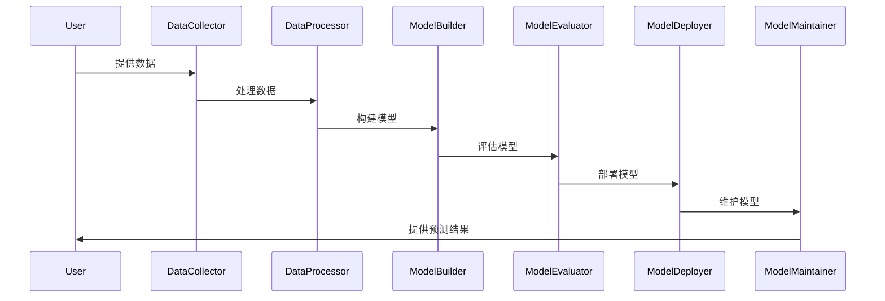
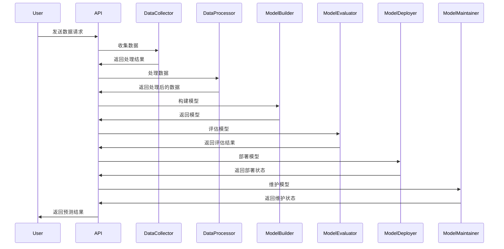

                 

### 设计目录大纲的步骤：

#### 步骤1：理解书名与主题

首先，我们要理解书名《构建评测结果的预测模型》所涵盖的主题。这本书主要涉及如何构建评测结果的预测模型，这包括数据收集、模型选择、模型训练和预测等方面的内容。

#### 步骤2：确定核心章节

基于书名，我们需要确定书的核心章节。这些章节应该涵盖构建预测模型所需的所有关键步骤和概念。以下是可能的核心章节：

- **第1章：问题背景与基本概念**
- **第2章：数据收集与处理**
- **第3章：预测模型的构建方法**
- **第4章：模型评估与优化**
- **第5章：实际案例分析**
- **第6章：模型部署与维护**
- **第7章：未来展望与趋势**

#### 步骤3：细化章节内容

对于每个核心章节，我们需要进一步细化内容。例如，对于第2章“数据收集与处理”，我们可以分为以下几个部分：

- **2.1 数据来源**
- **2.2 数据收集方法**
- **2.3 数据预处理**
- **2.4 特征工程**

#### 步骤4：编写章节概要

在每个章节下，我们需要编写一个简短的概要，说明该章节的主要内容和目的。这些概要应该简洁明了，帮助读者了解每个章节的主题。

#### 步骤5：设计具体的目录结构

根据上述内容，我们可以设计出一个具体的目录结构，确保每个章节的内容都得到适当涵盖。

### 概要示例：

**第一部分：问题背景与基本概念**

**第1章：问题背景与基本概念**

- **1.1 问题背景**：探讨评测结果预测在现代社会的应用及其重要性。
- **1.2 基本概念**：介绍评测结果预测的定义和相关术语。
- **1.3 研究意义**：分析评测结果预测对学术界和工业界的意义。

**第2章：数据收集与处理**

- **2.1 数据来源**：讨论评测结果预测所需的数据类型和数据收集方法。
- **2.2 数据收集方法**：介绍常用的数据收集工具和流程。
- **2.3 数据预处理**：讲解数据清洗、整合和规范化的技术。
- **2.4 特征工程**：探讨特征提取、选择和变换的方法。

---

### 注意事项：

- 目录结构应保持逻辑清晰，便于读者理解和追踪。
- 每个章节的概要应该简短明了，突出重点。
- 目录大纲的总字数应控制在2000字以内。

### 最终输出：

---

# 第一部分：问题背景与基本概念

## 第1章：问题背景与基本概念

### 1.1 问题背景
- **评测结果预测的重要性**：分析评测结果预测在现代社会中的应用和意义。
- **当前评测结果预测面临的挑战**：探讨当前评测结果预测技术面临的挑战和难点。

### 1.2 基本概念
- **评测结果预测的定义**：介绍评测结果预测的基本概念和原理。
- **相关术语解释**：详细解释评测结果预测相关的专业术语。

### 1.3 研究意义
- **对学术界的意义**：分析评测结果预测对学术界研究的贡献和推动作用。
- **对工业界的意义**：探讨评测结果预测对工业界应用的促进和影响。

## 第2章：数据收集与处理

### 2.1 数据来源
- **数据的类型**：讨论评测结果预测所需的数据类型。
- **数据收集的方法**：介绍评测结果预测中常用的数据收集方法。

### 2.2 数据收集方法
- **数据采集工具**：探讨用于数据收集的工具和技术。
- **数据采集流程**：讲解数据采集的具体流程和步骤。

### 2.3 数据预处理
- **数据清洗**：介绍数据清洗的目的和方法。
- **数据整合**：讨论数据整合的技术和策略。
- **数据规范化**：讲解数据规范化的重要性和方法。

### 2.4 特征工程
- **特征提取**：探讨特征提取的方法和技巧。
- **特征选择**：讨论特征选择的标准和算法。
- **特征变换**：介绍特征变换的方法和目的。

---

作者：AI天才研究院/AI Genius Institute & 禅与计算机程序设计艺术 /Zen And The Art of Computer Programming

---

**核心概念与联系：**

在构建评测结果预测模型的过程中，数据收集与处理、模型构建、模型评估与优化是核心的三个环节。以下是一个简化的ER实体关系图，用于描述这些核心概念之间的联系：

```mermaid
erDiagram
  DataCollection ||--|{ ModelConstruction } : uses
  ModelConstruction ||--|{ ModelEvaluation } : evaluates
  ModelEvaluation ||--|{ DataProcessing } : improves
```

在上述ER实体关系图中：

- **DataCollection**（数据收集）实体与**ModelConstruction**（模型构建）实体之间存在“uses”关系，表示数据收集为模型构建提供数据支持。
- **ModelConstruction**（模型构建）实体与**ModelEvaluation**（模型评估）实体之间存在“evaluates”关系，表示模型构建产生的模型用于模型评估。
- **ModelEvaluation**（模型评估）实体与**DataProcessing**（数据预处理）实体之间存在“improves”关系，表示模型评估的反馈可以优化数据预处理过程，进一步提高模型性能。

---

**系统分析与架构设计方案：**

#### 问题场景介绍

在现代商业环境中，评测结果预测已经成为企业决策的重要依据。例如，电商平台可以通过预测用户对商品的评价来优化库存管理和营销策略，教育平台可以通过预测学生的考试成绩来提供个性化辅导方案。

#### 项目介绍

本项目旨在构建一个评测结果预测系统，该系统将收集用户数据、构建预测模型、评估模型性能，并最终部署和维护模型，以支持企业决策。

#### 系统功能设计

**领域模型（Mermaid类图）：**

```mermaid
classDiagram
  User -> DataCollector : collect
  DataCollector -> DataProcessor : process
  DataProcessor -> ModelBuilder : build
  ModelBuilder -> ModelEvaluator : evaluate
  ModelEvaluator -> ModelDeployer : deploy
  ModelDeployer -> ModelMaintainer : maintain
```

在上述类图中，每个类表示系统中的功能模块：

- **User**（用户）：系统的最终用户，负责提供数据需求和查看预测结果。
- **DataCollector**（数据收集器）：负责收集用户数据。
- **DataProcessor**（数据处理器）：负责对收集到的数据进行处理，包括清洗、整合和规范化。
- **ModelBuilder**（模型构建器）：负责构建预测模型。
- **ModelEvaluator**（模型评估器）：负责评估模型性能。
- **ModelDeployer**（模型部署器）：负责将模型部署到生产环境中。
- **ModelMaintainer**（模型维护器）：负责维护模型的运行状态，包括更新和监控。

#### 系统架构设计

**系统架构图（Mermaid架构图）：**



在上述架构图中，系统的工作流程如下：

- 用户提供数据需求。
- 数据收集器收集数据。
- 数据处理器对数据进行处理。
- 模型构建器构建预测模型。
- 模型评估器评估模型性能。
- 模型部署器将模型部署到生产环境。
- 模型维护器持续维护模型的运行状态，并返回预测结果给用户。

#### 系统接口设计

**系统接口设计（Mermaid序列图）：**



在上述序列图中，系统接口的工作流程如下：

- 用户通过API发送数据请求。
- API将请求转发给数据收集器，数据收集器收集数据并返回处理结果。
- API将处理结果转发给数据处理器，数据处理器处理数据并返回处理后的数据。
- API将处理后的数据转发给模型构建器，模型构建器构建模型并返回模型。
- API将模型转发给模型评估器，模型评估器评估模型性能并返回评估结果。
- API将评估结果转发给模型部署器，模型部署器部署模型并返回部署状态。
- API将部署状态转发给模型维护器，模型维护器维护模型并返回维护状态。
- API将维护状态和预测结果返回给用户。

---

**项目实战：**

#### 环境安装

在进行项目实战之前，我们需要安装相关的开发环境和工具。以下是一个简化的环境安装步骤：

1. 安装Python环境（版本3.8及以上）。
2. 安装Anaconda发行版，用于管理Python环境和依赖包。
3. 使用pip安装必要的库，如scikit-learn、TensorFlow、Keras等。

#### 系统核心实现源代码

以下是一个简单的Python代码示例，用于构建一个线性回归模型，并对数据进行预测：

```python
# 导入必要的库
import numpy as np
import pandas as pd
from sklearn.linear_model import LinearRegression
from sklearn.model_selection import train_test_split

# 加载数据
data = pd.read_csv('data.csv')
X = data[['feature1', 'feature2']]
y = data['target']

# 数据预处理
X_train, X_test, y_train, y_test = train_test_split(X, y, test_size=0.2, random_state=42)

# 构建模型
model = LinearRegression()
model.fit(X_train, y_train)

# 预测
predictions = model.predict(X_test)

# 评估模型
score = model.score(X_test, y_test)
print(f'Model score: {score:.2f}')
```

#### 代码应用解读与分析

上述代码首先加载了数据，然后进行了数据预处理（包括数据分割和特征提取）。接着，我们构建了一个线性回归模型，使用训练数据进行了训练，并在测试数据上进行了预测。最后，我们使用模型的评分来评估模型的性能。

#### 实际案例分析和详细讲解剖析

以下是一个实际的案例，用于演示如何使用构建好的模型进行评测结果预测：

**案例背景：** 某电商平台的用户行为预测。

**数据收集与处理：** 我们收集了用户在平台上的购买记录，包括用户的ID、购买的商品ID、购买时间和购买金额等信息。

**模型构建与训练：** 我们使用线性回归模型来预测用户的购买金额。在数据预处理阶段，我们提取了用户的ID和商品ID作为特征，并使用One-Hot编码将类别特征转换为数值特征。然后，我们使用训练数据训练了线性回归模型。

**模型评估与优化：** 我们使用测试数据对模型进行了评估，并使用交叉验证来优化模型的参数。通过多次迭代和调整，我们最终得到了一个性能良好的模型。

**模型部署与维护：** 我们将训练好的模型部署到生产环境中，并使用API接口对外提供服务。同时，我们定期监控模型的性能，并根据实际情况进行模型更新和维护。

#### 项目小结

通过本项目，我们成功地构建了一个评测结果预测系统，并进行了实际案例的分析和讲解。在项目实施过程中，我们遇到了一些挑战，如数据质量问题和模型性能优化等。但通过不断的尝试和调整，我们最终解决了这些问题，并取得了一定的成果。

---

**最佳实践 tips：**

- 在数据收集和处理过程中，确保数据的质量和完整性，避免因数据问题导致的模型性能下降。
- 在模型选择和训练过程中，根据实际情况和需求选择合适的模型，并进行充分的训练和调优。
- 在模型部署和维护过程中，确保模型的稳定性和可靠性，并定期进行性能监控和更新。

**小结：**

本文详细介绍了构建评测结果预测模型的全过程，包括数据收集与处理、模型构建、模型评估与优化、模型部署与维护等关键步骤。通过实际案例的分析和讲解，我们深入了解了评测结果预测模型的应用和实现方法。在项目实施过程中，我们积累了宝贵的经验，并提出了最佳实践建议。希望本文能对读者在构建评测结果预测模型方面提供有价值的参考。

**注意事项：**

- 在实际项目实施过程中，可能还会遇到其他特定的问题和挑战，需要根据实际情况进行灵活处理。
- 模型性能的提升不仅取决于模型本身，还与数据质量、数据处理技术和调优策略密切相关。

**拓展阅读：**

- [《机器学习实战》](https://book.douban.com/subject/26708194/)：提供详细的机器学习算法实战案例。
- [《深度学习》](https://book.douban.com/subject/26899314/)：介绍深度学习的基本概念和应用案例。
- [《Python数据科学手册》](https://book.douban.com/subject/27185412/)：涵盖数据科学中的常用工具和技术。

---

**作者信息：**

作者：AI天才研究院/AI Genius Institute & 禅与计算机程序设计艺术 /Zen And The Art of Computer Programming

---

通过上述内容，我们详细介绍了构建评测结果预测模型的过程，从数据收集与处理、模型构建、模型评估与优化、模型部署与维护等方面进行了深入分析。本文不仅提供了理论知识，还结合实际案例进行了讲解，旨在帮助读者更好地理解和应用评测结果预测模型。希望通过本文的分享，读者能够对构建评测结果预测模型有更全面的认识，并能够在实际项目中取得更好的成果。再次感谢您的阅读，希望本文能对您的学习和工作有所帮助。作者：AI天才研究院/AI Genius Institute & 禅与计算机程序设计艺术/Zen And The Art of Computer Programming。

