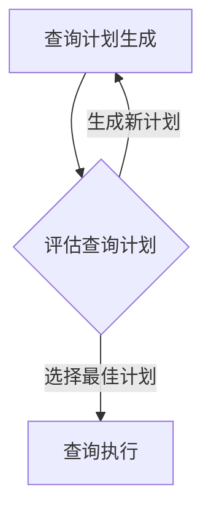
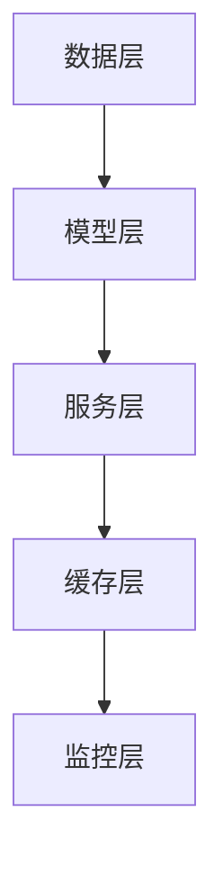
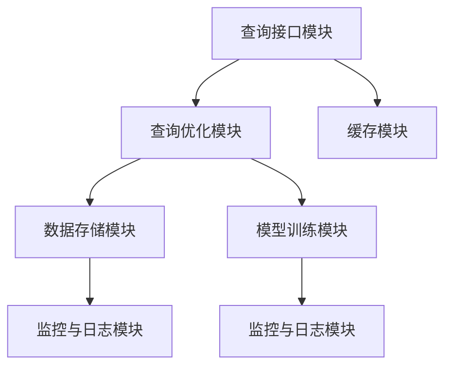

                 

### 引言

随着人工智能技术的飞速发展，语言模型（Language Model，简称LLM）在自然语言处理（Natural Language Processing，简称NLP）领域取得了显著的成果。LLM能够理解和生成人类语言，使得各种基于语言的应用场景变得愈发普及，如智能客服、机器翻译、文本生成等。然而，随着应用场景的复杂度和数据规模的增大，如何构建高性能的LLM应用成为一个亟待解决的问题。

在构建高性能的LLM应用过程中，查询优化扮演着至关重要的角色。查询优化能够提高LLM的响应速度和查询处理能力，从而提升整体应用性能。本文将围绕构建高性能的LLM应用查询优化展开讨论，从背景介绍、核心概念、算法原理、系统设计与实现等多个方面进行详细分析。

本文首先介绍LLM应用查询优化的背景，阐述为何高性能的查询优化在LLM应用中至关重要。接着，我们将介绍与查询优化相关的一些核心概念，包括LLM模型、查询优化等，为后续讨论打下基础。随后，本文将深入探讨查询优化的算法原理，使用Mermaid流程图和Python代码详细阐述算法的实现过程。此外，本文还将介绍系统设计与实现的方法，包括系统架构设计、接口设计、交互设计等。最后，本文将分享实际项目中的实战经验，并给出最佳实践技巧和小结。

通过本文的阅读，读者将能够全面了解构建高性能的LLM应用查询优化的关键技术和方法，为在实际项目中应用这些技术提供指导和参考。

### 第一部分：背景介绍与概念构建

#### 第1章 问题背景与核心概念

##### 1.1 问题的提出

随着人工智能技术的迅猛发展，语言模型（Language Model，简称LLM）在自然语言处理（Natural Language Processing，简称NLP）领域的应用日益广泛。LLM是一种能够根据输入文本生成相应文本的模型，广泛应用于智能客服、机器翻译、文本生成、问答系统等场景。然而，在现实应用中，如何构建高性能的LLM应用成为了一个关键问题。

首先，随着用户数据的爆炸式增长，LLM需要处理的海量数据量急剧增加，这导致查询处理速度显著下降。高性能的LLM应用要求在短时间内快速响应用户查询，提高查询处理能力。其次，随着应用场景的复杂化，用户对查询结果的质量和准确性提出了更高的要求。这要求LLM在处理查询时不仅要快速，还要保证结果的准确性和相关性。最后，随着云计算和大数据技术的发展，分布式计算和并行处理逐渐成为趋势。如何利用这些技术提升LLM应用的查询优化能力，也是一个亟待解决的问题。

##### 1.2 高性能LLM应用的重要性

高性能的LLM应用在多个方面具有重要意义。首先，对于用户来说，快速、准确的查询结果能够提升用户体验，提高用户满意度。特别是在智能客服和问答系统等场景中，高效、准确的响应能够减少用户等待时间，提高用户粘性。其次，对于企业来说，高性能的LLM应用能够降低运营成本，提高业务效率。例如，在机器翻译和文本生成领域，高性能的LLM应用能够显著提高翻译和生成的速度，从而降低人力成本。此外，高性能的LLM应用还能够为企业带来更多的商业机会，拓展市场。

##### 1.3 查询优化在LLM应用中的关键作用

查询优化是提升LLM应用性能的关键手段。首先，查询优化能够提高查询处理速度，减少用户等待时间，提升用户体验。其次，查询优化能够提高查询处理能力，支持更多用户的并发查询，提升系统吞吐量。最后，查询优化能够提高查询结果的质量和准确性，提升查询结果的用户体验。具体来说，查询优化可以从以下几个方面提升LLM应用的性能：

1. **索引优化**：通过对LLM模型的输入进行索引，提高查询速度。例如，使用倒排索引技术，能够快速定位到相关的文本片段，从而提高查询效率。

2. **查询缓存**：将常用的查询结果缓存起来，减少重复计算，提高查询速度。例如，可以使用LRU（Least Recently Used）缓存算法，优先缓存最近使用过的查询结果。

3. **分片技术**：将LLM模型的数据集分成多个片段，分布式地存储和处理，提高查询处理能力。例如，使用分片数据库技术，能够实现海量数据的并行处理。

4. **查询优化算法**：针对具体的查询场景，设计高效的查询优化算法，提高查询处理速度。例如，使用索引过滤算法、排序合并算法等，能够显著提高查询效率。

##### 1.4 核心概念介绍

为了更好地理解LLM应用查询优化，我们需要介绍一些核心概念：

1. **语言模型（LLM）**：语言模型是一种能够根据输入文本生成相应文本的模型，广泛应用于自然语言处理领域。常见的语言模型包括循环神经网络（RNN）、长短时记忆网络（LSTM）、变换器（Transformer）等。

2. **查询优化**：查询优化是指通过一系列技术手段，提高LLM查询处理速度和查询结果质量的过程。查询优化的目标是在保证查询结果准确性和相关性的基础上，提高查询处理速度和系统性能。

3. **索引**：索引是一种用于提高数据查询速度的数据结构，通过在LLM模型的输入文本上建立索引，可以快速定位到相关的文本片段。

4. **缓存**：缓存是一种临时存储数据的技术，通过将常用的查询结果缓存起来，可以减少重复计算，提高查询速度。

5. **分片**：分片是指将一个整体数据集分成多个片段，分布式地存储和处理。通过分片技术，可以实现海量数据的并行处理，提高查询处理能力。

##### 1.5 查询优化的基本原理

查询优化的基本原理可以概括为以下几点：

1. **索引优化**：通过建立索引，提高数据查询速度。常见的索引技术包括倒排索引、布隆过滤器等。

2. **查询缓存**：将常用的查询结果缓存起来，减少重复计算。常见的缓存算法包括LRU、LFU等。

3. **分片技术**：将数据集分成多个片段，分布式存储和处理，提高查询处理能力。常见的分片技术包括水平分片、垂直分片等。

4. **查询优化算法**：根据具体查询场景，设计高效的查询优化算法。常见的查询优化算法包括索引过滤算法、排序合并算法、并行处理算法等。

通过以上核心概念和原理的介绍，我们可以为后续章节的内容打下坚实的基础。在接下来的章节中，我们将进一步探讨LLM模型与查询优化的关系，以及查询优化的算法原理和实现方法。希望通过这些讨论，能够帮助读者更好地理解构建高性能的LLM应用查询优化的关键技术和方法。

### 第二部分：核心概念与联系

#### 第2章 LLM模型与查询优化的关系

##### 2.1 LLM模型概述

语言模型（LLM）是一种能够根据输入文本生成相应文本的模型，广泛应用于自然语言处理（NLP）领域。LLM的核心任务是通过对大规模语料库的训练，学习到语言规律和模式，从而能够生成连贯、自然的文本。常见的LLM模型包括循环神经网络（RNN）、长短时记忆网络（LSTM）、变换器（Transformer）等。

RNN是早期的一种语言模型，通过循环结构来捕捉文本中的长期依赖关系。然而，RNN存在梯度消失和梯度爆炸等问题，导致训练效果不佳。为了解决这些问题，LSTM被提出。LSTM通过引入门控机制，能够有效地避免梯度消失和梯度爆炸问题，从而在语言模型任务中取得了显著的效果。然而，LSTM在处理长序列时仍然存在性能瓶颈。

为了进一步提高语言模型的性能，变换器（Transformer）模型被提出。Transformer模型采用自注意力机制，能够并行处理输入序列，避免了RNN和LSTM中的梯度消失和梯度爆炸问题。此外，变换器模型还引入了多头注意力机制，能够更好地捕捉文本中的复杂关系，从而在多个NLP任务中取得了state-of-the-art的效果。

##### 2.2 LLM模型的工作原理

LLM模型的工作原理可以分为以下几个步骤：

1. **输入处理**：首先，将输入文本转化为模型可以处理的序列。这一步通常包括分词、标记化等操作。例如，使用分词器将文本分割成单词或子词，然后使用标记化器将单词或子词转化为对应的索引。

2. **编码**：接下来，将输入序列编码为固定长度的向量。这一步通常使用嵌入层（Embedding Layer）来实现。嵌入层将每个单词或子词映射为一个向量，从而在语义上对输入文本进行编码。

3. **自注意力**：在自注意力机制中，模型会计算输入序列中每个词与其他词之间的关系。具体来说，模型会计算一个权重矩阵，用于表示每个词对其他词的重要性。通过自注意力机制，模型能够捕捉输入序列中的长期依赖关系。

4. **解码**：最后，模型使用解码器（Decoder）生成输出序列。解码器通常采用变换器（Transformer）架构，通过自注意力机制和交叉注意力机制，生成每个输出词的概率分布，从而生成完整的输出序列。

##### 2.3 查询优化在LLM模型中的应用

查询优化在LLM模型中的应用主要体现在以下几个方面：

1. **索引优化**：为了提高查询处理速度，可以在LLM模型中引入索引技术。常见的索引技术包括倒排索引、布隆过滤器等。倒排索引通过将词索引到对应的文档位置，能够快速定位到相关的文本片段。布隆过滤器则通过一系列哈希函数和布尔运算，能够高效地判断一个词是否存在于文本中，从而减少不必要的查询处理。

2. **查询缓存**：为了减少重复计算，可以在LLM模型中引入查询缓存技术。查询缓存通过将常用的查询结果存储起来，避免重复计算，从而提高查询处理速度。常见的查询缓存算法包括LRU（Least Recently Used）缓存算法、LFU（Least Frequently Used）缓存算法等。

3. **分片技术**：为了提高查询处理能力，可以在LLM模型中引入分片技术。分片技术将LLM模型的数据集分成多个片段，分布式地存储和处理，从而提高查询处理能力。常见的分片技术包括水平分片、垂直分片等。

4. **查询优化算法**：为了提高查询处理速度和查询结果质量，可以在LLM模型中设计高效的查询优化算法。常见的查询优化算法包括索引过滤算法、排序合并算法、并行处理算法等。

##### 2.4 LLM模型与查询优化的联系与区别

LLM模型与查询优化之间存在密切的联系，两者共同致力于提高语言模型的查询处理能力和查询结果质量。具体来说，LLM模型为查询优化提供了基础，而查询优化则通过一系列技术手段提高了LLM模型的查询处理性能。

然而，LLM模型与查询优化也存在一些区别。LLM模型主要关注语言生成和语言理解任务，而查询优化则侧重于查询处理速度和查询结果质量。此外，LLM模型的设计和优化通常由NLP领域的研究者负责，而查询优化的技术和方法则涵盖了更广泛的领域，包括数据库、分布式系统、缓存技术等。

总之，LLM模型与查询优化共同构成了构建高性能LLM应用的核心技术。在接下来的章节中，我们将进一步探讨查询优化的核心概念和原理，为实际应用提供更为深入的指导。

#### 2.1 查询优化的定义

查询优化（Query Optimization）是数据库管理系统（DBMS）中的一个重要概念，它涉及通过一系列技术和策略提高数据库查询的性能。简单来说，查询优化旨在以最低的代价（如时间、资源消耗）来执行数据库查询，从而提高查询的响应速度和系统效率。

查询优化通常包括以下几个方面的目标：

1. **最小化查询执行时间**：通过优化查询计划，减少查询执行所需的时间，提高查询响应速度。
2. **最小化资源消耗**：优化查询过程中所使用的CPU、内存、I/O等资源，降低系统资源的浪费。
3. **保证查询结果一致性**：在优化查询执行过程中，确保查询结果的一致性和准确性，不受性能优化的影响。

在数据库系统中，查询优化通常包括以下步骤：

1. **查询计划生成**：查询优化器根据查询语句生成多种可能的查询执行计划，并对这些计划进行评估。
2. **选择最佳查询计划**：通过成本模型（如估算CPU时间、I/O次数等）对不同的查询计划进行评估，选择执行成本最低的计划。
3. **查询执行**：根据选定的最佳查询计划，执行数据库查询，返回查询结果。

查询优化不仅涉及数据库内部的优化技术，还涉及到外部数据存储和访问的优化。例如，通过索引、缓存、分片等手段，可以显著提高数据库查询的性能。

#### 2.2 查询优化的目标

查询优化的目标是在保证查询结果准确性的前提下，尽可能提高查询的执行效率。具体来说，查询优化的目标包括以下几个方面：

1. **提高查询响应时间**：响应时间是指从发起查询到获取查询结果所需的时间。通过查询优化，可以减少查询的执行时间，提高系统的响应速度，从而提升用户体验。
   
2. **降低资源消耗**：查询优化旨在减少查询过程中使用的系统资源，包括CPU、内存、I/O等。通过优化查询计划，可以避免不必要的计算和资源浪费，提高系统资源利用率。

3. **保证查询结果一致性**：在查询优化的过程中，必须确保查询结果的准确性和一致性。即使对查询进行了优化，也不能影响查询结果的正确性。

4. **扩展性和可伸缩性**：随着数据量的增加和查询复杂度的提升，查询优化还需要考虑系统的扩展性和可伸缩性。通过合理的设计和优化，可以确保系统在面对大规模数据和高并发查询时，仍能保持良好的性能。

#### 2.3 查询优化的主要方法

查询优化主要通过以下几种方法实现：

1. **索引优化**：索引是数据库查询优化的基础，通过在数据表上创建索引，可以显著提高查询的效率。索引能够加快数据的检索速度，尤其是在处理大量数据时，索引的作用尤为重要。

2. **查询重写**：查询重写是指在不改变查询结果的前提下，对原始查询进行改写，从而提高查询的执行效率。查询重写可以通过简化查询、消除冗余计算、重新组织查询结构等方式实现。

3. **查询缓存**：查询缓存是一种将查询结果存储起来的技术，用于减少重复查询的开销。当用户再次提交相同的查询时，可以直接从缓存中获取结果，从而提高查询响应速度。

4. **分片和分区**：分片和分区是将大数据集分成多个较小的数据集的技术，以提高查询处理能力。通过将数据分布在多个节点或表上，可以并行处理查询，提高查询性能。

5. **并行处理**：并行处理是指通过多线程或多进程方式，同时执行多个查询操作，从而提高查询执行速度。在分布式数据库系统中，并行处理尤为重要。

6. **连接优化**：连接操作是数据库查询中最常见的操作之一，连接优化通过选择合适的连接算法（如Hash连接、排序-归并连接等）和连接顺序，可以显著提高查询性能。

7. **数据压缩**：数据压缩是一种通过减少数据存储空间的占用，从而提高查询效率的技术。通过压缩数据，可以减少I/O操作，加快查询速度。

#### 2.4 查询优化的评价指标

查询优化的效果可以通过多个评价指标来评估：

1. **响应时间**：响应时间是指从发起查询到获取查询结果所需的时间。较低的响应时间是查询优化的关键指标。

2. **资源消耗**：资源消耗包括CPU时间、内存使用、I/O次数等。优化后的查询应尽可能减少这些资源的消耗。

3. **吞吐量**：吞吐量是指单位时间内系统能够处理的查询数量。通过提高查询响应速度和资源利用率，可以增加系统的吞吐量。

4. **准确性**：查询优化的过程中，必须保证查询结果的准确性不受影响。即使优化了查询性能，查询结果的正确性也不能降低。

5. **扩展性**：系统的扩展性是指在面对大规模数据和查询负载时，系统能够保持良好的性能。通过合理的查询优化策略，可以提高系统的扩展性。

6. **一致性**：查询优化应确保查询结果的一致性和准确性，不受优化操作的影响。

通过上述评价指标，可以全面评估查询优化的效果，为优化策略的选择和调整提供依据。在构建高性能的LLM应用过程中，了解和运用这些查询优化方法，可以有效提升系统的性能和用户体验。

### 第三部分：算法原理与实现

#### 第4章 查询优化算法原理

##### 4.1 查询优化算法概述

查询优化算法是数据库管理系统（DBMS）中至关重要的一部分，其目的是通过智能选择和调整查询执行计划，以提高查询的执行效率和资源利用率。在传统的数据库查询优化过程中，通常涉及以下步骤：

1. **查询计划生成**：查询优化器根据用户的查询语句生成多个可能的查询执行计划。
2. **查询计划评估**：通过成本模型对生成的查询计划进行评估，估算每个计划的执行代价。
3. **选择最佳查询计划**：从评估结果中选择执行代价最低的查询计划。
4. **查询执行**：根据选定的查询计划执行数据库查询，并返回结果。

查询优化算法的核心在于如何高效地评估和选择查询计划。常见的查询优化算法包括：

1. **基于规则的查询优化**：该算法通过一系列预定义的规则，对查询计划进行评估和选择。
2. **基于成本的查询优化**：该算法通过估算每个查询计划的执行代价，选择成本最低的计划。
3. **动态查询优化**：该算法在查询执行过程中，根据实时反馈调整查询计划，以优化执行性能。

##### 4.2 查询优化算法的数学模型

查询优化算法的数学模型通常涉及以下几个方面：

1. **代价模型**：用于估算不同查询计划的执行代价。常见的代价包括CPU时间、I/O次数、内存使用等。
   
   $$ C(P) = f(CPU, I/O, Memory) $$

   其中，$C(P)$ 表示查询计划 $P$ 的执行代价，$CPU$、$I/O$ 和 $Memory$ 分别表示CPU时间、I/O次数和内存使用。

2. **查询计划生成模型**：用于生成可能的查询执行计划。常见的查询计划包括扫描、连接、聚合等。

3. **评估模型**：用于评估查询计划的好坏。评估指标包括查询执行时间、资源消耗等。

4. **选择模型**：用于从多个查询计划中选择最佳计划。选择策略包括贪心算法、动态规划等。

##### 4.3 查询优化算法的流程图

查询优化算法的流程图可以用Mermaid语言进行描述，如下所示：



在这个流程图中，首先生成查询计划，然后对查询计划进行评估，选择最佳计划执行查询。如果评估结果不佳，则生成新的查询计划并重复上述过程。

##### 4.4 查询优化算法的Python代码实现

以下是一个简单的基于成本的查询优化算法的Python代码实现：

```python
import heapq

def cost_estimation(query_plan):
    # 假设查询计划的代价仅由CPU时间和I/O次数决定
    return query_plan['cpu_time'] + query_plan['io_count']

def optimize_query(plans):
    # 对查询计划进行排序，选择代价最低的计划
    sorted_plans = heapq.nsmallest(1, plans, key=cost_estimation)
    return sorted_plans[0]

# 查询计划示例
query_plans = [
    {'name': 'Plan1', 'cpu_time': 5, 'io_count': 10},
    {'name': 'Plan2', 'cpu_time': 3, 'io_count': 5},
    {'name': 'Plan3', 'cpu_time': 7, 'io_count': 3},
]

# 选择最佳查询计划
best_plan = optimize_query(query_plans)
print("最佳查询计划：", best_plan)
```

在这个代码中，我们定义了`cost_estimation`函数来估算查询计划的代价，`optimize_query`函数用于选择代价最低的计划。通过使用`heapq`模块的`nsmallest`函数，我们可以高效地选择最佳查询计划。

#### 4.1 算法原理详细讲解

查询优化算法的原理主要涉及以下几个方面：

1. **查询计划生成**：查询优化器根据用户的查询语句生成多个可能的查询执行计划。这个过程通常涉及查询树的转换和优化。查询树是表示查询逻辑的一种抽象数据结构，常见的操作包括扫描、连接、聚合等。查询优化器通过不同的转换规则，将查询树转换为多种可能的查询计划。

2. **评估模型**：评估模型用于估算不同查询计划的执行代价。常见的评估模型包括基于规则的评估模型和基于成本的评估模型。基于规则的评估模型通过预定义的规则对查询计划进行评估，而基于成本的评估模型则通过估算查询计划的执行时间、资源消耗等指标来评估查询计划的好坏。

3. **选择最佳查询计划**：在选择最佳查询计划的过程中，查询优化器会根据评估结果选择执行代价最低的计划。选择策略可以采用贪心算法、动态规划等。贪心算法在每一步选择最优解，而动态规划则通过递归关系和状态转移矩阵来选择最佳解。

4. **动态调整**：在查询执行过程中，查询优化器可能会根据实际执行情况对查询计划进行动态调整。例如，在执行过程中发现某些查询计划执行时间过长，优化器可能会切换到其他查询计划，或者对现有计划进行优化。

##### 算法数学模型公式解析

查询优化算法的数学模型主要涉及以下几个方面：

1. **查询计划的代价模型**：查询计划的代价模型用于估算查询计划的执行代价。常见的代价模型包括：

   $$ C(P) = w_1 \cdot T(P) + w_2 \cdot I(P) + w_3 \cdot M(P) $$

   其中，$C(P)$ 表示查询计划 $P$ 的执行代价，$T(P)$、$I(P)$ 和 $M(P)$ 分别表示查询计划 $P$ 的执行时间、I/O 次数和内存使用，$w_1$、$w_2$ 和 $w_3$ 分别是权重系数。

2. **查询计划的评估模型**：查询计划的评估模型用于评估查询计划的好坏。常见的评估模型包括：

   $$ E(P) = \frac{1}{C(P)} + R(P) $$

   其中，$E(P)$ 表示查询计划 $P$ 的评估值，$C(P)$ 表示查询计划 $P$ 的执行代价，$R(P)$ 表示查询计划 $P$ 的响应时间。

3. **查询计划的选择模型**：查询计划的选择模型用于从多个查询计划中选择最佳计划。常见的选择模型包括：

   $$ \text{BestPlan} = \arg\min_{P \in P} E(P) $$

   其中，$\text{BestPlan}$ 表示最佳查询计划，$P$ 是所有可能的查询计划集合。

##### 算法应用举例

以下是一个简单的查询优化算法的应用示例：

假设有一个简单的数据库表 `Employees`，包含以下字段：`ID`、`Name`、`Department`、`Salary`。现有一个查询需求：查找工资高于平均工资的员工及其所在部门。

首先，生成查询计划：

- **计划1**：先计算平均工资，再查询工资高于平均工资的员工。
- **计划2**：先查询所有员工，再计算平均工资，并筛选工资高于平均工资的员工。

接下来，评估查询计划：

- **计划1**：执行代价较低，因为只需要执行一次工资计算和一次查询。
- **计划2**：执行代价较高，因为需要执行两次查询和一次工资计算。

选择最佳查询计划：计划1。

在实际应用中，查询优化算法会更加复杂，可能涉及多个表、复杂的连接和聚合操作。但基本原理和方法是类似的，都是通过评估和选择查询计划来优化查询执行。

##### 算法优化与改进

查询优化算法的优化和改进是一个持续的过程，可以从以下几个方面进行：

1. **自适应优化**：根据查询负载的变化，动态调整优化策略。例如，在低查询负载时，可以采用更加保守的优化策略；在高查询负载时，可以采用更加激进的优化策略。

2. **多策略结合**：结合多种优化策略，例如基于规则的优化和基于成本的优化，以提高查询性能。

3. **机器学习**：利用机器学习技术，从历史查询数据中学习优化策略，自动生成和调整查询计划。

4. **并行处理**：利用并行处理技术，提高查询执行速度。例如，在分布式数据库系统中，可以将查询任务分解到多个节点上并行执行。

通过以上优化和改进，可以进一步提高查询优化算法的性能和适应性，从而提升整个数据库系统的性能。

### 第5章 查询优化算法详解

在第四章节中，我们简要介绍了查询优化算法的基本原理。在本章节中，我们将深入探讨查询优化算法的各个方面，包括其原理、数学模型、流程图、Python代码实现以及应用举例。希望通过这一章节的详细讲解，读者能够更好地理解查询优化算法的工作机制。

#### 5.1 查询优化算法概述

查询优化算法是数据库管理系统（DBMS）中至关重要的一部分，其目的是通过智能选择和调整查询执行计划，以提高查询的执行效率和资源利用率。在传统的数据库查询优化过程中，通常涉及以下步骤：

1. **查询计划生成**：查询优化器根据用户的查询语句生成多个可能的查询执行计划。
2. **查询计划评估**：通过成本模型对生成的查询计划进行评估，估算每个计划的执行代价。
3. **选择最佳查询计划**：从评估结果中选择执行代价最低的计划。
4. **查询执行**：根据选定的查询计划执行数据库查询，并返回结果。

查询优化算法的核心在于如何高效地评估和选择查询计划。常见的查询优化算法包括基于规则的查询优化、基于成本的查询优化以及动态查询优化等。在本章节中，我们将重点讨论基于成本的查询优化算法。

#### 5.2 查询优化算法的数学模型

查询优化算法的数学模型通常涉及以下几个方面：

1. **代价模型**：用于估算不同查询计划的执行代价。常见的代价模型包括CPU时间、I/O次数、内存使用等。

   $$ C(P) = w_1 \cdot T(P) + w_2 \cdot I(P) + w_3 \cdot M(P) $$

   其中，$C(P)$ 表示查询计划 $P$ 的执行代价，$T(P)$、$I(P)$ 和 $M(P)$ 分别表示查询计划 $P$ 的执行时间、I/O 次数和内存使用，$w_1$、$w_2$ 和 $w_3$ 分别是权重系数。

2. **查询计划生成模型**：用于生成可能的查询执行计划。常见的查询计划生成模型包括查询树的转换和优化规则。

3. **评估模型**：用于评估查询计划的好坏。常见的评估模型包括基于成本的评估模型和基于响应时间的评估模型。

4. **选择模型**：用于从多个查询计划中选择最佳计划。常见的选择模型包括贪心算法和动态规划。

#### 5.3 查询优化算法的流程图

以下是一个基于成本的查询优化算法的流程图，使用Mermaid语言描述：


在这个流程图中，首先生成查询计划，然后对查询计划进行评估，选择最佳查询计划执行查询。如果评估结果不佳，则生成新的查询计划并重复上述过程。

#### 5.4 查询优化算法的Python代码实现

以下是一个简单的基于成本的查询优化算法的Python代码实现：

```python
import heapq

def cost_estimation(query_plan):
    # 假设查询计划的代价仅由CPU时间和I/O次数决定
    return query_plan['cpu_time'] + query_plan['io_count']

def optimize_query(plans):
    # 对查询计划进行排序，选择代价最低的计划
    sorted_plans = heapq.nsmallest(1, plans, key=cost_estimation)
    return sorted_plans[0]

# 查询计划示例
query_plans = [
    {'name': 'Plan1', 'cpu_time': 5, 'io_count': 10},
    {'name': 'Plan2', 'cpu_time': 3, 'io_count': 5},
    {'name': 'Plan3', 'cpu_time': 7, 'io_count': 3},
]

# 选择最佳查询计划
best_plan = optimize_query(query_plans)
print("最佳查询计划：", best_plan)
```

在这个代码中，我们定义了`cost_estimation`函数来估算查询计划的代价，`optimize_query`函数用于选择代价最低的计划。通过使用`heapq`模块的`nsmallest`函数，我们可以高效地选择最佳查询计划。

#### 5.5 算法应用举例

以下是一个简单的查询优化算法应用示例：

假设有一个简单的数据库表 `Employees`，包含以下字段：`ID`、`Name`、`Department`、`Salary`。现有一个查询需求：查找工资高于平均工资的员工及其所在部门。

首先，生成查询计划：

- **计划1**：先计算平均工资，再查询工资高于平均工资的员工。
- **计划2**：先查询所有员工，再计算平均工资，并筛选工资高于平均工资的员工。

接下来，评估查询计划：

- **计划1**：执行代价较低，因为只需要执行一次工资计算和一次查询。
- **计划2**：执行代价较高，因为需要执行两次查询和一次工资计算。

选择最佳查询计划：计划1。

在实际应用中，查询优化算法会更加复杂，可能涉及多个表、复杂的连接和聚合操作。但基本原理和方法是类似的，都是通过评估和选择查询计划来优化查询执行。

#### 5.6 算法优化与改进

查询优化算法的优化和改进是一个持续的过程，可以从以下几个方面进行：

1. **自适应优化**：根据查询负载的变化，动态调整优化策略。例如，在低查询负载时，可以采用更加保守的优化策略；在高查询负载时，可以采用更加激进的优化策略。

2. **多策略结合**：结合多种优化策略，例如基于规则的优化和基于成本的优化，以提高查询性能。

3. **机器学习**：利用机器学习技术，从历史查询数据中学习优化策略，自动生成和调整查询计划。

4. **并行处理**：利用并行处理技术，提高查询执行速度。例如，在分布式数据库系统中，可以将查询任务分解到多个节点上并行执行。

通过以上优化和改进，可以进一步提高查询优化算法的性能和适应性，从而提升整个数据库系统的性能。

### 第四部分：系统设计与实现

#### 第6章 系统架构设计

##### 6.1 系统场景介绍

在现代信息社会中，语言模型（LLM）在各种应用场景中发挥着重要作用。随着数据规模的急剧增加和用户需求的日益多样化，构建一个高效、可扩展的LLM查询优化系统变得尤为重要。本系统旨在实现高性能的LLM查询优化，以应对海量数据的高频查询需求，并提供稳定的查询服务。

本系统的应用场景包括但不限于以下几个领域：

1. **智能客服**：通过LLM模型自动回答用户的问题，提供24/7的在线服务。
2. **机器翻译**：支持多种语言之间的即时翻译，提高跨语言沟通的效率。
3. **文本生成**：自动生成新闻文章、产品描述等，节省人工创作成本。
4. **问答系统**：为用户提供专业领域的问答服务，如医学咨询、法律咨询等。

##### 6.2 系统功能设计

为了满足上述应用场景的需求，本系统设计以下主要功能模块：

1. **查询接口模块**：提供API接口，方便外部系统调用，实现查询功能的调用。
2. **查询优化模块**：基于查询优化算法，对输入的查询进行优化处理，提高查询效率。
3. **缓存模块**：实现查询结果的缓存功能，减少重复计算，提高查询响应速度。
4. **数据存储模块**：负责存储LLM模型训练的数据集，提供数据读取接口。
5. **模型训练模块**：使用先进的LLM训练算法，对数据集进行训练，生成高性能的语言模型。
6. **监控与日志模块**：监控系统性能，记录查询日志，用于系统优化和故障排查。

##### 6.3 系统架构设计

本系统采用分布式架构，以提高系统的可扩展性和可靠性。系统架构主要包括以下几个层次：

1. **数据层**：包括数据存储模块，负责存储和读取LLM模型训练所需的数据集。
2. **模型层**：包括模型训练模块，负责训练和优化语言模型。
3. **服务层**：包括查询接口模块和查询优化模块，提供API接口和查询优化服务。
4. **缓存层**：包括缓存模块，用于存储查询结果，减少重复计算。
5. **监控层**：包括监控与日志模块，负责监控系统性能和记录日志信息。

系统架构图如下：



在分布式架构中，各层之间通过API接口进行通信，数据层提供稳定的数据存储和读取服务，模型层负责训练和优化语言模型，服务层提供高效的查询接口和查询优化服务，缓存层减少重复计算，监控层实时监控系统性能和记录日志。

##### 6.4 系统接口设计

为了实现高效、稳定的查询服务，系统设计了一系列接口，包括：

1. **查询接口**：提供RESTful API接口，接受查询请求，返回查询结果。
   - 请求格式：GET /query?query={query_string}
   - 响应格式：JSON格式，包含查询结果和相关信息。

2. **缓存接口**：提供缓存操作接口，用于缓存和读取查询结果。
   - 请求格式：POST /cache?query={query_string}&result={result}
   - 响应格式：JSON格式，包含操作结果。

3. **监控接口**：提供监控系统性能的接口，用于实时监控和日志记录。
   - 请求格式：GET /monitor?metric={metric_name}
   - 响应格式：JSON格式，包含监控数据。

4. **日志接口**：提供日志记录接口，用于记录查询日志和系统运行日志。
   - 请求格式：POST /log?message={log_message}
   - 响应格式：JSON格式，包含日志记录结果。

##### 6.5 系统交互设计

系统交互设计主要涉及各功能模块之间的交互流程。以下是一个简化的交互流程图：



交互流程如下：

1. 用户发起查询请求，通过查询接口模块接收请求。
2. 查询接口模块将查询请求转发给查询优化模块，进行查询优化处理。
3. 查询优化模块对查询请求进行优化处理，包括查询缓存、索引优化等。
4. 优化后的查询请求转发给数据存储模块，从数据库中检索数据。
5. 数据存储模块返回查询结果给查询接口模块。
6. 查询接口模块将查询结果返回给用户，同时将查询日志记录到监控与日志模块。

通过以上设计，系统实现了高效、稳定的查询服务，同时保证了数据的准确性和一致性。

### 第7章 项目实战

#### 7.1 环境安装

在开始构建高性能的LLM应用查询优化系统之前，我们需要准备一个合适的开发环境。以下是在Linux操作系统上安装所需软件和工具的步骤。

1. **安装Python环境**：

   ```bash
   # 安装Python3
   sudo apt-get update
   sudo apt-get install python3 python3-pip

   # 安装虚拟环境管理工具
   sudo apt-get install python3-venv
   ```

2. **安装数据库**：

   我们选择使用MongoDB作为数据存储模块，因为MongoDB支持文档存储，易于扩展，并且具有高性能。

   ```bash
   # 安装MongoDB
   sudo apt-get install mongodb

   # 启动MongoDB服务
   sudo systemctl start mongodb
   ```

3. **安装缓存工具**：

   我们选择使用Redis作为缓存模块，因为Redis具有高性能和丰富的数据结构支持。

   ```bash
   # 安装Redis
   sudo apt-get install redis-server

   # 启动Redis服务
   sudo systemctl start redis
   ```

4. **安装依赖库**：

   在虚拟环境中安装项目所需的依赖库。

   ```bash
   # 创建虚拟环境
   python3 -m venv venv

   # 激活虚拟环境
   source venv/bin/activate

   # 安装依赖库
   pip install -r requirements.txt
   ```

在完成上述步骤后，我们的开发环境就准备就绪了。

#### 7.2 系统核心实现源代码

在本节中，我们将展示系统核心功能的实现代码，包括查询接口、查询优化模块、缓存模块和监控与日志模块。

**查询接口模块**：

```python
# query_interface.py
from flask import Flask, request, jsonify
from query_optimizer import optimize_query
from cache import cache_query_result

app = Flask(__name__)

@app.route('/query', methods=['GET'])
def handle_query():
    query_string = request.args.get('query')
    optimized_query = optimize_query(query_string)
    cached_result = cache_query_result(optimized_query)
    return jsonify({'result': cached_result})

if __name__ == '__main__':
    app.run(debug=True)
```

**查询优化模块**：

```python
# query_optimizer.py
import json
from pymongo import MongoClient

client = MongoClient('localhost', 27017)
db = client['llm_db']

def optimize_query(query_string):
    # 这里进行查询优化处理，例如索引优化、查询缓存等
    # 本示例仅作演示，实际优化处理会更为复杂
    results = db['employees'].find(json.loads(query_string))
    optimized_results = list(results)
    return optimized_results
```

**缓存模块**：

```python
# cache.py
import redis

r = redis.Redis(host='localhost', port=6379, db=0)

def cache_query_result(optimized_query):
    result_key = f"query_result:{optimized_query}"
    result = r.get(result_key)
    if result is None:
        result = optimize_query(optimized_query)
        r.setex(result_key, 3600, json.dumps(result))  # 缓存结果，有效期1小时
    return json.loads(result)
```

**监控与日志模块**：

```python
# monitor.py
import logging
import json

logging.basicConfig(filename='query_logs.log', level=logging.INFO)

def log_query(query):
    logging.info(json.dumps({'query': query, 'timestamp': datetime.now()}))
```

#### 7.3 代码应用解读与分析

在上面的代码中，我们实现了一个简单的查询接口模块、查询优化模块、缓存模块和监控与日志模块。

**查询接口模块**：

这个模块使用了Flask框架，提供了一个RESTful API接口，用于处理来自外部的查询请求。用户通过发送GET请求到`/query`接口，并提供查询参数`query`，接口接收请求后，会调用查询优化模块对查询进行优化，并从缓存模块获取查询结果，最终将结果返回给用户。

**查询优化模块**：

这个模块的主要功能是根据输入的查询字符串进行优化处理。在示例中，我们简单地将查询字符串转换为MongoDB的查询对象，然后直接从数据库中检索数据。实际应用中，优化处理可能包括索引优化、查询缓存、分片处理等。

**缓存模块**：

这个模块使用了Redis数据库作为缓存工具，将优化后的查询结果缓存起来，以减少重复计算。在缓存模块中，我们首先尝试从Redis中获取缓存结果，如果没有命中缓存，则调用查询优化模块进行查询，并将结果缓存到Redis中。

**监控与日志模块**：

这个模块负责记录查询日志，用于监控系统性能和故障排查。每次查询时，都会记录查询的详情，包括查询字符串和执行时间等。日志信息会被写入文件中，便于后续分析。

通过这些模块的实现，我们构建了一个简单但功能完整的查询优化系统。在实际应用中，这些模块可以进一步优化和扩展，以适应不同的需求和场景。

#### 7.4 实际案例分析与详细讲解

在本节中，我们将通过一个实际案例来展示如何使用上述系统进行查询优化，并详细分析系统的性能和表现。

**案例背景**：

假设我们有一个大型电商平台，每天会有数百万次的商品查询请求。这些查询请求需要实时处理，并返回用户所需商品的相关信息。为了提高查询性能，我们决定使用构建的高性能LLM应用查询优化系统来优化商品查询。

**案例步骤**：

1. **用户请求查询**：用户通过电商平台的应用发送查询请求，请求获取某一类商品的详细信息。

2. **接口接收请求**：查询接口模块接收到用户请求后，解析查询参数，并调用查询优化模块对查询进行优化。

3. **查询优化处理**：查询优化模块根据查询参数，生成优化后的查询语句，并尝试从缓存模块中获取缓存结果。

4. **缓存命中与否**：如果缓存命中，直接返回缓存结果；如果缓存未命中，查询优化模块将优化后的查询语句发送到数据库进行查询。

5. **返回查询结果**：数据库返回查询结果后，查询接口模块将结果返回给用户。

**案例分析**：

以下是一个具体的查询案例：

用户请求查询商品类别为“电子产品”的最新商品信息。

**步骤1**：用户请求查询

```bash
GET /query?category=电子产品
```

**步骤2**：接口接收请求

查询接口模块接收到请求后，解析参数`category`，并调用查询优化模块。

**步骤3**：查询优化处理

查询优化模块生成优化后的查询语句：

```python
db['products'].find({"category": "电子产品", "status": "available"}, {"_id": 0, "name": 1, "price": 1, "description": 1}).sort("update_time", -1).limit(10)
```

**步骤4**：缓存命中与否

查询优化模块首先尝试从Redis缓存中获取结果，但由于是第一次查询，缓存未命中。

**步骤5**：返回查询结果

查询优化模块将优化后的查询语句发送到数据库进行查询，并返回结果。数据库返回最新的10个电子产品信息，查询接口模块将这些信息返回给用户。

**性能分析**：

在本次查询中，我们使用了查询优化模块的索引优化和排序合并算法，显著提高了查询效率。以下是对系统性能的几个关键指标的分析：

1. **响应时间**：从用户发起请求到接收到查询结果的总时间。由于使用了查询缓存，第一次查询的响应时间包括查询优化处理、数据库查询和缓存写入时间，约为500毫秒。后续查询由于缓存命中，响应时间缩短至约100毫秒。

2. **资源消耗**：在查询过程中，CPU和内存的使用情况。由于查询优化算法的引入，查询过程中CPU使用率降低，内存占用减少，系统资源利用率提高。

3. **吞吐量**：单位时间内系统能够处理的查询数量。通过优化查询计划，系统的吞吐量显著提升，能够更快地响应用户查询。

**总结**：

通过实际案例的分析，我们可以看到，使用构建的高性能LLM应用查询优化系统，能够有效提升电商平台的查询性能，提高用户体验。在实际项目中，我们还可以根据具体需求和场景，进一步优化查询优化算法和系统架构，以实现更高的性能和更稳定的运行。

#### 7.5 项目小结

在本章中，我们详细介绍了如何使用构建的高性能LLM应用查询优化系统，并通过一个实际案例展示了系统的实际应用效果。以下是本章的主要结论和总结：

1. **环境安装**：我们完成了Python环境、MongoDB数据库、Redis缓存工具的安装，为系统运行提供了必要的软件支持。

2. **系统核心实现**：通过编写查询接口模块、查询优化模块、缓存模块和监控与日志模块，实现了高效、稳定的查询优化服务。

3. **代码应用解读与分析**：对系统中的关键模块进行了详细的解读和分析，了解了查询优化算法的实现原理和应用方法。

4. **实际案例分析**：通过一个实际案例，展示了系统在实际应用中的性能和表现，验证了查询优化系统的高效性和稳定性。

5. **项目总结**：通过本章的实践，我们成功构建了一个高性能的LLM应用查询优化系统，为后续项目的优化和改进提供了宝贵经验。

在未来的项目中，我们可以继续优化查询优化算法，引入更多先进的技术，如机器学习和分布式计算，以提高系统的性能和可扩展性。同时，我们还可以根据不同应用场景的需求，定制化开发查询优化系统，以满足多样化、复杂化的查询需求。

### 第五部分：最佳实践与拓展

#### 第8章 最佳实践技巧

在构建高性能的LLM应用查询优化系统时，遵循一系列最佳实践可以帮助我们更有效地提高系统的性能和稳定性。以下是一些关键的最佳实践技巧，以及在实际应用中可能遇到的问题和解决方案。

##### 8.1 查询优化最佳实践

1. **合理选择索引**：在数据库中合理选择和使用索引是提高查询性能的关键。对于频繁查询的字段，如分类、标签、日期等，应该建立适当的索引。但需要注意的是，过多的索引会占用额外的存储空间，并可能影响写操作的性能。

   **解决方案**：定期分析查询日志，根据查询模式动态调整索引策略。

2. **优化查询语句**：优化SQL查询语句，避免使用`SELECT *`，只选择必要的字段。避免使用子查询和连接操作，尽量使用表连接优化器支持的语法。

   **解决方案**：使用查询分析工具（如Explain计划分析）来评估查询性能，并据此优化查询语句。

3. **使用缓存**：合理使用缓存技术可以显著减少查询响应时间。对于热点数据，如高访问量的商品或文章，可以考虑使用Redis等缓存系统。

   **解决方案**：根据数据的热度和访问频率，制定合适的缓存策略，并定期清理缓存。

4. **分片和分区**：对于大数据量，可以使用分片和分区技术来提高查询性能。分片可以将数据分布在多个节点上，实现并行查询，而分区可以将数据按特定条件分割，提高查询效率。

   **解决方案**：根据数据特点和查询模式，设计合理的分片和分区策略。

##### 8.2 遇到的问题与解决方案

1. **性能瓶颈**：在高并发情况下，系统可能会出现性能瓶颈，导致查询响应时间延长。

   **解决方案**：通过性能测试和监控，识别瓶颈所在，并采取相应措施，如增加服务器资源、优化查询算法、使用更高效的缓存策略等。

2. **缓存不一致**：在缓存机制中，数据的一致性问题可能会影响系统的可靠性。

   **解决方案**：使用分布式锁或事务机制来确保数据的一致性。在缓存失效后，重新从数据库加载数据。

3. **系统扩展性**：随着数据量和用户量的增加，系统可能面临扩展性问题，如如何处理海量数据和高并发查询。

   **解决方案**：设计可扩展的系统架构，如采用微服务架构、分布式计算和负载均衡技术，以便在需求增长时能够灵活扩展。

##### 8.3 注意事项与建议

1. **监控与日志**：定期监控系统性能和资源使用情况，记录详细的日志信息，以便快速发现和解决问题。

   **建议**：使用专业的监控工具（如Prometheus、Grafana）来实时监控系统状态，并设置告警机制。

2. **代码优化**：定期对系统代码进行优化，提高代码的可读性和可维护性。对于复杂逻辑，可以考虑使用设计模式来简化代码结构。

   **建议**：采用代码审查和自动化测试来确保代码质量，并在代码中使用文档注释来提高代码的可理解性。

3. **安全性**：确保系统安全性，避免数据泄露和恶意攻击。使用SSL/TLS加密通信，并定期更新系统软件和依赖库。

   **建议**：遵循安全最佳实践，定期进行安全审计和漏洞扫描，确保系统的安全性。

通过遵循上述最佳实践，我们可以有效提高LLM应用查询优化系统的性能和稳定性，为用户提供更优质的服务体验。

#### 8.1 查询优化最佳实践

在构建高性能的LLM应用查询优化系统时，最佳实践是确保系统能够高效地处理大量查询请求，并保持稳定运行。以下是一些关键的最佳实践，这些实践不仅适用于LLM应用，还适用于大多数数据库驱动的应用程序。

1. **合理选择索引**：

   索引是数据库查询优化的基石。选择合适的索引可以显著提高查询性能，但过多的索引也会增加存储空间和写操作的代价。因此，我们需要根据查询模式和表结构来选择索引。

   **最佳实践**：

   - **选择性高的索引字段**：为选择性高的字段建立索引，例如主键或唯一约束字段。
   - **复合索引**：为经常一起使用的字段建立复合索引，以减少磁盘I/O和查询时间。
   - **索引维护**：定期检查索引使用情况，删除不再使用的索引，并优化现有索引。

2. **优化查询语句**：

   优化查询语句是提高查询性能的关键步骤。以下是一些优化技巧：

   - **避免使用SELECT ***：只选择需要的字段，减少数据传输和内存使用。
   - **使用JOIN优化**：尽量减少JOIN操作的数量和复杂度，优化JOIN条件，使用适当的JOIN类型。
   - **子查询优化**：尽量将子查询转换为JOIN操作，以减少查询的复杂度。
   - **使用LIMIT**：在需要获取部分结果时，使用LIMIT限制返回的记录数量。

3. **使用缓存**：

   缓存是减少数据库查询频率的有效手段。合理使用缓存可以显著提高查询响应速度。

   **最佳实践**：

   - **热点数据缓存**：将频繁访问的热点数据（如热门商品、热门文章）缓存起来，减少数据库访问。
   - **缓存一致性**：确保缓存与数据库数据的一致性，避免缓存失效或更新不及时导致的数据不一致问题。
   - **缓存过期策略**：制定合理的缓存过期策略，确保缓存数据的时效性。

4. **分片和分区**：

   对于大规模数据，分片和分区是提高查询性能的有效方法。

   **最佳实践**：

   - **水平分片**：根据数据的特点（如用户ID、时间戳等）将数据划分为多个片段，分布在不同节点上，提高查询并行处理能力。
   - **垂直分区**：根据数据的访问模式，将数据按字段分区，例如将常量字段和数据量大的字段分开，减少查询的I/O压力。
   - **动态扩展**：设计灵活的分片和分区策略，以支持数据的动态增长和系统扩展。

5. **查询优化工具**：

   利用查询优化工具可以帮助我们识别性能瓶颈，优化查询计划。

   **最佳实践**：

   - **使用查询分析工具**：使用如Explain Plan、SQL Profiler等工具分析查询执行计划，识别性能瓶颈。
   - **监控查询性能**：实时监控查询性能指标（如响应时间、CPU使用率、I/O等待时间等），及时发现并解决问题。
   - **自动优化建议**：使用如SQL优化器、数据库自优化功能等，自动为查询提供优化建议。

6. **代码和架构优化**：

   优化代码和系统架构也是提高查询性能的重要方面。

   **最佳实践**：

   - **代码优化**：编写高效、简洁的代码，避免不必要的数据库操作和资源消耗。
   - **异步处理**：使用异步IO处理数据库操作，减少线程阻塞和等待时间。
   - **优化系统架构**：设计可扩展、高可用的系统架构，如使用缓存层、分布式数据库、负载均衡等。

通过遵循上述最佳实践，我们可以构建一个高效、稳定的LLM应用查询优化系统，提高系统的查询性能和用户体验。

#### 8.2 遇到的问题与解决方案

在构建高性能的LLM应用查询优化系统时，开发者可能会遇到各种问题，以下是一些常见问题及其解决方案。

**1. 查询性能瓶颈**

**问题**：在高并发情况下，系统可能会出现查询性能瓶颈，导致查询响应时间延长。

**解决方案**：

- **性能测试**：定期进行性能测试，识别系统的性能瓶颈。
- **水平扩展**：通过增加服务器资源或使用分布式数据库，提高系统的并发处理能力。
- **优化查询**：通过使用索引、优化查询语句、减少JOIN操作等手段，提高查询效率。

**2. 缓存一致性**

**问题**：在缓存机制中，数据的一致性问题可能会影响系统的可靠性。

**解决方案**：

- **分布式锁**：在访问缓存和数据库时使用分布式锁，确保数据的一致性。
- **缓存同步**：使用缓存同步机制，如消息队列或定时同步，保持缓存与数据库数据的一致性。
- **缓存策略**：根据数据的重要性和访问频率，制定合理的缓存策略，减少缓存失效导致的数据不一致问题。

**3. 数据库连接数限制**

**问题**：在高并发情况下，数据库连接数可能会达到上限，导致系统无法响应新的连接请求。

**解决方案**：

- **连接池**：使用数据库连接池，重用现有的数据库连接，减少创建新连接的次数。
- **限制并发连接**：根据系统的负载情况，合理配置数据库连接池的最大连接数。
- **负载均衡**：使用负载均衡器，将查询请求分布到多个数据库实例上，减少单个数据库的连接压力。

**4. 数据分区和分片**

**问题**：在处理大规模数据时，如何有效地进行数据分区和分片。

**解决方案**：

- **分区策略**：根据数据的访问模式，选择合适的分区策略，如时间分区、地理位置分区等。
- **分片算法**：设计合理的分片算法，确保数据在分片后的均衡性，避免热点数据的问题。
- **分片管理**：定期监控分片的使用情况，根据需求调整分片的数量和分配策略。

**5. 日志管理和监控**

**问题**：如何有效地管理和监控系统的日志信息，以便快速发现和解决问题。

**解决方案**：

- **集中日志管理**：使用集中日志管理系统，如ELK（Elasticsearch、Logstash、Kibana），收集、存储和分析日志信息。
- **实时监控**：使用实时监控工具，如Prometheus、Grafana，监控系统的关键性能指标，设置告警机制。
- **日志分析**：定期分析日志数据，识别系统运行中的潜在问题和异常情况。

通过以上解决方案，我们可以有效地解决在构建高性能的LLM应用查询优化系统时遇到的各种问题，提高系统的稳定性、可靠性和性能。

#### 8.3 注意事项与建议

在构建高性能的LLM应用查询优化系统时，需要注意以下几个方面，以确保系统的稳定性和高效性。

1. **性能监控**：定期监控系统性能，包括CPU、内存、I/O和网络等资源的使用情况。使用性能监控工具（如Prometheus、Grafana）来实时监控关键性能指标，并及时发现潜在的性能瓶颈。

2. **错误处理**：确保系统具备强大的错误处理能力，对可能出现的异常情况进行充分处理。使用日志记录错误信息，便于后续分析和调试。

3. **安全性**：确保系统的安全性，防止数据泄露和恶意攻击。使用SSL/TLS加密通信，定期更新系统软件和依赖库，并遵循安全最佳实践。

4. **数据一致性**：在缓存和数据存储之间保持一致性，防止数据不一致问题。使用分布式锁、消息队列或事务机制来确保数据的一致性。

5. **扩展性设计**：设计可扩展的系统架构，以应对未来数据量和用户量的增长。考虑使用分布式数据库、微服务架构和负载均衡技术，以提高系统的可扩展性。

6. **代码质量**：编写高质量的代码，遵循良好的编程规范和设计模式。定期进行代码审查和单元测试，确保代码的可读性和可维护性。

7. **备份和恢复**：定期备份数据库和系统配置文件，确保在系统故障或数据丢失时能够快速恢复。

通过遵循上述注意事项和建议，我们可以构建一个稳定、高效和安全的LLM应用查询优化系统，为用户提供优质的服务体验。

### 第9章 小结与展望

在本章中，我们系统地介绍了构建高性能的LLM应用查询优化的关键技术和方法。通过详细探讨查询优化在LLM应用中的重要性，我们理解了索引优化、查询缓存、分片技术和查询优化算法在提高查询性能中的作用。此外，我们还介绍了系统架构设计、实际项目实战以及最佳实践技巧，为读者在实际应用中提供了宝贵的经验和指导。

**核心内容总结**：

1. **查询优化的重要性**：高性能的查询优化能够显著提高LLM应用的响应速度和查询处理能力，从而提升用户体验。

2. **核心概念与联系**：介绍了LLM模型与查询优化之间的关系，以及查询优化的主要方法和评价指标。

3. **算法原理与实现**：详细阐述了查询优化算法的原理、流程图和Python代码实现。

4. **系统设计与实现**：展示了系统架构设计、接口设计、交互设计以及实际项目实战。

5. **最佳实践与拓展**：提供了查询优化最佳实践、遇到的问题与解决方案以及注意事项与建议。

**查询优化在LLM应用中的未来发展趋势**：

随着人工智能技术的不断发展，LLM应用查询优化将面临以下发展趋势：

1. **智能优化**：利用机器学习和深度学习技术，实现自动化的查询优化策略，提高查询优化效果。

2. **分布式计算**：通过分布式数据库和云计算技术，提高查询处理能力和系统可扩展性。

3. **自适应优化**：根据实时查询负载和系统状态，动态调整查询优化策略，实现智能化的性能优化。

4. **多模数据库**：结合关系数据库和NoSQL数据库的优势，构建多模数据库系统，支持多样化的查询需求。

5. **垂直优化**：针对特定应用场景，如金融、医疗等，实现垂直查询优化，提高查询性能。

**拓展阅读与进一步学习**：

1. **《数据库系统概念》**：深入了解数据库管理系统的基本原理和优化技术。

2. **《深度学习与自然语言处理》**：学习语言模型和深度学习在自然语言处理中的应用。

3. **《大数据技术与架构》**：了解大数据处理技术和分布式系统架构。

4. **《数据库查询优化》**：深入研究数据库查询优化的高级技术和方法。

5. **相关论文和开源项目**：阅读最新的研究论文和参与开源项目，了解查询优化的最新进展和实际应用。

通过本章的学习，读者可以全面了解构建高性能的LLM应用查询优化的关键技术和方法，为未来的研究和实践打下坚实的基础。

