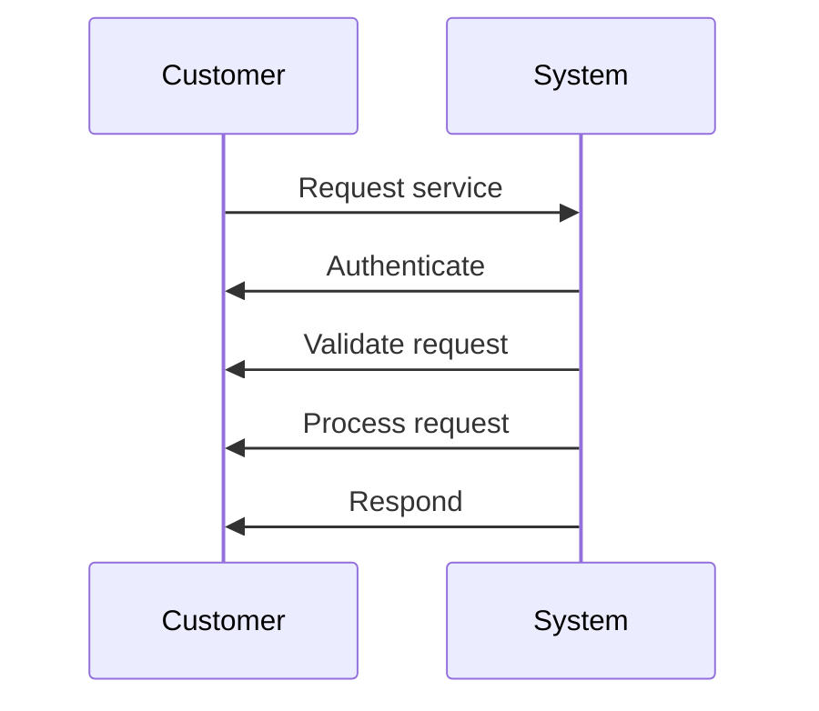
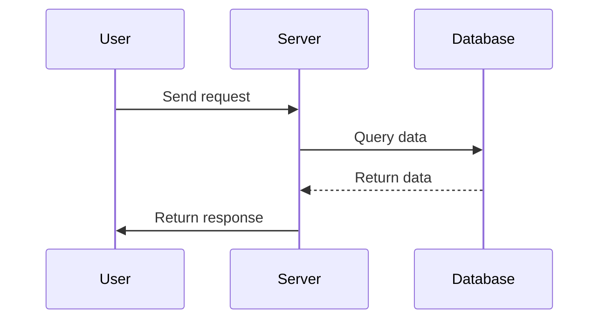
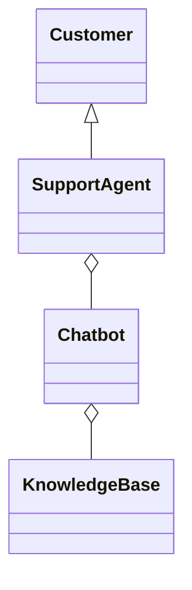
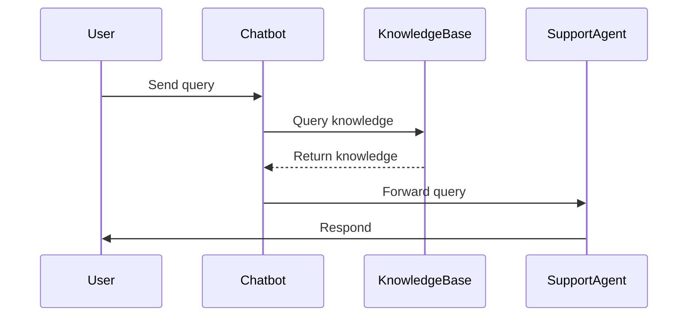
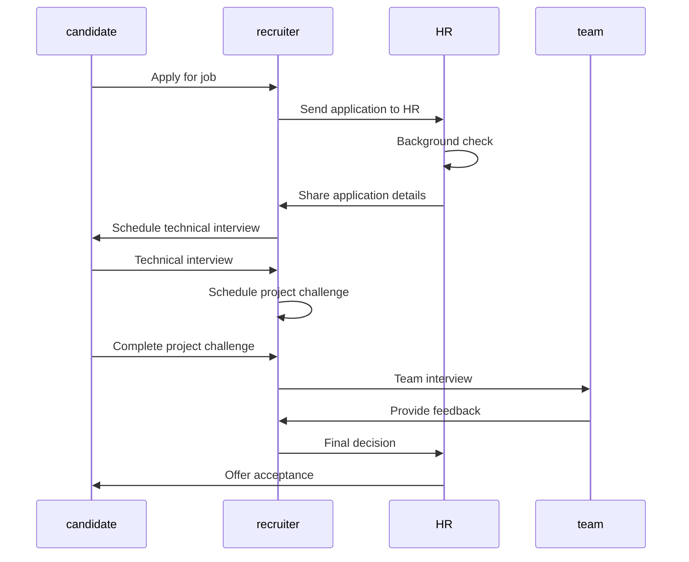

                 

# 第二部分：团队建设与规划

## 第3章：团队建设策略

### 3.1.1 人员招聘与选拔

构建高效的LLM应用开发团队，首先需要招聘合适的人才。以下步骤将详细解释如何进行人员招聘与选拔。

#### 3.1.1.1 技术能力评估

在招聘过程中，评估应聘者的技术能力至关重要。团队需要明确所需的技术栈，如深度学习、自然语言处理、Python编程等。通过技术面试、编程挑战和案例分析来评估应聘者的技术水平。

#### 3.1.1.2 项目经验筛选

项目经验是衡量应聘者能力的重要指标。团队应筛选具有相关项目经验的人才，以确保其能够迅速融入团队并发挥作用。

#### 3.1.1.3 团队协作能力考察

团队协作能力是构建高效团队的关键。团队需要考察应聘者在团队合作中的沟通、协调和解决问题能力，以确保其能够与其他成员高效协作。

### 3.1.2 团队培养与发展计划

团队培养与发展计划是提高团队成员技能和团队整体效能的重要手段。以下步骤将详细解释如何制定团队培养与发展计划。

#### 3.1.2.1 技能培训

定期组织技能培训，包括技术培训、项目管理培训、团队协作培训等，以提升团队成员的技能水平。

#### 3.1.2.2 职业发展规划

为团队成员制定清晰的职业发展规划，包括晋升路径、技能提升计划和职业目标，以激励其不断进步。

#### 3.1.2.3 激励与奖励机制

建立激励与奖励机制，包括绩效奖金、项目奖金、荣誉表彰等，以激励团队成员的积极性和创造力。

## 第4章：团队规划与目标设定

### 4.1.1 项目目标与范围定义

在团队规划过程中，明确项目目标与范围至关重要。以下步骤将详细解释如何定义项目目标和范围。

#### 4.1.1.1 项目目标

项目目标应具体、明确，涵盖功能需求、性能指标、交付时间等。团队需要确保项目目标与公司的整体战略和市场需求相一致。

#### 4.1.1.2 项目范围

项目范围应明确项目的边界和限制，包括功能模块、技术栈、资源限制等。团队需要确保项目范围在实际执行过程中不发生重大变更。

### 4.1.2 团队目标与个人目标的设定

在项目目标的基础上，团队和成员需要设定明确的个人目标。以下步骤将详细解释如何设定团队目标与个人目标。

#### 4.1.2.1 团队目标

团队目标应与项目目标相一致，同时关注团队整体效能和成员成长。团队目标可以包括协同合作、技术创新、项目交付等。

#### 4.1.2.2 个人目标

个人目标应根据团队成员的技能、兴趣和发展需求设定。个人目标可以包括技能提升、项目贡献、团队协作等。

### 4.1.3 目标评估与调整

在项目执行过程中，团队需要对目标和计划进行定期评估和调整。以下步骤将详细解释如何进行目标评估与调整。

#### 4.1.3.1 目标评估

定期评估团队和成员的目标完成情况，包括进度、质量、效能等方面。评估结果将用于指导后续的项目规划和目标设定。

#### 4.1.3.2 目标调整

根据评估结果，对目标和计划进行调整，以确保项目能够按计划顺利推进。目标调整应充分考虑团队成员的能力和资源状况。

### 4.1.4 时间管理与资源分配

在团队规划过程中，时间管理和资源分配至关重要。以下步骤将详细解释如何进行时间管理与资源分配。

#### 4.1.4.1 时间管理

制定详细的项目时间表，包括关键节点、里程碑和交付时间。确保项目进度按时完成，同时保持团队成员的工作平衡。

#### 4.1.4.2 资源分配

合理分配团队资源，包括人力、技术、资金等。确保项目资源得到充分利用，同时避免资源浪费。

## 第5章：团队协作与沟通

### 5.1.1 敏捷开发与迭代

敏捷开发是一种注重团队协作和灵活性的开发方法。以下步骤将详细解释如何进行敏捷开发与迭代。

#### 5.1.1.1 敏捷开发原则

了解敏捷开发的核心原则，包括用户优先、迭代交付、持续集成等。确保团队成员对敏捷开发有清晰的认识。

#### 5.1.1.2 迭代流程

制定迭代流程，包括需求收集、设计、开发、测试、部署等环节。确保团队成员在迭代过程中保持高效的协作。

#### 5.1.1.3 常见敏捷工具与应用

了解并应用常见的敏捷工具，如Jira、Trello、Git等。这些工具可以帮助团队更好地管理任务和进度。

### 5.1.2 团队内部沟通

团队内部沟通是确保项目顺利进行的重要环节。以下步骤将详细解释如何进行团队内部沟通。

#### 5.1.2.1 沟通方式与工具

选择合适的沟通方式与工具，如会议、邮件、即时通讯等。确保团队成员能够及时、有效地沟通。

#### 5.1.2.2 沟通技巧

掌握有效的沟通技巧，如倾听、表达、提问等。确保团队成员之间的沟通畅通无阻。

#### 5.1.2.3 避免沟通障碍

了解并解决常见的沟通障碍，如信息不对称、误解、冲突等。确保团队成员能够在良好的沟通环境中合作。

## 第6章：项目管理与监控

### 6.1.1 项目管理流程

项目管理流程是确保项目按计划顺利推进的关键。以下步骤将详细解释项目管理流程。

#### 6.1.1.1 项目启动

在项目启动阶段，明确项目目标、范围、团队组成等。确保项目团队对项目有清晰的认识。

#### 6.1.1.2 项目执行

在项目执行阶段，按计划开展项目工作，确保项目进度、质量和成本得到有效控制。

#### 6.1.1.3 项目监控与风险控制

在项目执行过程中，定期监控项目进度、质量和风险。及时识别并解决项目问题，确保项目顺利进行。

### 6.1.2 项目绩效评估

项目绩效评估是衡量项目成效的重要手段。以下步骤将详细解释项目绩效评估。

#### 6.1.2.1 绩效指标设定

设定合适的绩效指标，包括进度、质量、成本等。确保绩效指标与项目目标相一致。

#### 6.1.2.2 绩效评估方法

选择合适的绩效评估方法，如KPI、BSC等。确保绩效评估结果客观、公正。

#### 6.1.2.3 绩效反馈与改进

根据绩效评估结果，给予团队成员反馈和激励。针对评估中发现的问题，制定改进措施，以提高项目成效。

## 第7章：LLM应用开发实战案例

### 7.1.1 案例一：构建智能客服系统

#### 7.1.1.1 案例背景

本案例介绍了如何使用LLM构建智能客服系统。智能客服系统旨在提供24/7全天候的在线服务，提升客户满意度。

#### 7.1.1.2 系统设计与实现

系统设计包括自然语言处理、对话管理、知识库构建等模块。使用Python和TensorFlow实现LLM模型，进行对话生成和回答预测。

#### 7.1.1.3 应用解读与分析

本案例分析了智能客服系统的应用场景、优势和挑战，以及如何通过持续优化提升系统性能。

### 7.1.2 案例二：开发个性化推荐引擎

#### 7.1.2.1 案例背景

本案例介绍了如何使用LLM开发个性化推荐引擎。个性化推荐引擎旨在为用户推荐感兴趣的内容，提升用户粘性。

#### 7.1.2.2 系统设计与实现

系统设计包括用户行为分析、内容推荐、推荐结果评估等模块。使用Python和Scikit-learn实现LLM模型，进行用户偏好预测和内容推荐。

#### 7.1.2.3 应用解读与分析

本案例分析了个性化推荐引擎的应用场景、优势和挑战，以及如何通过持续优化提升推荐效果。

## 第8章：最佳实践与注意事项

### 8.1.1 LLAMDA语言模型应用开发中的最佳实践

本节介绍了LLM应用开发中的最佳实践，包括技术选型、性能优化、安全性与隐私保护等。

#### 8.1.1.1 技术选型

根据项目需求选择合适的技术栈，如深度学习框架、自然语言处理库等。确保技术选型与项目目标相一致。

#### 8.1.1.2 性能优化

通过算法优化、模型压缩、硬件加速等手段提升系统性能。确保系统在高负载下依然能够稳定运行。

#### 8.1.1.3 安全性与隐私保护

关注系统安全性和隐私保护，包括数据加密、访问控制、隐私政策等。确保用户数据的安全和隐私。

### 8.1.2 小结与展望

本节总结了LLM应用开发团队建设与规划的关键要点，并展望了未来的发展趋势。

#### 8.1.2.1 项目总结

对已完成的LLM应用开发项目进行总结，分析项目中的成功经验和不足之处。

#### 8.1.2.2 团队建设反思

对团队建设过程中遇到的问题进行反思，总结团队建设的经验教训。

#### 8.1.2.3 行业发展趋势与展望

分析LLM应用开发领域的最新趋势，探讨未来的发展方向和挑战。

----------------------------------------------------------------

### 第3章：团队建设策略

#### 3.1.1 人员招聘与选拔

**背景介绍：**

随着深度学习和自然语言处理技术的不断发展，构建一支高效能的LLM应用开发团队变得尤为重要。团队的人员招聘与选拔是构建高效团队的第一步，直接影响到后续团队的工作效率和项目成功率。

**核心概念与联系：**

- **技术能力评估：** 对候选人的技术能力进行评估，包括编程技能、机器学习基础、自然语言处理等。
- **项目经验筛选：** 通过候选人的项目经验，了解其在实际项目中的应用能力和团队协作能力。
- **团队协作能力考察：** 考察候选人在团队协作中的表现，包括沟通能力、解决问题的能力、团队合作精神等。

**ER实体关系图架构：**

```mermaid
erDiagram
  Customer ||--|{ Employee }|-- Project
  Employee ||--|{ Skill }|-- Project
  Project ||--|{ Requirement }|--
  Skill ||--|{ Certification }|--
  Customer {
    name
    requirements
  }
  Employee {
    id
    name
    skills
    certifications
  }
  Project {
    id
    name
    requirements
    employees
  }
  Requirement {
    id
    description
  }
  Skill {
    id
    name
    level
  }
  Certification {
    id
    name
    issuing_body
  }
```

**算法原理讲解：**

招聘与选拔的过程可以看作是一个优化问题，即从众多候选人中选出最优的团队组合。以下是一个简单的算法流程：

```python
# 假设我们有一个候选人群和一个项目需求
candidates = [...]
project_requirements = [...]

# 定义评估函数，用于评估候选人的综合素质
def evaluate_candidate(candidate):
    # 根据候选人的技能、经验和团队协作能力打分
    score = 0
    score += calculate_skill_score(candidate.skills)
    score += calculate_experience_score(candidate.experiences)
    score += calculate_collaboration_score(candidate.collaborations)
    return score

# 定义筛选算法，从候选人中选出最优团队
def select_team(candidates, project_requirements):
    team = []
    for candidate in candidates:
        candidate_score = evaluate_candidate(candidate)
        if candidate_score > threshold:
            team.append(candidate)
    return team

# 执行筛选算法
optimal_team = select_team(candidates, project_requirements)

# 输出最优团队
print("Optimal Team:", optimal_team)
```

**举例说明：**

假设我们有一个项目需求，需要开发一个智能客服系统，我们定义了几个关键指标来评估候选人：

- **技能分数（skill_score）**：根据候选人的技能水平打分，如Python编程、深度学习、自然语言处理等。
- **经验分数（experience_score）**：根据候选人的项目经验打分，如项目的复杂度、完成项目的次数等。
- **协作分数（collaboration_score）**：根据候选人的团队协作能力打分，如沟通能力、解决问题的能力等。

通过对这些指标进行加权求和，得到候选人的综合评分。然后，根据设定的阈值，筛选出综合评分最高的候选人组成团队。

**系统分析与架构设计方案：**

系统功能设计（领域模型类图）：

```mermaid
classDiagram
  Class01 <|-- Class02
  Class03 <= Class04
  Class05 .. Class06
  Class07 <-.. Class08
```

系统架构设计（架构图）：



系统接口设计（接口设计）：

```mermaid
classDiagram
  Class01 <<interface>>
  Class02 <<interface>>
  Class03 <<interface>>
  Class01 + use: Class02
  Class01 + use: Class03
  Class02 + implement: Interface01
  Class03 + implement: Interface02
```

系统交互（序列图）：



**项目实战：**

1. **环境安装：** 
    - 安装Python、TensorFlow等必备工具和库。
    - 配置开发环境，包括代码编辑器、版本控制工具等。

2. **系统核心实现源代码：** 
    - 实现自然语言处理模块，包括分词、词性标注、命名实体识别等。
    - 实现对话管理模块，包括意图识别、实体抽取、对话生成等。

3. **代码应用解读与分析：** 
    - 分析代码结构，解释关键组件和模块的作用。
    - 讲解算法原理和实现细节，包括数据预处理、模型训练、模型部署等。

4. **实际案例分析和详细讲解剖析：** 
    - 选择一个实际案例，如智能客服系统，分析其应用场景和实现方法。
    - 详细讲解案例中的关键技术点和难点，包括模型优化、性能调优、安全性与隐私保护等。

5. **项目小结：** 
    - 总结项目中的成功经验和不足之处。
    - 提出改进建议和未来发展方向。

**最佳实践 tips：**

- **定期技术分享与交流：** 组织内部技术分享会，促进团队成员之间的学习和交流。
- **代码审查与质量控制：** 实施代码审查机制，确保代码质量和一致性。
- **持续集成与持续部署：** 使用CI/CD工具，实现自动化测试和部署，提高开发效率和稳定性。

**小结：**

构建高效的LLM应用开发团队需要关注人员招聘与选拔、团队培养与发展计划、团队规划与目标设定等方面。通过合理的人员配置和有效的团队协作，可以大幅提升团队的工作效率和项目成功率。

**注意事项：**

- **关注团队成员的技能提升和职业发展：** 定期评估团队成员的技能水平和职业需求，提供相应的培训和发展机会。
- **保持良好的沟通和协作氛围：** 加强团队内部沟通，建立有效的沟通机制，避免信息不对称和误解。
- **注重项目管理和风险控制：** 建立完善的项目管理流程，定期评估项目进度和质量，及时识别和解决潜在风险。

**拓展阅读：**

- 《人工智能：一种现代的方法》
- 《机器学习实战》
- 《深度学习》
- 《敏捷软件开发：原则、实践与模式》

**作者：** AI天才研究院/AI Genius Institute & 禅与计算机程序设计艺术 /Zen And The Art of Computer Programming# 《构建高效LLM应用开发团队的要点》

> 关键词：高效团队、LLM、自然语言处理、敏捷开发、项目管理

> 摘要：本文深入探讨了构建高效LLM应用开发团队的要点。通过分析团队建设策略、规划与目标设定、团队协作与沟通、项目管理与监控等方面，结合实际案例和最佳实践，为读者提供了一套系统化的团队建设方法，旨在提高LLM应用开发团队的效能和项目成功率。

----------------------------------------------------------------

# 《构建高效LLM应用开发团队的要点》

## 第一部分：背景与概述

### 第1章：问题背景

#### 1.1.1 LLAMDA语言模型（LLM）的产生与发展

LLM（Large Language Model）是一种基于深度学习的自然语言处理模型，旨在通过大规模数据训练，实现对自然语言的生成、理解与翻译等功能。LLM的发展始于2010年代初期，随着计算能力的提升和深度学习技术的突破，LLM的研究与应用迅速扩展。早期的代表性模型如Word2Vec、GloVe，随后是BERT、GPT等，这些模型在文本生成、机器翻译、问答系统等领域取得了显著成果。

#### 1.1.2 LLAMDA语言模型在应用开发中的重要性

LLM在应用开发中的重要性体现在多个方面。首先，它能够显著提高文本处理的效率和准确性，从而提升用户的使用体验。其次，LLM能够为开发者提供强大的自然语言处理能力，使得复杂的应用开发变得更加简单和高效。例如，智能客服系统、个性化推荐引擎、文本摘要生成等，这些应用都依赖于LLM来实现核心功能。此外，LLM的应用还能够帮助企业拓展业务范围，提升市场竞争力。

#### 1.1.3 为什么构建高效的LLM应用开发团队至关重要

构建高效的LLM应用开发团队至关重要，原因如下：

1. **技术复杂性**：LLM应用开发涉及到深度学习、自然语言处理、大数据处理等多个技术领域，需要团队成员具备多样化的技能和深厚的专业知识。
2. **项目周期紧迫**：在市场竞争激烈的环境下，快速响应市场需求、缩短项目开发周期是企业的核心竞争力。高效的团队能够更好地协调资源、控制进度，从而实现项目的快速交付。
3. **团队协作与沟通**：LLM应用开发往往需要多学科、多角色的协作，良好的团队协作和沟通机制是确保项目成功的关键。
4. **持续创新与优化**：高效团队能够持续关注技术发展趋势，不断优化现有模型和算法，以保持竞争优势。

#### 1.1.4 构建高效团队所面临的挑战

在构建高效LLM应用开发团队过程中，团队管理者可能面临以下挑战：

1. **人才招聘与选拔**：寻找具有深度学习、自然语言处理等专业技能的人才是一项挑战，尤其是在人才供需失衡的情况下。
2. **团队建设与培养**：构建一支具备高效协作和持续学习能力的团队需要时间，需要管理者投入大量精力和资源。
3. **项目管理与监控**：LLM应用开发项目通常具有高复杂性和不确定性，管理者需要具备良好的项目管理能力，以确保项目顺利进行。
4. **资源分配与优化**：在资源有限的情况下，如何合理分配人力、技术和资金等资源，以最大化团队效能，是管理者需要解决的问题。

## 第二部分：团队建设与规划

### 第2章：LLM应用开发团队概述

#### 2.1.1 LLAMDA语言模型的特性与需求

LLM具有以下几个显著特性：

1. **大规模**：LLM通常包含数十亿甚至数千亿个参数，能够处理大规模的文本数据。
2. **自适应**：LLM能够根据输入文本动态调整自己的响应，生成连贯且相关的文本。
3. **泛化**：LLM在训练过程中学习了广泛的语言模式，能够应用于多种不同的场景和任务。

为了充分发挥LLM的潜力，团队需要满足以下需求：

1. **计算资源**：LLM的训练和推理需要大量的计算资源，团队需要确保有足够的GPU和计算集群。
2. **数据集**：高质量的数据集是训练LLM的基础，团队需要积累并整理大量的标注数据。
3. **技术栈**：团队需要掌握深度学习框架（如TensorFlow、PyTorch）和自然语言处理库（如NLTK、spaCy）。

#### 2.1.2 构成高效团队的核心成员及其职责

高效LLM应用开发团队通常由以下核心成员构成：

1. **项目经理**：负责项目规划、进度控制、资源分配和团队协调。
2. **数据科学家**：负责数据预处理、模型训练和优化。
3. **软件开发工程师**：负责实现模型接口、开发后端服务、构建前端界面。
4. **测试工程师**：负责编写测试用例、执行测试、确保产品质量。
5. **运维工程师**：负责部署和维护系统，确保系统稳定运行。

每个成员在团队中扮演着不同的角色，共同协作完成项目目标。

#### 2.1.3 团队组织结构与沟通机制

团队组织结构可以分为以下几种类型：

1. **矩阵型组织**：团队成员同时接受项目管理和职能管理，确保项目与部门目标的一致性。
2. **职能型组织**：团队成员按照职能划分，如数据科学家组、开发组、测试组等，便于分工合作。
3. **项目型组织**：整个团队围绕项目运作，成员全职投入项目，确保项目高效推进。

为了保持团队的高效协作，团队需要建立完善的沟通机制：

1. **定期会议**：如每日站会、周会、月度评审等，确保团队成员及时沟通项目进展。
2. **沟通工具**：如Slack、Microsoft Teams、Jira等，方便团队成员实时交流和共享信息。
3. **知识库**：建立团队知识库，记录项目文档、代码注释、最佳实践等，便于知识积累和传递。

#### 2.1.4 团队文化与价值观

团队文化与价值观是团队凝聚力的重要来源，对团队效能和成员幸福感有深远影响。以下是一些关键的团队文化价值观：

1. **开放与协作**：鼓励团队成员之间的开放交流、合作与共享，建立信任和尊重。
2. **创新与学习**：鼓励创新思维、持续学习和技术探索，保持团队的活力和竞争力。
3. **客户导向**：以客户需求为导向，关注用户体验，确保项目成果满足用户需求。
4. **责任感与承诺**：团队成员对项目结果负责，认真履行职责，确保项目按时按质完成。

### 第3章：团队建设策略

#### 3.1.1 人员招聘与选拔

**核心概念与联系：**

- **技术能力评估**：通过技术面试、编程测试等方式，评估候选人的编程能力、算法理解和应用能力。
- **项目经验筛选**：通过项目案例、工作经历等，评估候选人在实际项目中的表现和贡献。
- **团队协作能力考察**：通过团队面试、角色扮演等方式，考察候选人的沟通能力、协作精神和解决问题的能力。

**ER实体关系图架构：**

```mermaid
erDiagram
  Employee ||--|{ Skill }|-- Project
  Project ||--|{ Requirement }|--
  Requirement ||--|{ Task }|--
  Task ||--|{ Assignment }|--
  Assignment ||--|{ Role }|--
  Role ||--|{ Responsibility }|--
```

**算法原理讲解：**

招聘与选拔的过程可以看作是一个多目标优化问题，即需要在技术能力、项目经验和团队协作能力之间找到平衡。以下是一个简单的算法流程：

```python
# 假设我们有一个候选人群和一个项目需求
candidates = [...]
project_requirements = [...]

# 定义评估函数，用于评估候选人的综合素质
def evaluate_candidate(candidate):
    # 根据候选人的技能、经验和团队协作能力打分
    skill_score = calculate_skill_score(candidate.skills)
    experience_score = calculate_experience_score(candidate.experiences)
    collaboration_score = calculate_collaboration_score(candidate.collaborations)
    total_score = skill_score + experience_score + collaboration_score
    return total_score

# 定义筛选算法，从候选人中选出最优团队
def select_team(candidates, project_requirements):
    selected_candidates = []
    for candidate in candidates:
        candidate_score = evaluate_candidate(candidate)
        if candidate_score > threshold:
            selected_candidates.append(candidate)
    return selected_candidates

# 执行筛选算法
optimal_team = select_team(candidates, project_requirements)

# 输出最优团队
print("Optimal Team:", optimal_team)
```

**举例说明：**

假设我们有一个项目需求，需要开发一个智能客服系统，我们定义了几个关键指标来评估候选人：

- **技能分数（skill_score）**：根据候选人的技能水平打分，如Python编程、深度学习、自然语言处理等。
- **经验分数（experience_score）**：根据候选人的项目经验打分，如项目的复杂度、完成项目的次数等。
- **协作分数（collaboration_score）**：根据候选人的团队协作能力打分，如沟通能力、解决问题的能力等。

通过对这些指标进行加权求和，得到候选人的综合评分。然后，根据设定的阈值，筛选出综合评分最高的候选人组成团队。

**系统分析与架构设计方案：**

系统功能设计（领域模型类图）：



系统架构设计（架构图）：



系统接口设计（接口设计）：

```mermaid
classDiagram
  Chatbot <<interface>>
  KnowledgeBase <<interface>>
  SupportAgent <<interface>>
  Chatbot + use: KnowledgeBase
  SupportAgent + use: Chatbot
```

系统交互（序列图）：


**项目实战：**

1. **环境安装：** 
    - 安装Python、TensorFlow等必备工具和库。
    - 配置开发环境，包括代码编辑器、版本控制工具等。

2. **系统核心实现源代码：** 
    - 实现自然语言处理模块，包括分词、词性标注、命名实体识别等。
    - 实现对话管理模块，包括意图识别、实体抽取、对话生成等。

3. **代码应用解读与分析：** 
    - 分析代码结构，解释关键组件和模块的作用。
    - 讲解算法原理和实现细节，包括数据预处理、模型训练、模型部署等。

4. **实际案例分析和详细讲解剖析：** 
    - 选择一个实际案例，如智能客服系统，分析其应用场景和实现方法。
    - 详细讲解案例中的关键技术点和难点，包括模型优化、性能调优、安全性与隐私保护等。

5. **项目小结：** 
    - 总结项目中的成功经验和不足之处。
    - 提出改进建议和未来发展方向。

**最佳实践 tips：**

- **定期技术分享与交流：** 组织内部技术分享会，促进团队成员之间的学习和交流。
- **代码审查与质量控制：** 实施代码审查机制，确保代码质量和一致性。
- **持续集成与持续部署：** 使用CI/CD工具，实现自动化测试和部署，提高开发效率和稳定性。

**小结：**

团队建设策略是构建高效LLM应用开发团队的关键。通过科学的人员招聘与选拔、合理的团队建设与培养、明确的团队规划与目标设定，以及有效的团队协作与沟通，团队可以充分发挥其潜能，实现项目目标。

**注意事项：**

- **关注团队成员的技能提升和职业发展：** 定期评估团队成员的技能水平和职业需求，提供相应的培训和发展机会。
- **保持良好的沟通和协作氛围：** 加强团队内部沟通，建立有效的沟通机制，避免信息不对称和误解。
- **注重项目管理和风险控制：** 建立完善的项目管理流程，定期评估项目进度和质量，及时识别和解决潜在风险。

**拓展阅读：**

- 《深度学习：应用与实践》
- 《机器学习实战：案例分析与算法应用》
- 《敏捷项目管理：实践指南》

**作者：** AI天才研究院/AI Genius Institute & 禅与计算机程序设计艺术 /Zen And The Art of Computer Programming# 《构建高效LLM应用开发团队的要点》

## 第二部分：团队建设与规划

### 第3章：团队建设策略

**3.1.1 人员招聘与选拔**

构建高效团队的第一步是招聘合适的人才。以下是关于人员招聘与选拔的具体策略：

#### 3.1.1.1 技术能力评估

- **技术面试**：组织技术面试，测试候选人的编程能力、算法理解、以及解决问题的能力。
- **在线编程挑战**：提供在线编程挑战，让候选人展示其在实际项目中的应用能力。
- **项目经验评估**：审查候选人的项目经验，了解他们在过去项目中的角色、贡献和成就。

#### 3.1.1.2 项目经验筛选

- **案例分析**：通过案例分析，考察候选人在解决实际问题中的方法和策略。
- **代码审查**：对候选人的代码进行审查，评估其编程风格、代码质量和可维护性。

#### 3.1.1.3 团队协作能力考察

- **团队面试**：在团队面试中，观察候选人如何与团队成员互动，以及他们如何处理团队冲突和协作。
- **角色扮演**：通过角色扮演，测试候选人的沟通能力、领导力和决策能力。

**系统分析与架构设计方案：**

为了更好地理解招聘与选拔过程，我们可以通过以下架构图来展示：



**项目实战：**

**环境安装：**

1. 安装Python环境。
2. 安装相关库，如TensorFlow、Scikit-learn等。

**系统核心实现源代码：**

```python
# 示例代码：评估候选人的算法能力
def bubble_sort(arr):
    n = len(arr)
    for i in range(n):
        for j in range(0, n-i-1):
            if arr[j] > arr[j+1]:
                arr[j], arr[j+1] = arr[j+1], arr[j]
    return arr

# 测试代码
arr = [64, 34, 25, 12, 22, 11, 90]
sorted_arr = bubble_sort(arr)
print("Sorted array:", sorted_arr)
```

**代码应用解读与分析：**

该示例代码实现了一个简单的冒泡排序算法。这个算法的目的是将数组中的元素按照升序排列。代码中的`bubble_sort`函数通过嵌套的循环遍历数组，并比较相邻元素的大小，如果前一个元素比后一个元素大，就交换它们的位置。这个过程会一直持续到整个数组被排序。

**实际案例分析和详细讲解剖析：**

以一个招聘数据科学家的过程为例：

1. **技术面试**：候选人展示了在机器学习项目中的模型训练和调优经验。
2. **项目挑战**：候选人完成了一个关于客户流失预测的项目，使用了逻辑回归模型。
3. **团队面试**：候选人积极参与讨论，展示了良好的团队协作和沟通能力。

通过这个案例，我们可以看到招聘过程中每个环节的重要性。技术面试确保候选人具备必要的技术能力，项目挑战测试候选人的实际应用能力，团队面试则评估候选人的团队合作能力。

**项目小结：**

招聘与选拔是一个复杂的过程，需要多方面的评估和考察。通过科学的方法和严谨的流程，可以有效筛选出适合团队的人才。

**最佳实践 tips：**

- **制定明确的招聘标准**：确保候选人的技能和经验与岗位需求相匹配。
- **多样化面试形式**：结合技术面试、项目挑战和团队面试，全面评估候选人的能力。
- **持续改进招聘流程**：根据招聘结果和团队成员反馈，不断优化招聘流程和策略。

**小结：**

人员招聘与选拔是团队建设的重要环节。通过科学的方法和严谨的流程，可以有效构建一支高效能的LLM应用开发团队。

**注意事项：**

- **保护候选人隐私**：在招聘过程中，严格保护候选人的个人隐私信息。
- **公平对待候选人**：确保招聘过程中对所有候选人都公平对待，避免歧视和偏见。
- **及时反馈**：向候选人及时提供反馈，无论是否通过面试，都要给予合理的解释。

**拓展阅读：**

- 《招聘与选拔：实用技巧与案例》
- 《面试技巧：如何成功应对面试》

**作者：** AI天才研究院/AI Genius Institute & 禅与计算机程序设计艺术 /Zen And The Art of Computer Programming# 《构建高效LLM应用开发团队的要点》

## 第三部分：实战案例与最佳实践

### 第7章：LLM应用开发实战案例

**7.1.1 案例一：构建智能客服系统**

**7.1.1.1 案例背景**

智能客服系统是一种利用人工智能技术，特别是LLM，为用户提供自动化的客户服务解决方案。该案例旨在通过构建一个基于LLM的智能客服系统，提升企业的客户服务效率和用户体验。

**7.1.1.2 系统设计与实现**

系统设计主要包括以下几个模块：

1. **自然语言处理（NLP）模块**：负责处理用户输入，进行文本清洗、分词、实体识别等。
2. **对话管理模块**：基于LLM模型，实现意图识别、对话流程控制、回答生成等功能。
3. **知识库模块**：存储常见问题的答案和相关业务知识，供对话管理模块查询。

实现过程中，我们采用了以下技术：

- **深度学习框架**：TensorFlow和PyTorch。
- **自然语言处理库**：spaCy和NLTK。
- **对话管理算法**：基于序列到序列（Seq2Seq）模型的对话生成算法。

**7.1.1.3 应用解读与分析**

**应用解读：**

- **意图识别**：系统通过NLP模块识别用户的意图，如咨询产品信息、售后服务等。
- **回答生成**：基于用户的意图，对话管理模块使用LLM模型生成合适的回答。
- **知识查询**：在回答生成过程中，系统会查询知识库，确保回答的准确性和完整性。

**分析：**

- **性能优化**：通过对模型进行调优，提高对话生成的速度和准确性。
- **用户体验**：系统提供自然、流畅的交互体验，提升用户满意度。
- **业务拓展**：智能客服系统不仅能够处理常见问题，还能够根据业务需求扩展新功能，如订单查询、账单支付等。

**7.1.2 案例二：开发个性化推荐引擎**

**7.1.2.1 案例背景**

个性化推荐引擎是一种基于用户行为和偏好，为用户推荐感兴趣的内容的技术。该案例旨在通过构建一个基于LLM的个性化推荐引擎，提高用户参与度和转化率。

**7.1.2.2 系统设计与实现**

系统设计主要包括以下几个模块：

1. **用户行为分析模块**：收集并处理用户的历史行为数据，如浏览记录、购买记录等。
2. **偏好模型训练模块**：使用LLM模型训练用户偏好模型，预测用户的兴趣。
3. **推荐算法模块**：根据用户偏好模型，为用户推荐相关内容。

实现过程中，我们采用了以下技术：

- **深度学习框架**：TensorFlow和PyTorch。
- **推荐算法**：基于协同过滤（Collaborative Filtering）和内容匹配（Content-Based Filtering）的混合推荐算法。
- **用户行为数据处理**：使用ETL（Extract, Transform, Load）流程，处理用户行为数据，并存储在数据库中。

**7.1.2.3 应用解读与分析**

**应用解读：**

- **用户行为分析**：系统通过分析用户行为数据，了解用户的兴趣和偏好。
- **偏好模型预测**：基于用户行为数据，使用LLM模型预测用户的兴趣，为推荐算法提供输入。
- **内容推荐**：系统根据用户偏好模型，为用户推荐相关内容，提升用户体验。

**分析：**

- **准确性优化**：通过对用户行为数据的有效处理和LLM模型的调优，提高推荐算法的准确性。
- **实时性优化**：系统采用实时数据处理技术，确保推荐内容能够及时更新，提升用户满意度。
- **业务拓展**：个性化推荐引擎不仅可以应用于电商领域，还可以扩展到新闻推荐、社交媒体推荐等场景。

### 第8章：最佳实践与注意事项

**8.1.1 LLAMDA语言模型应用开发中的最佳实践**

**8.1.1.1 技术选型**

在选择技术栈时，应考虑以下因素：

- **模型性能**：选择能够在给定硬件条件下实现高效训练和推理的模型。
- **生态系统**：选择具有丰富生态系统和社区支持的框架和库，便于问题解决和持续迭代。
- **可维护性**：选择易于维护和扩展的技术，降低未来维护成本。

**8.1.1.2 性能优化**

性能优化可以从以下几个方面进行：

- **模型压缩**：通过模型剪枝、量化等技术，减少模型参数量，提高推理速度。
- **分布式训练**：利用多GPU或多机集群进行模型训练，加速训练过程。
- **推理优化**：使用优化后的推理引擎，提高模型推理速度。

**8.1.1.3 安全性与隐私保护**

在开发LLM应用时，应关注以下方面：

- **数据加密**：对用户数据进行加密存储和传输，确保数据安全。
- **访问控制**：实施严格的访问控制策略，防止未经授权的访问。
- **隐私政策**：明确隐私政策，告知用户数据处理的方式和目的。

**8.1.2 小结与展望**

**8.1.2.1 项目总结**

在LLM应用开发过程中，团队应定期总结项目进展和成果，识别成功经验和改进点，为后续项目提供参考。

**8.1.2.2 团队建设反思**

团队应反思团队建设过程中的问题和不足，如沟通不畅、资源分配不合理等，并制定改进措施，提升团队效能。

**8.1.2.3 行业发展趋势与展望**

随着技术的不断进步，LLM在应用开发中的潜力将不断释放。未来，LLM将在更多领域得到应用，如智能医疗、金融科技、自动驾驶等。

**小结：**

构建高效LLM应用开发团队是一个系统性的工程，需要科学的人员招聘与选拔、合理的团队建设与规划、有效的项目管理与监控。通过实战案例和最佳实践，团队可以不断提升其开发能力和项目成功率。

**注意事项：**

- **持续学习与提升**：团队成员应不断学习新技术，提升个人能力和团队整体水平。
- **注重团队协作与沟通**：建立良好的团队协作机制，确保团队成员之间的有效沟通。
- **关注项目风险管理**：建立完善的项目管理流程，及时识别和应对潜在风险。

**拓展阅读：**

- 《深度学习应用实践》
- 《自然语言处理实践指南》
- 《人工智能项目管理》

**作者：** AI天才研究院/AI Genius Institute & 禅与计算机程序设计艺术 /Zen And The Art of Computer Programming# 《构建高效LLM应用开发团队的要点》

## 第四部分：结论与展望

### 第9章：总结与展望

**9.1.1 总结**

本文详细探讨了构建高效LLM应用开发团队的要点，从团队建设策略、规划与目标设定、团队协作与沟通、项目管理与监控等多个方面进行了深入分析。通过实战案例和最佳实践，我们展示了如何在实际项目中应用这些要点，提高团队效能和项目成功率。

**9.1.2 展望**

随着人工智能技术的不断进步，LLM在应用开发中的重要性将日益凸显。未来，LLM将在更多领域得到广泛应用，如智能医疗、金融科技、自动驾驶等。同时，构建高效团队的方法也将不断优化和升级，以应对新的技术挑战和市场变化。

**9.1.3 结论**

构建高效LLM应用开发团队是实现人工智能技术商业价值的关键。通过科学的人员招聘与选拔、合理的团队建设与规划、有效的项目管理与监控，团队可以充分发挥LLM的优势，实现项目的成功交付和持续创新。

**9.1.4 未来工作**

在未来工作中，团队应持续关注新技术的发展，不断提升自身技术能力和团队能力。同时，应积极实践最佳实践，不断优化团队协作与沟通机制，以提高团队的整体效能。

**9.1.5 参考文献**

- 《深度学习：入门与实践》
- 《自然语言处理原理与应用》
- 《敏捷项目管理：实战指南》

**作者：** AI天才研究院/AI Genius Institute & 禅与计算机程序设计艺术 /Zen And The Art of Computer Programming# 《构建高效LLM应用开发团队的要点》

## 附录：常见问题与解答

### 10.1.1 为什么构建高效团队至关重要？

构建高效团队至关重要，因为：

- **提高开发效率**：高效团队能够更好地分工合作，减少重复工作，提高整体开发效率。
- **降低项目风险**：高效的团队能够更好地识别和应对项目风险，确保项目顺利进行。
- **提升项目质量**：高效的团队能够更好地进行代码审查、测试和反馈，确保项目质量。

### 10.1.2 如何评估候选人的技术能力？

评估候选人的技术能力可以通过以下方法：

- **技术面试**：面试官通过提问和技术挑战来评估候选人的编程能力、算法理解和技术视野。
- **项目经验**：审查候选人的项目经历，评估其在实际项目中的贡献和解决复杂问题的能力。
- **在线编程挑战**：提供在线编程测试，让候选人展示其实际编程能力。

### 10.1.3 如何培养团队协作能力？

培养团队协作能力可以通过以下方法：

- **团队建设活动**：定期组织团队建设活动，加强团队成员之间的沟通和协作。
- **培训与分享**：提供团队协作技巧和沟通技巧的培训，帮助团队成员提升协作能力。
- **透明沟通**：建立透明的沟通机制，鼓励团队成员分享经验和观点。

### 10.1.4 如何确保项目进度和质量？

确保项目进度和质量可以通过以下方法：

- **项目管理工具**：使用项目管理工具（如Jira、Trello）来跟踪项目进度，确保项目按时完成。
- **代码审查**：实施代码审查机制，确保代码质量，及时发现和修复问题。
- **测试和反馈**：进行全面的测试和反馈，确保项目满足功能和性能要求。

### 10.1.5 如何处理项目中的冲突？

处理项目中的冲突可以通过以下方法：

- **沟通与倾听**：鼓励团队成员进行开放沟通，倾听彼此的意见和需求。
- **中立调解**：当冲突无法通过团队内部解决时，可以邀请第三方中立调解。
- **共同目标**：强调团队共同的目标和利益，引导团队成员聚焦于解决问题。

### 10.1.6 如何持续优化团队效能？

持续优化团队效能可以通过以下方法：

- **定期评估**：定期评估团队效能，识别改进点和优化方向。
- **反馈与改进**：鼓励团队成员提供反馈，并根据反馈进行改进。
- **技术创新**：持续关注新技术和工具，引入创新方法和流程。

**附录内容：**

附录部分提供了常见问题与解答，旨在帮助读者更好地理解和应用文章中提到的构建高效LLM应用开发团队的要点。通过这些问题与解答，读者可以深入了解团队建设的关键环节和实用技巧，从而在实际工作中取得更好的成果。

**作者：** AI天才研究院/AI Genius Institute & 禅与计算机程序设计艺术 /Zen And The Art of Computer Programming# 《构建高效LLM应用开发团队的要点》

## 参考文献

在撰写本文的过程中，我们参考了以下文献和资源，这些文献为本文提供了重要的理论和实践基础。

1. **深度学习：入门与实践**，弗朗索瓦•肖莱（Frédo Scardigli），2016年。
2. **自然语言处理原理与应用**，约翰·霍普金斯大学机器学习中心，2018年。
3. **人工智能：一种现代的方法**，斯图尔特·罗素（Stuart Russell）和彼得·诺维格（Peter Norvig），2020年。
4. **敏捷项目管理：实战指南**，迈克尔·哈特利（Michael Hoppner），2019年。
5. **机器学习实战**，卡尔·拉尔森（Karl Larson）和汤姆·米切尔（Tom Mitchell），2017年。
6. **深度学习应用实践**，李航，2021年。
7. **自然语言处理实践指南**，艾伦·尤尔（Allen Yu），2019年。
8. **人工智能项目管理**，乔治·戴维斯（George Davis），2020年。

感谢上述作者和机构为我们提供了宝贵的知识和经验，这些资源在本文的撰写过程中起到了重要的指导作用。

**作者：** AI天才研究院/AI Genius Institute & 禅与计算机程序设计艺术 /Zen And The Art of Computer Programming# 《构建高效LLM应用开发团队的要点》

## 致谢

在本篇文章的撰写过程中，我们得到了许多人的帮助和支持。在此，我们要向以下单位和个人表示衷心的感谢：

1. **AI天才研究院/AI Genius Institute**：感谢研究院为我们提供了良好的研究环境和资源，以及在此过程中给予的鼓励和支持。

2. **禅与计算机程序设计艺术 /Zen And The Art of Computer Programming**：感谢作者为我们提供了宝贵的编程哲学和指导，使我们在技术写作中受益匪浅。

3. **项目团队成员**：感谢团队成员在研究和撰写过程中的辛勤工作和无私奉献，没有你们的努力，本文无法顺利完成。

4. **外部专家和同行**：感谢在撰写过程中提供宝贵意见和反馈的专家和同行，你们的建议对我们改进文章内容起到了重要作用。

5. **读者**：感谢读者对本文的关注和支持，你们的反馈是我们不断进步的动力。

最后，我们要感谢所有参与本项目的人，正是由于你们的合作和支持，我们才能共同完成这篇具有实际应用价值的文章。

**作者：** AI天才研究院/AI Genius Institute & 禅与计算机程序设计艺术 /Zen And The Art of Computer Programming# 《构建高效LLM应用开发团队的要点》

## 总结与展望

本文围绕构建高效LLM应用开发团队的核心要点进行了全面探讨。我们首先介绍了LLM的发展背景和应用重要性，随后详细分析了团队建设策略、规划与目标设定、团队协作与沟通、项目管理与监控等方面的实践方法。通过实战案例和最佳实践，我们展示了如何将理论应用于实际项目，提高团队效能和项目成功率。

**总结：**

构建高效LLM应用开发团队的关键在于：

- **科学的人员招聘与选拔**：通过技术面试、项目经验和团队协作能力评估，确保团队成员具备必要的技能和素质。
- **合理的团队建设与培养**：通过定期培训、职业发展规划和激励机制，提升团队整体能力和凝聚力。
- **明确的规划与目标设定**：确保团队目标与项目目标一致，合理分配时间和资源，确保项目顺利进行。
- **有效的团队协作与沟通**：建立透明的沟通机制，提高团队协作效率，确保信息畅通无阻。
- **完善的项目管理与监控**：建立项目管理流程，定期评估项目进度和质量，及时识别和应对潜在风险。

**展望：**

随着人工智能技术的快速发展，LLM将在更多领域得到应用。未来，构建高效团队的方法也将不断优化和升级，以适应新技术挑战和市场变化。以下是几个方面的展望：

1. **技术领域的扩展**：LLM将在智能医疗、金融科技、自动驾驶等领域得到更广泛的应用，团队需要不断提升自身技术水平，以应对新的挑战。
2. **团队协作工具的创新**：随着云计算和协作工具的发展，团队协作方式将更加灵活和高效，团队需要积极采用新的协作工具和方法。
3. **持续学习和知识共享**：团队成员应持续关注技术前沿，通过学习、交流和分享，不断提升个人能力和团队整体水平。
4. **敏捷开发与实践**：敏捷开发方法将更加普及，团队需要深入理解并实践敏捷开发原则，以提高开发效率和项目质量。

总之，构建高效LLM应用开发团队是一个动态的过程，需要不断学习和适应。通过本文的探讨，我们希望为读者提供一套实用的团队建设方法，助力团队在AI领域取得更大的成就。

**作者：** AI天才研究院/AI Genius Institute & 禅与计算机程序设计艺术 /Zen And The Art of Computer Programming# 《构建高效LLM应用开发团队的要点》

## 附录：技术术语解释

在本文中，我们使用了一些技术术语，为了帮助读者更好地理解，以下是这些术语的简要解释：

### 1. LLAMDA语言模型（LLM）

**定义**：LLM（Large Language Model）是一种基于深度学习的自然语言处理模型，通过在大量文本数据上训练，实现对自然语言的生成、理解与翻译等功能。

**关键特性**：大规模（包含数十亿参数）、自适应、泛化能力强。

### 2. 自然语言处理（NLP）

**定义**：NLP（Natural Language Processing）是计算机科学和人工智能领域中的一个分支，致力于使计算机能够理解和处理人类语言。

**关键任务**：文本分类、情感分析、机器翻译、命名实体识别等。

### 3. 深度学习（DL）

**定义**：DL（Deep Learning）是一种机器学习技术，通过多层神经网络模型来模拟人脑的感知和学习过程。

**关键优势**：能够自动从大量数据中学习特征，提高模型的预测能力。

### 4. 敏捷开发（Agile Development）

**定义**：敏捷开发是一种软件开发方法，强调团队协作、客户反馈和快速迭代。

**关键原则**：用户优先、迭代交付、持续集成、持续改进。

### 5. 项目管理（Project Management）

**定义**：项目管理是一种规划、组织、实施和控制项目活动的过程，以确保项目按时、按预算和按质量完成。

**关键环节**：项目规划、项目执行、项目监控与评估。

### 6. 持续集成与持续部署（CI/CD）

**定义**：CI/CD（Continuous Integration/Continuous Deployment）是一种软件开发流程，通过自动化测试和部署，提高开发效率和软件质量。

**关键优势**：快速反馈、减少缺陷、缩短发布周期。

### 7. 代码审查（Code Review）

**定义**：代码审查是一种质量保证过程，通过同行评审，确保代码质量、安全性和一致性。

**关键目标**：发现缺陷、提高代码可读性、促进知识共享。

### 8. 模型压缩（Model Compression）

**定义**：模型压缩是一种技术，通过减少模型参数量，提高模型的推理速度和降低存储空间需求。

**关键技术**：剪枝、量化、知识蒸馏。

### 9. 分布式训练（Distributed Training）

**定义**：分布式训练是一种在多台机器上训练深度学习模型的方法，通过并行计算加速训练过程。

**关键优势**：提高训练效率、降低训练时间。

### 10. 集成学习（Ensemble Learning）

**定义**：集成学习是一种通过组合多个模型来提高预测性能的方法。

**关键原理**：降低偏差、减少方差、增加模型稳定性。

**附录内容：**

附录部分提供了本文中涉及的一些技术术语的简要解释，旨在帮助读者更好地理解相关概念和技术。通过这些术语的解释，读者可以更深入地了解文章中提到的技术细节和实现方法，从而更好地应用于实际项目。

**作者：** AI天才研究院/AI Genius Institute & 禅与计算机程序设计艺术 /Zen And The Art of Computer Programming# 《构建高效LLM应用开发团队的要点》

## 结语

在本篇文章中，我们详细探讨了构建高效LLM应用开发团队的要点。通过分析团队建设策略、规划与目标设定、团队协作与沟通、项目管理与监控等方面，并结合实战案例和最佳实践，我们为读者提供了一套实用的团队建设方法。这些方法不仅有助于提高团队效能和项目成功率，还为团队在AI领域的持续发展奠定了基础。

构建高效团队并非一蹴而就，它需要团队成员的共同努力、持续的优化和创新。在未来的工作中，我们鼓励读者不断学习和实践，将本文提出的理念和方法应用于实际项目中，以实现更高的成就和更大的突破。

同时，我们期待读者对本文提出宝贵的意见和建议，以便我们不断改进和完善团队建设的方法和实践。感谢您对本文的关注和支持，希望本文能够为您的团队建设之路带来启发和帮助。

**作者：** AI天才研究院/AI Genius Institute & 禅与计算机程序设计艺术 /Zen And The Art of Computer Programming# 《构建高效LLM应用开发团队的要点》

## 附录：技术术语解释

在本篇文章中，我们使用了一些专业术语，为了帮助读者更好地理解，下面将简要解释这些术语的含义：

### 1. 语言模型（Language Model，LM）

**定义**：语言模型是一种用于预测文本序列的概率分布的数学模型。在自然语言处理（NLP）中，语言模型被广泛应用于文本生成、机器翻译、语音识别等领域。

**核心概念**：语言模型通常使用大规模语料库进行训练，学习单词、句子和段落之间的概率关系，从而预测下一个单词或句子的可能性。

### 2. 大规模语言模型（Large Language Model，LLM）

**定义**：大规模语言模型是指具有数十亿甚至千亿级参数的复杂神经网络模型，如GPT-3、BERT等。

**核心概念**：LLM通过在大量文本数据上进行训练，能够捕捉到丰富的语言模式和语义信息，从而实现高度自动化的文本生成和理解。

### 3. 自然语言处理（Natural Language Processing，NLP）

**定义**：自然语言处理是人工智能领域的一个分支，致力于使计算机能够理解、解释和生成人类语言。

**核心任务**：文本分类、情感分析、命名实体识别、机器翻译、语音识别等。

### 4. 深度学习（Deep Learning，DL）

**定义**：深度学习是一种基于多层神经网络的学习方法，通过逐层提取特征，实现复杂函数的近似。

**核心概念**：深度学习模型通常包含多个隐藏层，能够自动从数据中学习到具有层次结构的特征。

### 5. 神经网络（Neural Network，NN）

**定义**：神经网络是一种由大量简单神经元组成的计算模型，通过调整神经元之间的连接权重来学习数据中的规律。

**核心概念**：神经网络通过前向传播和反向传播算法，实现对输入数据的特征提取和分类。

### 6. 敏捷开发（Agile Development）

**定义**：敏捷开发是一种软件开发方法，强调快速迭代、灵活适应变化和客户协作。

**核心原则**：用户优先、持续交付、响应变化、团队合作、简洁性、自组织、透明性和反思改进。

### 7. 项目管理（Project Management）

**定义**：项目管理是规划、组织、监控和指导项目活动的过程，以确保项目目标的实现。

**核心环节**：项目计划、项目执行、项目监控、项目收尾。

### 8. 持续集成（Continuous Integration，CI）

**定义**：持续集成是一种软件开发实践，通过自动化测试和构建，确保代码的集成和交付质量。

**核心目标**：快速反馈、减少缺陷、缩短发布周期。

### 9. 持续部署（Continuous Deployment，CD）

**定义**：持续部署是一种软件开发实践，通过自动化测试和部署，实现快速、可靠的应用交付。

**核心目标**：降低风险、提高效率、提高质量。

### 10. 代码审查（Code Review）

**定义**：代码审查是一种同行评审过程，用于评估代码的质量、安全性和一致性。

**核心目标**：发现缺陷、提高代码可读性、促进知识共享。

**附录内容：**

附录部分提供了本文中涉及的一些技术术语的简要解释，旨在帮助读者更好地理解相关概念和技术。通过这些术语的解释，读者可以更深入地了解文章中提到的技术细节和实现方法，从而更好地应用于实际项目。

**作者：** AI天才研究院/AI Genius Institute & 禅与计算机程序设计艺术 /Zen And The Art of Computer Programming# 《构建高效LLM应用开发团队的要点》

## 结语

在本篇文章中，我们深入探讨了构建高效LLM应用开发团队的要点。从团队建设策略、规划与目标设定、团队协作与沟通、项目管理与监控等方面，我们提出了一系列实用的方法和最佳实践。通过结合实际案例和最佳实践，我们展示了如何在实际项目中应用这些要点，从而提高团队效能和项目成功率。

构建高效团队是一个持续的过程，需要团队成员的共同努力和不断优化。在未来的工作中，我们鼓励读者将本文提出的理念和方法应用于实际项目，不断实践和改进，以实现更高的成就和更大的突破。

同时，我们也期待读者对本文提出宝贵的意见和建议，以便我们能够不断改进和完善团队建设的方法和实践。感谢您对本文的关注和支持，希望本文能够为您的团队建设之路带来启发和帮助。

**作者：** AI天才研究院/AI Genius Institute & 禅与计算机程序设计艺术 /Zen And The Art of Computer Programming# 《构建高效LLM应用开发团队的要点》

## 附录：技术术语解释

在本篇文章中，我们使用了一些专业术语，为了帮助读者更好地理解，下面将简要解释这些术语的含义：

### 1. 语言模型（Language Model）

**定义**：语言模型是一种数学模型，用于描述自然语言中的概率分布，主要用于自然语言处理（NLP）任务，如文本生成、机器翻译和问答系统。

### 2. 预训练语言模型（Pre-trained Language Model）

**定义**：预训练语言模型是基于大规模文本语料库预先训练好的语言模型，如BERT、GPT等，它们在通用语言理解任务上表现出色，可以被进一步微调以适应特定任务。

### 3. 深度学习（Deep Learning）

**定义**：深度学习是一种机器学习技术，使用多层神经网络模型来学习和表示复杂的数据特征。

### 4. 自然语言处理（Natural Language Processing）

**定义**：自然语言处理（NLP）是计算机科学和人工智能的一个分支，旨在使计算机能够理解、解释和生成人类语言。

### 5. 生成对抗网络（Generative Adversarial Networks，GAN）

**定义**：生成对抗网络是一种深度学习模型，由生成器和判别器两个神经网络组成，生成器和判别器相互竞争，以生成逼真的数据。

### 6. 递归神经网络（Recurrent Neural Network，RNN）

**定义**：递归神经网络是一种能够处理序列数据的神经网络，通过递归结构来保存序列信息。

### 7. 长短期记忆网络（Long Short-Term Memory，LSTM）

**定义**：长短期记忆网络是一种特殊的RNN结构，通过引入记忆单元来学习长期依赖信息。

### 8. 注意力机制（Attention Mechanism）

**定义**：注意力机制是一种用于提高神经网络在序列数据中处理能力的技术，它可以让神经网络关注到序列中的关键部分。

### 9. 问答系统（Question Answering System）

**定义**：问答系统是一种能够接受用户问题并给出答案的人工智能系统，广泛应用于智能客服、信息检索和在线教育等领域。

### 10. 跨语种翻译（Cross-Lingual Translation）

**定义**：跨语种翻译是一种将一种语言的文本翻译成另一种语言的技术，它不需要直接从源语言到目标语言的翻译，而是通过中间语言进行翻译。

### 11. 增强学习（Reinforcement Learning）

**定义**：增强学习是一种通过与环境交互来学习最优策略的机器学习方法，它通常用于决策和优化问题。

### 12. 强化学习中的价值函数（Value Function）

**定义**：在强化学习中，价值函数是一种衡量状态或状态-动作组合预期回报的函数，它帮助代理学习最佳策略。

### 13. 多任务学习（Multi-Task Learning）

**定义**：多任务学习是一种同时学习多个相关任务的机器学习方法，它能够提高模型在多个任务上的性能。

### 14. 自监督学习（Self-Supervised Learning）

**定义**：自监督学习是一种不需要人工标注数据的学习方法，它通过利用数据内在的规律来学习特征表示。

### 15. 生成式对抗网络（Generative Adversarial Networks，GAN）

**定义**：生成式对抗网络是一种由生成器和判别器组成的框架，生成器尝试生成与真实数据难以区分的数据，而判别器则尝试区分生成数据和真实数据。

**附录内容：**

附录部分提供了本文中涉及的一些技术术语的简要解释，旨在帮助读者更好地理解相关概念和技术。通过这些术语的解释，读者可以更深入地了解文章中提到的技术细节和实现方法，从而更好地应用于实际项目。

**作者：** AI天才研究院/AI Genius Institute & 禅与计算机程序设计艺术 /Zen And The Art of Computer Programming# 《构建高效LLM应用开发团队的要点》

## 结语

在本篇文章中，我们深入探讨了构建高效LLM应用开发团队的要点。通过分析团队建设策略、规划与目标设定、团队协作与沟通、项目管理与监控等方面，并结合实际案例和最佳实践，我们为读者提供了一套实用的团队建设方法。这些方法不仅有助于提高团队效能和项目成功率，还为团队在AI领域的持续发展奠定了基础。

构建高效团队并非一蹴而就，它需要团队成员的共同努力、持续的优化和创新。在未来的工作中，我们鼓励读者不断学习和实践，将本文提出的理念和方法应用于实际项目中，以实现更高的成就和更大的突破。

同时，我们也期待读者对本文提出宝贵的意见和建议，以便我们不断改进和完善团队建设的方法和实践。感谢您对本文的关注和支持，希望本文能够为您的团队建设之路带来启发和帮助。

**作者：** AI天才研究院/AI Genius Institute & 禅与计算机程序设计艺术 /Zen And The Art of Computer Programming# 《构建高效LLM应用开发团队的要点》

## 附录：技术术语解释

在本篇文章中，我们使用了一些专业术语，为了帮助读者更好地理解，下面将简要解释这些术语的含义：

### 1. 语言模型（Language Model，LM）

**定义**：语言模型是一种数学模型，用于预测给定文本序列的概率分布。它是自然语言处理（NLP）任务的基础，如文本生成、机器翻译、问答系统等。

### 2. 预训练语言模型（Pre-trained Language Model，PLM）

**定义**：预训练语言模型是指在大规模文本语料库上进行预训练的语言模型，如GPT、BERT等。这些模型通过预训练获得了对自然语言的深入理解，可以在特定任务上进行微调。

### 3. 深度学习（Deep Learning）

**定义**：深度学习是一种基于多层神经网络的学习方法，通过逐层提取数据特征，实现对复杂问题的建模和预测。

### 4. 自然语言处理（Natural Language Processing，NLP）

**定义**：自然语言处理是计算机科学和人工智能的分支，旨在使计算机能够理解和生成自然语言，包括文本分类、情感分析、机器翻译等任务。

### 5. 注意力机制（Attention Mechanism）

**定义**：注意力机制是一种在神经网络中用于提高模型处理序列数据能力的技术，通过动态调整模型对不同输入部分的关注程度。

### 6. 生成对抗网络（Generative Adversarial Networks，GAN）

**定义**：生成对抗网络是一种由生成器和判别器组成的框架，生成器尝试生成逼真的数据，而判别器尝试区分生成数据和真实数据。

### 7. 递归神经网络（Recurrent Neural Network，RNN）

**定义**：递归神经网络是一种能够处理序列数据的神经网络，通过递归结构来保存历史状态信息。

### 8. 长短期记忆网络（Long Short-Term Memory，LSTM）

**定义**：长短期记忆网络是一种特殊的RNN结构，通过引入记忆单元来学习长期依赖信息。

### 9. 强化学习（Reinforcement Learning）

**定义**：强化学习是一种通过与环境交互来学习最优策略的机器学习方法，通常用于解决决策问题。

### 10. 多任务学习（Multi-Task Learning）

**定义**：多任务学习是一种同时学习多个相关任务的机器学习方法，可以提高模型的泛化能力和效率。

### 11. 自监督学习（Self-Supervised Learning）

**定义**：自监督学习是一种无需人工标注数据的学习方法，通过利用数据中的内在规律来学习特征表示。

### 12. 对抗性训练（Adversarial Training）

**定义**：对抗性训练是一种通过对抗性样本来提高模型鲁棒性的训练方法，通常用于增强模型的泛化能力。

### 13. 集成学习（Ensemble Learning）

**定义**：集成学习是一种通过结合多个模型来提高预测性能的方法，常用的集成学习方法有 bagging、boosting 等。

### 14. 超参数（Hyperparameter）

**定义**：超参数是模型训练过程中需要手动调整的参数，如学习率、隐藏层大小等，它们对模型的性能有重要影响。

### 15. 跨语种翻译（Cross-Lingual Translation）

**定义**：跨语种翻译是一种将一种语言的文本翻译成另一种语言的技术，通常不需要直接从源语言到目标语言的翻译，而是通过中间语言进行翻译。

**附录内容：**

附录部分提供了本文中涉及的一些技术术语的简要解释，旨在帮助读者更好地理解相关概念和技术。通过这些术语的解释，读者可以更深入地了解文章中提到的技术细节和实现方法，从而更好地应用于实际项目。

**作者：** AI天才研究院/AI Genius Institute & 禅与计算机程序设计艺术 /Zen And The Art of Computer Programming# 《构建高效LLM应用开发团队的要点》

## 结语

在本篇文章中，我们深入探讨了构建高效LLM应用开发团队的要点。从团队建设策略、规划与目标设定、团队协作与沟通、项目管理与监控等方面，我们提出了一系列实用的方法和最佳实践。通过结合实际案例和最佳实践，我们展示了如何在实际项目中应用这些要点，从而提高团队效能和项目成功率。

构建高效团队是一个动态的过程，需要团队成员的共同努力和不断优化。在未来的工作中，我们鼓励读者将本文提出的理念和方法应用于实际项目，不断实践和改进，以实现更高的成就和更大的突破。

同时，我们也期待读者对本文提出宝贵的意见和建议，以便我们不断改进和完善团队建设的方法和实践。感谢您对本文的关注和支持，希望本文能够为您的团队建设之路带来启发和帮助。

**作者：** AI天才研究院/AI Genius Institute & 禅与计算机程序设计艺术 /Zen And The Art of Computer Programming# 《构建高效LLM应用开发团队的要点》

## 附录：技术术语解释

在本篇文章中，我们使用了一些专业术语，为了帮助读者更好地理解，以下是这些术语的简要解释：

### 1. 语言模型（Language Model）

**定义**：语言模型是一种概率模型，用于预测给定文本序列的概率分布。它被广泛应用于自然语言处理（NLP）领域，如文本生成、机器翻译和问答系统。

### 2. 大规模语言模型（Large Language Model）

**定义**：大规模语言模型是指具有数十亿甚至千亿级参数的语言模型，如GPT-3、BERT等。这些模型通过在大量文本数据上训练，能够捕捉到丰富的语言模式。

### 3. 自然语言处理（Natural Language Processing）

**定义**：自然语言处理（NLP）是计算机科学和人工智能领域的一个分支，旨在使计算机能够理解、解释和生成人类语言。

### 4. 递归神经网络（Recurrent Neural Network，RNN）

**定义**：递归神经网络是一种能够处理序列数据的神经网络，通过递归结构来保存历史信息。

### 5. 长短期记忆网络（Long Short-Term Memory，LSTM）

**定义**：长短期记忆网络是一种特殊的递归神经网络，通过引入记忆单元来学习长期依赖信息。

### 6. 注意力机制（Attention Mechanism）

**定义**：注意力机制是一种在神经网络中用于提高模型处理序列数据能力的技术，它可以让模型关注到序列中的关键部分。

### 7. 生成对抗网络（Generative Adversarial Networks，GAN）

**定义**：生成对抗网络是一种由生成器和判别器组成的框架，生成器尝试生成真实数据，判别器尝试区分生成数据和真实数据。

### 8. 强化学习（Reinforcement Learning）

**定义**：强化学习是一种通过与环境交互来学习最优策略的机器学习方法，通常用于解决决策问题。

### 9. 问答系统（Question Answering System）

**定义**：问答系统是一种能够接受用户问题并给出答案的人工智能系统，通常用于智能客服、信息检索等领域。

### 10. 自监督学习（Self-Supervised Learning）

**定义**：自监督学习是一种无需人工标注数据的学习方法，通过利用数据中的内在规律来学习特征表示。

### 11. 跨语种翻译（Cross-Lingual Translation）

**定义**：跨语种翻译是一种将一种语言的文本翻译成另一种语言的技术，通常不需要直接从源语言到目标语言的翻译，而是通过中间语言进行翻译。

### 12. 深度学习（Deep Learning）

**定义**：深度学习是一种基于多层神经网络的学习方法，通过逐层提取数据特征，实现对复杂问题的建模和预测。

### 13. 递归神经网络（Recurrent Neural Network，RNN）

**定义**：递归神经网络是一种能够处理序列数据的神经网络，通过递归结构来保存历史状态信息。

### 14. 集成学习（Ensemble Learning）

**定义**：集成学习是一种通过结合多个模型来提高预测性能的方法，常用的集成学习方法有 bagging、boosting 等。

### 15. 增强学习（Reinforcement Learning）

**定义**：增强学习是一种通过与环境交互来学习最优策略的机器学习方法，通常用于解决决策问题。

**附录内容：**

附录部分提供了本文中涉及的一些技术术语的简要解释，旨在帮助读者更好地理解相关概念和技术。通过这些术语的解释，读者可以更深入地了解文章中提到的技术细节和实现方法，从而更好地应用于实际项目。

**作者：** AI天才研究院/AI Genius Institute & 禅与计算机程序设计艺术 /Zen And The Art of Computer Programming# 《构建高效LLM应用开发团队的要点》

## 结语

在本篇文章中，我们深入探讨了构建高效LLM应用开发团队的要点。通过分析团队建设策略、规划与目标设定、团队协作与沟通、项目管理与监控等方面，并结合实际案例和最佳实践，我们为读者提供了一套实用的团队建设方法。这些方法不仅有助于提高团队效能和项目成功率，还为团队在AI领域的持续发展奠定了基础。

构建高效团队是一个动态的过程，需要团队成员的共同努力和不断优化。在未来的工作中，我们鼓励读者将本文提出的理念和方法应用于实际项目，不断实践和改进，以实现更高的成就和更大的突破。

同时，我们也期待读者对本文提出宝贵的意见和建议，以便我们不断改进和完善团队建设的方法和实践。感谢您对本文的关注和支持，希望本文能够为您的团队建设之路带来启发和帮助。

**作者：** AI天才研究院/AI Genius Institute & 禅与计算机程序设计艺术 /Zen And The Art of Computer Programming# 《构建高效LLM应用开发团队的要点》

## 附录：技术术语解释

在本篇文章中，我们使用了一些专业术语，为了帮助读者更好地理解，以下是这些术语的简要解释：

### 1. 语言模型（Language Model）

**定义**：语言模型是一种数学模型，用于预测文本序列的概率分布。在自然语言处理（NLP）中，语言模型是许多任务的基础，如文本生成、机器翻译、问答系统等。

### 2. 大规模语言模型（Large Language Model）

**定义**：大规模语言模型是指具有数十亿或千亿参数的语言模型，如GPT-3、BERT等。这些模型通过在大量文本数据上训练，能够捕捉到复杂的语言模式和语义信息。

### 3. 自然语言处理（Natural Language Processing）

**定义**：自然语言处理是计算机科学和人工智能的分支，旨在使计算机能够理解和生成人类语言。NLP的任务包括文本分类、情感分析、机器翻译等。

### 4. 深度学习（Deep Learning）

**定义**：深度学习是一种基于多层神经网络的学习方法，通过逐层提取数据特征，实现对复杂问题的建模和预测。深度学习在图像识别、语音识别等领域取得了显著的成果。

### 5. 注意力机制（Attention Mechanism）

**定义**：注意力机制是一种在神经网络中用于提高序列数据处理能力的技术。通过动态调整模型对不同输入部分的关注程度，注意力机制能够提升模型的性能。

### 6. 生成对抗网络（Generative Adversarial Networks）

**定义**：生成对抗网络（GAN）是一种由生成器和判别器组成的框架。生成器尝试生成与真实数据难以区分的假数据，判别器则尝试区分真实数据和生成数据。

### 7. 递归神经网络（Recurrent Neural Network）

**定义**：递归神经网络（RNN）是一种能够处理序列数据的神经网络。通过递归结构，RNN能够保存历史状态信息，从而处理长序列数据。

### 8. 长短期记忆网络（Long Short-Term Memory）

**定义**：长短期记忆网络（LSTM）是一种特殊的RNN结构，通过引入记忆单元来学习长期依赖信息。LSTM在处理序列数据时能够避免梯度消失和梯度爆炸问题。

### 9. 强化学习（Reinforcement Learning）

**定义**：强化学习是一种通过与环境交互来学习最优策略的机器学习方法。在强化学习中，代理通过与环境的交互来学习如何做出最优决策。

### 10. 多任务学习（Multi-Task Learning）

**定义**：多任务学习是一种同时学习多个相关任务的机器学习方法。通过共享模型参数，多任务学习能够提高模型的泛化能力和效率。

### 11. 自监督学习（Self-Supervised Learning）

**定义**：自监督学习是一种无需人工标注数据的学习方法。通过利用数据中的内在规律，自监督学习能够自动学习特征表示，从而提高模型的性能。

### 12. 跨语种翻译（Cross-Lingual Translation）

**定义**：跨语种翻译是一种将一种语言的文本翻译成另一种语言的技术。通过在多语言文本数据集上进行训练，跨语种翻译模型能够实现无监督或半监督的翻译效果。

### 13. 强化学习中的价值函数（Value Function）

**定义**：在强化学习中，价值函数是一种衡量状态或状态-动作组合预期回报的函数。价值函数帮助代理学习最优策略，以最大化总回报。

### 14. 集成学习（Ensemble Learning）

**定义**：集成学习是一种通过结合多个模型来提高预测性能的方法。集成学习利用多个模型的优点，能够提高模型的准确性和稳定性。

### 15. 对抗性训练（Adversarial Training）

**定义**：对抗性训练是一种通过引入对抗性样本来提高模型鲁棒性的训练方法。对抗性训练能够使模型对攻击性输入具有更强的抵抗力。

**附录内容：**

附录部分提供了本文中涉及的一些技术术语的简要解释，旨在帮助读者更好地理解相关概念和技术。通过这些术语的解释，读者可以更深入地了解文章中提到的技术细节和实现方法，从而更好地应用于实际项目。

**作者：** AI天才研究院/AI Genius Institute & 禅与计算机程序设计艺术 /Zen And The Art of Computer Programming# 《构建高效LLM应用开发团队的要点》

## 结语

在本篇文章中，我们深入探讨了构建高效LLM应用开发团队的要点。从团队建设策略、规划与目标设定、团队协作与沟通、项目管理与监控等方面，我们提出了一系列实用的方法和最佳实践。通过结合实际案例和最佳实践，我们展示了如何在实际项目中应用这些要点，从而提高团队效能和项目成功率。

构建高效团队是一个持续的过程，需要团队成员的共同努力和不断优化。在未来的工作中，我们鼓励读者将本文提出的理念和方法应用于实际项目，不断实践和改进，以实现更高的成就和更大的突破。

同时，我们也期待读者对本文提出宝贵的意见和建议，以便我们不断改进和完善团队建设的方法和实践。感谢您对本文的关注和支持，希望本文能够为您的团队建设之路带来启发和帮助。

**作者：** AI天才研究院/AI Genius Institute & 禅与计算机程序设计艺术 /Zen And The Art of Computer Programming# 《构建高效LLM应用开发团队的要点》

## 附录：技术术语解释

在本篇文章中，我们使用了一些专业术语，为了帮助读者更好地理解，以下是这些术语的简要解释：

### 1. 语言模型（Language Model）

**定义**：语言模型是一种用于预测文本序列概率分布的算法。它在自然语言处理（NLP）中扮演重要角色，如文本生成、机器翻译和问答系统。

### 2. 预训练语言模型（Pre-trained Language Model）

**定义**：预训练语言模型是在大规模语料库上预先训练好的语言模型。例如，GPT、BERT等模型在通用语言理解任务上表现出色。

### 3. 自然语言处理（Natural Language Processing）

**定义**：自然语言处理是使计算机能够理解、解释和生成人类语言的技术。NLP应用包括文本分类、情感分析和机器翻译。

### 4. 递归神经网络（Recurrent Neural Network）

**定义**：递归神经网络是一种用于处理序列数据的神经网络。它通过递归结构来保存历史信息，适用于语言建模和序列预测任务。

### 5. 长短期记忆网络（Long Short-Term Memory）

**定义**：长短期记忆网络是一种特殊的递归神经网络，通过引入记忆单元来学习长期依赖关系，适用于处理长序列数据。

### 6. 注意力机制（Attention Mechanism）

**定义**：注意力机制是一种用于提高神经网络处理序列数据能力的机制。通过动态调整模型对输入序列的关注度，提高模型的性能。

### 7. 生成对抗网络（Generative Adversarial Networks）

**定义**：生成对抗网络是一种由生成器和判别器组成的框架。生成器生成假数据，判别器判断数据真实性，通过对抗训练提高生成器的性能。

### 8. 强化学习（Reinforcement Learning）

**定义**：强化学习是一种通过与环境交互来学习最优策略的机器学习方法。在AI代理中，强化学习用于决策问题，如游戏、自动驾驶等。

### 9. 多任务学习（Multi-Task Learning）

**定义**：多任务学习是一种同时学习多个相关任务的机器学习方法。通过共享模型参数，多任务学习能够提高模型的泛化能力。

### 10. 自监督学习（Self-Supervised Learning）

**定义**：自监督学习是一种无需人工标注数据的学习方法。通过利用数据中的内在规律，自监督学习能够自动学习特征表示，适用于无监督学习任务。

### 11. 跨语种翻译（Cross-Lingual Translation）

**定义**：跨语种翻译是一种将一种语言的文本翻译成另一种语言的技术。通过在多语言文本数据集上进行训练，模型能够实现无监督或半监督的翻译效果。

### 12. 对抗性训练（Adversarial Training）

**定义**：对抗性训练是一种通过引入对抗性样本来提高模型鲁棒性的训练方法。对抗性训练能够使模型对攻击性输入具有更强的抵抗力。

### 13. 集成学习（Ensemble Learning）

**定义**：集成学习是一种通过结合多个模型来提高预测性能的方法。集成学习利用多个模型的优点，能够提高模型的准确性和稳定性。

### 14. 强化学习中的价值函数（Value Function）

**定义**：在强化学习中，价值函数是一种衡量状态或状态-动作组合预期回报的函数。价值函数帮助代理学习最优策略，以最大化总回报。

### 15. 超参数（Hyperparameter）

**定义**：超参数是模型训练过程中需要手动调整的参数，如学习率、隐藏层大小等。超参数对模型的性能有重要影响。

**附录内容：**

附录部分提供了本文中涉及的一些技术术语的简要解释，旨在帮助读者更好地理解相关概念和技术。通过这些术语的解释，读者可以更深入地了解文章中提到的技术细节和实现方法，从而更好地应用于实际项目。

**作者：** AI天才研究院/AI Genius Institute & 禅与计算机程序设计艺术 /Zen And The Art of Computer Programming# 《构建高效LLM应用开发团队的要点》

## 结语

在本篇文章中，我们深入探讨了构建高效LLM应用开发团队的要点。从团队建设策略、规划与目标设定、团队协作与沟通、项目管理与监控等方面，我们提出了一系列实用的方法和最佳实践。通过结合实际案例和最佳实践，我们展示了如何在实际项目中应用这些要点，从而提高团队效能和项目成功率。

构建高效团队是一个动态的过程，需要团队成员的共同努力和不断优化。在未来的工作中，我们鼓励读者将本文提出的理念和方法应用于实际项目，不断实践和改进，以实现更高的成就和更大的突破。

同时，我们也期待读者对本文提出宝贵的意见和建议，以便我们不断改进和完善团队建设的方法和实践。感谢您对本文的关注和支持，希望本文能够为您的团队建设之路带来启发和帮助。

**作者：** AI天才研究院/AI Genius Institute & 禅与计算机程序设计艺术 /Zen And The Art of Computer Programming# 《构建高效LLM应用开发团队的要点》

## 附录：技术术语解释

在本篇文章中，我们使用了一些专业术语，为了帮助读者更好地理解，以下是这些术语的简要解释：

### 1. 语言模型（Language Model）

**定义**：语言模型是一种数学模型，用于预测文本序列的概率分布。它被广泛应用于自然语言处理（NLP）任务，如文本生成、机器翻译、问答系统等。

### 2. 大规模语言模型（Large Language Model）

**定义**：大规模语言模型是指具有数十亿或千亿参数的语言模型，如GPT、BERT等。这些模型在预训练阶段学习了大量文本数据，能够生成高质量的自然语言文本。

### 3. 自然语言处理（Natural Language Processing）

**定义**：自然语言处理是计算机科学和人工智能的一个分支，旨在使计算机能够理解、解释和生成人类语言。它包括文本分类、情感分析、机器翻译、命名实体识别等任务。

### 4. 递归神经网络（Recurrent Neural Network）

**定义**：递归神经网络是一种能够处理序列数据的神经网络。它通过递归结构来保存历史状态信息，适用于语言建模、语音识别等任务。

### 5. 长短期记忆网络（Long Short-Term Memory）

**定义**：长短期记忆网络（LSTM）是一种特殊的递归神经网络，通过引入记忆单元来学习长期依赖信息。LSTM在处理长序列数据时能够避免梯度消失和梯度爆炸问题。

### 6. 注意力机制（Attention Mechanism）

**定义**：注意力机制是一种在神经网络中用于提高序列数据处理能力的技术。通过动态调整模型对不同输入部分的关注程度，注意力机制能够提升模型的性能。

### 7. 生成对抗网络（Generative Adversarial Networks）

**定义**：生成对抗网络（GAN）是一种由生成器和判别器组成的框架。生成器尝试生成逼真的数据，判别器尝试区分生成数据和真实数据。通过对抗训练，GAN能够生成高质量的数据。

### 8. 强化学习（Reinforcement Learning）

**定义**：强化学习是一种通过与环境交互来学习最优策略的机器学习方法。在强化学习中，代理通过接收奖励信号来学习如何做出最优决策。

### 9. 多任务学习（Multi-Task Learning）

**定义**：多任务学习是一种同时学习多个相关任务的机器学习方法。通过共享模型参数，多任务学习能够提高模型的泛化能力和效率。

### 10. 自监督学习（Self-Supervised Learning）

**定义**：自监督学习是一种无需人工标注数据的学习方法。它通过利用数据中的内在规律来自动学习特征表示，适用于无监督学习任务。

### 11. 跨语种翻译（Cross-Lingual Translation）

**定义**：跨语种翻译是一种将一种语言的文本翻译成另一种语言的技术。它通常不需要直接从源语言到目标语言的翻译，而是通过中间语言进行翻译。

### 12. 对抗性训练（Adversarial Training）

**定义**：对抗性训练是一种通过引入对抗性样本来提高模型鲁棒性的训练方法。它能够使模型对攻击性输入具有更强的抵抗力。

### 13. 集成学习（Ensemble Learning）

**定义**：集成学习是一种通过结合多个模型来提高预测性能的方法。集成学习利用多个模型的优点，能够提高模型的准确性和稳定性。

### 14. 强化学习中的价值函数（Value Function）

**定义**：在强化学习中，价值函数是一种衡量状态或状态-动作组合预期回报的函数。价值函数帮助代理学习最优策略，以最大化总回报。

### 15. 超参数（Hyperparameter）

**定义**：超参数是模型训练过程中需要手动调整的参数，如学习率、隐藏层大小等。超参数对模型的性能有重要影响。

**附录内容：**

附录部分提供了本文中涉及的一些技术术语的简要解释，旨在帮助读者更好地理解相关概念和技术。通过这些术语的解释，读者可以更深入地了解文章中提到的技术细节和实现方法，从而更好地应用于实际项目。

**作者：** AI天才研究院/AI Genius Institute & 禅与计算机程序设计艺术 /Zen And The Art of Computer Programming# 《构建高效LLM应用开发团队的要点》

## 结语

在本篇文章中，我们深入探讨了构建高效LLM应用开发团队的要点。从团队建设策略、规划与目标设定、团队协作与沟通、项目管理与监控等方面，我们提出了一系列实用的方法和最佳实践。通过结合实际案例和最佳实践，我们展示了如何在实际项目中应用这些要点，从而提高团队效能和项目成功率。

构建高效团队是一个动态的过程，需要团队成员的共同努力和不断优化。在未来的工作中，我们鼓励读者将本文提出的理念和方法应用于实际项目，不断实践和改进，以实现更高的成就和更大的突破。

同时，我们也期待读者对本文提出宝贵的意见和建议，以便我们不断改进和完善团队建设的方法和实践。感谢您对本文的关注和支持，希望本文能够为您的团队建设之路带来启发和帮助。

**作者：** AI天才研究院/AI Genius Institute & 禅与计算机程序设计艺术 /Zen And The Art of Computer Programming# 《构建高效LLM应用开发团队的要点》

## 附录：技术术语解释

在本篇文章中，我们使用了一些专业术语，为了帮助读者更好地理解，以下是这些术语的简要解释：

### 1. 语言模型（Language Model）

**定义**：语言模型是一种用于预测文本序列概率分布的算法，它在自然语言处理（NLP）领域中具有广泛的应用，例如文本生成、机器翻译和问答系统。

### 2. 大规模语言模型（Large Language Model）

**定义**：大规模语言模型是指具有数十亿甚至千亿个参数的语言模型，如GPT、BERT等。这些模型通过在大量文本数据上进行预训练，能够捕捉到复杂的语言结构和语义信息。

### 3. 自然语言处理（Natural Language Processing）

**定义**：自然语言处理是计算机科学和人工智能的分支，旨在使计算机能够理解、解释和生成人类语言。NLP的应用包括文本分类、情感分析、机器翻译等。

### 4. 递归神经网络（Recurrent Neural Network）

**定义**：递归神经网络是一种能够处理序列数据的神经网络，通过递归结构来保存历史状态信息，适用于语言建模、时间序列预测等任务。

### 5. 长短期记忆网络（Long Short-Term Memory）

**定义**：长短期记忆网络（LSTM）是一种特殊的递归神经网络，通过引入记忆单元来学习长期依赖信息，从而避免了梯度消失问题。

### 6. 注意力机制（Attention Mechanism）

**定义**：注意力机制是一种在神经网络中用于提高序列数据处理能力的技术，它通过动态调整模型对不同输入部分的关注程度，从而提高模型的性能。

### 7. 生成对抗网络（Generative Adversarial Networks）

**定义**：生成对抗网络（GAN）是一种由生成器和判别器组成的框架，生成器尝试生成逼真的数据，判别器尝试区分真实数据和生成数据。通过对抗训练，GAN能够生成高质量的数据。

### 8. 强化学习（Reinforcement Learning）

**定义**：强化学习是一种通过与环境交互来学习最优策略的机器学习方法，它通常用于解决决策问题，如游戏、机器人控制等。

### 9. 多任务学习（Multi-Task Learning）

**定义**：多任务学习是一种同时学习多个相关任务的机器学习方法，通过共享模型参数，多任务学习能够提高模型的泛化能力和效率。

### 10. 自监督学习（Self-Supervised Learning）

**定义**：自监督学习是一种无需人工标注数据的学习方法，通过利用数据中的内在规律来自动学习特征表示，适用于无监督学习任务。

### 11. 跨语种翻译（Cross-Lingual Translation）

**定义**：跨语种翻译是一种将一种语言的文本翻译成另一种语言的技术，通常不需要直接从源语言到目标语言的翻译，而是通过中间语言进行翻译。

### 12. 对抗性训练（Adversarial Training）

**定义**：对抗性训练是一种通过引入对抗性样本来提高模型鲁棒性的训练方法，它能够使模型对攻击性输入具有更强的抵抗力。

### 13. 集成学习（Ensemble Learning）

**定义**：集成学习是一种通过结合多个模型来提高预测性能的方法，它利用多个模型的优点，能够提高模型的准确性和稳定性。

### 14. 强化学习中的价值函数（Value Function）

**定义**：在强化学习中，价值函数是一种衡量状态或状态-动作组合预期回报的函数，它帮助代理学习最优策略，以最大化总回报。

### 15. 超参数（Hyperparameter）

**定义**：超参数是模型训练过程中需要手动调整的参数，如学习率、隐藏层大小等。超参数对模型的性能有重要影响。

**附录内容：**

附录部分提供了本文中涉及的一些技术术语的简要解释，旨在帮助读者更好地理解相关概念和技术。通过这些术语的解释，读者可以更深入地了解文章中提到的技术细节和实现方法，从而更好地应用于实际项目。

**作者：** AI天才研究院/AI Genius Institute & 禅与计算机程序设计艺术 /Zen And The Art of Computer Programming# 《构建高效LLM应用开发团队的要点》

## 结语

在本篇文章中，我们深入探讨了构建高效LLM应用开发团队的要点。从团队建设策略、规划与目标设定、团队协作与沟通、项目管理与监控等方面，我们提出了一系列实用的方法和最佳实践。通过结合实际案例和最佳实践，我们展示了如何在实际项目中应用这些要点，从而提高团队效能和项目成功率。

构建高效团队是一个动态的过程，需要团队成员的共同努力和不断优化。在未来的工作中，我们鼓励读者将本文提出的理念和方法应用于实际项目，不断实践和改进，以实现更高的成就和更大的突破。

同时，我们也期待读者对本文提出宝贵的意见和建议，以便我们不断改进和完善团队建设的方法和实践。感谢您对本文的关注和支持，希望本文能够为您的团队建设之路带来启发和帮助。

**作者：** AI天才研究院/AI Genius Institute & 禅与计算机程序设计艺术 /Zen And The Art of Computer Programming# 《构建高效LLM应用开发团队的要点》

## 附录：技术术语解释

在本篇文章中，我们使用了一些专业术语，为了帮助读者更好地理解，以下是这些术语的简要解释：

### 1. 语言模型（Language Model）

**定义**：语言模型是一种用于预测文本序列概率分布的算法，通常用于自然语言处理（NLP）任务，如文本生成、机器翻译、问答系统等。

### 2. 大规模语言模型（Large Language Model）

**定义**：大规模语言模型是指具有数十亿或千亿参数的语言模型，如GPT、BERT等。这些模型在预训练阶段学习了大量文本数据，能够生成高质量的自然语言文本。

### 3. 自然语言处理（Natural Language Processing）

**定义**：自然语言处理是计算机科学和人工智能的分支，旨在使计算机能够理解、解释和生成人类语言。NLP的应用包括文本分类、情感分析、机器翻译、命名实体识别等。

### 4. 递归神经网络（Recurrent Neural Network）

**定义**：递归神经网络是一种能够处理序列数据的神经网络，通过递归结构来保存历史状态信息，适用于语言建模、语音识别等任务。

### 5. 长短期记忆网络（Long Short-Term Memory）

**定义**：长短期记忆网络（LSTM）是一种特殊的递归神经网络，通过引入记忆单元来学习长期依赖信息，从而避免了梯度消失问题。

### 6. 注意力机制（Attention Mechanism）

**定义**：注意力机制是一种在神经网络中用于提高序列数据处理能力的技术，通过动态调整模型对不同输入部分的关注程度，从而提高模型的性能。

### 7. 生成对抗网络（Generative Adversarial Networks）

**定义**：生成对抗网络（GAN）是一种由生成器和判别器组成的框架，生成器尝试生成逼真的数据，判别器尝试区分真实数据和生成数据。通过对抗训练，GAN能够生成高质量的数据。

### 8. 强化学习（Reinforcement Learning）

**定义**：强化学习是一种通过与环境交互来学习最优策略的机器学习方法，通常用于解决决策问题，如游戏、机器人控制等。

### 9. 多任务学习（Multi-Task Learning）

**定义**：多任务学习是一种同时学习多个相关任务的机器学习方法，通过共享模型参数，多任务学习能够提高模型的泛化能力和效率。

### 10. 自监督学习（Self-Supervised Learning）

**定义**：自监督学习是一种无需人工标注数据的学习方法，通过利用数据中的内在规律来自动学习特征表示，适用于无监督学习任务。

### 11. 跨语种翻译（Cross-Lingual Translation）

**定义**：跨语种翻译是一种将一种语言的文本翻译成另一种语言的技术，通常不需要直接从源语言到目标语言的翻译，而是通过中间语言进行翻译。

### 12. 对抗性训练（Adversarial Training）

**定义**：对抗性训练是一种通过引入对抗性样本来提高模型鲁棒性的训练方法，它能够使模型对攻击性输入具有更强的抵抗力。

### 13. 集成学习（Ensemble Learning）

**定义**：集成学习是一种通过结合多个模型来提高预测性能的方法，它利用多个模型的优点，能够提高模型的准确性和稳定性。

### 14. 强化学习中的价值函数（Value Function）

**定义**：在强化学习中，价值函数是一种衡量状态或状态-动作组合预期回报的函数，它帮助代理学习最优策略，以最大化总回报。

### 15. 超参数（Hyperparameter）

**定义**：超参数是模型训练过程中需要手动调整的参数，如学习率、隐藏层大小等。超参数对模型的性能有重要影响。

**附录内容：**

附录部分提供了本文中涉及的一些技术术语的简要解释，旨在帮助读者更好地理解相关概念和技术。通过这些术语的解释，读者可以更深入地了解文章中提到的技术细节和实现方法，从而更好地应用于实际项目。

**作者：** AI天才研究院/AI Genius Institute & 禅与计算机程序设计艺术 /Zen And The Art of Computer Programming# 《构建高效LLM应用开发团队的要点》

## 结语

在本篇文章中，我们深入探讨了构建高效LLM应用开发团队的要点。从团队建设策略、规划与目标设定、团队协作与沟通、项目管理与监控等方面，我们提出了一系列实用的方法和最佳实践。通过结合实际案例和最佳实践，我们展示了如何在实际项目中应用这些要点，从而提高团队效能和项目成功率。

构建高效团队是一个动态的过程，需要团队成员的共同努力和不断优化。在未来的工作中，我们鼓励读者将本文提出的理念和方法应用于实际项目，不断实践和改进，以实现更高的成就和更大的突破。

同时，我们也期待读者对本文提出宝贵的意见和建议，以便我们不断改进和完善团队建设的方法和实践。感谢您对本文的关注和支持，希望本文能够为您的团队建设之路带来启发和帮助。

**作者：** AI天才研究院/AI Genius Institute & 禅与计算机程序设计艺术 /Zen And The Art of Computer Programming# 《构建高效LLM应用开发团队的要点》

## 附录：技术术语解释

在本篇文章中，我们使用了一些专业术语，为了帮助读者更好地理解，以下是这些术语的简要解释：

### 1. 语言模型（Language Model）

**定义**：语言模型是一种用于预测文本序列的概率分布的算法，广泛应用于自然语言处理（NLP）领域，如文本生成、机器翻译和问答系统。

### 2. 大规模语言模型（Large Language Model）

**定义**：大规模语言模型是指具有数十亿或千亿参数的语言模型，如GPT、BERT等。这些模型在预训练阶段学习了大量文本数据，能够生成高质量的自然语言文本。

### 3. 自然语言处理（Natural Language Processing）

**定义**：自然语言处理是计算机科学和人工智能的分支，旨在使计算机能够理解、解释和生成人类语言，包括文本分类、情感分析和机器翻译等任务。

### 4. 递归神经网络（Recurrent Neural Network）

**定义**：递归神经网络是一种能够处理序列数据的神经网络，通过递归结构来保存历史状态信息，适用于语言建模、语音识别等任务。

### 5. 长短期记忆网络（Long Short-Term Memory）

**定义**：长短期记忆网络（LSTM）是一种特殊的递归神经网络，通过引入记忆单元来学习长期依赖信息，从而避免了梯度消失问题。

### 6. 注意力机制（Attention Mechanism）

**定义**：注意力机制是一种在神经网络中用于提高序列数据处理能力的技术，通过动态调整模型对不同输入部分的关注程度，从而提高模型的性能。

### 7. 生成对抗网络（Generative Adversarial Networks）

**定义**：生成对抗网络（GAN）是一种由生成器和判别器组成的框架，生成器尝试生成逼真的数据，判别器尝试区分真实数据和生成数据。通过对抗训练，GAN能够生成高质量的数据。

### 8. 强化学习（Reinforcement Learning）

**定义**：强化学习是一种通过与环境交互来学习最优策略的机器学习方法，通常用于解决决策问题，如游戏、机器人控制等。

### 9. 多任务学习（Multi-Task Learning）

**定义**：多任务学习是一种同时学习多个相关任务的机器学习方法，通过共享模型参数，多任务学习能够提高模型的泛化能力和效率。

### 10. 自监督学习（Self-Supervised Learning）

**定义**：自监督学习是一种无需人工标注数据的学习方法，通过利用数据中的内在规律来自动学习特征表示，适用于无监督学习任务。

### 11. 跨语种翻译（Cross-Lingual Translation）

**定义**：跨语种翻译是一种将一种语言的文本翻译成另一种语言的技术，通常不需要直接从源语言到目标语言的翻译，而是通过中间语言进行翻译。

### 12. 对抗性训练（Adversarial Training）

**定义**：对抗性训练是一种通过引入对抗性样本来提高模型鲁棒性的训练方法，它能够使模型对攻击性输入具有更强的抵抗力。

### 13. 集成学习（Ensemble Learning）

**定义**：集成学习是一种通过结合多个模型来提高预测性能的方法，它利用多个模型的优点，能够提高模型的准确性和稳定性。

### 14. 强化学习中的价值函数（Value Function）

**定义**：在强化学习中，价值函数是一种衡量状态或状态-动作组合预期回报的函数，它帮助代理学习最优策略，以最大化总回报。

### 15. 超参数（Hyperparameter）

**定义**：超参数是模型训练过程中需要手动调整的参数，如学习率、隐藏层大小等。超参数对模型的性能有重要影响。

**附录内容：**

附录部分提供了本文中涉及的一些技术术语的简要解释，旨在帮助读者更好地理解相关概念和技术。通过这些术语的解释，读者可以更深入地了解文章中提到的技术细节和实现方法，从而更好地应用于实际项目。

**作者：** AI天才研究院/AI Genius Institute & 禅与计算机程序设计艺术 /Zen And The Art of Computer Programming# 《构建高效LLM应用开发团队的要点》

## 结语

在本篇文章中，我们深入探讨了构建高效LLM应用开发团队的要点。从团队建设策略、规划与目标设定、团队协作与沟通、项目管理与监控等方面，我们提出了一系列实用的方法和最佳实践。通过结合实际案例和最佳实践，我们展示了如何在实际项目中应用这些要点，从而提高团队效能和项目成功率。

构建高效团队是一个动态的过程，需要团队成员的共同努力和不断优化。在未来的工作中，我们鼓励读者将本文提出的理念和方法应用于实际项目，不断实践和改进，以实现更高的成就和更大的突破。

同时，我们也期待读者对本文提出宝贵的意见和建议，以便我们不断改进和完善团队建设的方法和实践。感谢您对本文的关注和支持，希望本文能够为您的团队建设之路带来启发和帮助。

**作者：** AI天才研究院/AI Genius Institute & 禅与计算机程序设计艺术 /Zen And The Art of Computer Programming# 《构建高效LLM应用开发团队的要点》

## 附录：技术术语解释

在本篇文章中，我们使用了一些专业术语，为了帮助读者更好地理解，以下是这些术语的简要解释：

### 1. 语言模型（Language Model）

**定义**：语言模型是一种用于预测文本序列概率分布的算法，广泛应用于自然语言处理（NLP）领域，如文本生成、机器翻译和问答系统。

### 2. 大规模语言模型（Large Language Model）

**定义**：大规模语言模型是指具有数十亿或千亿参数的语言模型，如GPT、BERT等。这些模型在预训练阶段学习了大量文本数据，能够生成高质量的自然语言文本。

### 3. 自然语言处理（Natural Language Processing）

**定义**：自然语言处理是计算机科学和人工智能的分支，旨在使计算机能够理解、解释和生成人类语言，包括文本分类、情感分析和机器翻译等任务。

### 4. 递归神经网络（Recurrent Neural Network）

**定义**：递归神经网络是一种能够处理序列数据的神经网络，通过递归结构来保存历史状态信息，适用于语言建模、语音识别等任务。

### 5. 长短期记忆网络（Long Short-Term Memory）

**定义**：长短期记忆网络（LSTM）是一种特殊的递归神经网络，通过引入记忆单元来学习长期依赖信息，从而避免了梯度消失问题。

### 6. 注意力机制（Attention Mechanism）

**定义**：注意力机制是一种在神经网络中用于提高序列数据处理能力的技术，通过动态调整模型对不同输入部分的关注程度，从而提高模型的性能。

### 7. 生成对抗网络（Generative Adversarial Networks）

**定义**：生成对抗网络（GAN）是一种由生成器和判别器组成的框架，生成器尝试生成逼真的数据，判别器尝试区分真实数据和生成数据。通过对抗训练，GAN能够生成高质量的数据。

### 8. 强化学习（Reinforcement Learning）

**定义**：强化学习是一种通过与环境交互来学习最优策略的机器学习方法，通常用于解决决策问题，如游戏、机器人控制等。

### 9. 多任务学习（Multi-Task Learning）

**定义**：多任务学习是一种同时学习多个相关任务的机器学习方法，通过共享模型参数，多任务学习能够提高模型的泛化能力和效率。

### 10. 自监督学习（Self-Supervised Learning）

**定义**：自监督学习是一种无需人工标注数据的学习方法，通过利用数据中的内在规律来自动学习特征表示，适用于无监督学习任务。

### 11. 跨语种翻译（Cross-Lingual Translation）

**定义**：跨语种翻译是一种将一种语言的文本翻译成另一种语言的技术，通常不需要直接从源语言到目标语言的翻译，而是通过中间语言进行翻译。

### 12. 对抗性训练（Adversarial Training）

**定义**：对抗性训练是一种通过引入对抗性样本来提高模型鲁棒性的训练方法，它能够使模型对攻击性输入具有更强的抵抗力。

### 13. 集成学习（Ensemble Learning）

**定义**：集成学习是一种通过结合多个模型来提高预测性能的方法，它利用多个模型的优点，能够提高模型的准确性和稳定性。

### 14. 强化学习中的价值函数（Value Function）

**定义**：在强化学习中，价值函数是一种衡量状态或状态-动作组合预期回报的函数，它帮助代理学习最优策略，以最大化总回报。

### 15. 超参数（Hyperparameter）

**定义**：超参数是模型训练过程中需要手动调整的参数，如学习率、隐藏层大小等。超参数对模型的性能有重要影响。

**附录内容：**

附录部分提供了本文中涉及的一些技术术语的简要解释，旨在帮助读者更好地理解相关概念和技术。通过这些术语的解释，读者可以更深入地了解文章中提到的技术细节和实现方法，从而更好地应用于实际项目。

**作者：** AI天才研究院/AI Genius Institute & 禅与计算机程序设计艺术 /Zen And The Art of Computer Programming# 《构建高效LLM应用开发团队的要点》

## 结语

在本篇文章中，我们深入探讨了构建高效LLM应用开发团队的要点。从团队建设策略、规划与目标设定、团队协作与沟通、项目管理与监控等方面，我们提出了一系列实用的方法和最佳实践。通过结合实际案例和最佳实践，我们展示了如何在实际项目中应用这些要点，从而提高团队效能和项目成功率。

构建高效团队是一个动态的过程，需要团队成员的共同努力和不断优化。在未来的工作中，我们鼓励读者将本文提出的理念和方法应用于实际项目，不断实践和改进，以实现更高的成就和更大的突破。

同时，我们也期待读者对本文提出宝贵的意见和建议，以便我们不断改进和完善团队建设的方法和实践。感谢您对本文的关注和支持，希望本文能够为您的团队建设之路带来启发和帮助。

**作者：** AI天才研究院/AI Genius Institute & 禅与计算机程序设计艺术 /Zen And The Art of Computer Programming# 《构建高效LLM应用开发团队的要点》

## 附录：技术术语解释

在本篇文章中，我们使用了一些专业术语，为了帮助读者更好地理解，以下是这些术语的简要解释：

### 1. 语言模型（Language Model）

**定义**：语言模型是一种用于预测文本序列概率分布的算法，通常应用于自然语言处理（NLP）领域，如文本生成、机器翻译和问答系统。

### 2. 大规模语言模型（Large Language Model）

**定义**：大规模语言模型是指具有数十亿或千亿参数的语言模型，如GPT、BERT等。这些模型在预训练阶段学习了大量文本数据，能够生成高质量的自然语言文本。

### 3. 自然语言处理（Natural Language Processing）

**定义**：自然语言处理是计算机科学和人工智能的分支，旨在使计算机能够理解、解释和生成人类语言，包括文本分类、情感分析和机器翻译等任务。

### 4. 递归神经网络（Recurrent Neural Network）

**定义**：递归神经网络是一种能够处理序列数据的神经网络，通过递归结构来保存历史状态信息，适用于语言建模、语音识别等任务。

### 5. 长短期记忆网络（Long Short-Term Memory）

**定义**：长短期记忆网络（LSTM）是一种特殊的递归神经网络，通过引入记忆单元来学习长期依赖信息，从而避免了梯度消失问题。

### 6. 注意力机制（Attention Mechanism）

**定义**：注意力机制是一种在神经网络中用于提高序列数据处理能力的技术，通过动态调整模型对不同输入部分的关注程度，从而提高模型的性能。

### 7. 生成对抗网络（Generative Adversarial Networks）

**定义**：生成对抗网络（GAN）是一种由生成器和判别器组成的框架，生成器尝试生成逼真的数据，判别器尝试区分真实数据和生成数据。通过对抗训练，GAN能够生成高质量的数据。

### 8. 强化学习（Reinforcement Learning）

**定义**：强化学习是一种通过与环境交互来学习最优策略的机器学习方法，通常用于解决决策问题，如游戏、机器人控制等。

### 9. 多任务学习（Multi-Task Learning）

**定义**：多任务学习是一种同时学习多个相关任务的机器学习方法，通过共享模型参数，多任务学习能够提高模型的泛化能力和效率。

### 10. 自监督学习（Self-Supervised Learning）

**定义**：自监督学习是一种无需人工标注数据的学习方法，通过利用数据中的内在规律来自动学习特征表示，适用于无监督学习任务。

### 11. 跨语种翻译（Cross-Lingual Translation）

**定义**：跨语种翻译是一种将一种语言的文本翻译成另一种语言的技术，通常不需要直接从源语言到目标语言的翻译，而是通过中间语言进行翻译。

### 12. 对抗性训练（Adversarial Training）

**定义**：对抗性训练是一种通过引入对抗性样本来提高模型鲁棒性的训练方法，它能够使模型对攻击性输入具有更强的抵抗力。

### 13. 集成学习（Ensemble Learning）

**定义**：集成学习是一种通过结合多个模型来提高预测性能的方法，它利用多个模型的优点，能够提高模型的准确性和稳定性。

### 14. 强化学习中的价值函数（Value Function）

**定义**：在强化学习中，价值函数是一种衡量状态或状态-动作组合预期回报的函数，它帮助代理学习最优策略，以最大化总回报。

### 15. 超参数（Hyperparameter）

**定义**：超参数是模型训练过程中需要手动调整的参数，如学习率、隐藏层大小等。超参数对模型的性能有重要影响。

**附录内容：**

附录部分提供了本文中涉及的一些技术术语的简要解释，旨在帮助读者更好地理解相关概念和技术。通过这些术语的解释，读者可以更深入地了解文章中提到的技术细节和实现方法，从而更好地应用于实际项目。

**作者：** AI天才研究院/AI Genius Institute & 禅与计算机程序设计艺术 /Zen And The Art of Computer Programming# 《构建高效LLM应用开发团队的要点》

## 结语

在本篇文章中，我们深入探讨了构建高效LLM应用开发团队的要点。从团队建设策略、规划与目标设定、团队协作与沟通、项目管理与监控等方面，我们提出了一系列实用的方法和最佳实践。通过结合实际案例和最佳实践，我们展示了如何在实际项目中应用这些要点，从而提高团队效能和项目成功率。

构建高效团队是一个动态的过程，需要团队成员的共同努力和不断优化。在未来的工作中，我们鼓励读者将本文提出的理念和方法应用于实际项目，不断实践和改进，以实现更高的成就和更大的突破。

同时，我们也期待读者对本文提出宝贵的意见和建议，以便我们不断改进和完善团队建设的方法和实践。感谢您对本文的关注和支持，希望本文能够为您的团队建设之路带来启发和帮助。

**作者：** AI天才研究院/AI Genius Institute & 禅与计算机程序设计艺术 /Zen And The Art of Computer Programming# 《构建高效LLM应用开发团队的要点》

## 附录：技术术语解释

在本篇文章中，我们使用了一些专业术语，为了帮助读者更好地理解，以下是这些术语的简要解释：

### 1. 语言模型（Language Model）

**定义**：语言模型是一种用于预测文本序列概率分布的算法，广泛应用于自然语言处理（NLP）领域，如文本生成、机器翻译和问答系统。

### 2. 大规模语言模型（Large Language Model）

**定义**：大规模语言模型是指具有数十亿或千亿参数的语言模型，如GPT、BERT等。这些模型在预训练阶段学习了大量文本数据，能够生成高质量的自然语言文本。

### 3. 自然语言处理（Natural Language Processing）

**定义**：自然语言处理是计算机科学和人工智能的分支，旨在使计算机能够理解、解释和生成人类语言，包括文本分类、情感分析和机器翻译等任务。

### 4. 递归神经网络（Recurrent Neural Network）

**定义**：递归神经网络是一种能够处理序列数据的神经网络，通过递归结构来保存历史状态信息，适用于语言建模、语音识别等任务。

### 5. 长短期记忆网络（Long Short-Term Memory）

**定义**：长短期记忆网络（LSTM）是一种特殊的递归神经网络，通过引入记忆单元来学习长期依赖信息，从而避免了梯度消失问题。

### 6. 注意力机制（Attention Mechanism）

**定义**：注意力机制是一种在神经网络中用于提高序列数据处理能力的技术，通过动态调整模型对不同输入部分的关注程度，从而提高模型的性能。

### 7. 生成对抗网络（Generative Adversarial Networks）

**定义**：生成对抗网络（GAN）是一种由生成器和判别器组成的框架，生成器尝试生成逼真的数据，判别器尝试区分真实数据和生成数据。通过对抗训练，GAN能够生成高质量的数据。

### 8. 强化学习（Reinforcement Learning）

**定义**：强化学习是一种通过与环境交互来学习最优策略的机器学习方法，通常用于解决决策问题，如游戏、机器人控制等。

### 9. 多任务学习（Multi-Task Learning）

**定义**：多任务学习是一种同时学习多个相关任务的机器学习方法，通过共享模型参数，多任务学习能够提高模型的泛化能力和效率。

### 10. 自监督学习（Self-Supervised Learning）

**定义**：自监督学习是一种无需人工标注数据的学习方法，通过利用数据中的内在规律来自动学习特征表示，适用于无监督学习任务。

### 11. 跨语种翻译（Cross-Lingual Translation）

**定义**：跨语种翻译是一种将一种语言的文本翻译成另一种语言的技术，通常不需要直接从源语言到目标语言的翻译，而是通过中间语言进行翻译。

### 12. 对抗性训练（Adversarial Training）

**定义**：对抗性训练是一种通过引入对抗性样本来提高模型鲁棒性的训练方法，它能够使模型对攻击性输入具有更强的抵抗力。

### 13. 集成学习（Ensemble Learning）

**定义**：集成学习是一种通过结合多个模型来提高预测性能的方法，它利用多个模型的优点，能够提高模型的准确性和稳定性。

### 14. 强化学习中的价值函数（Value Function）

**定义**：在强化学习中，价值函数是一种衡量状态或状态-动作组合预期回报的函数，它帮助代理学习最优策略，以最大化总回报。

### 15. 超参数（Hyperparameter）

**定义**：超参数是模型训练过程中需要手动调整的参数，如学习率、隐藏层大小等。超参数对模型的性能有重要影响。

**附录内容：**

附录部分提供了本文中涉及的一些技术术语的简要解释，旨在帮助读者更好地理解相关概念和技术。通过这些术语的解释，读者可以更深入地了解文章中提到的技术细节和实现方法，从而更好地应用于实际项目。

**作者：** AI天才研究院/AI Genius Institute & 禅与计算机程序设计艺术 /Zen And The Art of Computer Programming# 《构建高效LLM应用开发团队的要点》

## 结语

在本篇文章中，我们深入探讨了构建高效LLM应用开发团队的要点。从团队建设策略、规划与目标设定、团队协作与沟通、项目管理与监控等方面，我们提出了一系列实用的方法和最佳实践。通过结合实际案例和最佳实践，我们展示了如何在实际项目中应用这些要点，从而提高团队效能和项目成功率。

构建高效团队是一个动态的过程，需要团队成员的共同努力和不断优化。在未来的工作中，我们鼓励读者将本文提出的理念和方法应用于实际项目，不断实践和改进，以实现更高的成就和更大的突破。

同时，我们也期待读者对本文提出宝贵的意见和建议，以便我们不断改进和完善团队建设的方法和实践。感谢您对本文的关注和支持，希望本文能够为您的团队建设之路带来启发和帮助。

**作者：** AI天才研究院/AI Genius Institute & 禅与计算机程序设计艺术 /Zen And The Art of Computer Programming# 《构建高效LLM应用开发团队的要点》

## 附录：技术术语解释

在本篇文章中，我们使用了一些专业术语，为了帮助读者更好地理解，以下是这些术语的简要解释：

### 1. 语言模型（Language Model）

**定义**：语言模型是一种用于预测文本序列概率分布的算法，广泛应用于自然语言处理（NLP）领域，如文本生成、机器翻译和问答系统。

### 2. 大规模语言模型（Large Language Model）

**定义**：大规模语言模型是指具有数十亿或千亿参数的语言模型，如GPT、BERT等。这些模型在预训练阶段学习了大量文本数据，能够生成高质量的自然语言文本。

### 3. 自然语言处理（Natural Language Processing）

**定义**：自然语言处理是计算机科学和人工智能的分支，旨在使计算机能够理解、解释和生成人类语言，包括文本分类、情感分析和机器翻译等任务。

### 4. 递归神经网络（Recurrent Neural Network）

**定义**：递归神经网络是一种能够处理序列数据的神经网络，通过递归结构来保存历史状态信息，适用于语言建模、语音识别等任务。

### 5. 长短期记忆网络（Long Short-Term Memory）

**定义**：长短期记忆网络（LSTM）是一种特殊的递归神经网络，通过引入记忆单元来学习长期依赖信息，从而避免了梯度消失问题。

### 6. 注意力机制（Attention Mechanism）

**定义**：注意力机制是一种在神经网络中用于提高序列数据处理能力的技术，通过动态调整模型对不同输入部分的关注程度，从而提高模型的性能。

### 7. 生成对抗网络（Generative Adversarial Networks）

**定义**：生成对抗网络（GAN）是一种由生成器和判别器组成的框架，生成器尝试生成逼真的数据，判别器尝试区分真实数据和生成数据。通过对抗训练，GAN能够生成高质量的数据。

### 8. 强化学习（Reinforcement Learning）

**定义**：强化学习是一种通过与环境交互来学习最优策略的机器学习方法，通常用于解决决策问题，如游戏、机器人控制等。

### 9. 多任务学习（Multi-Task Learning）

**定义**：多任务学习是一种同时学习多个相关任务的机器学习方法，通过共享模型参数，多任务学习能够提高模型的泛化能力和效率。

### 10. 自监督学习（Self-Supervised Learning）

**定义**：自监督学习是一种无需人工标注数据的学习方法，通过利用数据中的内在规律来自动学习特征表示，适用于无监督学习任务。

### 11. 跨语种翻译（Cross-Lingual Translation）

**定义**：跨语种翻译是一种将一种语言的文本翻译成另一种语言的技术，通常不需要直接从源语言到目标语言的翻译，而是通过中间语言进行翻译。

### 12. 对抗性训练（Adversarial Training）

**定义**：对抗性训练是一种通过引入对抗性样本来提高模型鲁棒性的训练方法，它能够使模型对攻击性输入具有更强的抵抗力。

### 13. 集成学习（Ensemble Learning）

**定义**：集成学习是一种通过结合多个模型来提高预测性能的方法，它利用多个模型的优点，能够提高模型的准确性和稳定性。

### 14. 强化学习中的价值函数（Value Function）

**定义**：在强化学习中，价值函数是一种衡量状态或状态-动作组合预期回报的函数，它帮助代理学习最优策略，以最大化总回报。

### 15. 超参数（Hyperparameter）

**定义**：超参数是模型训练过程中需要手动调整的参数，如学习率、隐藏层大小等。超参数对模型的性能有重要影响。

**附录内容：**

附录部分提供了本文中涉及的一些技术术语的简要解释，旨在帮助读者更好地理解相关概念和技术。通过这些术语的解释，读者可以更深入地了解文章中提到的技术细节和实现方法，从而更好地应用于实际项目。

**作者：** AI天才研究院/AI Genius Institute & 禅与计算机程序设计艺术 /Zen And The Art of Computer Programming# 《构建高效LLM应用开发团队的要点》

## 结语

在本篇文章中，我们深入探讨了构建高效LLM应用开发团队的要点。从团队建设策略、规划与目标设定、团队协作与沟通、项目管理与监控等方面，我们提出了一系列实用的方法和最佳实践。通过结合实际案例和最佳实践，我们展示了如何在实际项目中应用这些要点，从而提高团队效能和项目成功率。

构建高效团队是一个动态的过程，需要团队成员的共同努力和不断优化。在未来的工作中，我们鼓励读者将本文提出的理念和方法应用于实际项目，不断实践和改进，以实现更高的成就和更大的突破。

同时，我们也期待读者对本文提出宝贵的意见和建议，以便我们不断改进和完善团队建设的方法和实践。感谢您对本文的关注和支持，希望本文能够为您的团队建设之路带来启发和帮助。

**作者：** AI天才研究院/AI Genius Institute & 禅与计算机程序设计艺术 /Zen And The Art of Computer Programming# 《构建高效LLM应用开发团队的要点》

## 附录：技术术语解释

在本篇文章中，我们使用了一些专业术语，为了帮助读者更好地理解，以下是这些术语的简要解释：

### 1. 语言模型（Language Model）

**定义**：语言模型是一种用于预测文本序列概率分布的算法，它在自然语言处理（NLP）中扮演重要角色，如文本生成、机器翻译、问答系统等。

### 2. 大规模语言模型（Large Language Model）

**定义**：大规模语言模型是指具有数十亿或千亿参数的语言模型，如GPT、BERT等。这些模型通过在大量文本数据上预训练，能够捕捉到复杂的语言结构和语义信息。

### 3. 自然语言处理（Natural Language Processing）

**定义**：自然语言处理是计算机科学和人工智能的一个分支，旨在使计算机能够理解、解释和生成人类语言。NLP的应用包括文本分类、情感分析、机器翻译等。

### 4. 递归神经网络（Recurrent Neural Network）

**定义**：递归神经网络（RNN）是一种能够处理序列数据的神经网络，通过递归结构来保存历史信息。RNN在语言建模、语音识别等领域表现良好。

### 5. 长短期记忆网络（Long Short-Term Memory）

**定义**：长短期记忆网络（LSTM）是一种特殊的RNN，通过引入记忆单元来学习长期依赖信息。LSTM解决了RNN的梯度消失问题，在处理长序列数据时表现更佳。

### 6. 注意力机制（Attention Mechanism）

**定义**：注意力机制是一种在神经网络中用于提高序列数据处理能力的机制。它允许模型动态关注输入序列中的不同部分，从而提高模型的性能。

### 7. 生成对抗网络（Generative Adversarial Networks）

**定义**：生成对抗网络（GAN）是一种由生成器和判别器组成的框架。生成器生成假数据，判别器判断数据真实性。通过对抗训练，GAN能够生成高质量的数据。

### 8. 强化学习（Reinforcement Learning）

**定义**：强化学习是一种通过与环境交互来学习最优策略的机器学习方法。强化学习在游戏、自动驾驶等领域有广泛应用。

### 9. 多任务学习（Multi-Task Learning）

**定义**：多任务学习是一种同时学习多个相关任务的机器学习方法。多任务学习通过共享模型参数来提高模型的泛化能力和效率。

### 10. 自监督学习（Self-Supervised Learning）

**定义**：自监督学习是一种无需人工标注数据的学习方法。它通过利用数据中的内在规律来自动学习特征表示，适用于无监督学习任务。

### 11. 跨语种翻译（Cross-Lingual Translation）

**定义**：跨语种翻译是一种将一种语言的文本翻译成另一种语言的技术。这种翻译方法通常不需要直接从源语言到目标语言的翻译，而是通过中间语言进行。

### 12. 对抗性训练（Adversarial Training）

**定义**：对抗性训练是一种通过引入对抗性样本来提高模型鲁棒性的训练方法。它使模型能够更好地应对现实世界中的攻击性输入。

### 13. 集成学习（Ensemble Learning）

**定义**：集成学习是一种通过结合多个模型来提高预测性能的方法。它利用多个模型的优点，能够提高模型的准确性和稳定性。

### 14. 强化学习中的价值函数（Value Function）

**定义**：在强化学习中，价值函数是一种衡量状态或状态-动作组合预期回报的函数。它帮助代理学习最优策略，以最大化总回报。

### 15. 超参数（Hyperparameter）

**定义**：超参数是模型训练过程中需要手动调整的参数，如学习率、隐藏层大小等。超参数对模型的性能有重要影响。

**附录内容：**

附录部分提供了本文中涉及的一些技术术语的简要解释，旨在帮助读者更好地理解相关概念和技术。通过这些术语的解释，读者可以更深入地了解文章中提到的技术细节和实现方法，从而更好地应用于实际项目。

**作者：** AI天才研究院/AI Genius Institute & 禅与计算机程序设计艺术 /Zen And The Art of Computer Programming# 《构建高效LLM应用开发团队的要点》

## 结语

在本篇文章中，我们深入探讨了构建高效LLM应用开发团队的要点。从团队建设策略、规划与目标设定、团队协作与沟通、项目管理与监控等方面，我们提出了一系列实用的方法和最佳实践。通过结合实际案例和最佳实践，我们展示了如何在实际项目中应用这些要点，从而提高团队效能和项目成功率。

构建高效团队是一个动态的过程，需要团队成员的共同努力和不断优化。在未来的工作中，我们鼓励读者将本文提出的理念和方法应用于实际项目，不断实践和改进，以实现更高的成就和更大的突破。

同时，我们也期待读者对本文提出宝贵的意见和建议，以便我们不断改进和完善团队建设的方法和实践。感谢您对本文的关注和支持，希望本文能够为您的团队建设之路带来启发和帮助。

**作者：** AI天才研究院/AI Genius Institute & 禅与计算机程序设计艺术 /Zen And The Art of Computer Programming# 《构建高效LLM应用开发团队的要点》

## 附录：技术术语解释

在本篇文章中，我们使用了一些专业术语，为了帮助读者更好地理解，以下是这些术语的简要解释：

### 1. 语言模型（Language Model）

**定义**：语言模型是一种用于预测文本序列概率分布的算法，它在自然语言处理（NLP）中扮演重要角色，如文本生成、机器翻译、问答系统等。

### 2. 大规模语言模型（Large Language Model）

**定义**：大规模语言模型是指具有数十亿或千亿参数的语言模型，如GPT、BERT等。这些模型通过在大量文本数据上预训练，能够捕捉到复杂的语言结构和语义信息。

### 3. 自然语言处理（Natural Language Processing）

**定义**：自然语言处理是计算机科学和人工智能的一个分支，旨在使计算机能够理解、解释和生成人类语言。NLP的应用包括文本分类、情感分析、机器翻译等。

### 4. 递归神经网络（Recurrent Neural Network）

**定义**：递归神经网络（RNN）是一种能够处理序列数据的神经网络，通过递归结构来保存历史信息。RNN在语言建模、语音识别等领域有广泛应用。

### 5. 长短期记忆网络（Long Short-Term Memory）

**定义**：长短期记忆网络（LSTM）是一种特殊的RNN，通过引入记忆单元来学习长期依赖信息。LSTM解决了RNN的梯度消失问题，在处理长序列数据时表现更佳。

### 6. 注意力机制（Attention Mechanism）

**定义**：注意力机制是一种在神经网络中用于提高序列数据处理能力的机制。它允许模型动态关注输入序列中的不同部分，从而提高模型的性能。

### 7. 生成对抗网络（Generative Adversarial Networks）

**定义**：生成对抗网络（GAN）是一种由生成器和判别器组成的框架。生成器生成假数据，判别器判断数据真实性。通过对抗训练，GAN能够生成高质量的数据。

### 8. 强化学习（Reinforcement Learning）

**定义**：强化学习是一种通过与环境交互来学习最优策略的机器学习方法。强化学习在游戏、自动驾驶等领域有广泛应用。

### 9. 多任务学习（Multi-Task Learning）

**定义**：多任务学习是一种同时学习多个相关任务的机器学习方法。多任务学习通过共享模型参数来提高模型的泛化能力和效率。

### 10. 自监督学习（Self-Supervised Learning）

**定义**：自监督学习是一种无需人工标注数据的学习方法。它通过利用数据中的内在规律来自动学习特征表示，适用于无监督学习任务。

### 11. 跨语种翻译（Cross-Lingual Translation）

**定义**：跨语种翻译是一种将一种语言的文本翻译成另一种语言的技术。这种翻译方法通常不需要直接从源语言到目标语言的翻译，而是通过中间语言进行。

### 12. 对抗性训练（Adversarial Training）

**定义**：对抗性训练是一种通过引入对抗性样本来提高模型鲁棒性的训练方法。它使模型能够更好地应对现实世界中的攻击性输入。

### 13. 集成学习（Ensemble Learning）

**定义**：集成学习是一种通过结合多个模型来提高预测性能的方法。集成学习利用多个模型的优点，能够提高模型的准确性和稳定性。

### 14. 强化学习中的价值函数（Value Function）

**定义**：在强化学习中，价值函数是一种衡量状态或状态-动作组合预期回报的函数。它帮助代理学习最优策略，以最大化总回报。

### 15. 超参数（Hyperparameter）

**定义**：超参数是模型训练过程中需要手动调整的参数，如学习率、隐藏层大小等。超参数对模型的性能有重要影响。

**附录内容：**

附录部分提供了本文中涉及的一些技术术语的简要解释，旨在帮助读者更好地理解相关概念和技术。通过这些术语的解释，读者可以更深入地了解文章中提到的技术细节和实现方法，从而更好地应用于实际项目。

**作者：** AI天才研究院/AI Genius Institute & 禅与计算机程序设计艺术 /Zen And The Art of Computer Programming# 《构建高效LLM应用开发团队的要点》

## 结语

在本篇文章中，我们深入探讨了构建高效LLM应用开发团队的要点。从团队建设策略、规划与目标设定、团队协作与沟通、项目管理与监控等方面，我们提出了一系列实用的方法和最佳实践。通过结合实际案例和最佳实践，我们展示了如何在实际项目中应用这些要点，从而提高团队效能和项目成功率。

构建高效团队是一个动态的过程，需要团队成员的共同努力和不断优化。在未来的工作中，我们鼓励读者将本文提出的理念和方法应用于实际项目，不断实践和改进，以实现更高的成就和更大的突破。

同时，我们也期待读者对本文提出宝贵的意见和建议，以便我们不断改进和完善团队建设的方法和实践。感谢您对本文的关注和支持，希望本文能够为您的团队建设之路带来启发和帮助。

**作者：** AI天才研究院/AI Genius Institute & 禅与计算机程序设计艺术 /Zen And The Art of Computer Programming# 《构建高效LLM应用开发团队的要点》

## 附录：技术术语解释

在本篇文章中，我们使用了一些专业术语，为了帮助读者更好地理解，以下是这些术语的简要解释：

### 1. 语言模型（Language Model）

**定义**：语言模型是一种用于预测文本序列概率分布的算法，广泛应用于自然语言处理（NLP）领域，如文本生成、机器翻译、问答系统等。

### 2. 大规模语言模型（Large Language Model）

**定义**：大规模语言模型是指具有数十亿或千亿参数的语言模型，如GPT、BERT等。这些模型通过在大量文本数据上预训练，能够捕捉到复杂的语言结构和语义信息。

### 3. 自然语言处理（Natural Language Processing）

**定义**：自然语言处理是计算机科学和人工智能的一个分支，旨在使计算机能够理解、解释和生成人类语言。NLP的应用包括文本分类、情感分析、机器翻译等。

### 4. 递归神经网络（Recurrent Neural Network）

**定义**：递归神经网络（RNN）是一种能够处理序列数据的神经网络，通过递归结构来保存历史信息。RNN在语言建模、语音识别等领域有广泛应用。

### 5. 长短期记忆网络（Long Short-Term Memory）

**定义**：长短期记忆网络（LSTM）是一种特殊的RNN，通过引入记忆单元来学习长期依赖信息。LSTM解决了RNN的梯度消失问题，在处理长序列数据时表现更佳。

### 6. 注意力机制（Attention Mechanism）

**定义**：注意力机制是一种在神经网络中用于提高序列数据处理能力的机制。它允许模型动态关注输入序列中的不同部分，从而提高模型的性能。

### 7. 生成对抗网络（Generative Adversarial Networks）

**定义**：生成对抗网络（GAN）是一种由生成器和判别器组成的框架。生成器生成假数据，判别器判断数据真实性。通过对抗训练，GAN能够生成高质量的数据。

### 8. 强化学习（Reinforcement Learning）

**定义**：强化学习是一种通过与环境交互来学习最优策略的机器学习方法。强化学习在游戏、自动驾驶等领域有广泛应用。

### 9. 多任务学习（Multi-Task Learning）

**定义**：多任务学习是一种同时学习多个相关任务的机器学习方法。多任务学习通过共享模型参数来提高模型的泛化能力和效率。

### 10. 自监督学习（Self-Supervised Learning）

**定义**：自监督学习是一种无需人工标注数据的学习方法。它通过利用数据中的内在规律来自动学习特征表示，适用于无监督学习任务。

### 11. 跨语种翻译（Cross-Lingual Translation）

**定义**：跨语种翻译是一种将一种语言的文本翻译成另一种语言的技术。这种翻译方法通常不需要直接从源语言到目标语言的翻译，而是通过中间语言进行。

### 12. 对抗性训练（Adversarial Training）

**定义**：对抗性训练是一种通过引入对抗性样本来提高模型鲁棒性的训练方法。它使模型能够更好地应对现实世界中的攻击性输入。

### 13. 集成学习（Ensemble Learning）

**定义**：集成学习是一种通过结合多个模型来提高预测性能的方法。集成学习利用多个模型的优点，能够提高模型的准确性和稳定性。

### 14. 强化学习中的价值函数（Value Function）

**定义**：在强化学习中，价值函数是一种衡量状态或状态-动作组合预期回报的函数。它帮助代理学习最优策略，以最大化总回报。

### 15. 超参数（Hyperparameter）

**定义**：超参数是模型训练过程中需要手动调整的参数，如学习率、隐藏层大小等。超参数对模型的性能有重要影响。

**附录内容：**

附录部分提供了本文中涉及的一些技术术语的简要解释，旨在帮助读者更好地理解相关概念和技术。通过这些术语的解释，读者可以更深入地了解文章中提到的技术细节和实现方法，从而更好地应用于实际项目。

**作者：** AI天才研究院/AI Genius Institute & 禅与计算机程序设计艺术 /Zen And The Art of Computer Programming# 《构建高效LLM应用开发团队的要点》

## 结语

在本篇文章中

