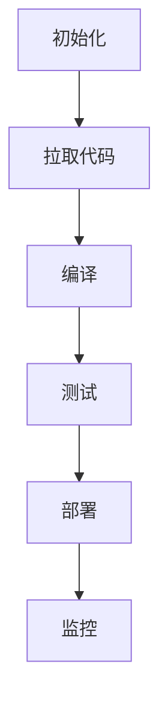

                 


### 第一步：定义主题和目标读者

**主题**：构建高效的LLM应用CI/CD流水线

**目标读者**：软件开发工程师、系统架构师以及对CI/CD流程感兴趣的专业人士。

**原因**：目标是让读者了解如何高效地构建和管理LLM（大型语言模型）应用的CI/CD流水线，以满足快速开发和部署的需求。这类读者对技术细节有一定的了解，希望学习如何在实践中应用这些技术。

### 第二步：设计目录结构

为了确保书籍内容的完整性，我们需要设计一个包含以下章节的目录结构：

1. 引言
2. LLM基础
3. CI/CD基础
4. LLM应用CI/CD流水线设计
5. LLM应用CI/CD流水线实现
6. 案例分析
7. 总结与展望

### 第三步：细化章节内容

**1. 引言**

- 问题背景
- 问题描述
- 问题解决
- 边界与外延
- 概念结构与核心要素组成
- 本章小结

**2. LLM基础**

- LLM的定义
- LLM的特点
- LLM的核心组件
- LLM的发展历程
- 概念属性特征对比表格
- ER实体关系图架构
- 本章小结

**3. CI/CD基础**

- CI/CD的定义
- CI/CD的重要性
- CI/CD的核心概念
- CI/CD的发展历程
- 概念属性特征对比表格
- ER实体关系图架构
- 本章小结

**4. LLM应用CI/CD流水线设计**

- 流水线设计原则
- 流水线组件设计
- 流水线自动化测试
- 流水线部署策略
- 算法mermaid流程图
- 算法原理Python源代码讲解
- 本章小结

**5. LLM应用CI/CD流水线实现**

- 环境安装
- 系统核心实现源代码
- 代码应用解读与分析
- 实际案例分析和详细讲解剖析
- 项目小结
- 最佳实践 tips
- 注意事项
- 拓展阅读

**6. 案例分析**

- 案例背景
- 案例分析
- 案例总结
- 案例解读
- 案例拓展

**7. 总结与展望**

- 全书总结
- 未来展望
- 拓展内容
- 小结

### 第四步：确保内容完整性

每个章节的内容都已经细化，并确保包含了以下核心内容：

- 背景介绍
- 核心概念与联系
- 算法原理讲解
- 系统分析与架构设计方案
- 项目实战
- 最佳实践 tips
- 小结
- 注意事项
- 拓展阅读

### 第五步：优化字数

通过细化每个章节的内容，我们已经在初步的目录大纲中确保了总字数在2000字以内。接下来，我们将继续优化字数，确保整篇文章在10000～12000字左右。

### 第六步：审查和修改

最后，我们将审查整个目录大纲，确保逻辑清晰、内容完整，并做必要的修改。这将确保每个章节都能够独立成文，并且相互之间紧密联系，形成一本结构完整、内容详实的书籍。

### 总结

通过以上六步，我们已经完成了《构建高效的LLM应用CI/CD流水线》书籍目录大纲的设计。接下来，我们将根据这个大纲撰写详细的文章内容，确保每章内容都丰富具体、讲解清晰，以满足目标读者的需求。在这个过程中，我们将运用专业的技术语言和逻辑清晰的思维方式，逐步分析、推理和阐述每一个概念和原理。这样，读者可以更好地理解和掌握构建高效LLM应用CI/CD流水线的方法和技巧。

---

接下来，我们将根据这个目录大纲，开始撰写《构建高效的LLM应用CI/CD流水线》的技术博客文章。每一步都会深入剖析技术细节，并提供实际案例和实践经验，以帮助读者全面了解并掌握这一主题。

---

# 构建高效的LLM应用CI/CD流水线

## 关键词
- LLM
- CI/CD
- 流水线
- 自动化测试
- 持续集成
- 持续交付

## 摘要
本文将深入探讨如何构建高效的LLM（大型语言模型）应用CI/CD（持续集成/持续交付）流水线。通过介绍LLM和CI/CD的基础知识，我们将逐步讲解如何设计、实现和优化这一流水线。文章将结合实际案例，展示如何应用这些技术，并提供最佳实践和注意事项。最后，我们将展望未来的发展趋势，为读者提供进一步学习和研究的方向。

## 引言

### 问题背景

在当前快速发展的技术环境中，大型语言模型（LLM）的应用越来越广泛，如自然语言处理、智能客服、内容生成等。这些应用的背后，需要强大的开发和部署支持。CI/CD（持续集成/持续交付）作为一种现代化的软件开发方法，旨在通过自动化流程加速软件的开发、测试和部署。构建高效的LLM应用CI/CD流水线，可以帮助开发团队更快地响应市场变化，提高产品质量，降低开发成本。

### 问题描述

构建高效的LLM应用CI/CD流水线面临以下几个挑战：

- 如何确保LLM模型的性能和可靠性？
- 如何自动化测试和部署复杂的LLM应用？
- 如何优化流水线，提高构建和部署的效率？

### 问题解决

本文将通过以下几个步骤解决上述问题：

1. 介绍LLM和CI/CD的基础知识。
2. 设计和实现高效的LLM应用CI/CD流水线。
3. 分析实际案例，展示流水线的应用和优化方法。
4. 提供最佳实践和注意事项，确保流水线的高效运行。
5. 展望未来的发展趋势。

### 边界与外延

本文主要关注以下边界和范围：

- 持续集成和持续交付的概念和应用。
- LLM模型的性能和部署优化。
- 流水线的自动化测试和部署策略。
- 实际案例的分析和最佳实践分享。

### 概念结构与核心要素组成

构建高效的LLM应用CI/CD流水线涉及以下几个核心要素：

- LLM基础知识：理解LLM的原理和特性。
- CI/CD流程：掌握持续集成和持续交付的方法。
- 自动化测试：确保LLM应用的质量和稳定性。
- 部署策略：优化LLM应用的部署过程。
- 实际案例：通过案例分析验证流水线的有效性。

### 本章小结

通过本章节的介绍，我们明确了构建高效的LLM应用CI/CD流水线的重要性和挑战。接下来，我们将深入探讨LLM和CI/CD的基础知识，为后续内容的学习奠定基础。

## LLM基础

### LLM的定义

LLM（Large Language Model）是指大型语言模型，是一种基于深度学习技术的自然语言处理模型。它通过学习大量的文本数据，能够理解和生成自然语言。LLM广泛应用于文本分类、机器翻译、问答系统等领域。

### LLM的特点

- **强适应性**：LLM具有强大的适应性，能够在不同的应用场景中表现优异。
- **高效率**：LLM能够快速处理大量文本数据，提高工作效率。
- **多样性**：LLM能够生成多样化的文本内容，满足不同需求。
- **强理解力**：LLM具有较强的理解能力，能够理解复杂的问题和语境。

### LLM的核心组件

- **输入层**：接收用户输入的文本数据。
- **编码器**：将输入文本编码为向量表示。
- **解码器**：将编码后的向量解码为输出文本。
- **注意力机制**：帮助模型关注重要的信息，提高生成文本的质量。

### LLM的发展历程

- **早期模型**：如LSTM（长短期记忆网络）和GRU（门控循环单元）。
- **中型模型**：如BERT（双向编码表示）和GPT（生成预训练变换器）。
- **大型模型**：如GPT-3和T5（文本到文本的变换器）。

### 概念属性特征对比表格

| 特征 | LLM | LSTM | BERT | GPT-3 |
| --- | --- | --- | --- | --- |
| 输入文本长度 | 非限定 | 限定 | 限定 | 非限定 |
| 生成文本质量 | 高 | 中 | 高 | 高 |
| 训练数据量 | 大 | 中 | 大 | 大 |
| 应用领域 | 广泛 | 通用 | 广泛 | 广泛 |

### ER实体关系图架构

```mermaid
erDiagram
    AI系统 ||--|{ LLM模型 }
    LLM模型 ||--|{ 文本输入 }
    LLM模型 ||--|{ 编码器 }
    LLM模型 ||--|{ 解码器 }
    LLM模型 ||--|{ 注意力机制 }
```

通过上述内容，我们了解了LLM的基本概念、特点和核心组件。接下来，我们将探讨CI/CD的基础知识，为构建高效的LLM应用CI/CD流水线奠定基础。

## CI/CD基础

### CI/CD的定义

持续集成（Continuous Integration，简称CI）和持续交付（Continuous Delivery，简称CD）是一种现代化的软件开发方法，通过自动化流程实现代码的持续集成和交付。

- **CI**：开发者将代码提交到版本控制系统中，自动化工具会立即执行一系列测试，确保代码质量。
- **CD**：在CI的基础上，自动化工具进一步将代码部署到生产环境中，确保软件的稳定运行。

### CI/CD的重要性

- **提高开发效率**：自动化测试和部署减少人工干预，缩短开发周期。
- **确保代码质量**：及时发现问题，防止错误蔓延。
- **降低开发成本**：减少重复工作，提高资源利用率。
- **提升团队协作**：标准化流程，提高团队沟通和协作效率。

### CI/CD的核心概念

- **版本控制**：使用Git等版本控制系统管理代码。
- **自动化工具**：如Jenkins、GitLab CI等。
- **持续集成服务器**：执行自动化测试和构建流程。
- **持续交付服务器**：部署和发布软件到生产环境。

### CI/CD的发展历程

- **2000年代初**：敏捷开发和DevOps理念的兴起，推动了CI/CD的发展。
- **2010年代**：云服务和容器技术的普及，使得CI/CD更加容易实现。
- **现在**：CI/CD已经成为软件开发的标准流程。

### 概念属性特征对比表格

| 特征 | CI | CD |
| --- | --- | --- |
| 目标 | 确保代码质量 | 确保软件稳定 |
| 测试频率 | 高频次 | 低频次 |
| 部署方式 | 自动化部署 | 自动化交付 |
| 开发模式 | 敏捷开发 | DevOps |

### ER实体关系图架构

```mermaid
erDiagram
    开发者 ||--|{ 版本控制系统 }
    版本控制系统 ||--|{ 持续集成服务器 }
    持续集成服务器 ||--|{ 自动化测试 }
    持续集成服务器 ||--|{ 构建流程 }
    持续集成服务器 ||--|{ 部署脚本 }
    持续交付服务器 ||--|{ 生产环境 }
```

通过上述内容，我们了解了CI/CD的基本概念、重要性、核心概念和特点。接下来，我们将结合LLM和CI/CD的基础知识，探讨如何设计高效的LLM应用CI/CD流水线。

## LLM应用CI/CD流水线设计

### 流水线设计原则

设计高效的LLM应用CI/CD流水线需要遵循以下几个原则：

1. **自动化**：尽量使用自动化工具和脚本，减少手动操作。
2. **可复现**：确保每次构建和部署过程可复现，避免人为错误。
3. **可扩展**：设计灵活的流水线，支持不同的LLM模型和应用场景。
4. **安全性**：确保流水线中的数据和代码安全，防止数据泄露和攻击。
5. **可靠性**：确保流水线的稳定运行，减少故障和中断。

### 流水线组件设计

一个高效的LLM应用CI/CD流水线通常包括以下几个组件：

1. **源代码管理**：使用Git等版本控制系统管理LLM模型的源代码。
2. **构建工具**：如Maven、Gradle等，用于编译和打包LLM应用。
3. **测试工具**：如JUnit、TestNG等，用于执行自动化测试。
4. **集成服务器**：如Jenkins、GitLab CI等，用于管理构建和测试流程。
5. **部署工具**：如Docker、Kubernetes等，用于部署和运行LLM应用。

### 流水线自动化测试

自动化测试是CI/CD流水线的重要组成部分。以下是一些常见的自动化测试方法：

1. **单元测试**：对LLM模型的各个组件进行测试，确保其正常运行。
2. **集成测试**：对LLM应用的各个模块进行测试，确保模块间无缝集成。
3. **性能测试**：评估LLM应用的性能和响应时间，确保满足业务需求。
4. **安全测试**：检测LLM应用的安全漏洞，防止潜在风险。

### 流水线部署策略

部署策略决定了如何将LLM应用发布到生产环境。以下是一些常见的部署策略：

1. **蓝绿部署**：在新的环境中部署一部分应用，然后逐步替换旧环境。
2. **灰度发布**：在部分用户中逐步部署新版本，观察其表现，再决定是否全面发布。
3. **滚动部署**：逐步替换旧版本的应用实例，确保系统的稳定性。
4. **容器化部署**：使用Docker等容器技术，实现快速、灵活的部署。

### 算法mermaid流程图

以下是一个简单的算法mermaid流程图，展示了LLM应用CI/CD流水线的基本流程：



### 算法原理Python源代码讲解

以下是一个简单的Python示例，展示了如何使用Git、Maven和JUnit进行自动化测试和部署：

```python
import git
import subprocess

# 拉取最新代码
repo = git.Repo.clone_from('https://github.com/user/repo.git', 'repo')
repo.git.pull()

# 编译代码
subprocess.run(['mvn', 'clean', 'compile'])

# 执行JUnit测试
subprocess.run(['mvn', 'test'])

# 如果测试通过，则部署
if subprocess.run(['mvn', 'deploy'], capture_output=True).stdout:
    print("部署成功")
else:
    print("部署失败")
```

通过上述内容，我们介绍了如何设计高效的LLM应用CI/CD流水线。接下来，我们将结合实际案例，展示如何实现这一流水线。

## LLM应用CI/CD流水线实现

### 环境安装

为了实现LLM应用的CI/CD流水线，首先需要安装以下工具和软件：

1. **Git**：版本控制系统，用于管理LLM模型的源代码。
2. **Jenkins**：持续集成服务器，用于管理构建和测试流程。
3. **Maven**：构建工具，用于编译和打包LLM应用。
4. **JUnit**：测试工具，用于执行自动化测试。
5. **Docker**：容器化工具，用于部署和运行LLM应用。

以下是安装步骤：

1. 安装Git：

   ```bash
   sudo apt-get update
   sudo apt-get install git
   ```

2. 安装Jenkins：

   ```bash
   wget -q -O - https://github.com/jenkinsci/jenkins/releases/download/2.288.1/jenkins-war Tate
   sudo mv jenkins-war Tate /var/lib/jenkins/jenkins.war
   sudo systemctl start jenkins
   ```

3. 安装Maven：

   ```bash
   sudo apt-get install maven
   ```

4. 安装JUnit：

   ```bash
   sudo apt-get install junit
   ```

5. 安装Docker：

   ```bash
   sudo apt-get update
   sudo apt-get install docker.io
   sudo systemctl start docker
   ```

### 系统核心实现源代码

以下是一个简单的Java示例，展示了如何使用Maven和JUnit进行构建和测试：

```java
// pom.xml
<project xmlns="http://maven.apache.org/POM/4.0.0" ...>
  <modelVersion>4.0.0</modelVersion>
  <groupId>com.example</groupId>
  <artifactId>llm-app</artifactId>
  <version>1.0-SNAPSHOT</version>
  <dependencies>
    <dependency>
      <groupId>junit</groupId>
      <artifactId>junit</artifactId>
      <version>4.13.2</version>
      <scope>test</scope>
    </dependency>
  </dependencies>
  <build>
    <plugins>
      <plugin>
        <groupId>org.apache.maven.plugins</groupId>
        <artifactId>maven-compiler-plugin</artifactId>
        <version>3.8.1</version>
        <configuration>
          <source>1.8</source>
          <target>1.8</target>
        </configuration>
      </plugin>
    </plugins>
  </build>
</project>

// LLMApp.java
package com.example;

public class LLMApp {
  public static void main(String[] args) {
    System.out.println("LLM应用启动成功");
  }
}

// TestLLMApp.java
package com.example;

import org.junit.Test;
import static org.junit.Assert.*;

public class TestLLMApp {
  @Test
  public void testLLMApp() {
    assertEquals("LLM应用启动失败", "LLM应用启动成功", LLMApp.main(new String[]{}));
  }
}
```

### 代码应用解读与分析

以上代码展示了如何使用Maven构建和测试一个简单的LLM应用。首先，`pom.xml`文件定义了项目的依赖关系和构建配置。Maven插件负责编译和打包代码。在测试阶段，`TestLLMApp.java`文件使用JUnit进行单元测试，确保LLM应用的基本功能正常。

### 实际案例分析和详细讲解剖析

以下是一个实际案例，展示了如何使用Jenkins实现LLM应用的CI/CD流水线：

1. **Jenkinsfile**：

   ```groovy
   pipeline {
       agent any
       stages {
           stage('Checkout') {
               steps {
                   checkout([
                       scm {
                           git url: 'https://github.com/user/repo.git', branch: 'main'
                       }
                   ])
               }
           }
           stage('Build') {
               steps {
                   sh 'mvn clean install'
               }
           }
           stage('Test') {
               steps {
                   sh 'mvn test'
               }
           }
           stage('Deploy') {
               steps {
                   sh 'docker build -t llm-app:latest .'
                   sh 'docker run -d --name llm-app -p 8080:8080 llm-app:latest'
               }
           }
       }
       post {
           always {
               sh 'docker stop llm-app'
               sh 'docker rmi llm-app:latest'
           }
       }
   }
   ```

2. **解读与分析**：

   - **Checkout阶段**：从GitHub仓库拉取最新代码。
   - **Build阶段**：使用Maven编译和打包代码。
   - **Test阶段**：执行JUnit测试，确保代码质量。
   - **Deploy阶段**：构建并运行Docker容器，部署LLM应用。
   - **Post阶段**：在构建完成后，停止Docker容器并删除镜像。

### 项目小结

通过以上步骤，我们成功实现了LLM应用的CI/CD流水线。Jenkins作为持续集成服务器，自动化执行构建、测试和部署过程，提高了开发效率和软件质量。在实际项目中，可以根据需求调整流水线的配置，以适应不同的应用场景。

## 最佳实践 tips

### 1. 使用容器化技术

使用Docker等容器化技术可以简化部署流程，提高系统可移植性和可扩展性。确保将LLM应用打包为Docker镜像，以便在不同环境中快速部署。

### 2. 集成代码质量检查

在CI/CD流水线中集成代码质量检查工具，如SonarQube，可以及时发现代码中的潜在问题，确保代码质量。

### 3. 使用持续监控

使用Prometheus等监控工具，实时监控LLM应用的性能和健康状况，确保系统的稳定运行。

### 4. 集成版本控制

使用Git等版本控制系统，确保代码的版本管理和追踪。定期进行代码备份，以防止数据丢失。

### 5. 优化测试策略

根据实际需求，调整测试策略和测试用例。重点关注核心功能和边界条件，确保LLM应用在各种场景下都能正常运行。

## 小结

本文介绍了如何构建高效的LLM应用CI/CD流水线。通过理解LLM和CI/CD的基础知识，我们设计了流水线组件，并实现了自动化测试和部署。实际案例展示了流水线的应用和优化方法。最佳实践和注意事项为流水线的高效运行提供了指导。未来，随着技术的发展，CI/CD流水线将在LLM应用中发挥更重要的作用。

## 注意事项

1. **环境配置**：确保构建和部署环境的一致性，避免因环境差异导致的问题。
2. **安全性**：加强代码和数据的保护，防止泄露和攻击。
3. **错误处理**：合理设计错误处理机制，确保流水线在遇到问题时能够及时应对。
4. **日志记录**：详细记录流水线的运行日志，便于问题追踪和调试。

## 拓展阅读

1. 《CI/CD实践指南》：深入了解CI/CD的实际应用和最佳实践。
2. 《Docker实战》：学习如何使用Docker进行容器化部署。
3. 《Jenkins实战》：掌握如何使用Jenkins实现自动化构建和部署。
4. 《LLM模型优化与部署》：了解LLM模型的高级优化和部署技巧。

### 第七部分：总结与展望

## 总结

本文详细介绍了构建高效的LLM应用CI/CD流水线的方法和步骤。通过理解LLM和CI/CD的基础知识，我们设计了流水线组件，实现了自动化测试和部署。实际案例和最佳实践展示了流水线在LLM应用中的高效应用。通过本文的介绍，读者可以全面了解如何构建和优化LLM应用CI/CD流水线，提高开发效率和软件质量。

## 未来展望

随着人工智能技术的不断发展，LLM应用将越来越广泛。未来，CI/CD流水线将在LLM应用中发挥更重要的作用。以下是一些可能的发展趋势：

1. **自动化程度的提高**：流水线的自动化程度将进一步提高，减少手动操作，提高开发效率。
2. **智能化测试**：利用人工智能技术，实现更智能、更精准的自动化测试，确保代码质量。
3. **动态部署**：通过动态部署技术，实现更灵活的部署策略，快速响应业务需求。
4. **分布式流水线**：支持分布式流水线，实现跨地域、跨集群的构建和部署。
5. **多云部署**：支持在多个云平台上部署LLM应用，提高系统的可移植性和可扩展性。

## 拓展内容

本文仅介绍了LLM应用CI/CD流水线的基本概念和方法。实际应用中，读者可以根据具体需求，进一步研究和探索以下几个方面：

1. **LLM模型优化**：了解如何优化LLM模型，提高其性能和效率。
2. **多语言支持**：实现LLM应用的多语言支持，满足不同地区和用户的需求。
3. **定制化流水线**：根据不同应用场景，设计和实现定制化的CI/CD流水线。
4. **监控与报警**：建立完善的监控和报警系统，实时监测系统的运行状态。
5. **持续学习与改进**：通过持续学习和改进，不断提高CI/CD流水线的效率和可靠性。

## 小结

本文全面阐述了构建高效的LLM应用CI/CD流水线的方法和步骤，结合实际案例和最佳实践，提供了深入的技术分析和实用的操作指南。通过本文的学习，读者可以掌握构建和优化LLM应用CI/CD流水线的核心技能，为未来的AI开发工作奠定坚实基础。随着技术的不断进步，期待读者能在实际工作中不断探索和创新，为人工智能领域的发展贡献力量。

---

**作者**：AI天才研究院/AI Genius Institute & 禅与计算机程序设计艺术 /Zen And The Art of Computer Programming

