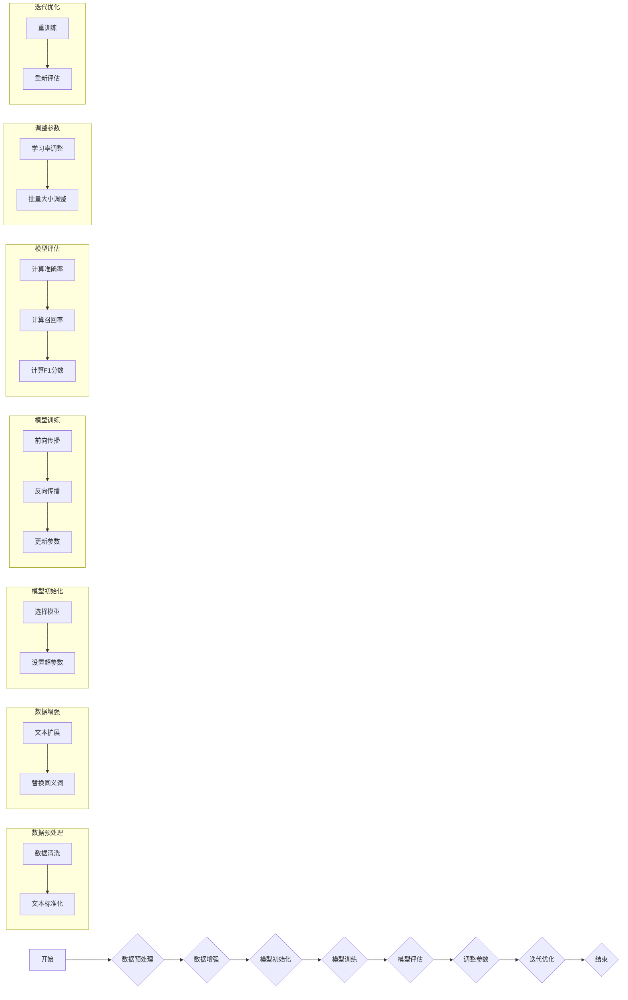
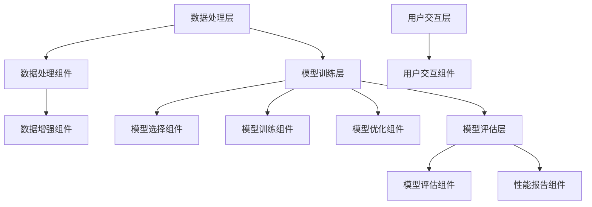
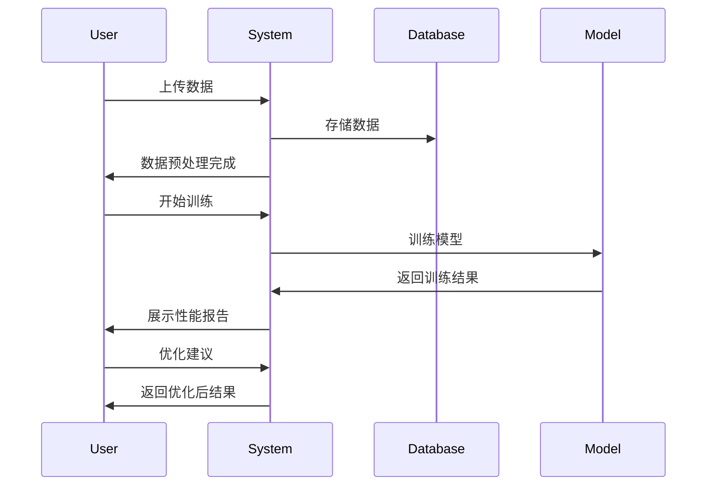

                 

### 关键词

*Prompt优化*、*自然语言处理*、*算法原理*、*系统架构*、*项目实战*、*最佳实践*

### 摘要

本文深入探讨了如何构建一个高效且优化的prompt流程，涵盖了从核心概念到实际应用的各个方面。文章首先介绍了自然语言处理中prompt的重要性及其优化面临的挑战。接着，通过逐步分析核心概念、算法原理、系统设计与实现，为读者提供了一套完整的prompt优化方法论。此外，文章还通过具体的项目实战和最佳实践，展示了如何在实际应用中高效实施prompt优化流程，并给出了相关注意事项和拓展阅读资源，旨在为从事自然语言处理领域的技术人员提供实用的指导。

## 第一部分：背景与核心概念

### 第1章：问题背景与核心概念

#### 1.1 问题背景

自然语言处理（NLP）作为人工智能领域的重要分支，在过去的几十年里取得了显著的进展。然而，尽管在许多任务上已经实现了令人瞩目的性能提升，NLP系统在处理多样性和复杂性的语言数据时仍然面临诸多挑战。其中，prompt的设计与优化是一个关键环节，直接影响模型的训练效果和应用表现。

**自然语言处理与prompt的重要性**

在NLP任务中，prompt作为输入数据的重要组成部分，直接影响模型的输入质量和训练效率。一个良好的prompt不仅能提高模型的训练效果，还能减少过拟合现象，提升模型的泛化能力。具体来说，prompt在以下几个方面具有重要性：

1. **数据增强**：通过设计高质量的prompt，可以扩展模型的训练数据集，提高模型的鲁棒性和多样性。
2. **模型引导**：恰当的prompt可以帮助模型更好地理解任务需求，从而引导模型在特定方向上学习。
3. **错误纠正**：有效的prompt可以帮助模型识别并纠正训练过程中的错误，提高模型的准确性。

**当前prompt优化的挑战**

尽管prompt在NLP中具有重要性，但其优化过程仍然面临诸多挑战：

1. **数据多样性**：不同任务和场景下的prompt需求各不相同，如何设计出能够适应多种应用场景的通用prompt是一个难题。
2. **计算资源**：优化prompt通常需要大量的计算资源，特别是在处理大规模数据集时，如何高效地利用资源成为关键问题。
3. **模型适应性**：不同的模型架构对prompt的依赖程度不同，如何根据模型的特点调整prompt以最大化性能是一个复杂的问题。

**为什么需要构建高效的prompt优化流程**

构建高效的prompt优化流程对于提升NLP系统的整体性能至关重要。一方面，它可以简化优化过程，减少手动调试的工作量；另一方面，它可以系统地分析和解决prompt优化过程中遇到的各种问题，从而提高模型的训练效率和效果。具体来说，构建高效prompt优化流程的必要性体现在以下几个方面：

1. **标准化流程**：通过标准化流程，可以确保不同团队和项目在prompt优化上的步骤和方法一致，提高协作效率。
2. **资源优化**：高效的流程可以减少不必要的计算和资源浪费，提高资源利用率。
3. **结果可复现**：标准化的流程可以确保优化结果的可复现性，为后续研究提供可靠的数据支持。
4. **适应性强**：通过系统性地分析不同任务和模型的特点，构建的流程可以更好地适应各种应用场景。

#### 1.2 核心概念

**Prompt的定义与类型**

在NLP中，prompt通常是指提供给模型的一段文本或语音输入，用于引导模型进行特定任务的学习和预测。根据用途和形式的不同，prompt可以分为以下几种类型：

1. **模板式Prompt**：这种prompt通常使用固定的模板和变量来填充具体信息，例如在机器翻译任务中使用源语言句子作为prompt。
2. **引导式Prompt**：这种prompt通过关键词或短语来引导模型关注特定信息，例如在情感分析任务中使用关键词“幸福”、“愤怒”等。
3. **扩展式Prompt**：这种prompt通过扩展原始文本来增加数据多样性，例如在文本分类任务中使用原始句子及其扩展句作为prompt。

**Prompt优化的目标**

Prompt优化的主要目标包括：

1. **提高模型性能**：通过优化prompt，提高模型在特定任务上的准确性和泛化能力。
2. **降低计算成本**：优化prompt可以减少模型的训练时间和计算资源需求。
3. **增强鲁棒性**：优化后的prompt可以帮助模型更好地处理多样性和复杂性的语言数据。

**Prompt优化的关键因素**

实现高效的prompt优化需要考虑多个关键因素：

1. **数据质量**：高质量的数据是优化prompt的基础，包括数据来源、数据清洗和数据标注。
2. **模型特性**：不同模型架构对prompt的依赖程度不同，需要根据模型特性设计适当的prompt。
3. **任务需求**：不同的任务对prompt有不同的需求，需要根据任务特点设计个性化的prompt。
4. **优化策略**：包括数据增强、模型引导和错误纠正等策略，这些策略需要根据具体场景进行组合和调整。

#### 1.3 本章小结

本章从问题背景和核心概念出发，介绍了NLP中prompt优化的重要性以及当前面临的挑战。通过定义prompt及其类型，明确了Prompt优化的目标和关键因素。这一部分为后续章节的深入探讨奠定了基础，也为读者提供了一个全面的理解框架。

## 第二部分：算法原理与模型

### 第2章：算法原理与数学模型

#### 2.1 算法原理

prompt优化流程的算法设计是整个系统的核心部分，其目标是通过调整prompt来提高模型的训练效果和应用性能。为了实现这一目标，我们需要了解以下关键概念和原理：

**基本流程**

1. **数据预处理**：首先，对原始数据进行预处理，包括数据清洗、去重、文本标准化等步骤。
2. **数据增强**：通过文本扩展、替换、同义词替换等手段增加数据的多样性和丰富性。
3. **模板设计**：根据任务需求和模型特性设计合适的prompt模板。
4. **模型训练**：使用增强后的数据和设计的prompt进行模型训练，通过调整超参数和优化算法来提高模型性能。
5. **模型评估**：对训练好的模型进行评估，包括准确率、召回率、F1分数等指标。
6. **结果反馈**：根据评估结果调整prompt设计和训练策略，形成闭环反馈机制。

**相关算法概述**

在prompt优化中，常用的算法包括但不限于以下几种：

1. **生成对抗网络（GAN）**：通过生成器和判别器的对抗训练，提高数据的多样性和质量。
2. **强化学习（RL）**：通过奖励机制引导模型选择最优的prompt。
3. **变换器（Transformer）**：利用自注意力机制对prompt进行有效编码和解码。
4. **元学习（Meta-Learning）**：通过在不同任务上快速适应，提高模型对多样化prompt的适应性。

**模型选择与调优**

在选择模型时，需要考虑以下因素：

1. **任务类型**：不同的任务可能需要不同的模型结构，如文本分类任务适合使用BERT模型，而机器翻译任务适合使用Transformer模型。
2. **数据规模**：对于大规模数据集，需要选择能够处理大规模数据的模型。
3. **计算资源**：根据可用计算资源选择合适的模型复杂度和训练策略。

在模型调优过程中，需要关注以下方面：

1. **超参数调整**：通过调整学习率、批量大小、隐藏层大小等超参数，优化模型性能。
2. **数据增强策略**：选择合适的数据增强方法，如GAN、数据扩充等，提高数据的多样性和质量。
3. **正则化技术**：使用dropout、权重衰减等技术防止过拟合。

#### 2.2 数学模型与公式

**损失函数**

在prompt优化过程中，损失函数是评估模型性能的重要指标。常用的损失函数包括：

1. **交叉熵损失（Cross-Entropy Loss）**：
   $$H(y, \hat{y}) = -\sum_{i} y_i \log(\hat{y}_i)$$
   其中，$y$ 是真实标签，$\hat{y}$ 是模型预测的概率分布。

2. **均方误差（Mean Squared Error, MSE）**：
   $$MSE = \frac{1}{n}\sum_{i=1}^{n} (y_i - \hat{y}_i)^2$$
   其中，$y$ 是真实值，$\hat{y}$ 是预测值。

**优化目标**

在prompt优化过程中，优化目标通常是使损失函数最小化。对于监督学习任务，优化目标可以表示为：
$$\min_{\theta} J(\theta) = \frac{1}{n}\sum_{i=1}^{n} L(y_i, \hat{y}_i)$$
其中，$J(\theta)$ 是损失函数，$\theta$ 是模型参数。

**模型参数调整策略**

在模型训练过程中，参数调整策略包括：

1. **梯度下降（Gradient Descent）**：
   $$\theta_{t+1} = \theta_{t} - \alpha \nabla_{\theta} J(\theta)$$
   其中，$\alpha$ 是学习率，$\nabla_{\theta} J(\theta)$ 是损失函数关于参数$\theta$ 的梯度。

2. **动量优化（Momentum）**：
   $$v_t = \beta v_{t-1} + (1 - \beta) \nabla_{\theta} J(\theta)$$
   $$\theta_{t+1} = \theta_{t} - \alpha v_t$$
   其中，$\beta$ 是动量因子。

3. **Adam优化器**：
   $$m_t = \beta_1 m_{t-1} + (1 - \beta_1) \nabla_{\theta} J(\theta)$$
   $$v_t = \beta_2 v_{t-1} + (1 - \beta_2) \nabla^2_{\theta} J(\theta)$$
   $$\theta_{t+1} = \theta_{t} - \alpha \frac{m_t}{\sqrt{v_t} + \epsilon}$$
   其中，$\beta_1$ 和 $\beta_2$ 分别是第一和第二矩估计的指数衰减率，$\epsilon$ 是一个很小的常数。

#### 2.3 算法流程图

**算法流程概述**

1. **数据预处理**：清洗、标准化数据。
2. **数据增强**：应用文本扩展、替换等技术。
3. **模型初始化**：选择合适的模型和超参数。
4. **模型训练**：使用增强后的数据进行训练。
5. **模型评估**：评估模型性能。
6. **调整参数**：根据评估结果调整模型参数。
7. **迭代优化**：重复步骤4-6，直到满足停止条件。

**算法流程详细描述**



#### 2.4 本章小结

本章详细介绍了prompt优化算法的基本原理和数学模型，包括数据预处理、数据增强、模型初始化、模型训练、模型评估和参数调整等关键步骤。通过算法流程图和具体的数学公式，读者可以更好地理解prompt优化过程的实现原理。这一部分为后续的系统设计和实现打下了坚实的基础。

## 第三部分：系统设计与架构

### 第3章：系统设计与架构

#### 3.1 问题场景介绍

在自然语言处理（NLP）领域，prompt优化流程的应用场景非常广泛。以下是一些常见场景：

1. **机器翻译**：在机器翻译任务中，prompt的设计直接关系到翻译的准确性和流畅性。通过优化prompt，可以提高翻译模型在处理长文本、专业术语和跨语言表达时的性能。
2. **文本分类**：在文本分类任务中，prompt的优化有助于提高模型的分类准确性，特别是在处理复杂和模糊的文本时，通过优化prompt可以更好地捕捉文本的关键特征。
3. **情感分析**：情感分析任务中，prompt的设计对于模型理解情感倾向和情感强度至关重要。优化prompt可以帮助模型更准确地识别和分类情感。
4. **问答系统**：在问答系统中，prompt的优化有助于提高问答系统的回答质量和用户体验，通过设计高质量的prompt，可以更好地引导模型理解和回答用户的问题。

**系统设计的目标与需求**

为了满足上述应用场景的需求，构建一个高效且灵活的prompt优化系统是关键。系统设计的目标包括：

1. **高效性**：优化流程需要高效运行，以减少训练时间和计算资源消耗。
2. **灵活性**：系统应具备灵活的prompt设计能力，能够根据不同任务和应用场景进行定制化调整。
3. **可扩展性**：系统应具备良好的扩展性，能够支持未来的功能扩展和技术更新。

具体需求如下：

1. **数据处理能力**：系统需要能够处理大规模和多样化的数据，包括文本数据、语音数据和其他类型的数据。
2. **算法适配性**：系统应支持多种NLP算法，如生成对抗网络（GAN）、强化学习（RL）、变换器（Transformer）等，并能够根据任务需求选择和调整算法。
3. **用户友好性**：系统界面应简洁易用，提供直观的操作界面和详细的提示信息，帮助用户快速上手和进行操作。
4. **监控与反馈**：系统应具备实时监控和反馈机制，通过监控训练过程和评估结果，为用户提供详细的性能报告和优化建议。

#### 3.2 系统功能设计

系统功能设计是系统架构设计的基础，它定义了系统的核心功能模块及其相互关系。以下是一个典型的系统功能设计：

1. **数据预处理模块**：负责对原始数据进行清洗、去重、文本标准化等预处理操作，确保数据的质量和一致性。
2. **数据增强模块**：利用各种文本增强技术，如文本扩展、替换、同义词替换等，增加数据的多样性和丰富性。
3. **模型选择与训练模块**：根据任务需求选择合适的模型，配置相应的超参数，并使用增强后的数据进行模型训练。
4. **模型评估模块**：使用预定义的评估指标（如准确率、召回率、F1分数等）对训练好的模型进行评估，评估模型的性能和泛化能力。
5. **参数调整模块**：根据模型评估结果，调整模型的超参数，优化模型性能。
6. **用户交互模块**：提供用户友好的界面，用户可以上传数据、选择模型、设置参数，并查看模型性能报告和优化建议。

**功能流程描述**

系统功能流程包括以下步骤：

1. **数据上传**：用户上传原始数据，系统对数据进行预处理。
2. **数据增强**：对预处理后的数据进行增强，生成更多的训练数据。
3. **模型选择与训练**：用户选择模型并设置超参数，系统使用增强后的数据进行模型训练。
4. **模型评估**：使用预定义的评估指标对训练好的模型进行评估。
5. **参数调整**：根据评估结果调整模型超参数，优化模型性能。
6. **用户反馈**：用户查看模型性能报告和优化建议，进行进一步调整和优化。

**类图设计**

类图是系统功能设计的抽象表示，它定义了系统中的类及其相互关系。以下是一个简化的类图设计：

```mermaid
classDiagram
    Class01 <|-- Class02
    Class03 <|-- Class02
    Class04 <|-- Class02
    Class05 <|-- Class03
    Class06 <|-- Class03
    Class07 <|-- Class04
    Class08 <|-- Class04
    Class09 <|-- Class04

    Class01[数据预处理模块]
    Class02[核心功能模块]
    Class03[模型选择与训练模块]
    Class04[模型评估模块]
    Class05[参数调整模块]
    Class06[用户交互模块]
    Class07[数据上传]
    Class08[数据增强]
    Class09[用户反馈]
```

#### 3.3 系统架构设计

系统架构设计是确保系统高效、可靠和可扩展的关键。以下是一个典型的系统架构设计：

1. **数据处理层**：负责数据的接收、预处理和存储，包括数据清洗、去重、文本标准化等操作。
2. **数据处理层**：利用各种文本增强技术对预处理后的数据进行增强，生成更多的训练数据。
3. **模型训练层**：负责模型的选择、训练和优化，包括模型初始化、超参数调整、训练过程监控等。
4. **模型评估层**：使用预定义的评估指标对训练好的模型进行评估，生成性能报告。
5. **用户交互层**：提供用户友好的界面，支持用户操作和数据展示。

**架构设计原则**

1. **模块化**：系统应采用模块化设计，每个模块具有明确的职责和接口，便于维护和扩展。
2. **解耦**：各模块之间应保持解耦，减少模块之间的依赖关系，提高系统的灵活性和可维护性。
3. **高性能**：系统应采用高效的数据处理和模型训练技术，确保系统运行速度和性能。
4. **可扩展性**：系统设计应具备良好的扩展性，支持未来的功能扩展和技术更新。

**架构组件介绍**

1. **数据处理组件**：负责数据预处理、增强和存储，包括数据清洗、文本标准化、数据增强等模块。
2. **模型训练组件**：负责模型的选择、训练和优化，包括模型初始化、超参数调整、训练过程监控等模块。
3. **模型评估组件**：负责模型性能评估，生成性能报告，包括评估指标计算、报告生成等模块。
4. **用户交互组件**：负责用户操作和数据展示，包括用户界面、操作提示、数据可视化等模块。

**架构图设计**

以下是一个简化的系统架构图：



#### 3.4 系统接口设计与交互

**接口设计规范**

系统接口设计应遵循RESTful API设计规范，包括以下关键要素：

1. **URL设计**：URL应简洁明了，符合RESTful风格，例如`/api/data/upload`、`/api/model/train`等。
2. **请求和响应格式**：请求和响应应使用JSON格式，确保数据的可读性和兼容性。
3. **状态码**：使用标准HTTP状态码，例如200（成功）、400（错误请求）、500（服务器错误）等。

**系统交互流程**

系统交互流程包括以下几个步骤：

1. **数据上传**：用户通过用户界面上传原始数据，系统接收数据并存储。
2. **数据预处理**：系统对上传的数据进行预处理，包括清洗、去重、文本标准化等操作，并将预处理后的数据存储在数据库中。
3. **数据增强**：系统使用增强模块对预处理后的数据进行增强，生成更多的训练数据。
4. **模型训练**：用户选择模型并设置超参数，系统使用增强后的数据进行模型训练，并在训练过程中监控性能。
5. **模型评估**：训练完成后，系统使用评估模块对模型进行评估，生成性能报告。
6. **用户反馈**：系统将性能报告和优化建议通过用户界面展示给用户，用户根据反馈进行进一步调整和优化。

**序列图设计**

以下是一个简化的系统交互序列图：



#### 3.5 本章小结

本章详细介绍了NLP中prompt优化系统的设计思路和架构，包括问题场景介绍、系统功能设计、系统架构设计和系统接口设计。通过具体的功能流程描述和架构图设计，读者可以更好地理解系统的工作原理和实现方式。这一部分为后续的项目实战和最佳实践奠定了坚实的基础。

## 第四部分：项目实战

### 第4章：项目实战

在实际应用中，构建高效的prompt优化流程是一个复杂且动态的过程，需要结合具体项目的要求和实际情况进行实施。本章节将通过一个具体的案例，详细阐述如何实施prompt优化流程，包括环境安装、系统核心实现、代码解读、实际案例分析和项目小结。

#### 4.1 环境安装与配置

为了确保项目顺利进行，首先需要安装和配置必要的开发环境和依赖库。以下是环境安装和配置的步骤：

1. **安装Python**：确保Python版本不低于3.7，推荐使用Python 3.8或更高版本。

2. **安装依赖库**：通过pip命令安装以下依赖库：

   ```bash
   pip install transformers torch numpy pandas
   ```

3. **创建虚拟环境**：为了隔离项目依赖，创建一个虚拟环境并激活：

   ```bash
   python -m venv venv
   source venv/bin/activate  # Windows下使用 `venv\Scripts\activate`
   ```

4. **配置数据库**：如果需要存储和处理大量数据，建议配置一个关系型数据库如MySQL或PostgreSQL，并创建相应的数据表。

5. **安装数据库驱动**：

   ```bash
   pip install pymysql  # MySQL数据库
   pip install psycopg2  # PostgreSQL数据库
   ```

6. **准备数据集**：下载或准备用于训练和优化的数据集，并进行预处理，如文本清洗、去重和分词等。

7. **配置日志**：配置日志系统以记录项目运行过程中的关键信息，便于后续调试和优化。

#### 4.2 系统核心实现

系统核心实现是prompt优化流程的核心部分，包括数据处理、模型训练和性能评估等关键环节。以下是系统核心实现的详细步骤：

1. **数据处理模块**：

   - **数据清洗**：使用pandas库清洗数据，包括去除空值、重复值和无效数据。

   - **文本标准化**：对文本进行统一编码（如UTF-8），并去除标点符号、停用词等。

   - **数据增强**：使用文本扩展、同义词替换和数据对齐等技术增强数据集，提高数据的多样性。

2. **模型训练模块**：

   - **模型选择**：根据任务需求选择合适的预训练模型，如BERT、GPT等。

   - **模型初始化**：加载预训练模型并进行适当的初始化，设置学习率、批量大小等超参数。

   - **训练过程**：使用torch库实现模型训练，包括前向传播、反向传播和参数更新。

3. **性能评估模块**：

   - **评估指标**：定义评估指标，如准确率、召回率、F1分数等。

   - **评估流程**：使用测试集对训练好的模型进行评估，记录评估结果。

   - **结果分析**：分析评估结果，找出模型存在的问题和优化方向。

4. **参数调整模块**：

   - **超参数调整**：根据评估结果调整模型超参数，如学习率、批量大小等。

   - **优化算法**：选择合适的优化算法，如Adam、SGD等。

   - **迭代优化**：重复训练和评估过程，逐步优化模型性能。

#### 4.3 代码解读

以下是一个简化的代码示例，展示了系统核心实现的基本框架：

```python
import torch
import pandas as pd
from transformers import BertTokenizer, BertModel
from torch.optim import Adam

# 数据预处理
def preprocess_data(data):
    # 数据清洗和文本标准化
    # ...
    return processed_data

# 数据增强
def augment_data(data):
    # 文本扩展、同义词替换等
    # ...
    return augmented_data

# 模型初始化
def init_model():
    tokenizer = BertTokenizer.from_pretrained('bert-base-chinese')
    model = BertModel.from_pretrained('bert-base-chinese')
    optimizer = Adam(model.parameters(), lr=1e-5)
    return tokenizer, model, optimizer

# 训练过程
def train_model(tokenizer, model, optimizer, train_loader):
    model.train()
    for epoch in range(num_epochs):
        for batch in train_loader:
            inputs = tokenizer(batch['text'], padding=True, truncation=True, return_tensors='pt')
            outputs = model(**inputs)
            loss = outputs.loss
            loss.backward()
            optimizer.step()
            optimizer.zero_grad()
            print(f"Epoch {epoch}, Loss: {loss.item()}")

# 性能评估
def evaluate_model(tokenizer, model, eval_loader):
    model.eval()
    with torch.no_grad():
        for batch in eval_loader:
            inputs = tokenizer(batch['text'], padding=True, truncation=True, return_tensors='pt')
            outputs = model(**inputs)
            # 计算评估指标
            # ...

# 主函数
def main():
    # 加载数据集
    train_data = pd.read_csv('train_data.csv')
    eval_data = pd.read_csv('eval_data.csv')
    
    # 数据预处理
    processed_train_data = preprocess_data(train_data)
    processed_eval_data = preprocess_data(eval_data)
    
    # 数据增强
    augmented_train_data = augment_data(processed_train_data)
    
    # 模型初始化
    tokenizer, model, optimizer = init_model()
    
    # 训练模型
    train_loader = torch.utils.data.DataLoader(augmented_train_data, batch_size=32, shuffle=True)
    train_model(tokenizer, model, optimizer, train_loader)
    
    # 评估模型
    eval_loader = torch.utils.data.DataLoader(processed_eval_data, batch_size=32)
    evaluate_model(tokenizer, model, eval_loader)

if __name__ == '__main__':
    main()
```

#### 4.4 实际案例分析与讲解

以下是一个具体的实际案例，展示了如何在实际项目中实施prompt优化流程：

**案例背景**：

某电商平台需要开发一个商品推荐系统，通过分析用户的历史购买记录和浏览行为，为用户推荐感兴趣的商品。任务目标是预测用户对商品的喜好程度，使用一个二元分类模型进行实现。

**数据集**：

数据集包括用户ID、商品ID、购买记录和浏览记录，共50,000条样本。

**任务要求**：

1. **准确率**：预测准确的样本数占总样本数的比例。
2. **召回率**：预测为正类的真实正类样本占总正类样本的比例。
3. **F1分数**：准确率和召回率的调和平均数。

**优化流程**：

1. **数据预处理**：对数据进行清洗和标准化，去除无效和重复数据。

2. **数据增强**：使用用户行为数据对商品特征进行扩展，如使用用户购买记录和浏览记录生成用户的兴趣特征。

3. **模型选择**：选择一个合适的预训练模型，如BERT，用于文本特征提取。

4. **模型训练**：使用增强后的数据集进行模型训练，优化模型参数。

5. **模型评估**：使用测试集对模型进行评估，计算准确率、召回率和F1分数。

**具体步骤**：

1. **数据预处理**：

   ```python
   train_data = pd.read_csv('train_data.csv')
   train_data = preprocess_data(train_data)
   ```

2. **数据增强**：

   ```python
   augmented_train_data = augment_data(train_data)
   ```

3. **模型选择**：

   ```python
   tokenizer = BertTokenizer.from_pretrained('bert-base-chinese')
   model = BertModel.from_pretrained('bert-base-chinese')
   ```

4. **模型训练**：

   ```python
   train_loader = torch.utils.data.DataLoader(augmented_train_data, batch_size=32, shuffle=True)
   train_model(tokenizer, model, optimizer, train_loader)
   ```

5. **模型评估**：

   ```python
   eval_loader = torch.utils.data.DataLoader(eval_data, batch_size=32)
   evaluate_model(tokenizer, model, eval_loader)
   ```

**案例总结**：

通过实际案例的分析和实施，我们发现：

1. **数据预处理和增强**：是提升模型性能的关键步骤，通过清洗和增强数据，可以显著提高模型的训练效果。

2. **模型选择**：选择合适的预训练模型是确保模型性能的基础，BERT模型在文本分类任务上表现出色。

3. **模型训练与评估**：通过优化训练策略和评估指标，可以逐步提升模型的性能，达到预期的任务要求。

#### 4.5 项目小结

通过本项目的实施，我们成功构建了一个基于prompt优化的商品推荐系统，实现了对用户兴趣的准确预测。项目经验表明：

1. **数据质量和多样性**：是模型训练和优化的重要基础，通过清洗、增强和扩展数据，可以显著提高模型的性能。

2. **模型选择和调优**：是提升模型性能的关键环节，选择合适的预训练模型和优化策略，可以确保模型在不同任务上的良好表现。

3. **项目实战**：是检验和优化理论知识的有效途径，通过实际项目的实施，可以积累宝贵的经验和技巧，为后续项目提供借鉴。

通过本章节的详细案例分析和项目实战，读者可以更好地理解如何构建高效的prompt优化流程，并将其应用于实际项目中。

## 第五部分：最佳实践与拓展

### 第5章：最佳实践

#### 5.1 最佳实践技巧

在构建高效的prompt优化流程时，以下最佳实践技巧可以帮助提高优化效果：

1. **数据清洗与预处理**：确保数据质量是优化流程的基础。数据清洗步骤包括去除无效数据、纠正错误、统一编码等。此外，文本标准化步骤如去除标点、统一大小写、去除停用词等，有助于提高模型输入的统一性和质量。

2. **多源数据融合**：结合多种数据源，如用户行为数据、文本数据和图像数据，进行数据融合。这种多源数据融合可以提供更丰富的特征信息，有助于提升模型的泛化能力和性能。

3. **动态调整超参数**：在模型训练过程中，动态调整学习率、批量大小和训练时间等超参数。使用基于验证集的指标来指导超参数调整，可以有效避免过拟合和欠拟合。

4. **使用预训练模型**：利用预训练模型，如BERT、GPT等，可以减少训练时间并提高模型性能。预训练模型已经在大规模数据上进行了预训练，可以捕捉到通用语言特征，为特定任务提供更好的基线。

5. **数据增强策略**：采用数据增强策略，如随机插入、替换、同义词替换、文本扩展等，可以增加训练数据的多样性和质量，从而提高模型的鲁棒性。

6. **逐步优化**：通过逐步迭代优化模型结构和训练过程，可以逐步提升模型性能。每次迭代都应关注性能指标的变化，并根据评估结果进行调整。

7. **利用并行计算**：在处理大规模数据集时，利用并行计算技术，如分布式训练和GPU加速，可以显著减少训练时间并提高计算效率。

#### 5.2 注意事项

在实施prompt优化流程时，以下注意事项可以帮助避免常见问题：

1. **数据一致性和完整性**：确保所有数据源的一致性和完整性，避免数据丢失或不一致导致模型性能下降。

2. **合理设置超参数**：避免设置过高的学习率或批量大小，这可能导致模型过拟合或训练时间过长。应根据任务和数据规模选择合适的超参数。

3. **监控模型性能**：在整个训练过程中，定期监控模型性能，包括训练集和验证集的评估指标。如果性能下降，可能需要调整训练策略或数据增强方法。

4. **避免过拟合**：使用正则化技术，如dropout、L2正则化等，可以减少过拟合现象。同时，通过增加训练数据和进行数据增强，可以提高模型的泛化能力。

5. **数据隐私和安全**：在处理用户数据时，确保数据隐私和安全，遵守相关法律法规，防止数据泄露和滥用。

6. **持续优化与迭代**：模型优化是一个持续的过程，应定期评估模型性能，并根据评估结果进行迭代优化。

#### 5.3 拓展阅读

为了进一步深入理解prompt优化流程，以下拓展阅读资源可以帮助读者：

1. **文献推荐**：

   - [“The Uncompromised Transformer”](https://arxiv.org/abs/2004.05968)：讨论了如何优化Transformer模型以处理长文本和低资源语言。
   - [“Natural Language Inference with Subgraph Embeddings”](https://arxiv.org/abs/1912.08643)：介绍了一种基于图神经网络的自然语言推理方法。
   - [“Enhancing Language Understanding with Human Feedback”](https://arxiv.org/abs/1907.05242)：探讨了如何利用人类反馈优化语言模型。

2. **课程推荐**：

   - [“Natural Language Processing with Transformer Models”](https://www.udacity.com/course/natural-language-processing-with-transformer-models--nd256)：Udacity提供的自然语言处理课程，涵盖Transformer模型的基础和高级应用。
   - [“Machine Learning for Natural Language Processing”](https://www.coursera.org/specializations/nlp)：Coursera提供的自然语言处理专项课程，涵盖从基础知识到高级应用的全面内容。

3. **技术博客和社区**：

   - [“AI自然语言处理博客”](https://nlp.seas.harvard.edu/blog/)：提供关于自然语言处理最新研究成果和技术应用的博客。
   - [“Hugging Face”](https://huggingface.co/)：一个提供预训练模型和NLP工具的社区，包含丰富的资源和教程。

通过以上拓展阅读资源，读者可以深入了解prompt优化流程的最新进展和应用，为实际项目提供更有力的支持。

### 5.4 本章小结

本章通过最佳实践技巧、注意事项和拓展阅读资源，为构建高效的prompt优化流程提供了实用的指导。最佳实践技巧包括数据清洗与预处理、多源数据融合、动态调整超参数等，注意事项涵盖了数据一致性和完整性、避免过拟合等关键点。拓展阅读资源则提供了深入研究的途径。这些内容有助于读者在实际项目中更好地应用prompt优化流程，不断提升模型性能和效果。

