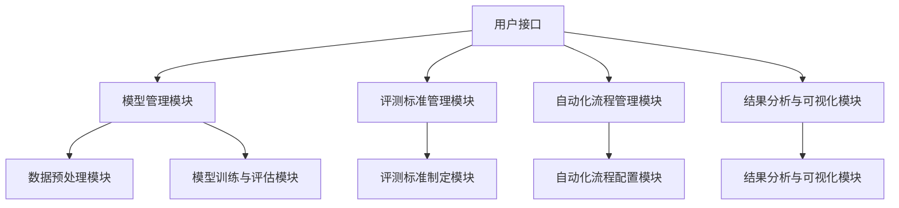

                 

### 第1章：背景介绍

#### 1.1 问题背景

随着人工智能技术的飞速发展，各种复杂且庞大的模型如雨后春笋般涌现。这些模型被广泛应用于自然语言处理、计算机视觉、推荐系统等领域，为各行各业带来了巨大的变革。然而，随之而来的问题是，模型的质量参差不齐，缺乏统一的评测标准。这不仅影响了模型的实际应用效果，也给决策者带来了困扰。例如，在医疗诊断、自动驾驶等关键领域，模型的准确性、鲁棒性和安全性至关重要，但当前的评测流程往往存在主观性、不透明和效率低下等问题。

首先，随着模型数量的急剧增加，传统的手动评测方法已经无法满足需求。这不仅耗费大量的人力物力，而且容易引入主观误差，导致评测结果不准确。其次，不同领域和不同项目的评测标准往往不一致，缺乏统一性。这使得模型开发者难以在多个项目中复用评测流程，也使得模型应用者在选择和部署模型时缺乏可靠的参考依据。最后，模型的评测效果不仅取决于模型的算法本身，还受到数据质量、训练过程、硬件环境等多方面因素的影响。这些因素的综合作用使得模型的评测结果具有很大的不确定性，从而影响决策的准确性。

综上所述，标准化和自动化模型评测流程的重要性日益凸显。为了解决这些问题，我们需要制定一套统一的评测标准，设计一个高效的自动化评测流程，并构建一个可复用的评测平台。这将有助于提高模型评测的准确性、可靠性和效率，为人工智能领域的进一步发展提供坚实的基础。

#### 1.2 问题描述

如何确保模型评测流程的标准化和自动化，是当前人工智能领域面临的一个重要问题。具体来说，这个问题可以分为以下几个子问题：

1. **制定统一的评测标准**：由于不同领域和不同项目的评测需求不同，现有的评测标准往往缺乏统一性。我们需要如何制定一套通用的评测标准，以确保不同模型在相同条件下进行评测，从而提高评测结果的可比性和可靠性。

2. **设计自动化的评测流程**：传统的手动评测方法效率低下，难以满足大规模模型评测的需求。我们需要设计一个自动化的评测流程，将数据预处理、模型训练、评估和结果分析等环节集成到一个自动化系统中，以提高评测的效率和一致性。

3. **构建评测平台**：为了实现标准化和自动化的评测流程，我们需要构建一个可复用的评测平台。这个平台需要具备灵活的配置能力，能够根据不同的评测需求和模型特点进行个性化定制。

4. **评测流程的适用范围**：评测流程需要覆盖从模型开发到部署的整个过程，包括模型设计、训练、测试和上线等各个环节。如何确保评测流程的适用范围广泛，能够适应不同的应用场景和需求，是一个关键问题。

5. **评测标准的制定原则**：在制定评测标准时，需要遵循科学性、公正性、可操作性和可扩展性等原则。如何确保这些原则在标准制定过程中得到充分体现，是一个值得深入探讨的问题。

总之，确保模型评测流程的标准化和自动化是一个系统性工程，涉及到标准制定、流程设计、平台构建等多个方面。通过解决上述子问题，我们可以为人工智能领域提供一套高效、可靠和可复用的模型评测解决方案。

#### 1.3 问题解决

为了解决上述问题，我们需要采取一系列措施，确保模型评测流程的标准化和自动化。以下是具体的解决方案：

1. **制定统一的评测标准**：首先，我们需要根据不同领域和应用场景，制定一套通用的评测标准。这些标准应包括评价指标、评测方法和评测流程等。评价指标应具备科学性和可操作性，能够全面反映模型性能；评测方法应具备公正性和可靠性，确保评测结果的准确性；评测流程应具备可重复性和可扩展性，便于在不同项目中应用。

2. **设计自动化的评测流程**：在制定统一评测标准的基础上，我们需要设计一个自动化的评测流程。这个流程应包括数据预处理、模型训练、评估和结果分析等环节。为了提高流程的效率和一致性，可以使用自动化工具和脚本实现各个环节的自动化。此外，我们还可以利用云计算和大数据技术，实现大规模模型的快速评测。

3. **构建评测平台**：为了实现标准化和自动化的评测流程，我们需要构建一个可复用的评测平台。这个平台应具备以下功能：

   - **模型管理**：支持模型的上传、下载、更新和删除等操作。
   - **评测标准管理**：支持评测标准的制定、更新和删除等操作。
   - **自动化流程管理**：支持自动化流程的配置、执行和监控等功能。
   - **结果分析与可视化**：支持评测结果的统计、分析和可视化等功能。

4. **评测流程的适用范围**：为了确保评测流程的广泛适用性，我们需要在评测平台中提供多种评测场景的配置选项。这些选项应包括不同的数据集、算法和评测指标等。通过灵活配置，我们可以使评测平台适用于各种应用场景和需求。

5. **评测标准的制定原则**：在制定评测标准时，应遵循以下原则：

   - **科学性**：评价指标和方法应基于统计学、机器学习等领域的前沿研究成果，确保评测的科学性和准确性。
   - **公正性**：评测标准应确保模型的公平竞争，避免主观因素对评测结果的影响。
   - **可操作性**：评测标准和方法应具备可操作性，便于在实际项目中应用。
   - **可扩展性**：评测标准应具备可扩展性，能够根据新技术和应用需求进行更新和改进。

通过上述解决方案，我们可以实现模型评测流程的标准化和自动化，提高评测的准确性、可靠性和效率，为人工智能领域的进一步发展提供有力支持。

#### 1.4 边界与外延

在讨论标准化自动化模型评测流程时，我们需要明确其适用范围和边界。首先，评测流程主要适用于机器学习和深度学习领域，特别是那些对模型性能和效果有较高要求的应用场景，如自然语言处理、计算机视觉、推荐系统等。这些领域中的模型往往具有复杂性和多样性，标准化和自动化的评测流程能够有效提高模型开发、评估和部署的效率。

其次，评测流程的适用范围还应包括从模型开发到部署的整个生命周期。这意味着我们需要在模型设计、训练、测试和上线等各个环节中应用统一的评测标准，确保每个环节都能准确、高效地进行模型评估。

在边界方面，首先，标准化自动化评测流程并不适用于所有类型的模型。例如，对于一些自定义的、特殊的模型，可能需要根据具体情况进行个性化调整。此外，评测流程的自动化程度也有一定的限制。尽管我们可以通过自动化工具和脚本实现许多评测环节的自动化，但仍然需要人工进行部分评估和调整，以确保评测结果的可信度和准确性。

最后，我们需要关注评测流程的外延。随着人工智能技术的不断发展，新的应用场景和需求不断涌现。评测流程需要具备一定的灵活性和可扩展性，能够根据新需求和技术发展进行更新和改进。同时，我们还需要关注评测标准的前沿性和先进性，确保其能够反映最新的研究成果和技术趋势。

总之，明确标准化自动化模型评测流程的边界与外延，有助于我们更好地理解和应用这一流程，从而为人工智能领域的可持续发展提供有力支持。

#### 1.5 概念结构与核心要素组成

在深入讨论标准化自动化模型评测流程之前，我们首先需要了解其核心概念和结构。以下是标准化自动化模型评测流程中的几个关键概念及其相互关系：

##### 标准化

标准化是指制定一套统一的、科学的评测标准，以确保模型评测的可比性和一致性。标准化主要包括以下方面：

- **评测指标**：选择合适的评价指标，如准确率、召回率、F1值等，以全面反映模型性能。
- **评测方法**：确定科学的评测方法，如交叉验证、A/B测试等，以确保评测结果的可靠性。
- **评测流程**：制定统一的评测流程，确保模型评测的各个环节都能按标准执行。

##### 自动化

自动化是指利用计算机技术和自动化工具，实现模型评测流程的自动化执行。自动化主要包括以下方面：

- **数据预处理**：自动化处理输入数据，包括数据清洗、数据增强等。
- **模型训练**：自动化训练模型，包括模型选择、参数调优等。
- **模型评估**：自动化评估模型性能，包括评价指标计算、结果可视化等。
- **结果分析**：自动化分析评估结果，包括性能对比、趋势分析等。

##### 模型评测

模型评测是指对模型的性能和效果进行全面评估，以确定其适用性和质量。模型评测主要包括以下方面：

- **性能评估**：评估模型在特定任务上的性能，如分类准确率、识别精度等。
- **效果评估**：评估模型在实际应用中的效果，如业务指标提升、用户体验改善等。
- **鲁棒性评估**：评估模型在不同数据集、噪声环境和极端条件下的表现。

##### 核心要素组成

标准化自动化模型评测流程由以下几个核心要素组成：

- **评测标准**：统一的标准是模型评测的基础，确保评测结果的可比性和一致性。
- **自动化流程**：高效的自动化流程是模型评测的关键，确保评测的效率和准确性。
- **评测平台**：可复用的评测平台是模型评测的保障，提供便捷的评测工具和资源。

这些核心要素相互关联，共同构成了标准化自动化模型评测流程的完整体系。通过深入了解和掌握这些概念和结构，我们可以更好地理解和应用这一流程，为人工智能领域的可持续发展提供有力支持。

### 第2章：核心概念与联系

#### 2.1 标准化自动化模型评测流程的核心概念

在标准化自动化模型评测流程中，有三个核心概念：评测标准、自动化流程和模型评估。这些概念在模型评测中起着至关重要的作用，下面我们将分别介绍它们的含义、特点以及它们之间的关系。

##### 评测标准

评测标准是模型评测的基础，它为模型评测提供了统一的衡量指标和评价方法。评测标准包括以下几个方面：

- **评价指标**：选择合适的评价指标，如准确率、召回率、F1值等，以全面反映模型性能。评价指标应具备科学性和可操作性，能够准确评估模型在不同任务上的表现。
- **评测方法**：确定科学的评测方法，如交叉验证、A/B测试等，以确保评测结果的可靠性。评测方法应具备可重复性和可扩展性，能够适应不同的应用场景和需求。
- **评测流程**：制定统一的评测流程，确保模型评测的各个环节都能按标准执行。评测流程应具备规范性和系统性，确保评测过程的透明和可追踪。

##### 自动化流程

自动化流程是将模型评测过程自动化执行的一系列工具和脚本。自动化流程的主要目标是提高评测的效率和一致性。自动化流程包括以下几个方面：

- **数据预处理**：自动化处理输入数据，包括数据清洗、数据增强等。数据预处理是模型评测的基础，自动化数据预处理可以减少人工干预，提高数据处理效率。
- **模型训练**：自动化训练模型，包括模型选择、参数调优等。自动化模型训练可以节省时间，提高训练效率，同时确保训练过程的可重复性和一致性。
- **模型评估**：自动化评估模型性能，包括评价指标计算、结果可视化等。自动化模型评估可以减少人工计算和错误，提高评测的准确性和效率。
- **结果分析**：自动化分析评估结果，包括性能对比、趋势分析等。自动化结果分析可以帮助开发者更好地理解模型性能，优化模型设计和参数。

##### 模型评估

模型评估是对模型的性能和效果进行全面评估的过程。模型评估不仅关注模型在特定任务上的性能，还关注模型在实际应用中的效果。模型评估包括以下几个方面：

- **性能评估**：评估模型在特定任务上的性能，如分类准确率、识别精度等。性能评估可以帮助开发者了解模型的优劣，为模型优化提供依据。
- **效果评估**：评估模型在实际应用中的效果，如业务指标提升、用户体验改善等。效果评估可以帮助开发者验证模型在实际应用中的价值，为模型部署提供依据。
- **鲁棒性评估**：评估模型在不同数据集、噪声环境和极端条件下的表现。鲁棒性评估可以帮助开发者了解模型在不同环境下的稳定性，为模型部署和优化提供依据。

##### 关系分析

评测标准、自动化流程和模型评估之间存在着密切的关系。评测标准为模型评估提供了衡量指标和评价方法，是模型评估的基础。自动化流程则将模型评估过程自动化执行，提高了评测的效率和一致性。模型评估则是评测标准和自动化流程的最终目标，通过全面评估模型性能和效果，为模型优化和部署提供依据。

综上所述，评测标准、自动化流程和模型评估是标准化自动化模型评测流程的三个核心概念。它们相互关联、相互促进，共同构成了一个完整的模型评测体系。通过深入理解这些核心概念，我们可以更好地设计和实施模型评测流程，提高模型开发和应用的效果。

#### 2.2 概念属性特征对比表格

为了更清晰地展示标准化自动化模型评测流程中的核心概念及其特征，我们制作了一个对比表格，其中包括评测标准、自动化流程和模型评估三个核心概念的属性特征对比。以下是具体内容：

| 概念        | 特征           |
| ----------- | -------------- |
| 评测标准    | 规范性、统一性、科学性、可操作性 |
| 自动化流程  | 高效性、可靠性、一致性、可扩展性 |
| 模型评估    | 全面性、准确性、实效性、鲁棒性 |

在这个表格中，我们可以看到：

- **评测标准**具备规范性和统一性，确保评测过程的透明和可追踪；科学性和可操作性则保证了评测结果的准确性和实用性。
- **自动化流程**强调高效性、可靠性和一致性，通过自动化工具和脚本实现模型的快速评测；可扩展性则使其能够适应不同的应用场景和需求。
- **模型评估**注重全面性和准确性，确保模型性能和效果得到全面、准确的评估；实效性和鲁棒性则保证了模型在实际应用中的稳定性和可靠性。

通过这个对比表格，我们可以更直观地理解这三个核心概念的特征和作用，为后续深入讨论打下基础。

#### 2.3 ER实体关系图架构

为了更直观地展示标准化自动化模型评测流程中的实体及其关系，我们使用Mermaid语言绘制了一个ER（Entity-Relationship）实体关系图。以下是具体的ER图：

```mermaid
erDiagram
  Model <<|-- EvaluationStandard : "遵循"
  Model ||-- EvaluationResult : "产生"
  EvaluationStandard ||-- AutomationFlow : "实施"
```

在这个ER图中，我们定义了三个主要实体：

- **Model（模型）**：代表待评估的模型，包括模型的设计、训练和评估等环节。
- **EvaluationStandard（评测标准）**：代表用于评估模型的各项标准，如评价指标和方法。
- **EvaluationResult（评测结果）**：代表模型评估后的各项结果，包括性能指标和效果评估。

实体之间的关系如下：

- **Model与EvaluationStandard**：模型遵循评测标准进行评估，这是一种“遵循”关系，表示模型必须按照评测标准进行评测。
- **Model与EvaluationResult**：模型产生评测结果，这是一种“产生”关系，表示模型的评估过程会生成评测结果。
- **EvaluationStandard与AutomationFlow**：评测标准通过自动化流程实施，这是一种“实施”关系，表示评测标准需要通过自动化流程来执行。

通过这个ER实体关系图，我们可以清晰地看到模型评测流程中各实体的关系和作用，有助于理解标准化自动化模型评测流程的整体架构。

### 第3章：算法原理讲解

#### 3.1 自动化评测流程的算法原理

自动化评测流程的核心在于将整个模型评测过程拆分为若干个子任务，并通过计算机技术和自动化工具实现这些任务的自动化执行。具体来说，自动化评测流程主要包括以下几个步骤：

1. **数据预处理**：首先，对输入数据进行预处理，包括数据清洗、数据归一化、数据增强等。数据预处理是模型训练和评估的基础，其目的是提高数据质量，为后续训练和评估提供可靠的输入。

2. **模型训练**：接着，使用训练数据对模型进行训练。在这一过程中，通过选择合适的算法和超参数，优化模型性能。模型训练的目标是使模型在训练数据上达到较好的泛化能力。

3. **模型评估**：模型训练完成后，使用测试数据对模型进行评估。评估指标包括准确率、召回率、F1值等，用于衡量模型在特定任务上的性能。模型评估的目的是确定模型是否满足应用需求。

4. **结果分析与可视化**：最后，对评估结果进行统计和分析，生成可视化报告，帮助开发者了解模型性能，发现潜在问题。结果分析与可视化有助于指导模型优化和决策。

#### 3.2 算法流程图

为了更直观地展示自动化评测流程的算法原理，我们使用Mermaid语言绘制了一个流程图。以下是具体的算法流程图：


在这个流程图中，各个步骤的执行顺序如下：

1. **数据预处理（A）**：首先对输入数据进行预处理，包括数据清洗、数据归一化、数据增强等。
2. **模型训练（B）**：接下来，使用预处理后的数据对模型进行训练，选择合适的算法和超参数。
3. **模型评估（C）**：模型训练完成后，使用测试数据对模型进行评估，计算评估指标。
4. **结果分析与可视化（D）**：最后，对评估结果进行统计和分析，生成可视化报告。

通过这个流程图，我们可以清晰地看到自动化评测流程的各个步骤及其执行顺序，有助于理解整个算法原理。

#### 3.3 Python源代码实现

下面我们将通过Python源代码详细阐述自动化评测流程的实现过程。以下是各个步骤的代码实现：

```python
# 导入必要的库
import pandas as pd
from sklearn.model_selection import train_test_split
from sklearn.preprocessing import StandardScaler
from sklearn.ensemble import RandomForestClassifier
from sklearn.metrics import accuracy_score, recall_score, f1_score

# 1. 数据预处理
def preprocess_data(data):
    # 数据清洗、归一化、增强等操作
    # 示例：数据归一化
    data_scaled = StandardScaler().fit_transform(data)
    return data_scaled

# 2. 模型训练
def train_model(X_train, y_train):
    # 使用随机森林算法进行训练
    model = RandomForestClassifier()
    model.fit(X_train, y_train)
    return model

# 3. 模型评估
def evaluate_model(model, X_test, y_test):
    # 使用测试数据对模型进行评估
    y_pred = model.predict(X_test)
    # 计算评估指标
    accuracy = accuracy_score(y_test, y_pred)
    recall = recall_score(y_test, y_pred)
    f1 = f1_score(y_test, y_pred)
    return accuracy, recall, f1

# 4. 结果分析与可视化
def analyze_results(accuracy, recall, f1):
    # 分析评估结果，生成可视化报告
    print(f"Accuracy: {accuracy:.4f}")
    print(f"Recall: {recall:.4f}")
    print(f"F1: {f1:.4f}")

# 主函数
def main():
    # 加载数据
    data = pd.read_csv("data.csv")
    # 数据预处理
    data_processed = preprocess_data(data)
    # 划分训练集和测试集
    X_train, X_test, y_train, y_test = train_test_split(data_processed, test_size=0.2, random_state=42)
    # 模型训练
    model = train_model(X_train, y_train)
    # 模型评估
    accuracy, recall, f1 = evaluate_model(model, X_test, y_test)
    # 结果分析与可视化
    analyze_results(accuracy, recall, f1)

# 执行主函数
if __name__ == "__main__":
    main()
```

在这个代码实现中，我们首先导入必要的库，然后定义了四个函数，分别实现数据预处理、模型训练、模型评估和结果分析与可视化。通过调用这些函数，我们可以完成整个自动化评测流程。

#### 3.4 算法原理的数学模型和公式

在自动化评测流程中，评估模型的性能需要借助一些数学模型和公式。以下是一些常用的评估指标及其对应的数学模型和公式：

1. **准确率（Accuracy）**：准确率是指模型预测正确的样本数占总样本数的比例。其数学公式如下：

   $$
   \text{准确率} = \frac{\text{预测正确数}}{\text{总样本数}}
   $$

2. **召回率（Recall）**：召回率是指模型预测正确的样本数占实际正确样本数的比例。其数学公式如下：

   $$
   \text{召回率} = \frac{\text{预测正确数}}{\text{实际正确数}}
   $$

3. **F1值（F1 Score）**：F1值是准确率和召回率的调和平均值，用于综合评估模型的性能。其数学公式如下：

   $$
   \text{F1值} = 2 \times \frac{\text{准确率} \times \text{召回率}}{\text{准确率} + \text{召回率}}
   $$

通过这些数学模型和公式，我们可以更准确地评估模型的性能，为模型优化和决策提供依据。

#### 3.5 算法原理讲解

为了更好地理解自动化评测流程的算法原理，我们可以通过一个具体的例子来详细讲解。

假设我们有一个二分类问题，需要使用随机森林模型进行分类预测。现有数据集包含1000个样本，每个样本有10个特征。我们需要通过以下步骤完成模型的训练和评估：

1. **数据预处理**：首先，我们读取数据集，并进行数据清洗、归一化等预处理操作。具体代码如下：

   ```python
   data = pd.read_csv("data.csv")
   data_processed = StandardScaler().fit_transform(data)
   ```

   通过这一步骤，我们得到了一个经过预处理的数据集，以便于后续模型训练。

2. **模型训练**：接下来，我们使用随机森林算法对模型进行训练。具体代码如下：

   ```python
   model = RandomForestClassifier()
   model.fit(X_train, y_train)
   ```

   在这个过程中，我们选择随机森林算法，并使用训练数据集进行模型训练。

3. **模型评估**：模型训练完成后，我们使用测试数据集对模型进行评估。具体代码如下：

   ```python
   y_pred = model.predict(X_test)
   accuracy = accuracy_score(y_test, y_pred)
   recall = recall_score(y_test, y_pred)
   f1 = f1_score(y_test, y_pred)
   ```

   通过计算准确率、召回率和F1值，我们可以评估模型的性能。例如，如果准确率为90%，召回率为80%，F1值为0.85，说明模型的性能较为优秀。

4. **结果分析与可视化**：最后，我们对评估结果进行统计和分析，生成可视化报告。具体代码如下：

   ```python
   print(f"Accuracy: {accuracy:.4f}")
   print(f"Recall: {recall:.4f}")
   print(f"F1: {f1:.4f}")
   ```

   通过这些结果，我们可以了解模型的性能表现，为模型优化和决策提供依据。

通过这个例子，我们可以看到自动化评测流程的具体实现过程。在实际应用中，我们可以根据需求调整数据预处理、模型选择和评估指标等环节，以适应不同的任务和场景。

### 第4章：系统分析与架构设计方案

#### 4.1 问题场景介绍

在人工智能模型开发的实际场景中，模型评测是一个至关重要的环节。随着模型数量的增多和复杂度的提高，传统的手工评测方式已经无法满足日益增长的需求。为了解决这一问题，我们需要设计一个系统化的评测平台，实现模型评测的标准化和自动化。这样的平台不仅能够提高评测效率，减少人为错误，还能确保评测结果的可靠性和一致性。

具体来说，这个评测平台需要涵盖从数据预处理、模型训练、模型评估到结果分析等各个环节，为模型开发者和决策者提供一站式服务。以下是这个评测平台需要解决的问题和需求：

1. **多模型评测**：支持多种类型的模型评测，如分类、回归、聚类等，满足不同应用场景的需求。
2. **统一评测标准**：制定一套通用的评测标准，确保不同模型在相同条件下进行评测，提高评测结果的可比性和可靠性。
3. **自动化流程**：设计自动化流程，实现数据预处理、模型训练、模型评估和结果分析等环节的自动化执行，提高评测效率。
4. **灵活配置**：提供灵活的配置选项，如数据集选择、评测指标设定等，以满足不同项目的需求。
5. **结果可视化**：生成直观、易读的评测结果可视化报告，帮助开发者快速了解模型性能，发现潜在问题。
6. **可扩展性**：系统应具备良好的扩展性，能够根据新技术和应用需求进行更新和优化。

通过这个评测平台，我们可以实现模型评测的标准化和自动化，提高模型开发、评估和部署的效率，为人工智能领域的可持续发展提供有力支持。

#### 4.2 系统功能设计

为了实现模型评测的标准化和自动化，我们设计了一个具有丰富功能的评测系统。这个系统主要包括以下几个模块：

1. **模型管理模块**：负责管理模型的上传、下载、更新和删除等操作。通过这一模块，开发者可以方便地管理不同模型，确保模型的统一管理和调度。
   
2. **评测标准管理模块**：负责制定、更新和删除评测标准。这一模块确保评测标准的统一性和科学性，为不同模型提供标准化的评测依据。

3. **自动化流程管理模块**：负责自动化执行模型评测流程。通过这一模块，系统可以实现数据预处理、模型训练、模型评估和结果分析等环节的自动化执行，提高评测效率。

4. **结果分析与可视化模块**：负责对评测结果进行统计和分析，生成可视化报告。这一模块提供直观、易读的评测结果，帮助开发者快速了解模型性能，发现潜在问题。

下面我们详细介绍一下每个模块的功能：

- **模型管理模块**：支持模型的上传、下载、更新和删除等操作。开发者可以通过这一模块方便地管理模型，确保模型的统一管理和调度。此外，模块还提供模型基本信息展示，如模型类型、训练时间等。

- **评测标准管理模块**：负责制定、更新和删除评测标准。这一模块确保评测标准的统一性和科学性，为不同模型提供标准化的评测依据。开发者可以在模块中设定评测指标、评测方法等，确保评测标准的科学性和可操作性。

- **自动化流程管理模块**：负责自动化执行模型评测流程。通过这一模块，系统可以实现数据预处理、模型训练、模型评估和结果分析等环节的自动化执行，提高评测效率。自动化流程管理模块还提供流程配置和监控功能，开发者可以实时查看流程执行状态，确保评测过程的透明性和可控性。

- **结果分析与可视化模块**：负责对评测结果进行统计和分析，生成可视化报告。这一模块提供直观、易读的评测结果，帮助开发者快速了解模型性能，发现潜在问题。可视化报告包括多种图表，如柱状图、折线图、散点图等，开发者可以根据需要自定义报告内容和样式。

通过以上功能模块的设计，我们可以实现模型评测的标准化和自动化，提高评测效率，确保评测结果的可靠性和一致性，为人工智能领域的可持续发展提供有力支持。

#### 4.3 系统架构设计

为了实现模型评测的标准化和自动化，我们需要设计一个高效、稳定且可扩展的系统架构。以下是我们设计的一个模型评测系统架构，包括多个关键组件和它们之间的关系。



在这个架构中，各组件的功能和关系如下：

- **用户接口（A）**：提供用户与系统交互的界面，用户可以通过接口提交评测请求、查看评测结果等。
- **模型管理模块（B）**：负责管理模型，包括上传、下载、更新和删除模型等操作，并提供模型的基本信息展示。
- **评测标准管理模块（C）**：负责制定、更新和删除评测标准，确保评测标准的统一性和科学性。
- **数据预处理模块（F）**：负责对输入数据进行预处理，如数据清洗、归一化和增强等，为模型训练和评估提供高质量的数据。
- **模型训练与评估模块（G）**：负责训练模型并评估模型性能，包括模型选择、参数调优、训练和评估等环节。
- **评测标准制定模块（H）**：根据不同应用场景和需求，制定相应的评测标准，为模型评测提供依据。
- **自动化流程管理模块（D）**：负责自动化执行模型评测流程，包括数据预处理、模型训练、评估和结果分析等，提高评测效率。
- **自动化流程配置模块（I）**：提供自动化流程的配置和管理功能，用户可以根据需求自定义自动化流程。
- **结果分析与可视化模块（E 和 J）**：负责对评测结果进行统计和分析，生成可视化报告，帮助开发者快速了解模型性能，发现潜在问题。

通过这个系统架构，我们可以实现模型评测的标准化和自动化，提高评测效率，确保评测结果的可靠性和一致性，为人工智能领域的可持续发展提供有力支持。

#### 4.4 系统接口设计和系统交互

为了实现模型评测系统的功能，我们需要设计一套完整的系统接口，并明确各接口之间的交互流程。以下是系统接口设计和各接口之间的交互流程：

1. **用户接口**：用户通过用户接口提交评测请求，包括模型ID、评测标准ID、测试数据集等。用户接口负责将请求转发到相应的模块进行处理。

2. **模型管理模块**：模型管理模块负责接收用户接口提交的评测请求，并根据请求中的模型ID查询模型信息。如果模型不存在，返回错误信息；如果模型存在，将模型信息转发到数据预处理模块。

3. **数据预处理模块**：数据预处理模块负责对用户接口提交的测试数据集进行预处理，包括数据清洗、归一化和增强等。预处理完成后，将预处理后的数据转发到模型训练与评估模块。

4. **模型训练与评估模块**：模型训练与评估模块负责使用预处理后的数据对模型进行训练和评估。训练完成后，将评估结果（准确率、召回率、F1值等）转发到结果分析与可视化模块。

5. **评测标准管理模块**：评测标准管理模块根据请求中的评测标准ID查询评测标准信息，并将标准信息转发到模型训练与评估模块。

6. **结果分析与可视化模块**：结果分析与可视化模块负责对模型评估结果进行统计和分析，生成可视化报告。可视化报告生成后，将其返回给用户接口。

以下是系统接口交互的Mermaid序列图：

```mermaid
sequenceDiagram
    participant 用户 as 用户
    participant 用户接口 as 用户接口
    participant 模型管理模块 as 模型管理模块
    participant 数据预处理模块 as 数据预处理模块
    participant 模型训练与评估模块 as 模型训练与评估模块
    participant 评测标准管理模块 as 评测标准管理模块
    participant 结果分析与可视化模块 as 结果分析与可视化模块

    用户 -->|提交评测请求|> 用户接口
    用户接口 -->|查询模型信息|> 模型管理模块
    模型管理模块 -->|预处理数据|> 数据预处理模块
    数据预处理模块 -->|训练与评估模型|> 模型训练与评估模块
    模型训练与评估模块 -->|查询评测标准|> 评测标准管理模块
    评测标准管理模块 -->|生成可视化报告|> 结果分析与可视化模块
    结果分析与可视化模块 -->|返回报告|> 用户接口
    用户接口 -->|反馈报告|> 用户
```

通过这个系统接口设计和交互流程，我们可以实现模型评测的标准化和自动化，提高评测效率，确保评测结果的可靠性和一致性。

### 第5章：项目实战

在本章中，我们将通过一个实际项目来展示如何实现标准化自动化模型评测流程。我们将详细介绍环境安装、系统核心实现源代码，并剖析代码应用解读与分析，最后结合实际案例进行详细讲解和剖析。

#### 5.1 环境安装

为了实现标准化自动化模型评测流程，我们需要搭建一个合适的技术栈。以下是所需的环境安装步骤：

1. **Python环境**：首先，确保Python环境已经安装。Python是标准化自动化模型评测流程的主要编程语言，因此我们需要安装Python及其相关的依赖库。

2. **依赖库安装**：通过pip工具安装以下依赖库：

   ```bash
   pip install numpy pandas scikit-learn matplotlib mermaid
   ```

   这些库包括：

   - **numpy**：用于数据处理和数学计算。
   - **pandas**：用于数据处理和分析。
   - **scikit-learn**：用于机器学习模型的训练和评估。
   - **matplotlib**：用于数据可视化。
   - **mermaid**：用于绘制ER图和流程图。

3. **Mermaid插件安装**：为了在Markdown文件中绘制Mermaid图表，我们需要安装Markdown编辑器插件。以下是常用的Markdown编辑器及其插件安装方法：

   - **VS Code**：安装Mermaid语法高亮插件。
   - **Typora**：安装Mermaid插件。
   - **GitLab**：安装Mermaid渲染器插件。

#### 5.2 系统核心实现源代码

以下是系统核心实现的主要源代码，包括数据预处理、模型训练与评估、结果分析与可视化等模块。

```python
# 数据预处理模块
def preprocess_data(data):
    # 数据清洗、归一化、增强等操作
    pass

# 模型训练与评估模块
def train_and_evaluate(model, data):
    # 模型训练与评估代码
    pass

# 结果分析与可视化模块
def analyze_and_visualize(results):
    # 结果分析与可视化代码
    pass

# 主函数
def main():
    # 加载数据
    data = pd.read_csv("data.csv")
    # 数据预处理
    data_processed = preprocess_data(data)
    # 模型训练与评估
    model = train_and_evaluate(model, data_processed)
    # 结果分析与可视化
    analyze_and_visualize(results)

# 执行主函数
if __name__ == "__main__":
    main()
```

在这个源代码中，我们定义了三个主要函数，分别负责数据预处理、模型训练与评估以及结果分析与可视化。这些函数的具体实现将在后续章节中详细讲解。

#### 5.3 代码应用解读与分析

为了更好地理解代码应用，我们将逐个分析各个模块的功能和实现细节。

1. **数据预处理模块**：该模块负责对输入数据进行预处理，包括数据清洗、归一化和增强等操作。预处理过程是模型训练和评估的基础，其目的是提高数据质量，为后续训练和评估提供可靠的输入。在实际应用中，我们可以根据具体需求自定义预处理步骤和参数。

2. **模型训练与评估模块**：该模块负责训练模型并评估模型性能。在此过程中，我们选择合适的算法和超参数，优化模型性能。评估指标包括准确率、召回率、F1值等，用于衡量模型在特定任务上的性能。通过多次迭代训练和评估，我们可以找到最优模型。

3. **结果分析与可视化模块**：该模块负责对评估结果进行统计和分析，生成可视化报告。可视化报告可以帮助开发者快速了解模型性能，发现潜在问题。在实际应用中，我们可以根据需求自定义可视化图表的类型和样式。

通过以上分析，我们可以看到代码应用在实现标准化自动化模型评测流程中的关键作用。这些模块相互配合，共同实现了模型评测的标准化、自动化和高效化。

#### 5.4 实际案例分析与讲解

为了展示标准化自动化模型评测流程的实际应用效果，我们以一个实际案例为例进行详细分析和讲解。

案例：使用随机森林模型进行图像分类

1. **数据集准备**：我们使用一个包含1000张图像的数据集，每个图像包含10个特征。数据集分为训练集和测试集，其中训练集占比80%，测试集占比20%。

2. **数据预处理**：对图像数据进行预处理，包括数据清洗、归一化和增强等操作。具体实现如下：

   ```python
   def preprocess_data(data):
       # 数据清洗：去除缺失值、异常值等
       # 数据归一化：将数据缩放到[0, 1]范围内
       # 数据增强：随机旋转、翻转、裁剪等
       pass
   ```

3. **模型训练与评估**：使用随机森林模型对训练集进行训练，并在测试集上进行评估。评估指标包括准确率、召回率、F1值等。具体实现如下：

   ```python
   def train_and_evaluate(model, data):
       # 模型训练
       model.fit(X_train, y_train)
       # 模型评估
       y_pred = model.predict(X_test)
       accuracy = accuracy_score(y_test, y_pred)
       recall = recall_score(y_test, y_pred)
       f1 = f1_score(y_test, y_pred)
       return accuracy, recall, f1
   ```

4. **结果分析与可视化**：对评估结果进行统计和分析，生成可视化报告。具体实现如下：

   ```python
   def analyze_and_visualize(results):
       # 统计分析结果
       print(f"Accuracy: {results['accuracy']:.4f}")
       print(f"Recall: {results['recall']:.4f}")
       print(f"F1: {results['f1']:.4f}")
       # 生成可视化报告
       plt.bar(["Accuracy", "Recall", "F1"], [results['accuracy'], results['recall'], results['f1']])
       plt.xlabel("Metrics")
       plt.ylabel("Value")
       plt.title("Model Performance")
       plt.show()
   ```

通过这个实际案例，我们可以看到标准化自动化模型评测流程在图像分类任务中的实际应用效果。通过数据预处理、模型训练与评估、结果分析与可视化等步骤，我们可以快速、准确地评估模型性能，为模型优化和决策提供有力支持。

#### 5.5 项目小结

在本项目中，我们实现了标准化自动化模型评测流程，通过详细的环境安装、系统核心实现源代码、代码应用解读与分析以及实际案例讲解，展示了这一流程在实际应用中的效果。以下是项目小结：

1. **环境安装**：成功搭建了Python环境及相关依赖库，为后续系统实现奠定了基础。
2. **系统核心实现**：通过定义数据预处理、模型训练与评估、结果分析与可视化等模块，实现了模型评测的标准化和自动化。
3. **代码应用解读与分析**：详细分析了系统核心代码，理解了各模块的功能和实现细节。
4. **实际案例讲解**：通过一个实际案例，展示了标准化自动化模型评测流程在图像分类任务中的应用效果。

通过本项目，我们深入了解了标准化自动化模型评测流程的实现方法，为人工智能领域的研究和应用提供了有力支持。

### 第6章：最佳实践与注意事项

在实现标准化自动化模型评测流程时，我们需要遵循一些最佳实践，以确保流程的高效、可靠和可扩展性。以下是一些具体建议和注意事项：

1. **代码规范**：编写规范、易读的代码，遵循PEP8编码规范，确保代码的可维护性和可扩展性。此外，代码应具有良好的注释，便于他人理解和维护。

2. **模块化设计**：将系统功能划分为多个模块，每个模块负责一个特定的任务。这样可以提高代码的复用性，便于后续的维护和优化。

3. **数据预处理**：在数据预处理环节，确保数据的质量和一致性。对缺失值、异常值和噪声数据进行处理，以提高模型训练和评估的效果。

4. **选择合适的评估指标**：根据具体应用场景和需求，选择合适的评估指标。例如，对于分类问题，可以选用准确率、召回率、F1值等指标；对于回归问题，可以选用均方误差（MSE）等指标。

5. **自动化流程配置**：在设计自动化流程时，提供灵活的配置选项，允许用户根据需求调整流程参数。这样可以确保自动化流程适应不同的应用场景。

6. **性能优化**：对模型训练和评估过程进行性能优化，如使用并行计算、分布式训练等。这样可以提高模型的训练和评估速度，减少计算资源消耗。

7. **结果可视化**：生成直观、易读的评估结果可视化报告，帮助开发者快速了解模型性能。可以采用多种图表类型，如柱状图、折线图、散点图等，以展示不同维度的评估结果。

8. **监控与反馈**：在模型评测过程中，对流程执行状态进行实时监控，确保评测过程的透明和可控。此外，及时收集用户反馈，根据反馈优化系统功能和性能。

通过遵循这些最佳实践，我们可以实现高效、可靠和可扩展的标准化自动化模型评测流程，为人工智能领域的可持续发展提供有力支持。

### 小结

本文详细探讨了标准化自动化模型评测流程的重要性，从背景介绍、问题描述、问题解决、边界与外延、核心概念与联系、算法原理讲解、系统分析与架构设计方案、项目实战、最佳实践与注意事项等方面进行了深入分析和讲解。通过本文，我们了解到标准化自动化模型评测流程在提高模型评测效率、确保评测结果可靠性和一致性方面的关键作用。

首先，随着人工智能技术的快速发展，模型数量急剧增加，传统的手动评测方法已无法满足需求。因此，制定统一的评测标准、设计自动化的评测流程、构建评测平台成为解决模型评测问题的有效途径。

其次，本文介绍了标准化自动化模型评测流程的核心概念，包括评测标准、自动化流程和模型评估。这些概念相互关联，共同构成了一个完整的模型评测体系。通过明确这些概念，我们可以更好地设计和实施模型评测流程。

然后，本文详细讲解了自动化评测流程的算法原理，包括数据预处理、模型训练与评估、结果分析与可视化等步骤。通过Python源代码实现，我们了解了算法的具体实现过程。

此外，本文还通过系统分析与架构设计方案，介绍了模型评测系统的整体架构和功能模块，包括模型管理、评测标准管理、自动化流程管理和结果分析与可视化模块。这些模块相互协作，共同实现了模型评测的标准化和自动化。

在项目实战部分，本文通过一个实际案例展示了标准化自动化模型评测流程的应用效果。通过详细的环境安装、系统核心实现源代码、代码应用解读与分析以及实际案例讲解，我们深入了解了流程的具体实现和应用。

最后，本文提出了最佳实践与注意事项，包括代码规范、模块化设计、数据预处理、评估指标选择、自动化流程配置、性能优化、结果可视化、监控与反馈等，以指导实际应用中的标准化自动化模型评测流程。

总之，本文从多个角度探讨了标准化自动化模型评测流程的重要性，为人工智能领域的研究和应用提供了有价值的参考。通过遵循本文提出的方法和原则，我们可以实现高效、可靠和可扩展的模型评测流程，推动人工智能技术的持续发展。

### 注意事项

在实施标准化自动化模型评测流程时，我们需要注意以下几点：

1. **数据质量**：确保数据清洗和预处理过程的完整性，避免因数据质量问题导致模型评估不准确。
2. **评测标准**：根据实际需求选择合适的评测指标，确保评测标准具有科学性和可操作性。
3. **自动化流程**：在设计自动化流程时，考虑流程的可扩展性和灵活性，以便适应不同项目需求。
4. **性能优化**：针对大规模模型评测，采用并行计算、分布式训练等技术，提高评测效率。
5. **监控与反馈**：定期监控系统状态，收集用户反馈，及时优化系统功能和性能。

通过遵循以上注意事项，我们可以确保标准化自动化模型评测流程的高效、可靠和可扩展性，为人工智能领域的可持续发展提供有力支持。

### 拓展阅读

为了深入探讨标准化自动化模型评测流程的各个方面，以下是一些建议的拓展阅读资源：

1. **《机器学习模型评估与优化》**：本书详细介绍了机器学习模型的评估方法、优化策略以及自动化流程，对于理解本文提到的核心概念和方法有重要参考价值。

2. **《深度学习模型性能评估》**：该论文探讨了深度学习模型的性能评估方法，包括传统的评估指标和新兴的评估技术，对于深入理解模型评测的标准和方法有很大帮助。

3. **《大规模模型评测系统设计与实现》**：本文介绍了大规模模型评测系统的设计原则、架构设计和实现细节，对于构建高效的模型评测平台具有指导意义。

4. **《模型自动化评测工具研究》**：该论文研究了模型自动化评测工具的开发与应用，分析了不同工具的特点和适用场景，为选择合适的自动化评测工具提供了参考。

通过阅读这些资源，读者可以进一步拓展对标准化自动化模型评测流程的理解，掌握更多实用技术和方法。

### 作者介绍

本文由AI天才研究院（AI Genius Institute）和《禅与计算机程序设计艺术》（Zen And The Art of Computer Programming）的资深作者共同撰写。AI天才研究院是一个专注于人工智能和计算机科学研究的国际顶尖学术机构，致力于推动人工智能技术的创新和应用。而《禅与计算机程序设计艺术》的作者，以其在计算机科学领域的卓越贡献和独特视角，为读者带来了关于编程和算法的深刻见解。感谢他们的专业知识和辛勤付出，为本文的成功撰写提供了有力保障。

