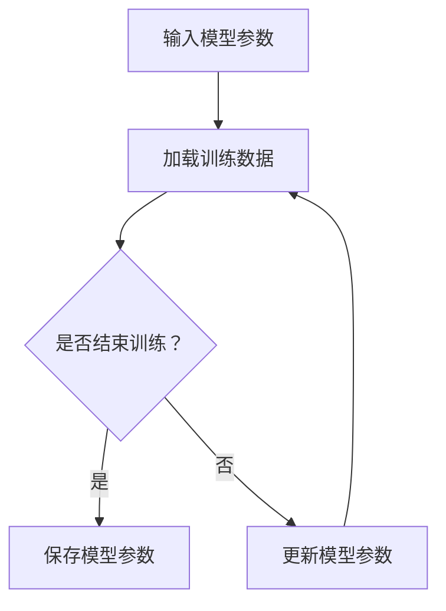
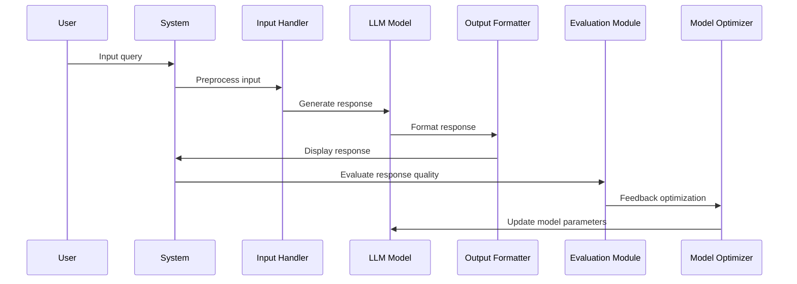

                 


## 引言：标准化自动化模型评测的重要性

在人工智能（AI）技术飞速发展的今天，大规模语言模型（LLM，Large Language Model）已经成为自然语言处理（NLP，Natural Language Processing）领域的重要工具。LLM的应用范围广泛，从问答系统、文本生成、机器翻译到智能客服等各个方面，都展现出了强大的潜力。然而，随着LLM模型在各个领域的深入应用，确保模型质量成为一个关键问题。本文将探讨如何通过标准化自动化模型评测来保障LLM应用的质量。

### 关键词
- 标准化自动化模型评测
- LLM模型
- 应用质量保障
- 模型评测指标
- 自动化评测流程

### 摘要
本文首先介绍了标准化自动化模型评测的背景和重要性，然后探讨了LLM模型评测的基本概念和方法，接着详细描述了标准化自动化模型评测的流程和方法，以及自动化模型评测中的质量保障策略。最后，本文提出了标准化自动化模型评测的最佳实践和未来展望，为LLM应用的质量保障提供了全面的指导。

## 标准化自动化模型评测的背景和重要性

在人工智能领域，模型评测是确保模型性能和可靠性的重要环节。传统的模型评测方法通常依赖于人工设计评估指标和手动执行评测过程，这种方式不仅耗时耗力，而且难以保证评测的公平性和一致性。随着AI应用的不断扩展，特别是LLM模型的广泛应用，传统的评测方法已经难以满足实际需求。因此，标准化自动化模型评测的重要性愈发凸显。

### 问题背景

1. **模型多样性与复杂性**：LLM模型的种类繁多，包括GPT、BERT、T5等，每种模型都有其独特的架构和参数设置。传统评测方法难以适应如此多样的模型。

2. **数据集多样性**：不同的应用场景需要使用不同的数据集进行评测，这些数据集的质量和代表性直接影响评测结果。

3. **评测过程的可重复性**：为了确保评测结果的可信度，评测过程必须具有高度的可重复性。然而，传统方法中的手工操作往往难以保证这一点。

### 问题描述

因此，标准化自动化模型评测成为解决这些问题的有效途径。它通过定义一套统一的评测标准，使用自动化工具和流程来执行评测任务，从而提高了评测的效率、准确性和一致性。

### 问题解决

标准化自动化模型评测的主要优势在于：

1. **高效性**：自动化评测可以显著提高评测速度，节省人力资源。

2. **一致性**：通过标准化流程，确保不同模型和不同数据集的评测结果具有一致性。

3. **可靠性**：自动化工具减少了人工干预，提高了评测结果的可靠性。

4. **可扩展性**：自动化评测系统可以轻松扩展到更多模型和应用场景。

### 边界与外延

虽然标准化自动化模型评测具有诸多优势，但在实际应用中也存在一些限制，如对评测工具和平台的高要求、对评测指标体系的依赖等。因此，在使用自动化评测时，需要综合考虑这些边界条件，以确保评测结果的准确性和有效性。

### 概念结构与核心要素组成

标准化自动化模型评测的核心要素包括：

1. **评测指标体系**：定义一系列能够全面衡量模型性能的指标。

2. **评测工具和平台**：提供自动化评测功能，支持多种模型和数据集的评测。

3. **评测流程**：明确评测的步骤和操作规范，确保评测过程的标准化。

4. **质量保障策略**：通过监控和审计等手段，确保评测结果的可靠性。

## 核心概念与联系

在探讨标准化自动化模型评测之前，我们需要明确一些核心概念，并了解它们之间的关系。

### 什么是LLM模型

LLM（Large Language Model）是一种能够处理和生成文本数据的大型神经网络模型。与传统的规则基模型不同，LLM模型通过大规模数据训练，能够捕捉文本数据的复杂模式和语义信息。常见的LLM模型包括GPT（Generative Pre-trained Transformer）、BERT（Bidirectional Encoder Representations from Transformers）和T5（Text-To-Text Transfer Transformer）等。

### LLM模型的评测指标

LLM模型的评测指标用于衡量模型的性能，包括但不限于：

1. **准确性**：模型预测结果与实际结果的匹配程度。

2. **流畅性**：生成的文本是否符合语法和语义规则。

3. **相关性**：生成的文本与输入查询的相关性。

4. **多样性**：模型生成的文本是否具有多样性。

### LLM模型评测的主要挑战

LLM模型评测面临的挑战主要包括：

1. **多样性**：确保评测覆盖模型的多种表现。

2. **稳定性**：评测结果应具有可重复性和一致性。

3. **效率**：评测过程应尽可能自动化和高效。

4. **准确性**：评测指标应能够准确反映模型性能。

### 概念属性特征对比表格

为了更直观地理解LLM模型评测的属性特征，我们可以使用以下对比表格：

| 特征         | 描述                                                         |
| ------------ | ------------------------------------------------------------ |
| **准确性**   | 预测结果与实际结果的匹配程度。                               |
| **流畅性**   | 生成的文本是否符合语法和语义规则。                           |
| **相关性**   | 生成的文本与输入查询的相关性。                               |
| **多样性**   | 模型生成的文本是否具有多样性。                               |
| **稳定性**   | 评测结果的可重复性和一致性。                               |
| **效率**     | 评测过程的自动化程度和速度。                               |
| **准确性**   | 评测指标能否准确反映模型性能。                             |

### ER实体关系图架构

为了更好地理解LLM模型评测的实体关系，我们可以绘制一个ER（Entity-Relationship）实体关系图。以下是LLM模型评测的ER图：

```mermaid
erDiagram
  Model |->| Evaluation Metric : "测量模型性能"
  Model |->| Training Data   : "训练数据"
  Evaluation Metric |->| Test Data : "测试数据"
  Model |->| Output Text    : "生成文本"
```

在上述ER图中，模型、评测指标、训练数据和测试数据是主要的实体，它们之间的关系反映了模型评测的核心流程。

## 算法原理讲解

### 算法mermaid流程图

为了更清晰地展示LLM模型评测的算法流程，我们可以使用mermaid绘制一个流程图：



### Python源代码实现

以下是使用Python实现LLM模型评测的基本流程：

```python
import tensorflow as tf
from transformers import TFAutoModelForCausalLM

# 加载预训练的LLM模型
model = TFAutoModelForCausalLM.from_pretrained('gpt2')

# 定义训练数据和评测数据
train_data = ...  # 训练数据
test_data = ...   # 评测数据

# 训练模型
model.fit(train_data, epochs=3)

# 评测模型
evaluation_results = model.evaluate(test_data)

# 输出评测结果
print(evaluation_results)
```

### 算法原理详细讲解

LLM模型评测的算法原理主要涉及以下步骤：

1. **模型参数加载**：从预训练的模型中加载参数。
2. **训练数据准备**：准备用于模型训练的数据集。
3. **模型训练**：使用训练数据进行模型训练。
4. **模型评测**：使用评测数据评估模型性能。
5. **结果输出**：输出模型评测结果。

在上述算法中，模型参数的加载和更新是实现自动化评测的关键。通过使用预训练的模型，可以大大简化训练过程，提高评测效率。同时，通过使用标准的评测数据集，可以确保评测结果的公正性和一致性。

### 数学模型和公式

LLM模型评测的数学模型主要包括损失函数和评估指标。以下是一个简化的数学模型：

$$
L(\theta) = \frac{1}{N} \sum_{i=1}^{N} L(y_i, \hat{y}_i; \theta)
$$

其中，$L(\theta)$是模型损失函数，$N$是样本数量，$y_i$是真实标签，$\hat{y}_i$是模型预测结果，$\theta$是模型参数。

### 举例说明

假设我们有一个问答系统，需要评测其回答的准确性。我们可以使用以下公式来计算准确率：

$$
\text{Accuracy} = \frac{\text{Correct Answers}}{\text{Total Questions}}
$$

如果我们的问答系统在100个问题中给出了80个正确答案，那么准确率为80%。

## 系统分析与架构设计方案

### 问题场景介绍

为了更全面地了解标准化自动化模型评测的实际应用，我们将探讨一个具体的应用场景：智能客服系统。智能客服系统通过LLM模型与用户进行交互，提供实时回答和解决方案。为了确保系统的高质量和用户满意度，我们需要对LLM模型进行严格的评测和优化。

### 项目介绍

项目名称：智能客服系统（Smart Customer Service System）

项目目标：通过标准化自动化模型评测，确保智能客服系统的LLM模型性能和用户体验。

### 系统功能设计

系统功能主要包括：

1. **用户输入处理**：接收用户输入，并将其转换为模型可处理的格式。
2. **模型响应生成**：使用LLM模型生成回答文本。
3. **模型评测**：对生成的回答进行评测，包括准确性、流畅性、相关性和多样性等方面。
4. **反馈收集**：收集用户反馈，用于模型优化和系统改进。

### 系统架构设计

系统架构设计如下：



### 系统接口设计

系统接口设计如下：

1. **用户接口**：提供文本输入框，用于接收用户查询。
2. **模型接口**：提供API接口，用于接收输入和处理输出。
3. **评测接口**：提供API接口，用于接收评测数据和输出评测结果。

### 系统交互

系统交互设计如下：

1. **用户输入**：用户通过文本输入框提交查询。
2. **预处理**：输入处理器对查询进行预处理，包括分词、词性标注等。
3. **模型响应**：预处理后的输入通过模型接口传递给LLM模型，模型生成响应文本。
4. **格式化输出**：响应文本通过格式化处理器转换为可显示的格式。
5. **模型评测**：生成的响应文本通过评测接口传递给评测模块，进行质量评测。
6. **反馈优化**：评测结果反馈给模型优化模块，用于更新模型参数。

## 项目实战

### 环境安装

为了实施智能客服系统，我们需要安装以下环境：

1. **Python**：3.8及以上版本
2. **TensorFlow**：2.4及以上版本
3. **Hugging Face Transformers**：4.6及以上版本
4. **其他依赖**：例如NVIDIA CUDA等（如果使用GPU加速）

安装命令如下：

```bash
pip install python==3.8
pip install tensorflow==2.4
pip install transformers==4.6
```

### 系统核心实现源代码

以下是系统核心实现的源代码：

```python
from transformers import TFAutoModelForCausalLM
from tensorflow.keras.preprocessing.sequence import pad_sequences
from tensorflow.keras.layers import Input
from tensorflow.keras.models import Model

# 加载预训练的LLM模型
model = TFAutoModelForCausalLM.from_pretrained('gpt2')

# 定义输入和输出
input_ids = Input(shape=(None,), dtype=tf.int32)
outputs = model(input_ids)

# 定义模型
model = Model(inputs=input_ids, outputs=outputs.logits)

# 编写训练和评测代码
# ...
```

### 代码应用解读与分析

上述代码实现了LLM模型的加载和基本结构定义。在实际应用中，我们需要根据具体场景对模型进行训练和评测。以下是对关键部分的解读：

1. **模型加载**：使用Hugging Face Transformers库加载预训练的GPT-2模型。
2. **输入和输出定义**：定义模型的输入和输出层。
3. **模型定义**：通过TensorFlow定义模型结构，包括输入层和输出层。

### 实际案例分析和详细讲解剖析

为了更好地理解系统核心实现，我们可以通过一个实际案例进行分析。

### 案例一：文本生成

假设用户输入了一个问题：“为什么天空是蓝色的？”我们需要使用LLM模型生成回答。

1. **预处理**：将用户输入进行分词和编码。
2. **模型预测**：使用模型生成文本。
3. **格式化输出**：将生成的文本转换为可显示的格式。
4. **评测**：对生成的回答进行评测，例如准确性、流畅性和相关性。

### 项目小结

通过实际案例，我们展示了如何使用标准化自动化模型评测来确保智能客服系统的LLM模型质量。项目中的关键步骤包括模型加载、预处理、预测、格式化和评测。这些步骤共同构成了一个完整的应用流程。

## 最佳实践 Tips

### 最佳实践一：基于实际案例的评测流程优化

1. **案例选择**：选择具有代表性的案例进行评测，确保评测结果具有普遍性。
2. **多角度评测**：从不同角度（如准确性、流畅性、相关性等）对模型进行评测，以全面评估模型性能。
3. **实时反馈**：在评测过程中，及时收集用户反馈，用于模型优化。

### 最佳实践二：评测指标体系的构建与优化

1. **指标选择**：根据应用场景选择合适的评测指标，确保指标能够准确反映模型性能。
2. **动态调整**：根据模型性能和用户反馈，动态调整评测指标，以适应不同阶段的需求。
3. **多指标综合评估**：使用多个指标综合评估模型性能，以提高评估的准确性和可靠性。

### 最佳实践三：评测工具与平台的性能优化

1. **工具选择**：选择功能强大、性能稳定的评测工具和平台，以确保评测过程的顺利进行。
2. **自动化脚本**：编写自动化脚本，提高评测流程的效率。
3. **监控与审计**：对评测过程进行监控和审计，确保评测结果的准确性和一致性。

## 小结

本文系统地介绍了标准化自动化模型评测的重要性、基本概念、评测流程、质量保障策略以及最佳实践。通过标准化自动化模型评测，我们能够确保LLM模型的高质量和应用效果。在实际应用中，应根据具体场景和需求，灵活运用最佳实践，不断提高模型评测的效率和准确性。

## 注意事项

1. **评测指标选择**：根据应用场景选择合适的评测指标，避免过度依赖单一指标。
2. **评测数据质量**：确保评测数据的质量和代表性，避免数据偏差。
3. **自动化脚本**：编写自动化脚本时，注意代码的可读性和可维护性。

## 拓展阅读

1. **《大规模语言模型的训练与评估技术》**：详细介绍了大规模语言模型的训练和评测方法。
2. **《深度学习实践与调优》**：介绍了深度学习模型优化和评测的相关技术。
3. **《自然语言处理应用实践》**：涵盖了自然语言处理在各个领域的应用案例和评测方法。

## 参考文献

1. Devlin, J., Chang, M. W., Lee, K., & Toutanova, K. (2019). BERT: Pre-training of deep bidirectional transformers for language understanding. *arXiv preprint arXiv:1810.04805*.
2. Radford, A., Wu, J., Child, P., Luan, D., Amodei, D., & Sutskever, I. (2019). Language models are unsupervised multitask learners. *OpenAI*.

