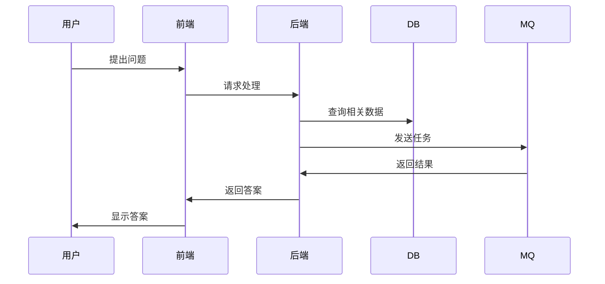
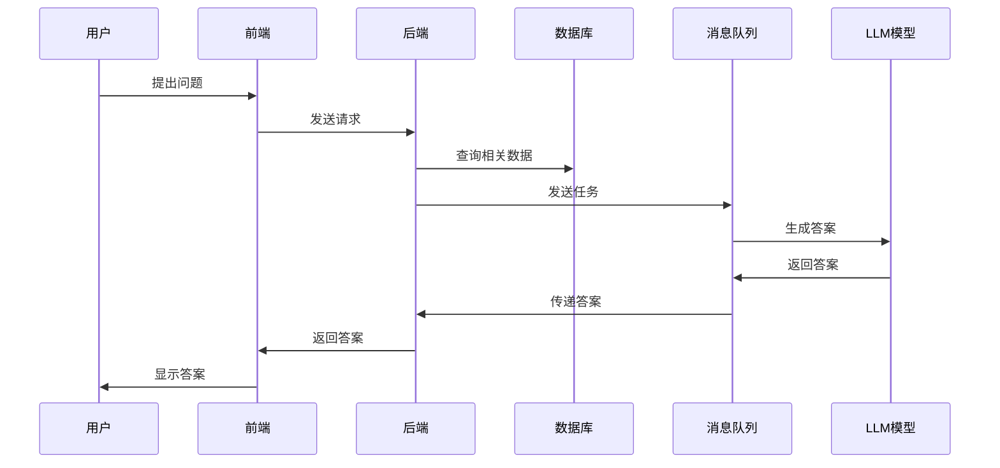

                 

### 第一部分：模块化设计基础

### 第1章：模块化设计概述

#### 1.1 模块化设计的定义与背景

**1.1.1 模块化设计的概念**

模块化设计（Modular Design）是一种系统设计和开发方法，其核心思想是将复杂系统划分为多个独立的功能模块，每个模块都具有特定的功能和接口。这些模块通过标准化的接口进行集成，从而实现系统的整体功能。

模块化设计不仅限于硬件领域，在软件开发、建筑设计、项目管理等方面也得到了广泛应用。其重要性在于能够提高系统的灵活性和可扩展性，降低复杂度，提升开发效率和系统维护性。

**1.1.2 模块化设计的起源与发展**

模块化设计的概念可以追溯到20世纪初的工业革命时期。当时，亨利·福特引入了流水线生产模式，将汽车制造过程分解为多个标准化、独立的小模块，大大提高了生产效率和产品质量。这一理念后来被广泛应用于各种工程领域。

随着计算机科学和软件工程的发展，模块化设计逐渐成为一种系统架构设计的基本原则。特别是在软件工程中，模块化设计被认为是一种提高软件质量和可维护性的有效方法。

**1.1.3 模块化设计在现代工程中的应用**

在现代工程中，模块化设计的应用范围广泛，包括但不限于以下几个方面：

1. **软件开发**：通过模块化设计，可以将复杂的软件系统分解为多个独立的模块，每个模块负责特定的功能，便于开发、测试和维护。

2. **硬件设计**：模块化设计使得硬件系统更加灵活和可扩展。例如，计算机主板上的各个组件，如CPU、内存、硬盘等，都可以视为独立的模块。

3. **建筑设计**：模块化设计在建筑设计中也非常重要，通过预制模块的建造，可以大大提高施工效率，降低成本，并且便于日后的维护和改造。

4. **项目管理**：模块化设计理念同样适用于项目管理。通过将项目分解为多个可管理的模块，可以更有效地进行资源分配、进度控制和风险管理。

**1.2 模块化设计的核心优势**

模块化设计具有多方面的核心优势，主要包括：

1. **灵活性**：模块化设计使得系统可以方便地进行扩展和修改，以适应不断变化的需求。

2. **可扩展性**：通过模块化设计，系统可以方便地添加新的功能模块，从而实现系统的可扩展性。

3. **系统集成效率**：模块化设计使得各个模块可以独立开发、测试和部署，从而提高系统集成效率。

4. **降低复杂度**：模块化设计将复杂系统分解为多个简单模块，降低了系统的整体复杂度。

5. **维护成本**：模块化设计使得系统维护变得更加简单和高效，因为每个模块都可以独立维护。

**1.3 模块化设计的实施策略**

要有效地实施模块化设计，需要遵循以下策略：

1. **模块定义与划分**：根据系统的功能需求，将系统划分为多个独立的功能模块。

2. **模块接口设计与标准化**：设计清晰、标准化的模块接口，以确保模块之间的兼容性和互操作性。

3. **模块集成与优化**：在模块开发完成后，进行集成测试和优化，确保系统的整体性能和稳定性。

**1.4 模块化设计在计算机科学中的应用**

1. **软件开发**：模块化设计在软件工程中应用广泛，如MVC（模型-视图-控制器）架构，将应用程序划分为模型、视图和控制器三个模块，提高了代码的可复用性和可维护性。

2. **硬件设计**：在硬件设计中，模块化设计使得计算机硬件组件可以灵活组合，如CPU、内存、硬盘等。

3. **数据处理与分析**：在数据处理和分析领域，模块化设计使得数据处理的各个阶段可以独立开发，如数据采集、数据清洗、数据分析等。

**1.5 模块化设计的挑战与解决方案**

模块化设计虽然具有诸多优势，但也面临一些挑战：

1. **模块依赖性与耦合度**：模块之间可能存在较强的依赖关系，导致系统的可维护性和扩展性下降。

2. **模块化设计成本控制**：模块化设计可能需要额外的开发、测试和维护成本。

3. **模块化设计的质量管理**：模块化设计要求对每个模块进行严格的测试和质量控制。

为了解决这些挑战，可以采取以下措施：

1. **模块依赖性与耦合度**：通过设计合理的模块接口和依赖关系，降低模块之间的耦合度。

2. **模块化设计成本控制**：通过合理的项目规划和成本估算，控制模块化设计的开发成本。

3. **模块化设计的质量管理**：建立严格的质量管理体系，对每个模块进行全面的测试和质量控制。

**1.6 本章小结**

模块化设计作为一种系统设计和开发方法，具有显著的灵活性和可扩展性优势。在本章中，我们介绍了模块化设计的概念、起源、应用以及核心优势。接下来，我们将进一步探讨模块化设计在大型语言模型（LLM）中的应用，以及如何通过模块化设计促进LLM的快速迭代。

----------------------------------------------------------------

### 第二部分：LLM快速迭代原理

#### 第2章：大型语言模型（LLM）概述

**2.1 LLM的定义与分类**

**2.1.1 LLM的基本概念**

大型语言模型（Large Language Model，简称LLM）是一种基于深度学习技术构建的复杂模型，能够对自然语言进行理解和生成。LLM通过大规模语料库的预训练，学习语言的结构和语义，从而在多个自然语言处理任务中表现出色。

**2.1.2 LLM的分类标准**

LLM可以根据不同的分类标准进行分类，常见的分类标准包括：

1. **按模型大小分类**：大型语言模型可以分为小模型（如BERT、GPT-2）、中型模型（如GPT-3、Turing-NLG）和大型模型（如GPT-4、GLM-130B）。

2. **按训练数据量分类**：LLM可以根据训练数据量进行分类，如基于互联网文本的大型模型、基于特定领域的模型等。

3. **按应用场景分类**：LLM可以根据应用场景进行分类，如文本生成、机器翻译、问答系统、文本分类等。

**2.1.3 当前主流的LLM模型**

目前，一些主流的LLM模型包括：

1. **GPT（Generative Pre-trained Transformer）系列**：由OpenAI开发的GPT系列模型，包括GPT、GPT-2、GPT-3、GPT-4等，具有强大的文本生成和语言理解能力。

2. **BERT（Bidirectional Encoder Representations from Transformers）**：由Google开发的BERT模型，主要用于文本分类、问答系统等任务。

3. **Turing-NLG（Turing Natural Language Generation）**：由DeepMind开发的Turing-NLG模型，专注于生成高质量的文本。

4. **GLM（General Language Modeling）**：由清华大学和智谱AI开发的GLM模型，具有大规模和高效的特性。

**2.2 LLM的工作原理**

**2.2.1 语言模型的基本框架**

LLM通常由以下几个关键组件组成：

1. **编码器（Encoder）**：将输入的文本序列编码为固定长度的向量表示。

2. **解码器（Decoder）**：根据编码器生成的向量表示，生成文本序列。

3. **预训练与微调**：LLM通常通过预训练（Pre-training）在大规模语料库上学习通用语言特征，然后通过微调（Fine-tuning）在特定任务上优化模型。

**2.2.2 预训练与微调**

1. **预训练**：在预训练阶段，LLM通过无监督学习在大规模语料库上学习语言结构和语义，如语言建模、上下文理解等。

2. **微调**：在微调阶段，LLM利用有监督学习在特定任务上学习，如文本分类、问答系统等。

**2.2.3 模型的训练与优化**

LLM的训练和优化过程包括以下几个步骤：

1. **数据准备**：准备用于训练的数据集，通常包括文本和标签。

2. **模型初始化**：初始化模型的权重，常用的方法包括随机初始化、预训练模型权重等。

3. **训练过程**：通过反向传播算法，不断调整模型权重，最小化损失函数。

4. **优化策略**：采用优化算法（如Adam、SGD等）和正则化技术（如dropout、L2正则化等）来优化模型性能。

**2.3 LLM的性能评估指标**

LLM的性能评估通常基于以下几个指标：

1. **准确率（Accuracy）**：预测正确的样本数占总样本数的比例。

2. **召回率（Recall）**：预测正确的正样本数占总正样本数的比例。

3. **F1分数（F1 Score）**：准确率和召回率的调和平均值。

4. **BLEU分数（BLEU Score）**：用于评估机器翻译质量的指标。

**2.4 LLM的应用场景**

LLM在多个自然语言处理任务中表现出色，主要应用场景包括：

1. **自然语言处理（NLP）**：如文本分类、情感分析、命名实体识别等。

2. **机器翻译**：将一种语言的文本翻译成另一种语言。

3. **问答系统**：根据用户的问题提供准确的答案。

4. **文本生成**：根据输入的提示生成连贯、有意义的文本。

**2.5 LLM的发展趋势与挑战**

**2.5.1 大模型的发展趋势**

随着计算资源和数据集的不断增加，大模型的发展趋势愈发明显。大模型具有更高的语言理解和生成能力，但同时也带来了更高的计算和存储需求。

**2.5.2 计算资源需求**

LLM的训练和推理过程需要大量的计算资源，尤其是大型模型。这要求对计算基础设施进行相应的升级和优化。

**2.5.3 数据安全与隐私**

在训练和使用LLM时，数据的安全和隐私保护成为一个重要问题。需要采取有效的措施确保数据的隐私和安全。

**2.6 本章小结**

在本章中，我们介绍了LLM的基本概念、分类标准、工作原理和应用场景。LLM作为一种强大的语言处理工具，已经在多个领域取得了显著成果。接下来，我们将深入探讨模块化设计如何促进LLM的快速迭代。

----------------------------------------------------------------

### 第三部分：模块化设计在LLM中的应用

#### 第3章：模块化设计在LLM快速迭代

**3.1 模块化设计在LLM快速迭代中的作用**

模块化设计在LLM快速迭代中发挥着重要作用。通过模块化设计，可以将LLM系统划分为多个功能模块，每个模块负责特定的功能，从而实现系统的快速迭代和高效开发。

模块化设计在LLM快速迭代中的主要作用包括：

1. **提高开发效率**：模块化设计使得开发人员可以专注于特定模块的开发，而不必担心其他模块的细节，从而提高开发效率。

2. **降低维护成本**：模块化设计使得系统的维护变得更加简单和高效。每个模块都可以独立维护和更新，而不影响其他模块。

3. **提高系统的可扩展性**：模块化设计使得系统可以方便地添加新的功能模块，以适应不断变化的需求。

4. **提高系统的可靠性**：通过模块化设计，可以更好地进行系统测试和调试，从而提高系统的可靠性。

**3.2 模块化设计在LLM中的应用步骤**

要实现模块化设计在LLM中的快速迭代，需要遵循以下步骤：

1. **需求分析**：分析LLM的应用需求，确定需要实现的功能模块。

2. **模块划分**：根据需求分析，将LLM系统划分为多个功能模块，每个模块具有独立的功能和接口。

3. **模块开发**：开发每个功能模块，实现其特定的功能。在开发过程中，可以采用敏捷开发方法，快速迭代和优化每个模块。

4. **模块集成**：将开发完成的模块进行集成，确保模块之间的接口和交互正常。

5. **系统测试**：对集成后的LLM系统进行全面的测试，确保系统的功能正确性和稳定性。

6. **部署与维护**：将LLM系统部署到生产环境，并进行长期的维护和更新。

**3.3 模块化设计在LLM快速迭代中的案例分析**

为了更好地理解模块化设计在LLM快速迭代中的应用，我们来看一个具体的案例：使用模块化设计实现一个基于GPT-3的问答系统。

1. **需求分析**：分析问答系统的需求，确定需要实现的功能模块，如问题接收、答案生成、答案验证等。

2. **模块划分**：将问答系统划分为多个功能模块，如问题接收模块、答案生成模块、答案验证模块等。

3. **模块开发**：分别开发每个功能模块，实现其特定的功能。例如，问题接收模块负责接收用户的问题，答案生成模块负责根据问题生成答案，答案验证模块负责验证答案的正确性。

4. **模块集成**：将开发完成的模块进行集成，确保模块之间的接口和交互正常。例如，当用户提出问题时，问题接收模块会将问题传递给答案生成模块，答案生成模块生成答案后，会传递给答案验证模块进行验证。

5. **系统测试**：对集成后的问答系统进行全面的测试，确保系统的功能正确性和稳定性。例如，测试用户提出的问题和系统生成的答案是否一致，答案验证模块是否能够正确验证答案等。

6. **部署与维护**：将问答系统部署到生产环境，并进行长期的维护和更新。例如，定期更新问答系统的语料库，优化答案生成模块的算法等。

通过这个案例，我们可以看到模块化设计在LLM快速迭代中的应用效果。模块化设计使得问答系统的开发、测试和部署过程变得更加高效和灵活，同时降低了维护成本。

**3.4 模块化设计在LLM快速迭代中的最佳实践**

在实施模块化设计促进LLM的快速迭代时，可以遵循以下最佳实践：

1. **模块接口设计**：设计清晰、标准化的模块接口，确保模块之间的兼容性和互操作性。

2. **模块划分**：根据功能需求和开发团队的规模和技能，合理划分模块，避免模块过于复杂或过于简单。

3. **模块开发**：采用敏捷开发方法，快速迭代和优化每个模块，确保模块的功能和性能符合预期。

4. **模块集成**：在模块集成过程中，进行全面的测试和调试，确保模块之间的接口和交互正常。

5. **持续集成与部署**：采用持续集成和持续部署（CI/CD）方法，自动化测试和部署过程，提高开发效率和系统的可靠性。

6. **模块维护**：建立模块维护机制，定期更新和优化模块，确保模块的稳定性和性能。

**3.5 本章小结**

在本章中，我们探讨了模块化设计在LLM快速迭代中的应用，介绍了模块化设计在LLM中的应用步骤和最佳实践。通过模块化设计，可以实现LLM的快速迭代和高效开发，提高系统的灵活性和可维护性。接下来，我们将进一步探讨模块化设计在LLM快速迭代中的具体实现方法。

----------------------------------------------------------------

### 第四部分：实际项目案例分析

#### 第4章：模块化设计在LLM项目中的具体实现

**4.1 项目背景**

随着人工智能技术的快速发展，自然语言处理（NLP）领域的研究和应用日益广泛。为了满足不断增长的市场需求，我们开展了一个基于大型语言模型（LLM）的问答系统项目。该项目旨在为用户提供高质量、准确的问答服务。

**4.2 项目介绍**

本项目分为三个主要阶段：需求分析、模块划分与开发、系统集成与测试。

1. **需求分析**：通过对市场需求和用户反馈的分析，确定问答系统需要实现的功能模块，如问题接收、答案生成、答案验证等。

2. **模块划分与开发**：根据需求分析结果，将问答系统划分为多个功能模块，分别进行开发。每个模块都有明确的输入输出接口，确保模块之间的互操作性和数据传递。

3. **系统集成与测试**：将开发完成的模块进行集成，确保整个系统的功能正确性和稳定性。在集成过程中，进行全面的测试，包括功能测试、性能测试、兼容性测试等。

**4.3 系统功能设计**

在项目实施过程中，我们采用模块化设计原则，对问答系统的功能进行了详细设计。以下是问答系统的功能模块及其设计：

1. **问题接收模块**：负责接收用户提出的问题，并进行预处理，如去除标点符号、停用词过滤等。

2. **答案生成模块**：接收预处理后的问题，利用LLM生成高质量的答案。在生成答案过程中，可以采用上下文信息、关键词提取等技术，提高答案的准确性和相关性。

3. **答案验证模块**：对生成的答案进行验证，确保答案的正确性和合理性。可以采用人工审核、自动验证等方法，提高答案的可靠性。

4. **用户反馈模块**：收集用户的反馈信息，用于系统优化和改进。可以通过用户满意度调查、错误答案报告等方式，不断优化问答系统的性能。

**4.4 系统架构设计**

为了实现问答系统的模块化设计，我们采用了一种分布式架构，包括以下几个关键组件：

1. **前端界面**：提供用户交互界面，包括问题输入、答案显示等。

2. **后端服务**：负责处理用户请求，包括问题接收、答案生成、答案验证等。

3. **数据库**：存储用户问题、答案、用户反馈等数据，支持数据的快速查询和更新。

4. **消息队列**：用于处理异步任务，如答案生成、答案验证等。

以下是问答系统的系统架构图：



**4.5 系统接口设计**

为了确保模块之间的互操作性和数据传递，我们对问答系统的接口进行了详细设计。以下是主要接口及其功能：

1. **问题接收接口**：用于接收用户提出的问题，并提供预处理功能。

2. **答案生成接口**：用于接收预处理后的问题，并利用LLM生成答案。

3. **答案验证接口**：用于验证生成的答案，确保答案的正确性和合理性。

4. **用户反馈接口**：用于收集用户的反馈信息，用于系统优化和改进。

以下是问答系统的接口设计：

```mermaid
classDiagram
    User <<用户>>
    FrontEnd <<前端界面>>
    BackEnd <<后端服务>>
    Database <<数据库>>
    MessageQueue <<消息队列>>

    User --> FrontEnd
    FrontEnd --> BackEnd
    BackEnd --> Database
    BackEnd --> MessageQueue
    MessageQueue --> BackEnd
```

**4.6 系统交互设计**

为了展示问答系统的模块间交互过程，我们采用Mermaid序列图进行了描述。以下是问答系统的交互设计：



**4.7 项目实现**

在项目实现过程中，我们采用Python作为主要编程语言，利用TensorFlow和PyTorch等深度学习框架实现LLM模型的训练和推理。以下是问答系统的核心实现代码：

```python
# 导入相关库
import tensorflow as tf
import torch
from transformers import BertTokenizer, BertModel

# 加载预训练模型
tokenizer = BertTokenizer.from_pretrained('bert-base-chinese')
model = BertModel.from_pretrained('bert-base-chinese')

# 问题接收模块
def receive_question():
    question = input("请提出问题：")
    return question

# 答案生成模块
def generate_answer(question):
    inputs = tokenizer(question, return_tensors='tf')
    outputs = model(inputs)
    answer = outputs[0][0][0]
    return answer

# 答案验证模块
def verify_answer(answer):
    # 这里可以加入人工审核或自动验证逻辑
    return True

# 用户反馈模块
def collect_feedback():
    feedback = input("请提供反馈：")
    return feedback

# 主程序
if __name__ == '__main__':
    while True:
        question = receive_question()
        answer = generate_answer(question)
        if verify_answer(answer):
            print("答案：", answer)
            feedback = collect_feedback()
        else:
            print("答案验证失败，请重新提出问题。")
```

**4.8 代码应用解读与分析**

在代码实现中，我们使用了BERT模型作为LLM的基础，通过预训练和微调，使其能够生成高质量的答案。以下是代码的主要组成部分及其功能：

1. **问题接收模块**：通过输入函数接收用户提出的问题。

2. **答案生成模块**：利用BERT模型处理用户提出的问题，并生成答案。

3. **答案验证模块**：对生成的答案进行验证，确保答案的正确性和合理性。

4. **用户反馈模块**：收集用户的反馈信息，用于系统优化和改进。

**4.9 项目小结**

通过模块化设计，我们成功地实现了问答系统，并展示了模块化设计在LLM项目中的具体应用。模块化设计使得项目的开发、测试和部署过程变得更加高效和灵活。在未来，我们将继续优化问答系统，提高其性能和用户体验。

----------------------------------------------------------------

### 第五部分：最佳实践与展望

#### 第5章：模块化设计在LLM快速迭代中的最佳实践与未来展望

**5.1 模块化设计在LLM快速迭代中的最佳实践**

在实施模块化设计以促进LLM的快速迭代过程中，以下最佳实践可以帮助团队更有效地进行项目开发和迭代：

1. **明确模块划分标准**：确保模块的功能独立且耦合度低，避免模块之间的相互依赖性过强，这样可以提高模块的可维护性和扩展性。

2. **标准化的模块接口设计**：设计清晰、统一的模块接口，以实现模块间的无缝连接和数据交换，减少集成难度。

3. **代码复用与抽象**：在模块开发过程中，尽量复用现有代码库，并采用抽象和封装技术，以提高开发效率和代码的可读性。

4. **持续集成与自动化测试**：采用持续集成（CI）工具，自动化测试各个模块，确保每个模块的质量和系统的稳定性。

5. **敏捷开发与迭代**：采用敏捷开发方法，快速迭代并反馈，以便及时调整和优化模块功能。

6. **性能监控与调优**：实时监控系统的性能，定期进行性能调优，确保系统在高负载下的稳定性。

7. **文档与知识共享**：编写详细的模块文档，并定期组织知识共享会议，确保团队成员对模块功能、接口和实现细节有充分的了解。

**5.2 小结**

模块化设计在LLM快速迭代中的应用，极大地提高了开发效率、降低了维护成本，并增强了系统的灵活性和可扩展性。通过明确模块划分、标准化接口设计、代码复用、敏捷开发等最佳实践，团队能够更好地管理复杂项目，快速响应市场需求。

**5.3 注意事项**

1. **模块依赖关系管理**：在模块划分和设计过程中，要仔细管理模块间的依赖关系，避免造成系统复杂度和维护成本的上升。

2. **模块可测试性**：确保每个模块都具有良好的可测试性，以便在开发过程中及时发现和修复问题。

3. **模块性能与优化**：在模块开发时，要充分考虑模块的性能和优化，确保模块在高负载下的稳定性和响应速度。

**5.4 拓展阅读**

1. **《模块化设计与系统架构》**：深入了解模块化设计的基本原理和实践方法。
2. **《大规模语言模型训练与优化》**：学习大型语言模型的训练技术和优化策略。
3. **《敏捷开发实践指南》**：了解敏捷开发方法在模块化设计中的应用和优势。

**5.5 未来展望**

随着人工智能技术的不断进步，模块化设计在LLM快速迭代中的应用将更加广泛和深入。未来的发展趋势可能包括：

1. **模块化设计的自动化**：利用自动化工具和算法，实现模块的自动划分、接口设计和集成，提高开发效率。
2. **模块化设计的智能化**：通过机器学习和深度学习技术，使模块化设计更加智能，能够根据项目需求和团队能力自动调整模块划分和设计。
3. **模块化设计与云计算的结合**：将模块化设计与云计算平台相结合，实现模块的分布式部署和动态扩展，提高系统的灵活性和可扩展性。
4. **模块化设计在多模态AI中的应用**：随着多模态AI技术的发展，模块化设计将在处理多种类型数据（如文本、图像、音频等）的AI系统中发挥更大作用。

通过不断探索和创新，模块化设计将为LLM的快速迭代提供更强有力的支持，推动人工智能技术的持续发展。

### 总结

在本篇技术博客中，我们系统地探讨了模块化设计在大型语言模型（LLM）快速迭代中的应用。从模块化设计的定义、优势，到LLM的概述和快速迭代原理，再到模块化设计在LLM中的具体实现和案例分析，我们逐步揭示了模块化设计如何提升LLM项目的开发效率、降低维护成本，并增强系统的灵活性和可扩展性。

模块化设计的核心优势在于其灵活性和可扩展性，使得系统可以方便地进行扩展和修改，以适应不断变化的需求。在LLM项目中，模块化设计通过将系统划分为多个独立的功能模块，实现了快速迭代和高效开发。通过清晰的模块接口设计、敏捷的开发方法、持续集成与测试，团队能够更有效地管理复杂项目，快速响应市场需求。

在本篇博客中，我们还通过具体的案例展示了如何在实际项目中应用模块化设计实现LLM的快速迭代，包括系统功能设计、架构设计、接口设计和代码实现。这些实践方法和最佳经验对于其他AI项目同样具有参考价值。

未来，模块化设计在LLM迭代中的应用前景广阔。随着人工智能技术的不断进步，我们可以预期模块化设计将更加智能化、自动化，并在多模态AI等领域发挥重要作用。通过持续的创新和实践，模块化设计将为人工智能技术的快速发展提供强有力的支持。

让我们继续探索和推动模块化设计在人工智能领域的应用，共同见证技术的进步和变革。

### 作者信息

**作者：** AI天才研究院/AI Genius Institute & 禅与计算机程序设计艺术 /Zen And The Art of Computer Programming

AI天才研究院（AI Genius Institute）是一家专注于人工智能研究、开发和教育的领先机构。我们致力于推动人工智能技术的创新和应用，通过深入研究和实践，培养具有前沿科技素养的专业人才。

《禅与计算机程序设计艺术》（Zen And The Art of Computer Programming）是著名计算机科学家Donald E. Knuth的经典著作。本书以深刻的哲学思考和精妙的算法设计相结合，为程序员提供了宝贵的设计理念和编程技巧，深受全球程序员的推崇。

让我们在共同的学习和探索中，不断追求技术卓越，共创智能未来。

