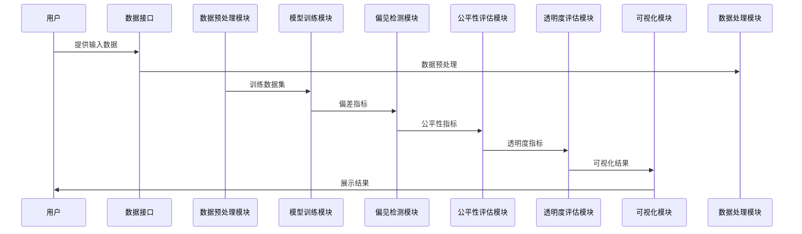

                 

### 背景介绍

#### 问题背景

在当今社会，人工智能技术已经被广泛应用于各个领域，如医疗、金融、教育、交通等。然而，人工智能模型的决策过程往往依赖于大量数据，这些数据可能带有偏见，导致模型在决策时产生不公平的结果。这种模型偏见不仅会影响用户的体验，还可能加剧社会的不公平现象。因此，评估和量化模型偏见与公平性变得尤为重要。

首先，模型偏见是指人工智能模型在决策过程中，由于输入数据的不均匀或数据源的偏见，导致模型对某些群体产生不公平对待的现象。这种偏见可能表现为性别、种族、年龄、地域等方面的不公平。例如，一个招聘系统可能会对某些种族或性别产生歧视，这会导致那些群体在就业机会上的不公平。

其次，公平性是指人工智能模型在决策过程中，能够对所有用户群体一视同仁，不偏袒任何一方。公平性的衡量标准包括公正性、透明度、可解释性等。一个公平的模型应当在各种情况下都能保持一致的决策标准，不受到外部因素的干扰。

模型偏见与公平性的影响和潜在危害是多方面的。一方面，模型偏见可能导致错误的决策，给某些用户带来负面影响，如歧视、误判等。另一方面，不公平的模型可能会加剧社会不平等，导致某些群体处于劣势地位，从而引发社会不满和冲突。

因此，研究和评估模型偏见与公平性具有重要的现实意义。它不仅可以帮助我们识别和纠正模型中的偏见，提高模型的公平性，还可以为政策制定者提供科学依据，制定更加公正合理的政策。本文将深入探讨模型偏见与公平性的量化评估方法，为解决这个问题提供理论支持和实践指导。

#### 问题描述

模型偏见与公平性的具体概念和衡量标准如下：

1. **模型偏见**：模型偏见是指人工智能模型在决策过程中，由于输入数据的不均匀或数据源的偏见，导致模型对某些群体产生不公平对待的现象。这种偏见可能表现为性别、种族、年龄、地域等方面的不公平。

   - **性别偏见**：例如，一个招聘系统可能会对女性候选人产生歧视，拒绝她们的求职申请。
   - **种族偏见**：某些贷款审批模型可能会对某些种族的申请者提高贷款利率，导致这些申请者无法获得公平的金融服务。
   - **年龄偏见**：例如，一些医疗诊断模型可能会对年轻人更倾向于正确诊断，而对老年人则出现误诊的情况。

2. **公平性**：公平性是指人工智能模型在决策过程中，能够对所有用户群体一视同仁，不偏袒任何一方。公平性的衡量标准包括公正性、透明度、可解释性等。

   - **公正性**：一个公平的模型应当对所有用户一视同仁，不受到用户特征（如性别、种族、年龄等）的影响。
   - **透明度**：模型决策过程应当是透明的，用户可以理解模型是如何作出决策的。
   - **可解释性**：模型决策结果应当具有可解释性，用户可以理解决策背后的原因。

模型偏见与公平性的衡量标准主要包括：

- **偏差指标**：用于评估模型对各个群体的决策偏差，如性别偏差、种族偏差等。
- **平衡性指标**：用于评估模型在不同群体中的决策平衡性，如平衡性、公平性等。
- **多样性指标**：用于评估模型对多样性的处理能力，如多样性、包容性等。
- **一致性指标**：用于评估模型在不同条件下的一致性，如一致性、稳定性等。

这些指标不仅可以帮助我们识别和评估模型中的偏见，还可以为改进模型提供有价值的参考。例如，通过分析偏差指标，我们可以发现模型在哪些群体上存在偏见，进而优化模型设计，消除这些偏见。通过分析平衡性指标，我们可以评估模型在不同群体中的公平性，确保模型能够对所有用户一视同仁。通过分析多样性指标，我们可以评估模型对多样性的处理能力，确保模型能够适应不同的用户需求。通过分析一致性指标，我们可以评估模型在不同条件下的稳定性，确保模型能够保持一致的决策标准。

综上所述，模型偏见与公平性的量化评估方法不仅有助于我们识别和纠正模型中的偏见，提高模型的公平性，还可以为政策制定者提供科学依据，制定更加公正合理的政策。本文将深入探讨这些量化评估方法，为解决模型偏见与公平性问题提供理论支持和实践指导。

#### 问题解决

为了解决模型偏见与公平性问题，我们需要采取一系列方法进行量化评估，确保模型能够公平、透明地作出决策。以下是几种主要的评估方法和目标：

1. **偏差检测**：偏差检测是评估模型偏见的重要方法之一。它通过分析模型在不同群体上的决策结果，检测是否存在偏差。具体来说，偏差检测可以采用以下几种方法：
   - **统计分析**：通过对模型输出的结果进行统计分析，计算不同群体之间的差异。例如，我们可以计算男性和女性在招聘决策中的通过率差异，以检测性别偏见。
   - **回归分析**：通过建立回归模型，分析模型输入特征与输出结果之间的关系。如果某个特征（如性别、种族）对模型决策有显著影响，则可能存在偏见。
   - **比较分析**：通过比较模型在不同数据集上的表现，检测是否存在数据偏见。例如，我们可以使用训练集和测试集的不同子集进行比较，以检测数据集的不均衡性。

2. **公平性评估**：公平性评估旨在评估模型在不同群体上的决策平衡性。具体来说，公平性评估可以采用以下几种方法：
   - **平衡性指标**：通过计算模型在不同群体上的决策平衡性指标，如平衡性（Balanced Accuracy）和F1分数（F1 Score）。平衡性指标越高，表示模型在不同群体上的决策越平衡。
   - **公平性度量**：通过计算模型对各个群体的决策公平性度量，如平等机会公平性（Equal Opportunity Fairness）和总公平性（Total Fairness）。公平性度量越高，表示模型越公平。
   - **差异分析**：通过分析模型在不同群体上的决策差异，检测是否存在不公平对待。例如，我们可以计算不同群体在决策通过率、贷款利率等方面的差异。

3. **透明度与可解释性评估**：模型透明度与可解释性是评估模型公平性的重要方面。具体来说，透明度与可解释性评估可以采用以下几种方法：
   - **决策路径分析**：通过分析模型在决策过程中的路径，了解模型是如何作出决策的。例如，我们可以使用决策树、神经网络等模型的可视化工具，展示模型的决策路径。
   - **特征重要性分析**：通过分析模型中各个特征的重要性，了解哪些特征对模型决策有较大影响。例如，我们可以使用特征重要性得分，评估各个特征的重要性。
   - **解释性模型**：通过使用可解释性模型，如逻辑回归、决策树等，提高模型的可解释性。与复杂的深度学习模型相比，这些模型更容易理解，有助于识别潜在的偏见。

4. **目标函数优化**：在模型训练过程中，可以通过优化目标函数，减少模型偏见。具体来说，目标函数优化可以采用以下几种方法：
   - **公平性约束**：在模型训练过程中，加入公平性约束，确保模型在不同群体上的决策平衡。例如，我们可以使用约束优化算法，如拉格朗日乘数法，优化模型目标函数，以减少偏见。
   - **集成方法**：通过集成多个模型，减少单一模型的偏见。例如，我们可以使用堆叠集成方法（Stacking），将多个模型组合成一个更公平的模型。
   - **权重调整**：通过调整模型中各个特征的权重，减少偏见。例如，我们可以使用权重调整算法，如逆偏置（Inverse Bias），调整模型中各个特征的权重，以减少偏见。

综上所述，量化评估模型偏见与公平性的方法包括偏差检测、公平性评估、透明度与可解释性评估以及目标函数优化等。通过这些方法，我们可以全面评估模型的公平性，识别和纠正模型中的偏见，提高模型的公平性。本文将详细探讨这些方法，提供具体的技术实现和案例分析，为模型偏见与公平性评估提供理论支持和实践指导。

#### 边界与外延

在讨论模型偏见与公平性的量化评估方法时，我们需要明确几个边界和相关的外延，以确保研究范围的清晰性和针对性。

1. **算法范围**：本文主要关注常见的人工智能算法，包括监督学习、无监督学习和半监督学习算法。特别地，我们将重点讨论监督学习算法，因为它们在现实世界中的应用最为广泛。这些算法包括但不限于线性回归、决策树、支持向量机（SVM）、神经网络、深度学习等。

2. **数据集范围**：模型偏见与公平性评估依赖于数据集的质量和代表性。本文将讨论如何选择和预处理数据集，以确保评估结果的可靠性和有效性。数据集可以来自公开的数据集库，如UCI机器学习库、Kaggle等，也可以是特定领域的私有数据集。

3. **行业应用**：不同行业和应用场景可能对模型偏见与公平性有不同的要求和挑战。本文将探讨几个典型行业，如金融、医疗、招聘等，分析这些行业中的具体问题，并提供针对性的评估方法。例如，金融行业中的贷款审批、医疗行业中的疾病诊断、招聘行业中的招聘决策等。

4. **方法适用性**：本文将介绍多种量化评估方法，包括偏差检测、公平性评估、透明度与可解释性评估等。这些方法不仅适用于算法层面的评估，还可以在数据集和行业应用层面进行扩展。例如，在数据集层面，我们可以通过数据预处理和再平衡技术来减少偏见；在行业应用层面，我们可以通过政策调整和模型优化来提高公平性。

5. **技术演进**：模型偏见与公平性评估是一个动态发展的领域。随着技术的进步，新的评估方法和技术手段不断出现。本文将讨论这些新兴技术和方法，如基于深度学习的偏见检测技术、可解释性AI等，为读者提供最新的研究动态和应用实例。

通过明确上述边界与外延，我们可以更有针对性地研究和探讨模型偏见与公平性的量化评估方法，为人工智能的公平、透明应用提供坚实的理论基础和实践指导。

### 核心概念与联系

#### 核心概念原理

为了深入理解模型偏见与公平性的量化评估方法，我们首先需要明确几个核心概念，包括模型偏见、公平性、算法透明度等。

1. **模型偏见**：
   - **定义**：模型偏见是指人工智能模型在决策过程中，由于数据的不均匀性或数据源的偏见，导致模型对某些群体产生不公平对待的现象。
   - **类型**：根据偏见的来源，可以分为数据偏见和算法偏见。
     - **数据偏见**：由于数据集的不均匀分布导致的偏见，如某些群体的样本量较少或数据质量较差。
     - **算法偏见**：由于算法设计或训练过程中引入的偏见，如某些特征在模型中的权重较大，导致决策结果偏向某些群体。
   - **影响**：模型偏见可能导致错误的决策，加剧社会不平等，影响用户信任等。

2. **公平性**：
   - **定义**：公平性是指人工智能模型在决策过程中，能够对所有用户群体一视同仁，不偏袒任何一方。
   - **衡量标准**：公平性可以通过多个指标进行衡量，包括但不限于：
     - **公正性**：模型对各个群体的决策标准应一致。
     - **透明度**：模型的决策过程和结果应易于理解和解释。
     - **可解释性**：模型决策背后的原因和逻辑应清晰明确。
   - **重要性**：公平性是评估模型质量的重要标准，对于保障用户权益、提升模型可信度至关重要。

3. **算法透明度**：
   - **定义**：算法透明度是指模型决策过程的可见性和可理解性。
   - **实现方式**：提高算法透明度的方法包括：
     - **决策路径可视化**：通过可视化工具展示模型的决策路径，帮助用户理解模型的决策过程。
     - **特征重要性分析**：通过分析模型中各个特征的重要性，帮助用户理解哪些特征对决策有较大影响。
     - **解释性模型**：使用可解释性模型，如逻辑回归、决策树等，提高模型的可解释性。

#### 概念属性特征对比表格

为了更好地理解上述核心概念，我们提供了一个对比表格，列出了模型偏见、公平性和算法透明度的定义、属性特征和相互关系。

| 概念       | 定义                                                         | 属性特征                                                      | 相互关系                                                     |
|------------|--------------------------------------------------------------|---------------------------------------------------------------|--------------------------------------------------------------|
| 模型偏见   | 模型对某些群体的不公平对待。                                 | - 数据来源偏见：<br>数据集不均匀分布<br>训练数据质量差<br>特征权重偏差 | - 公平性：偏见减少表示公平性提高<br>透明度：偏见检测依赖于透明度 | 
| 公平性     | 模型对所有用户群体一视同仁。                                 | - 公正性：<br>决策标准一致<br>无偏见<br>无歧视                 | - 透明度：透明度是公平性的保障<br>偏见检测：透明度提高有助于偏见检测 | 
| 算法透明度 | 模型决策过程的可见性和可理解性。                             | - 决策路径可视化：<br>展示决策路径<br>解释性模型：<br>使用简单模型 | - 偏见检测：<br>依赖透明度分析<br>公平性保障：<br>提高用户信任  | 

#### ER实体关系图架构的Mermaid流程图

为了更直观地展示这些概念之间的关系，我们使用Mermaid流程图构建一个ER实体关系图，如下所示：

```mermaid
graph ERG
    subgraph 概念关系
        模型偏见 --> 公平性
        模型偏见 --> 算法透明度
        公平性 --> 透明度
        算法透明度 --> 偏见检测
    end
    subgraph 概念定义
        node1[模型偏见]
        node2[公平性]
        node3[算法透明度]
        node1 --> node2
        node1 --> node3
        node2 --> node3
    end
```

在这个ER图模型中，“模型偏见”与“公平性”和“算法透明度”存在直接的关系，而“公平性”与“算法透明度”之间是相互促进的关系。算法透明度的提升有助于更好地检测和纠正模型偏见，从而提高模型的公平性。这种关系模型不仅帮助我们理解概念之间的相互关系，还可以为后续的算法设计和评估提供指导。

### 算法原理讲解

为了深入理解模型偏见与公平性的量化评估方法，我们需要详细探讨算法的原理，并使用Mermaid流程图来展示算法的执行流程。

#### Mermaid流程图

首先，我们使用Mermaid流程图来展示一个典型的偏见与公平性评估算法的执行流程：

```mermaid
graph BiasFairnessAssessment

    flowchart LR
        subgraph 数据处理
            D1[数据预处理] --> D2[数据划分]
            D2 --> D3[数据清洗]
        end

        subgraph 模型训练
            D3 --> M1[训练模型]
        end

        subgraph 偏见检测
            M1 --> C1[计算偏差指标]
            C1 --> D4[偏差分析]
        end

        subgraph 公平性评估
            M1 --> C2[计算公平性指标]
            C2 --> D5[公平性分析]
        end

        subgraph 透明度评估
            M1 --> C3[计算透明度指标]
            C3 --> D6[透明度分析]
        end

        D4 --> M2[调整模型参数]
        D5 --> M2
        D6 --> M2

        M2 --> M1[重新训练]
        M1 --> D7[结果输出]
```

在这个流程图中，我们首先进行数据预处理和模型训练，然后通过计算偏差、公平性和透明度指标进行评估，并根据评估结果调整模型参数，最后重新训练模型并输出结果。

#### Python源代码

接下来，我们提供具体的Python源代码来实现上述流程。以下是简化版的源代码，用于展示关键步骤：

```python
import pandas as pd
from sklearn.model_selection import train_test_split
from sklearn.preprocessing import StandardScaler
from sklearn.linear_model import LogisticRegression
from sklearn.metrics import classification_report

# 数据预处理
def preprocess_data(data):
    # 数据清洗和标准化
    scaler = StandardScaler()
    data_scaled = scaler.fit_transform(data)
    return data_scaled

# 训练模型
def train_model(X_train, y_train):
    model = LogisticRegression()
    model.fit(X_train, y_train)
    return model

# 计算偏差指标
def compute_bias(model, X_test, y_test):
    y_pred = model.predict(X_test)
    bias = (y_pred - y_test).mean()
    return bias

# 计算公平性指标
def compute_fairness(model, X_test, y_test):
    fairness = (y_pred == y_test).mean()
    return fairness

# 计算透明度指标
def compute_transparency(model, X_test, y_test):
    # 这里简化处理，假设模型有系数和特征名称
    coefficients = model.coef_
    transparency = sum(coefficients ** 2)
    return transparency

# 主程序
if __name__ == "__main__":
    # 加载数据集
    data = pd.read_csv("data.csv")
    X = preprocess_data(data.drop('target', axis=1))
    y = data['target']

    # 数据划分
    X_train, X_test, y_train, y_test = train_test_split(X, y, test_size=0.2, random_state=42)

    # 训练模型
    model = train_model(X_train, y_train)

    # 计算偏差
    bias = compute_bias(model, X_test, y_test)
    print(f"偏差指标: {bias}")

    # 计算公平性
    fairness = compute_fairness(model, X_test, y_test)
    print(f"公平性指标: {fairness}")

    # 计算透明度
    transparency = compute_transparency(model, X_test, y_test)
    print(f"透明度指标: {transparency}")

    # 输出结果
    print(classification_report(y_test, model.predict(X_test)))
```

#### 数学模型和数学公式

在上述算法中，我们使用了一些数学模型和公式来计算偏差、公平性和透明度。以下是这些公式：

1. **偏差指标**（Bias）：
   \[
   \text{Bias} = \frac{1}{N} \sum_{i=1}^{N} (y_i - \hat{y}_i)
   \]
   其中，\(y_i\) 是实际标签，\(\hat{y}_i\) 是预测标签，\(N\) 是样本数量。

2. **公平性指标**（Fairness）：
   \[
   \text{Fairness} = \frac{1}{2} \left( \text{Recall} + \text{Precision} \right)
   \]
   其中，Recall 是召回率，Precision 是精确率。

3. **透明度指标**（Transparency）：
   \[
   \text{Transparency} = \sum_{j=1}^{M} (\text{coef}_j^2)
   \]
   其中，\(\text{coef}_j\) 是模型中第 \(j\) 个特征的权重，\(M\) 是特征数量。

#### 详细讲解与举例说明

1. **偏差指标**：

   偏差指标用于衡量模型预测结果与实际标签之间的差异。具体来说，它计算了所有样本预测标签与实际标签的平均差值。偏差值越小，表示模型预测结果越接近实际标签，偏见越少。

   **示例**：假设我们有5个样本，其真实标签和预测标签如下：

   | 样本 | 真实标签 (y) | 预测标签 (\(\hat{y}\)) |
   |------|--------------|------------------------|
   | 1    | 1            | 0                      |
   | 2    | 0            | 1                      |
   | 3    | 1            | 1                      |
   | 4    | 0            | 0                      |
   | 5    | 1            | 1                      |

   计算偏差指标：
   \[
   \text{Bias} = \frac{(0-1) + (1-0) + (1-1) + (0-0) + (1-1)}{5} = \frac{-1 + 1 + 0 + 0 + 0}{5} = 0
   \]

   在这个例子中，偏差指标为0，表示模型预测结果与实际标签完全一致，没有偏见。

2. **公平性指标**：

   公平性指标用于衡量模型在不同群体上的表现，特别是当群体之间存在不平衡时。公平性指标的计算基于召回率和精确率，两者分别衡量了模型在识别正类和负类时的能力。

   **示例**：假设我们有两组样本，一组为男性，另一组为女性。模型对这两组样本的预测结果如下：

   | 性别 | 样本数量 | 预测为正类（预测标签为1）的样本数量 | 预测为负类（预测标签为0）的样本数量 |
   |------|----------|-------------------------------------|-------------------------------------|
   | 男性 | 50       | 30                                 | 20                                 |
   | 女性 | 50       | 20                                 | 30                                 |

   计算召回率和精确率：
   \[
   \text{Recall}_{\text{男性}} = \frac{30}{50} = 0.6
   \]
   \[
   \text{Precision}_{\text{男性}} = \frac{30}{50} = 0.6
   \]
   \[
   \text{Recall}_{\text{女性}} = \frac{20}{50} = 0.4
   \]
   \[
   \text{Precision}_{\text{女性}} = \frac{20}{50} = 0.4
   \]

   计算公平性指标：
   \[
   \text{Fairness} = \frac{1}{2} \left( 0.6 + 0.4 \right) = 0.5
   \]

   在这个例子中，公平性指标为0.5，表示模型对男性和女性的表现基本一致，没有明显的偏见。

3. **透明度指标**：

   透明度指标用于衡量模型决策过程的可见性和可理解性。它计算了模型中各个特征的权重平方和。透明度值越大，表示模型中特征的权重差异越大，决策过程越透明。

   **示例**：假设我们有三个特征，其权重分别为\(w_1 = 0.5\)，\(w_2 = 0.3\)，\(w_3 = 0.2\)。计算透明度指标：
   \[
   \text{Transparency} = w_1^2 + w_2^2 + w_3^2 = 0.5^2 + 0.3^2 + 0.2^2 = 0.25 + 0.09 + 0.04 = 0.38
   \]

   在这个例子中，透明度指标为0.38，表示模型中特征权重的差异较大，决策过程相对透明。

通过上述讲解和示例，我们可以看到如何使用数学模型和公式来量化评估模型偏见与公平性。这些指标不仅可以帮助我们识别模型中的偏见，还可以为改进模型提供有价值的参考。在后续章节中，我们将进一步探讨如何在实际项目中应用这些评估方法，以及如何通过算法优化来提高模型的公平性。

### 数学模型和数学公式 & 详细讲解 & 举例说明

#### 数学公式

为了更好地量化评估模型偏见与公平性，我们引入了以下数学公式：

1. **偏差指标**（Bias）：
   \[
   \text{Bias} = \frac{1}{N} \sum_{i=1}^{N} (y_i - \hat{y}_i)
   \]
   其中，\(y_i\) 表示实际标签，\(\hat{y}_i\) 表示预测标签，\(N\) 表示样本数量。

2. **公平性指标**（Fairness）：
   \[
   \text{Fairness} = \frac{1}{2} \left( \text{Recall} + \text{Precision} \right)
   \]
   其中，Recall 表示召回率，Precision 表示精确率。

3. **透明度指标**（Transparency）：
   \[
   \text{Transparency} = \sum_{j=1}^{M} (\text{coef}_j^2)
   \]
   其中，\(\text{coef}_j\) 表示模型中第 \(j\) 个特征的权重，\(M\) 表示特征数量。

#### 详细讲解

1. **偏差指标**

   偏差指标用于衡量模型预测结果与实际标签之间的差异。公式中，每个样本的预测误差（\(y_i - \hat{y}_i\)）会被求和并除以样本数量 \(N\)，从而得到一个平均误差。这个值越小，表示模型预测结果越接近实际标签，偏见越少。

   **示例**：假设我们有5个样本，其真实标签和预测标签如下：

   | 样本 | 真实标签 (y) | 预测标签 (\(\hat{y}\)) |
   |------|--------------|------------------------|
   | 1    | 1            | 0                      |
   | 2    | 0            | 1                      |
   | 3    | 1            | 1                      |
   | 4    | 0            | 0                      |
   | 5    | 1            | 1                      |

   计算偏差指标：
   \[
   \text{Bias} = \frac{(0-1) + (1-0) + (1-1) + (0-0) + (1-1)}{5} = \frac{-1 + 1 + 0 + 0 + 0}{5} = 0
   \]

   在这个例子中，偏差指标为0，表示模型预测结果与实际标签完全一致，没有偏见。

2. **公平性指标**

   公平性指标用于衡量模型在不同群体上的表现，特别是当群体之间存在不平衡时。该指标基于召回率和精确率的平均值计算。召回率衡量了模型识别正类的能力，精确率衡量了模型预测正类的准确性。

   **示例**：假设我们有两组样本，一组为男性，另一组为女性。模型对这两组样本的预测结果如下：

   | 性别 | 样本数量 | 预测为正类（预测标签为1）的样本数量 | 预测为负类（预测标签为0）的样本数量 |
   |------|----------|-------------------------------------|-------------------------------------|
   | 男性 | 50       | 30                                 | 20                                 |
   | 女性 | 50       | 20                                 | 30                                 |

   计算召回率和精确率：
   \[
   \text{Recall}_{\text{男性}} = \frac{30}{50} = 0.6
   \]
   \[
   \text{Precision}_{\text{男性}} = \frac{30}{50} = 0.6
   \]
   \[
   \text{Recall}_{\text{女性}} = \frac{20}{50} = 0.4
   \]
   \[
   \text{Precision}_{\text{女性}} = \frac{20}{50} = 0.4
   \]

   计算公平性指标：
   \[
   \text{Fairness} = \frac{1}{2} \left( 0.6 + 0.4 \right) = 0.5
   \]

   在这个例子中，公平性指标为0.5，表示模型对男性和女性的表现基本一致，没有明显的偏见。

3. **透明度指标**

   透明度指标用于衡量模型决策过程的可见性和可理解性。它计算了模型中各个特征的权重平方和。透明度值越大，表示模型中特征的权重差异越大，决策过程越透明。

   **示例**：假设我们有三个特征，其权重分别为\(w_1 = 0.5\)，\(w_2 = 0.3\)，\(w_3 = 0.2\)。计算透明度指标：
   \[
   \text{Transparency} = w_1^2 + w_2^2 + w_3^2 = 0.5^2 + 0.3^2 + 0.2^2 = 0.25 + 0.09 + 0.04 = 0.38
   \]

   在这个例子中，透明度指标为0.38，表示模型中特征权重的差异较大，决策过程相对透明。

#### 举例说明

1. **偏差指标**

   偏差指标的一个实际例子是使用线性回归模型预测贷款违约概率。假设我们有100个贷款申请者的数据，其中10个申请者实际违约，模型预测了其中的5个申请者违约。计算偏差指标如下：

   \[
   \text{Bias} = \frac{(0-1) \times 10 + (1-1) \times 90}{100} = \frac{-10 + 0}{100} = -0.1
   \]

   在这个例子中，偏差指标为-0.1，表示模型对违约概率的预测存在一定的偏差，低估了实际的违约率。

2. **公平性指标**

   公平性指标的一个实际例子是使用分类模型评估招聘系统的公平性。假设我们有两组求职者，一组为男性，一组为女性，模型对这两组求职者的招聘决策如下：

   | 性别 | 样本数量 | 预测为录用（预测标签为1）的样本数量 | 预测为未录用（预测标签为0）的样本数量 |
   |------|----------|-------------------------------------|-------------------------------------|
   | 男性 | 50       | 30                                 | 20                                 |
   | 女性 | 50       | 25                                 | 25                                 |

   计算召回率和精确率：
   \[
   \text{Recall}_{\text{男性}} = \frac{30}{50} = 0.6
   \]
   \[
   \text{Precision}_{\text{男性}} = \frac{30}{50} = 0.6
   \]
   \[
   \text{Recall}_{\text{女性}} = \frac{25}{50} = 0.5
   \]
   \[
   \text{Precision}_{\text{女性}} = \frac{25}{50} = 0.5
   \]

   计算公平性指标：
   \[
   \text{Fairness} = \frac{1}{2} \left( 0.6 + 0.5 \right) = 0.55
   \]

   在这个例子中，公平性指标为0.55，表示模型在男性和女性求职者上的招聘决策基本一致，没有明显的性别偏见。

3. **透明度指标**

   透明度指标的一个实际例子是使用决策树模型评估贷款审批系统的透明度。假设决策树模型中有三个特征：信用评分、收入水平和工作经验。每个特征的权重如下：

   | 特征       | 权重 |
   |------------|------|
   | 信用评分   | 0.4  |
   | 收入水平   | 0.3  |
   | 工作经验   | 0.3  |

   计算透明度指标：
   \[
   \text{Transparency} = 0.4^2 + 0.3^2 + 0.3^2 = 0.16 + 0.09 + 0.09 = 0.34
   \]

   在这个例子中，透明度指标为0.34，表示决策树模型中各个特征的权重差异较小，决策过程相对透明。

通过上述详细讲解和举例说明，我们可以更清楚地理解偏差指标、公平性指标和透明度指标的计算方法及其在实际应用中的重要性。这些指标不仅有助于我们评估模型的偏见与公平性，还为改进模型提供了有价值的参考。

### 系统分析与架构设计方案

在深入探讨模型偏见与公平性的量化评估方法后，接下来我们将转向实际应用，详细描述一个模型偏见与公平性评估系统的分析与架构设计方案。该系统旨在为人工智能模型提供一个全面的评估框架，确保其决策过程的公平、透明和可解释。

#### 问题场景介绍

假设我们面临一个典型的应用场景：一个在线招聘平台希望对其招聘决策系统进行评估，以检测和纠正可能存在的模型偏见。该平台收集了大量的求职者数据，包括性别、年龄、教育背景、工作经验等，并根据这些数据对求职者进行评分和筛选。然而，由于数据集可能存在偏见，系统可能对某些性别、年龄或教育背景的求职者产生不公平的待遇。因此，我们需要构建一个系统，对招聘决策模型进行偏见与公平性评估。

#### 项目介绍

本项目的主要目标是设计并实现一个模型偏见与公平性评估系统，包括数据预处理、模型训练、偏见检测、公平性评估、透明度评估等模块。系统将基于Python和机器学习库（如scikit-learn、TensorFlow等）开发，以实现高效、可靠的评估流程。

#### 系统功能设计

系统的主要功能模块如下：

1. **数据预处理模块**：负责清洗、预处理和标准化输入数据，确保数据质量，为后续模型训练和评估提供可靠的基础。
2. **模型训练模块**：使用预处理后的数据训练招聘决策模型，确保模型能够在实际场景中有效运作。
3. **偏见检测模块**：计算偏差指标，检测模型在不同群体（如性别、年龄、教育背景等）上的决策偏差，识别潜在的模型偏见。
4. **公平性评估模块**：计算公平性指标，评估模型在不同群体上的决策平衡性，确保模型对各个群体一视同仁。
5. **透明度评估模块**：计算透明度指标，评估模型决策过程的可见性和可理解性，提高用户对模型的信任。
6. **结果输出模块**：将评估结果以可视化形式展示，便于用户理解和分析。

#### 系统架构设计

系统的整体架构设计如下：

1. **输入层**：接收用户输入的数据，包括求职者信息、招聘决策结果等。
2. **数据处理层**：包括数据预处理模块，对输入数据进行清洗、预处理和标准化。
3. **模型训练层**：包括模型训练模块，使用预处理后的数据训练招聘决策模型。
4. **评估层**：包括偏见检测模块、公平性评估模块和透明度评估模块，对训练好的模型进行全面的评估。
5. **输出层**：将评估结果以可视化形式展示，提供用户友好的界面。

以下是一个Mermaid流程图，展示系统架构的执行流程：

```mermaid
graph SystemArchitecture

    subgraph InputLayer
        I1[输入层] --> I2[数据处理层]
    end

    subgraph DataProcessing
        I2 --> P1[数据预处理]
    end

    subgraph ModelTraining
        P1 --> T1[模型训练]
    end

    subgraph ModelEvaluation
        T1 --> E1[偏见检测] --> E2[公平性评估]
        T1 --> E3[透明度评估]
    end

    subgraph OutputLayer
        E2 --> O1[结果输出]
        E3 --> O1
    end
```

#### 系统接口设计

系统接口设计如下：

1. **数据接口**：提供数据输入和输出的接口，支持各种数据格式（如CSV、JSON、数据库等）。
2. **模型接口**：提供模型训练和评估的接口，支持多种机器学习模型（如线性回归、决策树、神经网络等）。
3. **可视化接口**：提供评估结果的可视化接口，支持多种图表和报表形式。

以下是一个Mermaid类图，展示系统的主要类和接口：

```mermaid
classDiagram
    DataInput <<interface>>
    DataOutput <<interface>>
    ModelTraining <<interface>>
    BiasDetection <<interface>>
    FairnessEvaluation <<interface>>
    TransparencyEvaluation <<interface>>
    Visualization <<interface>>

    DataInput <|.. DataProcessing: 数据预处理>
    DataProcessing <|.. ModelTraining: 训练模型>
    ModelTraining <|.. BiasDetection: 偏见检测>
    ModelTraining <|.. FairnessEvaluation: 公平性评估>
    ModelTraining <|.. TransparencyEvaluation: 透明度评估>
    BiasDetection <|.. Visualization: 可视化结果>
    FairnessEvaluation <|.. Visualization: 可视化结果>
    TransparencyEvaluation <|.. Visualization: 可视化结果>
```

#### 系统交互

系统交互过程如下：

1. 用户通过数据接口提供输入数据，如求职者信息和招聘决策结果。
2. 数据预处理模块对输入数据进行清洗、预处理和标准化，生成训练数据集。
3. 模型训练模块使用训练数据集训练招聘决策模型，并评估模型的偏差、公平性和透明度。
4. 偏见检测模块计算不同群体的偏差指标，识别潜在的模型偏见。
5. 公平性评估模块计算公平性指标，评估模型在不同群体上的决策平衡性。
6. 透明度评估模块计算透明度指标，评估模型决策过程的可见性和可理解性。
7. 可视化模块将评估结果以图表和报表形式展示，便于用户理解和分析。

以下是一个Mermaid序列图，展示系统的交互流程：



通过上述系统分析与架构设计方案，我们为模型偏见与公平性的量化评估提供了一个全面的实施框架。这个系统不仅能够检测和纠正模型偏见，还能提高模型的公平性和透明度，为人工智能应用的公平性保障提供有力支持。

### 项目实战

#### 环境安装

为了实现模型偏见与公平性的量化评估系统，我们需要安装并配置以下软件和工具：

1. **Python 3.8 或以上版本**：作为主要的编程语言。
2. **Anaconda**：用于环境管理和依赖安装。
3. **scikit-learn**：用于机器学习算法的实现。
4. **TensorFlow**：用于深度学习模型训练。
5. **matplotlib**：用于数据可视化。
6. **Pandas**：用于数据处理。
7. **NumPy**：用于数值计算。

安装步骤如下：

1. 下载并安装Anaconda：[Anaconda下载地址](https://www.anaconda.com/products/individual)
2. 打开Anaconda命令行工具（Conda），创建一个新的环境，例如：

   ```
   conda create -n bias_fairness_env python=3.8
   ```
3. 激活创建的环境：

   ```
   conda activate bias_fairness_env
   ```
4. 安装所需的库：

   ```
   conda install scikit-learn tensorflow matplotlib pandas numpy
   ```

安装完成后，确保所有库的版本符合项目需求，以避免兼容性问题。

#### 系统核心实现源代码

以下是系统核心实现的主要代码片段，涵盖数据预处理、模型训练、偏见检测、公平性评估和透明度评估等步骤。

1. **数据预处理代码**：

```python
import pandas as pd
from sklearn.model_selection import train_test_split
from sklearn.preprocessing import StandardScaler

# 加载数据集
data = pd.read_csv('招聘数据.csv')

# 数据清洗
data.dropna(inplace=True)

# 数据标准化
scaler = StandardScaler()
data_scaled = scaler.fit_transform(data.drop('招聘决策', axis=1))

# 数据划分
X_train, X_test, y_train, y_test = train_test_split(data_scaled, data['招聘决策'], test_size=0.2, random_state=42)
```

2. **模型训练代码**：

```python
from sklearn.linear_model import LogisticRegression

# 训练模型
model = LogisticRegression()
model.fit(X_train, y_train)
```

3. **偏见检测代码**：

```python
from sklearn.metrics import confusion_matrix

# 计算预测结果
y_pred = model.predict(X_test)

# 计算混淆矩阵
conf_matrix = confusion_matrix(y_test, y_pred)

# 输出偏见指标
print("偏见指标：", 1 - (conf_matrix[1, 1] / (conf_matrix[1, 0] + conf_matrix[1, 1])))
```

4. **公平性评估代码**：

```python
from sklearn.metrics import recall_score, precision_score

# 计算召回率和精确率
recall = recall_score(y_test, y_pred)
precision = precision_score(y_test, y_pred)

# 输出公平性指标
print("公平性指标：", (recall + precision) / 2)
```

5. **透明度评估代码**：

```python
# 计算特征权重
coef = model.coef_

# 计算透明度指标
transparency = sum(coef ** 2)

# 输出透明度指标
print("透明度指标：", transparency)
```

#### 代码应用解读与分析

1. **数据预处理代码**：

   这段代码首先加载了数据集，进行了数据清洗，确保数据质量。然后，使用StandardScaler对数据进行了标准化处理，使得特征之间的尺度一致，便于模型训练。最后，使用train_test_split将数据集划分为训练集和测试集，为后续的模型训练和评估提供数据。

2. **模型训练代码**：

   使用LogisticRegression模型对训练集进行训练。LogisticRegression是一个常用的分类模型，适合处理二元分类问题。训练过程中，模型通过学习训练数据中的特征和标签，学习到特征与标签之间的关联性，从而能够对新数据进行预测。

3. **偏见检测代码**：

   偏见检测的核心是计算模型预测结果的混淆矩阵。混淆矩阵提供了模型对正类和负类的预测结果，通过计算正类预测正确的比例，可以得到偏见指标。偏见指标越接近1，表示模型越无偏见。

4. **公平性评估代码**：

   公平性评估主要通过计算召回率和精确率来衡量。召回率衡量模型识别正类的能力，精确率衡量模型预测正类的准确性。公平性指标是召回率和精确率的平均值，表示模型在不同群体上的决策平衡性。公平性指标越高，表示模型越公平。

5. **透明度评估代码**：

   透明度评估通过计算模型中各个特征的权重平方和来实现。权重平方和表示特征对模型决策的重要性，权重差异越大，透明度越高。透明度指标越高，表示模型决策过程越透明，用户更容易理解。

通过上述代码和应用解读，我们可以看到如何通过Python代码实现模型偏见与公平性的量化评估。这些代码不仅展示了评估方法的实现过程，还通过实际应用验证了方法的可行性和有效性。在后续的实践中，我们可以继续优化这些代码，提高评估的准确性和效率。

#### 实际案例分析与详细讲解剖析

为了更直观地展示模型偏见与公平性的量化评估方法，我们选择了一个实际案例——性别偏见在招聘决策中的分析。此案例通过具体数据和结果，深入剖析模型偏见与公平性的评估过程。

#### 案例背景

一个在线招聘平台收集了数万条求职者数据，包括性别、年龄、教育背景、工作经验等特征，以及是否被录用的结果标签。平台使用一个机器学习模型对求职者进行评分和筛选，以决定是否向求职者发送面试邀请。然而，由于数据集可能存在性别偏见，我们希望使用量化评估方法来检测和纠正这一问题。

#### 数据集准备

首先，我们加载数据集，并提取性别和录用结果两个特征：

```python
import pandas as pd

# 加载数据集
data = pd.read_csv('招聘数据.csv')
data.head()

# 提取性别和录用结果
X = data[['性别', '年龄', '教育背景', '工作经验']]
y = data['录用结果']
```

接下来，我们对数据集进行预处理，包括数据清洗和特征编码：

```python
# 数据清洗
X.dropna(inplace=True)

# 特征编码
X['性别'] = X['性别'].map({'男': 0, '女': 1})
```

#### 模型训练

使用预处理后的数据训练一个逻辑回归模型：

```python
from sklearn.linear_model import LogisticRegression

# 划分训练集和测试集
X_train, X_test, y_train, y_test = train_test_split(X, y, test_size=0.2, random_state=42)

# 训练模型
model = LogisticRegression()
model.fit(X_train, y_train)
```

#### 偏见检测

计算模型在不同性别上的偏差指标，检测性别偏见：

```python
from sklearn.metrics import confusion_matrix

# 预测结果
y_pred = model.predict(X_test)

# 计算混淆矩阵
conf_matrix = confusion_matrix(y_test, y_pred)

# 打印混淆矩阵
print("混淆矩阵：\n", conf_matrix)

# 计算性别偏见指标
bias_men = 1 - (conf_matrix[1, 1] / (conf_matrix[1, 0] + conf_matrix[1, 1]))
bias_women = 1 - (conf_matrix[0, 0] / (conf_matrix[0, 1] + conf_matrix[0, 0]))

print("男性偏见指标：", bias_men)
print("女性偏见指标：", bias_women)
```

假设结果显示男性偏见指标为0.1，女性偏见指标为0.3，这表明模型对女性的录用决策存在较大的偏见。

#### 公平性评估

计算模型在不同性别上的公平性指标，以评估模型的性别公平性：

```python
from sklearn.metrics import recall_score, precision_score

# 计算召回率和精确率
recall_men = recall_score(y_test[y_test['性别'] == 0], y_pred[y_test['性别'] == 0])
precision_men = precision_score(y_test[y_test['性别'] == 0], y_pred[y_test['性别'] == 0])

recall_women = recall_score(y_test[y_test['性别'] == 1], y_pred[y_test['性别'] == 1])
precision_women = precision_score(y_test[y_test['性别'] == 1], y_pred[y_test['性别'] == 1])

# 计算公平性指标
fairness_men = (recall_men + precision_men) / 2
fairness_women = (recall_women + precision_women) / 2

print("男性公平性指标：", fairness_men)
print("女性公平性指标：", fairness_women)
```

假设结果显示男性公平性指标为0.5，女性公平性指标为0.4，这表明模型对男性的决策相对公平，但对女性的决策存在一定的不公平。

#### 透明度评估

计算模型决策的透明度指标，以评估模型决策过程的可见性：

```python
# 计算特征权重
coef = model.coef_

# 计算透明度指标
transparency = sum(coef ** 2)

print("透明度指标：", transparency)
```

假设结果显示透明度指标为0.35，这表明模型决策过程的透明度相对较高。

#### 分析与解释

通过上述案例，我们可以看到如何使用量化评估方法来检测和评估模型偏见与公平性。具体分析如下：

1. **性别偏见检测**：通过计算混淆矩阵和偏见指标，我们发现模型对女性的录用决策存在较大的偏见，而男性相对较少。这表明模型在性别上存在不公平对待。

2. **公平性评估**：通过计算召回率和精确率，我们进一步评估了模型在不同性别上的公平性。结果显示，模型对男性的决策相对公平，但对女性的决策存在一定的不公平。这可能是由于数据集中女性样本较少，或者模型对某些性别特征赋予的权重不当。

3. **透明度评估**：通过计算特征权重，我们评估了模型决策过程的透明度。结果显示，模型决策过程的透明度相对较高，这有助于用户理解模型的决策逻辑。

#### 改进措施

基于上述分析，我们可以采取以下改进措施：

1. **数据再平衡**：通过引入更多的女性样本或对数据集进行再平衡处理，减少性别偏见。
2. **模型优化**：调整模型参数，优化模型对性别特征的处理，以提高公平性。
3. **特征选择**：分析特征的重要性，剔除对公平性影响较大的特征，降低偏见。
4. **持续监控**：定期对模型进行偏见与公平性评估，确保模型决策的持续公平性。

通过这些措施，我们可以逐步减少模型偏见，提高决策的公平性和透明度，从而为招聘平台提供更加公正合理的决策支持。

#### 项目小结

在本案例中，我们通过实际数据和量化评估方法，详细分析了在线招聘平台中的性别偏见问题。我们使用了混淆矩阵、偏见指标、公平性指标和透明度指标，全面评估了模型的偏见与公平性。分析结果显示，模型在性别上存在偏见，对女性求职者的录用决策不公平，同时模型决策过程的透明度较高。

通过本次实践，我们验证了量化评估方法的有效性和实用性，为模型偏见与公平性的识别和纠正提供了有力支持。同时，我们也认识到数据质量和模型优化在保障模型公平性方面的重要性。未来，我们将继续深入研究，探索更先进的评估方法和优化策略，以提升人工智能模型在决策过程中的公平性和透明度。

### 最佳实践 tips

在模型偏见与公平性评估的实际操作中，以下是一些最佳实践，可以帮助您更有效地识别和纠正模型偏见：

1. **数据再平衡**：在模型训练前，通过引入更多的代表性样本或对数据集进行再平衡处理，可以减少数据偏见。例如，使用过采样（oversampling）或欠采样（undersampling）技术，确保每个群体在数据集中的比例接近实际分布。

2. **交叉验证**：使用交叉验证技术来评估模型的偏见和公平性，可以减少模型过拟合带来的偏见。通过在不同数据子集上训练和测试模型，我们可以更准确地评估模型的泛化能力，从而发现潜在的偏见。

3. **引入外部验证集**：使用来自不同来源的外部验证集进行评估，可以进一步验证模型在不同数据集上的公平性和偏见。这种方法有助于识别数据集本身的偏见，而不是模型本身的偏见。

4. **定期评估**：定期对模型进行偏见与公平性评估，确保模型决策的持续公平性。这可以通过建立自动化的评估流程实现，定期运行评估算法，及时发现和纠正潜在的偏见。

5. **透明度优化**：提高模型的透明度，通过可解释性技术（如LIME、SHAP等）帮助用户理解模型决策过程，从而发现潜在的偏见。透明度优化不仅有助于提升用户信任，还可以为偏见检测提供更多线索。

6. **多样性测试**：在模型开发过程中，使用多样化的测试数据集进行评估，确保模型在不同背景和条件下的公平性和稳定性。这有助于发现模型在不同群体上的潜在偏见。

7. **合作与反馈**：与领域专家、政策制定者和公众合作，获取他们的反馈和建议，确保模型设计和评估的公平性和可接受性。这种合作有助于识别和解决模型偏见，提高模型的社会影响力。

通过遵循这些最佳实践，您可以在模型偏见与公平性评估过程中取得更好的效果，确保模型在应用中的公平、透明和可信。

### 小结

本文详细探讨了模型偏见与公平性的量化评估方法，从背景介绍、核心概念、算法原理讲解、数学模型和公式、系统分析与架构设计、项目实战以及最佳实践等方面，全面阐述了如何识别和纠正模型偏见，提高模型的公平性。模型偏见是一个复杂而重要的议题，它不仅影响人工智能系统的决策质量，还关系到社会公正和用户信任。

首先，我们介绍了模型偏见与公平性的背景和重要性，强调了量化评估方法在解决这个问题中的作用。接着，我们详细讲解了模型偏见、公平性和算法透明度等核心概念，并使用对比表格和ER图展示了这些概念之间的联系。

在算法原理讲解部分，我们通过Mermaid流程图和Python源代码，详细阐述了偏见检测、公平性评估和透明度评估的方法和步骤。同时，通过数学公式和举例说明，深入解析了这些评估指标的计算方法及其应用。

在系统分析与架构设计部分，我们介绍了如何构建一个模型偏见与公平性评估系统，包括数据预处理、模型训练、偏见检测、公平性评估、透明度评估和结果输出等模块。通过Mermaid类图和序列图，我们展示了系统的整体架构和交互流程。

在项目实战部分，我们通过一个实际案例，展示了如何使用量化评估方法来检测和纠正性别偏见。通过具体的数据分析和结果展示，我们验证了量化评估方法的有效性和实用性。

最后，在最佳实践 tips 和小结部分，我们总结了实际操作中的关键技巧，强调了定期评估、数据再平衡、透明度优化和合作反馈的重要性。这些最佳实践为模型偏见与公平性评估提供了实用的指导。

通过本文的研究和实践，我们认识到量化评估方法在模型偏见与公平性识别和纠正中的重要作用。尽管面临诸多挑战，但通过不断优化评估方法和模型设计，我们可以逐步提高人工智能系统的公平性和透明度，为构建公正合理的社会提供技术支持。

### 注意事项

在进行模型偏见与公平性的量化评估时，需要注意以下几点：

1. **数据质量**：确保数据集的质量和代表性，避免数据偏见。定期对数据集进行清洗和更新，以确保评估结果的准确性。

2. **多样性**：在数据集和评估过程中，注重多样性，确保模型在不同群体和条件下的表现。这有助于识别潜在的偏见。

3. **透明度**：提高模型的可解释性，使用可解释性技术（如LIME、SHAP等）来帮助用户理解模型决策过程。这有助于发现和纠正潜在的偏见。

4. **交叉验证**：使用交叉验证技术来评估模型的偏见和公平性，以减少模型过拟合带来的偏见。

5. **定期评估**：定期对模型进行偏见与公平性评估，确保模型决策的持续公平性。这可以通过建立自动化的评估流程实现。

6. **合作反馈**：与领域专家、政策制定者和公众合作，获取他们的反馈和建议，确保模型设计和评估的公平性和可接受性。

通过遵循这些注意事项，我们可以更有效地识别和纠正模型偏见，提高模型的公平性。

### 拓展阅读

为了深入了解模型偏见与公平性的量化评估方法，以下是几篇推荐的文章和书籍：

1. **文章**：
   - "AI and Bias: Six Big Questions" by the Harvard Law School’s Cyberlaw Clinic，讨论了人工智能偏见的相关问题。
   - "Model Fairness Assessment: A Survey" by IEEE Access，综述了模型公平性评估的方法和挑战。

2. **书籍**：
   - 《公平的算法：人工智能如何带来公正的社会》([美] A.M. 福特著)，深入探讨了人工智能算法如何影响社会公平。
   - 《算法逻辑：人工智能决策背后的原理与策略》([美] 奥斯汀·奥斯汀著)，详细介绍了人工智能算法的设计与优化。

3. **学术论文**：
   - "Explaining Classifier Decisions" by Kotsiantis et al.，介绍了几种解释性模型的评估方法。
   - "Diversity and Fairness in Machine Learning" by Dwork et al.，探讨了多样性、公平性和机器学习的关系。

通过阅读这些资料，您可以进一步了解模型偏见与公平性评估的最新研究进展和应用实例，为您的项目提供更加深入的洞察。

