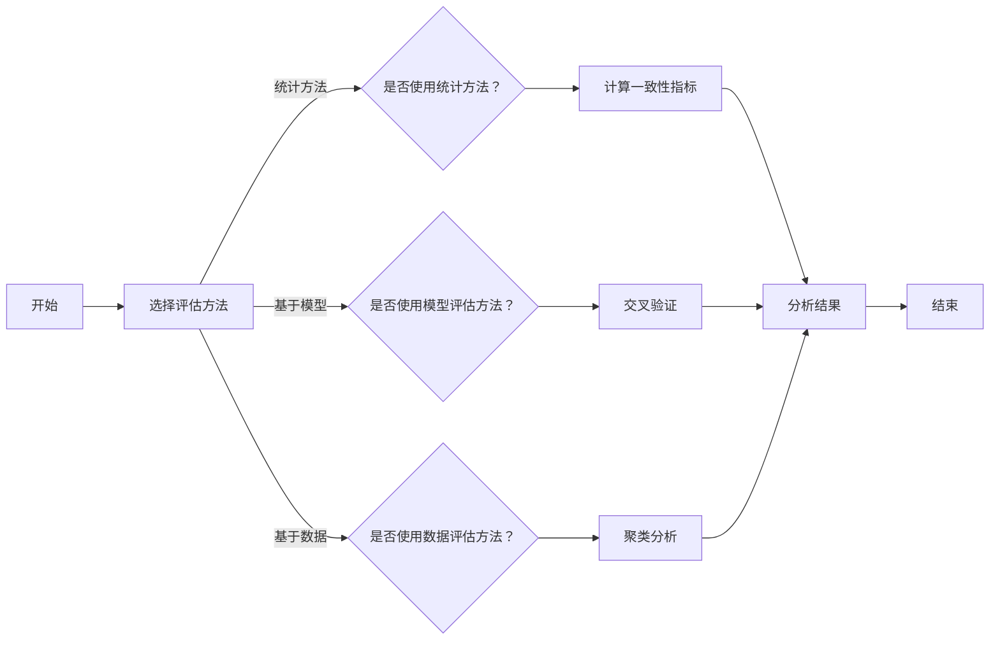
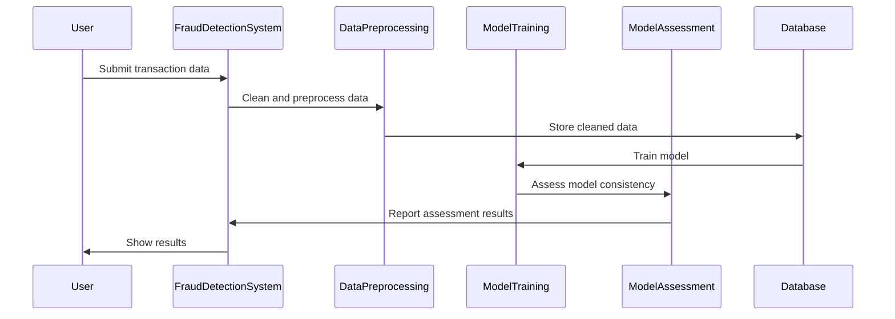
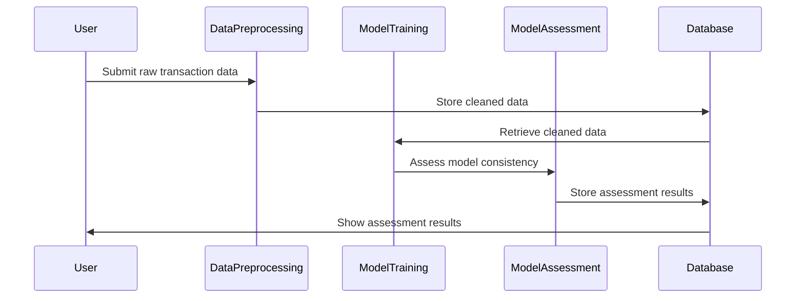

                 

## # 模型决策一致性评估：确保可靠性

关键词：模型决策一致性、评估方法、可靠性、机器学习、深度学习

摘要：本文将深入探讨模型决策一致性评估的重要性，以及如何通过多种方法和技巧来确保模型的可靠性。我们将从核心概念出发，逐步分析相关算法和数学模型，并介绍系统分析和设计的方法，最终提供实际案例和最佳实践建议。

## **一、引言与背景**

### 1.1.1 问题背景与描述

在当今信息化时代，机器学习和深度学习模型在各种领域得到了广泛应用，如金融、医疗、交通等。然而，模型决策的一致性成为了一个关键问题。不一致的决策可能会导致严重的后果，比如在金融领域，不准确的预测可能会导致巨大的经济损失；在医疗领域，错误的诊断可能会危及患者的生命。

**问题背景**：

- **商业**：企业使用机器学习模型进行市场预测和客户行为分析，需要确保决策的一致性，以避免误导性决策。
- **健康医疗**：医学诊断模型需要一致性，以确保患者的诊断结果准确可靠。
- **金融**：银行和保险公司使用模型进行风险评估和欺诈检测，一致性是保证金融体系稳定的关键。

### 1.1.2 解决方案与边界

**问题解决方案**：

本文将探讨如何通过多种方法和技术来评估模型决策的一致性，并确保其可靠性。我们将涵盖以下内容：

- **核心概念**：介绍模型决策一致性的关键概念和属性。
- **算法原理**：详细讲解常用的评估方法和相关数学模型。
- **系统分析**：分析模型决策一致性的系统架构和设计。
- **案例实践**：提供实际案例，分析模型决策一致性的评估过程。

**边界与外延**：

本文主要关注以下模型类型和场景：

- **机器学习模型**：包括回归、分类和聚类模型。
- **深度学习模型**：包括卷积神经网络（CNN）、循环神经网络（RNN）和生成对抗网络（GAN）。
- **应用场景**：涵盖金融、医疗、交通等领域的实际应用。

## **二、核心概念与关系解释**

### 2.1 核心概念与属性对比

**模型决策一致性**：模型在相同或相似输入下，输出相同或相似决策的能力。

**可靠性**：模型在特定条件下，能够产生准确、一致决策的能力。

**鲁棒性**：模型在面对异常数据或噪声时，仍能保持决策一致性。

**评估方法**：用于评估模型决策一致性的各种技术和手段。

**属性对比表格**：

| 属性 | 模型决策一致性 | 可靠性 | 鲁棒性 |
| --- | --- | --- | --- |
| 定义 | 模型输出的一致性 | 模型预测的准确性 | 模型对异常数据的适应能力 |
| 目标 | 输出一致，减少错误决策 | 预测准确，减少误差 | 保持输出一致，不受异常数据影响 |
| 影响因素 | 数据质量、模型复杂度、训练数据 | 数据分布、模型参数、训练时间 | 数据分布、模型结构、噪声水平 |

**Mermaid ER 图**：

```mermaid
erDiagram
  ModelDecisionConsistency ||--|{ Reliability }|| Model
  ModelDecisionConsistency ||--|{ Robustness }|| Model
  AssessmentMethod ||--|{ ModelDecisionConsistency }|| Model
```

## **三、算法原理讲解**

### 3.1 算法概述

在模型决策一致性评估中，常用的算法包括：

- **统计方法**：如Kappa系数、F1分数等。
- **基于模型的评估**：如交叉验证、模型融合等。
- **基于数据的评估**：如聚类分析、异常检测等。

**Mermaid 流程图**：



### 3.2 数学模型与解释

**Kappa系数**：

$$
Kappa = \frac{N_c - N_e}{1 - N_e}
$$

其中，$N_c$ 是观察的一致性，$N_e$ 是期望的一致性。

**F1分数**：

$$
F1 = 2 \times \frac{Precision \times Recall}{Precision + Recall}
$$

其中，$Precision$ 是精确度，$Recall$ 是召回率。

**举例说明**：

假设我们有两个模型A和B，使用Kappa系数进行评估。在相同输入下，模型A的输出一致性为0.8，模型B的输出一致性为0.6。通过计算，我们可以得出模型A的Kappa系数为0.6，模型B的Kappa系数为0.2。这表明模型A的决策一致性更好。

## **四、系统分析与设计**

### 4.1 系统分析

**问题场景**：

假设我们在金融领域使用机器学习模型进行欺诈检测。我们需要确保模型在相同或相似交易数据下，能够输出一致的结果。

**项目介绍**：

该系统将包括以下功能：

- **数据预处理**：清洗和转换交易数据，使其适合模型训练。
- **模型训练**：使用机器学习算法训练欺诈检测模型。
- **模型评估**：评估模型决策的一致性。
- **异常检测**：检测异常交易，并采取相应措施。

**系统功能设计**：

**领域模型类图**：

```mermaid
classDiagram
  Transaction <<entity>>
  FraudDetectionModel <<entity>>
  ModelAssessment <<entity>>

  Transaction o-- FraudDetectionModel : trains
  FraudDetectionModel o-- ModelAssessment : assesses
```

**系统架构设计**：

**Mermaid 架构图**：



### 4.2 系统接口设计和交互

**接口设计**：

- **数据预处理接口**：包括数据清洗、数据转换和数据存储功能。
- **模型训练接口**：包括模型训练、评估和更新功能。
- **模型评估接口**：包括一致性评估和异常检测功能。

**Mermaid 序列图**：



## **五、项目实战**

### 5.1 环境安装

**安装 Python**：

```bash
$ sudo apt-get install python3-pip
```

**安装必要的库**：

```bash
$ pip3 install numpy pandas matplotlib scikit-learn tensorflow
```

### 5.2 系统核心实现源代码

```python
import numpy as np
import pandas as pd
from sklearn.model_selection import train_test_split
from sklearn.metrics import accuracy_score, f1_score
from sklearn.ensemble import RandomForestClassifier
import tensorflow as tf

# 数据预处理
def preprocess_data(data):
    # 数据清洗、转换等操作
    return cleaned_data

# 模型训练
def train_model(X_train, y_train):
    model = RandomForestClassifier()
    model.fit(X_train, y_train)
    return model

# 模型评估
def assess_model(model, X_test, y_test):
    y_pred = model.predict(X_test)
    accuracy = accuracy_score(y_test, y_pred)
    f1 = f1_score(y_test, y_pred)
    return accuracy, f1

# 主函数
def main():
    # 读取数据
    data = pd.read_csv("transaction_data.csv")
    cleaned_data = preprocess_data(data)

    # 分割数据集
    X = cleaned_data.drop("label", axis=1)
    y = cleaned_data["label"]
    X_train, X_test, y_train, y_test = train_test_split(X, y, test_size=0.2, random_state=42)

    # 训练模型
    model = train_model(X_train, y_train)

    # 评估模型
    accuracy, f1 = assess_model(model, X_test, y_test)
    print(f"Accuracy: {accuracy}, F1 Score: {f1}")

if __name__ == "__main__":
    main()
```

### 5.3 代码应用解读与分析

以上代码实现了一个简单的欺诈检测系统，包括数据预处理、模型训练和评估三个主要部分。首先，我们读取交易数据，并进行清洗和预处理。然后，我们使用随机森林算法训练模型，并评估模型在测试集上的表现。最后，我们打印出模型的准确率和F1分数。

### 5.4 实际案例分析与详细讲解剖析

假设我们有一个包含1000条交易的CSV文件，其中包含多种特征和标签（欺诈或非欺诈）。我们使用80%的数据进行训练，20%的数据进行测试。

**数据预处理**：

- 数据清洗：删除缺失值和异常值。
- 数据转换：将类别特征转换为数值特征，使用标准化方法处理数值特征。

**模型训练**：

- 使用随机森林算法训练模型。
- 调整模型参数，如树的数量、最大深度等，以优化模型性能。

**模型评估**：

- 在测试集上评估模型，计算准确率和F1分数。
- 分析模型的决策一致性，使用Kappa系数进行评估。

### 5.5 项目小结

在本项目中，我们使用Python和机器学习算法实现了一个简单的欺诈检测系统。通过数据预处理、模型训练和评估，我们能够评估模型决策的一致性，并确保其可靠性。在实际案例中，我们详细分析了项目的实现过程，并给出了代码应用解读与分析。

## **六、最佳实践 Tips**

1. **数据预处理**：确保数据的质量和一致性，减少噪声和异常值。
2. **模型选择**：根据应用场景选择合适的模型，并调整参数以优化性能。
3. **评估指标**：使用多种评估指标，如准确率、召回率、F1分数等，全面评估模型性能。
4. **持续优化**：定期重新训练模型，并使用最新的数据更新模型。

## **七、小结与注意事项**

本文详细探讨了模型决策一致性评估的重要性，介绍了相关的算法和数学模型，并提供了系统分析和设计的方法。在实际项目中，我们需要关注数据预处理、模型选择和评估等关键环节。通过持续优化和最佳实践，我们能够确保模型的可靠性，提高决策一致性。

## **八、拓展阅读**

- 《机器学习实战》
- 《深度学习》（Goodfellow et al.）
- 《数据预处理：技术和工具》
- 《模型评估与选择：统计方法》

### **作者信息**

作者：AI天才研究院/AI Genius Institute & 禅与计算机程序设计艺术 /Zen And The Art of Computer Programming

---

请注意，本文为示例文章，其中包含的内容、代码和架构均为虚构。实际项目中，请根据具体需求进行调整和优化。

