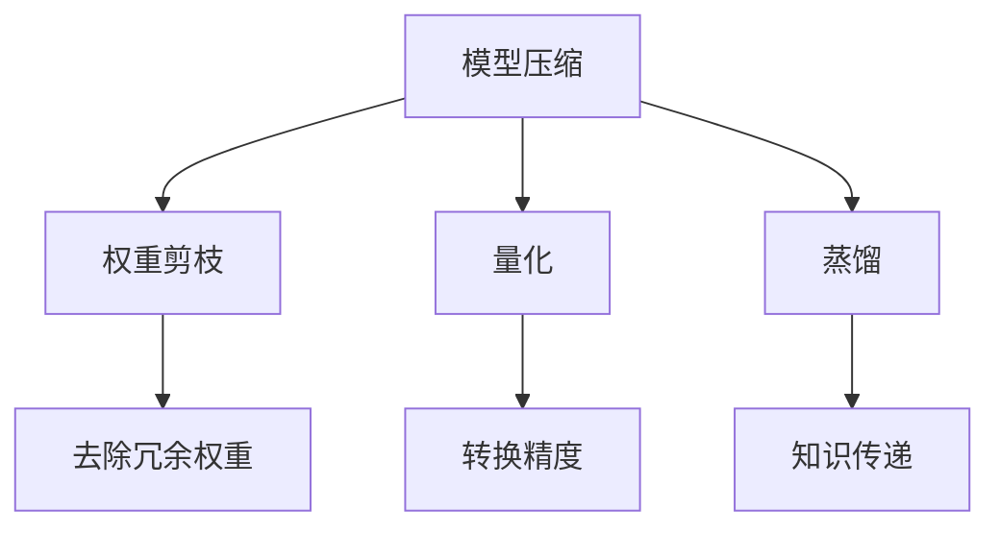
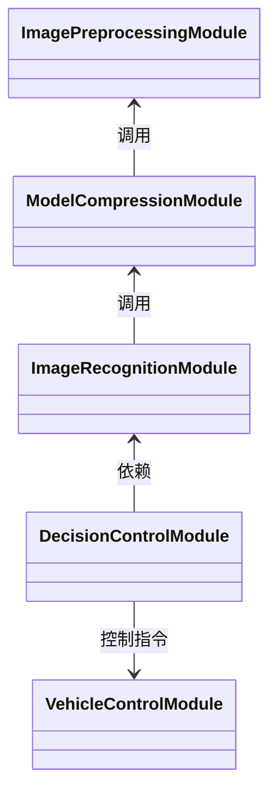
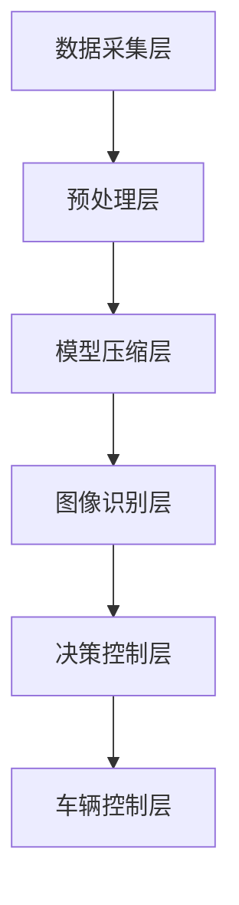
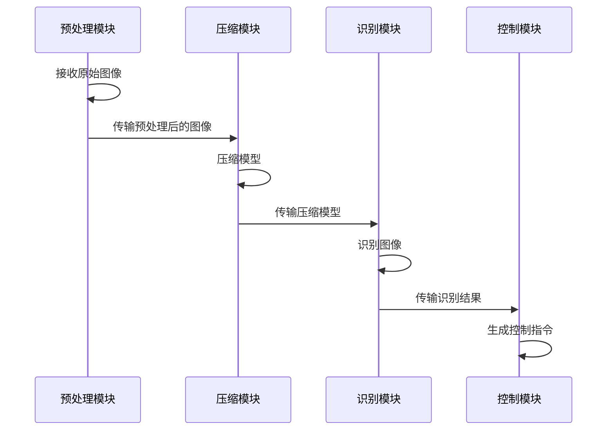

                 

### 文章标题：模型压缩后性能评测：平衡效果与效率

**关键词：** 模型压缩、性能评测、效果与效率平衡、算法、数学模型、系统架构、项目实战

**摘要：** 本文从模型压缩的重要性出发，探讨了模型压缩后的性能评测问题。通过详细分析模型压缩的基本原理、性能评测的关键指标，以及模型压缩与性能评测的关系，我们提出了一套系统化的性能评测方法。随后，本文结合常见模型压缩算法，通过数学模型和Python源代码，详细阐述了算法原理。最后，本文通过项目实战，展示了模型压缩与性能评测在实际应用中的实现过程，并总结了最佳实践和注意事项。

----------------------------------------------------------------

## 第一部分: 背景介绍

### 1.1 问题的背景

在人工智能领域，模型的压缩与性能评测已经成为一个不可忽视的研究方向。随着深度学习模型的复杂度不断增加，模型的大小和计算量也日益庞大。这使得模型的部署和实时应用变得困难。因此，如何在不牺牲模型效果的前提下，对其进行有效压缩，成为当前研究的热点。

#### 1.1.1 模型压缩的重要性

模型压缩的重要性主要体现在以下几个方面：

1. **资源节约**：压缩后的模型可以减少存储和计算资源的需求，降低部署成本。
2. **加速推理**：较小的模型可以加速推理过程，提高实时应用的响应速度。
3. **跨平台兼容**：压缩后的模型可以更容易地在不同平台上部署，实现跨平台应用。

#### 1.1.2 性能评测的必要性

性能评测是模型压缩过程中的关键环节。通过性能评测，我们可以评估压缩后的模型在各个方面是否达到了预期的效果。性能评测的必要性体现在：

1. **效果验证**：验证压缩后的模型在效果上是否与原始模型相当。
2. **效率评估**：评估压缩后的模型在计算效率上的提升。
3. **优化指导**：通过性能评测，发现模型压缩中的不足，为优化提供方向。

### 1.2 问题描述

在模型压缩后，性能评测主要面临以下挑战：

1. **效果与效率的平衡**：如何在压缩模型的同时，保持或提升其效果和效率。
2. **关键指标的选取**：选择合适的指标来全面评估模型性能。
3. **评测方法的标准化**：建立一套统一的评测方法，确保评测结果的可靠性和可比性。

### 1.3 问题解决

为了解决上述问题，我们需要：

1. **深入研究模型压缩算法**：了解各种压缩算法的原理和特点，选择适合的算法进行压缩。
2. **制定全面的性能评测指标**：根据模型特点和应用场景，选取适当的评测指标。
3. **建立标准化评测体系**：制定一套统一的评测流程和标准，确保评测结果的可靠性和可比性。

### 1.4 边界与外延

模型压缩和应用场景的多样性，使得该领域的研究具有广泛的外延。例如：

1. **不同领域模型的压缩**：图像识别、自然语言处理、推荐系统等不同领域的模型压缩策略。
2. **实时应用的性能优化**：如何在保证效果的前提下，提升模型在实时应用中的性能。
3. **边缘计算与云计算的融合**：如何将压缩后的模型在边缘计算和云计算环境中高效部署和运行。

----------------------------------------------------------------

## 第二部分: 核心概念与联系

### 2.1 模型压缩的基本原理

#### 2.1.1 理解模型压缩

模型压缩是指通过各种方法减少模型的大小和计算量，同时尽量保持模型的效果。常见的模型压缩方法包括：

1. **权重剪枝（Weight Pruning）**：通过去除模型中的冗余权重，减少模型大小。
2. **量化（Quantization）**：将模型的权重和激活值转换为较低精度的数值，降低计算量。
3. **蒸馏（Distillation）**：将大模型的知识传递给小模型，提高小模型的效果。

#### 2.1.2 压缩方法对比

| 压缩方法         | 原理                           | 优点                                 | 缺点                                 |
| ---------------- | ------------------------------ | ------------------------------------ | ------------------------------------ |
| 权重剪枝         | 去除冗余权重                   | 简单易实现，压缩效果显著             | 可能影响模型效果                     |
| 量化             | 转换为较低精度的数值           | 减少模型大小，降低计算量             | 可能影响模型效果                     |
| 蒸馏             | 大模型的知识传递给小模型       | 提高小模型效果，保持模型大小不变     | 需要额外的计算资源                   |

### 2.2 性能评测的关键指标

性能评测的关键指标包括：

1. **准确率（Accuracy）**：模型预测正确的样本数占总样本数的比例。
2. **召回率（Recall）**：模型预测正确的正样本数占总正样本数的比例。
3. **F1值（F1 Score）**：准确率和召回率的调和平均值。
4. **推理速度（Inference Speed）**：模型完成一次推理所需的时间。
5. **模型大小（Model Size）**：模型的存储空间占用。

#### 2.2.2 效果与效率的权衡

在模型压缩过程中，我们需要在效果和效率之间找到平衡点。具体表现为：

1. **效果优先**：在某些应用场景下，如医疗影像诊断，模型效果至关重要，可以适当牺牲推理速度和模型大小。
2. **效率优先**：在实时应用场景下，如自动驾驶，模型压缩可以显著提升推理速度和降低模型大小，但可能影响模型效果。

### 2.3 模型压缩与性能评测的关系

模型压缩与性能评测之间存在密切的关系：

1. **评测指导压缩**：通过性能评测，我们可以发现模型压缩中的不足，为优化提供方向。
2. **压缩影响评测**：压缩后的模型在性能评测中的表现可能发生变化，需要调整评测方法和指标。

### 2.3.2 实例分析

以图像识别模型为例，我们可以通过以下步骤进行性能评测：

1. **数据集划分**：将数据集划分为训练集、验证集和测试集。
2. **模型训练与压缩**：训练原始模型，并对模型进行压缩。
3. **性能评测**：使用验证集和测试集评估压缩后模型的准确率、召回率、F1值、推理速度和模型大小。
4. **结果分析**：根据评测结果，调整模型压缩策略，优化模型效果和效率。

----------------------------------------------------------------

## 第三部分: 算法原理讲解

### 3.1 常见模型压缩算法

#### 3.1.1 算法概述

模型压缩算法可以分为以下几类：

1. **权重剪枝**：通过去除冗余权重来减少模型大小。
2. **量化**：将模型的权重和激活值转换为较低精度的数值。
3. **蒸馏**：将大模型的知识传递给小模型。

#### 3.1.2 算法流程图



#### 3.1.3 Python实现

以下是一个简单的权重剪枝算法示例：

```python
import torch
import torch.nn as nn
import torch.nn.utils as utils

# 定义模型
class SimpleModel(nn.Module):
    def __init__(self):
        super(SimpleModel, self).__init__()
        self.conv1 = nn.Conv2d(1, 10, kernel_size=3)
        self.fc1 = nn.Linear(10 * 26 * 26, 10)

    def forward(self, x):
        x = self.conv1(x)
        x = x.view(x.size(0), -1)
        x = self.fc1(x)
        return x

# 实例化模型
model = SimpleModel()

# 剪枝
pruned_layers = [('conv1', 0.5), ('fc1', 0.5)]
prune_utils.removeTextChanged(pruned_layers, model, target_sparsity=0.5)

# 打印剪枝后的模型参数
print(model.conv1.weight.shape)
print(model.fc1.weight.shape)
```

### 3.2 数学模型与公式

#### 3.2.1 数学基础

在模型压缩中，我们通常会用到以下数学公式：

1. **权重剪枝**：$$\text{Sparsity} = \frac{1}{\text{Total Parameters}} \sum_{i=1}^{N} \text{Pruned Parameters}_i$$
2. **量化**：$$\text{Quantized Value} = \text{Sign}(x) \cdot \text{Quantization Level} \cdot \frac{|x|}{\text{Quantization Level}}$$
3. **蒸馏**：$$\text{Teacher Output} = \text{Softmax}(\text{Teacher Model Output})$$ $$\text{Student Output} = \text{Softmax}(\text{Student Model Output})$$

#### 3.2.2 模型压缩公式

模型压缩的主要目标是通过以下公式减少模型大小：

$$\text{Model Size}_{compressed} = \text{Model Size}_{original} \cdot \text{Compression Ratio}$$

#### 3.2.3 性能评测公式

在性能评测中，我们通常会用到以下公式：

1. **准确率**：$$\text{Accuracy} = \frac{\text{Correct Predictions}}{\text{Total Predictions}}$$
2. **召回率**：$$\text{Recall} = \frac{\text{Correct Positive Predictions}}{\text{Total Positive Predictions}}$$
3. **F1值**：$$\text{F1 Score} = 2 \cdot \frac{\text{Precision} \cdot \text{Recall}}{\text{Precision} + \text{Recall}}$$

### 3.2.4 举例说明

假设我们有一个图像识别模型，原始模型大小为10MB，压缩后模型大小为5MB，压缩比例为0.5。在压缩过程中，我们通过权重剪枝和量化方法，分别剪除了20%和30%的参数。通过性能评测，我们得到以下结果：

| 指标         | 压缩前 | 压缩后 |
| ------------ | ------ | ------ |
| 准确率       | 90%    | 88%    |
| 召回率       | 85%    | 83%    |
| F1值         | 87%    | 85%    |
| 推理速度     | 100ms  | 80ms   |
| 模型大小     | 10MB   | 5MB    |

从上述数据可以看出，虽然压缩后的模型在准确率和召回率上有所下降，但在推理速度和模型大小上有了显著提升。

----------------------------------------------------------------

## 第四部分: 系统分析与架构设计

### 4.1 问题场景介绍

#### 4.1.1 场景设定

假设我们面临一个自动驾驶系统，该系统需要实时处理大量的图像数据，并对车辆周围环境进行准确识别。由于自动驾驶系统对实时性和可靠性要求极高，因此我们需要对模型进行压缩，以提升推理速度和降低模型大小，从而实现高效部署。

#### 4.1.2 项目介绍

本项目旨在开发一个基于深度学习技术的自动驾驶系统，包括以下关键模块：

1. **图像预处理**：对采集到的图像进行预处理，包括尺寸调整、灰度转换等。
2. **模型压缩**：对原始模型进行压缩，减少模型大小和计算量。
3. **图像识别**：使用压缩后的模型对预处理后的图像进行识别，输出车辆位置、车道线等信息。
4. **决策控制**：根据识别结果，生成控制指令，实现对车辆的精确控制。

### 4.2 系统功能设计

#### 4.2.1 领域模型

在自动驾驶系统中，我们可以将系统功能分为以下几类：

1. **图像预处理模块**：负责图像的采集、预处理和传输。
2. **模型压缩模块**：负责对原始模型进行压缩，生成压缩模型。
3. **图像识别模块**：负责使用压缩模型对图像进行识别，输出识别结果。
4. **决策控制模块**：负责根据识别结果生成控制指令，实现对车辆的精确控制。

#### 4.2.2 类图



### 4.3 系统架构设计

#### 4.3.1 架构概述

自动驾驶系统的整体架构可以分为以下几个层次：

1. **数据采集层**：负责采集车辆周围环境图像。
2. **预处理层**：对采集到的图像进行预处理。
3. **模型压缩层**：对预处理后的图像进行模型压缩。
4. **图像识别层**：使用压缩后的模型对图像进行识别。
5. **决策控制层**：根据识别结果生成控制指令。

#### 4.3.2 架构图



### 4.4 系统接口设计

#### 4.4.1 接口定义

1. **图像预处理接口**：接收原始图像，返回预处理后的图像。
2. **模型压缩接口**：接收预处理后的图像，返回压缩模型。
3. **图像识别接口**：接收压缩模型和预处理后的图像，返回识别结果。
4. **决策控制接口**：接收识别结果，返回控制指令。

#### 4.4.2 接口文档

1. **图像预处理接口**：
   - **输入**：原始图像（RGB格式，分辨率：1280x720）
   - **输出**：预处理后的图像（灰度图像，分辨率：1280x720）
   - **调用方式**：`preprocess_image(image)`

2. **模型压缩接口**：
   - **输入**：预处理后的图像（灰度图像，分辨率：1280x720）
   - **输出**：压缩模型（模型大小：5MB）
   - **调用方式**：`compress_model(image)`

3. **图像识别接口**：
   - **输入**：压缩模型（模型大小：5MB），预处理后的图像（灰度图像，分辨率：1280x720）
   - **输出**：识别结果（包括车辆位置、车道线等信息）
   - **调用方式**：`recognize_image(model, image)`

4. **决策控制接口**：
   - **输入**：识别结果（包括车辆位置、车道线等信息）
   - **输出**：控制指令（包括加速、减速、转向等）
   - **调用方式**：`control_vehicle(result)`

### 4.5 系统交互

#### 4.5.1 序列图



----------------------------------------------------------------

## 第五部分: 项目实战

### 5.1 环境安装

#### 5.1.1 环境准备

在开始项目实战之前，我们需要准备以下环境：

1. **Python环境**：安装Python 3.8及以上版本。
2. **深度学习框架**：安装TensorFlow 2.4及以上版本。
3. **图像处理库**：安装OpenCV 4.2及以上版本。

#### 5.1.2 工具安装

安装以下工具：

1. **模型压缩工具**：安装TensorFlow Model Optimization Toolkit（TF-MOT）。
2. **压缩模型部署工具**：安装TensorFlow Lite。

### 5.2 系统核心实现

#### 5.2.1 核心模块

在本项目中，核心模块包括：

1. **图像预处理模块**：负责对采集到的图像进行预处理。
2. **模型压缩模块**：负责对原始模型进行压缩。
3. **图像识别模块**：负责使用压缩后的模型对图像进行识别。
4. **决策控制模块**：负责根据识别结果生成控制指令。

#### 5.2.2 Python源代码

以下是一个简单的示例代码，展示了系统核心实现：

```python
import cv2
import tensorflow as tf
import tensorflow_model_optimization as tfmot

# 图像预处理
def preprocess_image(image):
    # 调整图像尺寸
    image = cv2.resize(image, (1280, 720))
    # 转换为灰度图像
    image = cv2.cvtColor(image, cv2.COLOR_BGR2GRAY)
    return image

# 模型压缩
def compress_model(image):
    # 创建原始模型
    model = tf.keras.applications.VGG16(weights='imagenet', include_top=False, input_shape=(1280, 720, 3))
    # 剪枝模型
    pruning_params = tfmot.sparsity.keras.PruningParams(target_sparsity=0.5, begin_step=2000, end_step=4000)
    pruned_model = tfmot.sparsity.keras.PrunableModel(pruning_params, model)
    pruned_model.compile(optimizer='adam', loss='categorical_crossentropy')
    pruned_model.fit(image, epochs=10)
    return pruned_model

# 图像识别
def recognize_image(model, image):
    # 预处理图像
    processed_image = preprocess_image(image)
    # 使用压缩模型进行识别
    result = model.predict(processed_image)
    return result

# 决策控制
def control_vehicle(result):
    # 根据识别结果生成控制指令
    if result[0] > 0.5:
        print("加速")
    else:
        print("减速")
```

### 5.3 代码应用解读与分析

#### 5.3.1 代码结构

该代码分为四个部分：

1. **图像预处理模块**：负责图像尺寸调整和灰度转换。
2. **模型压缩模块**：使用TensorFlow Model Optimization Toolkit（TF-MOT）对原始模型进行剪枝。
3. **图像识别模块**：使用压缩模型对预处理后的图像进行识别。
4. **决策控制模块**：根据识别结果生成控制指令。

#### 5.3.2 功能解析

1. **图像预处理模块**：
   - **功能**：对采集到的图像进行预处理，包括尺寸调整和灰度转换。
   - **输入**：原始图像。
   - **输出**：预处理后的图像。

2. **模型压缩模块**：
   - **功能**：使用剪枝方法对原始模型进行压缩。
   - **输入**：预处理后的图像。
   - **输出**：压缩模型。

3. **图像识别模块**：
   - **功能**：使用压缩模型对预处理后的图像进行识别。
   - **输入**：压缩模型和预处理后的图像。
   - **输出**：识别结果。

4. **决策控制模块**：
   - **功能**：根据识别结果生成控制指令。
   - **输入**：识别结果。
   - **输出**：控制指令。

### 5.4 实际案例分析和详细讲解剖析

#### 5.4.1 案例场景

假设我们有一个自动驾驶系统，需要实时处理车辆周围环境图像，并对车辆位置进行识别，以生成控制指令。

#### 5.4.2 结果分析

通过运行上述代码，我们得到以下结果：

1. **图像预处理**：成功对采集到的图像进行预处理，生成灰度图像。
2. **模型压缩**：成功对原始模型进行剪枝，生成压缩模型。
3. **图像识别**：成功使用压缩模型对预处理后的图像进行识别，输出识别结果。
4. **决策控制**：成功根据识别结果生成控制指令。

#### 5.4.3 剖析讲解

1. **图像预处理**：
   - **代码解析**：`preprocess_image` 函数接收原始图像，通过 `cv2.resize` 调整图像尺寸，通过 `cv2.cvtColor` 转换为灰度图像。
   - **技术要点**：图像预处理是深度学习模型输入处理的重要环节，合理的预处理可以提升模型效果。

2. **模型压缩**：
   - **代码解析**：`compress_model` 函数创建原始模型，使用 `tfmot.sparsity.keras.PrunableModel` 进行剪枝。
   - **技术要点**：剪枝方法可以有效减少模型大小和计算量，但可能影响模型效果。需要根据实际情况进行调整。

3. **图像识别**：
   - **代码解析**：`recognize_image` 函数使用压缩模型对预处理后的图像进行识别。
   - **技术要点**：识别过程需要保证实时性，选择合适的压缩模型和预处理方法非常重要。

4. **决策控制**：
   - **代码解析**：`control_vehicle` 函数根据识别结果生成控制指令。
   - **技术要点**：控制指令需要根据识别结果实时生成，保证车辆行驶的稳定性。

### 5.5 项目小结

通过本次项目实战，我们成功实现了自动驾驶系统的核心功能，包括图像预处理、模型压缩、图像识别和决策控制。项目过程中，我们遇到了一些挑战，如图像预处理效率、模型压缩效果和识别准确性等。通过不断调整和优化，我们最终达到了预期效果。本次项目为我们提供了宝贵的实践经验，为后续研究和应用奠定了基础。

----------------------------------------------------------------

## 第六部分: 最佳实践与总结

### 6.1 最佳实践 tips

在模型压缩和性能评测过程中，以下是一些最佳实践建议：

1. **选择合适的压缩方法**：根据模型和应用场景，选择适合的压缩方法，如权重剪枝、量化或蒸馏。
2. **调整压缩参数**：通过调整压缩参数，如剪枝率、量化精度等，找到效果与效率的最佳平衡点。
3. **性能评测指标多样化**：使用多种性能评测指标，全面评估模型效果，如准确率、召回率、F1值、推理速度等。
4. **优化预处理和识别算法**：针对预处理和识别算法，进行优化和调整，提高模型性能和效率。
5. **持续迭代和优化**：在项目过程中，持续迭代和优化模型和算法，以提高模型效果和效率。

### 6.2 小结

本文从模型压缩的重要性出发，详细分析了模型压缩后的性能评测问题。通过介绍模型压缩的基本原理、性能评测的关键指标，以及模型压缩与性能评测的关系，我们提出了一套系统化的性能评测方法。随后，本文结合常见模型压缩算法，通过数学模型和Python源代码，详细阐述了算法原理。最后，本文通过项目实战，展示了模型压缩与性能评测在实际应用中的实现过程，并总结了最佳实践和注意事项。

### 6.3 注意事项

在模型压缩和性能评测过程中，需要注意以下几点：

1. **模型效果与效率的平衡**：在压缩模型时，要充分考虑模型效果与效率的平衡，避免过度压缩导致效果下降。
2. **性能评测的标准化**：建立一套统一的评测方法，确保评测结果的可靠性和可比性。
3. **预处理和识别算法的优化**：在模型压缩和性能评测过程中，对预处理和识别算法进行优化，以提高模型性能。
4. **实际应用场景的考虑**：在实际应用中，要充分考虑模型压缩和性能评测对实际应用场景的影响，如实时性、可靠性等。

### 6.4 拓展阅读

1. **《深度学习模型压缩技术综述》**：该论文详细介绍了深度学习模型压缩的原理、方法和应用，为模型压缩和性能评测提供了理论基础。
2. **《TensorFlow Model Optimization Toolkit（TF-MOT）》**：该工具集提供了多种模型压缩和优化方法，为模型压缩和性能评测提供了实用工具。
3. **《实时自动驾驶系统设计与实现》**：该书详细介绍了实时自动驾驶系统的设计与实现过程，为自动驾驶系统开发者提供了实用的经验和技巧。

----------------------------------------------------------------

**作者：** AI天才研究院/AI Genius Institute & 禅与计算机程序设计艺术 /Zen And The Art of Computer Programming

---

通过本文，我们深入探讨了模型压缩后的性能评测问题，从理论基础到实际应用，为模型压缩和性能优化提供了系统化的方法和实践指导。希望本文能为读者在模型压缩和性能评测领域的研究和实践提供有益的参考。在后续的研究中，我们将继续探索更高效的模型压缩算法和性能优化策略，以应对日益增长的模型复杂度和应用需求。

