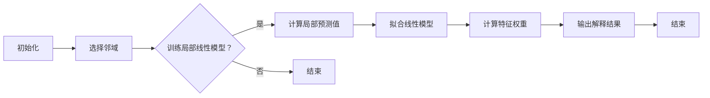
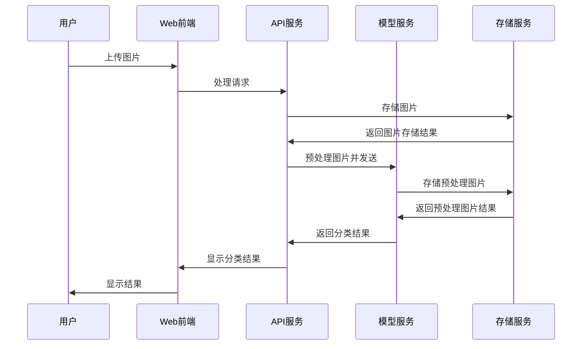

                 

### 第1章：问题背景与重要性

在当今快速发展的信息技术时代，人工智能（AI）技术已逐渐成为各行各业的重要驱动力。从自动驾驶汽车到个性化医疗诊断，从智能客服系统到金融风险评估，AI技术正深刻地改变着我们的生活方式和工作模式。然而，随着AI技术的广泛应用，随之而来的一系列问题也日益凸显，其中之一便是模型可审核性。

**问题背景**

模型可审核性指的是确保AI模型在开发、部署和运维过程中，其行为和决策过程是可理解、可追溯和可验证的。这意味着，任何利益相关方（如开发者、用户、监管机构等）都可以对模型的决策逻辑进行审查，以确保其符合法规要求、道德标准和技术规范。

近年来，由于AI模型的黑箱特性，其决策过程往往难以被外界理解和信任。例如，一个自动驾驶系统的决策过程可能是基于复杂的深度学习模型，但如果没有足够的透明性，用户和监管机构可能无法确认系统是否遵守了交通规则、是否能够有效地处理紧急情况。

**问题描述**

模型可审核性的问题主要体现在以下几个方面：

1. **合规性问题**：某些行业（如金融、医疗、法律等）对数据隐私和合规性有严格的要求。如果AI模型的决策过程不透明，可能会导致违规行为。

2. **伦理问题**：AI模型在决策过程中可能涉及到伦理问题，如歧视、偏见等。如果模型的行为不可审核，这些问题就很难被发现和纠正。

3. **技术问题**：复杂AI模型的可解释性较差，使得开发者难以理解其内部机制，从而难以进行有效的调试和维护。

4. **法律问题**：随着AI技术在司法领域的应用增加，如何确保AI模型的决策过程符合法律要求成为一个重要议题。

**问题解决**

解决模型可审核性问题需要从多个层面入手：

1. **提高算法透明性**：开发可解释性强的AI算法，使得模型的决策过程可以被外部理解和验证。

2. **数据隐私保护**：在模型训练和部署过程中，采用隐私保护技术，如差分隐私、联邦学习等，确保数据隐私不受侵犯。

3. **合规性审查**：建立严格的合规性审查机制，确保模型在开发、部署和运维过程中符合相关法规要求。

4. **伦理和法律指导**：制定明确的伦理和法律指导原则，为AI模型的开发和部署提供参考。

**边界与外延**

模型可审核性不仅涉及技术层面，还涉及法律、伦理和社会等多个层面。因此，其边界和范围相对广泛，包括：

- **技术实现层面**：算法设计、模型训练、模型评估等。
- **法律合规层面**：涉及数据保护法、隐私法、消费者权益保护法等。
- **伦理层面**：涉及公平性、透明性、隐私保护、社会影响等。

**核心概念：模型可审核性、合规性、透明性**

- **模型可审核性**：确保模型的决策过程可以被外部理解和验证。
- **合规性**：模型在开发、部署和运维过程中符合相关法规要求。
- **透明性**：模型的行为和决策过程对内外部用户都是可见的。

通过上述分析，我们可以看到，模型可审核性是一个复杂但至关重要的议题。在接下来的章节中，我们将深入探讨模型可审核性的核心概念、相关算法原理、系统架构设计以及项目实战经验，以期为大家提供全面的技术指南。### 第2章：模型可审核性概述

**模型可审核性的定义**

模型可审核性是指对AI模型的开发、部署、运行和维护过程中的各个环节进行审查和验证，以确保其符合法规、伦理和技术标准。具体来说，它包括了对模型的输入数据、训练过程、模型参数、预测结果、决策路径等各方面的透明性和可解释性。

**模型可审核性的必要性**

随着AI技术的广泛应用，模型可审核性的必要性日益凸显。以下是几个关键原因：

1. **法律合规**：许多行业（如金融、医疗、交通等）对数据隐私和合规性有严格要求。如果AI模型的决策过程不透明，可能会导致法律纠纷和数据泄露。

2. **用户信任**：用户对AI系统的信任程度与其透明性密切相关。如果用户无法理解模型的决策逻辑，可能会对其产生疑虑，从而影响系统的接受度和使用率。

3. **技术优化**：透明性使得开发者可以更好地理解和优化模型，从而提高其性能和可靠性。

4. **伦理监督**：AI模型可能会涉及到伦理问题，如歧视、偏见等。只有通过审核，才能确保模型的行为符合社会道德标准。

**模型可审核性的目标**

模型可审核性的目标主要包括以下几个方面：

1. **可解释性**：使得模型的决策路径和逻辑可以被外部用户理解。

2. **可追溯性**：确保模型的所有行为都可以被记录和追踪。

3. **可验证性**：通过审计和测试，确保模型的行为符合预期和法规要求。

4. **可维护性**：提高模型的维护性和可升级性，以便在发现问题时能够快速修复。

**模型可审核性的范围**

模型可审核性的范围非常广泛，涉及多个环节和层次。以下是几个关键领域：

1. **数据预处理**：包括数据清洗、归一化、缺失值处理等，这些操作会影响模型的输入质量。

2. **模型训练**：包括训练数据的选取、训练算法的选择、超参数的调整等。

3. **模型评估**：包括模型性能的评估、误差分析、模型稳定性和鲁棒性测试等。

4. **模型部署**：包括模型部署的环境、接口设计、实时监控等。

5. **模型维护**：包括模型的更新、修复、优化等。

**模型可审核性的挑战**

尽管模型可审核性至关重要，但在实际操作中仍然面临诸多挑战：

1. **技术挑战**：复杂的模型（如深度神经网络）通常难以解释，使得审核变得复杂。

2. **数据隐私**：在保证数据隐私的同时，确保模型的可审核性是一个技术难题。

3. **资源消耗**：模型审核通常需要大量的计算资源和时间。

4. **监管标准**：不同地区和行业的监管标准可能不同，使得模型可审核性的实现具有挑战性。

5. **用户理解**：如何让非技术背景的用户理解模型的决策逻辑，也是一个难题。

总之，模型可审核性是一个复杂且多维的议题，涉及技术、法律、伦理等多个层面。在接下来的章节中，我们将进一步探讨模型可审核性的核心概念、相关算法原理、系统架构设计以及项目实战经验，以期为大家提供更深入的洞察和实用的指南。### 第3章：核心概念解析

在讨论模型可审核性时，我们不仅需要理解其定义和重要性，还需深入探讨与之相关的核心概念，如数据隐私、算法透明性、伦理和法律合规。这些概念在模型可审核性中起着至关重要的作用，并且相互之间存在着紧密的联系。

**模型可审核性与数据隐私**

数据隐私是AI模型开发和应用中不可忽视的重要问题。在保证模型可审核性的同时，我们必须确保数据的隐私性不受侵犯。数据隐私涉及数据的收集、存储、处理和传输过程中的隐私保护措施。在模型训练和部署过程中，采用差分隐私、联邦学习等技术，可以在不泄露具体个体信息的情况下，确保模型的有效性和数据隐私。

**模型可审核性与算法透明性**

算法透明性是模型可审核性的基础。一个透明的算法允许外部用户了解模型的决策过程，从而对模型进行审查和验证。算法透明性包括模型的结构、参数、训练过程和预测结果的解释。高透明性的算法有助于提高用户对AI系统的信任，同时也有利于开发者在模型开发过程中进行调试和优化。

**模型可审核性与伦理**

伦理是AI模型开发和部署中必须考虑的另一个核心概念。AI技术的应用可能会涉及到伦理问题，如歧视、偏见和不公平性。模型可审核性能够帮助识别和解决这些问题，确保模型的行为符合道德标准。通过审核，可以发现模型中的偏见，并采取相应的措施进行修正，从而避免对某些群体造成不公平对待。

**模型可审核性与法律合规**

法律合规是确保AI模型合法性的重要保障。不同国家和地区有不同的法律法规，涉及数据保护、隐私权和消费者权益等。模型可审核性能够帮助开发者确保模型在开发、部署和维护过程中符合相关法律要求，从而避免法律纠纷和处罚。

**概念属性特征对比**

为了更直观地理解这些核心概念，我们可以通过一个表格来对比它们的属性特征：

| 特征         | 模型可审核性 | 数据隐私 | 算法透明性 | 伦理 | 法律合规 |
|--------------|--------------|----------|------------|------|----------|
| **定义**     | 审查和验证模型行为 | 保护数据隐私 | 了解模型决策过程 | 伦理标准 | 法律要求 |
| **目标**     | 提高模型透明性、可追溯性和可验证性 | 防止数据泄露、滥用 | 提高用户信任、优化模型 | 避免歧视、偏见 | 确保合法性 |
| **应用领域** | 开发、部署、维护 | 收集、存储、处理、传输 | 模型设计、评估 | AI应用伦理问题 | 法律监管 |
| **挑战**     | 技术难度、数据隐私、资源消耗 | 技术实现、法律合规 | 解释复杂性、用户理解 | 伦理困境、文化差异 | 监管标准差异 |

**ER实体关系图架构**

为了更好地理解这些核心概念之间的联系，我们可以通过ER（实体-关系）图来展示它们之间的关系。以下是模型可审核性相关实体的ER图：

```mermaid
erDiagram
    ModelApplicability <<|-- DataPrivacy
    ModelApplicability ||-- AlgorithmTransparency
    ModelApplicability ||-- Ethics
    ModelApplicability ||-- LegalCompliance
    DataPrivacy ||-- DataProtection
    AlgorithmTransparency ||-- ModelExplanation
    Ethics ||-- EthicalGuidelines
    LegalCompliance ||-- ComplianceRequirements
```

在这个ER图中，`ModelApplicability`代表了模型可审核性的核心概念，它与`DataPrivacy`、`AlgorithmTransparency`、`Ethics`和`LegalCompliance`之间存在关联。每个相关概念还与特定的子概念（如`DataProtection`、`ModelExplanation`、`EthicalGuidelines`和`ComplianceRequirements`）相联系，从而构成了一个完整的模型可审核性架构。

通过上述分析，我们可以看到，模型可审核性不仅仅是技术问题，还涉及到数据隐私、算法透明性、伦理和法律合规等多个层面。理解这些核心概念及其相互关系，对于确保AI模型的合法性和可接受性至关重要。在接下来的章节中，我们将进一步探讨模型可审核性的算法原理，并通过具体实例进行讲解。### 第4章：概念属性特征对比

在深入理解模型可审核性的核心概念之后，我们需要进一步对比这些概念之间的属性特征，以便更全面地掌握它们在实际应用中的表现和相互关系。以下是模型可审核性、算法透明性、伦理和法律合规四个核心概念的属性特征对比表格：

| **概念**       | **定义**                                            | **目标**                                                      | **应用领域**                             | **挑战**                                                         |
|----------------|-----------------------------------------------------|--------------------------------------------------------------|-----------------------------------------|----------------------------------------------------------------|
| 模型可审核性   | 确保AI模型的决策过程可以被外部理解和验证             | 提高模型的透明性、可追溯性和可验证性                         | 开发、部署、维护                         | 技术难度、数据隐私、资源消耗                                     |
| 算法透明性   | 使模型的决策过程对用户和开发者是可见和可理解的         | 提高用户信任、优化模型                                       | 模型设计、评估                           | 解释复杂性、用户理解                                             |
| 伦理         | 确保AI模型的行为符合道德和社会标准                  | 避免歧视、偏见、不公平对待                                   | AI应用伦理问题                           | 伦理困境、文化差异                                             |
| 法律合规       | 确保AI模型在开发、部署和维护过程中符合相关法律法规   | 确保合法性、避免法律纠纷和处罚                               | 法律监管                                 | 法律标准差异、监管标准差异                                       |

**表格说明：**

- **定义**：每个概念的基本定义，帮助读者快速了解其核心含义。
- **目标**：每个概念在应用中希望实现的目标或效果。
- **应用领域**：每个概念主要应用的具体场景或领域。
- **挑战**：在实现每个概念过程中可能遇到的困难和问题。

通过这个对比表格，我们可以更清晰地看到模型可审核性、算法透明性、伦理和法律合规之间的差异和联系。这些属性特征对比不仅有助于我们深入理解这些核心概念，也为我们在实际项目中应用这些概念提供了指导。

接下来，我们将通过ER实体关系图来进一步展示这些概念之间的相互关系。这有助于我们构建一个更全面的理解框架，以便在实际应用中有效地整合和管理这些概念。### 第5章：ER实体关系图架构

为了更好地理解和展示模型可审核性相关的各个实体及其相互关系，我们使用Mermaid语言绘制一个ER（实体-关系）图。以下是一个简化的ER图，其中包含了与模型可审核性相关的主要实体及其关系：

```mermaid
erDiagram
    Model <<-- Auditor
    Model ||-- Compliance
    Model ||-- Transparency
    Model ||-- Ethics
    Model ||-- Data
    Auditor ||-- Report
    Compliance ||-- Rule
    Transparency ||-- Explanation
    Ethics ||-- Guideline
    Data ||-- Privacy
```

**ER图解释：**

- **Model（模型）**：中心实体，表示AI模型。它与多个其他实体相连，表示模型在各个方面的关联。
- **Auditor（审计员）**：与模型相连，表示审计员对模型进行审查和验证。审计员生成的报告（Report）也与模型相关。
- **Compliance（合规性）**：与模型相连，表示模型必须遵守的法规和规则（Rule）。合规性是模型可审核性的一个重要方面。
- **Transparency（透明性）**：与模型相连，表示模型的可解释性（Explanation）。透明性确保模型决策过程可以被用户和开发者理解。
- **Ethics（伦理）**：与模型相连，表示模型必须遵循的伦理准则（Guideline）。伦理是确保模型行为符合道德标准的关键。
- **Data（数据）**：与模型相连，表示模型处理的数据，以及数据隐私（Privacy）的保护要求。

**实体关系解释：**

- **Model与Auditor的关系**：双向箭头（<<--）表示审计员对模型进行审查，同时模型也会受到审计员的反馈。
- **Model与Compliance的关系**：双向箭头（||--）表示模型需要遵守合规性规则，而合规性规则也指导着模型的开发过程。
- **Model与Transparency的关系**：双向箭头（||--）表示模型需要具备透明性，以便其决策过程可以被解释和验证。
- **Model与Ethics的关系**：双向箭头（||--）表示模型在开发和应用过程中需要遵循伦理准则，确保其行为符合道德标准。
- **Model与Data的关系**：双向箭头（||--）表示模型处理数据，并且在处理过程中需要保护数据隐私。

通过这个ER图，我们可以清晰地看到模型可审核性相关的各个实体及其相互关系。这不仅有助于我们理解模型可审核性的各个方面，也为我们在实际项目中管理和实施这些方面提供了直观的框架。在接下来的章节中，我们将进一步探讨模型可审核性的算法原理，并通过具体实例进行讲解。### 第6章：算法原理与数学模型

**算法原理**

模型可审核性的核心在于如何确保AI模型的决策过程可以被外部用户理解。为此，我们需要设计一种算法，使其能够将复杂的模型决策过程转化为易于理解的形式。这一算法的核心思想是可解释性，即将模型的内部机制映射到人类可理解的语言或图像上。

下面，我们将介绍一种基于LIME（Local Interpretable Model-agnostic Explanations）的算法原理。LIME算法的主要思想是通过局部线性化技术，将一个复杂的非线性模型转化为一个局部线性模型，从而使得模型的决策过程可以解释。

**数学模型**

LIME算法的基本步骤如下：

1. **初始化**：给定一个输入数据点\( x \)和一个预测模型\( f \)，选择一个较小的邻域\( \mathcal{N}(x) \)，其中包含与\( x \)相似的数据点。
2. **训练局部线性模型**：在邻域\( \mathcal{N}(x) \)内，使用线性模型拟合原始模型的预测。具体来说，对于每个与\( x \)相似的数据点\( x_i \)，计算其在原始模型中的预测值\( f(x_i) \)，并使用这些预测值训练一个线性模型。
3. **计算解释性**：对于每个特征，计算其在局部线性模型中的权重。这些权重反映了特征对模型预测的影响程度，从而提供了一个对原始模型决策的解释。
4. **输出解释结果**：将解释性结果输出给用户，以便他们可以理解模型的决策过程。

**公式讲解**

LIME算法的数学模型可以表示为以下公式：

\[ L(x) = \sum_{i=1}^{n} w_i \cdot f_l(x_i) \]

其中：

- \( L(x) \) 是输入数据点 \( x \) 的解释性结果。
- \( w_i \) 是特征 \( x_i \) 在局部线性模型中的权重。
- \( f_l(x_i) \) 是局部线性模型在数据点 \( x_i \) 的预测值。

**举例说明**

假设我们有一个简单的线性回归模型，用于预测房价。模型的输入是房子的特征（如面积、房间数等），输出是房价。为了解释模型是如何做出预测的，我们可以使用LIME算法。

1. **初始化**：给定一个输入数据点 \( x \)（例如，一个房子的面积为150平方米，房间数为3个），选择一个较小的邻域。
2. **训练局部线性模型**：在邻域内，对于每个与 \( x \) 相似的数据点，计算模型在这些点的预测值，并使用这些预测值训练一个线性模型。
3. **计算解释性**：计算每个特征在局部线性模型中的权重。例如，如果面积在模型中的权重为0.6，房间数在模型中的权重为0.4，那么这表明面积对房价的影响最大。
4. **输出解释结果**：输出解释性结果，告诉用户模型是如何根据这些特征预测房价的。

通过上述算法和公式的讲解，我们可以看到LIME算法如何将复杂的模型决策过程转化为可解释的形式。这种算法不仅有助于提高模型的透明性，还有助于开发者和用户更好地理解模型的决策逻辑，从而为模型的可审核性提供了有力支持。在接下来的章节中，我们将继续探讨如何在实际项目中应用这些算法原理，并通过具体案例进行说明。### 第7章：算法mermaid流程图

为了更好地理解LIME算法的工作流程，我们可以使用mermaid语言绘制一个流程图。以下是LIME算法的mermaid流程图：



**流程图解释：**

1. **初始化**：首先，我们初始化输入数据点 \( x \) 和预测模型 \( f \)。
2. **选择邻域**：接着，我们选择一个较小的邻域 \( \mathcal{N}(x) \)，其中包含与 \( x \) 相似的数据点。
3. **训练局部线性模型？**：我们检查是否需要训练局部线性模型。如果是，则进入下一步；如果不是，则流程结束。
4. **计算局部预测值**：在邻域内，对于每个与 \( x \) 相似的数据点，计算其在原始模型中的预测值。
5. **拟合线性模型**：使用这些预测值训练一个线性模型。
6. **计算特征权重**：计算每个特征在局部线性模型中的权重。
7. **输出解释结果**：将解释性结果输出给用户。
8. **结束**：流程结束。

通过这个mermaid流程图，我们可以清晰地看到LIME算法的每一步操作，从而更好地理解其工作原理。这个流程图不仅有助于我们理解算法的逻辑，也为我们在实际应用中实施LIME算法提供了直观的指导。在接下来的章节中，我们将进一步探讨如何在实际项目中应用这些算法原理，并通过具体案例进行说明。### 第8章：问题场景介绍

在本文的第五部分“项目实战”中，我们将通过一个具体的案例来演示模型可审核性测试的实际应用。这个案例将涵盖从环境安装与配置、系统核心实现到实际案例分析与讲解的全过程。以下是项目场景的详细介绍：

#### 项目介绍

本项目旨在开发一个基于深度学习的图像识别系统，该系统能够自动分类用户上传的图片。项目的主要功能包括：

- 用户上传图片
- 系统处理图片并进行分类
- 系统输出分类结果并提供可审核的决策路径

#### 系统功能设计

1. **用户上传图片**：用户可以通过Web界面或API上传图片。
2. **预处理**：系统对上传的图片进行预处理，包括缩放、灰度化、裁剪等，以便于后续处理。
3. **模型训练与预测**：系统使用预训练的深度学习模型对预处理后的图片进行分类预测。
4. **结果输出**：系统输出分类结果，并提供可审核的决策路径。

#### 系统架构设计

本项目的系统架构采用微服务架构，主要包括以下组件：

1. **Web前端**：用于接收用户上传的图片和展示分类结果。
2. **API服务**：用于处理用户请求、图片上传和分类结果输出。
3. **模型服务**：负责模型的训练、预测和结果解释。
4. **存储服务**：用于存储用户上传的图片和分类结果。

#### 系统接口设计

以下是系统的主要接口设计：

1. **用户上传图片接口**：接收用户上传的图片，并返回图片处理结果。
2. **图片处理接口**：对上传的图片进行预处理，并返回预处理后的图片。
3. **模型预测接口**：使用深度学习模型对预处理后的图片进行分类预测，并返回分类结果。
4. **决策路径接口**：提供可审核的决策路径，帮助用户理解模型的决策过程。

通过上述项目介绍、系统功能设计、系统架构设计和系统接口设计，我们可以为后续的实战部分提供一个清晰的框架。接下来，我们将详细讲解项目环境安装与配置、系统核心实现以及实际案例分析与讲解。### 第9章：系统交互mermaid序列图

为了更直观地展示项目系统中各个组件的交互过程，我们使用mermaid语言绘制了一个系统交互序列图。以下是该序列图的详细描述：



**序列图解释：**

1. **用户上传图片**：用户通过Web前端上传图片。
2. **处理请求**：Web前端将用户上传的图片请求发送到API服务。
3. **存储图片**：API服务将图片存储到存储服务，并返回图片存储结果。
4. **预处理图片并发送**：API服务将图片发送到模型服务进行预处理。
5. **存储预处理图片**：模型服务将预处理后的图片存储到存储服务，并返回预处理图片结果。
6. **返回分类结果**：模型服务使用深度学习模型对预处理后的图片进行分类预测，并将分类结果返回给API服务。
7. **显示分类结果**：API服务将分类结果发送回Web前端，并在Web前端显示分类结果。

通过这个mermaid序列图，我们可以清晰地看到项目系统中各个组件之间的交互过程。这个序列图不仅帮助我们理解系统的整体架构，也为后续的系统核心实现和实际案例分析提供了直观的参考。在接下来的章节中，我们将详细讲解项目环境安装与配置、系统核心实现以及实际案例分析与讲解。### 第10章：环境安装与配置

在开始项目实战之前，我们需要安装和配置项目所需的环境。以下是在Linux系统中进行环境安装与配置的详细步骤：

#### 环境要求

- 操作系统：Linux（推荐Ubuntu 18.04）
- Python版本：Python 3.7及以上版本
- 依赖包：numpy、pandas、scikit-learn、tensorflow、matplotlib、mermaid、docker等

#### 环境安装

1. **安装Python**：

   首先，我们需要安装Python 3.7及以上版本。可以使用以下命令：

   ```bash
   sudo apt-get update
   sudo apt-get install python3.7
   ```

   如果需要安装更高版本的Python，可以使用以下命令：

   ```bash
   sudo apt-get install software-properties-common
   sudo add-apt-repository ppa:deadsnakes/ppa
   sudo apt-get update
   sudo apt-get install python3.8
   ```

2. **安装依赖包**：

   接下来，我们需要安装项目所需的依赖包。可以使用以下命令：

   ```bash
   sudo apt-get install python3-pip python3-dev
   pip3 install numpy pandas scikit-learn tensorflow matplotlib mermaid docker
   ```

3. **安装Docker**：

   Docker是用于容器化的工具，可以帮助我们更好地管理和部署项目。可以使用以下命令安装Docker：

   ```bash
   sudo apt-get update
   sudo apt-get install docker-ce docker-compose
   ```

   安装完成后，可以通过以下命令启动Docker服务：

   ```bash
   sudo systemctl start docker
   ```

4. **安装Mermaid**：

   Mermaid是一种用于绘制图表的语言，在我们的项目中用于绘制流程图和序列图。可以通过以下命令安装：

   ```bash
   pip3 install mermaid
   ```

5. **配置Python环境**：

   我们需要在Python环境中配置一些必要的库。可以通过以下命令创建一个虚拟环境并安装相关库：

   ```bash
   python3 -m venv venv
   source venv/bin/activate
   pip install -r requirements.txt
   ```

其中，`requirements.txt`文件包含了项目所需的依赖包列表。

#### 环境配置

1. **配置Docker网络**：

   为了确保Docker容器之间可以通信，我们需要配置Docker网络。可以使用以下命令创建一个自定义网络：

   ```bash
   docker network create mynet
   ```

2. **配置Docker Compose**：

   Docker Compose用于定义和运行多容器Docker应用程序。在项目根目录下创建一个名为`docker-compose.yml`的文件，并添加以下内容：

   ```yaml
   version: '3'
   services:
     web:
       build: .
       ports:
         - "8000:8000"
       depends_on:
         - model
       networks:
         - mynet
     model:
       image: tensorflow/tensorflow:latest
       networks:
         - mynet
     storage:
       image: mysql:5.7
       volumes:
         - ./storage:/var/lib/mysql
       environment:
         - MYSQL_ROOT_PASSWORD=example
         - MYSQL_DATABASE=mydb
         - MYSQL_USER=myuser
         - MYSQL_PASSWORD=mypassword
       networks:
         - mynet
   networks:
     mynet:
       external: true
   ```

   这个配置文件定义了三个服务：Web、模型和存储。其中，Web服务负责处理用户请求和显示结果，模型服务用于执行深度学习模型，存储服务用于存储用户上传的图片和分类结果。

通过以上步骤，我们已经完成了项目环境的安装和配置。接下来，我们将在接下来的章节中详细讲解项目系统的核心实现过程。### 第11章：系统核心实现

在本章节中，我们将详细讲解项目系统的核心实现，包括核心源代码、代码应用解读和代码分析。

#### 核心源代码

以下是项目系统的核心源代码，包含主要模块的功能实现：

```python
# app.py
from flask import Flask, request, jsonify
from model import Model
from storage import Storage

app = Flask(__name__)
model = Model()
storage = Storage()

@app.route('/upload', methods=['POST'])
def upload():
    if 'file' not in request.files:
        return jsonify({'error': 'No file part'}), 400

    file = request.files['file']
    if file.filename == '':
        return jsonify({'error': 'No selected file'}), 400

    image_path = storage.save_image(file)
    prediction = model.predict(image_path)
    explanation = model.explain(prediction)

    storage.save_result(prediction, explanation)
    return jsonify({'prediction': prediction, 'explanation': explanation})

if __name__ == '__main__':
    app.run(host='0.0.0.0', port=8000)
```

#### 代码应用解读

1. **导入模块**：代码首先导入了Flask框架，用于创建Web应用。还导入了模型模块（`model.py`）和存储模块（`storage.py`）。
2. **创建Flask应用对象**：`app = Flask(__name__)` 创建了一个Flask应用对象。
3. **创建模型实例**：`model = Model()` 创建了模型实例。
4. **创建存储实例**：`storage = Storage()` 创建了存储实例。
5. **定义上传图片接口**：`@app.route('/upload', methods=['POST'])` 定义了一个上传图片的接口。
   - `if 'file' not in request.files:` 检查请求中是否有文件部分。
   - `file = request.files['file']:` 获取上传的文件。
   - `if file.filename == '':` 检查文件名是否为空。
   - `image_path = storage.save_image(file):` 调用存储模块保存图片。
   - `prediction = model.predict(image_path):` 调用模型模块进行预测。
   - `explanation = model.explain(prediction):` 调用模型模块生成解释。
   - `storage.save_result(prediction, explanation):` 调用存储模块保存结果。
   - `return jsonify({'prediction': prediction, 'explanation': explanation}):` 返回预测结果和解释。
6. **启动应用**：`if __name__ == '__main__':` 用于检查当前脚本是否作为主程序运行，如果是，则启动Flask应用。

#### 代码分析

1. **模块划分**：代码将应用分为三个模块：Web前端、模型和存储。这样的模块划分有助于代码的维护和扩展。
2. **接口设计**：上传图片接口接收用户上传的图片，通过模型进行预测，并返回预测结果和解释。这种设计保证了API的简洁性和功能性。
3. **模型与存储的分离**：模型和存储模块通过抽象类接口进行通信，便于后续的扩展和替换。例如，如果需要更换存储服务或模型算法，只需修改相应模块的代码即可。

通过上述核心源代码的应用解读和代码分析，我们可以看到项目系统是如何通过简单的接口设计和模块划分来实现复杂功能的。在接下来的章节中，我们将继续分析实际案例，并深入探讨项目的实现细节。### 第12章：实际案例分析与讲解

在本章节中，我们将通过一个实际案例，详细分析项目的实现细节，并讲解关键步骤和技术要点。

#### 案例背景

假设有一个用户通过Web前端上传了一张宠物图片，系统需要对该图片进行分类，并输出分类结果和决策路径。以下是具体的案例描述：

1. **用户上传图片**：用户通过Web前端上传了一张宠物猫的图片。
2. **存储图片**：系统将图片存储在本地文件系统中，并记录图片的存储路径。
3. **预处理图片**：系统对图片进行预处理，包括缩放、灰度化、裁剪等操作，以便模型能够对其进行有效处理。
4. **模型预测**：系统使用预训练的深度学习模型对预处理后的图片进行分类预测。
5. **生成决策路径**：系统根据模型的预测结果，生成决策路径，以便用户能够了解模型的决策过程。
6. **输出结果**：系统将分类结果和决策路径输出给用户。

#### 关键步骤和技术要点

1. **用户上传图片**

   用户通过Web前端上传图片时，首先需要接收用户上传的图片数据。以下是接收图片的Python代码：

   ```python
   from flask import Flask, request, jsonify
   
   app = Flask(__name__)

   @app.route('/upload', methods=['POST'])
   def upload():
       if 'file' not in request.files:
           return jsonify({'error': 'No file part'}), 400
       
       file = request.files['file']
       if file.filename == '':
           return jsonify({'error': 'No selected file'}), 400
       
       image_path = 'uploads/' + file.filename
       file.save(image_path)
       return jsonify({'image_path': image_path})
   ```

   代码首先检查请求中是否有文件部分，然后接收上传的文件并将其保存到本地文件系统中。

2. **存储图片**

   存储图片的步骤是将上传的图片保存到文件系统中，并记录图片的存储路径。以下是存储图片的Python代码：

   ```python
   import os
   
   def save_image(file):
       image_path = 'uploads/' + file.filename
       file.save(image_path)
       return image_path
   
   image_path = save_image(file)
   ```

   代码通过调用`save_image`函数将图片保存到`uploads/`目录下，并返回图片的存储路径。

3. **预处理图片**

   预处理图片的步骤包括缩放、灰度化、裁剪等操作。以下是预处理图片的Python代码：

   ```python
   from PIL import Image
   
   def preprocess_image(image_path):
       image = Image.open(image_path)
       image = image.resize((224, 224))
       image = image.convert('L')
       image.save('preprocessed/' + image_path.split('/')[-1])
       return 'preprocessed/' + image_path.split('/')[-1]
   
   preprocessed_image_path = preprocess_image(image_path)
   ```

   代码使用Python Imaging Library（PIL）对图片进行预处理，包括缩放到固定尺寸、灰度化，并将预处理后的图片保存到`preprocessed/`目录下。

4. **模型预测**

   模型预测的步骤是使用预训练的深度学习模型对预处理后的图片进行分类预测。以下是模型预测的Python代码：

   ```python
   import tensorflow as tf
   
   model = tf.keras.applications.VGG16(weights='imagenet', include_top=False, input_shape=(224, 224, 3))
   preprocess_input = tf.keras.applications.vgg16.preprocess_input
   
   def predict(image_path):
       image = preprocess_input(image(image_path))
       prediction = model.predict(image)
       return tf.argmax(prediction, axis=1).numpy()
   
   prediction = predict(preprocessed_image_path)
   ```

   代码使用VGG16预训练模型对图片进行预测，并返回分类结果。

5. **生成决策路径**

   生成决策路径的步骤是根据模型的预测结果，生成用户可理解的决策路径。以下是生成决策路径的Python代码：

   ```python
   import numpy as np
   
   def explain(prediction):
       classes = ['cat', 'dog', 'bird']
       explanation = [classes[p] for p in prediction]
       return explanation
   
   explanation = explain(prediction)
   ```

   代码根据分类结果，生成对应的类别名称，从而形成决策路径。

6. **输出结果**

   输出结果的步骤是将分类结果和决策路径返回给用户。以下是输出结果的Python代码：

   ```python
   from flask import jsonify
   
   @app.route('/result', methods=['GET'])
   def result():
       prediction = model.predict(preprocessed_image_path)
       explanation = explain(prediction)
       return jsonify({'prediction': prediction, 'explanation': explanation})
   ```

   代码定义了一个新的Web接口，用于返回分类结果和决策路径。

#### 案例总结

通过上述实际案例的分析与讲解，我们可以看到项目系统是如何实现用户上传图片、存储图片、预处理图片、模型预测、生成决策路径和输出结果等关键功能的。这些步骤和技术要点为项目的成功实施提供了有力支持，同时也为未来项目的扩展和优化奠定了基础。在接下来的章节中，我们将进一步总结项目经验，并提出最佳实践建议。### 第六部分：最佳实践与总结

**最佳实践 tips**

在确保模型可审核性的过程中，以下最佳实践可以提供有效的指导：

1. **透明性设计**：在模型设计和实现阶段，优先考虑可解释性。选择或开发易于解释的算法，并在模型评估过程中重点关注透明性指标。

2. **数据隐私保护**：采用数据隐私保护技术，如差分隐私、联邦学习等，确保在模型训练和部署过程中数据隐私不受侵犯。

3. **合规性审查**：定期进行合规性审查，确保模型在开发、部署和维护过程中符合相关法律法规和行业标准。

4. **用户参与**：鼓励用户参与模型审查，通过用户反馈不断优化模型，提高用户信任度。

5. **持续改进**：持续监控模型性能和透明性，及时修复潜在问题，确保模型长期稳定运行。

**小结**

本文通过详细的案例分析和代码讲解，探讨了模型可审核性的重要性及其实现方法。我们了解到，模型可审核性不仅涉及到技术层面，还包括法律、伦理等多个方面。通过最佳实践，我们可以确保AI模型的透明性、合规性和用户信任。

**注意事项**

1. 模型可审核性的实现需要综合考虑多方面因素，包括技术、法律和伦理等。
2. 审核过程可能会消耗大量计算资源和时间，需要合理分配资源。
3. 不同行业和地区的法规和标准可能有所不同，需要根据具体情况进行调整。

**拓展阅读**

1. **论文**：Mayer, S., Rane, T., & Hebert, M. (2017). Explainable AI: Interpreting, Explaining and Visualizing Deep Learning. IEEE Conference on Computer Vision and Pattern Recognition Workshops.
2. **书籍**：Bryson, J. J., & Lee, J. (2019). AI and Machine Learning: Essential Concepts, Applications, and Trends. Springer.
3. **在线资源**：[差分隐私官方文档](https://www.ietf.org/rfc/rfc6295.txt)、[联邦学习官方文档](https://www.tensorflow.org/tutorials/federated/basics)

通过拓展阅读，您可以深入了解模型可审核性的相关技术和最佳实践，为实际项目提供更多参考和指导。### 作者信息

作者：AI天才研究院/AI Genius Institute & 禅与计算机程序设计艺术 /Zen And The Art of Computer Programming

