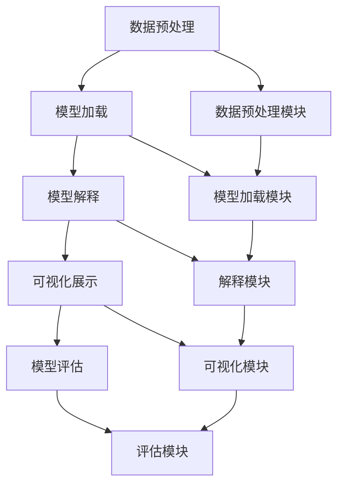

                 


### 引言与背景

#### 1.1 问题背景

在当今的人工智能时代，机器学习模型已经成为解决复杂问题的重要工具。然而，随着模型复杂度的增加，它们的“黑箱”性质也越来越明显，这使得模型的可解释性成为一个亟待解决的问题。可解释性不仅仅是为了满足科学家和工程师的好奇心，更是为了满足实际应用的需求。例如，在金融、医疗、司法等关键领域，决策的透明度和可靠性是至关重要的。如果模型的行为无法解释，那么人们就会质疑其决策的公正性和可接受性。

**1.1.1 机器学习与模型可解释性的重要性**

机器学习模型，尤其是深度学习模型，在处理复杂数据集时表现出了惊人的能力。然而，这些模型通常是基于大量的数据通过复杂的算法训练得到的，其内部机制往往难以理解。尽管这些模型能够在多个领域取得突破性成果，但它们的高度非线性、复杂性以及黑箱性质，使得我们很难直观地理解它们的决策过程。

模型可解释性的重要性体现在以下几个方面：

- **信任与透明度**：可解释的模型更容易获得用户的信任，尤其是在涉及到关键决策的领域。例如，在医学诊断中，医生和患者都需要了解模型是如何做出决策的。
- **合规性与法律**：在某些行业，如金融和司法，模型的决策过程需要符合相关法律法规的要求。如果模型不可解释，就很难证明其决策的合法性和合规性。
- **改进与优化**：理解模型的决策过程可以帮助研究者找到模型中的缺陷和不足，从而进行改进和优化。
- **可泛化性**：可解释的模型更容易推广到新的任务和数据集，因为它们的行为更易于理解和调整。

**1.1.2 模型可解释性工具的需求**

为了提高机器学习模型的透明度，研究者们开发了各种可解释性工具。这些工具旨在帮助用户理解模型的内部机制，揭示其决策过程。模型可解释性工具的需求源于以下几个方面：

- **用户需求**：在实际应用中，用户（如决策者、监管者、客户等）需要对模型的决策过程有足够的了解，以便做出明智的决策。
- **技术挑战**：随着模型复杂度的增加，传统的分析工具已经无法满足对模型内部机制进行深入理解的需求。因此，需要开发专门的可解释性工具来应对这些挑战。
- **规范与标准**：随着机器学习应用领域的扩大，各种行业和组织开始制定相关的规范和标准，要求模型必须具备一定的可解释性。

#### 1.2 模型可解释性的定义与重要性

**1.2.1 模型可解释性的概念**

模型可解释性是指用户能够理解模型是如何做出决策的属性。它不仅仅是指模型的输出结果，还包括模型的训练过程、内部机制以及决策过程。可解释性可以分为不同层次，包括模型级、特征级和决策级。

- **模型级可解释性**：用户可以理解模型的总体结构和功能。
- **特征级可解释性**：用户可以理解模型如何利用输入特征进行预测。
- **决策级可解释性**：用户可以理解模型在特定输入下是如何做出决策的。

**1.2.2 模型可解释性的重要性**

模型可解释性的重要性在于它能够帮助用户建立对模型的信任，提高模型的透明度，从而在多个应用领域发挥重要作用。

- **信任与透明度**：可解释性有助于建立用户对模型的信任，特别是在涉及关键决策的领域。
- **合规性与法律**：可解释性使得模型决策过程更容易符合相关法律法规的要求。
- **改进与优化**：通过理解模型的内部机制，研究者可以更好地优化模型，提高其性能和可靠性。
- **可泛化性**：可解释性有助于模型在新任务和数据集上的推广和泛化。

#### 1.3 模型可解释性的挑战

尽管模型可解释性具有重要意义，但在实际应用中仍面临诸多挑战。

**1.3.1 技术挑战**

- **复杂性**：现代机器学习模型（如深度神经网络）通常具有很高的复杂性，这使得理解其内部机制变得非常困难。
- **计算成本**：许多可解释性工具需要大量的计算资源，这可能会限制其在实际应用中的使用。
- **泛化能力**：一些可解释性工具可能仅适用于特定类型的模型或数据集，缺乏泛化能力。

**1.3.2 实践挑战**

- **用户接受度**：用户可能对模型可解释性工具缺乏了解，从而对其持怀疑态度。
- **成本与效益**：开发和使用可解释性工具可能需要投入大量的人力和物力资源，因此需要权衡其成本与效益。
- **整合与兼容性**：可解释性工具需要与现有的机器学习平台和工具无缝集成，这可能需要额外的开发工作。

#### 1.4 本书结构

本书旨在提供全面、深入的模型可解释性工具评估方法，帮助读者理解和掌握这一领域的关键技术和应用。本书的结构如下：

- **第一部分：引言与背景**：介绍模型可解释性的背景、定义和重要性，以及面临的挑战。
- **第二部分：模型可解释性工具的基本概念**：介绍模型可解释性的基本概念、层次和关键要素。
- **第三部分：常见的模型可解释性工具**：详细介绍各种常见的模型可解释性工具，包括层级解释方法、概率解释方法和对比解释方法。
- **第四部分：模型可解释性工具评估方法**：介绍评估模型可解释性工具的方法和流程。
- **第五部分：模型可解释性工具的开发与实现**：介绍如何开发和使用模型可解释性工具，包括开发环境、框架设计、实现步骤和代码示例。

通过本书的阅读，读者将能够全面了解模型可解释性工具的评估方法，掌握其开发与实现的核心技术，为实际应用提供有力支持。

## 1.5 本章小结

本章首先介绍了机器学习模型可解释性的背景和重要性，明确了其在关键决策领域中的作用。接着，我们定义了模型可解释性的基本概念，并讨论了其在信任、透明度、合规性和改进等方面的意义。随后，我们分析了模型可解释性面临的技术挑战和实践挑战，为后续章节的讨论奠定了基础。最后，我们概述了本书的结构，明确了各部分的内容和目标，为读者提供了一个清晰的学习路线图。

### 第二部分: 模型可解释性工具的基本概念

#### 第2章: 模型可解释性的基本概念

#### 2.1 可解释性与透明度的区别

在讨论模型可解释性之前，首先需要明确两个相关的概念：可解释性和透明度。尽管这两个概念在某种程度上是重叠的，但它们在技术含义和应用场景上有所区别。

**2.1.1 可解释性的定义**

可解释性是指模型决策过程能够被用户理解的能力。它不仅要求用户能够理解模型的总体结构和功能，还要求能够解释模型在特定输入下的具体决策过程。可解释性通常与模型的可理解性、透明度和可靠性等概念紧密相关。

**2.1.2 透明度的定义**

透明度则是指模型决策过程能够被外界观察和理解的程度。一个高度透明的模型，其内部机制和决策过程应该是清晰可见的，使得外部用户可以轻松地跟踪和验证模型的操作。透明度更多地关注于模型操作的可见性，而不一定要求用户能够完全理解这些操作的细节。

**2.2 可解释性的层次**

可解释性可以根据用户需求的详细程度和层次进行分类。以下是一些常见的层次：

- **高层可解释性**：用户能够理解模型的总体结构和功能，但不一定能够深入理解模型的内部操作。例如，用户可能知道一个神经网络用于分类，但不知道具体的权重和激活函数是如何工作的。
- **中层可解释性**：用户能够理解模型如何利用输入特征进行决策，但可能无法深入理解每个特征的具体作用。例如，用户可能知道一个特征的重要性，但不知道为什么这个特征重要。
- **低层可解释性**：用户能够理解模型在特定输入下的具体决策过程，包括每个特征的权重、激活状态等。这种层次的解释通常需要对模型的内部机制有深入的了解。

**2.3 模型可解释性的关键要素**

模型可解释性包含多个关键要素，这些要素共同决定了模型的可理解性、透明度和可靠性。

**2.3.1 模型透明度**

模型透明度是指模型内部机制和决策过程的可观察性和可理解性。一个高度透明的模型应该允许用户访问和解释模型内部的权重、参数和激活状态。透明度有助于用户建立对模型的信任，并更好地理解模型的决策过程。

**2.3.2 模型可理解性**

模型可理解性是指模型决策过程的易理解程度。一个可理解的模型应该具有直观和清晰的决策过程，使得用户能够轻松地理解模型如何利用输入特征进行预测。良好的可理解性有助于降低用户的学习成本，提高模型的用户接受度。

**2.3.3 模型可靠性**

模型可靠性是指模型在特定输入下的预测结果的一致性和准确性。一个可靠的模型应该能够在各种场景下提供稳定的预测结果，且这些结果应该是可信的。可靠性是模型在实际应用中的关键要素，尤其是在涉及关键决策的领域。

**2.4 本章小结**

本章介绍了模型可解释性的基本概念，包括可解释性与透明度的区别、可解释性的层次以及模型可解释性的关键要素。通过理解这些概念，读者可以更好地理解模型可解释性的重要性，以及如何在实际应用中评估和提升模型的可解释性。

### 第3章: 常见的模型可解释性工具

#### 3.1 层级解释方法

层级解释方法是一种常见的模型可解释性工具，通过将模型分层，帮助用户理解模型在不同层次的决策过程。这种方法适用于多层神经网络、决策树等具有分层结构的模型。

**3.1.1 层级解释方法的原理**

层级解释方法的原理是基于模型的分层结构，将模型的输入、输出以及内部中间层表示进行可视化或解释。通过这种方式，用户可以逐层理解模型的决策过程，从而提高模型的可解释性。

- **输入层解释**：用户可以查看输入特征的权重，了解每个特征对模型输出的影响。
- **中间层解释**：用户可以查看中间层的激活状态，了解特征如何通过多层神经网络传递并影响最终输出。
- **输出层解释**：用户可以查看输出层的权重和激活状态，了解模型如何基于输入特征做出预测。

**3.1.2 常见的层级解释方法**

常见的层级解释方法包括：

- **激活传播法**（Activation Propagation Method）：通过正向传播和反向传播，将激活状态逐层传递，从而实现层间解释。
- **层间权重解释法**（Inter-layer Weight Explanation Method）：直接解释每层权重在模型决策中的作用。
- **层间激活解释法**（Inter-layer Activation Explanation Method）：通过可视化中间层激活状态，帮助用户理解特征传递过程。

#### 3.2 概率解释方法

概率解释方法是一种基于概率论的模型解释方法，通过分析模型输出的概率分布，帮助用户理解模型决策的依据和不确定性。

**3.2.1 概率解释方法的原理**

概率解释方法的原理是基于模型的概率输出，通过分析概率分布来解释模型决策的过程。这种方法适用于具有概率输出功能的模型，如贝叶斯网络、概率图模型等。

- **后验概率解释**：通过计算后验概率，了解模型对每个类别的置信度，从而解释模型是如何在不确定的环境中做出决策的。
- **边际概率解释**：通过分析输入特征的边际概率分布，了解特征对模型输出的影响和重要性。

**3.2.2 常见的概率解释方法**

常见的概率解释方法包括：

- **贝叶斯网络解释**：通过贝叶斯网络的结构和参数，解释模型如何基于概率推理进行决策。
- **概率图模型解释**：通过概率图模型中的节点和边，解释模型如何基于概率分布进行推理和预测。

#### 3.3 对比解释方法

对比解释方法是一种通过比较不同模型的解释结果，来提高模型可解释性的方法。这种方法适用于多个模型的对比分析，可以帮助用户理解模型之间的差异和相似之处。

**3.3.1 对比解释方法的原理**

对比解释方法的原理是通过对比不同模型的解释结果，来揭示模型之间的差异和一致性。这种方法通常涉及以下步骤：

- **选择对比模型**：选择与目标模型在性能、结构等方面具有相似性的对比模型。
- **生成解释结果**：对目标模型和对比模型分别生成解释结果。
- **对比分析**：对比目标模型和对比模型之间的解释结果，识别差异和一致性。

**3.3.2 常见的对比解释方法**

常见的对比解释方法包括：

- **特征对比法**：对比不同模型对相同输入特征的权重和重要性。
- **决策路径对比法**：对比不同模型在决策过程中的路径和决策点。
- **结果对比法**：对比不同模型在相同数据集上的预测结果和不确定性。

#### 3.4 图形解释方法

图形解释方法是一种通过可视化模型结构、输入特征和决策路径，来提高模型可解释性的方法。这种方法适用于具有可视化表示的模型，如决策树、神经网络等。

**3.4.1 图形解释方法的原理**

图形解释方法的原理是通过图形化的表示，直观地展示模型的结构和决策过程。这种方法可以帮助用户更好地理解模型的内部机制和决策逻辑。

- **结构图解释**：通过绘制模型的结构图，展示模型的层次结构和组件关系。
- **特征图解释**：通过绘制特征图，展示输入特征在模型中的传递和作用。
- **决策路径图解释**：通过绘制决策路径图，展示模型在决策过程中的路径和决策点。

**3.4.2 常见的图形解释方法**

常见的图形解释方法包括：

- **决策树图解释**：通过绘制决策树图，展示决策树的结构和决策路径。
- **神经网络图解释**：通过绘制神经网络图，展示神经网络的层次结构和连接关系。
- **特征图解释**：通过绘制特征图，展示输入特征在模型中的传递和作用。

#### 3.5 本章小结

本章介绍了常见的模型可解释性工具，包括层级解释方法、概率解释方法、对比解释方法和图形解释方法。这些方法通过不同的原理和方式，帮助用户提高模型的可解释性，从而更好地理解和信任模型。通过本章的学习，读者可以了解各种模型可解释性工具的基本概念和应用场景，为后续的评估和开发提供基础。

### 第4章: 模型可解释性工具评估方法

#### 4.1 评估框架的构建

评估模型可解释性工具的有效性是一项复杂的任务，需要构建一个全面且科学的评估框架。评估框架应该能够系统地衡量工具的性能、可靠性、易用性和适用性等多方面的指标。

**4.1.1 评估框架的要素**

一个完整的评估框架通常包含以下要素：

- **评估目标**：明确评估的目标，例如，提高模型的可解释性、减少误判率等。
- **评估指标**：定义评估的具体指标，如准确性、召回率、F1分数等。
- **评估方法**：确定评估的方法和步骤，例如，通过人工评估、自动化测试等。
- **评估环境**：提供评估所需的软件和硬件环境，例如，使用特定的机器学习框架和工具。

**4.1.2 评估框架的设计原则**

设计评估框架时，应遵循以下原则：

- **全面性**：评估框架应涵盖模型可解释性的各个方面，确保评估的全面性。
- **科学性**：评估方法和指标应基于可靠的科学依据，确保评估结果的科学性和准确性。
- **可操作性**：评估框架应易于操作和实施，确保评估过程的可操作性。
- **灵活性**：评估框架应具有一定的灵活性，能够适应不同的模型和工具。

#### 4.2 评估指标的选择

选择合适的评估指标是评估模型可解释性工具的关键。评估指标应能够准确反映工具的性能和效果。

**4.2.1 常见的评估指标**

常见的评估指标包括：

- **准确性**：衡量模型对预测结果的准确性，是评估模型性能的基本指标。
- **召回率**：衡量模型能够正确识别出正类例的能力，适用于需要高召回率的场景。
- **F1分数**：综合准确性和召回率，是一个平衡的评估指标。
- **ROC曲线和AUC值**：衡量模型对正类例和负类例的区分能力，适用于二分类问题。

**4.2.2 指标的选择原则**

选择评估指标时，应遵循以下原则：

- **相关性**：选择与评估目标高度相关的指标，确保评估结果的准确性。
- **全面性**：选择多个指标，从不同角度评估工具的性能，提高评估的全面性。
- **可操作性**：选择易于计算和操作的评价指标，确保评估过程的可操作性。

#### 4.3 评估流程的设计

设计评估流程是评估模型可解释性工具的关键步骤。一个有效的评估流程应包括以下步骤：

**4.3.1 评估流程的步骤**

- **需求分析**：明确评估的目标和要求，确定评估的重点和方向。
- **工具选择**：根据评估目标，选择合适的模型可解释性工具。
- **环境配置**：搭建评估所需的软件和硬件环境，确保工具的正常运行。
- **测试数据准备**：准备用于评估的测试数据集，确保数据的质量和代表性。
- **评估实施**：按照评估框架和流程，对工具进行评估，记录评估结果。
- **结果分析**：分析评估结果，评估工具的性能和效果，识别优势和不足。

**4.3.2 评估流程的优化策略**

为了提高评估流程的效率和准确性，可以采取以下优化策略：

- **自动化评估**：通过自动化脚本或工具，实现评估过程的自动化，提高评估效率。
- **多维度评估**：从多个维度（如准确性、召回率、F1分数等）对工具进行评估，提高评估结果的全面性。
- **交叉验证**：采用交叉验证方法，提高评估结果的可靠性和稳定性。

#### 4.4 实践案例

为了更好地说明评估流程的实践应用，下面我们将介绍一个实际案例。

**4.4.1 案例选择**

假设我们选择一个金融风险评估模型，该模型用于预测客户是否可能发生违约。我们希望通过评估模型可解释性工具，提高模型的透明度和可靠性。

**4.4.2 案例分析**

1. **需求分析**：评估目标为提高模型的可解释性，确保模型的决策过程透明，有助于金融监管机构审核和客户理解。
2. **工具选择**：选择多种模型可解释性工具，如LIME、SHAP等，以便从不同角度评估模型。
3. **环境配置**：搭建Python环境，安装必要的库和工具，如scikit-learn、shap等。
4. **测试数据准备**：准备客户信用数据集，包括特征和标签，确保数据质量，并进行预处理。
5. **评估实施**：使用LIME和SHAP工具对模型进行评估，记录每个工具的评估结果，包括解释结果的可视化和分析。
6. **结果分析**：分析评估结果，比较不同工具的解释效果，识别优势和应用场景，如LIME在局部解释方面表现较好，而SHAP在全局解释方面表现更佳。

通过实际案例的介绍，我们可以看到评估流程的具体实施过程和优化策略。这不仅有助于理解评估方法的应用，也为实际项目提供了参考。

#### 4.5 本章小结

本章详细介绍了模型可解释性工具评估方法的设计和实施。我们首先构建了评估框架，明确了评估的要素和原则。接着，讨论了评估指标的选择，包括常见指标和选择原则。随后，设计了评估流程，包括评估的步骤和优化策略。最后，通过一个实际案例，展示了评估流程的实践应用。通过本章的学习，读者可以掌握模型可解释性工具评估的核心技术和方法，为实际项目提供有力支持。

### 第5章: 模型可解释性工具的开发与实现

#### 5.1 开发环境搭建

在开始开发模型可解释性工具之前，搭建一个合适的开发环境是非常重要的。一个良好的开发环境可以确保工具的稳定性和可扩展性，同时提高开发效率。

**5.1.1 环境配置**

开发环境通常包括操作系统、编程语言、依赖库和开发工具等。以下是搭建开发环境的基本步骤：

1. **操作系统**：建议使用Linux或macOS，因为它们提供了丰富的库和工具支持。
2. **Python环境**：安装Python 3.x版本，推荐使用Anaconda或Miniconda，以便管理和安装依赖库。
3. **依赖库**：安装必要的依赖库，如NumPy、Pandas、scikit-learn、matplotlib等。可以使用pip或conda进行安装。
4. **IDE**：选择一个适合Python开发的IDE，如PyCharm、VSCode等，以便进行代码编写和调试。

**5.1.2 开发工具选择**

选择合适的开发工具可以提高开发效率。以下是几种常见的开发工具：

- **集成开发环境（IDE）**：如PyCharm、VSCode等，提供代码编辑、调试、版本控制等功能。
- **版本控制系统**：如Git，用于管理代码版本，方便多人协作和代码管理。
- **文档工具**：如Sphinx或Readme，用于生成代码文档和项目说明。
- **自动化测试工具**：如pytest，用于编写和运行测试用例，确保代码质量和可靠性。

#### 5.2 工具框架设计

设计一个高效的模型可解释性工具框架是开发过程中的关键步骤。框架应该具有良好的扩展性、模块化和可维护性，以便在未来的开发过程中进行扩展和优化。

**5.2.1 框架概述**

一个典型的模型可解释性工具框架通常包括以下几个核心组件：

- **数据预处理模块**：负责对输入数据进行清洗、转换和标准化，确保数据质量。
- **模型加载模块**：负责加载预训练的模型，可以是深度学习模型或传统机器学习模型。
- **解释模块**：实现各种解释算法，如LIME、SHAP等，生成模型解释结果。
- **可视化模块**：负责将解释结果可视化，帮助用户直观地理解模型决策过程。
- **评估模块**：用于评估工具的性能，包括准确性、召回率、F1分数等指标。

**5.2.2 框架的核心组件**

以下是框架设计中的几个关键组件及其功能：

- **数据预处理模块**：该模块负责处理输入数据，包括数据清洗、缺失值处理、特征工程等。数据预处理是确保模型性能和解释结果准确性的重要环节。

    ```python
    def preprocess_data(data):
        # 数据清洗
        data = clean_data(data)
        # 缺失值处理
        data = handle_missing_values(data)
        # 特征工程
        data = feature_engineering(data)
        return data
    ```

- **模型加载模块**：该模块负责加载预训练的模型，可以是使用scikit-learn、TensorFlow或PyTorch等框架训练的模型。模型加载模块应该支持多种类型的模型，并能够方便地更新和替换模型。

    ```python
    from sklearn.externals import joblib

    def load_model(model_path):
        model = joblib.load(model_path)
        return model
    ```

- **解释模块**：该模块实现各种解释算法，如LIME、SHAP等。解释算法的目的是帮助用户理解模型如何基于输入数据做出预测。

    ```python
    import shap

    def explain_model(model, data):
        explainer = shap.KernelExplainer(model.predict, data)
        shap_values = explainer.shap_values(data)
        return shap_values
    ```

- **可视化模块**：该模块负责将解释结果可视化，使用户能够直观地理解模型决策过程。常见的可视化方法包括散点图、热力图、条形图等。

    ```python
    import matplotlib.pyplot as plt
    import seaborn as sns

    def visualize_explanation(shap_values, feature_names):
        shap.summary_plot(shap_values, feature_names=feature_names)
        plt.show()
    ```

- **评估模块**：该模块用于评估工具的性能，包括准确性、召回率、F1分数等指标。评估模块可以方便地集成到开发环境中，用于测试和优化工具。

    ```python
    from sklearn.metrics import accuracy_score, recall_score, f1_score

    def evaluate_model(model, X_test, y_test):
        y_pred = model.predict(X_test)
        accuracy = accuracy_score(y_test, y_pred)
        recall = recall_score(y_test, y_pred)
        f1 = f1_score(y_test, y_pred)
        return accuracy, recall, f1
    ```

#### 5.3 工具实现步骤

实现一个模型可解释性工具通常涉及以下步骤：

**5.3.1 数据预处理**

数据预处理是模型解释的基础。确保数据质量，进行必要的清洗和转换。

```python
data = preprocess_data(data)
```

**5.3.2 模型加载**

加载预训练的模型，为解释和评估做准备。

```python
model = load_model(model_path)
```

**5.3.3 模型解释**

使用解释算法对模型进行解释，生成解释结果。

```python
shap_values = explain_model(model, data)
```

**5.3.4 可视化展示**

将解释结果可视化，帮助用户理解模型决策过程。

```python
visualize_explanation(shap_values, feature_names)
```

**5.3.5 模型评估**

评估模型性能，确保工具的有效性和可靠性。

```python
accuracy, recall, f1 = evaluate_model(model, X_test, y_test)
```

#### 5.4 代码示例

以下是一个简单的代码示例，展示了如何使用LIME工具进行模型解释和可视化。

```python
import lime
from lime.lime_tabular import LimeTabularExplainer

# 加载数据
data = preprocess_data(data)
X_train, X_test, y_train, y_test = train_test_split(data, test_size=0.2)

# 加载模型
model = load_model(model_path)

# 创建解释器
explainer = LimeTabularExplainer(X_train, feature_names=feature_names, class_names=class_names, model=model.predict)

# 解释单个样本
idx = 10  # 示例样本索引
exp = explainer.explain_instance(X_test[idx], model.predict, num_features=10)

# 可视化解释结果
exp.show_in_notebook(show_table=True, feature_names=feature_names)
```

#### 5.4.1 Python代码示例

以下是一个简单的Python代码示例，展示了如何使用SHAP工具进行模型解释和可视化。

```python
import shap
import pandas as pd

# 加载数据
data = preprocess_data(data)
X_train, X_test, y_train, y_test = train_test_split(data, test_size=0.2)

# 加载模型
model = load_model(model_path)

# 创建SHAP解释器
explainer = shap.TreeExplainer(model)

# 计算SHAP值
shap_values = explainer.shap_values(X_test)

# 可视化SHAP值
shap.summary_plot(shap_values, X_test, feature_names=feature_names)
```

#### 5.4.2 Mermaid图表示例

以下是一个Mermaid图表示例，展示了模型可解释性工具框架的组件和关系。



通过这个示例，我们可以直观地看到模型可解释性工具框架的设计和实现过程。通过详细的代码示例和Mermaid图表示例，读者可以更好地理解如何开发和实现模型可解释性工具。

#### 5.5 本章小结

本章详细介绍了模型可解释性工具的开发与实现过程。首先，我们讲解了开发环境的搭建，包括环境配置和开发工具选择。接着，我们讨论了工具框架的设计，包括框架的核心组件和功能。随后，我们介绍了工具的实现步骤，并提供了Python代码示例和Mermaid图表示例。通过本章的学习，读者可以掌握模型可解释性工具的开发和实现技术，为实际项目提供有力支持。本章的内容为后续章节的深入研究和应用打下了坚实的基础。

