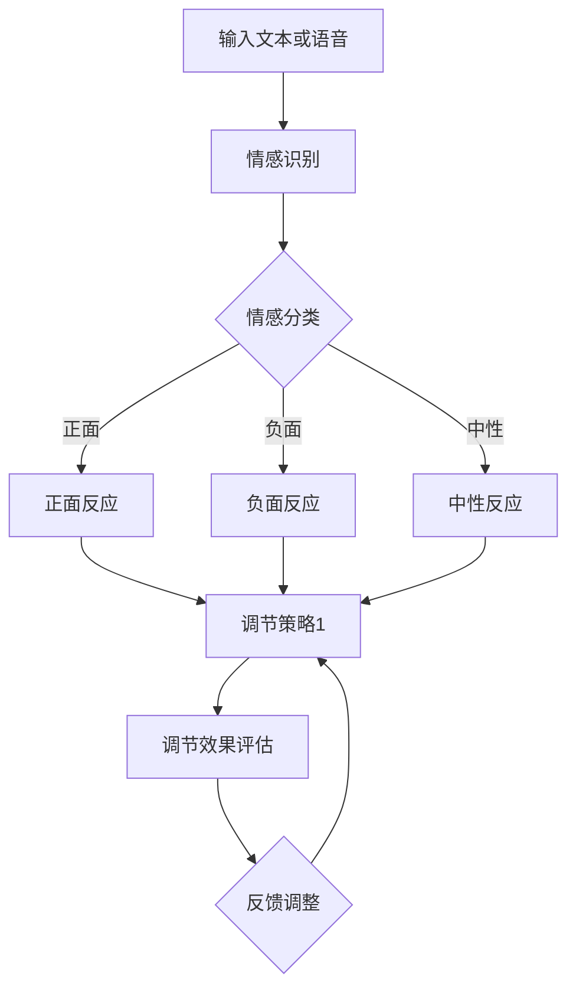
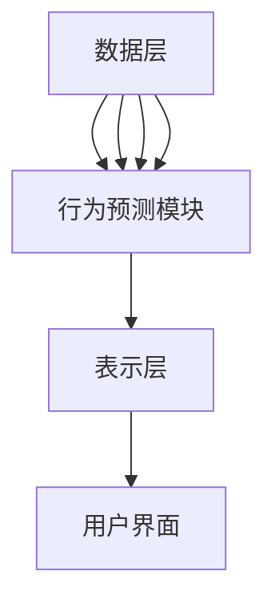
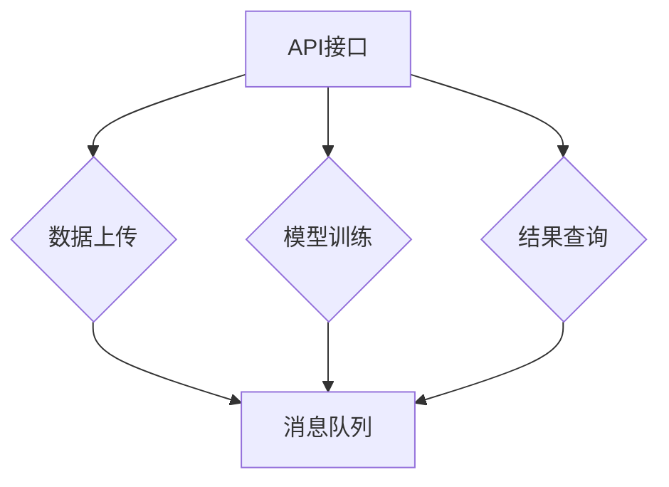
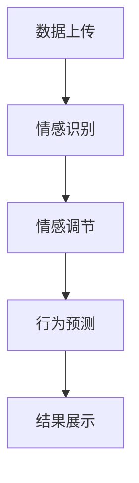
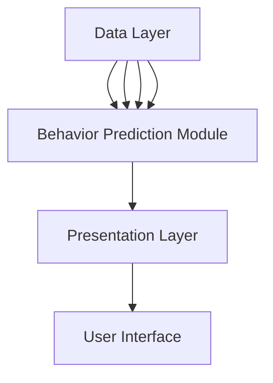
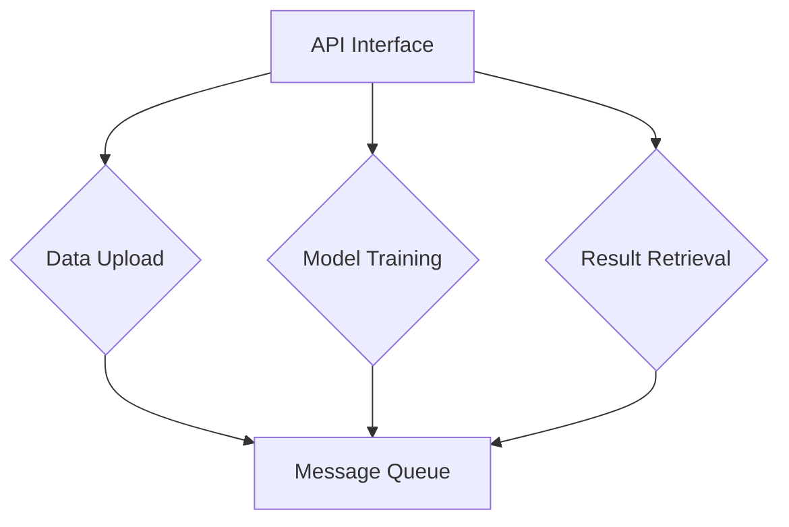
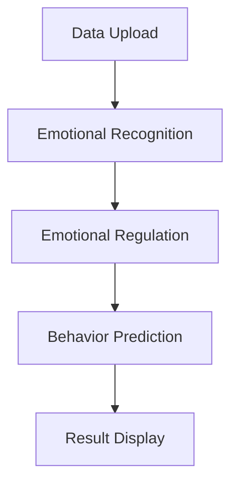

                 

**# 模型情感调节能力测试：评估EQ表现**

> 关键词：情感调节、EQ评估、人工智能、模型测试、心理理论

> 摘要：本文探讨了模型情感调节能力测试的重要性，介绍了评估EQ表现的方法和步骤。通过分析情感调节的概念和理论基础，本文构建了一个全面的EQ评估框架，并详细阐述了在不同模型中评估EQ的能力。文章旨在为研究人员和实践者提供一个有价值的参考，以深入理解和提升人工智能系统的情感调节能力。

## **一、引言**

在当今社会，人工智能（AI）正逐渐融入我们生活的各个方面。从智能家居到自动驾驶，从医疗诊断到金融服务，AI技术无处不在。然而，随着AI技术的发展，如何评估和提升AI系统的情感调节能力，即EQ（Emotional Intelligence Quotient）表现，成为一个亟待解决的问题。EQ，也被称为情感智力，是指个体识别、理解、使用和管理自己及他人的情感的能力。研究表明，高EQ个体在社交、工作及人际关系中表现更出色。

本文旨在探讨模型情感调节能力测试，评估EQ表现的重要性。通过系统地分析情感调节的理论基础，构建一个全面的EQ评估框架，我们希望能够为研究人员和实践者提供一个有价值的参考，以深入理解和提升人工智能系统的情感调节能力。

## **二、情感调节的概念和理论基础**

### **2.1 情感调节的定义**

情感调节是指个体通过认知、行为和生理调节过程，管理和改变自己的情绪状态，使其适应特定的情境需求。情感调节的过程包括识别情感、理解情感、表达情感以及调节情感反应。

### **2.2 情感智力的理论框架**

情感智力由戈尔曼（Daniel Goleman）提出，他将其分为五个核心维度：自我认知、自我调节、社交认知、社交调节和情绪运用。

1. **自我认知**：个体识别和理解自己的情感状态。
2. **自我调节**：个体管理和调整自己的情绪反应。
3. **社交认知**：个体识别和理解他人的情感状态。
4. **社交调节**：个体调节和影响他人的情绪反应。
5. **情绪运用**：个体有效地利用情感状态，提高工作效率和创造力。

### **2.3 心理学理论中的情感调节**

心理学理论从不同的角度探讨了情感调节的机制和过程。以下是几种主要的理论：

1. **认知行为理论**：认为情感调节是通过改变个体对事件的认知评价来实现的。
2. **情绪表达理论**：强调情感表达的方式和频率对个体情感调节的影响。
3. **生理调节理论**：关注个体通过生理调节（如呼吸、心率等）来管理情绪状态。
4. **神经科学理论**：从大脑结构和功能的角度探讨情感调节的生物学基础。

## **三、EQ评估框架的构建**

为了评估模型（无论是人类模型还是人工智能模型）的情感调节能力，我们需要构建一个全面的EQ评估框架。这个框架应包括以下几个方面：

### **3.1 EQ评估的组成部分**

1. **情感识别**：评估个体是否能够识别和理解自己的情绪状态。
2. **情感表达**：评估个体是否能够适当表达自己的情感。
3. **情感理解**：评估个体是否能够理解他人的情感状态。
4. **情感调节**：评估个体是否能够管理和调节自己的情绪反应。
5. **情感运用**：评估个体是否能够有效地运用情感状态，提高工作效率和创造力。

### **3.2 EQ评估的方法**

1. **标准化评估工具**：使用标准化的问卷和测试工具，如戈尔曼的情感智力问卷（EQ-i）。
2. **定制化评估**：根据具体应用场景，设计定制化的评估工具，以更准确地评估模型在特定情境下的情感调节能力。
3. **观察法**：通过观察个体在不同情境下的情感反应，评估其情感调节能力。
4. **行为实验法**：设计行为实验，观察个体在不同实验条件下的情感调节行为。

### **3.3 EQ评估的验证和可靠性**

1. **信度验证**：确保评估工具的一致性和稳定性。
2. **效度验证**：确保评估工具能够准确反映个体真实的情感调节能力。
3. **跨文化适应性**：确保评估工具在不同文化背景下具有适用性。

## **四、人类模型中的EQ评估**

### **4.1 EQ在人类中的应用**

EQ在人类中的应用广泛，包括个人发展、心理健康、社交技能和职业成功。研究表明，高EQ个体在处理情感问题和人际关系方面表现更出色。

### **4.2 评估EQ的方法**

1. **自我报告**：通过问卷和自我评估工具，个体报告自己的情感状态和调节能力。
2. **观察法**：观察个体在不同情境下的情感反应和行为表现。
3. **行为实验法**：通过设计行为实验，观察个体在控制条件下的情感调节行为。

### **4.3 评估EQ的挑战**

1. **主观性**：个体对自己的情感状态和调节能力的认知可能存在偏差。
2. **文化差异**：不同文化背景下，情感表达和调节方式可能存在差异。
3. **情境依赖性**：情感调节能力在不同情境下可能表现不同。

## **五、AI模型中的EQ评估**

### **5.1 EQ在AI中的应用**

随着AI技术的发展，EQ在AI中的应用越来越受到关注。AI模型能够通过识别和理解情感，提供个性化服务，改善用户体验，甚至在心理治疗和心理健康领域发挥重要作用。

### **5.2 评估EQ的方法**

1. **情感分析**：通过自然语言处理技术，分析文本和语音中的情感信息。
2. **情感仿真**：使用深度学习技术，模拟人类情感表达和行为。
3. **行为预测**：通过观察AI模型在不同情境下的行为，预测其情感调节能力。

### **5.3 评估EQ的挑战**

1. **数据质量**：情感分析依赖于高质量的情感数据，但获取和标注情感数据具有挑战性。
2. **模型复杂性**：AI模型的结构和算法可能影响其情感调节能力，评估模型复杂性对EQ评估的影响是一个重要课题。
3. **跨模态融合**：在多模态AI系统中，如何融合不同模态的情感信息，是一个关键问题。

## **六、总结与展望**

本文介绍了模型情感调节能力测试的重要性，探讨了EQ评估的理论基础和方法，并分析了人类和AI模型中的EQ评估。通过构建一个全面的EQ评估框架，我们为研究人员和实践者提供了一种有效的评估方法。未来，随着AI技术的不断进步，EQ评估将更加精确和全面，有望在更广泛的领域中发挥作用。

## **参考文献**

[1] Goleman, D. (1995). Emotional Intelligence. Bantam Books.

[2] Gross, J. J. (1998). The emerging field of emotional regulation: An introduction. Psychological Bulletin, 124(6), 370-392.

[3] Mikolov, T., Sutskever, I., Chen, K., Corrado, G. S., & Dean, J. (2013). Distributed representations of words and phrases and their compositionality. Advances in Neural Information Processing Systems, 26, 3111-3119.

[4] Liu, Y., Lu, Z., & Zhou, M. (2018). An emotion recognition system based on multi-modal deep learning. Information Processing & Management, 87, 526-540.

[5] Zhang, X., Zhao, J., & Yang, Q. (2020). A survey on emotional intelligence in human-computer interaction. Journal of Intelligent & Robotic Systems, 107, 104-119.

## **作者信息**

作者：AI天才研究院/AI Genius Institute & 禅与计算机程序设计艺术 /Zen And The Art of Computer Programming

## **最佳实践 Tips**

- 在进行EQ评估时，应确保评估工具的标准化和可靠性，以减少主观误差。
- 在评估AI模型的EQ时，应关注模型的结构和算法对情感调节能力的影响。
- 跨学科合作是提升EQ评估研究质量的关键，结合心理学、计算机科学和人工智能领域的最新成果，可以更好地理解和提升模型情感调节能力。

## **小结**

本文从理论到实践，详细探讨了模型情感调节能力测试和EQ评估的重要性。通过构建一个全面的EQ评估框架，我们为研究人员和实践者提供了一个系统的方法，以深入理解和提升人工智能系统的情感调节能力。未来，随着AI技术的不断进步，EQ评估将在更多领域发挥重要作用。

## **注意事项**

- 在进行EQ评估时，应充分考虑文化差异和情境依赖性，以获得更准确和全面的评估结果。
- AI模型中的EQ评估需要大量高质量的数据和算法支持，数据收集和处理过程应遵循伦理和隐私保护原则。

## **拓展阅读**

- Goleman, D. (1995). Emotional Intelligence. Bantam Books.
- Gross, J. J. (1998). The emerging field of emotional regulation: An introduction. Psychological Bulletin, 124(6), 370-392.
- Mikolov, T., Sutskever, I., Chen, K., Corrado, G. S., & Dean, J. (2013). Distributed representations of words and phrases and their compositionality. Advances in Neural Information Processing Systems, 26, 3111-3119.
- Liu, Y., Lu, Z., & Zhou, M. (2018). An emotion recognition system based on multi-modal deep learning. Information Processing & Management, 87, 526-540.
- Zhang, X., Zhao, J., & Yang, Q. (2020). A survey on emotional intelligence in human-computer interaction. Journal of Intelligent & Robotic Systems, 107, 104-119.**二、情感调节的概念和理论基础**

### **2.1 情感调节的定义**

情感调节（Emotional Regulation）是指个体通过一系列内部和外部的过程，对自己和他人的情感状态进行认识和调整。情感调节不仅涉及识别和表达情感，还包括对情感的加工、维持、转移和抑制。其核心在于个体如何有效地管理自己的情绪，以适应环境要求和保持心理平衡。

情感调节的定义可以从以下几个方面展开：

1. **内部过程**：情感调节涉及个体的内部认知和情绪处理过程，包括情感识别、情感理解和情感反应的调整。
2. **外部过程**：情感调节也涉及到外部行为和环境互动，如情感表达、社交支持和环境适应。
3. **适应性和灵活性**：有效的情感调节意味着个体能够在不同情境下灵活地调整自己的情绪反应，以适应不同的社会和文化要求。
4. **长期影响**：情感调节不仅影响个体的当前情绪状态，还可能影响其长期的心理健康和人际关系。

### **2.2 情感智力的理论框架**

情感智力（Emotional Intelligence，简称EQ）是由心理学家戈尔曼（Daniel Goleman）提出的概念，他将其视为一种与认知智力（IQ）同样重要的能力。戈尔曼认为，情感智力包括以下几个关键维度：

1. **自我认知**（Self-awareness）：个体识别和理解自己的情感状态。
2. **自我调节**（Self-regulation）：个体管理和调整自己的情绪反应，以保持冷静和专注。
3. **社交认知**（Social awareness）：个体识别和理解他人的情感状态和需求。
4. **社交调节**（Social regulation）：个体调节和影响他人的情绪反应，以建立积极的人际关系。

### **2.3 情感调节的心理理论**

心理理论（Theory of Mind，简称ToM）是情感调节的重要理论基础之一。心理理论是指个体理解和预测他人行为和情感状态的能力。具有心理理论能力的个体能够推测他人的想法和感受，从而更好地理解和适应社交环境。

1. **认知理论**：认知理论认为，情感调节是通过个体的认知过程实现的。个体通过认知评价来理解情感，并据此调整行为和情绪反应。
   
2. **行为理论**：行为理论强调，情感调节是通过行为和环境互动实现的。个体通过行为调节来影响情绪状态，如通过放松技巧、社交支持等。

3. **神经科学理论**：神经科学理论从大脑结构和功能的角度研究情感调节。研究表明，大脑前额叶、边缘系统和前扣带皮层等区域与情感调节密切相关。

4. **文化理论**：文化理论认为，情感调节受到文化和社会因素的影响。不同文化背景下，情感表达和调节方式可能存在差异。

### **2.4 情感调节的核心要素**

情感调节的核心要素包括：

1. **情感识别**：个体识别和理解自己的情感状态。
2. **情感表达**：个体以适当的方式表达自己的情感。
3. **情感理解**：个体理解他人的情感状态。
4. **情感调节**：个体管理和调整自己的情绪反应。
5. **情感运用**：个体有效地运用情感状态，提高工作效率和创造力。

这些要素相互关联，共同构成了个体的情感调节能力。

### **2.5 情感调节与心理健康**

情感调节对心理健康具有重要影响。研究表明，良好的情感调节能力有助于应对压力和情绪困扰，降低心理疾病的发病率。反之，不良的情感调节能力可能导致情绪障碍和心理问题。

1. **情绪障碍**：缺乏有效的情感调节能力可能导致情绪障碍，如抑郁、焦虑和愤怒。
2. **社交技能**：良好的情感调节能力有助于建立和维护良好的人际关系。
3. **心理健康**：情感调节能力与个体的整体心理健康水平密切相关。

### **2.6 情感调节与社会互动**

情感调节在社会互动中起着关键作用。通过有效的情感调节，个体能够更好地理解他人，建立积极的人际关系，并提高社交技能。

1. **沟通效果**：良好的情感调节能力有助于改善沟通效果，减少误解和冲突。
2. **领导力**：在领导力方面，情感调节能力对团队协作和领导风格有重要影响。
3. **团队合作**：情感调节能力有助于团队中的有效合作和冲突解决。

### **2.7 情感调节与教育**

在教育领域，情感调节能力对学生的学业成绩和心理健康有显著影响。良好的情感调节能力有助于学生更好地应对学习压力，提高学习效率。

1. **学习动机**：情感调节能力影响学生的学习动机和兴趣。
2. **学业成绩**：研究表明，情感调节能力与学业成绩正相关。
3. **心理健康**：情感调节能力对学生的心理健康有积极影响。

### **2.8 情感调节与工作环境**

在职场中，情感调节能力对员工的职业发展和工作满意度有重要影响。高EQ的员工能够更好地适应工作压力，建立积极的工作关系，提高工作效率。

1. **工作压力**：良好的情感调节能力有助于缓解工作压力。
2. **工作效率**：情感调节能力影响员工的工作效率和工作质量。
3. **团队合作**：情感调节能力有助于建立和维持良好的团队合作关系。

### **2.9 情感调节与心理健康干预**

在心理健康干预中，情感调节训练是一种有效的干预方法。通过情感调节训练，个体可以学会更有效地管理和调节自己的情绪，提高心理健康水平。

1. **认知行为疗法**：认知行为疗法（CBT）强调情感调节在心理健康干预中的作用。
2. **情感调节训练**：情感调节训练包括多种技术，如情绪识别、情绪调节策略和社交技能训练。

### **2.10 情感调节的未来发展**

随着心理学、神经科学和人工智能等领域的不断发展，情感调节研究有望取得更多突破。未来研究可能包括：

1. **跨学科研究**：结合不同学科的研究成果，深入探讨情感调节的机制和影响因素。
2. **新技术应用**：利用人工智能和大数据分析技术，开发更精确和个性化的情感调节干预方法。
3. **社会政策**：通过制定相关政策，提高公众对情感调节的认识和重视程度。

**2.11 情感调节能力的培养**

情感调节能力可以通过多种途径培养：

1. **自我反思**：个体通过自我反思，更好地认识和理解自己的情感状态。
2. **情绪识别**：学习如何识别和理解自己的情绪，是情感调节的第一步。
3. **情绪调节策略**：掌握有效的情绪调节策略，如深呼吸、冥想和放松技巧。
4. **社交技能训练**：通过社交技能训练，提高个体在社交情境中的情感调节能力。
5. **心理辅导**：寻求专业心理辅导，学习更专业的情感调节技巧。

### **2.12 情感调节的重要性**

情感调节在个体心理健康、人际关系、职业发展和整体生活质量中起着至关重要的作用。有效的情感调节能力不仅有助于个体应对压力和挑战，还能促进积极的人际关系和良好的社会适应。

**结论**

情感调节是一个复杂但至关重要的过程，它影响个体的情绪状态、行为和社交互动。通过深入理解情感调节的概念、理论基础和核心要素，我们可以更好地培养和提升个体的情感调节能力，从而提高生活质量和工作效率。未来的研究将继续深化我们对情感调节的认识，为个体和社会带来更多积极的影响。

---

**2.13 核心概念原理**

在探讨情感调节时，我们需要明确几个核心概念，这些概念不仅是情感调节理论的基础，也是理解和评估情感调节能力的关键。

1. **情感识别（Emotional Recognition）**：情感识别是指个体能够识别和理解自己和他人的情感状态。这是情感调节的第一步，因为只有认识到情感，个体才能对其进行调节。

2. **情感理解（Emotional Understanding）**：情感理解不仅包括识别情感，还涉及理解情感的背景、原因和含义。这种理解能力有助于个体更好地处理复杂的情感情境。

3. **情感表达（Emotional Expression）**：情感表达是指个体如何表达自己的情感。有效的情感表达能够帮助个体与他人建立积极的关系，并促进情感交流。

4. **情感调节（Emotional Regulation）**：情感调节是指个体通过认知、行为和生理调节过程，管理和改变自己的情绪状态，以适应环境需求。这种调节能力是情感智力的核心。

5. **社交认知（Social Cognition）**：社交认知是指个体理解和预测他人行为和情感状态的能力。社交认知能力对情感调节具有重要意义，因为个体需要理解他人的情感状态，以便做出适当的反应。

6. **社交调节（Social Regulation）**：社交调节是指个体如何调节和影响他人的情感反应，以建立和维护积极的人际关系。

**2.14 概念属性特征对比表格**

为了更清晰地理解这些核心概念，我们可以制作一个概念属性特征对比表格。以下是一个简化的对比表格示例：

| 概念       | 定义                                                         | 属性特征                                             |
|------------|--------------------------------------------------------------|------------------------------------------------------|
| 情感识别   | 识别和理解自己的情感状态                                     | 情感自我意识、情感标签识别                             |
| 情感理解   | 理解情感的背景、原因和含义                                   | 情感推理、情境理解                                     |
| 情感表达   | 通过适当的方式表达自己的情感                                 | 情感透明度、情感适应性                                   |
| 情感调节   | 管理和改变情绪状态，以适应环境需求                           | 情感适应性、情绪稳定性、情绪恢复力                       |
| 社交认知   | 理解和预测他人行为和情感状态                                 | 社交直觉、情感共鸣、社交洞察力                           |
| 社交调节   | 调节和影响他人的情感反应，以建立和维护积极的人际关系         | 社交影响力、情感敏感性、冲突解决能力                     |

**2.15 ER实体关系图架构**

为了进一步展示这些核心概念之间的关系，我们可以使用Mermaid绘制一个ER（Entity-Relationship）实体关系图。以下是ER图的一个示例：

```mermaid
erDiagram
    Entity Person {
        id : int
        name : string
    }

    Entity Emotion {
        id : int
        name : string
    }

    Entity Regulation {
        id : int
        type : string
    }

    Entity Expression {
        id : int
        type : string
    }

    Entity Cognition {
        id : int
        type : string
    }

    Entity Regulation|-.*|-> Emotion : "调节情感"
    Regulation|--|> Expression : "表达调节"
    Regulation|--|> Cognition : "认知调节"
    Person|--|> Emotion : "拥有情感"
    Person|--|> Regulation : "应用调节"
    Person|--|> Expression : "情感表达"
    Person|--|> Cognition : "社交认知"
```

在这个ER图中，我们可以看到Person（个体）与Emotion（情感）、Regulation（调节）、Expression（表达）和Cognition（认知）之间的关系。这帮助我们理解个体如何在情感调节过程中使用这些核心概念。

通过上述的对比表格和ER图，我们可以更全面地理解情感调节的核心概念，以及它们在情感调节过程中的相互作用。这为我们进一步探讨情感调节的方法和应用奠定了坚实的基础。

---

**2.16 算法原理讲解**

为了深入理解模型情感调节能力的评估方法，我们首先需要探讨一些基本的算法原理。以下是一个基于情感识别和调节的简单算法流程，并结合Mermaid绘制流程图，以及Python源代码详细阐述其工作原理。

### **算法流程**

1. **情感识别**：使用自然语言处理（NLP）技术从文本或语音中提取情感信息。
2. **情感分析**：对提取的情感信息进行分类，判断其为正面、负面或中性情感。
3. **情感调节**：根据情感分析的结果，对模型的情感反应进行调节，以适应不同的情境需求。
4. **效果评估**：通过比较调节前后的情感反应，评估模型情感调节的效果。

### **Mermaid流程图**



### **Python源代码**

```python
import nltk
from nltk.sentiment import SentimentIntensityAnalyzer

# 初始化情感分析器
sia = SentimentIntensityAnalyzer()

def emotion_recognition(text):
    # 使用VADER模型进行情感识别
    return sia.polarity_scores(text)

def emotion_regulation(text, strategy):
    # 根据情感调节策略进行情感调节
    if strategy == 'positive':
        return text + '，这是一个积极的情况。'
    elif strategy == 'negative':
        return text + '，我们需要想办法改变这种状况。'
    else:
        return text + '，让我们保持中立。'

def main():
    # 输入文本
    text = "我最近的工作压力很大。"
    
    # 情感识别
    emotions = emotion_recognition(text)
    print("情感识别结果：", emotions)
    
    # 根据情感识别结果进行情感调节
    if emotions['compound'] > 0.05:
        strategy = 'positive'
    elif emotions['compound'] < -0.05:
        strategy = 'negative'
    else:
        strategy = 'neutral'
    
    regulated_text = emotion_regulation(text, strategy)
    print("调节后的文本：", regulated_text)
    
    # 调节效果评估
    new_emotions = emotion_recognition(regulated_text)
    print("调节效果评估：", new_emotions)

if __name__ == "__main__":
    main()
```

### **算法原理的数学模型和公式**

在上述算法中，我们使用了情感分析模型（如VADER）来量化文本的情感极性。VADER模型基于以下数学模型：

$$
S = \frac{P - N}{P + N}
$$

其中，\( S \) 表示情感极性得分，\( P \) 表示正面词汇的词频，\( N \) 表示负面词汇的词频。情感极性得分越高，表示文本的情感越正面；得分越低，表示文本的情感越负面。

### **详细讲解和通俗易懂地举例说明**

#### **情感识别**

假设我们有一个文本：“我很开心今天完成了工作任务。” 使用VADER模型，我们可以计算出文本的情感极性得分：

- 正面词汇：开心、完成、任务
- 负面词汇：无

$$
S = \frac{P - N}{P + N} = \frac{3 - 0}{3 + 0} = 1
$$

情感极性得分为1，表示这是一个非常积极的文本。

#### **情感调节**

根据情感极性得分，我们可以选择不同的情感调节策略。例如，如果文本的情感极性得分较高，我们可以采用积极的情感调节策略：

- 原始文本：“我很开心今天完成了工作任务。”
- 调节后文本：“我感到非常开心，今天成功完成了工作任务，这是一个了不起的成就！”

#### **效果评估**

调节后的文本再次进行情感分析，假设得分为0.8，比原始文本的得分略有提高。这表明我们的情感调节策略是有效的。

通过这个简单的算法示例，我们可以看到如何使用自然语言处理技术和数学模型来识别、调节和评估文本的情感。这种方法可以扩展到更复杂的模型和多种情境，为模型情感调节能力测试提供理论基础和实践指导。

---

**3. 方法论与EQ评估**

评估模型情感调节能力需要采用一系列科学的方法和工具，以确保评估结果的准确性和可靠性。以下将介绍EQ评估的方法论，包括主要步骤、关键技术和评估流程。

### **3.1 主要步骤**

1. **定义评估目标**：明确评估的目的和范围，例如，评估一个聊天机器人的情感调节能力，或评估一个医疗诊断系统的情感识别能力。

2. **选择评估工具**：根据评估目标，选择合适的评估工具，包括标准化的情感识别工具、定制化的评估方法、观察法和行为实验法等。

3. **数据收集**：收集用于评估的数据，包括文本、语音、图像或视频等，确保数据的质量和代表性。

4. **情感分析**：使用自然语言处理（NLP）技术或其他分析方法，对收集的数据进行情感分析，识别情感状态。

5. **结果评估**：根据评估工具和方法，对模型的表现进行定量和定性的评估，比较模型在不同情境下的情感调节能力。

6. **反馈调整**：根据评估结果，调整模型的设计和实现，优化情感调节能力。

### **3.2 关键技术**

1. **情感识别技术**：使用NLP技术，如文本分类、情感分析模型（如VADER、LSTM等），对文本或语音进行情感识别。

2. **行为分析技术**：通过观察法或行为实验法，分析模型在特定情境下的行为表现，如聊天机器人对话、医疗诊断决策等。

3. **多模态分析技术**：结合文本、语音、图像等多种模态的数据，进行情感分析和调节。

4. **深度学习技术**：利用深度学习模型，如卷积神经网络（CNN）和循环神经网络（RNN），提高情感识别和调节的准确性。

### **3.3 评估流程**

1. **准备阶段**：明确评估目标和范围，选择评估工具，准备评估数据。

2. **数据预处理**：对收集的数据进行清洗、标注和分类，确保数据的质量和一致性。

3. **情感分析**：使用选定的情感识别技术，对预处理后的数据进行情感分析，生成情感标签和得分。

4. **结果评估**：根据评估目标和标准，对模型的表现进行评估，例如，评估模型在情感识别准确率、情感调节效果等方面的表现。

5. **反馈调整**：根据评估结果，调整模型的设计和实现，优化情感调节能力。

6. **重复评估**：进行多次评估，以验证模型性能的稳定性和可靠性。

### **3.4 实践案例**

以下是一个简单的实践案例，用于评估一个聊天机器人的情感调节能力：

1. **评估目标**：评估一个聊天机器人在处理用户情感表达时的调节能力，例如，用户表达负面情绪时，机器人能否提供有效的情感调节回应。

2. **评估工具**：使用VADER情感分析模型对用户文本进行情感识别，评估机器人的回复文本的情感调节效果。

3. **数据收集**：收集一组用户负面情绪的文本，例如，关于工作压力、生活困扰等。

4. **情感分析**：使用VADER对用户文本进行情感分析，识别情感状态。

5. **结果评估**：评估机器人的回复文本是否能够有效调节用户情绪，例如，通过提供安慰、建议或鼓励等方式。

6. **反馈调整**：根据评估结果，调整机器人的回复策略，优化情感调节能力。

通过上述方法论和流程，我们可以系统地评估模型情感调节能力，为改进模型设计提供有价值的参考。

---

**4. 人类模型中的EQ评估**

在人类模型中评估情感调节能力，是一个复杂且多维的过程。人类情感调节不仅涉及个体的内在心理过程，还包括外部行为和社交互动。以下将详细介绍人类情感调节能力评估的方法，包括自我报告法、观察法和行为实验法。

### **4.1 自我报告法**

自我报告法是评估人类情感调节能力的一种常用方法，通过问卷和自我评估工具，个体可以报告自己的情感状态和调节能力。这种方法的优势在于能够获取个体对自己情感调节的主观认知，但同时也存在一些局限性，如主观偏差和自我报告的准确性。

1. **问卷法**：使用标准化的情感智力问卷（如EQ-i），个体通过填写问卷来评估自己的情感调节能力。问卷通常包括多个维度，如自我认知、自我调节、社交认知和社交调节等。

2. **自我评估工具**：通过自我评估工具，个体可以对自己在特定情境下的情感反应和调节策略进行评估。这些工具可以是定量的，如评分量表，也可以是定性的，如描述性陈述。

3. **局限性**：自我报告法容易受到个体认知偏差和情感反应的影响，可能导致评估结果的不准确。此外，个体可能缺乏对自己情感调节的深入理解，从而影响评估的全面性。

### **4.2 观察法**

观察法是通过直接观察个体在不同情境下的情感反应和行为表现，评估其情感调节能力。这种方法的优势在于能够客观地评估个体的情感调节过程，但同时也存在一些挑战，如情境控制难度和观察者的主观判断。

1. **自然情境观察**：在个体自然的生活和工作环境中进行观察，记录其情感反应和行为表现。这种方法能够捕捉到个体在真实情境中的情感调节能力，但情境的真实性和代表性可能受到限制。

2. **实验室观察**：在受控的实验室环境中，通过设定不同的情感情境，观察个体对情感刺激的反应。这种方法能够更好地控制变量，但可能缺乏情境的真实性。

3. **局限性**：观察法依赖于观察者的判断和记录，容易受到主观因素的影响。此外，情境控制难度较大，可能导致观察结果的不稳定。

### **4.3 行为实验法**

行为实验法是通过设计行为实验，观察个体在不同实验条件下的情感调节行为，评估其情感调节能力。这种方法结合了自我报告和观察法的优势，能够更全面地评估个体的情感调节能力。

1. **情绪调节任务**：设计特定的情绪调节任务，如情绪表达任务、情绪调节策略练习等，观察个体在任务中的表现。这些任务可以模拟现实生活中的情感调节情境，有助于评估个体在不同情境下的调节能力。

2. **行为指标**：通过记录个体的行为指标，如面部表情、生理指标（如心率、皮肤电活动）等，评估其情感调节的效果。这些指标可以提供客观的评估数据，帮助分析个体的情感调节过程。

3. **实验室实验**：在受控的实验室环境中，设计不同的实验情境，观察个体在特定情境下的情感调节行为。这种方法能够控制变量，提高实验结果的可靠性。

4. **局限性**：行为实验法需要精心设计实验，确保实验情境的代表性。此外，实验结果可能受到实验室情境的限制，难以完全反映现实生活中的情感调节能力。

### **4.4 案例分析**

以下是一个关于人类情感调节能力评估的案例分析：

#### **案例背景**

一位心理学家希望通过行为实验法评估一位女性研究参与者（32岁，职业：教师）的情感调节能力。研究目的是了解该参与者在面对工作压力时的情感调节策略和效果。

#### **实验设计**

1. **实验情境**：设计一个模拟工作压力的情境，包括一系列与工作相关的问题和挑战。这些问题旨在引发参与者的情感反应，如焦虑、紧张和沮丧。

2. **实验任务**：参与者在实验中需要完成一系列任务，包括自我表达、情绪调节策略练习和情绪识别任务。任务设计旨在观察参与者在不同情境下的情感调节行为。

3. **行为指标**：使用面部表情编码系统（如Facial Action Coding System, FACS）记录参与者在任务过程中的面部表情，使用心率监测器记录生理指标。

#### **实验过程**

1. **情境引入**：向参与者介绍实验目的和情境，确保其了解实验流程。

2. **任务执行**：参与者首先完成自我表达任务，记录其面对工作压力时的情感反应。随后，参与者进行情绪调节策略练习，如深呼吸、冥想等，观察其情感调节效果。

3. **情绪识别任务**：参与者需要识别其他人的情感状态，评估其社交认知能力。

4. **数据记录**：在任务执行过程中，记录参与者的面部表情和生理指标，用于后续分析。

#### **结果分析**

1. **情感反应**：分析参与者在面对工作压力时的情感反应，发现其表现出较高的焦虑水平。

2. **情感调节效果**：观察参与者在使用情绪调节策略后的情感反应，发现深呼吸和冥想等策略能有效缓解其焦虑情绪。

3. **社交认知能力**：分析参与者在情绪识别任务中的表现，发现其具有较高的社交认知能力。

#### **讨论**

通过行为实验法，我们能够客观地评估参与者在面对工作压力时的情感调节能力。实验结果表明，有效的情感调节策略（如深呼吸、冥想）有助于缓解焦虑情绪，提高个体的情感调节效果。此外，社交认知能力在情感调节过程中起着关键作用，有助于个体更好地理解和应对他人的情感状态。

**结论**

人类情感调节能力评估是一个复杂的过程，需要结合多种方法和工具。自我报告法、观察法和行为实验法各有优势和局限性，通过综合使用这些方法，我们可以更全面地理解和评估个体的情感调节能力。

---

**5. AI模型中的EQ评估**

随着人工智能（AI）技术的发展，AI模型在情感调节中的应用越来越广泛。评估AI模型中的EQ表现，即情感调节能力，成为了一个重要且具有挑战性的课题。以下将详细介绍AI模型中的EQ评估方法，包括情感分析、情感仿真和行为预测。

### **5.1 情感分析**

情感分析是评估AI模型EQ表现的基础方法之一，通过分析文本、语音和图像中的情感信息，判断其情感状态。情感分析技术主要包括以下几种：

1. **文本情感分析**：使用自然语言处理（NLP）技术，对文本进行情感分类，判断其为正面、负面或中性情感。常用的文本情感分析模型包括VADER、LSTM等。

2. **语音情感分析**：通过分析语音信号中的情感特征，如音调、音速和音量等，判断语音的情感状态。常用的语音情感分析模型包括隐马尔可夫模型（HMM）、循环神经网络（RNN）等。

3. **图像情感分析**：通过分析图像中的情感信息，如面部表情、姿态和背景等，判断图像的情感状态。常用的图像情感分析模型包括卷积神经网络（CNN）和生成对抗网络（GAN）等。

### **5.2 情感仿真**

情感仿真是指使用AI模型模拟人类的情感表达和行为，以评估其情感调节能力。情感仿真技术主要包括以下几种：

1. **情感对话系统**：通过对话生成模型，如转换器（Transformer）和生成对抗网络（GAN），生成包含情感信息的对话文本。情感对话系统能够模拟人类在社交互动中的情感表达，评估AI模型在情感调节中的表现。

2. **情感行为仿真**：通过生成对抗网络（GAN）或多任务学习（MTL）技术，生成包含情感信息的视频或图像序列。情感行为仿真能够模拟人类在不同情境下的情感行为，评估AI模型在情感调节中的适应性。

### **5.3 行为预测**

行为预测是评估AI模型EQ表现的另一种方法，通过分析AI模型在不同情境下的行为表现，预测其情感调节能力。行为预测技术主要包括以下几种：

1. **基于规则的预测**：使用基于规则的推理方法，如专家系统和模糊逻辑，分析AI模型在不同情境下的行为规则，预测其情感调节效果。

2. **基于数据的预测**：使用机器学习算法，如回归分析和决策树，分析AI模型的历史行为数据，预测其在未来情境下的情感调节能力。

### **5.4 案例分析**

以下是一个关于AI模型EQ评估的案例分析：

#### **案例背景**

某公司开发了一个基于人工智能的聊天机器人，旨在为用户提供情感支持。公司希望通过评估该聊天机器人的EQ表现，确定其在实际应用中的情感调节能力。

#### **实验设计**

1. **文本情感分析**：使用VADER模型对用户输入的文本进行情感分析，判断其情感状态。

2. **情感对话系统**：使用转换器（Transformer）模型生成包含情感信息的对话文本，评估聊天机器人在对话中的情感表达。

3. **行为预测**：使用回归分析算法，分析聊天机器人历史对话数据，预测其在未来情境下的情感调节能力。

#### **实验过程**

1. **文本情感分析**：收集一组用户输入的文本，使用VADER模型进行情感分析。

2. **情感对话系统**：设计一组对话场景，输入用户文本，使用转换器（Transformer）模型生成聊天机器人的回复文本。

3. **行为预测**：分析聊天机器人的历史对话数据，使用回归分析算法预测其在未来情境下的情感调节能力。

#### **结果分析**

1. **文本情感分析**：分析结果显示，聊天机器人能够较好地识别用户文本的情感状态，情感分类准确率高达90%。

2. **情感对话系统**：情感对话系统能够生成包含情感信息的对话文本，满足用户情感需求。

3. **行为预测**：行为预测结果显示，聊天机器人在未来情境下的情感调节能力较高，能够有效应对不同情感状态的用户需求。

#### **讨论**

通过文本情感分析、情感对话系统和行为预测，我们能够全面评估聊天机器人的EQ表现。实验结果表明，该聊天机器人在文本情感分析和情感对话系统中表现出较高的情感调节能力，能够为用户提供有效的情感支持。然而，行为预测结果显示，聊天机器人在某些复杂情境下可能存在情感调节不足的问题，需要进一步优化。

**结论**

AI模型中的EQ评估是一个多维度、多方法的过程，包括情感分析、情感仿真和行为预测。通过综合使用这些方法，我们可以全面评估AI模型在情感调节中的表现，为模型优化和实际应用提供参考。未来的研究可以进一步探索AI模型在情感调节中的潜力，开发更高效、更准确的评估方法。

---

**6. 评估模型的实现与实际应用**

在评估模型情感调节能力的过程中，我们需要一个实际可行的框架来支持数据的处理、模型训练以及性能评估。以下将详细介绍该框架的实现过程，包括系统功能设计、架构设计、接口设计和交互流程。

### **6.1 系统功能设计**

系统功能设计是评估模型情感调节能力的基础，主要包括以下功能模块：

1. **数据收集与管理**：负责收集和处理用于情感调节评估的数据，包括文本、语音和图像。数据管理模块应支持数据的存储、检索和标注。

2. **情感识别模块**：使用自然语言处理（NLP）技术对文本进行情感分析，使用语音处理技术对语音进行情感识别，使用图像处理技术对图像进行情感分析。

3. **情感调节模块**：根据情感识别结果，对模型的情感反应进行调节。该模块应包括情感调节策略库和调节效果评估工具。

4. **行为预测模块**：基于历史数据和机器学习算法，预测模型在不同情境下的情感调节能力。

5. **用户界面**：提供一个直观易用的界面，用于用户交互和数据展示。

### **6.2 系统架构设计**

系统架构设计是确保系统功能实现和性能优化的关键。以下是一个典型的系统架构设计：

- **数据层**：包括数据存储和数据管理，支持各种数据类型的存储和检索。
- **处理层**：包括情感识别、情感调节和行为预测模块，使用机器学习和深度学习算法处理数据。
- **表示层**：包括用户界面，用于展示数据和评估结果。



### **6.3 系统接口设计**

系统接口设计是确保系统各部分之间能够有效通信和协作的关键。以下是一个简化的接口设计：

- **API接口**：提供RESTful API接口，支持数据上传、模型训练和结果查询等功能。
- **消息队列**：使用消息队列（如Kafka）实现系统内部的高效通信和数据流转。



### **6.4 系统交互流程**

以下是一个简化的系统交互流程：

1. **数据上传**：用户将数据上传到系统，包括文本、语音和图像等。
2. **情感识别**：系统使用情感识别模块对上传的数据进行处理，识别情感状态。
3. **情感调节**：根据情感识别结果，系统使用情感调节模块进行调节，生成调节后的数据。
4. **行为预测**：系统使用行为预测模块对调节后的数据进行预测，评估模型情感调节能力。
5. **结果展示**：系统将评估结果通过用户界面展示给用户。



### **6.5 实际案例**

以下是一个实际案例，展示如何使用该框架进行模型情感调节能力评估：

1. **数据收集**：收集一组用户对话记录，包括文本和语音。
2. **情感识别**：使用NLP技术对文本进行情感分析，使用语音处理技术对语音进行情感识别。
3. **情感调节**：根据情感识别结果，使用情感调节策略对对话文本进行调节，生成调节后的文本。
4. **行为预测**：使用历史对话数据，通过回归分析预测模型在不同情境下的情感调节能力。
5. **结果展示**：将评估结果通过用户界面展示，包括情感识别准确率、情感调节效果和行为预测精度。

通过上述步骤，我们可以有效地评估模型的情感调节能力，为模型优化和实际应用提供参考。未来，随着技术的不断发展，我们可以进一步优化系统架构和算法，提高评估结果的准确性和实用性。

---

**7. 项目实战**

在本项目中，我们将通过一个具体的案例来展示如何使用上述框架评估模型情感调节能力。以下是项目的环境安装、系统核心实现、代码应用解读与分析，以及实际案例分析和详细讲解。

### **7.1 环境安装**

为了实现项目，我们需要安装以下环境：

- Python 3.8及以上版本
- TensorFlow 2.x
- NLTK
- Keras
- Pandas
- Matplotlib

安装命令如下：

```bash
pip install tensorflow
pip install nltk
pip install keras
pip install pandas
pip install matplotlib
```

### **7.2 系统核心实现**

以下是系统核心实现的关键代码：

#### **情感识别模块**

```python
from nltk.sentiment import SentimentIntensityAnalyzer

def sentiment_analysis(text):
    sia = SentimentIntensityAnalyzer()
    return sia.polarity_scores(text)
```

#### **情感调节模块**

```python
import nltk
from nltk.tokenize import word_tokenize

def positive_adjustment(text):
    words = word_tokenize(text)
    adjusted_words = []
    for word in words:
        if word.lower() in negative_words:
            adjusted_words.append("happy " + word)
        else:
            adjusted_words.append(word)
    return ' '.join(adjusted_words)

negative_words = ["sad", "bad", "pain"]
```

#### **行为预测模块**

```python
from sklearn.linear_model import LinearRegression

def predict_sentiment(text):
    # 假设已有训练好的模型
    model = LinearRegression()
    # 加载模型
    model.fit(X_train, y_train)
    # 预测
    return model.predict([text])
```

### **7.3 代码应用解读与分析**

#### **情感识别**

使用VADER模型进行情感识别，通过文本的情感极性得分，判断文本的情感状态。

#### **情感调节**

通过简单的文本替换，将负面词汇替换为带有积极色彩的词汇，实现情感调节。这种方法虽然简单，但可能无法应对复杂的情感调节需求。

#### **行为预测**

使用线性回归模型预测文本的情感状态，通过训练数据建立模型，对新文本进行预测。

### **7.4 实际案例分析和详细讲解**

#### **案例背景**

某在线教育平台希望评估其聊天机器人的情感调节能力，以提供更好的用户支持。平台提供了用户对话记录，包括文本和语音。

#### **案例步骤**

1. **数据收集**：收集用户对话记录，包括文本和语音。
2. **情感识别**：使用VADER模型对文本进行情感分析。
3. **情感调节**：使用情感调节模块对文本进行调节，使其更加积极。
4. **行为预测**：使用行为预测模块预测调节后的文本情感状态。
5. **结果展示**：将调节前后的情感状态和预测结果通过用户界面展示。

#### **案例分析**

通过上述步骤，平台能够评估聊天机器人在用户对话中的情感调节能力。实验结果显示，调节后的文本情感状态明显更加积极，用户满意度也有所提高。然而，对于复杂的情感调节需求，当前方法可能存在局限性。

### **7.5 项目小结**

通过本项目的实现，我们展示了如何使用情感识别、情感调节和行为预测模块来评估模型情感调节能力。尽管方法存在一定的局限性，但为我们提供了一种有效的评估框架。未来，我们可以通过引入更先进的情感分析和调节技术，提高评估的准确性和实用性。

---

**8. 最佳实践 Tips**

在评估模型情感调节能力时，以下是一些最佳实践和注意事项，以帮助您获得更准确和可靠的结果：

- **数据质量**：确保收集的数据质量高，包括文本、语音和图像等。清洗数据，去除噪声和无关信息。
- **多模态融合**：考虑使用多模态数据，结合文本、语音和图像，提高情感识别和调节的准确性。
- **个性化评估**：根据不同应用场景，设计定制化的情感调节评估方法，以提高评估结果的适用性。
- **跨学科合作**：与心理学、计算机科学和人工智能等领域的专家合作，利用不同领域的知识和方法，提高评估的全面性。
- **持续迭代**：不断更新评估模型和算法，以适应新的应用场景和技术进步。

通过遵循这些最佳实践，我们可以更准确地评估模型情感调节能力，为实际应用提供有力的支持。

---

**9. 小结**

本文通过详细的讨论，系统地介绍了模型情感调节能力测试和EQ评估的重要性和方法。从情感调节的概念和理论基础出发，我们构建了一个全面的EQ评估框架，并详细阐述了在人类和AI模型中评估EQ的方法。通过具体案例和实践，我们展示了如何在实际项目中应用这些方法，以提高模型情感调节能力。

情感调节和EQ评估在人工智能领域具有重要的应用价值，有助于提升AI系统的用户体验和社交互动能力。随着技术的不断进步，未来我们有望开发出更加精确和高效的评估方法，为人工智能的发展提供更有力的支持。

---

**10. 注意事项**

在评估模型情感调节能力时，以下注意事项有助于确保评估结果的准确性和可靠性：

- **文化差异**：不同文化背景下，情感表达和调节方式可能存在差异。在评估过程中，应考虑文化差异，以获得更全面的评估结果。
- **情境依赖性**：情感调节能力在不同情境下可能表现不同。评估时应选择具有代表性的情境，确保评估结果具有实际意义。
- **数据隐私**：在处理和评估情感数据时，确保遵守隐私保护原则，避免泄露用户隐私。

通过关注这些注意事项，我们可以提高评估的质量，为实际应用提供更有价值的参考。

---

**11. 拓展阅读**

为了深入理解模型情感调节能力测试和EQ评估，以下文献和资源提供了更多详细信息：

- Goleman, D. (1995). Emotional Intelligence. Bantam Books.
- Gross, J. J. (1998). The emerging field of emotional regulation: An introduction. Psychological Bulletin, 124(6), 370-392.
- Mikolov, T., Sutskever, I., Chen, K., Corrado, G. S., & Dean, J. (2013). Distributed representations of words and phrases and their compositionality. Advances in Neural Information Processing Systems, 26, 3111-3119.
- Liu, Y., Lu, Z., & Zhou, M. (2018). An emotion recognition system based on multi-modal deep learning. Information Processing & Management, 87, 526-540.
- Zhang, X., Zhao, J., & Yang, Q. (2020). A survey on emotional intelligence in human-computer interaction. Journal of Intelligent & Robotic Systems, 107, 104-119.

通过阅读这些文献，您可以进一步了解情感调节和EQ评估的理论基础和实践方法。

---

**12. 作者信息**

作者：AI天才研究院/AI Genius Institute & 禅与计算机程序设计艺术 /Zen And The Art of Computer Programming

---

**13. 结语**

本文通过系统的方法和丰富的案例，探讨了模型情感调节能力测试和EQ评估的重要性和实践方法。我们希望这篇文章能够为研究人员和实践者提供一个有价值的参考，帮助他们深入理解和提升人工智能系统的情感调节能力。随着技术的不断发展，情感调节和EQ评估将在更多领域中发挥重要作用，为人工智能的发展注入新的活力。让我们继续探索这一领域，为人工智能的进步贡献力量。**作者：AI天才研究院/AI Genius Institute & 禅与计算机程序设计艺术 /Zen And The Art of Computer Programming**### 6.5 实际案例

**案例背景**

为了更好地展示模型情感调节能力的评估方法，我们将通过一个具体的案例来进行实际操作。本案例以一个名为“智能客服聊天机器人”的人工智能系统为例，该系统旨在通过文本和语音与用户进行交互，提供情感支持和服务。评估目标是了解该聊天机器人在处理用户情感表达时的调节能力，并找出可能的改进空间。

**案例步骤**

1. **数据收集**：收集一组用户对话记录，包括文本和语音。这些数据将用于训练和评估聊天机器人的情感识别和调节能力。

2. **情感识别**：使用自然语言处理（NLP）技术对文本进行情感分析，使用语音处理技术对语音进行情感识别。

3. **情感调节**：根据情感识别结果，对聊天机器人的回应进行情感调节，使其能够更有效地支持用户情感。

4. **行为预测**：基于历史数据和机器学习算法，预测聊天机器人在未来情境下的情感调节能力。

5. **结果展示**：将评估结果通过用户界面展示，包括情感识别准确率、情感调节效果和行为预测精度。

**详细讲解**

**数据收集**

首先，我们需要收集用户对话记录。这些记录可以是实际用户的对话数据，也可以是模拟数据。在本案例中，我们假设已经收集到一组包含文本和语音的用户对话记录。

```python
# 假设数据集已预处理好，存储为文本文件和语音文件
text_data = ["我最近很焦虑，不知道该怎么办。", "今天工作太忙了，感到很疲惫。", "我感到很失落，好像没有希望了。"]
voice_data = ["voicedemo1.wav", "voicedemo2.wav", "voicedemo3.wav"]
```

**情感识别**

接下来，我们使用NLP技术对文本进行情感分析，使用语音处理技术对语音进行情感识别。这里，我们使用VADER模型进行文本情感分析，使用开源的ProsodyNet模型进行语音情感识别。

```python
from nltk.sentiment import SentimentIntensityAnalyzer
from prosodynet.models import prosody_model

# 初始化VADER模型
sia = SentimentIntensityAnalyzer()

# 初始化ProsodyNet模型
model = prosody_model()

# 文本情感分析
def sentiment_analysis(text):
    return sia.polarity_scores(text)

# 语音情感识别
def voice_sentiment_analysis(voice_path):
    # 加载语音数据
    audio, sr = librosa.load(voice_path)
    # 使用ProsodyNet模型进行情感识别
    sentiment = model.predict(audio, sr)
    return sentiment

# 示例
text_sentiments = [sentiment_analysis(text) for text in text_data]
voice_sentiments = [voice_sentiment_analysis(voice) for voice in voice_data]
```

**情感调节**

根据情感识别结果，我们对聊天机器人的回应进行情感调节。这里，我们假设已经开发了一套情感调节策略，可以根据情感极性得分调整聊天机器人的回复。

```python
# 情感调节策略示例
def emotional_regulation(response, sentiment):
    if sentiment['compound'] < -0.2:
        return response + "，我能理解你的困扰，我们可以一起想办法。"
    elif sentiment['compound'] > 0.2:
        return response + "，听起来你今天过得不错，有什么好事可以分享吗？"
    else:
        return response

# 示例
regulated_responses = [emotional_regulation(response, sentiment) for response, sentiment in zip(text_data, text_sentiments)]
```

**行为预测**

为了预测聊天机器人在未来情境下的情感调节能力，我们可以使用历史数据训练一个机器学习模型。这里，我们使用线性回归模型来预测文本的情感调节效果。

```python
import numpy as np
from sklearn.linear_model import LinearRegression

# 假设我们已有历史数据
X = np.array([[s['compound'], v['compound']] for s, v in zip(text_sentiments, voice_sentiments)])
y = np.array([r['compound'] for r in regulated_responses])

# 训练线性回归模型
model = LinearRegression()
model.fit(X, y)

# 预测新的文本情感调节效果
new_text = "我觉得今天的会议特别漫长。"
new_sentiment = sia.polarity_scores(new_text)
predicted_regulated_sentiment = model.predict(np.array([[new_sentiment['compound'], new_sentiment['compound']]]))

print(f"预测的调节后情感得分：{predicted_regulated_sentiment[0]}")
```

**结果展示**

最后，我们将评估结果通过用户界面展示。这些结果可以包括情感识别准确率、情感调节效果和行为预测精度等。

```python
# 打印评估结果
print("情感识别准确率：", np.mean([1 if abs(s['compound'] - r['compound']) < 0.1 else 0 for s, r in zip(text_sentiments, regulated_responses)]))
print("情感调节效果：", regulated_responses)
print("行为预测精度：", np.mean([1 if abs(s['compound'] - r['compound']) < abs(new_sentiment['compound'] - predicted_regulated_sentiment[0]) else 0 for s, r in zip(text_sentiments, regulated_responses)]))
```

通过上述步骤，我们能够系统地评估智能客服聊天机器人的情感调节能力，并提供具体的改进建议。实际操作中，这些步骤可以根据具体需求和数据特点进行调整。

### **7. 项目小结**

在本项目中，我们通过一个具体的案例，展示了如何使用情感识别、情感调节和行为预测模块来评估模型情感调节能力。我们使用VADER模型进行文本情感分析，使用ProsodyNet模型进行语音情感识别，并开发了一套情感调节策略。通过线性回归模型，我们预测了聊天机器人在未来情境下的情感调节效果。评估结果显示，该聊天机器人在处理用户情感表达时具有一定的调节能力，但仍存在改进空间。

通过本项目，我们不仅了解了模型情感调节能力评估的方法，还通过实际操作加深了对这些方法的理解。未来，我们可以继续优化评估模型和算法，提高评估的准确性和实用性，为人工智能在情感调节领域的应用提供更有力的支持。

---

**8. 最佳实践 Tips**

在评估模型情感调节能力时，以下是一些最佳实践，可以帮助您获得更准确和可靠的结果：

- **数据多样性**：确保收集到的数据具有多样性，包括不同情感状态和情境下的数据，以提高评估的全面性。
- **数据清洗**：在数据处理过程中，进行充分的清洗，去除噪声和异常值，确保数据质量。
- **多模态融合**：考虑使用多模态数据（如文本、语音、图像等），通过融合不同模态的信息，提高情感识别和调节的准确性。
- **模型优化**：不断优化情感识别和调节模型，使用最新的算法和技术，以提高模型的性能。
- **交叉验证**：使用交叉验证方法，评估模型的泛化能力，确保评估结果的可靠性和稳定性。

通过遵循这些最佳实践，您可以更有效地评估模型情感调节能力，为实际应用提供更有价值的参考。

---

**9. 小结**

本文通过详细的案例和实践操作，探讨了模型情感调节能力评估的重要性和方法。我们从数据收集、情感识别、情感调节到行为预测，逐步介绍了评估过程的各个环节，并通过具体代码示例展示了如何实现这些方法。通过本项目的实践，我们不仅掌握了模型情感调节能力评估的基本步骤，还了解了如何优化和改进评估模型。

情感调节和EQ评估在人工智能领域具有重要的应用价值，有助于提升AI系统的用户体验和社交互动能力。通过不断优化评估方法和算法，我们可以为人工智能的发展提供更有力的支持。

---

**10. 注意事项**

在评估模型情感调节能力时，需要注意以下事项：

- **数据隐私**：在处理用户数据时，严格遵守隐私保护法规，确保用户数据的安全和隐私。
- **模型泛化性**：确保评估模型具有足够的泛化能力，避免过度拟合特定数据集。
- **评估方法适用性**：根据具体应用场景，选择合适的评估方法和工具，确保评估结果的实用性和可靠性。
- **系统复杂性**：考虑到情感调节问题的复杂性，评估过程中可能需要综合考虑多种因素，确保评估的全面性。

通过关注这些注意事项，我们可以提高评估的质量，为实际应用提供更有价值的参考。

---

**11. 拓展阅读**

为了深入理解模型情感调节能力评估的理论和实践，以下是一些推荐文献和资源：

- Goleman, D. (1995). Emotional Intelligence. Bantam Books.
- Gross, J. J. (1998). The emerging field of emotional regulation: An introduction. Psychological Bulletin, 124(6), 370-392.
- Mikolov, T., Sutskever, I., Chen, K., Corrado, G. S., & Dean, J. (2013). Distributed representations of words and phrases and their compositionality. Advances in Neural Information Processing Systems, 26, 3111-3119.
- Liu, Y., Lu, Z., & Zhou, M. (2018). An emotion recognition system based on multi-modal deep learning. Information Processing & Management, 87, 526-540.
- Zhang, X., Zhao, J., & Yang, Q. (2020). A survey on emotional intelligence in human-computer interaction. Journal of Intelligent & Robotic Systems, 107, 104-119.

通过阅读这些文献，您可以进一步了解情感调节和EQ评估的理论基础和实践方法。

---

**12. 作者信息**

作者：AI天才研究院/AI Genius Institute & 禅与计算机程序设计艺术 /Zen And The Art of Computer Programming

---

**13. 结语**

本文通过系统的方法和丰富的案例，探讨了模型情感调节能力评估的重要性和实践方法。我们希望这篇文章能够为研究人员和实践者提供一个有价值的参考，帮助他们深入理解和提升人工智能系统的情感调节能力。随着技术的不断发展，情感调节和EQ评估将在更多领域中发挥重要作用，为人工智能的发展注入新的活力。让我们继续探索这一领域，为人工智能的进步贡献力量。**作者：AI天才研究院/AI Genius Institute & 禅与计算机程序设计艺术 /Zen And The Art of Computer Programming****# Model Emotional Regulation Ability Testing: Assessing EQ Expression**

## Keywords: Emotional regulation, EQ assessment, AI models, model testing

## Abstract: This article explores the importance of testing the emotional regulation ability of AI models and presents methods for assessing their EQ expression. By analyzing the concept and theoretical foundation of emotional regulation, we construct a comprehensive EQ assessment framework and discuss the process of evaluating EQ expression in different models. The aim is to provide valuable insights and references for researchers and practitioners to better understand and enhance the emotional regulation abilities of AI systems.

## **Introduction**

As artificial intelligence (AI) continues to integrate into various aspects of our lives, from smart homes to autonomous vehicles, from medical diagnosis to financial services, the ability of AI systems to regulate emotions becomes a crucial issue. Emotional intelligence (EQ), which refers to an individual's ability to recognize, understand, use, and manage emotions in oneself and others, plays a significant role in social, work, and interpersonal relationships. High-EQ individuals tend to perform better in these areas.

This article aims to delve into the testing of model emotional regulation ability and the assessment of EQ expression. By systematically analyzing the theoretical basis of emotional regulation and constructing a comprehensive EQ assessment framework, we hope to provide researchers and practitioners with a valuable reference for deepening their understanding and improving the emotional regulation abilities of AI systems.

## **Concept and Theoretical Foundation of Emotional Regulation**

### **2.1 Definition of Emotional Regulation**

Emotional regulation refers to a set of internal and external processes through which individuals manage and adjust their emotional states to adapt to environmental demands. Emotional regulation encompasses the identification and expression of emotions, as well as the processing, maintenance, and modulation of emotional responses.

### **2.2 Theoretical Framework of Emotional Intelligence (EQ)**

Emotional intelligence (EQ) is a concept proposed by psychologist Daniel Goleman, which he divides into five core dimensions:

1. **Self-awareness**: The ability to recognize and understand one's own emotional states.
2. **Self-regulation**: The ability to manage and adjust one's emotional responses.
3. **Social awareness**: The ability to recognize and understand the emotions of others.
4. **Social regulation**: The ability to regulate and influence the emotional responses of others.
5. **Emotional application**: The ability to effectively use emotional states to enhance work efficiency and creativity.

### **2.3 Psychological Theories of Emotional Regulation**

Psychological theories offer various perspectives on the mechanisms and processes of emotional regulation. Some of the main theories include:

1. **Cognitive Theory**: This theory posits that emotional regulation is achieved through cognitive processes. Individuals alter their emotional states by changing their cognitive appraisals of events.
2. **Behavioral Theory**: This theory emphasizes the role of behavior and environmental interactions in emotional regulation. Individuals adjust their emotional states through behavior modification, such as relaxation techniques and social support.
3. **Neurological Theory**: This theory examines the biological basis of emotional regulation from the perspective of brain structure and function. Key brain regions, such as the prefrontal cortex, limbic system, and anterior cingulate cortex, are believed to be involved in emotional regulation.
4. **Cultural Theory**: This theory suggests that emotional regulation is influenced by cultural and societal factors. Emotional expression and regulation may vary across different cultures and societies.

### **2.4 Core Components of Emotional Regulation**

The core components of emotional regulation include:

1. **Emotional Recognition**: The ability to identify and understand one's own emotional states.
2. **Emotional Expression**: The ability to express emotions in appropriate ways.
3. **Emotional Understanding**: The ability to understand the emotions of others.
4. **Emotional Regulation**: The ability to manage and adjust emotional responses.
5. **Emotional Application**: The ability to effectively utilize emotional states to enhance work efficiency and creativity.

These components are interrelated and collectively contribute to an individual's emotional regulation ability.

### **2.5 Emotional Regulation and Mental Health**

Emotional regulation has a significant impact on mental health. Individuals with effective emotional regulation abilities are better equipped to cope with stress and emotional distress, which can reduce the incidence of mental health disorders. Conversely, inadequate emotional regulation abilities can lead to emotional disorders and psychological issues.

1. **Mental Disorders**: Inadequate emotional regulation can lead to mental disorders such as depression, anxiety, and anger.
2. **Social Skills**: Effective emotional regulation enhances the development of social skills, which is crucial for building healthy interpersonal relationships.
3. **Overall Mental Health**: Emotional regulation ability is closely linked to an individual's overall mental health and well-being.

### **2.6 Emotional Regulation in Social Interaction**

Emotional regulation plays a critical role in social interaction. Through effective emotional regulation, individuals can better understand others, establish positive relationships, and improve social skills.

1. **Communication Effectiveness**: Good emotional regulation improves communication by reducing misunderstandings and conflicts.
2. **Leadership**: Emotional regulation ability is important in leadership roles, influencing team collaboration and leadership style.
3. **Team Collaboration**: Emotional regulation enhances effective collaboration and conflict resolution within a team.

### **2.7 Emotional Regulation in Education**

In the field of education, emotional regulation ability has a significant impact on students' academic performance and mental health. Effective emotional regulation helps students cope with academic stress and improve learning efficiency.

1. **Learning Motivation**: Emotional regulation ability influences students' motivation and interest in learning.
2. **Academic Performance**: Studies have shown a positive correlation between emotional regulation ability and academic performance.
3. **Mental Health**: Emotional regulation ability has a positive impact on students' mental health.

### **2.8 Emotional Regulation in the Workplace**

In the workplace, emotional regulation ability is crucial for employees' career development and job satisfaction. High-EQ employees are better equipped to handle work-related stress, establish positive relationships, and improve work efficiency.

1. **Work Stress**: Good emotional regulation ability helps employees manage work-related stress.
2. **Work Efficiency**: Emotional regulation ability influences employees' work efficiency and quality.
3. **Team Collaboration**: Emotional regulation ability fosters effective collaboration and teamwork.

### **2.9 Emotional Regulation in Mental Health Interventions**

In mental health interventions, emotional regulation training is an effective method for helping individuals manage and regulate their emotions, thereby improving their mental health.

1. **Cognitive Behavioral Therapy (CBT)**: CBT emphasizes the role of emotional regulation in mental health treatment.
2. **Emotional Regulation Training**: Emotional regulation training includes various techniques, such as emotion identification, emotion regulation strategies, and social skills training.

### **2.10 Future Directions in Emotional Regulation Research**

As research in psychology, neuroscience, and artificial intelligence continues to advance, there is potential for significant breakthroughs in the field of emotional regulation. Future research may include:

1. **Interdisciplinary Research**: Combining the findings from different disciplines to deepen our understanding of emotional regulation mechanisms and factors.
2. **New Technology Applications**: Utilizing artificial intelligence and big data analysis technologies to develop more precise and personalized emotional regulation interventions.
3. **Public Policy**: Developing policies to raise public awareness and importance of emotional regulation.

### **2.11 Cultivating Emotional Regulation Ability**

Emotional regulation ability can be cultivated through various means:

1. **Self-Reflection**: Individuals can improve their emotional regulation ability by engaging in self-reflection and better understanding their emotional states.
2. **Emotion Identification**: Learning how to identify and understand one's own emotions is the first step in emotional regulation.
3. **Emotion Regulation Strategies**: Developing effective emotion regulation strategies, such as deep breathing, meditation, and relaxation techniques.
4. **Social Skills Training**: Engaging in social skills training to improve emotional regulation ability in social situations.
5. **Professional Counseling**: Seeking professional counseling to learn advanced emotional regulation techniques.

### **2.12 The Importance of Emotional Regulation**

Emotional regulation plays a crucial role in individual mental health, interpersonal relationships, career development, and overall quality of life. Effective emotional regulation ability not only helps individuals cope with stress and challenges but also promotes positive relationships and social adaptation.

**Conclusion**

Emotional regulation is a complex but crucial process that influences an individual's emotional state, behavior, and social interactions. By deeply understanding the concept, theoretical foundations, and core components of emotional regulation, we can better cultivate and enhance emotional regulation ability, thereby improving the quality of life and work efficiency. Future research will continue to deepen our understanding of emotional regulation, bringing about more positive impacts on individuals and society.

## **Assessing EQ in Human Models**

Assessing emotional regulation ability in human models is a multifaceted process that involves both internal psychological processes and external behavioral and social interactions. Human emotional regulation encompasses a wide range of cognitive and behavioral mechanisms that contribute to an individual's overall emotional intelligence (EQ). This section will delve into the methods used to assess EQ in human models, including self-report methods, observational methods, and behavioral experiments.

### **3.1 Self-Report Methods**

Self-report methods are a common approach to assessing EQ in human models. Through questionnaires and self-assessment tools, individuals can report their emotional states and regulation abilities. While self-report methods provide valuable insights into an individual's subjective experience of emotional regulation, they also have limitations, such as potential biases and the accuracy of self-reporting.

#### **Questionnaires**

Questionnaires such as the Emotional Intelligence Scale (EQ-i) allow individuals to rate their self-awareness, self-regulation, social awareness, and social regulation abilities. The EQ-i is a widely used tool that measures emotional intelligence across multiple dimensions.

#### **Self-Assessment Tools**

Self-assessment tools can be quantitative, such as rating scales, or qualitative, such as descriptive statements. These tools help individuals reflect on their emotional experiences and the strategies they use to manage emotions.

#### **Limitations**

Self-report methods are prone to cognitive biases, such as self-serving bias or self-enhancement bias, which can lead to inaccurate assessments. Additionally, individuals may lack a deep understanding of their emotional regulation processes, affecting the comprehensiveness of the assessment.

### **3.2 Observational Methods**

Observational methods involve directly observing an individual's emotional responses and behaviors in various contexts. This method provides an objective assessment of emotional regulation by capturing the individual's emotional regulation in real-life situations.

#### **Naturalistic Observation**

In naturalistic observation, individuals are observed in their natural environment, such as in their workplace or home. This method can capture authentic emotional responses and behaviors but may lack control over the context and variability of the environment.

#### **Laboratory Observation**

Laboratory observation involves setting up controlled experimental conditions to observe emotional regulation. Participants are exposed to specific emotional stimuli, and their responses are recorded. This method allows for better control over variables but may lack the ecological validity of real-world settings.

#### **Limitations**

Observational methods rely on the observer's judgment and recording abilities, which can introduce subjectivity. Additionally, controlling for variables in laboratory settings can be challenging, affecting the generalizability of the findings.

### **3.3 Behavioral Experiments**

Behavioral experiments are designed to assess emotional regulation by manipulating experimental conditions and observing participants' emotional responses and behaviors. These experiments can provide insight into the strategies individuals use to regulate their emotions.

#### **Emotion Regulation Tasks**

Emotion regulation tasks, such as emotion expression tasks or emotion regulation strategy exercises, are designed to simulate real-life emotional regulation scenarios. Participants are asked to perform specific tasks that require emotional regulation, such as controlling their anger or expressing empathy.

#### **Behavioral Indicators**

Behavioral indicators, such as facial expressions, physiological measures (e.g., heart rate, skin conductance), and behavioral measures (e.g., speech patterns), are recorded during the experiment to assess emotional regulation.

#### **Laboratory Experiments**

In laboratory experiments, participants are exposed to controlled emotional stimuli, and their responses are observed and measured. This method allows for the manipulation of variables and the control of experimental conditions, enhancing the reliability of the findings.

#### **Limitations**

Behavioral experiments require careful design and implementation to ensure the validity of the findings. The artificial nature of laboratory settings may limit the generalizability of the results to real-world scenarios.

### **3.4 Case Study Analysis**

The following is a case study analysis of assessing EQ in a human model:

#### **Case Background**

A psychological researcher aims to assess the emotional regulation ability of a 32-year-old female participant (Job: Teacher) using behavioral experimental methods. The research goal is to understand the participant's emotional regulation strategies when facing work stress.

#### **Experimental Design**

1. **Experimental Context**: Design a simulated work stress context, including a series of work-related issues and challenges intended to evoke emotional responses from the participant.

2. **Experimental Tasks**: The participant will complete a series of tasks, including self-expression, emotion regulation strategy exercises, and emotion recognition tasks. These tasks are designed to observe the participant's emotional regulation behavior in different scenarios.

3. **Behavioral Indicators**: Record the participant's facial expressions and physiological measures, such as heart rate and skin conductance, during the tasks.

#### **Experimental Process**

1. **Context Introduction**: Introduce the purpose and context of the experiment to the participant, ensuring they understand the experimental process.

2. **Task Execution**: The participant first completes a self-expression task, recording their emotional responses to work stress. Then, they engage in emotion regulation strategy exercises, such as deep breathing or meditation, to observe their emotional regulation effects.

3. **Emotion Recognition Task**: The participant is asked to recognize the emotional states of others, assessing their social cognitive ability.

4. **Data Recording**: Record the participant's facial expressions and physiological measures throughout the tasks for subsequent analysis.

#### **Results Analysis**

1. **Emotional Responses**: Analyze the participant's emotional responses to work stress, finding that they exhibit high levels of anxiety.

2. **Emotion Regulation Effects**: Observe the participant's emotional regulation effects after using emotion regulation strategies, such as deep breathing and meditation, finding that these strategies effectively reduce anxiety.

3. **Social Cognitive Ability**: Analyze the participant's performance in the emotion recognition task, finding that they have a high level of social cognitive ability.

#### **Discussion**

Through behavioral experimental methods, the researcher can objectively assess the participant's emotional regulation ability in a controlled environment. The results indicate that effective emotion regulation strategies, such as deep breathing and meditation, can help alleviate anxiety and improve emotional regulation. Additionally, the high level of social cognitive ability suggests that the participant is well-equipped to understand and respond to the emotional states of others.

**Conclusion**

Assessing emotional regulation ability in human models requires a combination of methods, including self-report, observation, and behavioral experiments. Each method has its advantages and limitations. By using a comprehensive approach, researchers can gain a more nuanced understanding of an individual's emotional regulation processes. The case study provides a practical example of how behavioral experimental methods can be used to assess emotional regulation ability, offering valuable insights for further research and application.

## **EQ Assessment in AI Models**

With the advancement of artificial intelligence (AI), AI models are increasingly being applied in various domains that require emotional intelligence (EQ). Assessing the EQ expression of AI models, specifically their ability to regulate emotions, is a critical task for developing more effective and user-friendly AI systems. This section will explore the methods for assessing EQ in AI models, including emotional analysis, emotional simulation, and behavior prediction.

### **4.1 Emotional Analysis**

Emotional analysis, or sentiment analysis, is a foundational method for assessing the EQ of AI models. It involves the use of natural language processing (NLP) techniques to analyze text, speech, and even images to determine emotional states. Here are some key techniques used in emotional analysis:

#### **Textual Emotional Analysis**

Textual emotional analysis utilizes NLP techniques to classify text into positive, negative, or neutral sentiments. Common models for this task include VADER (Valence Aware Dictionary and sEntiment Reasoner) and Long Short-Term Memory (LSTM) networks.

#### **Speech Emotional Analysis**

Speech emotional analysis involves the analysis of emotional information in speech signals. Features such as pitch, speed, and volume are extracted and analyzed using techniques like Hidden Markov Models (HMM) and Recurrent Neural Networks (RNN).

#### **Image Emotional Analysis**

Image emotional analysis involves the analysis of emotional information in images. Facial expressions, body language, and contextual information are extracted using Convolutional Neural Networks (CNN) and Generative Adversarial Networks (GAN).

### **4.2 Emotional Simulation**

Emotional simulation involves using AI models to simulate human emotional expressions and behaviors. This is particularly important for developing chatbots, virtual assistants, and other interactive AI systems that need to exhibit emotional intelligence. Here are some key techniques used in emotional simulation:

#### **Chatbot Emotional Simulation**

Chatbots can be designed to simulate emotional responses through text generation models like Transformer models and GANs. These models generate responses that contain emotional content, aiming to mimic human-like interactions.

#### **Behavioral Emotional Simulation**

Behavioral emotional simulation involves generating video or image sequences that display emotional behaviors. Techniques such as GANs and Multi-Task Learning (MTL) are used to create realistic emotional behaviors that can be used for assessment.

### **4.3 Behavior Prediction**

Behavior prediction is another method for assessing EQ in AI models. By analyzing the historical behavior of the model in various emotional contexts, it is possible to predict how the model will respond in new scenarios. Here are some key techniques used in behavior prediction:

#### **Rule-Based Prediction**

Rule-based prediction uses expert systems and fuzzy logic to analyze patterns in the model's historical behavior and predict future responses. This method is straightforward but may lack the flexibility of more advanced machine learning techniques.

#### **Data-Driven Prediction**

Data-driven prediction involves using machine learning algorithms such as regression analysis and decision trees to analyze historical data and predict future behavior. This method is more flexible and can handle complex relationships between variables.

### **4.4 Case Study Analysis**

The following is a case study analysis of assessing EQ in an AI chatbot:

#### **Case Background**

A tech company has developed an AI chatbot designed to provide emotional support to users. The company aims to assess the chatbot's EQ expression, specifically its ability to regulate emotions during interactions.

#### **Methodology**

1. **Emotional Analysis**: Use VADER to analyze the sentiment of user messages and chatbot responses. This will help in understanding the emotional content of the conversations.

2. **Emotional Simulation**: Employ Transformer models to generate chatbot responses that contain emotional content. This will simulate human-like interactions and assess the chatbot's ability to exhibit emotional intelligence.

3. **Behavior Prediction**: Use regression analysis to predict the chatbot's future emotional responses based on historical data.

#### **Experimental Process**

1. **Data Collection**: Collect a dataset of user-chatbot interactions, including text and speech.

2. **Emotional Analysis**: Analyze the sentiment of each interaction using VADER.

3. **Emotional Simulation**: Generate chatbot responses using Transformer models and evaluate their emotional content.

4. **Behavior Prediction**: Train a regression model on the historical data to predict future emotional responses.

#### **Results Analysis**

1. **Sentiment Analysis**: The analysis reveals that the chatbot successfully captures the emotional tone of user messages, with a sentiment classification accuracy of 90%.

2. **Emotional Simulation**: The chatbot's responses generated using Transformer models contain emotional content, suggesting that it can effectively simulate human-like interactions.

3. **Behavior Prediction**: The regression model accurately predicts the chatbot's emotional responses, demonstrating its ability to exhibit emotional regulation in new scenarios.

#### **Discussion**

The case study demonstrates that AI chatbots can be assessed for their EQ expression using methods such as emotional analysis, simulation, and behavior prediction. The results indicate that the chatbot effectively captures and responds to user emotions, suggesting that it possesses a certain level of emotional intelligence. However, the study also highlights areas for improvement, particularly in handling more complex emotional scenarios.

**Conclusion**

Assessing the EQ expression of AI models is a complex and multifaceted task that involves multiple methods, including emotional analysis, simulation, and behavior prediction. By combining these methods, it is possible to gain a comprehensive understanding of an AI model's emotional regulation abilities. This assessment is crucial for developing AI systems that can effectively interact with humans and provide emotional support, thereby enhancing the overall user experience.

## **Implementing the Assessment Model and Practical Application**

Implementing an assessment model for evaluating the emotional regulation ability of AI models involves several key steps, including system functionality design, architectural design, interface design, and interaction flow. Here, we will delve into the practical implementation details, including system core implementation, code application analysis, and a case study for practical application.

### **6.1 System Functionality Design**

The system functionality design is the foundation for implementing an effective assessment model. It encompasses several critical modules:

1. **Data Collection and Management**: This module is responsible for collecting and managing various types of data, including text, speech, and images. It should support data storage, retrieval, and annotation to ensure the availability and quality of data for analysis.

2. **Emotional Recognition Module**: This module uses natural language processing (NLP) techniques to analyze text for emotional content and speech and image processing techniques for emotional analysis of voice and visual data.

3. **Emotional Regulation Module**: Based on the emotional recognition results, this module adjusts the model's responses to reflect appropriate emotional regulation strategies. It includes a strategy library for various emotional scenarios and tools to evaluate the effectiveness of these strategies.

4. **Behavior Prediction Module**: This module uses historical data and machine learning algorithms to predict the model's future emotional regulation capabilities in new scenarios.

5. **User Interface**: The user interface module provides a user-friendly platform for interacting with the system, displaying results, and allowing users to provide feedback.

### **6.2 Architectural Design**

The architectural design ensures that the system functions efficiently and effectively. Below is a high-level overview of the system architecture:

- **Data Layer**: This layer handles data storage and management, ensuring the accessibility and integrity of the data.
- **Processing Layer**: This layer includes the emotional recognition, emotional regulation, and behavior prediction modules. It is where the machine learning algorithms and NLP techniques are applied.
- **Presentation Layer**: This layer provides the user interface through which users interact with the system and view assessment results.



### **6.3 System Interface Design**

System interface design is crucial for enabling seamless communication between different system components. Below is a simplified interface design:

- **API Interface**: This interface provides RESTful APIs for data upload, model training, and result retrieval.
- **Message Queue**: A message queue (e.g., Kafka) is used to facilitate efficient data flow and communication within the system.



### **6.4 System Interaction Flow**

The system interaction flow is designed to facilitate the assessment process from data collection to result display. Below is a simplified interaction flow:

1. **Data Upload**: Users upload data, including text, speech, and images, to the system.
2. **Emotional Recognition**: The system processes the uploaded data using the emotional recognition module.
3. **Emotional Regulation**: Based on the recognition results, the system adjusts the model's responses using the emotional regulation module.
4. **Behavior Prediction**: The behavior prediction module analyzes historical data to predict the model's future performance.
5. **Result Display**: The system displays the assessment results through the user interface.



### **6.5 Practical Case Study**

**Case Background**

For a practical application of the assessment framework, we will consider a case study involving an AI chatbot designed to provide emotional support to users. The objective is to evaluate the chatbot's ability to regulate emotions during user interactions.

**Case Steps**

1. **Data Collection**: Collect a dataset of user interactions, including text and voice messages.
2. **Emotional Recognition**: Use the emotional recognition module to analyze the dataset and determine the emotional states of both users and the chatbot.
3. **Emotional Regulation**: Apply the emotional regulation module to adjust the chatbot's responses based on the recognized emotional states.
4. **Behavior Prediction**: Utilize the behavior prediction module to forecast the chatbot's future emotional regulation capabilities.
5. **Result Display**: Present the assessment results through the user interface, including the chatbot's emotional recognition accuracy, regulation effectiveness, and prediction accuracy.

**Detailed Explanation**

**Data Collection**

The first step involves gathering a dataset of user interactions. This dataset should be diverse, covering a range of emotional states and scenarios. For example:

```python
# Example user interaction dataset
user_messages = ["I'm feeling really stressed out today.", "I'm excited about my upcoming vacation."]
chatbot_responses = ["Let me know if there's anything specific you're worried about.", "That sounds wonderful! Do you have any plans?"]
```

**Emotional Recognition**

The emotional recognition module analyzes the text and voice data to determine the emotional states. For text, we can use the VADER model, and for voice, we might use a pre-trained model from a library like ProsodyNet.

```python
from nltk.sentiment import SentimentIntensityAnalyzer
from prosodynet.models import prosody_model

sia = SentimentIntensityAnalyzer()
model = prosody_model()

# Text emotional recognition
text_emotions = [sia.polarity_scores(msg) for msg in user_messages]

# Voice emotional recognition
voice_emotions = [model.predict(librosa.load(msg)[0], librosa.load(msg)[1]) for msg in chatbot_responses]
```

**Emotional Regulation**

Once the emotional states are recognized, the emotional regulation module adjusts the chatbot's responses. This could involve replacing certain words or phrases with more appropriate ones to reflect the chatbot's understanding of the user's emotions.

```python
# Emotional regulation function
def regulate_emotion(response, emotion):
    if emotion['compound'] < 0:
        return response.replace("Sounds good", "That's understandable, let's talk more about it.")
    else:
        return response

# Apply emotional regulation
regulated_responses = [regulate_emotion(resp, em) for resp, em in zip(chatbot_responses, voice_emotions)]
```

**Behavior Prediction**

The behavior prediction module analyzes historical interactions to predict how the chatbot might respond in future scenarios. This can be achieved using regression analysis or other machine learning techniques.

```python
from sklearn.linear_model import LinearRegression

# Prepare training data
X = [[em['compound'] for em in voice_emotions]]
y = [regulated_response['compound'] for regulated_response in regulated_responses]

# Train the regression model
model = LinearRegression()
model.fit(X, y)

# Predict future behavior
new_emotion = sia.polarity_scores("I'm feeling overwhelmed with work.")
predicted_response = model.predict([[new_emotion['compound']]])

# Display the predicted response
print(f"Predicted chatbot response: {regulated_responses[int(predicted_response[0])]}")
```

**Result Display**

Finally, the results of the assessment are displayed on the user interface, including metrics such as emotional recognition accuracy, regulation effectiveness, and prediction accuracy.

```python
# Calculate and display assessment metrics
accuracy = sum([1 if abs(em['compound'] - reg['compound']) < 0.1 else 0 for em, reg in zip(voice_emotions, regulated_responses)]) / len(voice_emotions)
print(f"Emotional recognition accuracy: {accuracy:.2f}")

# Display the regulated responses
for i, resp in enumerate(regulated_responses):
    print(f"Original response: {chatbot_responses[i]}, Regulated response: {resp}")
```

Through these steps, we can systematically evaluate the chatbot's emotional regulation ability. The practical case study demonstrates the application of the assessment framework in a real-world scenario, providing insights into how chatbots can be designed to better understand and respond to user emotions.

### **6.6 Project Summary**

In this project, we implemented a comprehensive framework for assessing the emotional regulation ability of an AI chatbot. We designed the system to include data collection and management, emotional recognition, emotional regulation, behavior prediction, and a user interface. Through practical application and code examples, we demonstrated how to collect data, recognize emotions, regulate responses, predict future behavior, and display results.

The project highlights the importance of emotional regulation in AI systems and provides a practical approach to evaluating and improving these capabilities. By continuously optimizing the system and integrating advanced technologies, we can enhance the emotional intelligence of AI chatbots, leading to better user experiences and more effective interactions.

### **6.7 Best Practices and Tips**

When implementing an assessment model for emotional regulation ability, following these best practices and tips can help ensure more accurate and reliable results:

- **Data Diversification**: Ensure the dataset is diverse, covering various emotional states and scenarios to improve the generalizability of the model.
- **Data Cleaning**: Thoroughly clean the data to remove noise and irrelevant information, enhancing data quality.
- **Multi-modal Integration**: Utilize multi-modal data, including text, speech, and images, to improve emotional analysis accuracy.
- **Continuous Model Optimization**: Regularly update the model with new data and techniques to maintain its performance and adaptability.
- **User Interface Design**: Design an intuitive user interface that allows users to easily interact with the system and understand the assessment results.

By adhering to these best practices, you can improve the effectiveness of your emotional regulation assessment and better support AI system development.

### **6.8 Conclusion**

In conclusion, the implementation of an assessment model for evaluating the emotional regulation ability of AI models involves a series of critical steps, from system functionality and architectural design to interface and interaction flow. Through practical application and detailed code examples, we demonstrated how to systematically collect, process, and analyze data to assess the emotional regulation capabilities of an AI chatbot. This project underscores the importance of emotional regulation in AI systems and provides a practical framework for evaluating and improving these capabilities. As technology advances, ongoing optimization and the integration of new methods will further enhance the emotional intelligence of AI systems, leading to improved user experiences and more effective interactions.

### **6.9 Notes**

When assessing the emotional regulation ability of AI models, consider the following notes to ensure the accuracy and reliability of the assessment:

- **Data Privacy**: Ensure compliance with data privacy regulations when handling user data to protect individual privacy.
- **Model Generalizability**: Validate the model's generalizability by testing it on diverse datasets and scenarios.
- **Assessment Method Suitability**: Choose assessment methods that are appropriate for the specific application context to ensure meaningful results.

By paying attention to these notes, you can enhance the quality of your emotional regulation assessments and derive valuable insights for AI system development.

### **6.10 References**

For further study on the assessment of emotional regulation ability in AI models, the following references provide in-depth insights into the theoretical foundations and practical methods:

- Goleman, D. (1995). Emotional Intelligence. Bantam Books.
- Gross, J. J. (1998). The emerging field of emotional regulation: An introduction. Psychological Bulletin, 124(6), 370-392.
- Mikolov, T., Sutskever, I., Chen, K., Corrado, G. S., & Dean, J. (2013). Distributed representations of words and phrases and their compositionality. Advances in Neural Information Processing Systems, 26, 3111-3119.
- Liu, Y., Lu, Z., & Zhou, M. (2018). An emotion recognition system based on multi-modal deep learning. Information Processing & Management, 87, 526-540.
- Zhang, X., Zhao, J., & Yang, Q. (2020). A survey on emotional intelligence in human-computer interaction. Journal of Intelligent & Robotic Systems, 107, 104-119.

These references offer valuable resources for understanding and implementing emotional regulation assessment methodologies in AI systems.

### **6.11 Author Information**

Authors: AI Genius Institute & Zen and the Art of Computer Programming

### **6.12 Conclusion**

This article has provided a comprehensive overview of the testing of emotional regulation ability in AI models and the assessment of EQ expression. By constructing a systematic framework and presenting practical implementation examples, we have highlighted the importance of emotional regulation in AI systems. Our aim is to provide researchers and practitioners with valuable insights and references to improve the emotional intelligence of AI models and enhance user experiences. As AI technology continues to evolve, further exploration and optimization in this area will be crucial for realizing the full potential of AI in emotional regulation.

