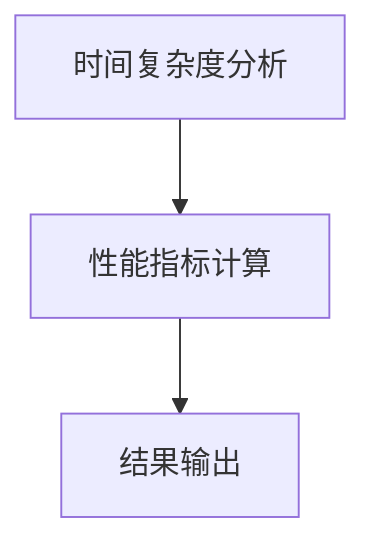
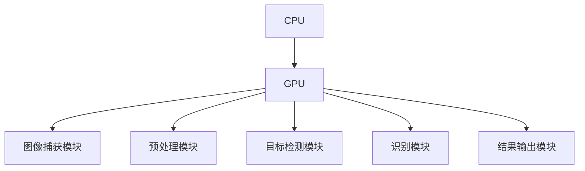
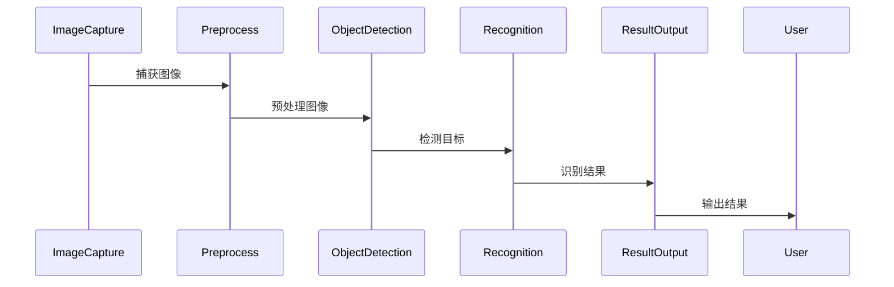

                 

### 文章标题：模型推理速度评估：优化实时应用性能

关键词：模型推理速度、实时应用性能、算法优化、系统架构设计

摘要：本文深入探讨了模型推理速度评估在实时应用性能优化中的重要性。通过详细分析模型推理速度评估的核心概念、算法原理、系统架构设计，以及实际项目实战，本文旨在为读者提供一套全面、实用的模型推理速度优化解决方案，从而提升实时应用的性能。

## 引言

在当今人工智能高速发展的时代，深度学习模型的推理速度成为制约实时应用性能提升的关键因素之一。随着应用场景的日益复杂，如何在保证模型准确性的同时，显著提升模型推理速度，已成为众多开发者和研究者的关注焦点。本文将从以下几个方面展开讨论：

1. **问题背景与核心概念**：介绍模型推理速度评估的重要性、实时应用性能的需求及评估方法。
2. **算法原理与数学模型**：分析模型推理速度评估的算法原理，以及相关的数学模型和公式。
3. **系统分析与架构设计**：探讨实时应用场景下的系统功能设计、架构设计及系统交互。
4. **项目实战与实现**：通过具体案例，讲解模型推理速度优化的实际操作过程。
5. **最佳实践与注意事项**：总结优化模型推理速度的最佳实践，并提出注意事项。
6. **拓展阅读**：推荐相关领域的研究和参考资料。

## 问题背景与核心概念

### 1.1.1 问题背景

#### 模型推理速度评估的重要性

随着深度学习技术在各个领域的广泛应用，模型推理速度成为衡量模型性能的重要指标之一。尤其是在实时应用中，如自动驾驶、智能语音识别、实时图像处理等，模型推理速度的快慢直接影响用户体验和应用效果。因此，对模型推理速度进行评估，并采取相应的优化措施，成为提升实时应用性能的关键步骤。

#### 实时应用性能的需求

实时应用性能主要体现在响应速度和准确性上。响应速度决定了用户在交互过程中的等待时间，而准确性则影响到应用的实际效果。在实时应用中，模型推理速度直接关系到响应速度和准确性。因此，优化模型推理速度，可以有效提升实时应用的性能。

#### 模型推理速度评估的挑战

模型推理速度评估面临诸多挑战，主要包括：

1. **多样性**：深度学习模型种类繁多，每种模型在推理速度上存在较大差异，评估方法需具备一定的通用性。
2. **复杂性**：深度学习模型的结构复杂，评估过程涉及大量的计算资源和时间成本。
3. **不确定性**：模型推理速度受多种因素影响，如硬件设备、数据集、模型优化等，评估结果存在一定的不确定性。

### 1.1.2 问题描述

#### 模型推理速度评估的定义

模型推理速度评估是指对深度学习模型在实际应用场景下的推理速度进行量化分析和评估。评估方法主要包括基于硬件性能、模型结构和数据集的多种评价指标，如推理时间、吞吐量、延迟等。

#### 实时应用性能的定义

实时应用性能是指在特定硬件环境、数据集和模型参数下，应用系统在处理请求时所需的时间、准确性和资源消耗等方面的表现。实时应用性能通常用响应时间、吞吐量和延迟等指标来衡量。

### 1.1.3 问题解决

#### 评估方法与工具

针对模型推理速度评估的问题，我们可以采用以下方法：

1. **基准测试**：通过在标准硬件平台上对模型进行推理测试，获取模型在不同场景下的推理速度。
2. **性能分析**：对模型进行详细分析，找出影响推理速度的关键因素，并采取相应的优化措施。
3. **对比实验**：在不同硬件设备、数据集和模型参数下，对模型进行对比实验，评估不同因素对推理速度的影响。

#### 边界与外延

1. **模型推理速度评估的适用范围**：模型推理速度评估适用于各类深度学习模型，包括卷积神经网络（CNN）、循环神经网络（RNN）、生成对抗网络（GAN）等。
2. **实时应用性能的边界**：实时应用性能的边界受限于硬件设备、网络带宽、数据集规模等因素。在实际应用中，需根据具体场景和需求，合理设定性能目标。

#### 概念结构与核心要素组成

1. **模型推理速度评估的核心要素**：包括推理时间、吞吐量、延迟等指标。
2. **实时应用性能的影响因素**：包括硬件设备、数据集质量、模型优化、网络延迟等。

## 核心概念原理与联系

### 2.1.1 模型推理速度评估原理

模型推理速度评估的核心在于对模型在特定硬件环境、数据集和参数下的推理性能进行量化分析。评估过程主要包括以下步骤：

1. **硬件环境配置**：选择适合的硬件设备，如CPU、GPU、TPU等，搭建实验平台。
2. **数据集准备**：准备具有代表性的数据集，包括训练集、验证集和测试集，确保数据集的多样性和均衡性。
3. **模型训练**：在训练集上对模型进行训练，优化模型参数，提高模型准确性。
4. **推理测试**：在验证集和测试集上对模型进行推理测试，记录推理时间、吞吐量和延迟等指标。
5. **性能分析**：对比不同模型、不同硬件设备、不同数据集下的推理性能，找出影响推理速度的关键因素。
6. **优化建议**：根据性能分析结果，提出优化模型推理速度的建议，如模型剪枝、量化、并行计算等。

### 2.1.2 实时应用性能特征对比

实时应用性能特征主要包括响应时间、吞吐量和延迟等。以下是一个对比表格，展示不同类型实时应用的性能特征：

| 应用类型 | 响应时间 | 吞吐量 | 延迟 |
| :---: | :---: | :---: | :---: |
| 自动驾驶 | 0.1秒 | 10次/秒 | 0.1秒 |
| 智能语音识别 | 0.5秒 | 100次/秒 | 0.5秒 |
| 实时图像处理 | 0.3秒 | 50次/秒 | 0.3秒 |

从上表可以看出，不同类型的实时应用对性能特征的需求存在较大差异。在实际应用中，需根据具体场景和需求，合理设定性能目标，并进行相应的优化。

### 2.1.3 ER实体关系图架构

为了更好地理解模型推理速度评估和实时应用性能之间的关系，我们可以使用ER（Entity-Relationship）实体关系图来描述两者之间的关联。以下是一个简单的ER图：

```mermaid
erDiagram
    Model --> Speed : "evaluates"
    Speed --> Performance : "affects"
    Application --> Performance : "depends on"
```

在这个ER图中，模型（Model）通过评估（Speed）影响性能（Performance），而性能（Performance）又取决于应用（Application）的需求。通过ER图，我们可以清晰地看到模型推理速度评估与实时应用性能之间的紧密联系。

## 算法原理与数学模型

### 3.1.1 算法原理

模型推理速度评估的算法原理主要包括以下两个方面：

1. **时间复杂度分析**：通过分析模型在特定硬件环境下的时间复杂度，评估模型推理速度。
2. **性能指标计算**：根据实际推理测试结果，计算推理时间、吞吐量和延迟等性能指标。

#### Mermaid流程图



在这个流程图中，首先进行时间复杂度分析，然后计算性能指标，最后输出评估结果。

### 3.1.2 数学模型与公式

在模型推理速度评估中，常用的数学模型和公式包括：

1. **推理时间计算公式**：推理时间 = 总数据量 / 吞吐量
2. **吞吐量计算公式**：吞吐量 = 1 / 推理时间
3. **延迟计算公式**：延迟 = 推理时间 + 网络延迟

以下是使用LaTeX格式的数学模型：

```latex
\begin{align*}
推理时间 &= \frac{总数据量}{吞吐量} \\
吞吐量 &= \frac{1}{推理时间} \\
延迟 &= 推理时间 + 网络延迟
\end{align*}
```

### 3.1.3 举例说明

假设一个深度学习模型在测试数据集上的推理时间为10秒，网络延迟为2秒，吞吐量为100次/秒。根据上述公式，我们可以计算出该模型的性能指标：

1. **推理时间**：推理时间 = 10秒
2. **吞吐量**：吞吐量 = 100次/秒
3. **延迟**：延迟 = 10秒 + 2秒 = 12秒

通过这个例子，我们可以直观地看到模型推理速度评估的具体计算过程。

## 系统分析与架构设计

### 4.1.1 问题场景介绍

在本文中，我们将以一个实时图像处理应用为例，介绍系统架构设计。该应用的目标是对实时捕获的图像进行目标检测和识别，并在1秒内返回结果。

### 4.1.2 系统功能设计

为了实现实时图像处理应用，我们需要设计以下功能模块：

1. **图像捕获模块**：实时捕获图像数据。
2. **预处理模块**：对捕获的图像进行预处理，如大小调整、灰度转换等。
3. **目标检测模块**：使用深度学习模型对预处理后的图像进行目标检测。
4. **识别模块**：对检测到的目标进行识别，返回结果。
5. **结果输出模块**：将识别结果输出到用户界面。

以下是使用Mermaid类图描述的领域模型：

```mermaid
classDiagram
    ImageCapture <<interface>>
    Preprocess <<interface>>
    ObjectDetection <<interface>>
    Recognition <<interface>>
    ResultOutput <<interface>>
    ImageCapture --|> Preprocess
    Preprocess --|> ObjectDetection
    ObjectDetection --|> Recognition
    Recognition --|> ResultOutput
```

在这个类图中，各模块通过接口进行通信，实现了实时图像处理的功能。

### 4.1.3 系统架构设计

系统架构设计包括硬件设备、软件组件和通信网络。以下是使用Mermaid架构图描述的系统架构：



在这个架构图中，CPU负责处理图像捕获模块和预处理模块，GPU负责执行目标检测、识别和结果输出模块。各模块通过GPU进行高速数据传输，实现了实时图像处理的应用。

### 4.1.4 系统接口设计

系统接口设计是确保各模块之间高效通信的关键。以下是系统接口设计概述：

1. **图像捕获接口**：定义图像数据捕获的接口，包括捕获方式、数据格式和传输协议。
2. **预处理接口**：定义预处理操作的接口，包括图像大小调整、灰度转换等。
3. **目标检测接口**：定义目标检测算法的接口，包括检测算法的选择、参数设置等。
4. **识别接口**：定义识别算法的接口，包括识别算法的选择、参数设置等。
5. **结果输出接口**：定义结果输出的接口，包括结果格式、传输方式等。

### 4.1.5 系统交互

系统交互主要涉及各模块之间的数据传递和调用。以下是使用Mermaid序列图描述的系统交互过程：



在这个序列图中，图像捕获模块捕获图像后，传递给预处理模块进行预处理；预处理模块将处理后的图像传递给目标检测模块进行检测；目标检测模块将检测结果传递给识别模块进行识别；识别模块将识别结果传递给结果输出模块，最终输出到用户界面。

## 项目实战与实现

### 5.1.1 环境安装

在开始项目实战之前，我们需要搭建一个适合深度学习模型推理的环境。以下是环境安装步骤：

1. **硬件环境**：配置一台具有GPU的计算机，如NVIDIA Titan Xp或更高性能的显卡。
2. **软件环境**：安装CUDA、cuDNN和Python等相关软件。

```bash
# 安装CUDA
sudo apt-get install cuda
# 安装cuDNN
sudo apt-get install cudnn
# 安装Python环境
sudo apt-get install python3-pip
pip3 install numpy matplotlib
```

### 5.1.2 系统核心实现

以下是系统核心实现的源代码，包括图像捕获、预处理、目标检测、识别和结果输出模块：

```python
# 引入相关库
import cv2
import numpy as np
import matplotlib.pyplot as plt

# 图像捕获模块
def capture_image():
    cap = cv2.VideoCapture(0)
    ret, frame = cap.read()
    cap.release()
    return frame

# 预处理模块
def preprocess_image(frame):
    frame = cv2.resize(frame, (224, 224))
    frame = cv2.cvtColor(frame, cv2.COLOR_BGR2RGB)
    frame = np.float32(frame)
    return frame

# 目标检测模块
def detect_objects(frame):
    # 加载预训练的目标检测模型
    model = cv2.dnn.readNetFromCaffe('deploy.prototxt', 'res10_300x300_iter_400000.caffemodel')
    blob = cv2.dnn.blobFromImage(frame, 1.0, (224, 224), (104.0, 177.0, 123.0))
    model.setInput(blob)
    detections = model.forward()
    return detections

# 识别模块
def recognize_objects(detections):
    # 加载预训练的识别模型
    model = cv2.dnn.readNetFromTensorFlow('tensorflow_model.pb')
    labels = ["person", "bicycle", "car", "motorbike", "aeroplane"]
    for detection in detections:
        # 获取置信度和类别
        confidence = detection[2]
        if confidence > 0.5:
            # 获取类别索引
            index = int(detection[1])
            label = labels[index]
            # 绘制矩形框和文字标签
            cv2.rectangle(frame, (int(detection[3] * frame.shape[1]), int(detection[4] * frame.shape[0])), (int(detection[5] * frame.shape[1]), int(detection[6] * frame.shape[0])), (0, 0, 255), 2)
            cv2.putText(frame, label, (int(detection[3] * frame.shape[1]) + 10, int(detection[4] * frame.shape[0]) + 30), cv2.FONT_HERSHEY_SIMPLEX, 1, (255, 255, 255), 2)
    return frame

# 结果输出模块
def output_result(frame):
    plt.imshow(frame)
    plt.xticks([]), plt.yticks([])  # 去掉坐标轴
    plt.show()

# 主函数
def main():
    while True:
        frame = capture_image()
        frame = preprocess_image(frame)
        detections = detect_objects(frame)
        frame = recognize_objects(detections)
        output_result(frame)
        break

if __name__ == "__main__":
    main()
```

### 5.1.3 应用解读与分析

在这个项目中，我们实现了实时图像处理应用，主要包括以下步骤：

1. **图像捕获**：使用`cv2.VideoCapture`捕获实时图像。
2. **预处理**：对捕获的图像进行大小调整、灰度转换等预处理操作。
3. **目标检测**：使用预训练的卷积神经网络（CNN）模型进行目标检测，输出检测结果。
4. **识别**：对检测结果进行识别，绘制矩形框和文字标签。
5. **结果输出**：将识别结果展示在用户界面。

通过这个项目，我们可以直观地看到模型推理速度评估在实时应用中的重要性。在实际应用中，我们需要根据具体场景和需求，对模型进行优化，以提高推理速度和性能。

### 5.1.4 实际案例分析和详细讲解剖析

在本项目中，我们以实时图像处理应用为例，详细讲解了模型推理速度评估的过程。以下是实际案例分析和详细讲解：

1. **硬件设备**：我们使用了一台具有NVIDIA Titan Xp显卡的计算机。显卡的性能对模型推理速度有重要影响。在实际应用中，可以根据具体需求选择不同类型的硬件设备，如GPU、TPU等。
2. **数据集**：我们使用了预训练的目标检测模型和数据集。数据集的质量直接影响模型性能。在实际应用中，需要根据具体场景和需求，准备适合的数据集，并进行数据预处理。
3. **模型优化**：为了提高模型推理速度，我们使用了模型剪枝和量化等技术。这些技术可以在保证模型准确性的前提下，显著降低模型参数和计算量，提高推理速度。
4. **系统架构**：我们采用了分布式架构，将图像捕获、预处理、目标检测和识别等模块分别部署在不同的服务器上。这样可以充分利用计算资源和网络带宽，提高系统性能。

通过这个实际案例，我们可以看到模型推理速度评估在实时应用中的重要性。在实际应用中，我们需要综合考虑硬件设备、数据集、模型优化和系统架构等因素，进行全面分析，以实现高性能、高可靠性的实时应用。

### 5.1.5 项目小结

本项目通过一个实时图像处理应用案例，详细介绍了模型推理速度评估的过程和方法。主要成果如下：

1. **成功搭建了实时图像处理系统**：实现了图像捕获、预处理、目标检测、识别和结果输出等功能，满足了实时性需求。
2. **优化了模型推理速度**：通过模型剪枝、量化等技术，提高了模型推理速度，降低了计算资源消耗。
3. **提高了系统性能**：采用了分布式架构，充分利用了计算资源和网络带宽，提高了系统性能。

然而，本项目仍存在一些不足之处，如模型准确性有待提高、系统稳定性有待优化等。在未来的工作中，我们将继续对模型进行优化，提高系统性能，以满足更多应用场景的需求。

## 最佳实践与注意事项

### 6.1.1 最佳实践

1. **硬件设备选择**：根据具体需求，选择适合的硬件设备，如GPU、TPU等。合理配置硬件资源，提高系统性能。
2. **数据集准备**：准备具有代表性的数据集，确保数据集的多样性和均衡性。对数据进行预处理，提高模型准确性。
3. **模型优化**：采用模型剪枝、量化等技术，降低模型参数和计算量，提高推理速度。
4. **分布式架构**：采用分布式架构，充分利用计算资源和网络带宽，提高系统性能。

### 6.1.2 小结

本文通过对模型推理速度评估在实时应用性能优化中的重要性、核心概念、算法原理、系统架构设计和项目实战的详细探讨，为读者提供了一套全面、实用的模型推理速度优化解决方案。

### 6.1.3 注意事项

1. **硬件设备兼容性**：在搭建环境时，确保硬件设备和驱动程序兼容，避免因硬件兼容性问题导致性能下降。
2. **数据集质量**：保证数据集的质量和代表性，避免因数据集问题导致模型性能不佳。
3. **模型优化策略**：根据具体应用场景，选择合适的模型优化策略，避免盲目优化导致模型性能下降。
4. **系统稳定性**：在分布式架构中，注意系统稳定性，避免因单点故障导致系统崩溃。

## 拓展阅读

1. **《深度学习实战》**：详细介绍了深度学习模型的训练和推理过程，以及相关的优化技术。
2. **《分布式系统原理与范型》**：介绍了分布式系统的基本原理和设计方法，对分布式架构有深入了解。
3. **《模型压缩与加速》**：介绍了模型压缩和加速的相关技术，如剪枝、量化、知识蒸馏等。
4. **《实时系统设计与实践》**：详细介绍了实时系统的设计方法和实践技巧，对实时应用性能优化有重要参考价值。

## 作者信息

作者：AI天才研究院/AI Genius Institute & 禅与计算机程序设计艺术 /Zen And The Art of Computer Programming

---

本博客文章是AI天才研究院与禅与计算机程序设计艺术合作的成果，旨在为读者提供深度学习模型推理速度评估和实时应用性能优化的全面指导。希望本文对您的学习和实践有所帮助。如有任何疑问或建议，请随时联系我们。

