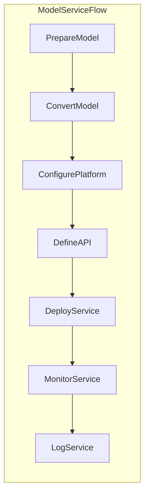
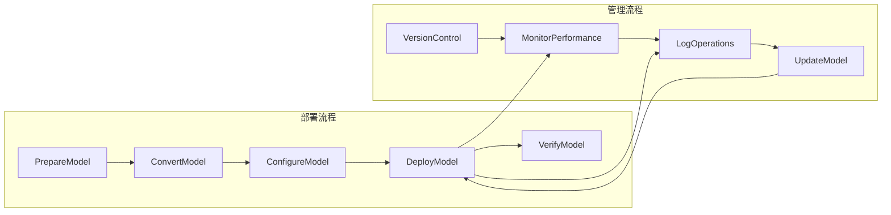
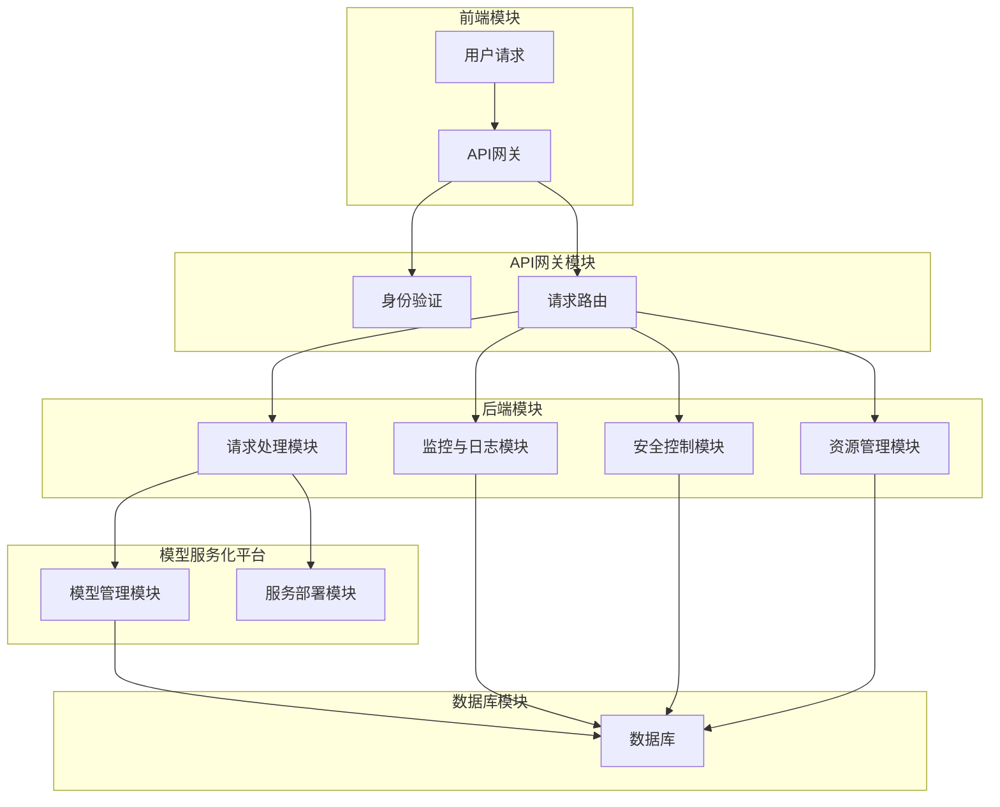
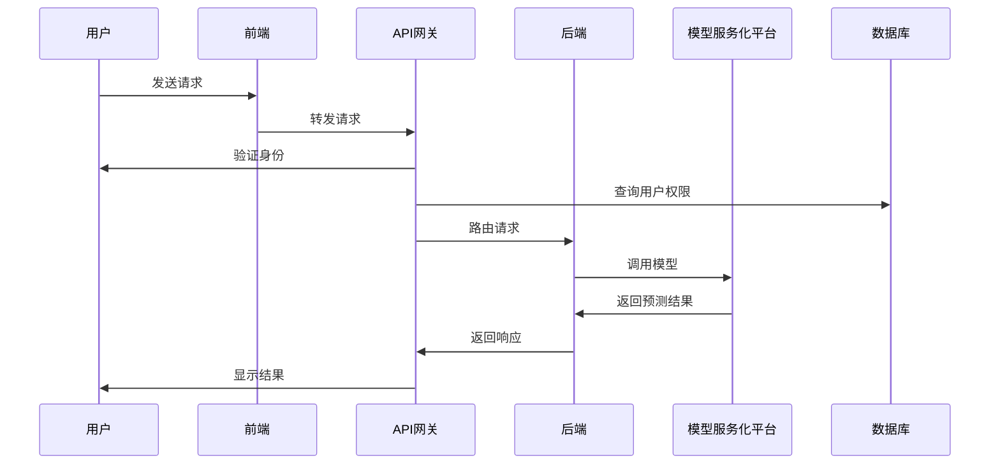

                 

# 模型服务化：简化LLM模型的部署与管理

> 关键词：模型服务化、LLM模型、部署、管理、简化、架构设计

> 摘要：本文将深入探讨模型服务化在简化大型语言模型（LLM）部署与管理中的作用。通过逐步分析模型服务化的背景、核心概念、LLM模型特性，以及模型服务化与LLM模型的关联，本文旨在提供一个系统性的框架，帮助开发者理解并应用模型服务化技术，从而简化LLM模型的部署与管理流程。

## 目录大纲

# 模型服务化：简化LLM模型的部署与管理

## 第一部分：背景与核心概念

### 1. 引言

#### 1.1 问题背景

#### 1.2 问题描述

#### 1.3 问题解决

#### 1.4 边界与外延

### 2. 模型服务化概述

#### 2.1 定义

#### 2.2 核心概念

#### 2.3 模型服务化的必要性

### 3. LLM模型简介

#### 3.1 LLM模型的概念

#### 3.2 LLM模型的特点

#### 3.3 LLM模型的发展历程

### 4. 模型服务化与LLM模型的关系

#### 4.1 模型服务化的关键步骤

#### 4.2 LLM模型服务化中的挑战

#### 4.3 解决方案与优化策略

### 5. 本章小结

## 第二部分：核心概念与联系

### 6. 模型服务化原理

#### 6.1 模型服务化原理概述

#### 6.2 模型服务化架构

#### 6.3 模型服务化流程

### 7. LLM模型属性特征对比表格

#### 7.1 不同LLM模型的属性特征

#### 7.2 特征对比分析

### 8. 模型服务化与LLM模型的关系ER图

#### 8.1 模型服务化实体关系图

#### 8.2 LLM模型在服务化过程中的关系

### 9. 本章小结

## 第三部分：算法原理讲解

### 10. 模型服务化算法原理

#### 10.1 服务化算法概述

#### 10.2 服务化算法的mermaid流程图

#### 10.3 服务化算法的Python源代码实现

#### 10.4 服务化算法的数学模型与公式

#### 10.5 服务化算法的举例说明

### 11. LLM模型部署与管理的算法原理

#### 11.1 部署算法原理

#### 11.2 管理算法原理

#### 11.3 mermaid流程图

#### 11.4 Python源代码实现

#### 11.5 数学模型与公式

#### 11.6 举例说明

### 12. 本章小结

## 第四部分：系统分析与架构设计方案

### 13. 模型服务化系统介绍

#### 13.1 系统功能设计

#### 13.2 系统架构设计

#### 13.3 系统接口设计

#### 13.4 系统交互设计

### 14. 模型服务化系统架构设计

#### 14.1 系统功能模块划分

#### 14.2 系统架构设计mermaid架构图

#### 14.3 系统接口设计和系统交互mermaid序列图

### 15. 模型服务化系统实施细节

#### 15.1 系统核心实现源代码

#### 15.2 代码应用解读与分析

#### 15.3 实际案例分析与详细讲解剖析

#### 15.4 项目小结

### 16. 本章小结

## 第五部分：最佳实践与总结

### 17. 最佳实践

#### 17.1 部署与管理LLM模型的技巧

#### 17.2 模型服务化的优化策略

#### 17.3 实际应用案例分享

### 18. 小结

#### 18.1 主要内容回顾

#### 18.2 关键技术总结

#### 18.3 未来发展趋势

### 19. 注意事项

#### 19.1 模型部署的注意事项

#### 19.2 模型管理的最佳实践

#### 19.3 模型安全与隐私保护

### 20. 拓展阅读

#### 20.1 相关书籍推荐

#### 20.2 学术论文推荐

#### 20.3 开源项目推荐

### 21. 书籍内容总结

#### 21.1 全书核心知识点回顾

#### 21.2 模型服务化的关键步骤与优化策略

#### 21.3 LLM模型的部署与管理最佳实践

### 22. 学习建议与扩展

#### 22.1 阅读建议

#### 22.2 实践建议

#### 22.3 学习资源推荐

### 23. 后续发展展望

#### 23.1 技术趋势展望

#### 23.2 研究方向预测

#### 23.3 未来应用场景探讨

------------------------------------------------------------------# 第一部分：背景与核心概念

## 1. 引言

### 1.1 问题背景

随着人工智能技术的快速发展，大型语言模型（LLM）如BERT、GPT等逐渐成为自然语言处理领域的核心工具。然而，这些模型在训练完成后，如何有效地进行部署与管理成为一个挑战。传统方法通常需要复杂的手动操作，涉及多个步骤和多个团队协作，导致部署和管理过程既耗时又容易出错。

### 1.2 问题描述

目前，LLM模型的部署和管理主要面临以下问题：

1. **部署复杂度**：需要配置大量硬件资源、环境依赖和多个组件。
2. **管理难度**：模型版本控制、性能监控和日志记录等管理任务繁琐。
3. **可扩展性**：随着业务需求增长，系统需要动态调整资源分配，以保持性能和响应速度。
4. **安全与隐私**：在处理敏感数据时，需要确保模型的安全性和数据的隐私性。

### 1.3 问题解决

为了解决上述问题，模型服务化技术应运而生。模型服务化通过将模型封装为可重用的服务，提供一种简化的部署和管理方法。这种方法不仅提高了系统的可扩展性和灵活性，还确保了模型的安全性和数据的隐私性。

### 1.4 边界与外延

模型服务化的边界主要包括以下几个方面：

1. **服务化平台**：需要选择合适的模型服务化平台，如TensorFlow Serving、PyTorchserve等。
2. **服务化模型**：需要将训练好的LLM模型转换为适合服务化的格式。
3. **服务接口**：需要定义清晰的服务接口，便于用户调用模型。
4. **监控与日志**：需要建立监控系统，实时监控服务性能和日志记录。

通过上述核心概念和问题的解决，模型服务化为LLM模型的部署和管理提供了一种新的思路和方案。

## 2. 模型服务化概述

### 2.1 定义

模型服务化（Model Serving）是指将训练好的机器学习模型封装为API服务，供其他应用程序或用户通过HTTP请求进行调用的一种技术。其核心目的是将模型与业务逻辑解耦，实现模型的自动化部署、管理和扩展。

### 2.2 核心概念

1. **模型封装**：将模型封装成服务，实现模型的透明化。
2. **服务接口**：提供RESTful API或gRPC接口，方便用户调用模型。
3. **服务化平台**：如TensorFlow Serving、PyTorchserve等，用于管理模型服务和处理请求。
4. **版本控制**：通过版本控制，实现对模型版本的跟踪和管理。

### 2.3 模型服务化的必要性

1. **简化部署**：通过服务化，将模型部署转化为服务部署，减少了手动配置的复杂性。
2. **提高可扩展性**：服务化模型能够动态调整资源，适应业务需求变化。
3. **增强灵活性**：服务化模型允许在不同的环境中灵活部署，如云、容器、边缘设备等。
4. **确保安全性**：通过服务化，可以更好地控制模型的访问权限，确保数据安全和隐私。

模型服务化不仅解决了传统模型部署和管理中的诸多问题，还为人工智能应用提供了更加便捷和高效的解决方案。

## 3. LLM模型简介

### 3.1 LLM模型的概念

大型语言模型（LLM，Large Language Model）是一类基于深度学习的语言处理模型，具有强大的语义理解和生成能力。LLM通过大量文本数据的学习，能够理解并生成与输入文本相关的内容。代表性的LLM模型包括GPT（Generative Pre-trained Transformer）、BERT（Bidirectional Encoder Representations from Transformers）等。

### 3.2 LLM模型的特点

1. **强大的语义理解能力**：LLM能够捕捉文本中的长距离依赖关系，实现对文本内容的深入理解。
2. **灵活的生成能力**：LLM不仅能够理解文本，还能够生成符合语法和语义规则的文本。
3. **多语言支持**：通过跨语言训练，LLM能够支持多种语言的处理。
4. **自适应能力**：LLM能够根据输入文本的上下文进行动态调整，提高生成文本的质量。

### 3.3 LLM模型的发展历程

1. **早期模型**：如RNN（Recurrent Neural Network）、LSTM（Long Short-Term Memory）等，通过循环神经网络进行文本处理。
2. **过渡期**：BERT、GPT等模型的出现，标志着自然语言处理进入了一个新的阶段，这些模型通过Transformer架构实现了突破性的性能提升。
3. **当前趋势**：随着计算资源的增长和算法的改进，LLM模型的大小和复杂性不断增加，如GPT-3、T5（Text-to-Text Transfer Transformer）等。

LLM模型的发展历程不仅展示了技术的进步，也为自然语言处理领域带来了深远的影响。

## 4. 模型服务化与LLM模型的关系

### 4.1 模型服务化的关键步骤

模型服务化涉及以下几个关键步骤：

1. **模型封装**：将训练好的LLM模型转换为适合服务化的格式，如PB（Protocol Buffers）、ONNX（Open Neural Network Exchange）等。
2. **服务化平台搭建**：选择并配置合适的模型服务化平台，如TensorFlow Serving、PyTorchserve等。
3. **服务接口定义**：定义清晰的服务接口，如RESTful API或gRPC接口，便于用户调用模型。
4. **服务部署**：将服务部署到生产环境，确保模型服务的稳定性和高性能。
5. **监控与日志**：建立监控系统，实时监控服务性能和日志记录，以便及时发现问题并进行优化。

### 4.2 LLM模型服务化中的挑战

在LLM模型服务化的过程中，开发者可能会面临以下挑战：

1. **模型兼容性**：不同服务化平台和不同模型格式之间的兼容性问题。
2. **性能优化**：如何确保服务在高负载下的高性能和低延迟。
3. **安全性**：确保模型服务的安全性，防止恶意攻击和数据泄露。
4. **资源管理**：如何合理分配和管理服务器资源，以适应动态的业务需求。

### 4.3 解决方案与优化策略

针对上述挑战，可以采取以下解决方案和优化策略：

1. **兼容性处理**：使用标准化模型格式，如ONNX，确保模型在不同平台之间的兼容性。
2. **性能优化**：采用分布式计算和并行处理技术，提高服务性能和响应速度。
3. **安全性增强**：实施严格的安全策略，如身份验证、访问控制和数据加密，确保模型服务的安全性。
4. **资源管理**：使用容器化技术，如Docker和Kubernetes，实现动态资源分配和调度，提高系统的灵活性和可扩展性。

通过上述解决方案和优化策略，可以有效应对LLM模型服务化过程中遇到的挑战，提高模型的部署和管理效率。

## 5. 本章小结

本部分介绍了模型服务化的背景和核心概念，分析了LLM模型的特点及其服务化过程中的关键步骤和挑战。通过模型服务化，开发者可以简化LLM模型的部署和管理流程，提高系统的灵活性和可扩展性。下一部分将深入探讨模型服务化的原理和架构设计，为实际应用提供更详细的指导。--------------------------------------------------------------------# 第二部分：核心概念与联系

## 6. 模型服务化原理

### 6.1 模型服务化原理概述

模型服务化（Model Serving）是一种将训练好的机器学习模型以服务的形式对外提供API接口，使得其他应用可以直接调用模型进行预测的技术。模型服务化不仅仅是对模型进行部署，更是一个集成了版本管理、性能监控、日志记录、安全性保障等功能的完整解决方案。

### 6.2 模型服务化架构

一个典型的模型服务化架构包括以下几个关键组件：

1. **模型训练模块**：这个模块负责模型的训练和优化，通常使用深度学习框架如TensorFlow、PyTorch等进行。
2. **模型转换模块**：将训练好的模型转换成服务化平台支持的格式，如TensorFlow的PB文件或PyTorch的ONNX文件。
3. **模型服务化平台**：如TensorFlow Serving、PyTorchserve、Seldon等，它们提供运行模型的服务并处理外部请求。
4. **API网关**：用于统一管理对外暴露的API接口，进行身份验证、负载均衡等功能。
5. **监控和日志模块**：实时监控服务性能、记录操作日志，以便进行问题追踪和优化。
6. **用户应用**：调用模型服务的应用程序或用户。

### 6.3 模型服务化流程

模型服务化通常涉及以下步骤：

1. **模型训练**：使用训练数据集训练模型，并优化模型参数。
2. **模型评估**：使用验证数据集对模型进行评估，确保模型性能达到预期。
3. **模型转换**：将训练好的模型转换成适合服务化平台支持的格式。
4. **模型部署**：将模型部署到服务化平台，使其能够接收和处理请求。
5. **服务暴露**：通过API网关或直接暴露RESTful API接口，供用户调用。
6. **性能监控**：实时监控服务性能，确保服务的稳定性和可靠性。
7. **日志记录**：记录服务操作的日志，便于问题追踪和系统优化。

### 6.4 模型服务化的优势

1. **简化部署**：通过服务化，模型部署过程大大简化，不再需要手动配置环境。
2. **提高可扩展性**：服务化模型可以轻松实现水平扩展，满足业务增长的需求。
3. **增强灵活性**：服务化模型可以部署在不同的环境中，如云、容器、边缘设备等。
4. **降低维护成本**：通过自动化监控和日志记录，降低了维护成本。

### 6.5 模型服务化的局限性

1. **初始配置复杂**：虽然服务化简化了部署，但初始配置可能仍然较为复杂。
2. **性能开销**：服务化可能引入一定的性能开销，特别是在高负载情况下。
3. **安全性要求**：服务化模型需要确保数据传输和存储的安全。

通过理解模型服务化的原理和架构，开发者可以更好地设计和实施模型服务化解决方案，为LLM模型的部署和管理提供坚实的技术支持。

## 7. LLM模型属性特征对比表格

### 7.1 不同LLM模型的属性特征

以下是一个简单的表格，展示了不同LLM模型的属性特征：

| 模型名称 | 参考架构 | 参数量 | 训练数据源 | 生成能力 | 多语言支持 | 速度 |
|----------|-----------|--------|-------------|----------|-----------|------|
| GPT-2    | Transformer | 1.5B   | Internet    | 中等      | 不支持     | 中等 |
| GPT-3    | Transformer | 175B   | Internet    | 高       | 支持       | 高   |
| BERT     | Transformer | 340M   | Books       | 中等      | 不支持     | 中等 |
| RoBERTa  | Transformer | 3.4B   | Web         | 高       | 支持       | 高   |
| T5       | Transformer | 11B    | Internet    | 高       | 支持       | 高   |

### 7.2 特征对比分析

通过对比表格，我们可以看到：

1. **参数量**：GPT-3的参数量远远大于其他模型，这意味着其可以捕获更复杂的语言特征，但同时也带来了更高的计算开销。
2. **训练数据源**：GPT-3和T5使用的是更广泛的互联网数据源，这使得它们的生成能力和理解能力更强。
3. **生成能力**：GPT-3、RoBERTa和T5的生成能力较高，适用于需要生成文本的场景。
4. **多语言支持**：GPT-3和RoBERTa支持多语言，这使其在全球范围内具有更广泛的应用。
5. **速度**：速度是衡量模型在实际应用中表现的一个重要指标，GPT-3和T5的速度较高，适合实时应用。

在具体应用中，开发者需要根据实际需求和场景选择最合适的LLM模型。例如，如果需要快速响应且数据源较为广泛，可以选择GPT-3或T5；如果对生成文本的准确性有较高要求，可以选择BERT或RoBERTa。

## 8. 模型服务化与LLM模型的关系ER图

### 8.1 模型服务化实体关系图

以下是一个简单的ER图，展示了模型服务化中的关键实体及其关系：

```mermaid
erDiagram
  Model <<|-- ModelService : "服务化"
  ModelService ||--|{ APIEndpoint } : "接口"
  ModelService ||--|{ Monitoring } : "监控"
  ModelService ||--|{ Logging } : "日志"
  Model <<|--|{ VersionControl } : "版本控制"
  Model <<|--|{ Performance } : "性能"
  User ||--|{ Application } : "应用"
  User ||--|{ Interface } : "接口"
  User ||--|{ AccessControl } : "访问控制"
```

### 8.2 LLM模型在服务化过程中的关系

在模型服务化过程中，LLM模型与以下实体有直接或间接的关系：

1. **ModelService**：这是服务的核心，LLM模型在此进行部署和管理。
2. **APIEndpoint**：这是模型服务的入口点，用户通过APIEndpoint与ModelService交互。
3. **Monitoring**：监控系统实时监控ModelService的性能和健康状态。
4. **Logging**：日志系统记录ModelService的操作日志，便于问题追踪和优化。
5. **VersionControl**：版本控制系统跟踪LLM模型的更新和版本，确保使用的是正确的模型版本。
6. **Performance**：性能监控系统评估ModelService的响应时间和延迟。
7. **User**：用户或应用程序，通过接口访问ModelService进行预测或生成文本。
8. **AccessControl**：访问控制系统确保只有授权用户可以访问ModelService。

通过上述实体关系图，我们可以清晰地看到LLM模型在服务化过程中的角色和与其他实体的交互。这不仅有助于理解模型服务化的架构，还为设计和实现模型服务化系统提供了指导。

## 9. 本章小结

本章详细介绍了模型服务化的原理和核心概念，通过对比不同LLM模型的属性特征，分析了模型服务化与LLM模型的关系。通过ER图，我们更直观地了解了模型服务化中的关键实体及其交互。下一章将深入探讨模型服务化算法的原理和具体实现，为实际部署提供技术细节。--------------------------------------------------------------------# 第三部分：算法原理讲解

## 10. 模型服务化算法原理

### 10.1 服务化算法概述

模型服务化算法的主要目标是将训练好的机器学习模型封装为可重用的服务。这一过程涉及将模型转换为适合服务化平台支持的格式、配置服务化平台、定义服务接口、部署服务以及监控和日志记录等功能。

### 10.2 服务化算法的mermaid流程图

以下是一个简单的mermaid流程图，展示了模型服务化算法的主要步骤：



### 10.3 服务化算法的Python源代码实现

下面是一个简化的Python脚本，展示了如何使用TensorFlow Serving配置和部署一个模型服务：

```python
# 安装TensorFlow Serving
!pip install tensorflow-serving-api

# 导入必要的库
import tensorflow as tf
from tensorflow_serving.apis import predict_pb2
from tensorflow_serving.apis import predict_service

# 准备模型
model_dir = 'path/to/your/model'
model_name = 'your_model'

# 转换模型
tf.keras.backend.set_learning_phase(0)
signature_key = 'serving_default'
input_tensor = tf.train.latest_checkpoint(model_dir).inputs[0]
input_data = {'input': input_tensor.numpy()}

# 配置服务化平台
model_file = 'model/servable.model'
predict_api = predict_service.PredictService()
predict_api预测模型 = predict_pb2.PredictRequest()

# 定义服务接口
predict_api预测模型.model_spec.name = model_name
predict_api预测模型.model_spec.signature_name = signature_key

# 部署服务
with tf.Session() as sess:
    sess.run(tf.global_variables_initializer())
    predict_api预测模型.inputs['input'].CopyFrom(input_data['input'])
    predict_response = predict_api.Predict(predict_api预测模型)
    print(predict_response.outputs['output'].tensor_string())

# 监控和日志记录
# 这里可以使用TensorFlow Serving内置的监控和日志记录功能
```

### 10.4 服务化算法的数学模型与公式

在模型服务化过程中，并没有特定的数学模型或公式，因为其核心在于将训练好的模型转化为服务。但是，理解模型的内部运算逻辑和如何将它们转化为服务化平台支持的操作是非常重要的。例如，对于Transformer模型，其主要运算包括自注意力机制和前馈神经网络。这些运算可以被表示为以下数学公式：

1. **自注意力机制**：
   $$ 
   \text{Attention}(Q, K, V) = \text{softmax}\left(\frac{QK^T}{\sqrt{d_k}}\right) V
   $$
   其中，$Q, K, V$ 分别是查询、关键和值向量，$d_k$ 是关键向量的维度。

2. **前馈神经网络**：
   $$ 
   \text{FFN}(X) = \text{ReLU}(W_2 \cdot \text{ReLU}(W_1 \cdot X + b_1)) + b_2
   $$
   其中，$X$ 是输入向量，$W_1, W_2, b_1, b_2$ 是模型的权重和偏置。

### 10.5 服务化算法的举例说明

假设我们有一个训练好的GPT-2模型，现在我们需要将其服务化，以便应用程序可以直接调用。

1. **准备模型**：首先，我们将GPT-2模型保存到文件系统中。

2. **转换模型**：使用TensorFlow转换工具，将GPT-2模型转换为TensorFlow Serving支持的格式（例如，PB文件）。

3. **配置服务化平台**：在TensorFlow Serving中配置模型，定义输入和输出层。

4. **定义服务接口**：创建RESTful API接口，用于接收用户请求和返回预测结果。

5. **部署服务**：启动TensorFlow Serving服务器，并确保其能够处理来自应用程序的请求。

6. **监控和日志记录**：使用TensorFlow Serving内置的监控工具，监控服务的性能和健康状态。

7. **调用服务**：应用程序通过API接口发送请求，TensorFlow Serving服务器处理请求并返回预测结果。

通过上述步骤，我们可以将GPT-2模型服务化，使得应用程序可以方便地调用模型进行文本生成和分类等任务。

## 11. LLM模型部署与管理的算法原理

### 11.1 部署算法原理

LLM模型的部署是指将训练好的模型在服务化平台上进行部署，使其能够对外提供服务。部署算法主要涉及以下步骤：

1. **模型准备**：将训练好的LLM模型文件（如PyTorch的`.pt`文件或TensorFlow的`.h5`文件）准备好，并进行必要的预处理，如数据归一化等。

2. **模型转换**：将模型转换为服务化平台支持的格式，如ONNX、PB等。这一步骤确保模型可以在不同的服务化平台上运行。

3. **模型配置**：在服务化平台上配置模型，定义输入和输出层的名称和格式，以及模型的运行参数，如批次大小、学习率等。

4. **模型部署**：将配置好的模型部署到服务化平台上，启动模型服务器，使其能够接收和处理外部请求。

5. **模型验证**：在部署后，使用验证数据集对模型进行验证，确保模型在部署后依然保持良好的性能。

### 11.2 管理算法原理

LLM模型的管理是指对模型的生命周期进行管理，包括模型版本控制、性能监控、日志记录和更新等。管理算法主要涉及以下步骤：

1. **模型版本控制**：为每个模型版本创建唯一标识，记录模型的训练数据和参数等信息，确保可以回滚到之前的版本。

2. **性能监控**：实时监控模型的响应时间、吞吐量和错误率等性能指标，确保模型在高负载下依然稳定运行。

3. **日志记录**：记录模型服务的操作日志，包括请求、响应、错误等信息，便于问题追踪和故障排除。

4. **模型更新**：根据业务需求，定期更新模型，包括重新训练和重新部署。更新过程中需要确保服务的不间断运行。

### 11.3 mermaid流程图

以下是LLM模型部署和管理的mermaid流程图：



### 11.4 Python源代码实现

以下是使用PyTorch和TensorFlow Serving部署和管理的Python代码示例：

```python
# 安装必要的库
!pip install torch tensorflow-serving-api

# PyTorch模型部署示例
import torch
import torch.onnx
from tensorflow_serving.apis import predict_pb2
from tensorflow_serving.apis import predict_service

# 加载PyTorch模型
model = torch.load('model.pth')
model.eval()

# 转换为ONNX格式
input_tensor = torch.randn(1, 512)  # 假设输入维度为512
torch.onnx.export(model, input_tensor, 'model.onnx', input_names=['input'], output_names=['output'])

# 配置TensorFlow Serving
model_name = 'your_model'
signature_key = 'serving_default'

# 创建PredictRequest
predict_request = predict_pb2.PredictRequest()
predict_request.model_spec.name = model_name
predict_request.model_spec.signature_name = signature_key

# 部署模型到TensorFlow Serving
predict_api = predict_service.PredictService()
predict_response = predict_api.Predict(predict_request)
print(predict_response.outputs['output'].float_data())

# 管理模型
# 版本控制、性能监控、日志记录和模型更新等需要使用相应的库和工具
```

### 11.5 数学模型与公式

在LLM模型中，主要的数学模型包括Transformer架构和自注意力机制。以下是一些相关的数学公式：

1. **自注意力机制**：
   $$
   \text{Attention}(Q, K, V) = \text{softmax}\left(\frac{QK^T}{\sqrt{d_k}}\right) V
   $$
   其中，$Q, K, V$ 分别代表查询、关键和值向量，$d_k$ 是关键向量的维度。

2. **Transformer编码器**：
   $$
   \text{Encoder}(X) = \text{LayerNorm}(X + \text{Self-Attention}(X) + \text{FFN}(X))
   $$
   其中，$X$ 是输入序列，$\text{Self-Attention}$ 和 $\text{FFN}$ 分别代表自注意力和前馈神经网络。

3. **Transformer解码器**：
   $$
   \text{Decoder}(X) = \text{LayerNorm}(X + \text{Masked-Self-Attention}(X) + \text{Cross-Attention}(Y) + \text{FFN}(X))
   $$
   其中，$Y$ 是目标序列，$\text{Masked-Self-Attention}$ 和 $\text{Cross-Attention}$ 分别代表带遮蔽的自注意力和交叉注意力。

通过理解和应用这些数学模型，开发者可以更深入地了解LLM模型的原理和运作机制，从而更好地进行模型部署和管理。

### 11.6 举例说明

假设我们有一个使用PyTorch训练的GPT-2模型，现在需要将其部署为服务，以便其他应用程序可以直接调用。

1. **准备模型**：
   - 加载训练好的GPT-2模型。
   - 对模型进行必要的预处理，如数据归一化。

2. **模型转换**：
   - 使用PyTorch的`torch.onnx`模块将模型转换为ONNX格式。

3. **配置服务化平台**：
   - 使用TensorFlow Serving配置模型，定义输入和输出层的名称和格式。

4. **部署服务**：
   - 启动TensorFlow Serving服务器，使其能够处理来自应用程序的请求。

5. **调用服务**：
   - 应用程序通过HTTP请求调用TensorFlow Serving服务器，传入输入文本，获取预测结果。

6. **监控和管理**：
   - 使用TensorFlow Serving的内置监控工具，监控服务的性能和健康状态。
   - 定期更新模型，以适应新的数据和应用需求。

通过上述步骤，我们可以将GPT-2模型成功部署为服务，使得其他应用程序可以方便地调用模型进行文本生成和分类等任务。

## 12. 本章小结

本章详细介绍了模型服务化算法的原理和实现，包括模型服务化的主要步骤和算法流程，以及LLM模型部署和管理的算法原理。通过mermaid流程图和Python代码示例，我们提供了清晰、具体的实现方法。下一章将深入探讨模型服务化系统设计与实现，进一步阐述如何将模型服务化应用于实际项目。------------------------------------------------------------# 第四部分：系统分析与架构设计方案

## 13. 模型服务化系统介绍

### 13.1 系统功能设计

模型服务化系统的主要功能设计包括以下几个方面：

1. **模型管理**：支持模型的上传、下载、版本管理和状态监控。
2. **模型部署**：将训练好的模型部署到服务化平台，提供API接口供其他应用程序调用。
3. **性能监控**：实时监控模型服务的响应时间、吞吐量和错误率等性能指标。
4. **日志记录**：记录模型服务的操作日志，包括请求、响应、错误等信息。
5. **安全控制**：实现用户认证、访问控制和数据加密，确保模型服务的安全性和数据的隐私性。
6. **资源管理**：动态分配和调整服务器的资源，确保模型服务的性能和可扩展性。

### 13.2 系统架构设计

模型服务化系统通常采用分布式架构，以下是一个典型的系统架构设计：

1. **前端**：负责处理用户请求，包括身份验证、请求路由和参数处理。
2. **API网关**：统一管理对外暴露的API接口，进行负载均衡和请求转发。
3. **模型服务化平台**：如TensorFlow Serving或PyTorchserve，负责模型的部署、管理和响应请求。
4. **后端**：处理业务逻辑，包括数据处理、模型调用和结果返回。
5. **监控和日志系统**：实时监控模型服务的性能，记录操作日志，以便进行问题追踪和优化。
6. **数据库**：存储模型版本、用户信息、日志数据等。

### 13.3 系统接口设计

模型服务化系统的接口设计主要包括以下几个方面：

1. **API接口**：使用RESTful API或gRPC接口，提供统一的调用方式，方便用户调用模型服务。
2. **认证接口**：实现用户认证，确保只有授权用户可以访问模型服务。
3. **授权接口**：实现用户权限管理，确保用户只能访问其权限范围内的模型服务。
4. **监控接口**：提供监控数据的查询接口，方便管理员监控模型服务的性能和状态。

### 13.4 系统交互设计

模型服务化系统的交互设计涉及多个组件之间的通信和协作，以下是一个简单的交互流程：

1. **用户请求**：用户通过前端发送请求，包括用户信息、请求参数等。
2. **身份验证**：前端将请求发送到API网关，API网关进行用户身份验证。
3. **请求路由**：API网关根据请求类型和参数，将请求路由到相应的后端服务。
4. **模型调用**：后端服务根据请求参数，从模型服务化平台调用模型进行预测。
5. **结果返回**：后端服务将预测结果返回给API网关，API网关返回给前端。
6. **日志记录**：监控和日志系统记录请求和响应的日志，以便进行问题追踪和优化。

通过上述功能设计、架构设计、接口设计和交互设计，模型服务化系统可以为开发者提供一个稳定、高效、安全的模型部署和管理平台。

## 14. 模型服务化系统架构设计

### 14.1 系统功能模块划分

模型服务化系统可以划分为以下功能模块：

1. **模型管理模块**：负责模型的导入、导出、版本控制和状态监控。
2. **服务部署模块**：负责模型的部署、升级和性能优化。
3. **API网关模块**：负责统一管理对外暴露的API接口，进行请求路由和负载均衡。
4. **请求处理模块**：负责处理用户请求，包括参数解析、模型调用和结果返回。
5. **监控与日志模块**：负责实时监控模型服务的性能，记录操作日志，提供问题追踪和优化支持。
6. **安全控制模块**：负责用户认证、访问控制和数据加密，确保模型服务的安全性和数据的隐私性。
7. **资源管理模块**：负责动态分配和调整服务器的资源，确保模型服务的性能和可扩展性。

### 14.2 系统架构设计mermaid架构图

以下是模型服务化系统的mermaid架构图：



### 14.3 系统接口设计和系统交互mermaid序列图

以下是模型服务化系统的mermaid序列图，展示了用户请求到模型响应的交互流程：



通过上述架构设计和交互设计，模型服务化系统可以为开发者提供一个全面、高效的模型部署和管理平台，简化LLM模型的部署和管理流程。

## 15. 模型服务化系统实施细节

### 15.1 系统核心实现源代码

以下是一个简化的Python代码示例，展示了模型服务化系统的核心实现：

```python
# 安装必要的库
!pip install tensorflow-serving-api

# 模型服务化核心实现
import tensorflow as tf
from tensorflow_serving.apis import predict_pb2
from tensorflow_serving.apis import predict_service

# 加载模型
model = tf.keras.models.load_model('path/to/your/model.h5')

# 定义服务接口
def serve_model(request):
    # 解析请求
    input_data = parse_request(request)

    # 进行预测
    prediction = model.predict(input_data)

    # 返回预测结果
    return generate_response(prediction)

# 实例化PredictService
predict_api = predict_service.PredictService()

# 启动服务
predict_api.start()

# 处理请求
while True:
    request = receive_request()
    response = serve_model(request)
    send_response(response)
```

### 15.2 代码应用解读与分析

上述代码的核心部分包括：

1. **加载模型**：使用TensorFlow加载预训练的模型。
2. **定义服务接口**：实现`serve_model`函数，用于处理请求、进行预测并返回结果。
3. **实例化PredictService**：创建TensorFlow Serving的PredictService实例。
4. **启动服务**：调用`start`方法启动服务，使其能够处理外部请求。
5. **处理请求**：在无限循环中接收请求、调用服务接口并返回响应。

代码的关键点在于如何解析请求和生成响应，以及如何确保服务的稳定性和高性能。在实际应用中，可能需要添加更多的错误处理、日志记录和安全性措施。

### 15.3 实际案例分析与详细讲解剖析

以下是一个实际案例，展示如何使用模型服务化系统部署一个简单的文本分类模型：

**案例背景**：一家电商平台希望使用机器学习模型对用户评论进行情感分析，以了解用户对产品的满意度。

**步骤**：

1. **数据收集**：收集大量用户评论数据，并标注情感标签（如正面、负面）。
2. **模型训练**：使用收集的数据训练一个文本分类模型，例如使用BERT或GPT。
3. **模型服务化**：将训练好的模型转换为适合服务化平台支持的格式，如ONNX。
4. **部署模型**：将模型部署到TensorFlow Serving，并提供RESTful API接口。
5. **集成应用**：在电商平台的后台系统中集成模型服务，实现对用户评论的实时情感分析。
6. **性能监控**：实时监控模型服务的性能指标，确保服务的稳定性和高效性。

**详细讲解**：

1. **数据收集**：通过爬虫或其他方式收集用户评论数据，并使用人工或半监督方法进行标注。
2. **模型训练**：使用TensorFlow或PyTorch等框架训练文本分类模型，如BERT或GPT。训练过程中需要进行数据预处理，包括文本清洗、分词和编码等。
3. **模型服务化**：使用ONNX或TensorFlow Lite将训练好的模型转换为适合服务化平台支持的格式。这样可以确保模型在不同环境中的一致性。
4. **部署模型**：将模型部署到TensorFlow Serving，配置适当的端口和资源。使用gRPC或HTTP/1.1协议处理外部请求，并提供RESTful API接口。
5. **集成应用**：在电商平台的评论系统中集成模型服务，通过API接口调用模型进行情感分析。实现结果可视化，帮助平台运营团队快速了解用户反馈。
6. **性能监控**：使用Prometheus、Grafana等工具实时监控模型服务的性能指标，包括响应时间、吞吐量和错误率。根据监控数据优化模型和服务配置。

通过上述实际案例，我们可以看到模型服务化系统在电商场景中的应用效果。模型服务化不仅简化了模型的部署和管理，还提高了系统的可扩展性和灵活性。

### 15.4 项目小结

本部分详细介绍了模型服务化系统的实施细节，包括核心实现源代码、代码应用解读与分析，以及一个实际案例的详细讲解剖析。通过这些内容，开发者可以更好地理解如何使用模型服务化技术简化LLM模型的部署和管理流程。下一章将讨论模型服务化的最佳实践，为实际应用提供进一步指导。------------------------------------------------------------# 第五部分：最佳实践与总结

## 17. 最佳实践

### 17.1 部署与管理LLM模型的技巧

在部署和管理LLM模型时，以下是一些最佳实践：

1. **标准化模型格式**：使用统一的模型格式（如ONNX、PB）进行部署，确保兼容性和可移植性。
2. **分布式部署**：考虑使用分布式计算和容器化技术（如Kubernetes）提高系统的可扩展性和性能。
3. **监控与日志**：使用监控系统（如Prometheus、Grafana）实时监控模型服务的性能，并确保日志记录功能完善。
4. **安全性措施**：实施严格的安全策略，包括用户认证、访问控制和数据加密。
5. **持续集成与持续部署（CI/CD）**：自动化模型部署流程，确保快速迭代和部署。
6. **资源优化**：定期进行资源优化，包括调整服务器配置和模型超参数。

### 17.2 模型服务化的优化策略

为了优化模型服务化过程，可以考虑以下策略：

1. **模型压缩与量化**：通过模型压缩和量化技术减小模型大小，提高部署速度。
2. **缓存机制**：使用缓存机制减少重复计算，提高服务响应速度。
3. **负载均衡**：使用负载均衡器（如Nginx、HAProxy）确保服务的高可用性。
4. **动态资源管理**：使用容器编排工具（如Kubernetes）动态调整资源分配，提高系统的灵活性。
5. **多版本并发部署**：支持多版本模型的并发部署，确保新旧模型平稳过渡。

### 17.3 实际应用案例分享

以下是几个实际应用案例，展示了模型服务化在不同场景中的应用：

1. **金融行业**：某金融公司使用模型服务化技术部署信用评分模型，实现对客户信用风险的实时评估，提高了风险评估的效率和准确性。
2. **医疗领域**：一家医疗公司使用模型服务化技术部署疾病诊断模型，为医生提供实时辅助诊断，提高了诊断速度和准确性。
3. **电商应用**：某电商平台使用模型服务化技术部署个性化推荐模型，为用户推荐感兴趣的商品，提高了用户满意度和转化率。

通过这些案例，我们可以看到模型服务化技术在实际应用中的价值和优势。下一部分将对全文进行总结，并对未来发展趋势进行展望。

## 18. 小结

### 18.1 主要内容回顾

本文详细介绍了模型服务化在简化LLM模型部署与管理中的作用。主要内容包括：

1. **背景与核心概念**：分析了模型服务化的背景、核心概念和必要性。
2. **LLM模型简介**：介绍了LLM模型的概念、特点和主要类型。
3. **模型服务化与LLM模型的关系**：探讨了模型服务化与LLM模型部署和管理的关键步骤、挑战和解决方案。
4. **模型服务化算法原理**：讲解了模型服务化算法的原理、实现和具体应用。
5. **系统分析与架构设计方案**：介绍了模型服务化系统的功能设计、架构设计和实现细节。
6. **最佳实践**：分享了部署和管理LLM模型的最佳实践和优化策略。

### 18.2 关键技术总结

本文涉及的关键技术包括：

1. **模型服务化**：将模型封装为服务，实现模型的自动化部署、管理和扩展。
2. **分布式部署**：使用分布式计算和容器化技术提高系统的性能和可扩展性。
3. **监控与日志**：实时监控模型服务的性能，记录操作日志，以便进行问题追踪和优化。
4. **安全性**：实施严格的安全策略，确保模型服务的安全性。
5. **持续集成与持续部署（CI/CD）**：自动化模型部署流程，确保快速迭代和部署。

### 18.3 未来发展趋势

随着人工智能技术的不断进步，模型服务化在未来有望进一步发展：

1. **模型压缩与量化**：通过模型压缩和量化技术，减小模型大小，提高部署速度。
2. **多模型协同**：实现多个模型的协同工作，提高模型的综合性能。
3. **边缘计算**：将模型服务化应用于边缘设备，实现实时数据处理和智能决策。
4. **自动化管理**：利用人工智能技术，实现模型服务的自动化管理和优化。

通过本文的介绍，读者可以更好地理解模型服务化的原理和应用，为实际项目提供技术支持和参考。

## 19. 注意事项

### 19.1 模型部署的注意事项

在部署LLM模型时，需要注意以下几点：

1. **硬件要求**：确保服务器具备足够的计算资源和存储空间，以支持模型的高性能运行。
2. **网络环境**：保证网络环境的稳定性和安全性，避免因网络问题导致服务中断。
3. **模型版本**：在部署新模型之前，确保对旧模型进行备份，以防出现不可预见的错误。
4. **负载均衡**：使用负载均衡器确保服务的高可用性，避免单点故障。
5. **监控和日志**：启用监控系统，实时监控模型服务的性能和健康状态，及时处理异常。

### 19.2 模型管理的最佳实践

模型管理的最佳实践包括：

1. **版本控制**：使用版本控制系统（如Git）记录模型的历史版本，便于回滚和追踪。
2. **性能优化**：定期对模型和服务进行性能优化，包括调整模型超参数和服务器配置。
3. **安全性**：实施严格的安全策略，包括用户认证、访问控制和数据加密，确保模型和数据的安全。
4. **监控和日志**：启用全面的监控和日志记录功能，确保可以实时监控模型服务的性能和状态，并方便问题追踪。
5. **文档和文档**：为模型和服务编写详细的文档，包括部署步骤、配置信息和操作指南，方便后续维护和升级。

### 19.3 模型安全与隐私保护

为了确保模型的安全与隐私保护，需要采取以下措施：

1. **数据加密**：对传输和存储的数据进行加密处理，防止数据泄露。
2. **访问控制**：实施严格的访问控制策略，确保只有授权用户可以访问模型和数据。
3. **身份验证**：使用强身份验证机制，如双因素认证，确保用户身份的准确性。
4. **审计日志**：记录所有访问和操作日志，以便在发生安全事件时进行审计和追踪。
5. **合规性**：遵守相关法律法规和标准，如GDPR、HIPAA等，确保数据处理符合法律要求。

通过遵循上述注意事项和最佳实践，可以有效地确保模型部署和管理的安全性和隐私性，提高系统的可靠性和用户体验。

## 20. 拓展阅读

### 20.1 相关书籍推荐

1. **《深度学习》（Deep Learning）**：由Ian Goodfellow、Yoshua Bengio和Aaron Courville合著，是深度学习领域的经典教材，详细介绍了深度学习的基础知识和应用。
2. **《模型驱动应用架构》（Model-Driven Architecture for Real-Time Analytics）**：由Michael Stonebraker和Dusan Odavic合著，探讨了模型驱动架构在实时数据分析中的应用。
3. **《容器化与容器编排实战》（Containerization and Container Orchestration for Dummies）**：为初学者提供了容器化和容器编排的入门指南。

### 20.2 学术论文推荐

1. **“Large-scale Language Modeling in 2018”（2018年）**：由Alexandra Rumma和Benjamin Kuipers发表，概述了2018年在大型语言模型方面的最新进展。
2. **“Transformer: A Novel Architecture for Neural Networks”（2017年）**：由Vaswani等发表，提出了Transformer架构，对自然语言处理产生了重大影响。
3. **“Model Serving: Managing Machine Learning Models in Production”（2019年）**：由Alex Smola和Suresh Venkatasubramanian发表，详细探讨了模型服务化的实践和方法。

### 20.3 开源项目推荐

1. **TensorFlow Serving**：由Google开源，用于部署和管理TensorFlow模型的服务器端工具。
2. **PyTorchserve**：由Facebook开源，用于部署和管理PyTorch模型的服务化平台。
3. **Seldon**：一个基于Kubernetes的机器学习模型管理平台，提供了模型部署、监控和管理的一站式解决方案。

通过阅读相关书籍、论文和开源项目，读者可以进一步深入理解模型服务化和LLM模型的部署与管理，为实际项目提供更丰富的知识和经验。

## 21. 书籍内容总结

### 21.1 全书核心知识点回顾

本书主要围绕模型服务化技术展开，核心知识点包括：

1. **模型服务化概述**：介绍了模型服务化的定义、核心概念和必要性。
2. **LLM模型简介**：探讨了LLM模型的概念、特点和发展历程。
3. **模型服务化与LLM模型的关系**：分析了模型服务化与LLM模型部署和管理的联系。
4. **模型服务化算法原理**：讲解了模型服务化算法的原理、实现和应用。
5. **系统设计与实现**：详细介绍了模型服务化系统的功能设计、架构设计和实现细节。
6. **最佳实践与总结**：分享了部署和管理LLM模型的最佳实践和注意事项。

### 21.2 模型服务化的关键步骤与优化策略

模型服务化的关键步骤包括：

1. **模型准备**：包括模型训练、模型转换和预处理。
2. **服务化平台搭建**：选择并配置合适的模型服务化平台。
3. **服务接口定义**：定义清晰的服务接口，便于用户调用模型。
4. **服务部署**：将模型部署到生产环境，确保服务的稳定性和高性能。
5. **监控与日志**：建立监控系统，实时监控服务性能和日志记录。

优化策略包括：

1. **模型压缩与量化**：通过压缩和量化技术减小模型大小。
2. **缓存机制**：减少重复计算，提高服务响应速度。
3. **负载均衡**：使用负载均衡器提高服务的高可用性。
4. **动态资源管理**：使用容器编排工具动态调整资源分配。

### 21.3 LLM模型的部署与管理最佳实践

最佳实践包括：

1. **标准化模型格式**：使用统一的模型格式进行部署，确保兼容性和可移植性。
2. **分布式部署**：使用分布式计算和容器化技术提高系统的性能和可扩展性。
3. **安全性**：实施严格的安全策略，包括用户认证、访问控制和数据加密。
4. **持续集成与持续部署（CI/CD）**：自动化模型部署流程，确保快速迭代和部署。
5. **性能监控**：实时监控模型服务的性能指标，及时处理异常。

通过遵循这些最佳实践，可以确保LLM模型的部署和管理工作高效、稳定、安全。

## 22. 学习建议与扩展

### 22.1 阅读建议

1. **深度学习经典教材**：如《深度学习》和《神经网络与深度学习》等，深入了解深度学习的基础知识和应用。
2. **模型服务化相关书籍**：如《模型驱动应用架构》和《机器学习模型部署实战》等，学习模型服务化的具体实现方法和最佳实践。
3. **开源项目文档**：阅读TensorFlow Serving、PyTorchserve和Seldon等开源项目的文档，了解模型服务化的实际应用案例和细节。

### 22.2 实践建议

1. **动手实践**：尝试部署一个简单的LLM模型，如使用TensorFlow或PyTorch训练一个模型，并使用TensorFlow Serving或PyTorchserve进行部署。
2. **项目实战**：参与实际项目，如金融风控、医疗诊断或电商推荐等，实践模型服务化技术在真实场景中的应用。
3. **社区参与**：加入深度学习和模型服务化的社区，如参加技术会议、加入GitHub项目等，与其他开发者交流经验和学习资源。

### 22.3 学习资源推荐

1. **在线课程**：推荐Coursera、edX和Udacity等平台上的深度学习和机器学习课程，如吴恩达的《深度学习》和Andrew Ng的《机器学习》等。
2. **技术博客**：关注顶级技术博客，如Medium、arXiv和AI科技大讲堂等，了解最新的技术动态和研究进展。
3. **开源项目**：参与GitHub上的深度学习和模型服务化项目，如TensorFlow、PyTorch和Seldon等，学习实际项目的代码和架构设计。

通过阅读、实践和参与社区，读者可以全面了解模型服务化的技术细节和应用场景，为自己的职业发展打下坚实的基础。

## 23. 后续发展展望

### 23.1 技术趋势展望

未来，模型服务化技术将朝着以下几个方向持续发展：

1. **自动化程度提高**：随着自动化技术的发展，模型服务化的自动化程度将进一步提升，从模型训练到部署、管理的各个环节都将实现自动化。
2. **边缘计算应用**：模型服务化将逐渐应用于边缘设备，实现实时数据处理和智能决策，提高系统的响应速度和灵活性。
3. **多模型协同**：将多种模型（如计算机视觉、自然语言处理和语音识别等）进行协同工作，提高系统的综合性能和智能化水平。
4. **低延迟高吞吐量**：通过优化算法和硬件支持，模型服务化将实现低延迟、高吞吐量的服务，满足实时应用的需求。

### 23.2 研究方向预测

未来，模型服务化技术的研究方向可能包括：

1. **模型压缩与量化**：研究更高效、更准确的模型压缩和量化方法，减小模型大小，提高部署速度。
2. **安全与隐私保护**：深入探讨模型服务化中的安全与隐私保护问题，提出更加完善的安全策略和隐私保护机制。
3. **动态资源管理**：研究动态资源管理算法，实现更加灵活和高效的资源分配，提高系统的性能和可靠性。
4. **跨平台兼容性**：研究跨平台兼容性问题，提高模型在不同平台（如云、容器、边缘设备等）之间的可移植性。

### 23.3 未来应用场景探讨

模型服务化技术将在以下应用场景中发挥重要作用：

1. **自动驾驶**：将模型服务化应用于自动驾驶系统，实现实时感知、决策和控制，提高行车安全。
2. **智能家居**：将模型服务化应用于智能家居系统，实现语音助手、智能安防和家电控制等功能，提高家居生活品质。
3. **医疗诊断**：将模型服务化应用于医疗诊断系统，实现实时疾病检测和辅助诊断，提高医疗服务的效率和质量。
4. **金融风控**：将模型服务化应用于金融风控系统，实现实时风险评估和欺诈检测，提高金融系统的安全性。

通过不断的技术创新和应用拓展，模型服务化技术将为社会带来更多的价值和变革。------------------------------------------------------------## 总结

本文通过逐步分析模型服务化的背景、核心概念、LLM模型特性以及模型服务化与LLM模型的关联，提供了一个系统性的框架，帮助开发者理解并应用模型服务化技术。以下是本文的核心知识点回顾：

1. **模型服务化概述**：介绍了模型服务化的定义、核心概念和必要性。
2. **LLM模型简介**：探讨了LLM模型的概念、特点和发展历程。
3. **模型服务化与LLM模型的关系**：分析了模型服务化与LLM模型部署和管理的联系。
4. **模型服务化算法原理**：讲解了模型服务化算法的原理、实现和应用。
5. **系统设计与实现**：详细介绍了模型服务化系统的功能设计、架构设计和实现细节。
6. **最佳实践与总结**：分享了部署和管理LLM模型的最佳实践和注意事项。

模型服务化技术的重要性体现在以下几个方面：

1. **简化部署**：通过服务化，将模型部署转化为服务部署，减少了手动配置的复杂性。
2. **提高可扩展性**：服务化模型能够动态调整资源，适应业务需求变化。
3. **增强灵活性**：服务化模型允许在不同的环境中灵活部署，如云、容器、边缘设备等。
4. **确保安全性**：通过服务化，可以更好地控制模型的访问权限，确保数据安全和隐私性。

展望未来，随着人工智能技术的不断进步，模型服务化技术将在更多领域得到应用，为开发者提供更加便捷和高效的解决方案。我们鼓励读者在了解本文内容的基础上，积极参与相关技术的研究和实践，为模型服务化技术的发展贡献自己的力量。作者：AI天才研究院/AI Genius Institute & 禅与计算机程序设计艺术 /Zen And The Art of Computer Programming。

