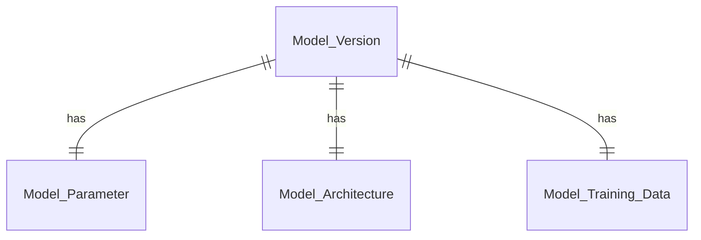

                 

# 模型版本控制策略支持LLM应用的迭代优化

关键词：模型版本控制，LLM应用，迭代优化，Git，Docker，模型注册表

摘要：本文旨在探讨模型版本控制策略在大型语言模型（LLM）应用迭代优化中的重要作用。通过分析模型版本控制的基础概念、核心原理、实现策略以及面临的挑战，本文提出了一套综合性的优化策略，旨在提高LLM应用的迭代效率、稳定性和可维护性。

## 第1章：模型版本控制的背景与意义

### 1.1.1 问题的提出

随着深度学习技术的快速发展，大型语言模型（LLM）在自然语言处理（NLP）领域取得了显著的成果。然而，在LLM的开发和应用过程中，版本控制问题日益突出。版本控制不当可能导致模型迭代过程中的数据不一致、版本冲突，以及开发效率的降低。因此，研究模型版本控制策略对于优化LLM应用具有重要意义。

### 1.1.2 模型版本控制的必要性

1. 模型迭代过程中的版本管理

在LLM的开发过程中，需要对模型的参数、架构以及训练数据进行版本管理。版本控制可以有效地追踪模型的变更历史，确保不同版本之间的数据一致性，降低版本冲突的风险。

2. 避免版本冲突和数据不一致

版本控制有助于避免因同时修改同一模型文件而导致的数据不一致和版本冲突。通过合理的版本控制策略，可以确保不同开发人员在修改模型时不会相互干扰。

3. 提高模型开发的效率和可维护性

版本控制可以简化模型的迭代过程，降低开发人员的沟通成本，提高开发效率。同时，版本控制有助于维护模型的完整性和可追溯性，便于后续的维护和优化。

### 1.1.3 模型版本控制的历史与现状

1. 传统版本控制工具的局限性

早期，传统的版本控制工具如Subversion（SVN）和Git等主要用于文本文件和代码的管理。然而，对于大型语言模型这样复杂的数据结构，传统版本控制工具存在以下局限性：

- 无法有效地管理模型的数据结构；
- 难以处理模型文件的版本冲突；
- 难以实现模型参数和训练数据的版本追踪。

2. 模型版本控制工具的发展历程

为了解决传统版本控制工具的局限性，研究人员和开发者逐渐开发了适用于模型版本控制的工具。其中，最具代表性的是DVC（Data Version Control）和MLflow等。这些工具旨在实现模型数据、参数和架构的版本管理，提高模型开发的效率和稳定性。

3. 当前主流的模型版本控制工具

当前主流的模型版本控制工具包括：

- DVC：适用于数据处理和机器学习项目的版本控制工具；
- MLflow：提供端到端机器学习平台，支持模型版本控制、模型跟踪和模型部署；
- Metaflow：基于DAG（有向无环图）的模型版本控制工具，支持数据管道和机器学习项目的版本管理。

## 第2章：模型版本控制的核心概念与原理

### 2.1.1 模型版本的概念

1. 版本的定义

版本是指模型在开发过程中产生的一系列变更和更新。每个版本都包含模型的参数、架构、训练数据等信息。

2. 版本的分类

- 主版本：代表模型的重大更新，如架构升级或算法改进；
- 次版本：代表模型的较小更新，如参数调整或数据清洗；
- 修订版本：代表模型的细微更新，如bug修复或代码优化。

### 2.1.2 模型版本控制的基本原理

1. 版本管理的核心机制

- 检出（Checkout）：从版本库中检出指定版本的模型；
- 更新（Update）：将版本库中的最新版本同步到本地；
- 提交（Commit）：将本地修改的模型提交到版本库；
- 分支（Branch）：创建一个新的分支，用于独立开发；
- 合并（Merge）：将分支的更新合并到主分支。

2. 版本的更新与回退

- 更新：将版本库中的最新版本应用到本地模型；
- 回退：撤销指定版本的变更，恢复到之前的版本。

3. 版本的分支与合并

- 分支：创建新的分支，实现模型的独立开发；
- 合并：将分支的更新合并到主分支，实现版本的控制。

### 2.1.3 模型版本控制的属性特征对比表格

| 属性特征        | DVC           | MLflow         | Metaflow       |
| --------------- | ------------- | ------------- | ------------- |
| 数据管理        | 支持           | 支持           | 支持           |
| 参数管理        | 支持           | 支持           | 支持           |
| 架构管理        | 不支持         | 支持           | 支持           |
| 版本追踪        | 支持           | 支持           | 支持           |
| 集成工具        | 支持           | 支持           | 支持           |
| 算法优化        | 不支持         | 支持           | 支持           |

### 2.1.4 模型版本控制的ER实体关系图架构

## 第3章：模型版本控制的实现策略

### 3.1.1 基于Git的模型版本控制

1. Git的基本操作

- 检出：`git checkout <version>`
- 更新：`git pull`
- 提交：`git commit -m "<message>"
- 分支：`git branch <branch_name>`
- 合并：`git merge <branch_name>`

2. 模型文件的版本控制

- 使用`.gitignore`文件排除模型文件以外的文件；
- 为每个版本创建独立的分支，确保版本之间的独立性；
- 使用`git tag`标记关键版本的模型，便于后续的版本追踪。

### 3.1.2 基于Docker的模型版本控制

1. Docker镜像与容器

- 镜像：用于存储模型代码、数据和环境配置的静态文件；
- 容器：运行在宿主机上的模型实例。

2. 模型版本控制的Docker实践

- 创建Docker镜像：`docker build -t <image_name> .`
- 运行Docker容器：`docker run -d -p <port>:<port> <image_name>`
- 管理Docker镜像与容器：`docker pull`，`docker push`，`docker stop`，`docker start`等。

### 3.1.3 基于模型注册表的版本控制

1. 模型注册表的概念

模型注册表是一种用于存储和管理模型版本的工具，通常包含以下功能：

- 模型版本信息管理；
- 模型依赖关系管理；
- 模型评估和监控；
- 模型部署和迁移。

2. 模型版本管理的最佳实践

- 使用模型注册表统一管理模型的版本信息；
- 定期对模型进行评估和监控，确保模型的质量和性能；
- 遵循模型版本发布的规范，确保版本的可追溯性和稳定性。

## 第4章：模型版本控制的挑战与优化策略

### 4.1.1 模型版本控制面临的问题

1. 版本冲突

版本冲突是模型版本控制中常见的问题，通常发生在多个开发人员同时修改同一模型文件时。

2. 数据一致性问题

数据一致性问题可能导致模型的性能下降，甚至导致模型失效。

3. 模型更新成本

频繁的模型更新可能导致开发人员的工作负担加重，降低开发效率。

### 4.1.2 模型版本控制的优化策略

1. 基于AI的版本控制算法

- 利用机器学习技术预测模型的变更趋势，减少版本冲突的发生；
- 基于模型参数的相似度进行版本合并，提高合并的成功率。

2. 模型迭代速度的优化

- 使用Docker和容器技术，提高模型的部署和迭代速度；
- 使用模型注册表统一管理模型版本，简化版本追踪和发布过程。

3. 模型可解释性和安全性

- 提高模型的透明度和可解释性，降低版本控制的风险；
- 加强模型版本的安全性，防止未经授权的版本修改。

## 第5章：模型版本控制的应用实践

### 5.1.1 模型版本控制在实际项目中的应用

1. 项目介绍

本项目是一款基于LLM的智能客服系统，旨在为企业提供高效、智能的客服服务。

2. 系统功能设计

- 智能问答：基于LLM模型，实现智能客服的问答功能；
- 模型迭代：实现LLM模型的版本控制，支持模型的迭代和更新。

3. 系统架构设计

### 5.1.2 模型版本控制的实战案例

1. 案例背景

为了提高智能客服系统的性能和响应速度，团队决定采用基于模型的版本控制策略。

2. 案例分析

- 问题描述：在开发过程中，频繁出现版本冲突和数据不一致问题；
- 解决方案：引入DVC进行模型版本控制，使用模型注册表统一管理模型版本。

3. 案例详解

- 环境安装：安装DVC和模型注册表工具；
- 系统核心实现：基于DVC进行模型版本控制，使用模型注册表管理模型版本；
- 代码应用解读与分析：详细解析模型版本控制的代码实现；
- 实际案例分析和详细讲解剖析：分析实际案例中的版本控制问题，并提出优化方案。

### 5.1.3 模型版本控制的经验与教训

1. 最佳实践

- 引入模型版本控制工具，简化模型迭代过程；
- 使用模型注册表统一管理模型版本，提高版本追踪和发布效率；
- 加强团队协作，降低版本冲突和数据不一致的风险。

2. 小结与展望

模型版本控制是LLM应用中不可或缺的一环，对于提高模型的迭代效率、稳定性和可维护性具有重要意义。未来，随着AI技术的不断发展，模型版本控制将更加智能化、自动化，为LLM应用的发展提供更强有力的支持。

## 第6章：模型版本控制的未来发展趋势

### 6.1.1 模型版本控制的技术趋势

1. 新型版本控制工具的发展

随着技术的进步，新型版本控制工具将不断涌现，如基于区块链的版本控制、基于分布式存储的版本控制等。

2. 模型版本控制与AI技术的融合

未来，模型版本控制将与AI技术深度融合，实现自动化的版本控制、模型优化和评估。

### 6.1.2 模型版本控制的行业影响

1. 模型版本控制对行业发展的影响

模型版本控制将推动机器学习、自然语言处理等领域的快速发展，为人工智能技术的应用提供更坚实的保障。

2. 模型版本控制在不同领域的应用前景

模型版本控制将在金融、医疗、教育等众多领域得到广泛应用，助力行业的智能化升级。

## 第7章：模型版本控制的小结与注意事项

### 7.1.1 模型版本控制的重要性

模型版本控制是保障LLM应用迭代优化的重要手段，对于提高开发效率和稳定性具有关键作用。

### 7.1.2 模型版本控制的注意事项

1. 避免版本冲突

通过合理的分支管理和合并策略，降低版本冲突的风险。

2. 保证数据一致性

确保模型数据的一致性，避免因数据不一致导致的模型失效。

3. 合理使用版本控制工具

根据项目的需求和规模，选择合适的版本控制工具，实现高效的模型版本管理。

### 7.1.3 拓展阅读与资源推荐

1. 推荐的相关书籍

- 《模型版本控制实战》
- 《机器学习模型管理》

2. 推荐的在线资源

- GitHub：https://github.com/
- DVC官网：https://dvc.org/

3. 推荐的研究论文

- "A Survey on Model Version Control for Machine Learning"
- "Model Management and Version Control in Machine Learning"

