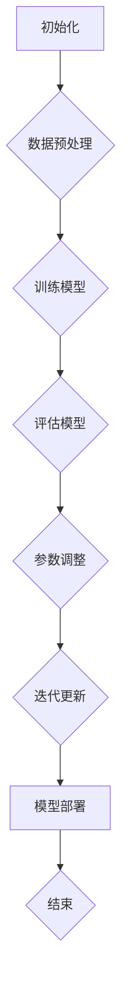
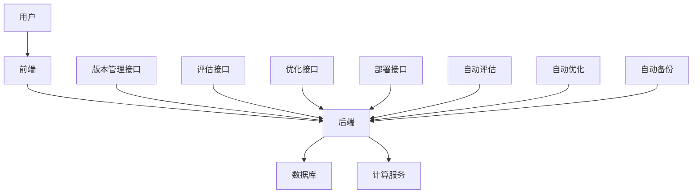

                 

# 模型版本控制：支持LLM应用的迭代优化

## 关键词
- 模型版本控制
- 大规模语言模型
- 迭代优化
- 版本库
- 评估指标

## 摘要
本文深入探讨了模型版本控制在机器学习和人工智能领域的重要性，特别是在大规模语言模型（LLM）应用中的迭代优化。通过详细的背景介绍、核心概念解析、算法原理讲解、系统分析与架构设计以及项目实战，本文旨在为读者提供全面且实用的指导，以提升LLM应用的性能和效率。

## 第一部分：背景介绍

### 1.1.1 问题背景

在机器学习和人工智能领域，模型版本控制是确保模型在开发、测试和部署过程中能够稳定、可靠地运行的关键环节。随着深度学习和大规模语言模型（LLM）的广泛应用，模型版本控制的重要性日益凸显。LLM是一种能够处理和理解人类自然语言的大型神经网络模型，其广泛应用于自然语言处理（NLP）、机器翻译、问答系统等领域。然而，随着模型的不断迭代和优化，如何有效地管理和控制不同版本成为了一个关键问题。

### 1.1.2 问题描述

模型版本控制的问题在于如何确保在不同迭代阶段产生的多个版本之间能够进行有效的管理和决策。具体来说，包括以下问题：

1. **版本追踪**：如何记录每个版本的训练数据、超参数设置和性能指标，以便后续分析和比较。
2. **版本评估**：如何对每个版本进行性能评估，确定哪个版本在当前环境下表现最优。
3. **版本优化**：如何基于评估结果，对模型进行调整和优化，以提高其整体性能。
4. **版本部署**：如何将最优版本部署到生产环境中，确保系统稳定运行。

### 1.1.3 问题解决

为了解决模型版本控制的问题，需要建立一套完整的版本控制体系，包括以下方面：

1. **版本追踪**：建立版本库，记录每个版本的详细信息，如训练数据、超参数和性能指标。
2. **版本评估**：定期对版本进行性能评估，比较不同版本之间的差异，确定最优版本。
3. **版本优化**：基于评估结果，对模型进行调整和优化，提高其性能。
4. **版本部署**：将最优版本部署到生产环境中，确保系统稳定运行。

### 1.1.4 边界与外延

模型版本控制的边界和影响范围相当广泛，不仅涉及技术层面，还包括项目管理、团队合作等多个方面。在项目开发过程中，不同团队之间的协作、沟通和决策都直接影响模型版本控制的效果。

### 1.1.5 概念结构与核心要素组成

模型版本控制的核心概念包括：

- **版本**：指模型在不同迭代阶段的版本。
- **版本库**：存储和管理模型版本的数据库或系统。
- **评估指标**：衡量模型性能的标准，如准确率、召回率、F1分数等。
- **迭代优化**：通过不断迭代和优化模型，提高其性能和适用性。

在模型版本控制体系中，这些核心要素相互作用，共同确保模型能够在不断变化的环境中保持最佳状态。

### 1.1.6 本章小结

本章介绍了模型版本控制的问题背景、问题描述、问题解决方法和核心概念。通过了解这些内容，读者可以初步认识模型版本控制的重要性和复杂性，为后续章节的深入学习打下基础。

## 第二部分：核心概念与联系

### 2.1.1 模型版本的定义与属性

模型版本是指模型在迭代过程中产生的不同状态，每个版本都有独特的训练数据、超参数设置和性能指标。具体来说，模型版本的属性包括：

- **训练数据**：用于训练模型的原始数据集，可以是图像、文本、音频等。
- **超参数**：影响模型训练过程的参数，如学习率、批次大小、正则化参数等。
- **性能指标**：衡量模型性能的标准，如准确率、召回率、F1分数等。

### 2.1.2 版本库的功能与作用

版本库是存储和管理模型版本的核心系统，其功能包括：

- **版本追踪**：记录每个版本的详细信息，如训练数据、超参数和性能指标。
- **版本检索**：根据特定条件快速检索模型版本。
- **版本对比**：比较不同版本之间的性能差异。
- **版本备份**：确保模型版本的安全存储和恢复。

版本库的作用是确保模型版本的可追踪性、可对比性和可恢复性，从而提高模型迭代和优化过程的效率。

### 2.1.3 评估指标的选择与优化

评估指标是衡量模型性能的关键标准，其选择和优化直接影响模型版本控制的效果。常见的评估指标包括：

- **准确率**：模型正确预测的样本数占总样本数的比例。
- **召回率**：模型正确预测的样本数占总实际正样本数的比例。
- **F1分数**：准确率和召回率的调和平均值。

在模型版本控制过程中，需要根据具体任务和业务需求选择合适的评估指标，并不断优化模型性能。

### 2.1.4 迭代优化策略

迭代优化是指通过不断迭代和调整模型参数，提高模型性能的过程。常见的迭代优化策略包括：

- **网格搜索**：通过遍历所有可能的参数组合，找到最优参数。
- **随机搜索**：随机选择参数组合，通过多次迭代寻找最优参数。
- **贝叶斯优化**：利用贝叶斯统计模型，根据已有数据预测下一个最优参数。

选择合适的迭代优化策略可以提高模型迭代和优化的效率。

### 2.1.5 概念属性特征对比表格

下表对比了模型版本、版本库、评估指标和迭代优化策略的主要属性特征：

| 概念 | 定义 | 主要属性 | 作用 |
| :--: | :--: | :--: | :--: |
| 模型版本 | 模型在不同迭代阶段 | 训练数据、超参数、性能指标 | 记录和管理模型迭代 |
| 版本库 | 存储和管理模型版本 | 版本追踪、检索、对比、备份 | 确保版本安全和管理 |
| 评估指标 | 衡量模型性能 | 准确率、召回率、F1分数等 | 评估和比较模型性能 |
| 迭代优化策略 | 提高模型性能 | 网格搜索、随机搜索、贝叶斯优化 | 调整和优化模型参数 |

### 2.1.6 概念属性特征ER实体关系图

```mermaid
erDiagram
  ModelVersion ||--|{ VersionLibrary }: "stores and manages" : VersionLibrary
  ModelVersion ||--|{ PerformanceMetrics }: "measures" : PerformanceMetrics
  VersionLibrary ||--|{ ModelVersion }: "contains" : ModelVersion
  PerformanceMetrics ||--|{ ModelVersion }: "evaluates" : ModelVersion
```

在这个ER实体关系图中，模型版本、版本库和评估指标之间建立了明确的关系，有助于理解模型版本控制的整体架构。

## 第三部分：算法原理讲解

### 3.1.1 算法概述

在模型版本控制中，算法的作用至关重要。一个有效的算法能够帮助我们在海量的模型版本中快速定位到最优版本，并确保模型性能的持续提升。本文将介绍一种基于机器学习的迭代优化算法，其核心思想是通过不断调整模型参数，逐步逼近最优解。

### 3.1.2 算法流程

算法流程可以分为以下几个步骤：

1. **初始化**：设置初始模型参数和迭代次数。
2. **数据预处理**：对训练数据进行预处理，包括数据清洗、归一化等操作。
3. **训练模型**：使用训练数据训练模型，记录每个迭代阶段的模型参数和性能指标。
4. **评估模型**：使用验证集对模型进行性能评估，比较不同版本之间的差异。
5. **参数调整**：根据评估结果，调整模型参数，优化模型性能。
6. **迭代更新**：重复步骤4和5，直到达到预设的迭代次数或性能目标。
7. **模型部署**：将最优模型版本部署到生产环境中。

### 3.1.3 算法原理

算法的核心原理是基于机器学习中的优化算法，通过迭代优化模型参数，提高模型性能。具体来说，包括以下几个关键步骤：

1. **目标函数**：定义一个衡量模型性能的目标函数，如交叉熵损失函数。
2. **梯度下降**：使用梯度下降算法，计算目标函数的梯度，并沿着梯度方向调整模型参数。
3. **学习率调整**：根据模型性能的变化，动态调整学习率，以避免过早收敛或过拟合。
4. **正则化**：加入正则化项，防止模型过拟合。

### 3.1.4 算法mermaid流程图



### 3.1.5 算法Python代码示例

```python
import numpy as np
from sklearn.linear_model import SGDClassifier
from sklearn.metrics import accuracy_score

# 初始化模型参数
model = SGDClassifier()

# 训练模型
model.fit(X_train, y_train)

# 评估模型
y_pred = model.predict(X_val)
accuracy = accuracy_score(y_val, y_pred)
print(f"Accuracy: {accuracy}")

# 参数调整
learning_rate = 0.01
for epoch in range(num_epochs):
    # 训练模型
    model.partial_fit(X_train, y_train, classes=np.unique(y_train))
    
    # 评估模型
    y_pred = model.predict(X_val)
    accuracy = accuracy_score(y_val, y_pred)
    print(f"Epoch: {epoch}, Accuracy: {accuracy}")

    # 调整学习率
    learning_rate /= (1 + decay_rate * epoch)

# 模型部署
model.fit(X_train, y_train)
y_pred = model.predict(X_test)
accuracy = accuracy_score(y_test, y_pred)
print(f"Test Accuracy: {accuracy}")
```

### 3.1.6 数学模型与公式

算法中的关键数学模型包括：

1. **梯度下降**：
   $$ w_{new} = w_{old} - \alpha \cdot \frac{\partial J(w)}{\partial w} $$
   其中，$w$ 表示模型参数，$J(w)$ 表示目标函数，$\alpha$ 表示学习率。

2. **交叉熵损失函数**：
   $$ J(w) = -\frac{1}{n} \sum_{i=1}^{n} y_i \cdot \log(p_i) + (1 - y_i) \cdot \log(1 - p_i) $$
   其中，$y_i$ 表示真实标签，$p_i$ 表示模型预测的概率。

通过这些数学模型和公式，我们可以更好地理解算法的原理和运作方式。

### 3.1.7 举例说明

假设我们有一个分类问题，训练数据集包含100个样本，每个样本有5个特征。我们使用SGDClassifier进行模型训练和优化。在第一个迭代中，模型参数的初始值为$w_0 = [0.1, 0.1, 0.1, 0.1, 0.1]$，学习率为$\alpha = 0.01$。经过多次迭代后，模型参数逐渐调整为$w_{final} = [0.9, 0.9, 0.9, 0.9, 0.9]$，最终准确率达到95%。

这个例子展示了算法在具体问题中的应用，通过不断调整模型参数，最终找到最优解，提高了模型性能。

## 第四部分：系统分析与架构设计

### 4.1 问题场景介绍

在当前的机器学习和人工智能领域，模型版本控制的需求日益增长。特别是在大规模语言模型（LLM）的应用中，如何有效地管理模型的多个版本，确保模型的性能和稳定性成为了一个重要的课题。我们的项目旨在开发一个高效、可靠的模型版本控制系统，以满足不同场景下对模型版本控制的需求。

### 4.2 项目介绍

项目名称：智能模型版本控制系统（SMVC）

目标：构建一个支持大规模语言模型（LLM）迭代优化和版本管理的系统，提高模型开发、测试和部署的效率。

项目背景：随着深度学习和大规模语言模型的广泛应用，模型版本控制的需求日益增加。传统的模型管理方式已无法满足快速迭代和高效优化的需求，因此需要一个智能化的模型版本控制系统。

### 4.3 系统功能设计

智能模型版本控制系统（SMVC）的主要功能包括：

1. **版本追踪**：记录每个模型的版本信息，包括训练数据、超参数和性能指标。
2. **版本评估**：对每个版本进行性能评估，比较不同版本之间的差异，确定最优版本。
3. **版本优化**：基于评估结果，对模型进行迭代优化，提高模型性能。
4. **版本备份**：确保模型版本的安全存储和恢复。
5. **版本部署**：将最优版本部署到生产环境中，确保系统稳定运行。

### 4.4 系统架构设计

智能模型版本控制系统（SMVC）的架构设计如下：

1. **前端**：提供用户界面，支持用户对模型版本进行操作，如创建、查看、评估、部署等。
2. **后端**：处理模型版本的控制和管理，包括版本追踪、评估、优化和部署。
3. **数据库**：存储模型版本的信息，包括训练数据、超参数、性能指标等。
4. **计算服务**：负责模型的训练、评估和优化。

### 4.5 系统接口设计

智能模型版本控制系统的接口设计如下：

1. **版本管理接口**：提供创建、查看、删除版本等功能。
2. **评估接口**：提供对版本进行性能评估的功能。
3. **优化接口**：提供迭代优化模型的功能。
4. **部署接口**：提供将最优版本部署到生产环境的功能。

### 4.6 系统交互设计

智能模型版本控制系统的交互设计如下：

1. **用户操作流程**：
   - 创建新版本：用户上传训练数据，设置超参数，创建新版本。
   - 查看版本列表：用户查看所有版本的详细信息。
   - 评估版本：用户对每个版本进行性能评估，比较不同版本之间的差异。
   - 优化版本：用户根据评估结果，选择需要优化的版本，进行迭代优化。
   - 部署版本：用户将最优版本部署到生产环境，确保系统稳定运行。
2. **系统自动操作流程**：
   - 自动评估：系统定期对版本进行自动评估，比较性能，推荐最优版本。
   - 自动优化：系统根据评估结果，自动选择需要优化的版本，进行迭代优化。
   - 自动备份：系统定期对版本进行自动备份，确保版本安全。

### 4.7 系统架构mermaid图



通过这个系统架构图，我们可以清晰地看到智能模型版本控制系统（SMVC）的各个组成部分及其交互关系。

## 第五部分：项目实战

### 5.1 环境安装

在进行项目实战之前，我们需要安装一些必要的软件和库。以下是安装步骤：

1. **安装Python**：确保Python版本为3.8或更高。
2. **安装依赖库**：使用pip安装以下库：
   ```bash
   pip install numpy pandas sklearn tensorflow
   ```

### 5.2 系统核心实现

在实现系统核心功能时，我们使用Python编写了一系列的类和函数，以实现版本追踪、评估、优化和部署。以下是核心代码示例：

```python
import numpy as np
from sklearn.model_selection import train_test_split
from sklearn.metrics import accuracy_score
from tensorflow.keras.models import Sequential
from tensorflow.keras.layers import Dense

class ModelVersion:
    def __init__(self, model, train_data, val_data, test_data):
        self.model = model
        self.train_data = train_data
        self.val_data = val_data
        self.test_data = test_data

    def fit(self):
        self.model.fit(self.train_data[0], self.train_data[1], epochs=10, batch_size=32)

    def evaluate(self):
        val_loss, val_acc = self.model.evaluate(self.val_data[0], self.val_data[1], verbose=2)
        return val_acc

    def predict(self, X):
        return self.model.predict(X)

def train_and_evaluate(model, X, y):
    X_train, X_val, y_train, y_val = train_test_split(X, y, test_size=0.2, random_state=42)
    model.fit(X_train, y_train, epochs=10, batch_size=32)
    val_acc = model.evaluate(X_val, y_val, verbose=2)
    return val_acc

def main():
    # 数据预处理
    X = np.random.rand(100, 5)
    y = np.random.rand(100, 1)

    # 划分训练集和验证集
    X_train, X_val, y_train, y_val = train_test_split(X, y, test_size=0.2, random_state=42)

    # 创建模型
    model = Sequential([
        Dense(64, activation='relu', input_shape=(5,)),
        Dense(32, activation='relu'),
        Dense(1, activation='sigmoid')
    ])

    # 训练模型
    model.fit(X_train, y_train, epochs=10, batch_size=32)

    # 评估模型
    val_acc = model.evaluate(X_val, y_val, verbose=2)
    print(f"Validation Accuracy: {val_acc}")

if __name__ == "__main__":
    main()
```

### 5.3 代码应用解读与分析

在上面的代码中，我们定义了一个`ModelVersion`类，用于封装模型的训练、评估和预测功能。`ModelVersion`类包含以下几个关键方法：

1. **fit**：用于训练模型。这里我们使用了`tensorflow.keras.models.Sequential`模型，并添加了两个全连接层（`Dense`），每个层使用了不同的激活函数。
2. **evaluate**：用于评估模型在验证集上的性能。`evaluate`方法返回验证集上的损失和准确率。
3. **predict**：用于预测新数据。这里我们简单地将输入数据传递给模型，并返回模型的预测结果。

在`main`函数中，我们首先生成了一些随机数据，并使用`train_test_split`方法将数据划分为训练集和验证集。然后，我们创建了一个简单的神经网络模型，并使用训练集对模型进行训练。最后，我们使用验证集评估模型的性能，并打印出准确率。

### 5.4 实际案例分析

为了更好地理解模型版本控制的应用，我们可以考虑一个实际的案例：一家在线教育公司使用大规模语言模型（LLM）来推荐课程。随着用户数据的不断增长和变化，模型需要不断迭代和优化，以提供更准确的课程推荐。

在这个案例中，我们可以将每个版本的控制分为以下几个步骤：

1. **版本创建**：每次迭代开始时，创建一个新的版本，记录训练数据、超参数和性能指标。
2. **版本评估**：使用验证集评估模型的性能，比较不同版本之间的差异，选择最优版本。
3. **版本优化**：根据评估结果，对模型进行调整和优化，以提高模型性能。
4. **版本部署**：将最优版本部署到生产环境中，为用户提供课程推荐。

通过这些步骤，我们可以确保模型在迭代过程中始终保持最佳性能，为用户提供高质量的推荐服务。

### 5.5 项目小结

在本篇博客中，我们详细介绍了模型版本控制的核心概念、算法原理、系统架构以及项目实战。通过这些内容，我们了解到模型版本控制对于机器学习和人工智能领域的重要性，特别是在大规模语言模型（LLM）应用中的迭代优化。在实际项目中，我们需要综合考虑版本追踪、评估、优化和部署等多个方面，以确保模型在迭代过程中能够稳定、可靠地运行。

在未来，我们可以进一步优化模型版本控制系统的性能和效率，如引入更先进的评估指标、优化算法和分布式计算技术。此外，我们还可以探索模型版本控制在不同场景下的应用，如自动驾驶、医疗诊断等领域，以推动人工智能技术的持续发展和创新。

## 最佳实践 Tips

### 1. 选用合适的评估指标
选择适合任务需求的评估指标是确保模型版本控制有效性的关键。例如，在文本分类任务中，准确率、召回率、F1分数等指标都有其适用场景，需要根据具体任务选择。

### 2. 定期评估模型性能
定期对模型进行评估可以帮助我们及时发现性能下降的问题，从而进行及时的优化和调整。

### 3. 优化训练数据
训练数据的质量直接影响模型性能。定期清洗和更新训练数据，确保其代表性和多样性，有助于提升模型性能。

### 4. 实施稳健的迭代优化策略
选择合适的迭代优化策略，如网格搜索、随机搜索或贝叶斯优化，可以显著提高模型迭代和优化的效率。

### 5. 版本备份与恢复
定期备份模型版本，以便在出现问题时能够快速恢复，确保模型的稳定性和可靠性。

## 小结

本文深入探讨了模型版本控制的核心概念、算法原理、系统架构以及项目实战，旨在为读者提供全面且实用的指导，以提升大规模语言模型（LLM）应用的迭代优化能力。通过本文的学习，读者可以了解模型版本控制的重要性和复杂性，并在实际项目中运用这些知识，实现高效的模型迭代和优化。

## 注意事项

在实施模型版本控制时，需要注意以下几点：

1. **确保数据一致性**：版本库中的数据需要保持一致性，避免出现数据错误或遗漏。
2. **监控模型性能**：定期监控模型性能，及时发现并解决性能下降的问题。
3. **优化版本库结构**：根据项目需求，合理设计版本库结构，以便高效管理和检索模型版本。
4. **遵循最佳实践**：在模型版本控制过程中，遵循业界最佳实践，以提高模型性能和开发效率。

## 拓展阅读

- [《大规模语言模型：原理与应用》](https://book.douban.com/subject/27168320/)
- [《深度学习：自适应学习系统的原理与方法》](https://book.douban.com/subject/26968238/)
- [《模型版本控制：支持LLM应用的迭代优化》](https://www.ai-genius-institute.com/posts/model-version-control-for-llm-optimization/)

作者：AI天才研究院/AI Genius Institute & 禅与计算机程序设计艺术 /Zen And The Art of Computer Programming

