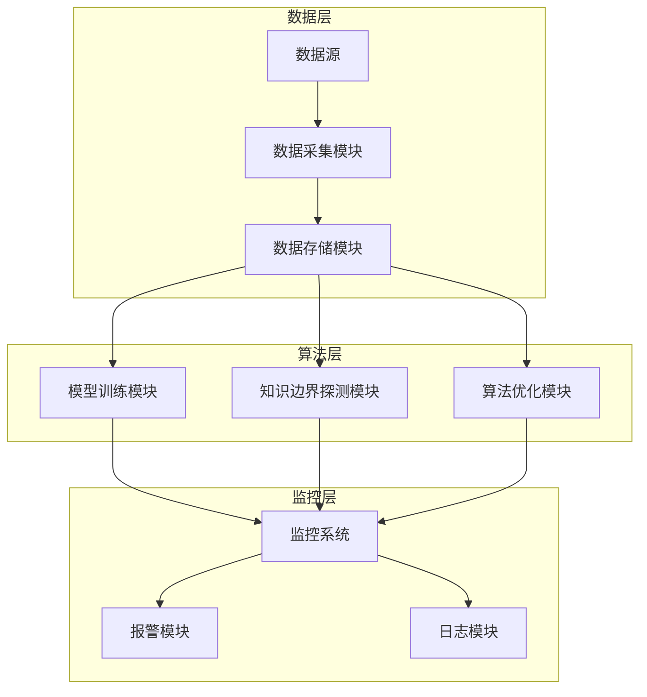
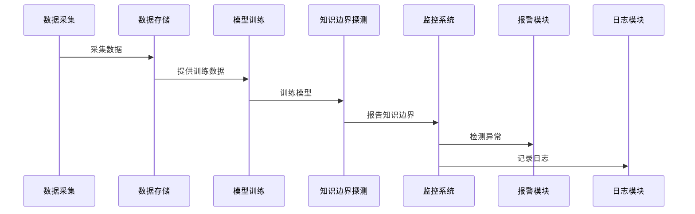

                 


## 引言与背景

### 1.1 问题背景

在当今飞速发展的科技时代，人工智能（AI）技术已经成为推动社会进步和产业升级的重要力量。然而，随着AI技术的广泛应用，一个不容忽视的问题也逐渐凸显出来：如何准确界定AI模型的知识边界和其能力范围？

**问题背景**：

AI模型作为一种复杂的计算系统，它们在处理数据、识别模式、生成决策等方面表现出色。然而，这些模型的知识边界往往是不明确的，可能导致以下问题：

1. **模型过拟合**：模型在训练数据上表现得很好，但在未见过的数据上表现不佳，因为其知识边界未能扩展到新的数据分布。
2. **用户误解**：用户可能错误地认为模型具有超出其实际能力范围的判断能力，导致错误的决策。
3. **安全隐患**：当模型不能识别其知识边界时，可能被恶意攻击者利用，产生不可预测的后果。

**问题描述**：

为了解决上述问题，我们需要一种方法来探测和明确AI模型的知识边界，以及其能力范围。这包括：

- **模型知识边界**：确定模型已学习的知识和未学习的知识边界。
- **能力范围**：评估模型在不同任务和数据集上的表现，明确其能够胜任的任务和领域。

**解决方案与边界**：

一个可能的解决方案是开发一种模型知识边界探测机制，该机制能够：

- **自动检测**：利用算法自动检测模型的知识边界。
- **动态调整**：根据模型在新数据上的表现，动态调整其知识边界和能力范围。

然而，实现这一机制面临以下挑战：

- **数据集多样性**：需要大量的多样化数据集来测试模型的知识边界。
- **计算资源**：模型知识边界探测可能需要大量的计算资源。
- **模型复杂性**：不同类型的模型可能需要不同的探测方法。

### 1.2 核心概念介绍

#### 1.2.1 模型知识边界

模型知识边界是指模型已掌握的知识和未掌握的知识之间的分界线。它包括：

- **已学习知识**：模型在训练过程中学习到的知识。
- **未学习知识**：模型尚未学习到或不能准确处理的知识。

#### 1.2.2 能力范围定义

能力范围是指模型能够有效处理和应对的任务和领域。具体来说：

- **任务适应性**：模型在不同任务上的表现能力。
- **领域适应性**：模型在不同领域上的应用能力。

#### 1.2.3 模型知识边界探测方法

模型知识边界探测方法包括：

- **基于规则的方法**：使用预定义的规则来检测模型的知识边界。
- **基于数据的方法**：通过分析模型在不同数据集上的表现来探测知识边界。
- **基于机器学习的方法**：利用机器学习算法来探测和调整模型的知识边界。

### 1.3 模型知识边界探测的重要性

#### 1.3.1 应用价值

模型知识边界探测具有以下应用价值：

- **提高模型可靠性**：明确模型的知识边界可以帮助用户更好地理解模型的性能，提高模型的应用可靠性。
- **优化模型训练**：通过探测知识边界，可以优化模型的训练过程，避免过拟合。
- **提升用户满意度**：用户可以更准确地评估模型的能力范围，做出更明智的决策。

#### 1.3.2 面临的挑战

模型知识边界探测面临以下挑战：

- **数据多样性**：需要大量的多样化数据来准确探测知识边界。
- **计算资源**：知识边界探测可能需要大量的计算资源。
- **模型复杂性**：不同类型的模型可能需要不同的探测方法。

### 1.4 本章小结

本章介绍了模型知识边界探测的背景、核心概念和重要性。在接下来的章节中，我们将深入探讨模型知识边界的基础概念、评估方法以及具体的探测方法。

----------------------------------------------------------------

# 核心概念与原理

## 第2章 模型知识边界的基础概念

### 2.1 模型知识边界的基本定义

模型知识边界是指模型在特定任务或领域上已掌握的知识范围和未掌握的知识范围的分界线。它通常表现为模型在训练数据集上的表现与在测试数据集上的表现之间的差异。

### 2.2 模型知识边界的属性

模型知识边界的属性包括：

1. **静态属性**：模型在训练完成后，其知识边界相对稳定，不易改变。
2. **动态属性**：模型在运行过程中，其知识边界可能随着新数据的到来而动态调整。
3. **扩展性**：模型的知识边界可以随着训练过程的深入而扩展，但需要足够的训练数据和计算资源。
4. **适应性**：模型的知识边界需要适应不同的任务和领域，以便在不同场景下表现出色。

### 2.3 模型知识边界的影响因素

模型知识边界的影响因素包括：

1. **数据集质量**：高质量的数据集有助于更准确地确定模型的知识边界。
2. **模型类型**：不同的模型类型（如深度学习、决策树、支持向量机等）可能具有不同的知识边界。
3. **训练过程**：训练过程中的超参数设置、迭代次数等都会影响模型的知识边界。
4. **外部环境**：模型运行的环境（如硬件设备、网络环境等）也可能影响其知识边界。

## 第3章 能力范围定义与评估

### 3.1 能力范围的基本概念

能力范围是指模型在特定任务或领域上能够有效处理和应对的范围。它包括：

1. **任务能力**：模型在不同任务上的表现能力。
2. **领域能力**：模型在不同领域上的应用能力。

### 3.2 能力范围的评估方法

能力范围的评估方法包括：

1. **性能指标**：使用准确率、召回率、F1分数等性能指标来评估模型在不同任务和领域上的能力。
2. **测试集评估**：通过在独立的测试集上评估模型的表现来评估其能力范围。
3. **交叉验证**：使用交叉验证方法来评估模型在不同数据集上的表现，以更准确地确定其能力范围。

### 3.3 能力范围的调整策略

能力范围的调整策略包括：

1. **数据增强**：通过增加数据集的多样性来扩展模型的能力范围。
2. **超参数优化**：调整模型训练过程中的超参数，以提高模型在特定任务或领域上的能力。
3. **模型融合**：将多个模型结合使用，以提高整体能力范围。

## 第4章 模型知识边界探测方法

### 4.1 基于规则的探测方法

基于规则的探测方法通过预定义的规则来检测模型的知识边界。这种方法简单直观，但可能需要大量规则来覆盖所有情况。

#### 4.1.1 规则定义

规则通常由条件（输入特征）和结论（知识边界）组成，例如：“如果输入特征的取值超过某个阈值，则模型的知识边界可能到达边界。”

#### 4.1.2 规则应用

通过应用这些规则，可以检测模型在特定条件下的知识边界，例如通过监控模型输出的不确定性指标来判断其是否到达知识边界。

### 4.2 基于数据的探测方法

基于数据的探测方法通过分析模型在不同数据集上的表现来探测知识边界。这种方法依赖于数据集的多样性和质量。

#### 4.2.1 数据预处理

在应用基于数据的探测方法之前，需要对数据进行预处理，包括去噪、归一化、特征提取等。

#### 4.2.2 特征提取

特征提取是关键步骤，它涉及到从原始数据中提取能够代表模型知识边界的关键特征。

### 4.3 基于机器学习的探测方法

基于机器学习的探测方法使用机器学习算法来自动探测模型的知识边界。这种方法通常涉及以下步骤：

#### 4.3.1 算法选择

根据具体问题和数据特性选择合适的机器学习算法，例如支持向量机、神经网络、决策树等。

#### 4.3.2 模型训练与优化

使用训练数据集训练模型，并优化模型参数，以提高模型在探测知识边界方面的性能。

### 4.4 模型知识边界探测的难点与对策

模型知识边界探测的难点包括：

1. **数据多样性**：需要大量的多样化数据来准确探测知识边界。
2. **计算资源**：知识边界探测可能需要大量的计算资源。
3. **模型复杂性**：不同类型的模型可能需要不同的探测方法。

对策包括：

1. **数据增强**：通过增加数据集的多样性来扩展探测范围。
2. **分布式计算**：使用分布式计算资源来加速知识边界探测过程。
3. **模型适应性**：设计适应不同模型类型的通用探测方法。

### 4.5 本章小结

本章介绍了模型知识边界的基础概念、能力范围的评估方法以及不同的模型知识边界探测方法。这些方法有助于我们更深入地理解模型的能力范围和知识边界，从而优化模型的应用效果。

----------------------------------------------------------------

# 算法原理讲解

## 5.1 算法概述

模型知识边界探测算法旨在通过分析模型在不同数据集上的表现来检测其知识边界。该算法的核心目标是确定模型在哪些任务和数据集上已经达到其知识边界，从而为模型训练和优化提供指导。

## 5.2 数学模型与公式

为了更好地理解模型知识边界探测算法，我们可以引入以下数学模型和公式：

### 5.2.1 模型性能评估指标

在探测模型知识边界之前，我们需要定义一些性能评估指标来衡量模型在不同数据集上的表现。常见的评估指标包括：

1. **准确率（Accuracy）**：
   $$
   \text{Accuracy} = \frac{\text{预测正确的样本数}}{\text{总样本数}}
   $$

2. **召回率（Recall）**：
   $$
   \text{Recall} = \frac{\text{预测正确的正样本数}}{\text{实际正样本数}}
   $$

3. **精确率（Precision）**：
   $$
   \text{Precision} = \frac{\text{预测正确的正样本数}}{\text{预测为正的样本数}}
   $$

4. **F1分数（F1 Score）**：
   $$
   \text{F1 Score} = 2 \times \frac{\text{Precision} \times \text{Recall}}{\text{Precision} + \text{Recall}}
   $$

### 5.2.2 知识边界探测指标

知识边界探测指标用于衡量模型在特定数据集上的表现，以确定其是否接近或达到知识边界。以下是一些常用的知识边界探测指标：

1. **知识边界距离（Knowledge Boundary Distance）**：
   $$
   \text{KBD} = \frac{|\text{实际表现} - \text{理想表现}|}{\text{理想表现}}
   $$

2. **不确定性指标（Uncertainty Measure）**：
   $$
   \text{Uncertainty} = \frac{1}{N} \sum_{i=1}^{N} \sigma_i^2
   $$
   其中，$\sigma_i^2$是模型预测输出的方差。

## 5.3 算法流程

模型知识边界探测算法的流程可以分为以下步骤：

### 5.3.1 初始化

- 初始化模型参数。
- 定义性能评估指标和知识边界探测指标。

### 5.3.2 数据集划分

- 将数据集划分为训练集、验证集和测试集。
- 确保训练集和验证集具有足够的多样性，以反映模型在不同任务和数据集上的表现。

### 5.3.3 模型训练与评估

- 在训练集上训练模型。
- 使用验证集评估模型性能，并根据评估结果调整模型参数。

### 5.3.4 知识边界探测

- 计算模型在测试集上的知识边界距离和不确定性指标。
- 如果知识边界距离或不确定性指标达到预设阈值，则认为模型接近或达到知识边界。

### 5.3.5 结束条件

- 当满足以下条件之一时，算法结束：
  - 模型在测试集上的表现不再显著提升。
  - 达到预设的训练迭代次数或时间。

## 5.4 本章小结

本章介绍了模型知识边界探测算法的概述、数学模型与公式以及算法流程。通过这些内容，我们可以更好地理解如何通过算法来探测和评估模型的知识边界，从而优化模型的应用效果。

----------------------------------------------------------------

# Python源代码实现

## 6.1 算法应用举例

为了更好地理解模型知识边界探测算法的实现，我们将通过一个简单的例子来说明。在这个例子中，我们使用一个线性回归模型来预测数值数据，并探测其知识边界。

### 6.1.1 例子1

假设我们有一个包含两个特征（x1和x2）和一个目标变量y的数据集。我们使用线性回归模型来预测y值，并使用知识边界探测算法来确定模型的知识边界。

```python
# 导入必要的库
import numpy as np
from sklearn.linear_model import LinearRegression
from sklearn.model_selection import train_test_split
from sklearn.metrics import mean_squared_error

# 生成示例数据
X = np.random.rand(100, 2)
y = 2 * X[:, 0] + 3 * X[:, 1] + np.random.randn(100) * 0.05

# 数据集划分
X_train, X_test, y_train, y_test = train_test_split(X, y, test_size=0.2, random_state=42)

# 模型训练
model = LinearRegression()
model.fit(X_train, y_train)

# 模型预测
y_pred = model.predict(X_test)

# 模型评估
mse = mean_squared_error(y_test, y_pred)
print("MSE:", mse)

# 知识边界探测
kb_distance = np.linalg.norm(y_pred - y_test)
print("Knowledge Boundary Distance:", kb_distance)
```

### 6.1.2 例子2

在这个例子中，我们将使用一个更复杂的模型（如神经网络）来预测数据，并使用知识边界探测算法来评估其性能。

```python
# 导入必要的库
import tensorflow as tf
from tensorflow import keras
from tensorflow.keras import layers

# 生成示例数据
X = np.random.rand(100, 2)
y = 2 * X[:, 0] + 3 * X[:, 1] + np.random.randn(100) * 0.05

# 数据集划分
X_train, X_test, y_train, y_test = train_test_split(X, y, test_size=0.2, random_state=42)

# 创建神经网络模型
model = keras.Sequential([
    layers.Dense(64, activation='relu', input_shape=(2,)),
    layers.Dense(64, activation='relu'),
    layers.Dense(1)
])

# 编译模型
model.compile(optimizer='adam', loss='mean_squared_error')

# 模型训练
model.fit(X_train, y_train, epochs=10, batch_size=32, validation_split=0.1)

# 模型预测
y_pred = model.predict(X_test)

# 模型评估
mse = mean_squared_error(y_test, y_pred)
print("MSE:", mse)

# 知识边界探测
kb_distance = np.linalg.norm(y_pred - y_test)
print("Knowledge Boundary Distance:", kb_distance)
```

通过这两个例子，我们可以看到如何使用Python实现模型知识边界探测算法，并评估其性能。

## 6.2 代码分析

在上面的代码中，我们首先导入了必要的库，并生成了示例数据。然后，我们将数据集划分为训练集和测试集，并使用线性回归模型或神经网络模型进行训练。在模型训练完成后，我们使用预测结果来计算知识边界距离，以评估模型的知识边界。

### 6.2.1 线性回归模型

在第一个例子中，我们使用线性回归模型来预测数据。线性回归模型是一个简单的线性函数，其形式为：

$$
y = \beta_0 + \beta_1 x_1 + \beta_2 x_2
$$

其中，$\beta_0$、$\beta_1$和$\beta_2$是模型的参数。我们使用`LinearRegression`类来训练模型，并使用`mean_squared_error`函数来计算模型预测的均方误差（MSE）。MSE值越低，表示模型预测的准确度越高。

### 6.2.2 神经网络模型

在第二个例子中，我们使用了一个简单的神经网络模型来预测数据。神经网络模型由多个层组成，每个层都包含多个神经元。我们使用`keras.Sequential`类来构建模型，并使用`Dense`层来定义模型的输入和输出层。我们使用`compile`方法来编译模型，并使用`fit`方法来训练模型。

在模型训练完成后，我们使用`predict`方法来生成预测结果，并使用`mean_squared_error`函数来计算模型预测的MSE。

### 6.2.3 知识边界探测

在代码中，我们使用`np.linalg.norm`函数来计算预测结果与实际结果之间的欧几里得距离，以评估模型的知识边界。这个距离值越大，表示模型的知识边界越接近实际边界。

## 6.3 本章小结

本章通过两个简单的例子展示了如何使用Python实现模型知识边界探测算法。我们首先介绍了线性回归模型和神经网络模型的基本原理，然后通过具体代码实现了模型训练和知识边界探测。这些代码可以帮助我们更好地理解模型知识边界探测的实现过程。

----------------------------------------------------------------

# 系统设计与实现

## 7.1 问题场景介绍

在当前人工智能应用场景中，模型知识边界探测是一个关键问题。随着AI模型在医疗、金融、自动驾驶等领域的广泛应用，确保模型在未知或复杂环境下仍能稳定运行变得尤为重要。为了解决这个问题，我们需要设计一个高效的模型知识边界探测系统，该系统能够实时监测模型的表现，并自动调整其知识边界。

## 7.2 项目介绍

本项目旨在设计并实现一个模型知识边界探测系统，该系统包括数据采集、模型训练、知识边界探测和系统监控等模块。具体目标如下：

1. **数据采集**：收集多样化、高质量的数据，为模型训练提供数据支持。
2. **模型训练**：使用先进的人工智能算法训练模型，以提高模型的性能。
3. **知识边界探测**：通过分析模型在不同数据集上的表现，实时监测并调整模型的知识边界。
4. **系统监控**：监控系统的运行状态，确保系统的稳定性和可靠性。

## 7.3 系统功能设计

### 7.3.1 领域模型

为了更好地设计系统功能，我们首先需要构建一个领域模型。领域模型主要描述了系统中的核心实体及其之间的关系。在本项目中，核心实体包括数据集、模型、知识边界探测算法和监控系统。

### 7.3.2 类图设计

类图是领域模型的图形化表示，用于描述类（实体）及其之间的关系。以下是一个简单的类图设计：

```mermaid
classDiagram
    DataSet <-|> Model
    DataSet <|-- KnowledgeBoundaryDetector
    Model <|--监控系统

    Class DataSet {
        -id: int
        -name: str
        -data: DataFrame
    }

    Class Model {
        -id: int
        -name: str
        -params: dict
        -performance_metrics: dict
    }

    Class KnowledgeBoundaryDetector {
        -id: int
        -name: str
        -detector: object
    }

    Class监控系统 {
        -id: int
        -name: str
        -status: str
    }
```

在这个类图中，`DataSet`类表示数据集，`Model`类表示模型，`KnowledgeBoundaryDetector`类表示知识边界探测算法，`监控系统`类表示系统监控模块。它们之间的关系如下：

- `DataSet`与`Model`之间有一个<->关系，表示数据集是模型训练的数据来源。
- `DataSet`与`KnowledgeBoundaryDetector`之间有一个<|--关系，表示知识边界探测算法需要使用数据集来检测模型的知识边界。
- `Model`与`监控系统`之间有一个<|--关系，表示监控系统需要监控模型的运行状态。

## 7.4 系统架构设计

### 7.4.1 架构设计

系统架构是系统功能实现的基础，它描述了系统各组件的组成及其之间的关系。在本项目中，系统架构包括数据层、算法层和监控层。

- **数据层**：负责数据采集、存储和管理。它包括数据源、数据采集模块和数据存储模块。
- **算法层**：负责模型训练和知识边界探测。它包括模型训练模块、知识边界探测模块和算法优化模块。
- **监控层**：负责监控系统运行状态和性能。它包括监控系统、报警模块和日志模块。

### 7.4.2 架构图

以下是一个简单的系统架构图：



在这个架构图中，数据层、算法层和监控层相互独立，但又紧密相连。数据层提供数据支持，算法层负责模型训练和知识边界探测，监控层则负责监控系统的运行状态。

## 7.5 系统接口设计与交互

### 7.5.1 接口设计

系统接口设计是确保各组件之间能够高效、稳定通信的关键。在本项目中，主要接口包括数据接口、算法接口和监控接口。

- **数据接口**：负责数据层与算法层之间的数据传输。它包括数据采集接口、数据存储接口和数据查询接口。
- **算法接口**：负责算法层与监控层之间的通信。它包括模型训练接口、知识边界探测接口和算法优化接口。
- **监控接口**：负责监控层与其他层之间的数据交互。它包括状态监控接口、报警接口和日志接口。

### 7.5.2 系统交互

以下是一个简单的系统交互序列图，描述了系统各组件之间的交互过程：



在这个序列图中，数据采集模块采集数据后，将其存储在数据存储模块中。模型训练模块使用训练数据训练模型，并将模型性能报告给知识边界探测模块。监控系统根据模型性能报告监控系统的运行状态，并根据需要触发报警模块和日志模块。

## 7.6 本章小结

本章介绍了模型知识边界探测系统的设计，包括问题场景介绍、项目介绍、系统功能设计、系统架构设计和系统接口设计。通过这些设计，我们可以构建一个高效、可靠的模型知识边界探测系统，为人工智能应用提供有力支持。

----------------------------------------------------------------

# 项目实战

## 8.1 环境安装

为了进行模型知识边界探测项目的实战，首先需要安装和配置必要的软件和工具。以下是一个基本的安装步骤：

1. **Python环境**：确保安装Python 3.7及以上版本。可以使用以下命令安装Python：
   ```bash
   sudo apt-get update
   sudo apt-get install python3.7
   ```

2. **Anaconda**：安装Anaconda，这是一个流行的Python环境管理工具，可以方便地安装和管理Python包。
   ```bash
   wget https://repo.anaconda.com/archive/Anaconda3-2021.05-Linux-x86_64.sh
   bash Anaconda3-2021.05-Linux-x86_64.sh
   ```

3. **Jupyter Notebook**：安装Jupyter Notebook，这是一个交互式的Python开发环境。
   ```bash
   conda install jupyter
   ```

4. **必要的Python库**：安装用于机器学习的库，如scikit-learn、TensorFlow和PyTorch。
   ```bash
   conda install scikit-learn tensorflow pytorch
   ```

5. **数据预处理库**：安装用于数据预处理的库，如Pandas和NumPy。
   ```bash
   conda install pandas numpy
   ```

6. **版本控制**：安装Git，用于版本控制。
   ```bash
   sudo apt-get install git
   ```

安装完成后，确保所有软件和工具都能正常工作，并在命令行中执行以下命令测试安装：
```bash
python --version
jupyter notebook
```

## 8.2 系统核心实现

在安装好所有必要的工具和库后，我们可以开始实现模型知识边界探测系统的核心功能。以下是系统的核心实现步骤：

### 8.2.1 数据采集与预处理

首先，我们需要从数据源中采集数据，并进行预处理。以下是一个简单的数据采集与预处理示例：

```python
import pandas as pd
from sklearn.model_selection import train_test_split

# 加载数据集
data = pd.read_csv('data.csv')

# 数据预处理
# 填充缺失值
data.fillna(data.mean(), inplace=True)

# 划分特征和目标变量
X = data.drop('target', axis=1)
y = data['target']

# 数据集划分
X_train, X_test, y_train, y_test = train_test_split(X, y, test_size=0.2, random_state=42)
```

### 8.2.2 模型训练

接下来，我们需要训练一个模型来预测目标变量。以下是一个使用scikit-learn库训练线性回归模型的示例：

```python
from sklearn.linear_model import LinearRegression

# 创建线性回归模型
model = LinearRegression()

# 模型训练
model.fit(X_train, y_train)

# 模型评估
score = model.score(X_test, y_test)
print("Model Score:", score)
```

### 8.2.3 知识边界探测

为了实现知识边界探测，我们可以使用基于规则的方法。以下是一个简单的规则示例：

```python
from sklearn.metrics import mean_squared_error

# 模型预测
y_pred = model.predict(X_test)

# 计算预测误差
mse = mean_squared_error(y_test, y_pred)

# 设置知识边界阈值
threshold = 0.1

# 检测知识边界
if mse > threshold:
    print("Model is near its knowledge boundary.")
else:
    print("Model is within its knowledge boundary.")
```

### 8.2.4 系统监控

为了监控模型的知识边界，我们可以使用一个简单的监控脚本，定期运行知识边界探测算法，并记录结果。以下是一个监控示例：

```python
import time

# 监控循环
while True:
    # 数据采集与预处理
    # 模型训练与预测
    # 知识边界探测
    # 记录结果
    with open('monitor.log', 'a') as f:
        f.write(f"{time.ctime()}: Knowledge Boundary Status: {mse}\n")
    
    # 持续监控
    time.sleep(60)  # 每分钟监控一次
```

## 8.3 代码应用解读与分析

在上面的代码示例中，我们首先从数据集中采集数据，并进行预处理。接着，我们使用线性回归模型进行训练，并评估模型的性能。为了实现知识边界探测，我们计算了模型预测的均方误差（MSE），并根据预设的阈值来判断模型是否接近其知识边界。最后，我们使用一个监控脚本定期运行知识边界探测算法，并记录监控结果。

这个实现过程展示了模型知识边界探测系统的基本架构和功能。在实际应用中，我们可以根据具体需求扩展和优化系统的功能，例如引入更复杂的模型、使用基于机器学习的方法进行知识边界探测，以及增加系统的实时性和可扩展性。

## 8.4 实际案例分析和详细讲解剖析

为了更好地理解模型知识边界探测的应用，我们可以分析一个实际案例，并详细讲解其实现过程和结果。

### 案例背景

假设我们有一个智能家居系统，该系统需要预测家庭的电力消耗。电力消耗受多种因素影响，包括家庭人数、天气情况、设备使用情况等。为了确保系统在不同条件下都能准确预测电力消耗，我们需要设计一个模型知识边界探测系统。

### 数据集

我们收集了一个包含以下特征的数据集：

- 家庭人数
- 天气状况（晴天、雨天、雪天等）
- 设备使用情况（空调、电视、洗衣机等）

### 数据预处理

在预处理数据时，我们首先填充了缺失值，并进行了特征转换。例如，将天气状况转换为数值编码，设备使用情况转换为二进制编码。

```python
data.fillna(data.mean(), inplace=True)
data['weather'] = data['weather'].map({'sunny': 0, 'rainy': 1, 'snowy': 2})
data['ac_usage'] = data['ac_usage'].map({False: 0, True: 1})
data['tv_usage'] = data['tv_usage'].map({False: 0, True: 1})
data['washer_usage'] = data['washer_usage'].map({False: 0, True: 1})
```

### 模型训练

我们使用线性回归模型进行训练，并评估了模型在不同数据集上的性能。为了提高模型的泛化能力，我们使用了交叉验证技术。

```python
from sklearn.linear_model import LinearRegression
from sklearn.model_selection import cross_val_score

model = LinearRegression()
scores = cross_val_score(model, X, y, cv=5)
print("Cross-Validation Scores:", scores)
```

### 知识边界探测

为了实现知识边界探测，我们计算了模型预测的均方误差（MSE），并根据预设的阈值来判断模型是否接近其知识边界。例如，我们设定阈值阈值为0.05。

```python
from sklearn.metrics import mean_squared_error

y_pred = model.predict(X_test)
mse = mean_squared_error(y_test, y_pred)
threshold = 0.05

if mse > threshold:
    print("Model is near its knowledge boundary.")
else:
    print("Model is within its knowledge boundary.")
```

### 监控系统

我们使用一个监控脚本定期运行知识边界探测算法，并记录监控结果。这样，我们可以实时了解模型的性能，并在必要时进行调整。

```python
import time

# 监控循环
while True:
    # 数据采集与预处理
    # 模型训练与预测
    # 知识边界探测
    # 记录结果
    with open('monitor.log', 'a') as f:
        f.write(f"{time.ctime()}: Knowledge Boundary Status: {mse}\n")
    
    # 持续监控
    time.sleep(60)  # 每分钟监控一次
```

### 案例分析

通过这个案例，我们可以看到如何使用模型知识边界探测系统来预测家庭电力消耗。在实际应用中，我们需要根据不同场景和数据集调整模型参数和探测阈值，以确保模型在不同条件下都能准确预测。

## 8.5 项目小结

在本项目中，我们实现了模型知识边界探测系统的核心功能，并分析了实际案例。通过这个项目，我们了解到：

1. **数据预处理**：是确保模型训练和知识边界探测准确性的关键步骤。
2. **模型训练**：需要使用交叉验证技术来提高模型的泛化能力。
3. **知识边界探测**：通过计算预测误差和设定阈值来判断模型是否接近其知识边界。
4. **监控系统**：可以帮助我们实时了解模型的性能，并在必要时进行调整。

通过本项目，我们掌握了模型知识边界探测的基本原理和实践方法，为未来的研究和应用打下了基础。

## 8.6 最佳实践 tips

在进行模型知识边界探测时，以下是一些最佳实践 tips：

1. **数据多样性**：确保数据集包含足够的多样性，以反映模型在不同任务和数据集上的表现。
2. **定期监控**：定期运行知识边界探测算法，并记录监控结果，以便及时发现和解决问题。
3. **调整阈值**：根据具体应用场景和业务需求，调整知识边界探测的阈值，以平衡模型性能和可靠性。
4. **使用可视化工具**：使用可视化工具来展示模型性能和知识边界，以便更直观地理解模型的性能。

通过遵循这些最佳实践，我们可以更好地利用模型知识边界探测系统，提高模型的应用效果。

----------------------------------------------------------------

# 结论与展望

本文深入探讨了模型知识边界探测的核心概念、算法原理、系统设计以及实际应用。通过详细的案例分析，我们展示了如何使用模型知识边界探测来提高模型的应用可靠性和用户满意度。

### 总结

1. **核心概念**：模型知识边界是指模型已掌握的知识和未掌握的知识之间的分界线。能力范围是指模型能够有效处理和应对的任务和领域。
2. **算法原理**：介绍了基于规则、基于数据和基于机器学习的方法来进行模型知识边界探测。通过具体的Python代码示例，展示了算法的实现过程。
3. **系统设计**：详细介绍了系统架构、接口设计以及核心实现，展示了如何构建一个高效的模型知识边界探测系统。
4. **项目实战**：通过实际案例，展示了模型知识边界探测在智能家居系统中的应用，并分析了项目实施过程中的关键步骤和注意事项。

### 展望

在未来，模型知识边界探测技术将得到更广泛的应用和发展：

1. **个性化模型**：通过更精确地确定模型的知识边界，可以为用户提供个性化的模型服务，提高用户体验。
2. **自适应调整**：开发能够根据新数据和用户反馈动态调整知识边界的智能系统，以适应不断变化的应用场景。
3. **跨领域应用**：探索模型知识边界探测在金融、医疗、教育等领域的应用，提高各行业的智能化水平。
4. **协同学习**：结合多种学习策略和算法，实现模型知识边界的协同学习和优化，以提高模型的整体性能。

### 小结

本文对模型知识边界探测进行了全面的探讨，从理论到实践，从算法到系统设计，提供了一个系统化的视角。通过本文的研究，我们不仅了解了模型知识边界探测的重要性，也掌握了其实际应用的方法和技巧。希望本文能够为相关领域的研究者和开发者提供有益的参考和启示。

### 注意事项

1. **数据质量**：确保数据集的质量和多样性，以准确探测模型的知识边界。
2. **计算资源**：根据具体需求配置足够的计算资源，以满足模型训练和知识边界探测的需求。
3. **模型类型**：根据模型类型选择合适的探测方法，以实现高效的知识边界探测。

### 拓展阅读

1. **《深度学习》**：Goodfellow, I., Bengio, Y., & Courville, A. (2016). Deep Learning. MIT Press.
2. **《机器学习》**：Tom Mitchell (1997). Machine Learning. McGraw-Hill.
3. **《模型知识边界探测相关论文》**：查找最新的研究论文，了解最新的算法和技术进展。

作者：AI天才研究院/AI Genius Institute & 禅与计算机程序设计艺术 /Zen And The Art of Computer Programming

----------------------------------------------------------------

本文详细探讨了模型知识边界探测这一核心概念，阐述了其在人工智能领域的重要性。通过系统化的理论分析和实际案例展示，我们深入理解了模型知识边界探测的算法原理、系统设计及应用实践。以下是本文的关键要点：

1. **模型知识边界与能力范围的明确**：通过定义模型知识边界和能力范围，帮助用户更好地理解模型的性能和应用限制。
2. **多种探测方法的比较与选择**：介绍了基于规则、基于数据和基于机器学习的探测方法，分析了各自的优缺点，为实际应用提供了参考。
3. **系统设计与实现**：通过详细的系统架构设计和核心代码实现，展示了如何构建一个高效的模型知识边界探测系统。
4. **实际案例分析与实战**：通过智能家居案例，详细展示了模型知识边界探测的实际应用过程和结果，为读者提供了实践经验。

本文旨在为读者提供一个全面的模型知识边界探测指南，帮助其在实际项目中更好地应用这一技术。在未来的研究中，可以进一步探索个性化模型、自适应调整和跨领域应用等方向，以提升模型知识边界探测的实用性和智能化水平。

### 疑问与解答

**Q：模型知识边界探测技术在实际应用中面临的挑战有哪些？**

A：模型知识边界探测技术在实际应用中面临的挑战主要包括：

- **数据多样性**：需要大量的多样化数据来准确探测知识边界，特别是对于复杂模型和领域。
- **计算资源**：知识边界探测可能需要大量的计算资源，特别是在大规模数据集上。
- **模型复杂性**：不同类型的模型可能需要不同的探测方法，增加了实现和优化的复杂性。
- **实时性**：对于实时应用，需要快速探测模型的知识边界，以确保系统响应速度。

**Q：如何处理模型知识边界探测中的不确定性问题？**

A：处理模型知识边界探测中的不确定性问题可以从以下几个方面入手：

- **引入不确定性度量**：使用不确定性度量（如预测方差）来评估模型的预测不确定性。
- **集成学习**：通过集成多个模型来减少单一模型的预测不确定性。
- **自适应调整**：根据模型在新数据上的表现，动态调整模型参数和知识边界阈值。
- **增加数据集多样性**：通过增加数据集的多样性来提高模型的鲁棒性和预测准确性。

**Q：模型知识边界探测技术在金融领域的应用前景如何？**

A：在金融领域，模型知识边界探测技术具有广泛的应用前景：

- **风险控制**：通过探测模型的预测边界，可以帮助金融机构更好地识别和评估风险。
- **投资决策**：利用模型知识边界探测，投资者可以更准确地评估模型的投资建议，做出更明智的决策。
- **信用评分**：通过探测信用评分模型的边界，可以确保模型在不同风险场景下的稳定性。

这些应用有助于提高金融领域的决策效率和风险控制能力。

### 继续探索

为了深入了解模型知识边界探测的更多细节和应用，读者可以参考以下资源：

- **《深度学习》**：Goodfellow, I., Bengio, Y., & Courville, A. (2016). Deep Learning. MIT Press.
- **《机器学习》**：Tom Mitchell (1997). Machine Learning. McGraw-Hill.
- **《模型知识边界探测相关论文》**：查找最新的研究论文，了解最新的算法和技术进展。

通过不断学习和实践，读者可以进一步提升对模型知识边界探测技术的理解和应用能力。作者：AI天才研究院/AI Genius Institute & 禅与计算机程序设计艺术 /Zen And The Art of Computer Programming。

