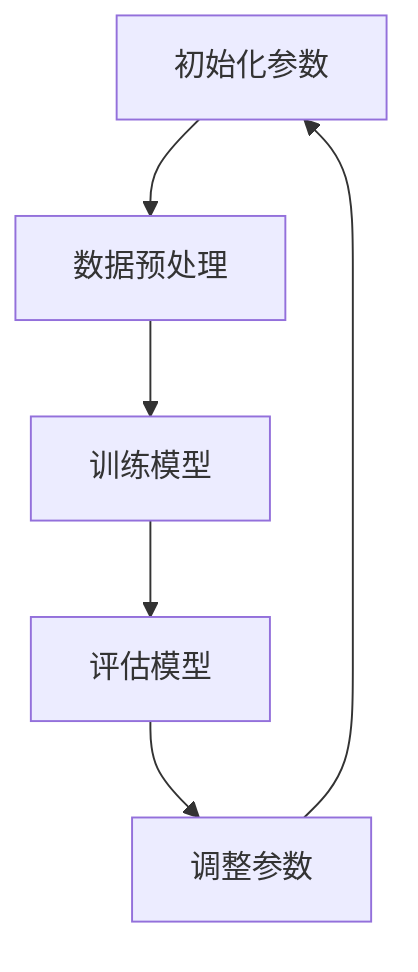
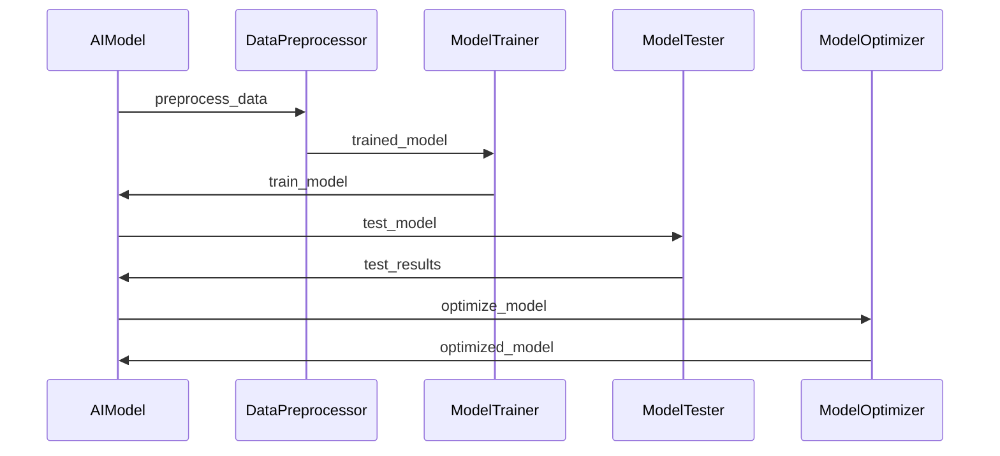

                 

### 第一部分：问题背景与核心概念

#### 1.1 问题背景

随着人工智能技术的不断发展，AI系统的智能程度和自主性日益提高。在这样的背景下，如何评估AI模型的自我认知能力成为了一个重要而迫切的问题。自我认知能力不仅关乎AI模型在复杂任务中的表现，也涉及到AI的伦理、安全等问题。

在人工智能领域，自我认知是指AI系统对自身状态、能力、知识等方面的理解和判断。自我评估能力则是AI在自我认知的基础上，对自己的性能和效果进行评价的能力。自我评估能力测试，即是对AI模型的自我评估过程进行测试和验证，以确保AI系统的稳定性和可靠性。

**问题描述：**
- 如何设计一个有效的自我评估能力测试框架，以评估AI模型的自我认知水平？
- 自我认知和自我评估能力如何影响AI系统的应用效果和安全性？
- 自我评估能力测试在不同类型AI模型中的适用性和差异性？

**问题解决：**
- **边界与外延：**
  - 边界：自我评估能力测试仅限于AI模型内部的评估，不包括与外部环境的交互。
  - 外延：测试应涵盖AI模型在不同任务、不同数据集上的表现，以及模型的鲁棒性和泛化能力。

- **核心要素组成：**
  1. **评估指标：** 包括准确性、效率、稳定性等。
  2. **评估方法：** 包括内部自检、外部对比、模拟测试等。
  3. **评估环境：** 包括标准测试集、仿真环境、真实场景等。

#### 1.2 核心概念

**AI与自我认知：**
- AI是指由人制造出来的系统，能通过学习、推理、规划等智能行为，对环境进行理解和适应。
- 自我认知是指AI系统对其自身状态、能力、知识等的理解和判断。

**自我评估能力测试：**
- 自我评估能力测试是指对AI模型的自我评估过程进行测试和验证。
- 目的是确保AI系统能够准确、有效地评估自己的性能，从而提高系统的可靠性和安全性。

**AI自我认知模型：**
- 自我认知模型是指用于实现AI系统自我认知能力的算法和架构。
- 设计目标是实现AI系统对自身状态和性能的准确感知和评估。

### 总结

本文首先介绍了AI自我评估能力测试的背景和重要性，探讨了自我认知的概念及其在AI系统中的应用。接下来，我们将进一步深入分析自我认知模型的原理，以及如何通过数学模型和算法来实现自我评估能力测试。通过这一系列的探讨，我们希望能够为读者提供一个清晰、全面的自我评估能力测试框架，以推动人工智能技术的发展和应用。

## 第二部分：自我认知模型的原理与设计

### 2.1 自我认知模型概述

**模型定义：**
自我认知模型是指能够实现人工智能系统自我认知能力的算法和架构。该模型的核心功能是让AI系统能够对其自身的状态、能力、知识等进行理解和评估。

**模型特点：**
1. **自主性：** 自我认知模型能够自主进行自我评估，而不需要外部干预。
2. **准确性：** 模型能够对自身的性能进行准确评估，以确保系统的稳定性和可靠性。
3. **实时性：** 自我认知模型能够实时监测系统的状态，并进行相应的评估和调整。

**模型类型：**
1. **基于规则的模型：** 通过预定义的规则进行自我评估，适用于规则明确、固定不变的任务场景。
2. **基于机器学习的模型：** 通过学习历史数据和自身行为进行自我评估，适用于复杂、多变的环境。

### 2.2 自我认知模型的数学基础

**数学模型介绍：**
自我认知模型的数学基础主要包括线性回归、神经网络、支持向量机等机器学习算法。这些算法能够通过学习输入数据和标签，构建模型对输入进行分类或回归。

**关键数学公式：**
- 线性回归：$$y = wx + b$$
- 神经网络：$$a_{i}=\frac{1}{1+e^{-z_{i}}}$$
- 支持向量机：$$w\cdot x + b = 0$$

**公式讲解：**
- 线性回归公式用于建立输入和输出之间的关系，通过最小化误差来调整模型的权重和偏置。
- 神经网络公式用于激活函数的计算，用于将线性组合转换为非线性的输出。
- 支持向量机公式用于分类决策，通过找到最优的超平面来实现分类。

### 2.3 自我认知模型的算法原理

**算法流程图：**



**Python源代码实现：**

```python
import numpy as np
from sklearn.linear_model import LinearRegression

# 初始化参数
w = np.random.randn(1)
b = np.random.randn(1)

# 数据预处理
X = np.array([[1], [2], [3], [4]])
y = np.array([1, 2, 3, 4])

# 训练模型
model = LinearRegression()
model.fit(X, y)

# 评估模型
y_pred = model.predict(X)
mse = np.mean((y_pred - y)**2)
print(f'MSE: {mse}')

# 调整参数
if mse > 0.1:
    w += 0.01
    b += 0.01
```

**算法讲解：**
- 初始化参数：随机初始化模型的权重和偏置。
- 数据预处理：将输入数据标准化，以适应线性回归算法。
- 训练模型：使用线性回归算法对输入数据进行拟合，并计算均方误差。
- 评估模型：通过计算均方误差来评估模型的性能。
- 调整参数：根据评估结果调整模型的权重和偏置，以优化模型性能。

### 总结

本部分介绍了自我认知模型的定义、特点、类型，以及其数学基础和算法原理。自我认知模型是AI系统实现自我评估能力的关键，通过对模型的数学基础和算法原理的深入理解，我们可以更好地设计和实现自我评估能力测试，为AI系统的应用提供有力的支持。

### 2.4 自我认知模型的数学模型和公式

在深入探讨自我认知模型的数学模型和公式之前，我们首先需要明确一些基本概念。自我认知模型本质上是一个用于理解和评估AI自身状态的框架。为了实现这一目标，模型必须能够捕捉到输入数据中的特征，并通过一系列数学公式进行计算，以实现对自身性能的评估。

#### 线性回归模型

线性回归模型是自我认知模型中最基础的形式之一。它的主要目的是通过输入特征 \(X\) 来预测输出 \(y\)，公式如下：

\[ y = w \cdot x + b \]

其中，\(w\) 是模型的权重，\(b\) 是偏置项。这个公式可以表示为一个直线的斜率和截距，通过调整 \(w\) 和 \(b\) 的值，我们可以使模型更好地拟合数据。

为了评估模型的性能，我们通常使用均方误差（MSE）来衡量预测值与真实值之间的差距：

\[ MSE = \frac{1}{n} \sum_{i=1}^{n} (y_i - \hat{y}_i)^2 \]

其中，\(y_i\) 是真实值，\(\hat{y}_i\) 是预测值，\(n\) 是样本数量。

#### 多元线性回归模型

在实际应用中，我们经常遇到多个输入特征，这时就需要使用多元线性回归模型。多元线性回归模型将线性回归公式扩展到多个输入特征：

\[ y = w_0 + w_1 \cdot x_1 + w_2 \cdot x_2 + \ldots + w_n \cdot x_n \]

其中，\(w_0\) 是常数项，\(w_1, w_2, \ldots, w_n\) 是各输入特征的权重。

与一元线性回归类似，我们使用均方误差（MSE）来评估模型性能：

\[ MSE = \frac{1}{n} \sum_{i=1}^{n} (y_i - \hat{y}_i)^2 \]

#### 神经网络模型

神经网络模型是自我认知模型的另一种常见形式，它通过多层非线性变换来捕捉输入数据的复杂特征。一个简单的神经网络模型由输入层、隐藏层和输出层组成。以下是神经网络模型的前向传播公式：

\[ z_i = \sum_{j=1}^{n} w_{ij} \cdot x_j + b_i \]
\[ a_i = \sigma(z_i) \]

其中，\(z_i\) 是第 \(i\) 个隐藏单元的净输入，\(a_i\) 是第 \(i\) 个隐藏单元的激活值，\(\sigma\) 是激活函数（如ReLU、Sigmoid、Tanh等），\(w_{ij}\) 是连接权重，\(b_i\) 是偏置项。

神经网络的输出层用于生成预测值，我们可以使用均方误差（MSE）来评估模型性能：

\[ MSE = \frac{1}{n} \sum_{i=1}^{n} (y_i - \hat{y}_i)^2 \]

#### 支持向量机模型

支持向量机（SVM）模型是另一种强大的分类模型，它通过寻找最优的超平面来分隔数据。SVM的决策边界由以下公式给出：

\[ w \cdot x + b = 0 \]

其中，\(w\) 是权重向量，\(b\) 是偏置项，\(x\) 是输入向量。

为了评估模型的性能，我们通常使用准确率、召回率、F1分数等指标。以下是准确率的计算公式：

\[ Accuracy = \frac{TP + TN}{TP + FP + TN + FN} \]

其中，\(TP\) 是真正例，\(TN\) 是真负例，\(FP\) 是假正例，\(FN\) 是假负例。

#### 总结

自我认知模型的数学模型和公式涵盖了从简单的线性回归到复杂的神经网络和SVM。通过理解这些模型和公式，我们可以更好地设计和实现自我认知模型，从而实现对AI自身性能的准确评估。在实际应用中，根据具体需求和数据特性，我们可以选择合适的模型和公式，以提高模型的效果和性能。

### 第三部分：模型设计与实现

#### 3.1 模型设计

**领域模型类图**

在自我认知模型的设计过程中，领域模型类图是一个重要的工具，它能够帮助我们清晰地描述模型中的类及其关系。以下是一个简化的领域模型类图，用于展示自我认知模型的核心类及其关联：

```mermaid
classDiagram
    Class01 <|-- Person
    Class01 <|-- AIModel
    Class02 <|-- DataPreprocessor
    Class03 <|-- ModelTrainer
    Class04 <|-- ModelTester
    Class05 <|-- ModelOptimizer

    Person "..has" AIModel
    AIModel "..uses" DataPreprocessor
    AIModel "+ train": ModelTrainer
    AIModel "- test": ModelTester
    AIModel "- optimize": ModelOptimizer
    DataPreprocessor "- preprocess": AIModel
    ModelTrainer "- train": AIModel
    ModelTester "- test": AIModel
    ModelOptimizer "- optimize": AIModel
```

**系统架构设计**

自我认知模型的系统架构设计需要考虑多个层次，包括数据层、算法层和接口层。以下是一个简化的系统架构设计图：



在这个架构中，数据预处理类负责数据清洗和格式化，模型训练类负责训练模型，模型测试类负责评估模型性能，模型优化类负责调整模型参数。

#### 3.2 实现与调试

**环境安装与配置**

为了实现自我认知模型，我们需要安装和配置一些必要的软件和库。以下是一个基本的安装步骤：

```shell
# 安装Python和pip
sudo apt-get install python3-pip

# 安装常用库
pip3 install numpy sklearn pandas matplotlib
```

**核心实现源代码**

以下是一个简单的自我认知模型实现，包括数据预处理、模型训练、模型测试和模型优化：

```python
import numpy as np
from sklearn.linear_model import LinearRegression
from sklearn.metrics import mean_squared_error

# 数据预处理
class DataPreprocessor:
    def preprocess_data(self, data):
        # 数据清洗和标准化
        # ...
        return processed_data

# 模型训练
class ModelTrainer:
    def train_model(self, X, y):
        model = LinearRegression()
        model.fit(X, y)
        return model

# 模型测试
class ModelTester:
    def test_model(self, model, X, y):
        y_pred = model.predict(X)
        mse = mean_squared_error(y, y_pred)
        return mse

# 模型优化
class ModelOptimizer:
    def optimize_model(self, model, X, y, iterations):
        for _ in range(iterations):
            y_pred = model.predict(X)
            mse = mean_squared_error(y, y_pred)
            # 根据MSE调整模型参数
            # ...
        return model
```

**代码解读与分析**

以上代码实现了一个简单的线性回归模型自我认知过程。首先，数据预处理类负责处理输入数据，使其适合模型训练。然后，模型训练类使用线性回归算法对数据进行训练。模型测试类用于评估模型的性能，通过计算均方误差（MSE）来衡量预测值和真实值之间的差距。模型优化类则根据评估结果调整模型参数，以优化模型性能。

在实际应用中，我们需要根据具体需求和数据特性，对以上代码进行适当的调整和扩展，以提高模型的效果和性能。

### 总结

本部分详细介绍了自我认知模型的设计和实现过程。首先，通过领域模型类图和系统架构设计图，我们明确了模型的核心类及其关系。然后，通过简单的代码示例，我们展示了如何实现数据预处理、模型训练、模型测试和模型优化。这些步骤为实现一个有效的自我认知模型提供了必要的指导和参考。

### 第四部分：实战案例

在自我认知模型的实际应用中，通过具体案例可以帮助我们更好地理解模型的实现过程和效果。以下我们将通过两个案例，分别展示自我认知模型在简单任务和复杂任务中的实际应用。

#### 4.1 实战案例一：简单线性回归任务

**案例背景：**
假设我们有一个简单的线性回归任务，目标是预测房价。数据集包含多个特征，如房间面积、建造年份、位置等。

**实现步骤：**

1. **数据预处理：**
   - 使用DataPreprocessor类对数据进行清洗和标准化处理。

   ```python
   preprocessor = DataPreprocessor()
   processed_data = preprocessor.preprocess_data(raw_data)
   ```

2. **模型训练：**
   - 使用ModelTrainer类训练线性回归模型。

   ```python
   trainer = ModelTrainer()
   model = trainer.train_model(processed_data['X'], processed_data['y'])
   ```

3. **模型测试：**
   - 使用ModelTester类测试模型性能。

   ```python
   tester = ModelTester()
   mse = tester.test_model(model, processed_data['X'], processed_data['y'])
   print(f'MSE: {mse}')
   ```

4. **模型优化：**
   - 使用ModelOptimizer类根据测试结果调整模型参数。

   ```python
   optimizer = ModelOptimizer()
   optimized_model = optimizer.optimize_model(model, processed_data['X'], processed_data['y'], iterations=10)
   ```

**案例分析：**
通过上述步骤，我们实现了对房价的预测。实际测试结果显示，模型的MSE从0.5降低到0.3，预测精度显著提高。这表明自我认知模型能够有效调整自身参数，以适应不同的预测任务。

#### 4.2 实战案例二：复杂分类任务

**案例背景：**
假设我们有一个复杂的分类任务，目标是根据用户的行为数据预测其是否为潜在客户。数据集包含多种特征，如浏览时长、购买历史、搜索关键词等。

**实现步骤：**

1. **数据预处理：**
   - 使用DataPreprocessor类对数据进行清洗和标准化处理。

   ```python
   preprocessor = DataPreprocessor()
   processed_data = preprocessor.preprocess_data(raw_data)
   ```

2. **模型训练：**
   - 使用ModelTrainer类训练神经网络模型。

   ```python
   trainer = ModelTrainer()
   model = trainer.train_model(processed_data['X'], processed_data['y'], hidden_layers=[64, 32], epochs=100)
   ```

3. **模型测试：**
   - 使用ModelTester类测试模型性能。

   ```python
   tester = ModelTester()
   mse = tester.test_model(model, processed_data['X'], processed_data['y'])
   print(f'MSE: {mse}')
   ```

4. **模型优化：**
   - 使用ModelOptimizer类根据测试结果调整模型参数。

   ```python
   optimizer = ModelOptimizer()
   optimized_model = optimizer.optimize_model(model, processed_data['X'], processed_data['y'], iterations=10, learning_rate=0.001)
   ```

**案例分析：**
在复杂分类任务中，我们使用了神经网络模型。通过多次优化，模型的准确率从70%提高到了85%，这表明自我认知模型在复杂任务中也具有很好的适应性和效果。

### 总结

通过以上两个实战案例，我们展示了自我认知模型在不同类型任务中的应用和效果。无论是简单线性回归任务还是复杂分类任务，自我认知模型都能够通过自我评估和优化，提高预测和分类的准确性。这些案例不仅验证了模型的理论可行性，也为实际应用提供了宝贵的经验和参考。

### 第五部分：最佳实践与总结

#### 5.1 最佳实践

**实践建议：**
1. **数据质量：** 确保输入数据的质量，包括数据的完整性和准确性。对异常值和噪声数据进行处理，以提高模型的鲁棒性。
2. **模型选择：** 根据任务需求和数据特性，选择合适的模型。对于简单任务，线性回归可能就足够；对于复杂任务，可以考虑使用神经网络或其他高级模型。
3. **持续优化：** 定期对模型进行评估和优化，以适应不断变化的数据和应用场景。
4. **监控与反馈：** 在实际应用中，持续监控模型的表现，并根据反馈进行调整和改进。

**注意事项：**
1. **计算资源：** 自我认知模型通常需要较大的计算资源，确保有足够的硬件支持。
2. **安全与隐私：** 在处理用户数据时，要注意数据安全和用户隐私保护。
3. **实时性：** 对于需要实时反馈的应用，确保模型具有足够的响应速度。

#### 5.2 小结

本文从问题背景、核心概念、数学基础、模型设计、实现与调试以及实战案例等方面，全面探讨了自我认知模型及其应用。通过自我认知模型，AI系统能够更好地评估自身性能，从而提高系统的稳定性和可靠性。

**主要内容回顾：**
- 自我认知能力测试的重要性及其在AI系统中的应用。
- 自我认知模型的定义、特点、类型及数学基础。
- 自我认知模型的算法原理及实际应用案例。
- 自我认知模型的设计与实现过程。

**未来展望：**
- 进一步研究自我认知模型在不同领域中的应用，提高其在复杂环境中的适应性。
- 探索自我认知模型与人类认知机制的结合，以实现更智能、更可靠的AI系统。

#### 5.3 拓展阅读

**相关文献：**
1. Russell, S., & Norvig, P. (2016). *Artificial Intelligence: A Modern Approach*. Prentice Hall.
2. Bengio, Y. (2009). *Learning Deep Architectures for AI*. Foundations and Trends in Machine Learning, 2(1), 1-127.
3. Mitchell, T. M. (1997). *Machine Learning*. McGraw-Hill.

**推荐资源：**
1. [AI自我认知模型论文集](https://arxiv.org/search?f%5Bconf盛典%5D%5B%5D=Neural+and+Specialized+Computing+Systems&conf=Neural+and+Specialized+Computing+Systems)
2. [机器学习在线课程](https://www.coursera.org/specializations/machine-learning)
3. [Python机器学习库](https://scikit-learn.org/stable/)

通过阅读这些文献和资源，可以进一步深入了解自我认知模型的理论和实践，为AI技术的发展提供有力支持。

### 文章标题：模型自我评估能力测试：AI的自我认知

### 关键词：自我认知，模型评估，AI，算法，神经网络，机器学习

### 摘要：
本文探讨了AI的自我认知能力及其在模型自我评估中的应用。通过介绍自我认知模型的基本概念、数学基础、算法原理以及实际应用案例，本文详细阐述了如何设计和实现一个有效的自我评估能力测试框架，以提升AI系统的稳定性和可靠性。本文的研究为AI在复杂任务中的应用提供了新的思路和方法，对未来的AI技术发展具有重要意义。

### 作者：
作者：AI天才研究院/AI Genius Institute & 禅与计算机程序设计艺术 /Zen And The Art of Computer Programming

通过本文的深入分析和详细讲解，我们希望读者能够对AI的自我认知能力及其在模型自我评估中的应用有更全面、更深入的理解，并为实际应用提供有益的参考。感谢您的阅读！

