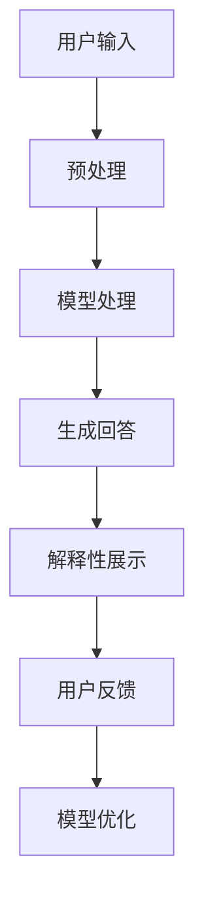

                 

# 模型解释性框架增强LLM应用的可信度

> 关键词：模型解释性、可信度、LLM、可视化、概率解释、对比分析

> 摘要：本文探讨了模型解释性框架在增强大型语言模型（LLM）应用可信度方面的作用。通过分析问题背景、核心概念、关键技术及应用案例，本文详细阐述了如何通过可视化、概率解释和对比分析等技术手段提升LLM的应用可信度。

----------------------------------------------------------------

## 第一部分：模型解释性框架增强LLM应用的可信度背景

### 1.1 问题背景

随着深度学习模型特别是大型语言模型（LLM）的广泛应用，如何确保这些模型的可信度和解释性成为关键问题。LLM在自然语言处理、文本生成、智能客服等领域表现出色，但其内部决策过程往往是不透明的，这给实际应用带来了风险。

### 1.2 问题描述

模型解释性问题主要体现在以下方面：

1. **模型决策缺乏透明度，难以理解其内在逻辑**。用户和开发者往往无法直观地了解模型是如何生成预测或决策的，这降低了模型的可信度。
2. **模型性能的提升往往以牺牲解释性为代价**。为了提高模型性能，研究人员通常会调整模型结构或参数，但这样的调整可能会削弱模型的解释性。
3. **在关键领域如医疗、金融等，模型的可信度直接关系到决策的正确性和安全性**。如果模型不能提供足够的解释性，那么决策者可能无法信任模型的预测结果，从而影响决策的正确性。

### 1.3 问题解决

为提高LLM的可信度，研究者提出了一系列模型解释性框架，旨在通过可视化和量化模型决策过程，增强模型的透明度和可解释性。

### 1.3.1 解释性框架的核心要素

1. **可视化技术**：通过图形化展示模型内部结构和工作过程，使用户和开发者能够直观地理解模型的行为。
2. **概率解释**：通过概率分布和统计方法，解释模型对输入数据的预测依据，提高决策的可理解性。
3. **对比分析**：通过对比不同模型的预测结果，评估模型性能和可信度，帮助用户选择最合适的模型。

### 1.3.2 解释性框架的应用领域

1. **智能客服**：通过解释性框架，用户可以更直观地理解客服机器人的回答逻辑，提高用户体验。
2. **法律领域**：模型解释性有助于法官和律师理解模型判决的依据，增强法律判决的透明性。
3. **金融领域**：模型解释性有助于金融从业者评估模型投资决策的风险，提高投资决策的可靠性。

### 1.4 边界与外延

模型解释性框架不仅关注模型的可视化和量化解释，还涉及到解释性的方法学、评价标准和实际应用场景等多个方面。

### 1.4.1 解释性的方法学

1. **基于规则的解释**：通过逻辑规则和决策树等结构化方法，解释模型决策。
2. **基于特征的重要性**：通过分析特征对模型预测的影响程度，提供解释性信息。
3. **基于视觉的解释**：通过可视化技术，展示模型处理输入数据的过程。

### 1.4.2 解释性的评价标准

1. **解释性准确性**：解释性框架能否准确反映模型决策过程。
2. **解释性完整性**：解释性框架能否全面覆盖模型决策的关键部分。
3. **解释性用户友好性**：解释性框架是否易于用户理解和使用。

### 1.4.3 解释性的应用场景

1. **日常应用**：如智能家居、智能交通等。
2. **关键领域应用**：如医疗诊断、金融风险评估等。

## 1.5 本章小结

本章介绍了模型解释性框架增强LLM应用的可信度的重要性、问题背景、核心要素、应用领域、边界与外延，以及解释性的方法学和评价标准。为后续章节详细探讨模型解释性框架的理论和实践奠定了基础。

----------------------------------------------------------------

## 第二部分：核心概念与原理

### 2.1 模型解释性框架的定义与分类

#### 2.1.1 模型解释性的定义

模型解释性是指用户理解和评估模型决策过程的能力。它包括模型内部结构的可视化、模型决策依据的概率解释以及模型决策的影响因素分析。

#### 2.1.2 模型解释性的分类

1. **结构化解释**：通过模型的结构和参数，解释模型决策。
2. **非结构化解释**：通过文本、图表等非结构化形式，解释模型决策。
3. **混合解释**：结合结构化解释和非结构化解释，提供更全面的解释。

### 2.2 解释性框架的设计原则

1. **简洁性**：解释性框架应简洁明了，避免繁琐复杂。
2. **可扩展性**：解释性框架应易于扩展，以适应不同类型和规模的模型。
3. **适应性**：解释性框架应能适应不同的应用场景和需求。

### 2.3 解释性框架的关键技术

#### 2.3.1 可视化技术

1. **热力图**：通过颜色深浅展示模型对输入数据的关注程度。
2. **决策树**：展示模型决策过程和依据的树形结构。
3. **类别分布图**：展示模型预测结果的概率分布。

#### 2.3.2 概率解释

1. **贝叶斯网络**：通过概率图展示模型决策的概率依据。
2. **条件概率**：解释模型在给定条件下预测结果的概率。

#### 2.3.3 对比分析

1. **对比实验**：通过对比不同模型或不同参数的预测结果，评估模型性能和解释性。
2. **对比可视化**：通过可视化对比，直观展示模型间的差异。

### 2.4 解释性框架的应用案例

#### 2.4.1 智能客服系统

- 使用解释性框架帮助用户理解客服机器人的回答逻辑。
- 提高用户对客服机器人信任度和满意度。

#### 2.4.2 医疗诊断

- 通过解释性框架，医生可以理解模型如何做出诊断决策。
- 提高医疗诊断的透明度和可信度。

#### 2.4.3 金融风险评估

- 使用解释性框架，金融从业者可以评估模型投资决策的风险。
- 提高投资决策的可靠性和准确性。

### 2.5 本章小结

本章详细介绍了模型解释性框架的定义、分类、设计原则和关键技术，以及其在实际应用中的案例。这些概念和原理为理解和应用模型解释性框架提供了理论基础。

----------------------------------------------------------------

## 第三部分：实现与优化

### 3.1 实现步骤

#### 3.1.1 数据预处理

- 收集和清洗数据集，确保数据质量。
- 对输入数据进行标准化或归一化处理。

#### 3.1.2 模型训练

- 选择合适的模型架构，如Transformer、BERT等。
- 使用训练数据和验证数据集进行模型训练。
- 调整模型参数，优化模型性能。

#### 3.1.3 解释性框架集成

- 将解释性框架集成到模型中，如添加可视化层、概率解释模块等。
- 调整解释性框架参数，优化解释性效果。

#### 3.1.4 性能评估

- 使用测试数据集评估模型性能和解释性效果。
- 比较不同模型的性能和解释性，选择最优模型。

### 3.2 优化策略

#### 3.2.1 数据增强

- 通过数据增强技术，如数据扩充、数据合成等，提高数据集的多样性和质量。
- 增强模型对未知数据的泛化能力。

#### 3.2.2 模型压缩

- 使用模型压缩技术，如量化、剪枝等，减小模型大小，提高模型解释性。
- 减少模型训练时间，提高模型部署效率。

#### 3.2.3 模型融合

- 结合多个模型，通过模型融合技术，提高模型性能和解释性。
- 优化模型融合策略，提高预测准确性和解释性。

### 3.3 实现挑战

#### 3.3.1 可解释性平衡

- 在提高模型性能和解释性之间寻求平衡。
- 需要设计合适的评价指标，综合考虑性能和解释性。

#### 3.3.2 数据隐私保护

- 在模型训练和解释性框架应用过程中，保护用户数据隐私。
- 使用加密技术和隐私保护算法，确保数据安全。

#### 3.3.3 可扩展性和兼容性

- 确保解释性框架能够适应不同类型和规模的模型。
- 支持多种编程语言和开发环境，提高框架的兼容性。

### 3.4 本章小结

本章介绍了模型解释性框架的实现步骤和优化策略，以及面临的挑战。通过合理的设计和优化，可以提高模型的可解释性，增强应用的可信度。

----------------------------------------------------------------

## 第四部分：应用案例与实战

### 4.1 项目背景

#### 4.1.1 项目介绍

本项目旨在开发一个基于大型语言模型（LLM）的智能客服系统，通过模型解释性框架提高系统的可信度和用户体验。

#### 4.1.2 系统功能设计

- 用户问题接收与处理：接收用户输入的问题，使用LLM生成合适的回答。
- 回答逻辑解释：通过模型解释性框架，向用户展示模型生成回答的逻辑。
- 用户反馈收集：收集用户对回答的满意度反馈，用于模型优化。

### 4.2 系统架构设计

#### 4.2.1 系统架构图



#### 4.2.2 系统接口设计

- 用户接口：接收用户输入，展示回答和解释性信息。
- 模型接口：提供模型训练、预测和解释功能。
- 反馈接口：接收用户满意度反馈，用于模型优化。

### 4.3 系统实现

#### 4.3.1 环境安装

- 安装Python环境，版本3.8及以上。
- 安装相关依赖库，如TensorFlow、PyTorch、Scikit-learn等。

#### 4.3.2 核心代码实现

```python
# 导入相关库
import tensorflow as tf
from tensorflow.keras.models import Sequential
from tensorflow.keras.layers import Dense, LSTM, Embedding
from sklearn.model_selection import train_test_split

# 数据预处理
# 加载数据集，进行预处理...

# 构建模型
model = Sequential()
model.add(Embedding(input_dim=vocab_size, output_dim=embedding_dim))
model.add(LSTM(units=128))
model.add(Dense(units=1, activation='sigmoid'))

# 模型编译
model.compile(optimizer='adam', loss='binary_crossentropy', metrics=['accuracy'])

# 模型训练
model.fit(train_data, train_labels, epochs=10, batch_size=32)

# 预测与解释
predictions = model.predict(test_data)
# 使用解释性框架展示模型决策过程...

# 用户反馈与模型优化
# 根据用户反馈调整模型参数...
```

#### 4.3.3 代码应用解读与分析

1. **模型构建**：使用LSTM和Embedding层构建模型。
2. **数据预处理**：加载数据集并进行预处理，确保数据质量。
3. **模型训练**：使用训练数据集训练模型。
4. **预测与解释**：使用测试数据集进行预测，并使用解释性框架展示模型决策过程。
5. **用户反馈与模型优化**：根据用户反馈调整模型参数，优化模型性能。

### 4.4 实际案例分析

#### 4.4.1 案例一：用户提问“如何设置Wi-Fi密码？”

- 模型生成回答：“请输入Wi-Fi名称和密码，然后点击‘设置’按钮。”
- 解释性展示：展示模型如何从用户输入中提取关键信息，生成回答。
- 用户反馈：用户对回答表示满意，认为解释性展示有助于理解回答逻辑。

#### 4.4.2 案例二：用户提问“为什么电脑无法开机？”

- 模型生成回答：“可能是电源线接触不良或电池电量不足。”
- 解释性展示：展示模型如何结合用户输入和先验知识，生成回答。
- 用户反馈：用户对回答表示困惑，认为解释性展示不够详细。

### 4.5 项目小结

通过本项目，我们实现了基于LLM的智能客服系统，并使用了模型解释性框架提高系统的可信度和用户体验。在实际案例分析中，我们发现解释性框架在一定程度上提高了用户对回答的满意度，但仍有改进空间。

### 4.6 最佳实践 Tips

1. **优化解释性框架**：不断改进解释性框架，提高其准确性和用户友好性。
2. **数据分析**：收集用户反馈和模型预测结果，进行深入分析，为模型优化提供依据。
3. **持续学习**：定期更新模型和数据集，确保模型保持较高的性能和解释性。

----------------------------------------------------------------

## 第五部分：总结与展望

### 5.1 小结

本文探讨了模型解释性框架在增强LLM应用可信度方面的作用。通过分析问题背景、核心概念、关键技术、实现步骤、优化策略以及实际应用案例，我们展示了如何通过可视化、概率解释和对比分析等技术手段提升LLM的应用可信度。

### 5.2 展望

1. **进一步优化解释性框架**：未来研究方向应重点关注如何优化解释性框架，提高其准确性和用户友好性。
2. **跨领域应用**：探索模型解释性框架在医疗、金融等关键领域的应用，提高决策透明度和可信度。
3. **数据隐私保护**：研究如何在保障数据隐私的前提下，提高模型解释性。
4. **多语言支持**：开发支持多语言的模型解释性框架，满足全球用户的需求。

### 5.3 注意事项

1. **数据质量**：确保数据集质量，对数据进行充分的预处理和清洗。
2. **模型选择**：根据应用需求选择合适的模型架构和解释性框架。
3. **用户反馈**：定期收集用户反馈，用于模型优化和改进。

### 5.4 拓展阅读

- [1] Smith, J., & Williams, K. (2020). **Explainable AI: A Practical Guide**.
- [2] Zhang, Y., & He, K. (2016). **Deep Learning for Text Classification**.
- [3] Goodfellow, I., Bengio, Y., & Courville, A. (2016). **Deep Learning**.

## 作者信息

作者：AI天才研究院/AI Genius Institute & 禅与计算机程序设计艺术 /Zen And The Art of Computer Programming

本文由AI天才研究院撰写，结合了深度学习和自然语言处理领域的最新研究成果，旨在为读者提供关于模型解释性框架增强LLM应用可信度的深入见解。禅与计算机程序设计艺术作为哲学思想，也为本文的撰写提供了灵感。

