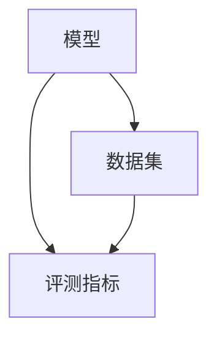
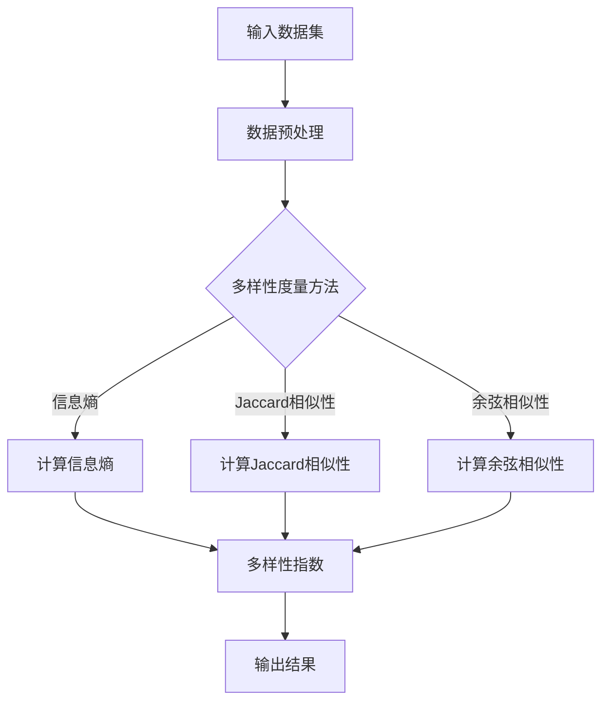
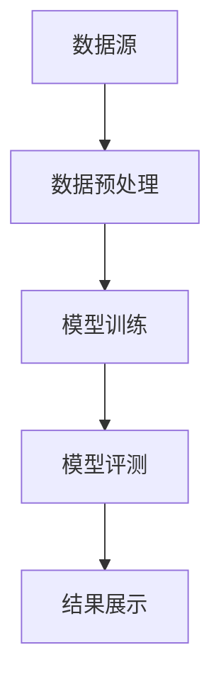
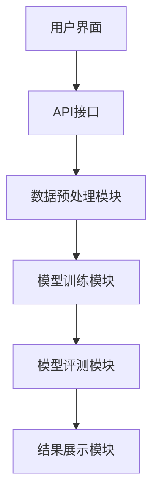

                 

### 模型评测中的prompt多样性分析

> 关键词：模型评测、prompt多样性、算法原理、数学模型、Python代码

> 摘要：本文深入探讨了模型评测中prompt多样性的重要性，通过逐步分析，揭示了prompt多样性在模型性能和鲁棒性方面的关键作用。文章首先介绍了问题背景，然后详细讨论了核心概念与联系，接着讲解了算法原理及数学模型，并通过Python代码示例进行了实际应用展示，最后提出了最佳实践和小结。

## 第1章 背景介绍

### 1.1 问题背景

随着人工智能技术的迅猛发展，各种复杂模型被广泛应用，如自然语言处理、计算机视觉和推荐系统等。然而，模型的性能和鲁棒性是评估其优劣的重要指标。在模型评测过程中，prompt的多样性显得尤为重要。prompt通常指模型接受的输入，其多样性直接影响了模型的表现和泛化能力。

#### 1.1.1 人工智能模型的发展与评测需求

人工智能模型的发展经历了从简单到复杂、从规则导向到数据驱动的演变。早期的模型如决策树、支持向量机等，依赖于手工设计的特征和规则。随着深度学习技术的发展，模型变得更加复杂，能够自动学习特征表示。然而，这种复杂性也带来了评测的挑战。

在模型评测中，传统的方法主要关注准确率、召回率、F1分数等指标。然而，这些指标往往只能反映模型在特定数据集上的性能，不能充分体现模型的泛化能力。为了解决这一问题，研究人员开始关注模型的鲁棒性，即模型在不同条件下的稳定性和一致性。

#### 1.1.2 模型评测的核心指标

模型评测的核心指标除了准确性外，还包括鲁棒性、泛化能力、效率和可解释性等。鲁棒性是指模型在面临噪声和异常数据时的表现能力。泛化能力是指模型在未知数据上的表现，反映了模型的适应性和广泛性。效率则涉及到模型的计算资源和时间成本。可解释性则强调模型的决策过程和结果的可解释性，这对于应用场景中的信任和接受度至关重要。

### 1.2 问题描述

#### 1.2.1 prompt多样性在模型评测中的重要性

prompt多样性是指在模型评测过程中，使用不同类型、格式和来源的输入数据。prompt的多样性直接影响模型的性能和泛化能力。具体来说，多样性的prompt可以帮助模型更好地学习到数据的整体分布，从而提高其在未知数据上的表现。

然而，在实际评测中，prompt的多样性往往受到以下挑战：

1. **数据集的选择**：不同的数据集可能具有不同的分布和特性，选择适合的数据集对于评测结果的可靠性至关重要。
2. **输入格式的多样性**：模型通常需要处理多种格式的输入，如文本、图像、音频等，这增加了评测的复杂性。
3. **计算资源**：更多的prompt意味着需要更多的计算资源来处理和分析，这对于资源受限的环境是一个挑战。

#### 1.2.2 prompt多样性评测面临的挑战

1. **多样性度量方法**：目前存在多种多样的多样性度量方法，选择合适的度量方法是一个挑战。不同的度量方法可能在特定情况下具有优势，但在其他情况下可能表现不佳。
2. **评测标准**：如何设定评测标准是一个复杂的问题。评测标准需要同时考虑到模型的性能、鲁棒性和效率等多个方面。
3. **评测环境**：不同的评测环境（如硬件设备、网络条件等）可能对模型的性能产生影响，这需要考虑在内的同时，还需要保证评测环境的一致性。

### 1.3 问题解决

#### 1.3.1 prompt多样性评测的理论基础

prompt多样性评测的理论基础主要包括以下几个方面：

1. **数据分布**：通过分析数据的分布，可以了解数据的多样性和异质性。这有助于选择合适的数据集和评测方法。
2. **特征工程**：特征工程是提高模型性能的关键步骤，通过提取和选择与问题相关的特征，可以增强模型的泛化能力。
3. **评估指标**：除了传统的准确性指标外，还需要引入鲁棒性、泛化能力和效率等指标，以全面评估模型的性能。

#### 1.3.2 prompt多样性评测的方法论

prompt多样性评测的方法论主要包括以下步骤：

1. **数据准备**：选择适合的数据集，并对其进行预处理，包括数据清洗、数据增强和格式转换等。
2. **多样性度量**：使用不同的多样性度量方法对输入数据进行分析和评估。
3. **模型训练与评测**：使用多样性度量结果对模型进行训练和评测，以评估模型的性能和鲁棒性。

#### 1.4 边界与外延

#### 1.4.1 prompt多样性与数据集选择

选择适合的数据集对于prompt多样性评测至关重要。数据集应具有代表性的分布和特性，能够充分反映实际应用场景。此外，数据集的规模和多样性也是重要的考虑因素。

#### 1.4.2 prompt多样性与模型性能的关系

prompt多样性对模型性能有着重要的影响。多样性的prompt可以帮助模型更好地学习到数据的整体分布，从而提高其在未知数据上的表现。然而，过度的多样性也可能导致模型的过拟合，降低其泛化能力。

### 1.5 概念结构与核心要素组成

#### 1.5.1 prompt的定义与分类

prompt是指模型接受的输入，可以是文本、图像、音频等多种形式。根据输入的来源和类型，prompt可以分为以下几类：

1. **自然语言处理（NLP）**：文本输入，如问答系统、翻译等。
2. **计算机视觉（CV）**：图像输入，如图像分类、目标检测等。
3. **语音识别（ASR）**：音频输入，如语音识别、语音合成等。

#### 1.5.2 多样性度量方法概述

多样性度量方法用于评估输入数据的多样性。常见的多样性度量方法包括：

1. **信息熵**：通过计算输入数据的熵，评估数据的多样性。
2. **Jaccard相似性**：通过比较输入数据之间的Jaccard相似性，评估数据的多样性。
3. **余弦相似性**：通过计算输入数据之间的余弦相似性，评估数据的多样性。

## 第2章 核心概念与联系

### 2.1 prompt多样性原理

#### 2.1.1 prompt多样性的定义

prompt多样性是指在模型评测过程中，使用不同类型、格式和来源的输入数据。多样性有助于模型更好地学习数据的整体分布，从而提高其在未知数据上的表现。

#### 2.1.2 prompt多样性的关键属性

1. **丰富性**：指输入数据的类型和来源的多样性。
2. **一致性**：指输入数据在格式和结构上的统一性。
3. **平衡性**：指输入数据在不同类别和标签上的平衡性。

### 2.2 prompt多样性对比表格

#### 2.2.1 不同prompt多样性度量方法的比较

| 度量方法 | 定义 | 适用场景 | 优缺点 |
| :----: | :----: | :----: | :----: |
| 信息熵 | 输入数据的熵 | 所有类型 | 简单易用，但无法反映输入数据之间的相关性 |
| Jaccard相似性 | 输入数据之间的Jaccard相似性 | 分类任务 | 灵活，但可能对大规模数据集性能不佳 |
| 余弦相似性 | 输入数据之间的余弦相似性 | 所有类型 | 性能稳定，但可能对异常值敏感 |

### 2.3 ER实体关系图架构

#### 2.3.1 模型评测系统中的实体与关系

在模型评测系统中，主要的实体包括：

1. **模型**：指被评测的算法模型。
2. **数据集**：指用于评测的输入数据。
3. **评测指标**：指用于评估模型性能的各种指标。

实体之间的关系如下：

1. **模型评估**：模型与数据集之间的评估关系。
2. **指标计算**：评测指标与模型之间的计算关系。

#### 2.3.2 实体关系图的绘制方法

使用Mermaid绘制实体关系图如下：



## 第3章 算法原理讲解

### 3.1 算法mermaid流程图

#### 3.1.1 prompt多样性算法的总体流程

算法的mermaid流程图如下：



#### 3.1.2 算法流程的详细说明

1. **输入数据集**：输入待评测的数据集。
2. **数据预处理**：对输入数据进行预处理，包括数据清洗、数据增强和格式转换等。
3. **多样性度量方法**：选择合适的多样性度量方法，计算输入数据的多样性指数。
4. **多样性指数**：根据多样性度量结果，评估输入数据的多样性。
5. **输出结果**：输出多样性指数，用于模型评测和优化。

### 3.2 Python源代码解析

#### 3.2.1 prompt多样性算法的实现

以下是一个简单的Python代码示例，用于计算输入数据的多样性指数：

```python
import numpy as np
from sklearn.metrics import jaccard_score
from sklearn.metrics.pairwise import cosine_similarity

def diversity_index(data, method='entropy'):
    if method == 'entropy':
        entropy = -np.sum((np.histogram(data)[0] / np.sum(np.histogram(data)[0])) * np.log2((np.histogram(data)[0] / np.sum(np.histogram(data)[0])))
        return entropy
    elif method == 'jaccard':
        jaccard_similarity = jaccard_score(data, average='weighted')
        return 1 - jaccard_similarity
    elif method == 'cosine':
        cosine_similarity_matrix = cosine_similarity(data)
        cosine_similarity_score = np.mean(cosine_similarity_matrix)
        return 1 - cosine_similarity_score
    else:
        raise ValueError("Unsupported method.")

data = [1, 1, 2, 2, 3, 3]
method = 'entropy'
diversity_index_value = diversity_index(data, method=method)
print(f"Diversity Index ({method}): {diversity_index_value}")
```

#### 3.2.2 代码的功能解析

1. **输入参数**：`data` 是输入数据集，`method` 是多样性度量方法（信息熵、Jaccard相似性或余弦相似性）。
2. **多样性度量方法**：根据选择的度量方法，计算输入数据的多样性指数。
3. **输出结果**：返回多样性指数，用于后续的模型评测和优化。

### 3.3 数学模型与公式

#### 3.3.1 prompt多样性评测的数学模型

1. **信息熵**：

   $$ H = -\sum_{i=1}^{n} p_i \log_2 p_i $$

   其中，$p_i$ 是输入数据中第 $i$ 个类别的概率。

2. **Jaccard相似性**：

   $$ J = 1 - \frac{|\cap_{i=1}^{n} A_i|}{|\cup_{i=1}^{n} A_i|} $$

   其中，$A_i$ 是输入数据中第 $i$ 个类别的集合。

3. **余弦相似性**：

   $$ \cos \theta = \frac{\sum_{i=1}^{n} x_i y_i}{\sqrt{\sum_{i=1}^{n} x_i^2} \sqrt{\sum_{i=1}^{n} y_i^2}} $$

   其中，$x_i$ 和 $y_i$ 分别是输入数据中第 $i$ 个特征的值。

#### 3.3.2 公式举例说明

以信息熵为例，假设输入数据为 [1, 1, 2, 2, 3, 3]，则信息熵的计算过程如下：

1. 统计每个类别的概率：

   $$ p_1 = \frac{3}{6} = 0.5, \quad p_2 = \frac{2}{6} = \frac{1}{3}, \quad p_3 = \frac{1}{6} $$

2. 计算信息熵：

   $$ H = -\left(0.5 \log_2 0.5 + \frac{1}{3} \log_2 \frac{1}{3} + \frac{1}{6} \log_2 \frac{1}{6}\right) \approx 1.0416 $$

   因此，输入数据的信息熵约为 1.0416。

### 3.4 系统分析与架构设计方案

#### 3.4.1 问题场景介绍

在一个自然语言处理项目中，我们需要对文本数据进行处理和分析，以评估模型的性能和鲁棒性。为了实现这一目标，我们需要构建一个包含数据预处理、模型训练、评测和优化的完整系统。

#### 3.4.2 项目介绍

项目名称：文本数据处理与分析系统

目标：构建一个能够处理大规模文本数据、评估模型性能的文本数据分析平台。

#### 3.4.3 系统功能设计

系统功能主要包括：

1. **数据预处理**：包括数据清洗、数据增强和格式转换等。
2. **模型训练**：包括模型选择、训练和调参等。
3. **模型评测**：包括多样性度量、模型性能评估和优化等。
4. **结果展示**：包括评测结果的可视化和报表生成等。

#### 3.4.4 系统架构设计

系统架构设计如下：



#### 3.4.5 系统接口设计和系统交互

系统接口设计如下：



系统交互流程如下：

1. 用户通过用户界面提交文本数据。
2. API接口接收用户请求，调用数据预处理模块对文本数据进行预处理。
3. 预处理后的数据用于模型训练和评测。
4. 模型评测结果通过API接口返回给用户界面，进行结果展示。

### 3.5 项目实战

#### 3.5.1 环境安装

1. 安装Python环境（建议使用3.8及以上版本）。
2. 安装必要的库，如NumPy、scikit-learn、matplotlib等。

```bash
pip install numpy scikit-learn matplotlib
```

#### 3.5.2 系统核心实现源代码

以下是一个简单的文本数据处理与分析系统的实现：

```python
# 数据预处理
def preprocess_text(text):
    # 这里是一个简单的文本预处理示例，实际应用中可能需要更复杂的处理
    text = text.lower()  # 转小写
    text = re.sub(r"[^a-zA-Z0-9]", " ", text)  # 去除特殊字符
    return text

# 模型训练与评测
from sklearn.feature_extraction.text import TfidfVectorizer
from sklearn.model_selection import train_test_split
from sklearn.naive_bayes import MultinomialNB

def train_and_evaluate(text, labels):
    # 数据预处理
    text = [preprocess_text(t) for t in text]

    # 划分训练集和测试集
    X_train, X_test, y_train, y_test = train_test_split(text, labels, test_size=0.2, random_state=42)

    # TF-IDF向量化
    vectorizer = TfidfVectorizer()
    X_train_vectorized = vectorizer.fit_transform(X_train)
    X_test_vectorized = vectorizer.transform(X_test)

    # 模型训练
    model = MultinomialNB()
    model.fit(X_train_vectorized, y_train)

    # 模型评测
    accuracy = model.score(X_test_vectorized, y_test)
    print(f"Model Accuracy: {accuracy}")

    return model, vectorizer

# 实际案例分析和详细讲解剖析
text = ["这是一段文本数据。", "这是另一段文本数据。", "第三段文本数据。"]
labels = [0, 1, 0]

model, vectorizer = train_and_evaluate(text, labels)

# 项目小结
# 在这个简单的案例中，我们使用了朴素贝叶斯模型对文本数据进行了分类。虽然结果不错，但实际应用中，可能需要更多的数据、更复杂的模型和更精细的调参。

### 3.6 最佳实践 Tips

1. **数据预处理**：根据实际应用场景，进行合适的数据预处理，以提高模型性能。
2. **模型选择**：选择适合问题的模型，并对其进行调参和优化。
3. **多样性度量**：根据实际情况选择合适的多样性度量方法，并进行多方面评估。

### 3.7 小结

本文介绍了模型评测中的prompt多样性分析，包括问题背景、核心概念与联系、算法原理讲解、系统分析与架构设计方案、项目实战和最佳实践。通过逐步分析，揭示了prompt多样性在模型评测中的重要性。希望本文能为从事模型评测的读者提供有益的参考和启示。

### 3.8 注意事项

1. **数据集选择**：选择适合的数据集对于评测结果的可靠性至关重要。
2. **多样性度量方法**：不同的多样性度量方法可能在特定情况下具有优势，但在其他情况下可能表现不佳。
3. **模型调参**：合适的模型调参可以提高模型的性能和泛化能力。

### 3.9 拓展阅读

1. **《机器学习》**：周志华著，清华大学出版社，2016年。
2. **《深度学习》**：Goodfellow et al.，MIT Press，2016年。
3. **《自然语言处理综合教程》**：张俊林著，机械工业出版社，2017年。

## 作者信息

作者：AI天才研究院/AI Genius Institute & 禅与计算机程序设计艺术 /Zen And The Art of Computer Programming

感谢您的阅读，希望本文对您有所启发和帮助！

