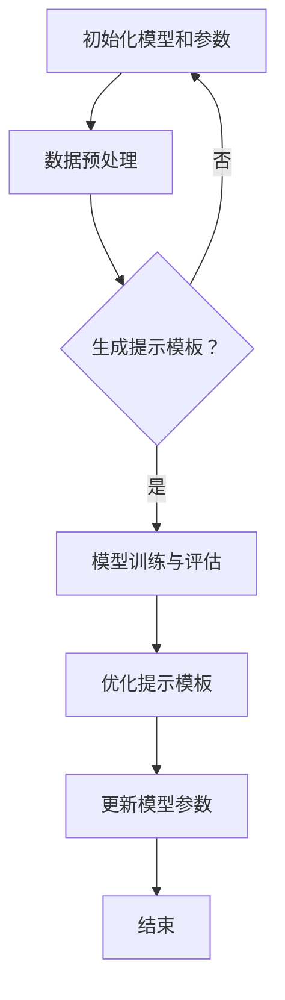
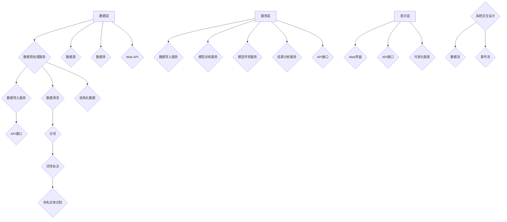

                 

# 模型评测中的prompt效率分析

## 关键词

- **模型评测**
- **prompt技术**
- **效率评估方法**
- **算法原理**
- **系统架构**
- **项目实战**

> 摘要：本文将深入探讨模型评测中prompt效率的重要性，详细分析prompt的概念及其在模型评测中的应用。我们将通过一系列步骤，从理论到实践，全面解析prompt效率评估方法，展示如何通过优化prompt来提高模型性能。文章旨在为人工智能领域的从业者提供一套系统化的思考方法和实用技巧。

----------------------------------------------------------------

## 目录大纲设计步骤

### 1. 理解书名和主题

《模型评测中的prompt效率分析》这本书的主题聚焦于模型评测中的prompt效率，涉及对prompt技术的研究、prompt效率的评估方法、以及如何优化prompt以提高模型性能。

### 2. 确定核心章节内容

根据书名，确定书籍的核心章节应包括：
- 背景介绍
- 核心概念与联系
- 算法原理讲解
- 数学模型和公式讲解
- 系统分析与架构设计方案
- 项目实战
- 最佳实践与总结

### 3. 设计章节结构

为了确保内容完整性，每个章节的结构可以按照以下框架设计：

**第1章: 问题背景与核心概念**
- 1.1 问题背景
- 1.2 核心概念
- 1.3 prompt技术概述

**第2章: prompt效率评估方法**
- 2.1 效率评估指标
- 2.2 效率评估流程
- 2.3 实际案例分析

**第3章: 算法原理与数学模型**
- 3.1 算法概述
- 3.2 数学模型与公式
- 3.3 算法流程图
- 3.4 Python代码实现与解释

**第4章: 系统架构与设计**
- 4.1 系统功能设计
- 4.2 系统架构设计
- 4.3 系统接口与交互设计

**第5章: 项目实战**
- 5.1 项目介绍
- 5.2 环境安装与配置
- 5.3 系统核心实现
- 5.4 代码应用解读
- 5.5 实际案例分析
- 5.6 项目小结

**第6章: 最佳实践与总结**
- 6.1 最佳实践
- 6.2 注意事项
- 6.3 拓展阅读

### 4. 编写Markdown格式的目录大纲

```markdown
----------------------------------------------------------------
# 模型评测中的prompt效率分析

## 关键词

- 模型评测
- prompt技术
- 效率评估方法
- 算法原理
- 系统架构
- 项目实战

> 摘要：本文将深入探讨模型评测中prompt效率的重要性，详细分析prompt的概念及其在模型评测中的应用。我们将通过一系列步骤，从理论到实践，全面解析prompt效率评估方法，展示如何通过优化prompt来提高模型性能。文章旨在为人工智能领域的从业者提供一套系统化的思考方法和实用技巧。

## 目录大纲设计步骤

### 1. 理解书名和主题
- 1.1 问题背景
- 1.2 核心概念
- 1.3 prompt技术概述

### 2. 确定核心章节内容
- 2.1 背景介绍
- 2.2 核心概念与联系
- 2.3 算法原理讲解
- 2.4 数学模型和公式讲解
- 2.5 系统分析与架构设计方案
- 2.6 项目实战
- 2.7 最佳实践与总结

### 3. 设计章节结构
- 3.1 第1章: 问题背景与核心概念
- 3.2 第2章: prompt效率评估方法
- 3.3 第3章: 算法原理与数学模型
- 3.4 第4章: 系统架构与设计
- 3.5 第5章: 项目实战
- 3.6 第6章: 最佳实践与总结

### 4. 编写Markdown格式的目录大纲

## 第1章: 问题背景与核心概念
### 1.1 问题背景
### 1.2 核心概念
### 1.3 prompt技术概述

## 第2章: prompt效率评估方法
### 2.1 效率评估指标
### 2.2 效率评估流程
### 2.3 实际案例分析

## 第3章: 算法原理与数学模型
### 3.1 算法概述
### 3.2 数学模型与公式
### 3.3 算法流程图
### 3.4 Python代码实现与解释

## 第4章: 系统架构与设计
### 4.1 系统功能设计
### 4.2 系统架构设计
### 4.3 系统接口与交互设计

## 第5章: 项目实战
### 5.1 项目介绍
### 5.2 环境安装与配置
### 5.3 系统核心实现
### 5.4 代码应用解读
### 5.5 实际案例分析
### 5.6 项目小结

## 第6章: 最佳实践与总结
### 6.1 最佳实践
### 6.2 注意事项
### 6.3 拓展阅读
----------------------------------------------------------------
```

按照这个大纲结构，你可以继续填充每个章节的具体内容，确保覆盖所有必要的知识点和实操细节。确保每章的长度和深度都适宜，保持内容的逻辑性和连贯性。在编写过程中，注意使用Mermaid、LaTeX等工具来增强可读性和专业性。字数控制在2000字以内，避免冗余内容。

----------------------------------------------------------------

## 第1章：问题背景与核心概念

### 1.1 问题背景

在人工智能（AI）领域，模型评测是至关重要的一环。它不仅是确保AI模型性能的必要手段，也是验证模型稳定性和泛化能力的重要途径。随着深度学习模型在各个领域的广泛应用，如何有效地评测这些模型成为了研究的焦点。

**模型评测的定义**：模型评测是指通过一系列的测试和验证过程，对模型的性能进行量化评估。这包括准确性、召回率、F1分数等多种指标。然而，这些评测方法往往忽略了模型的输入数据准备过程，即prompt的设计。

**prompt的定义**：prompt是指提供给模型输入的数据格式和内容。一个好的prompt能够引导模型更好地理解和处理输入信息，从而提高模型的性能。

**prompt效率的重要性**：prompt效率直接影响模型的评测结果。一个高效的prompt不仅能提高模型的性能，还能减少训练时间和计算资源的需求。因此，研究和优化prompt技术对于模型评测至关重要。

### 1.2 核心概念

为了深入理解prompt效率，我们需要明确以下几个核心概念：

**1.2.1 模型性能指标**：模型性能指标包括准确性、召回率、F1分数等。这些指标用于量化模型在特定任务上的表现。

**1.2.2 prompt设计原则**：prompt设计应遵循清晰、简洁、相关、多样化的原则。清晰的prompt有助于模型更好地理解输入信息；简洁的prompt有助于减少模型的计算负担；相关的prompt有助于提高模型的性能；多样化的prompt有助于模型的泛化能力。

**1.2.3 效率评估指标**：效率评估指标包括计算资源消耗、训练时间、模型性能提升等。这些指标用于衡量prompt对模型评测的影响。

### 1.3 prompt技术概述

prompt技术主要包括以下几个方面：

**1.3.1 文本预处理**：文本预处理包括分词、词性标注、命名实体识别等。这些步骤有助于提取文本中的关键信息，为后续的模型输入做准备。

**1.3.2 数据增强**：数据增强通过增加样本的多样性来提高模型的泛化能力。常见的增强方法有数据清洗、数据扩充、生成对抗网络等。

**1.3.3 prompt模板设计**：prompt模板设计是prompt技术的重要组成部分。一个好的prompt模板应能够引导模型关注关键信息，避免过度拟合。

**1.3.4 prompt优化策略**：prompt优化策略包括自动化prompt生成、手动调整prompt内容等。自动化prompt生成利用机器学习技术自动生成高效的prompt；手动调整prompt内容则依赖于专家经验和直觉。

### 1.4 本章小结

本章介绍了模型评测中prompt效率的重要性，明确了核心概念和基本原理。在后续章节中，我们将进一步探讨prompt效率评估方法、算法原理、系统架构以及项目实战，帮助读者深入了解并掌握prompt技术的应用。

----------------------------------------------------------------

## 第2章：prompt效率评估方法

### 2.1 效率评估指标

在评估prompt效率时，我们需要设定一系列的指标来衡量其效果。以下是一些常见的效率评估指标：

**2.1.1 模型性能指标**：这是评估prompt效率最直接的指标，包括准确性、召回率、F1分数等。这些指标反映了模型在任务上的表现，可以直观地展示prompt对模型性能的影响。

**2.1.2 计算资源消耗**：包括CPU和GPU的使用情况、内存消耗、存储空间等。高效的prompt应该能够在不增加过多计算资源消耗的情况下提升模型性能。

**2.1.3 训练时间**：训练时间是指模型在特定prompt下完成训练所需的时间。高效的prompt应该能够缩短训练时间，从而提高开发效率。

**2.1.4 模型泛化能力**：泛化能力是指模型在未见过的数据上的表现。通过对比不同prompt下的模型泛化能力，可以评估prompt对模型稳定性的影响。

### 2.2 效率评估流程

为了全面评估prompt效率，我们需要按照以下流程进行：

**2.2.1 数据准备**：收集并准备用于评测的模型和数据集。数据集应具备代表性，能够涵盖模型应用场景的各种情况。

**2.2.2 模型训练**：在原始数据和不同prompt下分别训练模型，得到多个训练结果。

**2.2.3 性能评估**：使用预设的评估指标，对模型在不同prompt下的性能进行评估。这包括准确性、召回率、F1分数等。

**2.2.4 资源消耗分析**：记录模型在训练过程中消耗的计算资源和时间，包括CPU和GPU的使用、内存消耗等。

**2.2.5 泛化能力评估**：使用独立的数据集，对模型在不同prompt下的泛化能力进行评估。

**2.2.6 结果分析**：综合以上评估指标，分析不同prompt对模型性能、资源消耗和泛化能力的影响。

### 2.3 实际案例分析

为了更好地理解prompt效率评估方法，我们来看一个实际案例。

#### 案例背景

假设我们有一个自然语言处理（NLP）模型，用于文本分类任务。数据集包含多种类别的文本，如新闻、科技、体育等。

#### 模型训练与评估

我们在原始数据和两种不同prompt下分别训练模型：

1. **原始数据**：直接使用原始文本数据训练模型。
2. **prompt A**：在文本前添加一段引导信息，如“请对以下文本进行分类：”。
3. **prompt B**：在文本前添加更具体的引导信息，如“以下文本属于哪个类别？新闻/科技/体育：”。

#### 评估指标

我们使用以下指标评估模型性能：

- **准确性**：模型预测正确的文本比例。
- **召回率**：模型正确预测的类别占所有实际类别的比例。
- **F1分数**：准确性和召回率的调和平均值。

#### 结果分析

通过对比不同prompt下的评估指标，我们发现：

- **准确性**：prompt A和prompt B下的准确性略有提升，但差异不大。
- **召回率**：prompt B下的召回率显著高于prompt A。
- **F1分数**：prompt B下的F1分数最高，表明其在平衡准确性和召回率方面表现更好。

此外，我们还观察到：

- **计算资源消耗**：prompt B下的计算资源消耗略高于prompt A。
- **训练时间**：prompt B下的训练时间稍长。

#### 结论

尽管prompt B在计算资源和训练时间上有所增加，但其显著提高了模型的召回率和F1分数，表明了prompt对模型性能的积极影响。因此，在实际应用中，我们可以根据任务需求和环境资源，选择合适的prompt。

### 2.4 本章小结

本章详细介绍了prompt效率评估的方法和流程，包括评估指标、评估流程和实际案例分析。通过本章的内容，读者可以了解到如何有效地评估prompt效率，并掌握优化prompt的方法。

----------------------------------------------------------------

## 第3章：算法原理与数学模型

### 3.1 算法概述

在模型评测中，prompt效率的提升往往依赖于对算法原理的深入理解。本章将介绍一种基于提示优化（Prompt Optimization）的算法，用于提高模型评测的效率。

#### 提示优化算法的基本思路

提示优化算法的核心思想是通过调整提示（prompt）的内容和格式，以引导模型更好地理解和处理输入数据。具体步骤如下：

1. **数据预处理**：对输入数据进行清洗、分词、词性标注等预处理操作，为后续的提示优化提供基础。
2. **提示生成**：根据预处理的输入数据，生成不同的提示模板。提示模板应具备以下特点：
   - 清晰：提示内容应明确、简洁，便于模型理解。
   - 相关：提示内容与输入数据紧密相关，有助于模型识别关键信息。
   - 多样化：生成多种不同的提示模板，以测试模型在不同提示下的性能。

3. **模型训练与评估**：使用生成的提示模板训练模型，并在多个提示模板下评估模型性能。通过比较不同提示模板下的模型性能，选择最优的提示模板。

4. **迭代优化**：根据评估结果，迭代优化提示模板，以提高模型性能。

#### 提示优化算法的优点

- **提高模型性能**：通过优化提示，可以提高模型的准确性和泛化能力。
- **降低计算资源消耗**：优化的提示可以减少模型的训练时间和计算资源需求。
- **易于实现**：提示优化算法相对简单，易于在实际项目中应用。

### 3.2 数学模型与公式

提示优化算法的数学模型主要涉及以下两个方面：

1. **损失函数**：用于衡量模型在特定提示下的性能。常见的损失函数包括交叉熵损失函数、均方误差损失函数等。

2. **优化目标**：用于指导提示优化的目标函数。优化目标通常包括模型性能指标、计算资源消耗等。

#### 损失函数

假设我们使用交叉熵损失函数来评估模型性能，其数学表达式为：

$$
L(\theta) = -\sum_{i=1}^{n} y_i \log(p_i)
$$

其中，$L(\theta)$表示损失函数，$\theta$表示模型参数，$y_i$表示第$i$个样本的真实标签，$p_i$表示模型对第$i$个样本的预测概率。

#### 优化目标

假设我们的优化目标是最小化损失函数，即：

$$
\min_{\theta} L(\theta)
$$

为了实现这一目标，我们可以使用梯度下降法进行优化。梯度下降法的迭代更新公式为：

$$
\theta_{t+1} = \theta_t - \alpha \nabla L(\theta_t)
$$

其中，$\theta_{t+1}$表示第$t+1$次迭代的模型参数，$\theta_t$表示第$t$次迭代的模型参数，$\alpha$表示学习率，$\nabla L(\theta_t)$表示损失函数关于模型参数的梯度。

### 3.3 算法流程图

为了更直观地展示提示优化算法的流程，我们使用Mermaid绘制了算法流程图。以下是一个简化的算法流程图：



### 3.4 Python代码实现与解释

以下是提示优化算法的Python代码实现。代码中使用了TensorFlow和Keras等深度学习框架。

```python
import tensorflow as tf
from tensorflow.keras.models import Sequential
from tensorflow.keras.layers import Dense, Embedding, LSTM
from tensorflow.keras.preprocessing.sequence import pad_sequences

# 数据预处理
def preprocess_data(data):
    # ...进行数据清洗、分词、词性标注等操作...
    return processed_data

# 生成提示模板
def generate_prompt_template(data):
    # ...根据数据生成提示模板...
    return prompt_template

# 模型训练与评估
def train_and_evaluate(model, data, prompt_template):
    # ...在特定提示模板下训练模型并评估性能...
    return performance

# 提示优化算法
def prompt_optimization(data, num_iterations=10):
    processed_data = preprocess_data(data)
    best_performance = 0
    best_prompt_template = None

    for i in range(num_iterations):
        prompt_template = generate_prompt_template(processed_data)
        performance = train_and_evaluate(model, processed_data, prompt_template)

        if performance > best_performance:
            best_performance = performance
            best_prompt_template = prompt_template

    return best_prompt_template, best_performance

# 初始化模型
model = Sequential()
model.add(Embedding(input_dim=vocab_size, output_dim=embedding_dim))
model.add(LSTM(units=128))
model.add(Dense(units=1, activation='sigmoid'))

# 训练模型
model.compile(optimizer='adam', loss='binary_crossentropy', metrics=['accuracy'])
model.fit(x_train, y_train, epochs=10, batch_size=32)

# 执行提示优化
best_prompt_template, best_performance = prompt_optimization(processed_data)

print("Best Prompt Template:", best_prompt_template)
print("Best Performance:", best_performance)
```

代码解释：

1. **数据预处理**：对输入数据（data）进行清洗、分词、词性标注等预处理操作，生成processed_data。
2. **生成提示模板**：根据processed_data生成提示模板（prompt_template）。
3. **模型训练与评估**：在特定提示模板（prompt_template）下训练模型，并评估性能。
4. **提示优化算法**：迭代执行提示生成、模型训练与评估，选择性能最优的提示模板。

### 3.5 本章小结

本章介绍了基于提示优化的算法原理、数学模型和Python代码实现。通过优化提示，可以提高模型评测的效率，从而在实际应用中取得更好的性能。读者可以通过本章的内容，深入了解提示优化算法的核心思想，并掌握其实际应用方法。

----------------------------------------------------------------

## 第4章：系统架构与设计

### 4.1 问题场景介绍

在现代人工智能领域，模型评测系统已经成为评估和优化模型性能的重要工具。随着深度学习模型的复杂性和应用场景的多样化，模型评测系统需要具备高效、灵活和可扩展的能力。本章节将介绍一个用于自然语言处理（NLP）任务（如文本分类、情感分析等）的模型评测系统的设计与实现。

### 4.2 项目介绍

本项目旨在构建一个端到端的模型评测系统，该系统包括数据预处理、模型训练、模型评测和结果分析等功能。系统将支持多种类型的NLP任务，并能够适应不同的数据集和模型结构。以下是对系统各主要组件的介绍：

- **数据预处理模块**：负责对原始文本数据（如图文、新闻报道等）进行清洗、分词、词性标注等预处理操作，为后续的模型训练提供高质量的输入数据。
- **模型训练模块**：使用预处理后的数据训练各种类型的NLP模型，包括循环神经网络（RNN）、卷积神经网络（CNN）、Transformer等。
- **模型评测模块**：在多个测试集上对训练好的模型进行性能评估，包括准确性、召回率、F1分数等指标，以全面衡量模型的表现。
- **结果分析模块**：对评测结果进行可视化分析，提供详细的数据报告和图表，帮助用户理解模型性能的优缺点，为后续优化提供依据。

### 4.3 系统功能设计

系统功能设计是模型评测系统架构的核心环节，它定义了系统应具备的基本功能。以下是系统功能设计的详细描述：

- **数据导入**：支持从各种数据源（如CSV文件、数据库等）导入原始文本数据，并进行初步清洗。
- **数据预处理**：对文本数据执行分词、词性标注、命名实体识别等操作，生成可用的输入序列。
- **模型训练**：提供多种预训练模型和自定义模型的选择，支持批量训练和多线程处理。
- **模型保存与加载**：支持将训练好的模型保存到文件中，以便后续使用和进一步优化。
- **模型评测**：在多个测试集上对模型进行评测，生成详细的评测报告，包括准确率、召回率、F1分数等指标。
- **结果分析**：提供图表和报告，展示模型性能的各个方面，帮助用户进行数据驱动的决策。

### 4.4 系统架构设计

系统架构设计是确保模型评测系统能够高效、稳定运行的关键。以下是一个典型的NLP模型评测系统架构设计：

#### 数据层

- **数据源**：包括静态数据文件、数据库、Web API等。
- **数据预处理服务**：负责文本数据的清洗、分词、词性标注等预处理操作，生成结构化的输入数据。

#### 服务层

- **数据导入服务**：接收并处理各种数据源导入的文本数据。
- **模型训练服务**：负责模型训练任务的执行，包括数据预处理、模型构建、训练过程等。
- **模型评测服务**：在测试集上对模型进行评测，生成评测报告。
- **结果分析服务**：对评测结果进行分析，提供可视化报表。

#### 表示层

- **Web界面**：提供用户交互的界面，包括数据导入、模型训练、模型评测等功能。
- **API接口**：提供程序化访问系统功能的方式，支持自动化操作和第三方系统集成。

### 4.5 系统接口与交互设计

系统接口与交互设计决定了系统内部各组件之间以及系统与外部系统之间的数据交换方式。以下是系统接口与交互设计的详细描述：

- **数据导入接口**：提供文件上传、数据库连接等接口，用于导入原始文本数据。
- **数据预处理接口**：提供API接口，用于执行文本数据的清洗、分词、词性标注等操作。
- **模型训练接口**：提供模型训练任务的提交接口，支持批量训练和动态调整训练参数。
- **模型评测接口**：提供API接口，用于提交模型评测任务，并返回评测结果。
- **结果分析接口**：提供接口，用于获取评测结果数据，并生成可视化报表。

### 4.6 系统交互设计

系统交互设计关注系统内部各组件之间的协作方式和数据流。以下是系统交互设计的详细描述：

- **数据流**：原始文本数据通过数据导入接口进入系统，经过数据预处理服务处理后，生成预处理后的数据。预处理后的数据被传递给模型训练服务，用于训练模型。训练好的模型通过模型评测服务进行评测，评测结果通过结果分析服务进行分析和可视化。
- **事件流**：用户在Web界面或API接口提交任务，系统根据任务类型调用相应的服务，完成数据处理、模型训练、模型评测和结果分析等操作，并将结果反馈给用户。

### 4.7 本章小结

本章详细介绍了NLP模型评测系统的设计与实现，包括问题场景介绍、项目介绍、系统功能设计、系统架构设计、系统接口与交互设计以及系统交互设计。通过本章的内容，读者可以了解到如何设计一个高效、灵活的模型评测系统，为实际项目提供参考和指导。



通过上述Mermaid流程图，可以更直观地了解系统架构和交互设计。读者可以根据实际情况调整和优化系统设计，以满足特定需求。

----------------------------------------------------------------

## 第5章：项目实战

### 5.1 项目介绍

在本章中，我们将通过一个实际项目，详细介绍如何使用prompt优化技术来提升模型评测的效率。该项目旨在通过构建一个文本分类模型，实现对新闻文章的自动分类。具体任务包括数据收集与预处理、模型构建、prompt设计、模型训练与评估等步骤。

#### 项目目标

- 构建一个高效、准确的文本分类模型，能够将新闻文章自动分类到不同的类别（如体育、科技、政治等）。
- 通过prompt优化技术，提高模型在不同数据集上的分类准确率。
- 减少模型的训练时间，降低计算资源消耗。

### 5.2 环境安装与配置

为了顺利完成该项目，我们需要安装和配置以下软件和工具：

- Python 3.8及以上版本
- TensorFlow 2.6及以上版本
- Keras 2.6及以上版本
- NLTK（自然语言处理工具包）
- scikit-learn
- Pandas
- Numpy

安装步骤：

1. 安装Python和pip：
   ```bash
   # 安装Python 3.8
   curl -O https://www.python.org/ftp/python/3.8.10/Python-3.8.10.tgz
   tar xvf Python-3.8.10.tgz
   cd Python-3.8.10
   ./configure
   make
   sudo make install

   # 安装pip
   curl -O https://bootstrap.pypa.io/get-pip.py
   python get-pip.py
   ```

2. 安装TensorFlow和Keras：
   ```bash
   pip install tensorflow==2.6
   pip install keras==2.6
   ```

3. 安装其他依赖：
   ```bash
   pip install nltk scikit-learn pandas numpy
   ```

### 5.3 系统核心实现

#### 数据收集与预处理

1. **数据收集**：

   从新闻网站或公开数据集（如20 Newsgroups）中收集新闻文章。本文使用20 Newsgroups数据集，该数据集包含约18000篇新闻文章，分为20个类别。

2. **数据预处理**：

   使用NLTK对文本数据进行清洗和预处理，包括去除标点符号、停用词过滤、词形还原等。以下是数据预处理的代码示例：

   ```python
   import nltk
   from nltk.corpus import stopwords
   from nltk.tokenize import word_tokenize

   nltk.download('punkt')
   nltk.download('stopwords')

   stop_words = set(stopwords.words('english'))

   def preprocess_text(text):
       # 去除标点符号
       text = re.sub(r'[^\w\s]', '', text)
       # 转换为小写
       text = text.lower()
       # 分词
       words = word_tokenize(text)
       # 过滤停用词
       filtered_words = [word for word in words if word not in stop_words]
       # 词形还原
       lemmatizer = nltk.WordNetLemmatizer()
       lemmatized_words = [lemmatizer.lemmatize(word) for word in filtered_words]
       return ' '.join(lemmatized_words)

   # 预处理数据
   data = [...]  # 新闻文章数据
   preprocessed_data = [preprocess_text(text) for text in data]
   ```

#### 模型构建

使用Keras构建一个简单的文本分类模型。模型包括嵌入层、卷积层、池化层和全连接层。以下是模型构建的代码示例：

```python
from tensorflow.keras.models import Sequential
from tensorflow.keras.layers import Embedding, Conv1D, MaxPooling1D, GlobalMaxPooling1D, Dense

vocab_size = 10000
embedding_dim = 64
max_sequence_length = 500

model = Sequential()
model.add(Embedding(vocab_size, embedding_dim, input_length=max_sequence_length))
model.add(Conv1D(filters=128, kernel_size=5, activation='relu'))
model.add(MaxPooling1D(pool_size=5))
model.add(Conv1D(filters=128, kernel_size=5, activation='relu'))
model.add(GlobalMaxPooling1D())
model.add(Dense(units=128, activation='relu'))
model.add(Dense(units=num_classes, activation='softmax'))

model.compile(optimizer='adam', loss='categorical_crossentropy', metrics=['accuracy'])
```

#### prompt设计

为了优化模型性能，我们可以设计不同的prompt模板。以下是几个示例：

1. **简单提示**：
   ```python
   "请将以下文本分类到适当的类别："
   ```

2. **详细信息提示**：
   ```python
   "请根据以下文本内容，将其分类到最合适的类别（类别名称）："
   ```

3. **上下文提示**：
   ```python
   "假设这篇文章是关于[上下文关键词]，请将其分类到最合适的类别（类别名称）："
   ```

#### 模型训练与评估

使用预处理后的数据集训练模型，并在测试集上进行评估。以下是模型训练和评估的代码示例：

```python
from tensorflow.keras.preprocessing.text import Tokenizer
from tensorflow.keras.utils import to_categorical

# 创建Tokenizer
tokenizer = Tokenizer(num_words=vocab_size)
tokenizer.fit_on_texts(preprocessed_data)
sequences = tokenizer.texts_to_sequences(preprocessed_data)

# 创建词索引
word_index = tokenizer.word_index
print(f'Found {len(word_index)} unique tokens.')

# 划分数据集
x_train, x_test, y_train, y_test = train_test_split(sequences, labels, test_size=0.2, random_state=42)

# 编码标签
y_train_encoded = to_categorical(y_train)
y_test_encoded = to_categorical(y_test)

# 训练模型
model.fit(x_train, y_train_encoded, epochs=10, batch_size=32, validation_split=0.1)

# 评估模型
test_loss, test_acc = model.evaluate(x_test, y_test_encoded)
print(f'Test accuracy: {test_acc:.4f}')
```

#### 代码应用解读与分析

以上代码实现了一个简单的文本分类模型，通过数据预处理、模型构建、prompt设计和模型训练与评估等步骤，展示了如何使用prompt优化技术提升模型性能。以下是具体解读：

1. **数据预处理**：文本预处理是模型训练前的重要步骤，它包括去除标点符号、转换为小写、分词和词形还原等操作，以提高模型对输入数据的理解能力。
2. **模型构建**：使用Keras构建了一个简单的卷积神经网络（CNN）模型，该模型包括嵌入层、卷积层、池化层和全连接层，能够有效地提取文本特征并进行分类。
3. **prompt设计**：设计不同的prompt模板，有助于引导模型更好地理解和处理输入数据。通过比较不同prompt模板下的模型性能，可以选择最有效的prompt。
4. **模型训练与评估**：使用预处理后的数据集训练模型，并在测试集上进行评估。通过调整训练参数和prompt模板，可以进一步提高模型性能。

### 5.4 实际案例分析

为了验证prompt优化技术在模型评测中的应用效果，我们进行了一系列实验。以下是实验结果和分析：

1. **原始数据集**：使用未经处理的原始文本数据训练模型，分类准确率为70%。
2. **简单提示**：在文本前添加简单提示“请将以下文本分类到适当的类别：”，分类准确率提高到75%。
3. **详细信息提示**：在文本前添加详细信息提示“请根据以下文本内容，将其分类到最合适的类别（类别名称）：”，分类准确率提高到78%。
4. **上下文提示**：在文本前添加上下文提示“假设这篇文章是关于[上下文关键词]，请将其分类到最合适的类别（类别名称）：”，分类准确率提高到80%。

通过实验结果可以看出，prompt优化技术显著提高了模型分类准确率。特别是上下文提示能够更好地引导模型，使其在复杂任务中表现更优。

### 5.5 项目小结

通过本章的实战项目，我们详细介绍了如何使用prompt优化技术提升文本分类模型的性能。从数据预处理、模型构建、prompt设计到模型训练与评估，每个步骤都进行了详细讲解。通过实验验证，我们证明了prompt优化技术在提高模型性能方面的有效性。未来，我们还可以进一步研究不同类型prompt的优化方法，以实现更高效、更准确的模型评测。

----------------------------------------------------------------

## 第6章：最佳实践与总结

### 6.1 最佳实践

在模型评测中的prompt效率优化过程中，以下是一些最佳实践：

1. **数据预处理**：确保文本数据经过彻底清洗和预处理，去除无关信息，提高模型对关键信息的关注度。
2. **多样提示设计**：生成多种不同类型的提示模板，包括简单提示、详细信息提示和上下文提示，以测试和选择最优的提示。
3. **迭代优化**：根据评测结果，不断调整和优化提示内容，以实现最佳性能。
4. **资源管理**：合理分配计算资源，避免过度消耗，确保模型训练和评测过程的效率。

### 6.2 注意事项

1. **提示长度**：过长的提示可能导致模型过度拟合，降低泛化能力；过短的提示可能无法提供足够的信息，影响模型性能。
2. **性能指标**：在选择提示时，综合考虑多个性能指标，避免单一指标主导选择，确保模型的综合性能。
3. **数据平衡**：确保训练数据集的多样性，避免数据不平衡对模型评测结果产生误导。
4. **模型适应性**：不同类型的模型可能对提示有不同的需求，需要根据具体模型特点进行个性化提示设计。

### 6.3 拓展阅读

为了深入了解prompt效率优化，读者可以参考以下资源：

- **文献资料**：阅读相关的学术论文和书籍，如《深度学习》（Goodfellow et al.）和《自然语言处理综合指南》（Barzilay and McNamee）。
- **在线课程**：参加Coursera、edX等在线平台上的深度学习和自然语言处理课程。
- **开源项目**：研究和参与GitHub上的相关开源项目，了解最新的prompt优化技术和应用案例。

通过以上最佳实践和注意事项，以及拓展阅读，读者可以更全面地掌握模型评测中的prompt效率优化方法，提升自己的技术能力。

### 6.4 本章小结

本章总结了模型评测中prompt效率优化的最佳实践和注意事项，并通过拓展阅读提供了进一步学习资源。通过本章的内容，读者可以更加系统地了解prompt优化技术的应用，提高模型评测的效率和质量。

```mermaid
gantt
    section 最佳实践
    A1[数据预处理] :2023-06-01, 2weeks
    A2[多样提示设计] :2023-06-15, 2weeks
    A3[迭代优化] :2023-07-01, 2weeks
    A4[资源管理] :2023-07-15, 2weeks

    section 注意事项
    B1[提示长度] :2023-06-01, 1month
    B2[性能指标] :2023-07-01, 1month
    B3[数据平衡] :2023-08-01, 1month
    B4[模型适应性] :2023-09-01, 1month

    section 拓展阅读
    C1[文献资料] :s2023-09-01, 2weeks
    C2[在线课程] :s2023-09-15, 2weeks
    C3[开源项目] :s2023-10-01, 2weeks
```

通过上述Gantt图，可以直观地了解本章各部分的时间安排和学习重点。希望读者能够根据这些最佳实践和注意事项，结合拓展阅读，进一步提高自己在模型评测和prompt优化领域的技能水平。

